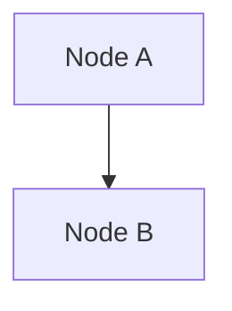

# Regenerate a study PDF

## Before you start

1. If you edited study **content**, refresh `**Edited on:**` and catalog **Status**
   dates per [AGENTS.md](../../AGENTS.md) §1 (run `Get-Date`, never guess).
2. Ensure one-time setup is done (repo root):

```powershell
pip install -r requirements.txt
cd Scripts
npm install
cd ..
```

`npm install` in `Scripts/` is **required** when the study contains ` ```mermaid `
diagrams. Without it, PDFs show raw `flowchart TD` source instead of diagrams.

## Regenerate (preferred)

```powershell
python Scripts/_regenerate_pdf.py <Slug>
```

Reads **Status:** from the markdown, runs the internal pipeline, applies Draft
watermark when appropriate, and **verifies Mermaid diagrams** in the output PDF.

## Internal pipeline (do not substitute pandoc or VS Code export)

1. `_convert_to_pdf.py` — markdown → HTML; ` ```mermaid ` → `<div class="mermaid">`
2. `_html_to_pdf.js` — render Mermaid to SVG, then Puppeteer → PDF
3. `_verify_pdf_diagrams.py` — fail if raw Mermaid syntax remains in the PDF
4. `_verify_pdf_fenced_code.py` — fail if fenced ` ```text ` / code lines are clipped in the PDF

Manual steps (debugging only):

```powershell
python Scripts/_convert_to_pdf.py Studies/<Slug>/<Slug>.md
node Scripts/_html_to_pdf.js Studies/<Slug>/<Slug>.html Draft
python Scripts/_verify_pdf_diagrams.py Studies/<Slug>/<Slug>.md Studies/<Slug>/<Slug>.pdf
python Scripts/_verify_pdf_fenced_code.py Studies/<Slug>/<Slug>.md Studies/<Slug>/<Slug>.pdf
Remove-Item Studies/<Slug>/<Slug>.html
```

## Mermaid in studies

Use standard fenced blocks:

````markdown

````

- Prefer **SVG or PNG** in the study directory for static figures referenced via ``.
- Use **Mermaid** for flowcharts built in markdown (Category Theory Explained, How To Form Self-Sustaining Organizations).
- For **wide formal specs** (Petri nets, type signatures), prefer a **markdown table** over a long ` ```text ` block — tables do not clip in PDF.
- After regeneration, verify steps catch unrendered diagrams and clipped code automatically.

## Completion check

- [ ] `Studies/<Slug>/<Slug>.pdf` updated
- [ ] No raw `flowchart TD` / `graph LR` visible in PDF when Mermaid blocks exist
- [ ] `**Edited on:**` and catalog **Last updated on** match (if content changed)
- [ ] Intermediate `.html` deleted (pipeline removes it)

## Rules

- [AGENTS.md](../../AGENTS.md) §3 — Markdown to PDF (source of truth)
- `.cursor/rules/md-to-pdf.mdc` — Cursor mirror
- `.cursor/rules/study-edited-on.mdc` — timestamps when content changed
