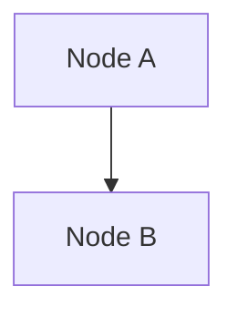

# Regenerate a study or companion-note PDF

## Scope

This covers both catalog study markdown and research/technical notes that live
beside a study, using the pipeline governed by [AGENTS.md](../../../AGENTS.md) §3:

| Want | Use |
|------|-----|
| Study PDF/HTML from `Studies/<Slug>/<Slug>.md` | `python Scripts/_regenerate_pdf.py <Slug>` |
| Unwatermarked companion-note PDF/HTML | `python Scripts/_regenerate_pdf.py Studies/<Slug>/Research-Note.md` |
| Deck slides PDF (`<Deck>.pdf`) | [update-study-presentation](../update-study-presentation/SKILL.md) — `_pptx_to_pdf.py` |
| Deck read-aloud notes PDF (`<Deck>-notes.pdf`) | [update-study-presentation](../update-study-presentation/SKILL.md) — `_build_deck_notes_pdf.py` |
| Presenter's Companion DOCX/PDF | [update-presenters-companion](../update-presenters-companion/SKILL.md) |

Companion notes and deck/companion artifacts do **not** refresh the catalog study's
`**Edited on:**` or catalog timestamps. Editing the catalog study markdown does.

## Before you start

1. Confirm you are on a **feature branch**, not the default branch — study changes always
   go through a branch + labeled pull request per [AGENTS.md](../../../AGENTS.md) §7.
2. If you edited study **content**, refresh `**Edited on:**` and catalog **Status**
   dates per [AGENTS.md](../../../AGENTS.md) §1 (run `Get-Date`, never guess).
3. Ensure one-time setup is done (repo root):

```powershell
pip install -r requirements.txt
cd Scripts
npm ci
npx puppeteer browsers install chrome
cd ..
```

The pinned Node dependencies and Chrome build are required for committed PDFs.
They provide Puppeteer, Mermaid, KaTeX, and the reproducible renderer asserted by
`Scripts/_chrome.js`.

## Regenerate (preferred)

```powershell
python Scripts/_regenerate_pdf.py <Slug>
```

Reads **Status:** from the markdown, runs the internal pipeline, applies Draft
watermark when appropriate, and runs all output verifiers. For a companion note,
pass its markdown path instead; it renders without a watermark.

## Internal pipeline (do not substitute pandoc or VS Code export)

0. `_verify_study_svgs.py` — fail if referenced SVG figures are missing, not UTF-8, or malformed XML
1. `_convert_to_pdf.py` — markdown → HTML; ` ```mermaid ` → `<div class="mermaid">`
2. `_html_to_pdf.js` — render Mermaid to SVG, then Puppeteer → PDF
3. `_pdf_metadata.py` — pin PDF dates and tagged-structure node IDs so identical markdown yields byte-identical output
4. `_verify_pdf_diagrams.py` — fail if raw Mermaid syntax remains in the PDF
5. `_verify_pdf_fenced_code.py` — fail if fenced ` ```text ` / code lines are clipped in the PDF
6. `_verify_pdf_math.py` — fail if rendered KaTeX output has no embedded KaTeX font
7. `_verify_pdf_outline.py` — fail if the PDF has no sidebar bookmarks when the markdown has two or more `##` headings

Output is **reproducible**: re-running on unchanged markdown produces a byte-identical
PDF, so a no-op regeneration leaves nothing to commit. In CI, a `study-update` PR that
touches only companion files (a deck, research notes, figures the study does not embed)
skips PDF regeneration entirely.

The pipeline **keeps** the companion `.html` (web read view with toolbar and Mermaid);
it is not deleted after PDF generation.

Manual steps (debugging only):

```powershell
python Scripts/_verify_study_svgs.py Studies/<Slug>/<Slug>.md
python Scripts/_convert_to_pdf.py Studies/<Slug>/<Slug>.md
node Scripts/_html_to_pdf.js Studies/<Slug>/<Slug>.html Draft
python Scripts/_verify_pdf_diagrams.py Studies/<Slug>/<Slug>.md Studies/<Slug>/<Slug>.pdf
python Scripts/_verify_pdf_fenced_code.py Studies/<Slug>/<Slug>.md Studies/<Slug>/<Slug>.pdf
python Scripts/_verify_pdf_math.py Studies/<Slug>/<Slug>.md Studies/<Slug>/<Slug>.pdf
python Scripts/_verify_pdf_outline.py Studies/<Slug>/<Slug>.md Studies/<Slug>/<Slug>.pdf
```

Do not delete `Studies/<Slug>/<Slug>.html` — it is the published read view.

## Study SVG figures

- Save as **UTF-8**; use numeric XML entities in `<text>` for § (`&#167;`), · (`&#183;`), — (`&#8212;`), → (`&#8594;`).
- Never paste section refs with raw Windows-1252 bytes — breaks the PDF figure.
- Verify after editing: `python Scripts/_verify_study_svgs.py Studies/<Slug>/<Slug>.md`
- Full rules: [AGENTS.md](../../../AGENTS.md) §3 — Study SVG figures

## Mermaid in studies

Use standard fenced blocks:

````markdown

```mermaid
flowchart TD
    A["Node A"] --> B["Node B"]
```
````

- Prefer **SVG or PNG** in the study directory for static figures referenced via ``.
- Use **Mermaid** for flowcharts built in markdown (Category Theory Explained, How To Form Self-Sustaining Organizations).
- For **wide formal specs** (Petri nets, type signatures), prefer a **markdown table** over a long ` ```text ` block — tables do not clip in PDF.
- After regeneration, verify steps catch unrendered diagrams and clipped code automatically.

## Completion check

- [ ] Referenced SVG figures pass `python Scripts/_verify_study_svgs.py Studies/<Slug>/<Slug>.md`
- [ ] Target markdown's sibling `.pdf` and `.html` updated
- [ ] For a catalog study, `Studies/<Slug>/<Slug>.html` remains the published read view
- [ ] No raw `flowchart TD` / `graph LR` visible in PDF when Mermaid blocks exist
- [ ] KaTeX output embeds its font when the HTML contains rendered math
- [ ] `**Edited on:**` and catalog **Last updated on** match (if content changed)
- [ ] Intermediate `.html` is the published study page (not a throwaway artifact)
- [ ] Change is on a feature branch with the correct PR label (`new-study` / `study-update` /
  `status-change`) ready to apply — not committed to `master`/`main`

## Rules

- [AGENTS.md](../../../AGENTS.md) §3 — Markdown to PDF (source of truth)
- [AGENTS.md](../../../AGENTS.md) §7 — Study submission process: branches, PR labels, templates
- `.cursor/rules/md-to-pdf.mdc` — Cursor mirror
- `.cursor/rules/study-edited-on.mdc` — timestamps when content changed
- `.cursor/rules/study-submission-process.mdc` — Cursor mirror of §7
