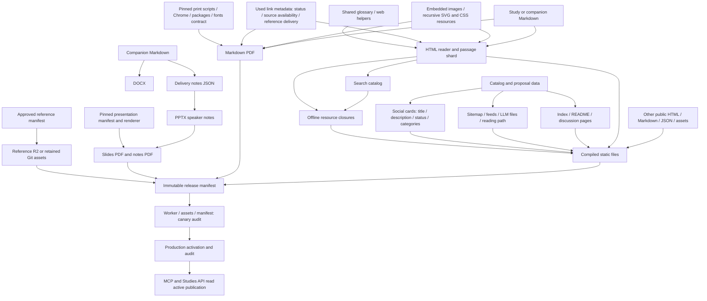

# Continuous integration and publication

The required `verify` gate reviews an immutable source commit. Preparation creates reviewable tracked files. Protected publication builds changed or missing outputs, then audits a complete coherent release. The finding cross-reference is [CI-IMPLEMENTATION.md](CI-IMPLEMENTATION.md).

The [study lifecycle matrix](STUDY-LIFECYCLE.md) records operation coverage,
companion ownership, portal attachments and acceptance evidence. Applied proposals
use `Applications/`; all local and portal paths use the shared producers/finalizer.
Companion rename/move and restoration from merged history have dedicated skills.
The required `lifecycle` job exercises the shipped portal in a local fixture only
when its inputs change and retains the report beside the other PR evidence.

## Dependency and ownership graph

`_artifact_graph.py` is the executable PDF/reference graph. Each output records its producer, consumed input hashes and selected metadata. `_publication_plan.py` compares it with the active deployment's protected build receipt. Static files are always inventoried; their compiled content hashes determine uploads independently of PDF jobs.

| Change | Regenerate | Upload |
|---|---|---|
| Study Markdown / embedded figure | That reader, passage shard and PDF; metadata fan-out when needed | Changed files and new PDF bytes |
| Unused figure / unrelated study body | No unrelated PDF | Only changed public bytes |
| Companion Markdown | Its reader/PDF; declared DOCX/notes/deck source chain must be synchronized | Changed companion outputs; deck pair if PPTX changes |
| PPTX including notes/order | Its slides and notes together | New pair and affected catalog cache-buster |
| Catalog title/description/category | Catalog fan-out and affected social card | Changed files; no PDF unless printed link behavior changes |
| Draft/Released/Planned status | Lifecycle source/reader/PDF and catalog; affected incoming links | Changed outputs; retired paths omitted from new manifest |
| Glossary / reader CSS or JS / portal UI | Required web outputs and offline closures | Changed web bytes; no PDF |
| Print pipeline / renderer / fonts contract | Affected Markdown PDFs | Verified new bytes |
| Reference source/approval | Maintainer reviews/registers exact normalized PDF bytes first | Selected approved objects |
| Unrelated CI/docs change | No document build | Source receipt advance if public bytes/runtime are unchanged |
| Worker source/bindings/config | Worker validation | Only changed active Worker fingerprints |

Ignored PDFs are never input hashes. Their absence from a checkout is expected. A missing or mismatched **published R2 object** selects repair. Deck pairs remain atomic in repair and review reuse.

Reproducibility smoke jobs use the graph's rendering-tool inputs. Ordinary PPTX changes run only their selected deck pair in review; they do not start the all-decks repeat-render smoke job. Renderer, toolchain and smoke-harness changes retain repeat-render verification. Planning helpers are excluded from renderer import traversal so they cannot pull unrelated web/Markdown builders into every deck's inputs.

## Preparation and required verification

`studies-index-check.yml` runs on every PR without path/label filtering, plus explicit bot dispatches. Its context job fetches the live PR and binds head, upstream base and lifecycle body into one verification identity. Ready sources run catalog/lifecycle/tests and document checks concurrently. Markdown and presentations have independent jobs after their shared plan. `verify` requires every applicable job and rechecks the live identity before success. Strict/up-to-date branch protection keeps the upstream base relevant at merge.

Portal submissions start as GitHub draft PRs. The context job reports Preparing while tracked artifacts are incomplete. `prepare-study.yml` has no write credentials or Cloudflare secrets. Its payload is untrusted. The default-branch `accept-prepared-study.yml` consumer validates producer, repository, head/base/intent, path and size limits, then performs one non-force commit. The writer dispatches verification idempotently. `complete-prepared-study.yml` marks ready only after that exact verification succeeds. New source/base/intent requires validation again. Local and fork contributors prepare their generated files before opening a ready PR.

Review artifacts carry input graphs and byte checksums. `_review_artifacts.py` accepts only successful allowlisted runs from a merged same-repository PR or its verified preparation parent. Other heads, forks, changed inputs, expired artifacts, unsafe ZIP paths and bad checksums cannot establish reuse. Structural PDF checks run again in the consuming checkout without rendering. Missing proofs cause builds; partial deck proofs are discarded. Combined job outputs preserve all deck provenance and reject conflicting files. The collector accepts both download layouts: `download-artifact@v7` extracts one matching bundle directly into the destination, while multiple matches have one directory per artifact. Repository-relative output paths and the inventory allowlist apply to both layouts; missing collection prefixes are never inferred.

`_ci_study_pr.py` batches global search/offline finalization and generates changed social cards. Required gates check lifecycle/catalogs, readers/search/offline, social seals, declared companion ownership, references and agent mirrors. `_run_test_suites.py` discovers every `_test_*.py` except its explicit documented hold list. Verification never pushes repairs or changes timestamps. Labels organize review; they do not disable validation.

## Protected publication and storage

Every master merge queues `publish-site.yml`; token-created proposal merges dispatch it explicitly. Publication reads `/.well-known/publication.json` and its immutable build receipt. Failed reads fail closed. The previous push diff and an Actions cache are not evidence of live state. The plan explains build/reuse per output. Empty families skip renderer jobs and PDF transfers. Matching reviewed artifacts can satisfy builds. Other Markdown builds use a protected cache checked against actual host fonts/runtime; presentations assert their pinned renderer. One master validation job checks the exact candidate.

| R2 key | Ownership |
|---|---|
| `site/objects/<sha256>` | Immutable own-site bytes |
| `site/assets/<public-path>/<sha256>.json` | Retained path/MIME binding for an asset |
| `site/releases/<revision>.json` | Content manifest without mutable source/runtime provenance |
| `site/builds/<sha256>.json` | Verified input/output receipt embedded in the active marker |
| `site/source-deployments/<sourceSha>/<version>.json` | Immutable deployment provenance |

References retain their separate manifest/bucket or Git storage. Large retained reference files use bounded static-asset segments. Unchanged generated PDFs use verified R2 records without downloading their bodies into build artifacts. The publisher independently reloads the protected receipt, checks hash/size metadata, stages objects, then writes the immutable content manifest and receipt. Partial staging cannot change production. No normal publication deletes objects or changes routes.

Assets have their own SHA-256 URLs; CSS rewrites only dependency URLs. Canonical HTML redirects to `?r=<revision>`. A shared navigation script carries that revision into navigation and data requests without embedding the release hash in every file. Live dashboard links retain the separately verified publication revision. Offline bundles permit revision-bound documents plus independently hashed assets, verifying checksums for both. Historical assets require matching path/MIME records.

The publisher stages `amd-site-canary`, audits all release URLs (full checksums for documents, size for other assets, including hashed delivery), rechecks the active state and activates production. Production audit failure restores the prior version. Source-pointer-only updates require unchanged content **and** delivery runtime/bindings, and still verify the exact marker. Runtime changes take full canary/public audits. A → B → A content changes reuse A's manifest with separate newer source provenance.

## Worker ownership, rollout and recovery

Cloudflare control-plane reads through `_cloudflare_performance._api_request` retry
connection failures, timeouts, HTTP 429 and selected transient 5xx responses up to
three attempts with backoff. Writes are single-attempt to avoid replaying a change
whose response was lost. Permanent API errors still fail immediately.

`api-synthetics.yml` runs 13 standard-library-only production checks, including MCP
search tool execution and database-backed discussion statistics reads. Empty
discussion tables are healthy; missing response fields and MCP tool errors fail.
These supplement configuration readiness and do not exercise authenticated writes
or email delivery. Run `python -S Scripts/_api_synthetics.py` locally.

An independently scheduled local Codex follow-up checks the latest successful
`master` monitoring run hourly and alerts after three hours without success. It
reports query failures as unknown visibility and stays quiet on unchanged states.
This operational automation is configured outside the repository and depends on
the Codex host being available; it is not an always-on hosted uptime service.

Each API/discovery Worker compares its executable/configuration fingerprint with its **active Cloudflare version annotation**, including after rollback. Frontend changes can run compatibility tests without uploading unchanged backends. Shared headers and API edge policy belong only to serialized `edge-policy.yml`.

The MCP Worker reads the active marker and revision-pinned files through the public site Worker. Its Wrangler configuration is also the API uploader's runtime contract: `cache_option_enabled` permits uncached marker requests, and `global_fetch_strictly_public` makes same-zone fetches reach Worker routes instead of bypassing them to the old origin. The required MCP configuration check rejects either missing capability. Node fetch mocks cannot verify Cloudflare routing; changes to this contract also need a same-zone edge canary that exercises catalog, Markdown, glossary, reading-path and MCP reads before promotion.

The first publication after migration has no prior build receipt. Generated PDFs need a verified reviewed artifact or cold build; approved R2 references with matching metadata are reused immediately. That deployment establishes the durable baseline used by later merges, including after failed or superseded runs. Stable rendering contracts are declared in `Scripts/render-contract.json`; the local render cache additionally records actual runtime/font bytes. Renderer or font changes intended for publication must update the contract in a new commit.

Retry a failed publication for the intended master SHA. `force_rebuild=true` on the publication dispatch bypasses review/cache reuse. It does not waive byte checks, reference approval or canary gates. Different bytes for an already published source require a new pinned-contract commit. Rollback uses `_publish_site_release.py --rollback <retained-revision>` to activate a retained complete deployment; failed rollback auditing restores the previous version.

Proposal approval registers Planned metadata with no public reader/PDF. Bootstrap rechecks open/approved state and uses exact-SHA verification and merge. It does not wait for Pages. Proposal issue reconciliation runs independently of publication. Closed/declined issue #420 must not be used as a fixture.
