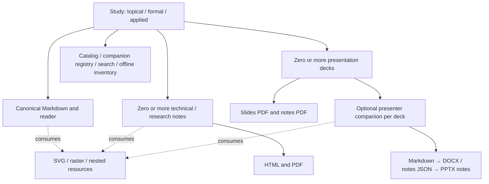

# Study lifecycle coverage and acceptance

Updated 10 September 2026. The implementation extends the shared finalizer and
companion deletion work merged in #461 and #462. [CI.md](CI.md) describes the
publication graph; [CI-IMPLEMENTATION.md](CI-IMPLEMENTATION.md) retains the wider
CI follow-ups. A passing local fixture is not evidence of a production deployment.

## Ownership and deletion

Retiring a complete study removes its directory, deck/presenter declarations and
catalog/proposal registrations. Removing a deck removes that deck's PDF pair and
its linked presenter chain. Removing a presenter alone preserves the deck and
its existing speaker notes. Removing a note removes its own Markdown/HTML/PDF.
Companion deletion preserves the parent's canonical document, state and dates.
Loose figures are preserved because other documents may share them. Removing the
last deck, including the last deck in the repository, leaves a valid empty
inventory and removes or hides its landing-page Slides links.

These are changes to the current published inventory. Routine lifecycle work
does not purge R2 objects or retained releases. Withdrawal and garbage collection
remain separate policy work in R7.

## Supported operations

| Operation | Shared scripts and skills | Portal support |
|---|---|---|
| Propose / register Topical, Formal or Applied | `_bootstrap_proposal_study.py`, `_add_study.py --formal/--applied`; `add-study` | All three collections; first drafts and revisions follow the approved collection |
| Planned → Draft; content update | `_add_study.py`, `_regenerate_pdf.py`; `manage-studies` | First draft and source update, with optional local figures |
| Draft ↔ Released | `_set_study_status.py`; `set-study-status` | Status action; same-state requests do not create redundant updates |
| Retire study or Planned placeholder | `_remove_study.py`; `remove-study` | Whole-study deletion for a registered document; Planned cleanup is maintainer work |
| Rename study / display title | `_rename_study.py`; `rename-study` | Maintainer workflow |
| Add/update one or more decks | `_build_presentations.py`; add/update presentation skills | PPTX uploads; optionally include presenter Markdown |
| Add/update presenter for an existing deck | `_build_presenters_companion.py`, `_sync_pptx_speaker_notes.py`; `update-presenters-companion` | Presenter Markdown with explicit same-study deck ownership |
| Add/update technical or research notes | `_regenerate_pdf.py <path>`; `add-technical-note`, `regenerate-study-pdf` | Markdown with SVG/raster attachments |
| Remove selected notes/decks/presenters | `_remove_study_companions.py`; `remove-study-companions` | Individual or bulk companion selection, each with its own source version |
| Rename/move an individual companion | `_relocate_study_companion.py`; `relocate-study-companion` | Maintainer workflow; deck ID remains stable and its presenter follows a cross-study move |
| Restore a retired study or companion | `_restore_study.py`; `restore-study` | Maintainer workflow from a full commit SHA already merged into master |

Multiple additions/updates can use successive local commands in one study PR.
Portal uploads contain one primary Markdown/PPTX plus its attachments; further
independent companions use subsequent PRs, respecting the existing one-open-PR
guard. A presenter belongs to one deck; moving it to another study requires
moving its owning deck. Existing standalone presenter ownership cannot be
silently reassigned through an upload.

Restoration preflights paths, existing bytes, catalog/proposal identity and
ownership. Whole-study restoration preserves the historical canonical source
and catalog state; the PR records `Operation: restore-study` and
`Restore from: <full merged SHA>`. Changes to the restored argument belong in a
later update. Restored content uses current renderer contracts. Relocations
repair local Markdown links; a repaired canonical study link refreshes that
study's timestamp and requires its normal targeted render.

## Regeneration and publication

All paths finish through `_finalize_study_artifacts.py` and the same required
checks as CI. A missing ignored PDF is not itself a regeneration request.

| Changed input | Work selected |
|---|---|
| Canonical Markdown/status or embedded resource | Consuming Markdown readers/PDFs, then affected inventory |
| Note Markdown or embedded resource | Consuming note readers/PDFs; parent only if it also embeds the changed input |
| PPTX, including notes or ordering | That deck's verified slides/notes pair |
| Presenter Markdown | DOCX/notes JSON, synchronized PPTX notes, companion PDF and affected deck pair |
| Shared glossary | Reader/offline updates; no print rebuild |
| Deletion | Remove owned outputs from the current inventory; no rebuild of surviving unrelated content |
| Rename/move/restoration | Rebuild affected sources under current paths/contracts; reuse unrelated outputs |

Portal figure limits are 20 files, 2 MiB per file and 3 MiB combined attachments
before base64 encoding. Existing figures/presenter documents require their
current source SHA, including on a first-draft revision. Attachments and receipts
survive browser recovery. A stale member blocks the whole request before branch
creation. If a later upstream write fails, the existing durable receipt and
recovery branch identify the partial operation; retrying with another receipt
is not a repair procedure.

Authoring ownership declarations are committed before preparation. The trusted
writer reads data from that exact submitted commit and accepts generated
DOCX/JSON/PPTX only for its declared presenter chain. Build payloads cannot add
ownership or supply arbitrary binaries. Portal deletions remove corresponding
ownership declarations before preparation; the shared finalizer cleans the
remaining owned files using the previous inventory.

## Acceptance evidence

Run `python Scripts/_run_lifecycle_acceptance.py` with repository dependencies and
pinned Chrome. It uses disposable directories/Git histories and the shipped
portal against a localhost fixture; external browser requests are blocked.
Reports include source SHA, dirty-tree status, individual results, logs and a
screenshot under ignored `tmp/lifecycle-acceptance/`.

The required `lifecycle` job runs browser acceptance when portal, submission
Worker or harness inputs change. Python lifecycle suites are already required
through automatic test discovery; unchanged portal inputs skip browser setup.
CI retains the exact-head report for 14 days. It does not render study PDFs or
upload anything to R2 as part of these fixture tests.

| Scenario | Evidence / current status |
|---|---|
| Applied registration, Planned no-op, collection identity | `_test_lifecycle_extensions.py`; passed locally |
| Last-deck removal, independent note/presenter removal, whole-study retirement | Lifecycle/companion suites; passed locally |
| Cross-study deck move, link repair, historical restoration and conflicts | `_test_lifecycle_extensions.py`; passed locally |
| Exact source ownership authorizes only its generated binaries | Lifecycle/publication trust suites; passed locally |
| Multi-file validation, stale member, bulk canonical exclusion, manifest cleanup | `_test_submission_files.mjs`, `_test_api_worker_routes.mjs`; passed locally |
| Presenter source recovery/update, note+SVG recovery, lost-response receipt, Applied selection, bulk removal | Six `_lifecycle_browser_acceptance.js` scenarios; passed locally |
| Production lifecycle across catalog/API/HTML/PDF/dashboard | Pending post-merge deployed fixtures; record approved fixture issue/PR, source/revision and publication run |
| Already-open dashboard, saved/offline readers through deployment/disconnection | Pending deployed-revision browser matrix |
| Failed/superseded publication, rollback and forward promotion | Isolated recovery unit coverage exists; controlled deployed drill remains R2 |

After merge, first verify the site and submission Worker deployments. Then record
the remaining deployed matrix using an approved disposable study. Do not use
closed/declined issue #420. Recovery/rollback drills need a controlled window and
separate evidence; their completion is not implied by green PR fixture checks.
