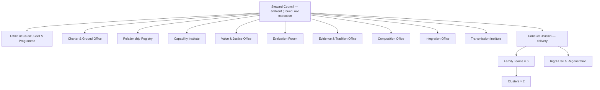
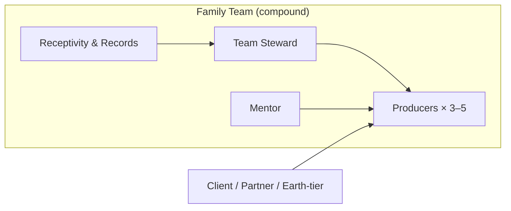

# Coexistence Company — Concrete Organizational Structure

**Author:** [AnalyticMadhyasthDarshan.org](https://github.com/raghavamohan/AnalyticMadhyasthDarshan) — a group of people studying Madhyasth Darshan philosophy. Source repository: [raghavamohan/AnalyticMadhyasthDarshan](https://github.com/raghavamohan/AnalyticMadhyasthDarshan).

**Edited on:** June 26, 2026, 9:58 PM IST
**Status:** Draft

**Basis:** This application instantiates the coexistence template and categorical architecture for a deliberate human assembly ([*The Coexistence Template*](../Studies/The-Coexistence-Template/The-Coexistence-Template.pdf) D1–D13, L1–L7, P3–P5, §8; [*Category Theory Explained*](../Studies/Category-Theory-Explained/Category-Theory-Explained.pdf) §§3.5, 6.1, 6.1.1, 6.2.1, 6.6.1, 6.7–6.9, 6.15). It is a design blueprint, not legal advice.

**Example company:** **Saha Coexistence Works** (SCW) — a knowledge-work company (research, education, and technology services) whose product is understood coexistence made useful in the world. Scale assumed: **60 members** at steady state, expandable by **compound** team formation, not mere headcount.

## 1. Design objectives

SCW is organised to meet two objectives together ([*The Coexistence Template*](../Studies/The-Coexistence-Template/The-Coexistence-Template.pdf) §8; P3–P4):

1. **Members are not instrumentalised** — nurturing (*poshan*), not net extraction; values fulfilled in relationships, not fear or temptation as the basis of order (P3; JV p. 39 cited in template §8).
2. **The company sustains across generations of members** — relationships fulfilled (L4), understanding transmitted by education-*sanskar* (L5, τ), common cause, goal, and programme (P4).

Orientation is **completeness of relationships**, not unbounded maximisation of profit, comfort, or scale ([*The Coexistence Template*](../Studies/The-Coexistence-Template/The-Coexistence-Template.pdf) §5; P6). Metric targets that chase open-ended "more" are treated as delusion pathology, not design requirements ([*Category Theory Explained*](../Studies/Category-Theory-Explained/Category-Theory-Explained.pdf) §6.5).

## 2. Assembly tiers (who is a “unit”)

| Tier | SCW name | Size (example) | Composition mode | New joint conduct? |
|------|----------|----------------|------------------|-------------------|
| **Individual** | Member | 1 person | — | — |
| **Family** | **Family Team** | 7–12 members | **Compound** (*yaugik*) | Yes — one team *dharma* and outward conduct |
| **Community** | **Cluster** | 3–5 Family Teams | **Compound** colimit | Yes — shared programme across teams |
| **Undivided society** | **Company** (SCW) | All Clusters | **Compound** + gluing | Yes — one company-facing conduct |
| **Federation** (optional) | **Alliance** | 2+ aligned companies | Soc colimit | Only if overlap values agree |

**Rule:** Adding people in the same building without fused conduct is **mixture** (*mishran*) — weaker cohesion. Scale hiring only after **L3** complementarity (need/surplus) and overlap compatibility are verified ([*Category Theory Explained*](../Studies/Category-Theory-Explained/Category-Theory-Explained.pdf) §6.9.1; [*The Coexistence Template*](../Studies/The-Coexistence-Template/The-Coexistence-Template.pdf) L3).

## 3. Top-level org chart

## 4. Functional units (departments)

Each row is a **mandatory subsystem** — the categorical analogue in [*Category Theory Explained*](../Studies/Category-Theory-Explained/Category-Theory-Explained.pdf) §6.1. The **regulation ladder** (template D2a) is distributed: ambient ground and law-as-regulation at the Steward Council and Charter offices; order *sanskar* conformance and inward discipline at Capability and Transmission; **justice** (D7) as the knowledge-order operator ρ → φ → μ → mutual satisfaction at Value & Justice and Evaluation — not a value class in the registry.

| # | Department | Template / CT role | Primary responsibility |
|---|------------|-------------------|------------------------|
| 0 | **Steward Council** | Sat — ambient ground; D2a top | Holds shared coexistence frame; stewards charter; **does not** treat members as fuel for extraction (A1–A2) |
| 1 | **Office of Cause, Goal & Programme** | P4 | Documents and guards common **cause**, **goal**, and **programme** for sustainment |
| 2 | **Charter & Ground Office** | D2, D2a law step; A3–A5 | Constitutional documents, ethical ground, conducive environment; law-as-regulation readable across units |
| 3 | **Relationship Registry** | Rel, D3 | Catalogue of **definite relationships** with expectation profiles **E(r)**; role charters; distinguishes relationship vs voluntary association |
| 4 | **Capability Institute** | Cap, D5a; §6.6.1 | Builds **cap(u) = ⟨ksh, yog, pat⟩** — capacity, ability, receptivity; gates whether φ can compose; onboarding, mentorship, study environment |
| 5 | **Value & Justice Office** | Val, D4, D7 | Maps **graded values** (six-fold taxonomy) per relationship; supports justice cycle — operator over *V*, not a member of *V* |
| 6 | **Evaluation Forum** | Eval, μ, D6 | *Jeevan*-only assessment of value delivered vs inherent; guards over/under/mis-evaluation |
| 7 | **Evidence & Tradition Office** | Ev, D13, L7; §6.15 | Conduct others can recognise (*pramanikta*); closes D13 evidence loop; records awakened tradition |
| 8 | **Composition Office** | Comp, κ, D8; L3 guard | Team formation, mergers, partnerships; **mixture vs compound** decisions; **AdmissibleComp** (L3) proof |
| 9 | **Integration Office** | Soc, L4, P6 | Glues Clusters: **overlap compatibility** on shared people, clients, and resources |
| 10 | **Transmission Institute** | Trans, τ, L5; P16 | Education-*sanskar* for every cohort; mentor lineage; succession — **evidenced** understanding (τ_ev), not rules without φ |
| 11 | **Conduct Division** | Conduct, φ | Product, service, and operations that **fulfil** external and internal relationships |
| 12 | **Right-Use & Regeneration** | P5, η | Uniform right-use across domains; resource use bounded by regeneration |

**Headcount allocation (60-member example):**

| Area | FTE | Notes |
|------|-----|-------|
| Steward Council | 5 | Part-time rotation; includes Chief Steward |
| Offices 1–10 | 18 | ~2 per office at this scale; Transmission Institute largest (4 FTE) |
| Conduct Division — Family Teams | 30 | 6 teams × 5 delivery FTE (others in Cap/Trans rotation) |
| Conduct Division — leads & glue | 4 | Cluster stewards, Conduct Division coordinator |
| Right-Use & Regeneration | 3 | Facilities, procurement, ecological accounts |
| **Total** | **60** | |

## 5. Family Team structure (compound unit)

Each **Family Team** is a compound assembly: members discard separate outward conducts and present **one team conduct** with a written **sig(team)** = ⟨form, properties, essential nature, *dharma*⟩ ([*The Coexistence Template*](../Studies/The-Coexistence-Template/The-Coexistence-Template.pdf) D1, D8).

| Role | Relationship (E(r)) | Value primarily flowing |
|------|---------------------|-------------------------|
| **Team Steward** | Stewardship ↔ team members | Protection, nurturing, resolution of blockers — not command-for-extraction |
| **Mentor** | Teacher ↔ learner | Understanding transmitted; cap(u) development |
| **Producers** | Usefulness ↔ recipient | Utility and art values + established values in delivery |
| **Receptivity & Records** | Evidence ↔ team | Documents φ; feeds Evaluation Forum, Evidence Office, and Transmission Institute |

**Team size:** 7–12. Below 7, insufficient complementarity; above 12, prefer **compound** split into two teams with L3 need/surplus between them.

## 6. Definite relationships (company-wide registry)

The Relationship Registry maintains these **knowledge-order** relationships ([*The Coexistence Template*](../Studies/The-Coexistence-Template/The-Coexistence-Template.pdf) §4; JV p. 109 cited in template §4):

| Relationship | Parties | Expectation profile (summary) | Value class |
|--------------|---------|------------------------------|-------------|
| **Stewardship** | Steward Council ↔ all members | Conducive environment; no instrumentalisation; nurturing | Established + expression |
| **Mentorship** | Mentor ↔ member | Understanding passed; cap(u) improved | Established |
| **Production** | Producer ↔ client/user | Usefulness-complementarity; purposeful-use | Utility + art + established |
| **Peer complementarity** | Family Team ↔ Family Team | Surplus meets need; no internal zero-sum competition (L2) | Utility + established |
| **Earth-tier use** | Company ↔ land, energy, materials | Right-use; expenditure ≤ regeneration (P5) | Expression |
| **Succession** | Outgoing ↔ incoming member | τ: evidenced method of composition transmitted (P16) | Established |
| **Evaluation** | Member ↔ member (via Forum) | μ on value delivered in role — *jeevan*-only (D6) | Established |

Associations (voluntary projects, hobbies) are logged separately and **do not** inherit fixed E(r) until adopted as relationships.

## 7. Graded values in practice

Template D4 names six value kinds; four operate at the knowledge order ([*The Coexistence Template*](../Studies/The-Coexistence-Template/The-Coexistence-Template.pdf) D4):

| Class | SCW examples | Where monitored |
|-------|----------------|-----------------|
| **Utility** | Quality of deliverable; usefulness of service | Value Office + client feedback |
| **Art** | Aesthetic convenience layered on usefulness | Conduct Division + client feedback |
| ***Jeevan*** | Member peace, contentment at work | Capability Institute (not KPI-targeted) |
| **Human** | Humane-living values grasped through coexistence understanding | Transmission Institute + Capability Institute |
| **Established** | Trust, respect, affection, gratitude in teams | Evaluation Forum + peer review |
| **Expression** | Right-use of body, mind, wealth; participation in orderliness | Right-Use Office + Steward Council |

**Trust** is the value deposited when fulfilment φ succeeds in a relationship (D7a). **Justice** is the **operation** on values — ρ → φ → μ → mutual satisfaction — not a poster slogan and not an entry in the value registry (D7).

## 8. Three completeness stages (milestones)

| Stage | Name | SCW milestone checklist |
|-------|------|---------------------------|
| **T1 — Constitutional** | *Gathanpurnata* | Charter ratified; all relationships in registry; Family Teams formed as **compound** units; cause/goal/programme published |
| **T2 — Activity** | *Kriyapurnata* | Programmes run; φ in daily work; cap(u) converts to effort; Clusters glued with compatible overlaps |
| **T3 — Conduct** | *Vyavaharpurnata* | Conduct evidenced externally (*pramanikta*); D13 loop closed; Transmission Institute producing awakened tradition |

T2–T3 are **awakening progression** (*jagriti-kram*) inside an already-constituted company — lifts in the knowledge order guarded by cap(u) and μ, not the same as hiring more people or material-tier κ_comp ([*Category Theory Explained*](../Studies/Category-Theory-Explained/Category-Theory-Explained.pdf) §6.2.1, §6.10; template D11).

## 9. Governance and decision rights

| Decision type | Decides | Guard |
|---------------|---------|-------|
| Cause, goal, programme | Steward Council + all-member consent | P4 |
| New **compound** team or Cluster | Composition Office + L3 proof + Integration Office | κ_comp, not κ_mix |
| Federation / alliance | Steward Council + Integration Office overlap audit | Soc colimit — P6 |
| Relationship recognition | Relationship Registry + affected parties | ρ |
| Value dispute | Evaluation Forum → Value Office | μ |
| Resource draw on nature | Right-Use Office | P5 regeneration bound |
| Member onboarding / offboarding | Transmission Institute + Mentor | τ_ev evidenced (P16) |
| Right-use claim company-wide | Must pass **naturality** — all domains upgraded together | η ([*Category Theory Explained*](../Studies/Category-Theory-Explained/Category-Theory-Explained.pdf) §6.7) |

**Chief Steward** coordinates stewards; **does not** own surplus extraction from members. Profit, where it arises, is **circularity for family needs and reinvestment in transmission**, not unbounded accumulation ([*The Coexistence Template*](../Studies/The-Coexistence-Template/The-Coexistence-Template.pdf) §8; MVD p. 265 cited there).

## 10. Operating rhythms

| Rhythm | Owner | Purpose |
|--------|-------|---------|
| **Weekly — team φ review** | Family Team | Relationships recognised? Values flowing? cap(u) blockers (pat / yog / ksh)? |
| **Monthly — Cluster glue check** | Integration Office | Shared clients/members: contradictory E(r)? |
| **Quarterly — μ forum** | Evaluation Forum | Evaluation quality; mis-evaluation correction |
| **Quarterly — evidence audit** | Evidence & Tradition Office | D13 loop; conduct manifest? pram(ev) at T3? |
| **Per cohort — transmission** | Transmission Institute | Education-*sanskar* for every new member; τ_ev not policy deck alone |
| **Annual — completeness review** | Steward Council | T1/T2/T3 progress; P4 programme still common |

## 11. Onboarding pipeline (τ)

Every new member passes through Transmission Institute — **ignorance cannot flow in tradition** ([*The Coexistence Template*](../Studies/The-Coexistence-Template/The-Coexistence-Template.pdf) §6; JV p. 49 cited there). Full membership requires a composable D13 step: evidenced conduct, not private conviction alone (L7; §6.15).

Minimum duration: **90 days** before full membership in a compound Family Team.

## 12. Growth and merger rules

**Admissible growth (L3):** New team or hire when a documented **need** in one unit complements **surplus** in another — an admissible span in **AdmissibleComp**, not arbitrary colocation ([*Category Theory Explained*](../Studies/Category-Theory-Explained/Category-Theory-Explained.pdf) §6.9.1).

**Admissible merger:** Only when Integration Office certifies:

1. **Compatible values** on all shared members and shared accounts (P6 / Soc).
2. **Compound** intent — fused conduct, new sig(assembly), not co-located silos.
3. **Transmission** plan for combined culture — τ_ev with evidenced understanding, not policy deck alone (P16; template D10).

**Reject** when: contradictory expectations on the same person; mixture presented as merger; selective right-use (η fails naturality); cap(u) insufficient for the merged E(r) profiles.

## 13. Failure diagnostic (reverse use)

| Symptom | Likely clause broken | First responder |
|---------|---------------------|-----------------|
| Culture collapse after hiring spree | κ_mix not κ_comp; τ weak | Composition + Transmission |
| High turnover | τ / L5; τ without τ_ev | Transmission Institute |
| Toxic high performer | μ skipped; values not in E(r) | Evaluation Forum |
| Green team / exploitative HR | η non-uniform right-use | Right-Use + Steward Council |
| Merger dysfunction | Soc — overlap conflict | Integration Office |
| Burnout | Extraction culture; A1–A2 inverted | Steward Council |
| Metric gaming | Maximisation pathology (§5) | Value Office |
| Good intent, truncated delivery | cap(u) blocked φ (pat / yog / ksh) | Capability Institute |
| Private conviction, no public conduct | D13 loop open; ev not closed | Evidence & Tradition |
| Rules transmitted, understanding not | τ without evidenced φ (P16) | Transmission Institute |

## 14. What this structure is not

- **Not** a conventional command hierarchy optimised for shareholder extraction.
- **Not** self-sufficient proof of coexistence — metaphysical premises remain commitments ([*The Coexistence Template*](../Studies/The-Coexistence-Template/The-Coexistence-Template.pdf) §9).
- **Not** derivable from category theory alone — L3 complementarity, cap(u), τ_ev, and saturation are **designed in** ([*Category Theory Explained*](../Studies/Category-Theory-Explained/Category-Theory-Explained.pdf) §6.11 P8–P9, P11, P16).

SCW is a **template instance**: bounded units, definite valued relationships, compound assembly by complementarity, persistence by fulfilment, transmission by education-*sanskar*, evaluation and evidence at the knowledge tier — structured so longevity and balance are **construction requirements**, not afterthoughts.

## References

### Application basis (this repository)

- [*The Coexistence Template*](../Studies/The-Coexistence-Template/The-Coexistence-Template.pdf) — formal template: units, regulation ladder (D2a–D2b), relationships, six-fold values (D4), justice operator (D7), κ, τ, L1–L7, P3–P5, D12–D13, §8 human organisations
- [*Category Theory Explained*](../Studies/Category-Theory-Explained/Category-Theory-Explained.pdf) — categorical architecture §6.1; fibred cap(u) §6.6.1; right-use §6.7; society colimit §6.8; mixture/compound §6.9; knowledge registers and self-evidencing §6.15; propositions P6, P8–P9, P11, P16
