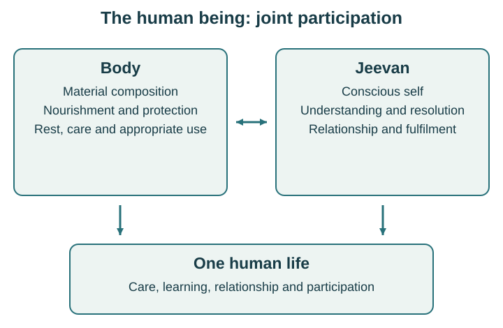
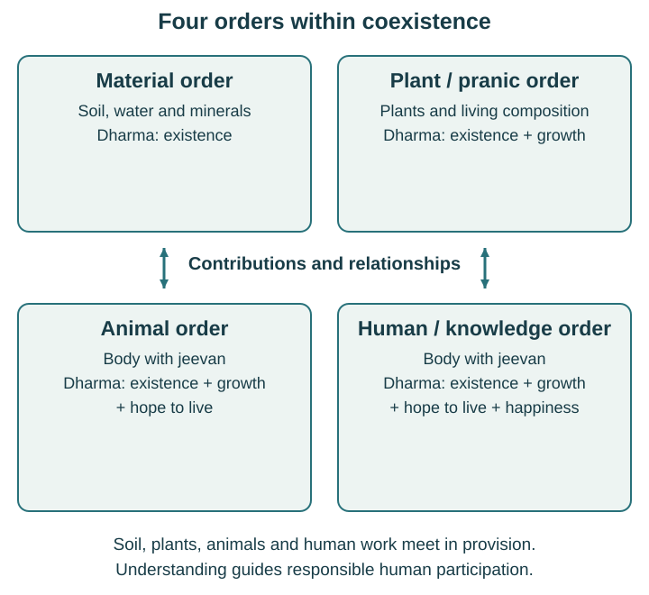
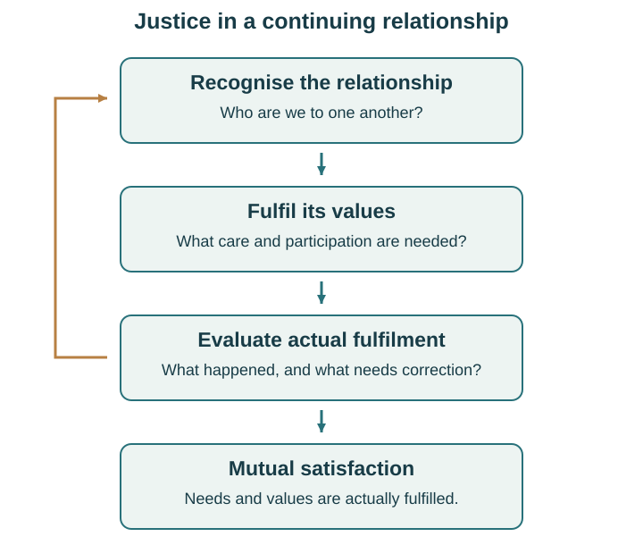
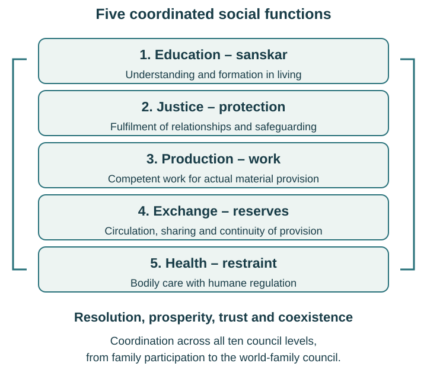

# The Human Possibility

*Understanding, Coexistence, and the Fulfilment of Life*

*An Introduction to Madhyasth Darshan*

**First manuscript draft:** October 2, 2026

## Babaji and His Wish for Humanity

**Shri A. Nagraj**

*Whom I affectionately call Babaji.*

**His wish for humanity**

> भूमि स्वर्ग हो, मानव देवता हो!
> धर्म सफल हो, नित्य शुभ हो।

> May the Earth be heaven, May humans be deities,
> May dharma prevail, May goodness be eternal.

— Shri A. Nagraj, [*Jeevan Vidya: Ek Parichay*, opening address, p. 1](https://db.madhyasth.org/books/read/107/). English translation: Rakesh Gupta, [*Jeevan Vidya: An Introduction*, p. 7](https://analyticmadhyasthdarshan.org/References/Madhyasth-Darshan/JV-Jeevan-Vidya-An-Introduction.pdf#page=8).

*Photograph: [madhyasth.org / Divya Path Sansthan](https://www.madhyasth.org/about/about-a-nagraj).*

## Preface — Understanding That Can Be Lived

We spend much of our lives learning how to earn, manage a household, care for others, and find our place in the world. Alongside these efforts, certain questions keep returning. What makes happiness dependable? What does it mean to understand another person? How much is enough? How can we live in ways that support both our own fulfilment and the lives around us?

This book introduces Madhyasth Darshan, the philosophy presented by Shri A. Nagraj, through these questions. *The Human Possibility* names the capacity to understand ourselves and the reality we belong to, fulfil our relationships, and participate consciously in humane living. What becomes possible through understanding, and what does its fulfilment require? That question connects the chapters that follow. The name Madhyasth Darshan leads into the study of mediation and orderliness in existence, and of understanding reality. Chapter 4 develops these meanings of *madhyasth* and *darshan* as part of the account itself.

Babaji wanted to see every human being live as *dev-manav*: with awakened understanding, expressed in helping others understand and in nurturing humane living together. His endeavour was to make this understanding and way of living available to everyone. The wish on the preceding page expresses this purpose. This book introduces the account of human awakening through which he proposed its fulfilment.

At its heart is the proposal that existence is coexistence. Things and beings are distinct, yet their existence is inseparable from the reality in which they are present. Human beings have the capacity to understand this and to give their participation a conscious direction. Our desire for happiness, our need for trust, and our responsibility towards nature can then be understood as parts of one life.

The pages that follow begin with familiar experiences: satisfaction in useful work, bodily needs, affection, learning, disagreement and the wish to provide for those we care about. From there, they develop a wider picture of understanding within the person, prosperity in the family, trust in society, and responsible participation with the Earth. Spiritual fulfilment belongs within this whole, finding expression in how we think, relate, work and help understanding continue. This participation also calls for practical ability, dependable conduct, material means and arrangements we sustain together.

No prior study of philosophy is assumed. Unfamiliar words are explained when they become useful. The reader is invited to consider each proposal carefully, discuss it, and examine what it would mean in living.

The hope behind this book is that a clearer understanding of life can make our everyday responsibilities more intelligible and their fulfilment more joyful. The places where this understanding matters are already before us: the people we live with, the work we undertake, and the world we share.

The family, workshop and neighbourhood scenes in this book are fictional illustrations. Meera and Ravi, Ravi's mother Kamala, their older-teen child Anu, and their neighbour Iqbal give us a setting in which questions can return and deepen. Their practical accomplishments make particular distinctions easier to understand; they do not establish the philosophy's complete claims or certify anyone's awakening. Questions at the ends of chapters invite further observation and conversation.

This first manuscript draft follows the approved book plan. Chapter notes identify primary sources and the page conventions used; the small glossary reconnects terms with their explanations. The book can be read continuously without memorising either. A reader who wants to examine a claim more closely can turn from its chapter to the corresponding note and then to the original work.

## Contents

**Part I — Beginning with Ourselves**

- [1. What Are We Really Looking For?](#1-what-are-we-really-looking-for)
- [2. The Body and the Conscious Self](#2-the-body-and-the-conscious-self)
- [3. Our Inner Life: Expectation, Thought, and Desire](#3-our-inner-life-expectation-thought-and-desire)

**Part II — Understanding the World We Belong To**

- [4. Existence Is Coexistence](#4-existence-is-coexistence)
- [5. Our Place in Nature](#5-our-place-in-nature)
- [6. From Assumption to Understanding](#6-from-assumption-to-understanding)

**Part III — Living Well with Other People**

- [7. What Makes Life Valuable?](#7-what-makes-life-valuable)
- [8. Trust, Respect, and Justice](#8-trust-respect-and-justice)
- [9. Family: Our First Place of Shared Living](#9-family-our-first-place-of-shared-living)
- [10. Freedom, Responsibility, and Character](#10-freedom-responsibility-and-character)

**Part IV — Bringing Understanding into Daily Life**

- [11. Caring for the Body](#11-caring-for-the-body)
- [12. Work, Wealth, and Having Enough](#12-work-wealth-and-having-enough)
- [13. Education for a Whole Life](#13-education-for-a-whole-life)
- [14. Beauty in What We Make and How We Live](#14-beauty-in-what-we-make-and-how-we-live)
- [15. Science and Technology with a Human Purpose](#15-science-and-technology-with-a-human-purpose)

**Part V — Building a Society We Can Trust**

- [16. Working Together with a Shared Purpose](#16-working-together-with-a-shared-purpose)
- [17. An Undivided Human Society](#17-an-undivided-human-society)
- [18. Living Responsibly with the Earth](#18-living-responsibly-with-the-earth)

**Part VI — The Continuity and Fulfilment of Life**

- [19. Life, Death, and What Continues](#19-life-death-and-what-continues)
- [20. Awakening in Everyday Life](#20-awakening-in-everyday-life)

- [A Small Guide to Essential Terms](#a-small-guide-to-essential-terms)
- [Sources and Further Reading by Chapter](#sources-and-further-reading-by-chapter)
- [Acknowledgements and Credits](#acknowledgements-and-credits)
- [वंदना](#vandana)

# Part I — Beginning with Ourselves

## 1. What Are We Really Looking For?

Meera steps back from the shelves she has finished fitting into a corner of the house. For several weeks, books, school papers and tools have shared a growing pile on the floor. Now there is a place to read, a place to put things away, and a low shelf her mother-in-law Kamala can reach without help. The joints hold. The surfaces are smooth. Meera runs her hand over the last edge and feels pleased.

Her partner Ravi brings two cups of tea. Their older-teen daughter Anu puts her books on the middle shelf, changes her mind, and rearranges them. Kamala suggests leaving a little room for the books they have yet to discover. There is laughter. Something they wanted has become possible through their work.

This household and the neighbours we shall meet are fictional. Their situations give us room to consider familiar questions without having to decide in advance who is right. They are invitations to examine living, alongside the philosophical account this book introduces.

Let Meera enjoy her accomplishment. There is no need for a disappointment to arrive and prove that achievement is empty. Useful work can be satisfying. Learning to do something well can widen a person's confidence and participation. The question opens from within that satisfaction: what has made this possible, and what would help such fulfilment continue?

### The life around an achievement

The shelves required wood, suitable tools, time and an acquired skill. They also required someone to prepare food while Meera worked, an agreement about spending, and a neighbour willing to lend a tool. Kamala offered advice about the height. Anu helped clear the corner. Some contributions can be counted in hours or money; others appear in the ease with which people asked, listened and cooperated.

Meera may have completed the final task with her own hands, but the accomplishment belongs within a life shared with others. Even the timber carries a history of growth, harvesting, transport and human labour. Looking more closely does not diminish her contribution. It helps her recognise its actual place.

The work has also left questions. The borrowed tool must be returned. The money spent may affect another purchase. Tomorrow's care arrangements still need attention. Meera would like the family to use the new space without quarrelling over whose things belong where. Completion in one area brings genuine satisfaction while other responsibilities continue.

We can recognise this pattern in finishing an examination, bringing in a harvest, learning to cook, or helping someone through a difficult week. Each accomplishment fulfils something particular. The larger question concerns the life in which such moments occur. Can we understand what makes it fulfilling, and can that understanding guide us when circumstances change?

Madhyasth Darshan takes this possibility seriously. It proposes that human beings can understand themselves, their relationships and the existence to which they belong, and can live with continuing resolution on that basis. The possibility is larger than succeeding at one task. It includes becoming capable of a dependable, mutually fulfilling way of living.

### What do we want to continue?

The tea is warm, and Meera enjoys its taste. After a time she has had enough. Another cup might be pleasant later; many more cups now would not extend the pleasure indefinitely. Bodily comfort has conditions and limits. A satisfying meal answers hunger for a time, and rest meets tiredness. These are important fulfilments, renewed as bodily requirements return.

Meera's wish to be understood by her family has a different character. She does not want their respect only until she has received a sufficient number of compliments. Nor does she wish for trust to expire when the cups are empty. She would like understanding and dependability to continue through ordinary days, disagreements and new demands.

This difference gives us an entrance to happiness, *sukh*, as it is explored in this philosophy. The question is about continuing fulfilment in the conscious person. Passing pleasures have their place within life. Their coming and going leaves open the question of the basis on which a person understands, chooses and relates.

We sometimes organise life as if the next acquisition, recognition or successful event will finally settle that question. The acquisition can be useful; recognition can acknowledge a real contribution. Yet we still need to know what the object is for, what responsibility follows success, and how to live with those around us. The need for understanding appears inside prosperity and achievement as well as in hardship.

For someone without enough food or secure shelter, provision is urgent. An inquiry into happiness has to remain answerable to that fact. The person needs actual food, a safe place to sleep, and dependable access to what bodily life requires. Calling attention to understanding adds a responsibility to address material circumstances. It cannot make missing resources appear through a change of attitude.

Our inquiry therefore holds together two questions that are often separated. What needs to be available in the world we share? What do we need to understand in order to use, sustain and share it well? A whole human life requires both questions to receive attention.

### Four connected aspirations

Consider first what happens when Meera knows why the shelves sagged in the old corner, how the new structure carries its load, and how she can repair it if necessary. In this limited matter she has moved from uncertainty towards an answer. A wider form of clarity concerns our purposes and relationships: why we seek what we seek, what another person means to us, and how fulfilment becomes possible.

Madhyasth Darshan calls resolution *samadhan*. Its scope reaches beyond knowing a useful technique. Resolution means understanding the why and how of the matters that bear upon living. It gives thought a dependable direction. A disagreement can then become something to understand and address, rather than an occasion for repeating accusations or giving up.

The family also needs assured material provision. Food, clothing, shelter, tools, care and learning all involve resources. Prosperity, *samriddhi*, concerns provision beyond assessed needs together with its assurance in family living. Later we shall examine production, skills, access, exchange and reserves more closely. Here the central point is simple: a family needs to know what is required and have dependable means of fulfilling it. Neither a cheerful feeling nor a money figure alone settles that question.

Meera could have well-made shelves and enough food while remaining afraid of exploitation at work or violence outside her door. Human fulfilment therefore includes a social aspiration: to live among people with whom trust is possible. Fearlessness, *abhay*, names this aspiration towards dependable human relations and a society in which people can participate without fear of one another. Such trust needs conduct and arrangements that deserve it. It grows through responsibilities fulfilled, fair evaluation and the protection of people when something goes wrong.

Finally, the family's provision depends upon a world they did not make. Soil, water, plants, animals and materials enter into every day. Coexistence, *sah-astitva*, directs attention to their participation within this wider reality. Human beings can understand what they receive and what their own activities contribute or disturb. Chapter 4 will develop coexistence as the philosophy's account of existence itself; responsible participation with nature is one expression of understanding that account.

Resolution, prosperity, fearlessness and coexistence form one connected inquiry. Clarity helps a family assess its needs. Dependable provision supports learning and care. Trust makes cooperation possible beyond the household. Careful participation with nature sustains the conditions of provision. Each aspiration affects the others.

These words do not divide life into four sealed compartments. A meal can involve them all: understanding the needs of those eating, having enough food, trusting the people who prepare and share it, and recognising the natural processes and work through which it became available. Their connections are already present in the situations we hope to understand.

### Considering a proposal

The fact that an account sounds encouraging is a good reason to examine it carefully. Madhyasth Darshan offers a definite explanation of reality and human fulfilment. This book asks you to consider that explanation as a proposal, to understand its terms and connections, and to examine its meaning in living.

There is room for a reader to say, “I see why this question matters, but I do not yet understand the answer.” There is also room to distinguish a claim that has become clear from one that remains uncertain. Such distinctions make study more exact. Agreement reached too quickly can leave the most important words unexplained.

Suppose Meera says that the new reading space will bring the family closer. That is a possibility, but it needs examination. Can people actually use it? Does anyone have time to sit there? Will those who need quiet be heard? Is Anu permitted to ask questions that the adults cannot answer? The furniture provides an opportunity; the way people participate determines what they fulfil through it.

Likewise, learning the word “trust” gives us a starting point. Understanding it requires us to ask what the relationship calls for and how trust is fulfilled. A person who repeats a definition while overlooking another's need still has something to learn. The demand for evidence in living is part of the inquiry.

At the same time, everyday examples have a definite reach. A family keeping a promise can illuminate dependability. That event alone cannot establish every claim about consciousness or existence. We shall distinguish what a scene helps us notice from the fuller explanation the philosophy supplies. Its account of the conscious self and its account of all-pervading reality deserve examination in their own right.

Learning also benefits from continuity. A first reading can make a question visible; a later conversation can reveal an assumption; an attempt to act can show what has not yet been understood. The aim is to become able to explain and fulfil the meaning, with increasing independence. A teacher's assurance can encourage this work, but understanding has to become the learner's own.

### Beginning where we are

Meera does not have to abandon the shelves in order to ask a philosophical question. The question concerns the accomplishment and the life around it. What did she hope to make possible? What knowledge and help did she need? What was actually fulfilled? What remains to be understood and provided for?

Perhaps the family now notices that Kamala cannot easily reach the switch beside the chair. Meera can adjust it with appropriate help. Perhaps Anu asks for time when no one interrupts her reading. That needs a shared agreement. Perhaps the borrowed tool has not been returned because its owner was away. That needs communication and follow-through. Different matters call for different forms of attention.

These ordinary adjustments show how a wish becomes more definite. “I want things to be better” can open into understood needs, appropriate work and evaluated fulfilment. The accomplishment becomes part of a way of living that can learn.

A life is wider than a household, and human circumstances differ greatly. Some readers have secure material provision and little clarity about purpose. Others know what they want to contribute but lack the resources or opportunity. Many carry both kinds of difficulty. The four aspirations help us ask connected questions without assuming that everyone begins from the same situation.

The human possibility proposed here is the capacity to understand and participate consciously in fulfilment. Its expression requires learning, competence, actual provision and dependable conduct. As this book widens from the person to the family, work, society and nature, those requirements will remain together.

For now, the completed task has opened a question worth keeping. We seek bodily support, meaningful activity and continuing fulfilment in relationship. Who is the one seeking these, and how do these different needs belong together within one human life?

**Questions to sit with**

- Recall an accomplishment that still gives you satisfaction. What understanding, material support and relationships helped make it possible?
- Where do you see resolution, prosperity, trust and participation with nature supporting one another in your present life?
- Which question about fulfilment would you want an explanation of human life to answer clearly?

## 2. The Body and the Conscious Self

The wish for a fulfilling life includes several kinds of need. To respond appropriately, we have to understand what each need is asking of us. A meal and a kept promise can both matter deeply, yet they fulfil us in different ways.

One evening Meera returns home hungry. She has spent longer than expected helping at the neighbourhood workshop and has missed lunch. Ravi has prepared food. She eats, drinks some water and begins to feel steadier. Her body needed nourishment, and something suitable has been provided.

There is another matter between them. Earlier Ravi had promised to take over Kamala's evening care so that Meera could finish her work. He did not arrive at the agreed time, and he sent no message. Meera had to find someone else at short notice. The food is welcome. The missed promise still needs attention.

Ravi could offer another serving, but Meera has eaten enough. He could explain that cooking took effort, and that may be true. Neither response yet addresses what she is trying to say. She wants him to understand what happened, acknowledge the responsibility and help establish something dependable for the next day.

### Two kinds of fulfilment

The distinction is familiar. A hungry person needs food that can nourish the body. Someone uncertain whether another will keep a commitment needs clarity about that relationship, followed by conduct that fulfils it. We can be grateful for a meal while still needing a question answered.

Madhyasth Darshan explains the human being as the joint life of a material body and a conscious self. The body is *sharir*. The conscious self is *jeevan*: the real one who knows, believes, recognises, chooses and experiences. In this account jeevan endures while bodily composition changes. The meaning and basis of that constitutional claim will become clearer when we examine nature and, later, continuity and death.

For now, the distinction helps us ask appropriate questions. What is needed for the body to function? What fulfils the conscious person? How do the two participate together in seeing, hearing, acting and relating?

The meal and the promise introduce those questions. Their difference invites us to consider an account of distinct bodily and conscious requirements. It does not, by itself, establish the complete philosophical claim that jeevan is an enduring conscious unit. That proposal includes more than the observation that people have different kinds of need.

Within the proposed account, the self is a knower and experiencer. When Meera recognises Ravi, considers what his promise meant and asks him a question, the activity of understanding belongs to jeevan. The body enables the encounter through its organs and movements. Her voice, hearing, posture and bodily condition all participate in what takes place.

The word “self” here does not mean a person's social image. Meera can be described as a worker, partner, parent or daughter-in-law; none of those descriptions alone identifies the one who understands and lives through these relationships. Nor does “jeevan” mean merely the sum of a person's current opinions. Those opinions can change through learning. The philosophy distinguishes the conscious unit from what it presently accepts.

### Caring for the body concretely

Bodily requirements call for material fulfilment in assessable quantities and conditions. Food must be available, suitable and accessible. Rest requires time and circumstances in which rest can occur. Shelter must actually protect. A person who needs assistance with movement needs usable assistance, rather than a declaration that everyone should be independent.

Assessment is important because bodies differ and change. The amount and kind of food, physical work, rest or support appropriate for one person may not suit another. A growing child, a person recovering from illness and an older adult can have different requirements. Attending to such differences is part of care. This book offers a philosophical account of care and responsibility; decisions about diagnosis and treatment also require the relevant health knowledge and competence.

The body also has a temporal rhythm. Hunger is fulfilled and returns. Clothing wears out. A tool may make work easier for years and then need repair. Material provision has to be renewed as things are used and conditions change. Having met a need once does not abolish the need for ongoing care.

Quantities therefore have a purpose. They help us judge what is sufficient for a requirement. A larger quantity is useful when the need calls for it. Beyond that point, more may add storage, waste or another burden. The question is what the material thing can fulfil for this person in these circumstances.

Meera's hunger cannot be settled by Ravi describing how much he respects her. She needs the meal. Equally, saying that “only understanding matters” while someone carries an exhausting workload would overlook bodily reality. An account of body and self asks for fitting fulfilment on both sides.

This makes provision a shared responsibility. Time for rest may depend on another person's contribution. Access to care may depend on transport, money and a wider health arrangement. The body belongs to one person's joint life, but its support reaches into family, work and society. Later chapters will examine those arrangements in detail.

### Understanding and relationship

What, then, fulfils the conscious self? Madhyasth Darshan brings together understanding of reality and the fulfilment of values in living. The person seeks clarity about what is true, how to live and what relationships call for. Trust, respect and affection are meaningful through what they recognise and fulfil between conscious persons.

These needs are not measured by portions in the way a meal is. Meera cannot ask for two kilograms of understanding to last until Friday. She can, however, ask Ravi to explain what he understood, check whether they mean the same thing, and observe what follows in their conduct. The fact that fulfilment takes a different form does not make it vague or unexaminable.

Consider respect. A costly present might express it, depending on the circumstances. Its price cannot establish that respect has been fulfilled. If the present accompanies disregard for the person's judgement or capacity, something important remains unresolved. A modest, appropriate action can express careful recognition more clearly than an expensive gesture that does not fit the need.

The same applies to reassurance. Ravi might say, “You can depend on me.” Meera wants that to be true. For the statement to become dependable, both need to understand what he has undertaken, whether he can do it, and how they will communicate if circumstances change. The promise joins meaning, ability and action.

Continuing happiness concerns this conscious life as a whole. It involves a settled basis of understanding and fulfilment, rather than an endless supply of agreeable sensations. Sensory enjoyment remains part of human living. Understanding can give it an appropriate place alongside care, work, learning and relationship.

The distinction also helps with a common confusion about attention. We may purchase an object when what we need is a conversation, or ask for reassurance when a practical shortage requires action. Neither objects nor conversation are inadequate in themselves. Their adequacy depends on the requirement being addressed. Learning to identify that requirement can change the response.

### Sensing and acting together

Body and jeevan participate jointly in ordinary activity. Meera sees a cup, recognises it as the one Kamala can hold comfortably, fills it and carries it across the room. Sight involves the bodily organ. Recognition, consideration of another's need and the purpose of the action belong to the conscious self. Bodily movement carries the cup.

The philosophy distinguishes these contributions while keeping the person whole in living. It gives the body an essential role as the means through which the self participates in the material world and expresses itself with others. Care for the body supports that participation.

A changed bodily capacity can alter how a purpose is fulfilled. If Kamala's grip becomes less steady, she may need a different cup or assistance. The purpose of drinking comfortably and participating in the meal remains intelligible. The form of help can change without changing her standing as a person.

Likewise, a person who cannot speak in the usual way may communicate by another means. A person who needs help with daily tasks can still have preferences, understanding and relationships. Human worth cannot be measured by bodily output. Recognising the conscious person helps us ask how participation can be made possible under the actual conditions.

Bodily conditions also matter in a conversation. Hunger, pain and exhaustion can make sustained attention difficult. Meera and Ravi may reasonably decide to eat and rest before examining the missed promise. That decision recognises the joint life. It becomes avoidance only if the needed conversation and correction are continually postponed.

*Figure 1. Distinct requirements, one joint human life. The diagram distinguishes the body and jeevan without depicting their relationship as a physical mechanism.*

### Returning to the promise

After eating, Meera explains that finding emergency help left her anxious and delayed someone else's work. Ravi had assumed that his promise could be treated flexibly because everyone was nearby. He now sees that others had organised their time around it.

An acknowledgement matters. He can say plainly what he undertook and what he failed to do. Meera also needs to hear what made fulfilment difficult. If Ravi's work sometimes runs late, a promise made without considering that condition may be unreliable even when he sincerely wants to help.

They look at the next evening. Ravi can take over later, while a neighbour who has already offered can help during the earlier period. Meera will be able to finish at the workshop without improvising at the last minute. They agree who will contact the neighbour and when to send a message if work changes. Kamala is part of the discussion: she can explain what she needs and what she can manage herself.

The arrangement still requires actual fulfilment. The neighbour must be available and willing. Ravi must communicate. Meera's work and rest also need a place in the plan. A pleasing conversation creates no extra hours or abilities; it can help people use the hours, abilities and relationships they actually have.

Here bodily and conscious needs come together. Kamala needs practical assistance. Ravi and Meera need reasonable rest. Each needs dependable recognition within the relationship. Understanding enables them to see those requirements together and choose appropriate means.

If the arrangement fails again, they will need to examine why. Perhaps the time estimate was unrealistic, perhaps a person agreed without understanding, or perhaps an undertaking was disregarded. These differences matter for correction. Recognising a shared capacity to understand does not require treating every present action as adequate.

### The one who can learn

The account of jeevan gives human learning a definite subject. The person who once assumed that no message was necessary can come to understand why communication matters. The change concerns what that person recognises and fulfils. It can be carried into a new situation, such as returning the borrowed tool or arranging work with a colleague.

This is one reason understanding has significance beyond a single successful response. A memorised instruction may cover yesterday's situation. Grasping the purpose allows us to examine tomorrow's changed circumstances. We become more capable of asking what is needed, what is available and what our relationships require.

The chapters ahead will develop a fuller account of conscious activity and its possibilities. For now, we can hold three questions together: what sustains the body, what fulfils the conscious self, and how their joint participation can serve a humane life. Food, care, understanding and dependable conduct all remain necessary.

The next question turns inward. When Ravi expects to be understood, Meera considers what his delay means, and both imagine a better arrangement, what activities are taking place? How might expectation, thought and desire receive a coherent direction?

**Questions to sit with**

- Think of a situation in which bodily support and understanding in a relationship were both needed. What response was appropriate to each?
- How can you tell whether an object, a reassurance or an arrangement has fulfilled the requirement it was meant to address?
- What changes when a person's bodily capacity changes while their place in the relationship continues?

## 3. Our Inner Life: Expectation, Thought, and Desire

Distinguishing bodily requirements from conscious fulfilment helps us see why the family needs both rest and a dependable care arrangement. It also brings another question into view. The people involved can experience the same evening very differently. What is happening within each of them?

On another afternoon, Ravi has promised to visit Kamala, who is spending time with a relative nearby, and bring her home. Work has been unusually demanding. He sits down for a short rest, loses track of time and does not send a message. Meera waits at home, having arranged her own work around his promise. As the delay grows, she concludes that he has once again left the responsibility to her.

Ravi expects her to understand his tiredness. Meera expects him to remember the arrangement. He considers how badly he needs to lie down; she considers how much of the day's care she has already carried. He imagines a quiet half-hour before going out. She imagines another evening in which her plans must be abandoned.

Each has a real concern. Each is also adding something to the known facts. Neither has yet asked what the other is experiencing or what help is available.

### What we expect, consider and imagine

Expectation, thought and desire are connected powers of the conscious self. Madhyasth Darshan names them *asha*, *vichar* and *ichha*. Understanding their relationship can help us examine what gives our inner activity its direction.

Expectation concerns what we look towards and anticipate as fulfilling. We hope to receive something, accomplish something, or find a relationship as we take it to be. “Hope” is a useful entrance to *asha*, though the meaning is wider than optimism about the future. Ravi expects rest to help him. Meera expects a promise to be fulfilled. Their expectations have a basis in what each presently accepts. Expectation can take bodily experience as its basis, or be grounded in realised understanding. The distinction concerns what directs it and what fulfilment it seeks.

Thought, *vichar*, includes considering, comparing, analysing and evaluating. Ravi thinks about the time needed for the journey. Meera compares his delay with earlier occasions. Both can examine alternatives. Their thought may be careful, but its conclusions depend upon what has been included and what has been assumed.

Desire, *ichha*, includes forming the image of a situation we want or take to be possible. Ravi pictures himself recovered after a rest, arriving without difficulty. Meera pictures dependable shared care, and also an evening in which that possibility has failed. Desire gives an imagined form to what might be pursued. Our capacity to imagine, *kalpanasheelta*, lets possibilities appear before we have acted upon them.

Ordinary speech blends these meanings. We say, “I think I want some help,” or “I hope we can arrange things differently.” The philosophical distinction invites closer attention to expecting, evaluating and visualising within that connected activity. It need not turn a conversation into three successive mental boxes.

Suppose Ravi learns that Meera has already changed two commitments because a helper was unavailable. His understanding of the situation changes. He may now imagine another arrangement, compare the available means differently and expect to take a more definite share. Expectation, thought and desire can receive a common direction from what has been understood.

Freedom of action makes this inquiry consequential. Ravi can send a message, ask for help, revise a promise, or continue to delay. Meera can seek clarification, make an accusation, take over silently, or explain what needs to change. Possibilities become conduct through choice and action, with effects that others also have to live with.

### Pleasantness, Bodily Benefit, and Gain

What guides our evaluation of those possibilities? One basis is sensory pleasantness: what tastes, sounds, looks or feels agreeable. Another is bodily benefit: what nourishes or protects bodily health. A third is gain: receiving an advantage in the exchange of effort and resources. The source terms are *priya*, *hita* and *labha*.

Their precise meanings matter. *Priya* concerns sensory gratification; *hita* concerns bodily nourishment and health. Ravi's exhaustion is a bodily condition, while judging the need for rest concerns bodily benefit. His wish to avoid an uncomfortable conversation is not, by itself, a definition of either term.

*Labha* has a specific acquisitive meaning here: seeking more in receipt than the contribution given. A repairer, for example, can receive rightful remuneration for useful work, tools, skill and responsibility. Inflating a charge through an invented fault pursues a different advantage. We shall follow these distinctions in the workshop later. The question is about the governing basis of evaluation, with the actual contribution and exchange examined.

Pleasantness and bodily benefit have a legitimate place in living. A comfortable chair can support rest; an enjoyable meal can also nourish. The limitation arises when these, together with personal gain, provide the entire answer to what should be done. A decision then lacks a sufficient basis for understanding another person's relationship and fulfilment.

Ravi could judge the evening only by the comfort he wants, the bodily rest he needs and the advantage of having someone else take over. Meera could likewise seek an arrangement that relieves her while overlooking his condition. Even a carefully calculated decision would then leave the relationship inadequately understood.

Madhyasth Darshan offers a humane basis of evaluation through justice, dharma and truth: *nyaya*, *dharma* and *satya*. Justice concerns the fulfilment of relationships in behaviour. Dharma here guides thought towards resolution and orderliness, through which the human aspiration for happiness can be fulfilled. Truth concerns reality as it is, understood and realised. These meanings will be developed through the next several chapters.

The whole humane group guides the whole decision. What does the relationship call for? What understanding and arrangement resolve the difficulty? What is actually the case, and how does it belong within the reality we share? These questions allow bodily benefit and enjoyment to find a place within a fuller purpose.

Rest is still necessary. Kamala still needs to come home. Meera's time still matters. Humane evaluation asks how these requirements can be understood and fulfilled together. It can lead to rest with communication and appropriate help, rather than a demand that Ravi prove his responsibility by ignoring exhaustion.

### An acceptance we still need to understand

Both Ravi and Meera would like a just, dependable relationship. Yet they disagree about what has happened and what should follow. This gives us an entrance to natural acceptance, *sahaj swikriti*.

The philosophy proposes that jeevan naturally accepts justice, dharma and truth even before their full meanings are understood. We seek a relationship that is just, a shared life that is resolved and orderly, and clarity about what is real. That orientation makes inquiry possible. It gives us a reason to examine our present interpretations and conduct.

Natural acceptance differs from a current preference. Ravi may prefer that Meera simply take over. Meera may prefer to be left alone for the rest of the evening. A preference expresses what someone presently wants; it does not establish that the proposed action fulfils the relationship. Nor does feeling certain make a judgement correct.

There is therefore a distinction between what is naturally accepted, what a person currently assumes, and what the person understands. Meera can seek justice while assuming indifference where there was exhaustion and poor communication. Ravi can seek understanding while failing to recognise the work she has already done. Their shared orientation does not settle either interpretation in advance.

Asking about the facts gives them a beginning. Understanding requires more: recognising responsibilities, considering capacities and evaluating the proposed fulfilment. Truth in the wider philosophical sense also concerns the reality within which body, self and relationship belong. A corrected detail supports inquiry without exhausting that larger meaning.

Ravi calls. Meera explains the difficulty without pretending she is unaffected. He acknowledges the delay and the missing message. They discover that the relative can accompany Kamala home if Ravi collects a needed item later. Meera gets the time she had planned; Ravi gets enough rest to act competently; the relative's assistance is requested rather than assumed.

The solution depends on willingness, ability and actual follow-through. They have learned something if they understand why the earlier arrangement failed and can take that understanding into the next one. A single corrected evening is a beginning of evidence in living.

### What gives a life its direction?

The contrast between the two bases of evaluation reaches beyond one decision. Madhyasth Darshan calls human living directed principally by bodily and sensory concerns *jeev-chetna*. Understanding-led humane living is *manav-chetna*. These terms describe orientations and their expression. They invite examination of what governs our participation; they do not measure the equal worth of persons.

Human beings have bodily concerns involving eating, sleeping, defence and sexual activity. If these occupy the whole purpose of living, our capacity to understand relationships and existence remains unfulfilled. Unbounded pursuit of sexual gratification, consumption or gain can then absorb resources and attention without supplying an adequate measure of fulfilment.

This is a question about the organising purpose of a life. Enjoying food, needing sleep, protecting someone or sustaining an intimate relationship does not by itself establish such an orientation. The concern is what governs these activities and how their consequences are understood. Bodily life can be cared for within humane understanding.

Humane living opens connected motives concerning continuity, resources and recognition. *Putreshana* directs concern for children and succeeding generations towards capable participation in family and society. *Vitteshana* concerns resources acquired and provided justly for right use. *Lokeshana* concerns recognition through which humane living and an undivided society can become more widely established.

Taken together, these motives relate family continuity, material provision and social acceptance to justice, resolution and truth. A child's education, the household's resources and recognition of useful contribution can support the same purpose. Their humane meanings become clearer through steadfastness in justice, active support of others and generous participation, qualities we shall examine in Chapter 7.

Later chapters distinguish further forms of awakened living, including changes in governing motive. For now, the central possibility is that expectation, thought and desire can be guided by understood fulfilment, with sensitivity participating within that understanding.

### Following an action into its consequences

The courtyard tap gives Ravi a smaller, practical occasion for the same inquiry. It is dripping. He wants to stop the waste and imagines a simple repair. Before beginning, he needs to find out what is wrong, whether he has the right part, and whether he can turn off the supply safely.

Activity joined with aspiration is called *karma*. The person acting, the doer, brings thought into action through effort. Its examination includes the doer, the cause, the purpose, the effect and the consequence. A useful intention gives a direction; competent diagnosis and work are still needed. Ravi may discover that the fitting is unfamiliar and ask Iqbal, the workshop repairer, for help.

After the repair, they check the joint and the water flow. If the leak has moved elsewhere, the action needs correction. If the household has been left without water, another consequence needs attention. Responsibility includes understanding and responding to what follows, including unintended effects. It does not require doing every task immediately or pretending to possess a skill one has not learned.

The care visit and the tap repair differ in their requirements. In both, the person expects something, considers means and imagines a result. What has been understood directs the choice. The result provides something to evaluate. Learning can revise both the action and the assumptions behind it.

Our inner life is therefore connected to the world in which we live. To understand what guides it fully, we have to ask about that world and our place within it. What reality includes the conscious person, the body, the water, the plant and the people with whom we share our days?

**Questions to sit with**

- In a recent misunderstanding, what did each person expect, consider and imagine? Which parts were known, and which were assumed?
- How might justice, resolution and truth guide attention to bodily needs and resources in that situation?
- What would show that a corrected decision had become understanding you could use in a changed circumstance?

# Part II — Understanding the World We Belong To

## 4. Existence Is Coexistence

Expectation, thought and desire concern possibilities within a world we already inhabit. Our choices involve other people, bodies, things and natural processes. To understand human fulfilment fully, Madhyasth Darshan asks us to understand the reality to which they all belong.

Meera and Kamala are sitting in the new reading corner. There are two chairs, a cup, books and a small stone Anu brought in from the courtyard. Light enters through a window. Air moves between the room and the passage. We can attend to each thing separately, or widen our attention to its surroundings.

The chairs and the people are distinct. They occupy particular places and have forms we can recognise. The air, although less readily seen, is also material. The room's walls give the room a boundary, but beyond that boundary are more things and beings.

Madhyasth Darshan introduces a further distinction: these active units exist inseparably in an all-pervading reality called *satta*. Satta is present within the chair's material and within the person's body, as well as around and between units. Its presence extends through material and conscious nature and beyond the room. This is the philosophy's central account of coexistence.

### Distinct units, inseparable presence

A unit, *ikai*, is a distinct, bounded reality. A stone has a definite extent. A plant has a form even while it grows and exchanges material with its surroundings. The conscious self is also a unit within this philosophical account, with its own constitution and activity. Distinctness allows us to ask what each unit is and how it participates.

Satta has a different meaning. It is all-pervading and unchanging. It does not have the bounded form by which one unit can be set beside another. The proposal is that all units are inseparably present in it. Their distinctness and their coexistence are both real.

This matters because we can otherwise imagine togetherness as something added after separate things have first existed entirely on their own. A chair can be moved into a room or carried out of it. Its relation to that room changes. Its presence in satta does not begin when it crosses the doorway or end when it leaves.

Our naming and ownership of things also occur within this reality. Calling the stone “Anu's stone” identifies a human arrangement. It can tell us something about who brought it home and who should be asked before it is moved. The stone's existence, material properties and presence in satta do not depend on that arrangement. Understanding includes being able to distinguish a relation people establish from the reality within which they establish it. This distinction will matter again when we consider value, wealth and the purposes for which things are used.

The same distinction applies to the people. Meera and Kamala can sit together, separate and meet again. Their social association has events and changing circumstances. Coexistence in the philosophical sense is the reality within which all such meetings, separations and activities occur.

We are being asked to understand two related claims together. Units retain their reality and activity. All-pervading satta is inseparable from their presence. The account does not require a person, plant or stone to lose its identity in an indistinguishable whole.

Nor can the claim be established simply by pointing to visible gaps. The room helps us notice bounded things and their surroundings. The philosophical proposal goes further by affirming an unchanging reality pervasive through the units themselves. Its meaning has to be understood and examined beyond the illustration.

### Within, around and between

Consider the stone on the shelf. We can look at its surface, turn it over and, with suitable means, examine its material composition. If it were divided, the resulting pieces would each be bounded material units. In the proposed account, every piece would remain inseparably present in satta.

Pervasiveness therefore means more than occupying an opening in the stone. It concerns the material of the stone as fully as the interval between stone and cup. If the stone were ground into smaller particles, their size would not create a point at which satta began or ceased to be present.

Air has properties and undergoes change. It can move, warm, cool and participate in other material processes. It belongs among the units and compositions of nature. Satta is the all-pervading reality within which air and other units are present. Thinking of satta as the air in a room would leave most of the proposal unexplained.

A container gives a similarly limited picture. The room contains furniture, but its walls set a boundary. Satta has no surrounding wall beyond which units could be located. It is pervasive where units are present and where no particular unit is present. Its presence is not apportioned among things like a finite supply that becomes smaller as more recipients appear.

These distinctions can initially feel unfamiliar. They ask us to move from identifying objects by their boundaries to considering the unbounded reality in which all bounded units exist. The words “within,” “around” and “between” help express the reach of the proposal; no single view of a room can display that reach in full.

### Soaked, surrounded and submerged

The source language describes nature as soaked, surrounded and submerged in satta. Together these expressions communicate inseparable presence, called *sampriktata*. Their meaning concerns pervasiveness through every unit, encompassing every unit, and the presence of the whole unit in that reality.

“Soaked” is associated with the unit's forcefulness, its being endowed with strength. “Surrounded” is associated with regulation. “Submerged” is associated with activeness. These are connected aspects of the account of units in satta. They describe how units are energised and ordered within coexistence.

The imagery is familiar, but its philosophical meaning requires care. A cloth dipped into water receives a material liquid into its pores. Satta is not another material liquid, and a unit does not pass through three operations in which it is first soaked, then surrounded and finally submerged. The three descriptions belong together to its inseparable presence.

For this reason, “energy” also needs its specific meaning here. Madhyasth Darshan distinguishes all-pervading, non-transforming reality, termed absolute energy, from the relative powers expressed in the mutuality of units. Heat, sound and other effects belong to the latter discussion. The account locates the energised activity of units in their presence in satta.

This is philosophical vocabulary with its own definitions. A measurement of electrical energy or a calculation of the force between objects answers a different, particular question about activity and relations. The philosophical claim of all-pervading satta must be understood on its stated terms; it is not supplied merely by borrowing the familiar scientific word “energy.”

“Space” is likewise used for this pervasive reality. In ordinary speech it can mean an available area or an empty place on a shelf. Here it means the all-pervading reality that is itself free from the transforming activities of units while all units are present in it. Distinguishing the meanings allows us to keep asking an exact question.

### Activity and order

Nature is active. Materials combine and separate; plants grow and decay; bodies are nourished and change; conscious persons expect, think and understand. A unit may look still to a casual observer while its material constitution and relations involve activity.

Madhyasth Darshan describes units as energised, organised in themselves and participating in a larger order. Their activity has definite relationships and consequences. Understanding a unit therefore includes understanding how it is constituted and how it acts with others.

Law, *niyam*, names the basis of regulation in activity and conduct. In the material world, understanding a relation helps us act appropriately with it. A shelf holds a load through its actual construction; a confident declaration that it is strong cannot replace adequate support. The example makes the importance of definite relations visible.

The account extends from law to regulation and balance, a connection developed in the next chapter. At the human level, orderly participation also calls for understanding. We can imagine an arrangement that does not fit the available materials or another person's requirements. Freedom of action gives us a responsibility to recognise what is real and fulfil our place accordingly.

This does not make every human action an expression of harmony. A person can exploit another, waste resources or misunderstand a relationship while remaining part of existence. The possibility of such errors is why understanding and awakened conduct matter. Coexistence as the nature of existence and humane fulfilment of participation are related questions with different demands.

The wider account includes formation, dissolution and sustainment. Things come together in particular forms, those forms change, and ordered activity continues through definite relationships. Our ordinary preference for what is convenient cannot decide the nature of every process. An account of reality must include change and dissolution as well as the forms we wish to preserve.

### The name of the philosophy

*Darshan* refers to understanding and realisation of reality: a view that becomes intelligible through what is understood. In this book, the central reality to be understood is coexistence. The inquiry reaches from existence and the conscious self into conduct that expresses this understanding.

*Madhyasth* concerns mediation and orderliness. In the account of effects, a mediative contribution sustains, alongside generative effects that assist formation and degenerative effects that assist dissolution. The meaning reaches beyond compromising between people's opinions. A halfway point between two mistakes would still need correction.

The name Madhyasth Darshan thus directs us towards understanding the mediative, all-pervading reality and the order within coexistence. Its human significance becomes clear through a person capable of resolution, just behaviour and conscious participation. The name carries a proposal about reality and the possibility of living in accord with it.

It also prepares the meaning of spiritual reality, *adhyatma*, developed near the end of the book. Study of the conscious self belongs within this wider account of all-pervading reality. The self is not understood by removing it from existence or treating other people and nature as distractions from what matters.

### Returning to the room

Meera and Kamala still sit in their chairs. Nothing in the explanation asks them to stop recognising the cup as a cup or the stone as a stone. Closer understanding makes their distinctions more exact: material things have form, constitution and effects; conscious persons can understand and evaluate; all belong within coexistence.

Kamala asks Meera to place the cup where she can reach it. That small action involves bodily movement, an object with a use, and recognition of another's need. It gives a concrete entrance to participation. The entire account of satta remains larger than this event, but the event is intelligible within the reality the philosophy describes.

Coexistence consequently has a wider meaning than cooperation between agreeable people. It includes all units, conscious and material, in inseparable presence in satta. Social cooperation, care and ecological responsibility become conscious human expressions of understanding our place in that reality.

This chapter has offered the core proposal clearly enough for its terms to be examined. A reader may now ask what kinds of units nature includes, what distinguishes a plant from an animal within this account, and how human understanding relates to their participation. The courtyard just outside the room gives us a place to begin.

**Questions to sit with**

- How would you explain the difference between a bounded unit and all-pervading satta in your own words?
- What does the room help you notice, and which parts of the philosophical proposal go beyond that observation?
- What questions arise for you about the relation between understanding existence and fulfilling a responsibility within it?

## 5. Our Place in Nature

The account of coexistence includes every unit of nature. To understand our own participation, we need to recognise some of the differences among the things and beings with which we live.

Anu takes her book into the courtyard. Beside the path are stones, soil and a pot of water. A climbing plant has reached the cord tied above it. A dog rests in the shade, then lifts its head as someone opens the gate. Meera comes out to gather vegetables for the evening meal. Each is present in the same setting; each participates in a different way.

Madhyasth Darshan brings nature into view through four orders: the material order, the plant or biological order, the animal order and the human or knowledge order. Their source names are *padarthavastha*, *pranavastha*, *jeevavastha* and *gyanavastha*. This classification asks what distinguishes their constitution, activity and fulfilment, and how they belong together.

### Four orders in one courtyard

Stones, minerals, water and metals give familiar entrances to the material order. They have definite forms and participate in physical and chemical relations. Their composition can change; materials can combine and separate. The apparent stillness of the stone on the path does not mean that material reality is devoid of activity.

Plants express the biological order. The climbing plant receives nourishment and grows. Its life involves material composition together with the organised activity of living growth. Different plants have characteristic forms and requirements. A plant is more than a supply of something humans can use; it participates within a wider setting of soil, water, other organisms and changing conditions.

Animal life brings a further distinction. The dog seeks food, rests, responds to threat and continues its life through characteristic activities. In the philosophy's account, animal life involves a material body and jeevan together. The hope to live belongs to this conscious participation. This account of sentience is part of the philosophical proposal, beyond the behaviour we can observe in the courtyard.

Human life also involves body and jeevan. Its distinctive possibility is understanding existence and fulfilling participation through that understanding. We can ask why we act as we do, examine a belief, assess the purposes of work, and learn to make our relationships dependable. “Knowledge order” names this possibility and its fulfilment; it does not claim that every human judgement already constitutes knowledge.

The orders are connected. A human body includes material and biological composition. An animal body also grows, requires nourishment and undergoes change. The distinctions identify further features without removing the conditions already involved in bodily existence.

This is one reason the courtyard is more useful than four isolated pictures. Water, soil, plants, animals and people participate together. A classification becomes meaningful when it helps us understand those relationships as well as tell the orders apart.

### Four questions about the same reality

We can deepen the inquiry by asking four connected questions about any unit. What is its form? What effects arise in its relationships? What is its characteristic functioning or contribution? What does it inseparably bear as a member of its order?

Form, *rupa*, concerns shape, volume and density. We can attend to the plant's shape and extent, the stone's form, or the shape of the vessel that holds water. Form matters in practical understanding: a narrow opening changes how a vessel can be filled, and the position of a branch affects the space around it.

Properties, *guna*, concern effects that arise in relationship. The philosophy distinguishes effects assisting formation, effects assisting dissolution, and effects sustaining activity. These are called generative, degenerative and mediative. They ask what happens through the interaction of units, rather than treating every property as a private possession unrelated to anything else.

The plant grows through relationships with its surroundings; its parts can decay; its life is sustained under definite conditions. These observations help us ask about formation, dissolution and sustainment. Understanding a particular effect requires examining the actual relation and conditions. Calling a process “natural” does not establish what it will do in every setting.

Characteristic nature, *swabhava*, concerns a unit's characteristic functioning and participation. Material nature involves continuing composition and decomposition. Plant nature includes nourishing and depleting effects. Animal nature includes differing characteristic ways of pursuing life. In humane human living, this nature is expressed through steadfastness, courage, generosity and forms of help that support another's development.

The fourth question concerns innateness, *dharma*: what cannot be separated from a unit's being in its order. Here the word has a precise philosophical meaning. It concerns existence, growth, the hope to live and happiness, as these are present cumulatively across the four orders.

The same plant has form, effects, characteristic participation and innateness. We do not finish understanding it by measuring its height, nor by assigning it a name. The four questions deepen one connected inquiry. Observation, comparison and explanation contribute together to what we come to understand.

### Innateness and the human wish for happiness

The material order has existence as its dharma. The biological order has growth or nourishment together with existence. The animal order has the hope to live together with growth and existence. The human order has happiness together with the hope to live, growth and existence.

The cumulative account matters. Human happiness does not cancel bodily nourishment. The dog seeking to live still has a body requiring growth and maintenance. A plant's growth remains a form of material existence. Each further distinction belongs within the relations already present.

Human happiness as dharma names an inseparable orientation and its fulfilment. A person can be unhappy while seeking happiness. The difficulty concerns how that aspiration becomes resolved in living. Madhyasth Darshan places its fulfilment in understanding and humane participation. The next part of the book will examine the values through which that participation becomes definite.

This use of dharma differs from identifying a religious affiliation or an externally prescribed social role. To say that happiness is human dharma is to ask about what human living seeks and how it can be fulfilled. A person's occupation or inherited status does not answer the question for them.

Innateness also differs from characteristic functioning. A material unit's existence and its activity of composition or decomposition are related, but they answer different questions. Similarly, the human aspiration for happiness and the humane qualities through which we participate should be understood together without treating them as interchangeable definitions.

*Figure 2. Four orders within coexistence. The innateness shown is cumulative in the source account; the arrangement is a map of distinctions and complementarity, not a timeline of species evolution.*

### Receiving and contributing

Meera carries vegetables inside. Before food reaches the table, many contributions have already taken place. Soil and water have supported growth. Grain and vegetables have been tended, harvested and transported. Materials have become tools, vessels and a cooking place through human work. Someone has acquired the provisions and made time to prepare them.

Animals also participate in the wider living setting. Their feeding, movement, reproduction and bodily remains belong to relationships extending beyond an immediate human use. The dog in the courtyard has its own needs and activity. Understanding nature calls for attention to these relationships even when they supply no direct benefit to the household.

Complementarity, *purakta*, concerns participation through which units contribute to one another. Plant matter returning to soil gives an accessible example of a material return supporting further processes. The nourishment received by one form can become part of the conditions for another. Nature includes continuous formation and dissolution within such relationships.

Death and predation belong within this inquiry. The account of complementarity cannot be understood by imagining a courtyard in which nothing is eaten, nothing decays and every individual form lasts forever. Particular forms change and cease; the relations through which nature continues require understanding at their appropriate scale.

Human participation adds a question about conscious purpose. We receive food, water and materials, and we can examine the effects of our work. What are we taking? What becomes of it? What do we return? Which conditions of future provision are being maintained, and which are being weakened?

The meal is therefore a good beginning for a wider inquiry. Later we shall follow actual provision and material returns more closely. Returning vegetable scraps to the soil can contribute to one process, while other costs in production, transport or waste remain. A useful contribution invites fuller understanding of the whole activity.

### Law, regulation and balance

Nature's participation is understood through law, regulation and balance: *niyam*, *niyantran* and *santulan*. Law gives the definite basis of activity. Regulation concerns how activity remains ordered in its relationships. Balance concerns fulfilled and orderly participation.

Watering the plant offers a modest entrance. A person needs to understand the plant's requirements and the actual conditions of soil, water and season. An arbitrary amount applied at an arbitrary time may fail to support it. Knowledge of the relation helps guide the work.

Human balance involves more than technically successful treatment of a plant. The water may also be needed by neighbours. Labour may have been assumed without agreement. Someone may have bought supplies through an unfair exchange. Understanding-guided participation brings these relationships into the same question of fulfilment.

Imagination and freedom make such learning necessary. Humans can alter surroundings on the basis of an idea, including an idea that neglects important conditions. We can also examine an error and change our practice. The possibility of responsible participation rests in making that understanding dependable.

The broad distinction between material and conscious nature is named *jada* and *chaitanya*. Material nature includes the changing composition of bodies and other forms. Conscious nature is jeevan, with its powers of experience and understanding. Animal and human living involve both. The four-order account and this twofold distinction answer related questions about nature from different directions.

### Development and awakening

The philosophy also asks how development and completeness are to be understood. It distinguishes a development towards constitutional completeness, *vikas-kram*, and the attainment of that completeness, *vikas*. Jeevan is the constitutionally complete unit: its constitution no longer gains or loses constituent particles.

This is a specific account of the conscious unit. Changing molecules, living cells and bodily forms belong to the account of material composition. A human body continues to receive, transform and release material. Its growth and ageing should not be confused with the constitutional completeness attributed to jeevan.

Constitutional completeness also leaves a further human question. The conscious self may be complete in constitution while its understanding remains unawakened. Possessing the capacity for conscious activity and fulfilling it through understanding are distinct matters. This is why learning has a central place in human life.

Movement towards awakening is *jagriti-kram*; awakened understanding is *jagriti*. This concerns jeevan coming to understand reality and fulfilling its conscious participation. It gives us a direction of inquiry rather than a guarantee that the passage of time alone will produce understanding.

The complete group can be held together in ordinary language: development towards a complete constitution; constitutional completeness; movement towards awakening; awakened understanding. The first distinction concerns the constitution of the unit. The second concerns what becomes understood and fulfilled in its conscious activity and living.

Three forms of completeness therefore belong in our account. Constitutional completeness, *gathan-poornata*, is already present in jeevan. Completeness of conscious activity, *kriya-poornata*, concerns the fulfilment of its powers through awakening. Completeness in conduct, *acharan-poornata*, concerns that understanding expressed dependably in living. Chapter 20 will bring their meanings together.

These are the philosophy's developmental distinctions. They do not constitute a scientific chronology from the earliest material universe to modern species. Nor do the four orders describe a compulsory itinerary in which an individual self successively becomes a stone, plant, animal and person. The differences between composition, conscious constitution and awakening remain essential to the proposal.

### Conscious participation

The family sits down to eat. They receive the results of natural processes and human work, much of it beyond their own household. Recognising this need not make the meal solemn. It can make gratitude and responsibility more intelligible.

Understanding our place in nature includes recognising what each contribution fulfils and what our actions affect. The body needs nourishment; the conscious self can understand that need, the means of fulfilling it and the relationships involved. Human freedom becomes a possibility for deliberate, sustaining participation.

We can imagine many ways to live. Which of them fulfil our relationships, and how can we know? The classifications in this chapter offer an account to study. Making its meaning our own requires more than remembering their names. It requires examining what we accept, what we understand and what our living actually demonstrates.

**Questions to sit with**

- Choose one thing or being in your surroundings. How do questions about its form, effects, characteristic participation and innateness differ?
- What natural and human contributions make an ordinary meal possible, and which of those relationships would you like to understand better?
- How would you explain the distinction between a body's changing composition, jeevan's constitutional completeness and awakening?

## 6. From Assumption to Understanding

The courtyard has given us an account of nature to consider. We have encountered claims about four orders, conscious participation and coexistence. How can an explanation that we can repeat become something we understand?

At a small study meeting, Anu says, “Existence is coexistence.” She can recall the words and the distinction between units and satta. When asked what the account changes in her understanding of a person, however, she hesitates. Does it mean that people should cooperate? That everything is useful? That things need one another? Each suggestion touches something, but none yet explains the whole meaning.

She asks the group to return to the beginning. The discussion starts with distinct units inseparably present in all-pervading satta, then turns to the conscious person who can understand and participate. Her question becomes more exact: how do the reality we belong to, the one who understands it, and the conduct that follows belong together?

### Words pointing towards meaning

A word can be familiar before its meaning is clear. A learner may recognise a phrase, agree that it sounds reasonable and use it fluently, while remaining unable to explain what it distinguishes. Study begins to become effective when the learner can follow the meaning beyond the words.

Anu first thought coexistence meant simply helping one another. She now sees that it names the nature of existence in this philosophy. Helpful conduct can express understanding of participation, but the claim also includes every material and conscious unit in satta. The new distinction gives her a more accurate question.

Listening, reflection and grasping meaning form a connected activity: *shravan*, *manan* and *arth-bodh*. Listening involves attending to the explanation being offered. Reflection includes considering its relations, asking what follows, and identifying what remains unclear. Grasping meaning is the learner's own understanding of what the explanation points towards.

A teacher can offer language, examples and clarification. The learner has to come to understand. Anu begins explaining the distinction in her own words and notices where she still falls back on a remembered phrase. That discovery is useful. It gives the next conversation a definite subject.

The study meeting returns to the meal. A vegetable's price tells them something about an exchange, but it does not explain the plant's nature or the conditions of its growth. Ownership gives someone a recognised claim within a human arrangement, but it does not create the thing's properties. Prestige attached to a person's occupation cannot establish their understanding or the fulfilment of their relationships.

Names, prices, titles and accepted opinions can be useful. Their usefulness depends on their relation to what is real. Study asks us to recognise when an explanation concerns the thing or person itself and when it concerns an assumption or convention attached to it.

### Knowing, Believing, Recognising, and Fulfilling

Madhyasth Darshan connects knowing, believing, recognising and fulfilling: *janna*, *manna*, *pehchanna* and *nirvah karna*. These terms help us examine how what is accepted becomes participation in living.

Knowing concerns understanding what is real. Believing is accepting something as so; it can rest on an assumption or on what has been understood. Recognising concerns apprehending the relationship and what it calls for. Fulfilling concerns actual participation in accord with that recognition. The connections matter because an assumed belief can guide recognition and conduct even when its basis is mistaken.

The group considers the family's care arrangement. At first, several people believe it is fair because Ravi and Meera each have a named evening responsibility. They recognise the arrangement as balanced and expect both to fulfil it. Then Meera describes the less visible work: preparing what Kamala needs, arranging transport, checking supplies and finding a substitute when someone is delayed.

Their earlier acceptance rested on an incomplete picture. The list of named visits did not include all the work. Knowing more about the circumstances changes what they can recognise as an adequate share. Belief can be corrected, responsibilities can be identified more accurately, and fulfilment can be examined in practice.

Anu notices that even the revised list needs another question: what happens when someone's capacity or availability changes? A fair arrangement has to remain responsive to actual needs and abilities. She has begun to carry the meaning beyond the particular schedule she was shown.

The four terms now belong together in one explanation. Understanding gives acceptance a sound basis; that acceptance supports recognition; recognition guides fulfilment; examination of fulfilment reveals what is understood and what still needs correction. They should not be reduced to a ritual of saying four words before acting.

Recognition and fulfilment also appear in the philosophy's account of nonhuman nature. Material and biological units participate lawfully in their relations. This use does not attribute human deliberation to a stone or plant. Human beings have the additional possibility of knowing, accepting on that basis, and consciously fulfilling their participation.

### Acceptance and reality

An accepted belief is *manyata*. When what is accepted differs from reality, the discrepancy is delusion, *bhram*. This is consequential because we act with reference to what we accept. A mistaken view of another person's responsibility can produce an arrangement that repeatedly burdens them.

The word “delusion” here is a philosophical term for taking what is not so to be so. It should not be confused with a clinical diagnosis. The inquiry concerns the relation between accepted understanding and reality, including assumptions that may be socially familiar and confidently repeated.

Truth, *satya*, concerns reality as it is. Within Madhyasth Darshan, its complete account is coexistence: distinct units inseparably present in all-pervading satta. Truthful statements about a care arrangement matter within this larger concern. They can correct a factual mistake and support just conduct, while understanding truth in its full scope asks about existence itself.

Natural acceptance helps explain why correction can be meaningful. The wish for justice, resolution and truth gives people a reason to examine an arrangement that falls short. It does not tell the group, without inquiry, how many hours each person has worked or what each can reasonably undertake. Those matters have to be understood.

A person may initially resist a correction because it unsettles an image of being fair or capable. The possibility of learning lies in being able to examine the matter without making that image the final judge. The point is to understand and fulfil the relationship more adequately. Acknowledging an error can be part of that movement.

### What is to be known?

The philosophy brings three contents of knowledge together. First is existence as coexistence: understanding units, all-pervading satta and their inseparable presence. Second is jeevan: understanding the conscious self, its powers, its continuity and the possibility of awakening. Third is humane conduct: understanding how a person fulfils relationships and participation through definite values, character and right use.

The source names are *astitva-darshan-gyan*, *jeevan-gyan* and *manaviyata-poorna-acharan-gyan*. Their length need not obscure their connection. They concern the reality we belong to, the one who can understand it, and living that expresses such understanding.

Anu can return to familiar questions in each. The courtyard asks what nature includes and how units participate. Her own expectation, thought and desire ask about the conscious knower. The care arrangement asks what fulfilment requires between people. Each question develops part of one account.

Technical knowledge also has a place. The family needs to know how to repair a tap, prepare food and arrange suitable assistance. Understanding humane purpose guides the use of such competence. Later we shall distinguish knowledge, wisdom and science as connected questions about reality, purpose and practical accomplishment.

### Study, practice and realisation

The account of learning gives a direction: study; experiment and practice; realisation and evidence. The source terms are *adhyayan*; *prayog aur abhyas*; and *anubhav aur praman*. Study makes an explanation intelligible. Experiment and practice bring what is being understood into examination and participation. Realisation and evidence concern the fulfilled understanding and its authenticity.

Practice includes more than repeating an outward action. If Anu simply takes the same task every evening, she may become efficient while leaving the reason for its allocation unexamined. When she understands the purpose, she can recognise a changed requirement and discuss an appropriate adjustment. Repetition and reflection can then support growing competence and dependable conduct together.

Experiment requires attention to what is actually demonstrated. The revised arrangement may reduce exhaustion and make care dependable. That is evidence relevant to the arrangement and to some of what the learners have understood. It does not establish every philosophical claim about the constitution of jeevan or all-pervading satta.

Several distinctions help us understand the fuller account. Direct recognition, *sakshatkar*, concerns reality becoming directly recognised in the conscious activity of chitta. Comprehension, *bodh*, concerns its understanding in buddhi. Realisation, *anubhav*, is the realisation of coexistence in atma. Evidence, *praman*, concerns authenticity, expressed and established in living. The faculty map in the notes gathers these meanings with the earlier account of inner activity.

“Direct recognition” and “realisation” here have meanings beyond looking at an object with the eyes. They concern conscious understanding of reality. An agreeable emotion, vivid image or confident statement does not by itself supply their full content.

Complete realisation has a positive meaning in this philosophy: coexistence is understood in jeevan, with continuing authenticity in the person's living. The conscious activities work in accord with that understanding. Behaviour, work, communication and participation express it dependably. Chapter 20 will examine this fulfilment more fully.

The direction of learning is therefore meaningful without becoming a timetable imposed on every encounter. Listening and reflection recur. A difficulty in practice can send a learner back to an explanation. A clearer understanding can open a new question about conduct. The source's correspondences between faculties and activities identify relationships; they do not require us to force every conversation into a scripted sequence of mental events.

### Understanding that can travel

At the next meeting, Anu is asked to consider a changed circumstance. Ravi will be away for several days. She does not merely shift his name to an empty space on the old schedule. She asks what work is involved, what Kamala needs, who is available, and whether anyone is already carrying an unnoticed burden.

She can explain why each question matters. Her understanding has begun to travel beyond the original example. She can also say what she has not established: she does not know everyone's availability yet, and she cannot assume that a neighbour's previous help is a continuing commitment.

This growing independence is an important sign of learning. The teacher's words have become questions the learner can use, meanings she can explain and responsibilities she can recognise without prompting. Their fulfilment still needs the participation of the people involved.

Evidence in the philosophy's account includes realisation, behaviour and experiment. These belong together as understanding and its expression. Developing learners can examine particular improvements carefully while continuing to study the full possibility. They need neither dismiss what has been learned nor claim complete attainment on the strength of one successful change.

The question now becomes more concrete. What exactly is fulfilled when the family cares dependably, when a tool serves its purpose, or when a person lives with resolution? What is valuable in the person, the relationship and the thing? Understanding gives us a basis for entering that question.

**Questions to sit with**

- Choose a statement you readily agree with. What can you explain about its meaning, and where would you still need clarification?
- In the care example, how did a changed understanding alter belief, recognition and fulfilment?
- What would count as evidence of learning in a changed situation, and what larger claims would remain to be examined?

# Part III — Living Well with Other People

## 7. What Makes Life Valuable?

The meal is nearly ready. Ravi brings the grain he bought on his way home, Meera finishes cooking, and Anu places a jug where Kamala can reach it without standing. Kamala notices that the younger people have begun serving everyone before sitting down themselves. She asks them to bring their plates too. The family settles around the same food, with different appetites, preferences and bodily requirements.

What is valuable here? The grain nourishes a body. The vessel holds the food. The cooked meal is easier to eat because someone knows how to prepare it. Yet this account leaves out something everyone at the table can recognise. Someone remembered another person's difficulty. Someone contributed work without having to be reminded. Someone made sure that those serving were included in the occasion. There is nourishment in the food, usefulness in the vessel, and fulfilment in the relationships. The people also experience something within themselves as they understand and participate in this shared life.

These forms of value belong together, but they have different meanings. More grain cannot take the place of respect. An affectionate declaration cannot make an empty bowl nourishing. A beautifully arranged table cannot settle an unresolved disagreement. Understanding value helps us recognise what a situation calls for and what would actually fulfil it. It also helps us appreciate what is already being fulfilled, instead of noticing our relationships only when something has gone wrong.

### Value as fulfilment

We often use the word valuable for something expensive, rare or difficult to replace. These meanings help in particular decisions, but they do not yet tell us what makes a human life valuable. The price of the grain tells the family what they paid. It does not tell them whether there is enough for everyone, whether the grower was treated justly, or whether the family recognises the people whose work made the meal possible.

In Madhyasth Darshan, value is connected with a thing or person's definite participation in relationship. To ask about value is to ask what is fulfilled through that participation. The grain has a material usefulness that must become available in suitable food. A person's contribution can involve understanding, care, skill and dependability together. The fulfilment has to be understood in its own terms. We cannot replace every question about it with a single question about money.

Follow Anu's contribution for a moment. Moving the jug is a small piece of work. The jug is useful because it holds and serves water; its handle and weight affect how easily Kamala can use it. Anu has recognised a need and acted with care. Kamala's response tells Anu something about the success of that action. If the handle is still difficult to grasp, Anu can try another vessel. The value of care remains; its present fulfilment requires attention to the actual person and object.

The same action can therefore include several kinds of value without turning them into the same thing. The material object serves a need. Relational conduct fulfils care. A humane disposition makes the young person willing to notice and respond. Understanding gives this willingness a dependable direction. The inward fulfilment belongs to the conscious self, *jeevan*, whose happiness was the question with which we began.

Human *dharma*, introduced through the four orders of nature, is happiness. Here dharma means an inseparable innateness: the human aspiration for happiness persists through our many attempts to fulfil it. Someone seeking recognition, someone trying to avoid a painful argument and someone learning to help a neighbour may all be seeking happiness. What they assume will bring it can differ greatly. The continuing aspiration does not make every attempted means successful. Understanding is needed to distinguish a fleeting attraction from a way of living that fulfils the aspiration.

### Happiness, Peace, Contentment, and Bliss

A meal can be pleasant. A celebration can be joyful. Their pleasure has its occasion and duration, and it belongs in human living. The question of continuing happiness asks what happens when the dishes have been cleared, a responsibility returns, or another person needs something inconvenient. Can the clarity and mutuality of our living continue through such changes?

Madhyasth Darshan names four connected values within jeevan: happiness, peace, contentment and bliss—*sukh–shanti–santosh–anand*. Each concerns harmony in conscious activity, with its own meaning. They describe the fulfilment of understanding in the person, rather than four strengths of the same passing mood.

Happiness, *sukh*, is connected with resolution. What one expects and selects can agree with what one understands and evaluates. Suppose Anu understands why everyone should have the opportunity to eat comfortably and willingly makes the required arrangement. There is no need to maintain an inward argument between that understanding and a contrary action. This modest example makes an agreement intelligible. The fuller human possibility is a dependable resolution expressed in just behaviour.

Peace, *shanti*, concerns resolved thought and the absence of opposition between thought and desire. A person may sincerely picture a harmonious family while continually thinking of ways to control its members. The image and the means pull in different directions. As understanding grows, the desired shared life and the thought that makes it possible become coherent. A quiet room can help someone rest; this peace concerns the conscious activity that continues even when the room becomes busy again.

Contentment, *santosh*, includes freedom from the sentiment of lacking, joined with readiness to establish provision beyond understood needs through appropriate knowledge and skill. Its connection with prosperity matters. If a household lacks food, a demand that it feel content would leave its need unfulfilled. Equally, having more goods will not settle a pursuit whose imagined requirement grows with every acquisition. Contentment joins an understood account of sufficiency with the willingness and ability to participate in its fulfilment. Chapter 12 will examine the material conditions involved.

Bliss, *anand*, concerns the harmony of comprehension and realisation in jeevan. The philosophy presents it as an enduring fulfilment in awakened understanding of coexistence. The whole of reality is no longer imagined as something fundamentally opposed to one's own being or purpose. This is a fuller claim than the happiness of a particular meal or an absorbing moment. Our scene helps us inquire into connected fulfilment; realisation has the scope developed in Chapter 6 and brought together in Chapter 20.

These four values give depth to the question of a good life. We seek more than an untroubled outward appearance. We seek conduct we can understand and stand by, thought that resolves rather than multiplies conflict, desires whose fulfilment can be recognised, and understanding that is grounded in reality. Their connection also explains why the pursuit cannot be confined to a private feeling. The person lives among other people and participates with nature. Relationships and provision are part of what understanding must comprehend and fulfil.

### The qualities through which understanding helps others

During the meal, Ravi mentions that Iqbal has taken a new learner, Leela, into the workshop. Anu has watched them together. Iqbal is careful about what he promises a customer, gives the learner time to ask questions, and insists that a completed job include checking whether the repair works. He is also learning how much explanation the newcomer needs. Working quickly himself does not automatically make him a good teacher.

Three humane qualities become visible here. A person can remain steady in justice, use their abilities to make justice available to someone else, and willingly devote their resources to another's fulfilment. Their source names are *dhirata–virata–udarata*: steadfastness, courage and generosity.

Steadfastness means firmness in justice. Iqbal does not change his account of the fault simply because a more expensive story would be profitable. Courage carries justice into participation: he uses his understanding and physical ability to make a dependable repair available. Generosity concerns the willing contribution of body, mind and wealth for another's awakening, health and prosperity. Time spent explaining a repair can be generous, as can the loan of a useful tool or material support for learning.

These are connected qualities. Firm convictions without the competence to help may leave a need unmet. Ability without justice can be used to mislead. Giving resources without understanding the recipient's situation can fail to serve them. A humane person brings steadiness, capability and generous participation into the same responsibility. The point is what the contribution enables, and whether it is actually fulfilled.

The learner raises a further question. What kind of help is needed? Sometimes the learner is ready to understand a principle but has never encountered a clear explanation. Sometimes an explanation is available but the learner needs patient preparation to become receptive to its meaning. Sometimes both are missing. Effective help attends to these differences.

The related triad *daya–kripa–karuna*, commonly rendered kindness, grace and compassion, makes these distinctions explicit. Kindness makes the needed content or means available where receptivity is present. Grace helps develop the corresponding humane receptivity where the content is available. Compassion helps provide both. Receptivity here concerns the person's capacity to receive and understand meaning; it cannot be obtained by demanding assent. The helper needs understanding of what is offered and attention to the person learning.

A practical lesson can introduce this distinction, but the philosophical purpose reaches beyond the transfer of a trade skill. Teaching contributes to the learner's development in understanding and responsible living. If Iqbal explains the mechanism while encouraging contempt for customers, the instruction has left a central human requirement unfulfilled. If he speaks warmly but keeps the learner dependent by withholding what they could understand, the support is incomplete. Help should make another person's growing capacity possible.

Steadfastness, courage, generosity, kindness, grace and compassion thus belong in one picture of humane qualities. They concern how understanding moves towards other people. The person remains committed to justice, makes it available through ability, shares the means of fulfilment, and recognises what another's development requires. Later chapters will return to these meanings through work, education and organisation.

### Things, relationships and the whole of living

The complete value account contains thirty positions: four jeevan values, six humane qualities, nine established relationship values, nine corresponding expressed values, and two values of useful objects. The number organises a connected account of living. It helps us distinguish what is experienced within jeevan, what gives humane direction to participation, what is fulfilled between people, and what work establishes in material things.

The relationship values include trust, respect, affection, care, guidance, reverence, the willing emulation of excellence, gratitude and love. Their expressions make them available in conduct. We will explore these pairs through the family's care arrangement in the next chapter. An inward claim of respect needs an appropriate expression, just as a courteous expression needs the understanding of respect that makes it dependable.

The two object values are usefulness and aesthetic refinement, *upayogita–kala*. The vessel must fulfil its purpose, and thoughtful making can refine that fulfilment through ease, convenience and beauty. Chapter 14 will take this further with an ordinary cup. Here the connection is already present: material means acquire their human purpose through the needs and relationships they serve.

Later that week, the family celebrates Kamala's birthday. Anu gives her a book she has wanted to read, choosing an edition with print she can comfortably follow. Its modest price does not measure the fulfilment of care. Nor would an expensive gift necessarily fail to express it. The relevant questions concern understanding, usefulness, the manner of giving and the relationship being fulfilled. A celebration gives these meanings a visible occasion.

When the occasion ends, its possibilities remain. Care can continue in tomorrow's meal. Gratitude can continue in the willingness to learn from help received. Generosity can continue in making time and means available. Happiness can deepen as these contributions become understood and dependable. A valuable life is available for inquiry in the ways we already live, and its fuller fulfilment calls us towards greater understanding of ourselves, each other and the existence we share.

**Questions to sit with**

1. Choose one ordinary contribution to your household. What does it fulfil materially, relationally and within the people participating?
2. When you offer help, how do you discover whether someone needs an explanation, preparation to understand it, or both?
3. What would allow a satisfaction you value to continue beyond the occasion on which you first felt it?

## 8. Trust, Respect, and Justice

For several years, Meera, Ravi and Kamala have arranged their days with little discussion. Each knows roughly when the others will return, what work needs doing and who will prepare the evening meal. Kamala has often been the person who notices a missing provision or remembers that a neighbour needs a visit. The trust among them has grown through many such ordinary acts.

Now her circumstances are changing. Standing for long periods has become difficult, and she needs help with some journeys. The family wishes to continue sharing life well. They sit together to consider what should change. Kamala explains what she can comfortably do and where assistance would help. Ravi describes his work hours; Meera describes hers. Anu offers to take responsibility for a regular errand and asks for enough notice when plans change.

The discussion is about more than dividing tasks. They want care to be dependable, each person's contribution to be understood, and everyone to retain a voice. Kamala is a participant in this decision. She sometimes contributes perspective drawn from experience, sometimes practical work, and sometimes simply the presence of a family member they love. Her claim to care does not depend on demonstrating a useful contribution in return.

What would make their arrangement just? A schedule can be neat while its burdens are unfair. Affection can be sincere while necessary help does not arrive. Madhyasth Darshan develops justice through four connected components: recognising the relationship, fulfilling its values, evaluating the fulfilment, and mutual satisfaction. The family's continuing life gives us a way to understand each.

### Recognising what the relationship calls for

Recognition begins with the person and the relationship. Kamala is Ravi's mother and part of the household's shared life. Meera and Ravi are partners with commitments to one another. Anu is growing in ability and responsibility. These facts matter because they help identify what care, guidance, trust and respect call for. Naming the roles is a beginning; understanding their purposes gives them content.

For example, the family can agree that Kamala needs assistance with a journey while overlooking that she also wants to decide when to make it. Recognising bodily difficulty alone has missed the conscious person who can consider and choose. Equally, recognising her independence cannot remove the actual difficulty. A dependable arrangement brings both into view.

Respect, *samman*, involves appropriate recognition and evaluation of the person, including their personality, abilities and present fulfilment. Over-evaluation attributes an understanding or ability someone does not possess. Under-evaluation fails to recognise what they can understand or contribute. Mis-evaluation uses an inappropriate basis, such as treating wealth, age or a social label as a complete measure of the person. Each can lead to unsuitable expectations.

Anu may be entirely capable of an errand but still need help arranging transport. Kamala may need assistance walking while understanding the household finances very well. Ravi's technical confidence does not qualify him to decide every matter for the family. Right evaluation makes differences of competence visible without turning them into differences of human worth. It also remains open to correction as people learn and circumstances change.

Respect finds expression in cordial participation, *sauhardrata*: what is understood and accepted is presented faithfully in the relationship. If Ravi appreciates Meera's care but leaves her out of the discussion, the appreciation has not found an adequate expression. Asking, listening, stating one's own understanding clearly and acknowledging another's contribution are ways its meaning becomes available in conduct.

### Trust made dependable

Trust, *vishwas*, has a place in every relationship. Its fuller meaning includes fulfilment of values, understanding of orderliness, and communicating resolution. It becomes expressed through *saujanyata*—cooperation, participation and complementarity. Each person contributes in a way that helps the others fulfil the shared responsibility.

This makes trust something we can examine. Ravi agrees to accompany Kamala on a certain day. He understands why it matters, checks his availability and communicates any difficulty early. Kamala can then make her plans with confidence. If Ravi discovers a conflict, he helps arrange a dependable alternative. Cooperative conduct gives the commitment practical weight.

We need several distinctions when that conduct fails. There is the general human wish for happiness. There is the particular intention with which someone acts. There is the competence needed for a task, and there is what actually happened. These influence one another, but none can simply stand in for all the others. A wish for happiness does not prove that a particular intention was harmless. An assurance of goodwill does not establish competence. Competence does not guarantee that a responsibility was fulfilled on this occasion.

Suppose Ravi misses a promise because he made two incompatible commitments. He says, “I meant to come.” When Meera previously missed something important to him, he said, “You let me down.” The family can recognise the asymmetry. His own explanation begins with intention, while his judgement of her begins with the result. Understanding requires attending to both for both people. It also requires checking the facts instead of guessing the other's motive.

An apology can acknowledge the failure and its effects. Repair asks what can now be fulfilled and what will make the next commitment dependable. Perhaps Ravi needs to consult his calendar before promising, communicate a change earlier, or accept a smaller responsibility. Trust grows as understanding, truthful communication and reliable action agree over time. Where conduct remains harmful or unreliable, responsibility and protection require appropriate limits. Human potential gives learning a basis; present evidence guides what can safely be entrusted now.

### The values within care

Care, *mamata*, is nurturing and protection with a strong sense of belonging. Its expressed counterpart is generosity, *udarata*: willingly making body, mind and material resources available for another's awakening, bodily health and prosperity. The person who cooks, explains a confusing letter or makes time for a necessary journey can express care in different ways. What matters is the need and its understood fulfilment.

Guidance, *vatsalya*, continues nurturing and protection towards comprehensive resolution. It asks how another person can grow in understanding and participation. Kamala can guide Anu through explaining why care involves listening to the recipient; Anu can help Kamala learn a newer communication tool. Their capacities differ in these particular matters. The possibility of helping understanding is present in both directions.

Guidance is paired with *sahajata*, naturalness or unforced coherence: clarity and authenticity, with agreement among thought, conduct and realised meaning. A person's guidance becomes confusing if their words commend responsibility while their actions consistently evade it. When explanation and example agree, learning becomes easier. The learner has something intelligible to examine.

Affection, *sneh*, concerns the absence of opposition in just behaviour and the continuity of willingly meeting in satisfaction. Its expression, *nishtha*, is dedication to the understood purpose and its fulfilment. Affection supports continued effort when a responsibility becomes inconvenient. It also permits a disagreement to be addressed. Meera can care for Ravi and clearly tell him that an arrangement is exhausting her. The possibility of resolving that difficulty is part of their relationship.

Gratitude, *kritagyata*, acknowledges help received towards development and awakening. Anu may recognise that Kamala's patient explanations have changed how she thinks about care. This acknowledgement can find expression in *saumyata*, willing self-restraint and civility. The learner need not display self-importance to conceal having received help. Nor does gratitude create a duty to agree with every future opinion of the helper. Its meaning lies in recognising the actual contribution and responding appropriately.

There is a related but distinct value in willingly embracing an example of excellence. Seeing Iqbal combine skill with fairness, Anu may wish to learn that way of working. This is *gaurav*, often translated as glory. Its source meaning concerns freely accepted emulation. Its expression, *saralata*, is simplicity of conduct without entanglement or tension. A person's fame alone does not supply the relevant excellence. What draws emulation is something understood and worth learning.

Reverence, *shraddha*, concerns movement towards awakening, authenticity and complete conduct. Its paired expression, *pujyata*, is active participation in qualitative development and awakening. Reverence gives learning a serious direction. It can express itself in the effort to understand a teacher's explanation, examine its meaning and fulfil what has become clear. Unquestioning assent would leave this work undone.

Love, *prem*, is the complete relationship value in this account. It concerns realisation of completeness and the combined expression of kindness, grace and compassion. Its expression, *ananyata*, is complementary participation among human beings and with the rest of nature, with continuity of authenticity and resolution. The family offers an intimate place to learn this direction, and its fuller scope extends beyond those one already knows. The nine relationship values make particular responsibilities intelligible within that widening human possibility.

### Fulfilment, evaluation and mutual satisfaction

The family puts its new arrangement into practice. Some responsibilities are shared by time, others by ability. Kamala chooses which tasks she wants to retain. Ravi and Meera take turns with journeys, and Anu's contribution is limited enough to remain compatible with learning and rest. They agree to revisit the arrangement after living with it.

*Figure 3. Justice in a continuing relationship. Evaluation can renew recognition and fulfilment; mutual satisfaction concerns actual fulfilment rather than agreement alone.*

Recall the difficulty their earlier review revealed in Chapter 6. Meera had been coordinating changes between the others, remembering appointments and making last-minute arrangements. These tasks never appeared beside her name. Kamala had received the care she needed, but Meera had become tired and resentful. The arrangement's apparent success depended on an unrecognised contribution. We can now understand that discovery through the complete account of justice.

Evaluation, *mulyankan*, brings that contribution into view. The family asks what each relationship required, what was actually done, and where fulfilment was incomplete. Meera's exhaustion is information about their arrangement. Listening to it helps them correct a shared responsibility. They redistribute coordination, simplify unnecessary tasks and make changes known to everyone who depends on them.

Mutual satisfaction, *ubhay-tripti*, concerns fulfilled values recognised in the relationship. It includes the people giving care as well as the person receiving it. Agreement obtained because someone feels unable to object does not establish it. Neither does everyone's temporary relief after a difficult conversation. The revised arrangement has to be lived, and the family needs to remain attentive to whether it fulfils the responsibilities they have recognised.

The four components of justice belong to one continuing activity. Recognition gives fulfilment its direction. Actual conduct supplies the material for evaluation. Evaluation can disclose a mistaken understanding, a missing skill or an unsuitable allocation of resources. Correction then makes mutual satisfaction possible. A family may return to this inquiry many times as its members' needs and abilities change.

Dependable care need not become a meeting about philosophy every evening. As understanding grows, much of the participation becomes natural. People know why a task matters and notice when its conditions change. They can explain a decision, acknowledge an error and trust another person to take responsibility. Justice gives ordinary life this possibility of increasing ease: the ease of living in relationships whose meanings we understand and whose fulfilment we can recognise together.

**Questions to sit with**

1. In a relationship you value, what responsibility is well fulfilled but seldom acknowledged?
2. How do you distinguish a person's wish for happiness, a particular intention, practical competence and actual fulfilment when a promise is missed?
3. What would mutual satisfaction require from an arrangement in which one person's needs have changed?

## 9. Family: Our First Place of Shared Living

Anu puts Kamala's cup and plate at the nearer end of the table. This used to be a task assigned by an adult. Now Anu notices when the arrangement needs changing. One evening a visitor takes the nearby chair, and Anu quietly explains why it helps Kamala to sit there. The visitor moves, and the meal proceeds without anyone being made to feel unwelcome.

Later Anu asks Meera why the family did not simply make a permanent rule about the chair. Meera points out that the purpose is comfortable participation. If another arrangement serves that purpose better, they can use it. Remembering the rule is useful; understanding the purpose makes thoughtful adjustment possible. Anu has begun to carry a responsibility whose meaning can be explained and applied in a changed situation.

Family life contains many such opportunities. A young person encounters food, language, money, affection, disappointment, work and decision-making long before these become classroom topics. They see what adults remember, whom they listen to, how they treat someone with less power, and whether they acknowledge a mistake. Through this shared life, the meaning of relationships becomes available for learning.

This is also why family has a wider significance. The child who learns to recognise another person's need may later bring that understanding into a workshop, school or public responsibility. The family is a beginning of human belonging, and its fulfilment includes preparing people for participation beyond itself.

### Children and the continuity of humane living

Parents often ask what they want for their children. Security, capability, happiness and a good future are familiar answers. Each invites a further question. What kind of capability will enable a person to understand their life, fulfil relationships, provide for needs and contribute without exploiting others? What would make their future good for those who live and work with them as well?

The humane motive *putreshana* includes progeny and confidence in the continuation of lineage, together with the wish for people's capable participation in family and social order. Children and generational continuity remain central to this meaning. Its fulfilment calls for more than having offspring or obtaining an heir. It includes the development of persons who can understand, work, care, and participate responsibly.

Anu's worth is already present as a human being. It is not waiting to be awarded after an examination result, a successful career or useful service to the family. The parental responsibility is to support development. If Ravi treats Anu mainly as a future source of prestige or as a guarantee of his own security, the relationship's purpose narrows around his imagined benefit. Understanding the child as a conscious person allows guidance, listening and increasing responsibility to belong together.

Putreshana is connected with the other two humane motives introduced earlier. *Vitteshana* concerns resources acquired through justice for right use. Such resources support nourishment, shelter, education and participation. *Lokeshana* concerns recognition directed by justice and dharma towards an undivided society. Dependable work and understanding can gain recognition that helps their humane purpose become more widely available. Continuity, provision and recognition thus support one another when the purpose of each is understood.

The family's care for Kamala also belongs in this continuity. Anu learns from receiving care and from participating in it. Kamala can acknowledge where she once misunderstood something and explain what she later learned. The younger person then encounters tradition as something whose meaning can be understood and carried forward. A practice becomes valuable through its fulfilment; its age alone cannot decide that question.

### Responsibilities that grow with capacity

Care, protection and education belong together in the parent–child relationship. During infancy, adults undertake nearly everything necessary for the child's bodily life. As the child develops, explanation and participation become increasingly possible. Guidance helps the learner connect freedom with consequences, practical ability and relationships. Responsibility grows with capacity, supported by the adults who remain responsible for the conditions of learning.

Anu can now shop for a familiar household item. Learning the task includes knowing what is needed, checking that it is suitable and accounting for the money. It also includes how to speak with the seller, what to do if the right item is unavailable and how to acknowledge an error. The family's aim is a person who can understand and act, including when an adult is absent. Constantly taking over prevents that growth; assigning an unsupported task beyond present ability can also obstruct it.

Children have complementary responsibilities appropriate to their developing capacities. They can receive guidance attentively, ask about what they do not understand, recognise care already received, and contribute to shared living. Gratitude can become increasingly thoughtful. It need not take the form of unquestioning obedience or lifelong surrender of judgement. A relationship directed towards understanding must give room for understanding to become the younger person's own.

The source account of parenthood retains birth and lineage while explaining nurturing, protection, education and preparation for useful work. These responsibilities are also visible in an adoptive family. Consider a separate household in which two adults have adopted a child and have undertaken continuing parental care. They arrange nourishment, protection, schooling, affection and the time needed to understand the child's experience. The example shows how enduring parental responsibility can be fulfilled in an adoptive setting. It does not turn every adult who helps a child once into a parent.

A role's responsibilities remain meaningful even when the person in that role fails to fulfil them. Calling someone a parent, teacher or partner does not establish the quality of their conduct. Equally, a failure does not make the underlying need disappear. The response must consider protection, dependable alternatives and the possibility of learning and repair. A humane account gives us a basis for recognising what is missing.

### The relationships through which participation widens

Madhyasth Darshan identifies seven relationships in human living. They are distinguished by their purposes and complementary responsibilities. A family helps us encounter several of them, and the same inquiry carries us outward into learning, work, friendship and social participation.

Parents and children, *mata-pita/putra-putri*, have the responsibilities we have begun to explore: nourishment, protection, education, gratitude and growing participation. The relationship of husband and wife, *pati-patni*, concerns committed partnership and the continuity of humane family life. Meera and Ravi fulfil it through mutual trust, fidelity, shared care and provision. They also support each other's learning. Earning income and managing a home contain many different tasks; a just arrangement has to recognise the actual work and capacities involved.

The teacher–learner relationship, *guru-shishya*, has awakening through understanding as its purpose. A teacher helps make meaning accessible and demonstrates the understanding being offered. The learner listens, reflects and grasps that meaning. Practical skill can participate in this relationship, but the philosophical purpose extends to knowing oneself, existence and humane conduct. A person may teach a repair technique successfully while still needing to study these wider matters.

Siblings, *bhai-bahin*, share opportunities for trust, respect, affection and mutual development. The category includes brothers with brothers and sisters with sisters as well as brothers and sisters together. The texts also recognise accepted sibling-like relationships. Such acceptance carries meaning and responsibility; merely being of similar age does not make every peer a sibling. When Anu helps a cousin or close family friend, the particular relationship and what has been accepted within it deserve recognition in their own terms.

The working relationship, *sathi-sahyogi*, joins responsibility and dependable contribution. Its source treatment includes an experienced or guiding participant and an associate, with clearly understood roles and material reciprocation. The more responsible participant is accountable for the associate, while the associate fulfils accepted duties. In Iqbal's workshop, this means clear instruction, appropriate tools, fair payment and attention to the learner's development, alongside careful work and truthful reporting by the learner. A title or unequal expertise does not remove reciprocal responsibility.

Participation in *vyavastha* and *samagra-vyavastha* connects a particular arrangement with the wider order of human living. A household, workshop or local council has responsibilities within a larger society. Its members need to understand how their work contributes to resolution, prosperity, trust and coexistence. Later chapters examine the organisation of these responsibilities. Already, the family buying food participates with growers, transporters, traders and the natural conditions of production.

Friends, *mitra*, share participation in resolution and prosperity, with absence of animosity and dependable help in difficulty. Friendship has room for enjoyment and companionship, and its deeper fulfilment includes accepting another's actual difficulty and contributing to its resolution. If Ravi's friend loses access to a needed tool, help may include lending one, teaching an alternative method or arranging fair shared use. If the difficulty arose through misleading a customer, friendship can include helping the person acknowledge and repair it. Just behaviour sustains the relationship.

These relationships are ways of participating with persons, each of whom may occupy several roles. Meera is a partner, a parent, a learner and a friend. Understanding one role does not authorise her to disregard the others. The arrangement that helps her fulfil them needs thoughtful coordination. This brings us back to the overlooked work in the previous chapter: relationships become dependable when their responsibilities are recognised together.

### Relationship and contact

It is useful to distinguish a relationship, *sambandh*, from a contact or association, *sampark*. In a relationship, the expectations are definite in the sense of movement towards completeness. Care, guidance, trust and responsibility have a purpose that is not recreated from nothing each morning. In a contact, expectations are voluntary; the particular exchange or meeting is not already defined in the same way.

For example, two travellers may meet briefly and one may help the other find a platform. They still owe one another humane conduct. Their voluntary contact does not carry the complete continuing responsibilities of a parent and child. Conversely, a long series of transactions does not by duration alone establish a teacher–learner or sibling relationship. We need to understand what has been recognised and accepted, and the purpose towards which the expectations are directed.

Both contacts and relationships call for justice. The stranger is a human being, and a brief encounter offers no permission to deceive or exploit. Contacts can also open the way to a recognised relationship: a workshop visit may lead to a sustained learning commitment. The change becomes meaningful through accepted purpose and fulfilled responsibility.

### A family that opens towards society

At the table, Anu's understanding continues to grow. The place setting is connected with Kamala's bodily circumstances, but also with her participation in the conversation. The family notices the work that makes the meal possible, including work outside the home. A question about food leads to production; a question about a promise leads to trust; a question about a chair leads to recognising a person.

Such learning does not require an ideal household in which no one becomes impatient or overlooks a task. It requires people willing to examine what has happened, understand what was missing and make correction dependable. A younger person learns from this willingness as well as from a task performed well the first time. Adults learn through it too.

A family becomes a place of humane continuity as understanding passes into shared conduct and becomes available to another person. Its members gain the capacity to participate beyond familiar affection, while their wider work returns to support the family. The circle of concern can widen without making intimate care less important. Through the same activities of recognition, fulfilment and evaluation, the household begins to belong consciously to the human society of which it has always been a part.

**Questions to sit with**

1. What is one responsibility you learned in family life whose meaning you can now explain independently?
2. How does an adult's guidance help a younger person acquire judgement rather than remain dependent on instructions?
3. In one relationship beyond your household, what are the complementary responsibilities of the people involved?

## 10. Freedom, Responsibility, and Character

The neighbours ask Iqbal to examine a tap that has been leaking beside the shared water point. He arrives with his learner and a small box of tools. A replacement assembly would bring the workshop more income, but examination reveals a worn component that can be replaced at modest cost. Iqbal explains the fault, describes the repair and tells the neighbours what they will need to pay.

After finishing, he invites the learner to check the joint. They wait, run the water and inspect it again. The workshop's work is useful because it restores something people need. Its human meaning also includes a truthful diagnosis, an understood agreement, competent performance and fair payment. Iqbal can explain what he has done without maintaining a different story for himself and for the customer.

We often think of freedom as having more options. The repairer had the option to exaggerate the fault, to hurry away before checking it or to make a promise beyond his competence. He also had the possibility of understanding the need and fulfilling it. What makes freedom dependable is the basis on which we choose and the conduct through which we carry that choice into living.

### Justice, Resolution, and Truth

Justice, dharma and truth—*nyaya–dharma–satya*—give humane evaluation its connected direction. Justice concerns fulfilled relationships in behaviour. Dharma, in this evaluative group, concerns human fulfilment, resolution and orderliness in thought. Truth concerns understanding and realisation of reality. The three guide the whole of a decision, bringing understood reality, coherent purpose and fulfilled relationships together.

For Iqbal, truth has an immediate expression in correctly understanding and reporting the material fault. The fuller philosophical meaning extends to existence as coexistence, jeevan and humane conduct. Justice requires him to recognise the neighbours' need, fulfil the promised work, evaluate the repair and reach a mutually satisfying settlement. Resolved thought holds the purpose together: useful provision, rightful livelihood and the continuing trust on which shared work depends.

A successful repair does not by itself establish complete realisation of truth. It gives definite evidence about this diagnosis, this skill and this responsibility. Keeping its scope clear allows the work to teach something real. When the repairer understands the relation between his own livelihood and the neighbour's need, one decision can express several connected human purposes without being made to prove everything at once.

Recall the other evaluative group: pleasantness, bodily benefit and gain, *priya–hita–labha*. The repairer may prefer a comfortable job, protect his body from unnecessary strain and want adequate material provision. These concerns enter the decision. A humane perspective gives them a place within justice, resolution and truth. The aim is dependable work and prosperity through just provision. There is no need to exploit a customer's lack of technical knowledge to make the work worthwhile.

The source term *labha* has a particular meaning here: obtaining more in exchange for less, including advantage beyond the labour rendered. Its evaluation therefore involves what is given, what is received and how the exchange serves the people concerned. Counting money at the end of a job cannot settle these questions. A large payment may have fulfilled a substantial responsibility; a small payment may still have been extracted through deception. The conditions matter.

The two evaluative groups concern the orientation of living as wholes. We do not convert pleasure into justice, bodily benefit into dharma and gain into truth one term at a time. Instead, all three humane perspectives illuminate the same choice. Is the diagnosis accurate? Does the purpose resolve the relevant needs? Are the relationships fulfilled? These questions also change what appears attractive, beneficial or worth obtaining.

Dharma has now appeared in two connected settings. In Chapter 5 it named the inseparable innateness of an order of nature, with happiness as human dharma. Here *dharma–adharma* evaluates thought and resolve in relation to that human fulfilment and orderliness. Thought that recognises care, dependable provision and everyone's participation can resolve a shared difficulty. Thought organised around hiding a fault or extracting advantage sustains a different direction. The enduring wish for happiness makes inquiry necessary; understanding shows how the wish can be fulfilled.

The water arrangement itself also needs evaluation. One neighbour says that paying for the largest storage vessel should entitle their household to the first use of all available water. The others recognise the contribution while examining the claim. Contributions need appropriate acknowledgement, but the water serves several families with real needs. They clarify responsibility for costs, maintenance and access, then review whether the arrangement works. Lawful functioning, thoughtful regulation and balanced participation become practical questions. The meaning of justice cannot be settled by whoever speaks most confidently.

### Values, Character, and Ethics

Values, character and ethics—*mulya–charitra–niti*—bring this understanding into definite conduct. Values concern what is fulfilled within ourselves, relationships and useful things. Character makes humane conduct dependable across situations. Ethics concerns the right use and protection of the means with which we participate: body, mind and wealth, *tan–man–dhan*.

Humane character is given a specific threefold expression: rightful wealth, marital fidelity and kindness. The source names are *swa-dhana, swa-nari/swa-purusha* and *daya*. Their meanings become clearer when followed through continuing responsibilities rather than isolated declarations of virtue.

Rightful wealth includes remuneration, a freely offered gift and an award. Iqbal's payment for useful, competently completed work is a straightforward case of remuneration. The workshop must also pay the learner what has been agreed and what is justly due. Conditions attached to a payment remain part of the responsibility: advance money for a repair is not simply available for whatever the repairer prefers. Its receipt carries the obligation for which it was entrusted.

A neighbour may offer a gift in gratitude without demanding a concealed favour. A recognised contribution may receive an award. These are other supported modes of rightful receipt. The label does not make a transaction rightful by itself. A payment called a gift can conceal an attempt to purchase unfair advantage, and a promised remuneration can still be withheld unjustly. If an unrelated sum arrives in the workshop account by mistake, possession of it does not establish entitlement. The repairer has a responsibility to identify and correct the error.

Marital fidelity concerns a dependable commitment between spouses. Meera and Ravi's shared responsibilities provide its ordinary setting: making time for one another, discussing difficulties, sustaining care and being truthful about matters that affect their partnership. The source formulation places this within socially recognised marriage. Its humane content involves mutual responsibility and trust. Refusing a secret involvement that violates the commitment is one boundary of that conduct; its positive substance is the partnership they continue to fulfil.

Kindness, in this character formulation, means supporting another's development as far as possible and not obstructing it. Iqbal shows the learner why a washer needs replacing, lets them perform a suitable part of the repair and explains a mistake without humiliation. As the learner becomes capable, he entrusts more responsibility. Keeping someone dependent merely to protect his own importance would obstruct the very development the relationship should support. Chapter 7's distinction among kindness, grace and compassion helps him ask what kind of assistance is required.

The same work gives ethics its concrete content. Suppose the workshop has enough money to pay the learner on time or buy a prominent advertisement, but not both immediately. Payment fulfils a recognised obligation and supports the learner's actual provision. Paying what is due is right use of the wealth in this situation. It also protects the trust and continuity of the working relationship. Calling the advertisement an investment in future success would not erase the present responsibility.

Consider bodily strength. Helping move a neighbour's heavy furniture or taking part in a shared repair can fulfil a real need. Right use requires an appropriate task, competent methods, attention to capacity and a purpose that serves people. Protection includes avoiding needless injury and sharing work so that one person's body is not treated as an endlessly available instrument. The work contributes to human participation while preserving the bodily conditions through which such participation can continue.

Consider the mind: the understanding, outlook, knowledge and skill guiding action. An accurate diagnosis and a clear explanation can help a neighbour make an informed decision. Teaching can make competence available to another person. These are right uses because they serve understood needs and relationships, supporting resolution, provision and trust. Using the same expertise to obscure a simple fault would employ intelligence while violating its humane purpose. Protecting the intellectual means includes continued study, truthful communication and conditions in which people can learn without being misled.

In all three cases, right use has a resource, a purpose, a humane criterion and consequences for protection and continuity. Intention alone is incomplete evidence. Efficiency alone is also incomplete: an efficient deception remains deceptive. Preserving a resource without considering the need it should serve can leave fulfilment absent. Ethics asks how the resource participates in a just and purposeful whole.

The term *sadupyog* names right use through participation in family-based, self-organising orderliness. Its fuller purposeful direction reaches towards an undivided society and universal orderliness. Paying the learner, helping a family meet a need and teaching a dependable skill are intelligible contributions within this direction. The workshop's success can then be considered together with the lives it supports and the natural resources on which it depends.

### Freedom carried through action

The next week, a small leak appears at the repaired joint. The learner notices it first. Iqbal could dismiss the report, blame the customer or examine it. He examines it, finds a part that was seated poorly and corrects the work. He also explains to the learner what should be checked more carefully in future. Freedom includes this capacity to acknowledge an error without making concealment necessary to one's sense of worth.

Agreement among thought, speech and action becomes more dependable through understanding and competence. If Iqbal thinks one thing, promises another and performs a third, his choices create conflicts that subsequent choices must manage. If he understands the task, states it accurately and fulfils it, his participation becomes easier for others to trust. He can also state a limitation and seek help where his competence is incomplete.

The source account distinguishes action and its consequences through *karma*: human activity is joined with aspiration, purpose and thought. Replacing a part is a physical operation, but its human meaning includes who acts, what is sought, how the action is understood and what follows from it. The same bodily motion can participate in honest repair or in creating an appearance of work for an unjust charge. Looking only at the motion misses this difference.

In deluded living, a person has freedom to act while being bound in experiencing consequences. Awakened living is described as freedom both in action and in experiencing its consequences. This fuller freedom belongs to resolved understanding and humane participation. It is not a claim that a person can command every material outcome. Tools still have properties, bodies have capacities, and others participate through their own actions. Responsibility includes recognising these conditions and responding to what actually happens.

Expectation, thought and desire can acquire a common direction here. The repairer expects to fulfil the work, considers the requirements and pictures a dependable result within an understood human purpose. Justice, resolution and truth guide that inner activity. Values, character and ethics give it continuity in conduct. Freedom then becomes something other people can rely on: a person's capacity to understand, contribute, account for their actions and continue learning in the relationships they share.

**Questions to sit with**

1. For one use of your body, mind or wealth, identify the human purpose served and the conditions that make the contribution right.
2. How would justice, resolution and truth together change a decision that is presently being evaluated mainly for gain?
3. What would acknowledging and correcting an error make possible in a responsibility you currently carry?

# Part IV — Bringing Understanding into Daily Life

## 11. Caring for the Body

Kamala wants to join the preparation for a meal with visiting friends. She has always enjoyed the conversation that happens while vegetables are prepared and the table is set. This morning, however, standing at the kitchen counter is tiring. She sits down and says that she would still like to help if they can arrange the work differently.

Meera brings a suitable chair and a tray to the table. Ravi takes over the task that requires carrying a heavy vessel. Kamala helps with preparation while seated, then rests before the guests arrive. Anu checks that the things she needs are within reach. They make the changes together, listening to what she finds comfortable rather than guessing it for her.

The purpose is meaningful participation in a shared life. Bodily care serves that purpose by recognising actual needs and capacities. Some days participation includes considerable work; other days it includes receiving help, talking, listening or resting nearby. Kamala's place in the family remains, even when what she can physically do changes.

The distinction between body and jeevan helps us understand this situation. The material body requires nourishment, suitable conditions and care for its functioning. The conscious self understands, values, chooses and experiences the relationship. Their joint participation calls for both kinds of attention. A carefully prepared meal and a respectful conversation fulfil different requirements that belong to the same person living with others.

### Nourishment, protection and right use

Three practical questions bring bodily care into daily life. What nourishes the body? What protects its functioning? What is the right use of its capacities? Their source names, *poshan–sanrakshan–sadupyog*, keep these related purposes together.

Nourishment concerns supplying what supports the body. Food, water and the conditions in which bodily processes function are material matters. The body's response cannot be decided solely by liking, habit or a person's theory about themselves. Observation and appropriate knowledge are needed. Bodily requirements also vary with circumstances, so an arrangement that served a person before may need reconsideration now.

Protection concerns maintaining conditions that support bodily life and removing avoidable obstacles. In Kamala's situation, this includes access to suitable assistance, a workable arrangement of the room and a realistic distribution of tasks. For someone travelling to work, protection may require usable transport. For a workshop learner, it includes instruction and equipment appropriate to the task. Practical decisions must attend to the particular body, activity and setting.

Right use concerns what the body is employed to fulfil. Its strength, movement, speech and senses participate in work, relationships, study and shared enjoyment. The body is the material means through which much of our intention becomes available to others. Using its abilities to provide food, repair a needed object or care for a person can serve humane purposes. Understanding those purposes helps us judge the activity and its demands.

These three questions correct one another. A task may be useful but too demanding for the person undertaking it at present. Protection may call for changing the method, sharing the load or postponing a part of the work. Conversely, concern for protection can become an assumption that a person should do nothing they value. Kamala's own account helps the family find suitable participation. They need to understand the capacity and the purpose together.

Madhyasth Darshan defines health, *swasthya*, through the body's assimilation and expression of the elements it needs. This gives nourishment an active meaning: the material provision has to become available through the body's functioning. A stock of food in the kitchen is one necessary condition, not a complete account of health. The philosophy also connects bodily capability with the expression of human understanding in living.

This is a philosophical account of bodily life and its human purpose. It does not provide a single medical regimen for different people or make understanding a guarantee against illness. A person can understand a relationship deeply while living with pain, disability or a changing bodily condition. The need for care remains material and specific. Its humane fulfilment includes access to appropriate practical and professional help when needed.

### Health and restraint in one life

The paired expression *swasthya–sanyam*, health and restraint, brings the body and the conscious self into one account of participation. *Sanyam* means regulated activity. Its humane expression, *sanyamata*, concerns thought, behaviour and work guided by understanding. Bodily care is one important setting for it, while its scope extends throughout living.

Restraint can sound like a permanent refusal of enjoyment. Its purpose here is clearer when we ask what regulates a choice. A person may be pulled by something immediately pleasant, consider its bodily effects and calculate an advantage. Pleasantness, bodily benefit and gain—*priya–hita–labha*—are familiar perspectives. Humane regulation places the complete group within justice, dharma and truth—*nyaya–dharma–satya*.

Take the family's preparations. Ravi enjoys making an elaborate meal for guests and wants everyone to appreciate it. Meera wants the evening to be comfortable for the family as well as the visitors. Kamala wants to participate, while her body needs a different arrangement. If the pleasure of an impressive meal governs everything, the family may ignore these requirements. When justice, resolution and an accurate understanding of the situation guide the choice, they can simplify the menu, share the work and still enjoy the occasion.

The change concerns more than physical conduct. Expectations need revision: everyone may have assumed Kamala would do what she has always done. Thought needs to consider the actual tasks and capacities. Desire needs to form a picture of a satisfying gathering that includes the wellbeing of those preparing it. Regulated participation brings these inner activities into agreement with the relationships and material conditions involved.

A person who says little and eats sparingly might still be resentful, confused or unjust in conduct. A person who enjoys a lively meal might participate with clear understanding and consideration. The outward appearance alone cannot establish restraint. Its humane criterion lies in the understanding that guides activity and the fulfilment it makes possible.

At the same time, understanding needs competent expression. Knowing that rest matters does not arrange someone to cover a task. Recognising that a room is inaccessible does not make the needed change. The family must put time, resources and work behind its decisions. Health and restraint come together when understanding guides practical arrangements and those arrangements actually support human participation.

### Receiving care without losing one's place

Kamala finds one part of the change difficult. She has spent many years anticipating other people's needs. Asking for assistance can feel unfamiliar. She worries that she is adding work to an already busy household. Meera listens, and they discuss which tasks are needed, which can be simplified and where help from outside the family might be useful.

The discussion brings out a distinction. Depending on another person for a task does not make one's human worth dependent on their approval. Human life has always involved receiving: food produced elsewhere, skills taught by others, care during childhood and the support of a shared material world. Changes in bodily capacity make some of this interdependence more visible. They do not create it for the first time.

Nor should acknowledging interdependence make us careless about burdens. Someone has to do the additional work. Justice calls for recognising that person, their capacity and their other responsibilities. If Meera must silently absorb every change, an appeal to loving care conceals a failure of evaluation. Dependable support involves the people giving care in its planning and review.

The family also needs to hear Kamala's preferences. Assistance can be offered in a manner that leaves her embarrassed or excluded, even when the physical task is completed. Asking before taking over, explaining a change and allowing enough time can express respect. Some choices remain constrained by the actual situation; discussing those constraints truthfully makes cooperation possible.

Where she can contribute, Kamala does so with the others. Where she cannot, the responsibility to care remains. Her stories and judgement are appreciated, but they are not a fee required in exchange for help. Human relationships include people whose ability to contribute is very limited. A just arrangement recognises their needs without requiring them to prove that they are useful enough to belong.

This is relevant across a whole life. Children develop capacities, adults may encounter illness or injury, and ageing changes what bodies can comfortably do. The forms of support change with these circumstances. Nourishment, protection, respect and meaningful inclusion provide continuing questions through which the changes can be understood.

### The conditions beyond the household

Some obstacles cannot be resolved by goodwill within a family. A staircase may make a necessary service difficult to reach. Transport may be unavailable. A caregiver may lack the time, equipment or knowledge required. Recognising these conditions moves the inquiry from personal conduct to social provision.

Health and restraint are therefore also one of the coordinated functions of humane society. Education helps people understand and participate; production supplies useful goods; exchange and reserves make them available; justice and protection help ensure that people can receive what is needed. Their coordination will be developed in Chapter 17. Already, care in one household depends on work and decisions made far beyond it.

Consider a simple change to a doorway that allows a person to enter a shared space. The material work may be modest, yet its human effect includes access to learning, conversation and contribution. The people responsible need suitable knowledge, resources and attention to the person using the entrance. An arrangement can be called accessible while still failing in use. Evaluation returns us to actual fulfilment.

Care also calls for continuity. A temporary contribution may resolve today's difficulty; a recurring need requires dependable arrangements. Who will be available tomorrow? What happens when the usual helper is absent? Can necessary knowledge be shared so that care does not rest on one person's memory? Such questions are ordinary expressions of responsibility. They connect bodily provision with the trust that makes a shared life less uncertain.

### Participation through change

The guests arrive, and the simpler meal is sufficient. Kamala joins the conversation without having exhausted herself in preparation. Later she decides to rest while the others continue. The family has not solved every question of health, and tomorrow may call for another adjustment. They have learned something about recognising and fulfilling a present need together.

Their learning changes how they imagine a successful day. Completion of every planned task is no longer the only measure. They can ask whether the necessary work was fulfilled, whether people participated with understanding and whether the demands placed on bodies were appropriate. They can also acknowledge the pleasure of the gathering as part of the occasion, without making its outward appearance the governing aim.

The body makes participation possible through its particular capacities. Caring for it honours that contribution. Jeevan's understanding gives participation its humane direction, through thought, relationship and work. Health and restraint join these aspects in the same life. As capacities change, understanding can guide new forms of fulfilment, and shared provision can make those forms practically available.

The question now widens towards the material resources such care requires. Food, shelter, tools, assistance and time all depend on human work and available means. To care dependably, a family needs more than a good intention. It needs an intelligible account of its requirements and the means of meeting them. That is the question of prosperity.

**Questions to sit with**

1. What valued participation could become easier for someone if one bodily demand or practical obstacle were changed?
2. How does a care arrangement recognise the needs of the person receiving help and those of the people giving it?
3. In one daily choice, how could justice, resolution and an accurate understanding of the situation guide pleasure, bodily benefit and gain together?

## 12. Work, Wealth, and Having Enough

Meera and Ravi sit with the household accounts. Their first question is what the coming months need to support. There must be dependable food and care, provision for Anu's learning, tools and transport for work, and some capacity to help with shared responsibilities beyond the home. They also need to replace a worn household item and allow for a period when income may be lower.

The available balance matters, but it does not answer the whole question. Enough for what? For whom? For how long? These questions bring the people, purposes and conditions of provision into view. Without them, a number can feel either reassuring or inadequate while the actual requirements remain unexamined.

Assured provision would make certain possibilities easier. Kamala's care would not depend on whether an unexpected expense had used every available resource. Anu could continue learning. Ravi could replace a needed tool before it became unusable, and Meera could make a contribution to a community task without neglecting an existing obligation. Prosperity concerns the material basis on which such participation becomes dependable, together with the assurance that the provision is sufficient.

### A humane purpose for resources

The wish for resources has a definite place in the three humane motives: *putreshana–vitteshana–lokeshana*. Continuity through capable people, resources for right use, and recognition that supports humane social order can guide one connected life. Here we concentrate on *vitteshana*, while keeping its relationship with the other two visible.

Vitteshana means wishing for material means through the perspective of justice and for right use. The family needs goods and access to useful services. The humane purpose includes nourishment, shelter, communication, travel, learning and the responsibilities through which its members participate. Acquiring the means justly and using them for those purposes give the motive its direction.

The motive is distinct from prosperity. Wishing for just provision does not itself make the needed resources available. It is also distinct from unbounded gain. A person can continually seek a larger holding without considering what it should fulfil or how its acquisition affects others. Calling both pursuits a desire for money would conceal their different purposes.

The family's accounts therefore belong with its understanding of relationships. Provision for Anu supports the development of a person capable of wider participation. Resources committed to the shared water arrangement serve neighbours as well as the household. If this dependable contribution gains recognition, that recognition can make cooperation easier. People, resources and recognised responsibility support one another through understood purposes.

### Needs that can be understood

Material needs have a measure and a context. A body can be nourished by an appropriate quantity of suitable food. A household can identify the space, clothing and tools it requires. Communication and travel also serve definite activities. The particular quantities differ with people, climate, circumstances and responsibilities, but the needs can be examined rather than assumed to be infinitely expanding.

The purpose supplies a starting point. How many people depend on the food provision? Which items must remain available regularly? What work will the tool do, and how often? Could a shared tool fulfil the need dependably? What provision is required if a member is temporarily unable to work? Asking these questions gives sufficiency an actual content.

Needs include participation, not bodily survival alone. The family may require books, communication, transport and suitable tools to learn and contribute. A severely restricted account that allows only subsistence can obstruct humane development. At the same time, participation does not establish every desired purchase as a necessity. A proposed item has to be related to what it will fulfil.

The account also includes dependants and continuity. A reserve can have an intelligible purpose: repairs, uncertain income, seasonal availability or recurring care. Money set aside for an understood responsibility is different from a sum pursued without any account of sufficiency. The amount appropriate to a reserve depends on the real circumstances. No universal household number can replace their evaluation.

When Meera and Ravi examine a proposed purchase, they discover that the cheaper item is likely to require frequent replacement. They consider the more durable alternative, whether it can be maintained and whether its cost would interrupt a more immediate need. The decision requires evidence about the item and a clear order of responsibilities. A low price by itself is not a measure of right use.

### Labour makes provision possible

Return to the shared meal. Someone cultivated the grain, someone prepared the land and maintained the tools, someone transported and stored the crop, and someone cooked the food. Work changes the availability and usefulness of material things. Human skill applies bodily effort to the resources and processes of nature.

The term *shrama* includes this productive effort. In its practical account, labour establishes usefulness and aesthetic refinement in material resources. A vessel is shaped, a garment is made, a fault is repaired. Understanding and skill guide the work; the body carries it out; natural materials and their properties make the result possible. None of these contributions can be supplied by a monetary symbol alone.

Prosperity, *samriddhi*, is explicitly connected with production beyond assessed need. Labour supplies more than the family consumes, making dependable provision, reserves, exchange and sharing possible. The philosophy joins this with absence of the sentiment of lack. Actual material provision and the assurance of sufficiency belong together.

This does not require each household to grow every kind of food, make every tool and provide every service it uses. People undertake different useful work and participate through exchange. Iqbal's workshop repairs tools used in production; growers provide food that the workshop households need. The activities are connected through their material results and through the justice of the exchange.

Competence matters. A person who wishes to contribute needs opportunities to learn and access to the necessary means. Land, tools, materials, time and shared arrangements can determine whether productive work is possible. Confidence does not remove their absence. The social purpose therefore includes making productive means accessible and ensuring that useful effort can contribute to every family's prosperity.

Some household work supplies a need directly rather than bringing in money. Preparing food, maintaining a home and caring for a dependent person are necessary contributions to shared life. The material and relational questions should both be recognised. Counting paid activity alone can make the work that sustains the household disappear from view, even though the household could not function without it.

### Provision that can continue

The possibility of producing a surplus raises another question: what makes the production sustainable? A season of increased output can exhaust a resource, damage the conditions of future production or depend on the unfair treatment of people. Surplus alone cannot establish natural balance, just exchange or prosperity for everyone.

Madhyasth Darshan connects economic security with production beyond family needs through cyclical methods, and production security with maintaining nature's balance. Human labour participates in material and living processes whose continuity needs to be understood. Soil, water, vegetation, tools and energy enter the account of production. Maintenance, replenishment, responsible use and the handling of what remains after use belong to the same responsibility.

Consider the grain again. Its availability depends on soil and water, the work of cultivation and the care of a harvest. If present production damages the conditions on which future nourishment depends, the account of success is incomplete. Chapter 18 will examine this participation more fully. Here the household can begin by asking where its provision comes from and what continued availability requires.

The workshop offers a smaller example. Repair can extend the useful life of a tool, but only if the result remains dependable and suitable for its work. Spare parts require materials; the work requires competence; discarded components need appropriate handling. A thoughtful account includes these conditions rather than assuming that the word repair makes every practice right.

Money helps represent exchange and hold reserves. It gives a family access to goods and services within functioning arrangements. Yet the symbol depends on actual production, availability and trustworthy exchange. A large balance alongside missing food, unusable tools or unavailable care would not fulfil the needs. Prosperity is intelligible through the life and work that resources can reliably support.

### When more has no destination

Imagine another household whose balance has grown substantially. It has secure food, housing and useful means, but each improvement becomes an invitation to comparison. A neighbour acquires a new vehicle; a colleague moves to a larger home. The question “What do we need?” is repeatedly displaced by “What would show that we are doing better?” The available resources and the governing pursuit need separate evaluation.

The household may be well provided materially while lacking a settled understanding of sufficiency. Its members may also have genuine requirements or uncertainties that an outsider cannot see. Wealth, worry or comparison alone is therefore insufficient to identify the source's technical term *labhonmad*, gain-obsession. Its definition concerns compulsion towards gain and accepting exploitation as success.

The decisive question is what happens when gain conflicts with justice. Does a business treat another person's helplessness as an opportunity for extraction? Does a person conceal defects, underpay work or encourage unnecessary consumption because it increases receipts? These practices give the pursuit its harmful direction. The extent of a bank balance by itself does not explain it.

Understanding sufficiency gives acquisition a destination. The family can recognise needs, arrange reliable means, prepare for relevant uncertainty and make appropriate provision for others. It can then evaluate a new proposal by the responsibility it serves. The question of enough remains open to changing circumstances, but it no longer depends entirely on whoever has acquired more recently.

For a household facing material deprivation, the immediate requirement includes actual provision and access. Telling it to change its attitude while leaving food, shelter or productive means unavailable would evade the problem. A humane account of prosperity requires both understanding and material conditions. The possibility of sharing depends on what is present, the responsibilities already held and the arrangement through which help will be useful.

Generosity can express assurance when those conditions permit it. A family can share a surplus, contribute a useful tool, make time available or help someone learn productive work. This can strengthen another person's capacity and the wider system of provision. The giver still needs to understand the need and evaluate the fulfilment. Giving away a necessary reserve while leaving a dependant without care does not become right merely because giving is praised.

### The life that provision serves

Meera and Ravi finish their discussion with a clearer account of the coming months. They cannot predict every event, but they know what their present resources need to support, which uncertainties deserve a reserve and where provision is incomplete. They also recognise the work through which these means become available. The discussion has changed their understanding as well as their spending plan.

Anu listens as they explain why a needed repair takes priority over a display purchase. The explanation offers more than a command to save. It connects resources with care, useful work and the continuity of learning. Later, when Anu considers a purchase independently, these questions can become her own: what does it fulfil, what means are required, and whose responsibilities are involved?

Prosperity supports resolution by making understood responsibilities materially practicable. It supports trust when provision is just and dependable. It depends on participation with nature that preserves the conditions of continued fulfilment. The four aspirations therefore meet in the ordinary question of having enough. Understanding that connection is itself something to learn, practise and pass on. Education for a whole life must make this capacity, along with the skills it requires, available to another person.

**Questions to sit with**

1. For one important household resource, what does “enough” mean in relation to people, purpose and duration?
2. Whose work and which natural conditions make that provision possible, and what allows them to continue?
3. How could you distinguish an unresolved material need from a pursuit of more whose purpose has never been examined?

## 13. Education for a Whole Life

“You said we should tell each other when a plan changes.” Anu's question recalls the earlier difficulty with Ravi's commitments. On that occasion, he had agreed to bring something needed for the evening, then altered his route without telling the family. Everyone had assumed the provision was settled. Ravi had begun to explain how busy the afternoon became, then stopped. Anu's question was accurate. His explanation of the difficulty did not remove the missed responsibility. We can return to that correction now to understand its educational meaning.

He acknowledges the lapse and helps arrange what is needed. The family discusses how to make changes known before others begin depending on an outdated plan. Over the following weeks, Anu sees him use that arrangement. On a later occasion he realises early that he cannot fulfil a promise, says so and helps find an alternative. The correction becomes something the younger person can observe.

What has been learned? Anu has learned about dependability, but also about how an adult can respond to being questioned. Ravi has recognised a contradiction between his advice and his conduct. The family has learned a practical method, while the reason for using it remains a relationship they want to fulfil. Education is occurring through understanding, conduct and shared work together.

A whole life requires all three. We need to understand ourselves and the world we inhabit, learn how to fulfil relationships, and acquire the abilities through which useful participation becomes possible. Information and technical competence matter. Their direction and expression in living also matter. The aim is a person increasingly able to understand a situation, act responsibly and help another person understand.

### Learning that becomes one's own

At the study meeting described in Chapter 6, a learner could repeat an explanation without yet understanding its implications. Repetition became more useful when the learner began to ask questions, consider the meaning and relate it to life. The connected activity of listening, reflection and grasping meaning—*shravan–manan–arth-bodh*—describes this human work of study.

Listening involves attending to what is actually being explained. Reflection asks how its parts belong together and whether one's present interpretation fits them. Grasping meaning makes the explanation intelligible in one's own understanding. A learner who can repeat an exact sentence may still need help with this last requirement. A learner who can explain the meaning differently, respond to a genuine question and recognise its application has shown something more.

Suppose Ravi explains that a commitment creates expectations on which others may act. Anu can ask whether every statement is therefore a promise. The question helps them distinguish considering a possibility from agreeing to undertake a responsibility. They can examine examples from their own week and see where communication was unclear. The conversation makes meaning more precise for both people.

This does not require the learner to accept every explanation immediately. Inquiry includes identifying a missing connection or an inconsistency. The teacher should be able to return to the relevant reality and make the meaning clearer. When the adult lacks an answer, acknowledging that limit opens a shared task of study. Protecting the appearance of authority by inventing an explanation would damage the learning relationship.

Understanding becomes one's own through this active participation. A teacher can make content available, explain, demonstrate and accompany practice. The learner has to attend, consider and grasp. Coercion may produce recitation or outward compliance, but it cannot do the learner's understanding for them. Patience therefore has a definite purpose: making room for the activity through which meaning becomes clear.

### Knowledge, Wisdom, and Science

The family has a water jug whose handle has become loose. Anu wants to help maintain it, so they take it to Iqbal and ask how to judge whether it can be repaired. The question provides an ordinary setting for three connected dimensions of learning: knowledge, wisdom and science, *gyan–vivek–vigyan*.

Knowledge concerns understanding reality. In the fuller account of Madhyasth Darshan, its contents include existence as coexistence, jeevan and humane conduct. Wisdom concerns recognising the human purpose and the right use of our means. Science concerns understanding how to accomplish that purpose through the relevant laws, materials, skills and processes. Their complete humane fulfilment belongs together.

In the jug example, Anu needs to recognise what sort of object it is, how its parts function and the people whose needs it serves. The immediate material knowledge is one part of a wider account of reality. Wisdom brings purpose into focus: the family needs a vessel that can be used comfortably and dependably, including by Kamala. Practical investigation and skill establish what repair is possible and whether the result fulfils that purpose.

The three are distinguishable. A clever fastening may be technically successful while making the handle difficult to hold. A good intention to help Kamala does not supply the competence to assess the repair. Understanding that people need care does not tell us which material method will work. Learning must join an intelligible purpose with reliable knowledge of the means.

The earlier triad of knowledge's contents and this triad answer related questions. Existence, jeevan and humane conduct name what the philosophy asks us to understand. Knowledge, wisdom and science connect understanding with purpose and accomplishment. We need both the content of understanding and its practical expression in living. A whole education cannot be completed by displaying either set of words on a classroom wall.

Iqbal therefore does more than perform the repair while Anu watches. He explains what he has examined, which conditions matter and why he would reject a repair that could not be made dependable. Anu asks questions and observes the evaluation of the finished object. The lesson includes the responsible limit of present competence: understanding when help is needed is itself useful learning.

### Education and the formation of dispositions

Education and the formation of understanding in living are joined in *shiksha–sanskar*. Education makes understanding available through study and explanation. Sanskar, in its positive sense here, concerns acceptances, tendencies and capabilities oriented towards completeness, resolution and awakening. What is understood becomes a direction for thought, conduct and work.

We can see why a single lesson is insufficient. Anu may understand why a promise matters yet still forget to check before making one. An occasion for practice allows the understanding to enter an actual decision. Reflection afterwards can reveal what remained unclear or what practical habit needs to change. Over time, thoughtful conduct becomes easier to sustain because its purpose is more firmly accepted and its means are more familiar.

Sanskar is therefore more than compliance with household custom. A familiar practice may support understanding, or it may carry a mistaken assumption. If a child repeatedly sees adults conceal errors, that experience can shape an unhelpful expectation about how to protect oneself. The broader source account distinguishes tendencies that support awakening from those that obstruct it. Education needs to examine inherited dispositions as well as transmit what is sound.

The family can make this examination ordinary. When Ravi corrects his missed commitment, Anu sees an error acknowledged without humiliation. When Meera admits that she underestimated the time needed for a task, she gives the learner a truthful account of how decisions improve. These occasions teach that competence and understanding can grow, and that responsibility remains while they do.

Study, practice in behaviour and practice in work thus support one another. The learner examines a meaning, fulfils a relationship and develops practical ability. Each can reveal something the others have missed. A classroom explanation may become clearer through a household responsibility; a difficulty at work may generate a question for study. Learning gains continuity when these settings communicate.

Home, school, work and community all take part in education. Their effects can support or contradict one another. A school may commend cooperation while rewarding contempt for those who learn more slowly. A household may ask for truthfulness while requiring a child to conceal an adult's mistake. Such contradictions deserve examination because learners are trying to understand the whole life presented to them.

A humane educational setting offers more coherent evidence. Teachers can recognise differing abilities, make needed explanations available, provide opportunities for practice and evaluate what a learner can now understand and fulfil. Practical skill gives contribution material form. Knowledge and wisdom give that skill a humane purpose. The learner gains confidence through actual capacity, while respect for excellence encourages continued learning from others.

### Helping without holding another back

The forms of help introduced in Chapter 7 become particularly useful in education. A learner who is ready but lacks access to an explanation needs the content made available. Where the explanation is present but understanding cannot yet receive it, patient preparation is needed. Where both are missing, support has to address both. Kindness, grace and compassion concern these differences in the person's development.

This requires attention rather than a fixed judgement about a learner. Difficulty with one explanation does not establish inability to understand the subject. The teacher can change examples, examine a missing prerequisite or allow practice with a simpler situation. The aim is the learner's capacity, not the teacher's success in delivering a prepared speech.

Help must also make room for increasing independence. Iqbal first demonstrates a task, then supervises a suitable part, then allows the learner to explain and undertake what they have become capable of doing. He remains accountable for the work appropriate to his role. Trust grows with evidence of competence and responsibility. Withholding useful knowledge to remain indispensable would turn a learning relationship into dependency.

Adults need this support too. Meera may teach Ravi something about the coordination of care that his paid work has kept less visible to him. Ravi may help Meera understand a tool. Anu may explain a communication feature to Kamala, who in turn asks a question that makes Anu reconsider how patiently the explanation was offered. Human worth is common; present understanding and abilities differ. Reciprocal learning can respect both facts.

### The learner returns as a teacher

Some weeks later, a younger cousin visits. The cousin notices that the family keeps the jug in a particular place and asks why. Anu explains that the location makes it easier for Kamala to reach and that the jug needs to remain dependable in use. The cousin proposes putting it farther away to create more space for dishes. Anu considers the suggestion and finds a different arrangement that preserves easy access.

The original adults are occupied elsewhere. Anu has to recognise the purpose and judge the changed situation independently. This is where memorised instruction and understood meaning become visibly different. The learner can retain what matters while changing a method. Anu also knows the limit: if a part loosens again, the jug should be examined by someone competent before the family relies on it.

Then the cousin helps set the table. Anu explains patiently, lets them try, and listens when they find a difficulty. The lesson now includes the manner of teaching as well as the task. The cousin is treated as someone capable of understanding, not merely as an extra pair of hands. What Anu received through guidance has begun to become available to another person.

This demonstrates particular learning and its transmission. It does not certify complete awakening. Its significance is concrete enough: a person has understood a purpose, adapted responsibly and helped another learn. Education can be evaluated through such growing capacities without pretending that one successful incident completes the entire human possibility.

The wider aim remains awakening: understanding oneself, existence and humane conduct, and expressing that understanding throughout living. The humane motive for children and continuity gains content as people become capable of this inquiry and participation. Resources for education serve that purpose. Recognition of dependable teaching can help it reach more people. The three motives meet again in the continuity of a humane tradition.

When Anu next questions an adult's conduct, the conversation may still be uncomfortable. What has changed is the family's understanding of what the question can make possible. Education belongs to all of them. It continues whenever meaning becomes clearer, a responsibility is better fulfilled or someone becomes able to help another understand. The things they make and maintain can now be considered within this purpose: practical skill giving useful and beautiful form to an understood human need.

**Questions to sit with**

1. What can you explain and adapt today that you once followed only as an instruction?
2. In one useful task, distinguish understanding the reality involved, recognising its humane purpose and knowing how to accomplish it.
3. How could your response to an error help another person learn a dependable way of acknowledging and correcting mistakes?

## 14. Beauty in What We Make and How We Live

Kamala has a favourite cup. Its colour reminds her of a set the family used for many years, and she likes to hold it while the others finish preparing the meal. Lately, however, her fingers have found its small handle difficult. Meera has begun lifting the cup for her. Kamala appreciates the help, but she would also like to drink comfortably by herself when she can.

Anu, who has been learning to make things, notices the difficulty. She first imagines painting a brighter pattern on the cup. Then she watches how Kamala actually uses it. The handle allows little room for the fingers. The cup feels heavy when full. Its narrow base makes Kamala cautious about putting it down. A different shape might make more difference than a new pattern.

The question of education now becomes a question of making: what has Anu learned to notice, and what will she do with that understanding? She could make an object that attracts attention. She could also make one whose shape, balance and finish help a person accomplish something with ease. These purposes need not exclude one another. Their relationship is the subject of this chapter.

### The fulfilment carried by an object

A cup has a definite usefulness. It holds and serves a drink. This usefulness can be understood before we ask what price someone paid for it or whether its colour is fashionable. The material must be suitable for its purpose, the form must contain the drink, and the person must be able to use it. Actual fulfilment depends on the cup's condition and the circumstances of use. A broken cup and an intact cup do not serve equally well, even when their intended purpose is the same.

Madhyasth Darshan calls this value *upayogita*, usefulness. Chapter 7 placed it among the values of objects. The word directs our attention to what a thing fulfils in relationship. Grain nourishes a body when prepared and eaten appropriately. A vessel helps prepare or serve it. A tool enables skilled work. Understanding usefulness means recognising what is fulfilled, for whom, and under what conditions.

This brings human purpose into the evaluation of an object. The same cup may work well for Ravi and poorly for Kamala. Its usefulness as a vessel remains intelligible, while the adequacy of this particular design for this particular user needs examination. Saying that a cup is useful does not settle whether it is the best available way of serving everyone's needs. Attention to the person can reveal a further possibility in its making.

There is also a difference between possessing a useful thing and putting it to right use. A cupboard full of good vessels does little for people who cannot obtain a drink. A well-made tool helps when someone knows how to use and maintain it. The ethics of body, mind and wealth therefore remains present in making. Skill gives form to a possibility; responsible participation brings that possibility into someone's life.

Anu asks Kamala to try two cups already in the house. One is lighter; another has a broad handle. Kamala explains what helps and what still feels awkward. She is participating in the inquiry, rather than being treated as a problem for someone else to solve. The eventual choice will have a better basis because the user has helped reveal the conditions of useful fulfilment.

### Usefulness and aesthetic refinement

Useful making admits refinement. A handle can be comfortable, a rim pleasant to drink from, a surface easy to clean, and a form proportioned so that it is both steady and graceful. Madhyasth Darshan relates this refinement to *kala*: beautiful, skilful activity connected with usefulness. Aesthetic value becomes meaningful through the ease and convenience it adds to useful fulfilment.

This understanding gives beauty a place in everyday life. We can find it in a well-shaped vessel, a carefully finished doorway, a garden path that allows people to move comfortably, or a tool whose balance suits its work. The maker has understood something about the material, the activity and the person. That understanding becomes perceptible in the finished form. We encounter care through an object that has been thoughtfully made.

Consider two changes to Kamala's cup. A rough ridge is smoothed so that her fingers can rest comfortably. A heavy ornament is then proposed for the outside. The first change has a clear contribution to use; the second needs examination. It may give pleasure through its appearance, yet its weight or shape might make holding and cleaning more difficult. The issue can be settled by considering the whole object in use, including the delight its appearance gives.

Decoration is itself open to thoughtful choice. A painted band can help distinguish similar cups. A pattern can connect a useful object with a cherished craft or a shared celebration. Colour, texture and ornament need not apologise for bringing enjoyment. Their place becomes clearer when we ask how they participate in the object and in the life around it. An object can be modestly made and dull in execution, richly decorated and deeply suitable, or visually striking and difficult to use.

This also allows different forms of beauty. Kamala and Anu may favour different colours without either misunderstanding the cup's purpose. People inherit different craft traditions and develop different preferences. Agreement about human fulfilment does not require every home to contain the same objects. The shared question concerns whether our making supports useful, considerate living; the answers can show considerable variety.

The cup is an application of these object values. It offers a way to understand usefulness and aesthetic refinement together. A complete account of every painting, song, performance or literary work would need further attention to the particular kind of expression involved. The present inquiry begins where the contribution of form, skill and use can be examined directly.

### What the maker needs to understand

An idea in the mind still has to meet a material. The imagined handle may be comfortable to draw and difficult to make securely. A lighter vessel may become too fragile. A surface that looks smooth may be unsuitable for the intended drink. The maker needs practical knowledge, opportunities to try, and ways to discover mistakes before the object enters ordinary use.

Anu consults someone experienced in the craft. They explain which parts of her idea are workable and which need revision. She learns that competence includes respecting the properties of the material. Understanding what would help Kamala is necessary, and making that help dependable requires a further ability. The relationship between knowledge, wisdom and science from the previous chapter now has a concrete place at the workbench.

The maker also needs to think beyond the first use. Can the cup be cleaned without difficulty? Does its shape protect the rim when it is stored? If it chips, can it safely remain in use? How many materials and operations does its production require? These are practical questions whose answers depend on the actual object. Asking them expresses a broader responsibility for what one brings into shared life.

Durability matters because the usefulness of an object extends through time. A handle that feels comfortable on the first day but fails under ordinary use has not fulfilled its promise. Repairability matters where repair is possible. A simple replaceable part may allow a tool to serve for many years. Good making can reduce avoidable demands on the labour and resources of others, though the extent of that benefit must be established in each case.

There is beauty in the making as well as in its result. A skilled person works with attention, understands why a step matters, and can explain a mistake without humiliation. A learner receives something more enduring than an attractive product: an intelligible relationship between purpose and action. The finished object and the growing capability of the learner are different accomplishments, both worth recognising.

### Making a place for one another

The inquiry can widen from a cup to the space in which it is used. A table may have room for everyone and still make it difficult for Kamala to sit comfortably. A shelf may keep vessels neatly arranged while placing them beyond her reach. Meera's careful arrangement can begin with the activities people need to carry out together: sitting, serving, talking, clearing and cleaning.

Such attention changes what counts as a successful room. Its appearance matters, but so do movement, access and the ease with which people take part. An attractive arrangement that depends on one person's uninterrupted labour may need reconsideration. A shared space expresses understanding when its maintenance, use and enjoyment can be fulfilled in a reasonable way by the people living there.

The same question applies to a public notice. Ravi prepares a notice about the next water-maintenance meeting. He can fill it with impressive language, or write so that people readily find the time, place and purpose. He can choose a readable size, leave enough space and include the information that newcomers need. Clarity has an aesthetic dimension: the form makes the meaning approachable.

Language is itself an important field of skilled expression. The speaker imagines what the listener may understand, selects words, and notices whether the intended meaning has arrived. A beautiful explanation can make a difficult relationship clear without distorting it. A memorable phrase can bring an idea back to mind. When language serves understanding, the listener gains the ability to think and act, rather than merely admiring the speaker.

Creative expression can also make affection and gratitude available in a shared form. A song at a gathering, a story told to children or a carefully prepared celebration may help people recognise what they value together. Its significance involves the understanding and relationships expressed as well as the sounds or colours perceived. These examples extend the inquiry into meaningful expression; they do not make every pleasing expression evidence of complete understanding.

### Enjoyment with a place in a whole life

We can enjoy a finely made object without expecting it to carry the whole burden of happiness. Its appearance may delight us, and its usefulness may continue for years. The fulfilment of trust, understanding and relationship has its own requirements. A new cup cannot resolve an unacknowledged hurt between two people. A lovely home still needs just participation by those who share it.

This distinction frees beauty from an impossible task. We need not keep replacing objects in the hope that the next pleasing possession will settle every uneasiness. We can appreciate what an object gives, care for it, and turn to the other needs that actually remain. Useful and beautiful things then occupy their proper, positive place in a fulfilled life.

It also changes the maker's ambition. The question becomes how to make a contribution worthy of continuing use. Recognition may follow, but the contribution has a reality that can be examined apart from praise. A person who uses the object can tell us where it helps and where it fails. Their response brings making into a relationship of learning and responsibility.

Kamala eventually chooses a cup with a shape she can handle comfortably. Anu has helped select it and has learned enough to revise her own design. At the next meal, Kamala reaches for her drink without waiting for Meera. She still asks for help with other things. The improvement is small and particular, and its value is real. Someone noticed a need, understood it more carefully, and helped give an appropriate response a form.

That is a good place to begin thinking about more powerful tools. If care and understanding matter in a cup, they matter in a machine that supplies water to many households. Greater capability widens both what we can accomplish and what our decisions must take into account.

**Questions to sit with**

1. Which object you use every day shows an understanding of the people who use it? Where could its fulfilment be improved?
2. How do usefulness, aesthetic refinement and the pleasure of novelty differ in your experience of a possession?
3. What would you need to learn from another person before making something intended to help them?

## 15. Science and Technology with a Human Purpose

The neighbours want dependable water close enough for everyone to obtain it without an exhausting journey. They want children to reach school on time, older people to receive care, and households to cook, clean and work. A pump enters the discussion because it might help fulfil these purposes. Before anyone chooses a model, there is already a human question to answer: what provision is needed, and what would make it dependable for all those who rely on it?

Iqbal knows how to repair several kinds of equipment. Ravi has found prices. Meera has spoken with households whose difficulties are easy to overlook. One resident cannot carry a full container. Another works during the hours when water is usually available. The proposed machine will enter these different lives. Its success has to include them.

The cup in the previous chapter made the relationship between purpose and design easy to see. A pump brings more relationships into view: an energy supply, spare parts, skilled maintenance, payment, access and the water source itself. The power of the tool makes understanding these connections more necessary. A technical achievement becomes a human achievement through what it actually enables and sustains.

### Begin with the purpose

A pump can move water. That statement describes a capability; it leaves open the purpose for which the capability will be used. A large output may help when genuine requirements are unmet. The same output may be unnecessary in another setting or place a source under strain. Choosing equipment by the largest advertised capacity alone gives no answer to these questions.

The neighbours therefore begin with assessed requirements. How many households need provision? What are their ordinary uses, and what changes seasonally? Which people need assistance to obtain water? What quality is required for each use? Some answers can come from household discussion, while others require competent measurement and assessment. The distinction matters because agreement cannot establish a physical fact.

Water quality, for example, cannot be settled by everyone's confidence in the project. It needs suitable examination and any measures that the actual findings require. The same is true of the source's capacity, the energy requirement and the reliability of particular equipment. Humane purpose gives direction to the inquiry; technical evidence helps determine whether a proposed means can fulfil it.

Purpose also helps distinguish a requirement from a preference. A convenient time may be essential for a person whose work cannot easily be rearranged. A desire for a more powerful machine may rest only on a comparison with another neighbourhood. Listening carefully allows the group to understand the actual need beneath each request. They can then consider several ways of fulfilling it instead of defending the first idea that appeared.

The decision is wider than buying. Sometimes repairing existing equipment, changing a distribution arrangement or reducing a preventable loss may help. Sometimes new equipment really is needed. The point of examining alternatives is to understand their adequacy. A smaller purchase has no automatic moral advantage, just as a larger purchase has no automatic technical advantage. Suitability concerns the whole purpose in its actual circumstances.

### Knowledge, wisdom and science at work

Chapter 13 introduced *gyan, vivek* and *vigyan* together: knowledge of reality and humane conduct, wisdom in discerning purpose and right use, and science as the competence to accomplish worthwhile purposes. They have distinct contributions within this decision. Their connection becomes visible when we ask what each person needs to understand before acting.

Knowledge places the project within human relationships and nature. The users are people with the capacity for understanding, a need for bodily provision and an expectation of just participation. The source of water belongs to natural processes that the project must understand. The pump does not exist in a separate technical world where these relationships cease to matter.

Wisdom asks what the equipment is for and how its use serves the connected purposes of life. It recognises the difference between meeting a material need and seeking superiority through possession. It asks whether the proposed arrangement supports prosperity and trust, and whether its benefits depend on passing a burden to people outside the group. It keeps the purpose of work intelligible as decisions become more detailed.

Science and practical skill concern the means. How does the equipment work? What operating conditions does it require? What evidence supports the claimed performance? What training will the operator need? How can faults be recognised and corrected? Answers require study, experience, experiment and appropriate specialist help. An aspiration to benefit everyone does not confer these abilities by itself.

The three therefore cooperate. A technically competent person can still choose an unsuitable purpose. A caring person can misunderstand the equipment. A group that agrees about both can fail through poor execution. The possibility of sound provision grows when purpose, understanding and ability meet in work that can be examined. This is why education for a whole life needs both humane clarity and practical competence.

### Two ways of using the same machine

Imagine that the neighbours buy a pump before settling the wider arrangement. They run it whenever someone asks for more water, judge success by the volume delivered, and assume someone will arrange repairs when necessary. At first, increased availability may be welcomed. Yet they have left several questions unanswered: who pays for continuing operation, which uses have priority, who is missing out, and how the source is responding.

Now imagine the same equipment chosen after requirements and local conditions have been examined. Its operating plan includes access for people with limited mobility, an agreed division of costs, trained maintenance, and a way of reviewing demand and the condition of the source. People know whom to contact if service changes. This arrangement addresses more of what dependable water provision requires.

Even then, good planning remains open to evidence. A part may fail earlier than expected. A household may have been omitted from the assessment. A measurement may reveal that the proposed pattern of use is unsuitable. The second group must be ready to revise its decision. The difference lies in the completeness of its inquiry and responsibility, with success established through actual fulfilment over time.

The same machine thus participates in different ways of living. Technology does not choose the governing purpose on behalf of its users. Nor can people simply assign any purpose to it and ignore its physical limits. Responsible use joins a clear human aim with an accurate understanding of what a particular means can do under particular conditions.

There is a further question about whose convenience counts. If the operator's work becomes easier while another person spends hours waiting, the arrangement needs evaluation. If skilled maintenance depends on one person's unacknowledged labour, that burden belongs in the assessment. A tool can save effort at one point while demanding it elsewhere. Following those changes helps distinguish a real improvement from a favourable description of one part of the work.

### A technology includes its continuing conditions

Iqbal asks where replacement parts will come from. Ravi realises that the least expensive initial purchase may need components that are difficult to obtain. Another model may be familiar to nearby repairers. The group cannot decide from these facts alone, but it now sees that the price of the machine is only one part of its continuing provision.

Repair knowledge is itself a resource. Someone needs to recognise a fault, distinguish work they can perform from work requiring further competence, and keep an intelligible record. Tools need a place where responsible people can find them. Instructions need to be comprehensible to those expected to use them. A system that works only while its most experienced member is present has a clear point of dependence.

Access has continuing conditions too. A tap at the correct place can still be difficult for a person to operate. A payment arrangement can still exclude someone during a period of hardship. A timetable can still conflict with care and work. The neighbourhood must evaluate these effects rather than assuming that a common facility is equally available to every person.

Shared costs require just consideration of work, receipt and actual circumstances. People contribute different kinds of effort and have different resources. A promise to share everything equally can conceal a large inequality of burden. A workable arrangement needs both dependable provision for the project and recognition of the people participating in it. The philosophy gives the criterion of justice; the concrete arrangement requires informed discussion and continuing evaluation.

The natural source also has continuing conditions. Drawing water is one activity within a larger setting. What replenishes the source, what other users depend on it, and what changes are occurring? These questions need local evidence. Calling an installation beneficial or sustainable cannot supply that evidence. The group's responsibility includes obtaining it and changing the operation when the findings require change.

### What shall we do with the time made available?

Suppose the arrangement succeeds in reducing the effort households spend obtaining water. What becomes possible through that released time? Meera may spend more time teaching Anu. A neighbour may rest adequately after work. Kamala's care may become less hurried. A repairer may learn a new skill. The usefulness of the equipment extends into these activities without becoming identical with them.

A device can make time available; a person still decides how to participate. More leisure does not automatically produce understanding, and greater output does not automatically create prosperity. Actual provision must reach people, and the use of time and means must have direction. This brings the inquiry back to the conscious self whose fulfilment includes meaning, understanding and relationship.

The same questions apply to communication tools. Being able to send more messages or receive more information is a capability. Its value in a particular life depends on what becomes understood and fulfilled. A clear message about an interruption can protect a household from a wasted journey. Repeated messages that obscure a decision may multiply activity without improving the work. We can examine the relation between capability and purpose in both cases.

Homes, schools and workplaces all make choices of this kind. The necessary evidence differs with the tool and setting. A general philosophy cannot substitute for every specialist inquiry. It can help us ask coherent questions: which need is being fulfilled, what abilities are required, who participates, what consequences follow, and how the conditions of continued fulfilment are protected.

The neighbours are now ready to choose equipment with a clearer understanding of the responsibility they are accepting. They have not eliminated uncertainty. They have made it possible to notice and address important uncertainties together. The pump belongs within a shared undertaking that includes learning, care, work and the natural source.

One practical matter remains. The installation has an agreed plan, but who will carry it through when the first interruption occurs? Who will diagnose the fault, authorise the expenditure, tell the users what is happening and arrange water in the meantime? Dependable technology brings us directly to the question of dependable cooperation.

**Questions to sit with**

1. For a tool you depend on, what human purpose does it fulfil, and which continuing conditions make that fulfilment possible?
2. Where would a decision in your home or workplace benefit from clearer purpose, and where does it require better technical evidence?
3. Who gains time through a proposed technical improvement, and whose work or responsibility might increase?

# Part V — Building a Society We Can Trust

## 16. Working Together with a Shared Purpose

The first interruption comes on a busy morning. The pump has stopped, several households are waiting, and Iqbal is away at another job. Ravi wants to buy a replacement part immediately. Meera wants someone to tell the waiting households what is happening. A neighbour thinks the electrical supply may be responsible. Everyone wants the provision restored, but their different concerns are beginning to pull the group in different directions.

The equipment was chosen through careful discussion. Now the arrangement has to show whether responsibility is sufficiently shared. A common intention has brought people together; a breakdown reveals what else their cooperation needs. They need to understand the situation, distinguish urgent tasks, recognise who is competent to undertake them, and fulfil commitments to the people relying on the service.

An organisation gives continuity to work that several people undertake together. It can preserve information, coordinate abilities, arrange resources and help new members become capable. Its usefulness appears in the need it fulfils and in the relationships through which the work is done. The water team offers a small setting in which to examine these possibilities.

### A purpose people can use in a decision

The team's purpose is dependable, accessible water provision with responsible care for its continuing conditions. This shared understanding can guide the morning's choices. Restoring equipment matters, and so does meeting essential needs while it is unavailable. Informing users matters because they must make their own arrangements. Avoiding further damage matters because a hurried mistake could lengthen the interruption.

Ravi contacts a person competent to investigate the fault. Meera arranges for the households to receive an update and asks who needs immediate assistance. Another member checks what provision can be made during the interruption. These actions are different contributions to one purpose. The team can evaluate each by asking whether it helps fulfil the whole undertaking.

A purpose becomes useful when people understand its implications well enough to act. A phrase displayed on a wall may be agreed by everyone while leaving all the difficult choices untouched. The group therefore has to discuss concrete cases: what happens when resources are insufficient, which decisions can be taken by a responsible member, and when wider consultation is necessary. Such discussion makes their common understanding more definite.

It also reveals whether the stated purpose is right. A group may agree to give its own members priority while leaving others without necessary water. Agreement demonstrates coordination around that preference; it does not establish justice. The needs and relationships involved remain available for examination. Shared understanding has to concern the real situation and humane fulfilment, rather than merely a successful negotiation among the loudest participants.

The water team can hold together two questions: what have we agreed, and does the agreement fulfil what it should? The first helps members coordinate; the second allows them to correct their arrangement. When both remain alive, a rule can serve understanding instead of becoming a shelter for an avoidable failure.

### Trust takes a competent form

Iqbal's absence does not make the team helpless, but it reveals a missing ability. Others can report the symptoms, arrange temporary provision and contact appropriate help. They cannot all diagnose every fault. Recognising that limit is part of responsible participation. Confidence in a person's intention does not establish their competence for a particular task.

The group can trust Ravi to report what he knows and what he has not established. That trust would be weakened if he confidently named a fault without examining it. It can trust Meera to communicate an interruption, while also checking whether the message reached the people concerned. Dependability grows through truthful reporting, appropriate ability and actual fulfilment. Each of these can be supported by the others.

Roles help make this practical. Someone has responsibility for maintenance records; someone coordinates user communication; someone accounts for shared expenditure. A role makes an expectation visible, but the person occupying it still needs resources, time and authority appropriate to the task. Giving a responsibility without its necessary means creates an arrangement likely to disappoint both the member and the users.

Clear responsibility also permits help. If everyone vaguely owns a task, nobody may notice that it is unfinished. When a person is responsible, they can state what assistance is needed and make sure that the work reaches completion. The point is fulfilment, with accountable participation by those involved. A role is a means of organising this participation, not a measure of someone's intrinsic worth.

The diagnosis eventually identifies the fault, and a competent person undertakes the repair. The team records what was found, the action taken and the resources used. It also records the households whose needs required additional help. The technical repair and the continuity of care are both part of what the organisation was formed to accomplish.

### Evaluation can improve the arrangement

At the next meeting, the group reviews the interruption. They find that the technical response was reasonable, but the communication reached some households late. They also discover that Meera has repeatedly taken on the extra visits, calls and care arrangements. The work was done, yet the distribution of responsibility was less fair and less dependable than they had assumed.

This is where evaluation becomes more useful than praise or blame. Meera's effort can be recognised while the arrangement that depends upon it is reconsidered. A member who missed a call can explain the circumstances without the discussion dissolving into excuses. The question is what each person understood, what they could fulfil, what occurred, and what now needs correction.

The group agrees to share communication duties, keep current contact information and arrange support for members whose other responsibilities become demanding. It also decides that one person should confirm completion rather than assume every message has arrived. These are local decisions for this fictional team. They illustrate how recognised responsibility, practical means and evaluation can become connected in work.

Fair exchange belongs here too. If repair work deserves remuneration, the team should recognise it openly. Useful labour need not become invisible because the undertaking serves a common need. Gifts and voluntary contributions can have a place, provided they are understood as such. An arrangement that quietly expects continuing sacrifice from a few people may weaken both their family provision and their willingness to participate.

The group's reserves, records and access to tools also require care. Money assigned to maintenance must be available for its intended purpose. Tools need to remain usable. People should be able to understand expenditure without depending upon one member's private memory. Such practical clarity protects relationships by reducing avoidable uncertainty and making the use of shared resources open to examination.

### Learning makes the work less fragile

Iqbal offers to teach another adult member, Leela, the routine checks she can safely perform with appropriate training. He begins by asking what she already understands. He explains the purpose of each check and demonstrates the sequence, including the points at which further expertise is needed. Leela observes, tries under supervision and explains her reasoning back to him.

There is a difference between remembering an instruction and understanding the conditions to which it applies. When a symptom changes, Leela needs to recognise that the familiar procedure may no longer be adequate. Iqbal therefore invites questions and includes examples of limits. His competence becomes more useful to the organisation when another person can act intelligently in its light.

Leela makes a mistake in one of the practice records. Iqbal identifies what it would make difficult for the next person and asks her to correct it. The correction is definite, and her dignity is preserved. She gains a reason to be careful rather than a reason to conceal mistakes. This is education and the formation of dispositions within shared work: understanding develops alongside the willingness to act responsibly.

Several weeks later, Iqbal is away when a routine check is due. Leela performs the work within her competence, notices an item requiring specialist attention and communicates it accurately. Another member accompanies her and learns how the record is kept. The work continues, and its continuity is becoming less dependent on one person. Iqbal's original contribution is honoured through a growing capacity among others.

An organisation can deliberately make room for this development. It can allow time for explanation, provide access to necessary resources and recognise teaching as useful work. It can also distinguish patient learning from assigning responsibility prematurely. Supporting a person means helping them become capable of genuine fulfilment, with protection appropriate to the work while that capability develops.

### Self-governance and disagreement

Self-governance becomes intelligible when people act from understood responsibility. Members need not wait for an order before doing what their role clearly requires. They can recognise a changed situation, communicate it, seek help and revise a decision in a way consistent with the shared purpose. Their initiative supports the organisation because it remains answerable to the reality of the work.

Disagreement will still arise among learners. One member may favour a costly precaution; another may see it as unnecessary. The team can ask what evidence each judgement rests on and what consequences each proposal would have. A relevant uncertainty may call for further technical advice. A disagreement about burden may require a clearer account of the people affected. Different questions need different kinds of examination.

The ability to distinguish these questions protects discussion from becoming a contest of personalities. A more experienced person may know the equipment well and still overlook a household's difficulty. A newcomer may identify a real omission without having the answer to every other issue. Respect allows the contribution to be considered; evaluation establishes what is correct and useful.

There are also occasions when a member does not fulfil an agreed responsibility. The response should include protection of the users and correction of the arrangement. Trust in the human possibility does not require leaving an important task repeatedly unfulfilled. The person may need further learning, a different role, assistance with a real constraint, or a clear limit on what they are authorised to undertake.

An organisation supports growth when it can make such corrections without abandoning either responsibility or relationship. It recognises persons as capable of understanding while taking their present competence and conduct seriously. The humane qualities of steadfastness, making justice available, generosity and appropriate help acquire practical expression here.

The repaired pump returns to ordinary use. More consequentially, the team has learned to diagnose gaps in its own participation. Users know where to obtain information. Work is more fairly shared. A newcomer can carry a real responsibility, and her learning is beginning to help another member. These are observable accomplishments whose continuation still requires care.

Other neighbourhoods now ask how the arrangement works. Sharing a successful repair method will help, but a wider problem is emerging. Several communities draw from the same source, and they cannot settle every question independently. Their cooperation needs a reach beyond people who already meet face to face. The next chapter asks how shared human belonging can take a dependable social form.

**Questions to sit with**

1. In a group you belong to, which responsibilities are clear and which depend on someone quietly filling the gaps?
2. What would allow an experienced person's understanding to become another member's independent competence?
3. When your group disagrees, how can it distinguish a question of fact, a question of purpose and a question of just participation?

## 17. An Undivided Human Society

The water team meets people from two neighbouring settlements. All depend on the same wider source, but their circumstances differ. One has working equipment and trained repairers. Another has money for parts but little technical help. A third includes households for whom even the ordinary contribution is difficult. The question has grown beyond keeping one pump in service.

If the better-equipped settlement simply secures its own supply, others remain exposed. If every difficulty is referred to a distant authority without local participation, people lose opportunities to understand and fulfil their responsibilities. The shared source calls for an arrangement that joins local knowledge with wider provision and coordination. Each community's well-being has a place within the whole.

This is a practical entrance to an undivided human society. Human belonging extends beyond acquaintance, kinship and membership of a particular locality. People we have never met need understanding, bodily provision, justice and a dependable opportunity to participate. Our different languages, occupations and customs can remain while we recognise this common human basis.

### Recognition that helps humane work continue

Iqbal and Leela are invited to explain what their team has learned. People recognise their contribution because it has been useful and dependable. This recognition makes a further contribution possible: another community is willing to learn from them, and its members can see why the effort is worthwhile. Their reputation now carries an opportunity for understanding and cooperation.

Chapter 3 introduced *lokeshana*, the wish for recognition directed by justice and dharma towards an undivided society. Its purpose becomes clearer here. Recognition can help sound understanding and fulfilled responsibility become effective beyond the original circle. Others come to know a contribution, understand its basis, and become capable of taking it up. This gives social significance to the recognition.

The whole group of humane motives belongs together. *Putreshana* concerns capable people and the continuity of family and social participation. *Vitteshana* concerns resources acquired justly for right use. *Lokeshana* concerns recognition that supports humane social order. Teaching maintenance, providing tools and making dependable work known can serve connected purposes within this group.

The character of the motive matters. Publicity that concentrates prestige while keeping others dependent differs from recognition that helps others understand and fulfil the work themselves. A much larger organisation may still reproduce dependence. A small contribution may have a humane significance when its understanding and benefit become available to others. We evaluate what is being sought, how it is pursued and what it actually fulfils.

The fuller account of *dev-manav* will return to this point. There, recognition concerns the acceptance and emulation of awakening, and people and resources are directed towards nurturing a widely established humane tradition. The present water project helps us see why recognition might serve such a purpose. Its success alone would not establish that larger attainment.

### Five functions of shared provision

A society needs connected kinds of work if its members are to live with resolution, prosperity, fearlessness and coexistence. Madhyasth Darshan brings them together in five paired functions. Each pair names a purpose that should remain whole. Learning concerns the formation of living as well as information; exchange concerns continuing provision as well as a completed transaction. The functions support one another at every reach of social participation.

The first is **education and the formation of dispositions for humane living**, *shiksha–sanskar*. People need the opportunity to understand themselves, existence and humane conduct, and to develop the abilities through which this understanding is lived. In the water project, this includes learning about responsible participation as well as the equipment. In society, it extends through family life, education, work and the preparation of those who can teach others.

The second is **justice and protection**, *nyaya–suraksha*. Relationships must be recognised, their values fulfilled, and actual fulfilment evaluated towards mutual satisfaction. Protection gives this responsibility a practical reach where people or necessary means are vulnerable. In the shared project, access, burdens, truthful communication and the security of provision all need attention. A family's small resources cannot be a reason for its human need to disappear from consideration.

The third is **production and work**, *utpadan–karya*. Material requirements need actual fulfilment through skilled labour and appropriate means. The aim includes provision beyond assessed family needs, allowing assurance and wider contribution, within production that maintains its natural conditions. Here, equipment, installation, repair and the continuing work of provision must be available. Across society the field includes the many things people require for nourishment, protection and participation.

The fourth is **exchange and reserves**, *vinimay–kosh*. Different families produce different useful things and offer different forms of work. Their exchange needs recognition of labour and contribution, and their continuing provision needs appropriate reserves. In the water case, spare parts and resources for interruptions matter as much as payment for the installation. Across society, this function links production with actual access and continuity, rather than leaving a surplus available in one place while a need remains unmet elsewhere.

The fifth is **health and restraint**, *swasthya–sanyam*. Bodily nourishment and functioning support participation, while understanding guides thought, behaviour and work. Care, appropriate help and regulation of activity belong together. The water arrangement must address the actual suitability of the supply and the needs of those who obtain it. More widely, social provision supports people through illness, changing capacity and care requirements; bodily limitation does not reduce a person's human worth.

*Figure 4. Five coordinated social functions in source order. They recur across the ten council levels; functions name kinds of work, while levels name the reach of participation.*

These functions can be distinguished without being separated in life. A trained repairer needs tools and material provision. Fair access needs a working supply. A reserve fund needs an understood purpose and accountable use. Education helps people understand all these relationships, while the arrangements provide the conditions in which learning and care can continue. The water case makes some of their connections visible; their social scope is much wider.

### From the family to the world-family

The philosophy calls the shared human whole *akhand samaj*, an undivided society, and its coordinated participation *sarvabhaum vyavastha*, universal orderliness. The purpose is that human fulfilment has a place everywhere, from the individual and family to humanity as a whole. An arrangement remains incomplete when its own convenience depends upon another community's exclusion or unresolved burden.

The proposed council structure gives this reach a definite form. It begins with the family, where people learn to understand needs, make provision, share responsibilities and evaluate their fulfilment. Families participate through representatives in a family-group council. Family groups join in a village or neighbourhood council, and these councils join through successively wider fields of responsibility to a world-family council.

| Level | Council | Reach of participation |
|---|---|---|
| 1 | *Parivar / parivar sabha* | Family |
| 2 | *Parivar-samuh sabha* | Family group |
| 3 | *Gram/mohalla-parivar sabha* | Village or neighbourhood |
| 4 | *Gram-samuh sabha* | Group of villages or neighbourhoods |
| 5 | *Kshetra-parivar sabha* | Area joining village groups |
| 6 | *Mandal-parivar sabha* | Wider grouping of area councils |
| 7 | *Mandal-samuh-parivar sabha* | Group of mandal councils |
| 8 | *Mukhya-rajya sabha* | Wider council represented through mandal groups |
| 9 | *Pradhan-rajya sabha* | Wider council represented through mukhya-rajya councils |
| 10 | *Vishva-parivar-rajya sabha* | World-family council |

The ten levels express the reach of responsibility. The five social functions express the kinds of work coordinated through them. Education, justice, production, exchange and health do not each belong to a separate level. They recur with different practical tasks as participation widens. A village can arrange some instruction and repairs locally while drawing upon wider institutions for further competence and resources.

Representatives are recognised through understanding and fulfilled responsibility. They need to comprehend the people and work they represent and be capable of participating in the wider whole. Their position is meaningful through this contribution. The source describes a general ten-person representative pattern, with specific qualifications and locally determined functional committee sizes. The detailed notes preserve these features; the sequence should not be read as a rigid formula for the population of the world.

The terms *mukhya-rajya* and *pradhan-rajya* name two distinct levels. They are retained because replacing them with contemporary administrative names would imply equivalences that this proposal does not establish. The purpose of the table is to make the connected reach intelligible. Its comprehension still depends on the responsibilities and humane understanding that the councils are meant to express.

### Responsibility moves in both directions

Return to the communities sharing water. Local teams know which households need help, what equipment is present and what daily difficulties occur. Wider coordination can consider the shared source, compare requirements, arrange specialist assessment and make resources available where one community cannot provide them alone. A sound wider decision needs the local information; local fulfilment may need wider support.

Communication therefore moves in both directions. A village reports a problem and its relevant circumstances. A wider council considers what it can fulfil and responds with an intelligible decision, guidance or assistance. Local participants then report what happened in practice. The work is evaluated through actual provision, the condition of the source and the fulfilment of relationships among the communities.

This cooperation involves more than sending requests upward. Each participant has a responsibility to understand and fulfil what is within their capability, recognise what exceeds it and communicate accurately. Wider bodies have responsibilities of coordination, evaluation and support. The possibility of trust lies in this continuing relationship, with actions and outcomes open to examination.

People with fewer resources need a definite place in the arrangement. The aim of family prosperity cannot be achieved by assuming that every family already possesses it. Learning, productive means, access to useful work and dependable provision are among the conditions through which participation becomes possible. A humane arrangement examines which of these is missing and what can be done to make it available.

Diversity also remains a living reality. Communities may teach in different languages, make different useful goods and organise daily routines differently. Shared understanding of human purposes gives them a basis for coordination. It need not replace the many forms through which people express hospitality, beauty, learning and affection. What requires examination is whether a practice fulfils or obstructs human relationships.

The council proposal is an account of how awakened, responsible participation could extend. A chart alone cannot generate the understanding on which it rests. Our fictional project can illuminate its responsibilities without demonstrating universal implementation. The reader can nevertheless see a definite question for present living: how can our local competence and concern become available within a wider human whole?

As the communities examine their shared provision, one matter keeps returning. The natural source has conditions of its own. No social agreement can make those conditions irrelevant. Humane orderliness therefore includes the responsibility to understand and sustain the earthly relationships on which all provision depends.

**Questions to sit with**

1. Which needs in your locality can be fulfilled locally, and which require wider knowledge, provision or coordination?
2. How could recognition of a person's contribution help others become capable rather than dependent?
3. Where do the five social functions meet in one arrangement you rely on, and which connection needs strengthening?

## 18. Living Responsibly with the Earth

The family prepares another meal. There is grain, a vegetable dish and water on the table. The familiar vessels have been washed and put to use. Chapter 5 followed the relationships through which these things became available; Chapter 7 considered their different values. We can now ask a further question: what happens to the conditions of tomorrow's meal because of what we do today?

The grain has come through cultivation, harvesting, storage and transport. The vegetables have required land, water and labour. The vessels have involved materials and making. Preparing the meal uses energy; clearing it leaves residues and wastewater. These connections extend beyond the people sitting at the table. The household participates in them whether or not it knows every detail.

Knowledge of coexistence invites conscious participation in this larger setting. We receive from relationships within nature and have the capacity to understand how our work affects them. Responsibility includes maintaining the conditions through which useful provision can continue. This gives the shared meal an earthly history and a future that deserve our attention.

### Follow what enters and what leaves

Anu asks where the vegetables came from. Meera knows the seller but little about the farm. They begin by finding out what they can: how the produce reaches the neighbourhood, where losses occur, and what the seller does with unsold material. This inquiry does not require them to pretend to know an entire production system at once. It gives them a place to begin following actual relationships.

The household can observe its own use more directly. How much food is prepared, how much is eaten, and what remains? Some leftovers can be used appropriately; some material requires another form of handling. Different residues need different treatment. Deciding that everything called waste is the same would obscure the knowledge needed for responsible action.

The same attention applies to water. What enters the home, what uses does it fulfil, and where does it go afterwards? What would be needed to determine whether a particular form of reuse is suitable? These questions require relevant facts about the water and its destination. A wish to avoid waste cannot establish safety or suitability on its own.

Following inputs and outputs can reveal a change within the household's competence. Preparing a more appropriate quantity may reduce avoidable leftovers. Caring for a vessel may extend its service. Reporting a leak may allow competent repair. Each change has a definite place and can be evaluated through its consequences. Responsible participation grows through accurate observation and fulfilled action.

Other changes exceed the household. Packaging, collection, processing and production methods may require decisions by businesses or communities. The point of following a relationship is partly to identify where the responsibility lies and who can act. People should not be left carrying an impossible personal obligation for systems they cannot individually change. Wider coordination is one of the conditions of effective responsibility.

### Cyclical production

Madhyasth Darshan proposes *avartansheel* production: production organised with attention to the cycles and complementary relationships through which natural provision continues. Labour gives useful form to natural abundance, while responsible production maintains the conditions from which that abundance is received. The aim includes replenishment and protection within the activity of provision itself.

The idea becomes concrete when we ask about nutrients taken from a field. What is removed in the harvest? What returns, in what form, and with what effects? What happens to the soil and water over time? A sound answer needs knowledge of the actual conditions and appropriate ways of assessing change. The term cyclical gives a direction to the inquiry; it does not supply all the agricultural answers.

A tool has a different cycle of use and renewal. It may be maintained, repaired, have a part replaced, or eventually enter a material recovery process. Which of these is possible depends on the design, materials, skills and arrangements available. Choosing a repairable tool helps only if people can obtain the means to repair it. Technical design and social provision meet in its continuing usefulness.

The same material does not always return to the same purpose. Transformation is part of the material world. A responsible production system therefore needs to know what can actually be renewed, recovered or used elsewhere, what requires further resources, and what accumulates as an unresolved burden. Calling the process a cycle should invite this detailed attention.

The aim does not establish that all production can be lossless or that every residue will disappear. Some effects persist, some resources have important limits, and proposed remedies can create further demands. These are reasons to examine particular processes accurately. They give substance to the question of how human work can maintain the conditions it uses.

Production beyond assessed need, discussed in Chapter 12, also belongs within this responsibility. A surplus can support reserves, exchange and help to others. Its human value does not remove the need to examine how it was produced. Provision, just access and replenishing participation have to be understood together if prosperity is to remain dependable.

### Law, regulation and balance in practice

The natural world has definite activities and relationships. Seeds require suitable conditions to grow. Materials respond to particular forces and processes. Water behaves according to its actual setting. Human intention works within this reality. We can learn to use its possibilities well, and we can also act on mistaken assumptions about it.

We have encountered law, regulation and balance as connected aspects of orderliness. Law names the basis regulating activity and conduct. The philosophical account connects this regulation and balance with justice in human behaviour and resolution in shared living. Applied to production, these relationships direct our responsibility: we need to understand what occurs, how our intervention is regulated and whether the larger relationship is maintained. A desired result at one point cannot answer all these questions.

Suppose a farm produces more in one season. That increase is a fact to understand. It does not by itself show whether the conditions of continued production have improved. The inquiry includes inputs, soil, water, labour, losses and subsequent effects. Nor would one disappointing season establish that a sound method has failed; weather and other relevant conditions also need examination. Evaluation requires enough evidence to understand the actual relationship.

The shared water project faces the same task. Several communities may agree on a pattern of use that seems fair among them. They still need competent assessment of the source and its other relationships. If conditions change, their plan must change. Social agreement becomes more dependable when it remains responsive to reality instead of treating a settled rule as a substitute for continuing knowledge.

Protection sometimes requires restraint in use, but restraint needs a humane purpose and a workable provision. A family without sufficient water cannot resolve the difficulty by being told merely to use less. The larger arrangement must examine essential needs, unequal access, avoidable losses and possible alternatives. Responsibility towards nature and responsibility towards people belong in the same decision.

### Different places of participation

The household can learn its needs, care for useful things and participate in local arrangements. A farm can examine how production maintains its soil, water and other conditions. A workshop can consider materials, repair and the continuing usefulness of what it makes. A business can examine procurement, work, packaging and the effects that extend beyond its premises. Each has a distinct reach of action.

Communities can make some of these actions possible. They can arrange shared repair, suitable collection or access to competent advice. They can bring together people who possess different information about the same process. A household may know what it discards; a collector may know where it goes; a processor may know what can actually be recovered. Connecting this knowledge can prevent a good intention in one place from becoming an unresolved burden elsewhere.

Wider councils, in the preceding chapter's proposal, have a place where the conditions extend across many localities. The shared source is one example. Transport, production and the distribution of specialised competence are others. The five social functions remain relevant: education develops understanding, justice attends to affected relationships, production provides useful means, exchange and reserves support continuity, and health with restraint guides bodily care and participation.

This wider view should increase the precision of responsibility. It allows people to ask who knows enough to assess an effect, who can change the relevant process, and what resources or agreements are needed. General concern becomes effective through such definite participation. It also becomes more just, because the burden of change can be considered alongside the capacities and needs of those involved.

Ravi proposes replacing several household objects with items advertised as environmentally preferable. Meera suggests first checking which existing objects are still useful and what the proposed replacements actually require. They may find that a change is worthwhile, or that continued care is the better use of resources. An attractive label cannot settle the inquiry. The same understanding that considered Kamala's cup now helps them examine a wider claim about making and use.

### A future made possible through present participation

The family begins a few changes it can understand and fulfil. It prepares food more attentively to actual requirements and participates in a locally appropriate arrangement for suitable organic residues. The details are chosen with competent guidance, and the household checks whether the arrangement works as intended. Anu learns why different materials need different treatment and begins explaining the distinction to a friend.

Meanwhile, the water teams arrange regular review of requirements and the source with the relevant competence. The results may require adjustments in equipment, use or wider provision. A plan for maintaining the natural conditions needs someone to receive the findings and carry through those changes. Measurement without responsibility remains incomplete; responsibility without adequate knowledge remains uncertain.

There is a kind of continuity in these activities. Useful material provision is renewed or maintained. Skills and understanding become available to other people. A child learns to ask where an object comes from and what allows its usefulness to continue. These changes can become part of a tradition in which care for nature is understood as a normal responsibility of living.

The natural world is more than a supply of objects for human preference. Chapter 4 proposed coexistence as the nature of existence: distinct active units inseparably present in all-pervading satta. Chapter 5 developed the orders and their complementary relationships. Responsible provision gives human participation within this reality a conscious direction. We seek to fulfil our needs in ways that understand and support the relationships from which fulfilment becomes possible.

At the meal, Kamala recalls how the family used to preserve a particular food. Anu asks enough questions to understand the purpose of the method, including what would need checking before using it now. The conversation joins care, useful knowledge and continuity between generations. The younger person's understanding will be her own accomplishment, helped by what the elder makes available.

This brings us to a further question. Material conditions continue through change; human understanding can continue through teaching and learning. Madhyasth Darshan also affirms the continuity of the individual conscious self, jeevan, beyond the death of a body. These are distinct claims about continuity. Their difference becomes especially significant when we consider ageing, loss and the enduring meaning of understanding.

**Questions to sit with**

1. Follow one part of an ordinary meal from its source through use and what remains. Where would further knowledge change your decision?
2. What conditions does your work depend on, and who has the ability and responsibility to help maintain them?
3. Which proposed improvement needs actual measurement or wider provision before its benefit can be established?

# Part VI — The Continuity and Fulfilment of Life

## 19. Life, Death, and What Continues

Anu explains a familiar household task to a younger cousin. Kamala listens nearby. The explanation began with her, but Anu has tested it, asked questions and learned to make the relevant decisions herself. When the cousin asks something unexpected, Anu can answer from understanding rather than merely repeat Kamala's words. Something has become available across generations.

Kamala's own capacities have changed. Some activities take longer; others require help. The family adjusts its care, and she continues to participate in decisions, conversation and teaching as she can. These changes make the question of continuity personal. What is being carried forward when another person learns? What remains the same in the individual whose body changes? What does death bring to an end, and what does Madhyasth Darshan affirm beyond that ending?

These questions need distinct answers. A bodily lineage, a continuing conscious self and a tradition of understanding are related within human life, but each concerns a different continuity. Recognising the difference allows us to value what is being transmitted without turning transmission into a substitute for the philosophy's further account of jeevan.

### Bodily change and the conscious individual

The body is a living material composition. It receives nourishment, grows, acts, ages and eventually ceases to function as an integrated living body. Its material constituents enter other processes. Bodily continuity across generations concerns lineage and the coming into being of further bodies, each with its own development and conditions of life.

Earlier chapters distinguished this composition from jeevan, the conscious self. Madhyasth Darshan understands jeevan as a constitutionally complete conscious unit. Its activities include expectation, thought, desire, comprehension and realisation. In human living it is joined with a body through which it senses, works, speaks and participates in relationships. The two have distinct realities and requirements within their joint life.

On this account, the dissolution of the body does not dissolve jeevan. The individual conscious unit continues and can associate with another body. Re-embodiment is therefore a further bodily journey of an enduring jeevan. The claim follows the philosophy's account of the conscious unit and its distinction from changing material composition. A family's memories of an elder or the comfort of a belief are different matters from understanding this claim.

The present body nevertheless has profound significance. It is the means through which we can study, ask questions, practise work, fulfil relationships and make our understanding available to others. Knowing that a means is temporary does not diminish its right use. Care for the body supports the possibility that can be expressed through it now.

This also changes how we approach ageing. A person's ability to lift, walk, hear or remember a practical detail may change. The household must respond to the actual condition with appropriate help. Human relationship continues to call for recognition, affection, respect and care. Neither physical strength nor independence in every task establishes a person's worth, and increasing dependence does not cancel it.

### What becomes established through living

Learning can alter the basis from which a person acts. Anu once repeated a household instruction without understanding it. Through explanation and practice, she has come to recognise its purpose and conditions. She can now choose appropriately, notice a mistake and help another person learn. This formation in understanding and conduct brings us again to *sanskar*.

Sanskar concerns what is established in jeevan through activity, study, behaviour and work. In the positive direction developed through this book, it is formation towards completeness and humane living. The wider source account also recognises that formation can go in an unhelpful direction. Repeatedly acting on an unexamined assumption may strengthen it; repetition alone cannot establish that its content is true or humane.

The distinction gives education continuing significance. A useful skill can be practised with patience, truthful reporting and care for others. It can also be acquired in a setting that rewards concealment or unfair advantage. Practical ability and the direction of its use need to be considered together. Formation includes how the person understands and participates, as well as what they can perform.

Madhyasth Darshan affirms an enduring significance for awakening. Awakened jeevan retains its awakened attainment beyond bodily death. This is a definite part of the proposed continuity: understanding completed as awakening belongs to jeevan, whose existence continues. The body's dissolution does not undo that attainment.

This claim should remain as definite as its meaning warrants. It does not give us a basis for promising that every ordinary memory, craft skill or habit will appear intact in a specified later life. A story about precisely who someone will become would add a claim not established by the account being developed here. The important relationship is between the enduring conscious unit, its formation and the retention of awakening.

Another bodily journey also does not itself produce understanding. The opportunity to learn needs a suitable human setting, teaching, inquiry and practice. Present assumptions can persist or be corrected through living; time alone does not do the work of comprehension. This is why the formation of an enabling human tradition matters so much in a philosophy that affirms individual continuity.

### What one generation makes available to another

When Anu helps her cousin understand, there are two conscious individuals involved. Kamala's understanding helped Anu; Anu's understanding now helps the cousin. Each learner must grasp the meaning and become capable of living by it. The teacher can explain, demonstrate, answer questions and provide opportunities, while the learner's understanding is the learner's own accomplishment.

This is the continuity of humane tradition. Understanding becomes available through education and evidence in conduct, then becomes available again through those who have learned. It may be carried in language, books, practical arrangements and examples, but these means fulfil their purpose when people understand. A well-preserved sentence can remain unread or misunderstood. A learner who grasps its meaning can communicate it freshly in another circumstance.

The water team has shown another version of the same continuity. Iqbal's competence helped Leela become capable; she then undertook a responsibility in his absence and began teaching another member. The organisation's continuity depends on such learning, together with tools, provision and communication. It is a social accomplishment among different people, distinct from any claim about Iqbal's individual existence after death.

These two continuities can be valued together. The individual significance of understanding gives depth to a person's inquiry. Its availability to others gives that inquiry a wider human purpose. Teaching does not empty the teacher of what they know. Another person's comprehension can enrich shared living while leaving each jeevan distinct.

The family therefore has reasons to make time for Kamala's participation now. They can ask her to explain an understanding, record a useful account with her agreement, or simply allow a conversation to unfold without hurry. They should also let the younger generation enquire and correct what needs correction. Continuing a humane tradition requires understanding, rather than a duty to preserve every inherited assumption unchanged.

### Fulfilment and kaivalya

The larger question is what completion of this conscious possibility would mean. Madhyasth Darshan presents realised understanding as comprehensive resolution: the self understands existence, itself and humane conduct, and this understanding finds dependable expression in participation. Communication, teaching and contribution to wider orderliness are included in the account. Fulfilment has a positive content in knowing and living.

The term *kaivalya* names this completed, self-fulfilled awakening. Realisation in coexistence brings resolution into the activities of jeevan; understanding and its expression have a continuing, fulfilled basis. The account relates it to participation in the wider human order and the ability to express and communicate understanding. It is approached through the fulfilment of the conscious possibility already central to the book.

Within this account, there is a further affirmation: for jeevan established in kaivalya, further bodily journeys are no longer necessary. Awakened activity continues even after bodily dissolution. Re-embodiment therefore should not be described as an endless necessity for every jeevan, regardless of attainment. The source account includes both further embodiment and this qualification concerning completed awakening.

The order of explanation matters for understanding the purpose. Kaivalya is intelligible through realised truth, resolution and fulfilled activity. Bodily absence is not what gives it its meaning. The body remains the present means of study and participation, and humane living supplies the field in which understanding is expressed. The account offers no reason to withdraw from care, learning or useful work.

Awakened activity likewise should not be imagined as simple inactivity. Throughout the philosophical account, realisation gives direction to conscious activities rather than eliminating them. Expectation, thought and desire have an understood basis; expression and beneficence continue. The question concerns freedom from delusion and completeness of fulfilment, which the next chapter develops more fully.

Time can be considered here through the duration of activity. Bodies undergo sequences of change, and learning occurs through activities whose duration we can observe and describe. The passage of years can create opportunities for understanding, but the calendar does not establish what has been understood. A long life and a completed awakening answer different questions. The value of present learning is therefore immediate as well as enduring.

### Meeting loss with care

The family has already experienced the death of someone close. At a meal, an empty place can bring that absence sharply into awareness. The relationship had a bodily and shared history: a voice, an everyday task, a way of asking after another person. Those forms of companionship have ended. Recognising this ending has a place within an account that also affirms jeevan's continuity.

People may respond differently. One wants to speak; another needs quiet; practical responsibilities can feel difficult for both. Care begins by noticing what the people actually need. They may need company, help with ordinary tasks, time to rest or support beyond the family. A philosophical discussion should be offered with attention to the person and circumstance, rather than used to require a particular emotional display.

Consolation can matter without serving as proof. A calm response does not establish realised knowledge of continuity, and visible grief does not tell us the full extent of someone's understanding. The account of jeevan remains a subject of study and examination. The person experiencing loss remains someone with whom a relationship is to be fulfilled.

Remembering the help received can also give direction to present action. A teaching may be understood more deeply. A care arrangement may be made more dependable. A younger person may take up a responsibility with new seriousness. Such changes can honour a relationship through living, while remaining distinct from the philosophical claim that the individual jeevan endures.

Kamala is still here, and Anu's questions can still be answered through conversation. The family does not need to postpone appreciation until an absence makes it urgent. Nor does it need to turn every meeting into a lesson. A shared meal, practical help and patient listening are already opportunities to recognise one another and fulfil the present relationship.

The continuity inquiry returns us to the purpose with which the book began. We seek continuing happiness, and the philosophy relates its fulfilment to understanding rather than merely to the extension of bodily duration. Material provision supports the present life; humane tradition makes understanding available; individual jeevan has the capacity to realise and retain awakening. What would that awakening mean throughout the everyday life in which we now participate?

**Questions to sit with**

1. What have you received from another person that you now understand and can make available to someone else?
2. How do bodily continuity, individual jeevan and humane tradition differ in the account developed here?
3. How might the significance of enduring understanding change the attention you give to present care, study and participation?

## 20. Awakening in Everyday Life

The household has another ordinary day before it. Kamala's care needs an adjustment. Ravi has promised to help at the workshop. Meera is considering the family's provision for the coming months. Anu has a question she cannot yet explain clearly. The water team has received information that may require a change to its arrangement. None of these responsibilities has become unimportant because the book has reached its final chapter.

They are now more intelligible as connected parts of a human life. Care includes understanding the person and the body's requirements. Provision includes actual resources and their right use. Learning includes comprehension, practice and the capacity to help another understand. Shared work includes competence, justice and responsibility towards nature. The question is what their complete fulfilment would mean.

The scenes have shown particular improvements and continuing questions. They have not established completed awakening in any of the characters. A reader's developing clarity also deserves its own recognition: understanding a distinction, correcting an assumption or fulfilling a neglected responsibility is real progress in learning. Madhyasth Darshan proposes a fuller attainment in which realised understanding gives a dependable basis to the whole of living.

### Understanding fulfilled throughout activity

Chapter 5 distinguished three kinds of completion. Material development towards the constitution of jeevan concerns its formation as a complete conscious unit. Jeevan already possesses this *gathan-poornata*, constitutional completeness. Awakening concerns what this conscious unit understands and how its activity is fulfilled. These are different meanings of development, with different questions to answer.

*Kriya-poornata* is completeness of conscious activity. Chapter 3 described five faculties with their ten related activities. In deluded living, sensory experience and bodily concerns organise a limited mode of their expression. In awakened living, comprehension and realisation provide an understood basis through which the whole activity of jeevan is coordinated. Selection, thought and imagination receive direction from realised reality.

*Acharan-poornata* is completeness in conduct. What is understood becomes dependable in behaviour, work and participation. Values, character and ethics belong together in this expression: relationships are fulfilled, receipt and commitment are rightful, and body, mind and wealth are protected and put to right use. Society is the setting of this expression and one of its fields of fulfilment; simply living among others does not establish completion.

The three names thus distinguish constitution, conscious activity and conduct. We need not imagine a person assembling new inner faculties one by one as they become more humane. The account explicitly includes realisation-based activity in humane manav, dev-manav and divya-manav. Its further distinctions concern the governing perspectives, motives and fulfilment expressed in living.

Human dharma is happiness, the inseparable aspiration developed throughout the book. Its fulfilment is connected with understanding and resolution, rather than repeated attempts to secure a passing agreeable state. Thought can then be evaluated through whether it supports resolution and orderliness. Justice, dharma and truth guide the whole decision: what a relationship requires, how understanding resolves the question, and whether the basis is real.

An awakened person therefore still cares for the body, receives and uses material means, thinks, chooses and acts. The body has definite needs and capacities; circumstances call for competence and appropriate action. Realisation provides a coherent basis for these activities. It does not make every material process subject to personal preference or remove the need to understand a particular task.

### What Gives Our Motives Their Direction?

The same outward action can serve different purposes. A parent can support a child's learning to secure family prestige or to help the child become capable of just, responsible living. A person can obtain resources for unbounded comparison or for understood provision and right use. A teacher can welcome recognition because it strengthens personal importance or because it helps understanding become available to others. We need to consider purpose, perspective and conduct together.

In *jeev-chetna*, the human orientation centres on sensory concerns and the body. Pleasantness, bodily benefit and gain guide evaluation. Food, sleep, protection and sexuality become governing preoccupations, and consumption, gain or sexuality can take an unbounded form. The philosophical concern is the direction of the whole life. Bodily nourishment, rest and protection remain necessary and worthwhile within humane participation.

The source distinguishes two human categories within this orientation, *pashu-manav* and *rakshas-manav*, through characteristic conduct. Their technical meanings concern such patterns as seeking relief through dependence, betrayal of trust and coercive domination, with different predominance. These names should be studied through their definitions, not applied to someone because of poverty, illness, occupation or a single failure. The source notes retain the distinctions more fully.

In humane *manav-chetna*, justice, dharma and truth guide the three eshanas: *putreshana*, *vitteshana* and *lokeshana*. Capable people and generational continuity, justly acquired resources for right use, and recognition supporting undivided society become connected humane purposes. Their expression includes steadfastness in justice, making justice available, and generosity. The familiar family, work and teaching scenes have helped us consider these purposes in concrete situations.

Humane manav already possesses understanding of comprehensive resolution in this technical account. Its implementation can nevertheless remain concentrated in limited fields, particularly the preparation of people and the provision of resources. The further question is how that comprehensive understanding fulfils its purpose more widely. It is therefore inadequate to equate humane manav with merely respectable behaviour or good intentions without realised understanding.

In *dev-manav*, dharma has prominence together with justice and truth, and *lokeshana* has the governing role. People and resources are directed towards nurturing and extending humane tradition. Recognition concerns the acceptance and emulation of awakening. Beneficence, *upkar*, is expressed through helping others become capable of understanding and fulfilled participation. The qualities of appropriate help develop with kindness prominent, alongside grace and compassion and the earlier humane qualities.

We can approach this meaning through the teaching scenes. The learner becomes capable of understanding, acting and teaching in turn. What was once available through one person can become available through many. Dev-manav's purpose concerns the wider establishment of such awakened humane living. The distinction is not the size of a donation, the number of followers or the fame of an organisation; its content is awakening made evident and available in human tradition.

In *divya-manav*, ultimate truth as coexistence is the stated perspective and governing orientation. The three eshanas no longer govern activity. Beneficence expresses complete awakening, with compassion prominent in the source's account of characteristic conduct. Care, provision, communication and teaching remain meaningful as participation for universal well-being, grounded in realised coexistence.

This freedom, *eshana-mukti*, is freedom from the trio as governing motives. Expectation, thought, desire and active contribution continue. A person still understands a situation, considers what is required and acts. The source's positive account would be lost if freedom were understood as the extinction of all inner activity or all initiative.

These orientations make the direction of motive a subject of inquiry. They do not describe a guaranteed personal itinerary through successive lifetimes or a scale on which possessions and reputation locate a person. Our fictional household has not been promoted through the categories. Its responsibilities help us understand what the distinctions concern and why outward resemblance alone cannot establish attainment.

### Freedom from delusion

Liberation, *mukti* or *bhram-mukti*, is freedom from delusion through realised understanding of reality. An assumption can hold a person in a repeated search that cannot fulfil its promise. The belief that unlimited accumulation will settle every human need is one example already examined. Correcting that assumption can change the direction of work and provision. Comprehensive freedom from delusion concerns the whole understanding of self, existence and humane living.

*Anubhav*, realisation, therefore means more than an intense moment of insight. It concerns jeevan's realisation in coexistence, with authenticity and continuing evidence in living. The person knows the reality in which they participate, and this knowing gives a definite basis to recognition and fulfilment. Its evidence extends through relationships, useful work, communication and the ability to make understanding available to others.

The account remains attentive to material need. A person who lacks food or dependable shelter needs actual provision. Someone carrying an unfair burden needs a just change in the arrangement. Understanding the limits of accumulation does not supply absent resources, and speaking of freedom does not fulfil a neglected responsibility. Realisation and practical participation belong together in the philosophy's account of human fulfilment.

Bodily change and loss also remain part of embodied life. We can respond to them with care and understanding while recognising that a brief observation cannot establish someone's attainment. A composed appearance may have many explanations; distress calls for humane attention. The study of liberation should deepen the capacity to fulfil relationships rather than encourage judgements from a person's emotional display.

Chapter 19 introduced kaivalya through completed awakening, comprehensive resolution and expressed participation. It also preserved the further account that bodily journeys are no longer necessary in that fulfilment, while awakened activity continues. Freedom from delusion has its positive meaning in understood reality and fulfilled conscious activity. Present bodily life remains an opportunity for learning, relationship and beneficence.

### Spiritual reality within coexistence

Recall the two people in a room from Chapter 4. There are distinct bodies, objects and the visible intervals between them. The philosophy proposes all-pervading satta, present within, around and between units, inseparable from their existence. It is not confined to the air in the room or the visible gaps between objects. Material and conscious units alike are present in this reality.

*Adhyatma* names this all-pervading reality in relation to the conscious self's understanding and realisation. Spiritual fulfilment concerns realised knowledge of oneself within coexistence. The inquiry into jeevan belongs within this wider inquiry into existence. The self is distinct and active, and its existence is inseparable from the reality in which all units are present.

This gives spiritual life a connection with everything considered in the book. The relationship with another person, the right use of a tool, the care of a natural source and participation in society all take place within existence. Understanding coexistence provides a basis for recognising and fulfilling these relationships consciously. The source name Madhyasth Darshan points towards understanding reality and the mediative basis of orderliness developed in that account.

The reader's inquiry can continue through study, dialogue, reflection, experiment and practice. A question should become clearer in meaning, its assumptions should become open to examination, and its implications should be tested in living. A teacher can help by understanding the learner's question and making the relevant meaning available. The learner must comprehend it, recognise its truth and become capable of its expression.

This is how the opening aspiration can become a shared undertaking. The child who learns responsibly, the adult who revises an unjust arrangement, and the newcomer who becomes capable of teaching reveal genuine possibilities of learning. Their particular accomplishments give us places to enquire further. Complete realisation has its fuller meaning and evidence; developing clarity can be valued without confusing the two.

### Babaji's wish and the human possibility

The portrait at the beginning of this book carried Babaji's wish that all human beings live as dev-manav. He meant the possibility developed here: awakened understanding expressed in beneficence, with people and resources directed towards the wider establishment of humane tradition. It was a literal human aim to which he devoted his endeavour, making his discovery available for others to study, realise and live.

The title *The Human Possibility* refers to this capacity for fulfilment. The possibility belongs to human beings as knowers, doers and participants in coexistence. Its fulfilment calls for understanding, and for understanding to become dependable in life. It includes the ability to help another person reach their own understanding, so that humane living can continue beyond one individual's immediate presence.

We return, then, to resolution within the person, prosperity in the family, fearlessness and trust in society, and coexistence with nature. These aspirations can now be understood through their connected conditions. Care needs recognition and competence. Provision needs useful work, rightful receipt and responsible means. Trust needs just conduct and dependable arrangements. Participation with the Earth needs understanding of the relationships that sustain life.

The next opportunity to enquire will probably arrive in an ordinary form. Someone will need help, a decision will call for better understanding, or a learner will ask a question we cannot answer yet. We can listen carefully, recognise what remains unclear, study it and undertake the work its fulfilment requires. In such participation, the human possibility becomes a present subject of learning and a purpose we can share.

**Questions to sit with**

1. How do purpose, perspective and conduct together reveal more than an outwardly helpful action alone?
2. Which distinction in this book has changed a responsibility you can now understand or fulfil more clearly?
3. What would help you continue the inquiry in a way that makes understanding available to others as well as to yourself?

## A Small Guide to Essential Terms

These entries return you to explanations in the chapters. Read a term together with its related group: expectation belongs with thought and desire; justice belongs with resolution and truth; provision belongs with relationships and participation. The brief English glosses are aids to reading, not replacements for the source definitions.

### The human being and fulfilment

**Jeevan.** The conscious self in Madhyasth Darshan: the enduring conscious unit that knows, understands and participates with the body. The philosophy gives jeevan a definite constitution and distinguishes its constitutional completeness from the fulfilment of its conscious activities. The word here does not simply mean biological life, personality or an individual memory. See Chapters 2, 5, 19 and 20; *sharir*, *three completions*.

**Sharir.** The body, whose material composition changes and whose nourishment, protection and appropriate use require actual provision. Body and jeevan participate together in human living while having distinct requirements. See Chapters 2 and 11.

**Sukh, shanti, santosh, anand.** Happiness, peace, contentment and bliss: the four jeevan values. They concern fulfilled conscious living, with the faculty relations explained in Chapter 7's note. An agreeable sensation or a quiet afternoon does not exhaust their meanings. See Chapters 7 and 20.

**Samadhan.** Resolution: understanding through which the questions of living become clear and participation can be coherent. Resolving one practical problem illustrates something about clarity but does not establish comprehensive resolution. See Chapters 1, 6, 7 and 20.

**Samriddhi.** Prosperity, involving assessed material requirements, actual provision beyond those requirements, and the assurance of being able to fulfil them. It includes competence, access to means, production, exchange and responsible reserves. It cannot be identified with a balance on a screen or a feeling that material needs do not matter. See Chapter 12.

**Abhay.** Fearlessness or freedom from fear in human society, joined with trustworthiness in relationships and dependable arrangements. The aspiration includes protection and the conditions that make trust reasonable. See Chapters 1, 8 and 17.

**Four aspirations.** *Samadhan, samriddhi, abhay, sah-astitva*: resolution within the person, prosperity in the family, fearlessness and trust in society, and coexistence with nature. These are connected dimensions of fulfilment, not exclusive territories. Coexistence also names the nature of existence itself. See Chapters 1, 4 and 20.

### Existence and nature

**Sah-astitva.** Coexistence: distinct active units inseparably present in all-pervading satta. Cooperation between people and responsible participation in nature express human understanding of this reality. The ontological meaning is wider than cooperation, dependence or living alongside one another. See Chapters 4, 5 and 18.

**Ikai; satta.** *Ikai* means a unit, a definite and active reality. *Satta* names the all-pervading, unchanging reality in which units are inseparably present. Satta is not presented as another bounded object, a supply of empty air or a scientific force that can be measured by the book's examples. See Chapter 4.

**Sampriktata.** The inseparable presence of units in satta. The source's descriptions of being soaked, surrounded and submerged connect forcefulness, regulation and activeness. They express pervasive presence, rather than three physical containers or stages of immersion. See Chapter 4 and its source note.

**Jada; chaitanya.** Material and conscious. Material units undergo changes of composition; jeevan is the conscious unit. Animal and human living involve a material body and jeevan together. These distinctions should be read within the philosophy's own account. See Chapters 2 and 5.

**Rupa, guna, swabhava, dharma.** Four aspects of a unit: form; properties or effects in relationship; characteristic functioning; and inseparable innateness. Looking at an object's outline does not disclose everything about what it does and how it participates. The four aspects belong to one reality and are studied together. See Chapter 5.

**Dharma.** Inseparable innateness. In the four-order account, existence, growth, hope to live and happiness are stated cumulatively. Human happiness requires understanding and resolution for its fulfilment. In *dharma–adharma*, the term also enters the evaluation of thought through resolution and orderliness. Religious affiliation and an externally prescribed list of duties do not substitute for these contextual meanings. See Chapters 5, 7 and 10; *nyaya–dharma–satya*.

**Four orders.** *Padarthavastha*, material order; *pranavastha*, the order of living bodily composition, illustrated by plants; *jeevavastha*, animal order; and *gyanavastha*, human or knowledge order. They distinguish kinds of activity, innateness and participation within nature. Their enumeration is not a modern evolutionary timeline. See Chapter 5 and Figure 2.

**Purakta.** Complementarity: the fulfilment contributed through relationships. Understanding it calls for attention to what each participant or unit can contribute, what is actually fulfilled, and the conditions of that fulfilment. It is more definite than saying that everything is somehow connected. See Chapters 5, 7, 16 and 18.

**Niyam, niyantran, santulan.** The basis regulating activity and conduct, regulation, and balance. These related terms help explain orderliness in existence and what responsible human participation must understand. They do not name three separate orders of nature or give human beings control over every outcome. See Chapters 4, 5, 10 and 18.

**Madhyasth; darshan.** *Madhyasth* directs attention to mediation and orderliness in the philosophy's account, rather than compromise between opinions or indifference. *Darshan* concerns understanding reality. The name is developed in relation to coexistence, not offered as a slogan whose English translation settles the inquiry. See Chapter 4.

### Inner activity and understanding

**Asha, vichar, ichha.** Expectation, thought and desire, understood together. Asha expects or selects on a basis; vichar deliberates and analyses; ichha contemplates and forms an image of possibility and purpose. These are related conscious activities, not three fixed time slots in every decision. See Chapter 3; *five faculties*.

**Kalpanasheelta.** The capacity for imagination, through which images and possibilities can be formed. It makes proposals and purposeful action possible, while the correctness of what is imagined still requires examination. See Chapters 3 and 6.

**Five faculties.** *Mun, vritti, chitta, buddhi, atma*. Their corresponding powers are *asha, vichar, ichha, ritambhara, praman*. Chapter 3's note gives the full activity pairs; Chapter 6 distinguishes that functional map from the learner's process of study. These names must not be used as a checklist that certifies awakening. See Chapters 3, 6 and 20.

**Priya, hita, labha.** Sensory pleasantness, bodily benefit and acquisitive gain: a complete evaluative group. Bodily enjoyment and care have a place in life; the issue is whether they and gain determine the whole human purpose. The source's critical use of labha is distinguished from rightful remuneration, gifts and awards. See Chapters 3, 10 and 12.

**Nyaya, dharma, satya.** Justice, resolution or orderliness, and truth, taken together as the humane basis of evaluation. Justice has a principal expression in behaviour, dharma in thought and resolution, truth in realised understanding. This functional relation does not make three sealed compartments or pair the terms one-to-one with pleasantness, bodily benefit and gain. See Chapters 3, 6 and 10.

**Prastav; sahaj swikriti.** A proposal, and natural acceptance. The philosophy proposes that justice, dharma and truth are naturally accepted by jeevan, even before their meaning is clearly understood. A person's present interpretation, preference or confident feeling can still be mistaken. Study is needed to understand and fulfil what is accepted. See Chapters 1, 3 and 6.

**Manyata; bhram.** An accepted belief or assumption, and delusion. A belief can orient action before its truth is understood. The possibility of error calls for inquiry and correction. Correcting one mistaken judgement is meaningful, while complete freedom from delusion has the fuller sense explained in Chapter 20. See Chapters 3 and 6.

**Knowing, believing, recognising, fulfilling.** Understanding what is real; accepting it on a basis; identifying relationships and what they call for; and participating accordingly. In human living these need to agree. References to recognition and fulfilment in nonhuman nature do not attribute human deliberation to stones or plants. See Chapter 6.

**Shravan, manan, arth-bodh.** Attentive listening or study, consideration, and grasp of meaning in the learner's account. These help distinguish hearing words from understanding their meaning. They are not identical with every other faculty or activity classification. See Chapter 6 and its note.

**Sakshatkar, bodh, anubhav, praman.** Direct recognition in the faculty account; comprehension; realisation; and evidence or proof. Anubhav concerns realised coexistence, with authenticity and evidence in living. The words do not all mean receiving information, agreeing or having an intense feeling. The source note keeps their contexts distinct. See Chapters 6 and 20.

**Three contents of knowledge.** Understanding existence as coexistence, understanding jeevan, and understanding humane conduct. Together they connect reality, the knower and fulfilled participation. See Chapters 6, 13 and 20.

### Relationships and humane conduct

**Mulya.** Value: what is fulfilled in existence and relationships. The book distinguishes jeevan values, humane qualities, established and expressed relationship values, and object values. These five families yield the thirty-position enumeration explained in Chapter 7's note. Price alone does not express this account. See Chapters 7, 8 and 14.

**Dhirata, virata, udarata.** Steadfastness in justice, readiness to make justice effective, and generosity. They belong with *daya, kripa, karuna* in the six humane qualities. Their meanings concern dependable participation, rather than stubbornness, aggression or giving without attention to consequence. See Chapters 7 and 10.

**Daya, kripa, karuna.** Distinct forms of help directed to another's development and fulfilment. The definitions consider the availability of needed content or means and the person's receptivity or capacity to receive them. Chapter 7 explains the differences; Chapters 10 and 13 return to teaching and support. Kind feeling alone does not establish effective help.

**Established and expressed relationship values.** Recognised values and their corresponding expression in conduct. Trust, respect, affection, care, guidance, reverence, willing emulation, gratitude and love require actual participation. Chapter 8's note gives all nine source pairs and the meanings of their expressed counterparts; an affectionate label does not complete a relationship.

**Vishwas; samman.** Trust and respect. The explanation distinguishes a shared aspiration for fulfilment from a particular intention, competence and conduct. Respect involves right evaluation of the human being; it does not require calling every action correct. See Chapter 8.

**Sneh, mamata, vatsalya.** Affection, care and guidance. Affection recognises relatedness; care attends to bodily nourishment and protection; guidance helps understanding and development. They can work together while retaining distinct purposes. See Chapters 8, 9 and 13.

**Shraddha, gaurav, kritagyata, prem.** Reverence towards excellence, willing acceptance of emulation, gratitude for help received, and love with inclusive relatedness. Gaurav is not merely personal pride or fame; gratitude includes recognising how help has contributed to one's development. See Chapter 8 and its full paired-value note.

**Nyaya; mulyankan.** Justice and evaluation. Justice connects recognising a relationship, fulfilling its values, evaluating actual fulfilment and mutual satisfaction. Evaluation may disclose over-evaluation, under-evaluation or mis-evaluation and call for correction. Agreement produced by fear or silent endurance is insufficient. See Chapter 8 and Figure 3.

**Sambandh; sampark.** Relationship, with definite expectations towards completeness, and contact or association, with voluntary expectations. The seven-relationship map in Chapter 9 concerns purposes and complementary responsibilities, extending beyond household membership. An unfamiliar person's humanity remains relevant even when a particular obligation has not been agreed.

**Parivar.** Family as a field of shared understanding, care, provision and participation across generations. Family fulfilment connects to wider human belonging and cannot be secured through disregard for other families. See Chapters 9, 12 and 17.

**Charitra; niti.** Character, and ethics. Charitra concerns definite humane conduct, including rightful wealth, reciprocal marital fidelity and kindness. Niti concerns protection and right use of body, mind and wealth. Both express values through dependable participation; neither is reduced to reputation or compliance with an arbitrary rule. See Chapter 10.

**Swa-dhana; swa-nari/swa-purusha.** Rightfully received wealth, and fidelity in the reciprocal marital relationship. Remuneration, gift and award are recognised forms of rightful receipt; useful material production and a recipient's basis of acquisition are related but distinct questions. Fidelity requires truthful, continuing responsibility. See Chapters 9, 10 and 12.

**Karma; swatantrata.** Action, and freedom. Human action involves purpose, choice, ability, effects and responsibility. Freedom matures through understanding and dependable conduct; it does not mean that wishing for an outcome makes it happen or that every misfortune was chosen by the sufferer. See Chapters 3 and 10.

### Provision, learning and society

**Swasthya; sanyam.** Bodily health, and understanding-guided regulation. Health concerns the body's assimilation and expression of the elements necessary for its functioning. Regulation concerns humane thought, behaviour and work. Their joint contribution to participation includes care, changing abilities and shared support. Illness or disability does not diagnose a lack of understanding. See Chapters 11 and 17.

**Poshan, sanrakshan, sadupyog.** Nourishment, protection and right use. They help make responsibility for the body concrete. Sadupyog extends to the body, mind and wealth in family-based orderliness, with purposeful use extending towards undivided society and universal orderliness. Appropriate use depends on the need fulfilled and its consequences. See Chapters 10–12.

**Shram; utpadan; avartansheel.** Productive labour; production; and cyclical or replenishing production. Provision draws on natural inputs, knowledge, skill and work. A responsible cycle examines what is taken, transformed, returned and renewed, along with its limits. A claim that a particular technology sustains these conditions needs evidence about that technology. See Chapters 12, 15 and 18.

**Putreshana, vitteshana, lokeshana.** The three humane motives: progeny and people's participation in continuing family and social life; justly obtained resources for right use; and recognition supporting humane social order. They are guided together by justice, dharma and truth. The words are not merely substitutes for children, money and fame. Their governing role changes in the consciousness account. See Chapters 3, 9, 12, 17 and 20.

**Shiksha; sanskar.** Education and formed disposition. Education enables understanding to become the learner's own capacity; sanskar concerns the formation established through study and living. The sources use it both positively in relation to completeness and more broadly in distinctions between helpful and harmful formation. Teaching transmitted between people is distinct from claims about individual jeevan across bodily death. See Chapters 13 and 19.

**Gyan, vivek, vigyan.** Knowledge, wisdom and science: understanding reality, clarity about human purpose and right use, and knowledge of the means and methods through which purpose can be fulfilled. These are connected capacities; knowing a desired purpose does not supply technical competence by itself. See Chapters 13 and 15.

**Upayogita; kala.** Usefulness and aesthetic or artistic refinement, the two object values. An object fulfils a need, while skilled making can refine ease, convenience and beauty in that fulfilment. Decoration or price alone need not do so. See Chapters 7 and 14.

**Akhand samaj; sarvabhaum vyavastha.** Undivided human society, and universal orderliness. Shared human belonging becomes effective through understanding, fulfilled relationships, useful work and coordinated social arrangements. These meanings retain the responsibility of actual people at every level. See Chapters 16–18.

**Five social functions.** Education–sanskar, justice–protection, production–work, exchange–reserves and health–restraint, in source order. Each pair is a coordinated function, and all five recur across levels of participation. The ten council levels express the reach of participation, not ten additional functions. See Chapter 17, its table and Figure 4.

### Development, continuity and awakening

**Vikas-kram, vikas, jagriti-kram, jagriti.** Development towards constitutional completeness, constitutional development, the course towards awakening, and awakening. The account distinguishes material formation and jeevan's constitution from the development and fulfilment of conscious understanding. It must not be turned into a guaranteed biography or a scientific timeline. See Chapters 5, 19 and 20.

**Three completions.** *Gathan-poornata*, constitutional completeness of jeevan; *kriya-poornata*, completeness of its conscious activities; and *acharan-poornata*, completeness expressed in conduct. Understanding the first does not make the other two automatic. See Chapters 5 and 20.

**Jeev-chetna; manav-chetna.** The orientation in human living governed primarily by bodily and sensory concerns, and humane consciousness guided by understanding. The technical term manav indicates the source's positive account of humane living, not simply an average adult. These distinctions do not rank people's inherent worth. See Chapters 3 and 20.

**Dev-manav; divya-manav.** Further distinctions in awakened living. Dev-manav is explained through lokeshana and beneficence directed towards nurturing humane tradition more widely. Divya-manav is explained through coexistence, complete awakening and beneficence free from the eshana trio as governing motive. Neither means a person has stopped thinking, choosing, caring or participating. See Chapter 20.

**Upkar; eshana-mukti.** Beneficence contributing to others' fulfilment, and freedom from the eshana trio as governing motive in the divya-manav account. Eshana-mukti does not mean the extinction of asha, vichar, ichha or active contribution. See Chapter 20 and its classification note.

**Mukti; bhram-mukti; adhyatma.** Liberation; freedom from delusion; and the all-pervading reality, satta, in relation to conscious selves. Realised understanding gives conscious participation its direction. A reduction of expenditure, a calm mood or withdrawal from responsibility does not establish the full account. See Chapters 4 and 20.

**Kaivalya.** The source account joins realised understanding, comprehensive resolution and participation with the further claim that bodily journeys are no longer needed while awakened activity continues. This qualifies the account of re-embodiment. The fact that an awakened person is bodily present does not by itself contradict awakening. See Chapter 19 and its sources.

**Three continuities.** Bodily composition and lineage; individual jeevan and retained awakening; and understanding made available through humane tradition. The third becomes visible when another person understands, lives and teaches. It does not prove the second, and the second does not promise intact transfer of every memory, habit or craft skill. See Chapters 13, 19 and 20.

## Sources and Further Reading by Chapter

This book introduces A. Nagraj's Madhyasth Darshan through a connected explanation of human living. The chapters mainly paraphrase; fictional scenes and particular design or organisational examples are illustrations developed for this book. A source for a philosophical distinction does not turn the accompanying fictional event into a reported case or establish the performance of a specific technology.

The following primary works underlie the chapter notes. Abbreviations keep those notes compact. Hindi sources govern decisive terminology; English working translations make the account more accessible but sometimes require a contextual explanation rather than literal adoption of a gloss. Where the consulted copy does not establish an edition date, none is inferred from its filename.

| Short name | Primary work and consulted form | Page convention |
|---|---|---|
| MVD | A. Nagraj, [*Manav Vyavahar Darshan*, English working translation](https://analyticmadhyasthdarshan.org/References/Madhyasth-Darshan/MVD-Madhyasth-Darshan-Coexistentialism.pdf), with accompanying Hindi | Page labels and PDF positions coincide in the passages used here. |
| SB | A. Nagraj, [*Samadhanatmak Bhautikvad*, English working translation](https://analyticmadhyasthdarshan.org/References/Madhyasth-Darshan/SB-Samadhanatmak-Bhautikvad.pdf), with accompanying Hindi | One-based PDF positions. |
| AVD | A. Nagraj, [*Anubhavatmak Adhyatmvad*, English working translation](https://analyticmadhyasthdarshan.org/References/Madhyasth-Darshan/AVD-Adhyatmvad.docx.pdf), with accompanying Hindi | One-based PDF positions. |
| JV | A. Nagraj, [*Jeevan Vidya: An Introduction*](https://analyticmadhyasthdarshan.org/References/Madhyasth-Darshan/JV-Jeevan-Vidya-An-Introduction.pdf), translated by Rakesh Gupta, translation dated 14 January 2023; compare the [Hindi reader](https://db.madhyasth.org/books/read/107/) | Printed pages; add one for the PDF position in the passages cited. The Hindi reader has its own numbering. |
| PS | A. Nagraj, *Paribhasha Samhita*, Hindi, third edition 2012, printing dated 14 January 2016, Jeevan Vidya Prakashan / Divya Path Sansthan; [official source collection](https://originals.madhyasth.org/granth/published) | Printed pages; add eight for the PDF position in the consulted 234-page scan, named `15_paribhasha_sanhita_2015_ocr.pdf`. The filename is not the edition date. |
| MAD | A. Nagraj, [*Manav Abhyas Darshan*, Hindi online reader](https://db.madhyasth.org/books/read/144/?page=30) | Displayed reader page; p. 30 supplies the paired relationship values. |
| JVD | A. Nagraj, [*Vyavaharatmak Janvad*, bilingual working translation](https://analyticmadhyasthdarshan.org/References/Madhyasth-Darshan/JVD-Janvad.pdf), dated 12 June 2026, from the January 2017 source | One-based PDF positions in that translation. Its changing translation length prevents a fixed printed-page offset. |

The [official published Hindi collection](https://originals.madhyasth.org/granth/published) provides the wider source corpus. The project's [Studies collection](https://analyticmadhyasthdarshan.org/Studies/) offers longer analytical treatments. Those studies can extend the reader's inquiry; the primary passages named below remain the basis for the definitions used in this book.

The notes preserve distinctions that short English words can obscure. In particular, dharma has connected uses as innateness and as a humane evaluative perspective; the natural acceptance of justice, dharma and truth is distinguished from already understanding their meaning; and the continuity of an individual jeevan is distinguished from the understanding communicated between people. The source's philosophical atom vocabulary is not a claim that the book has experimentally established a particle model in contemporary physics.

### Chapter 1. What Are We Really Looking For?

The connected aspirations of resolution (*samadhan*), prosperity (*samriddhi*), fearlessness (*abhay*) and coexistence (*sah-astitva*) are developed in *Jeevan Vidya: An Introduction*, printed pp. 45, 60 and 68 (PDF pp. 46, 61 and 69). Their connection is retained throughout the book: the person, family, society and nature are overlapping relations of fulfilment. The opening accomplishment and its surrounding household responsibilities are fictional applications.

For resolution as answering how and why, see *Manav Vyavahar Darshan*, pp. 34 and 65. Page 65 distinguishes temporary sensory satisfaction, longer-lasting intellectual satisfaction, and realisation with complete restfulness. The opening chapter introduces continuing fulfilment without attempting to present the full faculty account of happiness, peace, contentment and bliss; that account belongs to Chapter 7.

Prosperity is introduced here only in outline. See *Jeevan Vidya: An Introduction*, printed pp. 127–128 (PDF pp. 128–129), and the fuller conditions and sources in Chapter 12. The chapter's insistence on actual material provision preserves the difference between an aspiration, assurance and available means.

### Chapter 2. The Body and the Conscious Self

For the human being as the joint expression of body and jeevan, see *Manav Vyavahar Darshan*, pp. 75–76, and *Samadhanatmak Bhautikvad*, PDF p. 63. For enduring jeevan and bodily change, see *Jeevan Vidya: An Introduction*, printed pp. 19 and 48–49 (PDF pp. 20 and 49–50); Chapters 5 and 19 explain the constitutional and continuity claims further. *Anubhavatmak Adhyatmvad*, PDF pp. 70 and 79, also relates the joint body–jeevan account to imagination, freedom of action and study.

“Conscious self” is used for *jeevan*, with the source term retained because the account is more specific than ordinary uses of “mind,” “life” or “personality.” The self is a real conscious unit; its present beliefs are not its complete identity. Bodily provision and fulfilment in understanding and relationships are distinguished within one joint human life. The food-and-promise scene illustrates different requirements and appropriate responses. It does not establish the enduring constitution of jeevan independently of the philosophical account.

The figure shows distinct requirements and joint participation, without claiming a demonstrated physical mechanism for interaction between body and jeevan.

### Chapter 3. Our Inner Life: Expectation, Thought, and Desire

*Manav Vyavahar Darshan*, p. 76, defines *asha* as expectation on a basis, which can be bodily or grounded in realisation; *vichar* as analysis directed towards acceptance and resolution; and *ichha* through receiving and forming images of form, purpose and possibility. The main English correspondences are expectation, thought and desire. “Hope” is an introductory aid for *asha*, not a reduction to optimism. These are connected powers, not three compulsory successive steps.

The full map of faculties, powers and paired activities follows *Samadhanatmak Bhautikvad*, PDF p. 63, read alongside *Jeevan Vidya: An Introduction*, printed pp. 72–74 (PDF pp. 73–75). The table lists reflection before projection; the cited passages also present the reverse order. This is a functional correspondence, not a timing rule.

| Faculty | Power | Reflection and projection activities |
|---|---|---|
| *Mun* | *Asha* | Tasting (*asvadan*) and selection (*chayan*). |
| *Vritti* | *Vichar* | Deliberation or evaluation (*tulan*) and analysis (*vishleshan*). |
| *Chitta* | *Ichha* | Contemplation (*chintan*) and visualisation (*chitran*). |
| *Buddhi* | *Ritambhara* | Comprehension (*bodh*) and resolve (*sankalp*). |
| *Atma* | *Praman* | Realisation (*anubhav*) and authenticity (*pramanikta*). |

The five faculties are integral in jeevan; ten activities are identified through their five pairs. *Ritambhara* is retained as the name of the power, with truth-filled resolve explained in *Manav Vyavahar Darshan*, p. 76. *Praman* names a power in this map and also appears in the wider account of evidence. The contexts should be kept visible rather than silently replacing one list with another.

The four-and-a-half activity account concerns activity effective under sensory orientation: selection, tasting, analysis, visualisation and half of deliberation. The restricted deliberation uses pleasant–unpleasant, bodily benefit–harm and gain–loss. This is not a claim that an unawakened person lacks faculties anatomically, nor that a further faculty appears at each later consciousness category. The whole ten-activity account belongs to the explanation of awakening, which is developed in Chapter 20 (*Jeevan Vidya: An Introduction*, printed pp. 72–74).

The two complete evaluative groups are:

- *Priya–hita–labha*: sensory pleasantness, bodily nourishment/health and acquisitive gain. Their paired alternatives are *priya–apriya*, *hita–ahita* and *labha–alabha*.
- *Nyaya–dharma–satya*: justice, dharma understood through happiness, resolution and orderliness, and truth. Their paired alternatives are *nyaya–anyaya*, *dharma–adharma* and *satya–asatya*.

See *Manav Vyavahar Darshan*, pp. 58, 67, 102 and 126. *Labha* is specifically defined through receiving greater value than the labour or value contributed; it should not be made a synonym for every receipt of money. Rightful remuneration is treated further in Chapter 10. The two triplets guide evaluation as whole groups. The text does not support pairing pleasantness with justice, bodily benefit with dharma, and gain with truth as a three-part conversion scheme.

For natural acceptance, *Anubhavatmak Adhyatmvad*, PDF p. 156, affirms justice, dharma and truth as accepted by jeevan even in the absence of clear understanding. Here dharma expressly includes universal orderliness and undivided society. Page 70 distinguishes accepting orderliness from knowing what it means. Page 79 relates study, direct recognition, comprehension, realisation and established acceptance. The book accordingly distinguishes natural acceptance, current preference or assumption, and understood fulfilment.

The four bodily preoccupations, *char vishaya*, are *ahar*, *nidra*, *bhaya* and *maithun*: eating, sleeping, defence or fear concerning bodily survival, and sexual activity. The three obsessions, *teen unmad*, are *kamunmad*, *bhogunmad* and *labhonmad*: obsession with sexual gratification, consumption and gain. The classification concerns a governing orientation and its unbounded pursuits; bodily requirements themselves still need fulfilment. See *Manav Vyavahar Darshan*, pp. 58–60, and the fuller economic distinctions in Chapter 12.

The four consciousness orientations are *jeev-chetna*, *manav-chetna*, *dev-chetna* and *divya-chetna*. The five human categories distinguish *pashu-manav* and *rakshas-manav* within jeev-chetna, followed by manav, dev-manav and divya-manav. The primer uses the terms as philosophical classifications of perspective, governing propensity and conduct, never as a ranking of people's equal worth or a diagnosis from one action. See *Manav Vyavahar Darshan*, pp. 85–89, and *Samadhanatmak Bhautikvad*, PDF pp. 93–94.

The three eshanas have positive humane definitions in *Manav Vyavahar Darshan*, p. 65: *putreshana* concerns people's participation in family and social order together with lineage continuity; *vitteshana* concerns justly obtained resources for right use; *lokeshana* concerns recognition for undivided society and universal orderliness through justice and dharma. The fuller account assigns these governing motives differently across manav, dev-manav and divya-manav. Chapter 20 explains the distinctions with pp. 85–89, 147, 304 and 321. Freedom from eshana is not the extinction of expectation, thought, desire or activity.

The tap example applies the account of action, doer, cause, purpose, effect and consequence in *Manav Vyavahar Darshan*, p. 118. The example does not imply that good intentions secure competent results or that every misfortune is the sufferer's responsibility.

### Chapter 4. Existence Is Coexistence

The central definitions are in *Manav Vyavahar Darshan*, pp. 32–35: all-pervading satta, bounded units, their inseparable presence, and the relation of coexistence to law, resolution, realisation and humane participation. Pages 32–33 explicitly retain pervasiveness through material and conscious nature and presence where units are and are not. This grounds the chapter's explanation of within, around and between.

*Samadhanatmak Bhautikvad*, PDF p. 57, provides the precise relations used for *sampriktata*: surroundedness (*ghira*) with regulation, submersion (*dooba*) with activeness, and soakedness (*bheega*) with forcefulness. They are inseparable aspects of a unit's presence in satta, not three physical operations. The room and stone are explanatory entrances. Air, visible gaps and a bounded container do not exhaust the claim of pervasiveness.

For the familiar room/interval entrance, see *Jeevan Vidya: An Introduction*, printed p. 30 (PDF p. 31), read with the fuller definitions above. For the name Madhyasth Darshan and mediative strength and power, see printed p. 28 (PDF p. 29). *Manav Vyavahar Darshan*, pp. 50–51, distinguish generative, degenerative and mediative effects.

“All-pervading reality” is the running explanation of *satta*. Working English translations also use “Omnipotence,” “Omnipresence,” “Space,” “Knowledge” and “Absolute Energy” in source-specific contexts. The primer retains satta to avoid silently importing unrelated meanings of those English words. *Manav Vyavahar Darshan*, pp. 32–35 and 40, distinguishes non-transforming absolute energy from relative powers in the mutuality of units. The chapter makes no identification of satta with a measured physical field, vacuum state or scientific energy quantity.

“Mediative” is used for *madhyasth* in the source account of sustainment and order. It does not mean indifference or merely an average between opinions. “Darshan” is explained through understanding and realisation of reality; see *Manav Vyavahar Darshan*, p. 33. For the relation of *adhyatma* to satta as the basis of conscious selves, see p. 65, with the full treatment in Chapter 20.

### Chapter 5. Our Place in Nature

The four orders and four-aspect account follow *Manav Vyavahar Darshan*, pp. 50–51. The primary distinctions are gathered below. Form and properties concern every order; each order also has a specified characteristic nature and cumulative dharma.

| Aspect | Meaning across the orders |
|---|---|
| *Rupa* — form | Shape, volume and density. This includes material, living plant, animal bodily and human bodily forms. The conscious unit is treated distinctly in the body–jeevan account. |
| *Guna* — properties | Effects in the coming together of units: generative (*sam*), degenerative (*visham*) and mediative (*madhyasth*). Formation, dissolution and sustainment effects concern every order; human participation includes understanding and responsibility for effects. |
| *Swabhava* — characteristic nature | Characteristic functioning and participation, specified by order below. |
| *Dharma* — innateness | What is inseparable from the unit in its order, presented cumulatively below. |

| Order | Characteristic nature | Cumulative dharma |
|---|---|---|
| Material | Integration–disintegration and disintegration–integration. | Existence. |
| Plant/biological | Nourishing/depleting activity: *sarak*, *marak* and their conjunction. | Existence and growth/nourishment. |
| Animal | *Krur–akrur*, rendered in working English as cruel/non-cruel: characteristic animal conduct, without human moral blame. | Existence, growth and hope to live. |
| Human/knowledge | *Dhirata–virata–udarata* and *daya–kripa–karuna*: the six humane qualities developed in Chapter 7. | Existence, growth, hope to live and happiness. |

The cumulative dharmas do not establish a biography of an individual passing through four species or orders. “Growth” translates the plan's use of *pushti* in the order account, while nourishment remains part of its meaning. The human dharma of happiness does not assert that every person presently feels happy. The main text distinguishes innateness from characteristic functioning and from dharma–adharma as a humane evaluative perspective.

For material and conscious nature, joint animal/human living, and the five powers of jeevan, see *Samadhanatmak Bhautikvad*, PDF pp. 57 and 63, and *Manav Vyavahar Darshan*, pp. 75–76. For complementarity and ordered mutuality, see *Samadhanatmak Bhautikvad*, PDF pp. 57–58, and *Jeevan Vidya: An Introduction*, printed pp. 68–69 (PDF pp. 69–70). The courtyard and meal are illustrations; specific claims about the performance or environmental effects of a production system require further factual study.

The developmental group is *vikas-kram–vikas–jagriti-kram–jagriti*: development towards constitutional completeness, constitutional completeness, movement towards awakening, and awakening. *Manav Vyavahar Darshan*, pp. 75–76 and 87–88, distinguishes the developed unit, jeevan, from awakening within it. The technical constitutional claim calls jeevan a *gathan-poorna paramanu*, a constitutionally complete atom whose constitution no longer gains or loses particles; *Samadhanatmak Bhautikvad*, PDF p. 55, explicitly distinguishes this absence of quantitative change from qualitative change towards awakening. This is the philosophy's use of atom terminology, not an identification with a standard chemical element. Material molecular and bodily composition remains a distinct subject.

The three completions are *gathan-poornata* (constitution), *kriya-poornata* (conscious activity) and *acharan-poornata* (conduct). The first belongs to jeevan's constitution; the latter two concern awakening and its fulfilment. The prose introduces these together and leaves the fuller comparison to Chapter 20. Neither the four orders nor the developmental group is offered as a scientific cosmic timeline or a guarantee of progress through successive embodiments.

### Chapter 6. From Assumption to Understanding

The knowing–believing–recognising–fulfilling account, *janna–manna–pehchanna–nirvah karna*, follows *Jeevan Vidya: An Introduction*, printed pp. 68–69 (PDF pp. 69–70), with pp. 72–74 (PDF pp. 73–75) connecting knowing and believing to awakened fulfilment. Recognition and fulfilment in nonhuman nature have the scope of lawful relationship and participation; the book does not attribute human deliberation to a stone.

Three distinct source contexts are retained for learning:

| Context | Connected terms | What the passage establishes |
|---|---|---|
| Learner study | *Shravan–manan–arth-bodh* | Listening, reflection and grasping meaning in the teacher–learner relationship: *Manav Vyavahar Darshan*, p. 257. |
| Stated learning direction | *Adhyayan*; *prayog aur abhyas*; *anubhav aur praman* | Study first, experiment/practice second, realisation/evidence third: p. 88. |
| Faculty correspondence in study | *Manan–mun*; *tulan–vritti*; *sakshatkar–chitta*; *bodh–buddhi* | Acceptance/reflection, qualitative evaluation, direct recognition and comprehension in their faculties: p. 126. This mapping alone does not establish a compulsory four-step chronology. |

The three contents of knowledge are existence as coexistence (*astitva-darshan-gyan*), jeevan (*jeevan-gyan*) and humane conduct (*manaviyata-poorna-acharan-gyan*): *Manav Vyavahar Darshan*, p. 127. That passage also relates understanding of non-transforming satta and coexistence to truth, and contrasts it with imposed belief or delusion. The care scene illustrates correction of a particular assumption; the wider metaphysical and realisation claims remain the full philosophical account.

“Direct recognition” renders *sakshatkar*, “comprehension” renders *bodh*, “realisation” renders *anubhav*, and “evidence” renders *praman*. Other working English translations use revelation and enlightenment. The primer preserves one correspondence while explaining the conscious faculty context. The five-faculty table in the Chapter 3 note remains the reference for the complete map.

The distinction between natural acceptance and understood fulfilment follows *Anubhavatmak Adhyatmvad*, PDF pp. 70, 79 and 156, as explained in Chapter 3's note. Page 156 also relates realisation to its continuity and evidence in behaviour, orderliness and humane tradition. *Samadhanatmak Bhautikvad*, PDF p. 58, brings examination through experiment, behaviour and realisation into its account of harmony in recognising and fulfilling. An improved schedule, independent explanation or corrected response demonstrates particular learning; it is not presented as certification of complete anubhav.

### Chapter 7 — What Makes Life Valuable?

The value account is grounded in [*Manav Vyavahar Darshan*](https://analyticmadhyasthdarshan.org/References/Madhyasth-Darshan/MVD-Madhyasth-Darshan-Coexistentialism.pdf), especially pp. 52–53, 60–62, 208, 254 and 327–340. Human dharma as happiness follows the account of inseparable innateness and the four orders; p. 254 explicitly joins these meanings. The meal and gift are original illustrations of different forms of fulfilment participating in one activity.

The thirty-value enumeration is explicit in [*Paribhasha Samhita*](https://originals.madhyasth.org/granth/published), printed pp. 151 and 154 (PDF pp. 159 and 162 in `15_paribhasha_sanhita_2015_ocr.pdf`, third edition 2012, printed 14 January 2016). It counts positions within related value families, including repeated words with distinct functions.

| Value family | Count | Complete inventory |
|---|---|---|
| Jeevan values | 4 | Happiness, *sukh*; peace, *shanti*; contentment, *santosh*; bliss, *anand*. |
| Humane qualities | 6 | Steadfastness, *dhirata*; courage, *virata*; generosity, *udarata*; kindness, *daya*; grace, *kripa*; compassion, *karuna*. |
| Established relationship values | 9 | Gratitude, *kritagyata*; willing emulation of excellence, *gaurav*; reverence, *shraddha*; love, *prem*; trust, *vishwas*; guidance, *vatsalya*; care, *mamata*; respect, *samman*; affection, *sneh*. |
| Corresponding expressed values | 9 | Willing restraint and civility, *saumyata*; simplicity, *saralata*; active dedication to awakening, *pujyata*; non-otherness, *ananyata*; cooperation and complementarity, *saujanyata*; natural coherence, *sahajata*; generosity, *udarata*; cordiality, *sauhardrata*; dedication, *nishtha*. |
| Object values | 2 | Usefulness, *upayogita*; aesthetic refinement, *kala*. |

The four jeevan values have specific faculty relations. *Manav Vyavahar Darshan*, p. 208, connects happiness with the harmony of mun and vritti; peace with vritti and chitta; contentment with chitta and buddhi; and bliss with buddhi and atma. Page 327 repeats the connected account. Page 346 defines happiness through resolution; p. 333 describes peace through resolved thought and agreement of thought and desire; p. 331 joins contentment with absence of the sentiment of lack and readiness for production beyond need through science aligned with wisdom. Page 328 places the named anand activity at buddhi and explains its continuing celebratory character. Ultimate bliss, *paramanand*, is associated with realisation and authenticity at atma. These meanings retain the whole jeevan's fulfilment while distinguishing the named activities and relations.

The six humane qualities follow pp. 52–53, 60–61, 333–334 and 338–340. Dhirata is firmness in justice. Virata deploys physical and intellectual abilities to make justice available to others. Udarata willingly devotes body, mind and wealth to others' awakening, bodily health and prosperity. Daya provides the needed content or means where receptivity is present, and supports development without obstructing it. Kripa helps establish the corresponding humane receptivity where the content is available. Karuna assists with both content or ability and receptivity where both are lacking. The practical teaching example introduces these differences; their full purpose is awakening, rather than technical instruction alone.

The nine relationship-value correspondences are given with their meanings in the Chapter 8 note. Udarata occurs both as a humane quality and as the expressed value paired with mamata. Those positions are retained. Chapter 14 develops the two object values.

### Chapter 8 — Trust, Respect, and Justice

Justice's four connected components—recognition of relationships, fulfilment of values, evaluation and mutual satisfaction—are explicit in [*Manav Vyavahar Darshan*](https://analyticmadhyasthdarshan.org/References/Madhyasth-Darshan/MVD-Madhyasth-Darshan-Coexistentialism.pdf), pp. 311 and 336. Pages 331–340 define the established and expressed values. The care arrangement applies that account, including correction of an overlooked contribution and attention to the people giving care.

The principal nine established values and their expressed counterparts appear in corresponding order in [*Manav Abhyas Darshan*, Hindi reader p. 30](https://db.madhyasth.org/books/read/144/?page=30). That passage also identifies trust as the common value and love as the complete value. The following English explanations draw on the definitions in *Manav Vyavahar Darshan*, pp. 331–340, rather than the everyday associations of a translation alone.

| Established value and meaning | Expressed counterpart and meaning |
|---|---|
| *Kritagyata*: acknowledgement of help received towards development and awakening. | *Saumyata*: willing self-restraint and established civility. |
| *Gaurav*: willingly embracing emulation of excellence. | *Saralata*: conduct free of entanglement and tension. |
| *Shraddha*: continuing movement towards awakening, authenticity and complete conduct. | *Pujyata*: activeness for qualitative development and awakening. |
| *Prem*: realisation of completeness, expressed jointly through kindness, grace and compassion. | *Ananyata*: complementary participation among people and with nature, continuing in authenticity and resolution. |
| *Vishwas*: fulfilment of values in mutuality, understanding orderliness, and communicating resolution. | *Saujanyata*: cooperation, participation and complementarity. |
| *Vatsalya*: continuing nurturing and protection towards comprehensive resolution. | *Sahajata*: clarity and authenticity, with coherence among behaviour, practice, thought and realisation. |
| *Mamata*: nurturing and protection with affinity and belonging. | *Udarata*: willing contribution of body, mind and wealth for another's awakening, health and prosperity. |
| *Samman*: acceptance and balanced expression of personality and talent. | *Sauhardrata*: faithful, cordial presentation of what is understood and accepted. |
| *Sneh*: absence of opposition in just behaviour and continuity of willingly meeting in satisfaction. | *Nishtha*: continuing endeavour to attain and evidence the understood goal of awakening. |

These nine pairs account for eighteen positions in the thirty-value inventory. English words such as glory, humility, devoutness and naturalness can conceal the meanings if read without their definitions. The narrative therefore explains gaurav through emulation, saumyata through willing restraint and civility, pujyata through active movement towards awakening, and sahajata through coherent authenticity.

The distinction among a general wish for happiness, a particular intention, practical competence and actual fulfilment is the book's explanatory application of the requirements of recognition and evaluation. It does not infer that all particular intentions are harmless. The missed promise illustrates a way to examine conduct and repair; the chapter's account of responsibility and protection remains dependent on present evidence.

### Chapter 9 — Family: Our First Place of Shared Living

[*Manav Vyavahar Darshan*](https://analyticmadhyasthdarshan.org/References/Madhyasth-Darshan/MVD-Madhyasth-Darshan-Coexistentialism.pdf), pp. 244–254, presents the seven relationships and their purposes. Pages 61–62 and 235–236 distinguish relationship, *sambandh*, by definite expectations towards completeness, from contact or association, *sampark*, whose expectations are voluntary. Both retain the requirement of humane conduct. Duration and shared purpose alone do not establish the distinction.

| Relationship | Purpose and complementary responsibilities |
|---|---|
| *Mata-pita/putra-putri*: parents and children | Birth and lineage together with nourishment, protection, education-sanskar, preparation for production and awakening; the developing child's acceptance of care, gratitude and responsible participation. |
| *Pati-patni*: husband and wife | Complementary participation in marriage and humane family continuity, with fidelity, care, trust and shared fulfilment. |
| *Guru-shishya*: teacher and learner | The shared aim of understanding and awakening: authentic explanation and guidance; listening, reflection, grasping meaning and corresponding practice. |
| *Bhai-bahin*: siblings | Trust, respect, affection and mutually supportive development; includes same-sex siblings and accepted sibling-like relationships. |
| *Sathi-sahyogi*: responsible participant and associate | Complementarity through the responsible participant's accountability and the associate's fulfilment of duties, with recognised competence, clear roles and material reciprocation. |
| Participation in *vyavastha* and *samagra-vyavastha* | Participation in particular and wider orderliness, from family towards world-family, through the fulfilment of resolution, prosperity, fearlessness and coexistence. |
| *Mitra*: friends | Participation in resolution and prosperity; absence of animosity, dependable help in adversity, and continuity through just behaviour. |

Pages 245–247 use maternal and paternal emphases of nurturing and protection in the parental account; the family scenes make these responsibilities visible through shared care. Page 341 retains birth, nourishment, protection, education and productive capability in the parent–child definitions. The separate adoptive-family example is an application to continuing parental responsibilities, not a replacement of the source's account of birth and lineage.

Pages 251–252 use the related *swami/sevak* language within its treatment of *sathi-sahyogi*. The passage specifies responsibility on one side, duty on the other, and definite rank and material reciprocation; it is not a generic label for every group of colleagues. Pages 253–254 give friendship its connection with resolution, prosperity, help and justice. Pages 344–345 explicitly recognise sibling-like acceptance, including sisters with sisters. The seven relationships are a classification of purposes, not a sequence of developmental stages.

The three humane motives follow p. 65. Putreshana retains progeny and lineage together with people's participation in family and society. Vitteshana concerns resources through justice for right use; lokeshana concerns recognition guided by justice and dharma towards undivided society. Chapters 12, 17 and 20 develop their further connections.

### Chapter 10 — Freedom, Responsibility, and Character

The evaluative groups follow [*Manav Vyavahar Darshan*](https://analyticmadhyasthdarshan.org/References/Madhyasth-Darshan/MVD-Madhyasth-Darshan-Coexistentialism.pdf), pp. 58, 67, 102 and 126. The complete alternatives are:

| Group | All three paired alternatives |
|---|---|
| Sensory and material perspectives | *Priya–apriya*: pleasant–unpleasant; *hita–ahita*: bodily benefit–harm; *labha–alabha*: gain–loss, with labha defined through obtaining more in exchange for less. |
| Humane perspectives | *Nyaya–anyaya*: justice–injustice; *dharma–adharma*: fulfilment and orderliness–their absence or opposition; *satya–asatya*: truth–untruth. |

Each row preserves a complete group. The humane perspectives guide the sensory and material perspectives together; the two triads do not establish term-by-term conversions. Pages 67 and 137 support justice in behaviour, dharma in thought and truth in realisation. [*Jeevan Vidya: An Introduction*](https://analyticmadhyasthdarshan.org/References/Madhyasth-Darshan/JV-Jeevan-Vidya-An-Introduction.pdf), printed pp. 138–139 (PDF pp. 139–140), places the sensory/material group within humane evaluation and connects prosperity with production through justice.

*Manav Vyavahar Darshan*, pp. 189–190, give humane character its connected expression in rightful wealth, marital fidelity and kindness. *Swa-dhana* includes remuneration, gift and award. *Swa-nari/swa-purusha* concerns fidelity within socially recognised marriage. Daya supports another's development and does not obstruct it. Pages 60–61 and 333–334 supply the fuller assistance distinctions used in Chapters 7 and 13. The mistaken payment, advertisement decision and workshop instruction are original applications, not source anecdotes.

[*Paribhasha Samhita*](https://originals.madhyasth.org/granth/published), printed p. 151 (PDF p. 159), brings *mulya–charitra–niti* together and defines humane policy through right use and protection of body, mind and wealth. *Manav Vyavahar Darshan*, pp. 235–236 and 265–267, connects these means with fulfilled relationships, humaneness and material provision. The applications evaluate purpose, actual fulfilment and continuity, rather than identifying right use with good intention, efficiency or preservation alone.

*Manav Vyavahar Darshan*, p. 118, treats action through doer, objective, cause, effect and consequence, and defines karma as effort implementing thought. Page 69 distinguishes freedom in action and the experience of consequences in deluded and awakened living. The chapter applies this to accountable action; it does not attribute control over every physical outcome to the actor.

### Chapter 11 — Caring for the Body

The principal definitions come from [*Paribhasha Samhita*](https://originals.madhyasth.org/granth/published), printed p. 207 (PDF p. 215) and printed p. 216 (PDF p. 224). Sanyam is regulated activity; sanyamata is humane thought, behaviour and work; sanyat integrates the complete priya–hita–labha group within nyaya–dharma–satya. Swasthya concerns the body's assimilation and expression of required elements. The health–restraint entry joins a body capable of expressing awakening with jeevan as the body's seer.

[*Manav Vyavahar Darshan*](https://analyticmadhyasthdarshan.org/References/Madhyasth-Darshan/MVD-Madhyasth-Darshan-Coexistentialism.pdf), pp. 260–261, places health–restraint among the five social functions; p. 337 defines restraint through regulation in humane thought, behaviour and vocation; p. 342 connects bodily health with functional capability. Nourishment, protection and right use give these meanings their practical setting in the chapter.

The changing-capacity scene is an original application. It provides no clinical regimen. Neither bodily health nor disability measures a person's human worth or proves their degree of understanding. The account of care includes actual needs, access to competent assistance, the capacities of caregivers and continued participation. Understanding-guided regulation extends beyond bodily habits into expectations, thought, behaviour and work.

### Chapter 12 — Work, Wealth, and Having Enough

[*Jeevan Vidya: An Introduction*](https://analyticmadhyasthdarshan.org/References/Madhyasth-Darshan/JV-Jeevan-Vidya-An-Introduction.pdf), printed pp. 127–128 (PDF pp. 128–129), connects prosperity with productive labour, provision beyond family needs, bodily nourishment and protection, and participation in society. [*Manav Vyavahar Darshan*](https://analyticmadhyasthdarshan.org/References/Madhyasth-Darshan/MVD-Madhyasth-Darshan-Coexistentialism.pdf), p. 342, explicitly defines prosperity through production beyond need; p. 65 defines humane vitteshana through justice and right use. Pages 265–267 join cyclical production, natural balance and access to productive means.

[*Paribhasha Samhita*](https://originals.madhyasth.org/granth/published), printed pp. 38–39 (PDF pp. 46–47), connects cyclical participation with usefulness and complementarity, and the recognition, limitation and purposeful fulfilment of needs. Printed p. 191 (PDF p. 199) brings production beyond need, lower consumption and absence of deficiency together in samriddhi. Printed pp. 222–223 (PDF pp. 230–231) develops shrama through human skill and bodily work establishing usefulness and aesthetic value in natural materials, with labour-related exchange. Printed p. 163 (PDF p. 171) defines labhonmad through compulsion for gain and treating exploitation as success.

[*Vyavaharatmak Janvad*](https://analyticmadhyasthdarshan.org/References/Madhyasth-Darshan/JVD-Janvad.pdf), PDF pp. 274–277, develops family production reserves, neighbouring exchange, collective stores, labour-value accounting with symbolic currency, and goods required by families for appropriate durations. The household budgeting and repair examples apply these connected purposes without prescribing a source formula for every family's reserves. A balance alone does not establish actual availability, justice, natural continuity or understood sufficiency.

Janvad PDF pp. 139–140 uses *daridrata* for deficiencies in understanding, material prosperity, resolution, trust, coexistence and participation, including production, justice and health. This wider account does not erase material deprivation or make poverty only a feeling. The chapter retains actual provision alongside the understanding of sufficiency. Its examples of comparison do not by themselves classify someone as gain-obsessed.

Janvad references use PDF positions in the January 2017 source's bilingual working translation dated 12 June 2026. The Hindi controls the meaning where the working English offers alternative editorial paragraphs. There is no single stable printed-page offset in that translation.

### Chapter 13 — Education for a Whole Life

[*Manav Vyavahar Darshan*](https://analyticmadhyasthdarshan.org/References/Madhyasth-Darshan/MVD-Madhyasth-Darshan-Coexistentialism.pdf), p. 257, supplies *shravan–manan–arth-bodh* in the learner's study; p. 88 connects study, experiment and practice, and realisation with evidence. The chapter returns to the distinctions in the Chapter 6 notes rather than deriving a rigid succession from faculty correspondences.

Page 127 joins the knowledge of existence as coexistence, jeevan and humane conduct. Page 170 connects wisdom with recognising the four human goals and science with determining the direction for accomplishing material prosperity and the human and jeevan purposes. The jug example applies *gyan–vivek–vigyan* through understood reality, humane purpose and competent accomplishment. Practical technique alone does not exhaust vigyan's source-defined purposive scope.

Pages 90, 94, 179 and 217–218 supply the positive and broader developmental senses of sanskar. Page 90 describes acceptances, understanding and tendencies towards completeness and resolution. Page 94 distinguishes su-sanskar, tendencies supporting awakening in thought and practice, from ku-sanskar, tendencies obstructing development. Page 179 uses sanskar more broadly for the consequences of prior activity, differentiated as inhumane, humane and higher-humane. Page 218 connects understanding, thought and activity. The chapter's principal positive use of shiksha–sanskar retains these distinctions; it does not identify every inherited habit with understood humane conduct.

[*Jeevan Vidya: An Introduction*](https://analyticmadhyasthdarshan.org/References/Madhyasth-Darshan/JV-Jeevan-Vidya-An-Introduction.pdf), printed pp. 138–139 (PDF pp. 139–140), connects education, value evaluation, autonomy, practical competence and the contributions of family and wider institutions. The humane qualities relevant to teaching follow *Manav Vyavahar Darshan*, pp. 60–61 and 333–334. The scenes of adult correction, reciprocal learning and a learner independently teaching another are original applications. They show particular acquired understanding and competence, not complete awakening or evidence of individual jeevan's continuity across bodily death.

### Chapter 14 — Beauty in What We Make and How We Live

The two object values are usefulness, *upayogita*, and aesthetic refinement, *kala*. They complete the thirty-value enumeration introduced in the Chapter 7 notes: four jeevan values, six humane qualities, nine established relationship values, nine expressed relationship values and two object values. The thirty positions are preserved in [*Paribhasha Samhita*](https://originals.madhyasth.org/granth/published), printed pp. 151 and 154 (PDF pp. 159 and 162 in the inspected Hindi scan).

The principal aesthetic passage is [*Jeevan Vidya: An Introduction*](https://analyticmadhyasthdarshan.org/References/Madhyasth-Darshan/JV-Jeevan-Vidya-An-Introduction.pdf), translated by Rakesh Gupta, printed pp. 136–137 (PDF pp. 137–138). It connects definite object usefulness with aesthetic refinement that adds convenience to use. [*Manav Vyavahar Darshan*](https://analyticmadhyasthdarshan.org/References/Madhyasth-Darshan/MVD-Madhyasth-Darshan-Coexistentialism.pdf), pp. 56–57, connect human need, experimentation, production, usefulness and kala; pp. 324 and 330 defines kala as beautiful activity joined with usefulness. Page 66 distinguishes sensory satisfaction, longer-lasting intellectual satisfaction and the continuing fulfilment of realisation.

The cup, handle, room, notice and teaching examples are applications written for this book. Their practical details require the knowledge appropriate to their making and use. They illustrate the relation between purpose, usefulness and thoughtful form; they are not quoted examples or an exhaustive primary-text theory of every art form. The chapter retains room for cultural variety and sensory enjoyment while distinguishing these from continuing fulfilment in understanding and relationship.

### Chapter 15 — Science and Technology with a Human Purpose

The connected account of knowledge, wisdom and science draws on [*Manav Vyavahar Darshan*](https://analyticmadhyasthdarshan.org/References/Madhyasth-Darshan/MVD-Madhyasth-Darshan-Coexistentialism.pdf), pp. 127 and 170. The former brings the knowledge of existence, jeevan and humane conduct together; the latter relates wisdom to recognising resolution, prosperity, fearlessness and coexistence, and science to the direction through which material prosperity and the human and jeevan purposes are accomplished. Practical competence in the pump example applies this relationship; the source term *vigyan* has this purposive scope and should not be reduced to the use of sophisticated equipment.

Pages 56–57 connect need, adequate means, experiment, production and right use; pp. 265–267 join cyclical production, natural balance, access to productive means and the right use and protection of body, mind and wealth. These support the chapter's connection between technical work and its continuing human and natural conditions. The source's account of common and special aspirations, including food, shelter, adornment, transport and communication, appears at pp. 57 and 171.

The water installation is fictional. No model, output, efficiency, extraction limit or water-quality result is asserted. Assessment, repairability, access, communication and cost-sharing are applications of the philosophical purposes to a plausible shared undertaking. Claims about an actual installation would require technical evidence about its equipment, users, source and setting. The distinction between an agreed humane aim and evidence of practical adequacy is integral to the example.

### Chapter 16 — Working Together with a Shared Purpose

This chapter develops an organisational application of relationship, justice, education and right use. [*Manav Vyavahar Darshan*](https://analyticmadhyasthdarshan.org/References/Madhyasth-Darshan/MVD-Madhyasth-Darshan-Coexistentialism.pdf), pp. 244–254, develops the recognised relationships and their responsibilities, including responsible participants and associates and participation in wider orderliness. Pages 331–341 develops established and expressed relationship values. The chapter carries forward the recognition, fulfilment, evaluation and mutual satisfaction explained in Chapter 8, with correction where intention, competence or conduct does not fulfil the responsibility.

Pages 52–53 and 60–62 gives the humane qualities and the account of protection and right use; pp. 88 and 257 relates study to experiment, practice, comprehension and evidence. Pages 260–261 connect education, justice, production, exchange and health within social participation. These relationships support the emphasis on teaching newcomers, sharing competence and giving roles the means needed for their fulfilment.

The interruption, division of tasks, maintenance records and Iqbal's teaching of Leela are original applications. Their practical form is illustrative rather than a prescribed organisational constitution. Continuing work in an experienced member's absence demonstrates acquired competence and supported responsibility; it does not certify complete awakening in the fictional organisation.

### Chapter 17 — An Undivided Human Society

The principal council source is [*Vyavaharatmak Janvad*](https://analyticmadhyasthdarshan.org/References/Madhyasth-Darshan/JVD-Janvad.pdf), January 2017 source, in Sanjeev Chopra's bilingual working translation dated 12 June 2026. All its page references here are **PDF positions**; the changing length of the translation makes a single printed-page offset unsuitable. The Hindi distinguishes terms that some draft English alternatives render alike.

The five functions, in source order, are *shiksha–sanskar*, education and formed dispositions; *nyaya–suraksha*, justice and protection; *utpadan–karya*, production and work; *vinimay–kosh*, exchange and reserves; and *swasthya–sanyam*, health and restraint. Their complete group appears at Janvad PDF pp. 133–134 and [*Manav Vyavahar Darshan*](https://analyticmadhyasthdarshan.org/References/Madhyasth-Darshan/MVD-Madhyasth-Darshan-Coexistentialism.pdf), pp. 260–261. The latter specifies their purposes: understanding meaning; recognition and fulfilment of relationships through evaluation towards mutual satisfaction; production beyond family needs; exchange recognising labour value; and bodily condition and activity supporting the expression of awakening.

The chapter's ten levels follow these detailed Janvad passages:

| Council level | Janvad PDF pages |
|---|---|
| Family | 237–238, 249 |
| Family group | 250–253 |
| Village or neighbourhood | 253–256, 280 |
| Village group | 280–281 |
| Kshetra | 292–298 |
| Mandal | 298–304 |
| Mandal group | 305–315 |
| Mukhya-rajya | 315–321 |
| Pradhan-rajya | 321–327 |
| World-family | 327–328 |

The general representative pattern comprises ten understanding persons in a council, with representation from constituent families or councils. The family-group account describes one representative from each of ten families. The village account allows at least ten family groups and leaves the duration of representatives' service to the village council, with local and shared suitability in view. The five village committees have locally determined membership, not a required ten members each (PDF pp. 279–280). The tenth-level account expressly permits representatives from mandal-group or mukhya-rajya councils to complete the ten places when ten pradhan-rajya councils are unavailable (PDF pp. 327–328). These qualifications rule out reading the proposal as a rigid population formula.

The fourth level is *gram-samuh*, village group. The detailed enumeration and fourth-level explanation establish it despite a repeated village/neighbourhood label in a summary at PDF pp. 158–159. *Mukhya-rajya* and *pradhan-rajya* remain distinct, following the Hindi at PDF pp. 315 and 321. The chapter's English descriptions indicate relative reach; they do not equate these councils with current districts, provinces, states or continents. Communication, evaluation and support between local and world-family levels are developed at PDF pp. 342–343. The proposal is premised on understanding, humane conduct and family prosperity; its representative pattern is not itself evidence of those conditions being achieved.

The three eshanas have their humane definitions in MVD p. 65. Page 321 explains dev-manav's lokeshana through the nurturing and wider establishment of humane tradition, with reputation understood through acceptance and emulation of awakening. The chapter prepares that distinction for Chapter 20. The water example illustrates social responsibilities and coordination; it makes no claim of demonstrated universal implementation.

### Chapter 18 — Living Responsibly with the Earth

The account of production through labour, natural abundance, usefulness and right use is developed in [*Manav Vyavahar Darshan*](https://analyticmadhyasthdarshan.org/References/Madhyasth-Darshan/MVD-Madhyasth-Darshan-Coexistentialism.pdf), pp. 56–57. Pages 265–267 explicitly joins production beyond family needs through cyclical methods, the maintenance of natural balance, access to productive means and ethical protection and right use. [*Jeevan Vidya: An Introduction*](https://analyticmadhyasthdarshan.org/References/Madhyasth-Darshan/JV-Jeevan-Vidya-An-Introduction.pdf), printed p. 136 (PDF p. 137), relates cyclical economics to the ethical deployment of body, mind and wealth in behaviour, production, education and orderliness.

The deeper account of units, all-pervading satta and the orders of nature remains that of Chapters 4–5. MVD p. 34 defines law through the basis regulating activity and conduct; p. 174 brings law, regulation and balance into relationship with justice, dharma and truth. These terms have both natural and humane contexts. The chapter applies their connection by asking what definite conditions a process depends on, how use is regulated and whether its larger relationships are maintained.

The meal, farm, repair and shared-source enquiries are applications. No particular farming system, nutrient-return method, treatment process or technology is declared lossless, safe or sufficient merely because its intended purpose is cyclical. Actual inputs, outputs, limits, effects and competence have to be established for the situation. The philosophical aim guides production and provision; it does not replace empirical assessment. The chapter distinguishes the maintenance of material conditions and learning transmitted between people from individual jeevan's continuity, which Chapter 19 treats separately.

### Chapter 19 — Life, Death, and What Continues

The account distinguishes three continuities: changing bodily composition and lineage; enduring individual jeevan, including retained awakening; and understanding made available between different people in humane tradition. [*Jeevan Vidya: An Introduction*](https://analyticmadhyasthdarshan.org/References/Madhyasth-Darshan/JV-Jeevan-Vidya-An-Introduction.pdf), printed pp. 19 and 53–54 (PDF pp. 20 and 54–55), affirms continuing jeevan and further embodiment in its discussion of delusion. Printed pp. 48–49 (PDF pp. 49–50) distinguishes bodily change from understanding another person can acquire and convey further.

[*Manav Vyavahar Darshan*](https://analyticmadhyasthdarshan.org/References/Madhyasth-Darshan/MVD-Madhyasth-Darshan-Coexistentialism.pdf), pp. 90 and 94, gives both the positive completeness-oriented sense of sanskar and the broader distinction of helpful and harmful formation. Pages 179, 187 and 217–218 relates formation to earlier activity, study, behaviour and work, and its establishment in jeevan. The working English at p. 90 adds a carried-forward gloss; the Hindi does not itself establish intact transfer of ordinary memories between births. Pages 134 and 289–291 retains the significance of study, formation and environment, so further embodiment is not described as an automatic route to awakening. [*Samadhanatmak Bhautikvad*](https://analyticmadhyasthdarshan.org/References/Madhyasth-Darshan/SB-Samadhanatmak-Bhautikvad.pdf), PDF pp. 236–237, distinguish bodily lineage from jeevan-centred sanskar and family tradition.

[*Paribhasha Samhita*](https://originals.madhyasth.org/granth/published), printed p. 37 (PDF p. 45), under *amushmik*, explicitly affirms retained awakening in awakened jeevan after bodily death. [*Anubhavatmak Adhyatmvad*](https://analyticmadhyasthdarshan.org/References/Madhyasth-Darshan/AVD-Adhyatmvad.docx.pdf), PDF pp. 260–262, develops kaivalya through comprehensive resolution, realised understanding, participation, expression and communication. Within this positive account, PDF p. 261 affirms that further bodily journeys are no longer necessary and that awakened jeevan's activities continue after bodily dissolution. The chapter preserves this qualification alongside the account of further embodiment. Bodily absence is not used as the definition of fulfilment or as an aim to replace present participation.

Time as the duration of activity is defined in MVD p. 34. The family scenes are illustrations of care, loss and learning. They neither prove post-bodily continuity nor provide a test of someone's attainment. The text reviewed supports enduring individual jeevan and retained awakening; it does not establish a mechanism or guaranteed transfer of every autobiographical memory, skill or habit to a specified subsequent body.

### Chapter 20 — Awakening in Everyday Life

[*Manav Vyavahar Darshan*](https://analyticmadhyasthdarshan.org/References/Madhyasth-Darshan/MVD-Madhyasth-Darshan-Coexistentialism.pdf), pp. 76–81 and 87–89, grounds the distinctions among constitution, conscious activity, conduct and awakening. *Gathan-poornata* concerns jeevan's constitutional completeness; *kriya-poornata* concerns completeness of conscious activity; *acharan-poornata* concerns completeness in conduct, with liberation from delusion and awakening as evidence. The constitutional account is the philosophy's account of jeevan and development, not a scientific timeline of species or a guarantee of progress across lifetimes.

The faculty/activity table appears in the note to Chapter 3. MVD p. 79 describes all ten activities in awakened living, and p. 89 explicitly includes manav, dev-manav and divya-manav in realisation-based activity. Chapter 20 therefore does not invent a numerical ladder on which only divya-manav possesses the full set. Pages 76, 81 and 152 preserves expectation, thought, desire and initiative within awakened living and freedom from delusion.

The five human categories fall within four consciousness orientations. Their perspectives, governing propensities and characteristic conduct must be read together:

| Category | Perspective and governing propensity | Characteristic conduct in the source classification |
|---|---|---|
| *Pashu-manav* within jeev-chetna | Priya–hita–labha; the four bodily preoccupations | Deenta predominates, with heenta and kroorta |
| *Rakshas-manav* within jeev-chetna | Priya–hita–labha; the four bodily preoccupations | Kroorta predominates, with deenta and heenta |
| Humane *manav* | Nyaya–dharma–satya; putreshana–vitteshana–lokeshana | Dhirata, virata and udarata |
| *Dev-manav* | Dharma prominent with justice and truth; lokeshana directed towards the humane tradition | Daya prominent with kripa and karuna, alongside dhirata, virata and udarata |
| *Divya-manav* | Ultimate truth as coexistence; eshana-free beneficence | Karuna prominent with daya and kripa, with the humane qualities retained |

MVD pp. 58–60 and 85–89 supplies these definitions and classifications; [*Samadhanatmak Bhautikvad*](https://analyticmadhyasthdarshan.org/References/Madhyasth-Darshan/SB-Samadhanatmak-Bhautikvad.pdf), PDF pp. 93–94, give the connected consciousness account. In this technical usage, *deenta* concerns seeking refuge in others for relief from one's distress; its context includes deprivation and incapacity. *Heenta* means betrayal of trust, rather than low self-esteem. *Kroorta* concerns coercive elimination or exploitation of another to maintain oneself. These definitions cannot be reduced to social labels: poverty, receiving care, illness or an occupation does not establish a person's consciousness category. Chapter 7 explains the positive humane qualities, and Chapter 10 develops their use in conduct.

The eshana definitions are at MVD p. 65. Page 304 explicitly identifies humane manav as possessing knowledge of comprehensive resolution while its implementation can remain concentrated in limited fields, especially putreshana and vitteshana. Page 321 explains dev-manav's deployment of people and resources for nurturing and extending humane tradition, with recognition understood through acceptance and emulation of awakening. Page 147 explicitly associates eshana-mukti with divya-manav; the Hindi concerns the eshana group and must not be expanded into the disappearance of all thought or desire. [*Paribhasha Samhita*](https://originals.madhyasth.org/granth/published), printed pp. 2 and 54 (PDF pp. 10 and 62), gives the connected direction from bodily preoccupations through humane motives and lokeshana towards universal well-being.

Some further source terms need context. MVD p. 198 applies *bhraantabhraant* to living in the wealth and progeny motives after attaining realisation; it cannot simply mean an uninformed or statistically average person. Pages 80–81 explain *sabij* and *nirbij* through bodily identification, liberation from delusion and awakened conduct, while p. 147 also uses seedful/seedless language for the motive trio and freedom from it. These contexts should be read together without treating every occurrence as one unqualified synonym. The chapter uses the directly explained relationships of understanding, motive and conduct instead of requiring these technical labels in its main narrative.

MVD pp. 65–66 relate *adhyatma* to the all-pervading foundation of conscious selves; pp. 32–35 and 89 supplies the wider coexistence account. [*Anubhavatmak Adhyatmvad*](https://analyticmadhyasthdarshan.org/References/Madhyasth-Darshan/AVD-Adhyatmvad.docx.pdf), PDF pp. 260–262, join realised understanding, comprehensive resolution, active expression, human tradition and kaivalya, including the qualification concerning further embodiment. MVD pp. 88 and 257 supports the relation of study, practice, comprehension, realisation and evidence. Particular learning and correction remain distinguishable from completed realisation.

Babaji's literal wish that all human beings live as dev-manav is given in [*Jeevan Vidya: Ek Parichay*, opening address](https://db.madhyasth.org/books/read/107/), p. 1, and in Rakesh Gupta's translation, [*Jeevan Vidya: An Introduction*](https://analyticmadhyasthdarshan.org/References/Madhyasth-Darshan/JV-Jeevan-Vidya-An-Introduction.pdf), printed p. 7 (PDF p. 8). His connection between fulfilling that wish and sharing his discovery is developed in the Hindi reader at pp. 7 and 12, corresponding to English printed pp. 18 and 26 (PDF pp. 19 and 27). Chapter 20 interprets the wish through MVD's account of dev-manav, especially pp. 85–89 and 321, retaining the role of awakening, beneficence and humane tradition.

## Acknowledgements and Credits

This primer is offered in gratitude to Shri A. Nagraj, affectionately called Babaji in these pages, for making Madhyasth Darshan available for study and examination in living. His wish that human beings awaken and live as dev-manav gives the book its direction. The opening wish comes from *Jeevan Vidya: Ek Parichay*, opening address, Hindi reader p. 1. His connection between this wish and sharing his discovery can be followed in the same reader at pp. 7 and 12. Rakesh Gupta's English translation, *Jeevan Vidya: An Introduction*, dated 14 January 2023, supplies the opening English wording on printed p. 7, with the related discussion on printed pp. 18 and 26.

The opening portrait is reproduced unchanged from [madhyasth.org / Divya Path Sansthan's biography of A. Nagraj](https://www.madhyasth.org/about/about-a-nagraj). It retains the supplied photograph's aspect ratio. The [site's content terms](https://www.madhyasth.org/site-responsibility) identify Creative Commons Attribution–NonCommercial–NoDerivatives 4.0 for its content; this credit applies specifically to the reproduced photograph. No claim is made that the primer's original diagrams or text are photographs from that source.

The closing Hindi Vandana is the version supplied by the primer's author, who notes that it is sung in gratitude to Babaji in Madhyasth Darshan gatherings. The supplied text identifies no lyricist or composer. Its words, repetitions, punctuation and three stanzas have been retained; the two standalone dots separating stanzas in the supplied version are represented by blank space. No English adaptation replaces the Hindi song.

The four explanatory diagrams were prepared for this primer. They arrange concepts for learning and do not add mechanisms, developmental timelines or institutional guarantees to the source account. The fictional people and situations were developed for this manuscript; resemblance to particular individuals is not intended.

This first draft grew from the approved plan, *The Human Possibility*, in the Analytic Madhyasth Darshan project. It is a separate introductory book, with its own manuscript and PDF. Its source notes acknowledge both the primary works and consequential translation choices so that readers can continue the inquiry for themselves.

## वंदना

> वंदना उनकी करें, जिनसे सुशोभित है धरा।
> जिनसे है मानव का पथ, प्रकाश ज्योति से भरा ।।
> जिनसे दिशा हमको मिली, नित मानवीय मार्ग की।
> पथ मिला निश्चित हमें, थी कामना जिस मार्ग की।।
> कृतज्ञता से सौम्यता की, नित्य आईं निरंतरा।
> जिनसे है मानव का पथ प्रकाश ज्योति से भरा।।

> जिनका है चिंतन शुभ यही, कैसे हो मानव सुखमयी?
> प्रेरणा से जिनकी है, मानव का जीवन सुखमयी।।
> श्रद्धा समर्पित जिनसे आए, मानवीय परंपरा।
> जिनसे है मानव का पथ प्रकाश ज्योति से भरा।।

> सबके सुख की कामना ले, रहती है जिनकी प्रेरणा।
> निकली जिनसे मानवीय पथ, हेतु निश्चित योजना।।
> पूज्यता उन हेतु जिनसे, हो सुसज्जित हो वसुंधरा।
> जिनसे है मानव का पथ प्रकाश ज्योति से भरा।।
