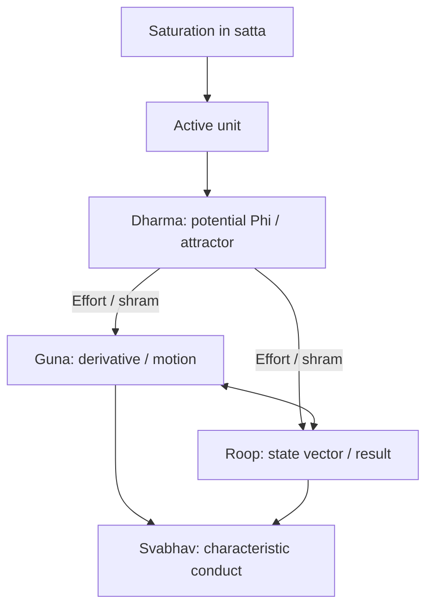
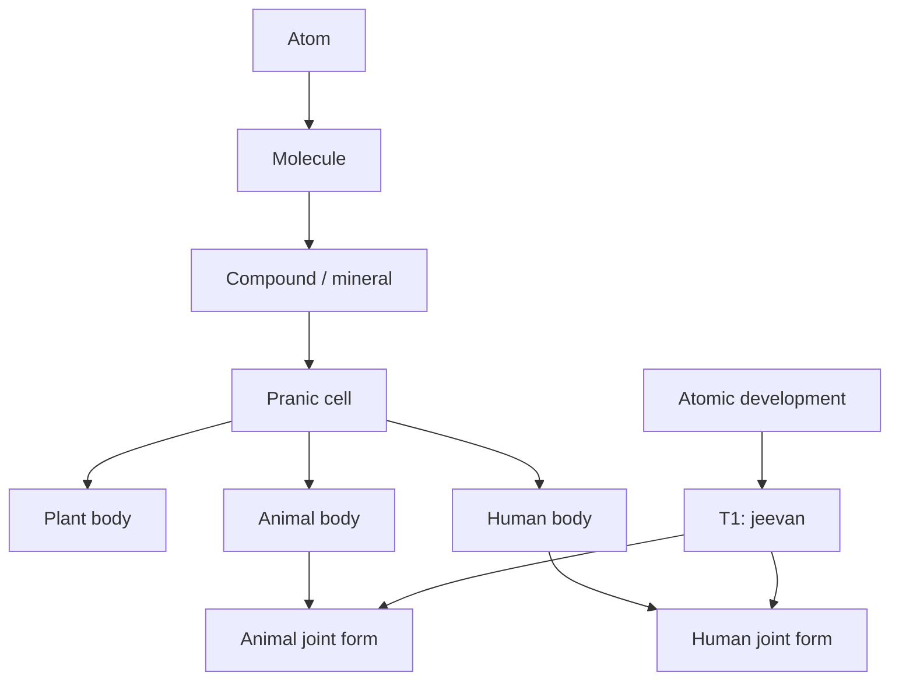
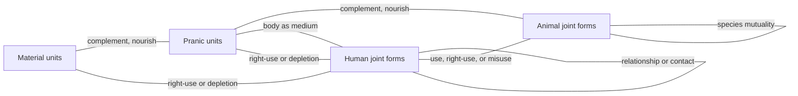

# A State-Dynamic Model of Coexistence

**Author:** [AnalyticMadhyasthDarshan.org](https://github.com/raghavamohan/AnalyticMadhyasthDarshan) — a group of people studying Madhyasth Darshan philosophy. Source repository: [raghavamohan/AnalyticMadhyasthDarshan](https://github.com/raghavamohan/AnalyticMadhyasthDarshan).

**Edited on:** August 19, 2026, 3:41 PM IST
**Status:** Draft

**The question:** Can the effort–motion–result triad and the four aspects of a unit be stated as one state-dynamic model that keeps nested compositional plateaus, the atomic completeness thresholds T1–T3, and the coupled activity of many units of different orders in view at once?

This paper reconstructs those claims from Madhyasth Darshan (Co-existentialism), as presented by Shri A. Nagraj, in the language of a continuous state space. It maps **effort–motion–result** (*shram–gati–parinam*) and **form, property, essential nature, and dharma** (*roop–guna–svabhav–dharma*) onto a bounded, active unit (*ikai*). Effort–motion–result already closes relatively stable existents in the material world: molecules, compounds, and minerals, then pranic cells and the plant, animal, and human bodies composed from them. Those plateaus are the constitutive conditions for later units. A distinct atomic line reaches constitutional completeness (T1), after which *jeevan* works through a body. The animal and human joint forms are parallel meetings of those two lines, not one body-line that turns into the next order. Units of every order remain in mutuality: minerals, cells, plants, animals, and humans do not occupy separate universes. The reconstruction therefore couples many bearers, typed by order, rather than evolving a single isolated *x*(*t*). It then follows both developmental lines into activity completeness (T2) and conduct completeness (T3), and into the public verification of humane conduct in undivided society (*akhanda samaja*).

The equations below are this paper's analytical reconstruction. The primary texts do not write state vectors, derivatives, or attractor basins. They state coexistence, saturation, the inseparable triad, the four aspects, and the completeness stages in ordinary philosophical prose. The formalism is a lens for keeping those claims simultaneous and checkable; it is not a proof that the darshan is a dynamical system, and it does not replace the comparative treatment in the related topical studies.

## Standpoint and scope

These studies are written from the standpoint of a scientist and technologist trained to graduate-level physics and mathematics and familiar with conservation laws, phase-space models, and contemporary accounts of material binding. From that background, matter-first explanations are familiar: configurations evolve under forces, and consciousness is often identified with brain processes or treated as emergent from physical activity. The natural sciences constrain any credible account of material trajectory through mechanism, prediction, and public evidence, but their success does not by itself settle the hard problem of consciousness, the status of the self, or the reality of value in favour of matter-only reductionism.

The paper reads Madhyasth Darshan's primary texts, states the darshan's claims, and then reconstructs them in parallel with the mathematics of state and motion. Comparison with physics and the natural sciences is therefore one leg of the work, not the sole framework into which the philosophy must be translated. Full comparison with Advaita Vedanta and modern Western philosophy of mind, value, and society is developed in the related topical studies and is not repeated here.

The aim is rigorous comparative understanding — testing definitions, internal consistency, and the limits of the formal analogy — rather than persuasion or devotional endorsement. Logical reconstruction, first-person realisation, evidence in conduct, and instrument-based scientific confirmation are kept distinct so that agreement at one level is not mistaken for agreement at every level. Physics and dynamical-systems language do not establish immortal *jeevan*, constitutional completeness, or undivided society; those remain explicit points for examination.

Clear and checkable prose remains the series priority. This paper is a formal reconstruction of structure already stated in the topical studies; it does not require a further layer of category theory or proof, and it does not treat the reconstruction as source doctrine.

## Quick Glossary

| Term | Plain meaning |
|------|---------------|
| Coexistence (*saha-astitva*) | The inseparable presentness of Omnipresence (*satta*) and countable units (*ikai*). |
| Saturation (*samprikt*) | Every unit is soaked, submerged, and surrounded in *satta*; energy-fullness, regulation, and activeness follow as entailments of that bond. |
| Unit (*ikai*) | A bounded, countable bearer in nature — insentient or sentient — whose activity is effort, motion, and result together. |
| Effort–motion–result (*shram–gati–parinam*) | The inseparable triad of unit-activity; not three successive moments. |
| Form (*roop*) | Shape, volume, density: the real bounded configuration of the unit, reflected in mutual facing. |
| Property (*guna*) | Relative power, effective as generative, degenerative, or mediative influence when units come together. |
| Essential nature (*svabhav*) | The order-specific usefulness or characteristic conduct of those effects. |
| *Dharma* | What is innately borne and fulfilled according to order: existence, with growth, hope to live, and happiness stated cumulatively in the higher orders. |
| *Jeevan* | The constitutionally complete sentient atom; the knower that works through the body. |
| Constitutional completeness (T1) | The atomic threshold at which a developing atom becomes *jeevan* and is free of molecular-bondage and weight-bondage. |
| Activity completeness (T2) | Restfulness of effort: realisation (*anubhav*) resolves the inner seeking of *jeevan*. |
| Conduct completeness (T3) | Destination of motion: realised understanding evidenced as humane conduct. |
| Compositional plateau | A closed unit-form — molecule, compound, mineral, cell, or body — whose bounded conduct persists while complementary couplings hold. |
| Existential progression | The definite order in which material, pranic, animal, and knowledge orders become manifest under conducive conditions. |
| Coupling | Mutual facing in which form is reflected and property becomes effect; not isolation. |
| Complementary mutuality | Need met by need across units — hungry with overfull, nourishment with eater — without converting one order into another. |
| Relationship (*sambandh*) | Knowledge-order mutuality whose expectations are predetermined in the sense of completeness. |
| Contact (*sampark*) | Mutuality whose expectations are voluntary; not the full relational expectation of *sambandh*. |
| State vector *x*(*t*) | This paper's symbol for one unit's instantaneous configuration (*parinam*) in a reconstructed phase space *X*. |
| Φ | This paper's symbol for the internal potential associated with effort (*shram*) and order-specific *dharma*. |

## 1. Ontological foundations

Madhyasth Darshan holds that existence is neither a collection of static material substances nor an undifferentiated idealist field. Existence is coexistence (*saha-astitva*): the inseparable, perpetual presentness of unmediated Omnipresence (*satta*) and discrete, active units (*ikai*) (SB, pp. 48–49; MVD, pp. 11, 34).

Every unit is saturated (*samprikt*) in Omnipresence. Saturation is not a transfer of energy from a finite store. It is the way a unit exists, and the texts treat three conditions as its entailments. Units are energy-enpowered (*urja-sanyuktata*): they do not generate or consume the energy evident in their activity, but are never devoid of it (SB, p. 69). They are self-regulated (*niyantrana*): orderliness is inherent in saturated unithood, not an external law imposed on otherwise lawless matter (MVD, p. 26; SB, p. 57). And they are actively expressive (*kriyashilata*): to exist as a unit is to act; there is no inert remainder (SB, p. 53).

The total activity of any unit is the triad of **effort–motion–result** (*shram–gati–parinam*). These are not three successive moments on a timeline in which effort causes motion and motion later produces a result. They are simultaneous, co-extensive dimensions of one activity-whole:

> "Every physical-chemical activity is an inseparable presence of effort, motion and result. Each of these is a joint form of the other two."
> — SB, p. 58

## 2. Mathematical scaffolding of the triad

To keep that simultaneity visible without introducing temporal lags or linear causal fragmentation, this paper represents the unit in a continuous state-dynamic framework. A unit is assigned a **state vector** *x*(*t*) in a phase space *X*. Time *t* here is an index of duration (*kaal*) of unit-activity, not a container in which the unit is placed (see [*Nature of Time*](../Nature-Of-Time/Nature-Of-Time.pdf)). The assignment is a reconstruction: the texts name effort, motion, and result; they do not name *x*, ẋ, or Φ.

### 2.1 Result (*parinam*) as the state vector

*Parinam* is the instantaneous configuration, structural arrangement, or developmental plateau of the unit at a given duration. This paper writes it as the position of the unit in the reconstructed state space:

**x(t) ∈ X**

### 2.2 Motion (*gati*) as the state-derivative

*Gati* is the order-specific activity, velocity of change, or relational transformation of the unit. This paper writes it as the instantaneous state-derivative:

**ẋ(t) = dx/dt**

The derivative notation must not be read as a claim that motion is later than result. In the reconstruction, *x* and ẋ are defined together at every duration, matching the texts' insistence that state and motion are inseparable (SB, pp. 58–62, 248–252).

### 2.3 Effort (*shram*) as the system potential

*Shram* is the inherent structural tension, particle-deficit, or developmental drive that powers the vector field. This paper writes it as an internal potential:

**Φ(x)**

The complete reconstructed activity of **one** bearer, written as if it were alone, is

**ẋ(t) = F(x(t); Φ)**

Nothing in coexistence is isolated (JV, p. 43). Property is relative power, the effect that arises when units come together (MVD, p. 47). The isolated equation is therefore only a factor of the dynamics. The coupled form, typed by the orders of the units in mutual facing, is written in §5.

State and motion are locked at every infinitesimal instant of the model. One cannot alter *parinam* without an immediate manifestation in *gati*, and the trajectory remains bounded by the unit's internal potential, structural constraints, and the units with which it is actually coupled. That locking is the formal counterpart of the triad's joint form, not an additional physical law.

## 3. The tetrad in the state-dynamic model

Every unit has four inseparable aspects: form (*roop*), property (*guna*), essential nature (*svabhav*), and *dharma* (MVD, p. 47). They are not four detachable components and not four successive stages. They are simultaneous aspects of one activity-whole, mapping onto the reconstructed triad as follows.

### 3.1 Form (*roop*): bounded configuration

*Roop* is the spatial configuration, boundary-framework (*rachna*), shape, volume, and density of the unit (SB, pp. 249–250). It maps to **result (*parinam*)** in the reconstructed model: the currently realised coordinates of *x*(*t*) itself. Form is objectively unit-grounded. It is encountered in mutuality as a reflected image (*pratibimbita*), but reflection presents the form; it does not create it (MVD, pp. 42, 49–50).

### 3.2 Property (*guna*): relative power in motion

*Guna* is relative power (*sapeksha shakti*), the effect and influence that arise when units come into mutuality (MVD, p. 47; SB, pp. 248–252). It maps to **motion (*gati*)**: the state-derivative field ẋ(*t*). Its directional modes remain generative (*sam*), degenerative (*visam*), and mediative (*madhyastha*) across the four orders (MVD, pp. 26, 49–50).

### 3.3 Essential nature (*svabhav*): functional character

*Svabhav* is fundamental character (*maulikata*) and the usefulness (*upayogita*) of properties (MVD, p. 47). Usefulness here is order-specific functional significance, not benefit to a human observer: the same texts include devitalising and cruel essential natures. In the reconstruction, *svabhav* spans both **effort (*shram*)** and **motion (*gati*)**. It names the qualitative character of *F*(*x*(*t*); Φ). Unlike *guna*, whose directional modes remain the same triad, *svabhav* changes with order: integration–disintegration in matter, vitalising–devitalising in the pranic order, cruel–non-cruel in the animal order, and humane or inhumane dispositions in the knowledge order (MVD, pp. 50–51, 115; SB, p. 179).

### 3.4 *Dharma*: innateness and invariant orientation

*Dharma* is innateness (*dharana*): what is innately borne, maintained, and characteristic of an entire order (MVD, p. 47). It maps fundamentally to **effort (*shram*)**. In the reconstruction it is the potential Φ together with the order-specific orientation toward fulfilment — existence, growth, hope to live, and happiness, stated cumulatively (SB, p. 179). The word “attractor” in what follows is this paper's dynamical-systems analogy for that orientation. The texts speak of development and completeness, not of basins of attraction.

## 4. The material order: phase-space boundedness

In the insentient line (*jada*), spanning the physical order and the bio-growth order, the reconstructed state vector of a constitution-oriented atom is confined to physical-chemical parameters:

**x(t) = xphysical(t) ∈ Xphysical**

That confinement describes one bearer. It does not flatten every later composition into the same undifferentiated field. Effort–motion–result already closes new bounded units from those parameters, and those units occupy nested plateaus of *X* (§4.3).

### 4.1 Constraints of the material field

The material potential Φmaterial is defined, in the darshan's terms, by two forms of structural bondage. **Weight-bondage** (*bhara-bandhana*) subjects the unit to gravitational and inertial mutuality, so its trajectory depends on other mass-bearing units. **Molecular-bondage** (*anu-bandhana*) fixes internal stability by subatomic particle counts in nuclear and orbital constitution. Atoms carry structural hunger (*bhukha*) or overfullness (*adhikya*), and they collide, exchange particles, and form molecular compounds on that basis (MVD, pp. 8, 91; SB, pp. 58, 71).

### 4.2 Open atomic motion and closed plateaus

The reconstructed material trajectory of a constitution-oriented atom

**ẋphysical = F(xphysical, xN; Φmaterial)**

already depends on the neighbouring units *N* with which it collides and exchanges particles (§5). Written without those neighbours it is only a factor. The motion represents continuous composition and decomposition (*gathana-vigathana*). Hungry and overfull atoms remain open to particle exchange. For those open bearers the model does not treat *parinam* as a terminal constant:

**limt → ∞ xphysical(t) ≠ constant**

That limit statement is a reconstruction of openness, not a theorem of physics and not a sentence in the primary texts. It must not be read as a claim that matter has no stable existents. When complementary units close a new motion-path, a **compound** (*yaugik*) presents a new definite bearer with its own constitution and bounded conduct; a **mixture** does not, and the components keep their respective conducts (MVD, p. 42; SB, pp. 75–76). The closed bearer occupies a relatively invariant region of *X* while its couplings remain complementary. Disintegration returns constituents to a lower plateau. Composition is not development: a new compound may close a new bounded conduct while the atomic development progression toward constitutional completeness remains a distinct line (SB, pp. 75–76; KD 3.2–3.3).

### 4.3 Nested compositional plateaus

The qualitative attributes of *x*(*t*) therefore include more than particle-count and bondage. They include the **kind of closed unit** presently evidenced. This paper writes those kinds as nested plateaus *Pℓ ⊂ X*. Each plateau is a region in which a unit's *roop*, *guna*, *svabhav*, and *dharma* remain recognisable as one order-specific conduct. The unit is still in effort–motion–result: ẋ is not required to vanish. What remains relatively invariant is the closed form, not an idle point.

The compositional sequence the texts set out on this earth runs, under conducive conditions, from constitution-oriented atoms through molecules and molecule-composed solids, liquids, and rarefied states, through compounds and minerals, through chemical resonance that yields nourishment- and composition-elements, through pranic cells, through plant-order bodies, through animal bodies, and as far as the human body whose *medhas* composition is the richest compositional plateau (KD 3.2, pp. 58–60). Four orders are perceivable in that sequence: the material state in soil and stone; the pranic state in the plant-order; the *jeevan* state and the knowledge state as joint forms of body and *jeevan* (KD 3.2, p. 59; SB, p. 179).

| Plateau | Closed unit | Order | Way of existence |
|---------|-------------|---------|------------------|
| Atomic constitution | Atom | Material | Structure- or result-conformance |
| Molecular aggregation | Molecule | Material | Structure-conformance |
| Compound and mineral | Closed chemical composition | Material | Structure-conformance |
| Pranic cell | Cell with inherent composition-method | Pranic | Seed-conformance |
| Plant body | Organism composed of cells | Pranic | Seed-conformance |
| Animal body | Organism composed of cells | Pranic | Seed-conformance |
| Human body | Developed *medhas* composition | Pranic (expression medium) | Lineage of the body |
| Animal joint form | Animal body with *jeevan* | Animal | Species-conformance |
| Human joint form | Human body with *jeevan* | Knowledge | *Sanskar*-conformance |

The table is this paper's reconstruction of the sequence and the four-order partition. It is not a further completeness threshold numbered after T1. A plant body is a pranic composition; it is not *jeevan*. The animal order comprises animals and birds, excluding humans; the knowledge order comprises only humans (JV, p. 47). An animal or human is a joint form in which the compositional line supplies **that order's** body and the atomic line supplies constitutionally complete *jeevan* (§6). The human joint form is not the next animal. Most atoms remain engaged in physical and chemical constitution rather than attaining T1. Biological compositions return to material constituents after disintegration (MVD, pp. 8, 13; JV, pp. 47–48).

The solid arrows are constitutive: a later closed unit requires the earlier plateau already occupied. They are not the living couplings of §5. The animal joint form and the human joint form both require T1 *jeevan* and a body of their own kind. There is no arrow from the animal joint form to the human joint form.

### 4.4 Nested dependence

A plateau is not only a description of what has already closed. It is a **constitutive condition** for the next closed unit. Molecules form when atoms of the required kinds are already present and complementary; compounds and minerals require those molecules; pranic cells require chemical substances, definite heat, and the inherent composition-method of the *prana sutra*; plant, animal, and human **bodies** require cells; the animal joint form requires an animal body together with a T1 *jeevan*; the human joint form requires the further developed human bodily medium, through which knowing, believing, recognising, and fulfilling can be evidenced, together with a T1 *jeevan* (KD 3.2, pp. 58–60; JV, pp. 47–48, 59). The human body follows lineage tradition; *jeevan* is not produced by that lineage (JV, p. 59).

Existential progression (*niyati-kram*) is the definite order in which the four orders become **manifest** on this earth under conducive conditions — material, then pranic, then animal, then knowledge (MVD, pp. 8, 13). That sequence of appearance is not a claim that each human is constituted from an animal joint form, and it is not the living use-ladder of §5.2. The way of existence (*niyati-vidhi*) is the conformance by which each plateau maintains definite conduct once formed. The two must not be collapsed into T1. Constitutional completeness is development in the atom; the plateaus are development in composition. They meet in the animal and human joint forms as two parallel joints, not as one ladder that a single *x*(*t*) climbs by accumulating attributes until it becomes *jeevan*.

## 5. Coupled units across orders

Plateaus name kinds of closed unit. They do not place those units in separate worlds. A mineral, a plant, an animal, and a human share one coexistence: each recognises and fulfils at the level of its order, and complementarity is evident in mutuality (JV, pp. 43, 69; SB, p. 53). The dynamics must therefore be a **coupled system** of many bearers, not a single isolated trajectory that changes kind.

### 5.1 Many bearers

Let a situation comprise a finite collection of units *U*. Each unit *i* has an order *o*(*i*) — material, pranic, animal, or knowledge — and a state *xi*(*t*) in the corresponding region of *X*. The joint configuration is the tuple

**xU(t) = (x1(t), …, xn(t))**

Write *N*(*i*) for the units actually in mutual facing with *i*, not for a mean field over all of nature. Form is reflected in that facing; property becomes effect there (MVD, pp. 47, 49–50). This paper writes the motion of each bearer as

**ẋi = Fo(i)(xi, xN(i); Φo(i))**

The vector field on *i* depends on its own order-potential and on the states of the units it actually meets. Empty *N*(*i*) would recover the isolated equation of §2.3; coexistence does not supply that case.

### 5.2 Three kinds of coupling

The texts distinguish how units come together. This paper groups those distinctions as three reconstructed coupling kinds.

**Complementary need** is offering and acceptance among units whose hungers or overfullness meet. Hungry and overfull atoms bond; the same schema organises later composition when the required kinds are already present (MVD, p. 8; JV, p. 67). The coupling may close a new unit (a compound) or restore natural-state motion without closing (an expelled particle absorbed by a hungry atom). It does not convert every contact into a new order.

**Containment and organisation** is the way a higher-order body includes and regulates lower-order compositions: cells in a plant or animal body, minerals and water in the earth to which the plant remains joined, the human body as the richest such composition (KD 3.2, pp. 58–60). Higher-order *dharma* includes the lower-order *dharmas* while adding a further one (SB, p. 179). Containment does not rewrite the order of the constituent. Whatever a thing is constituted of, it remains of the order of that constituent: soil remains soil in a pot; pranic cells remain of the pranic order in a body (SB, p. 260). The body's *x* constrains the cells' couplings; it does not replace their plateaus with a single fused state.

**Use, nourishment, and participation** is fulfilment across orders without identity of order. The texts state a living use-ladder, distinct from the constitutive sequence of §4. A knowledge-order unit makes use, right-use, or misuse of many animal-order units; an animal-order unit is complementary to many biological units; a biological unit is complementary to many material units (MVD, p. 105). Pranic units take material compositions as nourishment-element and composition-element under seed-conformance. Animals select and taste through a species-limited body. Humans can know, believe, recognise, evaluate, and fulfil with material, pranic, animal, and human units (JV, pp. 47–48, 69). Apart from humans, the first three orders are already mutually complementary; humans have still to evidence that complementarity (JV, p. 59). Knowledge-order use of lower orders is bounded by right-use and regeneration; extraction beyond regeneration is an unfulfilled coupling that destabilises the containing assembly (MVD, p. 264; JV, p. 77).

Human–human mutuality is of two kinds in the texts. A **relationship** (*sambandh*) is a mutuality whose expectations are predetermined in the sense of completeness; a **contact** or association (*sampark*) is a mutuality whose expectations are voluntary (MVD, pp. 61–62). Work, family, and undivided society sit in that knowledge-order coupling. Lower orders have definite recognition–fulfilment, not this value-laden *sambandh*.

The edges below are living couplings in mutuality, not conversions of order and not the constitutive arrows of §4.3. Containment of cells in a body remains the organisation named above; it is not drawn as humans containing minerals or animals.

### 5.3 Order-typed interaction

Cross-order coupling does not impose one force-law on every pair. Essential nature is order-specific, and it is evidenced **in the coupling**, not as a private scalar of an isolated *x* (MVD, pp. 50–51; SB, p. 179). Two material units meet as integration or disintegration. A chemical or pranic composition meets a body as vitalising or devitalising in that context. Animals meet as cruel or non-cruel, and they meet plants as complementarity. Humans meet as humane or inhumane; they meet animals as use, right-use, or misuse; they meet vegetation and minerals as cyclical enrichment or as depletion.

This paper therefore types *F* by the pair of orders in mutuality. A human does not interact with a mineral by the same map as two atoms, does not interact with an animal by the same map as an animal with a plant, and an animal does not evaluate a plant by the human circuit of knowing and believing. The coupling can nourish, constrain, compose, or — under human delusion — deplete. It does not turn a mineral into a cell or a cell into *jeevan*. Those transitions, when they occur, remain the compositional and atomic lines of §4–§6.

Natural-state motion in each order continues while couplings remain complementary. Adverse environment, over-extraction, or human mis-evaluation can excite a unit without changing its order. Material, pranic, and animal recognition and fulfilment remain definite through structure-, seed-, and species-conformance. The knowledge order is the fallible coupling: reflexive evaluation can agree with or diverge from the definite mutuality actually present (§7.1, §9).

## 6. Constitutional completeness

The transition from the insentient constitution-oriented atom to the sentient cognitive line is **constitutional completeness** (*gathanpurnata*, T1). It is not a further compositional plateau. When a developing atom achieves complete subatomic particle balance in its nucleus and orbits, particle hunger drops to zero and the atom crosses an irreversible threshold (SB, pp. 55, 61, 92; KD 3.3, pp. 60–61). The compositional sequence can already have produced minerals, cells, and bodies; those remain of the order of what constitutes them. Only the atom reaches T1.

### 6.1 The T1 bifurcation

At that threshold the atom is no longer available to molecular-bondage and weight-bondage. It cannot be split, fused, or degraded by the physical-chemical forces that bound it as a developing constitution.

> "An evolving-constitution atom is with molecular-bondage and weight-bondage. However, when the contraction and expansion activity increases in this atom, it instantly breaks free from its group and attains constitutional completeness, becoming a jeevan atom. The evidence of constitutional completeness is the jeevan atom's liberation from molecular-bondage and weight-bondage, and its having the hope-bondage."
> — MVD, p. 91

In the reconstructed state space, the continuous physical coordinates of particle-exchange collapse into an invariant structural core, and a further set of **cognitive coordinates** xcognitive becomes the relevant description of activity. The unit is now *jeevan*: a constitutionally complete, immortal, sentient atom that operates through a physical body and is not reducible to the laws of molecular and weight bondage. The body through which it operates is still a compositional plateau (§4.3). Whether and how that threshold is to be identified in contemporary physics remains an open problem (§11).

## 7. The cognitive order: the ten-activity circuit

Upon crossing T1, *jeevan* still requires a body composed along the other line. Animal and human beings are joint forms: compositional progression supplies the body, atomic development supplies *jeevan* (§4.4). The reconstructed state vector is therefore composite:

**x(t) = [ xphysical(t) , xcognitive(t) ]T**

The product notation does not divide *jeevan* into two substances. The body remains the expression medium, itself a closed pranic composition; *jeevan* is the sentient unit. The cognitive coordinates track the five faculties and ten activities named in the texts (MVD, p. 78; JV, pp. 92–94). Animal bodies restrict their expression; a developed human body, whose *medhas* composition is the highest compositional plateau, provides for their full exercise (KD 3.2, p. 60; JV, p. 59). Delusion (*bhram*) can still misdirect evaluation by identifying *jeevan* with the body (JV, pp. 93–94).

| Faculty | Activities |
|---------|------------|
| *Mun* | Selection / tasting (*chayana* / *asvadana*) |
| *Vritti* | Analysis / weighing (*vishleshana* / *tulana*) |
| *Chitta* | Imaging / contemplation (*chitrana* / *chintana*) |
| *Buddhi* | Discrimination / verification (*sankalpa* / *bodha*) |
| *Atma* | Realisation / authentication (*anubhava* / *pramanyata*) |

### 7.1 The deluded human state

In the unawakened human state the reconstructed cognitive potential Φcognitive is misaligned. The upper faculties (*buddhi* and *atma*) remain unevidenced. The derivative ẋcognitive is driven by feedback from the body's sensory inputs, seeking happiness through sensory pleasure, profit, and temporary comfort (SB, pp. 91–92; MVD, p. 78).

Because *jeevan* is an infinite cognitive unit in the darshan's terms, attempting to stabilise it on finite, transient sensory inputs yields an unstable inner trajectory. This paper writes that instability as

**Internal friction (ẋcognitive ≠ 0) ⇒ psychological division / suffering**

The implication is a reconstruction of delusion as unresolved cognitive motion, not a clinical diagnosis and not a quantitative psychology.

## 8. Activity completeness and conduct completeness

Resolution requires that the upper cognitive loop become active, so that the inner potential is no longer organised from sensory input outward but from realisation outward into conduct.

### 8.1 Activity completeness (T2 — *kriyapurnata*)

Activity completeness is reached when *atma* directly perceives coexistence (*anubhav*). That realisation is the restfulness of effort (*shram ka vishram*): the restless search for certainty stabilises into knowing (SB, p. 58; MVD, Ch. 5). In the reconstruction, T2 is the fixed point at which ẋcognitive = 0 in the sense of inner coherence, not in the sense that *jeevan* becomes inactive. Motion continues; confusion does not.

### 8.2 Conduct completeness (T3 — *acharanpurnata*)

Conduct completeness is the lived evidence of T2 in physical reality through humane conduct (*manaviya acharan*). It is the destination of motion (*gati ka gantavya*): invariant behavioural output aligned across the modes of interaction (MVD, p. 80; SB, p. 58). Humane conduct is stated as an integrated structure of character (*charitra*), ethics (*niti*), and values (*mulya*). Character locks external action into rightfully owned wealth (*sva-dhana*), marital faithfulness (*sva-nari* / *sva-purusha*), and kindness in action (*dayapurna karya*). Ethics bounds the use of body, mind, and wealth (*tan-man-dhana*) by right-use (*sadupyoga*) and protection (*suraksha*). Values are recognised and fulfilled in relationship — trust, respect, gratitude, and the remaining established values — producing mutual satisfaction (*ubhaya-tripti*).

## 9. Verification of conduct

Madhyasth Darshan does not treat human rightness as a private taste or a relativistic convention. Rightness is to be evidenced in experience, behaviour, work, and thought. This paper writes that fourfold demand as a single reconstructed protocol:

| Verification protocol |
|-----------------------|
| Anubhav (experience) |
| Vyavahar (behaviour) |
| Karya (work) |
| Vichara (thought) |

### 9.1 The verification matrix

Let *V* be a reconstructed verification operator on an individual human system *x*. The conduct is valid if and only if it satisfies the simultaneous system constraints:

| Operator | Implication |
|----------|-------------|
| *V*thought(*x*) | Internal harmony (ẋcognitive = 0) |
| *V*behavior(*x*, *y*) | Mutual satisfaction (*ubhaya-tripti* for any interlocutor *y*) |
| *V*work(*x*, *xN*) | Cyclical enrichment of the coupled natural units (*avartanashilata*); right-use bounded by regeneration (§5.2–§5.3) |
| *V*experience(*x*) | Absolute alignment with truth (*pramanikta*) |

Authentic conduct requires simultaneous success across all four criteria. If an individual claims internal enlightenment (T2) but their outward trajectory produces exploitation in society (*V*behavior &lt; 0) or extraction beyond regeneration in the coupled natural units (*V*work &lt; 0), the system remains deluded. *V*behavior is the human–human coupling of §5; *V*work is the knowledge-order coupling with material, pranic, and animal units. The inequalities are qualitative markers in this reconstruction, not measured scores.

## 10. Undivided society

When the verification protocol is satisfied across a population, individual trajectories are described in the darshan as synchronising from individual resolution to universal harmony: resolved individual, prosperous family, fearless society, universal coexistence (JV, p. 61; SB, pp. 246–247). This paper writes that chain as

**Resolved individual → prosperous family → fearless society → universal coexistence**

That state is the realisation of undivided society (*akhanda samaja*) and universal orderliness (*sarvabhauma vyavastha*). It is not a collection of isolated human trajectories. The resolved population is a coupled human system — family, society, and the remaining human–human relations of §5 — whose *V*behavior constraints succeed together, and whose *V*work couplings with material, pranic, and animal units remain within regeneration. Social stability is not produced by external legal coercion. It is the public evidence of units that have crossed T1 as *jeevan*, reached T2 as realised understanding, and manifested T3 as verified conduct in those couplings. The reconstruction does not claim that the chain is a dynamical theorem; it records the darshan's own social completion of the same triad.

## 11. Open problems

The reconstruction leaves several questions unset.

First, the texts insist that effort, motion, and result are simultaneous. Writing motion as ẋ and result as *x* is a convenient pair in ordinary dynamics, but it can reintroduce the very sequence the triad refuses. Whether a genuinely simultaneous formalism — without a privileged time derivative — would be more faithful remains open.

Second, “attractor basin” is this paper's analogy for completeness-orientation. The texts speak of development until realisation, not of asymptotic stability in a potential well. Constitutional completeness is a selected atomic threshold, not a fate of every particle. The analogy must not be read as a universal dynamical law.

Third, the operator *V* names four public constraints. It does not yet supply a quantitative, observer-independent scoring of mutual satisfaction or cyclical balance. Those remain qualitative evidences, as in the related studies of family values and undivided society.

Fourth, T1 is a metaphysical and textual threshold. Contemporary physics has no accepted counterpart for an atom that leaves molecular and gravitational bondage while remaining a countable unit. The reconstruction records the claim; it does not close the empirical question.

Fifth, the nested plateaus are this paper's reconstruction of compositional progression and existential order. They organise what the texts state about closed units and conducive conditions. They do not supply a mapping onto evolutionary phylogeny, origin-of-life chemistry, or laboratory phase diagrams. Relating *niyati-kram* to those sciences remains an open comparison, as in the related ontology study.

Sixth, the coupled field *F*o(i) is typed by order-pairs and by the three kinds of mutuality in §5. The texts state complementarity, containment, recognition–fulfilment, and right-use; they do not supply a quantitative cross-order force, a universal interaction kernel, or an N-body reduction of *jeevan*. Writing those couplings as one vector field is this paper's reconstruction. Specifying *F* in laboratory coordinates remains open.

## Editorial Notes

### Formal status of the equations

The state vector *x*(*t*), derivative ẋ(*t*), potential Φ, composite physical–cognitive coordinates, plateau regions *Pℓ*, neighbourhood *N*(*i*), order-typed field *F*o(i), joint configuration *xU*, and verification operator *V* are this paper's constructions. They organise what the primary texts state about the triad, the four aspects, compositional sequence, mutuality across orders, the completeness stages, and public evidence. They are not quotations, and they are not additional doctrine. Where the exposition says “this paper writes” or “the reconstruction,” the claim is formal, not textual.

### Running terms

Analytical prose uses the series running terms: form (*roop*), property (*guna*), essential nature (*svabhav*), *dharma*, effort (*shram*), motion (*gati*), result (*parinam*), *jeevan*, and Omnipresence (*satta*). Block quotes keep the translation's wording. IAST spellings (*rūpa*, *guṇa*, *svabhāva*, *śram*) are not used as a second running vocabulary.

### Mapping of the tetrad to the triad

One SB passage relates effort to *dharma* and *svabhav*, motion to *svabhav* and *guna*, and result to *roop* (SB, pp. 60–62). This paper follows that alignment. It does not claim a one-to-one derivation, because *svabhav* crosses both effort and motion. The mermaid figure is an aid to that reconstruction, not a source diagram.

### Composite state vector

Writing *x* as a pair of physical and cognitive coordinates is a modelling convenience. It must not be read as a Cartesian dualism of two substances. *Jeevan* is one constitutionally complete atom; the body is its expression medium, itself a closed pranic composition. The pair records two descriptions of one joint form.

### Plateaus are not completeness thresholds

The nested regions *Pℓ* and the table in §4.3 reconstruct compositional sequence and order-partition. They are not a fourth completeness stage and are not numbered T0. Composition closes a new bounded unit; development in the atom reaches T1. The two lines meet in animal and human joint forms as parallel joints: each requires a body of its own kind plus T1 *jeevan*. The paper does not assert that the human joint form is constituted from the animal joint form, that every instance advances, or that a plant is a deficient animal.

### Constitutive sequence and living coupling are distinct

The mermaid in §4.3 records constitutive conditions for closed units. The mermaid in §5.2 records living complementarity and use. Existential progression names the order in which the four orders become manifest on this earth; the use-ladder of MVD p. 105 names how a knowledge-order unit relates to animal, pranic, and material units already present. Those are not one diagram.

### Coupled dynamics are not N-body physics

The isolated equation of §2.3 is a factor. The coupled form in §5 reconstructs mutuality: complementary need, containment, and use/nourishment/participation, typed by the orders of the units that actually meet. It is not a universal force, not a mean-field over all of nature, and not a reduction of *jeevan* to a material ODE. Cross-order coupling does not convert a mineral into a cell or a cell into *jeevan*. Those remain the compositional and atomic lines of §4 and §6.

## References

### Madhyasth Darshan (primary sources)

- **MVD** — Nagraj, A. [*Madhyasth Darshan — Co-existentialism*](../References/Madhyasth-Darshan/MVD-Madhyasth-Darshan-Coexistentialism.pdf). English translation by Rakesh Gupta. Cited: coexistence and the four aspects (pp. 11, 34, 47; §1, §3); mediative regulation (p. 26; §1); hungry and overfull atoms, existential order (pp. 8, 13; §4.1, §4.4, §5.2); atomic constitution and change of form (pp. 42, 49–50; §3.1, §4.2, §5.1); *sam–visam–madhyastha* (pp. 26, 49–50; §3.2); order-specific *svabhav* and *dharma* (pp. 50–51, 115; §3.3–§3.4, §5.3); relationship and contact (pp. 61–62; §5.2); the use-ladder across orders (p. 105; §5.2–§5.3); T1 evidence, molecular-bondage and weight-bondage (p. 91; §6.1); *atma* and orbital faculties (p. 78; §7); delusion as body-identification (p. 78; §7.1); restfulness of effort (Ch. 5; §8.1); authentic conduct (p. 80; §8.2); expenditure of natural abundance in proportion to regeneration (p. 264; §5.2).
- **SB** — Nagraj, A. [*Samadhanatmak Bhautikvad* (*Resolution Centred Materialism*)](../References/Madhyasth-Darshan/SB-Samadhanatmak-Bhautikvad.pdf). English translation by Rakesh Gupta. Cited: coexistence and saturation (pp. 48–49; §1); recognition and regulation (p. 57; §1); unit and energy-fullness as activeness (p. 69; §1); inseparable effort–motion–result (pp. 53, 58; §1–§2); complementarity in mutuality (p. 53; §5); state and motion, force and power (pp. 58–62, 248–252; §2.2, §3); completeness goals of the triad (pp. 58, 71; §8); composition is not development (pp. 75–76; §4.2); four orders (p. 179; §3.4, §4.3, §5.2–§5.3); T1 and inexhaustibility (pp. 55, 61, 92; §6); order-specific *dharma* (p. 179; §3.4); a composition remains of the order of its constituent (p. 260; §5.2); delusion and the body (pp. 91–92; §7.1); undivided society (pp. 246–247; §10).
- **JV** — Nagraj, A. [*Jeevan Vidya: An Introduction*](../References/Madhyasth-Darshan/JV-Jeevan-Vidya-An-Introduction.pdf). English translation by Rakesh Gupta. Cited: nothing isolated, complementarity in mutuality (pp. 43, 69; §2.3, §5); four orders, animal order excluding humans, and conformance (pp. 47–48; §4.3–§4.4, §5.2); inclination toward coexistence (p. 67; §5.2); relationship with the Earth (p. 77; §5.2); human bodily medium, lineage of the body, and complementarity of the first three orders (p. 59; §4.4, §5.2, §7); ten activities (pp. 92–94; §7); delusion and four-and-a-half effective activities (pp. 93–94; §7); human goals (p. 61; §10).
- **KD** — Nagraj, A. *Manav Karm Darshan*. [Working English translation](../References/Madhyasth-Darshan/KD-Karm-Darshan-English/KD-Karm-Darshan-English.pdf) of chapter 3; Hindi source `KD-karm darshan v5.pdf`. Machine-assisted working translation — not a published translation; cited as corroboration only. Cited: compositional sequence from atom and molecule through cell, plant, animal body, and human *medhas* (3.2, pp. 58–60; §4.3–§4.4, §5.2, §7); development in the atom as T1, distinct from composition (3.3, pp. 60–61; §4.2, §6).

### Related studies in this collection

- [*The Ontology of Coexistence*](../The-Ontology-of-Coexistence/The-Ontology-of-Coexistence.pdf) — saturation, four orders, compositional versus atomic development, T1–T3, and *jeevan* (§§1.2–1.7); companion technical note [*Rūpa, Guṇa, Svabhāva, and Dharma in a State-Dynamic Unit*](../The-Ontology-of-Coexistence/Technical-Note-Roop-Guna-Svabhava-Dharma.pdf)
- [*Coexistence from First Principles*](../Coexistence-From-First-Principles/Coexistence-From-First-Principles.pdf) — compound-closure, order-relative stability, four progressions, order-typed coupling, and the guarded status of T1
- [*The Epistemology of Coexistence*](../The-Epistemology-of-Coexistence/The-Epistemology-of-Coexistence.pdf) — knowing, evidence, and the faculty architecture; companion [*A Functional Model of Jeevan*](../The-Epistemology-of-Coexistence/Research-Note-Jeevan-Functional-Model.pdf)
- [*Nature of Time*](../Nature-Of-Time/Nature-Of-Time.pdf) — *kaal* as duration of unit-activity
- [*Human Behavior and Society*](../Human-Behavior-And-Society/Human-Behavior-And-Society.pdf) — humane conduct and social organisation
- [*Family Relationships and Values*](../Family-Relationships-And-Values/Family-Relationships-And-Values.pdf) — established values and mutual satisfaction
- [*How Undivided Society Is Established*](../How-Undivided-Society-Is-Established/How-Undivided-Society-Is-Established.pdf) — family to universal order
- [*Why Humans Are Not Just Material*](../Why-Humans-Are-Not-Just-Material/Why-Humans-Are-Not-Just-Material.pdf) — body and *jeevan*
