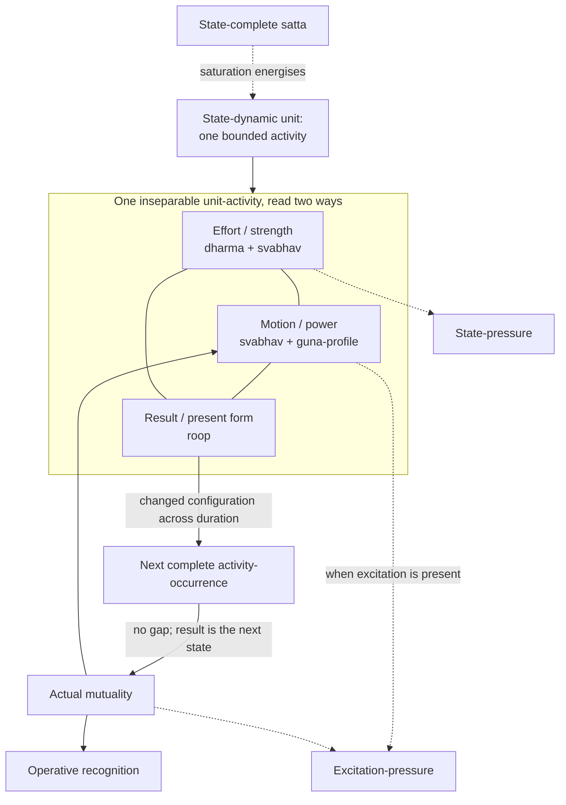
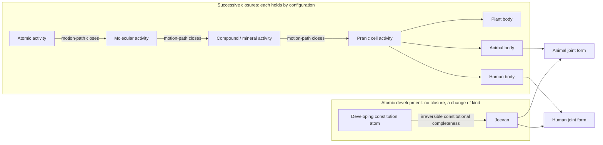
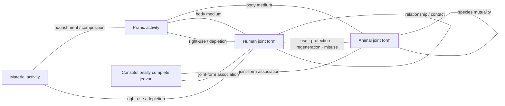
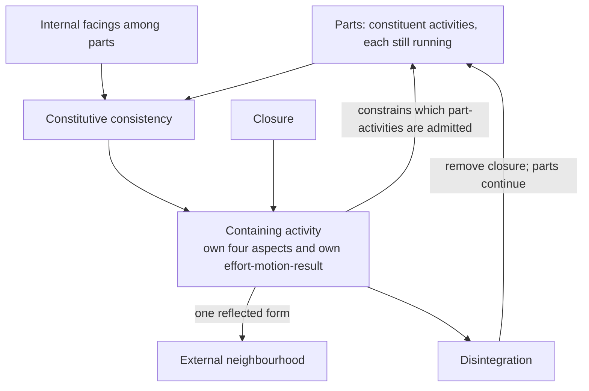
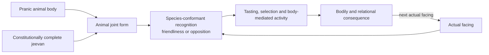
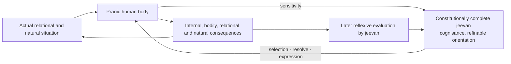
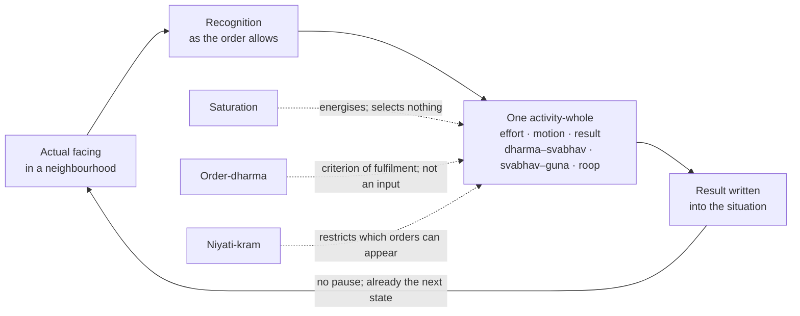

# From Unit Activity to Human Orderliness: A State-Dynamic Reconstruction of Coexistence

**Author:** [AnalyticMadhyasthDarshan.org](https://github.com/raghavamohan/AnalyticMadhyasthDarshan) — a group of people studying Madhyasth Darshan philosophy. Source repository: [raghavamohan/AnalyticMadhyasthDarshan](https://github.com/raghavamohan/AnalyticMadhyasthDarshan).

**Edited on:** August 28, 2026, 2:23 PM IST
**Status:** Draft

This paper develops a source-bounded causal architecture from unit activity to human orderliness. It reconstructs one connected account of material change, compositional closure, sentient participation, reflexive evaluation, and public conduct while preserving the different kinds of activity and evidence involved. The result is a qualitative reconstruction, not a quantitative theory that predicts physical trajectories or proves every ontological claim. The essay states that reconstruction in prose. Appendix A is the only place that uses the corresponding symbols and completeness abbreviations.

At its ontological base, state-complete Omnipresence (*satta*) coexists with countlessly many state-dynamic units. The same *satta* is also named Knowledge or Space: actionless ground and source of inspiration, with inspiration inherent through saturation (MVD, pp. 35–36, 174). Saturation energises every unit, and a unit is not a substance that happens to move: it is a bounded activity that persists. That activity is effort, motion, and result together, and the same activity read aspectually is form (*roop*), property (*guna*), essential nature (*svabhav*), and *dharma*. The triad and the tetrad are two readings of one activity, not two inventories. The reconstruction separates the roles that make such activity intelligible: saturation grounds energy-fullness and intrinsic activeness; actual mutuality supplies the proximate conditions of change; constitution and conformance constrain the available response; *guna* and *svabhav* characterise its power and function; *niyati-kram* restricts the sequence of manifested orders; and *dharma* specifies order-relative fulfilment without acting as an additional force.

At the structural level, structures are not additions to that base but closures within it. When complementary activities close a new motion-path, molecules, compounds, cells, and bodies stand as new closed activities whose constituents persist and continue their own activity inside the closure. Atomic development instead reaches constitutional completeness, yielding *jeevan* with invariant hope-bondage. Unjoined *jeevan* is still *jeevan*; it is not a fifth order. Animal and human orders become manifest only through body–*jeevan* joint forms, so the human is neither a later animal composition nor a body that produces sentience. Going up the orders, the principle by which a closure holds also changes. Material and pranic activity, and the animal joint form, remain definite by configuration, relative power, and order-specific conformance. The human joint form can close structures whose principle is values and realised coexistence rather than definite *roop* and *guna* alone. That change of organising principle — from configurational to value-structured closure — is the through-line of the paper.

At the human level, the same architecture extends from the five faculties and ten activities of *jeevan* into knowing, believing, recognising, fulfilling, karma, consequence, and reflexive evaluation. Complete knowledge comprises coexistence, *jeevan*, and humane conduct. Study of coexistence, *jeevan*, and truth unfolds the capacity to recognise actual relationships; karma is activity together with aspiration; *mun* tastes the associated value in work and behaviour only when the relationship is recognised; later evaluation tests whether that value was achieved. This is unfolding of already-present knowledge rather than acquisition of a new power. It can represent both deluded recurrence under *priya–hita–labh* and refinement through study, direct recognition (*sakshatkar*), enlightenment (*bodh*), realisation (*anubhav*), and practised karma. **Activity completeness** names inner resolution once all three contents have reached the faculties; **conduct completeness** names its repeatable public evidence in relationship, work, family, society, and participation in orderliness.

The reconstruction also marks its limits: the physical identification of constitutional completeness, the body–*jeevan* interface, quantitative calibration, and social-scale dynamics remain unresolved. Direct textual claims, translation choices, analytical reconstructions, proposed operational criteria, and open empirical questions are kept visibly distinct throughout. Terminology is collected in Appendix B, and the Editorial Notes record which claim-kind each part of the reconstruction carries.

## 1. Ontological foundations

Madhyasth Darshan holds that existence is neither a collection of static material substances nor an undifferentiated idealist field. Existence is coexistence (*saha-astitva*): the inseparable, perpetual presentness of Omnipresence (*satta*) and countlessly many discrete, active units (*ikai*) (SB, pp. 48–50; MVD, pp. 11, 34). Omnipresence is **state-complete** (*sthitipurna*): unbounded, everywhere uniform, non-transforming, and free from motion and pressure. Nature is **state-dynamic** (*sthitishil*): every bounded unit is inseparably present in state and motion within the state-complete (MVD, p. 26; SB, pp. 49–50, 248; KD 3.5, p. 70; KD 3.8, p. 84). The whole neither increases nor decreases, expands nor contracts, while development and awakening become manifest within it (KD 3.5, p. 70).

### 1.1 Saturation as the source of activeness

Every unit is saturated (*samprikt*) in Omnipresence: soaked, submerged, and surrounded in it. Saturation is what makes each unit energised, forceful, self-regulated, and active; the perpetual activity of molecules, atoms, and atomic particles is the standing evidence that each is so energised (MVD, pp. 40–41, 46; SB, pp. 57, 61, 69, 248; JV, p. 149; KD 3.9, p. 88; KD 3.13, p. 122). This is the positive claim on which the rest of the architecture rests: activity does not have to be started, because nothing in nature is unenergised in the first place. Omnipresence is also permeative through units and present between them. That between-ness makes their boundaries and mutual distances possible; the same condition permits joining and separation without ever separating a unit from Omnipresence (SB, pp. 48–50, 249–250; JV, p. 149).

The claim is nevertheless bounded in three ways. Saturation is not a transfer from a finite store, Omnipresence does not push units by an applied force, and no unit can be drained of what it is never separated from. The strength and power at work in any change belong to the saturated unit itself.

The same distinction is also stated as **absolute energy** and **relative energy**. Absolute energy is Omnipresence itself: everywhere present, non-active in itself, and the basis of basic impulsion. Relative energy is the unit's power made evident in mutuality; pressure, waves, fields, heat, sound, electricity, and related effects are physical-chemical expressions of that relative power (MVD, pp. 40–41). Omnipresence is also named fundamental uniform energy (KD 3.13, p. 122). Pressure does not supply a second stock of activity or stand beside *bal* and *shakti* as an additional power. It is the unit's force recognised in state and, in the narrower excitation sense, the compulsion received in an excited mutuality; such mutual pressure can condition change without becoming an external energy source (MVD, pp. 46, 114; SB, pp. 49, 59, 256; KD 3.11, pp. 105–106; KD 3.13, p. 118).

The same ground is also named Knowledge or Space. Knowledge in this sense is actionless and non-transforming: neither an activity nor an agent performing activities, while serving as their ground and source of inspiration, with inspiration inherent through saturation (MVD, pp. 32–36, 174). Units act; Omnipresence does not. Availability of this ground for realisation is therefore not a rule of change, an applied force, or a second energy beside saturation. How that availability unfolds as realised content in the human joint form is taken up in §7.

### 1.2 A unit is a closed activity

What saturation energises is not a substance that then behaves. The total activity of any unit is **effort–motion–result** (*shram–gati–parinam*), and that activity is not something the unit does in addition to existing:

> **"Every physical-chemical activity is an inseparable presence of effort, motion and result."**
> — SB, p. 58

Because state and motion are indivisible in every unit, and force is borne in state while power operates in motion (KD 3.8, p. 84; KD 3.11, pp. 102–109), there is no residue left over once effort, motion, and result have been named — no inert carrier underneath them waiting to be moved. This paper therefore uses **closed activity** as its running term for a unit considered as a persisting whole: an atom, molecule, compound, cell, body, or joint form whose motion-path has closed and which thereafter bears its own bounded conduct. The word *closed* marks the boundary; the word *activity* marks what is bounded. Where the shorter word reads better, **unit** carries the same sense.

The distinction that matters is not between a thing and its activity but between two timescales of one activity. A **closed activity** persists and is counted: this atom, that cell. An **activity-whole**, or occurrence, is one complete effort–motion–result of that unit under the conditions then facing it. Units persist through many occurrences; occurrences are how a unit's persistence is described. Neither is prior to the other, and neither is a substance.

### 1.3 One activity, two readings

Every unit has four inseparable aspects: form (*roop*), property (*guna*), essential nature (*svabhav*), and *dharma* (MVD, p. 47). These are not four possessions of an underlying thing. They are the same single activity read aspectually, and they map onto effort, motion, and result: effort or strength is present as *dharma–svabhav*, motion or power as *svabhav–guna*, and result as *roop* (SB, pp. 60–62).

| One activity | Read as triad | Read as tetrad |
|--------------|---------------|----------------|
| What the unit bears in state | Effort (*shram*) — strength (*bal*) | *Dharma* with *svabhav* |
| What the unit expresses in motion | Motion (*gati*) — power (*shakti*) | *Svabhav* with *guna* |
| What is realised across duration | Result (*parinam*) | *Roop* |

The triad answers how the activity runs; the tetrad answers what it is an activity of. Neither reading adds a component to the other, and the correspondence is an alignment rather than a derivation, since *svabhav* crosses both effort and motion. This one activity with its two readings is the kernel of the whole reconstruction: it is what saturation energises, what closure compounds, what a joint form couples, and what refinement reorganises. Sections §2 and §3 develop the two readings in turn, §§4–8 carry the kernel up the orders, and §9 exhibits it running at four of them.

### 1.4 Continuous action

Coexistence is in continuous action. No unit is at any point without activity: forcefulness remains present in every state, and effort persists until its stated restfulness in completeness (SB, pp. 60–61). Definiteness in the material orders is not immobility, and natural-state motion is continuing power under determinate conduct rather than a state of rest (§4, §5.3).

The reconstruction nevertheless describes that continuity by indexing complete occurrences, and Appendix A gives each a duration Δ*t*. This index is a cut made by the describer, not a rhythm in nature. There is no gap between one occurrence and the next, no interval in which a unit is inactive and waiting, and no moment at which effort has finished and motion has not yet begun. Time indexes the duration (*kaal*) of unit-activity rather than a container in which a unit is placed (see [*Nature of Time*](../Nature-Of-Time/Nature-Of-Time.pdf)).

### 1.5 Mutuality as the condition of change

Mutuality is inherent in coexistence. Units recognise one another according to their order, and complementarity becomes evident through offering, acceptance, influence, composition, nourishment, use, and fulfilment. Recognition in the first three orders names definite response according to constitution, seed, or species. Necessary propensity leads to recognition and mutual recognition, while natural-state motion evidences determinate conduct at a good mutual distance (KD 3.5, p. 70; KD 3.10, p. 100).

Generative (*sam*), degenerative (*visam*), and mediative (*madhyastha*) tendencies belong to property; mediative activity regulates generative and degenerative tendencies (MVD, p. 26; KD 3.10–3.11, pp. 100–104; SB, p. 248). Excitation-pressure is received compulsion where *sam–visam* excitation is evident, while the wider state sense recognises force as pressure. An unfulfilled complementarity is not by that fact alone physical pressure. Every unit has inherent strength, and progress proceeds through mutual offering and acceptance (MVD, pp. 114, 230; SB, pp. 49–51, 61; JV, pp. 157–158).

Mutuality is also what makes the account a system rather than a list. The result of one activity is written into the situation that faces its neighbours, and their results are written back into the conditions it meets next. Nothing in this loop is a separate force: it is the same units, each running its own effort–motion–result, encountering one another's realised configurations. Sections §4 and §5 follow that loop into closure and coupling.

## 2. Effort–motion–result

The reconstruction uses continuous change only within a fixed kind of unit, and formation, disintegration, constitutional completeness, or entering or leaving a joint form as changes of kind. The account is qualitative: it preserves textual distinctions without pretending that the sources provide numerical coordinates or differential laws. Appendix A states the corresponding types and transition rules.

### 2.1 Result (*parinam*) and model state

*Parinam* is the form or configuration realised in a unit's activity: a different existent state in a quantitative and qualitative chain (KD 3.11, p. 107). The reconstruction keeps that configurational result distinct from the fuller description a modeller needs, which may also record the unit's kind, constitution, relations, and orientation. Keeping the two distinct prevents spatial *roop* from being mistaken for every feature needed to describe a cell, body, animal, or human. Human action-consequences are a third kind of result, because bodily, relational, and natural consequences are broader than configurational *parinam* alone (§8.2).

### 2.2 Effort (*shram*) as strength in the state

Effort is strength or force (*bal*) borne by the unit. The state is the force-bearing side of activity, while power is present in motion; effort is explicitly aligned with *dharma* and *svabhav* (SB, pp. 60–61, 248, 256–257). This alignment does not identify *dharma* with strength. *Dharma* names the unit's inseparable order-orientation, while *bal* names the strength borne in effort; *shakti* names its expression in motion. State and motion are indivisible, and their meanings as strength and power apply across units from atoms to planetary bodies (KD 3.8, p. 84; KD 3.11, pp. 102–109). The reconstruction treats effort as a qualitative strength description, not a scalar magnitude, potential, or stored quantity. The unit's kind already carries its order-specific *dharma*; *dharma* is therefore an invariant of the admissible activity, not a moment-to-moment control input. Forcefulness remains present in every state, and effort persists until its stated restfulness in completeness (SB, pp. 60–61).

> **"Strength in state evidences orderliness in oneself; power in motion evidences participation in the overall orderliness."**
> — KD 3.11, p. 106

### 2.3 Actual mutuality and recognised mutuality

No unit is met in isolation. Form is reflected, power becomes effect, and complementarity or contradiction becomes evident in reciprocity (SB, pp. 49–51, 249–252). The reconstruction separates the relation actually present from the relation operatively recognised. In material and pranic activity, and in species-conformant animal activity, recognition is definite according to constitution, seed, or species; recognising and fulfilling are stated as inherent in every entity of nature, an atomic particle included (JV, p. 69). In the human, operative recognition can agree with or diverge from actual mutuality; this difference is indispensable for modelling misrecognition, correction, and justice in relationship. Neither term is a force or universal deficit score. Together they record which units meet, what coupling joins them, and what order-specific complementarity, nourishment, use, relationship, or fulfilment is at issue.

### 2.4 Motion (*gati*) as power with a *guna*-profile

Motion is the unit's power (*shakti*) in operation: displacement, change of configuration, or another order-specific transformation. Generative, degenerative, and mediative tendencies give that power its *guna*-profile; essential nature gives the expression its order-specific functional character. *Sam* does not already mean integration in every order, nor does *visam* already mean cruelty. The sources allow mediative regulation to remain active while generative or degenerative tendencies are evident, so the *guna*-profile is a qualitative profile or dominant regime rather than a single exclusive selector (MVD, p. 26; SB, pp. 60–62; KD 3.10–3.11, pp. 100–107). What activity is admissible depends on the unit's kind, manifested order, coupling kind, essential nature, and *guna*-profile. The order carries *dharma* as an invariant; it is not added as a separate force.

Natural-state motion is continuing power under definite conduct, with mediative regulation maintaining orderliness. Generative and degenerative tendencies remain activities of the unit's own property. The distinction from excitation concerns the facing and its pressure-expression, not the presence or absence of inherent strength and power.

### 2.5 State-pressure and excitation-pressure

Pressure has a general and a narrow sense. Force in state is recognised as pressure and power in motion as flow; the reconstruction marks this general expression as **state-pressure** (SB, pp. 49, 256; KD 3.11, pp. 105–106). When *sam–visam* excitation is present, the received compulsion is **excitation-pressure** (SB, p. 59; KD 3.13, p. 118). Departure from good mutual distance and its mediative restoration provide a material illustration (KD 3.11, pp. 103–104). Both terms belong to the force–power–property activity of units in mutuality. They may condition a change through the relational facing, but neither is an energy reservoir, an applied force from *satta*, or a measure of every unfulfilled human relation.

### 2.6 Result and continuing transition

Over a duration, motion is evident as a changed result, and that configuration is immediately a force-bearing state in further mutuality. Effort is the grandeur of existent state, motion the spreading of effect, and result a different existent state in a quantitative and qualitative chain (KD 3.11, p. 107). Appendix A represents this continuity by transitions between complete activity-occurrences, without dividing one occurrence into effort first, motion second, and result last. Pressure and flow are simultaneous expressions within the occurrence; a transition records what becomes different across duration (MVD, pp. 40, 114; SB, pp. 58–62, 248, 256–257; KD 3.8, p. 84). Consistently with §1.4, one occurrence does not end and leave a pause before the next: the realised result of the one is already the force-bearing state of the other.

For material and pranic units, constitution, structure, seed, and mutuality determine the next expression without sentient comparison. Animal *jeevan* adds species-conformant hope to live, recognition, tasting, and selection; human *jeevan* adds knowing, believing, reflexive evaluation, dissatisfaction, and possible refinement of *sanskar*. These later layers relate complete activities to one another without changing effort–motion–result within any activity.

## 3. Form, property, essential nature, and *dharma*

The four aspects were stated with the kernel in §1.3: they are one activity read aspectually, not four possessions of an underlying thing. This section develops each of them and closes with the through-line they make possible. *Dharma* names invariant order-orientation; *svabhav* names order-specific functional character; *guna* names relative power or tendency in mutuality; and *roop* names the bounded configuration present on the result side. *Svabhav* crosses effort and motion, while the other three terms mark different aspects joined through it. All four aspects belong to every closed activity — atom, molecule, cell, body, or joint form — rather than being inherited as a sum from its constituents (§5.4).

Undirected spokes mark co-present aspects of one activity. Directed arrows mark analytical dependence or a relation across duration, not a temporal division of effort–motion–result.

### 3.1 Form (*roop*): bounded configuration

*Roop* is the spatial configuration and boundary-framework (*rachna*) of a unit, differentiated through shape, volume, and density or mass (MVD, pp. 49–50; SB, pp. 249–250; KD 3.10, pp. 100–101). It is the bounded way in which the unit is presently formed and available for reflection and recognition in mutuality. Form is unit-grounded; reflection presents it to another unit without creating it (MVD, pp. 42, 49–50; KD 3.9, p. 94).

The alignment of result with *roop* does not make form a passive shell. Motion spreads effect, and *parinam* is the different existent configuration realised in that activity (KD 3.11, p. 107). The same realised configuration can therefore be read as the result-aspect of one complete activity, and as the form presently borne by the unit. These are two analytical roles for the configuration, not two additional constituents of the unit.

Nor is *roop* the unit's entire state, essential nature, or order. A unit can retain identity, constitutional kind, and *dharma* while its configuration changes. Conversely, similarity of shape or size does not by itself establish the same constitution, *svabhav*, or mutuality. The fuller description therefore includes relevant non-spatial and internal conditions alongside form. *Roop* remains real and indispensable without being asked to carry every feature needed for a dynamic description.

### 3.2 Property (*guna*): relative power in motion

*Guna* is relative power (*sapeksha shakti*): effect and influence evident when units come into mutuality (MVD, pp. 40, 47, 49–50; SB, pp. 248–252, 256–257). It aligns with motion or power, which spreads effect and participates in overall orderliness (KD 3.8, p. 84; KD 3.11, pp. 102, 106–107). The primary classification is generative (*sam*), degenerative (*visam*), and mediative (*madhyastha*). Generative tendency assists formation, degenerative tendency assists dissolution, and mediative tendency maintains or regulates what is formed (MVD, pp. 49–50; KD 3.10, pp. 100–101).

Property is therefore not a static descriptive label stored inside an otherwise inactive thing. It is the qualitative profile of relative power becoming effective in a facing. The reconstruction records that *guna*-profile without assigning numerical weights or treating the three tendencies as mutually exclusive. Mediative regulation may remain present while generative or degenerative activity is evident (MVD, p. 26; SB, p. 248; KD 3.10–3.11, pp. 100–104). State-pressure and excitation-pressure describe how force–power is encountered under particular relational conditions; neither is an additional *guna*.

*Guna* and *svabhav* must nevertheless remain distinct. *Guna* gives the general tendency and relative effect of power; *svabhav* gives that activity its order-specific functional character. Integration and disintegration, vitalising and devitalising, cruel and non-cruel conduct, and humane or human-opposing conduct are not four further *gunas*. They are the functional meanings through which property is evidenced in the respective orders. The reconstruction does not impose a deterministic conversion from each *guna* to each *svabhav* and therefore retains *guna*-profile and essential nature as distinct descriptions.

In the first three orders, constitution, conformance, and neighbourhood determine the expressed profile without human reflective option. In the knowledge order, the same three tendencies remain powers of *jeevan*, while their expression in conduct is answerable to understanding and freedom of action. Delusion can express degenerative property in treachery, exploitation, and war; awakening establishes mediative conduct (KD 3.10, pp. 100–101). Knowledge reorganises the expression of power without creating the underlying *guna* or *shakti*.

### 3.3 Essential nature (*svabhav*): functional character

*Svabhav* is fundamental character (*maulikata*) and the usefulness (*upayogita*) of properties (MVD, p. 47). Usefulness here means order-specific functional significance, not benefit to a human observer or moral approval: the same texts include disintegration, devitalising activity, and cruelty among the essential natures of their respective orders. Material units integrate or disintegrate; pranic units vitalise or devitalise; animal units evidence cruel or non-cruel conduct; and knowledge-order units can evidence humane or human-opposing dispositions (MVD, pp. 50–51, 57–58; SB, pp. 60–61, 179–180; KD 3.9–3.10, pp. 98–102).

*Svabhav* is thus a form of expression only if expression is understood functionally rather than as appearance. It is not itself *shakti*: relative power belongs to *guna*, and operative power appears in motion. *Svabhav* specifies what the unit's strength and power do as activity of this order. Its presence in both *dharma–svabhav* on the effort side and *svabhav–guna* on the motion side makes it the shared functional character spanning state and motion (SB, pp. 60–62). Admissible activity is therefore characterised separately by essential nature and by *guna*-profile.

The relation to *dharma* is likewise not an automatic alignment mechanism. In the first three orders, constitution, seed-conformance, and species-conformance make the order-specific functional repertoire definite. In humans, *dharma* remains happiness while present essential nature can be human-opposing. Human-opposing expression appears as baseness, wretchedness, cruelty, covetousness, and causing pain; humane and higher-humane expression appears as fortitude, valour, generosity, kindness, grace, and compassion. Education, study, and qualitative development of *sanskar* make transformation toward humane essential nature possible (MVD, p. 124; KD, pp. 8–9, 26–27; KD 3.9, pp. 98–99).

This transformability belongs to the human joint form; it does not make the constitution-governed repertoire of a mineral or plant into a voluntary choice. Human *svabhav* can therefore support or obstruct conscious fulfilment of human *dharma*. Knowledge does not supply a new power called *svabhav*; it refines the functional character through which existing strength, power, and property are expressed in conduct. Read together, *dharma* gives the invariant orientation, *svabhav* the order-specific way of functioning, *guna* the relative-power profile, and *roop* the configuration present as result.

### 3.4 *Dharma*: innateness and invariant orientation

*Dharma* is innateness (*dharana*): what is borne, maintained, and cannot be separated from a unit of an entire order (MVD, p. 47). Existence, growth, hope to live, and happiness are stated cumulatively across the four orders (MVD, pp. 50, 115; SB, p. 179; KD 3.9–3.10, pp. 95, 100–102). Material *dharma* is existence; pranic *dharma* includes growth; animal *dharma* includes hope to live; human *dharma* includes happiness. These are four cumulative order-profiles built from four contents, not four forces or independently acting objects. The later order does not discard the earlier constituents of its profile.

The invariance is order-relative. Continuing activity, growth, configuration change, and human refinement do not manufacture or revise the *dharma* of an established unit in the same order. Closure can establish a new containing activity whose order carries another cumulative profile while its constituents retain their own profiles. Constitutional completeness is different from closure: the developing atom retains identity but irreversibly changes constitutional kind, becomes *jeevan*, and immediately bears hope-bondage (MVD, p. 91). Progression therefore manifests a unit or joint form to which an order-profile applies; it does not gradually append new *dharma* contents to an unchanged order-type.

This definition rules out treating *dharma* itself as knowledge or data. A material unit does not need a cognitive representation of existence, a plant does not consult encoded instructions called growth, and an animal does not first formulate hope as a proposition. Constitution, seed-conformance, and species-conformance are the respective conditions through which those orders continue. A reconstruction in symbols may attach an order-*dharma* label to an order type, but that label is data in the model; the *dharma* it represents is not an information packet, program, or algorithm inside the unit.

Nor is *dharma* an additional strength or power. Effort or strength is present as *dharma–svabhav*, while motion or power is present as *svabhav–guna* (SB, pp. 60–62). The first alignment places *dharma* on the state-and-effort side of activity without equating it with *bal*. Strength is what the unit bears in state; power is its operative expression in motion; *svabhav* supplies order-specific functional character; and *guna* names relative power evident in mutuality. *Dharma* specifies the invariant orientation whose fulfilment is at issue. It does not push the unit, supply energy, calculate the next state, or act alongside strength and power as a third causal quantity.

Calling *dharma* an organising principle is therefore appropriate only in a constitutive sense. It states what continuing orderliness and fulfilment mean for a unit of that order; it is not an external organiser imposing order upon otherwise inert material. The texts relate strength in state to being an orderliness and power in motion to participation in overall orderliness (KD 3.11, p. 106). They do not state a causal sequence in which *dharma* applies force and thereby produces order. Orderliness is the condition in which the unit's order-specific innateness is fulfilled and evidenced through its activity and mutuality.

In the human order, *dharma* additionally becomes an object of knowledge. Human *dharma* remains happiness even while a deluded human misunderstands how happiness is fulfilled. Understanding makes resolution possible, and resolution can be evidenced as orderly conduct in relationship, work, and participation (JV, pp. 110, 121–123; KD 3.5, p. 69). Knowledge does not create human *dharma*: it enables conscious comprehension and fulfilment of an orientation already present. The reconstruction accordingly separates the invariant order-*dharma*, the occurrence-level evidence of fulfilment, and the human comprehension of *dharma*. This preserves the textual connection between *dharma* and effort without reducing *dharma* to force, information, or an automatic rule of change.

### 3.5 The four orders

| Order | Typical closed activity | Cumulative *dharma* | Essential nature emphasised here | Continuing conformance | Sentient evaluation |
|-------|-------------------------|----------------------|-----------------------------------|------------------------|---------------------|
| Material | Atom, molecule, compound, mineral | Existence | Integration and disintegration | Constitution or structure | None |
| Pranic | Cell, plant body, animal or human body as bodily medium | Existence and growth | Vitalising and devitalising | Seed and body lineage | None |
| Animal | Animal body with constitutionally complete *jeevan* | Existence, growth, hope to live | Cruel and non-cruel conduct | Species | Recognition of essential nature, friendliness and opposition |
| Knowledge | Human body with constitutionally complete *jeevan* | Existence, growth, hope to live, happiness | Human-opposing, humane and higher-humane conduct | *Sanskar* | Reflexive evaluation through knowing, believing, justice, *dharma,* truth and value-fulfilment |

The table separates bodily kind from manifested order. Animal and human bodies are pranic units; the animal and knowledge orders become manifest through their association with constitutionally complete *jeevan*.

### 3.6 Configurational closure and value-structured closure

The four orders are not four layers of the same compositional stuff. What changes, going up that sequence, is the principle by which a closure holds — by which several activities continue as one. This contrast is the through-line of the paper, and the sections that follow are organised by it.

Material and pranic closures hold by configuration. Complementary activities close a motion-path, and what keeps them one thereafter is definite *roop*, relative power in mutuality, constitution, and seed-conformance (§4). Nothing in such a closure needs to be recognised for it to hold; a compound does not maintain itself by valuing anything. The animal joint form holds by species. Hope to live is expressed through recognition, tasting, and selection, and those activities are definite by species-conformance rather than built from recognised values (§6.3). The knowledge-order joint form retains the same four aspects and the same effort–motion–result. What it adds is reflexive evaluation: recognising actual relationship, tasting values, comparing their fulfilment, imaging completeness of those relations, and resolving from realisation of coexistence (§7.3–§7.4).

A value-structured closure therefore differs from a configurational one in what holds it, not in what it is made of. A family, a work arrangement, or a participation in orderliness is a closure among human joint forms that continues because the relationship is recognised and its values are fulfilled to mutual satisfaction; withdraw the recognition and the closure does not persist as a configuration would (§8.2, §11.1, §12.3). Insentient *svabhav* and *dharma* remain the fixed functional character and innateness of their orders; human *svabhav* can be refined while human *dharma* remains happiness (§3.3–§3.4). Knowledge does not add a force. It makes possible closures — relationship, work, family, and participation — whose organising principle is values and the realised knowledge of coexistence rather than configuration and relative power alone. Section §9 sets the two kinds of closure beside one another in one cycle.

## 4. Closure and the insentient line

The insentient line (*jada*) spans the material and pranic orders. A constitution-oriented atom, a molecule, a cell, and a body are not successive values of one unit. Each closure establishes a unit of a different kind, with its own boundary, activity, form, property, essential nature, *dharma*, constituents, and relations. Composition is therefore represented by formation and disintegration among distinct kinds of closed activity rather than by movement through one continuous description.

Definiteness in this line does not mean immobility. *Roop* and result change, particles exchange, compositions form and disintegrate, and pranic bodies grow. Recognition and fulfilment occur according to constitution, structure, or seed rather than sentient evaluation. The unit remains state-dynamic while its conduct is definite by kind and conformance.

### 4.1 Constraints of the material field

The material account distinguishes atomic constitution, molecular bonding, and weight-bonding. Atomic constitution (*gathan*) concerns the number and arrangement of particles in the nucleus and orbits. Hungry and overfull atoms remain open to absorption or displacement until a further definite atomic result is established (KD 3.1–3.3, pp. 56–62). Independent material existence is therefore evidenced at the atom whose constitution has become definite. Particle exchange changes that constitution; it does not establish particles as a second independently existing material order. The atom remains the root unit of the material line, while particles continue as real participating units within and between constitutions (§3.6). **Molecular-bondage** concerns one atom joining another in a molecule rather than the particle count internal to one atom (KD 3.11, pp. 103–104). **Weight-bondage** concerns the weight-bearing relation of constitution-oriented atoms, molecules, and material bodies. Constitutionally complete *jeevan* is described as free of both bondages (MVD, p. 91; KD 3.3, p. 62). Inertia is not added as a separate doctrinal category.

### 4.2 Closure as a motion-path becoming one

Structure in this reconstruction is not a second kind of entity added to activity. It is what happens when several activities come to run as one.

Before an overfull atom displaces a particle it is excited; the displaced particle can be absorbed by a hungry atom, after which both atoms establish their respective natural-state motions (KD 3.1, pp. 57–58). Here two activities condition one another and each continues separately afterwards. Molecular joining is related but distinct: atoms recognise one another and remain together at a definite good distance (KD 3.11, pp. 103–104). Here the mutual facing itself persists, and the two activities are thereafter run under a shared constraint.

**Closure** is the limiting case of that persistence. When complementary participation closes a new motion-path, a **compound** (*yaugik*) presents a new closed activity with its own bounded conduct and four aspects; the participating entities cease to exhibit their respective conducts as the public conduct of the whole (MVD, p. 42). What has been created is not a container into which activities were placed. It is one activity whose effort, motion, and result are the compound's own, and inside which the constituents keep running their own activities under conditions the whole now sets. In a **mixture**, no motion-path closes and the components continue to exhibit their respective conducts.

Three consequences follow, and they recur at every order above this one. A closure has its own four aspects rather than a sum of its constituents' (§5.4). Its constituents persist and do not become parts of a homogeneous stuff. And a disintegration event removes the closure while those constituents continue according to their own kinds — nothing is annihilated, because there was no separate substance to annihilate in the first place, only a motion-path that no longer holds as one.

Closure and atomic development remain different processes. A compound, cell, or body may close as a new unit while atomic development toward constitutional completeness proceeds on its own line (SB, pp. 75–76; KD 3.2–3.3). Their meeting in animal and human joint forms does not turn the two lines into one ladder.

### 4.3 Kinds of closed activity in the compositional line

The reconstruction assigns each kind of closed activity its own qualitative description: atom, molecule, compound, cell, plant body, animal body, and human body. Dependence among these kinds is not identity. A molecule depends on atoms without being an atom; a body depends on cells without being a cell. Within each kind, form and relations may change while the unit's bounded conduct remains recognisable.

The compositional sequence the texts set out on this earth runs, under conducive conditions, from constitution-oriented atoms through molecules and molecule-composed solids, liquids, and rarefied states, through compounds and minerals, through chemical resonance that yields nourishment- and composition-elements, through pranic cells, through plant-order bodies, through animal bodies, and as far as the human body whose *medhas* composition is the richest compositional plateau (KD 3.2, pp. 58–60). Four orders are perceivable in that sequence: the material state in soil and stone; the pranic state in the plant-order; the *jeevan* state and the knowledge state as joint forms of body and *jeevan* (KD 3.2, p. 59; SB, p. 179).

| Kind of closed activity | What closes | Manifested order | Continuing conformance |
|-------------------------|-------------|------------------|------------------------|
| Atomic constitution | Particle activity in nucleus and orbits | Material | Structure- or result-conformance |
| Molecular aggregation | Atoms at a good mutual distance | Material | Structure-conformance |
| Compound and mineral | A new chemical motion-path | Material | Structure-conformance |
| Pranic cell | Composition-method of the *prana sutra* | Pranic | Seed-conformance |
| Plant body | Cells under a seed pattern | Pranic | Seed-conformance |
| Animal body | Cells under a seed pattern | Pranic | Seed-conformance |
| Human body | Developed *medhas* composition | Pranic (expression medium) | Lineage of the body |

The table is this paper's reconstruction of the compositional sequence. Joint forms are already distinguished in §3.5. It is not a further completeness threshold after constitutional completeness. A plant body is a pranic composition; it is not *jeevan*. The animal order comprises animals and birds, excluding humans; the knowledge order comprises only humans (JV, p. 47). An animal or human is a joint form in which the compositional line supplies **that order's** body and the atomic line supplies constitutionally complete *jeevan* (§6). The human joint form is not the next animal. Most atoms remain engaged in physical and chemical constitution rather than attaining constitutional completeness. Biological compositions return to material constituents after disintegration (MVD, pp. 8, 13; JV, pp. 47–48).

The upper lane shows one activity closing inside another, not one unit changing order. The lower lane is development within a single atom, where nothing closes and the kind itself changes. The lanes meet when an animal or human body operates with constitutionally complete *jeevan*; there is no transition from the animal joint form to the human joint form.

### 4.4 Nested dependence

Each kind of closed activity supplies a **constitutive condition** for later closure. Molecules require atoms of the relevant kinds; compounds and minerals require molecular constituents; pranic cells require chemical substances, definite heat, and the composition-method of the *prana sutra*. Plant, animal, and human bodies require cells. The animal joint form requires an animal body and constitutionally complete *jeevan*; the human joint form requires the developed human bodily medium and constitutionally complete *jeevan* (KD 3.2, pp. 58–60; JV, pp. 47–48, 59, 69–70). The human body follows lineage tradition, whereas *jeevan* is not produced by that lineage (JV, p. 59).

Existential progression (*niyati-kram*) is the definite order in which the four orders become manifest on this earth under conducive conditions — material, pranic, animal, and knowledge (MVD, pp. 8, 13). The way of existence (*niyati-vidhi*) is the conformance by which a formed unit maintains definite conduct. Constitutional completeness is development in the atom; closure establishes new units. The two lines meet in animal and human joint forms without implying that a human is constituted from an animal joint form.

Definiteness does not mean that effort–motion–result is a teleological force pulling every atom through all four orders. Effort–motion–result states the completeness of each activity, while *niyati-kram* constrains the sequence in which order-types can become manifest. Most atoms continue in physical and chemical activity; some compositions close as new material or pranic units; constitutional completeness occurs on the distinct atomic line. The four *dharma* profiles are consequently a fixed repertoire of order-relative fulfilment criteria, not four destinations toward which every trajectory must converge. Treating them as such destinations would add a convergence law beyond the qualitative account adopted here.

### 4.5 Intrinsic activeness and proximate conditions

Progression is causally articulated at more than one level. Saturation in state-complete Omnipresence is the ontological ground of energy-fullness, forcefulness, basic impulsion, and the continuous activeness of every unit. That activeness is evident as effort–motion–result (SB, pp. 62, 69; KD 3.13, p. 122). Omnipresence does not intervene by pushing a unit toward a later order; the active strength and power belong to the saturated unit.

A particular material or compositional change depends on that inherent strength–power operating in actual mutuality. Motion, effort, environmental and mutual pressure, good distance, temperature, chemical composition, and complementary facing condition which result becomes possible. Integration, disintegration, particle exchange, molecular joining, and closure therefore arise through local relational conditions rather than through attraction to a future order-profile (MVD, p. 114; SB, pp. 59–62; KD 3.11, pp. 102–109). Constitution, seed, species, and *sanskar* further constrain the response according to the unit or joint form. *Guna* describes the relative-power tendency expressed in the activity, *svabhav* its order-specific functional character, and *roop* the resulting configuration.

These causal roles remain distinct. Effort–motion–result describes the inseparable completeness of present activity. *Niyati-kram* constrains the admissible sequence of manifested orders. *Dharma* specifies order-relative innateness and fulfilment, not the energy or rule of change. Under conducive conditions, actual mutuality can satisfy the conditions for exchange, closure, growth, association, or another kind of change. Constitutional completeness is irreversible and has definite postconditions, while an empirically accepted microphysical condition that predicts which developing atom reaches it, or when, remains open.

Development and awakening are also named as the goal of the whole universe, and the impulsion of insentient units is described as oriented toward development progression and development (MVD, p. 230). This purposive horizon makes activity intelligible through orderliness, complementarity, and development without asserting that every atom must successively become a pranic, animal, and knowledge-order unit. The model therefore preserves purposive orientation while requiring local conditions of the relevant kind for each change.

## 5. Coupled units across orders

Kinds of closed activity do not occupy separate worlds. Mineral, plant, animal, and human units share one coexistence, recognise and fulfil at the level of their orders, and evidence complementarity in mutuality (SB, pp. 49–53; JV, pp. 43, 69; KD 3.10–3.11, pp. 100–109). The reconstruction therefore treats a bounded situation of many units in actual facing rather than one isolated trajectory. Persisting units meet through actual facings, containment, nourishment, relationship, contact, and body–*jeevan* association. Closure and disintegration can add or remove a containing activity or facing without creating or destroying its constituent identities.

### 5.1 Many units

A bounded situation is a finite neighbourhood of units with an explicit environment boundary. Every unit has a **constitutional kind** — material atom, composition, pranic body, or constitutionally complete *jeevan* — and a **manifested order or role** — material, pranic, animal joint form, or knowledge joint form. The two axes prevent *jeevan* from changing constitutional kind when it operates through an animal or human body. A unit's neighbourhood contains only its actual facings and containing relations, not a mean field over nature. Form is reflected and property becomes effect in those facings (MVD, pp. 47, 49–50; SB, pp. 249–252).

What activity is admissible depends on the kinds and orders of the units that meet, the coupling kind, the essential nature expressed, and the qualitative *guna*-profile. A material unit may integrate or disintegrate; a pranic unit may vitalise or devitalise. A constituent's neighbourhood includes the containing activity and the parts it actually faces. State-pressure and any excitation-pressure are recorded at the unit and facing where they are evidenced (§2.5).

### 5.2 Structural relations and modes of fulfilment

Coupling has two dimensions. The first records how units are structurally related; the second records what fulfilment is relevant in their facing. Keeping these dimensions separate prevents composition, nourishment, and human relationship from becoming competing members of one list.

| Structural relation | What it records |
|---------------------|-----------------|
| Mutual facing | Units recognise and affect one another while each activity continues on its own. |
| Closure | Complementary activities close a new motion-path, so a molecule or compound thereafter runs as one activity. |
| Containment and organisation | A compound, cell, or body sets the conditions under which its parts run, while they retain their kinds and orders. |
| Joint-form association | An animal or human body operates as the medium of constitutionally complete *jeevan*. |

| Fulfilment in the facing | Where it appears |
|--------------------------|------------------|
| Structural need and exchange | Particle displacement and absorption; molecular joining; material composition. |
| Nourishment, use, protection, and regeneration | Pranic dependence on material composition and human participation with the first three orders. |
| Species mutuality | Recognition, hope to live, friendliness or opposition, and fulfilment in the animal order. |
| Relationship, contact, and participation | Human–human mutuality in the knowledge order. |

Overfull atoms displace particles and hungry atoms absorb them; atoms also recognise and gather with other atoms to form molecules. Particle exchange and molecular joining are related expressions of complementarity, but not every molecular bond is reduced to a direct hungry–overfull pairing (KD 3.1, pp. 56–58; KD 3.11, pp. 103–104). A coupling may change existing units or close a new one.

Pranic units take material compositions as nourishment- and composition-elements under seed-conformance. Animals select and taste through species-conformant bodies. Humans can know, believe, recognise, and fulfil with units of all four orders (JV, pp. 69–70). Knowledge-order use is bounded by right-use, protection, and regeneration; extraction beyond regeneration evidences contradiction in the coupling (MVD, pp. 105, 264; JV, pp. 58, 77).

A **relationship** (*sambandh*) has expectations predetermined in the sense of completeness, while a **contact** or association (*sampark*) has voluntary expectations (MVD, pp. 61–62). These value-bearing forms belong to knowledge-order mutuality. Every case remains an order-specific facing in which each unit brings its own strength and power.

### 5.3 Interaction across orders

Cross-order coupling does not impose one law on every pair. Essential nature is order-specific and evidenced in a facing rather than stored as a private scalar (MVD, pp. 50–51; SB, p. 179). Two material units meet as integration or disintegration. A composition meets a pranic body as vitalising or devitalising. Animals evidence cruel or non-cruel conduct through species-conformant recognition and activity. Humans meet as humane or inhumane and participate with the first three orders through use, right-use, protection, regeneration, or misuse.

What activity is admissible depends on source and target kinds and orders, coupling kind, essential nature, and *guna*-profile. The same *guna*-profile can accompany different functional characters: generative tendency is not already vitalising, and degenerative tendency is not already cruel. In material, pranic, and animal activity, constitution and conformance make recognition definite. Human operative recognition may diverge from actual mutuality; freedom of action can therefore express either humane or human-opposing *svabhav* in the same objectively established relationship.

Natural-state motion continues under complementary mutuality and mediative regulation; it need not be static. Adverse environment, over-extraction, or human mis-evaluation can condition excitation without changing the unit's *dharma* or constitutional kind. The pressure profile belongs to that actual facing, while the human's recognition of the facing may be correct or mistaken (§2.3, §2.5).

### 5.4 The four aspects of a containing activity

A closure that contains others is a further activity, not a bag of descriptions. In a compound, the participating entities cease to exhibit their respective conducts as the public conduct of the whole and a new conduct appears; in a mixture they remain publicly distinct (MVD, p. 42). The reconstruction assigns form, property, essential nature, and *dharma* to the containing activity while each constituent retains those four aspects according to its own kind and order (SB, p. 260). The two-level description is an analytical synthesis; the texts do not supply a formal mereology.

The part relation is distinct from the external neighbourhood of the whole. The whole runs its own effort, motion, and result, carries its own *guna*-profile, essential nature, and *dharma*, and meets its own external facings. Each part retains its kind and order while its neighbourhood includes the whole and the other parts it actually faces.

Constitutive consistency relates the whole, its parts, and their internal facings, and in activity terms it says something quite specific. The whole is one activity whose effort, motion, and result are not the sum of the parts', but whose admissible activity the parts constrain; and the whole reciprocally constrains which part-activities are admitted, bounded, nourished, or excited. Neither level is derived from the other. Closure creates the part relations and the new activity; disintegration removes them while the constituent activities continue.

| Aspect of the whole | Reconstructed representation | Consequence |
|---------------------|------------------------------|-------------|
| Form (*roop*) | Bounded configuration realised by the containing activity | Other units meet the whole as one reflected form. |
| Property (*guna*) | Qualitative *guna*-profile of the whole | Generative or degenerative part-activity can remain under mediative organisation. |
| Essential nature (*svabhav*) | Order- and coupling-specific activity of the whole | A plant body vitalises or devitalises as that body; a compound integrates or disintegrates as that compound. |
| *Dharma* | Invariant order-*dharma* of the whole | The whole bears the innateness of its order while its parts retain theirs (SB, pp. 60–61, 179). |

A mixture has no containing activity. A compound, cell, or body does. The animal and human joint forms add an association between a pranic body and constitutionally complete *jeevan* without turning either into a part of one fused substance. The body remains a pranic containing activity; *jeevan* remains one sentient atom. The model treats associations among multiple *jeevans* as relations among persisting units rather than composition into a larger *jeevan*.

### 5.5 A material trace: exchange and restored motion

Consider an overfull atom, a hungry atom, and a displaced particle in mutual facing. Each row describes a complete activity-occurrence; the rows do not divide effort, motion, and result into a sequence within one occurrence, and no row is a pause between them.

| Occurrence | Source-level description | Reconstructed reading |
|------------|--------------------------|-----------------------|
| Mutual facing | The atoms meet with definite constitutions and complementary requirements. | Actual distance, particle requirement, and operative recognition are recorded in the facing. |
| Excited activity | The overfull atom becomes excited before displacement; each unit remains forceful and active. | Each bears its own strength and *guna*-profile; state-pressure is present and excitation-pressure records the excited facing. |
| Changed configuration | A particle is displaced and may be absorbed, changing the atomic constitutions. | Exchange is admitted and produces new configurational results. |
| Restored facing | The new constitutions continue in definite natural-state motion. | The next occurrence retains strength, power, property, and mutuality even when excitation-pressure is no longer present. |

If participation closes a compound, the transition additionally creates a containing activity and its part relations. If it forms a mixture, only the mutual-facing edges change.

## 6. Constitutional completeness and joint forms

The transition from the insentient constitution-oriented atom to the sentient cognitive line is **constitutional completeness** (*gathanpurnata*). It is not a further compositional plateau, and it is not a closure: nothing joins anything, and one activity changes kind. When a developing atom achieves complete subatomic particle balance in its nucleus and orbits, particle hunger drops to zero and the atom crosses an irreversible threshold (SB, pp. 55, 61, 92, 144–145; KD 3.3, pp. 60–61). The compositional sequence can already have produced minerals, cells, and bodies; those remain of the order of what constitutes them. Only the atom reaches constitutional completeness.

The sources also state a qualitative antecedent for that development. The sentient state is given as the result of frustration (*kshobh*) in insentient activity; frustration of effort is itself named as the cause of development, resulting in a thirst for restfulness (MVD, p. 91). This is a stated orientation of development, not a measurable precursor: §12.1 keeps the empirical identification of constitutional completeness open.

### 6.1 Constitutional completeness and invariant constitution

At constitutional completeness, the atom becomes free of molecular- and weight-bondage and does not return to constitution-oriented status. Its particle constitution no longer undergoes the increase and decrease characteristic of hungry and overfull atoms; its strength and power are described as inexhaustible, and constitutional completeness as the immortality of result (MVD, p. 91; SB, pp. 55, 58, 61, 92; KD 3.3, pp. 61–62).

> **"An evolving-constitution atom is with molecular-bondage and weight-bondage. However, when the contraction and expansion activity increases in this atom, it instantly breaks free from its group and attains constitutional completeness, becoming a jeevan atom. The evidence of constitutional completeness is the jeevan atom's liberation from molecular-bondage and weight-bondage, and its having the hope-bondage."**
> — MVD, p. 91

The reconstruction records that invariance as a persistent core of *jeevan*: no further particle increase or decrease and no reversal to constitution-oriented status. The primary texts do not formulate constitutional completeness in the modern vocabulary of splitting, fusion, or degradation, so those possible physical interpretations remain open rather than being included in the definition. Constitutional completeness is not repeated when understanding changes; later development concerns *jeevan* activity and awakening while its constitution remains complete (KD, pp. 26–27; KD 3.16, pp. 142–145).

Invariance of constitution is not cessation of activity. *Jeevan* remains a state-dynamic unit whose effort and motion are described as inexhaustible; what has become fixed is the constitution in which that activity runs, not the running of it (§1.4).

The same sentence that states the two liberations states what becomes invariant at constitutional completeness: **hope-bondage** (*asha-bandhan*). *Jeevan* is not released into indifference. The invariant is kept generic at this level: the sources evidence that orientation as hope of living in animals (MVD, p. 77). Happiness belongs to the cumulative *dharma*-profile of the knowledge order (§3.4); it is not hope-bondage rewritten as a human constitution. Joint-form activation assigns the order-profile — hope to live in the animal order, happiness in the knowledge order — without altering the invariant core. In the human recursion of §7–§9, this is where delusion persists or awakening begins (MVD, p. 91; KD, pp. 1–4). Hope-bondage is therefore the sentient counterpart of the structural bondages it replaces — an orientation borne in the constitution of *jeevan*, not a physical constraint on a trajectory.

### 6.2 Pranic bodies as living media

The pranic order requires more than a plateau label. A pranic cell bears an inherent composition-method associated with the *prana sutra*; under conducive material, nourishment, heat, and environmental conditions, cells form bodies that respire, take nourishment, grow, reproduce, decline, and disintegrate according to seed-conformance (KD 3.2, pp. 58–60; JV, pp. 47–48). A plant body remains pranic. Animal and human bodies are likewise pranic compositions before association with *jeevan* and continue to maintain bodily integrity through material and pranic activity while alive.

The four aspects apply to a pranic closure as they do to a material one, with the contents changed by the order. A cell's *roop* is the bounded configuration realised by its composition-method; its *guna*-profile is the generative, degenerative, and mediative tendency evident in nourishment, division, and repair, where mediative regulation is what keeps a growing body from either dissolving or overrunning itself; its *svabhav* is vitalising or devitalising activity; and its *dharma* is existence together with growth. What distinguishes a pranic closure from a material one is not the presence of a further aspect but the conformance that holds it: seed rather than structure alone (§3.5). Nothing in the cell recognises or evaluates. The closure still holds configurationally, which is why §3.6 groups material and pranic activity together.

The model therefore gives every pranic body a seed or lineage pattern, a nourishment relation, a respiration condition, a growth condition, and a check of bodily integrity. Growth and reproduction are closures; decline and death remove the body's organising closure and return its constituents to material couplings. These are qualitative kinds, not a biochemical growth law.

### 6.3 The animal joint form

The animal and knowledge orders are joint forms of a pranic body and constitutionally complete *jeevan* (SB, p. 55). In an animal joint form, *jeevan* expresses the hope to live through species-conformance (JV, p. 49). Species-conformant recognition includes friendliness and opposition (SB, p. 249), together with the tasting and selection inherent in every *jeevan* and the sensitivity evidenced by animal-order beings (JV, pp. 38–39, 69–70). These activities serve the animal's hope to live. The model does not classify them as knowledge-grounded evaluation: they do not include the specifically human circuit of knowing, believing, evaluation through justice–*dharma*–truth, or refinement through realised knowledge.

The joint form is a further activity with its own four aspects, and naming them shows what a joint form adds and what it does not. Its *roop* is the bounded configuration of the animal body through which the joint activity is presented and recognised. Its *guna*-profile is the generative, degenerative, and mediative tendency expressed in the animal's conduct toward what it meets. Its *svabhav* is cruel or non-cruel conduct — the order-specific functional character of that expression. Its *dharma* is existence, growth, and hope to live, cumulative on the profiles below. The joint form adds no fifth aspect, and *jeevan* contributes no aspect the tetrad cannot state; what association changes is the order-profile under which the same four are read.

The same trace device applies to the animal case. Each row describes a complete activity-occurrence; the rows do not divide effort, motion, and result into a sequence within one occurrence.

| Occurrence | Source-level description | Reconstructed reading |
|------------|--------------------------|-----------------------|
| Mutual facing | The animal joint form meets another unit in its bodily and relational situation. | The actual facing is recorded; operative recognition is fixed by species rather than compared. |
| Species-conformant recognition | Essential nature is recognised, including friendliness and opposition. | Operative recognition is definite through species-conformance and is not revised by knowing and believing. |
| Tasting, selection, and bodily activity | Animal tasting, selection, sensitivity, and body-mediated activity follow. | Order-specific expression under the animal *dharma*-profile; no unfolding of complete knowledge and no revision of *sanskar*. |
| Bodily and relational consequence | The consequence becomes the situation in which the next activity occurs. | The result is written into the situation as the neighbourhood of the next occurrence. |

The consequence of one animal activity alters the bodily and relational situation of the next. The reconstruction does not infer a human-style *sanskar* revision operator or a quantitative animal-learning law from this recurrence.

### 6.4 The human joint form and its interface

The human body remains a pranic unit while constitutionally complete *jeevan* operates through it. The interface is bidirectional. The body presents sensitivity through sound, touch, sight, taste, and smell; *jeevan* cognises, accepts, and expresses through selection, imaging, analysis, resolve, and evidence. Cognisance governs sensitivity in the human joint form while the two work in balance; bodily activity still does not become knowledge, and refinement in *jeevan* does not reconstruct its invariant constitution (KD 3.10, p. 102; KD 3.16, pp. 141–145; JV, pp. 47–49, 59; SB, pp. 63–64).

Every body and *jeevan* activity remains effort–motion–result. Species-conformant animal recognition and human reflexive evaluation relate complete sentient activities to their situations; neither adds a fourth part to effort–motion–result. This paper models a joint form across one bodily span. Persistence of *jeevan* and *sanskar* across bodies is treated in [*Death, Continuity, and Rebirth*](../Death-Continuity-And-Rebirth/Death-Continuity-And-Rebirth.pdf).

## 7. Knowledge and the internal configuration of *jeevan*

The human joint form is a coupled unit of analysis: the pranic body, the invariant constitution of *jeevan*, and a refinable human orientation. The coupling does not make body and *jeevan* one substance. Orientation contains a faculty profile, present *sanskar*, qualitative knowledge profile, evaluation references, and operative recognition.

### 7.1 Two uses of Knowledge

Madhyasth Darshan names Knowledge in two registers that this reconstruction must not collapse. The omnipresent ground within coexistence is itself Knowledge or Space: actionless and non-transforming, neither an activity nor an agent, while remaining the ground and source of inspiration for unit-activity (MVD, pp. 32–36, 174). That ground is *satta* under another name. Saturation already states its energy-role; the Knowledge-name states its intelligibility and availability for realisation. It does not drive constitutional completeness, animal species-conformance, or awakening, and it is not added as a second force beside effort and motion.

The determinate content realised by *jeevan* is coexistence, *jeevan*, and humane conduct. Participation in undivided society and universal orderliness is its purpose and evidence rather than a transmitted fourth substance (KD, pp. 3–4; KD 3.17, pp. 145–148). The content is not made variable by one person's ignorance. What varies is unfolding (*gyan udghatan*): knowledge is present throughout coexistence, while its unfolding occurs through awakened human beings and through the sentient aspect or thought (MVD, pp. 115–116, 289). In the human joint form that unfolding proceeds through study, *sakshatkar*, *bodh*, and *anubhav* (§7.4). *Jeevan* is the knower; the human joint form presents the evidence. The epistemological setting of knower, known, and evidence is developed in [*The Epistemology of Coexistence*](../The-Epistemology-of-Coexistence/The-Epistemology-of-Coexistence.pdf) §§1.1–1.5; this section records only the causal roles required by the state-dynamic architecture.

### 7.2 Sensitivity, cognisance, and conformance

The body–*jeevan* interface of §6.4 has two sides. Sensitivity (*sanvedansheelta*) is embodied responsiveness through sound, touch, sight, taste, and smell. Cognisance (*sangyansheelta*) is the knowing-and-accepting capacity through which *jeevan* understands relationship, value, purpose, and orderliness (SB, pp. 63–64). Sensory contact is required for bodily interaction; it does not by repetition yield the continuous satisfaction sought by *jeevan*. Recognising and fulfilling proceed through the balanced method of cognisance and sensitivity, and the human must awaken to the point where cognisance governs sensitivity (SB, pp. 63–64; KD 3.10, p. 102). The animal joint form remains species-conformant in recognition, tasting, and selection without this knowing-and-believing circuit, and therefore without unfolding of complete knowledge.

Inspiration reaching *mun* from *vritti*, *chitta*, *buddhi*, and *atma* is higher-conformance. The sources name this direction justice-natural (*nyaya-sahaj*): *mun*'s work is tasting and selection, and that selection becomes behaviour, which is regulated through justice (MVD, p. 208). Pressure from vitality, senses, body, and established behaviour is lower-conformance. Lower-conformance is necessary to bodily maintenance. Error arises when it defines *jeevan*'s final purpose rather than remaining the body's contribution to the joint form. Higher-conformance is the path by which realised content reaches tasting and selection.

*Dharma* and truth already work in the faculties from which that inspiration comes. Awakening of *buddhi* and *chitta* continues until thought can present resolution; awakening of *atma* continues until realisation in Omnipresence; awakening of *vritti* and *mun* continues until behaviour and action are aligned with justice (MVD, p. 156). Justice is the manifestation of realisation in behaviour, *dharma* its manifestation in thought, and coexistence realised in *atma* is the ultimate truth (MVD, p. 155). The evaluation-reference profile records the whole humane set that governs comparison (§8.3). Higher-conformance names the direction of governance at *mun*. It is not an applied force from *satta*, and it does not add a faculty that constitutionally complete *jeevan* lacked.

### 7.3 Five state-motion pairs

The five faculties each have an activity in state, expressed as strength, and a paired activity in motion, expressed as power. In awakened activity, realisation is evidenced outward through these pairs (KD 3.6, pp. 71–72; KD 3.16, p. 145; MVD, p. 78; JV, pp. 92–94).

| Faculty | State / strength activity | Motion / power activity |
|---------|---------------------------|-------------------------|
| *Atma* | Realisation (*anubhav*) | Evidence or authentication (*pramanyata*) |
| *Buddhi* | Enlightenment (*bodh*) | Resolve (*sankalp*) |
| *Chitta* | Contemplation (*chintan*) | Imaging or visualisation (*chitran*) |
| *Vritti* | Comparison or weighing (*tulana*) | Analysis (*vishleshan*) |
| *Mun* | Tasting (*asvadan*) | Selection (*chayan*) |

Each row gives paired descriptions of the forceful and projective sides of *jeevan* activity. The pairing is the kernel of §1.3 in its knowledge-order form: state and strength on one side, motion and power on the other, of one undivided activity. State and motion remain indivisible as realisation and evidence, enlightenment and resolve, contemplation and imaging, comparison and analysis, and tasting and selection. A developed human body provides the medium through which all ten can be evidenced; in delusion, their full exercise remains unavailable (KD 3.16–3.17, pp. 145–147; JV, pp. 92–94). In the unfolding sequence of §7.4, *chitta*'s contemplation is accomplished as direct recognition (*sakshatkar*) of justice, *dharma*, and truth. Realisation does not add faculties. It makes the upper pairs effective so that inspiration from *atma* and *buddhi* can govern comparison, tasting, and selection — the higher-conformance of §7.2. In delusion those pairs remain unevidenced, and *mun* is organised from below.

Once those pairs are effective, they are also the outward mechanism by which the human joint form closes value-structured order (§3.6). *Mun* tastes recognised values in work and behaviour. *Vritti* compares and analyses toward their fulfilment; mutual satisfaction remains the evidence of justice in behaviour (§8.3, §11.1). *Chitta* images a complete relational picture in which recognised relations are fulfilled. *Buddhi* resolves to enact that picture. Realisation (*anubhav*) in *atma* supplies the picture of coexistence from which that resolve is oriented. Inward unfolding still proceeds through study, *sakshatkar*, *bodh*, and *anubhav* (§7.4). Prosperity in family and fearlessness in society remain the public goals of §11.3; nested *jeevan* values remain the inner harmonies of §10.1.

### 7.4 Realised knowledge as orientation

Complete knowledge comprises coexistence, *jeevan*, and humane conduct. A qualitative knowledge profile records unfolding **per constituent**: which of coexistence, *jeevan*, and humane conduct have been studied, directly recognised in *chitta* (*sakshatkar*), enlightened in *buddhi*, realised in *atma*, and made available as evidence. It is not a scalar degree, and it does not treat knowledge as a possessed quantity. The profile records incomplete unfolding of already-present complete knowledge.

> **"Affirmation of truth in the form of coexistence through the way of study is referred to as ratiocination in mun (in the form of acceptance), deliberation in vritti (by way of qualitative analysis), direct recognition in chitta, and enlightenment in buddhi."**
> — MVD, p. 126

Study is the work of that sequence. Direct recognition in *chitta* is its accomplishment at meaning; enlightenment in *buddhi* is its culmination; realisation in *atma* follows that enlightenment. Realisation is attained after revelation (*sakshatkar*) and definitive understanding (*avdharna bodh*) (JV, p. 62; MVD, pp. 99–100). Realised content is then projected through resolve, imaging, analysis, and selection (MVD, p. 100; KD 3.6, pp. 71–72; KD 3.12, p. 112; KD 3.17, pp. 145–148). Study does not automatically produce *sakshatkar*, enlightenment, or realisation.

The three constituents do not evidence in the same way. Study of coexistence and of *jeevan*, together with truth as evaluation-reference, is what first makes recognition of an actual relationship admissible. Without that unfolding, capacity, ability, and receptivity may not yet pick out the relationship whose value is at issue (KD, pp. 3–4, 17–18, 69–70). Evidence of humane-conduct content is then knowing, believing, recognising, and fulfilling together: karma with aspiration, taste of the value in *mun*, and a later evaluative occurrence. Verbal study of humane conduct without practised karma leaves *mun* without that value to taste. Practised karma without recognised relationship is also incomplete: *mun* may taste *priya*, *hita*, or *labh*, not the relationship's value.

### 7.5 Initial *sanskar* and deluded evaluation

Every human acts from present acceptance. Environment, study, and *sanskar* contribute to the orientation from which thought and conduct are expressed, while the body provides the sensory and motor medium (KD, pp. 6–9; KD 3.16, pp. 141–145). Faculty, knowledge, acceptance, evaluation, and recognition are qualitative descriptions rather than neurological measurements.

In delusion (*bhram*), identification of *jeevan* with the body leaves the upper activities unevidenced and organises comparison from sensory input. Of the ten activities, only four and a half are then effective — selection, tasting, analysis, imaging, and half of comparison — while *priya–hita–labh* (pleasant, healthy, profitable) become its prevailing perspectives (MVD, pp. 58, 66–67, 78, 80–81; SB, pp. 91–92; JV, pp. 73–74, 93–94, 97–98). Human *dharma* remains happiness; the error lies in what is accepted as its fulfilment. Freedom of action leaves both human-opposing and humane expression possible.

### 7.6 Knowing, believing, recognising, and fulfilling

Human evidence joins four distinguishable aspects: knowing and believing organise the internal orientation; recognising relates that orientation to actual mutuality; fulfilling becomes bodily and public conduct (JV, pp. 69–70). Their agreement cannot be assumed. A person may know a proposition verbally yet lack the capacity to recognise a relationship, or recognise a responsibility yet fail to fulfil it. Recognition is independently failable from knowing and believing. The reconstruction therefore records knowing, believing, recognising, and fulfilling as independently checkable rather than treating knowledge as possession of information.

Study enters through human–human relations involving teacher, learner, language, tradition, projection, and reflection. These relations can present content for attention and evaluation, while *sakshatkar*, enlightenment, and realisation remain activities of the learner's *jeevan*. Knowledge is neither copied as a possessed quantity nor transmitted as energy. This representation supplies an explicit route by which study can alter the material available to later reflection without predetermining *sakshatkar*, enlightenment, or realisation. Study of coexistence, *jeevan*, and truth is the source of recognition-capacity; it is not a substitute for practised karma.

### 7.7 Humane conduct as knowledge-content

Humane conduct is the third constituent of complete knowledge. It is the combined form of values, character, and ethics, not a private inner mark and not a new force beside effort and motion (JV, pp. 54–55; KD, p. 67). Character is evidenced through rightfully owned wealth, marital faithfulness, and kindness in work and behaviour. Ethics directs body, mind, and wealth toward right-use and protection. Values are recognised and fulfilled in relationship, evaluated to mutual satisfaction.

The primary texts name five value families for human living (MVD, p. 305; JV, pp. 43, 137–139). The families answer different evaluative questions; they are not interchangeable magnitudes.

| Family | Principal content and field |
|---|---|
| Object values | Usefulness of a material object, with aesthetic value added as convenience and beauty in produced things. |
| *Jeevan* values | Happiness, peace, contentment, and bliss as nested faculty harmonies (§10.1). |
| Human values | Happiness as human *dharma*, and fortitude, courage, generosity, kindness, grace, and compassion as essential nature. |
| Established values | Values inherent in recognised relationships — trust, respect, affection, care, guidance, reverence, gratitude, glory, and love. |
| Civic (*shishta*) values | The civilised expression of established values in behaviour and participation. |

*Jeevan*, human, and established values are inherent to *jeevan* and evaluated by *jeevan*; object value is spread in units. Civic values are the civilised expression of established values, not a second independent list. [*Axiology: Value Theory*](../Axiology-Value-Theory/Axiology-Value-Theory.pdf) §§1.2–1.3 gives the nine established and expressed pairs; [*Ethics and Morals in Human Beings*](../Ethics-And-Morals-In-Human-Beings/Ethics-And-Morals-In-Human-Beings.pdf) develops character and ethics as the other two limbs of humane conduct. This section records only the content required by the state-dynamic architecture.

Karma is activity together with aspiration; motion together with awareness is complete activity (KD, pp. 1–3). After realisation is enlightened in *buddhi*, contemplated in *chitta*, and weighed in *vritti*, *mun* tastes their values. *Mun* expects or tastes the entirety of value, character, and ethics (KD, p. 63; KD 3.6, p. 71).

> **"Values can be tasted in work and behaviour only when relationships are accepted and recognised; only then are those values carried out."**
> — KD, p. 63

Where relationships are not recognised, values do not flow (JV, p. 55). Putting recognised justice, *dharma*, and truth into purpose and practice is resoluteness; the testing of this has to be carried out by every human being, both within himself and within every other human being (KD, pp. 65, 71). One intended act does not settle whether the value was achieved. Faculty alignment is not a separate inner engine: higher-conformance at *mun* is how realised humane-conduct content reaches tasting and selection. If that content is not practised as karma, tasted, and evaluated, the upper pairs remain unevidenced and the four-and-a-half deluded profile continues.

## 8. Human effort-motion-result and internal refinement

Effort–motion–result applies to *jeevan* as it does to every unit. Human activity differs because its orientation includes acceptance, knowledge profile, operative recognition, and evaluation references. These qualify expression through faculties and body while constitutional capacity remains invariant.

### 8.1 The four aspects in human activity

The tetrad reaches its last order here, and it can be stated as directly for the human joint form as for an atom.

| Aspect | In the human joint form |
|--------|-------------------------|
| Form (*roop*) | The bounded configuration of the human body through which the joint activity is presented, reflected, and recognised, together with the configurational results its conduct realises. |
| Property (*guna*) | Generative, degenerative, and mediative tendency expressed in conduct. Delusion can express degenerative property as treachery, exploitation, and war; awakening establishes mediative conduct (KD 3.10, pp. 100–101). |
| Essential nature (*svabhav*) | Human-opposing, humane, or higher-humane functional character. Uniquely among the orders, this aspect is refinable: education, study, and qualitative development of *sanskar* can transform it (KD, pp. 8–9, 26–27). |
| *Dharma* | Existence, growth, hope to live, and happiness. Invariant, and additionally an object of knowledge: a deluded human misunderstands how happiness is fulfilled without thereby having a different *dharma*. |

Human *dharma* remains happiness through resolution and participation in orderliness while the knowledge-order joint form is active. Present comprehension and evidence of that *dharma* can still fall short of fulfilment. Present *sanskar*, knowledge profile, operative recognition, and freedom of action condition the humane or human-opposing *svabhav* and *guna*-profile expressed in conduct. Human-opposing expression can be transformed toward fortitude, valour, generosity, kindness, grace, and compassion, while awakened conduct becomes mediative (KD, pp. 26–27; KD 3.9–3.10, pp. 98–101). Refinability of *svabhav* is what makes value-structured closure possible: the aspect that must change for a relationship to be recognised and fulfilled is the one aspect the knowledge order can change.

The invariant constitution of *jeevan*, with its inexhaustible strength and power, is distinguished from the current expression of strength. Power appears in selection, analysis, imaging, resolve, evidence, and body-mediated conduct. Knowledge does not replace *bal–shakti*; it qualifies its knowledge-order expression through understood purpose. The human conduct occurrence is karma: activity together with aspiration, intent toward a value or *abhīṣṭa*, not bare motion (KD, pp. 1–3). Resoluteness is putting justice, *dharma*, and truth into purpose and practice (KD 3.6, p. 71). The same loop is named as *karan–karta–karya*: the knowledge-state as cause, the human being as doer, and participation in universality as effect (KD 3.17, pp. 145–150). It does not add a mechanism beyond that qualification of existing strength and power. The constitution of *jeevan* remains invariant throughout refinement.

### 8.2 Result in the knowledge order

Every human action carries the hope for happiness and yields a coupled consequence profile. The body is the medium of outward expression, while acceptance and evaluation occur in *jeevan* (KD, pp. 1–4, 26–27; KD 3.16, pp. 142–145). The reconstruction distinguishes configurational *parinam* from the following consequences:

| Result aspect | What changes |
|---------------|--------------|
| Internal | Alignment of the faculties; *mun*'s taste of value, character, and ethics when the relationship was recognised, or of *priya–hita–labh* when it was not; nested *jeevan*-value harmony as a later completeness mark rather than a synonym for that taste |
| Bodily | Speech, bodily action, production, use, and the body's physical condition |
| Relational | Recognition, fulfilment of established and civic values, trust, mutual satisfaction, or contradiction; intention alone is not counterpart evidence |
| Natural | Object values in nourishment, right-use, protection, regeneration, imbalance, or depletion |

The four aspects form one consequence profile; the sources do not assign the internal aspect exclusive priority. For the narrower question of how one activity conditions another, its internal consequence can be carried in the human orientation, while bodily, relational, and natural states are updated in the actual situation. Every karma carries a sequence of experiencing and inference that continues until realisation (KD, p. 3). Results expressed through the body prompt further thought and reflection; thought arising from action can be settled again as conception through inference (KD, p. 3; KD 3.17, p. 147; MVD, p. 218).

The relational and natural aspects of human consequence are where value-structured closure appears as a result. A recognised relationship fulfilled to mutual satisfaction, and a right-use arrangement with the first three orders, are closures that hold because they are recognised and their values are fulfilled — not because a configuration binds them (§3.6). The reconstruction records those results in the existing consequence profile and actual situation. Family, institution, and population modules remain the open extension of §12.7.

### 8.3 Evaluation links successive activities

One consequence can become the object of a later complete activity of tasting, comparison, contemplation, enlightenment, or realisation. The reconstruction relates the consequence profile, its observation from the present standpoint, and an admissible orientation update. Evaluation itself remains effort–motion–result.

In delusion, *priya–hita–labh* organise evaluation. In humane consciousness, justice, *dharma*, and truth supply the reference points as one governing set. The evaluation-reference profile records which of these sets presently governs comparison; the six named perspectives of pleasant–unpleasant, healthy–unhealthy, profitable–unprofitable, justice, *dharma*, and truth are set out in [*The Epistemology of Coexistence*](../The-Epistemology-of-Coexistence/The-Epistemology-of-Coexistence.pdf) §1.4. Pleasure, health, and material gain remain relevant information; they do not authorise an act that fails justice, *dharma*, or truth.

Each member of the humane set has a distinct field of work. Behaviour is regulated through justice: a relationship is recognised, its values are fulfilled, that fulfilment is evaluated, and mutual satisfaction is the evidence (JV, pp. 97–98, 137–139). Thought is disciplined through *dharma*: comparison is oriented toward resolution and orderly participation. Realisation takes place only through truth: understanding is tested against existence itself (MVD, p. 137). The profile therefore records the governing set, while later evidence still distinguishes the three fields. Because the actual relationship and the human's operative recognition are separate fields, the reconstruction can represent error and correction in the justice sequence without changing the relationship that was objectively present. The same update can refine thought under *dharma* or open inquiry toward truth. If recognition is missing, the admissible update is renewed study of coexistence, *jeevan*, and truth, not repetition of the same act.

An update can preserve an acceptance, correct recognition, refine evaluation, or stabilise realised *sanskar*. Realisation-oriented conceptions in *buddhi* manifest in thought and action; thought arising from action is settled again as conception through inference (MVD, p. 218). Completed humane *sanskar* is understanding, honesty, responsibility, and participation (JV, p. 49). Refinement is not automatic: repetition does not turn error into knowledge, and one corrected act does not establish completeness. Practice across the relevant actions is the operational test (KD, p. 65).

### 8.4 Dissatisfaction, recurrence, and inquiry

The non-attainment of *jeevan* values is experienced as dissatisfaction or internal contradiction. Deluded sensory living leaves the human dissatisfied, while satisfaction becomes possible through understanding (JV, p. 77). The reconstruction records this as a qualitative description, not a measured error, excitation-pressure, or force applied to *jeevan*.

If the same acceptance and *priya–hita–labh* references organise the next activity, the pattern can recur. If contradiction is recognised as a need for understanding, inquiry and study can begin. Study may reach *sakshatkar* in *chitta*; *sakshatkar* may open enlightenment in *buddhi*; enlightenment may become realisation in *atma*; realised orientation reorganises comparison, contemplation, selection, and conduct through justice, *dharma*, and truth (MVD, pp. 99–100, 126; JV, p. 62; KD, pp. 1–4; KD 3.6, pp. 71–72; KD 3.12, p. 112; KD 3.17, pp. 147–148). Dissatisfaction does not mechanically force this branch because freedom of action remains.

### 8.5 Three failure and closure shapes

Three analytical examples isolate the same cycle; they are not cases narrated in the primary texts.

**Deluded evaluation.** A person accepts responsibility in a recognised relationship but abandons it because comparison is organised by *priya–hita–labh*. Immediate *labh* is used here; *priya* or *hita* can occupy the same role. The act produces internal contradiction, a work consequence, and diminished relational trust. If those same references remain decisive, the pattern can recur. If non-fulfilment is recognised as a question of justice, *dharma*, and truth, study and reflection may refine accepted conception. Later fulfilment assessed through mutual satisfaction becomes publicly testable; one act alone does not establish activity or conduct completeness. Dissatisfaction here is a sentient consequence of unresolved value; it is not excitation-pressure. The failure-shape is: the relationship is recognised, the value is not fulfilled, because evaluation is organised by *priya–hita–labh* rather than justice–*dharma*–truth.

**Missing recognition.** A person intends a good outcome but does not recognise the actual relationship: study of coexistence, *jeevan*, and truth has not yet unfolded the capacity, ability, and receptivity that pick out what is actually present. Operative recognition therefore diverges from the relationship. *Mun* cannot taste that relationship's value in work and behaviour (KD, p. 63). What is tasted, if anything, belongs to *priya–hita–labh*. Inquiry returns to study, not to more of the same act. Knowing a proposition about humane conduct does not by itself repair this failure.

**Closed practice.** Coexistence, *jeevan*, and truth have been studied enough that the actual relationship is recognised. Karma with aspiration fulfils the recognised value; character and right-use condition the act. *Mun* tastes the value in work and behaviour. Counterpart evaluation reaches mutual satisfaction; work does not deplete the other orders. Comparison, tasting, and selection remain higher-conformant. Nested harmony may become reportable. One closed act still does not establish activity or conduct completeness; practice across the relevant actions is the operational test (KD, p. 65).

## 9. One cycle at four orders

The preceding sections introduced the kernel and then followed it upward through closure, constitutional completeness, joint forms, and human refinement. This section sets the result out in one place. The claim it exhibits is that the architecture is one cycle, not four mechanisms: what changes from an atom to a human being is the content of each step and the principle by which a closure holds, never the shape of the cycle itself.

### 9.1 The cycle

A unit in a neighbourhood is continuously doing four things that are not four stages. It stands in actual facings with whatever units it meets; it recognises them in the manner its order allows; it expresses one activity-whole in which effort, motion, and result are co-present and in which *dharma*, *svabhav*, *guna*, and *roop* are that same activity read aspectually; and its realised result becomes part of the situation that it and its neighbours face next. That last step is the loop rather than a further stage: what is written back is what is subsequently faced.

Three things stand outside the loop and are drawn with dotted arrows because they condition it without being steps in it. Saturation energises every occurrence and selects none of them (§1.1). Order-*dharma* is the criterion by which fulfilment is judged, not a value fed into the activity (§3.4). *Niyati-kram* restricts which orders can become manifest at all, and pulls nothing through them (§4.4). Removing any of the three would not leave the cycle running differently; it would leave nothing for the cycle to be a cycle of.

The loop has no first step. Naming the facing first is an expository convenience, since the facing a unit meets is already the written-back result of its neighbourhood's previous activity. Nor does the loop halt between turns: as §1.4 states, the occurrence index is the describer's cut. Restfulness of effort at activity completeness (§10.2) is the one restfulness the sources name, and it is a resolution reached in *jeevan*, not a cessation of activity.

### 9.2 The same cycle at four orders

Each row below is one order's version of that cycle, assembled from the material trace of §5.5, the animal trace of §6.3, and the human shapes of §8.5. The first four columns are the same four steps in every row; the fifth records what holds a closure at that order, and is the subject of §9.3.

| Order | Facing | Recognition | One activity expressed | Written back | What holds a closure |
|-------|--------|-------------|------------------------|--------------|----------------------|
| Material | Atoms and molecules at mutual distances, hungry or overfull | Definite by constitution and structure | *Dharma* existence; *svabhav* integration or disintegration; *guna* generative, degenerative, mediative; *roop* the new configuration | Changed constitutions, distances, and excitation | Configuration and relative power |
| Pranic | Cells and bodies with nourishment, heat, and material composition | Definite by seed and *prana sutra* | *Dharma* existence and growth; *svabhav* vitalising or devitalising; *guna* as in nourishment, division, repair; *roop* the grown or declined body | Growth, reproduction, decline, return of constituents | Configuration under seed-conformance |
| Animal joint form | Other joint forms and units met in a bodily and relational situation | Definite by species: essential nature, friendliness, opposition | *Dharma* adds hope to live; *svabhav* cruel or non-cruel; *guna* in conduct toward what is met; *roop* the body's realised configuration | Bodily and relational consequence for the next facing | Species-conformance |
| Human joint form | Relationships, contacts, work, and the first three orders | Failable: operative recognition may diverge from actual mutuality | *Dharma* adds happiness; *svabhav* human-opposing, humane, or higher-humane, and refinable; *guna* in conduct; *roop* the body and its realised results | Internal, bodily, relational, and natural consequence, available to later evaluation | Recognised values and realised coexistence |

Read down any column and the same step is doing the same work with different contents. Read across a row and one order's whole cycle is present. Nothing has been added at any row: no order acquires a fifth aspect, a fourth part of the triad, or a second engine. The animal joint form does not compute values, and the human joint form does not stop being an activity in mutuality because it evaluates.

Two differences are worth stating exactly, because they are the only two the sequence introduces. In the recognition column, the first three rows are definite and the fourth is failable — human operative recognition can diverge from what is actually there, which is what makes misrecognition, correction, and justice representable at all (§2.3, §8.3). In the *svabhav* term of the third column, the first three rows are fixed by order and the fourth is refinable — which is what makes study, practised karma, and the transformation of conduct possible (§3.3, §8.1). Everything else in the table is one architecture stated four times.

### 9.3 The change in what holds a closure

The last column carries the through-line of §3.6, and setting the four rows beside one another shows what it amounts to. A molecule holds because its atoms stand at a good mutual distance under definite constitutions. A cell holds because a composition-method runs under seed-conformance. An animal joint form holds because a species-conformant body and constitutionally complete *jeevan* are associated. Each of these is a configurational closure in the sense of §3.6: what keeps the activities running as one is *roop*, relative power, and conformance, and nothing in the closure has to recognise anything for it to persist.

A family, a work arrangement, or a participation in orderliness holds differently. It is a closure among human joint forms that continues because the relationship is recognised and its inherent values are fulfilled to mutual satisfaction (§11.1). The constituents are units with the same four aspects as any other, and no new force is at work in them; what has changed is that the closure's continuing depends on an activity of *jeevan* — recognition and value-fulfilment — rather than on a configuration. This is why the deluded shapes of §8.5 are failures of a closure and not merely unpleasant episodes: when recognition is missing or evaluation is organised by *priya–hita–labh*, what fails to hold is the relationship itself.

The reconstruction states this contrast as an organising principle and does not extend it into a mereology of families, institutions, or societies. Whether a family or an institution is a containing activity with its own four aspects, in the sense §5.4 gives a compound, is left open at §12.3, and the social-scale variables such a claim would require are the open extension of §12.7.

## 10. *Jeevan* values and completeness

The destination of this refinement is harmony within *jeevan*. Happiness, peace, contentment, and bliss are names for harmony among adjacent faculties, while realisation in coexistence at *atma* is ultimate bliss. The effect of realised *atma* reaches the remaining faculties as a nested order (MVD, pp. 100–101; JV, pp. 60, 137–138; KD 3.6, pp. 71–72).

### 10.1 Nested internal harmony

| Site of harmony | Evidence in *jeevan* |
|-----------------|----------------------|
| *Atma* realised in coexistence | Ultimate bliss (*paramanand*) |
| *Buddhi–atma* | Bliss (*anand*) |
| *Chitta–buddhi* | Contentment (*santosh*) |
| *Vritti–chitta* | Peace (*shanti*) |
| *Mun–vritti* | Happiness (*sukh*) |

The model records a qualitative harmony profile drawn from *sukh, shanti, santosh, anand,* and *paramanand*. These are nested relations among faculties, not interchangeable magnitudes. Realisation is accepted in *buddhi*, contemplated in *chitta*, compared in *vritti*, and tasted in *mun*. The internal harmonies differ from the established relational values of §11.1 while supplying the orientation from which relational conduct can remain stable (JV, pp. 137–139). They become reportable as the inner demonstration that unfolding of complete knowledge, including practised humane-conduct content, has reached the faculties.

### 10.2 Activity completeness (*kriyapurnata*)

Activity completeness is the restfulness of effort (*shram ka vishram*) in realised activity (SB, p. 58; MVD, p. 104; KD 3.6, pp. 71–72). The reconstruction proposes four mutually supporting criteria: realisation of all three constituents of complete knowledge, all ten activities effective, full internal harmony, and restfulness of effort. Realisation of humane-conduct content includes practised karma, taste of values in *mun*, and closed conduct–evaluation occurrences; verbal study of humane conduct is not sufficient. Their conjunction is an operational reconstruction rather than an exact equivalence stated in one passage. Absence of reported dissatisfaction may accompany activity completeness but is not sufficient to define it.

Restfulness of effort is a resolution, not an ending of activity. The *jeevan* whose effort has come to rest continues in effort–motion–result like every other unit; what has ceased is the unresolved striving that dissatisfaction sustained (§8.4, §9.1).

### 10.3 Conduct completeness (*acharanpurnata*)

Conduct completeness is the lived evidence of activity completeness through humane conduct (*manaviya acharan*) and is named the destination of motion (*gati ka gantavya*). Humane conduct integrates character (*charitra*), ethics (*niti*), and values (*mulya*). Character is evidenced through rightfully owned wealth, marital faithfulness, and kindness in action. Ethics directs body, mind, and wealth toward right-use and protection; values are recognised and fulfilled in relationship across the five families of §7.7 (MVD, pp. 80, 102, 104, 305; SB, p. 58; JV, pp. 54–55; KD, p. 67). The *jeevan* values remain the inner side already required by activity completeness. The reconstruction treats conduct completeness as activity completeness together with stable humane conduct — values, character, and ethics — across a relevant diversity of relationship and work contexts. “Stable” is qualitative and sustained, not a universal duration supplied by the sources.

## 11. Verification in relationship, work, and society

Madhyasth Darshan seeks harmony and integrality across the human dimensions of work, behaviour, thought, and realisation (MVD, p. 18). These domains test different effects of one orientation without reducing them to a numerical score or allowing private assertion to substitute for conduct.

### 11.1 Relationship, value, and mutual satisfaction

Human–human justice follows a definite relational sequence: actual relationship and role are present; the person operatively recognises them; inherent values are recognised and fulfilled; fulfilment is evaluated; mutual satisfaction becomes evidence (JV, pp. 97–98, 137–139). Trust, respect, affection, gratitude, and the remaining established values belong to relationship, while civic values are their expression in conduct; satisfaction or dissatisfaction is the experienced consequence of their fulfilment or non-fulfilment. Separating actual mutuality from operative recognition makes both misrecognition and correction explicit. That sequence is justice in relationship; the thought and realisation domains of §11.2 carry the other two fields of §8.3.

This sequence is also the working detail of value-structured closure (§3.6, §9.3). Each of its steps is an activity of *jeevan* — recognising, fulfilling, evaluating — and the relationship holds as one only while they continue. Where a configurational closure persists until something disturbs its configuration, a relationship persists only while it is recognised and its values are fulfilled, which is why mutual satisfaction is evidence rather than sentiment.

### 11.2 Fourfold verification and work with *jada*

The reconstruction assigns each domain one of four statuses: supported, contradicted, undetermined, or not assessed. It does not aggregate them. The four domains record the three fields of §8.3 together with work in nature (MVD, p. 137). Behaviour tests established and civic values; work tests object values and right-use; thought and realisation test human values and the *jeevan* values.

| Domain | Evidence and access |
|--------|---------------------|
| Thought | Discipline through *dharma*: resolution and orderly participation, compared under justice, *dharma*, and truth; accessible through first-person report and coherent expression |
| Behaviour | Regulation through justice: actual relationship, operative recognition, value-fulfilment, contradiction, evaluation, and mutual satisfaction; jointly assessed by those involved |
| Work | Law (*niyam*), regulation (*niyantran*), balance (*santulan*), protection, right-use, regeneration, or depletion; publicly and sometimes instrumentally accessible |
| Realisation | Realisation through truth: first-person realisation in coexistence and its coherent evidence through the remaining faculties; not directly reducible to an external measurement |

Material and pranic units continue through their order-specific activity; animal *jeevan* retains species-conformant hope to live and recognition; human evaluation governs selection, work, use, and restraint. Education and *sanskar* concern law, regulation, balance, and justice; natural use is bounded by right-use, protection, and expenditure in proportion to regeneration (JV, pp. 58, 138–139; MVD, p. 264). Exploitation in relationship or depletion in work contradicts a present claim of complete public evidence even when inner realisation is asserted.

### 11.3 Undivided society

The primary texts link the human goals as resolved individual, prosperous family, fearless society, and universal coexistence (JV, pp. 60–61; SB, pp. 246–247):

**Resolved individual → prosperous family → fearless society → universal coexistence**

Resolution is lived as happiness, prosperity supports peace in family, fearlessness supports contentment in social order, and understanding is evidenced as bliss in participation (JV, pp. 60–61). These four goals are the public evidence of the value-structured closure of §3.6 and §9.3; the nested *jeevan* values of §10.1 are its inner side. The present reconstruction stops at individual and relational traces. Deriving the social chain would require family resource states, relationship networks, institutions, production–regeneration relations, and population-level participation. Until those modules are supplied, the chain remains a source-stated direction of evidence rather than a theorem of the reconstruction.

## 12. Open problems

### 12.1 Identifying constitutional completeness

Constitutional completeness remains a metaphysical and textual threshold without an accepted counterpart in contemporary physics. The sources state freedom from molecular- and weight-bondage, constitutional invariance, inexhaustible strength and power, and hope-bondage. They do not supply a laboratory condition, measured particle count, or observation protocol by which a developing atom could be identified as *jeevan*. The reconstruction therefore marks those postconditions while leaving empirical detection undetermined.

### 12.2 Quantitative calibration

Strength, *guna*-profile, essential nature, actual mutuality, operative recognition, state-pressure, excitation-pressure, harmony, and verification are qualitative descriptions. The sources provide no common scale, interaction kernel, potential, probability, or learning rate. Order-specific empirical submodels may eventually refine selected material or pranic changes, but no one metric can be assumed to span atoms, bodies, values, and realisation.

### 12.3 Boundaries of a containing activity

The distinction between mixture and compound supports the idea of new public conduct, while the persistence of constituent order supports a two-level account. The sources do not provide necessary and sufficient criteria for every compound, organism, ecosystem, institution, or other proposed whole. Constitutive consistency therefore remains a model placeholder whose application must be justified case by case.

The value-structured closures of §3.6 and §9.3 fall under this problem in a sharper form. Relationship, family, work arrangement, and participation are treated here as closures whose continuing depends on recognition and value-fulfilment, and the texts support that dependence. They do not state that such a closure is a containing activity with its own *roop*, *guna*-profile, *svabhav*, and *dharma* in the sense §5.4 gives a compound. The tetrad is therefore ascribed in this paper only to units the sources treat as closed — atom, molecule, compound, cell, body, and joint form — and is left unascribed for families and institutions rather than being extended by analogy.

### 12.4 Animal sentience and species-conformance

Animal recognition of essential nature, friendliness, opposition, tasting, selection, and hope to live are textually stated. Their relation to learning, memory, species variation, and contemporary animal cognition remains under-specified. The present animal module treats these activities as expressions of species-conformant hope to live rather than as the knowledge-grounded evaluation specific to humans, without reducing animal sentience to behavioural conditioning.

### 12.5 The body–*jeevan* interface

The joint-form account requires bodily presentation to *jeevan* and sentient expression through the body. The sources name the faculties and bodily medium but do not provide a physical transfer mechanism or empirical interface variable. The two directed interface relations in Appendix A preserve the distinction without explaining its physical implementation.

### 12.6 Evidence and counterevidence

First-person realisation, mutual satisfaction, repeatable conduct, work with nature, instrument-based observation, and textual fidelity provide different access. No single observation proves all layers. The reconstruction can record support, contradiction, or indeterminacy, but robust criteria for counterevidence—especially for constitutional completeness, activity completeness, and claims of realisation—require further philosophical and empirical work.

### 12.7 Social-scale dynamics

The four human goals require family, resource, trust, production, institution, and relationship-network states. The present reconstruction supplies the organising principle of that chain in §3.6 and §9.3, and individual and relational traces in §8–§11, but not a population model. A future extension must preserve persons as agents and relationships as value-bearing relations rather than deriving society from an aggregate satisfaction score.

### 12.8 Relation to contemporary science

Compositional closure, pranic growth, animal sentience, and human cognition can be compared with chemistry, biology, neuroscience, and social science without treating the vocabularies as already equivalent. Mapping the darshan's atom, *prana sutra*, constitutionally complete *jeevan*, faculties, and completeness stages to contemporary entities remains a comparative research programme rather than an achievement of the present reconstruction.

## Appendix A. A typed qualitative hybrid model

The essay states the reconstruction in prose. This appendix is the only place that uses the completeness abbreviations T1–T3, the knowledge-content symbol $K^{*}$, the unjoined-sentient role $J$, and the remaining typed symbols. English names in the essay map as follows.

| Essay | Appendix |
|-------|----------|
| Constitutional completeness | T1 |
| Activity completeness | T2 |
| Conduct completeness | T3 |
| Complete knowledge (coexistence, *jeevan*, humane conduct) | $K^{*}$ |
| Unjoined *jeevan* | $J$ |
| Result; present configuration; human consequence; strength | $P$; $x$ (form $\phi$ with internal condition $\chi$); $Y$; $B$ |
| Actual mutuality; operative recognition | $R^{\mathrm{actual}}$; $\widehat R$ |
| *Guna*-profile; essential nature; coupling kind | $\Gamma$; $s$; $\lambda$ |
| State-pressure; excitation-pressure | $\Pi^{\mathrm{state}}$; $\Pi^{\mathrm{exc}}$ |
| Order-*dharma*; fulfilment; comprehension | $D_o$; $\operatorname{FulfilsDharma}$; $\operatorname{ComprehendsDharma}$ |
| Invariant constitution of *jeevan*; human orientation | $c_J$; $z_H$ |

### A.1 Reading the formalism

This appendix is a qualitative reconstruction, not a mathematical form found in the primary texts. It keeps different kinds of unit, activity, relation, transition, and evidence from being collapsed into one equation. The symbols carry types and logical relations but no numerical metric, probability, force law, learning algorithm, or proof of the darshan.

The model is **hybrid** in a limited sense. Activity may continue over a duration within a stable unit kind. Composition, disintegration, constitutional completeness, body–*jeevan* association, and changes in accepted conception are guarded transitions between complete activity-occurrences. An occurrence index *n* distinguishes such occurrences; Δ*t*n records the duration considered. Neither is an ontological container in which existence is placed.

Effort, motion, and result remain simultaneous aspects of every unit-activity. A transition relates one complete occurrence to another; it does not put effort, motion, and result in temporal sequence within one occurrence. An evaluative occurrence is likewise a complete sentient activity rather than a fourth part of effort–motion–result.

Actual mutuality can condition which activity is expressed, and environmental pressure can condition excitation. Pressure remains an expression of unit force–power in mutuality rather than an independent energy reservoir.

A companion note, [*The Occurrence-Cycle of a Unit*](Research-Note-Occurrence-Cycle-Of-A-Unit.md), restates this appendix as an occurrence-cycle of a unit in a neighbourhood — standing conditions, situation cycle, unit occurrence, and guarded events — for readers who want the same architecture presented as what a unit does.

### A.2 Ontological types and standing invariants

Let $\mathbb{S}$ denote state-complete Omnipresence (*satta*), and let $i,j,c,b$, and $h$ denote bounded units or analytical joint-form handles. Two type axes remain distinct:

| Type axis | Symbol | Values used here |
|-----------|--------|------------------|
| Constitutional kind | $\kappa_{i,n}$ | Developing atom, T1 *jeevan*, molecule, compound or mineral, pranic cell, pranic body, joint-form handle |
| Manifested order or role | $o_{i,n}$ | Material $M$, pranic $P$, animal $A$, knowledge $K$, or auxiliary unjoined-sentient role $J$ |

The indices matter only at guarded boundaries. Constitutional kind and manifested role remain stable across continuing occurrences, but T1 changes the same atom from developing constitution to T1 *jeevan*, while body–*jeevan* association activates an animal- or knowledge-order joint-form handle. T1 *jeevan* retains its constitution whether associated with an animal body, a human body, or no body in the bounded situation. Animal and knowledge order name joint-form roles rather than different constitutions of *jeevan*. A joint-form handle refers to the coupled body–*jeevan* unit of analysis without introducing a third substance.

$J$ is an auxiliary role, not a fifth order. It marks a T1 *jeevan* for which no body–*jeevan* association is active in the bounded situation. The four-order *dharma* map is therefore defined only for $M$, $P$, $A$, and $K$. The model does not infer a fifth cumulative profile for $J$; it records the narrower source-stated T1 orientation as the invariant predicate $\operatorname{HopeBondage}(j)$.

The generic activity schema uses a standing orientation input

$$
\mathcal{I}_{i,n}
=
\begin{cases}
D_{o_{i,n}}, & o_{i,n}\in\{M,P,A,K\},\\
\operatorname{HopeBondage}(i), & o_{i,n}=J.
\end{cases}
$$

The second branch is not a fifth $D_o$. It keeps the source-stated sentient invariant available when the four-order cumulative profile is inapplicable because no animal or human joint form is active.

The standing constraints are

$$
\operatorname{StateComplete}(\mathbb{S}),
\qquad
\mathbb{S}\notin U_n,
$$

$$
\forall i\in U_n:
\operatorname{Bounded}(i)
\land
\operatorname{Saturated}(i,\mathbb{S}).
$$

No transition changes $\mathbb{S}$, assigns motion or pressure to it, or treats saturation as an applied input. Every unit has persistent identity $\operatorname{id}(i)$. Composition activates a containing activity without annihilating its constituents. Disintegration deactivates that closure while constituent identities continue. T1 preserves atomic identity while irreversibly changing constitutional kind.

The order-specific *dharma* and its fulfilment are separate. For an order-manifesting unit or joint-form handle,

$$
D_{i,n}=D_{o_{i,n}},
\qquad
o_{i,n}\in\{M,P,A,K\},
\qquad
\operatorname{FulfilsDharma}(i,n)
\in
\{\mathrm{true},\mathrm{false},\mathrm{undetermined}\}.
$$

Across an established order interval,

$$
o_{i,n+1}=o_{i,n}
\Longrightarrow
D_{i,n+1}=D_{i,n}.
$$

Human *dharma* can remain happiness while an occurrence fails to fulfil it. $D_{i,n}$ is neither an applied force nor an instruction determining the next state. Compositional closure assigns the applicable profile to the newly active containing activity while its constituents retain theirs. T1 does not calculate a new profile from the material one: it changes constitutional kind and activates the source-stated hope-bondage invariant in the persistent *jeevan* identity. Animal- or knowledge-order *dharma* belongs to the corresponding joint-form handle when body association makes that order manifest.

For a human joint form $H$, comprehension is represented separately:

$$
\operatorname{ComprehendsDharma}(H,n)
\in
\{\mathrm{true},\mathrm{false},\mathrm{undetermined}\}.
$$

This is an epistemic relation to human *dharma*, not the source of *dharma*. Comprehension makes deliberate fulfilment possible but does not mechanically determine conduct; its evidence remains assessable through the occurrence-level fulfilment predicate. Conversely, failure to comprehend or fulfil *dharma* does not remove $D_{H,n}$ while the human joint form is active. Strength and power remain the effort and motion variables introduced in §A.4, not alternate names for $D_{i,n}$.

### A.3 A bounded situation as a dynamic typed graph

A bounded situation at occurrence $n$ is

$$
\mathcal{Q}_n=
\left(
U_n,\,
x_n,\,
E_n,\,
\prec_n,\,
\bowtie_n,\,
\partial U_n
\right).
$$

Here $U_n$ is the finite set of units selected for the scenario; $x_n$ assigns each one a typed state; $E_n$ is a directed typed multigraph of actual mutualities; $i\prec_n c$ means that $i$ is a constituent of containing activity $c$; $j\bowtie_n b$ is a body–*jeevan* association; and $\partial U_n$ records relevant edges to units outside the local selection. The finite boundary is analytical and does not imply isolation.

The edge kinds are

$$
\mathsf{EdgeKind}=
\left\{
\begin{array}{l}
\text{mutual facing},\;
\text{complementary need},\;
\text{organisation},\\
\text{nourishment or use},\;
\text{relationship},\;
\text{contact},\\
\text{teaching or study},\;
\text{body--jeevan association}
\end{array}
\right\}.
$$

An actual edge is $e=(i,j,\lambda_e,\rho^{\mathrm{actual}}_{e,n})$, where $\lambda_e$ is its kind and $\rho^{\mathrm{actual}}_{e,n}$ records the relevant facing, distance, role, complementarity, containment, nourishment, use, expectation, or other order-typed condition. No scalar is assumed.

### A.4 State, activity, result, and consequence

The full model state of a unit is

$$
x_{i,n}=(\phi_{i,n},\chi_{i,n}),
$$

where $\phi_i$ is bounded form or configuration and $\chi_i$ is the order-specific internal condition. Examples of $\chi_i$ include atomic constitution, bondages, seed-pattern, respiration and growth condition, and sentient orientation. The fields remain qualitative unless a separate empirical submodel supplies measurements.

$\phi_{i,n}$ represents *roop*, not the complete unit. It records the configuration as a coordinate of model state. $P_{i,n}$ below records the same realised configuration in its role as the *parinam* of the occurrence. This role distinction prevents the formalism from multiplying entities while preserving the textual alignment of result with form.

One complete unit-activity is

$$
\alpha_{i,n}
=
\left\langle
B_{i,n},\,
S_{i,n},\,
P_{i,n}
\right\rangle ,
$$

where $B$ is effort or strength borne in state, $S$ is motion or power in expression, and $P$ is the presently realised configurational *parinam*. They are co-present in the typed admissibility relation

$$
\operatorname{Act}_{\kappa_{i,n},o_{i,n}}
\left(
x_{i,n},\,
R^{\mathrm{actual}}_{i,n},\,
\widehat R_{i,n},\,
\mathcal{I}_{i,n},\,
s_{i,n},\,
\Gamma_{i,n};\,
\alpha_{i,n}
\right).
$$

Here $s_{i,n}$ is essential nature evidenced in the facing, and

$$
\Gamma_{i,n}
\in
\mathcal{G}_{o_{i,n}}
\subseteq
2^{\{\textit{sam},\textit{visam},\textit{madhyastha}\}}
\setminus\{\varnothing\}
$$

is the expressed *guna*-profile. Set notation permits mediative regulation to remain present with a generative or degenerative tendency; it does not assign numerical weights. $\operatorname{Act}$ is an admissibility schema rather than a deterministic vector field. It states that state, strength, motion, result, standing order-or-T1 orientation, essential nature, property, and mutuality form one compatible activity-whole.

$s_{i,n}$ and $\Gamma_{i,n}$ are not interchangeable. The first records the order-specific functional character evidenced in activity; the second records the relative-power tendencies expressed in mutuality. The sources do not give a universal conversion function between them, so both type the admissible activity without either being calculated mechanically from the other.

Recurrence between complete occurrences is written

$$
\left(
\mathcal{Q}_n,\,
\{\alpha_{i,n}\}_{i\in U_n}
\right)
\xRightarrow[\lambda_n]{\Delta t_n}
\mathcal{Q}_{n+1}.
$$

The transition label identifies continuity or guarded change; it does not order the members of $\alpha$.

Configurational *parinam* remains distinct from human consequence:

$$
Y_{H,n}
=
\left(
Y^{\mathrm{internal}}_n,\,
Y^{\mathrm{bodily}}_n,\,
Y^{\mathrm{relational}}_n,\,
Y^{\mathrm{natural}}_n
\right).
$$

Consequences may become content for later evaluation without redefining *roop*.

### A.5 Actual mutuality and operative recognition

For unit $i$,

$$
R^{\mathrm{actual}}_{i,n}
=
\left\{
\rho^{\mathrm{actual}}_{e,n}:
e\in E_n
\text{ and }e\text{ is incident on }i
\right\},
$$

while operative recognition is

$$
\widehat R_{i,n}
\in
\operatorname{Recognise}_{\kappa_{i,n},o_{i,n}}
\left(
x_{i,n},R^{\mathrm{actual}}_{i,n}
\right).
$$

Material and pranic recognition is definite according to constitution or seed. Animal recognition is definite according to species-conformance and serves hope to live. In the human, $\widehat R_H$ may agree with or diverge from $R^{\mathrm{actual}}_H$. Action proceeds from operative recognition while bodily, relational, and natural consequences occur in actual mutuality. This distinction makes misrecognition, correction, justice in relationship, and mutual satisfaction representable.

A human relationship edge may carry role, inherent values, fulfilled values, and mutual-satisfaction status. A contact edge instead carries voluntary expectations. They remain different edge kinds even when joining the same people.

### A.6 The two pressure descriptions

State-pressure is the received recognition of a force-bearing unit in mutuality:

$$
\Pi^{\mathrm{state}}_{j\to i,n}
\in
\operatorname{ReceiveForce}
\left(
B_{j,n},
\rho^{\mathrm{actual}}_{e,n}
\right).
$$

Excitation-pressure is the narrower predicate

$$
\Pi^{\mathrm{exc}}_{j\to i,n}
\Longleftrightarrow
\operatorname{Excited}(e,n)
\land
\left(
\Gamma_{e,n}
\cap
\{\textit{sam},\textit{visam}\}
\neq\varnothing
\right),
$$

where $\Gamma_{e,n}$ is the *guna*-profile expressed in facing $e$ at occurrence $n$.

The actual relational condition may guard or condition a transition. Both descriptions name how unit force–power is encountered; neither is a separate energy source or applied force from *satta*. An unfulfilled human relation does not by itself satisfy the physical excitation predicate.
### A.7 Containing units and closure

For containing activity $c$,

$$
\operatorname{Parts}_n(c)
=
\{i\in U_n:i\prec_n c\},
$$

while its external neighbourhood is

$$
N^{\mathrm{ext}}_n(c)
=
\{j:(c,j,\lambda,\rho)\in E_n
\text{ and }j\not\prec_n c\}.
$$

A containing state is admitted only when whole and constituents satisfy an order-typed closure constraint:

$$
\operatorname{Closed}_{\kappa_c,o_c}
\left(
x_{c,n},\,
\{x_{i,n}:i\in\operatorname{Parts}_n(c)\},\,
E^{\mathrm{internal}}_n(c)
\right).
$$

The constraint does not define $x_c$ as a sum. It states that a new bounded conduct is realised by definite internal organisation. The containing activity has its own form, property, essential nature, *dharma*, and activity, while each constituent retains identity, kind, order, and activity. The whole organises constituent couplings; constituent continuity remains constitutively relevant to the whole.

A mixture adds facing edges among existing units without activating a containing activity. A compound, cell, or body activates a new $c$ and part relations. Disintegration removes those containing relations and deactivates $c$ while constituent identities continue.

### A.8 Guarded transition kinds

A transition of kind $\lambda$ is admissible only when

$$
\operatorname{Guard}_{\lambda}(\mathcal{Q}_n)
\land
\operatorname{Transition}_{\lambda}
(\mathcal{Q}_n,\mathcal{Q}_{n+1}).
$$

The guard separates the universal source of activeness from the proximate conditions of a particular change. Saturation in Omnipresence grounds the unit's continuing energy-fullness and forcefulness; it does not by itself select $\lambda$. The current constitutional kind, order-role, configuration, actual relations, mutual pressure, and relevant conformance determine whether a typed transition is admissible. *Niyati-kram* restricts order-level reachability, while *dharma* remains the invariant criterion of fulfilment rather than a guard value or applied input.

| Transition | What changes | Identity and order constraint |
|------------|--------------|-------------------------------|
| Continuing activity | Configuration and actual facings within an established kind | Same unit and order-role; *dharma* profile invariant |
| Atomic exchange | Particle constitution, hunger or overfullness, and relevant couplings | Developing atom identities persist |
| Mixture formation or separation | Actual facing edges | No containing activity |
| Compositional closure | Compound, cell, or body and part relations become active | New containing activity receives its order-profile; constituents retain identity, order, and profiles |
| Disintegration | A containing activity and its part relations cease | Constituents continue in lower-level couplings |
| Pranic growth or reproduction | Seed-conformant cells or bodies close, grow, or reproduce | The resulting body remains pranic |
| T1 constitutional completeness | A developing atom becomes constitutionally complete *jeevan* and bears hope-bondage | Same atomic identity; constitutional kind changes irreversibly |
| Body–*jeevan* association or separation | An animal- or knowledge-order joint handle becomes active or ceases | Body and *jeevan* remain distinct; their persistent kinds survive the role change |
| Animal sentience | Hope to live expressed through species-conformant recognition, tasting, selection, and bodily response | No human knowing–believing circuit, *sanskar* revision, or justice–*dharma*–truth evaluation-references |
| Human evaluation and refinement | Operative recognition, conception, evaluation profile, or *sanskar* changes | T1 core and human *dharma* remain invariant |

No transition receives a probability. Dissatisfaction does not force inquiry, study does not mechanically force realisation, and individual change does not automatically establish a social theorem.
### A.9 The four order modules

| Order or role | Typed state emphasis | Conformance and distinctive activity |
|---------------|----------------------|--------------------------------------|
| Material | Form, constitution, bondages, hunger or overfullness, composition | Structure-conformance; exchange, integration, disintegration, mediative regulation |
| Pranic | Material composition, seed or *prana-sutra* pattern, respiration, reproduction, nourishment, growth, bodily integrity | Seed-conformance; growth, nourishment, reproduction, decline and return to material constituents |
| Animal joint form | Pranic animal body, invariant T1 core, species-conditioned sentient orientation | Species-conformance; hope to live, sensitivity, tasting, selection, and friendliness/opposition |
| Human joint form | Pranic human body, invariant T1 core, refinable knowledge-order orientation | *Sanskar*-conformance; knowing, believing, recognising, fulfilling, reflexive evaluation and possible refinement |

$J$ is deliberately absent from this four-order table. It is the auxiliary role of the persistent T1 *jeevan* when no joint-form association is active, not another order alongside material, pranic, animal, and knowledge. Its constitution and hope-bondage remain explicit in §A.10; animal hope to live and human orientation toward happiness are expressed only through their respective joint forms.

The four modules also differ in the principle by which structure is formed. Material and pranic modules form and maintain structure by configuration, relative power, and constitution- or seed-conformance. The animal joint-form module adds species-conformant sentience without value-construction. The human module can form structure by realised values, justice in behaviour, and resolve from unfolding of $K^{*}$. No additional symbols are introduced for that contrast; it is read from the existing order-types, $z_H$, $V^{\mathrm{fam}}$, and the consequence profile $Y$.

The animal and human joint states are

$$
x_{A,n}
=
\left[
x_{B_A,n},c_J,z_{A,n}
\right],
\qquad
x_{H,n}
=
\left[
x_{B_H,n},c_J,z_{H,n}
\right].
$$

The brackets describe coupled states of analysis, not fusion or three substances. $z_A$ records species-conformant hope to live, sensitivity, operative recognition, tasting, and selection. No human *sanskar*-revision law is assigned to it.

### A.10 T1 and the body–*jeevan* interface

For developing atom $j$, T1 is the guarded event

$$
\begin{aligned}
&\kappa^-_j=\text{developing atom},
\qquad
o^-_j=M,
\qquad
\operatorname{Guard}_{T1}(x^-_j),\\
&\kappa^+_j=\text{T1 jeevan},
\qquad
\operatorname{id}(j^+)=\operatorname{id}(j^-),
\qquad
o^+_j=J.
\end{aligned}
$$

Its stated postconditions are

$$
\neg\operatorname{MolecularBondage}(j),
\qquad
\neg\operatorname{WeightBondage}(j),
$$

$$
\operatorname{ConstitutionInvariant}(c_J),
\qquad
\operatorname{HopeBondage}(j).
$$

The sources supply these qualitative postconditions but no empirically accepted guard. $J$ records the post-T1 sentient unit without extending the four-order taxonomy. Hope-bondage is kept generic at this level. The sources evidence it as hope of living in the animal order. Happiness in the knowledge order comes from the cumulative *dharma*-profile of that manifested order (§A.9), not from rewriting hope-bondage as a human constitution.

For joint-form handle $h$,

$$
\operatorname{Joint}_n(h;j,b)
\Longleftrightarrow
j\bowtie_n b
\land
\operatorname{Components}(h)=\{j,b\}
\land
o_{h,n}\in\{A,K\}.
$$

Activating $h$ assigns the cumulative *dharma* profile of its manifested order without altering $c_J$ or the pranic body's profile. Separation deactivates the joint handle and its order-role; the body and *jeevan* remain distinct persisting units, and *jeevan* is again represented by the auxiliary role $J$.

The interface has two typed directions:

$$
u^{B\to J}_n
\in
\operatorname{BodilyPresentation}
\left(
x_{B,n},
R^{\mathrm{actual}}_{H,n}
\right),
$$

$$
u^{J\to B}_n
\in
\operatorname{JeevanExpression}
\left(
z_{H,n},
\widehat R_{H,n}
\right).
$$

The first records sensory and bodily presentation to *jeevan*. The second records selection, resolve, and sentient expression through the body, drawing on the human orientation $z_{H}$ set out in §A.11. They condition complete activities without converting bodily motion into knowledge or transferring external energy into *jeevan*.

Body-mediated expression updates coupled states:

$$
\left(
x_{B,n+1},
Y^{\mathrm{bodily}}_n,
Y^{\mathrm{relational}}_n,
Y^{\mathrm{natural}}_n
\right)
\in
\operatorname{ExpressThroughBody}
\left(
x_{B,n},
u^{J\to B}_n,
R^{\mathrm{actual}}_{H,n}
\right).
$$

### A.11 Human knowledge and orientation

Knowledge-ground is $\mathbb{S}$ and is not a unit variable. The determinate knowledge-content remains fixed:

$$
K^{*}
=
\left\{
K_{\mathrm{coexistence}},
K_{\mathrm{jeevan}},
K_{\mathrm{humane\ conduct}}
\right\}.
$$

$K_{\mathrm{humane\ conduct}}$ is the combined form of values, character, and ethics. Values are recorded as a qualitative family-profile, not a scalar:

$$
V^{\mathrm{fam}}
=
\left\{
V_{\mathrm{object}},
V_{\mathrm{jeevan}},
V_{\mathrm{human}},
V_{\mathrm{established}},
V_{\mathrm{civic}}
\right\}.
$$

Object value includes usefulness and aesthetic addition as two types within one family. Civic value is the expression of established value, not a sixth independent family. Presence of that content is written $\operatorname{Present}(K^{*})$. Unfolding in a human occurrence is the qualitative predicate $\operatorname{Unfolding}(H,n)$, which records incomplete study, direct recognition, enlightenment, realisation, and evidence rather than a transfer of energy. The body–*jeevan* interface of §A.10 is further typed by $\operatorname{Sensitivity}$ on the bodily presentation side and $\operatorname{Cognisance}$ on the sentient side. $\operatorname{HigherConformance}(H,n)$ records whether *mun* is governed by inspiration from the upper faculties rather than by lower-conformance pressure from vitality, senses, body, and established behaviour. These predicates add no force, energy, or learning rate. Optional faculty-level product spaces are developed in [*A Functional Model of Jeevan*](../The-Epistemology-of-Coexistence/Research-Note-Jeevan-Functional-Model.pdf); they are not source doctrine and are not required by the present reconstruction.

Human orientation is

$$
z_{H,n}
=
\left(
f_{H,n},
\sigma_{H,n},
k_{H,n},
q_{H,n},
\widehat R_{H,n}
\right).
$$

Here $f_H$ is the qualitative faculty and effective-activity profile; $\sigma_H$ is present acceptance and *sanskar*-orientation; $k_H$ is a qualitative knowledge profile over the three constituents of $K^{*}$; $q_H$ is the evaluation-reference profile, recording whether *priya–hita–labh* or justice–*dharma*–truth presently governs comparison; and $\widehat R_H$ is operative recognition. Each symbol has one role, so *sanskar* is no longer duplicated inside and outside the orientation state.

The knowledge profile is indexed by constituent $c\in K^{*}$:

$$
k_H(c)=
\left(
k^{\mathrm{studied}}_c,
k^{\mathrm{sakshatkar}}_c,
k^{\mathrm{bodh}}_c,
k^{\mathrm{anubhav}}_c,
k^{\mathrm{evidence}}_c
\right),
$$

with the source-aligned dependency, for each $c$,

$$
k^{\mathrm{evidence}}_c
\subseteq
k^{\mathrm{anubhav}}_c
\subseteq
k^{\mathrm{bodh}}_c
\subseteq
k^{\mathrm{sakshatkar}}_c
\subseteq
k^{\mathrm{studied}}_c
\subseteq
\{c\}.
$$

These inclusions express logical dependence rather than automatic progression. The profile $k_H$ is incomplete unfolding of already-present $K^{*}$, not a possessed scalar. Study of $K_{\mathrm{coexistence}}$ and $K_{\mathrm{jeevan}}$, together with truth as evaluation-reference, is a precondition for $\operatorname{Recognise}$; it does not by itself evidence $K_{\mathrm{humane\ conduct}}$. $\operatorname{Effective}_{10}(f_H)$ means that all five state and five motion activities are effective. In delusion the profile is limited to the stated four and a half activities and $q_H$ is organised principally by *priya–hita–labh*. In humane consciousness $q_H$ is organised by justice, *dharma*, and truth together, each later evidenced in its own field (§8.3).

Knowing, believing, recognising, and fulfilling are represented by

$$
\operatorname{KBRF}_{H,n}
=
\left(
\operatorname{Know}_{H,n},
\operatorname{Believe}_{H,n},
\operatorname{Recognise}_{H,n},
\operatorname{Fulfil}_{H,n}
\right).
$$

Knowing and believing concern internal orientation; recognising relates it to actual mutuality; fulfilling is evidenced through body-mediated conduct. $\operatorname{Recognise}$ is independently failable from $\operatorname{Know}$ and $\operatorname{Believe}$. Missing capacity — study of coexistence, *jeevan*, and truth not yet unfolded — is an admissible cause of that failure. Teaching and study are typed edges in $E_n$. Projection and reflection may change what is available to evaluation, but knowledge is realised by the learner's *jeevan* rather than transmitted as energy.

Evidence of humane-conduct content is not identical to realisation at *atma*:

$$
\begin{aligned}
\operatorname{Evidence}(K_{\mathrm{humane\ conduct}},H,n)
\Longleftrightarrow\;&
\operatorname{Recognise}_{H,n}\\
&\land\operatorname{KarmaWithAspiration}(H,n)\\
&\land\operatorname{TasteOfValue}(H,n)\\
&\land\operatorname{Fulfil}_{H,n}\\
&\land\text{later evaluation in the relevant field}.
\end{aligned}
$$

$\operatorname{TasteOfValue}$ is *mun*'s *asvadan* of value, character, and ethics. It requires accepted and recognised relationship; otherwise the taste, if present, is organised by *priya–hita–labh*. $\operatorname{KarmaWithAspiration}$ marks the conduct occurrence as activity together with intent toward a value, not bare motion. These are proposed operational predicates.

### A.12 Consequence, evaluation, and refinement

A human conduct occurrence is karma

$$
\operatorname{Act}_H
\left(
x_{H,n},
R^{\mathrm{actual}}_{H,n},
\widehat R_{H,n},
D_{H,n},
s_{H,n},
\Gamma_{H,n};
\alpha^{\mathrm{conduct}}_{H,n}
\right)
$$

when aspiration is co-present. It yields $Y_{H,n}$, whose internal coordinate includes $\operatorname{TasteOfValue}$ or its *priya–hita–labh* substitute. A later evaluative occurrence is

$$
\operatorname{Act}_H
\left(
z_{H,n},
\operatorname{Observe}(Y_{H,n}),
\widehat R_{H,n},
D_{H,n},
s^{\mathrm{eval}}_{H,n},
\Gamma^{\mathrm{eval}}_{H,n};
\alpha^{\mathrm{eval}}_{H,n}
\right).
$$

The evaluative occurrence specialises the §A.4 schema: the orientation $z_{H,n}$ stands in for the full state, and the observed consequence stands in for actual mutuality, because evaluation takes a prior consequence rather than a present facing as its object. The next orientation belongs to the admissible relation

$$
z_{H,n+1}
\in
\operatorname{Update}_H
\left(
z_{H,n},
\alpha^{\mathrm{eval}}_{H,n},
\operatorname{Study}_n,
\operatorname{ProjectionReflection}_n
\right).
$$

$\operatorname{Update}_H$ is not a learning algorithm. It permits repetition, correction of operative recognition, refinement of evaluation, and stabilisation of realised *sanskar* without making awakening automatic.

Dissatisfaction is the experienced predicate

$$
\operatorname{Dissatisfied}_H
\left(
z_{H,n},
Y_{H,n},
q_{H,n}
\right).
$$

It is neither excitation-pressure nor applied force. Both repetition and inquiry remain admissible because freedom of action prevents dissatisfaction from determining the branch.

### A.13 Harmony, T2, and T3

Let

$$
\mathcal{H}^{*}
=
\left\{
\textit{sukh},
\textit{shanti},
\textit{santosh},
\textit{anand},
\textit{paramanand}
\right\},
$$

and let $\mathcal{H}_H(z_H)\subseteq\mathcal{H}^{*}$ record the harmonies presently evidenced. The entries are named qualitative relations rather than magnitudes.

The proposed activity-completeness predicate is

$$
\begin{aligned}
T2^{*}(H)
\Longleftrightarrow\;&
\operatorname{Realised}(K_{\mathrm{coexistence}},H)\\
&\land\operatorname{Realised}(K_{\mathrm{jeevan}},H)\\
&\land\operatorname{Evidence}(K_{\mathrm{humane\ conduct}},H)\\
&\land\operatorname{Effective}_{10}(f_H)\\
&\land\mathcal{H}_H(z_H)=\mathcal{H}^{*}\\
&\land\operatorname{RestfulnessOfEffort}(H).
\end{aligned}
$$

$\operatorname{Realised}(K^{*},H)$ is this conjunction of the three contents. Absence of presently reported dissatisfaction is expected but insufficient. The asterisk marks an operational reconstruction rather than a source equation.

The proposed conduct-completeness predicate is

$$
T3^{*}(H)
\Longleftrightarrow
T2^{*}(H)
\land
\operatorname{StableHumaneConduct}(H,\mathcal{C},I),
$$

where $\mathcal{C}$ is a relevant diversity of relationship and work contexts and $I$ is a sustained trace. $\operatorname{StableHumaneConduct}$ unpacks to stable values across $V^{\mathrm{fam}}$, character, and ethics. No universal duration is assigned. T2 concerns internal realisation and restfulness once humane-conduct content has been practised, tasted, and evaluated; T3 concerns repeatable public evidence. The asterisks mark operational reconstructions rather than source equations.

### A.14 Observation and verification

The posited state is separated from access available to different verifiers:

| Observation map | Accessible evidence |
|-----------------|--------------------|
| $\mathcal{O}^{\mathrm{first}}$ | First-person report of realisation, satisfaction, dissatisfaction, and harmony |
| $\mathcal{O}^{\mathrm{rel}}$ | Relationship recognition, value-fulfilment, contradiction, and mutual satisfaction reported by those involved |
| $\mathcal{O}^{\mathrm{conduct}}$ | Repeatable speech, bodily action, character, ethics, and participation visible to others |
| $\mathcal{O}^{\mathrm{work}}$ | Production, use, protection, regeneration, imbalance, and depletion |
| $\mathcal{O}^{\mathrm{instrument}}$ | Instrument-recordable material and pranic configurations and consequences |
| $\mathcal{O}^{\mathrm{text}}$ | Status as direct claim, translation choice, reconstruction, operational criterion, or open question |

Each judgement takes one of four statuses:

$$
\mathsf{VStatus}
=
\{
\mathrm{supported},
\mathrm{contradicted},
\mathrm{undetermined},
\mathrm{not\ assessed}
\}.
$$

For a human trace,

$$
V_H(I,\mathcal{C})
=
\left(
V_{\mathrm{thought}},
V_{\mathrm{behaviour}},
V_{\mathrm{work}},
V_{\mathrm{realisation}}
\right)
\in
\mathsf{VStatus}^{4}.
$$

The statuses are not aggregated. Contradiction in relationship or work defeats a present claim of complete public evidence even when inner realisation is asserted. Lack of an accepted instrument for T1 leaves its empirical status undetermined rather than measured.

Population-level goals are not derived by aggregating $V_H$. Family prosperity, social fearlessness, undivided society, and universal orderliness require further family, resource, network, and institutional states.
## Appendix B. Expanded glossary and notation

### B.1 Core glossary

| Term | Plain meaning |
|------|---------------|
| Coexistence (*saha-astitva*) | The inseparable presentness of state-complete *satta* and countlessly many state-dynamic units. |
| Saturation (*samprikt*) | Every unit is soaked, submerged, and surrounded in *satta*, the basis of its energy-fullness and activity. |
| Knowledge-ground | *Satta* named as Knowledge or Space: actionless availability for realisation, not a second force or transmitted content. |
| Unfolding (*gyan udghatan*) | Human realisation and evidence of already-present knowledge through *jeevan*, proceeding through study, direct recognition (*sakshatkar*) in *chitta*, enlightenment (*bodh*) in *buddhi*, and realisation (*anubhav*) in *atma*; not a transfer of energy or information into the knower. |
| Cognisance / sensitivity | *Jeevan*'s knowing-and-accepting capacity (*sangyansheelta*) and embodied sensory responsiveness (*sanvedansheelta*); in the human joint form, cognisance governs sensitivity. |
| Higher- / lower-conformance | Governance of *mun* by inspiration from *vritti*, *chitta*, *buddhi*, and *atma* — justice-natural at tasting, selection, and behaviour — against governance by pressure from vitality, senses, body, and established behaviour. |
| Unit (*ikai*) | A bounded, countable activity that persists: not a substance that performs activity, but activity that holds a boundary. |
| Closed activity | The running term for a unit considered as a persisting whole — atom, molecule, compound, cell, body, or joint form — whose motion-path has closed and which bears its own conduct and four aspects. |
| Activity-whole (occurrence) | One complete activity of a unit, in which effort, motion, and result are co-present; the occurrence index cuts the continuous activity for description and marks no pause in it. |
| Effort–motion–result (*shram–gati–parinam*) | Three simultaneous aspects of one unit-activity. |
| Four aspects of a unit | Form (*roop*), property (*guna*), essential nature (*svabhav*), and *dharma*: the same one activity read aspectually. |
| Form (*roop*) | The unit's present bounded configuration and the result-side of its activity, not its complete description. |
| Property (*guna*) | Relative power evident in mutuality as generative, degenerative, and mediative tendencies. |
| Essential nature (*svabhav*) | The order-specific functional character through which strength and power operate; not a separate *shakti*. |
| *Dharma* | The invariant innateness of an order: what its fulfilment and orderliness mean, rather than knowledge, encoded instructions, or an additional force. |
| Mutuality | The actual facing among units and the order-specific recognition through which complementarity or contradiction is evidenced. |
| Pressure | Force recognised in state; excitation-pressure is the received compulsion evident in an excited facing. Neither is an external energy reservoir. |
| Closure | The event in which complementary activities close a new motion-path, so that a containing activity holds where before there were only mutual facings. |
| Configurational and value-structured closure | The two principles by which a closure holds: definite *roop*, *guna*, and conformance in the first three orders; recognised values and realised coexistence in the knowledge order. |
| Constitutional completeness | The irreversible atomic threshold at which *jeevan* is free of molecular- and weight-bondage and bears hope-bondage. |
| *Jeevan* | The constitutionally complete sentient atom that operates through an animal or human body. |
| Unjoined *jeevan* | Constitutionally complete *jeevan* when no body association is active in the bounded situation; not a fifth order or *dharma* profile. |
| Animal joint form | Animal body with *jeevan*, evidencing hope to live through species-conformant recognition, tasting, and selection. |
| Human joint form | Human body with *jeevan*, capable of knowing, believing, reflexive evaluation, refinement and humane conduct. |
| Evaluation-references | The set presently governing human comparison: *priya–hita–labh* (pleasant, healthy, profitable) in delusion, or justice, *dharma*, and truth in humane consciousness. The humane members work in distinct fields: justice in behaviour, *dharma* in thought, truth in realisation. |
| Humane conduct | The combined form of values, character, and ethics; the third constituent of complete knowledge. |
| Value families | Object (usefulness and aesthetic), *jeevan*, human, established, and civic (*shishta*) values; content of humane conduct, not additional *gunas*. |
| Karma | Human activity together with aspiration (intent toward a value or *abhīṣṭa*); not bare motion. |
| Taste of value | *Mun*'s *asvadan* of value, character, and ethics in work and behaviour; possible only when the relationship is recognised. Not a sixth faculty. |
| Activity completeness | Restfulness of effort through realised inner resolution, once all three contents of complete knowledge have reached the faculties. |
| Conduct completeness | Destination of motion through repeatable humane conduct. |

Fuller definitions follow in §B.2; model symbols appear only in Appendix A, with a notation table in §B.3.

### B.2 Expanded conceptual glossary

| Term | Meaning in this reconstruction |
|------|--------------------------------|
| Omnipresence / absolute energy (*satta* / *nirpeksha urja*) | The unbounded, non-transforming reality in which every unit is saturated; no motion, pressure, or applied force is assigned to it. Also named Knowledge or Space when its actionless availability for realisation is at issue. |
| Knowledge-ground | The same *satta* under the Knowledge-name; not a second causal quantity beside saturation. |
| Unfolding (*gyan udghatan*) | Human realisation and evidence of already-present *K**; not a transfer of energy or a third development line. |
| Cognisance / sensitivity | Knowing-and-accepting capacity of *jeevan*, and embodied sensory responsiveness; cognisance governs sensitivity in the human joint form. |
| Higher- / lower-conformance | Governance of *mun* from the upper faculties versus from vitality, senses, body, and established behaviour. |
| Relative energy (*sapeksha urja*) | Unit power evident in mutuality as pressure, flow, waves, fields, heat, sound, electricity, and related effects. |
| Strength / force (*bal*) | Effort borne in a unit's state; represented qualitatively rather than as a scalar store. |
| Power (*shakti*) | Motion or operative expression of a force-bearing unit in mutuality. |
| Closed activity | The running term for a persisting unit — atom, molecule, compound, cell, body, or joint form — whose motion-path has closed and which thereafter bears its own conduct and four aspects; a substitute for substance-suggesting words such as *bearer*, not a further entity. |
| Activity-whole (occurrence) | One complete effort–motion–result of a unit under the conditions then facing it; the occurrence index cuts a continuous activity for description and marks no pause in it. |
| Closure | The event in which complementary activities close a new motion-path, so that a containing activity holds where before there were only mutual facings; its constituents persist and continue their own activity within it. |
| Configurational / value-structured closure | The two principles by which a closure holds: definite *roop*, relative power, and conformance in the first three orders; recognised relationship and fulfilled values in the knowledge order. |
| State-pressure | Force relationally encountered in state; neither an additional force nor external source of activity. |
| Excitation-pressure | Received compulsion when *sam–visam* excitation is present. |
| Form (*roop*) | The real bounded configuration, shape, volume, and density of a unit; the result-side of activity, but not the full typed state. |
| Property (*guna*) | Relative power or effect in mutuality, expressed through generative, degenerative, and mediative tendencies; not a static attribute or a synonym for *svabhav*. |
| Essential nature (*svabhav*) | Order-specific functional character or usefulness of property: how strength and power function in that order, not an additional *shakti* and not a guarantee of *dharma*-fulfilment. |
| *Dharma* | Order-relative invariant innateness: the orientation that defines fulfilment and orderliness for a unit of that order, not knowledge, encoded instructions, force, power, or a transition rule. |
| Knowledge of *dharma* | The human epistemic relation of comprehending *dharma*; it does not create the invariant it knows. |
| Fulfilment of *dharma* | The occurrence-level evidence that activity and mutuality accord with the order's invariant orientation. |
| Constitutional kind | What a unit is constituted as: atom, composition, pranic body, or T1 *jeevan*. |
| Manifested order | The role in which a unit or joint form operates: material, pranic, animal, or knowledge. |
| Auxiliary sentient role *J* | T1 *jeevan* without an active body association in the bounded situation; not a fifth order and not a fifth *dharma* profile. |
| Containing activity | A closed compound, cell, or body with its own conduct, form, property, essential nature, and *dharma*, realised through parts that retain identities and orders. |
| Complementarity | Order-appropriate reciprocity in structural need, nourishment, use, relationship, or participation. |
| Relationship (*sambandh*) | Human mutuality with inherent roles, expectations, and values. |
| Contact (*sampark*) | Human mutuality whose expectations are voluntary. |
| Evaluation | Reflexive human comparison of recognition and fulfilment, governed either by *priya–hita–labh* or by justice–*dharma*–truth. |
| Internal orientation | Human faculty, acceptance, knowledge, evaluation, and recognition profile. |
| *Sanskar* | Realisation-oriented acceptance evidenced as understanding, honesty, responsibility, and participation. |
| Hope-bondage (*asha-bandhan*) | The sentient orientation borne by constitutionally complete *jeevan*, expressed as hope to live in an animal joint form and as orientation toward happiness in a human joint form. |
| Humane conduct | Values, character, and ethics together; the third constituent of *K**. |
| Karma | Activity together with aspiration; not bare motion. |
| Taste of value | *Mun*'s *asvadan* of value, character, and ethics when the relationship is recognised. |
| *Jeevan* values | *Sukh, shanti, santosh,* and *anand*, grounded in *paramanand* at realised *atma*. |
| Dissatisfaction | Experienced non-fulfilment or internal contradiction; neither physical pressure nor applied force. |
| Existential progression | Definite manifestation of material, pranic, animal, and knowledge orders under conducive conditions. |
| T1 / T2 / T3 | Constitutional completeness; activity completeness; conduct completeness. |

### B.3 Model notation

| Symbol | Meaning |
|--------|---------|
| $\mathbb{S}$ | State-complete Omnipresence / Knowledge-ground; not a unit or transition variable |
| $\operatorname{Present}(K^{*})$ | Standing presence of determinate knowledge-content; not a human state variable |
| $\operatorname{Unfolding}(H,n)$ | Qualitative predicate for incomplete study, enlightenment, realisation, and evidence |
| $\operatorname{Cognisance},\operatorname{Sensitivity}$ | Sentient knowing-and-accepting and bodily sensory presentation |
| $\operatorname{HigherConformance}(H,n)$ | Governance of *mun* by inspiration from the upper faculties |
| $n,\Delta t_n$ | Activity-occurrence index and considered duration |
| $\mathcal{Q}_n$ | Complete bounded situation at occurrence $n$ |
| $U_n,\partial U_n$ | Active units in the local scenario and relevant external couplings |
| $\operatorname{id}(i)$ | Persistent identity of unit $i$ |
| $\kappa_{i,n},o_{i,n}$ | Occurrence-indexed constitutional kind and manifested order or auxiliary role |
| $x_{i,n}=(\phi_{i,n},\chi_{i,n})$ | Full typed state: *roop* or form plus order-specific internal condition |
| $\phi_{i,n},P_{i,n}$ | The realised configuration as state-coordinate and as occurrence-result respectively |
| $D_{i,n}=D_{o_{i,n}}$ | Order-relative *dharma* profile for material, pranic, animal, or knowledge units; invariant while the order-role is fixed |
| $\mathcal{I}_{i,n}$ | Standing activity orientation: the applicable four-order *dharma* profile, or `HopeBondage` for auxiliary role $J$ |
| $\operatorname{FulfilsDharma}(i,n)$ | Qualitative fulfilment status in one occurrence |
| $\operatorname{ComprehendsDharma}(H,n)$ | Human comprehension and evidence of invariant human *dharma* |
| $s_{i,n}$ | Order-specific functional character or *svabhav* evidenced in activity |
| $\Gamma_{i,n}$ | Non-empty qualitative *guna*-profile of relative-power tendencies |
| $\alpha_{i,n}=\langle B_{i,n},S_{i,n},P_{i,n}\rangle$ | One complete effort–motion–result activity |
| $Y_{H,n}$ | Human consequence profile: internal, bodily, relational, and natural |
| $E_n,e,\lambda_e,\rho^{\mathrm{actual}}_e$ | Typed graph, edge, coupling kind, and actual relational condition |
| $R^{\mathrm{actual}}_i,\widehat R_i$ | Actual relational neighbourhood and operative recognition |
| $i\prec c,\operatorname{Parts}(c),N^{\mathrm{ext}}(c)$ | Part relation, constituents, and external neighbours of a containing activity |
| $j\bowtie_n b$ | Body–*jeevan* association at occurrence $n$; not material containment or fusion |
| $c_J$ | Invariant constitutionally complete core and hope-bondage of *jeevan* |
| $x_A,x_H$ | Animal and human joint states |
| $u^{B\to J},u^{J\to B}$ | Bodily presentation to *jeevan* and sentient expression through the body |
| $K^{*}$ | Fixed content: coexistence, *jeevan*, and humane conduct |
| $V^{\mathrm{fam}}$ | Qualitative value-family profile: object, *jeevan*, human, established, civic |
| $z_H=(f_H,\sigma_H,k_H,q_H,\widehat R_H)$ | Refinable human orientation |
| $k_H(c)$ | Unfolding profile of constituent $c\in K^{*}$: studied, *sakshatkar*, enlightenment, realisation, evidence |
| $q_H$ | Evaluation-reference profile: *priya–hita–labh*, or justice–*dharma*–truth |
| $\operatorname{KBRF}_H$ | Knowing, believing, recognising, and fulfilling profile |
| $\operatorname{KarmaWithAspiration},\operatorname{TasteOfValue}$ | Human conduct as activity-plus-intent; *mun*'s taste of the associated value |
| $\operatorname{Evidence}(K_{\mathrm{humane\ conduct}},H)$ | Proposed evidence of humane-conduct content through recognised relationship, karma, taste, fulfilment, and later evaluation |
| $\operatorname{Update}_H$ | Non-deterministic admissibility relation for orientation refinement |
| $\Pi^{\mathrm{state}},\Pi^{\mathrm{exc}}$ | General state-pressure description and narrow excitation-pressure predicate |
| $\mathcal{H}^{*},\mathcal{H}_H$ | Full named harmony set and presently evidenced harmonies |
| $T2^{*},T3^{*}$ | Proposed operational predicates for activity and conduct completeness |
| $\mathcal{O}^{*},V_H$ | Observation maps and four-domain verification profile |
## Editorial Notes

### Running terms

The translations vary between state-complete/state-dynamic, status-complete/status-dynamic, and state-complete/state-active. This paper uses **state-complete** and **state-dynamic**. It uses **property** for *guna*, **essential nature** for *svabhav*, **effort** for *shram*, **motion** for *gati*, **result** for *parinam*, and **contact** for *sampark*. The English translation renders *nyaya-sahaj poorvanukram* as higher-conformance “aligned with justice” (MVD, p. 208). This paper uses **justice-natural** for that Hindi when the inherent character of the direction is at issue; quoted passages retain their translation wording.

### Closed activity as the running term

Earlier drafts used **bearer** for a persisting unit. That word carries the substance-and-attribute picture the darshan denies: something underneath that carries form, property, essential nature, and *dharma*. The sources state instead that state and motion are indivisible in every unit, that force is borne in state while power operates in motion, and that every physical-chemical activity is an inseparable presence of effort, motion, and result (SB, p. 58; KD 3.8, p. 84; KD 3.11, pp. 102–109). Nothing is left over once those are named.

This paper therefore runs **closed activity** for a unit considered as a persisting whole, **unit** as its short form, and **activity-whole** or **occurrence** for one complete effort–motion–result. **Containing activity** replaces *containing bearer*. The change is a register choice in the reconstruction, not a further claim: no source passage uses these English words, and every claim they carry was already stated in §§1–3. Compound words in which *bearer* has its ordinary English sense — force-bearing state, weight-bondage, value-bearing relation — are unaffected.

### Continuity of activity and the occurrence index

The sources state that forcefulness remains present in every state and that effort persists until its stated restfulness in completeness (SB, pp. 60–61), and that definiteness in the insentient orders is not immobility. Appendix A nevertheless indexes complete occurrences and gives each a duration Δ*t*. §1.4 marks that index as the describer's cut rather than a rhythm in nature: there is no interval between occurrences in which a unit is inactive. The restfulness of effort at activity completeness (§10.2) is a resolution reached in *jeevan* and is not read here as a cessation of unit-activity, since the constitution and the inexhaustible strength and power of *jeevan* are stated as invariant (MVD, p. 91; SB, pp. 55, 58, 61).

### One cycle at four orders

§9 assembles the material trace of §5.5, the animal trace of §6.3, and the human shapes of §8.5 into one five-column exhibit. The claim it makes — that the architecture is one cycle whose contents change by order — is an analytical reconstruction. The primary texts state the four orders, their conformances, their *dharma* profiles, effort–motion–result, and the four aspects; they do not present a cycle, a set of steps, or a comparison table. The two differences the exhibit isolates, failable human recognition and refinable human *svabhav*, are each supported directly (JV, pp. 69–70, 97–98; KD, pp. 8–9, 26–27; MVD, p. 124). The exhibit-name **cycle** follows the companion note's occurrence-cycle; it is not the unit's program, and *dharma* is innateness rather than instructions.

### Omnipresence, Omnipotence, and absolute energy

The English sources render *satta* as Omnipresence and Omnipotence and also name it Space, uniform energy, and absolute energy. They equate Omnipotence with Omnipresence (SB, p. 250). **Omnipresence** is the running term because the same account denies motion, pressure, waves, and applied force to *satta*. **Absolute energy** is retained when the absolute–relative distinction is itself under discussion.

### Form, property, essential nature, *dharma*, and effort–motion–result

One passage aligns effort or strength with *dharma–svabhav*, motion or power with *svabhav–guna*, and result with *roop* (SB, pp. 60–62). Strength is independently aligned with state, power with motion, and result with a different existent state (KD 3.8, p. 84; KD 3.11, pp. 106–107). The paper follows those alignments without claiming a one-to-one derivation, since *svabhav* crosses effort and motion.

### *Chintan* and *sakshatkar* in *chitta*

The paired-activity enumerations name *chitta*'s state activity as contemplation (*chintan*) and its motion activity as imaging (*chitran*) (JV, p. 73; KD 3.6, pp. 71–72). The awakened account describes contemplation as direct recognition (*sakshatkar*) of justice, *dharma*, and truth, while a later summary abbreviates *chitta*'s strength as direct recognition (KD 3.8, p. 84; KD 3.16, p. 145). This paper uses **contemplation** for the activity-name and **direct recognition** for its awakened content or accomplishment. Unfolding therefore proceeds through study, *sakshatkar*, *bodh*, and *anubhav* without adding a sixth faculty: *sakshatkar* is *chitta*'s accomplishment in that sequence, not a separate coordinate of $f_H$ (MVD, p. 126; JV, p. 62). Realisation-based *sakshatkar* after enlightenment names the outward contemplation of already-realised content rather than a second inward rung (MVD, p. 99). The $k_H$ inclusions record logical dependence along the inward sequence; they do not assert that successful *sakshatkar* automatically produces *bodh* and *anubhav*.

### Knowledge as ground and realised content

The opening postulate names an omnipresent ground of Knowledge or Omnipotence containing insentient and sentient nature (KD, pp. 1–4). The same ground is named Knowledge or Space in the coexistence account, where it remains actionless while serving as inspiration inherent through saturation (MVD, pp. 32–36, 174). Later passages enumerate complete knowledge as coexistence, *jeevan*, and humane conduct, with participation in orderliness included in one formulation (KD 3.5, p. 69; KD 3.17, p. 148). $K^{*}$ represents the three-content epistemic formulation; participation is treated as purpose and evidence rather than a transmitted fourth substance. Presence of that content is distinct from unfolding through the sentient aspect (MVD, pp. 115–116, 289). The knowledge profile is indexed by constituent: studied, *sakshatkar*, *bodh*, *anubhav*, and evidence of already-present coexistence, *jeevan*, or humane conduct. Evidence of humane-conduct content is practised karma, taste of value, and later evaluation, not identical to *anubhav*. The diagrams therefore carry a single saturation arrow from *satta* to units: a second Knowledge-force arrow would present unfolding as an applied driver, which the sources do not state.

### Value families, civic values, and taste of value

MVD p. 305 names *jeevan*, human, established, *shishta*, and usefulness–aesthetic families; splitting usefulness and art yields six types. JV p. 43 names human, *jeevan*, established, and civic values, then usefulness. This paper treats civic and expressed values as two English names for *shishta mulya*, and usefulness with aesthetic addition as two object values in one family. Ordinary speech that a person “feels” a value is *mun*'s taste (*asvadan*), not a sixth faculty. Karma as activity together with aspiration is KD's definition (KD, pp. 1–3), not an additional force.

### Four *jeevan* values and *paramanand*

One enumeration names *sukh, shanti, santosh,* and *anand* as harmonies between adjacent faculties (JV, pp. 137–138). The faculty-level account also names *paramanand* as the lasting effect of realisation at *atma*, with the four values as effects through the remaining faculties (MVD, pp. 100–101). The harmony set records this nested account without introducing a fifth reward alongside the common four-value enumeration.

### Pressure at two levels

Force in state is recognised as pressure and power in motion as flow; nature and material mutuality are also described through motion and pressure (SB, pp. 49, 256; MVD, p. 114; KD 3.11, pp. 105–106). Excitation-pressure is more narrowly the compulsion received under *sam–visam* excitation, contrasted with natural-state motion (SB, p. 59; KD 3.13, p. 118). The two descriptions concern one force–power relation. Pressure can condition change in mutuality without supplying the unit's basic impulsion or an external energy reservoir.

### Animal sentience and human evaluation

Animal sentience includes hope to live, recognition of essential nature under species-conformance, friendliness and opposition, tasting, and selection (SB, pp. 55, 249; JV, pp. 49, 69–70). This paper reserves **evaluation** for the human knowledge-order circuit involving knowing, believing, justice, *dharma*, truth, value-fulfilment, and possible revision of accepted orientation (JV, pp. 69–70, 97–98). The formal model therefore supplies an animal sentient occurrence governed by species-conformance and a distinct human reflexive evaluation relation, together with cognisance, sensitivity, and higher-conformance as qualitative predicates rather than additional forces.

### The four and a half activities

The translation renders the deluded profile as selection, taste, analysis, visualisation, and half of deliberation (JV, pp. 73–74). Deliberation belongs to *vritti* in the study-sequence enumeration — ratiocination in *mun*, deliberation in *vritti*, direct recognition in *chitta*, enlightenment in *buddhi* (MVD, p. 126) — so this paper renders the half-effective activity as half of comparison (*tulana*), and visualisation as imaging (*chitran*), in line with its running terms for the ten activities.

### Justice, *dharma*, and truth

The six perspectives are one governing set: *priya–hita–labh* in delusion, justice–*dharma*–truth in humane consciousness (MVD, pp. 66–67). A later passage assigns the humane members different work: behaviour is regulated through justice, thought is disciplined through *dharma*, and realisation takes place only through truth (MVD, p. 137). The paper therefore records one evaluation-reference profile *q*H for which set presently governs comparison, while verification still distinguishes the three fields. Justice in relationship is the exhibit for which the actual/recognised split is indispensable; it is not a stand-in for the whole humane set. Evaluative *dharma* (*dharma–adharma*) is a perspective of thought and resolution. It is not the unit's order-innateness, which remains the invariant *D*o. The existing §8.5 deluded-evaluation shape uses immediate *labh*; *priya* or *hita* can occupy the same role. Pleasure, health, and profit remain relevant information; they do not authorise the act.

Higher-conformance answers a different question: from which side *mun* is governed. The definition at MVD p. 208 names that direction justice-natural because tasting and selection become behaviour. *Dharma* and truth belong to the source of the inspiration — resolution in *buddhi* and *chitta*, realisation in *atma* — as the faculty-awakening passage also states (MVD, p. 156). Expanding the p. 208 definition into “aligned with justice, *dharma*, and truth” would mix the conformance-direction with the evaluation-reference set. A later developmental scale treats thought and behaviour aligned with justice only as partial development, justice and *dharma* as half-developed, and realised truth together with both as awakened (MVD, p. 160). Justice at *mun* is therefore the outward, first-evidenced layer of higher-conformance, not the whole of unfolding.

### Composition, T1, and the containing activity

Composition closes a new public conduct while constituents retain their own orders (MVD, p. 42; SB, p. 260). Atomic development reaches T1 instead (SB, pp. 75–76; KD 3.2–3.3). The dynamic graph and constitutive-consistency predicate are analytical devices for keeping these claims together. The sources do not formulate part relations, closure events, or the four aspects of both whole and constituent mathematically.

### Auxiliary sentient role *J*

The four-order enumeration remains material, pranic, animal, and knowledge. T1 passages separately describe the persistent constitutionally complete *jeevan*, its freedom from molecular- and weight-bondage, and its hope-bondage; animal and human order appear through body–*jeevan* joint forms. $J$ is therefore introduced only as an analytical role for T1 *jeevan* when no joint-form association is active. The formalism assigns it no fifth cumulative $D_o$ profile: $\mathcal{I}_{i,n}$ carries `HopeBondage` at $J$, while animal and knowledge joint handles receive their respective four-order profiles.

### Hope-bondage and order-*dharma*

T1 passages state that constitutionally complete *jeevan* bears hope-bondage (MVD, p. 91). A nearby definitional passage evidences that orientation as hope of living in animals (MVD, p. 77). The four-order *dharma* enumeration separately assigns hope to live to the animal profile and happiness to the knowledge profile (MVD, pp. 50, 115). The model therefore keeps hope-bondage as the T1 invariant of unjoined *jeevan*, treats hope to live as how that sentient orientation is borne in the animal *dharma*-profile rather than as a second constitution, and treats happiness as knowledge-order *dharma* rather than as hope-bondage rewritten for the human. Joint-form activation assigns the cumulative profile without altering *c*J. The sources do not themselves state this case distinction; it is an analytical reconstruction grounded in those claims.

### Configurational and value-structured closure

§3.6 reads the four-order sequence as a change in the principle by which a closure holds, not only as a list of units and cumulative *dharma*. That contrast is carried as the through-line of the paper: previewed in the abstract and §1, stated at §3.6, picked up at each order in §4.2, §6.2, §6.3, and §8.2, set out in one exhibit at §9.3, and closed at §11.3. The reading is an analytical reconstruction. The texts state four-order *dharma*, definite insentient conduct, joint-form sentience, faculty activities, values, justice, and the four human goals; they do not name this contrast as a model thesis.

Ascription of the four aspects is deliberately narrower than the contrast. §5.4 gives *roop*, *guna*, *svabhav*, and *dharma* to a containing activity on the strength of the compound-versus-mixture passage (MVD, p. 42; SB, p. 260). No comparable passage treats a family, an institution, or a society as a closed unit with its own four aspects, so §12.3 leaves that ascription open rather than extending §5.4 by analogy to value-structured closures. The material and pranic details of that sequence, including the atom as root unit of independent existence, are in §4 rather than restated in §3.6. Atomic particles remain real units that participate in constitution and exchange (JV, p. 69; KD 3.1–3.3, pp. 56–62). That reading aligns with the companion ontology's statement that the atom is the root unit; it is not a further source claim that particles fail to exist.

§4 keeps material compositions (molecules, minerals, rocks) under existence-*dharma* and begins growth-*dharma* at the pranic cell. It does not lump those units into one growth-level, and it does not treat plants and animals with simple brains as a pre-sentient growth plateau. Animal order remains a joint form of body and T1 *jeevan*, including birds (JV, p. 47). Insentient units recognise and fulfil according to constitution; the contrast with the human joint form is definite *roop*, *guna*, *svabhav*, and *dharma*, not a restriction of insentient activity to applied force.

The faculty projection in §7.3 uses the existing pairs: *mun* tastes recognised values; *vritti* compares and analyses toward fulfilment; *chitta* images completeness of recognised relations; *buddhi* resolves; *atma* realises coexistence. Justice remains the regulation of behaviour, with mutual satisfaction as its evidence (§8.3, §11.1). Prosperity and fearlessness remain the public goals of §11.3, paralleled inwardly by peace and contentment in §10.1; they are not reassigned as *chitta*'s activity. Social-scale state variables remain the open problem of §12.7. A related organisational proposal is developed separately in [*A Proposed External Organisation from the Activity Architecture of Jeevan*](../The-Epistemology-of-Coexistence/Research-Note-Proposed-External-Organisation-From-Jeevan-Architecture.md).

### *Karan–karta–karya*

The loop is enumerated twice in the same section: the knowledge order as cause, the human being as doer, and participation in universality as effect (KD 3.17, pp. 145–146); and, in a later formulation, ever-present coexistence as cause, *jeevan* as doer, and the human statuses as effect (KD 3.17, p. 148). §8.1 uses the first enumeration in its account of the four aspects in human activity. The two formulations assign cause and doer differently, and no harmonisation is asserted here.

### Purposive orientation and dynamical attractors

The language of goal and impulsion in MVD p. 230 supports a purposive interpretation of development and awakening. It does not supply the mathematical commitments needed for a dynamical attractor: a common state space for all unit types, a metric or evolution law, basins of attraction, and convergence of individual trajectories. Sections §4.4–§4.5 therefore retain the doctrinal purposiveness while representing progression through intrinsic activeness, typed mutual conditions, guarded closure, and constrained order-level reachability.

### Operational status of T2 and T3

Restfulness of effort, destination of motion, internal harmonies, ten effective activities, taste of values in recognised relationship, and humane conduct are separately supported (MVD, p. 104; SB, p. 58; JV, pp. 73–74, 137–139; KD, pp. 1–3, 63, 65, 71). $T2^{*}$ and $T3^{*}$ combine them into proposed operational predicates. The asterisk marks that the conjunction is a reconstruction rather than a source equation. $T2^{*}$ now requires $\operatorname{Evidence}(K_{\mathrm{humane\ conduct}})$ rather than treating realisation of *K** as an undifferentiated inner mark.

### Source boundary of the core mechanism

The Status column below uses five kinds, which govern the reconstruction throughout. A **direct textual claim** is stated in the primary texts in ordinary philosophical prose. A **translation choice** selects one English running term where translations vary. An **analytical reconstruction** is a structure introduced to keep the claims explicit and mutually consistent, and an **analytical boundary** marks a commitment the reconstruction declines to make. A **proposed operational criterion** is a checkable interpretation whose exact equivalence is not stated by the texts. An **open empirical question** is a source claim without an accepted contemporary scientific counterpart. Appendix A may organise a textual claim in symbols without that organisation becoming a further claim of the darshan.

| Proposition | Status | Primary basis |
|-------------|--------|---------------|
| Omnipresence is state-complete; nature is countlessly unitised and state-dynamic | Direct textual claim | MVD p. 26; SB pp. 49–50, 248; KD p. 70 |
| Saturation is the basis of unit energy-fullness, forcefulness, regulation, and activity | Direct textual claim | MVD pp. 40–41, 46; SB pp. 57, 61, 69, 248; KD pp. 88, 122 |
| Omnipresence is also Knowledge or Space, actionless ground and source of inspiration | Direct textual claim | MVD pp. 32–36, 174 |
| Presence of knowledge is distinct from unfolding through the sentient aspect | Direct textual claim | MVD pp. 115–116, 289 |
| Unfolding of $K^{*}$ proceeds through study, *sakshatkar* in *chitta*, *bodh* in *buddhi*, and *anubhav* in *atma* | Direct textual claim | MVD pp. 99–100, 126; JV p. 62 |
| Cognisance and sensitivity work as a balanced method, and cognisance governs sensitivity in the awakened human joint form | Direct textual claim | SB pp. 63–64; KD 3.10, p. 102 |
| Higher-conformance is justice-natural inspiration from the upper faculties at *mun*; lower-conformance is pressure from vitality, senses, body, and behaviour | Direct textual claim | MVD p. 208 |
| Justice is realisation manifested in behaviour, *dharma* in thought, and coexistence realised in *atma* as truth | Direct textual claim | MVD p. 155 |
| Effort, motion, and result are one inseparable activity | Direct textual claim | SB p. 58 |
| Effort aligns with *dharma–svabhav*, motion with *svabhav–guna*, result with *roop* | Direct textual alignment | SB pp. 60–62; KD pp. 84, 106–107 |
| Force in state is pressure; excitation-pressure is received compulsion under *sam–visam* excitation | Direct textual claim | SB pp. 49, 59, 256; KD pp. 105–106, 118 |
| Particular material development depends on inherent motion and effort operating under mutual and environmental pressure | Direct textual claim | MVD p. 114; SB pp. 59–62; KD pp. 102–109 |
| Development and awakening are the goal, and insentient impulsion is oriented toward development progression and development | Direct textual claim | MVD p. 230 |
| Material, pranic, animal, and knowledge orders continue through their respective conformances | Direct textual claim | MVD pp. 8, 13; JV pp. 47–49 |
| Configurational versus value-structured closure as the organising-principle through-line | Analytical reconstruction grounded in direct claims | The texts state four-order *dharma*, definite insentient conduct, joint-form sentience, faculty activities, values, justice, and the four human goals; they do not name this contrast as a model thesis |
| A unit is a closed activity rather than a substance bearing activity; **closed activity**, **activity-whole**, and **containing activity** as running terms | Translation and register choice | State and motion are indivisible; effort, motion, and result are one inseparable presence (SB, p. 58; KD 3.8, p. 84; KD 3.11, pp. 102–109). The English terms are this paper's |
| No unit is ever without activity; the occurrence index is the describer's cut, not a pause in nature | Analytical reconstruction grounded in direct claims | Forcefulness in every state and effort until its restfulness in completeness (SB, pp. 60–61); the texts supply no occurrence index to interpret |
| The architecture is one cycle whose contents change by order, exhibited at four orders in §9 | Analytical reconstruction | The texts state orders, conformances, *dharma* profiles, the triad, and the tetrad; they present no cycle, step-set, or comparison across orders |
| The four aspects are ascribed to closed units the sources treat as closed, and left unascribed for families, institutions, and societies | Analytical boundary | MVD p. 42 and SB p. 260 support the two-level ascription for a compound; no passage extends it to value-structured closures |
| Animal *jeevan* evaluates essential nature through species-conformant friendliness or opposition | Direct textual claim | SB pp. 55, 249; JV pp. 49, 69–70 |
| T1 *jeevan* is free of molecular- and weight-bondage and bears hope-bondage | Direct textual claim | MVD p. 91; SB pp. 55, 58, 61; KD pp. 61–62 |
| Auxiliary role $J$ and the standing-orientation split between `HopeBondage` and four-order $D_o$ profiles | Analytical reconstruction grounded in direct claims | The texts state four orders, T1 hope-bondage (evidenced as hope of living in animals), and body–*jeevan* joint forms; they do not assign hope-bondage and order-*dharma* as distinct model cases |
| Intrinsic activeness, typed local guards, order-level reachability, and fulfilment criteria are represented as distinct causal roles | Analytical reconstruction grounded in direct claims | The texts distinguish saturation, mutual pressure, conformance, progression, and *dharma*, but do not provide a mathematical causal hierarchy |
| The purposive orientation of development is not represented as a four-attractor convergence law | Analytical boundary | The texts use goal and impulsion language but supply no common state space, basin, or convergence dynamics |
| Five state and five motion activities belong to *jeevan* | Direct textual claim | JV pp. 92–94; KD pp. 71–72, 145 |
| Justice relates relationship recognition, value-fulfilment, evaluation, and mutual satisfaction | Direct textual claim | JV pp. 97–98, 137–139 |
| Values can be tasted in work and behaviour only when relationships are recognised | Direct textual claim | KD p. 63 |
| Karma is activity together with aspiration | Direct textual claim | KD pp. 1–3 |
| Behaviour is regulated through justice, thought is disciplined through *dharma*, and realisation takes place only through truth | Direct textual claim | MVD p. 137 |
| Constitutional kind, manifested order, typed graph, actual/recognised relation, pressure predicates, and guarded events | Analytical reconstruction | The sources supply qualitative distinctions, not these formalisms |
| Pranic, animal, body–*jeevan*, KBRF, evaluation, and observation modules | Analytical reconstruction grounded in direct claims | The sources supply activities and relations, not state schemas |
| $\operatorname{Present}(K^{*})$, $\operatorname{Unfolding}$, $\operatorname{Cognisance}$, $\operatorname{Sensitivity}$, and $\operatorname{HigherConformance}$ | Analytical reconstruction grounded in direct claims | The sources name presence, unfolding, cognisance, sensitivity, and conformance; they do not supply these predicates |
| $T2^{*}$, $T3^{*}$, $\operatorname{Evidence}(K_{\mathrm{humane\ conduct}})$, and four-status verification | Proposed operational criteria | The sources supply completeness and evidence claims, not formal equivalences |
| A contemporary physical identification of T1 | Open empirical question | No accepted scientific counterpart is assumed |

## References

### Madhyasth Darshan (primary sources)

- **MVD** — Nagraj, A. [*Madhyasth Darshan — Co-existentialism*](../References/Madhyasth-Darshan/MVD-Madhyasth-Darshan-Coexistentialism.pdf). English translation by Rakesh Gupta. Cited: coexistence, state-completeness, state-dynamism, saturation, energy, and the four aspects of a unit (pp. 11, 26, 34, 40–47; §1–§3); Knowledge-ground, unfolding, and inspiration (pp. 32–36, 115–116, 174, 289; §1, §7.1); existential progression and material hunger (pp. 8, 13; §4); compound conduct and reflected form (pp. 42, 49–50; §3.1, §4.2, §5.4); *guna, svabhav,* and *dharma* across orders (pp. 26, 49–51, 57–58, 115, 124; §1, §3, §5); mutual pressure in material development (p. 114; §1–§2, §4.5); development and awakening as goal and purposive impulsion (p. 230; §4.5, Editorial Notes); relationship, contact, and the use-ladder (pp. 61–62, 105; §5); six perspectives and the assignment of justice, *dharma*, and truth to behaviour, thought, and realisation (pp. 66–67, 137; §8.3, §11.2); T1, two liberations, hope-bondage, and its evidence as hope of living (pp. 77, 91; §3.4, §6.1, Editorial Notes); the four human dimensions (p. 18; §11.2); study, *sakshatkar*, enlightenment, realisation, internal values, restfulness of effort, and destination of motion (pp. 99–104, 126; §7.4, §8.4, §10); faculties and delusion (pp. 58, 78, 80–81; §7.3, §7.5); justice as realisation in behaviour, *dharma* in thought, and coexistence in *atma*, with the faculty-awakening ladder (pp. 155–156; §7.2); higher- and lower-conformance as justice-natural direction at *mun* (p. 208; §7.2); justice-only as partial development (p. 160; Editorial Notes); humane conduct (pp. 80, 102; §10.3); five value families (p. 305; §7.7); action-to-conception feedback (p. 218; §8.2–§8.3); right-use and regeneration (p. 264; §5.2, §11.2).
- **SB** — Nagraj, A. [*Samadhanatmak Bhautikvad* (*Resolution Centred Materialism*)](../References/Madhyasth-Darshan/SB-Samadhanatmak-Bhautikvad.pdf). English translation by Rakesh Gupta. Cited: coexistence, saturation, recognition, pressure, environmental excitation, directionality, and the alignment of effort–motion–result with form, property, essential nature, and *dharma* (pp. 48–61; §1–§3, §4.5); energy-fullness, basic impulsion, and activeness (pp. 62, 69; §1, §4.5); composition distinguished from development (pp. 75–76; §4); four orders and their *svabhav* and *dharma* (pp. 179–180; §3–§5); property, reflection, effect, state-pressure, flow, and relative power (pp. 248–257; §1–§3, §5); animal and knowledge orders as joint forms and animal recognition of essential nature (pp. 55, 249; §6.3, §A.9); T1, atomic stability, and inexhaustible effort and motion (pp. 55, 61, 92, 144–145; §6.1); constituent order in composition (p. 260; §5.4); the balanced method of cognisance and sensitivity (pp. 63–64; §6.4, §7.2); delusion (pp. 91–92; §7.5); undivided society (pp. 246–247; §11.3).
- **JV** — Nagraj, A. [*Jeevan Vidya: An Introduction*](../References/Madhyasth-Darshan/JV-Jeevan-Vidya-An-Introduction.pdf). English translation by Rakesh Gupta. Cited: coexistence, mutuality, inherent strength, and the absence of applied force from Omnipresence (pp. 43, 69, 149, 157–158; §1–§2, §5); value classes to be comprehended (p. 43; §7.7); animal-order sensitivity (pp. 38–39; §6.3); four orders, conformance, animal hope, *sanskar*, body lineage, and complementarity (pp. 47–49, 59; §4–§7); values, character, ethics, right-use, protection, and human goals (pp. 54–61; §5, §7.7, §10–§11); realisation after *sakshatkar* and *avdharna bodh* (p. 62; §7.4, §8.4); knowing, believing, recognising, and fulfilling, including recognition by an atomic particle (pp. 69–70; §3.6, §5.2, §7.6); dissatisfaction under delusion and satisfaction through understanding (p. 77; §8.4); ten activities and the four-and-a-half account (pp. 73–74, 92–94; §7.3, §7.5, §10.2); justice, relationship, values, evaluation, and mutual satisfaction (pp. 97–98, 137–139; §8–§11); human *dharma* as happiness and orderliness (pp. 110, 121–123; §3.4, §8.1).
- **KD** — Nagraj, A. *Manav Karm Darshan*. [Working English translation](../References/Madhyasth-Darshan/KD-Karm-Darshan-English/KD-Karm-Darshan-English.pdf); Hindi source `KD-karm darshan v5.pdf`. Machine-assisted working translation — not a published translation; cited as corroboration only. Cited: knowledge, action, karma as activity with aspiration, human consequence, hope for happiness, experience, inference, and absolute knowledge (pp. 1–4; §7–§8); capacity, ability, and receptivity (pp. 17–18; §7.4, §8.5); environment, study, *sanskar*, and transformable human essential nature (pp. 6–9, 25–27; §3.3, §7–§8); humane values, character, and ethics (p. 67; §7.7, §10.3); taste of values only when relationships are recognised, and testing in oneself and others (pp. 63, 65; §7.7, §8.5); particle exchange and molecular joining (3.1, pp. 56–58; 3.11, pp. 103–104; §3.6, §4–§5); compositional sequence and T1 (3.2–3.3, pp. 58–62; §3.6, §4, §6); complete knowledge and five state–motion pairs, including *mun*'s taste of value, character, and ethics, and resoluteness as putting justice, *dharma*, and truth into practice (3.5–3.6, pp. 69–72; §3.4, §7–§10); state–motion indivisibility, forcefulness, and reflection (3.8–3.9, pp. 84, 88, 94; §1–§3, §5); order-specific *svabhav, dharma,* and *guna* (3.9–3.10, pp. 98–102; §2–§3, §5, §8); cognisance governing sensitivity (3.10, p. 102; §6.4, §7.2); strength, power, result, pressure, and flow (3.11, pp. 102–109; §1–§3, §4.5, §5); study and the realisation-oriented method (3.12, p. 112; §7.4, §8.4); excitation-pressure and uniform energy (3.13, pp. 118, 122; §1–§2, §4.5); body–*jeevan*, faculties, result-to-reflection, knower, object of knowledge, and *karan–karta–karya* (3.16–3.17, pp. 141–150; §6–§8).

### Related studies in this collection

- [*The Occurrence-Cycle of a Unit*](Research-Note-Occurrence-Cycle-Of-A-Unit.md) — companion technical note to this study, reading Appendix A as an occurrence-cycle of a unit in a neighbourhood
- [*The Ontology of Coexistence*](../The-Ontology-of-Coexistence/The-Ontology-of-Coexistence.pdf) — saturation, four orders, compositional versus atomic development, T1–T3, and *jeevan* (§§1.2–1.7); companion technical note [*Rūpa, Guṇa, Svabhāva, and Dharma in a State-Dynamic Unit*](../The-Ontology-of-Coexistence/Technical-Note-Roop-Guna-Svabhava-Dharma.pdf)
- [*Coexistence from First Principles*](../Coexistence-From-First-Principles/Coexistence-From-First-Principles.pdf) — compound-closure, order-relative stability, four progressions, order-typed coupling, and the guarded status of T1
- [*The Epistemology of Coexistence*](../The-Epistemology-of-Coexistence/The-Epistemology-of-Coexistence.pdf) — knowing, evidence, presence versus unfolding, cognisance and sensitivity, higher-conformance, *sakshatkar*, and the faculty architecture (§§1.1–1.6); companion [*A Functional Model of Jeevan*](../The-Epistemology-of-Coexistence/Research-Note-Jeevan-Functional-Model.pdf); related organisational proposal [*A Proposed External Organisation from the Activity Architecture of Jeevan*](../The-Epistemology-of-Coexistence/Research-Note-Proposed-External-Organisation-From-Jeevan-Architecture.md)
- [*Axiology: Value Theory*](../Axiology-Value-Theory/Axiology-Value-Theory.pdf) — value families, established and civic pairs, and evaluation (§§1.2–1.3)
- [*Ethics and Morals in Human Beings*](../Ethics-And-Morals-In-Human-Beings/Ethics-And-Morals-In-Human-Beings.pdf) — humane conduct as values, character, and ethics
- [*Nature of Time*](../Nature-Of-Time/Nature-Of-Time.pdf) — *kaal* as duration of unit-activity
- [*Human Behavior and Society*](../Human-Behavior-And-Society/Human-Behavior-And-Society.pdf) — humane conduct and social organisation
- [*Family Relationships and Values*](../Family-Relationships-And-Values/Family-Relationships-And-Values.pdf) — established values and mutual satisfaction
- [*How Undivided Society Is Established*](../How-Undivided-Society-Is-Established/How-Undivided-Society-Is-Established.pdf) — family to universal order
- [*Why Humans Are Not Just Material*](../Why-Humans-Are-Not-Just-Material/Why-Humans-Are-Not-Just-Material.pdf) — body and *jeevan*
- [*Death, Continuity, and Rebirth*](../Death-Continuity-And-Rebirth/Death-Continuity-And-Rebirth.pdf) — persistence of *jeevan* and *sanskar* across bodies
