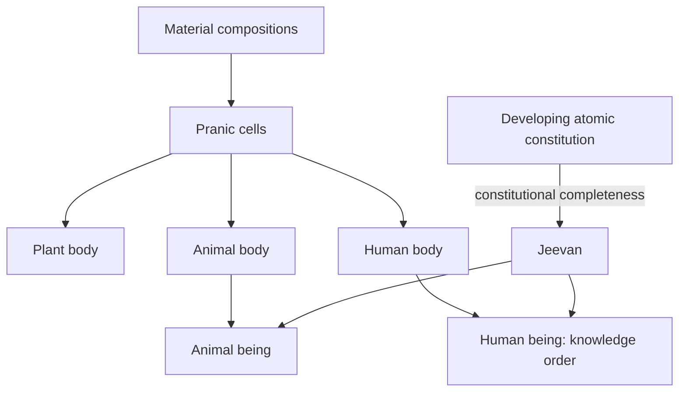
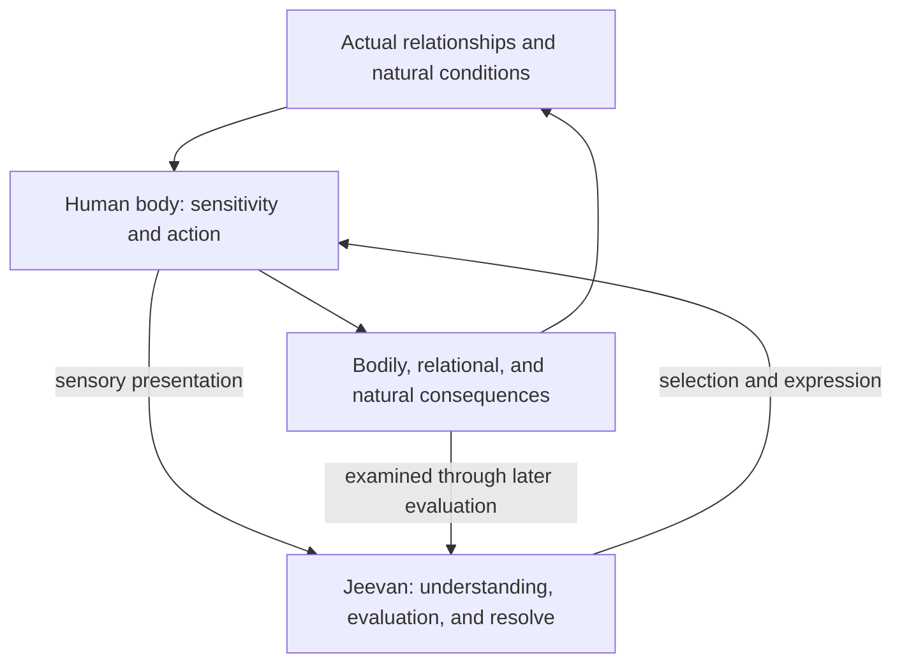

# From Unit Activity to Human Orderliness: A State-Dynamic Reconstruction of Coexistence

**Author:** [AnalyticMadhyasthDarshan.org](https://github.com/raghavamohan/AnalyticMadhyasthDarshan) — a group of people studying Madhyasth Darshan philosophy. Source repository: [raghavamohan/AnalyticMadhyasthDarshan](https://github.com/raghavamohan/AnalyticMadhyasthDarshan).

**Edited on:** September 14, 2026, 7:39 PM IST
**Status:** Released

Coexistence is the inseparable presentness of all-pervading *satta* and countless active units. Every unit persists through activity, meets other units, and participates in the order of nature. Madhyasth Darshan connects this account of existence with a definite human possibility: understanding coexistence, living justly, and establishing an undivided society and universal human order. This study presents that connection as a state-dynamic model.

The explanation begins with unit activity. Effort, motion, and result describe its continuous operation; form, property, essential nature, and *dharma* describe what the unit is and how it participates. Material and pranic compositions establish increasingly developed bodily media. A distinct line of atomic development establishes the constitutionally complete sentient unit, *jeevan*. In the human being, *jeevan* operates through a body capable of expressing knowledge, evaluation, and deliberate action. This makes the human both responsible for the consequences of conduct and capable of understanding how those consequences can fulfil coexistence.

Jeevan's concentric architecture explains the connection between understanding and living. Realisation in *atma*, enlightenment in *buddhi*, contemplation in *chitta*, comparison in *vritti*, and tasting and selection in *mun* participate in one sentient activity. Their harmony becomes evident in values, justice, purposeful work, and shared orderliness. The highest fulfilment is *paramanand*: the continuity of realised coexistence. Its expression in human living includes resolution, prosperity, fearlessness, and coexistence, sustained through humane relationships and an awakened tradition (MVD, pp. 78, 101, 327–328; MAD, reader p. 51; KD 3.12, p. 112).

The study develops this connected account in ordinary language. It follows activity from the unit through the human being to family, society, and universal participation, using a shared garden as a continuing illustration. The appendices contain the mathematical formulation, formal model rules, notation, and proposed methods of assessment. The Editorial Notes explain consequential translation and modelling decisions; §12 identifies the questions that remain open.

## 1. Ontological foundations

Existence is coexistence (*saha-astitva*): the inseparable, perpetual presentness of Omnipresence (*satta*) and countless discrete units (*ikai*). Satta is **state-complete** (*sthitipurna*): unbounded, everywhere uniform, actionless, and non-transforming. Nature is **state-dynamic** (*sthitishil*): every bounded unit is continuously present in state and motion within the state-complete. Existence as a whole neither increases nor decreases, expands nor contracts; development and awakening become manifest within it (MVD, pp. 26, 34–36; SB, pp. 48–50, 248; KD 3.5, p. 70; KD 3.8, p. 84).

### 1.1 Saturation as the source of activeness

Every unit is saturated (*samprikt*) in satta: soaked, submerged, and surrounded in it. Through saturation, the unit is energised, forceful, and intrinsically active. The continuing activity of molecules, atoms, and atomic particles expresses this energy-fullness. Satta permeates units and is present between them, providing the space in which bounded units maintain distance, join, and separate (MVD, pp. 40–41, 46; SB, pp. 57, 61, 69, 248–250; JV, p. 149).

Energy-fullness also grounds natural responsiveness. Particles recognise one another, remain at definite distances, and participate in an atomic constitution. In the first three orders, recognition and fulfilment follow constitution, seed, or species. Actual mutuality supplies the relation faced; appropriate offering and acceptance express complementarity; mediative activity regulates generative and degenerative activity. Human discernment develops this capacity into the conscious knowing and evaluation of relationships (MVD, pp. 48, 154–155; SB, pp. 99, 143–144, 249–251; JV, pp. 69–70).

Satta is also named **absolute energy**, Knowledge, and Space. Its uniform presence is the ground of inspiration. **Relative energy** is the active power of units becoming evident in mutuality, including physical and chemical effects such as pressure, heat, sound, waves, and electricity. The active strength and power belong to the saturated units; satta remains actionless (MVD, pp. 32–36, 40–41, 174; KD 3.13, p. 122). This distinction allows the same account to explain the continuous activeness of nature and the availability of coexistence for human realisation.

### 1.2 A unit and its continuing activity

A unit is a bounded, active reality that persists through change. Its complete activity is **effort–motion–result** (*shram–gati–parinam*). The unit and its activity are distinguishable in meaning and inseparable in existence: a property has its bearer, and the bearer is always active (SB, pp. 256–257). Viewing coexistence as unit activities therefore keeps the active units, their boundaries, and their actual relations in view.

An atom, molecule, compound, cell, or body can be understood as a **closed activity** when its organisation holds together as one bounded whole. Constituents continue their own activities within that whole. Particles also participate as units within and between atomic constitutions. The term closure describes how a whole is organised; the wider category of unit includes the participants through which that organisation is established (§4).

### 1.3 Two descriptions of the same unit activity

Effort, motion, and result describe one complete activity from three connected sides. Effort is the unit's strength in its existent state. Motion is the operation and spreading effect of its power. Result is the configuration realised through that activity. These aspects remain present together throughout the unit's duration (SB, pp. 60–62; KD 3.11, pp. 106–107).

Form, property, essential nature, and *dharma* describe the same active reality in a second way. State and effort are understood through *dharma* and essential nature; motion through essential nature and property; result through form. Essential nature spans state and motion because it is the functional character through which the unit's strength becomes participation. The two descriptions thus connect what a unit is with what it does (§3).

The form available to human imaging is one aspect of this reality. Chitta can image form, property, number, time, expanse, effort, motion, and result. This breadth of imaging helps explain how humans can study an activity rather than only register its appearance (MVD, p. 327). Understanding still requires the relation between these aspects to be recognised correctly.

### 1.4 Continuity through change

Activity continues without a gap. A result becomes the existent condition of further activity; it is already a strength-bearing state in a new mutual situation. A plant's growth, an atom's changed constitution, and a person's completed action each become conditions of what follows. A time interval helps the observer describe this continuity, while the unit continues acting throughout it (SB, pp. 58–62, 248; KD 3.8, p. 84).

Persistence can include a changing configuration. In constitutionally complete jeevan, the particle constitution itself remains fixed while sentient activity continues. What persists and what changes therefore depend on the kind of unit and the activity being considered. The formal treatment of duration and persistence is given in Appendix A.

### 1.5 Mutuality and complementarity

Every activity takes place in a mutual situation. Distance, contact, containment, nourishment, and relationship condition what units can do together. One unit's result changes the conditions encountered by others. Complementarity is evident where recognition, offering, acceptance, and fulfilment sustain the participants and their orderliness (SB, pp. 143–144, 249–251; JV, pp. 69–70).

Mediative activity maintains balance while formation and dissolution occur. Natural orderliness therefore includes movement, exchange, growth, and renewal. In human living, this same question becomes conscious: what is the actual relationship, what fulfilment does it require, and does present conduct provide it? The knowledge order brings these relations into understanding and responsible participation.

## 2. Effort, motion, and result

The state-dynamic model follows how complete activities condition later complete activities. It begins with the unit's strength, considers the mutual situation in which its power operates, and identifies the result that becomes available for further participation.

### 2.1 Result and the fuller situation

*Parinam*, in the effort–motion–result description, is the different existent configuration established through activity (KD 3.11, p. 107). The fuller situation also includes the unit's constitution, mutual relations, and relevant internal conditions. Form presents the configuration; the complete description explains why that configuration matters.

In human activity, a bodily result may have relational and natural consequences. Water has reached a garden bed, for example, but another household may now lack its agreed share. The physical result and the fulfilment of responsibility must both be understood. This distinction becomes central to evaluation in §§8–11.

### 2.2 Effort (*shram*) as strength in state

Effort is the expression of strength (*bal*) in the unit's existent state. Strength is related to being an orderliness; power (*shakti*) in motion is related to participation in the larger orderliness. The unit bears strength continuously, and its power becomes effective in mutuality (KD 3.11, pp. 105–107).

The content of effort is understood through *dharma* and essential nature: what the unit maintains and the way it functions. In human living, effort can be divided by contradiction or become restful through resolution. The development of restfulness concerns the quality and harmony of activity while the capacity to act continues.

### 2.3 Actual mutuality and operative recognition

The actual relation and the relation recognised by the participant must be considered together. Material and pranic units recognise and fulfil according to constitution and seed; animals act through species-conformant recognition. Human beings can know, believe, recognise, and fulfil, and can also act from mistaken belief (JV, pp. 69–70).

A relationship remains actual when it is misunderstood. A caregiver's responsibility, for example, is present even when inconvenience is taken as a reason to neglect it. Evaluation must establish the participants, their needs and capacities, the relationship involved, and the consequences of the response. Correct recognition makes appropriate fulfilment possible.

### 2.4 Motion (*gati*) as power in operation

Motion is the unit's power in operation: displacement, configuration change, and other activity appropriate to its order. Generative, degenerative, and mediative tendencies describe how that power becomes effective. Essential nature gives the expression its functional meaning in the particular order (MVD, p. 26; SB, pp. 60–62; KD 3.10–3.11, pp. 100–107).

Mediative regulation can remain active while generative or degenerative activity occurs. A growing body, for example, incorporates and releases material while maintaining its organisation. Natural-state motion is continuing activity under definite conduct; excitation describes a changed mutual condition in which that conduct is disturbed.

### 2.5 State-pressure and excitation-pressure

Pressure has two related senses. Force in state is recognised as pressure, and power in motion as flow. **State-pressure** names this general expression. **Excitation-pressure** names the received compulsion present in an excited mutual situation. Departure from a good mutual distance and its restoration provide a material illustration (SB, pp. 49, 59, 256; KD 3.11, pp. 103–106; KD 3.13, p. 118).

Both senses belong to the strength and power of units in mutuality. The narrower sense applies when excitation is evidenced. Human dissatisfaction and unfulfilled responsibility require their own evaluation; calling every such difficulty pressure would obscure its particular cause.

### 2.6 Result and continuing activity

As power operates, a result becomes evident and immediately participates in further mutuality. Effort, motion, and result are co-present within this continuity. Describing successive results lets us follow what has changed without dividing an activity into three separate stages (MVD, pp. 40, 114; SB, pp. 58–62; KD 3.11, p. 107).

Material and pranic activity continues through constitution, seed, and environmental conditions. Animal activity includes recognition, tasting, and selection in service of the hope to live. Human activity includes the later evaluation of conduct and the refinement of understanding and *sanskar*. Each case preserves the same complete activity while adding the capacities and responsibilities of its order.

## 3. Form, property, essential nature, and *dharma*

The four aspects provide a connected ontology of the active unit. Form makes its configuration available; property becomes effective in mutuality; essential nature gives that activity its functional character; *dharma* states its innateness and fulfilment. Reading the aspects together makes it possible to proceed from recognition of appearance to understanding of participation (MVD, pp. 47, 49–51; SB, pp. 60–62).

| Aspect | What it identifies | Connection with activity |
|--------|--------------------|--------------------------|
| Form (*roop*) | Bounded configuration: shape, volume, density or mass | Configuration evident as result |
| Property (*guna*) | Relative power and effect in mutuality | Power expressed in motion |
| Essential nature (*svabhav*) | Fundamental functional character and usefulness | The character joining strength in state with power in participation |
| *Dharma* | Innateness: what is borne and maintained throughout an order | What continuing existence and fulfilment mean for that order |

### 3.1 Form (*roop*): bounded configuration

Form is the spatial configuration and boundary-framework of the unit. Shape, volume, and density or mass distinguish how it is presently formed and available for reflection. Reflection presents a real form to another unit; correct recognition relates that appearance to the reality whose form it is (MVD, pp. 42, 49–50; SB, pp. 249–250; KD 3.9–3.10, pp. 94, 100–101).

A unit can retain its identity, constitutional kind, and *dharma* while its form changes. Similarity of appearance can also accompany different constitutions and functions. Understanding therefore proceeds from form to the property, essential nature, and *dharma* that explain the unit's participation.

### 3.2 Property (*guna*): relative power in motion

Property is relative power: effect and influence becoming evident when units meet. Its three general tendencies are generative (*sam*), degenerative (*visam*), and mediative (*madhyastha*). They express formation, dissolution, and the maintenance or regulation of what is formed (MVD, pp. 40, 47, 49–50; SB, pp. 248–252, 256–257).

These tendencies can operate together. Mediative regulation maintains an organisation while its components undergo generative and degenerative activity. The model therefore describes their qualitative participation in a situation rather than assigning each unit a single permanent tendency.

Property and essential nature answer different questions. Property identifies the relative effect of power; essential nature identifies its functional meaning in the order concerned. Generative activity, vitalising activity, and humane generosity occupy different places in the account. In humans, understanding directs the expression of existing power toward mediative conduct; delusion can express it through exploitation and conflict (KD 3.10, pp. 100–102).

### 3.3 Essential nature (*svabhav*): fundamental character and usefulness

Essential nature is fundamental character (*maulikata*) and the usefulness (*upayogita*) of properties. Usefulness here identifies what an activity does in the mutual situation. Material units integrate or disintegrate; pranic units vitalise or devitalise; animals express cruel or non-cruel conduct; humans can express human-opposing, humane, and higher-humane conduct (MVD, pp. 47, 50–51, 57–58; SB, pp. 179–180).

This functional meaning is the bridge between ontology and value theory. To evaluate a unit or an action is to understand its real participation and fulfilment. A plant's nourishing or harmful effect has to be recognised according to the plant, the recipient, and the conditions of use. Human preference alone cannot settle that effect.

Human essential nature is refinable. Baseness, wretchedness, cruelty, covetousness, and causing pain can give way to fortitude, courage, generosity, kindness, grace, and compassion through education, study, and awakening. Human *dharma* remains happiness throughout this change. Refinement brings the person's functional character into harmony with that continuing aspiration (MVD, p. 124; KD, pp. 8–9, 26–27; KD 3.9, pp. 98–99).

### 3.4 *Dharma*: innateness and fulfilment

*Dharma* is innateness (*dharana*): what is borne, maintained, and inseparable from an entire order. Its contents are cumulative. Material existence bears existence; the pranic order includes growth; the animal order includes hope to live; the knowledge order includes happiness (MVD, pp. 47, 50–51, 115; SB, p. 179).

The *dharma* of an established order remains definite while its units act and change. A new composition can manifest a different order while its constituents retain their own kinds. Constitutional completeness establishes jeevan through the distinct atomic line. The resulting animal or human association is understood through the cumulative fulfilment of its manifested order (§6).

Dharma gives the meaning of fulfilment; the saturated unit's strength and power carry its activity. Constitution, seed, species, and human understanding explain how fulfilment becomes evident. In the knowledge order, happiness itself becomes an object of inquiry. Understanding what sustains happiness enables resolution and appropriate participation in relationship, work, and society (JV, pp. 110, 121–123; KD 3.5, p. 69).

### 3.5 The four orders

| Order | Manifestation | Cumulative *dharma* | Characteristic conformance and participation |
|-------|---------------|--------------------|-------------------------------------------|
| Material | Atoms, molecules, compounds, minerals | Existence | Constitution and result; integration and disintegration |
| Pranic | Cells and plant bodies; animal and human bodies considered as bodily media | Existence and growth | Seed and bodily lineage; vitalising and devitalising |
| Animal | Animal body associated with jeevan | Existence, growth, and hope to live | Species; sentient recognition of friendliness and opposition |
| Knowledge | Human body associated with jeevan | Existence, growth, hope to live, and happiness | Sanskar; knowing, evaluation, and responsible fulfilment |

Law (*niyam*), regulation (*niyantran*), and balance (*santulan*) are already evident in integrated nature. Material lawfulness, pranic regulation, and animal balance identify characteristic expressions of this orderliness. Human beings must understand and establish them consciously through conduct, work, and shared arrangements (SB, pp. 235–236). Humans belong to the knowledge order in both delusion and awakening; awakening fulfils the capacity and responsibility already present in that order.

### 3.6 Three ways of maintaining order

**Structural closure** establishes a bounded whole. A molecule, compound, cell, or body holds together through the coordinated activities of its constituents and presents its own conduct. Natural recognition maintains the organisation through constitution or seed.

**Joint association** connects constitutionally complete jeevan with a pranic body. Body and jeevan remain distinct units whose association manifests an animal or human being. The body provides the medium through which sentient activity participates in the bodily and surrounding world.

**Maintained relational order** connects persons through relationships, families, work, and social institutions. Its just continuation depends on recognising responsibility, fulfilling values, providing means, evaluating consequences, and educating successors. A society remains an organisation of participating persons, each with their own jeevan and responsibility. This distinction explains why human order needs conscious maintenance even though coexistence and natural orderliness are already established.

## 4. Closure and the insentient line

The insentient line (*jada*) includes material and pranic activity. Atoms, molecules, cells, and bodies have distinct organisations. Composition establishes further bounded wholes; atomic development concerns the constitution of the atom itself. Keeping these two processes clear explains how bodily development and the emergence of jeevan contribute differently to animal and human existence.

### 4.1 Constraints of the material field

Atomic constitution (*gathan*) concerns the number and arrangement of particles in the nucleus and orbits. Hungry and overfull atoms absorb or displace particles, establishing further definite atomic results. The atom is the root unit of independent material existence; particles participate within and between its constitutions (KD 3.1–3.3, pp. 56–62).

Molecular-bondage concerns atoms joining other atoms at a definite mutual distance. Weight-bondage concerns the weight-bearing relations of constitution-oriented atoms and their compositions. These relations differ from the internal particle constitution of an atom. Constitutionally complete jeevan is free of molecular- and weight-bondage (§6.1; MVD, p. 91; KD 3.11, pp. 103–104).

### 4.2 Closure as activities holding together

In particle exchange, atoms condition each other's activity and subsequently continue with changed constitutions. In molecular joining, their mutual relation persists. Complementary participation can establish a compound with its own bounded conduct: the constituents continue within an organisation whose public conduct belongs to the compound as a whole. In a mixture, the components continue to exhibit their respective conducts (MVD, p. 42; KD 3.1, pp. 57–58; KD 3.11, pp. 103–104).

The model calls the establishment of such a whole **closure**. The whole has its own form, property, essential nature, and *dharma*, while its constituents continue according to their kinds. Disintegration ends that organisation and changes the constituents' relations. Their activity continues in the resulting situation.

### 4.3 Kinds of closed activity in the compositional line

Under conducive conditions, material composition proceeds through atoms and molecules, compounds and minerals, nourishment- and composition-elements, pranic cells, and plant, animal, and human bodies. The developed human bodily medium provides the greatest compositional capacity for the expression of knowledge in this sequence (KD 3.2, pp. 58–60).

| Kind of organisation | What holds together | Continuing conformance |
|----------------------|---------------------|------------------------|
| Atomic constitution | Particles in nucleus and orbits | Constitution and result |
| Molecule, compound, or mineral | Material constituents in definite mutual organisation | Structure and chemical activity |
| Pranic cell | Material composition through the method of the prana sutra | Seed |
| Plant body | Cells in a living bodily organisation | Seed |
| Animal or human body | Cells in a species-appropriate bodily medium | Seed and bodily lineage |

The diagram brings two lines together. Composition supplies the bodily media; constitutional completeness establishes jeevan. Plant bodies belong to the pranic order. Animal and human orders become manifest through the respective body–jeevan associations (JV, pp. 47–48). The composition of the human body and the existence of its jeevan therefore have distinct explanations.

### 4.4 Nested dependence and existential progression

Molecules require atoms; pranic cells require appropriate chemical substances, nourishment, heat, and the composition-method of the *prana sutra*; bodies require cells. Animal and human activity requires the appropriate body together with jeevan. The body follows lineage tradition, while jeevan has its own continuing identity (KD 3.2, pp. 58–60; JV, pp. 47–48, 59).

**Existential progression** (*niyati-kram*) is the definite sequence in which material, pranic, animal, and knowledge orders become manifest on this earth under conducive conditions. The **way of existence** (*niyati-vidhi*) is the conformance through which an established unit maintains definite conduct (MVD, pp. 8, 13). These concepts explain the dependence and direction of development. Each order continues participating in coexistence as later capacities become manifest.

### 4.5 Intrinsic activeness and conditions of development

Saturation grounds the continuing activeness of every unit. A particular change occurs through that unit's strength and power in actual mutuality. Distance, temperature, chemical constitution, mutual pressure, nourishment, and complementary participation establish the conditions for exchange, joining, growth, and further organisation (MVD, p. 114; SB, pp. 59–62; KD 3.11, pp. 102–109).

Development and awakening give this progression its purposive meaning. Insentient impulsion is oriented toward development; sentient development reaches fulfilment in awakening (MVD, p. 230). The account connects this direction with the conditions through which it becomes manifest. The physical identification of constitutional completeness remains a research question, while the necessity of knowledge for conscious human fulfilment is developed in §9.4.

## 5. Coupled units across orders

Material and pranic units, animals, and humans participate in the same coexistence. Their activities meet through distance, contact, containment, nourishment, bodily association, and relationship. The model follows a definite situation with its participants and surrounding conditions, so that each result can be related to the units and responsibilities it affects.

### 5.1 Many units in one situation

A garden contains material substances, plants, animals, human bodies, and human participants. Each retains its kind and activity. Soil and water participate in plant nourishment; plants alter the conditions of the soil; animals select and act through their bodies; humans understand, plan, work, and evaluate. Form is reflected and property becomes effective in these actual encounters (MVD, pp. 47, 49–50; SB, pp. 249–252).

The relevant surroundings depend on the activity being examined. A cell's conditions include its containing body and the constituents it encounters. A gardener's responsibility also includes people elsewhere who depend on the water or food. Defining the situation therefore requires attention to both immediate contact and the actual reach of an action.

### 5.2 Structural relations and fulfilment

How participants are organised and what they fulfil are connected but distinct questions.

| Relation | Organisation | Fulfilment to examine |
|----------|--------------|-----------------------|
| Material mutuality | Exchange, joining, or separation | Definite constitution and complementary participation |
| Pranic dependence | Nourishment, growth, and bodily organisation | Vitalising conditions and continued integrity |
| Body–jeevan association | A bodily medium for sentient activity | Species-appropriate or human expression |
| Human relationship and contact | Persons recognising and acting with others | Values, responsibility, justice, and shared purpose |

Overfull atoms displace particles and hungry atoms absorb them; molecular joining maintains atoms at a good mutual distance. Pranic bodies take nourishment according to seed-conformance. Animals recognise friendliness and opposition through species-conformance. Humans can know, believe, recognise, and fulfil with all four orders (KD 3.1, pp. 56–58; KD 3.11, pp. 103–104; JV, pp. 69–70).

Human participation with nature includes use, right-use, protection, and regeneration. Taking more than can regenerate damages the relation on which continuing provision depends. Human–human participation also distinguishes relationship (*sambandh*), whose expectations concern completeness, from contact (*sampark*), whose expectations arise through voluntary association (MVD, pp. 61–62, 105, 264; JV, pp. 58, 77).

### 5.3 Interaction across orders

The function of an activity depends on the participants and their orders. Material activity integrates or disintegrates; pranic participation vitalises or devitalises; animal conduct is cruel or non-cruel; human conduct can fulfil or oppose humane values. The general tendencies of property acquire these particular functional meanings in actual mutuality (MVD, pp. 50–51; SB, p. 179).

Human freedom makes correct evaluation decisive. The same access to water can nourish a shared garden or deprive another household. Understanding must connect the resource, the participants, their needs, the recognised responsibility, and the actual result. Knowledge enables humans to maintain the natural conditions of provision together with justice among the people concerned.

### 5.4 The four aspects of a containing activity

A containing whole presents its own conduct. A compound has the compound's form and chemical activity; a body maintains a bodily organisation through its cells. Constituents constrain what the whole can do, and the whole provides conditions under which their activities continue. Each level is needed to explain the actual organisation (MVD, p. 42; SB, p. 260).

The whole's form is its bounded configuration; property is its effective power in mutuality; essential nature is its order-specific function; *dharma* is the innateness of its order. Constituents retain their own kinds and four aspects. This makes it possible to understand a growing body as one pranic organisation while following the material activities on which it depends.

A body–jeevan association has a different structure: the body remains a pranic whole and jeevan remains a sentient unit. A human organisation has yet another structure: persons maintain relationships and shared work through recognition, values, and responsibility. The account therefore preserves the different forms of organisation introduced in §3.6 as it moves toward society.

### 5.5 A material example: exchange and restored motion

Consider an overfull atom, a hungry atom, and a displaced particle in mutual facing. The atoms begin with definite constitutions and complementary requirements. Excitation precedes displacement. The displaced particle can be absorbed, changing the constitutions, after which the atoms continue in their respective natural-state motions (KD 3.1, pp. 57–58).

Throughout the change, every participant remains active. Its strength is present, its power operates, and a result becomes evident. If subsequent participation establishes a compound, a further containing organisation is formed. If it establishes a mixture, the components retain their respective public conducts. The example shows how the model follows continuing units, changed relations, and the establishment or dissolution of a whole.

## 6. Constitutional completeness and joint forms

**Constitutional completeness** (*gathanpurnata*) is the completion of atomic development in which an atom becomes jeevan. The number of particles in its nucleus and orbits becomes invariant, and the constitution ceases the increase and decrease characteristic of developing atoms. This is the beginning of the sentient line (SB, pp. 55, 61, 92, 144–145; KD 3.3, pp. 60–62).

The development of insentient activity is also described through *kshobh*, the frustration of effort that gives rise to the thirst for restfulness. Sentient development carries that orientation toward awakening and fulfilment (MVD, p. 91). Bodily composition supplies a medium for its manifestation, while constitutional completeness establishes the enduring sentient unit itself.

### 6.1 Constitutional completeness and invariant constitution

At constitutional completeness, the atom becomes free of molecular- and weight-bondage and enters **hope-bondage** (*asha-bandhan*). Its particle constitution remains complete, its strength and power are inexhaustible, and its activity continues. Later awakening develops the effectiveness and harmony of sentient activity within that continuing constitution (MVD, p. 91; SB, pp. 55, 58, 61, 92; KD 3.16, pp. 142–145).

Jeevan has a nucleus and four successive orbits. The nucleus is *atma*; the first orbit is *buddhi*, the second *chitta*, the third *vritti*, and the fourth *mun*. Satta permeates the particles throughout this architecture (MVD, p. 78). Section 7 connects these positions with their faculties, activities, and values.

Hope-bondage belongs to the enduring jeevan. It is expressed as hope to live in the animal order; in human living, the cumulative aspiration includes happiness (MVD, pp. 77, 91). Jeevan remains constitutionally complete through association and separation from a body. Its acquired dispositions also require a continuing account: separation ends the particular bodily interface, while jeevan's identity and refinable *sanskar* continue. Appendix A keeps these together in one persistent description.

### 6.2 Pranic bodies as living media

A pranic cell has a composition-method associated with the *prana sutra*. With appropriate substances, nourishment, heat, and environmental conditions, cells form bodies that respire, take nourishment, grow, reproduce, decline, and disintegrate according to seed-conformance (KD 3.2, pp. 58–60; JV, pp. 47–48).

Growth and repair ordinarily modify an existing bodily organisation. Cell division and reproduction can establish further organised units. Death ends the body's maintained integrity and its constituents continue in other material and pranic relations. This distinction lets the model follow both persistence and the formation of new wholes without treating every increment of growth as a new body.

The four aspects describe this living medium: its bodily form, effective power, vitalising or devitalising participation, and the cumulative *dharma* of existence and growth. Seed-conformance explains its continuing organisation. Animal and human bodily media belong to this pranic account while their associations with jeevan manifest the respective sentient orders.

### 6.3 The animal joint form

An animal is a joint form of a pranic body and constitutionally complete jeevan. Recognition of friendliness and opposition, tasting, selection, and bodily sensitivity serve its hope to live according to species-conformance (SB, pp. 55, 249; JV, pp. 38–39, 47–49, 69–70).

The animal's public form is presented through its body; its power and essential nature become evident in its conduct; its cumulative *dharma* includes existence, growth, and hope to live. All five faculties belong to jeevan's constitution. The specifically human task of understanding justice, *dharma*, and truth is addressed through the human medium and its capacity for knowledge. Animal recognition should therefore be understood in its own species-conformant scope.

An animal's activity changes its bodily and surrounding situation, which conditions what it encounters next. The model can describe this continuity while preserving the distinction between animal recognition and the human evaluation of belief, values, and responsibility.

### 6.4 The human joint form and its interface

In the human being, jeevan operates through a developed pranic body. Sound, touch, sight, taste, and smell provide bodily sensitivity. Jeevan cognises and accepts, images and analyses, resolves and selects, and expresses activity through the body. The balance of cognisance and sensitivity makes understanding effective in embodied living (KD 3.10, p. 102; KD 3.16, pp. 141–145; JV, pp. 47–49, 59; SB, pp. 63–64).

The constitution of jeevan remains complete while understanding and *sanskar* develop. A particular bodily association makes that development observable through expression, conduct, and consequences. The continuing identity of jeevan across bodily spans is treated further in [Death, Continuity, and Rebirth](../Death-Continuity-And-Rebirth/Death-Continuity-And-Rebirth.pdf). Here the explanation follows how the human association makes knowledge, value-fulfilment, and awakened tradition possible.

## 7. Knowledge and the internal configuration of *jeevan*

The human being brings together a living body and *jeevan*, the sentient unit. The body supplies the means of sensing, speaking, and working. *Jeevan* understands, accepts, recognises, and fulfils through that association. Its constitution persists while its understanding and conduct develop. The concentric architecture makes this development intelligible: the same five faculties support sensory engagement, inquiry, realised understanding, and its expression in humane living.

### 7.1 Two uses of Knowledge

Knowledge names the omnipresent reality of *satta* and its unfolding in human understanding. Satta is called *chetana* in relation to sentient nature, *chaitanya*. It remains actionless, complete, and continuously present to every unit. Units are saturated in that ground and remain active in mutuality. Knowledge unfolds through *jeevan*'s realisation of coexistence and becomes evident as wisdom, science, and humane activity. In realised living, coexistence is understood, accepted, and fulfilled through participation (MVD, pp. 32–36, 97–100, 174).

The connection reaches from natural orderliness to conscious participation. Lawfulness becomes evident in definite activity, regulation maintains its appropriate course, and balance consists in mutually sustaining participation. Human beings understand these relations, establish justice in behaviour, live with resolution and participation in orderliness, and realise coexistence as truth. Knowledge thereby becomes evident through law, regulation, balance, justice, *dharma*, and truth (MVD, p. 174). The completeness of *satta* is the standing ground of this unfolding; awakening is the fulfilment of the knowing unit.

Complete knowledge comprises coexistence, *jeevan*, and humane conduct. Enlightenment in *buddhi* encompasses all three. Realisation in *atma* concerns truth as coexistence, and humane conduct presents that understanding through values, character, and ethics. *Jeevan* is the knower; the embodied human being presents the evidence through thought, behaviour, and work. Its purpose extends to participation in undivided society and universal orderliness (MVD, pp. 13, 155–156, 260, 300; KD 3.16–3.17, pp. 145–148). The relation between knower, known, and evidence is developed further in [*The Epistemology of Coexistence*](../The-Epistemology-of-Coexistence/The-Epistemology-of-Coexistence.pdf), §§1.1–1.5.

### 7.2 Sensitivity, cognisance, and conformance

Sensitivity is embodied responsiveness through sound, touch, sight, taste, and smell. Cognisance is the capacity through which *jeevan* understands and accepts reality, relationship, value, and purpose. Their balanced functioning allows the human being to recognise what is present and fulfil the relationship appropriately. Awakening establishes the governance of sensitivity by cognisance: bodily needs and sensory experience find their place within understood human fulfilment (SB, pp. 63–64; KD 3.10, p. 102).

The animal body–*jeevan* association expresses sentience through species-conformant recognition, tasting, and selection. Human imagination and freedom of action extend participation to inquiry, invention, deliberation, and chosen conduct. A person can understand what an activity is for, consider its consequences, and revise an accepted purpose. These capacities carry the aspiration from continued bodily living to living with continuous happiness (JV, printed pp. 47–48, 67–68, 72–74).

Lower-conformance names the influence of vitality, senses, body, and accustomed behaviour upon *mun*. This influence supplies information necessary for bodily maintenance. Higher-conformance names the governance of tasting and selection through *vritti*, *chitta*, *buddhi*, and *atma*. In realised living, *mun* selects in accordance with justice, thought remains resolved in *dharma*, and understanding is grounded in truth as coexistence. The two directions meet in one human activity: a bodily need is recognised, its place in the relationship is understood, and suitable means are selected (MVD, pp. 155–156, 208, 276–277).

### 7.3 Five state-motion pairs and the activity vocabulary

*Jeevan* has a centre and four successive orbits. *Atma* is the central faculty; *buddhi*, *chitta*, *vritti*, and *mun* occupy the first, second, third, and fourth orbits respectively. *Satta* pervades the whole constitution and every constituent. These locations belong to one integrated sentient unit (MVD, p. 78).

Each faculty has one generic pair of activities. The activity in state is expressed as strength, and its paired activity in motion as power. The detailed vocabulary elaborates these five pairs through named forms of realised conduct (KD 3.6, pp. 71–72; MVD, pp. 78, 323; AVD, pp. 91–94).

| Constitutional location | Faculty | Generic activity in state | Generic activity in motion | Detailed pairs |
|---|---|---|---|---:|
| Centre | *Atma* | Realisation, *anubhav* | Authenticity and evidence, *pramanikta* | 1 |
| First orbit | *Buddhi* | Enlightenment, *bodh* | Resolve, *sankalp* | 2 |
| Second orbit | *Chitta* | Contemplation, *chintan* | Imaging, *chitran* | 8 |
| Third orbit | *Vritti* | Comparison and deliberation, *tulana* | Analysis, *vishleshan* | 18 |
| Fourth orbit | *Mun* | Tasting, *asvadan* | Selection, *chayan* | 32 |

The five generic pairs express ten activities. Their detailed elaboration comprises sixty-one pairs and a hundred and twenty-two named activities. At the generic level, realisation and evidence, enlightenment and resolve, contemplation and imaging, comparison and analysis, and tasting and selection belong together. At the detailed level, each pair has a specific meaning in awakened conduct. For example, courage makes justice accessible to others, while fortitude is firmness in living with justice; their meanings include actual participation (MVD, p. 338). The complete inventory and definitions remain in [*The Sixty-One Activity Pairs of Jeevan*](../The-Epistemology-of-Coexistence/Research-Note-Activity-Pair-Inventory.pdf).

Three orientations are visible through this architecture. In body-governed living, prevailing sensory hopes organise thought and imaging. In study, acceptance opens to deliberation, direct recognition, enlightenment, and realisation. In realised expression, coexistence understood in *atma* informs resolve in *buddhi*, contemplation and imaging in *chitta*, comparison and analysis in *vritti*, and tasting and selection in *mun*. Bodily conduct then presents this orientation in the world, where its consequences become available for renewed evaluation (MVD, pp. 126, 276–277, 322–327).

These are relations of understanding and governance within the continuously active whole. In a single act of care, a person understands the relationship, considers the need, imagines suitable provision, weighs the available means, and selects what to do. The concentric organisation connects the act to its purpose and to the harmony discussed in §10. Its fuller architectural treatment is in [*Jeevan's Concentric Architecture and the State-Dynamic Model*](Technical-Note-Jeevan-Concentric-Architecture-And-The-State-Dynamic-Model.pdf).

### 7.4 The sixfold governing grammar

Law, regulation, balance, justice, *dharma*, and truth describe connected aspects of orderliness. Lawfulness, *niyam*, concerns definite conduct and the conditions appropriate to it. Regulation, *niyantran*, concerns maintaining that conduct. Balance, *santulan*, concerns mutually sustaining participation. These are evident throughout nature and become objects of understanding and responsibility in human work (MVD, pp. 32, 48, 154, 174; SB, pp. 231, 235–236).

Justice, *nyaya*, establishes recognised and fulfilled relationship through evaluation and mutual satisfaction. Human *dharma* is happiness, fulfilled through resolution and participation in orderliness. Truth, *satya*, is coexistence realised as the complete reality. Together they orient the human being's deliberation: an activity must fulfil the actual relationship, contribute to comprehensive fulfilment, and accord with what exists (MVD, pp. 100, 137, 287, 311, 336–337; JV, printed pp. 97–98, 137–139).

The faculties make these questions effective. *Mun* tastes and selects in the recognised relationship; *vritti* compares intended and actual fulfilment through justice, *dharma*, and truth. *Chitta* contemplates and images the situation in its wider connections. *Buddhi* understands and resolves in the light of coexistence realised in *atma*. The same truth is therefore relevant to deliberation, imaging, enlightenment, and realisation, according to the activity of each faculty (MVD, pp. 98–100, 125–126, 328, 335–337).

This yields three useful questions in practice. Does conduct follow the law of the relationship and establish justice? Does its regulation sustain resolution and the fulfilment of human *dharma*? Does the whole arrangement preserve balance when examined in the light of coexistence? Each question draws upon the whole faculty organisation. Their detailed analytical correspondence is retained in Appendix C.

Consider teaching in a shared garden. The relationships require guidance, care, and an opportunity to understand. Regulation includes suitable tools, supervision, inquiry, and correction. Balance includes the learners' bodily needs, the family's provision, and the soil's continuing fertility. Justice concerns whether the responsibilities to the participants are fulfilled; *dharma* concerns the contribution to resolved and sufficient living; truth requires an adequate account of the whole activity and its consequences. These six considerations give concrete content to one undertaking.

### 7.5 Realised knowledge as orientation

Study develops understanding through the faculties already present in *jeevan*. Meaning is first accepted for consideration in *mun*, examined through qualitative deliberation in *vritti*, directly recognised in *chitta*, and enlightened in *buddhi*. Realisation in *atma* concerns truth as coexistence. The learner's own recognition and understanding are the accomplishment of this movement (MVD, pp. 97–100, 126; JV, printed p. 61).

Realised understanding then organises expression. *Buddhi* resolves in accordance with realisation; *chitta* contemplates the relationships and images their fulfilment; *vritti* deliberates through justice, *dharma*, and truth; *mun* tastes the value and selects its expression through the body. Complete knowledge of coexistence, *jeevan*, and humane conduct supplies the content of this living orientation (MVD, pp. 100, 276–277; KD 3.6, pp. 71–72; KD 3.17, pp. 145–148).

Practice, *sadhana*, has a corresponding relation between seeker, means, and aim. The human being uses internal means—hope, thought, desire, and resolve—and external means—the body and produced things—to establish accordance with realised coexistence. Inquiry, work, relationship, self-examination, and refinement bring these means into purposeful use. The aim gives direction to practice, and practice makes its meaning available in lived evidence (MVD, pp. 322–323).

A person can already recognise and fulfil a particular value while fuller understanding remains to be developed. Parental care and generosity can be present even within a deluded orientation (MSM, printed p. 49). Such participation gives the learner something real to examine: what was recognised, what was fulfilled, and where the understanding remained partial. Study deepens this discernment until humane participation becomes comprehensive and dependable.

### 7.6 Initial *sanskar* and deluded evaluation

Every person acts from present acceptances and tendencies. *Sanskar* includes what becomes established through doing, causing others to do, and consenting to what is done. Family life, education, customary practice, reflection, and repeated choices contribute to it. Wholesome *susanskar* supports understanding and humane participation; unwholesome *kusanskar* sustains mistaken acceptance and its conduct. Responsibility therefore extends into teaching, coordination, and endorsement as well as direct action (MVD, pp. 90, 94).

In delusion, identification of *jeevan* with the body makes the pleasant, the beneficial to the body, and the profitable the prevailing references for evaluation. Tasting, selection, analysis, imaging, and the sensory half of comparison constitute the four-and-a-half effective generic activities. The full constitution and its ten activities remain present; their comprehensive understanding and expression await awakening (MVD, pp. 58, 66–67, 78–81; JV, printed pp. 72–74). *Mun*'s detailed vocabulary already extends across relationship, responsibility, and inquiry: twenty-two of its pairs concern these wider activities, and ten concern sensory and work organs (MVD, pp. 339–348; AVD, pp. 93–94).

Tasting itself admits three orientations. Preference-based tasting, *ruchi-mulak asvadan*, concerns sensory enjoyment. Value-based tasting, *mulya-mulak asvadan*, concerns the recognised and fulfilled relationship. Goal-based tasting, *lakshya-mulak asvadan*, concerns participation in resolution, prosperity, fearlessness, and coexistence. Sensory enjoyment takes its appropriate place within the latter two: a pleasant meal can nourish the body, express care, and contribute to family sufficiency (PS, printed pp. 40–41).

Evaluation can overvalue, undervalue, or mistake what is present. Over-evaluation assigns a value greater than the actual essentiality of what is present; under-evaluation assigns a lesser value; mis-evaluation takes something to be other than it is. Freedom from these distortions and the attachment they sustain is *nirakarshan*. It develops through correct recognition and evaluation, enabling the person to engage with things and relationships according to their actual meaning (MVD, pp. 152–153, 306; SB, p. 146).

Imagination and freedom make both error and correction consequential. A person can devise a useful tool, ask a new question, help another understand, or extend a mistaken purpose across many relationships. The aspirations for family, wealth, and wider recognition acquire humane direction through sufficient provision, responsible participation, and the dissemination of awakening (MVD, pp. 319–321; SB, pp. 19–20, 283–284). Partial care and mixed motives are intelligible within this developing orientation; fuller awakening establishes their consistent governance by justice, *dharma*, and truth.

### 7.7 Knowing, believing, recognising, and fulfilling

Knowing, believing, recognising, and fulfilling belong together in human evidence. Knowing understands reality; believing is acceptance, which can be grounded in understanding or remain mistaken; recognising discerns the relationship as it is presently apprehended; fulfilling accomplishes participation in it. In awakened living, acceptance and recognition accord with knowing and participation fulfils the actual relationship. Their agreement becomes visible when a person can explain a responsibility, recognise it in a changing situation, undertake it, and examine its fulfilment (JV, printed pp. 69–70).

Their development can be uneven. A learner may repeat a sound explanation yet struggle to recognise its application. Another may recognise a duty but lack the means to carry it out. A child may perform a useful task under guidance before understanding its purpose independently. Each case calls for a different response: clarification, practical assistance, further inquiry, or practice. Attention to these distinctions makes education responsive to the learner's actual situation.

Reception of humane value-conduct, *aapyayan*, and refinement, *parimarjan*, connect the teacher's participation with the learner's development. Through attention, dialogue, observation, and work, hope, thought, desire, and resolve become clearer and better directed. The teacher offers content and an example; the learner recognises its meaning and tests it in participation. Independent understanding becomes evident when the learner can carry the responsibility into a new situation and help another understand it (MAD, reader p. 45; MVD, pp. 83, 94; JV, printed p. 165).

The relation between knowing and fulfilment also directs self-evaluation. An honest account asks what was understood, what was accepted, what relationship was recognised, and what was actually accomplished. This makes both partial success and a remaining difficulty available for refinement. The corresponding formal distinctions are developed in Appendix A.

### 7.8 Humane conduct as knowledge-content

Humane conduct joins values, character, and ethics. Values concern recognised and fulfilled participation. Character gives firmness to rightful ownership, marital faithfulness, and kindness in work and behaviour. Ethics directs body, mind, and wealth toward right-use and protection. Together they give lived content to complete knowledge (JV, printed pp. 54–55; KD, p. 67; MVD, pp. 305–306).

The canonical enumeration comprises thirty value positions in five families. Their principal expression spans the four dimensions of human living: realisation, thought, behaviour, and work (PS, printed pp. 149, 151, 154; MVD, pp. 203, 305–306; JV, printed pp. 137–139).

| Value family | Positions | Content | Principal dimension of expression |
|---|---:|---|---|
| *Jeevan* values | 4 | Happiness, peace, contentment, bliss | Realisation-based living and experienced fulfilment |
| Human values | 6 | Fortitude, courage, generosity, kindness, grace, compassion | Thought and humane direction of participation |
| Established relationship values | 9 | Trust, respect, affection, care, guidance, reverence, glory, gratitude, love | Behaviour in understood relationships |
| Expressed or civic values | 9 | Concordance, cordiality, dedication, generosity, naturalness, devoutness, simplicity, humility, non-otherness | Behaviour that fulfils those relationships |
| Object values | 2 | Usefulness and aesthetic value | Work and material provision |

Human *dharma* is happiness; the six human values articulate its humane essential nature. Fortitude is firmness in justice, and courage enables others to live with justice. Generosity makes body, mind, and wealth available for awakening, health, and prosperity. Kindness provides needed content or means where receptivity is present; grace develops receptivity where content is available; compassion provides both where both need to be established. Receptivity concerns the person's capacity to receive and understand the humane content offered (MVD, pp. 60–61, 125, 338–340).

Established and expressed values are paired in the activity vocabulary. The three pairs at each of the following faculties connect relationship meaning with its fulfilment (MVD, pp. 331–340; AVD, pp. 91–94; MAD, reader p. 30).

| Principal faculty location | Established value | Corresponding expression |
|---|---|---|
| *Chitta* | Love, *prem* | Non-otherness, *ananyata* |
| *Chitta* | Guidance, *vatsalya* | Naturalness, *sahajta* |
| *Chitta* | Reverence, *shraddha* | Devoutness, *pujyata* |
| *Vritti* | Gratitude, *kritagyata* | Humility, *saumyata* |
| *Vritti* | Glory, *gaurav* | Simplicity, *saralta* |
| *Vritti* | Trust, *vishwas* | Concordance, *saujanyata* |
| *Mun* | Care, *mamta* | Generosity, *udarta* |
| *Mun* | Respect, *samman* | Cordiality, *sauhardta* |
| *Mun* | Affection, *sneha* | Dedication, *nishtha* |

Trust is common to relationships: dependable acceptance and fulfilment make living together possible. Love is the complete relationship value, expressed as non-otherness and extending through kindness, grace, and compassion. Generosity has both a human-value role and the role of care's expression. These placements connect the classifications through their defined meanings and actual participation (MAD, reader p. 30; MVD, pp. 60–61, 339).

Whole-person activity fulfils each value. Care is apprehended and represented through *chitta*, deliberated in *vritti*, and tasted and selected in *mun*. All values can be tasted in *mun*, while their apprehension and representation involve *chitta* (MSM, printed pp. 43, 243). The principal faculty position identifies a defined activity within this integrated functioning. Likewise, the four dimensions describe how living is expressed: understanding informs thought, behaviour, and work together.

Karma is activity with aspiration. When a relationship is accepted, recognised, and fulfilled, its value becomes available for tasting in work and behaviour. Correct evaluation and mutual satisfaction establish justice in that participation (KD, pp. 1–3, 63–65; MVD, pp. 311, 336; JV, printed p. 97). A relationship carries definite expectations toward completeness; a voluntary contact carries the expectations undertaken within that contact. Both are answerable to justice (MVD, pp. 61–62).

The four *jeevan* values have their culmination in *paramanand*, the highest fulfilment of realised coexistence, developed in §10. [*Axiology: Value Theory*](../Axiology-Value-Theory/Axiology-Value-Theory.pdf), §§1.1–1.8, develops the value definitions and their connected ordering; [*Ethics and Morals in Human Beings*](../Ethics-And-Morals-In-Human-Beings/Ethics-And-Morals-In-Human-Beings.pdf) develops character and ethics.

### 7.9 The ordering of values and means

The purpose of material provision becomes clear through dedication, *samarpan*. Usefulness serves need; fulfilment of need supports the expression of relationship values; their expression serves the established relationship; relationship fulfils humane living; human values take their purpose in *jeevan*'s fulfilment. A tool, a meal, a lesson, and an institution can each be understood by asking how its contribution serves this wider purpose (MAD, reader p. 34).

Endurance and inclusion deepen this ordering. *Guru-mulyan* recognises higher value through enduring fulfilment and freedom from transformation. *Samaveshan* recognises the inclusion of wider participation and fulfilment. A reliable provision that sustains a family, supports learning, and preserves natural conditions has a wider purpose than its immediate production alone. Acknowledging higher purpose also preserves the responsibilities through which it is accomplished: useful output and just relationships each call for their appropriate fulfilment (MVD, pp. 43, 47).

Object usefulness concerns the definite function a thing can fulfil; aesthetic qualification makes its use convenient and appropriately formed. Material condition, available quantity, and access affect how that usefulness is realised. Labour contributes to production, and monetary price symbolises an assessment in exchange. Assessing prosperity therefore requires identifying actual needs, useful provision beyond those needs, and access across persons and times (JV, printed pp. 122, 136–138; MVD, pp. 183, 260, 268–269; MAD, reader p. 51).

Use directs available means into activity. Right-use directs body, mind, and wealth toward humane fulfilment and protection. Purposeful-use carries that participation toward undivided society and universal orderliness. The provision includes people who need assistance and the regeneration of the natural conditions on which work depends (MVD, pp. 56–57, 331; AVD, p. 170; SB, pp. 200–201, 237). This ordering makes continuous realised fulfilment the governing purpose of work, while retaining the concrete obligations of provision, relationship, and care.

## 8. Human effort-motion-result and internal refinement

Human activity brings understood or accepted purpose into expression through *jeevan* and the body. Effort, motion, and result remain inseparable within the activity. What distinguishes knowledge order is that the person can examine the participation, recognise a mistake, and refine the understanding from which a later activity proceeds.

### 8.1 The four aspects in human activity

Form, property, essential nature, and *dharma* remain relevant at each identified scope: *jeevan*, the body, the material units involved, and the human association through which conduct is presented. The public activity of the human being has the following reading.

| Aspect | Expression in the human association |
|---|---|
| Form, *roop* | The bodily configuration through which speech and work are presented; produced things retain their own forms |
| Property, *guna* | Generative, degenerative, and mediative effects in the actual mutuality |
| Essential nature, *svabhav* | The human-opposing, humane, or further-developed humane character expressed in participation |
| *Dharma* | Existence, growth, hope to live, and happiness, with happiness fulfilled through resolution and participation in orderliness |

Human understanding and *sanskar* qualify the expression of essential nature. Education, inquiry, and practice can transform exploitation and opposition into fortitude, courage, generosity, kindness, grace, and compassion. Awakened conduct becomes mediative: it recognises appropriate participation, regulates conflicting tendencies, and sustains balance (KD, pp. 8–9, 26–27; KD 3.9–3.10, pp. 98–101).

In karma, aspiration gives an act its intended fulfilment. Knowledge qualifies the exercise of *jeevan*'s strength and power through understood purpose. Selection, analysis, imaging, resolve, and evidence become effective through the body in behaviour and work. Thus knowledge serves as cause, the human being participates as doer, and the work takes its purpose in universal participation (KD, pp. 1–3; KD 3.6, p. 71; KD 3.17, pp. 145–150). The persistent constitution makes refinement possible through changing situations.

### 8.2 Result in the knowledge order

An act can change a material configuration, affect the body, fulfil a relationship, and occasion reflection in the same undertaking. The understanding of its result therefore includes four connected fields of consequence.

| Field | What must be examined |
|---|---|
| Internal | What was understood and accepted, what was tasted, and what harmony or contradiction was experienced |
| Bodily | Speech, bodily action, health, capability, fatigue, and the physical means used or produced |
| Relational | The actual responsibilities, their fulfilment, trust, and the satisfaction or difficulty of affected persons |
| Natural | Nourishment, useful provision, protection, regeneration, depletion, and effects on other units and orders |

These fields concern consequences; realisation, thought, behaviour, and work concern the dimensions through which human living is expressed. One work episode can have consequences in every field and disclose something about the person's thought and relationships. Its immediate material result is also distinguishable from effects that become apparent later.

Experience of an outcome can prompt further reflection and inference. A conception gives direction to action, while what happens through action becomes available for renewed conception (KD, p. 3; KD 3.17, p. 147; MVD, p. 218). The body and surrounding material conditions change through their own activities; *jeevan* accepts, evaluates, and refines its orientation. Appendix A preserves these different kinds of change in the formal account.

### 8.3 Evaluation links successive activities

Evaluation concerns the essentiality of what is present and the adequacy of participation. Before acting, a person deliberates about purpose, relationship, capability, and means. During participation, attention can guide regulation and correction. Afterwards, the realised consequences provide evidence for another activity of evaluation. Each of these activities has its own effort, expression, and result (MVD, pp. 203, 218).

Pleasantness and bodily benefit are relevant to provision and use. Their proper place is understood through justice, *dharma*, and truth. An agreeable lesson must also support the learner's understanding; production must meet needs, fulfil responsibilities, and sustain natural conditions. This orientation connects tasting with relationship and comprehensive purpose (MVD, pp. 137, 343; PS, printed pp. 40–41).

Justice requires correct recognition of the relationship, actual value fulfilment, correct evaluation, and mutual satisfaction. The requirements of the relationship guide the assessment. Each affected person's experience contributes evidence, and an adequate account includes actual provision and consequences. Where someone cannot give a verbal report, care requires attention to bodily and nonverbal evidence and responsible representation of that person's standpoint (MVD, pp. 311, 336; JV, printed p. 97). Fear, dependence, and incomplete information can distort an apparent agreement; a disputed or unexamined outcome calls for further inquiry.

The sixfold questions extend this examination to a maintained arrangement. Its purpose and limits must be understood; its operation must remain appropriately regulated; its consequences must sustain balance. Justice examines the relationships through which it operates. *Dharma* examines its contribution to resolution and overall orderliness. Truth requires the complete account of what exists and what occurred. Later evaluation can accordingly revise a choice, a responsibility, a method, or the arrangement itself.

Correction must address the actual difficulty. Mistaken recognition calls for clarification of relationship and value. Inadequate means call for provision or a revised undertaking. A responsibility understood but unperformed calls for examining acceptance and conduct. Incomplete evidence calls for observation and dialogue. Renewed inquiry and practice can refine hope, thought, desire, and resolve, establishing understanding, honesty, responsibility, and participation in *sanskar* (JV, printed p. 49; MVD, pp. 94, 218).

### 8.4 Dissatisfaction, recurrence, and inquiry

Unfulfilled happiness is experienced as dissatisfaction, contradiction, or an unresolved search. Sensory attainment can leave that search intact because continuous human fulfilment involves understood relationship and purpose. Recognition of this difficulty opens the question of what happiness requires (JV, printed pp. 73–74).

Freedom allows a person to repeat an accepted pattern or examine it. Inquiry becomes effective when the contradiction is taken up as a question of understanding: what was assumed, what actually happened, and what relationship remains unfulfilled? Study and practice can then develop direct recognition, enlightenment, and realisation, with corresponding refinement of conduct (MVD, pp. 99–100, 126; KD, pp. 1–4, 65). Reception of humane conduct and participation with someone who understands can give this inquiry content and direction (MVD, pp. 83, 94).

This possibility is central to education. A difficulty can be met with patient explanation, practical assistance, and the opportunity to examine the result. Such conditions make freedom available for learning and help turn dissatisfaction into purposeful effort toward resolution.

### 8.5 A garden through care, misunderstanding, and correction

Consider a family garden in which a teacher, learners, and caregivers grow food and learn together. The undertaking has a useful product, an educational purpose, and relationships of guidance, care, trust, and shared responsibility. A caregiver prepares a suitable meal and attends to a tired learner. This can be genuine care within otherwise incomplete understanding. The value is present in the recognised need and actual nurturing participation.

The teacher demonstrates watering, and a learner copies the action successfully. The plant receives water, but the learner cannot yet explain how its need changes with soil and weather. The useful task has been accomplished under guidance; independent understanding remains an educational responsibility. If the teacher evaluates only enjoyment and attendance, a pleasant lesson may be mistaken for fulfilled guidance. Inquiry should determine whether meaningful content, receptivity to that content, or both need development, and offer the corresponding kindness, grace, or compassion (§7.8).

A different difficulty arises when the participants understand the task but lack water, suitable tools, or bodily assistance. The unmet need then calls for additional means, a different division of work, or an adjusted plan. Care is expressed through recognising this limitation and arranging support. A child, an older person, or someone with limited mobility can participate through a contribution suited to their actual capability while receiving the provision they need.

Production may also appear successful while its wider purpose remains unfulfilled. An abundant harvest can exhaust the soil or depend on another family's unacknowledged work. A rising sale price may coincide with less useful food available to the households. Evaluation must distinguish useful function, quantity, labour, price, access, and continuing fertility. Generosity or satisfaction reported by one participant leaves the other participants' needs and responsibilities to be examined.

Suppose the teacher calls the undertaking successful, while a caregiver reports exhaustion and a learner reports being excluded from decisions. These assessments disclose different parts of the activity. The participants examine what responsibilities were understood, what each actually contributed, which needs were fulfilled, and what consequences appeared later. They can revise the watering method, recognise previously overlooked work, provide assistance, and develop a lesson that enables independent understanding. The correction becomes evident through subsequent participation and its evaluation.

The same garden now joins the architecture's central connections. Understanding gives the undertaking a humane purpose. Imaging relates persons, work, and natural conditions. Deliberation assesses means and responsibilities. Tasting and selection accompany actual contribution. Evaluation examines justice and wider fulfilment, and reflection refines the next undertaking. Sustaining this participation as learners become responsible contributors leads to the account of social organisation and awakened tradition in §11.

## 9. One process across four orders

Every unit participates through complete activity in mutuality. Material constitution, pranic growth, animal sentience, and human understanding give that participation its order-specific expression. The development toward knowledge order makes coexistence available for comprehensive knowing and conscious fulfilment.

### 9.1 A layered process

The standing ground is coexistence: units saturated in pervasive *satta* are energy-full, responsive, and continuously active. Their actual mutuality and conformance determine what participation is available. Each activity has effort, motion, and result together; the result becomes part of what is faced in further activity.

Recognition and fulfilment evidence complementarity. Mediative activity regulates generative and degenerative tendencies and maintains balance. Constitution, seed, and species give definite forms of conformance in the first three orders. Human understanding adds the capacity to examine the relationship, choose a purpose, and evaluate what was accomplished (MVD, pp. 48, 154; SB, pp. 99, 143–144, 231, 249–251; JV, printed pp. 69–70).

Realised coexistence gives human participation its comprehensive orientation. The faculties carry that understanding into thought, behaviour, and work; the resulting consequences become available for renewed evaluation. The persistent unit, its present activity, and the later examination of an outcome thus remain connected through changing situations. Appendix A develops their formal relations.

### 9.2 Order-specific expressions

| Order | Characteristic conformance | Activity and fulfilment | Distinctive expression of orderliness |
|---|---|---|---|
| Material | Constitution and structure | Integration, disintegration, exchange, and configuration | Definite results make lawfulness evident |
| Pranic | Seed and bodily lineage | Nourishment, growth, reproduction, and bodily maintenance | Seed-conformant activity makes regulation evident |
| Animal | Species within a body–*jeevan* association | Recognition, tasting, selection, and bodily activity with the hope to live | Species-conformant participation makes balance evident |
| Knowledge | Understanding and *sanskar* within a human body–*jeevan* association | Knowing, believing, recognising, fulfilling, and evaluating with the aspiration for happiness | Conscious participation establishes law, regulation, and balance through justice, *dharma*, and truth |

The first three orders already manifest lawfulness, regulation, and balance in their connected participation. Their essential natures are definite by order. Human essential nature is refinable: understanding and practised conduct can establish dependable humane participation. The aspiration for happiness remains present throughout that development (SB, pp. 179–180, 231, 235–236; KD, pp. 8–9, 26–27).

The human being can understand form and effects, recognise the essentiality of other units, and evaluate the meaning of participation. This knowing includes the natural conditions that sustain the body as well as the values fulfilled through human relationships. The knowledge order consequently carries responsibility for conscious participation with all four orders (SB, pp. 248–249; MVD, pp. 47, 55–57).

### 9.3 Closure, association, and maintained relational order

A molecule, a cell, and a body have an identifiable constitution and bounded conduct as wholes. An animal or human manifestation joins a body and *jeevan* in an association. A family, garden, school, or wider organisation consists of persons, relationships, roles, material means, and continuing work. Each kind of togetherness must be understood through what actually sustains it.

In a maintained human arrangement, responsibilities must be recognised and fulfilled, appropriate means made available, and consequences evaluated. A mistaken recognition can leave an actual responsibility unfulfilled; correction requires understanding and participation at that relationship. The arrangement's continuation depends on the persons and activities through which its purpose is realised.

This locates the passage from individual understanding to social order. Resolved persons bring knowledge to the undertaking, and the undertaking organises opportunities for learning, provision, just conduct, and correction. Family and institutional continuity become intelligible through this mutually supporting participation. The formal representation of maintained arrangements is developed in the appendices, and their social scope in §11.

### 9.4 Knowledge order and the necessity of awakening

Development has a direction of fulfilment. Nature saturated in the state-complete is continuously active and development-oriented; atomic development culminates in constitutional completeness and *jeevan*. Compatible bodies provide the medium for animal and human manifestation. Knowledge order appears when the human association makes comprehensive understanding and its evidence possible (SB, pp. 60–62, 248; MVD, pp. 26–27, 47; JV, printed pp. 160–161).

Human beings already belong to knowledge order while their understanding is developing. Imagination and freedom extend their activity beyond species-conformant living. They can investigate coexistence, construct means, organise shared work, and enable another person's awakening. Their choices can also extend misunderstanding through social relationships and natural conditions. These capacities therefore require a governing understanding adequate to the whole field of human participation (JV, printed pp. 67–68, 72–74; SB, pp. 19–20, 239–240, 283–284).

Awakening is the necessary fulfilment of this human possibility. The aspiration for continuous happiness finds resolution in understanding; imagination finds its purpose in meaningful creation; freedom becomes self-directed humane conduct; sensitivity is governed by cognisance. Realisation makes coexistence available as the comprehensive reference for evaluation, through which the human being establishes just relationships and balanced participation. Development and awakening belong to the purposeful fulfilment of existence (MVD, pp. 104, 230).

The manifestation of sentience in animals, the emergence of knowledge order, and the awakening of human understanding are connected achievements with their own content. *Satta* remains complete and pervasive throughout. Human awakening realises that coexistence and establishes conscious participation in its orderliness. Its social continuation requires education, humane constitution, and arrangements through which each person can understand and fulfil their participation (MVD, pp. 19, 315, 321; SB, pp. 234–240). The relation between this developmental direction and particular historical paths is examined in §12.

## 10. *Jeevan* values and completeness

Human fulfilment joins realised coexistence, harmony within *jeevan*, and humane participation. Happiness, peace, contentment, and bliss name the concordance of adjacent faculties. Their highest fulfilment is *paramanand*, ultimate bliss in realisation of coexistence and its continuity. This is the final end toward which the ordering of values and means is directed (MVD, pp. 101, 327–328; MAD, reader pp. 47, 51).

### 10.1 Nested internal harmony

Concordance means agreement in the truthful and humane content appropriate to the faculties. Resolution reaches tasting and selection; just thought gives direction to deliberation; enlightened understanding frees desire from attachment; realisation grounds understanding in coexistence (MVD, pp. 276–277, 327–328; MAD, reader p. 47).

| Concordance | Fulfilment | Defining content |
|---|---|---|
| *Mun–vritti* | Happiness, *sukh* | Resolution expressed in behaviour free of wrongdoing |
| *Vritti–chitta* | Peace, *shanti* | Thought free of injustice |
| *Chitta–buddhi* | Contentment, *santosh* | Desire free of attachment |
| *Buddhi–atma* | Bliss, *anand* | Understanding free of ignorance |
| *Atma* realised in coexistence | Ultimate bliss, *paramanand* | Realisation of coexistence in continuity |

The detailed activity vocabulary locates happiness at *mun*, peace at *vritti*, contentment at *chitta*, and bliss at *buddhi*. Authenticity at *atma* presents the evidence of ultimate bliss. The harmony at each outer faculty expresses its concordance with the faculty within it, and the whole organisation carries realised understanding into conduct (MVD, pp. 328–346).

These internal relations have cumulative fulfilment in living. Resolution is fulfilled as happiness. Resolution together with prosperity is fulfilled as peace. Their fulfilment with fearlessness is contentment. Resolution, prosperity, fearlessness, and coexistence together are fulfilled as bliss (KD 3.12, printed p. 112). Each wider fulfilment includes what the preceding one requires and the additional participation needed for its own scope.

This connects inner harmony with family and social life. Prosperity requires sufficient useful means; fearlessness requires dependable just relationships; coexistence requires mutually sustaining participation with the wider human and natural world. Resolved understanding gives direction to this work, and actual participation fulfils its public requirements. The relationships between faculties and the cumulative human goals illuminate the same integrated living from these connected standpoints.

*Paramanand* is the highest goal of human *jeevan*: realisation of coexistence fulfilled in its continuous natural expression. Its continuity concerns enduring realisation of truth and becomes evident through resolved thought, just behaviour, and purposeful work (MVD, pp. 101, 327; MAD, reader p. 51; AVD, p. 262). The four *jeevan* values describe the constituent harmonies of that living, love its complete relationship value, and the four human goals its comprehensive fulfilment in participation.

### 10.2 Activity completeness (*kriyapurnata*)

Activity completeness is the restfulness of effort in realised activity. The search for resolution reaches its fulfilment in understanding coexistence, *jeevan*, and humane conduct; the ten activities operate in concordance; values become available in practised living. Realisation in *atma*, enlightenment in *buddhi*, and their expression through the remaining faculties give the restfulness its positive content (SB, p. 58; MVD, pp. 68, 104, 276–277; KD 3.6, pp. 71–72).

Restfulness continues as purposeful activity. The resolved person understands the undertaking, participates with others, responds to changing circumstances, and helps understanding become available. The effort of unresolved seeking reaches its destination in this realised capacity for living.

Recognising activity completeness calls for evidence of the specified understanding, harmonies, and practised conduct. Inner experience and public participation contribute according to their own fields. Appendix C distinguishes the source-defined completeness from the evidence through which an assessment of it is warranted, retaining the different contributions of understanding, value-taste, fulfilment, and continued practice.

### 10.3 Conduct completeness (*acharanpurnata*)

Conduct completeness is the continuing expression of realised activity through values, character, and ethics. It is the destination of motion: body, mind, and wealth participate in right-use, relationship values are fulfilled, and conduct remains humane across changing relationships and work. Constitutional completeness establishes the enduring *jeevan*; activity completeness establishes realised harmony; conduct completeness evidences its dependable expression in living (MVD, pp. 80, 102, 104, 305–306; SB, p. 58; JV, printed pp. 54–55).

Continuity has three connected scopes. Within *jeevan*, realisation is fulfilled as *paramanand*. Through the person's changing situations, that understanding continues as humane conduct. Across persons and generations, an awakened tradition makes understanding, capable participation, and just arrangements continuously available. Education, humane constitution, and maintained systems carry this social responsibility together (MVD, pp. 19, 94, 315, 321; AVD, p. 114; SB, pp. 19–20).

The activity pair *tushti–pushti* connects these scopes directly: satisfaction includes family resolution and prosperity together with participation in undivided society and universal orderliness; its confirmation includes continuing inspection, testing, evaluation, and dissemination of humane tradition (MVD, pp. 338–339). Understanding thus becomes capable contribution, its fulfilment is examined, and later participants learn to continue it.

The garden's continuity depends on this same connection. Learners come to understand its purpose, take responsibility, provide for others, maintain natural conditions, and examine the consequences of their decisions. The fulfilled purpose becomes available to further participants through education and shared arrangements. This is the passage from realised *jeevan* to *akhand samaj–sarvabhaum vyavastha*, undivided society and universal orderliness, developed in §11.

## 11. Verification in relationship, work, and society

Realised understanding takes its public form in humane living. Work provides useful things, behaviour fulfils relationships, thought directs participation, and realisation grounds their meaning in coexistence. These four dimensions belong to the activity of the same person. Their integration makes it possible to move from understanding a responsibility to fulfilling it, examining its consequences, and sustaining its fulfilment with others (MVD, pp. 18, 137, 156).

### 11.1 Relationship, value, and mutual satisfaction

Justice comprises recognising relationships, fulfilling their values, evaluating that fulfilment, and reaching mutual satisfaction. Recognition identifies whom one is related to and what the relationship calls for. Fulfilment supplies the appropriate contribution. Evaluation examines what was actually accomplished and whether the responsibilities on both sides were fulfilled. Mutual satisfaction is the experienced and acknowledged fulfilment of that relationship (MVD, pp. 311, 336; JV, pp. 97–98, 137–138).

The relationship remains present through misunderstanding and correction. A teacher can fail to recognise a learner's difficulty; the teaching responsibility still calls for an explanation the learner can understand. A caregiver may recognise a child's need while lacking food, time, or assistance to meet it. Evaluation must therefore distinguish mistaken recognition, unavailable means, an unperformed responsibility, and an ineffective contribution. It concerns the actual requirement and its fulfilment, including the recipient's experience. Where a child or another participant cannot give a full account, observation, their available expression, and responsible assistance must inform the assessment. Agreement obtained through fear or temptation fails the requirement of mutual satisfaction (MVD, pp. 61–62; JV, pp. 108–109).

In the garden example, guidance is fulfilled when the learner gains understanding and the ability to participate, while care includes suitable work, nourishment, and bodily protection. The teacher examines whether the learner can explain a planting decision and later make a sound decision independently. The learner can question the explanation, report a difficulty, and assess whether help met that difficulty. A successful harvest supplies further evidence about the work. The assessment also includes people who receive the food, neighbours who share the water source, and the soil on which future cultivation depends. These questions carry relationship values into the actual conditions of their fulfilment.

Recognition, action, and evaluation continually inform one another. Understanding guides a contribution; its consequences can disclose a missed responsibility or an inadequate method; reflection and further study can refine later participation. This is how the maintained relational order of §3.6 and §9.3 becomes visible in everyday living. Its continuity depends on people repeatedly understanding and fulfilling the relationships in which they participate.

### 11.2 Sixfold verification in work and organisation

Law, regulation, and balance become objects of conscious understanding and responsibility in human activity. Justice, *dharma*, and truth supply its comprehensive references: justice in relationships, resolution in thought, and coexistence in realisation. Their continuity joins knowing with the practical organisation of living (MVD, pp. 80, 137, 174, 287–288).

The sixfold account gives six connected questions for examining an activity or arrangement:

| Term | Question in living and work | Evidence to examine |
|---|---|---|
| *Niyam*: law | What activity or relationship is being maintained, and what conduct fulfils its purpose? | Its actual participants, necessary conditions, responsibilities, limits, and results |
| *Niyantran*: regulation | How do people keep the activity aligned with that purpose? | Competence, restraint, decisions, practical feedback, review, and correction |
| *Santulan*: balance | How do the participating persons and natural processes sustain one another? | Bodily health, adequate provision, regeneration, delayed effects, and consequences for others |
| *Nyaya*: justice | Are relationships recognised, values fulfilled, and fulfilment evaluated to mutual satisfaction? | Contributions, unmet responsibilities, each participant's assessment, and the correction of injustice |
| *Dharma*: innateness and human resolution | Do thought and participation fulfil the human purpose of happiness and comprehensive resolution? | Reasons for action, the relation of purpose to conduct, and fulfilment across family, society, and nature |
| *Satya*: truth | Does understanding accord with the reality of coexistence and become evident in living? | Realisation and its coherent expression through understanding, thought, behaviour, and work |

In the garden, recognising the conditions of healthy cultivation informs the work. Regulation includes allocating water, maintaining tools, adjusting tasks to bodily capability, and correcting a failed method. Balance includes food provision together with soil and water regeneration. Justice concerns the responsibilities among learners, teachers, workers, recipients, and neighbours. Resolution concerns whether these responsibilities are understood together, and truth concerns the understanding of their place in coexistence. A harvest can reveal successful cultivation while a neighbour's depleted water supply reveals a wider failure. Each question retains its own subject while contributing to the assessment of the whole activity.

Material and pranic units continue their own definite activity within this participation. Human understanding directs selection, production, use, and restraint so that work fulfils needs and sustains natural abundance. Appropriate expenditure is related to regeneration, and education develops the understanding needed for law, regulation, balance, and justice (MVD, pp. 264, 287–288; JV, pp. 58, 138).

An organisation brings people, responsibilities, material means, and work processes into an enduring arrangement. Its participants understand and evaluate its conduct; shared records preserve what was agreed, performed, and learned. A change of responsibility must carry the necessary explanation and means to the person taking it up. The formal account in the appendices records these relationships and the evidence for their fulfilment, including unresolved assessments that further participation must address.

### 11.3 Undivided society

The four human goals are resolution in the individual, prosperity in the family, fearlessness in society, and coexistence in universal participation. Their fulfilment joins the harmonies of *jeevan* with the conditions of shared living. Resolution is experienced as happiness; resolution and prosperity in the family bring peace; orderly social living brings contentment; and evidencing understanding brings bliss. As this living becomes established, understanding continues through human tradition (JV, pp. 60–61; SB, pp. 223, 246–247).

A resolved person understands the responsibilities and means of living. A prosperous family recognises its needs, develops the ability to produce beyond them, and makes its means available for right-use. Fearlessness grows through trustworthy relationships and just participation among families. Universal coexistence extends this participation to humanity and the natural orders together. Each wider fulfilment carries the preceding achievements into a more comprehensive field of responsibility (KD, printed p. 112; MVD, pp. 56–57, 68).

Undivided society, *akhand samaj*, takes shape through this continuity of humane conduct. Universal orderliness, *sarvabhaum vyavastha*, gives that conduct a scope in which every person can participate and receive the understanding, care, security, and material provision needed for living. Common *jeevan* constitution provides the basis for human equality and shared purpose; developed understanding, bodily capacities, circumstances, and contributions vary. Children, elders, and people requiring assistance belong within the responsibility for fulfilment. The organisation of production and learning must make their inclusion practical (MVD, pp. 27–28, 60–61, 253, 315; JV, pp. 33, 109–110).

The garden becomes part of this wider order when its learning and production serve family needs, maintain reciprocal responsibilities, and support others' capacity to participate. Its contribution depends on relations with seed producers, toolmakers, teachers, caregivers, neighbours, and recipients. The extension from a local activity to society consists in recognising and fulfilling these relations, with suitable means and coordination at each scale.

### 11.4 Five functions of human orderliness

Human orderliness is maintained through education–sanskar, justice–security, health–restraint, production–work, and exchange–storage. Participation in these five functions connects living in a family with universal orderliness. Each function serves the four human goals and depends on the others (JV, pp. 109–110, 140).

| Function | Responsibility it fulfils | Expression in the garden example |
|---|---|---|
| Education–sanskar | Making understanding and the ability for humane participation available to each person | Explaining cultivation and its purpose, inviting questions, practising together, and preparing the learner to guide others |
| Justice–security | Recognising responsibilities, evaluating fulfilment, correcting injustice, and protecting the conditions of participation | Agreeing duties, hearing affected people, attending to unmet needs, and correcting exclusion or damage |
| Health–restraint | Sustaining bodily capability and the disciplined use of the body and available means | Suitable tasks, rest, nourishment, accessible tools, and assistance where needed |
| Production–work | Providing useful things through knowledge, skill, labour, and participation with nature | Growing food, maintaining tools, conserving water, and renewing the soil |
| Exchange–storage | Maintaining the availability of needed things across persons and times | Sharing produce, obtaining inputs through exchange, keeping seed, and storing food for later use |

A sound plan needs water, tools, time, knowledge, and bodily capability. When one of these is unavailable, participants can revise the work, obtain assistance, or change the arrangement. When a learner performs a task but cannot explain its purpose, teaching must continue. When production increases while soil fertility declines or a household remains unprovided for, the result directs attention to regeneration and distribution. These are connected responsibilities within one activity.

The ordering of values gives these functions their direction. Useful provision serves need; need is fulfilled within relationships; relationship values express humane character; and humane living fulfils *jeevan*. Education therefore develops the understanding by which production, exchange, care, and coordination can serve their comprehensive purpose (MAD, reader p. 34; MVD, pp. 56–57). A rise in the price of the produce changes its monetary valuation; prosperity still concerns understood needs, useful provision, and availability for right-use (JV, pp. 122–123, 136–137; MVD, p. 183).

### 11.5 Wider coordination and the ten-tier proposal

Family-based self-governance extends responsibility from the family to the world family. The ten-tier proposal gives this extension an institutional form, with councils for deliberation, representation, and coordination. At the first tier, the family council undertakes decisions and the family carries them into living and work. Wider councils connect the responsibilities of their participating families and councils (MVD, pp. 18–19, 161, 253; JVD, PDF pp. 237–238).

| Tier | Council or participating body | Source location |
|---|---|---|
| 1 | Family and family council | JVD, PDF pp. 237, 249 |
| 2 | *Parivar samuh sabha*: family-cluster council | JVD, PDF p. 250 |
| 3 | *Gram parivar sabha*: village-family council | JVD, PDF pp. 255–256 |
| 4 | *Gram/mohalla samuh parivar sabha*: village or neighbourhood-cluster family council | JVD, PDF p. 281 |
| 5 | *Kshetra parivar sabha* | JVD, PDF p. 292 |
| 6 | *Mandal parivar sabha* | JVD, PDF p. 298 |
| 7 | *Mandal samuh parivar sabha* | JVD, PDF p. 305 |
| 8 | *Mukhya rajya sabha* | JVD, PDF p. 315 |
| 9 | *Pradhan rajya sabha* | JVD, PDF p. 321 |
| 10 | *Vishva parivar rajya sabha*: world-family council | JVD, PDF pp. 327–328 |

Dialogue and unanimous agreement, *sarvasammati*, govern the stated account of family-council decisions. Representation carries participation into wider councils, while tenure is determined locally in the village-council account. The world-council proposal also provides for drawing representatives from lower councils when the requisite principal state councils are unavailable (JVD, PDF pp. 238, 255, 328). These arrangements connect wider deliberation with the people who bear and fulfil responsibilities.

For the garden, wider coordination becomes necessary when families share a water source, need a common storage facility, or organise learning beyond one household. The participants must explain needs, identify the people affected, agree appropriate contributions, and evaluate the resulting provision. The ten-tier proposal supplies a setting for this widening responsibility. Questions about its operation under disagreement and incomplete participation are developed in §12.7. Its detailed social treatment belongs with the account of [how undivided society is established](../How-Undivided-Society-Is-Established/How-Undivided-Society-Is-Established.pdf).

### 11.6 Awakened tradition and humane constitution

An awakened tradition makes understanding available through education and expresses it continuously in humane living. Education–sanskar, humane constitution, and family-based self-governance function together. Humane constitution, *samvidhan*, articulates values, character, and ethics for living in family, society, vocation, and nature. These shared responsibilities guide arrangements for their fulfilment and provide content for education. The constitution is carried into practice through people who understand its purpose and can examine how their conduct fulfils it (MVD, p. 19; SB, pp. 19–20, 240; JV, p. 126).

Learning begins through contact, explanation, inquiry, and participation. The learner receives and assimilates value-conduct, *aapyayan*, and refines hope, thought, desire, and resolve through *parimarjan*. Wholesome *sanskar* develops through doing, enabling others to do, and consenting to humane activity. Its continuity becomes evident when a learner can recognise a responsibility independently, fulfil it in changed circumstances, and help another person understand. In this way, the example of an awakened person becomes a growing tradition of awakening (MAD, reader p. 45; MVD, pp. 90, 94, 315).

The garden's continued service depends on such learning together with maintained means. A successor needs the reasons for the planting plan, practical skill, access to seed and tools, knowledge of shared-water responsibilities, and the ability to assess new conditions. Participants can preserve what has been learned, arrange assistance, and revise decisions when later evidence reveals a failure. The purpose directs endeavour; endeavour calls for appropriate means and their right-use; the result is evaluated through the human purpose it fulfils. This continuing relation between purpose, action, means, and fulfilment is the cycle of awakened human tradition (MVD, p. 321).

Its highest fulfilment is *paramanand*: realisation of coexistence and the continuity of that realisation. This is the ultimate goal of human *jeevan*, naturally expressed through the activity of awakened living. Realisation brings enduring fulfilment in *atma* and inspires the harmonies of the whole *jeevan*; just behaviour, resolved thought, and purposeful work express that understanding. Education and humane arrangements extend its availability across people and generations. Continuous realised fulfilment in a person and the continuity of awakened tradition are thus connected through living, teaching, and participation (MVD, pp. 68, 94, 101, 327–328; AVD, PDF pp. 114, 262; MAD, reader p. 51).

## 12. Open problems

### 12.1 Identifying constitutional completeness

The account of *jeevan* supplies a definite constitutional architecture: *atma* at the nucleus, with *buddhi*, *chitta*, *vritti*, and *mun* in successive orbits. Its detailed activity inventory assigns one, two, eight, eighteen, and thirty-two pairs to these faculties (MVD, pp. 78, 323). This establishes what the darshan describes and allows the functional account to be examined in a common vocabulary.

The empirical question is how constitutional completeness could be identified through observation. A research programme would need to specify detectable conditions for constitutional invariance, freedom from molecular- and weight-bondage, and sentient activity. Particle numbers, orbital dimensions, and a correspondence with the entities of contemporary physics require their own evidence. Further work must clarify how the detailed activity positions relate to constituents and what a comparison with contemporary atomic structure counts.

### 12.2 Quantitative calibration

The qualitative model identifies what changes, what continues, and which relationships make a change intelligible. Quantitative research can then investigate particular material processes, bodily conditions, resource needs, and patterns of participation. Each proposed measurement needs a defined object, unit, observation procedure, and relation to the quality being assessed.

Strength, mutuality, pressure, useful provision, understanding, and value-fulfilment present different measurement questions. An estimate of irrigation demand can guide the garden's water allocation; an assessment of learning must examine understanding and later participation. Developing suitable measures for each field, and explaining how their evidence enters a common assessment, remains a task of operationalisation.

### 12.3 Boundaries of a containing activity

Compositional closure concerns the formation of a whole with its own public conduct while its constituents continue within it. The body–*jeevan* association concerns two enduring units participating together. A family or organisation concerns people maintaining relationships and shared responsibilities. The distinctions developed in §3.6 and §9.3 provide a basis for examining proposed wholes.

Further work should establish practical criteria for identifying the boundary and persistence of a containing activity, especially where composition changes continuously. It should also clarify how several maintained arrangements overlap through shared people and resources. An ecosystem, a family, and a production process may all be relevant to one garden, with different boundaries and conditions of continuity. Their description needs to preserve those differences while explaining their dependence on one another.

### 12.4 Animal sentience and species-conformance

Animal sentience includes recognition, tasting, selection, and the hope to live, expressed through species-conformant participation. Animal recognition can evaluate friendliness and opposition through essential nature; human awakening makes the comprehensive understanding of justice, *dharma*, and truth effective in living (SB, pp. 179–180, 248–249; JV, pp. 47–48).

Further research should examine how this account relates to learning, memory, individual variation, and changing environments in animals. Such work needs observations suited to the capacities of the species concerned and a careful account of what each observation establishes. The comparison with human living should preserve the distinction between an animal and a human whose prevailing orientation remains governed by bodily preference.

### 12.5 The body–*jeevan* interface

The joint form allows bodily presentation to *jeevan* and the expression of sentient activity through the body. The model identifies the participants and their directions of dependence. Investigating the interface further requires a more precise account of the bodily conditions under which sensing, expression, learning, and impairment occur, and of the observations that could distinguish the proposed association from alternative explanations.

The same inquiry should examine how a change of bodily capability affects available expression and evidence. A person's difficulty speaking, moving, or completing a task can alter what others can observe. Assessments of understanding must therefore attend to the means through which the person can participate.

### 12.6 Evidence and counterevidence

Realisation, relationship fulfilment, bodily condition, production, and textual fidelity are examined through different forms of access. First-person understanding, shared assessment, observed conduct, work results, and instruments each contribute where their subject is appropriate. Research should clarify how these forms of evidence support one another and how a claim is revised when they conflict.

The continuity claimed for attained realisation also calls for a precise distinction between the reality described and the duration of an observer's evidence. Repeated just conduct supports a wider assessment than one act; changed circumstances and independent participation extend the inquiry further. Establishing useful criteria for these assessments, including disagreement and counterevidence, remains a central task. The explicit records and assessment conditions in Appendix C provide a basis for this work.

### 12.7 Social-scale dynamics

The social account joins understanding with maintained responsibilities, material means, five functions, and wider coordination. A fuller model should examine how these arrangements continue through changes of people, capability, resources, and circumstances. The garden's succession provides a small case: learning, practical provision, accepted responsibility, and later evaluation must continue together.

At larger scales, research should investigate representation, communication between councils, shared resources, and the correction of decisions. The ten-tier proposal raises concrete questions about disagreement, unavailable representatives, conflicting duties, and incomplete participation. An account of how dialogue reaches a decision, how affected people can question it, and how failure is repaired would make its operation more explicit. The evidence of universal participation must include people who require assistance and people affected at a distance.

### 12.8 Relation to contemporary science

The account offers points of comparison with the study of composition, living organisation, sentience, cognition, and social cooperation. Productive comparison begins by establishing what each description identifies, explains, and counts. The darshan's atomic constitution and faculty locations are definite parts of its account; their relation to contemporary particles, quantum states, and bodily mechanisms remains to be investigated.

The four aspects of a unit also invite comparison across descriptive approaches. Form concerns bounded configuration, property concerns relative activity, essential nature concerns characteristic participation, and *dharma* concerns innateness. Research can examine what is preserved or lost when these are translated into the vocabulary of particular sciences. The purpose is to develop explicit correspondences and discriminating questions while keeping the philosophical account and its empirical interpretation intelligible in their own terms.

### 12.9 Allocation, disagreement, and value ordering

The ordering of purposes explains why provision serves needs, relationships, humane character, and the fulfilment of *jeevan*. Applying that ordering when means are insufficient requires an account of particular needs, responsibilities, capacities, and consequences. A shortage of water in the garden can affect food, health, seed preservation, neighbouring households, and later cultivation. The participants need reasons for deciding what to maintain, what to defer, and how to secure further means.

Further work should develop methods for such deliberation, including duties to people who cannot advocate for themselves, consequences that appear later, and differences in available evidence. It should also examine how responsibility is shared when harm results from direct action, coordination, or consent. The qualitative ordering of value provides the purpose of this inquiry; just allocation must be worked out through the actual relationships and conditions of fulfilment.

## Conclusion

Coexistence joins actionless, complete *satta* with active units saturated in it. Every unit participates through effort, motion, and result, and is understood through form, property, essential nature, and *dharma*. Composition, growth, sentient recognition, and human knowing give this continuing activity distinct expressions. Understanding their differences reveals how units sustain themselves and participate in a wider order.

The concentric constitution of *jeevan* makes the human capacity for knowing and evaluation intelligible. Realisation, understanding, contemplation, deliberation, and tasting belong to one integrated activity. Through study and refinement, imagination and freedom find their comprehensive purpose in recognising reality and fulfilling relationships. Justice gives this understanding its lived form; the harmonies of *jeevan* express its fulfilment. Its highest goal is *paramanand*, realisation of coexistence in its continuity (MVD, pp. 101, 327–328; MAD, reader p. 51).

This fulfilment extends through shared living. A family maintains provision and care; the five social functions develop the understanding, capability, security, and means required for participation; wider coordination carries responsibility towards universal orderliness. Education, humane constitution, and continuing practice make awakened living available to succeeding generations. The path from unit activity to undivided society is therefore a path of increasingly comprehensive participation, culminating in human beings knowing coexistence, fulfilling it consciously, and sustaining an awakened tradition.

## Appendix A. A typed qualitative process schema

The essay's claims can be made more exact without turning them into a quantitative physical theory. This appendix gives a typed qualitative process schema: it identifies what is standing, what belongs to a bounded situation, what is derived during one complete occurrence, what may change at a structural boundary, and what can be assessed only across a later trace. It does not supply differential equations, probabilities, scalar forces, or a proof that the entities and transitions exist.

### A.1 Purpose, limits, and model at a glance

Four registers are kept separate.

| Register | Contents | What the register prevents |
|----------|----------|----------------------------|
| Standing ontological context | Actionless *satta*, saturation, order-*dharma*, *niyati-kram*, and fixed definitional catalogues | Treating a ground, invariant, definition, or admissibility condition as a transition |
| Bounded situation | Ontic units, kinds, forms, fixed *jeevan* constitution, persistent dispositions, actual relations, containment, and body–*jeevan* associations | Storing the same item again in a human interface or social arrangement |
| Complete occurrence | Effort, motion, result, operative recognition, *guna*-profile, complementary participation, immediate consequence in a human joint occurrence, and *dharma*-fulfilment assessment | Splitting co-present activity into a clocked faculty or physical pipeline |
| Trace assessment | Retained consequence records, later evaluation, refinement, completeness, and sixfold verification | Making future evidence a cause inside the occurrence it evaluates |

The process at occurrence index $n$ has two semantic phases:

$$
\mathcal Q_n
\xrightarrow{\operatorname{Occur}(A_n)}
\widetilde{\mathcal Q}_{n+1}
\xrightarrow{\operatorname{Apply}(\Lambda_n)}
\mathcal Q_{n+1}.
$$

$n$ is a descriptive cut in continuous activity and $\Delta t_n$ is its considered duration. Neither denotes a natural pause.

$A_n$ is a concurrent ensemble of complete ontic-unit occurrences and derived joint-association occurrences. The candidate situation $\widetilde{\mathcal Q}_{n+1}$ already contains their realised results. $\Lambda_n$ is a compatible finite set of structural or orientation events whose guards are inspected on that candidate. The two arrows separate descriptions in the model; they do not assert a pause in nature between activity and result.

The paper distinguishes direct textual claims, connected synthesis, translation or register choices, analytical reconstruction, analytical boundaries, proposed operational criteria, and open empirical questions. Appendix A contains textual commitments and their formal reconstruction; Appendix C contains the proposed operational criteria. The separation keeps an evidence test from silently becoming a transition rule or a source statement. The Editorial Notes give the source and claim status of the core propositions. A typed relation states how concepts depend on one another; it does not demonstrate that the corresponding entities or transitions exist.

### A.2 Ontological ground and non-dynamic dependencies

Let $\mathbb S$ denote state-complete *satta*. It is not a member of the unit set, a field variable, a force, or an event. Every ontic unit $i$ satisfies $\operatorname{Saturated}(i,\mathbb S)$. The dependency claims used by the model are:

| Role | Model statement | Domain | Does not imply |
|------|-----------------|--------|----------------|
| Saturation | Grounds energy-fullness, forcefulness, continuous activity, and order-relative natural responsiveness | Every ontic unit | A trigger, selected result, transmitted finite energy, or conscious knowledge |
| Actual mutuality | Supplies the relation and conditions a unit faces | Units or joint forms in a bounded situation | Correct operative recognition in a human |
| Conformance | Restricts admissible response according to constitution, seed, species, or accepted human orientation | Typed unit or joint-form occurrence | A second force or deterministic humane conduct |
| Complementarity | Is evidenced in order-appropriate offering, acceptance, use, nourishment, and fulfilment | A typed actual relation | That human recognition or fulfilment must succeed |
| Mediativity | Regulates generative and degenerative tendencies and maintains the unit and wider balance | Unit-occurrence and maintained natural order | A separate controller, scalar equilibrium, or action by *satta* |
| Realised Knowledge | Orients truth, *dharma*, and justice through the faculties and conduct | Awakened human *jeevan* | An automatic outcome of physical regularity or a force added to the body |
| Order-*dharma* | States the invariant orientation by which fulfilment is assessed | Each manifested order | Data consumed by the occurrence or a transition rule |
| *Niyati-kram* | Restricts the admissible order sequence | Structural reachability | An attractor or agency that pulls a unit forward |

These are qualitative dependencies, not a chain of efficient causes. In particular, the model does not infer human relational discernment from saturation alone. Saturation grounds the natural responsiveness of units; correct recognition of human relationship and value depends on the unfolding and use of the faculties.

### A.3 Types and the bounded situation

Let $\mathcal O=\{M,P,A,H\}$ denote material, pranic, animal, and knowledge orders. $J$ is the base unit-role of every constitutionally complete *jeevan*, whether joined or unjoined; it is not a fifth manifested order. Let $\mathcal K$ contain ontic kinds such as particle, atom, molecule, compound, cell, body, and *jeevan*. A constituent is admitted with its source-supported kind and persistence conditions; the containing-unit closure predicate is not imposed indiscriminately on every particle as a separately closed orbit.

A bounded situation is

$$
\mathcal Q_n=
\bigl(
U_n,\kappa_n,o_n,x_n,E^U_n,E^R_n,
\triangleleft_n,\bowtie_n,z_n,L_n;\partial\mathcal Q_n
\bigr).
$$

| Component | Type and meaning |
|-----------|------------------|
| $U_n$ | Finite set of active ontic units only. Analytical scopes, organisations, and joint forms are not extra members. |
| $\kappa_n:U_n\to\mathcal K$ | Constitutional kind. A T1 event may change an atom to constitutionally complete *jeevan*. |
| $o_n:U_n\to\{M,P,J\}$ | Base unit-role: material or pranic for insentient units, and $J$ for every constitutionally complete *jeevan*. Association, not a unit-role rewrite, manifests animal or knowledge order. |
| $x_{i,n}=(\phi_{i,n},\chi_{i,n})$ | Typed state of ontic unit $i$: realised form $\phi$ and the condition $\chi$ appropriate to its kind. For *jeevan*, $\chi_j$ holds the invariant constitution and faculty organisation; refinable dispositions have their single writable source in $z_j$. |
| $E^U_n$ | Undirected typed mutuality edges among active ontic units. |
| $E^R_n$ | Human relationship edges whose endpoints are active human association scopes. |
| $i\triangleleft_n c$ | Immediate containment: unit $i$ is a direct constituent of containing unit $c$. Each active unit has at most one direct parent. |
| $j\bowtie_n(b,r)$ | Association of *jeevan* $j$ with pranic body $b$, manifesting role $r\in\{A,H\}$. It is neither containment nor fusion. |
| $z_{j,n}$ | Persistent qualitative disposition profile of each active $J$-role *jeevan*: faculty functioning, *sanskar*, study and understanding, direct recognition, realisation, evaluation references, and accepted relationship-model. Its human expression is a derived view, available while the human association holds. |
| $L_n$ | Append-only records of occurrences, disclosed consequences, evaluations, and the responsibility, learning, and norm records used in §A.11. Records refer to units and events; they do not duplicate writable unit-state. |
| $\partial\mathcal Q_n$ | Explicit external couplings; their external endpoint is not added to $U_n$. |

The active association-scope set is derived, not stored as new units:

$$
\mathcal J_n
=
\{
\eta=(j,b,r):j\bowtie_n(b,r)
\}.
$$

The complete set of activity scopes is $\mathcal S_n=U_n\uplus\mathcal J_n$. An association scope $\eta$ is an analytical view of its two units and role. It has no independent identity, saturation, force, or writable state.

A *jeevan* disposition profile is

$$
z_{j,n}
=
(f_{j,n},\sigma_{j,n},k_{j,n},d_{j,n},a_{j,n},q_{j,n},r^{\mathrm{acc}}_{j,n}).
$$

$f_j$ describes the qualitative functioning and conformance of the five faculties. It does not switch faculties into or out of existence. Their fixed organisation belongs to $\chi_j$: *atma* at the centre, then *buddhi*, *chitta*, *vritti*, and *mun* in successive orbits (MVD, p. 78). $\sigma_j$ holds *sanskar*: acceptances and tendencies formed through doing, causing-to-do, and consenting, with wholesome or unwholesome direction. $k_j$ records content-specific study and enlightenment, with references to evidence records; $d_j$ records direct recognition of justice–*dharma*–truth in *chitta*; $a_j$ records truth as coexistence realised in *atma*. The accepted relationship-model $r^{\mathrm{acc}}$ is stored; present operative recognition is derived. A report that realisation has occurred belongs in $L_n$ and does not by itself establish $a_j$.

Thus $\chi_j$ owns constitution, $z_j$ owns refinable dispositions, and $L_n$ owns recorded claims and evidence. No item has two writable owners. The model may leave a disposition unspecified where access is unavailable; that represents an incomplete description, not an absent faculty or a lost disposition. In particular, body separation does not delete $z_j$. The record does not supply a law for unobserved post-separation activity or a mechanism of later recollection.

For a human association $\eta=(j,b,H)$, write

$$
z^H_{\eta,n}=\operatorname{HumanView}(z_{j,n},x_{b,n},\eta).
$$

This view is derived and has no independent writes. Existing human formulas use $z_j$ as the participating *jeevan*'s profile, interpreted through this active view. A human child begins an association with an existing *jeevan*; birth does not initialise its faculties by a fresh T1 event.

The association carries two directed occurrence-level interfaces,

$$
u^{B\to J}_{j,b,n}
\quad\text{and}\quad
u^{J\to B}_{j,b,n},
$$

for bodily presentation to *jeevan* and sentient expression through the body. They are not extra coordinates of $\mathcal Q_n$; they are derived by the typed relation

$$
\bigl(u^{B\to J}_{j,b,n},u^{J\to B}_{j,b,n}\bigr)
\in
\operatorname{Interface}
\bigl(x_{j,n},x_{b,n},z_{j,n},j\bowtie_n(b,r),
R^{\mathrm{actual}}_{\eta,n}\bigr),
$$

The relation uses only the expression accessible through the relevant body and role. Animal expression does not require a human evaluation profile to be publicly manifest. The association's derived view is

$$
v_{\eta,n}
=
(x_{j,n},x_{b,n},z_{j,n},
u^{B\to J}_{j,b,n},u^{J\to B}_{j,b,n}),
$$

For a non-$J$ ontic unit, $v_{i,n}=x_{i,n}$; for a $J$-role unit, $v_{j,n}=(x_{j,n},z_{j,n})$. These views neither copy state nor add sentient activity.

The manifested-order function is defined on activity scopes:

$$
\operatorname{ord}_n(s)=
\begin{cases}
o_n(i), & s=i\in U_n\text{ and }o_n(i)\in\{M,P\},\\
r, & s=\eta=(j,b,r)\in\mathcal J_n.
\end{cases}
$$

It is undefined on the base scope of a $J$-role *jeevan*, joined or unjoined, because $J$ is not a fifth order-*dharma*. The body remains pranic and *jeevan* remains constitutionally complete when their association scope manifests $A$ or $H$.

Actual mutuality is correspondingly typed:

$$
R^{\mathrm{actual}}_{s,n}
=
\begin{cases}
\operatorname{Incident}(i,E^U_n\cup\partial\mathcal Q_n), & s=i\in U_n,\\
\operatorname{Incident}(\eta,E^R_n)\cup
\operatorname{JointExternal}(\eta,E^U_n,\partial\mathcal Q_n), & s=\eta\in\mathcal J_n.
\end{cases}
$$

A human relationship edge is valid only while both endpoint scopes remain active in $\mathcal J_n$ with role $H$. The direct-parent relation $\triangleleft_n$ is functional and acyclic; its transitive closure $\prec_n$ represents nesting. For a containing unit $c$, $\operatorname{Parts}_n(c)=\{i:i\triangleleft_n c\}$.

### A.4 One complete occurrence

Every active ontic unit has one complete occurrence, and every active association scope has one derived public occurrence of the same triadic form:

$$
\alpha_{s,n}
=
\langle
\operatorname{Eff}_{s,n},
\operatorname{Mot}_{s,n},
\operatorname{Res}_{s,n}
\rangle .
$$

For an ontic unit, the result is tied to the candidate unit-state:

$$
\operatorname{Res}_{i,n}
=
\phi_i(\widetilde{\mathcal Q}_{n+1}).
$$

For an association scope $\eta=(j,b,r)$, the public joint occurrence is derived from the co-present occurrences of *jeevan* and body and from both interface channels:

$$
\operatorname{JointOccur}
\bigl(
\eta,
\alpha_{j,n},
\alpha_{b,n},
u^{B\to J}_{j,b,n},
u^{J\to B}_{j,b,n};
\alpha_{\eta,n}
\bigr).
$$

$\alpha_{\eta,n}$ is a public analytical view, not a third occurrence generated by an extra unit. Its result includes the body-mediated and relational consequence made public by the association. This gives the animal or human joint activity a manifested tetrad while preserving the pranic role of the body and the constitution of *jeevan*.

The base occurrence of every $J$-role *jeevan* is constrained separately:

$$
\operatorname{JeevanOccur}
\bigl(
x_{j,n},
\mathcal U_{j,n},
z_{j,n};
\alpha_{j,n},
\widetilde{\mathcal Q}_{n+1}
\bigr),
$$

where $\mathcal U_{j,n}$ is the set of derived interface pairs belonging to active associations of $j$, empty when no association holds. This relation preserves constitutional completeness and hope-bondage. It supplies the *jeevan* occurrence consumed by $\operatorname{JointOccur}$ without assigning a fifth manifested order or $D_J$.

Effort, motion, and result are co-present. For a scope $s$ with $\operatorname{ord}_n(s)\in\mathcal O$, their aspectual alignment is

$$
\operatorname{Eff}\leftrightarrow(D_{\operatorname{ord}_n(s)},\operatorname{Svabhav}),
\qquad
\operatorname{Mot}\leftrightarrow(\operatorname{Svabhav},\operatorname{Guna}),
\qquad
\operatorname{Res}\leftrightarrow\operatorname{Roop}.
$$

The arrows mark overlapping alignment, not equality of types. *Svabhav* participates on both the effort and motion sides. The base $J$ occurrence is excluded only from this cumulative manifested-order indexing. *Jeevan* retains its intrinsic form, property, essential nature, and *dharma*; its constitutional account and hope-bondage remain distinct from the animal or human association profile. Occurrence-level aspects are derived rather than left as free symbols:

$$
\bigl(
\operatorname{Roop}_{s,n},
\operatorname{Guna}_{s,n},
\operatorname{Svabhav}_{s,n}
\bigr)
\in
\operatorname{AspectProjection}
\bigl(
\alpha_{s,n},R^{\mathrm{actual}}_{s,n}
\bigr).
$$

$\operatorname{Guna}_{s,n}$ is a non-empty qualitative profile of generative, degenerative, and mediative tendencies. State-pressure is a description of force encountered in relation; excitation-pressure is a narrower occurrence predicate when *sam–visam* excitation is present.

For a scope with manifested order, the generic scope-level relation is

$$
\operatorname{Occur}_s
\bigl(
v_{s,n},
R^{\mathrm{actual}}_{s,n},
\operatorname{Conf}_{\operatorname{ord}_n(s)}(s,n),
\widehat R_{s,n};
\alpha_{s,n},
\widetilde{\mathcal Q}_{n+1}
\bigr).
$$

Order-*dharma* is deliberately absent from the input list. After the candidate result exists, the model may assess

$$
\operatorname{FulfilsDharma}
\bigl(
\alpha_{s,n},
D_{\operatorname{ord}_n(s)},
R^{\mathrm{actual}}_{s,n}
\bigr).
$$

The predicate describes the occurrence; it is not a guard that caused it. A $J$-role base scope remains subject to its intrinsic four-aspect account and constitutional invariants without receiving a fifth cumulative $D_o$. This separates the thing described from its manifested-order classification; it does not exempt *jeevan* from the ontology.

For material and pranic scopes, operative recognition is derived from actual mutuality, kind, and conformance. For an animal association $\eta$, it is derived from species-conformance and the joint view. For a human association $\eta=(j,b,H)$,

$$
\widehat R_{\eta,n}
\in
\operatorname{Recognise}_H
\bigl(
r^{\mathrm{acc}}_{j,n},
z_{j,n},
R^{\mathrm{actual}}_{\eta,n}
\bigr).
$$

Thus actual relationship, accepted model, and occurrence-level recognition can disagree without occupying the same register.

A containing unit occurrence is constrained by the co-present occurrences of its direct parts:

$$
\operatorname{WholePartConsistent}
\bigl(
c,
\{\alpha_{i,n}:i\in\operatorname{Parts}_n(c)\},
\alpha_{c,n}
\bigr).
$$

The qualitative constraint neither reduces the whole to a sum nor lets whole and parts drift independently.

### A.5 Natural recognition, complementarity, and balance

Let $\operatorname{Conf}_{\operatorname{ord}_n(s)}(s,n)$ be the applicable conformance predicate for a manifested activity scope. It is derived from constitutional kind for material activity, seed and body lineage for pranic activity, species for an animal association, and accepted orientation answerable to realised Knowledge for a human association. It is distinct from $\operatorname{Guna}_{s,n}$. In material, pranic, and animal activity, definite natural recognition is constrained by constitution, seed, or species. In a human occurrence, correct recognition and value-fulfilment remain independently failable.

The model therefore does not assert the universal implication

$$
\operatorname{Recognises}\Rightarrow\operatorname{Fulfils}.
$$

Instead it records three distinct judgements:

$$
\begin{aligned}
&\operatorname{Recognises}_{\operatorname{ord}_n(s)}(s,R,n),\\
&\operatorname{Complementary}_{\operatorname{ord}_n(s)}(s,R,n),\\
&\operatorname{Fulfils}_{\operatorname{ord}_n(s)}(s,R,n).
\end{aligned}
$$

In the first three orders, conformance makes recognition and response definite in the sense stated by the texts. Complementarity is evidenced where order-appropriate offering and acceptance reach fulfilment. In the knowledge order, recognition makes the relevant value available for fulfilment but does not determine selection or conduct.

For any bounded typed scope $g$—a natural configuration or a human-maintained arrangement—and trace $I$, define

$$
N_g(I)=
\langle
\operatorname{Lawful}(g,I),
\operatorname{Regulated}(g,I),
\operatorname{Balanced}(g,I)
\rangle .
$$

These predicates state actual lawfulness, regulation, and balance within the declared boundary and type of $g$. They are not identical to anyone's recognition of them. A separate predicate, such as $\operatorname{RecognisesLaw}(j,g,I)$, records whether a participating human *jeevan* understands the applicable *niyam*.

Material result-conformance distinctly manifests lawfulness; pranic seed-conformance distinctly manifests regulation; animal species-conformance distinctly manifests balance. The record does not imply that material activity lacks regulation or that animal activity lacks lawfulness. The integrated natural situation is assessed for all three.

### A.6 Situation recurrence and structural events

Let

$$
A_n=
\{\alpha_{i,n}:i\in U_n\}
\cup
\{\alpha_{\eta,n}:\eta\in\mathcal J_n\}
$$

be a compatible ensemble of ontic-unit occurrences and derived association occurrences. Association members do not add a third ontic activity: each $\alpha_{\eta,n}$ must satisfy $\operatorname{JointOccur}$ with the corresponding $\alpha_{j,n}$ and $\alpha_{b,n}$. Their co-present results produce the candidate situation:

$$
\operatorname{Occur}
(\mathcal Q_n,A_n,\widetilde{\mathcal Q}_{n+1}).
$$

A structural event $\ell$ has a finite support $\operatorname{supp}(\ell)$ and a guard evaluated on $\widetilde{\mathcal Q}_{n+1}$. A finite set $\Lambda_n$ is compatible when overlapping supports prescribe identical writes or an explicitly defined merge. Disjoint local events may occur together. $\operatorname{Apply}$ commits every candidate field by default and changes only the structural or orientation coordinates explicitly named by an event. If no structural or orientation boundary is crossed, $\Lambda_n=\varnothing$ and the candidate commits directly. Ordinary exchange, displacement, growth, repair, and consequence are results of $\operatorname{Occur}$, not event classes or second state updates. The committed recurrence is

$$
\operatorname{Compatible}(\Lambda_n)
\land
\bigwedge_{\ell\in\Lambda_n}
\operatorname{Guard}_{\ell}(\widetilde{\mathcal Q}_{n+1})
\land
\operatorname{Apply}
(\Lambda_n,\widetilde{\mathcal Q}_{n+1},\mathcal Q_{n+1}).
$$

The principal non-null event classes are:

| Event | Candidate-state guard | Committed effect |
|-------|-----------------------|------------------|
| Structural closure | Candidate closure and a compatible closure construction, defined below, with no pre-existing container, a compatible material or pranic role, and admissible parenting | Create $c$ with the constructed kind, role, and initial state; add $i\triangleleft c$ for direct parts; and require whole–part consistency |
| Disintegration | Containing unit $c$ was active and its parts fail candidate closure after the occurrence | Deactivate $c$; remove or explicitly type-rebind every containment, mutuality, boundary, association, and derived human-relation edge incident on $c$; end any affected interface; retain active constituents and each surviving *jeevan*'s $z_j$ |
| Pranic reproduction | Seed-conformant candidate relations and material conditions support a distinct closure | Instantiate the new pranic closure through $\operatorname{ConstructClosure}$, without copying or conflating constituent identities |
| T1 constitutional completeness | The source-stated constitutional boundary is satisfied by an atom and $\operatorname{ConstructJeevan}$ supplies a typed state, disposition profile, and compatible structural repair | Preserve unit identity, change $\kappa$ irreversibly to *jeevan*, assign base role $J$, initialise its constitutional/faculty state and typed $z_j$, and apply the specified incident-edge and containment repairs |
| Body–*jeevan* association | An existing T1 *jeevan*, compatible pranic body, and admissible animal or human role are present, with neither unit already associated | Add $j\bowtie(b,r)$ and derive the role-specific interface from existing $x_j,z_j,x_b$; initialise no copied orientation and create no third unit |
| Body–*jeevan* separation | An active association no longer holds in the candidate situation | Remove $\bowtie$ and every $E^R$ edge incident on its association scope; end its derived interface and public episode; body and *jeevan* retain their identities, and $z_j$ and prior records remain |
| Disposition or human orientation revision | An available experience, study, practice, or later evaluation record $e$ supports a typed revision relation | Update specified coordinates of $z_j$ through $\operatorname{Revise}(z_j,e)$ with recorded provenance; no correction, enlightenment, or awakening is forced |

For structural closure, the guard and constructor are

$$
\begin{aligned}
&\operatorname{CandidateClosed}(S,\widetilde{\mathcal Q}_{n+1}),\\
&\operatorname{ConstructClosure}
(S,A_n,\widetilde{\mathcal Q}_{n+1};c,\kappa_c,o_c^0,x_c^0,\alpha_c^0).
\end{aligned}
$$

The constructed whole must satisfy

$$
\operatorname{WholePartConsistent}
(c,\{\alpha_{i,n}\}_{i\in S},\alpha_c^0).
$$

$\operatorname{CandidateClosed}$ is defined over proposed parts and relations before a container exists. It is only a guard. $\operatorname{ConstructClosure}$ is the typed constructor that binds the proposed containing kind, base role, initial whole-state, and first public whole-result to the constituent occurrences. $\operatorname{ActiveClosed}(c,\mathcal Q)$ applies only after creation. This removes both circular reference to a non-existent container and arbitrary assignment of its initial state.

The T1 constructor is likewise a relation with an explicit output:

$$
\operatorname{ConstructJeevan}
\bigl(j,A_n,\widetilde{\mathcal Q}_{n+1};x_j^J,z_j^0,\rho_j\bigr).
$$

$x_j^J$ is a state of the *jeevan* kind with invariant constitutional completeness, the five-faculty organisation, freedom from molecular- and weight-bondage, and hope-bondage. $z_j^0$ is a compatible qualitative disposition profile; the constructor does not infer enlightenment from constitutional completeness. $\rho_j$ lists every required typed repair to mutuality, boundary, and immediate-containment relations. A molecular bond or parent relation incompatible with the resulting kind must be removed or retyped. If this invalidates a containing unit's closure, the same compatible event transaction must repair or disintegrate that whole. Valid constituent relations of the resulting constitution are retained or explicitly constructed. An empty repair is admissible only when all incident relations already have valid resulting types.

This is a typed specification, not an identified physical T1 mechanism. A predicate that merely rejects invalid post-T1 states would be insufficient: the constructor and compatible repairs must actually supply a valid committed state. Existing *jeevan* admitted at the beginning of a bounded trace already has this constitution and a disposition profile; its body's birth or a new association is not another constitutional transition.

All revisions have an explicit write-set. Occurrences read the current disposition profile and can append experience and evidence; disposition changes are committed through the named revision relation. Experience may include one's direct activity, knowingly enabling another's activity, and consent to it. The resulting *sanskar* may be wholesome or unwholesome; teaching, repetition, or evaluation does not force its correctness (MVD, pp. 90, 94). Where more than one revision concerns a *jeevan* at a descriptive boundary, they require one compatible combined update, rather than competing writes to the same profile. Unspecified disposition coordinates persist.

For an already active containing unit $c$, public result and constituent occurrences satisfy

$$
\operatorname{WholePartConsistent}
\bigl(
c,
\{\alpha_{i,n}:i\in\operatorname{Parts}_n(c)\},
\alpha_{c,n}
\bigr).
$$

This is a qualitative constraint, not a reduction of the whole to a sum. It prevents the public conduct of the whole and the conduct of its constituents from drifting independently in the formalism.

Every committed situation is required to satisfy:

1. $\mathbb S$ remains outside the state and has no transition.
2. Every member of $U_n$ is an ontic, saturated, persistently identified unit.
3. Kind, role, state, edge, containment, and association types agree.
4. $\triangleleft_n$ is a partial immediate-parent relation with at most one parent per active unit, active endpoints, and no cycle; $\prec_n$ is its strict transitive closure.
5. Every active containing unit satisfies $\operatorname{ActiveClosed}$ after events are applied.
6. A body–*jeevan* association relates one constitutionally complete *jeevan* and one compatible pranic body without fusion or copied state; no active *jeevan* or body belongs to more than one such association. Every active $J$ has its constitutional state and persistent $z_j$ whether joined or unjoined. A human view exists exactly while its human association holds.
7. T1 is irreversible within this model.
8. Order-*dharma* is invariant while manifested order is fixed and is never written as force, input, or event.
9. Concurrent writes are compatible, and whole–part occurrences satisfy constitutive consistency.
10. No family, organisation, or maintained scope is assigned saturation, *jeevan*, faculties, or an independent tetrad merely because it is represented in the graph.
11. Claims, observations, and normative declarations remain distinct from the unit-state and actual fulfilment they concern. Appended records preserve provenance; corrections add a superseding assessment without rewriting the past.

Invariant 5 is imposed only on the committed state. Closure loss can therefore be detected in the candidate state and repaired by a disintegration event before commitment. All candidate fields outside an event's explicit structural or disposition write-set are committed unchanged.

### A.7 Order specialisations and maintained forms

| Manifested order | Principal conformance | Recognition and fulfilment | Distinctive sixfold evidence | Maintained form |
|------------------|-----------------------|-----------------------------|-------------------------------|-----------------|
| Material | Constitution and realised result | Definite natural responsiveness; integration, disintegration, exchange | *Niyam* through result-lawfulness | Structural closure |
| Pranic | Seed and body lineage | Definite natural responsiveness; nourishment, growth, repair, reproduction | *Niyantran* through seed-regulation | Structural closure |
| Animal | Species | Sentient recognition, tasting, and selection definite by species; friendliness and opposition | *Santulan* through species-balance | Body–*jeevan* association |
| Knowledge | Present *sanskar* answerable to realised Knowledge | Actual relation may be misrecognised; value-fulfilment may succeed or fail; later evaluation is possible | Deliberate establishment of *niyam–niyantran–santulan* through *nyaya–dharma–satya* | Human body–*jeevan* association and maintained relational order |

A **structural closure** is a containing unit created by a closure event. A **joint association** is the typed body–*jeevan* relation that manifests animal or knowledge order. A **maintained relational order** is an analytical scope containing persons, actual relationships, roles, work processes, material means, records, and consequences. It is not added to $U_n$.

For a maintained human scope $g$ over trace $I$, $\operatorname{MaintainedOrder}(g,I)$ asks whether its function and relations have been sustained through understood purpose, value-fulfilment, regulated work, and non-contradictory consequence. Failure of that predicate does not remove the persons or erase their actual relationships. It records failure of just or orderly maintenance.

### A.8 Human realisation and the sixfold grammar

Let

$$
K^{*}=
\{
K_{\mathrm{coexistence}},
K_{\mathrm{jeevan}},
K_{\mathrm{humane\ conduct}}
\}.
$$

For each constituent $c_K\in K^{*}$, the unfolding profile $k_j(c_K)$ records study, enlightenment in *buddhi*, and available evidence. It is qualitative and non-scalar. The shared coordinate $d_j=\operatorname{SakshatkarJDT}(j)$ records direct recognition of justice–*dharma*–truth in *chitta*; the coordinate $a_j=\operatorname{AnubhavTruth}(j)$ records truth as coexistence realised in *atma*. This avoids inventing separate *sakshatkar* or *anubhav* coordinates for every content. Humane conduct remains the third content of $K^{*}$, with positive status established through enlightened orientation and practised evidence.

The higher-conformant projection is

$$
\operatorname{Atma}
\to
\operatorname{Buddhi}
\to
\operatorname{Chitta}
\to
\operatorname{Vritti}
\to
\operatorname{Mun}
\to
\operatorname{BodyConduct}.
$$

This arrow records functional projection: realisation and evidence; enlightenment and resolve; contemplation and imaging; comparison and analysis; tasting and selection. It does not make the ten activities temporally successive. Recognition of an actual relationship is required for *mun* to taste its value, while balanced *vritti* and real imaging in *chitta* use justice, *dharma*, and truth together.

The three diagnostic projections are:

| Analytical pairing | Faculty emphasis | Question |
|--------------------|------------------|----------|
| *Niyam–nyaya* | *Mun–vritti* | Is the actual relation recognised, its law understood, and its value fulfilled to mutual satisfaction? |
| *Niyantran–dharma* | *Chitta* | Does contemplation and complete imaging keep purpose, policy, and operation oriented toward resolution and wider orderliness? |
| *Santulan–satya* | *Buddhi–atma* | Does resolve rest on realised coexistence and preserve balance across the complete disclosed situation? |

These are non-exclusive model pairings. No faculty owns only the term beside it. *Atma* realises coexistence; *buddhi* accepts enlightenment and resolves; *chitta* and *vritti* use the whole humane reference set; *mun* tastes and selects.

The law–regulation–balance record was defined once in §A.5 for any bounded typed scope $g$. For a human-maintained scope and trace $I$, let

$$
P_g(I)=
\{\eta:\exists n\in I,
\eta\in\mathcal J_n,
\operatorname{ord}_n(\eta)=H,
\operatorname{Participates}(\eta,g,n)\}
$$

be the non-empty set of human association scopes whose participants assess or maintain it during the trace. The human-evidence record is

$$
E_{P_g(I),g}(I)=
\langle
\operatorname{Justice},
\operatorname{Dharma},
\operatorname{Truth}
\rangle_{P_g(I),g,I}.
$$

$N_g$ concerns actual conditions of the maintained scope. $E_{P_g(I),g}$ concerns human activity and evidence through relationship, thought, and realisation. The relation

$$
\operatorname{AssessesAndEstablishes}
\bigl(
P_g(I),N_g(I),E_{P_g(I),g}(I)
\bigr)
$$

states their coupling. The six judgements are separately assessed but jointly constrained: evidence for one cannot silently substitute for contradiction in another, and the second triad is how humans understand, establish, and correct the first.

### A.9 Human conduct, consequence, and later evaluation

For a human association scope $\eta=(j,b,H)$, let

$$
\operatorname{KBRF}_{\eta,n}
=
\langle
\operatorname{Knows},
\operatorname{Believes},
\operatorname{Recognises},
\operatorname{Fulfils}
\rangle_{\eta,n}.
$$

The four coordinates are independently checkable. An occurrence may contain verbal knowing without correct recognition, recognition without fulfilment, or conduct whose consequence contradicts the accepted purpose.

These distinctions permit genuine partial humane fulfilment within a mixed or deluded orientation. Care and generosity in deluded parents are explicit in MSM printed p. 49. The model therefore imposes no guard requiring complete study, all ten activities' effective integration, or truth-realisation before every correct recognition or just contribution. It also does not infer comprehensive understanding from that contribution.

A human conduct episode at $n$ includes the actual relation, present orientation, operative recognition, aspiration, bodily expression, and immediate consequence. Every generic occurrence of a human association must have this specialisation, and its immediate consequence is part of the public result:

$$
\operatorname{ord}_n(\eta)=H
\land
\operatorname{Occur}_{\eta}
\Longrightarrow
\operatorname{HumanOccur}_{\eta}
\land
Y_{\eta,n}
=
\operatorname{Consequence}
\bigl(\operatorname{Res}_{\eta,n}\bigr).
$$

In full, the specialisation is

$$
\operatorname{HumanOccur}
\bigl(
\eta,
\mathcal Q_n,
z_{j,n},
R^{\mathrm{actual}}_{\eta,n},
\widehat R_{\eta,n};
\alpha_{\eta,n},
Y_{\eta,n},
\widetilde{\mathcal Q}_{n+1}
\bigr),
$$

where

$$
Y_{\eta,n}
=
\langle
Y^{\mathrm{internal}},
Y^{\mathrm{bodily}},
Y^{\mathrm{relational}},
Y^{\mathrm{natural}}
\rangle_{\eta,n}.
$$

Each concurrent human occurrence contributes—not overwrites—a consequence record to the candidate log:

$$
\begin{aligned}
y_{\eta,n}&=
\langle
\eta,n,R^{\mathrm{actual}}_{\eta,n},
\widehat R_{\eta,n},
\operatorname{KBRF}_{\eta,n},
\alpha_{\eta,n},Y_{\eta,n}
\rangle,\\
L_n&\subseteq L(\widetilde{\mathcal Q}_{n+1}),\\
y_{\eta,n}&\in L(\widetilde{\mathcal Q}_{n+1})\setminus L_n .
\end{aligned}
$$

Counterpart evidence is trace-derived rather than a free input:

$$
C_{\eta,n,m}
=
\{r\in L_m:
\operatorname{CounterpartOf}(r,y_{\eta,n})
\land
\operatorname{AvailableBy}(r,m)\}.
$$

At a later index $m>n$, evaluation is itself the unique complete occurrence $\alpha_{\eta,m}\in A_m$ of that association scope, marked by $\operatorname{Evaluates}(\alpha_{\eta,m},y_{\eta,n})$. With $y_{\eta,n}\in L_m$ and the trace-derived set $C_{\eta,n,m}$, the model admits an evaluation record

$$
\begin{aligned}
e_{\eta,n,m}&\in
\operatorname{Evaluate}
\bigl(
\eta,
y_{\eta,n},
C_{\eta,n,m},
q_{j,m},
\alpha_{\eta,m}
\bigr),\\
L_m&\subseteq L(\widetilde{\mathcal Q}_{m+1}),\\
e_{\eta,n,m}&\in L(\widetilde{\mathcal Q}_{m+1})\setminus L_m .
\end{aligned}
$$

The set includes earlier records still available at $m$, not only observations first made at $m$. A later consequence can be appended with a reference to the earlier contribution; its later disclosure does not rewrite the earlier occurrence. Another active human participant may also evaluate the retained occurrence: the evaluation record then distinguishes its present evaluator from the original subject $\eta$. It must preserve the subject, actual relationship, time, and provenance rather than treating the evaluator as the original doer.

Observed consequence does not stand in for the actual relationship. Justice evaluation needs the retained relation and role, its applicable requirements, operative recognition, fulfilment or failure, counterpart evidence, and later disclosed consequences. If $C_{\eta,n,m}=\varnothing$, positive mutual-satisfaction evidence is unavailable and the relevant judgement remains undetermined unless positive counterevidence warrants contradiction. Nonverbal observations and explicitly represented standpoints can supply relevant counterpart evidence; a proxy's assertion is recorded as such and never fabricated as another person's first-person report. Neither compliance under fear or dependence nor the preferred outcome of one participant establishes actual mutual satisfaction.

For an actual relationship or contact $r$ and an assessment interval $I$, let $\operatorname{Req}(r,I)$ denote the applicable values and responsibilities in its context. This is a semantic requirement, not whatever an evaluator happens to demand. Accepted and proposed descriptions of those requirements are separately recorded and remain open to correction. Justice is represented by four jointly necessary conditions:

$$
\begin{aligned}
\operatorname{Just}(r,I)\iff{}&
\operatorname{CorrectRecognition}(r,\operatorname{Req}(r,I),I)\\
&\land\operatorname{ValueFulfilment}(r,\operatorname{Req}(r,I),I)\\
&\land\operatorname{CorrectEvaluation}(r,I)\\
&\land\operatorname{MutualSatisfaction}(r,I).
\end{aligned}
$$

The four requirements follow the source definition (MVD, pp. 311, 336; JV, printed p. 97 / PDF p. 98). The predicate concerns actual fulfilment; Appendix C separately assigns evidence statuses to claims about it. Voluntary expectations in contact remain answerable to justice, while relationship requirements are not created by individual preference. Agreement among the immediate parties also leaves consequences for absent persons, dependants, and nature to be examined. No sum or majority of favourable reports replaces one of the four conditions.

If a compatible orientation-revision event consumes $e_{\eta,n,m}$, it may admit

$$
z_{j,m+1}
\in
\operatorname{Revise}
\bigl(
z_{j,m},e_{\eta,n,m}
\bigr),
$$

The revision names the changed coordinates and their evidence; it does not alter the fixed faculty constitution. The model supplies no learning rate, guaranteed correction, enlightenment, or awakening. If body–*jeevan* separation occurs first, that association's public trace ends. Its *jeevan*'s dispositions persist, while later public access to them remains unspecified.

Evaluation also occurs while recognising a unit's essentiality, deliberating before action, and examining present understanding. The later-index rule above applies specifically to evaluation of an accomplished past occurrence. It does not reduce all valuation to retrospective judgement. Over-evaluation, under-evaluation, and mis-evaluation diagnose an evaluator's activity relative to the thing's actual essentiality; they are not synonyms for the verification statuses of §C.2. Freedom from those distortions belongs to *nirakarshan*, not to an empty evidence record.

Tasting can be sensory-oriented, value-oriented, or goal-oriented within *mun*'s existing activity. Reception and refinement through *aapyayan* and *parimarjan* concern hope, thought, desire, and resolve. A record of instructed performance, an independently understood responsibility, a correction in technical skill, a revised meaning, settled acceptance, and a claim of realisation are different achievements. Their effects belong to the appropriate coordinates of $z_j$ and their evidence to $L_n$; none is inferred automatically from the others. Evaluation can deepen understanding or reinforce deluded acceptance, including through activities a person causes or knowingly endorses.

Outward projection and evaluative feedback are therefore different trace relations. Realised orientation can govern conduct from the upper faculties toward *mun* and the body. Actual relationship, value-taste, public consequence, and mutual satisfaction or dissatisfaction can become evidence for later comparison, imaging, resolve, and selection. Neither relation reverses the source-stated higher-conformant projection.

### A.10 Illustrative traces

The traces illustrate admissible readings of the schema; they are not simulations or empirical predictions.

| Trace | Preconditions | Co-present occurrence | Candidate result and structural event | Later evidence |
|-------|---------------|-----------------------|---------------------------------------|----------------|
| Material exchange | Hungry and overfull atomic conditions in actual mutuality | Each atom expresses one effort–motion–result under constitution-conformance; displacement and absorption are complementary where fulfilled; mediativity remains regulating | Candidate forms carry changed constitutions and distances; compatible exchange writes are committed; no new containing unit is required | Subsequent natural-state motion and continuing result-lawfulness |
| Structural closure | Active complementary constituents without an existing container | Constituent occurrences become whole–part compatible and a candidate motion-path closes | $\operatorname{CandidateClosed}$ guards a typed $\operatorname{ConstructClosure}$ event that binds the new whole-state and first public result to its direct parts | The committed whole satisfies $\operatorname{ActiveClosed}$ and evidences its own public conduct |
| Human justice | Actual relationship and role, a human body–*jeevan* association, and present accepted orientation | Operative recognition, aspiration, faculty-mediated selection, bodily conduct, and consequence occur without assuming fulfilment | Persons and relationship remain actual; relational and natural consequences enter the candidate situation; no social unit is created | At $m>n$, counterpart evidence and consequence support or contradict value-fulfilment, mutual satisfaction, and possible orientation revision |
| Maintained work | Persons, roles, material means, and a bounded public function | Participants act through their own faculties and bodies while material and pranic units continue according to their orders | Work results, resource effects, and relationship consequences are already in the candidate and commit directly unless a specified boundary event applies | The trace is reviewed for actual lawfulness, regulated operation, balance, justice, *dharma*, and truth without assigning faculties to the organisation |

One successful human episode does not establish activity completeness or conduct completeness. Appendix C states those proposed trace-level criteria separately.

The education and cultivation example in §§8 and 11 can be expressed as a longer qualitative trace. The indices below specify order of disclosure and correction, not fixed durations or compulsory developmental stages.

| Interval or event | Contribution and consequence | What the trace can establish |
|---|---|---|
| Initial activity | Parents and teachers provide actual care, food, and instruction while some accepted priorities remain prestige- or income-centred. A capable participant supplies useful work before comprehensive understanding is established. | Evidence of those particular values and skills is retained. Mixed orientation does not annul genuine care or certify full awakening. |
| A shortage becomes apparent | Participants understand a need but lack the means or competence to fulfil it. Production and distribution records show who received provision and who did not. | Distinguish recognised responsibility, available means, performed contribution, and actual fulfilment. A shortfall alone does not identify a missing faculty. |
| Wider consequence is disclosed | A material process yields useful output but damages shared water or soil; earlier gains have omitted a natural or neighbouring consequence. | Append the disclosed consequence and causal evidence to the original contribution. Useful function, price, income, and prosperity remain different propositions. |
| Evaluation is disputed | One participant reports success; another reports unmet obligations. Children or absent affected persons have incomplete direct testimony. | Record competing assessments, actual provision, applicable requirements, represented standpoints, and what remains unknown. The four justice requirements cannot be replaced by the first favourable report. |
| A correction is undertaken | Participants revise the process, responsibilities, or interpretation; provide missing means; and review subsequent effects. | Separate learning in technique from changed value-recognition or acceptance. Neither a new rule nor an intention alone establishes corrected fulfilment. |
| Responsibility passes to others | Later participants receive instruction and practice, recognise the purpose independently, obtain the means, carry out the work, and examine consequences. | Evidence concerns continuity of the arrangement through changed participants. Repetition or an inherited slogan alone does not establish an awakened tradition. |

At every interval, units have complete occurrences and the relevant public human consequences enter the candidate situation. Later evaluation is another occurrence. Scope, norm, learning, and responsibility records are appended as records of what participants did; they do not become new ontic units or extra causes. No interval alone warrants a claim about universal society or everlasting continuity.

### A.11 Values, maintained responsibilities, and continuity

This section gives the smallest documentary extension needed to connect the occurrence schema with the axiological and social account. Fixed definitions belong to standing model context. Human contributions and their records belong to the existing situation and trace registers. The extension adds no collective *jeevan* and no scalar value variable.

Let $\mathcal V$ be the fixed catalogue of thirty classification positions:

$$
\mathcal V=
\mathcal V_J\uplus\mathcal V_H\uplus
\mathcal V_R\uplus\mathcal V_E\uplus\mathcal V_O,
\qquad
(|\mathcal V_J|,|\mathcal V_H|,|\mathcal V_R|,|\mathcal V_E|,|\mathcal V_O|)
=(4,6,9,9,2).
$$

The disjoint union distinguishes classification positions, each identified by family and entry. It does not assert that the words or meanings used in the families are disjoint. Generosity, for example, has a human-value position and an expressed-value position paired with care. The thirty-position count is explicit in PS printed pp. 151 and 154. Its principal expression across realisation, thought, behaviour, and work is the connected account explained in §7.8 and *Axiology: Value Theory* §1.3.

| Catalogue family | Entries | Principal dimension |
|---|---|---|
| $\mathcal V_J$ | Happiness, peace, contentment, bliss | Realisation-based living |
| $\mathcal V_H$ | Fortitude, courage, generosity, kindness, grace, compassion | Thought and humane direction of participation |
| $\mathcal V_R$ | Trust, respect, affection, care, guidance, reverence, glory, gratitude, love | Behaviour: established relationship values |
| $\mathcal V_E$ | Concordance, cordiality, dedication, generosity, naturalness, devoutness, simplicity, humility, non-otherness | Behaviour: corresponding expressions |
| $\mathcal V_O$ | Usefulness, aesthetic value | Work and appropriately qualified provision |

Each catalogue entry has a source-defined meaning, its family, principal dimension, source reference, and any applicable links to named activity positions. The relationship pairs are those stated in §7.8: trust–concordance, respect–cordiality, affection–dedication, care–generosity, guidance–naturalness, reverence–devoutness, glory–simplicity, gratitude–humility, and love–non-otherness. A link to a principal faculty position does not confine understanding or evidence of the value to that faculty. The catalogue remains outside mutable personal state; a person can understand, mistake, or fulfil a value without rewriting its definition.

The detailed activity inventory is a separate reference set $\mathcal A$ of 61 paired positions with two named members each. Appendix B.2 records the faculty count arithmetic. The five generic faculty pairs and the 61 detailed pairs describe different grains of the same activity account. Neither set is an independent set of switches, and its numerical pattern supplies no constitutional particle count or modern electron-shell identification.

An optional annotation can relate an occurrence or evidence record to a value position, an activity position, a contribution, or its means. Every link states the particular proposition it supports. One observation may support several propositions without becoming several independent achievements. Neither all thirty values nor all 122 named activities must appear as separate tests in every episode.

Value ordering is represented through qualitative relations of dedication, endurance, and inclusion. The source's dedication account directs usefulness toward need, then expressed, established, human, and *jeevan* values (MAD reader p. 34; *Axiology*, §1.6). Need is a relation between a requirement and its fulfilment, not a thirty-first catalogue position. Endurance concerns how long a fulfilment holds; inclusion concerns the extent of participation it embraces. These relations guide deliberation without assigning exchange rates, a total score, or a complete algorithm for scarce allocation. A larger monetary or material result does not arithmetically cancel a broken relationship value. Usefulness is definite with respect to a function; condition, access, labour, symbolic price, aesthetic qualification, and actual fulfilment require distinct descriptions.

For a maintained arrangement $g$, its current documentary view is derived from the applicable records in $L_n$. The following record types identify the claims to be assessed:

| Record | Required content | Interpretation |
|---|---|---|
| Scope | Identifier, boundary, purpose, applicable public functions, participants, material dependencies, and considered interval | Identifies an arrangement; creates no additional member of $U_n$ |
| Responsibility | Scope, task, responsible participant or role, required understanding/capability, means, affected relationships, validity interval, and predecessor or successor reference | Distinguishes assigning a duty from accepting, carrying out, or fulfilling it |
| Contribution | Responsible participant, direct/enabled/endorsed role, occurrence references, actual provision, and disclosed consequences | Links human responsibility to actual activity; endorsement is not copied performance |
| Norm or constitution | Applicable scope, version, stated purpose, deliberation/decision record, responsibilities, review terms, and evidence of acceptance | Records the human proposal and its application; does not certify its justice by declaration |
| Learning | Teaching or inquiry, content, practice, needed means, later independent recognition and performance, assessment, and correction | Distinguishes access to education from successful learning and successor capability |
| Continuity assessment | Declared scope and interval, successive responsibilities and participants, provision, contributions, evaluations, disruptions, and corrections | Tests maintained participation within the recorded scope; supplies no universal guarantee |

References to a participant include the relevant association interval, so two distinct periods of bodily participation are not silently conflated. A present responsibility or norm is the applicable version derived from the log; there is no second independently writable arrangement-state. Conflicting claims or purported revisions remain visible until assessed. A role vacancy, missing means, or disputed allocation can be recorded without declaring the arrangement's stated purpose fulfilled.

The five public functions and ten-tier source proposal in §11 classify purposes and coordination. They do not assign faculties to organisations or derive councils from orbit counts. A scope may contribute to several functions, while responsibility records identify who must understand, provide, act, assess, and correct. A humane constitution can organise those responsibilities and questions; its existence does not ensure their fulfilment. Provisions for dependants and non-producers, and for protection and regeneration, belong within the assessment rather than outside an output total.

Three continuity claims must be distinguished: continuity of attained realisation in *jeevan*; a person's humane expression through changing circumstances; and an awakened tradition maintained through education and successive participants. Their relation is central to the source account, but evidence at one scope does not automatically establish another. The learning records above can support the third claim without transferring a teacher's realisation into the learner or manufacturing *jeevan* at birth.

Purely documentary annotations are conservative in the limited sense that removing them recovers the parent trace, and any parent trace admits empty annotations. This establishes compatibility of description, not increased harmony or successful society. The persistent-*jeevan* typing and T1 constructor are substantive specification changes and require their own type-preservation checks. If a later implementation makes a new responsibility, capability, or maintenance condition a guard on an occurrence, it must state that restriction and determine which formerly admissible traces are removed. An annotation-erasure argument alone cannot prove such a refinement conservative.

The recurrence remains permissive enough for mistaken conduct and unchanged orientation to recur. No descent function, fairness condition, or theorem of eventual awakening follows from these records. A universal temporal claim would need separately justified learning and social assumptions, specified transition laws, and a proof. The affirmative account of necessary human fulfilment in §9 is not weakened by keeping this formal obligation explicit.

## Appendix B. Glossary and notation

### B.1 Glossary

| Term | Meaning in this reconstruction |
|------|--------------------------------|
| Coexistence (*saha-astitva*) | The inseparable presentness of state-complete *satta* and countlessly many state-dynamic units. |
| Omnipresence / absolute energy (*satta* / *nirpeksha urja*) | The unbounded, non-transforming reality in which every unit is saturated; no motion, pressure, or applied force is assigned to it. Also named Knowledge or Space when its actionless availability for realisation is at issue. |
| Saturation (*samprikt*) | Every unit is soaked, submerged, and surrounded in *satta*, the basis of its energy-fullness, forcefulness, activity, and order-relative natural responsiveness. |
| Knowledge-ground | The same *satta* under the Knowledge-name: eternally manifest as the ground of lawfulness and available for human realisation, but not a second causal quantity beside saturation or an agent acting on units. |
| Relative energy (*sapeksha urja*) | Unit power evident in mutuality as pressure, flow, waves, fields, heat, sound, electricity, and related effects. |
| Unfolding (*gyan udghatan*) | Human unfolding of already-present Knowledge through study; direct recognition (*sakshatkar*) of justice–*dharma*–truth in *chitta*; complete enlightenment (*bodh*) of coexistence, *jeevan*, and humane conduct in *buddhi*; truth as coexistence realised (*anubhav*) in *atma*; and humane conduct evidenced in practice. It is not a transfer of energy or information into the knower. |
| Cognisance / sensitivity | *Jeevan*'s knowing-and-accepting capacity (*sangyansheelta*) and embodied sensory responsiveness (*sanvedansheelta*); in the human joint form, cognisance governs sensitivity. |
| Higher- / lower-conformance | Governance of *mun* by inspiration from *vritti*, *chitta*, *buddhi*, and *atma* — justice-natural at tasting, selection, and behaviour — against governance by pressure from vitality, senses, body, and established behaviour. |
| Sixfold governing grammar | *Niyam–niyantran–santulan* describe law, regulation, and balance manifest through saturated units, complementarity, and mediative activity; *nyaya–dharma–satya* are the human evaluative activities through which that orderliness is understood and established in relationship, thought, participation, and the complete picture. |
| *Niyam* | Naturally manifest lawfulness: definite order and result-conformance in unit activity. In human work it is the law, rightful purpose, and limit that participants must understand and establish; not an imposed command or model transition rule. |
| *Niyantran* | Naturally manifest regulation by which operation remains within order, distinctly evident as seed-regulation. In human arrangements it requires understood responsibility, feedback, restraint, and correction. |
| *Santulan* | Naturally manifest balance maintained through mediative and complementary participation, distinctly evident as species-balance. In a human scope it asks whether persons, functions, material processes, and wider consequences remain mutually sustaining; not an aggregate equilibrium score. |
| *Nyaya* | Justice in human mutuality: recognising relationships, fulfilling their values, evaluating the result, and attaining mutual satisfaction without exploitation. |
| Evaluative *dharma* | The human perspective through which thought, purpose, policy, and conduct are tested for happiness, resolution, and participation in overall orderliness; distinct from invariant order-$D_o$. |
| *Satya* | Truth as the complete reality of coexistence and the standpoint through which a human account is tested against actual, disclosed consequence; realised in *atma*, enlightened in *buddhi*. |
| Diagnostic faculty projections | *Niyam–nyaya* emphasises *mun–vritti*; *niyantran–dharma* emphasises *chitta*; *santulan–satya* emphasises *buddhi–atma*. These are non-exclusive model projections because justice–*dharma*–truth govern comparison together and unfold through all upper faculties. |
| Unit (*ikai*) | A bounded, countable, active reality that persists through change. Unit and activity are distinguishable in meaning and inseparable in existence; property always has an active bearer. |
| Closed activity | The model's term for a persisting whole with its own conduct and four aspects, with structural closure specified for a containing unit. It is not a separate substance underneath activity or a requirement that every constituent particle have a separately demonstrated closed orbit. A body–*jeevan* joint form is an association, not a third ontic unit. |
| Activity-whole (occurrence) | One complete effort–motion–result of a unit under the conditions then facing it; the occurrence index cuts a continuous activity for description and marks no pause in it. |
| Effort–motion–result (*shram–gati–parinam*) | Three simultaneous aspects of one unit-activity. |
| Strength / force (*bal*) | Effort borne in a unit's state; represented qualitatively rather than as a scalar store. |
| Power (*shakti*) | Motion or operative expression of a force-bearing unit in mutuality. |
| Four aspects of a unit | Form (*roop*), property (*guna*), essential nature (*svabhav*), and *dharma*: four inseparable aspects of the active unit. |
| Form (*roop*) | The real bounded configuration, shape, volume, and density of a unit; the result-side of activity, but not the full typed state. |
| Property (*guna*) | Relative power or effect in mutuality, expressed through generative, degenerative, and mediative tendencies; not a static attribute or a synonym for *svabhav*. |
| Essential nature (*svabhav*) | Order-specific functional character or usefulness of property: how strength and power function in that order, not an additional *shakti* and not a guarantee of *dharma*-fulfilment. |
| *Dharma* | Order-relative invariant innateness: the orientation that defines fulfilment and orderliness for a unit of that order, not knowledge, encoded instructions, force, power, or a transition rule. |
| Knowledge of *dharma* | The human epistemic relation of comprehending *dharma*; it does not create the invariant it knows. |
| Fulfilment of *dharma* | The occurrence-level evidence that activity and mutuality accord with the order's invariant orientation. |
| Mutuality | The actual facing or relation among units. Order-specific recognition is a response to that mutuality and may diverge from it in humans. |
| State-pressure | Force relationally encountered in state; neither an additional force nor external source of activity. |
| Excitation-pressure | Received compulsion when *sam–visam* excitation is present. |
| Activity vocabulary | The sixty-one *bal–shakti* positions of *jeevan*, a hundred and twenty-two named activities in all, over which the ten faculty activities are exercised; content of the ten rather than further faculties, state variables, or per-position predicates. |
| Closure | The event in which complementary activities close a new motion-path, so that a containing activity holds where before there were only mutual facings; its constituents persist and continue their own activity within it. |
| Structural closure | Formation of a containing unit — molecule, compound, cell, or body — whose configuration holds without recognition asked of any participant; one of the three maintained forms of §3.6, beside joint association and maintained relational order. |
| Joint association | The typed association of a constitutionally complete *jeevan* and a compatible pranic body through which animal or knowledge order and its public tetrad are derived; neither material containment, fusion, a third unit, nor an independently writable state. |
| Maintained relational order | A bounded human field of persons, actual relationships, roles, work, material means, and consequences whose just orderliness depends on recognition, value-fulfilment, regulation, and evaluation; not automatically a containing unit. |
| Containing activity | A closed compound, cell, or body with its own conduct, form, property, essential nature, and *dharma*, realised through parts that retain identities and orders. |
| Constitutional kind | What a unit is constituted as: atom, composition, pranic body, or T1 *jeevan*. |
| Manifested order | The order in which an activity scope operates: material or pranic at an ontic-unit scope, animal or knowledge at a body–*jeevan* association scope. |
| Complementarity | Order-appropriate reciprocity in structural need, nourishment, use, relationship, or participation. |
| Existential progression | Definite manifestation of material, pranic, animal, and knowledge orders under conducive conditions. |
| Constitutional completeness | The irreversible atomic threshold at which *jeevan* is free of molecular- and weight-bondage and bears hope-bondage. |
| *Jeevan* | The constitutionally complete sentient atom, with invariant constitution and five faculties, that expresses through an animal or human body without being produced or exhausted by that association. |
| Concentric constitution | *Atma* at the centre, with *buddhi*, *chitta*, *vritti*, and *mun* in successive orbits. The explicit source mapping does not supply measured radii or a modern quantum identification. |
| Base sentient role *J* | Unit-role of every constitutionally complete *jeevan*, whether joined or unjoined; not a fifth manifested order and not a fifth *dharma* profile. |
| Unjoined *jeevan* | Constitutionally complete *jeevan* when no body association is active in the bounded situation; not a fifth order or *dharma* profile. |
| Hope-bondage (*asha-bandhan*) | The sentient orientation borne by constitutionally complete *jeevan*. The four-order *dharma* account separately identifies hope to live in animal order and happiness in knowledge order; happiness is not hope-bondage renamed. |
| Animal joint form | Association of animal body and *jeevan*, publicly manifesting the animal order-profile through species-conformant recognition, tasting, and selection; not an independently stored third unit. |
| Human joint form | Association of human body and *jeevan*, publicly manifesting the knowledge-order profile through knowing, believing, reflexive evaluation, refinement, and humane conduct; not an independently stored third unit. |
| Relationship (*sambandh*) | Human mutuality with inherent roles, expectations, and values. |
| Contact (*sampark*) | Human mutuality whose expectations are voluntary. |
| Internal orientation | Refinable functioning, acceptance, understanding, evaluation references, and recognition profile of *jeevan*. Its human expression depends on the active bodily association; it is distinct from the fixed faculty constitution and from evidence about it. |
| *Sanskar* | Acceptances and tendencies formed through doing, causing-to-do, and consenting. *Susanskar* supports wholesome understanding and participation; *kusanskar* sustains delusion. General *sanskar* is not restricted to already realised acceptance. |
| Evaluation | Apprehension of essentiality and participation, including deliberation, examination of understanding, and assessment of accomplished fulfilment. Human evaluation can be governed by *priya–hita–labh* or by justice–*dharma*–truth. |
| Evaluative distortion / *nirakarshan* | Over-evaluation, under-evaluation, and mis-evaluation distort appraisal of actual value. *Nirakarshan* concerns freedom from these distortions and delusive attachment; it is distinct from missing evidence or non-evaluation. |
| *Aapyayan* / *parimarjan* | Reception of value-conduct and qualitative refinement of hope, thought, desire, and resolve through study and practice. Neither is reducible to copying a teacher's statements. |
| Evaluation-references | The set presently governing human comparison: *priya–hita–labh* (pleasant, healthy, profitable) in delusion, or justice, *dharma*, and truth in humane consciousness. The humane members work in distinct fields: justice in behaviour, *dharma* in thought, truth in realisation. |
| Karma | Human activity together with aspiration (intent toward a value or *abhīṣṭa*); not bare motion. |
| Taste of value | *Mun*'s *asvadan* of value, character, and ethics in work and behaviour; possible only when the relationship is recognised. Not a sixth faculty. |
| Humane conduct | The combined form of values, character, and ethics; the third constituent of complete knowledge. |
| Value / value families | Value is the unit's essentiality and participation. The canon has four *jeevan*, six human, nine established, nine expressed/civic, and two object-value positions. These positions are content of humane conduct; their definitions are distinct from a person's recognition or appraisal of them. |
| Human values | Fortitude, courage, generosity, kindness, grace, and compassion. The six-member family is distinct from happiness as human *dharma*. |
| Object values | Usefulness and aesthetic qualification. Definite useful function is distinguished from condition, access, actual fulfilment, labour, and symbolic price. |
| *Jeevan* values | *Sukh, shanti, santosh,* and *anand*, grounded in *paramanand* at realised *atma*. |
| *Paramanand* | The highest human fulfilment in realisation of coexistence and its continuity, expressed through resolved thought, just behaviour, and purposeful use. It is not a fifth *jeevan*-value position or a thirty-first catalogue entry. |
| Dedication, endurance, inclusion | Qualitative relations through which means serve fuller fulfilment, values endure, and participation includes wider relationships. They supply reasons for ordering purposes, not exchange rates or a total value score. |
| Awakened tradition | Continuity of realised humane living through education–*sanskar*, humane constitution, and maintained arrangements, evidenced through later participants' understanding and fulfilment. It is distinct from the mere survival of an institution or an inherited assertion. |
| Dissatisfaction | Experienced non-fulfilment or internal contradiction; neither physical pressure nor applied force. |
| Activity completeness | Restfulness of effort through realised inner resolution: coexistence realised as truth in *atma*, Complete Knowledge enlightened in *buddhi*, humane conduct evidenced in practice, all ten activities effective, and full internal harmony sustained. |
| Conduct completeness | Destination of motion: activity completeness evidenced through stable, repeatable humane conduct across relevant relationships and work. |
| T1 / T2 / T3 | Constitutional completeness; activity completeness; conduct completeness. |

Model symbols are confined to Appendices A–C; the notation table follows in §B.2.

### B.2 Model notation

The faculty pair-count arithmetic is

$$
(1,2,8,18,32),\qquad
1+2+8+18+32=61,\qquad 2\cdot61=122.
$$

The four orbital counts equal $2\ell^2$ for $\ell\in\{1,2,3,4\}$; the centre contributes the additional pair. MVD p. 323 supplies activity counts, not constitutional particle numbers. This arithmetic does not derive the named meanings, measured radii, information capacity, or a modern electron-shell identity.

| Symbol | Meaning |
|--------|---------|
| $\mathbb S$ | State-complete Omnipresence / Knowledge-ground; never a unit, field variable, or transition |
| $n,\Delta t_n$ | Descriptive occurrence index and considered duration; no natural pause is implied |
| $\mathcal Q_n,\widetilde{\mathcal Q}_{n+1}$ | Committed bounded situation and candidate post-occurrence situation |
| $A_n,\Lambda_n$ | Compatible ensemble of complete local occurrences and compatible set of structural or orientation events |
| $U_n,\mathcal J_n,\mathcal S_n,\partial\mathcal Q_n$ | Active ontic units, derived body–*jeevan* association scopes, all activity scopes, and explicit external couplings |
| $\kappa_n,o_n,\operatorname{ord}_n,x_n$ | Constitutional kind, unit role, derived manifested order, and typed unit state |
| $x_{i,n}=(\phi_{i,n},\chi_{i,n})$ | Realised form plus kind-specific condition; for $J$, constitution/faculty organisation is fixed in $\chi_j$ and refinable dispositions are owned by $z_j$ |
| $E^U_n,E^R_n,R^{\mathrm{actual}}_{s,n}$ | Ontic-unit mutuality edges, active-human-association relationship edges, and the derived actual neighbourhood of scope $s$ |
| $i\triangleleft_n c, i\prec_n c$ | Immediate functional containment and its strict acyclic transitive closure |
| $j\bowtie_n(b,r)$ | Body–*jeevan* association manifesting animal or human role $r$; not fusion or a third unit |
| $z_{j,n}=(f_j,\sigma_j,k_j,d_j,a_j,q_j,r^{\mathrm{acc}}_j)$ | Persistent *jeevan* disposition profile: qualitative faculty functioning, *sanskar*, study/enlightenment and evidence references, direct recognition, truth-realisation, evaluation references, and accepted relationship-model |
| $z^H_{\eta,n},\operatorname{HumanView}$ | Derived human expression of the participating *jeevan*'s profile through an active association; no independent writable copy |
| $r^{\mathrm{acc}}_{j,n},\widehat R_{s,n}$ | Stored accepted relationship-model and occurrence-derived operative recognition; neither replaces actual mutuality |
| $L_n$ | Append-only occurrence, consequence, evaluation, responsibility, norm, and learning records available to later trace assessment |
| $u^{B\to J},u^{J\to B}$ | Occurrence-level interfaces derived from body state, *jeevan* state/orientation, active association, and actual mutuality |
| $\operatorname{JeevanOccur},\operatorname{JointOccur}$ | Base *jeevan* occurrence and the derived public occurrence of its body association |
| $\alpha_{s,n}=\langle\operatorname{Eff},\operatorname{Mot},\operatorname{Res}\rangle$ | One complete effort–motion–result occurrence of an ontic unit or a derived public association occurrence |
| $\operatorname{AspectProjection}$ | Derives *roop*, qualitative *guna*, and type-appropriate *svabhav* from an occurrence and its actual mutuality, including intrinsic *jeevan* aspects |
| $\operatorname{Conf}_{\operatorname{ord}_n(s)}(s,n)$ | Constitution-, seed-, species-, or human-orientation conformance; not the *guna*-profile |
| $\operatorname{FulfilsDharma}$ | Post-occurrence assessment against order-*dharma*, not an activity input |
| $\operatorname{CandidateClosed},\operatorname{ConstructClosure},\operatorname{ActiveClosed}$ | Candidate closure guard, typed kind/role/state/result constructor for the new whole, and committed closure invariant afterward |
| $\operatorname{ConstructJeevan},\rho_j$ | Typed T1 constructor of constitutional state and disposition profile, with explicit incident-relation and containment repairs |
| $\operatorname{WholePartConsistent}$ | Qualitative constraint relating constituent occurrences to the public occurrence of a containing unit |
| $K^{*}$ | Complete Knowledge: coexistence, *jeevan*, and humane conduct |
| $\operatorname{KBRF}_{\eta,n}$ | Knowing, believing, recognising, and fulfilling profile of human association scope $\eta$ |
| $Y_{\eta,n},y_{\eta,n},C_{\eta,n,m},e_{\eta,n,m}$ | Immediate consequence, retained occurrence record, trace-derived counterpart records, and later evaluation record |
| $\operatorname{Req}(r,I),\operatorname{Just}(r,I)$ | Actual contextual relationship requirements and the conjunction of correct recognition, value-fulfilment, correct evaluation, and mutual satisfaction |
| $\mathcal V,\mathcal A$ | Fixed documentary catalogues of thirty value positions and 61 paired activity positions; linked classifications, not mutable personal scores |
| $N_g(I)$ | Actual lawfulness, regulation, and balance of any bounded typed scope $g$ over trace $I$ |
| $P_g(I),E_{P_g(I),g}(I)$ | Trace-indexed participating human scopes and their evidence of justice, *dharma*, and truth concerning scope $g$ |
| $\operatorname{AssessesAndEstablishes}$ | Coupling between the human evaluative triad and the law–regulation–balance record |
| $\mathsf{Access},\operatorname{Verify}$ | Distinct observation-access domains and the proposed evaluator–proposition–access–trace status map |
| $\mathcal H_4,\operatorname{SustainedHarmony}$ | Four adjacent-faculty harmonies and their continuing joint fulfilment; *paramanand* is separately related to realisation and continuity |
| $\Omega,\operatorname{Warrant}_{P}$ | Declared assessment scope and supported attribution with relevant coverage, access, and evaluators |
| $T2^{*},T3^{*}$ | Proposed scoped trace assessments for activity and conduct completeness, defined in Appendix C; distinct from proof of everlasting continuity |

## Appendix C. Operationalisation and verification

The process schema describes admissible dependencies and changes. This appendix states proposed criteria for testing selected claims. The asterisk marks a reconstruction rather than an exact equivalence stated in one primary-text passage.

### C.1 Completeness predicates

T1, constitutional completeness, is a source-stated irreversible boundary represented as a structural event in §A.6. Its empirical identification remains open. T2 and T3 concern realised human evidence and therefore require traces rather than an instantaneous state.

The four adjacent-faculty harmonies form

$$
\mathcal H_4=\{\text{sukh, shanti, santosh, anand}\}.
$$

Their constitutive meanings are resolution and behaviour free of wrongdoing; thought free of injustice; desire free of attachment; and understanding free of ignorance. Concordance means that truthful and humane content agrees through the faculties, not mere consistency among mistaken beliefs. *Paramanand* concerns realisation in *atma* and its continuity; it is not a fifth member of this four-value set (MAD reader pp. 47, 51; MVD, pp. 101, 327). The adjacent-faculty organisation is nested, while fulfilment in living is cumulative: resolution, then resolution and prosperity, then those with fearlessness, then all with coexistence (KD, printed p. 112). The corresponding wider means and participation cannot be inferred from one person's internal assurance.

First distinguish what the model claims is actual from the evidence for it. $\operatorname{AnubhavTruth}$ concerns realisation of coexistence in *atma*, and $\operatorname{Bodh}(K^*,j,I)$ concerns complete enlightenment in *buddhi* of coexistence, *jeevan*, and humane conduct. $\operatorname{Effective}_{10}$ concerns the integrated effectiveness of all five generic state–motion pairs; $\operatorname{SustainedHarmony}$ concerns the specified concordances continuing together. $\operatorname{RestfulEffort}$ concerns resolution of effort, not inactivity. A report of any of these belongs to the evidence record; it is not identical to its truth.

An operational assessment declares evaluators $P$, an interval $I$, and a scope $\Omega$ of relevant relationships, work, means, and circumstances. Write

$$
\begin{aligned}
\operatorname{Warrant}_{P}(p;I,\Omega)
\iff{}&\operatorname{Coverage}(p,I,\Omega)\\
&\land\operatorname{Verify}\bigl(P,p,\operatorname{Access}_{\Omega}(p),I\bigr)
=\mathsf{supported}.
\end{aligned}
$$

The non-empty access selection and verification statuses are defined in §C.2. Coverage requires repeated relevant episodes and attention to material counterevidence; an isolated favourable example does not establish it. The proposed activity-completeness assessment is

$$
\begin{aligned}
T2^{*}(j,I;P,\Omega_2)\iff{}&
\bigwedge_{p\in\mathcal P_2(j,I)}
\operatorname{Warrant}_{P}(p;I,\Omega_2),\\
\mathcal P_2(j,I)=\{&
\operatorname{AnubhavTruth}(j,I),\quad
\operatorname{Bodh}(K^{*},j,I),\\
&\operatorname{HumaneConduct}(j,I),\quad
\operatorname{Effective}_{10}(j,I),\\
&\operatorname{SustainedHarmony}(j,I,\mathcal H_4),\quad
\operatorname{Paramanand}(j,I),\\
&\operatorname{RestfulEffort}(j,I)\}.
\end{aligned}
$$

Humane conduct is assessed through practice, not as another independent object of *anubhav*. Positive evidence requires correctly recognised relationship, karma with aspiration, value-taste in *mun*, actual fulfilment, consequence, and later evaluation to mutual satisfaction across relevant episodes. Failed attempts remain material for assessment but do not positively establish this proposition. A verbal report or one successful episode is insufficient. *Paramanand* is separately named here to preserve its relation to realisation and continuity; this makes neither a new value-family member nor an independently accumulated reward.

$\operatorname{Effective}_{10}$ stays at the grain of the five pairs and is not expanded into a conjunct per detailed position. Evidence concerns mutually coherent functioning across contexts, not a union of unrelated successful episodes. The activity vocabulary identifies which value was tasted, which harmony was borne, and which acceptance was adhered to and dedicated. Complete functioning concerns the whole account; no consulted source supplies 122 independent per-position tests, and evidence must be relevant to the declared context rather than mechanically enumerated.

A proposed conduct-completeness criterion is

$$
\begin{aligned}
T3^{*}(j,I;P,\Omega_3)
\iff{}&T2^{*}(j,I;P,\Omega_3)\\
&\land\operatorname{Warrant}_{P}
\bigl(\operatorname{StableHumaneConduct}(j,I);I,\Omega_3\bigr),
\end{aligned}
$$

where $\Omega_3$ extends the assessment's stated T2 scope to the claimed breadth and continuity of living. Stable humane conduct requires values, character, and ethics to remain fulfilled through differing relationships, responsibilities, work, means, and changes of circumstance, with disclosed contradictions examined. The extension is specified before making the stronger claim; it cannot be manufactured by lowering T2's requirement for practised harmony. Where the parameters are understood, $T2^*(j,I)$ and $T3^*(j,I)$ abbreviate these scoped assessments.

For example, a declared T2 assessment could be supported by repeated, coherent realisation-related testimony and practised evidence across a person's established household and teaching work. The record may still lack evidence of continuity through a change of responsibility, materially constrained conditions, or the broader relationships included in a proposed T3 claim. T2 can then be warranted at its stated scope while T3 remains undetermined. A later contradiction can require revisiting either assessment. This illustrates an evidential distinction; it does not infer actual attainment from the example or divide awakening into arbitrarily timed states.

No universal duration or sampling rule is supplied by the sources. The operational scope, access limits, and counterevidence must therefore remain visible. Finite observations can warrant a bounded attribution of realised continuity; they do not prove everlasting continuity, nor replace the source's attained-realisation claim with a series of momentary pleasures. Continuity in *jeevan*, personal conduct, and an awakened tradition require their respective scopes and evidence (§A.11).

### C.2 Observation and verification status

Four access domains are kept distinct:

$$
\mathsf{Access}
=
\{
\mathsf{thought},
\mathsf{behaviour},
\mathsf{work},
\mathsf{realisation}
\}.
$$

Thought includes first-person reasons and coherence of purpose. Behaviour includes relationship recognition, value-fulfilment, counterpart evidence, and mutual satisfaction. Work includes bodily and material effects, right-use, protection, and regeneration. Realisation is first-person access whose public warrant depends on coherent projection through thought and conduct.

These four access dimensions also organise the principal expression of the value families in §A.11. They are distinct from the four consequence domains of $Y$: internal, bodily, relational, and natural. A work occurrence may disclose effects in all four consequence domains and supply evidence relevant to thought or behaviour. The same evidence can support several different propositions without being counted as independent repetition.

Each proposition receives one status:

$$
\mathsf{VStatus}
=
\{
\mathsf{supported},
\mathsf{contradicted},
\mathsf{undetermined},
\mathsf{not\ assessed}
\}.
$$

For a non-empty evaluator set $P$, proposition $p$, non-empty relevant access selection $\varnothing\ne a\subseteq\mathsf{Access}$, and trace $I$, the proposed assessment map is

$$
\operatorname{Verify}(P,p,a,I)\in\mathsf{VStatus}.
$$

Over-evaluation, under-evaluation, and mis-evaluation concern how an evaluator apprehends essentiality or fulfilment. The four statuses instead express the warrant available for a proposition. Missing evidence can leave a claim undetermined; it does not diagnose mis-evaluation, and a mistaken favourable assessment does not make actual fulfilment true. Where an affected person cannot provide verbal testimony, record provision, nonverbal evidence, and the explicitly represented standpoint without converting a proxy's claim into first-person evidence. Public counterevidence remains admissible against a teacher's or institution's claim of awakening.

For a maintained scope $g$, trace-indexed participating evaluators $P_g(I)$, and trace $I$, operational review assigns statuses separately to the coordinates of $N_g(I)$ and $E_{P_g(I),g}(I)$ through this map. The six coordinate statuses are not averaged. A technically regulated process can pursue the wrong law; a just relationship can coexist with ecological imbalance; an asserted truth can be contradicted by behaviour. Conversely, material imbalance alone does not establish injustice until human relations, responsibilities, and conduct are examined.

### C.3 Sixfold evidence obligations

| Record | Coordinate | Minimum evidence obligation |
|--------|------------|-----------------------------|
| $N_g(I)$ | Lawfulness / *niyam* | The maintained activity or function, its rightful purpose, boundaries, and necessary conduct are correctly specified, and actual trace results conform to that specification |
| $N_g(I)$ | Regulation / *niyantran* | Actual operation, feedback, restraint, correction, and material process remain aligned with that law |
| $N_g(I)$ | Balance / *santulan* | Persons, functions, resources, bodies, and wider natural consequences remain mutually sustaining without displaced contradiction |
| $E_{P_g(I),g}(I)$ | Justice / *nyaya* | Actual relations and roles are recognised, values are fulfilled, results are evaluated, and mutual satisfaction is tested without exploitation |
| $E_{P_g(I),g}(I)$ | *Dharma* | Thought, policy, and participation sustain resolution, happiness, and responsible participation in wider orderliness |
| $E_{P_g(I),g}(I)$ | Truth / *satya* | The complete account accords with coexistence and remains answerable to every relevant disclosed consequence |

Organisations can retain records, roles, and procedures that support these tests. They do not perform realisation or faculty activity. Every sixfold judgement is made through participating humans and affected standpoints, with public contradiction remaining admissible counterevidence.

## Editorial Notes

The study reconstructs Madhyasth Darshan's claims primarily from *Madhyasth Darshan — Co-existentialism* (MVD), *Samadhanatmak Bhautikvad* (*Resolution Centred Materialism*, SB), *Jeevan Vidya: An Introduction* (JV), and *Manav Karm Darshan* (KD). The detailed faculty, axiological, and social synthesis additionally uses *Adhyatmvad* (AVD), *Manav Sanchetnavadi Manovigyan* (MSM), *Manav Abhyas Darshan* (MAD), *Paribhasha Samhita* (PS), and *Janvad* (JVD). The related studies organise these connections but do not replace the primary passages.

### Running terms

The translations vary between state-complete/state-dynamic, status-complete/status-dynamic, and state-complete/state-active. This paper uses **state-complete** and **state-dynamic**. It uses **property** for *guna*, **essential nature** for *svabhav*, **effort** for *shram*, **motion** for *gati*, **result** for *parinam*, and **contact** for *sampark*. It names *atma*'s activity in motion ***pramanikta***, with **evidence** or **authentication** as the English gloss, matching the detailed enumeration and the companion accounts of *jeevan*; an earlier draft used *pramanyata* for the same activity. The English translation renders *nyaya-sahaj poorvanukram* as higher-conformance “aligned with justice” (MVD, p. 208). This paper uses **justice-natural** for that Hindi when the inherent character of the direction is at issue; quoted passages retain their translation wording.

### Editions and page conventions

*Manav Karm Darshan* is cited in two forms. Sectioned references — KD 3.11, pp. 102–109 — give the source section and the source pagination that the working translation preserves in its headings. Bare translation-PDF references — KD translation PDF, pp. 79–80 — give page numbers of the translation PDF itself and are used where a passage lies outside the sectioned span. The References entry records the same convention.

MVD and AVD page references follow their cited PDF positions. JV references use printed pages unless a PDF position is explicitly supplied; the PDF position is one greater than the printed page. MSM citations specify printed pages, twelve less than the PDF position. MAD references name the displayed native-reader page; no PDF offset is inferred. PS references name printed pages in the 234-page official-collection file, eight less than the PDF position. The cumulative-fulfilment passage in KD printed p. 112 was checked against the Hindi page, PDF position 137. JVD tier references explicitly give PDF positions. These distinctions matter when comparing this study with *Axiology*, whose JV references use PDF positions.

### Closed activity as the running term

The active unit and its activity must remain distinguishable without being separated. SB pp. 256–257 retains the property-bearer relation: property belongs to a unit that is always active. State and motion are indivisible in the unit; force is borne in state, power operates in motion, and physical-chemical activity is an inseparable presence of effort, motion, and result (SB, p. 58; KD 3.8, p. 84; KD 3.11, pp. 102–109). The running term **closed activity** therefore does not eliminate the unit or its bearing of properties. It draws attention to the unit's continuous activeness and, where applicable, the constitution of a persisting whole.

This paper uses **unit** for the bounded, countable, active reality and **closed activity** where its continuing whole or a containing unit's closure is at issue. **Activity-whole** or **occurrence** names one complete effort–motion–result. **Containing activity** replaces *containing bearer*. The molecular and compound motion-path accounts do not establish a separately closed orbital path for every constituent particle; Appendix A admits such constituents under their own typed persistence conditions. A body–*jeevan* joint form is an association of two ontic units rather than a third unit. These are modelling terms for source-grounded distinctions, not additional substances.

### Continuity of activity and the occurrence index

The sources state that forcefulness remains present in every state and that effort persists until its stated restfulness in completeness (SB, pp. 60–61), and that definiteness in the insentient orders is not immobility. Appendix A nevertheless indexes complete occurrences and gives each a considered duration. §1.4 marks that index as the describer's cut rather than a rhythm in nature: there is no interval between occurrences in which a unit is inactive. The restfulness of effort at activity completeness (§10.2) is a resolution reached in *jeevan* and is not read here as a cessation of unit-activity, since the constitution and the inexhaustible strength and power of *jeevan* are stated as invariant (MVD, p. 91; SB, pp. 55, 58, 61).

### One process across four orders

§9 assembles the material trace of §5.5, the animal account of §6.3, and the human example of §8.5 into one layered process. This is an analytical reconstruction. The primary texts state the four orders, their conformances and *dharma* profiles, effort–motion–result, the four aspects, human freedom, and refinable human *svabhav*; they do not present a process diagram or comparison table. The recurrence in §A.6 therefore organises qualitative dependencies rather than supplying the unit's program. *Dharma* remains innateness and a fulfilment criterion, not instructions.

### Omnipresence, Omnipotence, and absolute energy

The English sources render *satta* as Omnipresence and Omnipotence and also name it Space, uniform energy, and absolute energy. They equate Omnipotence with Omnipresence (SB, p. 250). **Omnipresence** is the running term because the same account denies motion, pressure, waves, and applied force to *satta*. **Absolute energy** is retained when the absolute–relative distinction is itself under discussion.

### Form, property, essential nature, *dharma*, and effort–motion–result

One passage aligns effort or strength with *dharma–svabhav*, motion or power with *svabhav–guna*, and result with *roop* (SB, pp. 60–62). Strength is independently aligned with state, power with motion, and result with a different existent state (KD 3.8, p. 84; KD 3.11, pp. 106–107). The paper follows those alignments without claiming a one-to-one derivation, since *svabhav* crosses effort and motion.

### *Chintan* and *sakshatkar* in *chitta*

The paired-activity enumerations name *chitta*'s state activity as contemplation (*chintan*) and its motion activity as imaging (*chitran*) (JV, p. 73; KD 3.6, pp. 71–72). The awakened account describes contemplation as direct recognition (*sakshatkar*) of justice, *dharma*, and truth, while a later summary abbreviates *chitta*'s strength as direct recognition (KD 3.8, p. 84; KD 3.16, p. 145). This paper uses **contemplation** for the activity-name and **direct recognition** for its awakened content or accomplishment. Unfolding proceeds through study, direct recognition in *chitta*, complete enlightenment in *buddhi*, and truth-realisation in *atma* without adding a sixth faculty (MVD, p. 126; JV, p. 61). Appendix A therefore records one shared coordinate for direct recognition of justice–*dharma*–truth and one coordinate for truth as coexistence realised in *atma*, rather than assigning separate *sakshatkar* and *anubhav* ladders to each content. A passage describing contemplation after realisation is treated as outward use of realised content, not as a second inward rung (MVD, p. 99).

### Knowledge as ground and realised content

The opening postulate names an omnipresent ground of Knowledge or Omnipotence containing insentient and sentient nature (KD, pp. 1–4). The same ground is named Knowledge or Space in the coexistence account, where it remains actionless while serving as inspiration inherent through saturation (MVD, pp. 32–36, 174). Published passages name coexistence, *jeevan*, and humane conduct as the three domains of knowledge and state complete enlightenment of all three (MVD, pp. 13, 260, 300); KD 3.17 p. 148 corroborates that three-content formulation. KD 3.5 p. 69 separately enumerates participation in overall orderliness as a fourth item. The formal Complete Knowledge set follows the three-content formulation, while participation is treated as its purpose and public evidence rather than asserted to be a transmitted fourth substance. This is an editorial choice between textual enumerations, not a claim that the four-item passage makes the distinction itself.

Presence of that content is distinct from unfolding through the sentient aspect (MVD, pp. 115–116, 289). The content profile records study, complete enlightenment in *buddhi*, and available evidence for each constituent. Direct recognition of justice–*dharma*–truth is recorded once in *chitta*, and *anubhav* is recorded once as truth or coexistence realised in *atma* (MVD, pp. 98–100, 116, 155–156). Humane-conduct content additionally requires practised karma, taste of value, fulfilment, consequence, and later evaluation; it is not another object of *anubhav*. The designation *chetana* is relational: satta is so named with respect to sentient nature, *chaitanya* (MVD, pp. 35–36). Unfolding concerns the knowing unit; it neither completes a deficient satta nor adds an applied force to saturation.

### Value families, civic values, and taste of value

MVD pp. 305–306 names *jeevan*, human, established, *shishta*, and usefulness–aesthetic families; separately listing usefulness and art produces another family count. PS printed pp. 151 and 154 makes the thirty-position enumeration explicit: four *jeevan*, six human, nine established, nine expressed, and two object values. This paper treats civic and expressed values as English names for *shishta mulya*. Generosity occurs in two classification roles, so the total is not a count of unique words. Happiness as human *dharma* is distinct from the six-member human-value family.

The principal mapping to realisation, thought, behaviour, and work follows the connected account developed in *Axiology* §1.3 and its Editorial Notes, with PS printed p. 149 and the respective primary accounts. It is not a one-faculty-per-dimension map. These expression dimensions are also distinguished from the model's internal, bodily, relational, and natural consequence domains. Values and their evaluation belong to *bhav-kriya* in *jeevan* (MVD, p. 203); that broad term does not confine all valuation to the single named *bhav–samveg* position or make usefulness a product of personal approval.

Ordinary speech that a person “feels” a value concerns *mun*'s taste, not a sixth faculty. PS printed pp. 40–41 distinguishes sensory-, value-, and goal-oriented tasting. Relationship-value tasting presupposes recognition of the relationship; care and generosity can nevertheless occur before comprehensive awakening (MSM, printed p. 49). Karma is activity with aspiration, not an additional force (KD, pp. 1–3). The catalogue and its links in Appendix A make these distinctions available without requiring one independent state variable for each value.

### Four *jeevan* values and *paramanand*

The four-value enumeration names *sukh, shanti, santosh,* and *anand* as harmonies between adjacent faculties (JV, printed pp. 137–138; MVD, p. 208). MAD reader p. 47 specifies their truthful and humane content. KD printed p. 112 gives cumulative fulfilment in living: resolution; resolution with prosperity; these with fearlessness; all with coexistence. Nested faculty organisation and cumulative living scope therefore describe different relations, neither an additive pleasure score nor competing enumerations.

MVD p. 327 expressly identifies realisation of *paramanand* as the highest human goal. MVD pp. 100–101 connects its enduring effect with realisation in *atma*, and MAD reader p. 51 identifies *paramanand* with continuity of realisation. AVD PDF p. 262 corroborates realised fulfilment and its expression. The study's formulation of highest fulfilment or final end rests on these passages. It neither adds a fifth member to the four *jeevan* values nor makes trust's commonness, love's completeness, human happiness, and the four social goals synonyms. Appendix C separates the source account of actual harmony and continuity from the observer's bounded warrant.

Dedication, endurance, and inclusion order purposes without monetary conversion: usefulness serves need and fuller value fulfilment (MAD reader p. 34; MVD, pp. 43, 47). Definite useful function remains distinguishable from material condition, actual use, price, and access. A claimed higher purpose does not by itself allocate scarce means justly or establish a teacher's authority.

### Pressure at two levels

Force in state is recognised as pressure and power in motion as flow; nature and material mutuality are also described through motion and pressure (SB, pp. 49, 256; MVD, p. 114; KD 3.11, pp. 105–106). Excitation-pressure is more narrowly the compulsion received under *sam–visam* excitation, contrasted with natural-state motion (SB, p. 59; KD 3.13, p. 118). The two descriptions concern one force–power relation. Pressure can condition change in mutuality without supplying the unit's basic impulsion or an external energy reservoir.

### Animal sentience and human evaluation

Animal sentience includes hope to live, recognition of essential nature under species-conformance, friendliness and opposition, tasting, and selection (SB, pp. 55, 249; JV, pp. 49, 69–70). SB pp. 248–249 also uses evaluation language for animal recognition. The model's human evaluation relation therefore marks the particular knowledge-order circuit involving knowing, believing, justice, *dharma*, truth, fulfilment, and possible revision; it does not deny all earlier sentience or all earlier uses of the word evaluation. Cognisance, sensitivity, and higher-conformance are represented as qualitative capacities and relations, not additional forces.

### The four and a half activities

The translation renders the deluded profile as selection, taste, analysis, visualisation, and half of deliberation (JV, pp. 73–74). Deliberation belongs to *vritti* in the study-sequence enumeration — ratiocination in *mun*, deliberation in *vritti*, direct recognition in *chitta*, enlightenment in *buddhi* (MVD, p. 126) — so this paper renders the half-effective activity as half of comparison (*tulana*), and visualisation as imaging (*chitran*). JV printed pp. 72–74 states the continuity of all ten activities. The four-and-a-half formulation concerns effective deluded functioning, not absent faculties. MSM printed p. 49 supplies explicit counterevidence to any claim that no genuine care or generosity occurs before complete study and awakening.

### The ten activities and the vocabulary of the hundred and twenty-two

*Jeevan* carries ten activities across five faculties, and those ten are enumerated in finer grain as sixty-one *bal–shakti* positions totalling a hundred and twenty-two named activities (MVD, pp. 323, 328–348; AVD, pp. 91–94). This paper models at the grain of the ten and treats the hundred and twenty-two as their vocabulary — the named content over which tasting, selection, comparison, analysis, contemplation, imaging, enlightenment, resolve, realisation, and evidence are exercised. Appendix A therefore adds no coordinate for the positions, and Appendix C keeps the effectiveness criterion at the grain of the pairs. The positions are contents of the five generic pairs, not sixty-one further faculties, state variables, or independently switchable functions.

The generic *bal–shakti* distinction remains state–motion, not static–dynamic. Detailed pair meanings are not all instances of an inward item followed by an outward item. Definitions such as courage and fortitude prevent that uniform directional reading (MVD, p. 338; AVD, pp. 93–94). Each detailed term requires its own definition and relation to the complete activity. Deluded governance can narrow or distort coherent functioning without changing the inventory or preventing every genuine humane contribution. *Mun*'s first 22 pairs include roles, relationships, inquiry, and responsibility; its final ten concern sensory and work organs. The largest faculty inventory is therefore not simply a sensory block.

Several names occur in both registers of this paper with different work. Form and property are aspects of a unit in §§1.3, 3.1, and 3.2, and are also *shakti* members of *chitta* positions, where property is defined as relative motions and the assessment of generative, degenerative, and mediative motion; kind at *vritti* is defined as the uniqueness of form, property, essential nature, and *dharma*, and time as the duration of activity (MVD, pp. 330, 337). At those positions the vocabulary is naming *jeevan*'s apprehension of the very aspects §§1.3–3.4 use to describe a unit, so the recurrence is one descriptive register used twice rather than a clash of doctrine. Two recurrences are genuine register differences and are kept apart: *niyam* is lawfulness as a condition of orderliness in §7.4 and a named *vritti* activity of self-regulated participation in the enumeration; *samvedna* is animal-order sensitivity governed by cognisance in §7.2 and a *vritti* activity of grasping sensory indication and readiness for orderliness. The truth–*dharma* position likewise glosses *dharma* as innateness (*dharana*), which is the sense this paper reserves for a unit's order-*dharma* rather than for evaluative *dharma*; the position is cited in §7.4 for the pairing it states, not for an equation of the two senses.

Value families and faculty positions are intersecting classifications, not two partitions of unique words. One *vritti* position connects a *jeevan* value with a human value; one *mun* position pairs care with generosity, which also has a human-value classification. A principal inventory location does not by itself settle meaning, exclusively own the value, or determine its evidence. Whole-*jeevan* understanding and actual fulfilment remain necessary. Relational names also do not erase the distinction between actual mutuality, an accepted relationship-model, and present operative recognition.

Pair semantics are not uniform across the enumeration. Some positions pair an acceptance with a readiness to project it, others a capacity with its exercise, others a content with its dissemination, and at least one an inspecting activity with what it inspects. No single schema is imposed on all sixty-one here. Repeated *shakti* names in the sensory block, a position whose two members share one definition, entries in a separate unpaired glossary that have no counterpart among the hundred and twenty-two, and closing-name variants all remain unresolved in the sources. [*The Sixty-One Activity Pairs of Jeevan*](../The-Epistemology-of-Coexistence/Research-Note-Activity-Pair-Inventory.pdf) records them position by position; this paper does not resolve them and does not depend on their resolution, since it cites the vocabulary for named content rather than for a per-position function.

### Justice, *dharma*, and truth

The six perspectives are one governing set: *priya–hita–labh* in delusion, justice–*dharma*–truth in humane consciousness (MVD, pp. 66–67). A later passage assigns the humane members different work: behaviour is regulated through justice, thought is disciplined through *dharma*, and realisation takes place only through truth (MVD, p. 137). The paper therefore records one evaluation-reference profile for which set presently governs comparison, while verification still distinguishes the three fields. Justice in relationship is the exhibit for which the actual/recognised split is indispensable; it is not a stand-in for the whole humane set. Evaluative *dharma* (*dharma–adharma*) is a perspective of thought and resolution. It is not the unit's order-innateness, which remains invariant order-innateness. The existing §8.5 deluded-evaluation shape uses immediate *labh*; *priya* or *hita* can occupy the same role. Pleasure, health, and profit remain relevant information; they do not authorise the act.

Higher-conformance answers a different question: from which side *mun* is governed. The definition at MVD p. 208 names that direction justice-natural because tasting and selection become behaviour. *Dharma* and truth belong to the source of the inspiration — resolution in *buddhi* and *chitta*, realisation in *atma* — as the faculty-awakening passage also states (MVD, p. 156). Expanding the p. 208 definition into “aligned with justice, *dharma*, and truth” would mix the conformance-direction with the evaluation-reference set. A later developmental scale treats thought and behaviour aligned with justice only as partial development, justice and *dharma* as half-developed, and realised truth together with both as awakened (MVD, p. 160). Justice at *mun* is therefore the outward, first-evidenced layer of higher-conformance, not the whole of unfolding.

### Sixfold governance and faculty projection

The six terms are directly presented together as evident in coexistence, as a sequence from law through truth, and as the content evidenced through realisation (MVD, pp. 32, 80, 161–162, 174). The three natural orders are also described respectively through material lawfulness by result-conformance, pranic regulation by seed-conformance, and animal balance by species-conformance, followed by *sanskar*-conformance in the knowledge order (SB, p. 236). Justice is directly defined through relationship recognition, value-fulfilment, evaluation, and mutual satisfaction; truth is directly identified with coexistence; *dharma* is assigned to thought and participation (MVD, pp. 100, 137, 162, 174, 336). These claims support the two-triad architecture of §§7.4, 8.3, and 11.2.

The natural grounding is also direct. Saturation makes units energy-full and forceful; inspiration-fullness grounds mutual recognition among atomic particles; saturated forcefulness is the seed of their participation in orderliness; and mediative activity regulates generative and degenerative activity and maintains balance (MVD, pp. 25–26, 48, 154; SB, pp. 99, 250, 255; KD translation PDF, pp. 79–80). Recognition, offering, acceptance, and fulfilment evidence complementarity in actual mutuality (JV, pp. 69–70, 157–158). The dependency table in §A.2 and predicates in §A.5 separate these textual roles analytically; the texts do not supply the formal types or arrows.

The Knowledge-register supplies the bridge to human evidence. Knowledge is stated as law, law as regulation, regulation as balance, balanced living as justice, justice in universal orderliness as *dharma*, and realisation in coexistence as *dharma* and truth (MVD, p. 174). The paper reads this in two directions without asserting two causal chains: natural orderliness manifests through saturated units, while awakened evidence proceeds from realisation in truth through *dharma*-based thought to justice-based behaviour. Omnipresence itself remains actionless in both readings. Saying that Knowledge is manifest as law does not mean that *satta* performs the recognition, fulfilment, or regulation; units and awakened humans do.

The pairing of *niyam–nyaya*, *niyantran–dharma*, and *santulan–satya* is an analytical projection, not a source-stated equation. It records three useful questions: whether relational conduct follows its law, whether thought and visualisation regulate activity toward wider orderliness, and whether the complete picture is balanced in the light of truth. The texts assign justice–*dharma*–truth together to balanced comparison in *vritti* and real imaging in *chitta*, accept all three in *buddhi*, and place realisation of coexistence in *atma* (MVD, pp. 98–100, 125–126; KD, p. 63; KD 3.16, p. 145). The projection therefore cannot be read as faculty ownership. *Mun* tastes a relationship-value only where the relationship is recognised; this is a coherence condition, not a temporal transfer from *mun* to *vritti*.

The organisational record design is analytical. A human organisation is represented as a maintained arrangement among persons, relationships, roles, work, and material processes. It has no collective *jeevan*, faculties, or independent four-aspect ontology. Its sixfold profile is assessed through participating humans and affected standpoints. Section 11 supplies the source-grounded social account; Appendix A.11 supplies records of responsibilities, learning, norms, and continuity without turning those records into an additional acting subject.

### Composition, constitutional completeness, and the containing activity

Composition closes a new public conduct while constituents retain their own orders (MVD, p. 42; SB, p. 260). Atomic development reaches constitutional completeness instead (SB, pp. 75–76; KD 3.2–3.3). The dynamic graph and constitutive-consistency predicate are analytical devices for keeping these claims together. The sources do not formulate part relations, closure events, or the four aspects of both whole and constituent mathematically.

### Base sentient role

The four-order enumeration remains material, pranic, animal, and knowledge. The constitutional-completeness passages separately describe persistent *jeevan*, freedom from molecular- and weight-bondage, and hope-bondage; animal and human order appear through body–*jeevan* joint forms. The base sentient role belongs to every such *jeevan*, joined or unjoined. It receives no fifth cumulative manifested-order profile. Its intrinsic four aspects, fixed faculty constitution, and persistent dispositions remain present; animal or human association neither creates a third unit nor copies their writable state into an interface. This type distinction is the model's reconstruction, not an additional source enumeration.

### Constitution, disposition, and bodily expression

MVD p. 78 explicitly places *atma* at the centre and *buddhi*, *chitta*, *vritti*, and *mun* in successive orbits. MVD p. 323 supplies the detailed activity counts. The mapping is a textual claim; interpreting its orbit geometry as measured radii, modern quantum shells, or particular particle counts remains unsupported by that enumeration. Appendix B.2 confines the numerical observation to the pair counts.

The formal model distinguishes invariant constitution from refinable dispositions, then derives bodily expression through the active association. Separation ends this interface; it does not destroy the faculties or erase dispositions (MVD, p. 91; JV, printed pp. 47–48). General *sanskar* includes doing, causing-to-do, and consenting, with wholesome and unwholesome outcomes (MVD, pp. 90, 94). The model represents that continuity while leaving unobserved post-separation processes unspecified. It does not claim an empirical memory-transfer mechanism.

### Hope-bondage and order-*dharma*

Constitutionally complete *jeevan* bears hope-bondage (MVD, p. 91). A nearby definitional passage evidences that orientation as hope of living in animals (MVD, p. 77). The four-order *dharma* enumeration separately assigns hope to live to the animal profile and happiness to the knowledge profile (MVD, pp. 50, 115). The model therefore keeps hope-bondage as a constitutional invariant of *jeevan*, represents every such unit with the same base role whether joined or unjoined, treats hope to live as how that sentient orientation is borne in the animal profile rather than as a second constitution, and treats happiness as knowledge-order *dharma*. Joint-form activation assigns the cumulative manifested profile without altering *jeevan*'s constitution. The sources do not themselves state this case distinction; it is an analytical reconstruction grounded in those claims.

### Structural closure, joint association, and maintained relational order

Earlier drafts used **value-structured closure** for human relationships and organisations. That term conflated three objects. A compound, cell, or body is a containing unit formed by structural closure. An animal or human joint form is an association of a pranic body and constitutionally complete *jeevan*. A family, work process, or organisation is a maintained relational order among already-existing human joint forms. The revised paper keeps these types separate in §3.6, §9.3, and Appendix A.

The first type receives form, property, essential nature, and *dharma* as a containing activity on the strength of the compound-versus-mixture passages (MVD, p. 42; SB, p. 260). A joint form manifests animal or knowledge order without becoming a third ontic unit. No comparable passage gives a family, institution, or society an independent *jeevan*, faculty profile, or tetrad. Human arrangements are therefore modelled as bounded scopes of persons, actual relationships, roles, work, material means, and consequences.

This correction also preserves actual mutuality. Misrecognition does not erase a relationship, and delusion does not dissolve the human body–*jeevan* association. What can fail is recognition, value-fulfilment, mutual satisfaction, and just maintenance of the arrangement. The three-way distinction is analytical; the underlying claims about composition, joint forms, relationship, value, justice, and human goals are textual.

§4 keeps material compositions under existence-*dharma* and begins growth-*dharma* at the pranic cell. Growth within an already active whole is an occurrence result; reproduction can establish a distinct closure. Atoms' physical-chemical participation is not a permanent exclusion from constitutional development. Animal order remains a body–*jeevan* association, including birds (JV, p. 47). Insentient persistence does not require conscious value-reflexive recognition. The social account now has explicit responsibility and continuity records, while complete allocation, decision, and large-scale dynamics remain open in §12.7. A related organisational proposal is developed separately in [*A Proposed External Organisation from the Activity Architecture of Jeevan*](../The-Epistemology-of-Coexistence/Research-Note-Proposed-External-Organisation-From-Jeevan-Architecture.md).

### *Karan–karta–karya*

The loop is enumerated twice in the same section: the knowledge order as cause, the human being as doer, and participation in universality as effect (KD 3.17, pp. 145–146); and, in a later formulation, ever-present coexistence as cause, *jeevan* as doer, and the human statuses as effect (KD 3.17, p. 148). §8.1 uses the first enumeration in its account of the four aspects in human activity. The two formulations assign cause and doer differently, and no harmonisation is asserted here.

### Purposive orientation and dynamical attractors

The language of goal and impulsion in MVD p. 230, and the distinction between development and awakening at p. 104, support the affirmative developmental account. Humans already belong to knowledge order; the present task is the awakening and social continuity of that order. Comprehensive human knowing and evaluation fulfil a sentient capacity without making actionless *satta* an incomplete subject. Animals already manifest sentience, and natural law, regulation, and balance are already present (MVD, pp. 26–27, 35–36; SB, pp. 235–236, 248–249).

This source account does not supply a complete evolution law, a common metric, a basin of attraction, or a proof that every admissible history converges. The formal recurrence permits unchanged orientation and repeated mistaken conduct. *Niyati-kram* as an admissibility condition therefore cannot alone prove universal eventual awakening. Purpose and necessary fulfilment remain stated positively in §9; the stronger temporal claim would require additional premises and proof.

### Operational status of activity and conduct completeness

Restfulness of effort, destination of motion, internal harmonies, ten effective activities, taste of values in recognised relationship, and humane conduct are separately supported (MVD, p. 104; SB, p. 58; JV, pp. 73–74, 137–139; KD, pp. 1–3, 63, 65, 71). Appendix C combines them into proposed scoped assessments. The asterisks distinguish operational warrant from a source equation or direct access to actuality. The activity-completeness assessment already requires practised humane evidence; the conduct-completeness assessment additionally specifies breadth and continuity through changing circumstances. Evidence can be limited or revisable without changing what the source means by attained continuity.

### Structure of Appendices A and C

Appendix A is a typed qualitative process schema. It begins with standing dependencies, then declares ontic state and persistent *jeevan* dispositions, defines one complete occurrence, separates natural recognition from human operative recognition, and commits results through compatible local events. Closure formation and loss are tested before commitment; containment is acyclic; the constitutional completeness constructor supplies state and incident-relation repairs; and whole–part activity is constrained by constitutive consistency. Evaluation of a particular past consequence has a later index, while valuation and examination also concern present understanding and prospective conduct. The fixed value catalogue and social records preserve one writable source for each state item.

Appendix C contains the operational proposals: activity and conduct completeness, access domains, four verification statuses, and sixfold evidence obligations. Separating them keeps a proposed test from becoming a hidden transition rule in Appendix A. The source-boundary table below records the status and primary basis of the core propositions without repeating the model's vocabulary as a second appendix. Appendices A and C are analytical reconstructions. The sources provide the qualitative concepts and dependencies, not a state tuple, guard language, event set, invariant list, or operational equivalence.

### No-isolation and existence-stability

No unit is met in isolation (JV, p. 43). The reconstruction adopts that as a textual premise of actual relation rather than deriving coupling from saturation. Saturation grounds energy and responsiveness; it does not by itself prove that every unit meets every other. Conservation of existence belongs to the coexistence account: *satta* and units persist as existence. That is not a conservation law for a quantity of activity across the occurrence index.

### Source boundary of the core mechanism

The Status column distinguishes kinds of claim. A **direct textual claim** is stated in the primary texts. A **connected synthesis** brings together supported definitions, purposes, and applications whose complete relation need not appear in one passage. A **translation or register choice** selects an English model term. An **analytical reconstruction** introduces formal structure needed to connect claims consistently. An **analytical boundary** records a commitment the model declines to make. A **proposed operational criterion** is a test whose exact equivalence is not stated by the texts. An **open empirical question** concerns a physical identification or measurement not established by the source account alone.

| Proposition | Status | Primary basis |
|-------------|--------|---------------|
| Omnipresence is state-complete; nature is countlessly unitised and state-dynamic | Direct textual claim | MVD p. 26; SB pp. 49–50, 248; KD 3.5, p. 70 |
| Saturation is the basis of unit energy-fullness, forcefulness, and continuous activity | Direct textual claim | MVD pp. 40–46; SB pp. 57, 61, 69, 248; KD 3.9, p. 88; KD 3.13, p. 122 |
| Inspiration-fullness grounds mutual recognition and definite distance among atomic particles; saturated forcefulness is the seed of orderliness | Direct textual claim | MVD p. 48; SB p. 99; KD translation PDF, pp. 79–80 |
| Recognition and fulfilment occur in the first three orders and evidence complementarity | Direct textual claim | JV pp. 69–70; SB pp. 143–144, 249–251 |
| Mediative activity regulates generative and degenerative tendencies and maintains balance | Direct textual claim | MVD pp. 25–26, 154, 175; SB pp. 250, 255 |
| Nature saturated in Omnipotence is lawful, regulated, and balanced; result-, seed-, and species-conformance distinctly exhibit the first three terms | Direct textual claim | SB pp. 231, 235–236 |
| Knowledge, law, regulation, balance, justice, *dharma*, and truth form the stated continuity used by the model | Direct textual claim | MVD p. 174 |
| Justice manifests in behaviour, *dharma* in thought, and coexistence realised in *atma* as truth | Direct textual claim | MVD pp. 155–156; MVD p. 137 |
| The five state–motion faculty pairs and higher-conformant outward projection belong to *jeevan* | Direct textual claim | MVD pp. 99–100, 126–127, 208; JV pp. 92–94; KD 3.6, pp. 71–72; KD 3.16, p. 145 |
| *Atma* is at the centre and *buddhi*, *chitta*, *vritti*, and *mun* occupy successive orbits | Direct textual claim | MVD p. 78 |
| The ten generic activities are elaborated in sixty-one detailed pairs, with one, two, eight, eighteen, and thirty-two pairs across the five faculties | Direct textual claim | MVD pp. 323, 328–348; AVD pp. 91–94; detailed pair meanings remain nonuniform |
| Genuine care and generosity can occur in deluded parents | Direct textual claim | MSM printed p. 49 |
| The value canon has four *jeevan*, six human, nine established, nine expressed, and two object-value positions | Direct textual claim | PS printed pp. 151, 154; generosity has two classification roles |
| Values principally express through realisation, thought, behaviour, and work | Connected synthesis | PS printed p. 149 and the respective primary accounts assembled in *Axiology* §1.3; the dimensions are not exclusive faculty assignments |
| *Sanskar* includes doing, causing-to-do, and consenting, with wholesome and unwholesome directions | Direct textual claim | MVD pp. 90, 94 |
| The four harmonies have specified truthful and humane content, while fulfilment in living is cumulative | Direct textual claim | MAD reader p. 47; KD printed p. 112 |
| *Paramanand* is the highest human goal and concerns continuity of realisation | Direct textual claim | MVD pp. 101, 327; MAD reader p. 51; AVD PDF p. 262 |
| Complete Knowledge comprises coexistence, *jeevan*, and humane conduct | Direct textual claim | MVD pp. 13, 260, 300; KD 3.17, p. 148 |
| Effort, motion, and result are one inseparable activity; the tetrad aligns aspectually with it | Direct textual claim | SB pp. 58, 60–62; KD 3.8, p. 84; KD 3.11, pp. 106–107 |
| Composition creates a containing public conduct; constitutional completeness and body–*jeevan* joint forms are distinct from composition | Direct textual claim | MVD pp. 42, 91; SB pp. 75–76, 260; KD 3.2–3.3 |
| Justice joins actual relationship, recognition, value-fulfilment, evaluation, and mutual satisfaction | Direct textual claim | JV pp. 97–98, 137–139 |
| Values are tasted in work and behaviour only where relationship is recognised; karma is activity with aspiration | Direct textual claim | KD pp. 1–3, 63 |
| **Closed activity**, **occurrence**, **structural closure**, **joint association**, and **maintained relational order** as running English terms | Translation or register choice | The distinctions are source-grounded; these exact English model labels are the paper's |
| Saturation-grounded natural responsiveness is distinguished from faculty-mediated human relational discernment | Analytical reconstruction | The texts state both dependencies but do not name this two-level competence distinction |
| Structural closure, body–*jeevan* association, and maintained relational order are represented as three types | Analytical reconstruction | Composition, joint forms, relationships, values, and human goals are textual; the three-type schema is the model's |
| *Niyam–nyaya, niyantran–dharma,* and *santulan–satya* are diagnostic, non-exclusive faculty projections | Analytical reconstruction | The texts give the sixfold continuity and faculty work but not these three pairings |
| The 122 named activities are the content-vocabulary of the ten rather than further faculties, state variables, or per-position predicates | Analytical reconstruction | The texts supply the ten, the enumeration, and the counts, but not this modelling relation or a uniform pair schema |
| The state tuple, actual/accepted/operative relation split, candidate state, compatible event set, guards, and invariants | Analytical reconstruction | The sources supply qualitative activity and order, not formal transition semantics |
| Natural conditions and human evidence are separately typed but jointly constrained | Analytical reconstruction | The texts distinguish natural orderliness from human realisation and conduct; they do not supply the two formal records |
| Fixed constitution, persistent dispositions, derived bodily expression, and evidence have separate formal ownership | Analytical reconstruction | The permanence of *jeevan*, faculties, *sanskar*, and embodied expression is source-grounded; the record design is proposed here |
| The fixed value catalogue and responsibility, norm, learning, and continuity records occupy the existing four registers | Analytical reconstruction | Values, education–*sanskar*, humane constitution, functions, and tradition are textual; these record types are the model's |
| The occurrence index is a descriptive cut in continuous activity | Analytical reconstruction | Forcefulness persists and effort–motion–result is inseparable; the texts provide no index |
| No family or organisation is assigned *jeevan*, faculties, saturation, or an independent tetrad | Analytical boundary | Realisation and faculties belong to humans; no cited passage gives an institution a sentient constitution |
| No physical evolution law, attractor, common scalar metric, or deterministic awakening rule is asserted | Analytical boundary | The sources provide qualitative purpose and order but none of these mathematical commitments |
| Scoped activity- and conduct-completeness assessments, humane-conduct evidence, four verification statuses, and sixfold evidence obligations | Proposed operational criterion | The sources supply completeness and evidence claims, not these conjunctions, coverage rules, or status profiles |
| Contemporary physical identification of constitutional completeness | Open empirical question | No accepted scientific counterpart is assumed |
| Physical measurement or contemporary particle identification of the source's concentric constitution | Open empirical question | The faculty–orbit mapping is explicit; the activity counts do not supply particle identities or measured geometry |
| Physical implementation of the body–*jeevan* interface | Open empirical question | The sources state the association and faculties but no instrumentally identified transfer mechanism |

## References

### Madhyasth Darshan (primary sources)

- **MVD** — Nagraj, A. [*Madhyasth Darshan — Co-existentialism*](https://analyticmadhyasthdarshan.org/References/Madhyasth-Darshan/MVD-Madhyasth-Darshan-Coexistentialism.pdf). English translation by Rakesh Gupta; citations use PDF pages. Cited: coexistence, saturation, energy, active units, four aspects, and natural orderliness (pp. 11, 25–26, 32–51, 114–115, 124, 154–155, 174–175; §§1–5, 7.1, 9, 12.8); development, constitutional completeness, and hope-bondage (pp. 8, 13, 77–78, 91, 230; §§4, 6, 9.4, Appendix A); human commonality, purpose, relationship, and right-use (pp. 27–28, 55–62, 105, 183, 253, 260, 264, 268–269; §§3.3, 5, 7.8–7.9, 11); complete knowledge, study, faculty governance, and refinement (pp. 13, 58, 66–68, 78–83, 90, 94, 97–104, 125–126, 137, 155–156, 160, 203, 208, 218, 260, 276–277, 287–289, 300; §§7–10, Appendices A–C); evaluation errors and freedom from attraction (pp. 152–153, 306; §7.6); values, character, ethics, and justice (pp. 305–306, 311, 331–340; §§7.8–7.9, 8.3, 11.1); constitution and faculty activity inventory (pp. 78, 322–348; §§6.1, 7.3, 7.6–7.8, 10, 12.1, Appendix B); highest fulfilment and continuous realisation (pp. 101, 327–328; §§10–11, Conclusion); imagination, humane constitution, purpose, and awakened tradition (pp. 18–19, 94, 161, 315, 319–321, 338–339; §§7.6, 9.4, 10.3, 11.3–11.6). The Editorial Notes discuss the connected interpretation of these passages.
- **SB** — Nagraj, A. [*Samadhanatmak Bhautikvad* (*Resolution Centred Materialism*)](https://analyticmadhyasthdarshan.org/References/Madhyasth-Darshan/SB-Samadhanatmak-Bhautikvad.pdf). English translation by Rakesh Gupta; citations use PDF pages. Cited: coexistence, saturation, pressure, continuous activity, and the effort–motion–result/four-aspect relation (pp. 48–62, 69, 99, 248–257; §§1–5, 9.1, Appendix A); active bearer and property (pp. 256–257; §1.2, Editorial Notes); atomic development, constitutional completeness, and composition (pp. 55, 58, 61, 75–76, 92, 144–145, 260; §§4, 6, 12.1); recognition, complementarity, and order-specific conduct (pp. 143–144, 179–180, 249–251; §§1, 3, 5–6, 9, 12.4); cognisance and sensitivity (pp. 63–64; §§6.4, 7.2); evaluation and delusion (pp. 91–92, 146; §7.6, Editorial Notes); human goals and natural orderliness (pp. 223, 231, 235–247; §§3.5, 7.4, 9, 11); imagination, inquiry, education, constitution, and tradition (pp. 19–20, 234–240, 283–284; §§7.6, 9.4, 10.3, 11.6); useful provision and participation (pp. 200–201, 237; §7.9).
- **JV** — Nagraj, A. [*Jeevan Vidya: An Introduction*](https://analyticmadhyasthdarshan.org/References/Madhyasth-Darshan/JV-Jeevan-Vidya-An-Introduction.pdf). English translation by Rakesh Gupta. Citations use printed pages, one below the one-based PDF position. Cited: common human potential despite bodily differences (p. 33; §11.3); mutuality and saturation (pp. 43, 69–70, 149, 157–158; §§1, 5, 9, Editorial Notes); animal sensitivity, the four orders, bodily lineage, and human aspiration (pp. 38–39, 47–49, 59, 67–74, 160–161; §§3–7, 9.4, 12.4); humane conduct and human goals (pp. 54–61; §§7.8, 10–11); realisation following direct recognition and definitive understanding (p. 61; §7.5); the ten activities and four-and-a-half effective activities (pp. 72–74, 92–94; §§7.3, 7.6, 8.4, 10.2); dissatisfaction and fulfilment (pp. 73–74, 77; §§5.2, 8.4); justice and evaluation (pp. 97–98, 108–109, 137–139; §§7.4, 7.8, 8.3, 11.1–11.2); five functions, humane constitution, and orderliness (pp. 109–110, 121–126, 140; §§3.4, 11.3–11.6); usefulness, work, provision, and exchange (pp. 58, 122–123, 136–138; §§5.2, 7.9, 11.2–11.4); understanding and enabling others to understand (p. 165; §7.7).
- **AVD** — Nagraj, A. [*Adhyatmvad* (*Realisation Centred Spiritualism*)](https://analyticmadhyasthdarshan.org/References/Madhyasth-Darshan/AVD-Adhyatmvad.docx.pdf). English translation by Sanjeev Chopra, work in progress; citations use PDF pages. Cited: the 122 activity positions, state–motion columns, and faculty/value locations (pp. 91–94; §§7.3, 7.6, 7.8, Appendix B); conduct completeness and human tradition (p. 114; §§10.3, 11.6); right-use and purposeful-use (p. 170; §7.9); continuous realised fulfilment (p. 262; §§10.1, 11.6).
- **KD** — Nagraj, A. *Manav Karm Darshan*. [Working English translation](../References/Madhyasth-Darshan/KD-Karm-Darshan-English/KD-Karm-Darshan-English.pdf); Hindi source `KD-karm darshan v5.pdf`. Machine-assisted working translation, read with the Hindi source. Page references use printed source pagination unless explicitly marked “translation PDF”. Cited: karma, aspiration, consequence, inference, and knowledge (pp. 1–4; §§7–8); human refinement, capability, and receptivity (pp. 6–9, 17–18, 25–27; §§3.3, 7–8); composition, atomic development, and constitutional completeness (3.1–3.3, pp. 56–62; §§4–6); value-taste, humane conduct, and practice (pp. 63–67; §§7.8, 8.4–8.5); knowledge, coexistence, and five state–motion faculty pairs (3.5–3.6, pp. 69–72; §§1, 3.4, 7, 10, Editorial Notes); state and motion, reflection, order-specific aspects, and cognisance (3.8–3.10, pp. 84, 88, 94–102; §§1–3, 5–8); strength, power, mutual distance, pressure, flow, and result (3.11, pp. 102–109; §§1–5); cumulative fulfilment of happiness, peace, contentment, and bliss, with education and tradition (3.12, pp. 112–113; §§10.1, 11.3); excitation and uniform energy (3.13, pp. 118, 122; §§1–2); body–jeevan, complete knowledge, reflection, and purposeful participation (3.16–3.17, pp. 141–150; §§6–8, 10, Appendices A–C). Saturated forcefulness and particle recognition are also cited at translation PDF pp. 79–80 in the Editorial Notes.
- **MSM** — Nagraj, A. [*Manav Sanchetnavadi Manovigyan*](../../References/Madhyasth-Darshan/MSM-manav-sanchetnavaadi-manovigyan.pdf). Hindi, 2008 OCR edition. Printed page plus twelve gives the one-based PDF position. Cited: tasting all values (p. 43; §7.8); care and generosity within deluded parental conduct (p. 49; §7.5); apprehension and representation of values (p. 243; §7.8). These passages also inform the treatment of partial fulfilment in §8.5 and the Editorial Notes.
- **MAD** — Nagraj, A. [*Manav Abhyas Darshan*](https://db.madhyasth.org/books/read/144/). Hindi native reader, 222-page version; cited by displayed reader page. Cited: established and expressed relationship values, trust, and love ([p. 30](https://db.madhyasth.org/books/read/144/?page=30); §7.8); dedication and the ordering of values and means ([p. 34](https://db.madhyasth.org/books/read/144/?page=34); §§7.9, 11.4); reception and qualitative refinement ([p. 45](https://db.madhyasth.org/books/read/144/?page=45); §§7.7, 11.6); definite faculty harmonies ([p. 47](https://db.madhyasth.org/books/read/144/?page=47); §10.1); enduring value and continuity of realisation as paramanand ([p. 51](https://db.madhyasth.org/books/read/144/?page=51); §§7.9, 10.1, 11.6, Conclusion).
- **PS** — Nagraj, A. [*Paribhasha Samhita*](https://originals.madhyasth.org/granth/published). Hindi, third edition 2012, printed 14 January 2016. Jeevan Vidya Prakashan, Divyapath Sansthan. The [official source collection](https://u.pcloud.link/publink/show?code=kZ6Gm05ZfUbbDBW8fKmKB9ejvrO6cSRnRRH7) contains `15_paribhasha_sanhita_2015_ocr.pdf`, 234 PDF pages. Printed page plus eight gives PDF position. Cited: preference-, value-, and goal-based tasting (pp. 40–41; §§7.6, 8.3); four dimensions of human living (p. 149; §7.8); four jeevan, six human, nine established, nine expressed, and two object values (pp. 151, 154; §7.8, Appendix A, Editorial Notes).
- **JVD** — Nagraj, A. [*Janvad* (*Behaviour Centred Public Discourse*)](https://analyticmadhyasthdarshan.org/References/Madhyasth-Darshan/JVD-Janvad.pdf). English translation by Sanjeev Chopra, work in progress; citations use PDF pages. Cited: family council, dialogue, agreement, representation, and tenure (pp. 237–238, 249–250, 255–256; §11.5); successive council tiers (pp. 281, 292, 298, 305, 315, 321, 327–328; §11.5); provision for representation from lower councils when principal state councils are unavailable (p. 328; §11.5). Operational questions are developed in §12.7.

### Related studies in this collection

- [*Jeevan’s Concentric Architecture and the State-Dynamic Model*](Technical-Note-Jeevan-Concentric-Architecture-And-The-State-Dynamic-Model.pdf) — constitution, integrated faculties, and an optional annotation layer
- [*Jeevan Activities, Value Fulfilment, and Human Order*](Research-Note-Jeevan-Activities-Values-And-Human-Order.pdf) — detailed activity/value connections and responsibility records
- [*Technical Note: MD-TOPOS and the State-Dynamic Model of Coexistence*](Technical-Note-MD-TOPOS-And-The-State-Dynamic-Model.pdf) — proposed classifying semantics, typed observation ledgers, defects in the published 26+1 construction, and a first material-closure pilot
- [*Technical Note: EMR and Wolfram's Computational Universe*](Technical-Note-Wolfram-Computational-Universe-And-EMR.pdf) — typed causal multiway execution of complete effort-motion-result occurrences, schedule invariance, branch semantics, and the limits of computational reduction
- [*The Ontology of Coexistence*](../The-Ontology-of-Coexistence/The-Ontology-of-Coexistence.pdf) — saturation, four orders, compositional versus atomic development, the three completeness distinctions, and *jeevan* (§§1.2–1.7); companion technical note [*Rūpa, Guṇa, Svabhāva, and Dharma in a State-Dynamic Unit*](../The-Ontology-of-Coexistence/Technical-Note-Roop-Guna-Svabhava-Dharma.pdf)
- [*The Epistemology of Coexistence*](../The-Epistemology-of-Coexistence/The-Epistemology-of-Coexistence.pdf) — knowing, evidence, presence versus unfolding, cognisance and sensitivity, higher-conformance, *sakshatkar*, and the faculty architecture (§§1.1–1.6); companion [*A Functional Model of Jeevan*](../The-Epistemology-of-Coexistence/Research-Note-Jeevan-Functional-Model.pdf); the activity vocabulary of §7.3 position by position in [*The Sixty-One Activity Pairs of Jeevan*](../The-Epistemology-of-Coexistence/Research-Note-Activity-Pair-Inventory.pdf); related organisational proposal [*A Proposed External Organisation from the Activity Architecture of Jeevan*](../The-Epistemology-of-Coexistence/Research-Note-Proposed-External-Organisation-From-Jeevan-Architecture.md)
- [*Axiology: Value Theory*](../Axiology-Value-Theory/Axiology-Value-Theory.pdf) — the thirty-value canon, four dimensions, value ordering, evaluation, and continuity of fulfilment (§§1.1–1.8)
- [*Ethics and Morals in Human Beings*](../Ethics-And-Morals-In-Human-Beings/Ethics-And-Morals-In-Human-Beings.pdf) — humane conduct as values, character, and ethics
- [*Nature of Time*](../Nature-Of-Time/Nature-Of-Time.pdf) — *kaal* as duration of unit-activity
- [*Human Behavior and Society*](../Human-Behavior-And-Society/Human-Behavior-And-Society.pdf) — humane conduct and social organisation
- [*Family Relationships and Values*](../Family-Relationships-And-Values/Family-Relationships-And-Values.pdf) — established values and mutual satisfaction
- [*How Undivided Society Is Established*](../How-Undivided-Society-Is-Established/How-Undivided-Society-Is-Established.pdf) — family to universal order
- [*Why Humans Are Not Just Material*](../Why-Humans-Are-Not-Just-Material/Why-Humans-Are-Not-Just-Material.pdf) — body and *jeevan*
- [*Death, Continuity, and Rebirth*](../Death-Continuity-And-Rebirth/Death-Continuity-And-Rebirth.pdf) — persistence of *jeevan* and *sanskar* across bodies
