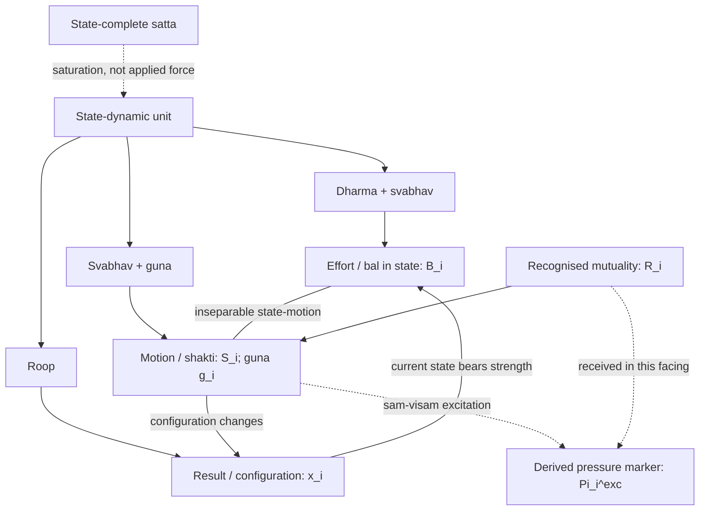
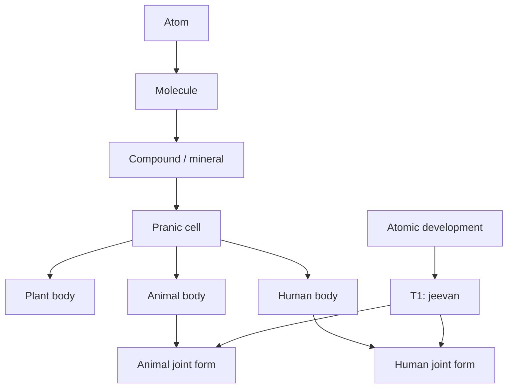
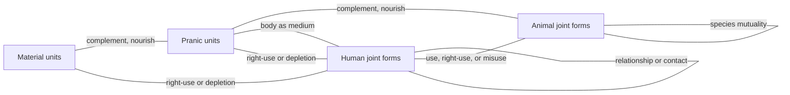
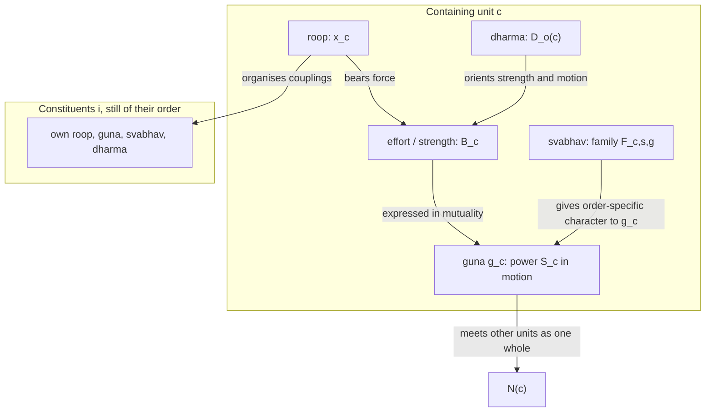
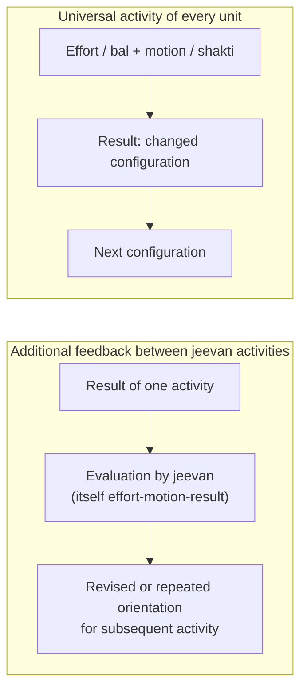

# A State-Dynamic Model of Coexistence

**Author:** [AnalyticMadhyasthDarshan.org](https://github.com/raghavamohan/AnalyticMadhyasthDarshan) — a group of people studying Madhyasth Darshan philosophy. Source repository: [raghavamohan/AnalyticMadhyasthDarshan](https://github.com/raghavamohan/AnalyticMadhyasthDarshan).

**Edited on:** August 24, 2026, 7:30 PM IST
**Status:** Draft

**The question:** Madhyasth Darshan describes existence as coexistence: countlessly many active units saturated in one unbounded, motionless Omnipresence. Within that description, the material, pranic, and animal orders continue in definite activity, while the human knowledge order can know, evaluate, and refine its own conduct. Can those claims be stated as one model — one account of state, activity, and relationship that holds from the atom to human conduct without breaking the texts' own commitments?

This paper reconstructs the claims of Madhyasth Darshan (Co-existentialism), as presented by Shri A. Nagraj, in the language of a continuous state space. Omnipresence (*satta*) is state-complete: unbounded, non-transforming, and without motion or pressure. Nature is state-dynamic: countlessly many bounded units, each saturated in Omnipresence and therefore energy-endowed, forceful, and active. Within every unit, **effort–motion–result** (*shram–gati–parinam*) is one inseparable activity, and the four aspects — form (*roop*), property (*guna*), essential nature (*svabhav*), and *dharma* — specify that same activity. The body of the paper presents this model in prose, tables, and diagrams; the symbolic apparatus is collected in Appendix A, and its notation in Appendix B.

In the material, pranic, and animal orders, result becomes the configuration in which definite activity continues through structure-, seed-, or species-conformance. A distinct atomic line reaches constitutional completeness (T1), after which the immortal sentient unit, *jeevan*, works through a body. The human is therefore a joint form: the body continues under pranic and material activity, while *jeevan* can know, evaluate, and refine the internal alignment of *mun, vritti, chitta, buddhi,* and *atma*. The knowledge-order recursion explains both persistence in delusion and awakening. When bodily pleasure, health, and profit remain the criteria of evaluation, dissatisfaction may be followed by repetition of the same unresolved pattern. Recognition of that non-fulfilment can instead lead to study, enlightenment (*bodh*), realisation (*anubhav*), and evaluation through justice (*nyaya*), *dharma*, and truth (*satya*). Realisation-oriented acceptance stabilises as humane *sanskar*, and the nested harmonies of *jeevan* become evident as happiness (*sukh*), peace (*shanti*), contentment (*santosh*), bliss (*anand*), and the ultimate bliss (*paramanand*) of *atma*. Activity completeness (T2) is this inner restfulness within continuing activity; conduct completeness (T3) is its evidence through the body in humane conduct and participation in orderliness.

The formalism is this paper's analytical reconstruction, not the texts' own idiom: the primary sources state coexistence, saturation, the triad, the four aspects, the activities of *jeevan*, and the completeness stages in ordinary philosophical prose. The standing commitments the reconstruction must preserve, and the reading rules for every equation, are stated once in Appendix A (§A.1) rather than repeated through the body.

## Standpoint and scope

These studies are written from the standpoint of a scientist and technologist trained to graduate-level physics and mathematics and familiar with conservation laws, phase-space models, and contemporary accounts of material binding. From that background, matter-first explanations are familiar: configurations evolve under forces, and consciousness is often identified with brain processes or treated as emergent from physical activity. The natural sciences constrain any credible account of material trajectory through mechanism, prediction, and public evidence, but their success does not by itself settle the hard problem of consciousness, the status of the self, or the reality of value in favour of matter-only reductionism.

The paper reads Madhyasth Darshan's primary texts, states the darshan's claims, and then reconstructs them in parallel with the mathematics of state and motion. Comparison with physics and the natural sciences is therefore one leg of the work, not the sole framework into which the philosophy must be translated. Full comparison with Advaita Vedanta and modern Western philosophy of mind, value, and society is developed in the related topical studies and is not repeated here.

The aim is rigorous comparative understanding — testing definitions, internal consistency, and the limits of the formal analogy — rather than persuasion or devotional endorsement. Logical reconstruction, first-person realisation, evidence in conduct, and instrument-based scientific confirmation are kept distinct so that agreement at one level is not mistaken for agreement at every level. Physics and dynamical-systems language do not establish immortal *jeevan*, constitutional completeness, or undivided society; those remain explicit points for examination.

Clear and checkable prose remains the series priority. This paper is a formal reconstruction of structure already stated in the topical studies; it does not require a further layer of category theory or proof, and it does not treat the reconstruction as source doctrine.

## Quick Glossary

| Term | Plain meaning |
|------|---------------|
| Coexistence (*saha-astitva*) | The inseparable presentness of state-complete Omnipresence (*satta*) and countlessly many state-dynamic units (*ikai*). |
| Omnipresence / absolute energy (*satta* / *nirpeksha urja*) | The unbounded, non-transforming, everywhere-present reality in which all units are saturated; it has no motion, pressure, or applied force. |
| Relative energy (*sapeksha urja*) | Power that becomes evident in unit–unit mutuality as pressure, waves, fields, heat, sound, electricity, and other effects. |
| Saturation (*samprikt*) | Every unit is soaked, submerged, and surrounded in *satta*; energy-fullness, forcefulness, regulation, and activeness follow as entailments of coexistence. |
| Unit (*ikai*) | A bounded, countable bearer in nature — insentient or sentient — whose activity is effort, motion, and result together. |
| Effort–motion–result (*shram–gati–parinam*) | The inseparable triad of unit-activity; not three successive moments. |
| Strength / force (*bal*) | Effort as borne in the unit's state; the forceful side of the unit, inseparable from power in motion. |
| Power (*shakti*) | Motion as the operative expression of a force-bearing unit, evident relatively in mutuality. |
| Excitation-pressure | The received or observable expression of a unit's force–power when *guna* is manifest as generative or degenerative excitation; not an additional force and not every unfulfilled relation. |
| Form (*roop*) | Shape, volume, density: the real bounded configuration of the unit, reflected in mutual facing. |
| Property (*guna*) | Relative power, effective as generative, degenerative, or mediative influence when units come together. |
| Essential nature (*svabhav*) | The order-specific usefulness or characteristic conducts of those effects — a set, not one conduct. |
| *Dharma* | What is innately borne and fulfilled according to order: existence, with growth, hope to live, and happiness stated cumulatively in the higher orders. |
| *Jeevan* | The constitutionally complete sentient atom; the knower that works through the body. |
| Knowledge (*gyan*) | The determinate content of coexistence, *jeevan*, and humane conduct, realised by *jeevan* and evidenced through understanding and conduct. |
| Human joint form | The conjunction of a pranic human body and constitutionally complete *jeevan*; bodily and sentient activities remain distinguishable while operating together. |
| Internal orientation | The current organisation of *atma, buddhi, chitta, vritti,* and *mun*, including the acceptances by which *jeevan* evaluates and acts. |
| *Sanskar* | Realisation-oriented acceptance and disposition toward understanding, honesty, responsibility, and participation; not a passive store of action records. |
| Evaluation | A knowledge-order activity by which *jeevan* examines recognised relationship, value-fulfilment, work, and result; not a fourth member of effort-motion-result. |
| Jeevan values | Internal harmonies evidenced as *sukh, shanti, santosh,* and *anand*, grounded in the *paramanand* of realised *atma*. |
| Dissatisfaction | The sentient evidence of unresolved internal alignment or unfulfilled value; not excitation-pressure and not an independent force. |
| Constitutional completeness (T1) | The atomic threshold at which a developing atom becomes *jeevan* and is free of molecular-bondage and weight-bondage. |
| Hope-bondage (*asha-bandhan*) | The bondage that remains with *jeevan* at constitutional completeness: bound to the hope for happiness, *jeevan* seeks its fulfilment and drives a body under that seeking. |
| Activity completeness (T2) | Restfulness of effort: realisation (*anubhav*) resolves the inner seeking of *jeevan*. |
| Conduct completeness (T3) | Destination of motion: realised understanding evidenced as humane conduct. |
| Compositional plateau | A closed unit-form — molecule, compound, mineral, cell, or body — whose bounded conduct persists while complementary couplings hold. |
| Existential progression | The definite order in which material, pranic, animal, and knowledge orders become manifest under conducive conditions. |
| Coupling | Mutual facing in which form is reflected and property becomes effect; not isolation. |
| Containing unit | A closed bearer — compound, cell, or body — that organises lower-order constituents while remaining one unit with its own *roop*, *guna*, *svabhav*, and *dharma*. |
| Complementary mutuality | Need met by need across units — hungry with overfull, nourishment with eater — without converting one order into another. |
| Relationship (*sambandh*) | Knowledge-order mutuality whose expectations are predetermined in the sense of completeness. |
| Contact (*sampark*) | Mutuality whose expectations are voluntary; not the full relational expectation of *sambandh*. |

Model symbols (*x*(*t*), *B*i, *R*i, *g*i, and the rest) are this paper's constructions, not source vocabulary; they are introduced where they arise and collected with their definitions in Appendix B.

## 1. Ontological foundations

Madhyasth Darshan holds that existence is neither a collection of static material substances nor an undifferentiated idealist field. Existence is coexistence (*saha-astitva*): the inseparable, perpetual presentness of Omnipresence (*satta*) and countlessly many discrete, active units (*ikai*) (SB, pp. 48–50; MVD, pp. 11, 34). Omnipresence is **state-complete** (*sthitipurna*): unbounded, everywhere uniform, non-transforming, and free from motion and pressure. Nature is **state-dynamic** (*sthitishil*): every bounded unit is inseparably present in state and motion within the state-complete (MVD, p. 26; SB, pp. 49–50, 248; KD 3.5, p. 70; KD 3.8, p. 84). The whole neither increases nor decreases, expands nor contracts, while development and awakening become manifest within it (KD 3.5, p. 70).

Every unit is saturated (*samprikt*) in Omnipresence: soaked, submerged, and surrounded in it. Omnipresence is permeative through units and present between them. That between-ness makes their boundaries and mutual distances possible; the same condition permits joining and separation without ever separating a unit from Omnipresence (SB, pp. 48–50, 249–250; JV, p. 149). Saturation is not a transfer from a finite store and Omnipresence does not push units by an applied force. It is the ontological basis on which each unit is energised, forceful, self-regulated, and active (MVD, pp. 40–41, 46; SB, pp. 57, 61, 69, 248; JV, p. 149; KD 3.9, p. 88; KD 3.13, p. 122).

This distinction is also stated as **absolute energy** and **relative energy**. Absolute energy is Omnipresence itself: everywhere present, non-active in itself, and the basis of basic impulsion. Relative energy is the unit's power made evident in mutuality; pressure, waves, fields, heat, sound, and electricity are physical-chemical expressions of that relative power (MVD, pp. 40–41). Omnipresence is also named the fundamental uniform energy, while the perpetual activity of molecules, atoms, and atomic particles evidences that each is energised (KD 3.13, p. 122). Basic impulsion belongs to the saturated unit's activity. Pressure neither supplies that activity nor stands beside *bal* and *shakti* as an additional power; it is a way their effect is recognised or received in mutuality (MVD, p. 46; SB, p. 256; KD 3.13, p. 118).

Mutuality is inherent in coexistence. Units recognise one another according to their order, and complementarity becomes evident through offering, acceptance, influence, composition, nourishment, use, and fulfilment. Recognition in the first three orders does not mean reflective human perception; it names definite response according to constitution, seed, or species. Necessary propensity leads to recognition and then to mutual recognition, while natural-state motion evidences definite conduct at a good mutual distance (KD 3.5, p. 70; KD 3.10, p. 100). The three modes of *guna* belong to every unit: *sam* combines or generates, *visam* decomposes or degenerates, and *madhyastha* maintains or regulates what is formed (KD 3.10, pp. 100–101; SB, p. 248). Pressure is the received compulsion of the same force–power when *sam–visam* excitation is evident, not a force imported from outside the tetrad (KD 3.13, p. 118). An unfulfilled complementarity is therefore not by that fact alone pressure. Every unit has inherent strength, and progress proceeds through mutual offering and acceptance (MVD, pp. 114, 230; SB, pp. 49–51, 61; JV, pp. 157–158).

The total activity of any unit is the triad of **effort–motion–result** (*shram–gati–parinam*). These are not three successive moments on a timeline in which effort causes motion and motion later produces a result. They are simultaneous, co-extensive dimensions of one activity-whole:

> **"Every physical-chemical activity is an inseparable presence of effort, motion and result."**
> — SB, p. 58

## 2. The state-dynamic reading of the triad

To keep that simultaneity visible without introducing temporal lags or linear causal fragmentation, this paper represents each unit in a continuous state-dynamic framework. Time *t* is an index of duration (*kaal*) of unit-activity, not a container in which the unit is placed (see [*Nature of Time*](../Nature-Of-Time/Nature-Of-Time.pdf)). Each element of the triad receives one model counterpart, introduced here in prose; the equations that assemble them into one system are collected in Appendix A (§A.2).

### 2.1 Result (*parinam*) as the state of the unit

*Parinam* is the instantaneous configuration, structural arrangement, or developmental plateau of a unit at a given duration. Result is the grandeur of a different existent state, arranged in a quantitative and qualitative chain (KD 3.11, p. 107). The model represents it as the unit's position *x*(*t*) in a reconstructed state space, one region per order. The state records everything presently realised in the unit: its bounded form, its constitution, and the developmental plateau it occupies.

### 2.2 Effort (*shram*) as strength in the state

Effort is strength or force (*bal*) borne by the unit. The state is the force-bearing side of activity, while power is present in motion; effort is explicitly aligned with *dharma* and *svabhav* (SB, pp. 60–61, 248, 256–257). State and motion are indivisible, and their meanings as strength and power apply across units from atoms to planetary bodies (KD 3.8, p. 84; KD 3.11, pp. 102–109). The model therefore represents effort by a **strength function** *B* read from the current state with the order's *dharma* present — not by an internal potential, a measurable scalar, or a store of energy. The primary claim is stronger than a transient push: forcefulness remains present in every state, and effort persists until its restfulness in completeness (SB, pp. 60–61).

> **"Strength in state evidences orderliness in oneself; power in motion evidences participation in the overall orderliness."**
> — KD 3.11, p. 106

### 2.3 Recognised mutuality and complementarity

No unit is met in isolation. Each unit recognises its mutuality according to its order; form is reflected, power becomes effect, and complementarity or incompleteness becomes evident in reciprocity (SB, pp. 49–51, 249–252). Natural-state motion itself occurs in such mutuality: units maintain a definite good distance, mutually recognise, and evidence determinate conduct (KD 3.5, p. 70; KD 3.10, p. 100). The model collects the recognised relational configuration of a unit with its actual neighbourhood in an order-typed **mutuality term** *R*. It is not a force and does not imply reflective perception: it records which mutualities are present and what order-specific complementarity, nourishment, use, relationship, or fulfilment is applicable there. Where an order supplies the relevant definite relation, an unfulfilled complementarity may be marked within it; the texts do not supply one universal scalar "relationship deficit," and lower-order recognition is not a mental survey of missing relationships.

### 2.4 Motion (*gati*) as power in a *guna*-mode

Motion is the unit's power (*shakti*) in operation: displacement, change of configuration, or another order-specific relational transformation. The same power is expressed through the three modes of property — generative (*sam*), degenerative (*visam*), or mediative (*madhyastha*) — and receives its functional character from the essential nature evidenced in the facing. The distinction matters: *sam* does not by itself mean integration in every order, nor does *visam* by itself mean cruelty. *Svabhav* gives the power its order-specific functional character, while *dharma* supplies the invariant orientation that modulates which expressions are admissible for the order. The model therefore writes motion as one member of a **family of motion maps**, typed by order, essential nature, and *guna*-mode, in which strength, recognised mutuality, and the order's *dharma*-orientation enter as simultaneous constraints rather than additive forces (SB, pp. 60–62; KD 3.10–3.11, pp. 100–107). The typing keeps the textual alignment explicit: effort or strength carries *dharma–svabhav*, while motion or power carries *svabhav–guna*.

Natural-state motion is not zero motion and not the absence of *guna*. It is the unit's continuing power under definite conduct, with mediative regulation maintaining its orderliness. Generative and degenerative tendencies remain modes of the unit's own property; they do not require an external reservoir of activity.

### 2.5 Excitation-pressure as a derived relational expression

Pressure is the received compulsion of force–power in mutuality. Where *sam* or *visam* becomes manifest as excitation rather than natural-state motion, that compulsion is recognised as excitation-pressure (KD 3.13, p. 118). A material illustration is departure from the definite good distance among atomic particles: the mediating nucleus applies its own force so that the mutual distance is restored (KD 3.11, pp. 103–104). Pressure therefore belongs to the same *bal–shakti–guna* activity, and the model retains it only as a **derived marker** Πexc, read from strength, power, *guna*-mode, and recognised mutuality after these have been stated. It may describe attraction, repulsion, compression, or another received compulsion where excitation is identified. In natural-state motion this derived marker is absent, although strength, power, *guna*, and mutuality all remain present.

### 2.6 Result and the continuing activity-loop

Over a duration, motion is evident as a changed result, and the changed configuration is immediately the state in which strength is borne and the next mutuality is recognised. Effort is the grandeur of the existent state, motion the spreading of effect, and result a different existent state in a quantitative and qualitative chain (KD 3.11, p. 107). The duration update in Appendix A (§A.2) reconstructs that continuing chain without making effort, motion, and result three successive events inside one activity: state and motion remain locked at every duration, and any pressure evidenced in the facing is a manifestation within this loop, not a prior power that starts it (MVD, pp. 40, 46, 114; SB, pp. 58–62, 248, 256–257; KD 3.8, p. 84).

For an insentient bearer, this result-to-configuration recursion closes the model. Constitution and mutuality determine the next expression according to result-, structure-, or seed-conformance. No deliberative comparison of the result with an inward value, no dissatisfaction, and no revision of *sanskar* are added to the unit. The knowledge-order feedback introduced in §7–§9 belongs to *jeevan* and leaves this universal triad intact.

## 3. The tetrad in the state-dynamic model

Every unit has four inseparable aspects: form (*roop*), property (*guna*), essential nature (*svabhav*), and *dharma* (MVD, p. 47). They are not four detachable components and not four successive stages. They specify one activity-whole: effort or strength is present as *dharma–svabhav*, motion or power as *svabhav–guna*, and result as *roop* (SB, pp. 60–62). *Svabhav* crosses effort and motion; *guna* is the mode of the unit's power, and pressure is that force–power relationally received when excitation is present. The same tetrad attaches to every closed bearer — an atom, a molecule, a cell, a body, or a joint form — and is not inherited as a sum from the units it contains (§5.4).

### 3.1 Form (*roop*): bounded configuration

*Roop* is the spatial configuration, boundary-framework (*rachna*), shape, volume, and density of the unit (MVD, p. 50; SB, pp. 249–250). It maps to **result (*parinam*)** in the reconstructed model: the currently realised coordinates of *x*(*t*) itself. Result is the different existent state that remains after motion spreads effect (KD 3.11, p. 107). Form is objectively unit-grounded. It is encountered in mutuality as a reflected image (*pratibimbita*), but reflection presents the form; it does not create it (MVD, pp. 42, 49–50; KD 3.9, p. 94).

### 3.2 Property (*guna*): relative power in motion

*Guna* is relative power (*sapeksha shakti*), the effect and influence that arise when units come into mutuality (MVD, pp. 40, 47; SB, pp. 248–252, 256–257). It maps to **motion (*gati*)**: *S*i = ẋi. Strength belongs to the property-endowed bearer in its state; power is that bearer's property in motion, spreading effect and participating in the overall orderliness (KD 3.8, p. 84; KD 3.11, pp. 102, 106–107). Its modes are generative (*sam*), degenerative (*visam*), and mediative (*madhyastha*) across the four orders (MVD, pp. 26, 49–50; SB, p. 248; KD 3.10, pp. 100–101). Pressure is not a fourth mode. Force may be recognised as pressure and power as flow, so pressure names an encountered expression of the same property-endowed unit and its power (SB, p. 256); under *sam–visam* excitation the reconstruction records that expression as the derived marker of §2.5.

In the first three orders, constitution and neighbourhood determine the evidenced mode without reflective option. In the human knowledge order, all three modes remain powers of *jeevan*, but their expression in conduct is answerable to understanding and freedom of action. Delusion can express degenerative property in treachery, exploitation, and war; awakening frees conduct from degenerative property and establishes the mediative mode (KD 3.10, pp. 100–101). Knowledge therefore changes the mode expressed by the human unit without creating the power that the mode qualifies.

### 3.3 Essential nature (*svabhav*): functional character

*Svabhav* is fundamental character (*maulikata*) and the usefulness (*upayogita*) of properties (MVD, p. 47). Usefulness here is order-specific functional significance, not benefit to a human observer: the same texts include devitalising and cruel essential natures. *Svabhav* spans both **effort (*shram*)** and **motion (*gati*)**, making it the bridge between strength and the order-specific expression of power. The same *guna*-mode receives different functional content by order: material units integrate or disintegrate, pranic units vitalise or devitalise, animal units evidence cruel or non-cruel conduct, and knowledge-order units evidence humane or inhumane dispositions (MVD, pp. 50–51, 57–58; SB, pp. 60–61, 179–180; KD 3.9–3.10, pp. 98–102). This paper therefore writes motion as a **family of maps** *Fo,s,g*, indexed both by essential nature *s* and *guna*-mode *g*. A given facing evidences a definite pair (*s*, *g*); motion is not a sum or blend of the whole family.

Knowledge-order essential nature is explicitly refinable. Human-opposing expression appears as baseness, wretchedness, cruelty, covetousness, and causing pain; humane and higher-humane expression appears as fortitude, valour, generosity, kindness, grace, and compassion. Education, study, and the qualitative development of *sanskar* make transformation from the former toward the latter possible (KD, pp. 8–9, 26–27; KD 3.9, pp. 98–99). This transformability belongs to the human joint form. It does not make the constitution-governed *svabhav* of a mineral or plant into a voluntary choice.

### 3.4 *Dharma*: innateness and invariant orientation

*Dharma* is innateness (*dharana*): what is innately borne, maintained, and characteristic of an entire order (MVD, p. 47). It is present on the side of **effort (*shram*)** together with *svabhav* (SB, pp. 60–61). This paper writes its order-specific orientation as *D*o: existence, growth, hope to live, and happiness, stated cumulatively across the four orders (MVD, p. 115; SB, p. 179; KD 3.9–3.10, pp. 95, 100–102). Saturation grounds the universal *dharma* of existence and the directionality of completeness; the order qualifies the further content borne by a unit (SB, pp. 49–51). Human *dharma* remains happiness through resolution and orderliness, even while a deluded human misunderstands how it is fulfilled (JV, pp. 110, 121–123; KD 3.5, p. 69). Knowledge modifies its understanding and evidence, not the *dharma* itself. *D*o constrains the strength function and family of motion maps and, in that limited formal sense, modulates which order-compatible (*s*, *g*) expression can be evidenced. It is not a moment-to-moment control signal, physical potential, separate force, exact instruction for the next state, or attractor basin supplied by the texts.

## 4. The insentient line: definite state-dynamic recursion

In the insentient line (*jada*), spanning the physical order and the bio-growth order, the reconstructed state of a constitution-oriented atom is confined to physical-chemical parameters. That confinement describes one bearer. It does not flatten every later composition into the same undifferentiated field. Effort–motion–result already closes new bounded units from those parameters, and those units occupy nested plateaus of the state space (§4.3).

Definiteness in this line does not mean immobility. *Roop* and result change, particles exchange, compositions form and disintegrate, and pranic bodies grow. What remains definite is that recognition and fulfilment occur according to constitution, structure, or seed rather than through a knower's deliberative evaluation. The four aspects are therefore constitution-governed in *jada* even while their unit is continuously state-dynamic.

### 4.1 Constraints of the material field

The material-order state, strength, recognised relational configuration, *guna*-mode, essential nature, and admissible motion are conditioned, in the darshan's terms, by two forms of structural bondage. **Weight-bondage** (*bhara-bandhana*) subjects the unit to gravitational and inertial mutuality, so its trajectory depends on other mass-bearing units. **Molecular-bondage** (*anu-bandhana*) fixes internal stability by subatomic particle counts in nuclear and orbital constitution. Atoms carry structural hunger (*bhukha*) or overfullness (*adhikya*), and they collide, exchange particles, and form molecular compounds on that basis (MVD, pp. 8, 91; SB, pp. 58, 71).

### 4.2 Open atomic motion and closed plateaus

The reconstructed material trajectory of a constitution-oriented atom already depends on the neighbouring units with which it collides and exchanges particles, on the essential nature evidenced as integration or disintegration, and on the *sam–visam–madhyastha* mode of power (§3.2–§3.3, §5; Appendix A, §A.2). Written without those neighbours it is only a factor. Hungry and overfull atoms remain open to particle exchange. Before an overfull atom displaces a particle it is excited; displacement and subsequent absorption change the two configurations, after which natural-state motion is re-established (KD 3.1, p. 57). The displacement, absorption, and regulation are expressions of the units' own *svabhav–guna* in motion. For those open bearers the model does not treat *parinam* as a terminal constant. That openness is a reconstruction, not a theorem of physics, and it is not a claim that matter has no stable existents. When complementary units close a new motion-path, a **compound** (*yaugik*) presents a new definite bearer with its own constitution, bounded conduct, and therefore its own *roop*, *guna*, *svabhav*, and *dharma*; a **mixture** does not, and the components keep their respective conducts (MVD, p. 42). The closed bearer occupies a relatively invariant region of *X* while its couplings remain complementary. How that new tetrad enters the coupled field is written in §5.4. Disintegration returns constituents to a lower plateau. Composition is not development: a new compound may close a new bounded conduct while the atomic development progression toward constitutional completeness remains a distinct line (SB, pp. 75–76; KD 3.2–3.3).

### 4.3 Nested compositional plateaus

The qualitative attributes of *x*(*t*) therefore include more than particle-count and bondage. They include the **kind of closed unit** presently evidenced. This paper writes those kinds as nested plateaus *Pℓ ⊂ X*. Each plateau is a region in which a unit's *roop*, *guna*, *svabhav*, and *dharma* remain recognisable as that order's closed form. The unit is still in effort–motion–result: ẋ is not required to vanish, and more than one essential nature of the order can still be evidenced in different facings. What remains relatively invariant is the closed form, not an idle point and not a single map *F*.

The compositional sequence the texts set out on this earth runs, under conducive conditions, from constitution-oriented atoms through molecules and molecule-composed solids, liquids, and rarefied states, through compounds and minerals, through chemical resonance that yields nourishment- and composition-elements, through pranic cells, through plant-order bodies, through animal bodies, and as far as the human body whose *medhas* composition is the richest compositional plateau (KD 3.2, pp. 58–60). Four orders are perceivable in that sequence: the material state in soil and stone; the pranic state in the plant-order; the *jeevan* state and the knowledge state as joint forms of body and *jeevan* (KD 3.2, p. 59; SB, p. 179).

| Plateau | Closed unit | Order | Way of existence |
|---------|-------------|---------|------------------|
| Atomic constitution | Atom | Material | Structure- or result-conformance |
| Molecular aggregation | Molecule | Material | Structure-conformance |
| Compound and mineral | Closed chemical composition | Material | Structure-conformance |
| Pranic cell | Cell with inherent composition-method | Pranic | Seed-conformance |
| Plant body | Organism composed of cells | Pranic | Seed-conformance |
| Animal body | Organism composed of cells | Pranic | Seed-conformance |
| Human body | Developed *medhas* composition | Pranic (expression medium) | Lineage of the body |
| Animal joint form | Animal body with *jeevan* | Animal | Species-conformance |
| Human joint form | Human body with *jeevan* | Knowledge | *Sanskar*-conformance |

The table is this paper's reconstruction of the sequence and the four-order partition. It is not a further completeness threshold numbered after T1. A plant body is a pranic composition; it is not *jeevan*. The animal order comprises animals and birds, excluding humans; the knowledge order comprises only humans (JV, p. 47). An animal or human is a joint form in which the compositional line supplies **that order's** body and the atomic line supplies constitutionally complete *jeevan* (§6). The human joint form is not the next animal. Most atoms remain engaged in physical and chemical constitution rather than attaining T1. Biological compositions return to material constituents after disintegration (MVD, pp. 8, 13; JV, pp. 47–48).

The solid arrows are constitutive: a later closed unit requires the earlier plateau already occupied. They are not the living couplings of §5. The animal joint form and the human joint form both require T1 *jeevan* and a body of their own kind. There is no arrow from the animal joint form to the human joint form.

### 4.4 Nested dependence

A plateau is not only a description of what has already closed. It is a **constitutive condition** for the next closed unit. Molecules form when atoms of the required kinds are already present and complementary; compounds and minerals require those molecules; pranic cells require chemical substances, definite heat, and the inherent composition-method of the *prana sutra*; plant, animal, and human **bodies** require cells; the animal joint form requires an animal body together with a T1 *jeevan*; the human joint form requires the further developed human bodily medium, through which knowing, believing, recognising, and fulfilling can be evidenced, together with a T1 *jeevan* (KD 3.2, pp. 58–60; JV, pp. 47–48, 59, 69–70). The human body follows lineage tradition; *jeevan* is not produced by that lineage (JV, p. 59).

Existential progression (*niyati-kram*) is the definite order in which the four orders become **manifest** on this earth under conducive conditions — material, then pranic, then animal, then knowledge (MVD, pp. 8, 13). That sequence of appearance is not a claim that each human is constituted from an animal joint form, and it is not the living use-ladder of §5.2. The way of existence (*niyati-vidhi*) is the conformance by which each plateau maintains definite conduct once formed. The two must not be collapsed into T1. Constitutional completeness is development in the atom; the plateaus are development in composition. They meet in the animal and human joint forms as two parallel joints, not as one ladder that a single *x*(*t*) climbs by accumulating attributes until it becomes *jeevan*.

## 5. Coupled units across orders

Plateaus name kinds of closed unit. They do not place those units in separate worlds. A mineral, a plant, an animal, and a human share one coexistence: each recognises and fulfils at the level of its order, and complementarity is evident in mutuality (SB, pp. 49–53; JV, pp. 43, 69; KD 3.10–3.11, pp. 100–109). The dynamics must therefore be a **coupled system** of many bearers, not a single isolated trajectory that changes kind. The coupled field is also where relative energy becomes evident; Omnipresence does not apply a force to the units from outside (MVD, p. 40; JV, p. 149).

### 5.1 Many bearers

Let a situation comprise a finite collection of units. Each unit has an order — material, pranic, animal, or knowledge — and a state in the corresponding region of the state space; the joint configuration is the tuple of those states (Appendix A, §A.3). As in §2.3, a unit's neighbourhood contains the units actually in mutual facing with it, not a mean field over all of nature. Form is reflected in that facing; property becomes effect there (MVD, pp. 47, 49–50; SB, pp. 249–252). Each bearer carries the same elements as in §2 — strength, recognised mutuality, *guna*-mode, and motion — now evaluated in its actual facings.

The motion map is not unique for an order. A material unit may integrate or disintegrate, and a pranic unit may vitalise or devitalise; the same *dharma* does not yield one undifferentiated map. Constitution, recognised neighbourhood, and relational configuration condition which essential nature and *guna*-mode are evidenced. When a unit is a constituent of a closed unit, its neighbourhood includes the containing bearer with its own tetrad, strength, and family of maps, not a fused sum of the constituents (§5.4). If *sam–visam* excitation occurs, the derived pressure marker of §2.5 may be read from the resulting strength, motion, and mutuality. Coexistence does not supply an isolated unit.

### 5.2 Three kinds of coupling

The texts distinguish how units come together. This paper groups those distinctions as three reconstructed coupling kinds. In each, *R* represents recognised mutuality and the applicable complementarity, not friction or a contest for survival. The coupling does not inject power into a previously inactive unit: saturation already grounds *bal–shakti*, while *svabhav–guna* gives the motion its order-specific character. Where *sam–visam* excitation is received, pressure is the relational expression of that same activity (KD 3.13, p. 118). Incompleteness is intelligible only with respect to completeness, while complementarity is fulfilled through order-appropriate reciprocity (MVD, pp. 40, 46, 114; SB, pp. 49–51, 61; JV, pp. 157–158; KD 3.5, p. 70; KD 3.11, pp. 106–107).

**Complementary need** is offering and acceptance among units whose hungers or overfullness meet. Hungry and overfull atoms bond; the same schema organises later composition when the required kinds are already present (MVD, p. 8; JV, p. 67). The coupling may close a new unit (a compound) or restore natural-state motion without closing (an expelled particle absorbed by a hungry atom). It does not convert every contact into a new order.

**Containment and organisation** is the way a higher-order body includes and regulates lower-order compositions: cells in a plant or animal body, minerals and water in the earth to which the plant remains joined, the human body as the richest such composition (KD 3.2, pp. 58–60). Higher-order *dharma* includes the lower-order *dharmas* while adding a further one (SB, p. 179). Containment does not rewrite the order of the constituent. Whatever a thing is constituted of, it remains of the order of that constituent: soil remains soil in a pot; pranic cells remain of the pranic order in a body (SB, p. 260). The containing unit is nevertheless itself a unit, with its own four aspects. Those aspects organise the constituents without replacing their plateaus (§5.4).

**Use, nourishment, and participation** is fulfilment across orders without identity of order. The texts state a living use-ladder, distinct from the constitutive sequence of §4. A knowledge-order unit makes use, right-use, or misuse of many animal-order units; an animal-order unit is complementary to many biological units; a biological unit is complementary to many material units (MVD, p. 105). Pranic units take material compositions as nourishment-element and composition-element under seed-conformance. Animals select and taste through a species-limited body. Humans can know, believe, recognise, and fulfil with material, pranic, animal, and human units (JV, pp. 69–70). Apart from humans, the first three orders are already mutually complementary; humans have still to evidence that complementarity (JV, p. 59). Knowledge-order use of lower orders is bounded by right-use and regeneration; extraction beyond regeneration is an unfulfilled coupling that destabilises the containing assembly (MVD, p. 264; JV, p. 77).

Human–human mutuality is of two kinds in the texts. A **relationship** (*sambandh*) is a mutuality whose expectations are predetermined in the sense of completeness; a **contact** or association (*sampark*) is a mutuality whose expectations are voluntary (MVD, pp. 61–62). Work, family, and undivided society sit in that knowledge-order coupling. Lower orders have definite recognition–fulfilment, not this value-laden *sambandh*.

The edges below are living couplings in mutuality, not conversions of order and not the constitutive arrows of §4.3. Containment of cells in a body remains the organisation named above; it is not drawn as humans containing minerals or animals.

### 5.3 Order-typed interaction

Cross-order coupling does not impose one force-law on every pair. Essential nature is order-specific, and it is evidenced **in the coupling**, not as a private scalar of an isolated *x* (MVD, pp. 50–51; SB, p. 179). Two material units meet as integration or disintegration. A chemical or pranic composition meets a body as vitalising or devitalising in that context. Animals meet as cruel or non-cruel, and they meet plants as complementarity. Humans meet as humane or inhumane; they meet animals as use, right-use, or misuse; they meet vegetation and minerals as cyclical enrichment or as depletion.

Those are distinct maps, not variants of one order-typed field. This paper therefore types *F* by the pair of orders in mutuality, by the essential nature *s*, and by the *guna*-mode *g* evidenced there. The same *g* can accompany more than one *s*: generative power is not already vitalising, and degenerative power is not already cruel. *Svabhav* specifies what that property-mode means for the order and facing. A human does not interact with a mineral by the same map as two atoms, does not interact with an animal by the same map as an animal with a plant, and an animal does not evaluate a plant by the human circuit of knowing and believing. In the first three orders, constitution and neighbourhood determine the evidenced pair without reflective option. In the knowledge order, option can alter the *svabhav–guna* expressed in conduct. The coupling can nourish, constrain, compose, or — under human delusion — deplete. It does not turn a mineral into a cell or a cell into *jeevan*. Those transitions, when they occur, remain the compositional and atomic lines of §4–§6.

Natural-state motion in each order continues when couplings are complementary. Complementarity therefore does not mean ẋ = 0 or the disappearance of *guna*; it means that power expresses the unit's order and participates in the overall orderliness under mediative regulation. *Sam* and *visam* remain modes and tendencies of property, while pressure becomes evident where their expression is received as excitation (KD 3.5, p. 70; KD 3.10, pp. 100–101; KD 3.11, pp. 103–109; KD 3.13, p. 118). Adverse environment, over-extraction, or human mis-evaluation can excite a unit without changing its *dharma* or order. Material, pranic, and animal recognition and fulfilment remain definite through structure-, seed-, and species-conformance. The knowledge order is the fallible coupling: reflexive evaluation can agree with or diverge from the definite mutuality actually present (§7.3, §8.3).

### 5.4 The tetrad of a containing unit

A closed unit that contains others is a further bearer, not a bag of their states. In a compound, the participating entities give up exhibiting their respective conducts as the public motion of the whole and exhibit a new kind of conduct; in a mixture they do not (MVD, p. 42). That new conduct is the containing unit's own *roop*, *guna*, *svabhav*, and *dharma*. The constituents remain of their order (SB, p. 260). The reconstruction therefore assigns two tetrads, not one fused tetrad.

Write *c* for a closed containing unit on its plateau, and *i* for a constituent on a lower plateau. The containing unit carries the full §2 apparatus in its own right — its own state, strength, *guna*-mode, and motion map — while each constituent's motion now takes the containing unit as part of its recognised neighbourhood (Appendix A, §A.3). The *dharma*-orientation of *c* belongs to *c*'s order, not an aggregate of the constituents' orientations or strengths, and the strength of *c* is the forcefulness of the containing unit in its own state, likewise not a sum over constituents. The neighbourhood of *c* is the neighbourhood of the **whole** — the units that meet *c* as one bounded form — not the union of every constituent's private meetings, and pressure, where excitation is evidenced, is derived from the containing unit's own strength, motion, and mutuality. The containing state enters the constituent's motion as organisation: it admits, bounds, or excites the couplings of *i* without rewriting the constituent's order or replacing its own set of essential natures. If *c* disintegrates, that organising presence drops and the constituents return to lower-plateau couplings (§4.2).

| Aspect of *c* | In this reconstruction | Effect on the dynamics |
|---------------|------------------------|------------------------|
| Form (*roop*) | *xc* as the closed bounded configuration | Sets which constituent couplings are inside the motion-path of *c*; other units meet *c* by this reflected form, not by inspecting each cell |
| Property (*guna*) | *g*c selects *sam*, *visam*, or *madhyastha*; *S*c = ẋc is the relative power of the whole | The assembly acts as one generative, degenerative, or mediative influence in mutuality; mediative power in *c* can hold the constituents' generative and degenerative motions in a definite organisation. Those modes can accompany more than one essential nature of *c* |
| Essential nature (*svabhav*) | The family *Fo(c),sc,gc* | A plant-body as a unit vitalises or devitalises according to the facing; a molecule integrates or disintegrates as that compound, not as a list of atomic hungers |
| *Dharma* | *D*o(c), present with effort in *B*c | Orients the strength function and family of maps of *c* by the innateness of *c*'s order — existence, and where the order adds them, growth, hope to live, and happiness — while the constituents continue to fulfil the *dharma* of their own order (SB, pp. 60–61, 179) |

A mixture has no such *c*. Each *Fo(i),si,gi* continues with the constituents' own tetrads; results flow, but no new bounded *x*c appears. A compound, a cell, and a body are the cases in which a new *x*c, *B*c, *g*c, *D*o(c), and family of maps of *c* do appear. The human joint form does not collapse those levels: the body remains a pranic containing unit with a pranic tetrad; *jeevan* is the sentient atom whose knowledge-order tetrad is evidenced through that body, not a sum of cellular *dharmas* (§7). Composing *jeevan* yields an organised assembly of *jeevan*, never a larger *jeevan*.

## 6. Constitutional completeness

The transition from the insentient constitution-oriented atom to the sentient cognitive line is **constitutional completeness** (*gathanpurnata*, T1). It is not a further compositional plateau. When a developing atom achieves complete subatomic particle balance in its nucleus and orbits, particle hunger drops to zero and the atom crosses an irreversible threshold (SB, pp. 55, 61, 92, 144–145; KD 3.3, pp. 60–61). The compositional sequence can already have produced minerals, cells, and bodies; those remain of the order of what constitutes them. Only the atom reaches T1.

### 6.1 The T1 bifurcation and invariant constitution

At that threshold the atom is no longer available to molecular-bondage and weight-bondage. It cannot be split, fused, or degraded by the physical-chemical forces that bound it as a developing constitution.

> **"An evolving-constitution atom is with molecular-bondage and weight-bondage. However, when the contraction and expansion activity increases in this atom, it instantly breaks free from its group and attains constitutional completeness, becoming a jeevan atom. The evidence of constitutional completeness is the jeevan atom's liberation from molecular-bondage and weight-bondage, and its having the hope-bondage."**
> — MVD, p. 91

In the reconstructed state space, the continuous physical coordinates of particle-exchange collapse into an invariant structural core. The unit is now *jeevan*: a constitutionally complete, immortal, sentient atom that is not reducible to the laws of molecular and weight bondage. In the sentient atom, strength and power are inexhaustible: after constitutional completeness both effort and motion become inexhaustible, and constitutional completeness itself is the immortality of result (SB, pp. 58, 61). T1 is not repeated when understanding changes. The later progression is refinement in *jeevan* activity toward awakening and completeness of awakening, while the constitutional core remains attained (KD, pp. 26–27; KD 3.16, pp. 142–145). Whether and how T1 is to be identified in contemporary physics remains an open problem (§11).

The same sentence that states the two liberations states what T1 adds: **hope-bondage** (*asha-bandhan*). *Jeevan* is not released into indifference. Bound to the hope for happiness, it seeks the continuity of happiness, and that seeking is what drives a body and makes the knowledge-order recursion of §7–§9 run: every human action carries the hope for happiness within it, and the evaluation of results against that hope is where delusion persists or awakening begins (MVD, p. 91; KD, pp. 1–4). Hope-bondage is therefore the sentient counterpart of the structural bondages it replaces — an orientation borne in the constitution of *jeevan*, not a physical constraint on a trajectory.

### 6.2 The joint form and the boundary of evaluation

The human requires a body composed along the insentient line. Its body remains a closed pranic unit whose physical and biological activity continues through the universal effort-motion-result triad. Constitutionally complete *jeevan* is the sentient bearer that operates the body, evaluates, and can refine its own activity. Joining does not fuse these two descriptions: bodily change does not become knowledge, and cognitive refinement does not reconstruct the immortal constitution of *jeevan* (KD 3.16, pp. 141–145; JV, pp. 47–49, 59). This paper models one joint form over one bodily span; the persistence of *jeevan* and its *sanskar* across bodies is treated in [*Death, Continuity, and Rebirth*](../Death-Continuity-And-Rebirth/Death-Continuity-And-Rebirth.pdf).

The distinction can be stated as two recursions. Every bearer, including the body and *jeevan*, remains active through effort-motion-result. Only the knowledge-order bearer also evaluates the present result and carries that evaluation into the internal orientation from which further activity is expressed.

The lower cycle is not a fourth-member extension of the upper triad. It is a relation among successive sentient activities, each of which is itself effort, motion, and result together.

## 7. Knowledge and the internal configuration of *jeevan*

Knowledge (*gyan*) is presented both as the determinate ground in which insentient and sentient nature are contained and as content realised by the knower. *Jeevan* is the knower; the content comprises the holistic view of coexistence, knowledge of *jeevan*, and knowledge of humane conduct. Its purpose is the meaningful evidence of *jeevan*-aspiration and human-aspiration in undivided society and universal orderliness (KD, pp. 3–4; KD 3.17, pp. 145–148). Knowledge is thus state-complete in its content, while its realisation and evidence in a human can be incomplete or complete.

This paper represents the human joint form by three coordinates (Appendix A, §A.4): the state of the pranic body, written *x*B; the invariant constitutionally complete core of *jeevan*, written *c*J; and the refinable internal orientation of *jeevan*, written *z*J. The last coordinate gathers the five faculties, present *sanskar*, realised understanding, and the standpoint from which results are evaluated. The three-coordinate notation records the joint form without making *jeevan* and body one substance or making *jeevan* a product of the body.

### 7.1 Five state-motion pairs

The five faculties each have an activity in state, expressed as strength, and a paired activity in motion, expressed as power. In awakened activity, realisation is evidenced outward through these pairs (KD 3.6, pp. 71–72; KD 3.16, p. 145; MVD, p. 78; JV, pp. 92–94).

| Faculty | State / strength activity | Motion / power activity |
|---------|---------------------------|-------------------------|
| *Atma* | Realisation (*anubhav*) | Evidence or authentication (*pramanyata*) |
| *Buddhi* | Enlightenment (*bodh*) | Resolve (*sankalp*) |
| *Chitta* | Contemplation or direct recognition (*chintan* / *sakshatkar*) | Imaging (*chitran*) |
| *Vritti* | Comparison or weighing (*tulana*) | Analysis (*vishleshan*) |
| *Mun* | Tasting (*asvadan*) | Selection (*chayan*) |

Each row gives paired descriptions of the forceful and projective sides of *jeevan* activity. State and motion remain indivisible as realisation and evidence, enlightenment and resolve, contemplation and imaging, comparison and analysis, and tasting and selection. A developed human body provides the medium through which all ten can be evidenced; in delusion, their full exercise remains unavailable (KD 3.16–3.17, pp. 145–147; JV, pp. 92–94).

### 7.2 Realised knowledge as orientation

Let *K** denote the determinate content — the holistic view of coexistence, knowledge of *jeevan*, and knowledge of humane conduct — and let *k*(*t*) record the degree to which that content is understood, realised, and available as evidence in the current human activity (Appendix A, §A.4). *K** does not evolve in the model. The variable is the organisation of *jeevan* with respect to it: study makes enlightenment possible, enlightenment culminates in realisation, and realisation is projected as evidence through resolve, imaging, analysis, and selection (KD 3.6, pp. 71–72; KD 3.12, p. 112; KD 3.17, pp. 145–148). Knowledge therefore orients conduct without becoming an external force or an energy input.

### 7.3 Initial *sanskar* and deluded evaluation

Every human acts on the basis of present acceptance. Environment, study, and *sanskar* contribute to the orientation from which thought and conduct are expressed, while the human body supplies the sensory and motor medium (KD, pp. 6–9; KD 3.16, pp. 141–145). The operative orientation *z*J therefore carries coordinates for the five faculties — *atma, buddhi, chitta, vritti,* and *mun* — together with the present acceptance or *sanskar*-orientation, realised understanding, and the organisation of evaluation (Appendix A, §A.4). These are qualitative coordinates, not neurological measurements.

In delusion (*bhram*), identification of *jeevan* with the body leaves the upper activities unevidenced and organises comparison from sensory input. Of the ten activities, only four and a half are then effective — selection, tasting, analysis, imaging, and half of deliberation — and pleasure, health, and profit become the prevailing perspectives of that deliberation (MVD, pp. 58, 78, 80–81; SB, pp. 91–92; JV, pp. 73–74, 93–94, 97–98). Human *dharma* nevertheless remains happiness. The error lies in the accepted account of what fulfils it, not in a change of *dharma*. Because freedom of action remains available, this mis-evaluation can express human-opposing *svabhav* and generative or degenerative *guna* even while the possibility of mediative, humane conduct remains.

## 8. Human effort-motion-result and internal refinement

The universal triad applies without exception to *jeevan*. Knowledge-order activity differs from insentient recursion because the current state includes realised understanding, acceptance, and an orientation of evaluation. These do not supply strength from outside. They qualify how the inherent strength and power of *jeevan* are expressed through its faculties and body.

### 8.1 The knowledge-mediated tetrad

Write *D*H for invariant human *dharma*: happiness through resolution and participation in orderliness. Write D̂H(*t*) for the present understanding and evidence of that *dharma*. The distinction allows a human to remain oriented toward happiness while misunderstanding its fulfilment. Current comprehension of *dharma*, expressed essential nature, and the *guna*-mode evidenced in a facing are all selected by realised understanding, present *sanskar*, and the recognised mutuality (Appendix A, §A.4). The human-opposing and humane sets of *svabhav* and the three modes of *guna* remain textually named possibilities. Knowledge and *sanskar* alter which expression becomes conduct: human-opposing essential nature can be transformed toward fortitude, valour, generosity, kindness, grace, and compassion, while awakened property becomes mediative (KD, pp. 26–27; KD 3.9–3.10, pp. 98–101).

Effort and motion then take their knowledge-order form: the strength *B*J borne in the present internal state, and the power *S*J expressed in selection, analysis, imaging, resolve, evidence, and body-mediated conduct. Knowledge does not replace *bal–shakti*; it makes their knowledge-order expression determinate through understood purpose. The constitutionally complete core *c*J remains invariant throughout this refinement.

### 8.2 Result in the knowledge order

Every human action has a result, and the hope within action is happiness. The knowledge order advances through refinement toward awakening and complete awakening; the body is the medium, while the refinement occurs in the imaginativeness, freedom of action, and activities of *jeevan* (KD, pp. 1–4, 26–27; KD 3.16, pp. 142–145). This paper therefore gives the human result four coupled aspects:

| Result aspect | What changes |
|---------------|--------------|
| Internal | The alignment and operative orientation of *atma, buddhi, chitta, vritti,* and *mun* |
| Bodily | Speech, bodily action, production, use, and the body's physical condition |
| Relational | Recognition, value-fulfilment, trust, satisfaction, or contradiction in human mutuality |
| Natural | Nourishment, right-use, protection, regeneration, imbalance, or depletion in couplings with the other orders |

For the specifically knowledge-order question, the primary result is the changed internal orientation *z*J. This does not erase outward consequence. Thought and freedom of action are expressed through the body; their bodily, relational, and natural results return as content for further experience, inference, and reflection (KD 3.17, p. 147). The result is thus internal refinement or continued non-refinement together with its public effects.

### 8.3 Evaluation links successive activities

Evaluation belongs only to sentient activity. It does not enter effort-motion-result as a fourth member. Instead, one result becomes the object of a further activity of tasting, comparison, contemplation, enlightenment, or realisation, and the result of that evaluative activity contributes to the state from which later conduct is expressed. For successive human activity-occurrences the model links three maps — the result of one complete activity, its evaluation from the present standpoint, and the update of orientation and *sanskar* that carries the evaluation forward (Appendix A, §A.5). Each map abbreviates complete activity; the notation does not divide a single triad into consecutive causal pieces. Under delusion, evaluation is organised by pleasure, health, and profit. With humane consciousness, justice, *dharma*, and truth provide the reference points. Justice is evidenced through recognition of relationship, fulfilment of its values, evaluation, and mutual satisfaction (JV, pp. 97–98, 137–139).

The update stands for a transition in accepted conception. Realisation-oriented conceptions in *buddhi* manifest in thought and action; thought arising from action is again settled as conception through inference (MVD, p. 218). In its completed humane sense, *sanskar* is understanding, honesty, responsibility, and participation, and wrongs that remain unacceptable do not become that *sanskar* (JV, p. 49). Evaluated action can therefore stabilise realised acceptance, while mistaken evaluation can preserve a deluded orientation without turning error into knowledge.

### 8.4 Dissatisfaction, recurrence, and inquiry

The non-attainment of *jeevan* values is experienced as dissatisfaction or unresolved internal contradiction. This paper marks it qualitatively with a dissatisfaction marker δJ (Appendix A, §A.5). The marker is not a measured error, an excitation-pressure, or a force applied to *jeevan*. Strength and motion remain *jeevan*'s own *bal–shakti*. Dissatisfaction is the experienced result that happiness has not become continuous — the non-fulfilment, so far, of the hope to which *jeevan* is bound (§6.1).

Two continuations are possible. If the same acceptance and the same pleasure-health-profit criteria organise the next activity, the human can repeat the same pattern while seeking a different outcome. Action then nourishes the unresolved orientation and again yields uncertainty or dissatisfaction. If the contradiction is recognised as a need for understanding, inquiry and study can begin. Study opens enlightenment; enlightenment becomes realisation; and realisation reorganises comparison, contemplation, selection, and conduct through justice, *dharma*, and truth (KD, pp. 1–4; KD 3.6, pp. 71–72; KD 3.12, p. 112; KD 3.17, pp. 147–148). The branch is not mechanically forced by dissatisfaction, because freedom of action remains part of the knowledge order.

## 9. *Jeevan* values and completeness

The destination of this refinement is harmony within *jeevan*. Happiness, peace, contentment, and bliss are names for harmony among adjacent faculties, while realisation in coexistence at *atma* is ultimate bliss. The effect of realised *atma* reaches the remaining faculties as a nested order (MVD, pp. 100–101; JV, pp. 60, 137–138; KD 3.6, pp. 71–72).

### 9.1 Nested internal harmony

| Site of harmony | Evidence in *jeevan* |
|-----------------|----------------------|
| *Atma* realised in coexistence | Ultimate bliss (*paramanand*) |
| *Buddhi–atma* | Bliss (*anand*) |
| *Chitta–buddhi* | Contentment (*santosh*) |
| *Vritti–chitta* | Peace (*shanti*) |
| *Mun–vritti* | Happiness (*sukh*) |

This paper writes the fulfilled orientation as the non-scalar harmony vector *H*J, whose five entries are *sukh, shanti, santosh, anand,* and *paramanand* (Appendix A, §A.5). The entries are neither rewards nor interchangeable magnitudes. They name a nested coherence in which realisation is accepted in *buddhi*, contemplated in *chitta*, compared in *vritti*, and tasted in *mun*. These internal values differ from the established relational values treated in §10.1; they name the harmony from which relational conduct can remain stable (JV, pp. 137–139).

### 9.2 Activity completeness (T2 - *kriyapurnata*)

Activity completeness is reached when *atma* realises coexistence and that realisation becomes the stable basis of the five state-motion pairs. It is the restfulness of effort (*shram ka vishram*): the search for certainty resolves into knowing (SB, p. 58; MVD, Ch. 5; KD 3.6, pp. 71–72). Where delusion exercises only four and a half of the ten activities (§7.3), awakening evidences all ten; T2 is that fulfilled harmony with the dissatisfaction marker at rest (Appendix A, §A.5), not the cessation of cognitive or bodily motion. Activity continues; unresolved seeking does not.

### 9.3 Conduct completeness (T3 - *acharanpurnata*)

Conduct completeness is the lived evidence of T2 through humane conduct (*manaviya acharan*). It is the destination of motion (*gati ka gantavya*): realised internal orientation is expressed consistently through the body across interaction (MVD, p. 80; SB, p. 58). Humane conduct integrates character (*charitra*), ethics (*niti*), and values (*mulya*). Character is evidenced through rightfully owned wealth (*sva-dhana*), marital faithfulness (*sva-nari* / *sva-purusha*), and kindness in action (*dayapurna karya*). Ethics directs body, mind, and wealth (*tan-man-dhana*) toward right-use (*sadupyoga*) and protection (*suraksha*). Values are recognised and fulfilled in relationship. T3 is therefore the repeatable outward evidence of the internal refinement described in §8, not another change in the constitution of *jeevan*.

## 10. Verification in relationship, work, and society

Madhyasth Darshan does not treat human rightness as private taste. Knowledge is to be evidenced in experience, behaviour, work, and thought. These domains test different effects of one internal orientation without reducing them to one numerical score.

### 10.1 Relationship, value, and mutual satisfaction

Human-human justice follows a definite relational sequence: relationship is recognised, its inherent values are recognised and fulfilled, the fulfilment is evaluated, and mutual satisfaction becomes the evidence (JV, pp. 97–98, 137–139). Value is therefore not identical with satisfaction. Trust, respect, affection, gratitude, and the remaining established values belong to relationship; satisfaction or dissatisfaction is the experienced result of their fulfilment or non-fulfilment. That result enters the sentient feedback of §8.3.

### 10.2 Fourfold verification and work with *jada*

Let *V* be a reconstructed verification operator on a human joint form. Knowledge-based conduct satisfies four simultaneous qualitative constraints:

| Operator | Evidence |
|----------|----------|
| *V*thought(*x*H) | Deliberation organised through justice, *dharma*, and truth; internal value harmony |
| *V*behavior(*x*H, *y*H) | Relationship recognition, value-fulfilment, evaluation, and mutual satisfaction |
| *V*work(*x*H, *x*N) | Law (*niyam*), regulation (*niyantran*), balance (*santulan*), protection, right-use, and regeneration in work with the other orders |
| *V*experience(*x*H) | Realisation in coexistence and its evidence through the remaining faculties |

The human does not add evaluation to the material unit being used. The mineral, plant, animal body, or other bearer continues through its own order-typed effort-motion-result. Evaluation occurs in *jeevan* and governs the human's selection, work, use, and restraint with those units. Education and *sanskar* concern law, regulation, balance, and justice; natural use is bounded by right-use, protection, and expenditure in proportion to regeneration (JV, pp. 58, 138–139; MVD, p. 264). A claim of inner realisation that yields exploitation in relationship or depletion in work fails the joint verification even if it is privately asserted.

### 10.3 Undivided society

When the verification protocol is satisfied across a population, individual resolution becomes evident through the linked human goals: resolved individual, prosperous family, fearless society, and universal coexistence (JV, pp. 60–61; SB, pp. 246–247). This paper writes that chain as

**Resolved individual → prosperous family → fearless society → universal coexistence**

These public goals and the internal *jeevan* values evidence one another: resolution is lived as happiness, prosperity supports peace in family, fearlessness supports contentment in social order, and understanding is evidenced as bliss in participation (JV, pp. 60–61). Undivided society (*akhanda samaja*) and universal orderliness (*sarvabhauma vyavastha*) are therefore not collections of isolated trajectories. They are the coupled evidence of T1 *jeevan* whose activity has reached T2 and whose conduct has reached T3 in human-human and human-nature mutuality. The reconstruction does not claim that this social chain is a dynamical theorem.

## 11. Open problems

The reconstruction leaves several questions unset.

First, the texts insist that effort, motion, and result are simultaneous. Writing motion as ẋ and result as *x* is a convenient pair in ordinary dynamics, but it can reintroduce the very sequence the triad refuses. Whether a genuinely simultaneous formalism — without a privileged time derivative — would be more faithful remains open.

Second, *R*i represents recognised mutuality, while Πexci is only a derived marker read from strength, motion, *guna*, and that mutuality when excitation is evidenced. Neither has a quantitative scale. The texts do not state that unfulfilled complementarity always produces pressure, that complementarity minimises one scalar, or that motion follows the gradient of a potential. Whether defensible order-specific measures of relational configuration and excitation can be constructed remains open.

Third, the knowledge-order coordinates *k*, σ, and *q*, the comprehension map D̂H, and the evaluation and update maps 𝓔 and 𝓤 have no quantitative scale in the texts. They organise the stated relations among acceptance, action, result, inference, *sanskar*, and awakening. They do not establish a learning algorithm, a probability of awakening, or an automatic transition from dissatisfaction to inquiry. How to operationalise any part of that transition without reducing realisation to behavioural reinforcement remains open.

Fourth, *H*J and *V* name internal and public constraints, not commensurable scores. The reconstruction does not supply an observer-independent measurement of *sukh, shanti, santosh, anand,* or *paramanand*, nor a numerical aggregation of mutual satisfaction and cyclical balance. Those remain qualitative evidences, as in the related studies of epistemology, family values, and undivided society.

Fifth, T1 is a metaphysical and textual threshold. Contemporary physics has no accepted counterpart for an atom that leaves molecular and gravitational bondage while remaining a countable unit. The reconstruction records the claim; it does not close the empirical question. The further distinction between invariant constitution *c*J and refinable orientation *z*J is analytically useful but likewise lacks an accepted physical correlate.

Sixth, the nested plateaus and coupled maps are this paper's reconstruction of compositional progression, existential order, and order-typed mutuality. They do not supply a mapping onto evolutionary phylogeny, origin-of-life chemistry, laboratory phase diagrams, a quantitative cross-order force, a universal interaction kernel, or an N-body reduction of *jeevan*. Specifying the maps in empirical coordinates remains open.

## Appendix A. The formal model

### A.1 Reading the formalism

Three standing rules govern every equation in this appendix. They are stated once here and assumed throughout.

**Reconstruction, not doctrine.** The primary texts state coexistence, saturation, state-completeness and state-dynamism, absolute and relative energy, force and power, the inseparable triad, the four aspects, the activities of *jeevan*, the completeness stages, and evidence in conduct in ordinary philosophical prose. They do not write state vectors, derivatives, state-functions for strength, quantitative pressure maps, learning operators, or value scores. Every symbol below is this paper's construction — a lens for keeping the textual claims simultaneous and checkable, not a proof that the darshan is a dynamical system, and not additional doctrine.

**Pressure is derived, never an input.** Saturation grounds the forcefulness and basic impulsion of every unit; pressure is the received expression of a unit's own force–power in an excited mutuality (MVD, pp. 40–41, 46; SB, p. 256; KD 3.13, p. 118). The excitation marker Πexc is therefore read from strength, motion, *guna*-mode, and recognised mutuality after these are stated. It never appears as an argument of any strength function or motion map, and no equation may treat an unfulfilled relation as itself a physical pressure or an energy source.

**Evaluation is never a fourth member of the triad.** Effort, motion, and result are one inseparable activity for every unit. The evaluation and update maps of §A.5 relate *successive complete activities* of *jeevan*; each map abbreviates an activity that is itself effort, motion, and result together. No corresponding maps attach to material, pranic, or animal units.

The maps are qualitative organisers: none carries a quantitative scale, a metric, or a probability, and time *t* is an index of duration (*kaal*) of unit-activity, not a container (§2, §11).

### A.2 One unit

The state of unit *i* is its position in the reconstructed state space of its order *o*(*i*) (§2.1):

$$
x_i(t) \in X_{o(i)}
$$

Effort is the strength borne in that state, with the order's *dharma*-orientation $D_{o(i)}$ and the essential nature $s$ present on the side of effort (§2.2):

$$
B_i(t) = \mathcal{B}_{o(i),s}\!\left(x_i(t);\, D_{o(i)}\right)
$$

$B_i$ asserts no measurable scalar, store of energy, or potential well; it records that the bounded configuration is force-bearing and effortful in every state. $D_o$ constrains which order-compatible expressions can be evidenced; it is not a moment-to-moment control signal, a physical potential, or an attractor basin supplied by the texts (§3.4).

Recognised mutuality collects the relational configuration of *i* with the units $N(i)$ actually in mutual facing with it (§2.3):

$$
R_i(t) = \mathcal{R}_{o(i)}\!\left(x_i(t),\, x_{N(i)}(t)\right)
$$

$R_i$ is not a force and does not imply reflective perception. Where an order supplies the relevant definite relation, an unfulfilled complementarity may be marked within it; there is no universal scalar "relationship deficit."

Motion is power expressed in a *guna*-mode with an order-specific essential nature (§2.4). The mode and the motion map are

$$
g_i(t) \in G = \{\textit{sam},\, \textit{visam},\, \textit{madhyastha}\}
$$

$$
S_i(t) \equiv \dot{x}_i(t) = F_{o(i),s,g_i}\!\left(x_i(t),\, x_{N(i)}(t);\; B_i(t),\, R_i(t),\, D_{o(i)}\right)
$$

The terms after the semicolon are simultaneous constraints, not additive forces. $F$ is a **family** of maps typed by order, essential nature, and *guna*-mode; instantaneous activity in a facing is one member of the family, not a superposition. Which pair $(s, g)$ is evidenced is definite in the first three orders given constitution and neighbourhood, and open to option in the knowledge order (§3.3, §5.3).

Where *sam–visam* excitation is evidenced rather than natural-state motion, the derived pressure marker is (§2.5)

$$
\Pi^{\mathrm{exc}}_i(t) := \mathcal{P}_{o(i),s,g_i}\!\left(B_i(t),\, S_i(t),\, R_i(t)\right)
\quad \text{when the facing is excited}
$$

In natural-state motion this marker is absent while strength, power, *guna*, and mutuality all remain present.

Over a duration $\Delta t$, motion is evident as a changed result, and the changed configuration is immediately the state of the next facing (§2.6):

$$
x_i(t + \Delta t) - x_i(t) = \Delta t\, S_i(t) + o(\Delta t)
$$

For an insentient bearer this recursion closes the model. For an open constitution-oriented atom the trajectory does not settle to a terminal constant,

$$
\lim_{t \to \infty} x_{\mathrm{physical}}(t) \neq \text{constant}
$$

a reconstruction of openness (§4.2), not a theorem of physics. Closed compositional kinds occupy nested plateau regions $P_{\ell} \subset X$ in which a unit's tetrad remains recognisable as that order's closed form (§4.3).

### A.3 Coupled and containing units

A situation comprises a finite collection of units $U$; the joint configuration is the tuple (§5.1)

$$
x_U(t) = \left(x_1(t),\, \dots,\, x_n(t)\right)
$$

Each bearer carries the §A.2 apparatus with its actual neighbourhood: $N(i)$ is the set of units in mutual facing with *i*, not a mean field over all of nature.

A closed containing unit *c* — a compound, cell, or body — is a further bearer with its own tetrad (§5.4):

$$
B_c = \mathcal{B}_{o(c),s_c}\!\left(x_c;\, D_{o(c)}\right),
\qquad
g_c \in G
$$

$$
S_c = \dot{x}_c = F_{o(c),s_c,g_c}\!\left(x_c,\, x_{N(c)};\; B_c,\, R_c,\, D_{o(c)}\right)
$$

while each constituent *i* takes the containing bearer as part of its recognised neighbourhood:

$$
S_i = \dot{x}_i = F_{o(i),s_i,g_i}\!\left(x_i,\, x_{N(i)},\, x_c;\; B_i,\, R_i,\, D_{o(i)}\right)
$$

$D_{o(c)}$ and $B_c$ belong to the containing unit's own order and state; neither is an aggregate over constituents. $N(c)$ is the neighbourhood of the whole, and $x_c$ enters the constituent equation as organisation, without rewriting $o(i)$. A mixture has no such *c*: the constituent maps continue with their own tetrads and no new bounded $x_c$ appears. If *c* disintegrates, the extra argument drops.

### A.4 The human joint form

The human joint form has three coordinates (§7):

$$
x_H(t) = \big[\, x_B(t),\; c_J,\; z_J(t) \,\big]
$$

where $x_B$ is the state of the pranic body, $c_J$ the invariant constitutionally complete core of *jeevan* (attained at T1 and not revisited), and $z_J$ the refinable internal orientation

$$
z_J(t) = (a,\, b,\, c,\, v,\, m,\, \sigma,\, k,\, q)
$$

whose first five coordinates name *atma, buddhi, chitta, vritti,* and *mun*, with $\sigma$ the present *sanskar*-orientation, $k$ realised understanding, and $q$ the organisation of evaluation (§7.3). The bracket records the joint form without making *jeevan* and body one substance. In delusion only four and a half of the ten faculty activities are effective and $q$ is organised by pleasure, health, and profit; in awakening all ten state–motion pairs are evidenced (§7.1, §7.3).

The determinate content of Knowledge is fixed (§7.2),

$$
K^{*} = \left(K_{\text{coexistence}},\, K_{\text{jeevan}},\, K_{\text{humane conduct}}\right)
$$

and $k(t)$ records its realised availability. The operative human aspects are selected from understanding, acceptance, and recognised mutuality (§8.1):

$$
\hat{D}_H(t) = \mathcal{A}_D\!\left(k(t),\, \sigma(t)\right),
\quad
s_H(t) = \mathcal{A}_s\!\left(k(t),\, \sigma(t),\, R_H(t)\right),
\quad
g_H(t) = \mathcal{A}_g\!\left(k(t),\, \sigma(t),\, R_H(t)\right)
$$

with invariant human *dharma* $D_H$ distinct from its current comprehension $\hat{D}_H$. Human effort and motion are then

$$
B_J(t) = \mathcal{B}_{H,s}\!\left(z_J(t);\, D_H,\, \hat{D}_H(t)\right)
$$

$$
S_J(t) = F_{H,s,g}\!\left(z_J(t),\, x_B(t),\, x_N(t);\; B_J(t),\, R_H(t),\, k(t),\, \hat{D}_H(t)\right)
$$

Knowledge and *sanskar* qualify how the inherent strength and power of *jeevan* are expressed; they supply no strength from outside, and $c_J$ remains invariant throughout (§8.1).

### A.5 Evaluation, refinement, and completeness

For successive human activity-occurrences $n$ (§8.3):

$$
p_n = \mathrm{EMR}_H\!\left(z_{J,n},\, x_{B,n},\, R_{H,n}\right)
$$

$$
e_n = \mathcal{E}_{q(n)}\!\left(p_n,\, R_{H,n};\; k_n,\, \sigma_n\right)
$$

$$
\left(z_{J,n+1},\, \sigma_{n+1}\right) = \mathcal{U}\!\left(z_{J,n},\, \sigma_n,\, e_n\right)
$$

$\mathrm{EMR}_H$ abbreviates one complete human activity; $\mathcal{E}$ is its evaluation from the present standpoint $q$; $\mathcal{U}$ is the transition in accepted conception that carries the evaluation forward. Under delusion $\mathcal{E}$ is organised by pleasure, health, and profit; with humane consciousness, by justice, *dharma*, and truth. $\mathcal{U}$ does not turn error into knowledge, and no probability of awakening is asserted (§8.3–§8.4, §11).

Non-attainment of *jeevan* values is marked qualitatively by the dissatisfaction marker (§8.4)

$$
\delta_J(z_J) \neq 0
$$

and the fulfilled orientation by the non-scalar harmony vector (§9.1)

$$
H_J(z_J) = \left(\textit{sukh},\, \textit{shanti},\, \textit{santosh},\, \textit{anand},\, \textit{paramanand}\right)
$$

The three completeness stages then read: **T1** — the invariant core $c_J$ is attained and the unit is free of molecular- and weight-bondage, bearing hope-bondage (§6.1); **T2** — $H_J$ is fulfilled and $\delta_J = 0$ with all ten faculty activities effective, the restfulness of effort within continuing activity (§9.2); **T3** — that realised orientation is repeatably evidenced through the body, satisfying the fourfold verification of §10.2, the destination of motion (§9.3).

## Appendix B. Notation

| Symbol | Meaning | Introduced |
|--------|---------|------------|
| $x_i(t) \in X_{o(i)}$ | State of unit *i*: its instantaneous configuration (*parinam*) in the reconstructed state space of its order | §2.1, §A.2 |
| $o(i)$ | The order of unit *i*: material, pranic, animal, or knowledge | §5.1 |
| $N(i)$ | The units actually in mutual facing with *i* | §2.3, §A.2 |
| $B_i$, $\mathcal{B}_{o,s}$ | Strength function: effort (*shram/bal*) borne in the current state, with *dharma* and *svabhav* present | §2.2, §A.2 |
| $R_i$, $\mathcal{R}_{o}$ | Order-typed recognised mutuality and applicable complementarity | §2.3, §A.2 |
| $g_i \in G$ | The *guna*-mode evidenced in a facing: *sam*, *visam*, or *madhyastha* | §2.4, §A.2 |
| $s$ | The order-specific essential nature (*svabhav*) evidenced in a facing | §2.4, §3.3 |
| $S_i \equiv \dot{x}_i$, $F_{o,s,g}$ | Power in motion (*gati/shakti*), one member of the family of motion maps typed by order, essential nature, and *guna*-mode | §2.4, §A.2 |
| $D_o$ | Invariant *dharma*-orientation of order *o*; a constraint, not an applied force | §3.4, §A.2 |
| $\Pi^{\mathrm{exc}}_i$, $\mathcal{P}$ | Derived excitation-pressure marker, read from strength, motion, *guna*, and mutuality when the facing is excited; never an input to motion | §2.5, §A.2 |
| $P_\ell \subset X$ | Nested compositional plateau: the region in which a closed unit-form remains recognisable | §4.3, §A.2 |
| $x_U$ | Joint configuration of a finite collection of units | §5.1, §A.3 |
| $c$, $x_c$, $B_c$, $g_c$, $R_c$ | A closed containing unit (compound, cell, body) and its own state, strength, *guna*-mode, and mutuality | §5.4, §A.3 |
| $x_H$ | Human joint-state: body state, invariant core, and internal orientation | §7, §A.4 |
| $x_B$ | State of the pranic human body | §7, §A.4 |
| $c_J$ | Invariant constitutionally complete core of *jeevan*, attained at T1 | §6.1, §A.4 |
| $z_J$ | Refinable internal orientation of *jeevan*: five faculties, *sanskar* $\sigma$, realised understanding $k$, evaluation standpoint $q$ | §7.3, §A.4 |
| $K^{*}$, $k(t)$ | Determinate content of Knowledge, and its currently realised availability | §7.2, §A.4 |
| $D_H$, $\hat{D}_H$ | Invariant human *dharma*, and its present comprehension and evidence | §8.1, §A.4 |
| $\mathcal{A}_D$, $\mathcal{A}_s$, $\mathcal{A}_g$ | Selection of comprehended *dharma*, expressed essential nature, and evidenced *guna*-mode from understanding, *sanskar*, and mutuality | §8.1, §A.4 |
| $B_J$, $S_J$ | Knowledge-order strength and power of *jeevan* expressed through faculties and body | §8.1, §A.4 |
| $p_n$, $e_n$, $\mathrm{EMR}_H$, $\mathcal{E}$, $\mathcal{U}$ | Result of one complete human activity, its evaluation, and the orientation/*sanskar* update linking successive activities | §8.3, §A.5 |
| $\delta_J$ | Qualitative dissatisfaction marker: non-attainment of *jeevan* values | §8.4, §A.5 |
| $H_J$ | Non-scalar harmony vector: *sukh, shanti, santosh, anand, paramanand* | §9.1, §A.5 |
| $V$ | Fourfold verification operator: thought, behaviour, work, experience | §10.2 |
| T1, T2, T3 | Constitutional completeness, activity completeness, conduct completeness | §6, §9, §A.5 |

## Editorial Notes

### Formal status of the equations

Every symbol in this paper is its own construction: the universal and coupled-unit apparatus of Appendix A (§A.2–§A.3) and the knowledge-order apparatus (§A.4–§A.5) alike. Appendix B lists them with their meanings. They organise textual claims under the reading rules of §A.1; they are not quotations or additional doctrine.

### Running terms

Analytical prose uses the series running terms: form (*roop*), property (*guna*), essential nature (*svabhav*), *dharma*, effort (*shram*), strength (*bal*), motion (*gati*), power (*shakti*), result (*parinam*), *jeevan*, and Omnipresence (*satta*). Block quotes keep the translation's wording. IAST spellings (*rūpa*, *guṇa*, *svabhāva*, *śram*) are not used as a second running vocabulary.

### Omnipresence, Omnipotence, and absolute energy

The English primary texts variously render *satta* as “Omnipresence” and “Omnipotence” and also name it Space, uniform energy, and absolute energy; “Omnipotence” is the translations' more frequent term on the cited pages, and the sources equate the two (“Omnipotence itself is Omnipresence,” SB, p. 250). This paper uses **Omnipresence** as the running term because the same sources deny motion, pressure, waves, and applied force to *satta*. “Absolute energy” is retained when the absolute–relative distinction itself is under discussion. These names refer to one state-complete reality in the source account, not to separate media. Similarly, the translations render *sampark* as “association”; this paper's running term is “contact.”

### Mapping of the tetrad to the triad

One passage relates effort or strength to *dharma* and *svabhav*, motion or power to *svabhav* and *guna*, and result to *roop* (SB, pp. 60–62). Strength is independently aligned with state, power with motion, and result with a different existent state, while their indivisibility is preserved (KD 3.8, p. 84; KD 3.11, pp. 106–107). This paper follows those alignments. It does not claim a one-to-one derivation, because *svabhav* crosses both effort and motion. The mermaid figure is an aid to that reconstruction, not a source diagram.

### Universal triad and sentient feedback

The primary texts state effort-motion-result as the activity principle and separately state the ten activities by which *jeevan* knows, projects, evaluates, and evidences. This paper places evaluation between reconstructed descriptions of successive human activities. Evaluation is itself an activity of *jeevan* and therefore also has effort, motion, and result; it is never a fourth member of the triad. No corresponding evaluative loop is assigned to material or pranic units. Their result is simply the configuration of continuing definite activity.

### Knowledge as ground and realised content

The opening postulate names the omnipresence of knowledge, and the early exposition says that insentient and sentient nature are contained within Knowledge or Omnipotence (KD, pp. 1–4). Later passages enumerate complete knowledge as the holistic view of coexistence, knowledge of *jeevan*, knowledge of humane conduct, and, in one formulation, participation in overall orderliness (KD 3.5, p. 69; KD 3.17, p. 148). The exposition uses the three-content formulation for *K** and treats participation as its purpose and evidence. It does not represent Knowledge as a signal transmitted from Omnipresence into *jeevan*.

### Human *dharma* and modifiable expression

Human *dharma* is stated as happiness, resolution, and living in orderliness; it remains one across humankind (JV, pp. 110, 121–123; KD 3.5, p. 69). The texts also state that human-opposing essential nature can be transformed into humane essential nature and that awakening frees conduct from degenerative property (KD 3.9–3.10, pp. 98–101). The model therefore keeps *D*H invariant while allowing D̂H, expressed *svabhav*, and the operative *guna*-mode to vary with understanding and *sanskar*. This is the analytical sense in which knowledge modifies the human tetrad's expression.

### *Sanskar* and action-result feedback

The translations use *sanskar* for the knowledge order's conformance and for realisation-oriented acceptance expressed through understanding, honesty, responsibility, and participation (MVD, p. 218; JV, pp. 49, 137–139). The texts also describe conceptions in *buddhi* becoming thought and action, and thought obtained from action becoming conception again through inference (MVD, p. 218). The update map 𝓤 reconstructs that feedback. It does not treat every behavioural trace, mistake, or bodily memory as completed humane *sanskar*.

### Four *jeevan* values and *paramanand*

One common enumeration names four *jeevan* values: *sukh, shanti, santosh,* and *anand*, each as harmony between adjacent faculties (JV, pp. 137–138). The faculty-level account also names *paramanand* as the lasting effect when *atma* realises coexistence, with *anand, santosh, shanti,* and *sukh* as its effects in the remaining faculties (MVD, pp. 100–101). The five-entry vector *H*J records that nested faculty account; it does not introduce a fifth reward alongside the four commonly enumerated values.

### Pressure, complementarity, and basic impulsion

The texts use pressure at two levels of description. Force in state is recognised as pressure and power in motion as flow; attraction and repulsion are encounters among property-endowed units in mutuality (SB, pp. 49, 256). Excitation-pressure is specified more narrowly as the compulsion received in a facing when *sam* or *visam* is excited, in contrast with natural-state motion (KD 3.13, p. 118). These are not two powers. In both descriptions, pressure is how the unit's own force–power–*guna* becomes relationally evident.

The reconstruction therefore gives *R*i and Πexci unequal formal roles. *R*i records the relational configuration disclosed through mutual recognition and may, where an order supplies the relevant definite relation, mark an unfulfilled complementarity. Πexci is derived from *B*i, *S*i, *g*i, and *R*i only when excitation is evidenced; it never drives *F* as an independent input. Natural-state motion remains mutual and active when that marker is absent, because saturation is the basis of forcefulness and basic impulsion (MVD, pp. 40, 46, 114; SB, pp. 49–51, 61; KD 3.5, p. 70; KD 3.13, pp. 118, 122). Neither symbol is a universal lack-function. The unit's next configuration follows from motion over duration; the primary triad itself remains simultaneous.

### Source boundary of the core mechanism

| Proposition | Status in this paper | Primary basis |
|-------------|----------------------|---------------|
| Omnipresence is state-complete; nature is countlessly unitised and state-dynamic | Direct textual claim | MVD p. 26; SB pp. 49–50, 248; KD p. 70 |
| Omnipresence has no motion, pressure, waves, or applied force; its between-ness permits unit distinction and joining | Direct textual claim | SB p. 49; JV p. 149 |
| Saturation is the basis of forcefulness, basic impulsion, and activity | Direct textual claim | MVD pp. 40–41, 46; SB pp. 61, 248; KD pp. 88, 122 |
| Effort is strength in state; motion is power; result is form or present configuration | Direct textual alignment | SB pp. 60–61, 248, 256–257; KD pp. 84, 106–107 |
| *Sam*, *visam*, and *madhyastha* are modes or tendencies of the unit's property and power | Direct textual claim | SB p. 248; KD pp. 100–102 |
| Recognised mutuality and natural-state motion occur at definite good distance | Direct textual claim | KD pp. 70, 100, 103–109; SB pp. 49–51 |
| Force is recognised as pressure and power as flow; excitation-pressure is received compulsion when *sam* or *visam* is excited | Direct textual claim | SB p. 256; KD p. 118 |
| The first three orders evidence definite conduct through conformance; the knowledge order advances through refinement toward awakening | Direct textual claim | JV pp. 47–49; KD pp. 26–27 |
| Human *dharma* is happiness/orderliness; human-opposing *svabhav* can transform toward humane *svabhav*; awakened property is mediative | Direct textual claim | JV pp. 110, 121–123; KD pp. 98–101 |
| *Jeevan* is the knower; knowledge comprises coexistence, *jeevan*, and humane conduct | Direct textual claim | KD pp. 145–148 |
| Five state activities are strengths and five motion activities are powers of *jeevan* | Direct textual claim | KD pp. 71–72, 145 |
| T1 *jeevan* is free of molecular- and weight-bondage and bears hope-bondage; in delusion four and a half of the ten activities are effective | Direct textual claim | MVD p. 91; JV pp. 73–74, 93 |
| Results prompt further thought and reflection; realisation-oriented conception manifests in action and is settled again through inference | Direct textual claim | KD p. 147; MVD p. 218 |
| *Sukh, shanti, santosh,* and *anand* are internal harmonies, grounded in realisation at *atma* | Direct textual claim | MVD pp. 100–101; JV pp. 137–138 |
| *R*i may encode order-specific unfulfilled complementarity; Πexci is derived from *B*i, *S*i, *g*i, and *R*i rather than supplied as a separate cause | Analytical reconstruction | The texts supply the qualitative relation, not quantitative maps |
| *B*i, *F*o,s,g, and the duration update form a recursive state-dynamic loop | Mathematical reconstruction | KD p. 107 supplies the conceptual effort–motion–result sequence, not these equations |
| *x*H, *z*J, D̂H, 𝓔, 𝓤, δJ, and *H*J model knowledge-mediated orientation, evaluation, recurrence, and refinement | Mathematical reconstruction | The texts supply the qualitative activities and relations, not these variables or maps |

### Composite state vector

Writing *x*H as body state *x*B, invariant *jeevan* constitution *c*J, and refinable orientation *z*J is a modelling convenience. It must not be read as a Cartesian dualism, three substances, or a claim that the faculties are spatial parts. *Jeevan* is one constitutionally complete atom; the body is its expression medium, itself a closed pranic composition. The coordinates distinguish bodily change, constitutional invariance, and awakening-oriented refinement within one joint form.

### Plateaus are not completeness thresholds

The nested regions *Pℓ* and the table in §4.3 reconstruct compositional sequence and order-partition. They are not a fourth completeness stage and are not numbered T0. Composition closes a new bounded unit; development in the atom reaches T1. The two lines meet in animal and human joint forms as parallel joints: each requires a body of its own kind plus T1 *jeevan*. The paper does not assert that the human joint form is constituted from the animal joint form, that every instance advances, or that a plant is a deficient animal.

### Constitutive sequence and living coupling are distinct

The mermaid in §4.3 records constitutive conditions for closed units. The mermaid in §5.2 records living complementarity and use. Existential progression names the order in which the four orders become manifest on this earth; the use-ladder of MVD p. 105 names how a knowledge-order unit relates to animal, pranic, and material units already present. Those are not one diagram.

### Family of maps, not one *F*

The texts name more than one essential nature in each order and three *guna*-modes of property. Collapsing those names into the qualitative character of a single vector field would treat *svabhav* and *guna* as moods of one *F*. This paper therefore indexes motion as *Fo,s,g*. Instantaneous activity in a facing is one member of the family, not a superposition. *Svabhav* gives the order-specific functional character; *guna* gives the generative, degenerative, or mediative mode. Which pair is evidenced is definite in the first three orders given constitution and neighbourhood, and optional in the knowledge order. That indexing is reconstruction; the sources list the conducts and modes, they do not write a family of maps.

### Coupled dynamics are not N-body physics

The single-unit map of §2.4 (§A.2) is a factor. The coupled form in §5 reconstructs mutuality: complementary need, containment, and use/nourishment/participation, typed by the orders of the units that actually meet and by the essential nature and *guna*-mode evidenced in that facing. A containing unit *c* has its own *B*c, *D*o(c), *g*c, and family *F*o(c),sc,gc; its facings supply *R*c, while any excitation-pressure is derived from the resulting force–power expression. Constituents keep their own states, strengths, order-orientations, essential natures, and *guna*-modes. That split is this paper's reconstruction of MVD p. 42 together with SB p. 260. It is not a universal force, not a mean-field over all of nature, and not a reduction of *jeevan* to a material ODE. Cross-order coupling does not convert a mineral into a cell or a cell into *jeevan*. Those remain the compositional and atomic lines of §4 and §6.

## References

### Madhyasth Darshan (primary sources)

- **MVD** — Nagraj, A. [*Madhyasth Darshan — Co-existentialism*](../References/Madhyasth-Darshan/MVD-Madhyasth-Darshan-Coexistentialism.pdf). English translation by Rakesh Gupta. Cited: coexistence and the four aspects (pp. 11, 34, 47; §1, §3); state-complete Omnipresence and state-dynamic nature (p. 26; §1); absolute and relative energy, basic impulsion, and activity independent of environmental pressure (pp. 40–41, 46; §1–§2, §5); hungry and overfull atoms, existential order (pp. 8, 13; §4.1, §4.4, §5.2); atomic constitution and change of form (pp. 42, 49–50; §3.1, §4.2, §5.1, §5.4); *sam–visam–madhyastha* (pp. 26, 49–50; §3.2, §5.4); order-specific *svabhav* and *dharma*, with humane and inhumane essential nature (pp. 50–51, 57–58, 115; §3.3–§3.4, §5.3); material motion, effort, and mutual pressure (p. 114; §1–§2, §5); relationship and contact (pp. 61–62; §5.2); the use-ladder across orders (p. 105; §5.2–§5.3); T1 evidence, the two liberations, and hope-bondage (p. 91; §6.1); *atma*, faculties, body-identification, and the deluded perspectives (pp. 58, 78, 80–81; §7.1, §7.3); faculty-level *paramanand, anand, santosh, shanti,* and *sukh* (pp. 100–101; §9.1); action-to-conception *sanskar* feedback (p. 218; §8.3); authentic conduct (p. 80; §9.3); regeneration in use of natural abundance (p. 264; §5.2, §10.2).
- **SB** — Nagraj, A. [*Samadhanatmak Bhautikvad* (*Resolution Centred Materialism*)](../References/Madhyasth-Darshan/SB-Samadhanatmak-Bhautikvad.pdf). English translation by Rakesh Gupta. Cited: coexistence, saturation, state-completeness, state-dynamism, recognition, pressure, and directionality toward completeness (pp. 48–51; §1–§3, §5); recognition and regulation (p. 57; §1); unit and energy-fullness as activeness (p. 69; §1); inseparable effort–motion–result, effort as strength, and the mapping to *dharma–svabhav–guna–roop* (pp. 53, 58–62; §1–§3, §5, §9); force in state, power in motion, *sam–visam–madhyastha*, pressure, flow, reflection, effect, and relative power (pp. 248–252, 256–257; §1–§3, §5); composition is not development (pp. 75–76; §4.2); four orders and order-specific *dharma* and *svabhav* (pp. 179–180; §3.3–§3.4, §4.3, §5.2–§5.3); T1, atomic hunger and stability, and the inexhaustibility of effort and motion (pp. 55, 61, 92, 144–145; §6); a composition remains of its constituent's order (p. 260; §5.2, §5.4); delusion and body-identification (pp. 91–92; §7.3); undivided society (pp. 246–247; §10.3).
- **JV** — Nagraj, A. [*Jeevan Vidya: An Introduction*](../References/Madhyasth-Darshan/JV-Jeevan-Vidya-An-Introduction.pdf). English translation by Rakesh Gupta. Cited: nothing isolated and complementarity in mutuality (pp. 43, 69; §2.3, §5); Omnipresence between units and the denial that it applies force (p. 149; §1, §5); inherent strength and progress through mutual offering and acceptance (pp. 157–158; §1, §5); four orders, conformance, and *sanskar* as understanding, honesty, responsibility, and participation (pp. 47–49; §4.3–§4.4, §5.2, §6.2, §7.3, §8.3); human body, lineage, and complementarity of the first three orders (p. 59; §4.4, §5.2, §6.2); right-use and protection (p. 58; §10.2); *jeevan* values and human goals (pp. 60–61; §9, §10.3); knowing, believing, recognising, and fulfilling across the orders (pp. 69–70; §4.4, §5.2); delusion as four and a half of the ten activities (pp. 73–74; §7.3, §9.2); ten activities and delusion (pp. 92–94; §7.1, §7.3); justice, relationship, value-fulfilment, evaluation, and mutual satisfaction (pp. 97–98; §8.3, §10.1); human *dharma* as happiness and orderliness (pp. 110, 121–123; §3.4, §8.1); internal harmony, inherent values, and humane evaluation (pp. 137–139; §8.3, §9.1, §10.1–§10.2).
- **KD** — Nagraj, A. *Manav Karm Darshan*. [Working English translation](../References/Madhyasth-Darshan/KD-Karm-Darshan-English/KD-Karm-Darshan-English.pdf); Hindi source `KD-karm darshan v5.pdf`. Machine-assisted working translation — not a published translation; cited as corroboration only. Cited: the omnipresence of knowledge, action and result, hope for happiness, experience and inference, and absolute knowledge (pp. 1–4; §7–§8); environment, study, *sanskar*, and the transformation of human essential nature (pp. 6–9; §3.3, §7.3, §8.1); *guna* in human conduct and knowledge-order refinement toward awakening (pp. 25–27; §3.2–§3.3, §6, §8); overfull-atom excitation and restored natural-state motion (3.1, p. 57; §4.2); compositional sequence through the human *medhas* (3.2, pp. 58–60; §4.3–§4.4, §5.2, §7); T1 as development in the atom (3.3, pp. 60–61; §4.2, §6); complete knowledge and the five state and five motion activities (3.5–3.6, pp. 69–72; §3.4, §7–§9); saturation, forcefulness, and state–motion indivisibility (3.8–3.9, pp. 84, 88, 94; §1–§3, §5); order-specific *svabhav*, *dharma*, and *sam–visam–madhyastha* (3.9–3.10, pp. 98–102; §2–§3, §5, §8); strength–power and result as a different existent state (3.11, pp. 102–109; §1–§3, §5); study, enlightenment, and the realisation-oriented method (3.12, p. 112; §7.2, §8.4); excitation-pressure (3.13, pp. 118, 122; §1–§2, §5); the body–*jeevan* joint form, internal refinement, result-to-reflection, knowledge, knower, and object of knowledge (3.16–3.17, pp. 141–148; §6–§8).

### Related studies in this collection

- [*The Ontology of Coexistence*](../The-Ontology-of-Coexistence/The-Ontology-of-Coexistence.pdf) — saturation, four orders, compositional versus atomic development, T1–T3, and *jeevan* (§§1.2–1.7); companion technical note [*Rūpa, Guṇa, Svabhāva, and Dharma in a State-Dynamic Unit*](../The-Ontology-of-Coexistence/Technical-Note-Roop-Guna-Svabhava-Dharma.pdf)
- [*Coexistence from First Principles*](../Coexistence-From-First-Principles/Coexistence-From-First-Principles.pdf) — compound-closure, order-relative stability, four progressions, order-typed coupling, and the guarded status of T1
- [*The Epistemology of Coexistence*](../The-Epistemology-of-Coexistence/The-Epistemology-of-Coexistence.pdf) — knowing, evidence, and the faculty architecture; companion [*A Functional Model of Jeevan*](../The-Epistemology-of-Coexistence/Research-Note-Jeevan-Functional-Model.pdf)
- [*Nature of Time*](../Nature-Of-Time/Nature-Of-Time.pdf) — *kaal* as duration of unit-activity
- [*Human Behavior and Society*](../Human-Behavior-And-Society/Human-Behavior-And-Society.pdf) — humane conduct and social organisation
- [*Family Relationships and Values*](../Family-Relationships-And-Values/Family-Relationships-And-Values.pdf) — established values and mutual satisfaction
- [*How Undivided Society Is Established*](../How-Undivided-Society-Is-Established/How-Undivided-Society-Is-Established.pdf) — family to universal order
- [*Why Humans Are Not Just Material*](../Why-Humans-Are-Not-Just-Material/Why-Humans-Are-Not-Just-Material.pdf) — body and *jeevan*
- [*Death, Continuity, and Rebirth*](../Death-Continuity-And-Rebirth/Death-Continuity-And-Rebirth.pdf) — persistence of *jeevan* and *sanskar* across bodies
