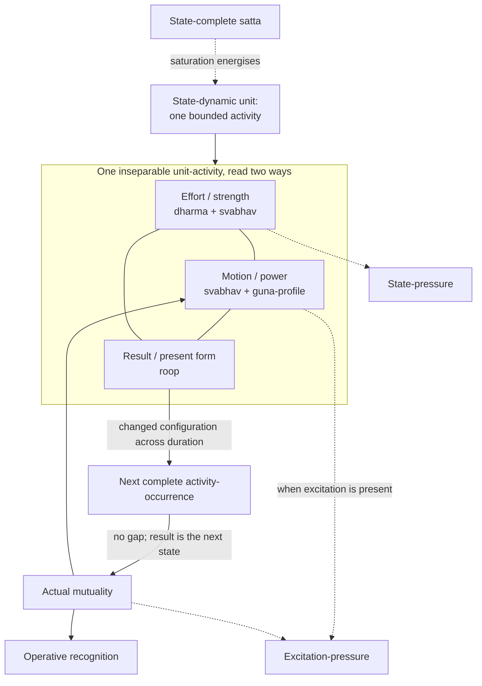
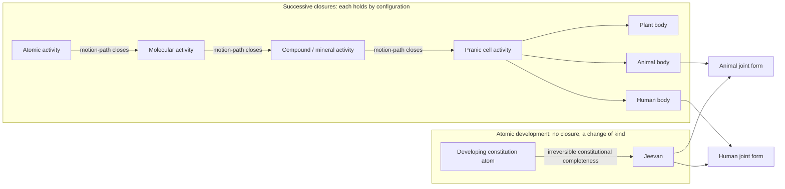
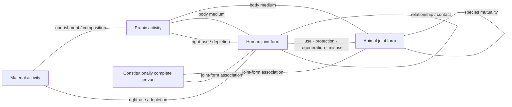
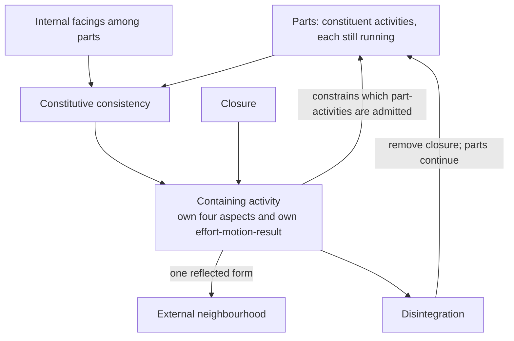
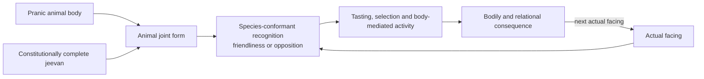
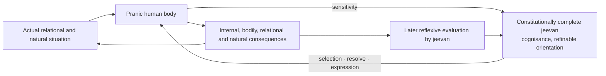
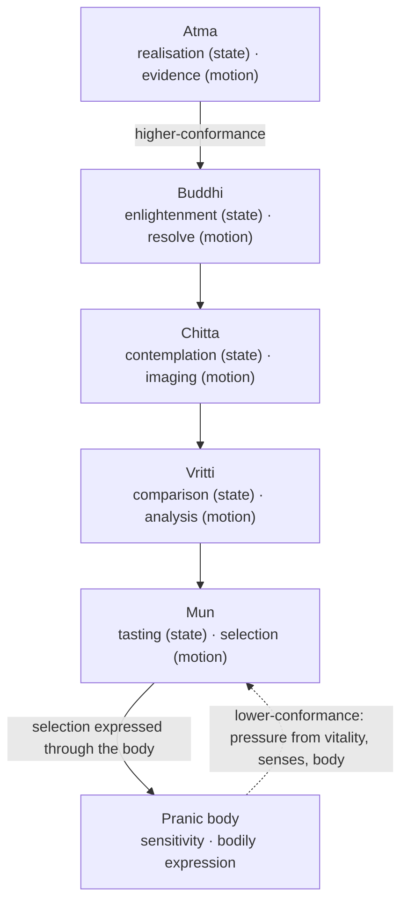
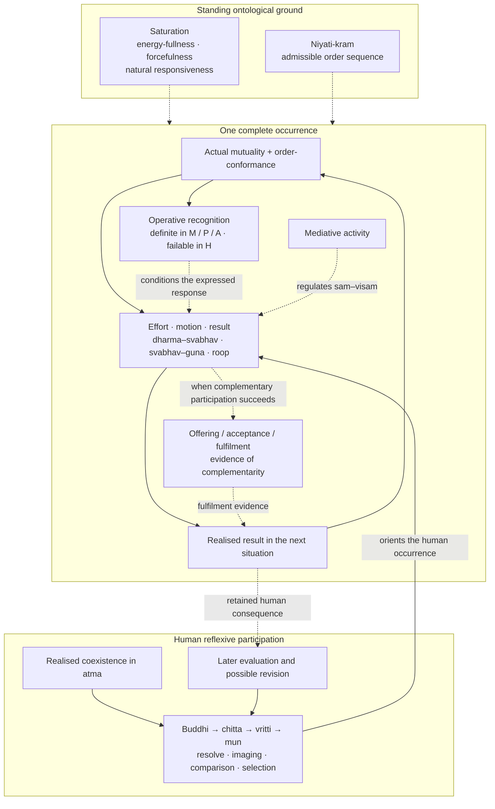

# From Unit Activity to Human Orderliness: A State-Dynamic Reconstruction of Coexistence

**Author:** [AnalyticMadhyasthDarshan.org](https://github.com/raghavamohan/AnalyticMadhyasthDarshan) — a group of people studying Madhyasth Darshan philosophy. Source repository: [raghavamohan/AnalyticMadhyasthDarshan](https://github.com/raghavamohan/AnalyticMadhyasthDarshan).

**Edited on:** September 4, 2026, 4:01 AM IST
**Status:** Released

Madhyasth Darshan tells one story about existence. An actionless, all-pervading reality — *satta* — saturates countlessly many always-active units; structures stand where many activities close into one; a single atomic line matures into the sentient unit *jeevan*; and the human being, *jeevan* working through a body, is the place in nature where recognition can fail and where law, regulation, and balance must therefore be consciously understood, established, and evidenced in relationship, work, and society.

This paper develops that story as a source-bounded process architecture from unit activity to human orderliness. Its main line has six parts. State-complete Omnipresence coexists with saturated, state-dynamic units; each unit expresses one complete effort–motion–result; actual mutuality, complementarity, and mediative activity make natural orderliness evident; that orderliness is described through *niyam–niyantran–santulan*; the human threshold makes recognition and fulfilment consciously answerable and therefore failable; and realised Knowledge projected through the faculties makes *satya–dharma–nyaya* available in thought, relationship, conduct, work, and maintained social arrangements. The result is a qualitative reconstruction, not a quantitative theory that predicts physical trajectories or proves every ontological claim. Appendix A gives a typed process schema, while Appendix C keeps proposed operational criteria separate from the process.

At its ontological base, state-complete Omnipresence (*satta*) coexists with countlessly many state-dynamic units. The same *satta* is also named Knowledge or Space: actionless ground and source of inspiration, with inspiration inherent through saturation (MVD, pp. 35–36, 174). Saturation energises every unit and grounds order-relative natural responsiveness; in an actual relation, recognition and fulfilment evidence complementarity, while mediative activity regulates generative and degenerative activity and maintains balance (MVD, pp. 25–26, 48, 154; SB, pp. 99, 143–144, 249–251, 255; JV, pp. 69–70). A unit is not a substance that happens to move: it is a bounded activity that persists. That activity is effort, motion, and result together, and the same activity read aspectually is form (*roop*), property (*guna*), essential nature (*svabhav*), and *dharma*. The triad and tetrad are two descriptions of one activity. Saturation grounds energy-fullness and intrinsic activeness; actual mutuality supplies the relation faced; constitution and conformance constrain response; complementarity is evidenced in appropriate offering, acceptance, and fulfilment; mediative activity regulates; *guna* and *svabhav* characterise power and function; *niyati-kram* restricts the sequence of manifested orders; and *dharma* specifies order-relative fulfilment without acting as an additional force.

At the structural level, structures are not additions to that base but closures within it. When complementary activities close a new motion-path, molecules, compounds, cells, and bodies stand as new closed activities whose constituents persist within the whole. Atomic development instead reaches constitutional completeness, yielding *jeevan* with invariant hope-bondage. Unjoined *jeevan* is still *jeevan*; it is not a fifth order. Animal and human orders become manifest through body–*jeevan* associations, so the human is neither a later animal composition nor a body that produces sentience. These must be distinguished from a third object: a relationship, family, work process, or organisation is a maintained relational order among human joint forms, not another containing unit. Material, pranic, and animal activity distinctly evidence law (*niyam*), regulation (*niyantran*), and balance (*santulan*) through result-, seed-, and species-conformance while all three remain present in integrated nature. Humans must understand and establish those conditions in work and maintained arrangements while evaluating free conduct through justice (*nyaya*), *dharma*, and truth (*satya*).

At the human level, the same architecture extends through the five faculties and ten activities of *jeevan* into knowing, believing, recognising, fulfilling, karma, consequence, and later reflexive evaluation. Complete Knowledge comprises coexistence, *jeevan*, and humane conduct. Its sixfold grammar links two non-identical triads: *niyam–niyantran–santulan* name lawfulness, regulation, and balance to be understood and maintained; *nyaya–dharma–satya* name the human activity through which relationship and behaviour, thought and participation, and the complete reality are evaluated and fulfilled. Realisation in *atma* is projected through enlightenment and resolve in *buddhi*, contemplation and imaging in *chitta*, comparison and analysis in *vritti*, and tasting and selection in *mun*. Actual relationship and the consequences of conduct then provide evidence for later evaluation and revision. These are coupled functional dependencies, not a clocked passage from one faculty to the next. **Activity completeness** names inner resolution in which coexistence is realised as truth in *atma*, all three contents are enlightened in *buddhi*, humane conduct is evidenced in practice, all ten activities are effective, full internal harmony is sustained, and effort is restful; **conduct completeness** names activity completeness evidenced through repeatable humane conduct in relationship, work, family, society, and participation in orderliness.

The reconstruction also marks its limits: the physical identification of constitutional completeness, the body–*jeevan* interface, quantitative calibration, and social-scale dynamics remain unresolved. Direct textual claims, translation or register choices, analytical reconstructions, analytical boundaries, proposed operational criteria, and open empirical questions are kept visibly distinct throughout. Terminology is collected in Appendix B. The Editorial Notes record the claim-kind and primary basis of the reconstruction's core propositions.

## Standpoint and scope

These studies are written from the standpoint of a scientist and technologist trained to graduate-level physics and mathematics and familiar with contemporary cosmology, quantum theory, conservation laws, and formal models. From that background, matter-first explanations are familiar, as are the demands of mechanism, prediction, and public evidence. Their success does not by itself settle the ontological status of sentience, self, value, or orderliness, and this study does not assume that a physical description is automatically a complete description of coexistence.

The study reconstructs Madhyasth Darshan's claims primarily from *Madhyasth Darshan — Co-existentialism* (MVD), *Samadhanatmak Bhautikvad* (*Resolution Centred Materialism*, SB), *Jeevan Vidya: An Introduction* (JV), and *Manav Karm Darshan* (KD). It asks whether their accounts of unit activity, closure, the four orders, *jeevan*, and humane conduct can be expressed as one state-dynamic architecture without erasing differences of level. Physics, systems language, and mathematical notation serve as analytical aids; they do not replace the source concepts or turn the reconstruction into a quantitative physical theory.

The aim is rigorous understanding rather than persuasion or devotional endorsement. Textual warrant, internal coherence, first-person verification, evidence in conduct, and instrument-based confirmation are kept distinct. A formal relation in Appendix A states how concepts depend on one another within the reconstruction; it does not by itself demonstrate that the corresponding entities or transitions exist. Constitutional completeness, the body–*jeevan* interface, and realised knowledge therefore remain claims requiring forms of evidence appropriate to them.

The scope is limited to the process path from unit activity to human orderliness and to the minimum organisational extension needed to test that path. Full treatments of knowability, time, and institutional design belong respectively to [*The Epistemology of Coexistence*](../The-Epistemology-of-Coexistence/The-Epistemology-of-Coexistence.pdf), [*Nature of Time*](../Nature-Of-Time/Nature-Of-Time.pdf), and [*How to Form Self-Sustaining Organizations*](../How-To-Form-Self-Sustaining-Organizations/How-To-Form-Self-Sustaining-Organizations.pdf). The sixfold grammar developed here does not attribute a *jeevan* or inner faculties to an organisation; it specifies conditions that participating humans must understand, establish, and evaluate in a bounded public arrangement.

## 1. Ontological foundations

Madhyasth Darshan holds that existence is neither a collection of static material substances nor an undifferentiated idealist field. Existence is coexistence (*saha-astitva*): the inseparable, perpetual presentness of Omnipresence (*satta*) and countlessly many discrete, active units (*ikai*) (SB, pp. 48–50; MVD, pp. 11, 34). Omnipresence is **state-complete** (*sthitipurna*): unbounded, everywhere uniform, non-transforming, and free from motion and pressure. Nature is **state-dynamic** (*sthitishil*): every bounded unit is inseparably present in state and motion within the state-complete (MVD, p. 26; SB, pp. 49–50, 248; KD 3.5, p. 70; KD 3.8, p. 84). The whole neither increases nor decreases, expands nor contracts, while development and awakening become manifest within it (KD 3.5, p. 70).

### 1.1 Saturation as the source of activeness

Every unit is saturated (*samprikt*) in Omnipresence: soaked, submerged, and surrounded in it. Saturation is what makes each unit energised, forceful, and active; the perpetual activity of molecules, atoms, and atomic particles is the standing evidence that each is so energised (MVD, pp. 40–41, 46; SB, pp. 57, 61, 69, 248; JV, p. 149; KD 3.9, p. 88; KD 3.13, p. 122). Regulation belongs to mediative activity within saturated nature, not to saturation acting as a separate controller (MVD, pp. 26, 154–155; SB, pp. 250, 255). This is the positive claim on which the rest of the architecture rests: activity does not have to be started, because nothing in nature is unenergised in the first place. Omnipresence is also permeative through units and present between them. That between-ness makes their boundaries and mutual distances possible; the same condition permits joining and separation without ever separating a unit from Omnipresence (SB, pp. 48–50, 249–250; JV, p. 149).

Energy-fullness also grounds order-relative natural responsiveness. Inspiration-fullness is described as energy, force, and magnetic-force fullness through which atomic particles mutually recognise one another, remain regulated at a definite distance, and evidence an atom; saturated forcefulness is likewise named the seed of orderliness in every particle (MVD, p. 48; SB, p. 99; KD translation PDF, pp. 79–80). Recognition here does not mean conscious perception. In the first three orders it is definite responsiveness according to constitution, seed, or species. Saturation supplies the standing capacity; actual mutual facing supplies the relation; recognition and the corresponding offering, acceptance, and fulfilment evidence complementarity (JV, pp. 69–70; SB, pp. 143–144, 249–251). Human relational discernment is a further, faculty-mediated competence and is not inferred from saturation alone (§7.3–§7.5).

The claim is nevertheless bounded in three ways. Saturation is not a transfer from a finite store, Omnipresence does not push units by an applied force, and no unit can be drained of what it is never separated from. The strength and power at work in any change belong to the saturated unit itself.

The same distinction is also stated as **absolute energy** and **relative energy**. Absolute energy is Omnipresence itself: everywhere present, non-active in itself, and the basis of basic impulsion. Relative energy is the unit's power made evident in mutuality; pressure, waves, fields, heat, sound, electricity, and related effects are physical-chemical expressions of that relative power (MVD, pp. 40–41). Omnipresence is also named fundamental uniform energy (KD 3.13, p. 122). Pressure does not supply a second stock of activity or stand beside *bal* and *shakti* as an additional power. It is the unit's force recognised in state and, in the narrower excitation sense, the compulsion received in an excited mutuality; such mutual pressure can condition change without becoming an external energy source (MVD, pp. 46, 114; SB, pp. 49, 59, 256; KD 3.11, pp. 105–106; KD 3.13, p. 118).

The same ground is also named Knowledge or Space. Knowledge in this sense is actionless and non-transforming: neither an activity nor an agent performing activities, while serving as their ground and source of inspiration, with inspiration inherent through saturation (MVD, pp. 32–36, 174). Units act; Omnipresence does not. Availability of this ground for realisation is therefore not a rule of change, an applied force, or a second energy beside saturation. How that availability unfolds as realised content in the human joint form is taken up in §7.

### 1.2 A unit is a closed activity

What saturation energises is not a substance that then behaves. The total activity of any unit is **effort–motion–result** (*shram–gati–parinam*), and that activity is not something the unit does in addition to existing:

> **"Every physical-chemical activity is an inseparable presence of effort, motion and result."**
> — SB, p. 58

Because state and motion are indivisible in every unit, and force is borne in state while power operates in motion (KD 3.8, p. 84; KD 3.11, pp. 102–109), there is no residue left over once effort, motion, and result have been named — no inert carrier underneath them waiting to be moved. This paper therefore uses **closed activity** as its running term for an ontic or containing unit considered as a persisting whole: an atom, molecule, compound, cell, or body whose motion-path has closed and which thereafter bears bounded conduct. The word *closed* marks the boundary; the word *activity* marks what is bounded. A body–*jeevan* joint form is a typed association of two such units, not a third substance. Where the shorter word reads better, **unit** carries the same sense.

The distinction that matters is not between a thing and its activity but between two timescales of one activity. A **closed activity** persists and is counted: this atom, that cell. An **activity-whole**, or occurrence, is one complete effort–motion–result of that unit under the conditions then facing it. Units persist through many occurrences; occurrences are how a unit's persistence is described. Neither is prior to the other, and neither is a substance.

### 1.3 One activity, two readings

Every unit has four inseparable aspects: form (*roop*), property (*guna*), essential nature (*svabhav*), and *dharma* (MVD, p. 47). These are not four possessions of an underlying thing. They are the same single activity read aspectually, and they map onto effort, motion, and result: effort or strength is present as *dharma–svabhav*, motion or power as *svabhav–guna*, and result as *roop* (SB, pp. 60–62).

| One activity | Read as triad | Read as tetrad |
|--------------|---------------|----------------|
| What the unit bears in state | Effort (*shram*) — strength (*bal*) | *Dharma* with *svabhav* |
| What the unit expresses in motion | Motion (*gati*) — power (*shakti*) | *Svabhav* with *guna* |
| What is realised across duration | Result (*parinam*) | *Roop* |

The triad answers how the activity runs; the tetrad answers what it is an activity of. Neither reading adds a component to the other, and the correspondence is an alignment rather than a derivation, since *svabhav* crosses both effort and motion. In the resulting local schema, saturation energises activity, closure composes it, a joint form couples two units without fusion, and human understanding reorients its expression in conduct.

The same terms recur as the dimensions along which *jeevan* images whatever it meets. Form, property, count, time, expanse, effort, motion, and result are the eight dimensions of imaging in *chitta* (MVD, p. 327). Six of the eight are the categories used here to describe a unit, and duration enters the reconstruction as the considered Δ*t* of §1.4, so the descriptive apparatus of this paper is drawn from the darshan's own account of how units are apprehended rather than imposed from outside it. The convergence supports the choice of categories without licensing a derivation in either direction: the eight are dimensions of an activity of *jeevan*, and the four aspects of §3 belong to the unit imaged, not to the imaging.

### 1.4 Continuous action

Coexistence is in continuous action. No unit is at any point without activity: forcefulness remains present in every state, and effort persists until its stated restfulness in completeness (SB, pp. 60–61). Definiteness in the material orders is not immobility, and natural-state motion is continuing power under determinate conduct rather than a state of rest (§4, §5.3).

The reconstruction nevertheless describes that continuity by indexing complete occurrences and assigning each a considered duration Δ*t* in Appendix A. This index is a cut made by the describer, not a rhythm in nature. There is no gap between one occurrence and the next, no interval in which a unit is inactive and waiting, and no moment at which effort has finished and motion has not yet begun. Time indexes the duration (*kaal*) of unit-activity rather than a container in which a unit is placed (see [*Nature of Time*](../Nature-Of-Time/Nature-Of-Time.pdf)).

### 1.5 Mutuality as the condition of change

Mutuality is inherent in coexistence. Units and joint forms recognise according to their manifested order, and complementarity becomes evident through offering, acceptance, influence, composition, nourishment, use, and fulfilment. Recognition in the first three orders names definite response according to constitution, seed, or species. Necessary propensity leads to recognition and mutual recognition, while natural-state motion evidences determinate conduct at a good mutual distance (MVD, p. 48; SB, pp. 143–144, 249–251; JV, pp. 69–70; KD translation PDF, pp. 79–80; KD 3.5, p. 70; KD 3.10, p. 100).

Generative (*sam*), degenerative (*visam*), and mediative (*madhyastha*) tendencies belong to property; mediative activity regulates generative and degenerative tendencies, conserves the unit, and maintains balance (MVD, pp. 25–26, 154; KD 3.10–3.11, pp. 100–104; SB, pp. 248, 250, 255). Excitation-pressure is received compulsion where *sam–visam* excitation is evident, while the wider state sense recognises force as pressure. An unfulfilled complementarity is not by that fact alone physical pressure. Every unit has inherent strength, and progress proceeds through mutual offering and acceptance (MVD, pp. 114, 230; SB, pp. 49–51, 61; JV, pp. 157–158).

These roles give the first governing triad its natural basis. *Niyam* is evident as definite recognition and fulfilment according to the unit's order; *niyantran* as the continuing regulation and conservation of its operation; *santulan* as the balance maintained through mediative activity and complementary participation. Saturation is the ontological ground of the unit's forcefulness and order-relative natural responsiveness; complementarity is evidenced in appropriate offering, acceptance, and fulfilment; mediativity is the regulating activity. The three are not decrees applied by an acting *satta*: Omnipresence remains actionless, while saturated units recognise, fulfil, regulate, and balance in mutuality. Nature saturated in Omnipotence is accordingly described as lawful, regulated, and balanced (SB, pp. 231, 235).

Mutuality is also what makes the account a system rather than a list. The result of one activity is written into the situation that faces its neighbours, and their results are written back into the conditions it meets next. Nothing in this loop is a separate force: it is the same units, each running its own effort–motion–result, encountering one another's realised configurations through closure and coupling.

## 2. Effort–motion–result

Continuous change occurs within a fixed kind of unit; formation, disintegration, and constitutional completeness are structural boundaries; and entering or leaving a joint form changes association rather than constitutional kind. The account remains qualitative and assigns no numerical coordinates or differential laws. Result is treated first because the realised configuration is what any further facing meets; effort is the strength that configuration bears in state; and, because relative power becomes evident only in mutuality, the actual relation is treated before motion.

### 2.1 Result (*parinam*) and model state

*Parinam* is the form or configuration realised in a unit's activity: a different existent state in a quantitative and qualitative chain (KD 3.11, p. 107). The reconstruction keeps that configurational result distinct from the fuller description a modeller needs, which may also record the unit's kind, constitution, relations, and orientation. Keeping the two distinct prevents spatial *roop* from being mistaken for every feature needed to describe a cell, body, animal, or human. Human action-consequences are a third kind of result, because bodily, relational, and natural consequences are broader than configurational *parinam* alone (§8.2).

### 2.2 Effort (*shram*) as strength in the state

Effort is strength or force (*bal*) borne by the unit. The state is the force-bearing side of activity, while power is present in motion; effort is explicitly aligned with *dharma* and *svabhav* (SB, pp. 60–61, 248, 256–257). This alignment does not identify *dharma* with strength. *Dharma* names the unit's inseparable order-orientation, while *bal* names the strength borne in effort; *shakti* names its expression in motion. State and motion are indivisible, and their meanings as strength and power apply across units from atoms to planetary bodies (KD 3.8, p. 84; KD 3.11, pp. 102–109). The reconstruction treats effort as a qualitative strength description, not a scalar magnitude, potential, or stored quantity. The unit's kind already carries its order-specific *dharma*; *dharma* is therefore an invariant of the admissible activity, not a moment-to-moment control input. Forcefulness remains present in every state, and effort persists until its stated restfulness in completeness (SB, pp. 60–61).

> **"Strength in state evidences orderliness in oneself; power in motion evidences participation in the overall orderliness."**
> — KD 3.11, p. 106

### 2.3 Actual mutuality and recognised mutuality

No activity scope is met in isolation. Form is reflected, power becomes effect, and complementarity or contradiction becomes evident in reciprocity (SB, pp. 49–51, 249–252). The reconstruction separates the relation actually present from the relation operatively recognised. In material and pranic activity, and in species-conformant animal activity, recognition is definite according to constitution, seed, or species; recognising and fulfilling are stated as inherent in every entity of nature, an atomic particle included (JV, p. 69). In the human, operative recognition can agree with or diverge from actual mutuality; this difference is indispensable for modelling misrecognition, correction, and justice in relationship. Neither term is a force or universal deficit score. Together they record which units or joint forms meet, what coupling joins them, and what order-specific complementarity, nourishment, use, relationship, or fulfilment is at issue.

### 2.4 Motion (*gati*) as power with a *guna*-profile

Motion is an activity scope's power (*shakti*) in operation: displacement, change of configuration, or another order-specific transformation. Generative, degenerative, and mediative tendencies give that power its *guna*-profile; essential nature gives the expression its order-specific functional character. *Sam* does not already mean integration in every order, nor does *visam* already mean cruelty. Mediative regulation remains active while generative or degenerative tendencies are evident, so the *guna*-profile is a qualitative profile or dominant regime rather than a single exclusive selector (MVD, p. 26; SB, pp. 60–62; KD 3.10–3.11, pp. 100–107). What activity is admissible depends on the scope's kind or association, manifested order, coupling kind, essential nature, and *guna*-profile. The order carries *dharma* as an invariant; it is not added as a separate force.

Natural-state motion is continuing power under definite conduct, with mediative regulation maintaining orderliness. Generative and degenerative tendencies remain activities of the unit's own property. The distinction from excitation concerns the facing and its pressure-expression, not the presence or absence of inherent strength and power.

### 2.5 State-pressure and excitation-pressure

Pressure has a general and a narrow sense. Force in state is recognised as pressure and power in motion as flow; the reconstruction marks this general expression as **state-pressure** (SB, pp. 49, 256; KD 3.11, pp. 105–106). When *sam–visam* excitation is present, the received compulsion is **excitation-pressure** (SB, p. 59; KD 3.13, p. 118). Departure from good mutual distance and its mediative restoration provide a material illustration (KD 3.11, pp. 103–104). Both terms belong to the force–power–property activity of units in mutuality. They may condition a change through the relational facing, but neither is an energy reservoir, an applied force from *satta*, or a measure of every unfulfilled human relation.

### 2.6 Result and continuing transition

Over a duration, motion is evident as a changed result, and that configuration is immediately a force-bearing state in further mutuality. Effort is the grandeur of existent state, motion the spreading of effect, and result a different existent state in a quantitative and qualitative chain (KD 3.11, p. 107). Appendix A represents this continuity by transitions between complete activity-occurrences, without dividing one occurrence into effort first, motion second, and result last. Pressure and flow are simultaneous expressions within the occurrence; a transition records what becomes different across duration (MVD, pp. 40, 114; SB, pp. 58–62, 248, 256–257; KD 3.8, p. 84). Consistently with §1.4, one occurrence does not end and leave a pause before the next: the realised result of the one is already the force-bearing state of the other.

For material and pranic units, constitution, structure, seed, and mutuality determine the next expression without sentient comparison. Animal *jeevan* adds species-conformant hope to live, recognition, tasting, and selection; human *jeevan* adds knowing, believing, reflexive evaluation, dissatisfaction, and possible refinement of *sanskar*. These later layers relate complete activities to one another without changing effort–motion–result within any activity.

## 3. Form, property, essential nature, and *dharma*

The four aspects are one activity read aspectually, not four possessions of an underlying thing (§1.3). *Dharma* names invariant order-orientation; *svabhav* names order-specific functional character; *guna* names relative power or tendency in mutuality; and *roop* names the bounded configuration present on the result side. *Svabhav* crosses effort and motion, while the other three terms mark different aspects joined through it. The aspects belong to each unit and are publicly manifest in body–*jeevan* joint activity without being inherited as a sum or assigned to a third substance (§5.4).

Undirected spokes mark co-present aspects of one activity. Directed arrows mark analytical dependence or a relation across duration, not a temporal division of effort–motion–result.

### 3.1 Form (*roop*): bounded configuration

*Roop* is the spatial configuration and boundary-framework (*rachna*) of a unit, differentiated through shape, volume, and density or mass (MVD, pp. 49–50; SB, pp. 249–250; KD 3.10, pp. 100–101). It is the bounded way in which the unit is presently formed and available for reflection and recognition in mutuality. Form is unit-grounded; reflection presents it to another unit without creating it (MVD, pp. 42, 49–50; KD 3.9, p. 94).

The alignment of result with *roop* does not make form a passive shell. Motion spreads effect, and *parinam* is the different existent configuration realised in that activity (KD 3.11, p. 107). The same realised configuration can therefore be read as the result-aspect of one complete activity, and as the form presently borne by the unit. These are two analytical roles for the configuration, not two additional constituents of the unit.

Nor is *roop* the unit's entire state, essential nature, or order. A unit can retain identity, constitutional kind, and *dharma* while its configuration changes. Conversely, similarity of shape or size does not by itself establish the same constitution, *svabhav*, or mutuality. The fuller description therefore includes relevant non-spatial and internal conditions alongside form. *Roop* remains real and indispensable without being asked to carry every feature needed for a dynamic description.

### 3.2 Property (*guna*): relative power in motion

*Guna* is relative power (*sapeksha shakti*): effect and influence evident when units come into mutuality (MVD, pp. 40, 47, 49–50; SB, pp. 248–252, 256–257). It aligns with motion or power, which spreads effect and participates in overall orderliness (KD 3.8, p. 84; KD 3.11, pp. 102, 106–107). The primary classification is generative (*sam*), degenerative (*visam*), and mediative (*madhyastha*). Generative tendency assists formation, degenerative tendency assists dissolution, and mediative tendency maintains or regulates what is formed (MVD, pp. 49–50; KD 3.10, pp. 100–101).

Property is therefore not a static descriptive label stored inside an otherwise inactive thing. It is the qualitative profile of relative power becoming effective in a facing. The reconstruction records that *guna*-profile without assigning numerical weights or treating the three tendencies as mutually exclusive. Mediative regulation may remain present while generative or degenerative activity is evident (MVD, p. 26; SB, p. 248; KD 3.10–3.11, pp. 100–104). State-pressure and excitation-pressure describe how force–power is encountered under particular relational conditions; neither is an additional *guna*.

*Guna* and *svabhav* must nevertheless remain distinct. *Guna* gives the general tendency and relative effect of power; *svabhav* gives that activity its order-specific functional character. Integration and disintegration, vitalising and devitalising, cruel and non-cruel conduct, and humane or human-opposing conduct are not four further *gunas*. They are the functional meanings through which property is evidenced in the respective orders. The reconstruction does not impose a deterministic conversion from each *guna* to each *svabhav* and therefore retains *guna*-profile and essential nature as distinct descriptions.

In the first three orders, constitution, conformance, and neighbourhood determine the expressed profile without human reflective option. In the knowledge order, the same three tendencies remain powers of *jeevan*, while their expression in conduct is answerable to understanding and freedom of action. Delusion can express degenerative property in treachery, exploitation, and war; awakening establishes mediative conduct (KD 3.10, pp. 100–101). Knowledge reorganises the expression of power without creating the underlying *guna* or *shakti*.

### 3.3 Essential nature (*svabhav*): functional character

*Svabhav* is fundamental character (*maulikata*) and the usefulness (*upayogita*) of properties (MVD, p. 47). Usefulness here means order-specific functional significance, not benefit to a human observer or moral approval: the same texts include disintegration, devitalising activity, and cruelty among the essential natures of their respective orders. Material units integrate or disintegrate; pranic units vitalise or devitalise; animal joint forms evidence cruel or non-cruel conduct; and knowledge-order joint forms can evidence humane or human-opposing dispositions (MVD, pp. 50–51, 57–58; SB, pp. 60–61, 179–180; KD 3.9–3.10, pp. 98–102).

*Svabhav* is thus a form of expression only if expression is understood functionally rather than as appearance. It is not itself *shakti*: relative power belongs to *guna*, and operative power appears in motion. *Svabhav* specifies what the unit's strength and power do as activity of this order. Its presence in both *dharma–svabhav* on the effort side and *svabhav–guna* on the motion side makes it the shared functional character spanning state and motion (SB, pp. 60–62). Admissible activity is therefore characterised separately by essential nature and by *guna*-profile.

The relation to *dharma* is likewise not an automatic alignment mechanism. In the first three orders, constitution, seed-conformance, and species-conformance make the order-specific functional repertoire definite. In humans, *dharma* remains happiness while present essential nature can be human-opposing. Human-opposing expression appears as baseness, wretchedness, cruelty, covetousness, and causing pain; humane and higher-humane expression appears as fortitude, valour, generosity, kindness, grace, and compassion. Education, study, and qualitative development of *sanskar* make transformation toward humane essential nature possible (MVD, p. 124; KD, pp. 8–9, 26–27; KD 3.9, pp. 98–99).

This transformability belongs to the human joint form; it does not make the constitution-governed repertoire of a mineral or plant into a voluntary choice. Human *svabhav* can therefore support or obstruct conscious fulfilment of human *dharma*. Knowledge does not supply a new power called *svabhav*; it refines the functional character through which existing strength, power, and property are expressed in conduct. Read together, *dharma* gives the invariant orientation, *svabhav* the order-specific way of functioning, *guna* the relative-power profile, and *roop* the configuration present as result.

### 3.4 *Dharma*: innateness and invariant orientation

*Dharma* is innateness (*dharana*): what is borne, maintained, and cannot be separated from a unit of an entire order (MVD, p. 47). Existence, growth, hope to live, and happiness are stated cumulatively across the four orders (MVD, pp. 50–51, 115; SB, p. 179; KD 3.9–3.10, pp. 95, 100–102). Material *dharma* is existence; pranic *dharma* includes growth; animal *dharma* includes hope to live; human *dharma* includes happiness. These are four cumulative order-profiles built from four contents, not four forces or independently acting objects. The later order does not discard the earlier constituents of its profile.

The invariance is order-relative. Continuing activity, growth, configuration change, and human refinement do not manufacture or revise the *dharma* of an established unit in the same order. Closure can establish a new containing activity whose order carries another cumulative profile while its constituents retain their own profiles. Constitutional completeness is different from closure: the developing atom retains identity but irreversibly changes constitutional kind, becomes *jeevan*, and immediately bears hope-bondage (MVD, p. 91). Progression therefore manifests a unit or joint form to which an order-profile applies; it does not gradually append new *dharma* contents to an unchanged order-type.

This definition rules out treating *dharma* itself as knowledge or data. A material unit does not need a cognitive representation of existence, a plant does not consult encoded instructions called growth, and an animal does not first formulate hope as a proposition. Constitution, seed-conformance, and species-conformance are the respective conditions through which those orders continue. A reconstruction in symbols may attach an order-*dharma* label to an order type, but that label is data in the model; the *dharma* it represents is not an information packet, program, or algorithm inside the unit.

Nor is *dharma* an additional strength or power. Effort or strength is present as *dharma–svabhav*, while motion or power is present as *svabhav–guna* (SB, pp. 60–62). The first alignment places *dharma* on the state-and-effort side of activity without equating it with *bal*. Strength is what the unit bears in state; power is its operative expression in motion; *svabhav* supplies order-specific functional character; and *guna* names relative power evident in mutuality. *Dharma* specifies the invariant orientation whose fulfilment is at issue. It does not push the unit, supply energy, calculate the next state, or act alongside strength and power as a third causal quantity.

Calling *dharma* an organising principle is therefore appropriate only in a constitutive sense. It states what continuing orderliness and fulfilment mean for a unit of that order; it is not an external organiser imposing order upon otherwise inert material. The texts relate strength in state to being an orderliness and power in motion to participation in overall orderliness (KD 3.11, p. 106). They do not state a causal sequence in which *dharma* applies force and thereby produces order. Orderliness is the condition in which the unit's order-specific innateness is fulfilled and evidenced through its activity and mutuality.

In the human order, *dharma* additionally becomes an object of knowledge. Human *dharma* remains happiness even while a deluded human misunderstands how happiness is fulfilled. Understanding makes resolution possible, and resolution can be evidenced as orderly conduct in relationship, work, and participation (JV, pp. 110, 121–123; KD 3.5, p. 69). Knowledge does not create human *dharma*: it enables conscious comprehension and fulfilment of an orientation already present. The reconstruction accordingly separates the invariant order-*dharma*, the occurrence-level evidence of fulfilment, and the human comprehension of *dharma*. This preserves the textual connection between *dharma* and effort without reducing *dharma* to force, information, or an automatic rule of change.

### 3.5 The four orders

| Order | Typical manifestation | Cumulative *dharma* | Essential nature emphasised here | Continuing conformance and orderliness | Sentient evaluation |
|-------|-------------------------|----------------------|-----------------------------------|----------------------------------------|---------------------|
| Material | Atom, molecule, compound, mineral | Existence | Integration and disintegration | Result- and constitution-conformance; lawful (*niyam*) conduct | None |
| Pranic | Cell, plant body, animal or human body as bodily medium | Existence and growth | Vitalising and devitalising | Seed and body-lineage conformance; regulation (*niyantran*) | None |
| Animal | Animal body with constitutionally complete *jeevan* | Existence, growth, hope to live | Cruel and non-cruel conduct | Species-conformance; balance (*santulan*) | Recognition of essential nature, friendliness and opposition |
| Knowledge | Human body with constitutionally complete *jeevan* | Existence, growth, hope to live, happiness | Human-opposing, humane and higher-humane conduct | *Sanskar*-conformance; conscious establishment of law, regulation, and balance | Reflexive evaluation through knowing, believing, justice, *dharma,* truth and value-fulfilment |

The table separates bodily kind from manifested order. Animal and human bodies are pranic units; the animal and knowledge orders become manifest through their association with constitutionally complete *jeevan*. The progression from material lawfulness through pranic regulation and animal balance to human *sanskar*-conformance is stated directly (SB, p. 236). It does not mean that a material unit lacks regulation or an animal lacks lawfulness. Each later term names the distinctive way in which the order's continuing orderliness becomes evident, while the integrated natural scene remains lawful, regulated, and balanced throughout.

### 3.6 Three kinds of maintained order

The four orders are not four layers of the same compositional stuff. The process model must distinguish three ways in which activities are held together, because treating them all as “closure” obscures a decisive change of type.

**Structural closure** forms a new containing unit. Complementary activities close a motion-path, and the resulting molecule, compound, cell, or body has its own bounded configuration and public conduct while its constituents continue within it (§4–§5). Its persistence requires no conscious or value-reflexive recognition; natural recognition remains definite according to constitution or seed.

**Joint association** couples constitutionally complete *jeevan* with a pranic body. The animal or human order becomes manifest through that association, but body and *jeevan* do not fuse into a third substance (§6). The animal association is species-conformant. The human association persists in both delusion and awakening, so realised values are not what hold the body–*jeevan* association together.

**Maintained relational order** concerns actual relationships, families, work processes, and organisations among human joint forms. These are not assigned the four aspects of a containing unit. Their just and orderly maintenance depends on human recognition of relations and responsibilities, fulfilment of values, regulation of work, and evaluation of consequences. Misrecognition does not erase an actual relationship; it prevents or damages its just fulfilment. Knowledge adds no force to the participating units. It enables humans to understand and establish *niyam–niyantran–santulan* through activity answerable to *nyaya–dharma–satya*. This three-way distinction supports the paper's main six-part process without making social order another material closure.

## 4. Closure and the insentient line

The insentient line (*jada*) spans the material and pranic orders. A constitution-oriented atom, a molecule, a cell, and a body are not successive values of one unit. Each closure establishes a unit of a different kind, with its own boundary, activity, form, property, essential nature, *dharma*, constituents, and relations. Composition is therefore represented by formation and disintegration among distinct kinds of closed activity rather than by movement through one continuous description.

Definiteness in this line does not mean immobility. *Roop* and result change, particles exchange, compositions form and disintegrate, and pranic bodies grow. Recognition and fulfilment occur according to constitution, structure, or seed rather than sentient evaluation. The unit remains state-dynamic while its conduct is definite by kind and conformance.

### 4.1 Constraints of the material field

The material account distinguishes atomic constitution, molecular bonding, and weight-bonding. Atomic constitution (*gathan*) concerns the number and arrangement of particles in the nucleus and orbits. Hungry and overfull atoms remain open to absorption or displacement until a further definite atomic result is established (KD 3.1–3.3, pp. 56–62). Independent material existence is therefore evidenced at the atom whose constitution has become definite. Particle exchange changes that constitution; it does not establish particles as a second independently existing material order. The atom remains the root unit of the material line, while particles continue as real participating units within and between constitutions. **Molecular-bondage** concerns one atom joining another in a molecule rather than the particle count internal to one atom (KD 3.11, pp. 103–104). **Weight-bondage** concerns the weight-bearing relation of constitution-oriented atoms, molecules, and material bodies. Constitutionally complete *jeevan* is described as free of both bondages (MVD, p. 91; KD 3.3, p. 62). Inertia is not added as a separate doctrinal category.

### 4.2 Closure as a motion-path becoming one

Structure in this reconstruction is not a second kind of entity added to activity. It is what happens when several activities come to run as one.

Before an overfull atom displaces a particle it is excited; the displaced particle can be absorbed by a hungry atom, after which both atoms establish their respective natural-state motions (KD 3.1, pp. 57–58). Here two activities condition one another and each continues separately afterwards. Molecular joining is related but distinct: atoms recognise one another and remain together at a definite good distance (KD 3.11, pp. 103–104). Here the mutual facing itself persists, and the two activities are thereafter run under a shared constraint.

**Closure** is the limiting case of that persistence. When complementary participation closes a new motion-path, a **compound** (*yaugik*) presents a new closed activity with its own bounded conduct and four aspects; the participating entities cease to exhibit their respective conducts as the public conduct of the whole (MVD, p. 42). What has been created is not a container into which activities were placed. It is one activity whose effort, motion, and result are the compound's own, and inside which the constituents keep running their own activities under conditions the whole now sets. In a **mixture**, no motion-path closes and the components continue to exhibit their respective conducts.

Three consequences follow, and they recur at every order above this one. A closure has its own four aspects rather than a sum of its constituents' (§5.4). Its constituents persist and do not become parts of a homogeneous stuff. And a disintegration event removes the closure while those constituents continue according to their own kinds — nothing is annihilated, because there was no separate substance to annihilate in the first place, only a motion-path that no longer holds as one.

Closure and atomic development remain different processes. A compound, cell, or body may close as a new unit while atomic development toward constitutional completeness proceeds on its own line (SB, pp. 75–76; KD 3.2–3.3). Their meeting in animal and human joint forms does not turn the two lines into one ladder.

### 4.3 Kinds of closed activity in the compositional line

The reconstruction assigns each kind of closed activity its own qualitative description: atom, molecule, compound, cell, plant body, animal body, and human body. Dependence among these kinds is not identity. A molecule depends on atoms without being an atom; a body depends on cells without being a cell. Within each kind, form and relations may change while the unit's bounded conduct remains recognisable.

The compositional sequence the texts set out on this earth runs, under conducive conditions, from constitution-oriented atoms through molecules and molecule-composed solids, liquids, and rarefied states, through compounds and minerals, through chemical resonance that yields nourishment- and composition-elements, through pranic cells, through plant-order bodies, through animal bodies, and as far as the human body whose *medhas* composition is the richest compositional plateau (KD 3.2, pp. 58–60). Four orders are perceivable in that sequence: the material state in soil and stone; the pranic state in the plant-order; the *jeevan* state and the knowledge state as joint forms of body and *jeevan* (KD 3.2, p. 59; SB, p. 179).

| Kind of closed activity | What closes | Manifested order | Continuing conformance |
|-------------------------|-------------|------------------|------------------------|
| Atomic constitution | Particle activity in nucleus and orbits | Material | Structure- or result-conformance |
| Molecular aggregation | Atoms at a good mutual distance | Material | Structure-conformance |
| Compound and mineral | A new chemical motion-path | Material | Structure-conformance |
| Pranic cell | Composition-method of the *prana sutra* | Pranic | Seed-conformance |
| Plant body | Cells under a seed pattern | Pranic | Seed-conformance |
| Animal body | Cells under a seed pattern | Pranic | Seed-conformance |
| Human body | Developed *medhas* composition | Pranic (expression medium) | Lineage of the body |

The table is this paper's reconstruction of the compositional sequence. Joint forms are already distinguished in §3.5. It is not a further completeness threshold after constitutional completeness. A plant body is a pranic composition; it is not *jeevan*. The animal order comprises animals and birds, excluding humans; the knowledge order comprises only humans (JV, p. 47). An animal or human is a joint form in which the compositional line supplies **that order's** body and the atomic line supplies constitutionally complete *jeevan* (§6). The human joint form is not the next animal. Most atoms remain engaged in physical and chemical constitution rather than attaining constitutional completeness. Biological compositions return to material constituents after disintegration (MVD, pp. 8, 13; JV, pp. 47–48).

The upper lane shows one activity closing inside another, not one unit changing order. The lower lane is development within a single atom, where nothing closes and the kind itself changes. The lanes meet when an animal or human body operates with constitutionally complete *jeevan*; there is no transition from the animal joint form to the human joint form.

### 4.4 Nested dependence

Each kind of closed activity supplies a **constitutive condition** for later formation or association. Molecules require atoms of the relevant kinds; compounds and minerals require molecular constituents; pranic cells require chemical substances, definite heat, and the composition-method of the *prana sutra*. Plant, animal, and human bodies require cells. The animal joint form requires an animal body and constitutionally complete *jeevan*; the human joint form requires the developed human bodily medium and constitutionally complete *jeevan* (KD 3.2, pp. 58–60; JV, pp. 47–48, 59, 69–70). The human body follows lineage tradition, whereas *jeevan* is not produced by that lineage (JV, p. 59).

Existential progression (*niyati-kram*) is the definite order in which the four orders become manifest on this earth under conducive conditions — material, pranic, animal, and knowledge (MVD, pp. 8, 13). The way of existence (*niyati-vidhi*) is the conformance by which a formed unit maintains definite conduct. Constitutional completeness is development in the atom; closure establishes new units. The two lines meet in animal and human joint forms without implying that a human is constituted from an animal joint form.

Definiteness does not mean that effort–motion–result is a teleological force pulling every atom through all four orders. Effort–motion–result states the completeness of each activity, while *niyati-kram* constrains the sequence in which order-types can become manifest. Most atoms continue in physical and chemical activity; some compositions close as new material or pranic units; constitutional completeness occurs on the distinct atomic line. The four *dharma* profiles are consequently a fixed repertoire of order-relative fulfilment criteria, not four destinations toward which every trajectory must converge. Treating them as such destinations would add a convergence law beyond the qualitative account adopted here.

### 4.5 Intrinsic activeness and proximate conditions

Progression is causally articulated at more than one level. Saturation in state-complete Omnipresence is the ontological ground of energy-fullness, forcefulness, basic impulsion, and the continuous activeness of every unit. That activeness is evident as effort–motion–result (SB, pp. 62, 69; KD 3.13, p. 122). Omnipresence does not intervene by pushing a unit toward a later order; the active strength and power belong to the saturated unit.

A particular material or compositional change depends on that inherent strength–power operating in actual mutuality. Motion, effort, environmental and mutual pressure, good distance, temperature, chemical composition, and complementary facing condition which results become possible. Integration, disintegration, particle exchange, molecular joining, and closure therefore arise through local relational conditions rather than through attraction to a future order-profile (MVD, p. 114; SB, pp. 59–62; KD 3.11, pp. 102–109). Constitution, seed, species, and *sanskar* further constrain the response according to the unit or joint form. *Guna* describes the relative-power tendency expressed in the activity, *svabhav* its order-specific functional character, and *roop* the resulting configuration.

These causal roles remain distinct. Effort–motion–result describes the inseparable completeness of present activity. *Niyati-kram* constrains the admissible sequence of manifested orders. *Dharma* specifies order-relative innateness and fulfilment, not the energy or rule of change. Under conducive conditions, actual mutuality can satisfy the conditions for exchange, closure, growth, association, or another kind of change. Constitutional completeness is irreversible and has definite postconditions, while an empirically accepted microphysical condition that predicts which developing atom reaches it, or when, remains open.

Development and awakening are also named as the goal of the whole universe, and the impulsion of insentient units is described as oriented toward development progression and development (MVD, p. 230). This purposive horizon makes activity intelligible through orderliness, complementarity, and development without asserting that every atom must successively become a pranic, animal, and knowledge-order unit. The model therefore preserves purposive orientation while requiring local conditions of the relevant kind for each change.

## 5. Coupled units across orders

Kinds of closed activity do not occupy separate worlds. Material and pranic units, together with animal and human joint forms, share one coexistence, recognise and fulfil at the level of their manifested orders, and evidence complementarity in mutuality (SB, pp. 49–53; JV, pp. 43, 69; KD 3.10–3.11, pp. 100–109). The reconstruction therefore treats a bounded situation of many units and associations in actual facing rather than one isolated trajectory. Persisting units meet through actual facings, containment, nourishment, relationship, contact, and body–*jeevan* association. Closure and disintegration can add or remove a containing activity or facing without creating or destroying its constituent identities.

### 5.1 Many units

A bounded situation is a finite neighbourhood of units with an explicit environment boundary. Every ontic unit has a **constitutional kind** — material atom, composition, pranic body, or constitutionally complete *jeevan*. Material and pranic roles belong to units; animal and knowledge orders are manifested through typed body–*jeevan* associations. This distinction prevents *jeevan* from changing constitutional kind when it operates through an animal or human body and prevents the joint form from becoming a third unit. A unit's neighbourhood contains only its actual facings and containing relations, not a mean field over nature. Form is reflected and property becomes effect in those facings (MVD, pp. 47, 49–50; SB, pp. 249–252).

What activity is admissible depends on the kinds and orders of the units that meet, the coupling kind, the essential nature expressed, and the qualitative *guna*-profile. A material unit may integrate or disintegrate; a pranic unit may vitalise or devitalise. A constituent's neighbourhood includes the containing activity and the parts it actually faces. State-pressure and any excitation-pressure are recorded at the unit and facing where they are evidenced (§2.5).

### 5.2 Structural relations and modes of fulfilment

Coupling has two dimensions. The first records how units are structurally related; the second records what fulfilment is relevant in their facing. Keeping these dimensions separate prevents composition, nourishment, and human relationship from becoming competing members of one list.

| Structural relation | What it records |
|---------------------|-----------------|
| Mutual facing | Units recognise and affect one another while each activity continues on its own. |
| Closure | Complementary activities close a new motion-path, so a molecule or compound thereafter runs as one activity. |
| Containment and organisation | A compound, cell, or body sets the conditions under which its parts run, while they retain their kinds and orders. |
| Joint-form association | An animal or human body operates as the medium of constitutionally complete *jeevan*. |

| Fulfilment in the facing | Where it appears |
|--------------------------|------------------|
| Structural need and exchange | Particle displacement and absorption; molecular joining; material composition. |
| Nourishment, use, protection, and regeneration | Pranic dependence on material composition and human participation with the first three orders. |
| Species mutuality | Recognition, hope to live, friendliness or opposition, and fulfilment in the animal order. |
| Relationship, contact, and participation | Human–human mutuality in the knowledge order. |

Overfull atoms displace particles and hungry atoms absorb them; atoms also recognise and gather with other atoms to form molecules. Particle exchange and molecular joining are related expressions of complementarity, but not every molecular bond is reduced to a direct hungry–overfull pairing (KD 3.1, pp. 56–58; KD 3.11, pp. 103–104). A coupling may change existing units or close a new one.

Pranic units take material compositions as nourishment- and composition-elements under seed-conformance. Animals select and taste through species-conformant bodies. Humans can know, believe, recognise, and fulfil with units of all four orders (JV, pp. 69–70). Knowledge-order use is bounded by right-use, protection, and regeneration; extraction beyond regeneration evidences contradiction in the coupling (MVD, pp. 105, 264; JV, pp. 58, 77).

A **relationship** (*sambandh*) has expectations predetermined in the sense of completeness, while a **contact** or association (*sampark*) has voluntary expectations (MVD, pp. 61–62). These value-bearing forms belong to knowledge-order mutuality. Every case remains an order-specific facing in which each unit brings its own strength and power.

### 5.3 Interaction across orders

Cross-order coupling does not impose one law on every pair. Essential nature is order-specific and evidenced in a facing rather than stored as a private scalar (MVD, pp. 50–51; SB, p. 179). Two material units meet as integration or disintegration. A composition meets a pranic body as vitalising or devitalising. Animals evidence cruel or non-cruel conduct through species-conformant recognition and activity. Humans meet as humane or inhumane and participate with the first three orders through use, right-use, protection, regeneration, or misuse.

What activity is admissible depends on source and target kinds and orders, coupling kind, essential nature, and *guna*-profile. The same *guna*-profile can accompany different functional characters: generative tendency is not already vitalising, and degenerative tendency is not already cruel. In material, pranic, and animal activity, constitution and conformance make recognition definite. Human operative recognition may diverge from actual mutuality; freedom of action can therefore express either humane or human-opposing *svabhav* in the same objectively established relationship.

Natural-state motion continues under complementary mutuality and mediative regulation; it need not be static. Adverse environment, over-extraction, or human mis-evaluation can condition excitation without changing the unit's *dharma* or constitutional kind. The pressure profile belongs to that actual facing, while the human's recognition of the facing may be correct or mistaken (§2.3, §2.5).

### 5.4 The four aspects of a containing activity

A closure that contains others is a further activity, not a bag of descriptions. In a compound, the participating entities cease to exhibit their respective conducts as the public conduct of the whole and a new conduct appears; in a mixture they remain publicly distinct (MVD, p. 42). The reconstruction assigns form, property, essential nature, and *dharma* to the containing activity while each constituent retains those four aspects according to its own kind and order (SB, p. 260). The two-level description is an analytical synthesis; the texts do not supply a formal mereology.

The part relation is distinct from the external neighbourhood of the whole. The whole runs its own effort, motion, and result, carries its own *guna*-profile, essential nature, and *dharma*, and meets its own external facings. Each part retains its kind and order while its neighbourhood includes the whole and the other parts it actually faces.

Constitutive consistency relates the whole, its parts, and their internal facings, and in activity terms it says something quite specific. The whole is one activity whose effort, motion, and result are not the sum of the parts', but whose admissible activity the parts constrain; and the whole reciprocally constrains which part-activities are admitted, bounded, nourished, or excited. Neither level is derived from the other. Closure creates the part relations and the new activity; disintegration removes them while the constituent activities continue.

| Aspect of the whole | Reconstructed representation | Consequence |
|---------------------|------------------------------|-------------|
| Form (*roop*) | Bounded configuration realised by the containing activity | Other units meet the whole as one reflected form. |
| Property (*guna*) | Qualitative *guna*-profile of the whole | Generative or degenerative part-activity can remain under mediative organisation. |
| Essential nature (*svabhav*) | Order- and coupling-specific activity of the whole | A plant body vitalises or devitalises as that body; a compound integrates or disintegrates as that compound. |
| *Dharma* | Invariant order-*dharma* of the whole | The whole bears the innateness of its order while its parts retain theirs (SB, pp. 60–61, 179). |

A mixture has no containing activity. A compound, cell, or body does. The animal and human joint forms add an association between a pranic body and constitutionally complete *jeevan* without turning either into a part of one fused substance. The body remains a pranic containing activity; *jeevan* remains one sentient atom. The model treats associations among multiple *jeevans* as relations among persisting units rather than composition into a larger *jeevan*.

### 5.5 A material trace: exchange and restored motion

Consider an overfull atom, a hungry atom, and a displaced particle in mutual facing. Each row describes a complete activity-occurrence; the rows do not divide effort, motion, and result into a sequence within one occurrence, and no row is a pause between them.

| Occurrence | Source-level description | Reconstructed reading |
|------------|--------------------------|-----------------------|
| Mutual facing | The atoms meet with definite constitutions and complementary requirements. | Actual distance, particle requirement, and operative recognition are recorded in the facing. |
| Excited activity | The overfull atom becomes excited before displacement; each unit remains forceful and active. | Each bears its own strength and *guna*-profile; state-pressure is present and excitation-pressure records the excited facing. |
| Changed configuration | A particle is displaced and may be absorbed, changing the atomic constitutions. | Exchange is admitted and produces new configurational results. |
| Restored facing | The new constitutions continue in definite natural-state motion. | The next occurrence retains strength, power, property, and mutuality even when excitation-pressure is no longer present. |

If participation closes a compound, the transition additionally creates a containing activity and its part relations. If it forms a mixture, only the mutual-facing edges change.

## 6. Constitutional completeness and joint forms

The transition from the insentient constitution-oriented atom to the sentient cognitive line is **constitutional completeness** (*gathanpurnata*). It is not a further compositional plateau, and it is not a closure: nothing joins anything, and one activity changes kind. When a developing atom achieves complete subatomic particle balance in its nucleus and orbits, particle hunger drops to zero and the atom crosses an irreversible threshold (SB, pp. 55, 61, 92, 144–145; KD 3.3, pp. 60–61). The compositional sequence can already have produced minerals, cells, and bodies; those remain of the order of what constitutes them. Only the atom reaches constitutional completeness.

Frustration (*kshobh*) in insentient activity is the qualitative antecedent of the sentient state: frustration of effort is the cause of development and results in a thirst for restfulness (MVD, p. 91). This orientation of development is not yet a measurable precursor; the empirical identification of constitutional completeness remains open (§12.1).

### 6.1 Constitutional completeness and invariant constitution

At constitutional completeness, the atom becomes free of molecular- and weight-bondage and does not return to constitution-oriented status. Its particle constitution no longer undergoes the increase and decrease characteristic of hungry and overfull atoms; its strength and power are described as inexhaustible, and constitutional completeness as the immortality of result (MVD, p. 91; SB, pp. 55, 58, 61, 92; KD 3.3, pp. 61–62).

> **"An evolving-constitution atom is with molecular-bondage and weight-bondage. However, when the contraction and expansion activity increases in this atom, it instantly breaks free from its group and attains constitutional completeness, becoming a jeevan atom. The evidence of constitutional completeness is the jeevan atom's liberation from molecular-bondage and weight-bondage, and its having the hope-bondage."**
> — MVD, p. 91

That invariance is the persistent constitutional core of *jeevan*: no further particle increase or decrease and no reversal to constitution-oriented status. Possible modern physical interpretations in terms of splitting, fusion, or degradation remain open rather than being included in the definition (§12.1). Constitutional completeness is not repeated when understanding changes; later development concerns *jeevan* activity and awakening while its constitution remains complete (KD, pp. 26–27; KD 3.16, pp. 142–145).

Invariance of constitution is not cessation of activity. *Jeevan* remains a state-dynamic unit whose effort and motion are described as inexhaustible; what has become fixed is the constitution in which that activity runs, not the running of it (§1.4).

Constitutional completeness also establishes **hope-bondage** (*asha-bandhan*) as invariant. *Jeevan* is not released into indifference. That orientation is evidenced as hope of living in animals (MVD, p. 77). Happiness belongs to the cumulative *dharma*-profile of the knowledge order (§3.4); it is not hope-bondage rewritten as a human constitution. Joint-form activation assigns the order-profile — hope to live in the animal order, happiness in the knowledge order — without altering the invariant core. In the human recursion of §7–§9, this is where delusion persists or awakening begins (MVD, p. 91; KD, pp. 1–4). Hope-bondage is therefore the sentient counterpart of the structural bondages it replaces — an orientation borne in the constitution of *jeevan*, not a physical constraint on a trajectory.

### 6.2 Pranic bodies as living media

The pranic order requires more than a plateau label. A pranic cell bears an inherent composition-method associated with the *prana sutra*; under conducive material, nourishment, heat, and environmental conditions, cells form bodies that respire, take nourishment, grow, reproduce, decline, and disintegrate according to seed-conformance (KD 3.2, pp. 58–60; JV, pp. 47–48). A plant body remains pranic. Animal and human bodies are likewise pranic compositions before association with *jeevan* and continue to maintain bodily integrity through material and pranic activity while alive.

The four aspects apply to a pranic closure as they do to a material one, with the contents changed by the order. A cell's *roop* is the bounded configuration realised by its composition-method; its *guna*-profile is the generative, degenerative, and mediative tendency evident in nourishment, division, and repair, where mediative regulation is what keeps a growing body from either dissolving or overrunning itself; its *svabhav* is vitalising or devitalising activity; and its *dharma* is existence together with growth. What distinguishes a pranic closure from a material one is not the presence of a further aspect but the conformance that holds it: seed rather than structure alone (§3.5). The cell requires no conscious or value-reflexive recognition or evaluation; its natural recognition remains definite by seed-conformance. The closure still holds configurationally, as distinguished from joint association and maintained relational order in §3.6.

The model therefore gives every pranic body a seed or lineage pattern, a nourishment relation, a respiration condition, a growth condition, and a check of bodily integrity. Growth and reproduction are closures; decline and death remove the body's organising closure and return its constituents to material couplings. These are qualitative kinds, not a biochemical growth law.

### 6.3 The animal joint form

The animal and knowledge orders are joint forms of a pranic body and constitutionally complete *jeevan* (SB, p. 55). In an animal joint form, *jeevan* expresses the hope to live through species-conformance (JV, p. 49). Species-conformant recognition includes friendliness and opposition (SB, p. 249), together with the tasting and selection inherent in every *jeevan* and the sensitivity evidenced by animal-order beings (JV, pp. 38–39, 69–70). These activities serve the animal's hope to live. The model does not classify them as knowledge-grounded evaluation: they do not include the specifically human circuit of knowing, believing, evaluation through justice–*dharma*–truth, or refinement through realised knowledge.

The animal association has a derived public four-aspect reading; it does not acquire an independent state beside the body and *jeevan*. Its *roop* is the bounded configuration of the animal body through which the joint activity is presented and recognised. Its *guna*-profile is the generative, degenerative, and mediative tendency expressed in the animal's conduct toward what it meets. Its *svabhav* is cruel or non-cruel conduct — the order-specific functional character of that expression. Its *dharma* is existence, growth, and hope to live, cumulative on the profiles below. The association adds no fifth aspect: it changes the manifested order-profile under which the public activity of the paired units is read. Appendix A derives that reading from their co-present occurrences and interfaces rather than storing a third ontic whole.

The same trace device applies to the animal case. Each row describes a complete activity-occurrence; the rows do not divide effort, motion, and result into a sequence within one occurrence.

| Occurrence | Source-level description | Reconstructed reading |
|------------|--------------------------|-----------------------|
| Mutual facing | The animal joint form meets another unit in its bodily and relational situation. | The actual facing is recorded; operative recognition is fixed by species rather than compared. |
| Species-conformant recognition | Essential nature is recognised, including friendliness and opposition. | Operative recognition is definite through species-conformance and is not revised by knowing and believing. |
| Tasting, selection, and bodily activity | Animal tasting, selection, sensitivity, and body-mediated activity follow. | Order-specific expression under the animal *dharma*-profile; no unfolding of complete knowledge and no revision of *sanskar*. |
| Bodily and relational consequence | The consequence becomes the situation in which the next activity occurs. | The result is written into the situation as the neighbourhood of the next occurrence. |

The consequence of one animal activity alters the bodily and relational situation of the next. The reconstruction does not infer a human-style *sanskar* revision operator or a quantitative animal-learning law from this recurrence.

### 6.4 The human joint form and its interface

The human body remains a pranic unit while constitutionally complete *jeevan* operates through it. The interface is bidirectional. The body presents sensitivity through sound, touch, sight, taste, and smell; *jeevan* cognises, accepts, and expresses through selection, imaging, analysis, resolve, and evidence. Cognisance governs sensitivity in the human joint form while the two work in balance; bodily activity still does not become knowledge, and refinement in *jeevan* does not reconstruct its invariant constitution (KD 3.10, p. 102; KD 3.16, pp. 141–145; JV, pp. 47–49, 59; SB, pp. 63–64).

Every body and *jeevan* activity remains effort–motion–result. Species-conformant animal recognition and human reflexive evaluation relate complete sentient activities to their situations; neither adds a fourth part to effort–motion–result. This paper models a joint form across one bodily span. Persistence of *jeevan* and *sanskar* across bodies is treated in [*Death, Continuity, and Rebirth*](../Death-Continuity-And-Rebirth/Death-Continuity-And-Rebirth.pdf).

## 7. Knowledge and the internal configuration of *jeevan*

The human joint form is a coupled association taken as one analytical scope: the pranic body, the invariant constitution of *jeevan*, and a refinable human orientation. The coupling does not make body and *jeevan* one substance. Orientation contains a faculty profile, present *sanskar*, qualitative knowledge profile, evaluation references, and the accepted relationship-model from which operative recognition is derived.

### 7.1 Two uses of Knowledge

Madhyasth Darshan names Knowledge in two registers that this reconstruction must not collapse. The omnipresent ground within coexistence is itself Knowledge or Space: actionless and non-transforming, neither an activity nor an agent, while remaining the ground and source of inspiration for unit-activity (MVD, pp. 32–36, 174). That ground is *satta* under another name. Saturation already states its energy-role; the Knowledge-name states its intelligibility and availability for realisation. It does not drive constitutional completeness, animal species-conformance, or awakening, and it is not added as a second force beside effort and motion.

The continuity between these registers is stated as a sequence: Knowledge is law, law is regulation, regulation is balance, balanced living becomes justice in the human, living with justice in universal orderliness becomes *dharma*, and realisation in coexistence is *dharma* and truth (MVD, p. 174). The sequence does not turn the actionless ground into an actor or make human understanding an automatic product of physical law. It has two manifestations relevant here. Ontologically, saturated units evidence lawfulness, regulation, and balance through natural recognition, complementarity, and mediative activity. In an awakened human, realised coexistence is projected from *atma* through *buddhi, chitta, vritti,* and *mun* (§7.3), becoming truth-oriented resolve, *dharma*-oriented thought, and justice-oriented behaviour. These are not two opposed causal directions; they distinguish natural manifestation from conscious human realisation and establishment.

Complete Knowledge comprises coexistence, *jeevan*, and humane conduct (MVD, pp. 13, 260, 300; KD 3.17, pp. 145–148). Its public aim is participation in undivided society and universal orderliness (KD 3.16, p. 145). These contents do not all take the same epistemic form. All three are contents of complete enlightenment (*poorna bodh*) in *buddhi*; realisation (*anubhav*) in *atma* is of truth as coexistence; humane conduct additionally requires orientation and practised evidence. What varies is unfolding (*gyan udghatan*): knowledge is present throughout coexistence, while its unfolding occurs through awakened human beings and through the sentient aspect or thought (MVD, pp. 97–100, 115–116, 155–156, 289, 300; KD 3.8, p. 84). *Jeevan* is the knower; the human joint form presents the evidence. The epistemological setting of knower, known, and evidence is developed in [*The Epistemology of Coexistence*](../The-Epistemology-of-Coexistence/The-Epistemology-of-Coexistence.pdf) §§1.1–1.5; this section records only the dependencies required by the state-dynamic architecture.

### 7.2 Sensitivity, cognisance, and conformance

The body–*jeevan* interface of §6.4 has two sides. Sensitivity (*sanvedansheelta*) is embodied responsiveness through sound, touch, sight, taste, and smell. Cognisance (*sangyansheelta*) is the knowing-and-accepting capacity through which *jeevan* understands relationship, value, purpose, and orderliness (SB, pp. 63–64). Sensory contact is required for bodily interaction; it does not by repetition yield the continuous satisfaction sought by *jeevan*. Recognising and fulfilling proceed through the balanced method of cognisance and sensitivity, and the human must awaken to the point where cognisance governs sensitivity (SB, pp. 63–64; KD 3.10, p. 102). The animal joint form remains species-conformant in recognition, tasting, and selection without this knowing-and-believing circuit, and therefore without unfolding of complete knowledge.

Inspiration reaching *mun* from *vritti*, *chitta*, *buddhi*, and *atma* is higher-conformance, a justice-natural (*nyaya-sahaj*) direction. *Mun*'s work is tasting and selection, and that selection becomes behaviour regulated through justice (MVD, p. 208). Pressure from vitality, senses, body, and established behaviour is lower-conformance. Lower-conformance is necessary to bodily maintenance. Error arises when it defines *jeevan*'s final purpose rather than remaining the body's contribution to the joint form. Higher-conformance is the path by which realised content reaches tasting and selection.

*Dharma* and truth already work in the faculties from which that inspiration comes. Awakening of *buddhi* and *chitta* continues until thought can present resolution; awakening of *atma* continues until realisation in Omnipresence; awakening of *vritti* and *mun* continues until behaviour and action are aligned with justice. Justice is the manifestation of realisation in behaviour, *dharma* its manifestation in thought, and coexistence realised in *atma* is the ultimate truth (MVD, pp. 155–156). The evaluation-reference profile records the whole humane set that governs comparison (§8.3). Higher-conformance names the direction of governance at *mun*. It is not an applied force from *satta*, and it does not add a faculty that constitutionally complete *jeevan* lacked.

### 7.3 Five state-motion pairs and the activity vocabulary

The five faculties each have an activity in state, expressed as strength, and a paired activity in motion, expressed as power. In awakened activity, realisation is evidenced outward through these pairs (KD 3.6, pp. 71–72; KD 3.16, p. 145; MVD, p. 78; JV, pp. 92–94).

| Faculty | State / strength activity | Motion / power activity |
|---------|---------------------------|-------------------------|
| *Atma* | Realisation (*anubhav*) | Evidence or authentication (*pramanikta*) |
| *Buddhi* | Enlightenment (*bodh*) | Resolve (*sankalp*) |
| *Chitta* | Contemplation (*chintan*) | Imaging or visualisation (*chitran*) |
| *Vritti* | Comparison or weighing (*tulana*) | Analysis (*vishleshan*) |
| *Mun* | Tasting (*asvadan*) | Selection (*chayan*) |

Each row gives paired descriptions of the forceful and projective sides of *jeevan* activity. The pairing is the local schema of §1.3 in its knowledge-order form: state and strength on one side, motion and power on the other, of one undivided activity. State and motion remain indivisible as realisation and evidence, enlightenment and resolve, contemplation and imaging, comparison and analysis, and tasting and selection. A developed human body provides the medium through which all ten can be evidenced; in delusion, their full exercise remains unavailable (KD 3.16–3.17, pp. 145–147; JV, pp. 92–94).

The downward arrows mark the direction of higher-conformant governance and the dashed arrow the lower-conformant pressure of §7.2. The ten activities remain co-present, and no arrow is a clocked passage from one faculty to the next.

The ten are exercised over a named vocabulary. *Jeevan*'s activity is enumerated in finer grain as sixty-one *bal–shakti* positions — one at *atma*, two at *buddhi*, eight at *chitta*, eighteen at *vritti*, and thirty-two at *mun* — so that a hundred and twenty-two activities are named in all, and *bal* and *shakti* at this grain are again strength in state and power in motion (MVD, p. 323; AVD, pp. 91–94). At each position the *bal* member is what the faculty has established in itself and can bear in state; the *shakti* member is what carries that establishment outward into expression. All hundred and twenty-two are conducts of awakened *jeevan*, and complete functioning is functioning across the whole of them (AVD, p. 91; MVD, pp. 328–348). Where this paper names a value, an internal harmony, or a relationship-value, it names a member of that vocabulary (§7.8, §10.1). The vocabulary supplies the content of the ten; the pair-by-pair inventory and its unresolved readings are kept in [*The Sixty-One Activity Pairs of Jeevan*](../The-Epistemology-of-Coexistence/Research-Note-Activity-Pair-Inventory.pdf) (Editorial Notes).

### 7.4 The sixfold governing grammar

Law, regulation, balance, justice, *dharma*, and truth are all evident in coexistence (MVD, p. 32). The reconstruction groups them into two coupled triads because they answer different questions in a human activity or arrangement:

| Triad | Natural manifestation or human task | Field of evidence |
|-------|--------------------------------------|-------------------|
| *Niyam–niyantran–santulan* | Lawfulness, regulation, and balance are manifest in natural units; humans must understand and establish the applicable law, regulate operation, and maintain balance in work and public arrangements. | Unit conduct and conformance; work with *jada*; body and resource processes; operation and consequences of a maintained arrangement. |
| *Nyaya–dharma–satya* | Human activities of recognising and fulfilling relationship, sustaining resolution and wider orderliness in thought, and viewing the whole in the light of coexistence. | Behaviour and mutual satisfaction; thought, policy, and participation; realisation and the complete account of consequences. |

The first triad names conditions of orderliness and, in human settings, obligations to understand and maintain them. *Niyam* is lawfulness or definite order; *niyantran* is continuing regulation; *santulan* is balance through mutually sustaining participation. The second triad names human activity: justice is recognised-and-fulfilled relationship evaluated to mutual satisfaction; evaluative *dharma* concerns resolution and participation in overall orderliness; truth is coexistence realised as the complete reality (MVD, pp. 34, 100, 137, 287, 336–337; JV, pp. 97–98, 137–139). This is a governing grammar, not six forces, departments, or stored quantities.

The coupled triads therefore share one ground without becoming synonyms. Saturation grounds natural responsiveness; recognition and fulfilment evidence complementarity; mediative activity regulates generative and degenerative tendencies and maintains balance. Realisation makes that orderliness consciously available: truth supplies the complete standpoint, *dharma* carries it in thought and participation, and justice evidences it in recognised and fulfilled relationship. The second triad is the human activity through which the orderliness named by the first can be understood, established, evaluated, and corrected (MVD, pp. 48, 154, 174; SB, pp. 99, 143–144, 231, 235, 249–251; JV, pp. 69–70).

The faculty architecture gives the two triads three diagnostic projections. They are deliberately non-exclusive:

| Diagnostic projection | Faculty work | What the projection tests |
|-----------------------|--------------|---------------------------|
| *Niyam* with *nyaya* | *Mun* tastes and selects the value presented in a recognised relationship; *vritti* compares and analyses its intended and actual fulfilment | Whether conduct follows the law of the relationship and reaches mutual satisfaction |
| *Niyantran* with *dharma* | *Chitta* contemplates and images the complete relational or organisational situation | Whether thought, role, policy, and operation remain controlled toward resolution and participation in overall orderliness |
| *Santulan* with *satya* | *Buddhi* accepts enlightenment and resolves in the light of *atma*'s realisation of coexistence | Whether the complete picture preserves balance across persons, material processes, wider order, and the truth of coexistence |

No faculty owns only the term placed beside it. Balanced *vritti* compares through justice–*dharma*–truth together, real imaging in *chitta* uses the same three perspectives, and *buddhi* accepts all three after direct recognition; *atma*, rather than *buddhi* by itself, realises coexistence (MVD, pp. 98–100, 125–126; KD, p. 63; KD 3.16, p. 145). Their joint operation prevents truth from becoming a merely intellectual picture: knowledge is enlightened in *buddhi* and becomes resolve there, but its ground is realisation in *atma*.

Four of the six terms of this grammar are themselves named positions at *vritti*: truth paired with *dharma*, justice paired with sensitivity, and law paired with restraint (MVD, pp. 335–337). Justice, *dharma*, and truth therefore belong together to the work of balanced comparison rather than one apiece to separate faculties, and the three projections above are questions put to a comparing faculty rather than assignments of ownership.

Truth is the *bal* member of its position — what is uniformly perceivable, existent, and realisable at all times — and *dharma* is the *shakti* member, bearing itself (*dharana*), that from which no separation occurs (MVD, pp. 335–336). Truth and *dharma* are two sides of one activity: what is borne in state, and the bearing that carries it outward. This is the relation the coupled triads assign them above, and it is stated at the position itself. At *buddhi*, acceptance of existence free from delusion about state, motion, development, awakening, and the present is paired with dedication in truth as coexistence, a tendency to project it, absence of fear, and trust in the present (MVD, p. 328). Truth available as a perspective to comparison in *vritti* is accordingly distinct from coexistence accepted and adhered to in *buddhi*, and the *santulan–satya* projection rests on the second while its ground remains realisation in *atma*.

In the unfolding sequence of §7.5, *chitta*'s contemplation is accomplished as direct recognition (*sakshatkar*) of justice, *dharma*, and truth. Realisation does not add faculties. It makes the upper pairs effective so that inspiration from *atma* and *buddhi* can govern comparison, tasting, and selection — the higher-conformance of §7.2. In delusion those pairs remain unevidenced, and *mun* is organised from below.

Once those pairs are effective, realised orientation projects outward from *atma* through *buddhi, chitta, vritti,* and *mun* into bodily selection and conduct. *Buddhi* resolves in the light of realisation; *chitta* contemplates and images the complete relational and organisational situation; *vritti* compares and analyses intended and actual fulfilment; *mun* tastes and selects. Recognition of the actual relationship is a coherence condition for tasting its value, not a signal that *mun* temporally sends upward to *vritti* (KD, p. 63). Conduct then has bodily, relational, and natural consequences. In a later occurrence those consequences, together with the still-actual relationship, become evidence for renewed tasting, comparison, imaging, and resolve (§8.3). Outward projection and later evaluative feedback are coupled without turning the ten activities into clocked stages.

### 7.5 Realised knowledge as orientation

Complete Knowledge comprises coexistence, *jeevan*, and humane conduct. A qualitative profile records study, enlightenment in *buddhi*, and available evidence for each content. Alongside that content profile, direct recognition in *chitta* concerns justice, *dharma*, and truth together, and one global realisation status records truth as coexistence realised in *atma*. The profile is not scalar and does not treat knowledge as a possessed quantity. A separate per-content *sakshatkar* ladder is not asserted; humane conduct is recorded through enlightened orientation and practised evidence, not as another object realised in *atma*.

> **"Affirmation of truth in the form of coexistence through the way of study is referred to as ratiocination in mun (in the form of acceptance), deliberation in vritti (by way of qualitative analysis), direct recognition in chitta, and enlightenment in buddhi."**
> — MVD, p. 126

Study is the work of that sequence. Direct recognition in *chitta* is its accomplishment at meaning; enlightenment in *buddhi* is its culmination; realisation in *atma* follows enlightenment and has truth as coexistence for its object. Realisation is attained after revelation (*sakshatkar*) and definitive understanding (*avdharna bodh*) (JV, p. 62; MVD, pp. 97–100). Realised coexistence is then projected through resolve, imaging, analysis, and selection, while knowledge of *jeevan* and humane conduct supplies the understood content of orientation and practice (MVD, p. 100; KD 3.6, pp. 71–72; KD 3.12, p. 112; KD 3.17, pp. 145–148). Study does not automatically produce *sakshatkar*, enlightenment, or realisation.

The three constituents do not evidence in the same way. Study of coexistence and of *jeevan*, together with truth as evaluation-reference, is what first makes recognition of an actual relationship admissible. Without that unfolding, capacity, ability, and receptivity may not yet pick out the relationship whose value is at issue (KD, pp. 3–4, 17–18, 69–70). Evidence of humane-conduct content is then knowing, believing, recognising, and fulfilling together: karma with aspiration, taste of the value in *mun*, and a later evaluative occurrence. Verbal study of humane conduct without practised karma leaves *mun* without that value to taste. Practised karma without recognised relationship is also incomplete: *mun* may taste *priya*, *hita*, or *labh*, not the relationship's value.

### 7.6 Initial *sanskar* and deluded evaluation

Every human acts from present acceptance. Environment, study, and *sanskar* contribute to the orientation from which thought and conduct are expressed, while the body provides the sensory and motor medium (KD, pp. 6–9; KD 3.16, pp. 141–145). Faculty, knowledge, acceptance, evaluation, and recognition are qualitative descriptions rather than neurological measurements.

In delusion (*bhram*), identification of *jeevan* with the body leaves the upper activities unevidenced and organises comparison from sensory input. Of the ten activities, only four and a half are then effective — selection, tasting, analysis, imaging, and half of comparison — while *priya–hita–labh* (pleasant, healthy, profitable) become its prevailing perspectives (MVD, pp. 58, 66–67, 78–81; SB, pp. 91–92; JV, pp. 73–74, 93–94, 97–98). Human *dharma* remains happiness; the error lies in what is accepted as its fulfilment. Freedom of action leaves both human-opposing and humane expression possible.

The restriction is of range rather than of inventory. *Mun*'s tasting and selection are already effective in delusion and already work over the sensory and bodily part of the vocabulary of §7.3, which is where the largest share of the named positions lies. What awakening changes is the direction from which that exercise is governed and how much of the vocabulary becomes reachable, not the arrival of a second set of activities that had been dormant (MVD, p. 208; §7.2).

### 7.7 Knowing, believing, recognising, and fulfilling

Human evidence joins four distinguishable aspects: knowing and believing organise the internal orientation; recognising relates that orientation to actual mutuality; fulfilling becomes bodily and public conduct (JV, pp. 69–70). Their agreement cannot be assumed. A person may know a proposition verbally yet lack the capacity to recognise a relationship, or recognise a responsibility yet fail to fulfil it. Recognition is independently failable from knowing and believing. The reconstruction therefore records knowing, believing, recognising, and fulfilling as independently checkable rather than treating knowledge as possession of information.

Study enters through human–human relations involving teacher, learner, language, tradition, projection, and reflection. These relations can present content for attention and evaluation, while *sakshatkar*, enlightenment, and realisation remain activities of the learner's *jeevan*. Knowledge is neither copied as a possessed quantity nor transmitted as energy. Study of coexistence, *jeevan*, and humane conduct can develop human relational discernment and supply content for later reflection without predetermining *sakshatkar*, enlightenment, realisation, or fulfilment. It does not create the saturation-grounded natural responsiveness already present in units, and it is not a substitute for practised karma.

### 7.8 Humane conduct as knowledge-content

Humane conduct is the third constituent of complete knowledge. It is the combined form of values, character, and ethics, not a private inner mark and not a new force beside effort and motion (JV, pp. 54–55; KD, p. 67). Character is evidenced through rightfully owned wealth, marital faithfulness, and kindness in work and behaviour. Ethics directs body, mind, and wealth toward right-use and protection. Values are recognised and fulfilled in relationship, evaluated to mutual satisfaction.

Human living is evaluated through five value families (MVD, pp. 305–306; JV, pp. 43, 137–139). The families answer different evaluative questions; they are not interchangeable magnitudes.

| Family | Principal content and field |
|---|---|
| Object values | Usefulness of a material object, with aesthetic value added as convenience and beauty in produced things. |
| *Jeevan* values | Happiness, peace, contentment, and bliss as nested faculty harmonies (§10.1). |
| Human values | Happiness as human *dharma*, and fortitude, courage, generosity, kindness, grace, and compassion as essential nature. |
| Established values | Values inherent in recognised relationships — trust, respect, affection, care, guidance, reverence, gratitude, glory, and love. |
| Civic (*shishta*) values | The civilised expression of established values in behaviour and participation. |

*Jeevan*, human, and established values are inherent to *jeevan* and evaluated by *jeevan*; object value is spread in units. Civic values are the civilised expression of established values, not a second independent list. [*Axiology: Value Theory*](../Axiology-Value-Theory/Axiology-Value-Theory.pdf) §§1.2–1.3 gives the nine established and expressed pairs; [*Ethics and Morals in Human Beings*](../Ethics-And-Morals-In-Human-Beings/Ethics-And-Morals-In-Human-Beings.pdf) develops character and ethics as the other two limbs of humane conduct. This section records only the content required by the state-dynamic architecture.

These values are named within the activity vocabulary of §7.3 rather than beside it. Each of the nine established values stands as the *bal* member of a position at *chitta*, *vritti*, or *mun* — three at each — paired with the civic value through which it is expressed, so the two lists name one content twice over. The human values are placed in the same way without lining up one-to-one with the families: courage and fortitude, and grace and compassion, occupy *vritti* positions of their own; kindness is the *shakti* of the position whose *bal* is peace; generosity is the civic member paired with care (MVD, pp. 331–340; AVD, pp. 91–94). Family membership and faculty position are accordingly two partitions of one content — a value belongs to a family by the evaluative question it answers and to a position by the faculty that bears it — and neither assignment is derived from the other (Editorial Notes).

Locating a value at a faculty position settles what a value is. Where it enters the reconstruction is a separate question, answered by the four registers of §A.1:

| Register | Where value appears | What the register does not hold |
|---|---|---|
| Bounded situation | Actual relationships and roles, whose inherent values are what fulfilment is owed to, together with the accepted relationship-model of the person | A stock of value, a switch per position of the vocabulary, or a measure of how much of a value a *jeevan* has |
| Complete occurrence | Operative recognition, aspiration in karma, *mun*'s taste of the value presented, and fulfilment or its failure in the knowing–believing–recognising–fulfilling record (§A.9) | Taste as a sixth faculty, or value as a quantity passed between persons |
| Trace assessment | Counterpart evidence, mutual satisfaction, the sixfold verification profile of §11.2, and the harmony and humane-conduct conjuncts of §C.1 | Aggregation across values, or one score standing for the whole |

Object value is the exception to the placement above: it is spread in units rather than borne by a faculty, and it enters through the usefulness a unit offers in mutuality and through right-use in work. The standing ontological context of §A.2 carries no value coordinate at all, because *satta* performs no evaluation.

Treating named values as activities is what allows the reconstruction to carry them without a separate axiological mechanism. A value is tasted, fulfilled, and later evaluated through the same effort–motion–result occurrence as any other human activity, and the vocabulary of §7.3 supplies the terms those records are written in — which value was tasted, which harmony was borne — while the state schema itself stays at the grain of the five pairs (§C.1, Editorial Notes).

Karma is activity together with aspiration; motion together with awareness is complete activity (KD, pp. 1–3). After realisation is enlightened in *buddhi*, contemplated in *chitta*, and weighed in *vritti*, *mun* tastes their values. *Mun* expects or tastes the entirety of value, character, and ethics (KD, p. 63; KD 3.6, p. 71).

> **"Values can be tasted in work and behaviour only when relationships are accepted and recognised; only then are those values carried out."**
> — KD, p. 63

Where relationships are not recognised, values do not flow (JV, p. 55). Putting recognised justice, *dharma*, and truth into purpose and practice is resoluteness; the testing of this has to be carried out by every human being, both within himself and within every other human being (KD, pp. 65, 71). One intended act does not settle whether the value was achieved. Faculty alignment is not a separate inner engine: higher-conformance at *mun* is how realised humane-conduct content reaches tasting and selection. If that content is not practised as karma, tasted, and evaluated, the upper pairs remain unevidenced and the four-and-a-half deluded profile continues.

## 8. Human effort-motion-result and internal refinement

Effort–motion–result applies to *jeevan* as it does to every unit. Human activity differs because its orientation includes acceptance, knowledge profile, operative recognition, and evaluation references. These qualify expression through faculties and body while constitutional capacity remains invariant.

### 8.1 The four aspects in human activity

The tetrad reaches its last order here as a derived public reading of the human association, not as an independent state owned by a third unit.

| Aspect | Derived public reading in the human joint form |
|--------|-------------------------|
| Form (*roop*) | The bounded configuration of the human body through which the joint activity is presented, reflected, and recognised, together with the configurational results its conduct realises. |
| Property (*guna*) | Generative, degenerative, and mediative tendency expressed in conduct. Delusion can express degenerative property as treachery, exploitation, and war; awakening establishes mediative conduct (KD 3.10, pp. 100–101). |
| Essential nature (*svabhav*) | Human-opposing, humane, or higher-humane functional character. Uniquely among the orders, this aspect is refinable: education, study, and qualitative development of *sanskar* can transform it (KD, pp. 8–9, 26–27). |
| *Dharma* | Existence, growth, hope to live, and happiness. Invariant, and additionally an object of knowledge: a deluded human misunderstands how happiness is fulfilled without thereby having a different *dharma*. |

Human *dharma* remains happiness through resolution and participation in orderliness while the knowledge-order joint form is active. Present comprehension and evidence of that *dharma* can still fall short of fulfilment. Present *sanskar*, knowledge profile, operative recognition, and freedom of action condition the humane or human-opposing *svabhav* and *guna*-profile expressed in conduct. Human-opposing expression can be transformed toward fortitude, valour, generosity, kindness, grace, and compassion, while awakened conduct becomes mediative (KD, pp. 26–27; KD 3.9–3.10, pp. 98–101). Refinability of *svabhav* makes correction and sustained value-fulfilment possible without altering the persistence of the human body–*jeevan* association.

The invariant constitution of *jeevan*, with its inexhaustible strength and power, is distinguished from the current expression of strength. Power appears in selection, analysis, imaging, resolve, evidence, and body-mediated conduct. Knowledge does not replace *bal–shakti*; it qualifies its knowledge-order expression through understood purpose. The human conduct occurrence is karma: activity together with aspiration, intent toward a value or *abhīṣṭa*, not bare motion (KD, pp. 1–3). Resoluteness is putting justice, *dharma*, and truth into purpose and practice (KD 3.6, p. 71). The same loop is named as *karan–karta–karya*: the knowledge-state as cause, the human being as doer, and participation in universality as effect (KD 3.17, pp. 145–150). It does not add a mechanism beyond that qualification of existing strength and power. The constitution of *jeevan* remains invariant throughout refinement.

### 8.2 Result in the knowledge order

Every human action carries the hope for happiness and yields a coupled consequence profile. The body is the medium of outward expression, while acceptance and evaluation occur in *jeevan* (KD, pp. 1–4, 26–27; KD 3.16, pp. 142–145). The reconstruction distinguishes configurational *parinam* from the following consequences:

| Result aspect | What changes |
|---------------|--------------|
| Internal | Alignment of the faculties; *mun*'s taste of value, character, and ethics when the relationship was recognised, or of *priya–hita–labh* when it was not; nested *jeevan*-value harmony as a later completeness mark rather than a synonym for that taste |
| Bodily | Speech, bodily action, production, use, and the body's physical condition |
| Relational | Recognition, fulfilment of established and civic values, trust, mutual satisfaction, or contradiction; intention alone is not counterpart evidence |
| Natural | Object values in nourishment, right-use, protection, regeneration, imbalance, or depletion |

The four aspects form one consequence profile in which the internal aspect has no exclusive priority. For the narrower question of how one activity conditions another, its internal consequence can be carried in the human orientation, while bodily, relational, and natural states are updated in the actual situation. Every karma carries a sequence of experiencing and inference that continues until realisation (KD, p. 3). Results expressed through the body prompt further thought and reflection; thought arising from action can be settled again as conception through inference (KD, p. 3; KD 3.17, p. 147; MVD, p. 218).

The relational and natural aspects of human consequence are where maintained relational order becomes publicly testable. A recognised relationship fulfilled to mutual satisfaction, and a right-use arrangement with the first three orders, evidence order maintained through human understanding and value-fulfilment rather than through formation of a new containing unit (§3.6). The reconstruction records those results in the consequence profile and actual situation. Family, institution, and population modules remain the open extension of §12.7.

### 8.3 Evaluation links successive activities

One consequence can become the object of a later complete activity of tasting, comparison, contemplation, enlightenment, or realisation. The reconstruction relates the consequence profile, its observation from the present standpoint, and an admissible orientation update. Evaluation itself remains effort–motion–result.

In delusion, *priya–hita–labh* organise evaluation. In humane consciousness, justice, *dharma*, and truth supply the reference points as one governing set. The evaluation-reference profile records which of these sets presently governs comparison; the six named perspectives of pleasant–unpleasant, healthy–unhealthy, profitable–unprofitable, justice, *dharma*, and truth are set out in [*The Epistemology of Coexistence*](../The-Epistemology-of-Coexistence/The-Epistemology-of-Coexistence.pdf) §1.4. Pleasure, health, and material gain remain relevant information; they do not authorise an act that fails justice, *dharma*, or truth.

Pleasantness and health are themselves positions in the *mun* vocabulary of §7.3, defined through the conduciveness of the sensory organs and through usefulness within the purview of the body (MVD, p. 343). Both therefore have standing in awakened living rather than being merely tolerated there: what delusion does is take the body's contribution as the whole reference, not invent a perspective that awakening must discard. Profit has no counterpart position anywhere in that vocabulary, which is consistent with treating it as an accepted construction of deluded evaluation rather than a register belonging to *jeevan* — an inference from absence, and so weaker than the two positive identifications.

Each member of the humane set has a distinct field of work. Behaviour is regulated through justice: a relationship is recognised, its values are fulfilled, that fulfilment is evaluated, and mutual satisfaction is the evidence (JV, pp. 97–98, 137–139). Thought is disciplined through *dharma*: comparison is oriented toward resolution and orderly participation. Realisation takes place only through truth: understanding is tested against existence itself (MVD, p. 137). The profile therefore records the governing set, while later evidence still distinguishes the three fields. Because the actual relationship and the human's operative recognition are separate fields, the reconstruction can represent error and correction in the justice sequence without changing the relationship that was objectively present. The same update can refine thought under *dharma* or open inquiry toward truth. If recognition is missing, the admissible update is renewed study of coexistence, *jeevan*, and humane conduct, not repetition of the same act.

Justice, *dharma*, and truth are also how the human establishes law, regulation, and balance in an activity whose conduct is not fixed by constitution, seed, or species. The reconstruction treats the sixfold sequence as a set of obligations on a maintained scope — a relationship, work process, family practice, or organisation. Its *niyam* identifies the activity, rightful purpose, and limits that must not be violated. *Niyantran* asks whether actual operation, feedback, restraint, and correction keep the activity aligned with that law. *Santulan* asks whether persons, functions, material processes, and wider natural consequences remain mutually sustaining. *Nyaya* evaluates the relationships through which the activity is conducted; *dharma* evaluates its purpose and participation in overall orderliness; *satya* tests the complete picture against coexistence and disclosed consequence. A later occurrence can therefore revise not only an isolated choice but the recognition of the law, the regulation by which it is maintained, or the arrangement whose imbalance the consequence has exposed.

This sequence does not turn an organisation into a *jeevan*. A family, institution, or work arrangement is represented by the persons, relationships, material units, roles, and consequences within the bounded situation. Those persons understand and evaluate; the arrangement carries procedures and feedback through which their understanding can become effective. An organisational rule that no participant understands is not thereby *niyam* in the full sense, command is not sufficient for *niyantran*, and aggregate stability can conceal failure of *santulan*. For the same reason, procedure alone is not *nyaya*, doctrine is not *dharma*, and an authorised assertion is not *satya*. The sixfold profile remains answerable to the different access domains of §11 and Appendix C.

An update can preserve an acceptance, correct recognition, refine evaluation, or stabilise realised *sanskar*. Realisation-oriented conceptions in *buddhi* manifest in thought and action; thought arising from action is settled again as conception through inference (MVD, p. 218). Completed humane *sanskar* is understanding, honesty, responsibility, and participation (JV, p. 49). Refinement is not automatic: repetition does not turn error into knowledge, and one corrected act does not establish completeness. Practice across the relevant actions is the operational test (KD, p. 65).

### 8.4 Dissatisfaction, recurrence, and inquiry

The non-attainment of *jeevan* values is experienced as dissatisfaction or internal contradiction. Deluded sensory living leaves the human dissatisfied, while satisfaction becomes possible through understanding (JV, p. 77). The reconstruction records this as a qualitative description, not a measured error, excitation-pressure, or force applied to *jeevan*.

If the same acceptance and *priya–hita–labh* references organise the next activity, the pattern can recur. If contradiction is recognised as a need for understanding, inquiry and study can begin. Study may reach *sakshatkar* in *chitta*; *sakshatkar* may open enlightenment in *buddhi*; enlightenment may become realisation in *atma*; realised orientation reorganises comparison, contemplation, selection, and conduct through justice, *dharma*, and truth (MVD, pp. 99–100, 126; JV, p. 62; KD, pp. 1–4; KD 3.6, pp. 71–72; KD 3.12, p. 112; KD 3.17, pp. 147–148). Dissatisfaction does not mechanically force this branch because freedom of action remains.

### 8.5 Three failure and fulfilment shapes

Three analytical examples isolate the same human occurrence pattern.

**Deluded evaluation.** A person accepts responsibility in a recognised relationship but abandons it because comparison is organised by *priya–hita–labh*. Immediate *labh* is used here; *priya* or *hita* can occupy the same role. The act produces internal contradiction, a work consequence, and diminished relational trust. If those same references remain decisive, the pattern can recur. If non-fulfilment is recognised as a question of justice, *dharma*, and truth, study and reflection may refine accepted conception. Later fulfilment assessed through mutual satisfaction becomes publicly testable; one act alone does not establish activity or conduct completeness. Dissatisfaction here is a sentient consequence of unresolved value; it is not excitation-pressure. The failure-shape is: the relationship is recognised, the value is not fulfilled, because evaluation is organised by *priya–hita–labh* rather than justice–*dharma*–truth.

**Missing recognition.** A person intends a good outcome but does not recognise the actual relationship: study of coexistence, *jeevan*, and humane conduct has not yet become operative relational discernment. Operative recognition therefore diverges from the relationship. *Mun* cannot taste that relationship's value in work and behaviour (KD, p. 63). What is tasted, if anything, belongs to *priya–hita–labh*. Inquiry returns to study, not to more of the same act. Knowing a proposition about humane conduct does not by itself repair this failure.

**Fulfilled practice.** Coexistence, *jeevan*, and humane conduct have been studied sufficiently for the actual relationship to be recognised. Karma with aspiration fulfils the recognised value; character and right-use condition the act. *Mun* tastes the value in work and behaviour. Counterpart evaluation reaches mutual satisfaction; work does not deplete the other orders. Comparison, tasting, and selection remain higher-conformant. Nested harmony may become reportable. One fulfilled act still does not establish activity or conduct completeness; practice across the relevant actions is the operational test (KD, p. 65).

The same fulfilled practice has a sixfold reading. The law of the relationship or work is understood; operation remains regulated toward it; the consequence preserves balance rather than exporting contradiction; justice is evidenced as mutual satisfaction; thought and purpose remain aligned with *dharma*; and the complete account remains answerable to truth. These are six judgements on one trace, not six successive mechanisms inside the act.

## 9. One process across four orders

The four orders do not constitute four independent mechanisms. Every ontic unit remains a complete effort–motion–result in mutuality, while unit kind, conformance, and the form of sentient association determine what recognition, fulfilment, and consequence mean. The human case adds reflexive freedom and later evaluation, not another physical engine.

### 9.1 A layered process

The process has three analytically distinct layers. They group the opening six-part argument rather than replace it: the standing ground contains its first part; the occurrence layer contains complete activity, complementarity, and the *niyam–niyantran–santulan* reading; human reflexive participation contains the failable human threshold and the realised *satya–dharma–nyaya* orientation. The ontological ground is standing rather than episodic: every unit is saturated, naturally responsive according to its order, and always active. Within an occurrence, actual mutuality and conformance make a relation available for recognition; the activity scope expresses one co-present effort–motion–result; successful recognition and fulfilment evidence complementarity; mediative activity regulates generative and degenerative tendencies; and every realised result, fulfilled or not, belongs to the next situation. In the human joint form, realised Knowledge can govern that same occurrence through the faculties, while consequence becomes evidence for a later act of evaluation.

The arrows in the occurrence layer state qualitative dependency, not a clocked sequence inside one activity. Effort, motion, result, recognition, and regulation are co-present descriptions of an occurrence. The loop only says that a realised result changes what is actually faced next. Saturation does not select the result; order-*dharma* remains the criterion of fulfilment rather than an input; *niyati-kram* restricts admissible manifestation without pulling a unit toward it. Restfulness of effort at activity completeness is resolution in *jeevan*, not cessation of activity.

### 9.2 Order-specific expressions

| Order | Actual mutuality and recognition | Complete activity and consequence | Distinctive evidence of orderliness | Form of maintained togetherness |
|-------|----------------------------------|-----------------------------------|--------------------------------------|---------------------------------|
| Material | Constitution- and structure-conformant responsiveness among atoms, particles, molecules, and compounds | Integration, disintegration, exchange, and changed configuration | Result-lawfulness distinctly exhibits *niyam* | Structural closure by configuration and relative power |
| Pranic | Seed- and body-lineage-conformant responsiveness to nourishment, heat, and material composition | Vitalising, devitalising, growth, reproduction, and decline | Seed-regulation distinctly exhibits *niyantran* | Structural closure under seed-conformance |
| Animal | Species-conformant recognition of essential nature, friendliness, and opposition in a body–*jeevan* association | Tasting, selection, bodily action, and relational consequence oriented by hope to live | Species-balance distinctly exhibits *santulan* | Joint association of animal body and *jeevan* |
| Knowledge | Actual relationships, contacts, work, and natural processes can be correctly recognised or misrecognised | Knowing, believing, recognising, fulfilling, bodily conduct, consequence, and later evaluation | Humans understand and establish *niyam–niyantran–santulan* through *nyaya–dharma–satya* | Human body–*jeevan* association, plus maintained relational order among persons |

No new basic part is added to effort–motion–result in the later orders, and no order acquires a fifth aspect beside form, property, essential nature, and *dharma*. Two differences are decisive for this reconstruction. Natural recognition in the first three orders is definite by conformance, while human operative recognition and fulfilment can diverge from actual relationship. The essential nature of the first three orders is fixed by order, while human essential nature is refinable through understanding and practised conduct. Other differences—body–*jeevan* association, knowing and believing, faculty activity, public consequence, and freedom—specify how that human threshold is manifest.

Material result-conformance, pranic seed-conformance, and animal species-conformance distinctly exhibit *niyam, niyantran,* and *santulan*, while integrated nature remains lawful, regulated, and balanced throughout (SB, pp. 231, 235–236). Saturation grounds forcefulness and natural responsiveness; recognition and fulfilment evidence complementarity; mediative activity maintains balance (MVD, pp. 48, 154; SB, pp. 99, 143–144, 249–251, 255; JV, pp. 69–70). Humans can realise the same coexistence as Knowledge and deliberately establish order in work and maintained arrangements through truth, *dharma*, and justice. In the diagnostic pairings, the two triads remain jointly operative.

### 9.3 Closure, association, and maintained relational order

A molecule, compound, cell, or body is a structural closure: a new containing unit with its own bounded conduct. An animal or human manifestation is a body–*jeevan* association: two ontically distinct units in a typed joint form. A relationship, family, work process, or organisation is a maintained relational order: a bounded field of actual relations, roles, work, material means, and consequences evaluated by participating humans. Only the first is represented as formation of a containing unit.

This distinction locates failure correctly. Delusion does not dissolve the human body–*jeevan* association, and misrecognition does not make an actual relationship disappear. It can, however, prevent justice, value-fulfilment, mutual satisfaction, and the orderly maintenance of a shared arrangement. The arrangement must have an intelligible law, regulated operation, and balanced consequences, and human participation in it remains answerable to justice, *dharma*, and truth. Whether a family or institution could in some further theory count as a containing activity with its own four aspects remains open (§12.3); this reconstruction neither needs nor assumes it.

## 10. *Jeevan* values and completeness

The destination of this refinement is harmony within *jeevan*. Happiness, peace, contentment, and bliss are names for harmony among adjacent faculties, while realisation in coexistence at *atma* is ultimate bliss. The effect of realised *atma* reaches the remaining faculties as a nested order (MVD, pp. 100–101, 208; JV, pp. 60, 137–138; KD 3.6, pp. 71–72).

### 10.1 Nested internal harmony

| Site of harmony | Evidence in *jeevan* |
|-----------------|----------------------|
| *Atma* realised in coexistence | Ultimate bliss (*paramanand*) |
| *Buddhi–atma* | Bliss (*anand*) |
| *Chitta–buddhi* | Contentment (*santosh*) |
| *Vritti–chitta* | Peace (*shanti*) |
| *Mun–vritti* | Happiness (*sukh*) |

Each of these names is also a position in the activity vocabulary of §7.3, borne as *bal* by a faculty: bliss at *buddhi*, contentment at *chitta*, peace at *vritti*, happiness at *mun*, and ultimate bliss as what authenticity at *atma* is of (MVD, pp. 328–346). A harmony between adjoining faculties is therefore established in the outer faculty of the pair as something it bears in state, not received there as a reward for a transaction completed elsewhere. This is what makes the ladder nested rather than cumulative: happiness in *mun* is a *mun* activity conditioned on concurrence with *vritti*, and its failure is a failure of that concurrence rather than a shortfall of supply from above. Happiness at that position is defined simply as resolution, which is why §8.4 can treat sustained dissatisfaction as evidence bearing on the whole ladder rather than as a mood.

The harmony profile drawn from *sukh, shanti, santosh, anand,* and *paramanand* is qualitative, and it is carried as trace evidence rather than as a coordinate of orientation: the reconstruction asks whether the full named set remains jointly evidenced across the relevant contexts, and does not store a harmony value in the bounded situation (§C.1). These are nested relations among faculties, not interchangeable magnitudes. The content of realisation is enlightened and resolved in *buddhi*, contemplated and imaged in *chitta*, compared and analysed in *vritti*, and presented as values for tasting and selection in *mun*. The internal harmonies differ from the established relational values of §11.1 while supplying the orientation from which relational conduct can remain stable (JV, pp. 137–139). They become reportable as inner evidence that coexistence is realised as truth in *atma*, Complete Knowledge is enlightened in *buddhi*, and humane-conduct content is operative in the faculties and practice.

### 10.2 Activity completeness (*kriyapurnata*)

Activity completeness is the restfulness of effort (*shram ka vishram*) in realised activity (SB, p. 58; MVD, p. 104; KD 3.6, pp. 71–72). The reconstruction proposes mutually supporting criteria: coexistence realised as truth in *atma*; all three contents of Complete Knowledge enlightened in *buddhi*; humane conduct evidenced through practised karma, value-taste, fulfilment, and later evaluation; all ten activities effective; full internal harmony; and restfulness of effort. Their conjunction is an operational reconstruction rather than an exact equivalence stated in one passage. Absence of reported dissatisfaction may accompany activity completeness but is not sufficient to define it.

Restfulness of effort is a resolution, not an ending of activity. The *jeevan* whose effort has come to rest continues in effort–motion–result like every other unit; what has ceased is the unresolved striving that dissatisfaction sustained (§8.4, §9.1).

### 10.3 Conduct completeness (*acharanpurnata*)

Conduct completeness is the lived evidence of activity completeness through humane conduct (*manaviya acharan*) and is named the destination of motion (*gati ka gantavya*). Humane conduct integrates character (*charitra*), ethics (*niti*), and values (*mulya*). Character is evidenced through rightfully owned wealth, marital faithfulness, and kindness in action. Ethics directs body, mind, and wealth toward right-use and protection; values are recognised and fulfilled in relationship across the five families of §7.8 (MVD, pp. 80, 102, 104, 305–306; SB, p. 58; JV, pp. 54–55; KD, p. 67). The *jeevan* values remain the inner side already required by activity completeness. The reconstruction treats conduct completeness as activity completeness together with stable humane conduct — values, character, and ethics — across a relevant diversity of relationship and work contexts. “Stable” is qualitative and sustained; no universal duration is assigned.

## 11. Verification in relationship, work, and society

Madhyasth Darshan seeks harmony and integrality across the human dimensions of work, behaviour, thought, and realisation (MVD, p. 18). These domains test different effects of one orientation without reducing them to a numerical score or allowing private assertion to substitute for conduct.

### 11.1 Relationship, value, and mutual satisfaction

Human–human justice follows a definite relational sequence: actual relationship and role are present; the person operatively recognises them; inherent values are recognised and fulfilled; fulfilment is evaluated; mutual satisfaction becomes evidence (JV, pp. 97–98, 137–139). Trust, respect, affection, gratitude, and the remaining established values belong to relationship, while civic values are their expression in conduct; satisfaction or dissatisfaction is the experienced consequence of their fulfilment or non-fulfilment. Separating actual mutuality from operative recognition makes both misrecognition and correction explicit. That sequence is justice in relationship; the thought and realisation domains of §11.2 carry the other two fields of §8.3.

This sequence is also the working detail of maintained relational order (§3.6, §9.3). Recognising, fulfilling, and evaluating are activities of *jeevan*. The actual relationship is not created by correct operative recognition and does not vanish when misrecognised; what succeeds or fails is its just fulfilment and the resulting mutual satisfaction. A family or work arrangement can therefore remain factually present while its value-structured orderliness is contradicted.

### 11.2 Sixfold verification in work and organisation

The reconstruction assigns each judgement one of four statuses: supported, contradicted, undetermined, or not assessed. It does not aggregate them. The sixfold profile crosses the four access domains of thought, behaviour, work, and realisation rather than replacing them with one score. Behaviour tests established and civic values; work tests object values and right-use; thought tests purpose and participation; realisation supplies the standpoint of truth. The same consequence may therefore support one member and contradict another.

| Term | Verification question | Evidence and access |
|------|-----------------------|---------------------|
| *Niyam* | Is the maintained activity, relationship, or function correctly identified together with its rightful purpose and limits, and do actual results conform to that law? | Definition of the object maintained; necessary conduct; reasons accessible to participants; material and relational boundaries; trace evidence of result-conformance |
| *Niyantran* | Does actual operation remain aligned with that law through competence, feedback, restraint, review, and correction? | Process records, visible decisions and effects, participant testimony, bodily and material observation; command or compliance alone is insufficient |
| *Santulan* | Are persons, functions, material processes, and wider natural consequences mutually sustaining without excess, depletion, or displaced contradiction? | Cross-field consequences, regeneration and depletion, health, continuity, delayed effects, and affected-party evidence |
| *Nyaya* | Are actual relationships recognised, their values fulfilled, and the result evaluated to mutual satisfaction without exploitation? | Joint assessment by those in the relationship; recognition, fulfilment, contradiction, remedy, trust, and mutual satisfaction |
| *Dharma* | Do thought, policy, and action sustain human happiness, resolution, and responsible participation in overall orderliness? | First-person and public reasons, coherence between purpose and conduct, and consequences across family, society, work, and nature |
| *Satya* | Does the complete account accord with coexistence and with the actual consequences disclosed from every relevant standpoint? | Realisation in coexistence as first-person access; coherent evidence through *buddhi, chitta, vritti,* and *mun*; public contradiction remains admissible counterevidence |

The terms are linked without becoming substitutes. Justice can be present in one relationship while an organisation remains ecologically unbalanced; a technically regulated process can pursue the wrong law; an internally coherent policy can rest on a false picture of its consequences. Conversely, one material imbalance does not by itself establish injustice until the relevant human relationships, responsibilities, and conduct are examined. The profile therefore preserves the different objects and verifiers that a claim of orderliness must answer.

Material and pranic units continue through their order-specific activity; animal *jeevan* retains species-conformant hope to live and recognition; human evaluation governs selection, work, use, and restraint. An awakened human has authority over work with *jada* for sustaining the balance of coexistence, while the required inward regulation depends on restrained thought, reflection in *chitta*, knowledge in *buddhi*, and realisation in *atma* (MVD, pp. 287–288). Education and *sanskar* concern law, regulation, balance, and justice; natural use is bounded by right-use, protection, and expenditure in proportion to regeneration (JV, pp. 58, 138–139; MVD, p. 264). Exploitation in relationship or depletion in work contradicts a present claim of complete public evidence even when inner realisation is asserted.

A human organisation enters this model as a bounded subgraph of persons, relationships, roles, material units, work processes, and consequences. It is not assigned a separate *jeevan* or a separate faculty profile. The persons who participate must understand and evaluate its law, regulation, and balance through justice, *dharma*, and truth; its records and procedures preserve public memory and correction but cannot replace that human activity. Social-scale state variables and institutional transition rules remain the open extension of §12.7.

### 11.3 Undivided society

The human goals form a linked sequence: resolved individual, prosperous family, fearless society, and universal coexistence (JV, pp. 60–61; SB, pp. 223, 246–247):

**Resolved individual → prosperous family → fearless society → universal coexistence**

Resolution is lived as happiness, prosperity supports peace in family, fearlessness supports contentment in social order, and understanding is evidenced as bliss in participation (JV, pp. 60–61). These four goals are public evidence of maintained human order; the nested *jeevan* values of §10.1 are its inner side. The present reconstruction stops at individual and relational traces. Deriving the social chain would require family resource states, relationship networks, institutions, production–regeneration relations, and population-level participation. Until those modules are supplied, the chain remains a source-stated direction of evidence rather than a theorem of the reconstruction.

## 12. Open problems

### 12.1 Identifying constitutional completeness

Constitutional completeness remains a metaphysical and textual threshold without an accepted counterpart in contemporary physics. The sources state freedom from molecular- and weight-bondage, constitutional invariance, inexhaustible strength and power, and hope-bondage. They do not supply a laboratory condition, measured particle count, or observation protocol by which a developing atom could be identified as *jeevan*. The reconstruction therefore marks those postconditions while leaving empirical detection undetermined.

One structural handle is nevertheless available. The activity vocabulary of §7.3 is distributed across the five faculties in the counts one, two, eight, eighteen, and thirty-two (MVD, p. 323), while the general account of atomic constitution says only that each orbit holds one or more particles (MVD, p. 78). The four outer counts are $2n^{2}$ for $n=1$ to $4$ — the shell capacities of contemporary atomic structure — which would read constitutional completeness as a filled-shell condition and give sixty-one as a candidate count for the invariant particle constitution of §6.1. No consulted passage states that correspondence, assigns one particle to one activity position, or identifies the faculties with orbits, and the counts are printed as a distribution of activities rather than of constituents. The identification is therefore a candidate to be tested and not a result; §12.8 keeps the wider comparison open.

### 12.2 Quantitative calibration

Strength, *guna*-profile, essential nature, actual mutuality, operative recognition, state-pressure, excitation-pressure, harmony, and verification are qualitative descriptions. The sources provide no common scale, interaction kernel, potential, probability, or learning rate. Order-specific empirical submodels may eventually refine selected material or pranic changes, but no one metric can be assumed to span atoms, bodies, values, and realisation.

### 12.3 Boundaries of a containing activity

The distinction between mixture and compound supports the idea of new public conduct, while the persistence of constituent order supports a two-level account. The sources do not provide necessary and sufficient criteria for every compound, organism, ecosystem, institution, or other proposed whole. Constitutive consistency therefore remains a model placeholder whose application must be justified case by case.

Maintained relational orders sharpen this problem. Relationship, family, work arrangement, and participation depend for their just maintenance on recognition and value-fulfilment. The texts do not state that such an arrangement is a containing activity with its own *roop*, *guna*-profile, *svabhav*, and *dharma* in the sense §5.4 gives a compound. The tetrad is therefore intrinsic to ontic and containing units and derived as a public order-profile for body–*jeevan* associations; it is left unascribed for families and institutions rather than extended by analogy.

### 12.4 Animal sentience and species-conformance

Animal recognition of essential nature, friendliness, opposition, tasting, selection, and hope to live are textually stated. Their relation to learning, memory, species variation, and contemporary animal cognition remains under-specified. The present animal module treats these activities as expressions of species-conformant hope to live rather than as the knowledge-grounded evaluation specific to humans, without reducing animal sentience to behavioural conditioning.

### 12.5 The body–*jeevan* interface

The joint-form account requires bodily presentation to *jeevan* and sentient expression through the body. The sources name the faculties and bodily medium but do not provide a physical transfer mechanism or empirical interface variable. The two directed interface relations in Appendix A preserve the distinction without explaining its physical implementation.

### 12.6 Evidence and counterevidence

First-person realisation, mutual satisfaction, repeatable conduct, work with nature, instrument-based observation, and textual fidelity provide different access. No single observation proves all layers. The reconstruction can record support, contradiction, or indeterminacy, but robust criteria for counterevidence—especially for constitutional completeness, activity completeness, and claims of realisation—require further philosophical and empirical work.

### 12.7 Social-scale dynamics

The four human goals require family, resource, trust, production, institution, and relationship-network states. The present reconstruction supplies the organising principle of that chain in §3.6 and §9.3, the sixfold verification profile of §11.2, and individual and relational traces in §8–§11, but not a population model. A future extension must preserve persons as agents and relationships as value-bearing relations rather than deriving society from an aggregate satisfaction score. It must also specify, for each maintained social function, the applicable *niyam*, the processes of *niyantran*, the evidence of *santulan*, and the persons and standpoints through which *nyaya, dharma,* and *satya* are evaluated. The related organisational proposal develops one candidate structure without treating it as a result already proved by this state model.

### 12.8 Relation to contemporary science

Compositional closure, pranic growth, animal sentience, and human cognition can be compared with chemistry, biology, neuroscience, and social science without treating the vocabularies as already equivalent. Mapping the darshan's atom, *prana sutra*, constitutionally complete *jeevan*, faculties, and completeness stages to contemporary entities remains a comparative research programme rather than an achievement of the present reconstruction. The one–two–eight–eighteen–thirty-two distribution of §12.1 is the sharpest point of contact that programme currently has, and correspondingly its sharpest test: a numerical coincidence of that specificity either survives scrutiny of what the two traditions are counting or shows that faculty and orbit are not the same kind of locus.

The primary texts support narrower contrasts than universal scientific theses. A unit is described as inseparably state and motion, and its form, property, essential nature, and *dharma* remain aspects of the unit whose relative power and usefulness become evident in mutuality (MVD, p. 47; SB, pp. 248–257). The reconstruction therefore neither treats the unit as a static property bundle nor reduces it to its relations. JV states that the first three orders are mutually complementary and rejects conflict or survival of the strongest as an account of existence (JV, pp. 59, 157), but those passages do not supply a scientific law of assembly or decomposition. It calls the usefulness-value of material objects definite, using wheat and sesame as examples (JV, pp. 123, 137–138), while criticising profit-driven pursuit of “more” as a source of conflict (JV, p. 41); this does not establish quantitative constancy for every value in all three non-human orders. JV p. 59 supports the narrower claim that the human body is provisioned to evidence understanding through association with *jeevan*, not a general law that every capacity emerges at a compositional tier. SB p. 50 calls essentiality the value of every unit; that grounds the darshan's value-language without reducing value to preference or fitness. These source-bounded contrasts locate the reconstruction against familiar glosses without adding process rules.

## Conclusion

The state-dynamic model has one governing story. Actionless, state-complete *satta* coexists with saturated units whose activity is always one effort–motion–result and, aspectually, form–property–essential nature–*dharma*. In actual mutuality, order-conformance makes natural recognition definite; recognition and fulfilment evidence complementarity; mediative activity regulates generative and degenerative tendencies and maintains balance; and the realised result becomes part of the next situation. Material, pranic, and animal activity distinctly exhibit *niyam, niyantran,* and *santulan* without any order ceasing to participate in integrated lawfulness, regulation, and balance.

The human threshold changes the epistemic and normative conditions rather than adding another engine. The body–*jeevan* association makes human activity possible, but recognition and fulfilment can fail. In Complete Knowledge, all three contents are enlightened in *buddhi*, coexistence is realised as truth in *atma*, and humane conduct is additionally evidenced through orientation and practice; their projection through *buddhi, chitta, vritti,* and *mun* makes truth, *dharma*, and justice effective as the governing references of thought, relationship, and conduct. Humans can thereby understand and establish law, regulation, and balance in work and maintained arrangements. The pairings *niyam–nyaya, niyantran–dharma,* and *santulan–satya* clarify diagnostic emphasis across the faculties; they are neither exclusive ownership claims nor a second causal sequence.

The model consequently distinguishes structural closure, body–*jeevan* association, and maintained relational order. It provides typed qualitative dependencies, candidate-state recurrence, later human evaluation, and public verification obligations. It does not provide a physical evolution law, a numerical social metric, a mechanism for the body–*jeevan* interface, or a proof of realisation. Those limits are part of the model's rigor rather than omissions concealed by its notation.

## Appendix A. A typed qualitative process schema

The essay's claims can be made more exact without turning them into a quantitative physical theory. This appendix gives a typed qualitative process schema: it identifies what is standing, what belongs to a bounded situation, what is derived during one complete occurrence, what may change at a structural boundary, and what can be assessed only across a later trace. It does not supply differential equations, probabilities, scalar forces, or a proof that the entities and transitions exist.

### A.1 Purpose, limits, and model at a glance

Four registers are kept separate.

| Register | Contents | What the register prevents |
|----------|----------|----------------------------|
| Standing ontological context | Actionless *satta*, saturation, order-*dharma*, and *niyati-kram* | Treating a ground, invariant, or admissibility condition as a transition |
| Bounded situation | Ontic units, kinds, forms, actual relations, containment, body–*jeevan* associations, and accepted human orientation | Storing the same item again as a derived quantity |
| Complete occurrence | Effort, motion, result, operative recognition, *guna*-profile, complementary participation, immediate consequence in a human joint occurrence, and *dharma*-fulfilment assessment | Splitting co-present activity into a clocked faculty or physical pipeline |
| Trace assessment | Retained consequence records, later evaluation, refinement, completeness, and sixfold verification | Making future evidence a cause inside the occurrence it evaluates |

The process at occurrence index $n$ has two semantic phases:

$$
\mathcal Q_n
\xrightarrow{\operatorname{Occur}(A_n)}
\widetilde{\mathcal Q}_{n+1}
\xrightarrow{\operatorname{Apply}(\Lambda_n)}
\mathcal Q_{n+1}.
$$

$n$ is a descriptive cut in continuous activity and $\Delta t_n$ is its considered duration. Neither denotes a natural pause.

$A_n$ is a concurrent ensemble of complete ontic-unit occurrences and derived joint-association occurrences. The candidate situation $\widetilde{\mathcal Q}_{n+1}$ already contains their realised results. $\Lambda_n$ is a compatible finite set of structural or orientation events whose guards are inspected on that candidate. The two arrows separate descriptions in the model; they do not assert a pause in nature between activity and result.

The paper uses six claim kinds: direct textual claim, translation or register choice, analytical reconstruction, analytical boundary, proposed operational criterion, and open empirical question. Appendix A contains textual commitments, translation choices, reconstructions, and boundaries; Appendix C contains the proposed operational criteria; unresolved physical identifications remain open empirical questions. The separation keeps an evidence test from silently becoming a transition rule or a source statement. The Editorial Notes give the source and claim status of the core propositions. A typed relation in this appendix states how concepts depend on one another; it does not demonstrate that the corresponding entities or transitions exist.

### A.2 Ontological ground and non-dynamic dependencies

Let $\mathbb S$ denote state-complete *satta*. It is not a member of the unit set, a field variable, a force, or an event. Every ontic unit $i$ satisfies $\operatorname{Saturated}(i,\mathbb S)$. The dependency claims used by the model are:

| Role | Model statement | Domain | Does not imply |
|------|-----------------|--------|----------------|
| Saturation | Grounds energy-fullness, forcefulness, continuous activity, and order-relative natural responsiveness | Every ontic unit | A trigger, selected result, transmitted finite energy, or conscious knowledge |
| Actual mutuality | Supplies the relation and conditions a unit faces | Units or joint forms in a bounded situation | Correct operative recognition in a human |
| Conformance | Restricts admissible response according to constitution, seed, species, or accepted human orientation | Typed unit or joint-form occurrence | A second force or deterministic humane conduct |
| Complementarity | Is evidenced in order-appropriate offering, acceptance, use, nourishment, and fulfilment | A typed actual relation | That human recognition or fulfilment must succeed |
| Mediativity | Regulates generative and degenerative tendencies and maintains the unit and wider balance | Unit-occurrence and maintained natural order | A separate controller, scalar equilibrium, or action by *satta* |
| Realised Knowledge | Orients truth, *dharma*, and justice through the faculties and conduct | Awakened human *jeevan* | An automatic outcome of physical regularity or a force added to the body |
| Order-*dharma* | States the invariant orientation by which fulfilment is assessed | Each manifested order | Data consumed by the occurrence or a transition rule |
| *Niyati-kram* | Restricts the admissible order sequence | Structural reachability | An attractor or agency that pulls a unit forward |

These are qualitative dependencies, not a chain of efficient causes. In particular, the model does not infer human relational discernment from saturation alone. Saturation grounds the natural responsiveness of units; correct recognition of human relationship and value depends on the unfolding and use of the faculties.

### A.3 Types and the bounded situation

Let $\mathcal O=\{M,P,A,H\}$ denote material, pranic, animal, and knowledge orders. $J$ is the base unit-role of every constitutionally complete *jeevan*, whether joined or unjoined; it is not a fifth manifested order. Let $\mathcal K$ contain ontic kinds such as particle, atom, molecule, compound, cell, body, and *jeevan*.

A bounded situation is

$$
\mathcal Q_n=
\bigl(
U_n,\kappa_n,o_n,x_n,E^U_n,E^R_n,
\triangleleft_n,\bowtie_n,z_n,L_n;\partial\mathcal Q_n
\bigr).
$$

| Component | Type and meaning |
|-----------|------------------|
| $U_n$ | Finite set of active ontic units only. Analytical scopes, organisations, and joint forms are not extra members. |
| $\kappa_n:U_n\to\mathcal K$ | Constitutional kind. A T1 event may change an atom to constitutionally complete *jeevan*. |
| $o_n:U_n\to\{M,P,J\}$ | Base unit-role: material or pranic for insentient units, and $J$ for every constitutionally complete *jeevan*. Association, not a unit-role rewrite, manifests animal or knowledge order. |
| $x_{i,n}=(\phi_{i,n},\chi_{i,n})$ | Typed state of ontic unit $i$: realised form $\phi$ and the internal condition $\chi$ appropriate to its kind. |
| $E^U_n$ | Undirected typed mutuality edges among active ontic units. |
| $E^R_n$ | Human relationship edges whose endpoints are active human association scopes. |
| $i\triangleleft_n c$ | Immediate containment: unit $i$ is a direct constituent of containing unit $c$. Each active unit has at most one direct parent. |
| $j\bowtie_n(b,r)$ | Association of *jeevan* $j$ with pranic body $b$, manifesting role $r\in\{A,H\}$. It is neither containment nor fusion. |
| $z_{j,n}$ | Partial orientation state defined for *jeevan* in an active human role, including faculties, *sanskar*, content-specific study/*bodh*/evidence, direct recognition of justice–*dharma*–truth, coexistence-realisation status, evaluation references, and accepted relationship-model. |
| $L_n$ | Append-only records of prior human consequences and later evaluations available within the bounded trace. |
| $\partial\mathcal Q_n$ | Explicit external couplings; their external endpoint is not added to $U_n$. |

The active association-scope set is derived, not stored as new units:

$$
\mathcal J_n
=
\{
\eta=(j,b,r):j\bowtie_n(b,r)
\}.
$$

The complete set of activity scopes is $\mathcal S_n=U_n\uplus\mathcal J_n$. An association scope $\eta$ is an analytical view of its two units and role. It has no independent identity, saturation, force, or writable state.

A human orientation is

$$
z_{j,n}
=
(f_{j,n},\sigma_{j,n},k_{j,n},d_{j,n},a_{j,n},q_{j,n},r^{\mathrm{acc}}_{j,n}).
$$

$k_j$ records content-specific study, enlightenment, and evidence; $d_j$ records direct recognition of justice–*dharma*–truth in *chitta*; $a_j$ records truth as coexistence realised in *atma*. The accepted relationship-model $r^{\mathrm{acc}}$ is stored; present operative recognition is derived.

The association carries two directed occurrence-level interfaces,

$$
u^{B\to J}_{j,b,n}
\quad\text{and}\quad
u^{J\to B}_{j,b,n},
$$

for bodily presentation to *jeevan* and sentient expression through the body. They are not extra coordinates of $\mathcal Q_n$; they are derived by the typed relation

$$
\bigl(u^{B\to J}_{j,b,n},u^{J\to B}_{j,b,n}\bigr)
\in
\operatorname{Interface}
\bigl(x_{j,n},x_{b,n},z^{\mathrm{opt}}_{j,n},j\bowtie_n(b,r),
R^{\mathrm{actual}}_{\eta,n}\bigr),
$$

where $z^{\mathrm{opt}}_{j,n}$ is present only for $r=H$. The association's derived view is

$$
v_{\eta,n}
=
(x_{j,n},x_{b,n},z_{j,n},
u^{B\to J}_{j,b,n},u^{J\to B}_{j,b,n}),
$$

with $z_j$ omitted in animal role. For an ontic unit, $v_{i,n}=x_{i,n}$.

The manifested-order function is defined on activity scopes:

$$
\operatorname{ord}_n(s)=
\begin{cases}
o_n(i), & s=i\in U_n\text{ and }o_n(i)\in\{M,P\},\\
r, & s=\eta=(j,b,r)\in\mathcal J_n.
\end{cases}
$$

It is undefined on the base scope of a $J$-role *jeevan*, joined or unjoined, because $J$ is not a fifth order-*dharma*. The body remains pranic and *jeevan* remains constitutionally complete when their association scope manifests $A$ or $H$.

Actual mutuality is correspondingly typed:

$$
R^{\mathrm{actual}}_{s,n}
=
\begin{cases}
\operatorname{Incident}(i,E^U_n\cup\partial\mathcal Q_n), & s=i\in U_n,\\
\operatorname{Incident}(\eta,E^R_n)\cup
\operatorname{JointExternal}(\eta,E^U_n,\partial\mathcal Q_n), & s=\eta\in\mathcal J_n.
\end{cases}
$$

A human relationship edge is valid only while both endpoint scopes remain active in $\mathcal J_n$ with role $H$. The direct-parent relation $\triangleleft_n$ is functional and acyclic; its transitive closure $\prec_n$ represents nesting. For a containing unit $c$, $\operatorname{Parts}_n(c)=\{i:i\triangleleft_n c\}$.

### A.4 One complete occurrence

Every active ontic unit has one complete occurrence, and every active association scope has one derived public occurrence of the same triadic form:

$$
\alpha_{s,n}
=
\langle
\operatorname{Eff}_{s,n},
\operatorname{Mot}_{s,n},
\operatorname{Res}_{s,n}
\rangle .
$$

For an ontic unit, the result is tied to the candidate unit-state:

$$
\operatorname{Res}_{i,n}
=
\phi_i(\widetilde{\mathcal Q}_{n+1}).
$$

For an association scope $\eta=(j,b,r)$, the public joint occurrence is derived from the co-present occurrences of *jeevan* and body and from both interface channels:

$$
\operatorname{JointOccur}
\bigl(
\eta,
\alpha_{j,n},
\alpha_{b,n},
u^{B\to J}_{j,b,n},
u^{J\to B}_{j,b,n};
\alpha_{\eta,n}
\bigr).
$$

$\alpha_{\eta,n}$ is a public analytical view, not a third occurrence generated by an extra unit. Its result includes the body-mediated and relational consequence made public by the association. This gives the animal or human joint activity a manifested tetrad while preserving the pranic role of the body and the constitution of *jeevan*.

The base occurrence of every $J$-role *jeevan* is constrained separately:

$$
\operatorname{JeevanOccur}
\bigl(
x_{j,n},
\mathcal U_{j,n},
z^{\mathrm{opt}}_{j,n};
\alpha_{j,n},
\widetilde{\mathcal Q}_{n+1}
\bigr),
$$

where $\mathcal U_{j,n}$ is the set of derived interface pairs belonging to active associations of $j$, and $z^{\mathrm{opt}}_{j,n}$ is present only in human role. This relation preserves constitutional completeness and hope-bondage. It supplies the *jeevan* occurrence consumed by $\operatorname{JointOccur}$ without assigning a fifth order or $D_J$.

Effort, motion, and result are co-present. For a scope $s$ with $\operatorname{ord}_n(s)\in\mathcal O$, their aspectual alignment is

$$
\operatorname{Eff}\leftrightarrow(D_{\operatorname{ord}_n(s)},\operatorname{Svabhav}),
\qquad
\operatorname{Mot}\leftrightarrow(\operatorname{Svabhav},\operatorname{Guna}),
\qquad
\operatorname{Res}\leftrightarrow\operatorname{Roop}.
$$

The arrows mark alignment, not equality of types. The base $J$ occurrence is excluded from this displayed order-*dharma* alignment; it is constrained by constitutional completeness and hope-bondage, while its public animal or human tetrad is derived at the association scope. Occurrence-level aspects are derived rather than left as free symbols:

$$
\bigl(
\operatorname{Roop}_{s,n},
\operatorname{Guna}_{s,n},
\operatorname{Svabhav}_{s,n}
\bigr)
\in
\operatorname{AspectProjection}
\bigl(
\alpha_{s,n},R^{\mathrm{actual}}_{s,n}
\bigr).
$$

$\operatorname{Guna}_{s,n}$ is a non-empty qualitative profile of generative, degenerative, and mediative tendencies. State-pressure is a description of force encountered in relation; excitation-pressure is a narrower occurrence predicate when *sam–visam* excitation is present.

For a scope with manifested order, the generic scope-level relation is

$$
\operatorname{Occur}_s
\bigl(
v_{s,n},
R^{\mathrm{actual}}_{s,n},
\operatorname{Conf}_{\operatorname{ord}_n(s)}(s,n),
\widehat R_{s,n};
\alpha_{s,n},
\widetilde{\mathcal Q}_{n+1}
\bigr).
$$

Order-*dharma* is deliberately absent from the input list. After the candidate result exists, the model may assess

$$
\operatorname{FulfilsDharma}
\bigl(
\alpha_{s,n},
D_{\operatorname{ord}_n(s)},
R^{\mathrm{actual}}_{s,n}
\bigr).
$$

The predicate describes the occurrence; it is not a guard that caused it. A $J$-role base scope remains subject to constitutional and hope-bondage invariants but receives no fifth $D_o$.

For material and pranic scopes, operative recognition is derived from actual mutuality, kind, and conformance. For an animal association $\eta$, it is derived from species-conformance and the joint view. For a human association $\eta=(j,b,H)$,

$$
\widehat R_{\eta,n}
\in
\operatorname{Recognise}_H
\bigl(
r^{\mathrm{acc}}_{j,n},
z_{j,n},
R^{\mathrm{actual}}_{\eta,n}
\bigr).
$$

Thus actual relationship, accepted model, and occurrence-level recognition can disagree without occupying the same register.

A containing unit occurrence is constrained by the co-present occurrences of its direct parts:

$$
\operatorname{WholePartConsistent}
\bigl(
c,
\{\alpha_{i,n}:i\in\operatorname{Parts}_n(c)\},
\alpha_{c,n}
\bigr).
$$

The qualitative constraint neither reduces the whole to a sum nor lets whole and parts drift independently.

### A.5 Natural recognition, complementarity, and balance

Let $\operatorname{Conf}_{\operatorname{ord}_n(s)}(s,n)$ be the applicable conformance predicate for a manifested activity scope. It is derived from constitutional kind for material activity, seed and body lineage for pranic activity, species for an animal association, and accepted orientation answerable to realised Knowledge for a human association. It is distinct from $\operatorname{Guna}_{s,n}$. In material, pranic, and animal activity, definite natural recognition is constrained by constitution, seed, or species. In a human occurrence, correct recognition and value-fulfilment remain independently failable.

The model therefore does not assert the universal implication

$$
\operatorname{Recognises}\Rightarrow\operatorname{Fulfils}.
$$

Instead it records three distinct judgements:

$$
\operatorname{Recognises}_{\operatorname{ord}_n(s)}(s,R,n),
\qquad
\operatorname{Complementary}_{\operatorname{ord}_n(s)}(s,R,n),
\qquad
\operatorname{Fulfils}_{\operatorname{ord}_n(s)}(s,R,n).
$$

In the first three orders, conformance makes recognition and response definite in the sense stated by the texts. Complementarity is evidenced where order-appropriate offering and acceptance reach fulfilment. In the knowledge order, recognition makes the relevant value available for fulfilment but does not determine selection or conduct.

For any bounded typed scope $g$—a natural configuration or a human-maintained arrangement—and trace $I$, define

$$
N_g(I)=
\langle
\operatorname{Lawful}(g,I),
\operatorname{Regulated}(g,I),
\operatorname{Balanced}(g,I)
\rangle .
$$

These predicates state actual lawfulness, regulation, and balance within the declared boundary and type of $g$. They are not identical to anyone's recognition of them. A separate predicate, such as $\operatorname{RecognisesLaw}(j,g,I)$, records whether a participating human *jeevan* understands the applicable *niyam*.

Material result-conformance distinctly manifests lawfulness; pranic seed-conformance distinctly manifests regulation; animal species-conformance distinctly manifests balance. The record does not imply that material activity lacks regulation or that animal activity lacks lawfulness. The integrated natural situation is assessed for all three.

### A.6 Situation recurrence and structural events

Let

$$
A_n=
\{\alpha_{i,n}:i\in U_n\}
\cup
\{\alpha_{\eta,n}:\eta\in\mathcal J_n\}
$$

be a compatible ensemble of ontic-unit occurrences and derived association occurrences. Association members do not add a third ontic activity: each $\alpha_{\eta,n}$ must satisfy $\operatorname{JointOccur}$ with the corresponding $\alpha_{j,n}$ and $\alpha_{b,n}$. Their co-present results produce the candidate situation:

$$
\operatorname{Occur}
(\mathcal Q_n,A_n,\widetilde{\mathcal Q}_{n+1}).
$$

A structural event $\ell$ has a finite support $\operatorname{supp}(\ell)$ and a guard evaluated on $\widetilde{\mathcal Q}_{n+1}$. A finite set $\Lambda_n$ is compatible when overlapping supports prescribe identical writes or an explicitly defined merge. Disjoint local events may occur together. $\operatorname{Apply}$ commits every candidate field by default and changes only the structural or orientation coordinates explicitly named by an event. If no structural or orientation boundary is crossed, $\Lambda_n=\varnothing$ and the candidate commits directly. Ordinary exchange, displacement, growth, repair, and consequence are results of $\operatorname{Occur}$, not event classes or second state updates. The committed recurrence is

$$
\operatorname{Compatible}(\Lambda_n)
\land
\bigwedge_{\ell\in\Lambda_n}
\operatorname{Guard}_{\ell}(\widetilde{\mathcal Q}_{n+1})
\land
\operatorname{Apply}
(\Lambda_n,\widetilde{\mathcal Q}_{n+1},\mathcal Q_{n+1}).
$$

The principal non-null event classes are:

| Event | Candidate-state guard | Committed effect |
|-------|-----------------------|------------------|
| Structural closure | $\operatorname{CandidateClosed}(S,\widetilde{\mathcal Q}_{n+1})$ and $\operatorname{ConstructClosure}(S,A_n,\widetilde{\mathcal Q}_{n+1};c,\kappa_c,o_c^0,x_c^0,\alpha_c^0)$, with no pre-existing container, a compatible material or pranic role, and admissible parenting | Create $c$ with the constructed kind, role, and initial state; add $i\triangleleft c$ for direct parts; and require $\operatorname{WholePartConsistent}(c,\{\alpha_{i,n}\}_{i\in S},\alpha_c^0)$ |
| Disintegration | Containing unit $c$ was active and its parts fail candidate closure after the occurrence | Deactivate $c$; remove or explicitly type-rebind every containment, mutuality, boundary, association, and derived human-relation edge incident on $c$; deactivate any $z_j$ whose human association thereby ends; retain active constituents according to their kinds |
| Pranic reproduction | Seed-conformant candidate relations and material conditions support a distinct closure | Instantiate the new pranic closure through $\operatorname{ConstructClosure}$, without copying or conflating constituent identities |
| T1 constitutional completeness | The source-stated constitutional boundary is satisfied by an atom | Change $\kappa$ irreversibly to *jeevan*, assign base role $J$, and record freedom from molecular- and weight-bondage with hope-bondage |
| Body–*jeevan* association | A T1 *jeevan*, compatible pranic body, and animal or human association are present | Add $j\bowtie(b,A)$ with no $z_j$, or add $j\bowtie(b,H)$ together with a typed $\operatorname{ConstructOrientation}(j,b;z_j^0)$; do not create a third unit |
| Body–*jeevan* separation | An active association no longer holds in the candidate situation | Remove $\bowtie$ and every $E^R$ edge incident on its association scope; deactivate $z_j$ when a human association ends; body and *jeevan* retain their own identities, and this bounded sentient trace terminates |
| Human orientation revision | A later evaluation record $e$ is available in the candidate log and a revised orientation is admissible | Update selected coordinates of $z_j$ through $\operatorname{Revise}(z_j,e)$; no correction, enlightenment, or awakening is forced |

$\operatorname{CandidateClosed}$ is defined over proposed parts and relations before a container exists. It is only a guard. $\operatorname{ConstructClosure}$ is the typed constructor that binds the proposed containing kind, base role, initial whole-state, and first public whole-result to the constituent occurrences. $\operatorname{ActiveClosed}(c,\mathcal Q)$ applies only after creation. This removes both circular reference to a non-existent container and arbitrary assignment of its initial state.

For an already active containing unit $c$, public result and constituent occurrences satisfy

$$
\operatorname{WholePartConsistent}
\bigl(
c,
\{\alpha_{i,n}:i\in\operatorname{Parts}_n(c)\},
\alpha_{c,n}
\bigr).
$$

This is a qualitative constraint, not a reduction of the whole to a sum. It prevents the public conduct of the whole and the conduct of its constituents from drifting independently in the formalism.

Every committed situation is required to satisfy:

1. $\mathbb S$ remains outside the state and has no transition.
2. Every member of $U_n$ is an ontic, saturated, persistently identified unit.
3. Kind, role, state, edge, containment, and association types agree.
4. $\triangleleft_n$ is a partial immediate-parent relation with at most one parent per active unit, active endpoints, and no cycle; $\prec_n$ is its strict transitive closure.
5. Every active containing unit satisfies $\operatorname{ActiveClosed}$ after events are applied.
6. A body–*jeevan* association relates one constitutionally complete *jeevan* and one compatible pranic body without fusion or copied state; no active *jeevan* or body belongs to more than one such association, and $z_j$ is defined exactly while $j$ has an active human association.
7. T1 is irreversible within this model.
8. Order-*dharma* is invariant while manifested order is fixed and is never written as force, input, or event.
9. Concurrent writes are compatible, and whole–part occurrences satisfy constitutive consistency.
10. No family, organisation, or maintained scope is assigned saturation, *jeevan*, faculties, or an independent tetrad merely because it is represented in the graph.

Invariant 5 is imposed only on the committed state. Closure loss can therefore be detected in the candidate state and repaired by a disintegration event before commitment. All candidate fields outside an event's explicit structural write-set are committed unchanged.

### A.7 Order specialisations and maintained forms

| Manifested order | Principal conformance | Recognition and fulfilment | Distinctive sixfold evidence | Maintained form |
|------------------|-----------------------|-----------------------------|-------------------------------|-----------------|
| Material | Constitution and realised result | Definite natural responsiveness; integration, disintegration, exchange | *Niyam* through result-lawfulness | Structural closure |
| Pranic | Seed and body lineage | Definite natural responsiveness; nourishment, growth, repair, reproduction | *Niyantran* through seed-regulation | Structural closure |
| Animal | Species | Sentient recognition, tasting, and selection definite by species; friendliness and opposition | *Santulan* through species-balance | Body–*jeevan* association |
| Knowledge | Present *sanskar* answerable to realised Knowledge | Actual relation may be misrecognised; value-fulfilment may succeed or fail; later evaluation is possible | Deliberate establishment of *niyam–niyantran–santulan* through *nyaya–dharma–satya* | Human body–*jeevan* association and maintained relational order |

A **structural closure** is a containing unit created by a closure event. A **joint association** is the typed body–*jeevan* relation that manifests animal or knowledge order. A **maintained relational order** is an analytical scope containing persons, actual relationships, roles, work processes, material means, records, and consequences. It is not added to $U_n$.

For a maintained human scope $g$ over trace $I$, $\operatorname{MaintainedOrder}(g,I)$ asks whether its function and relations have been sustained through understood purpose, value-fulfilment, regulated work, and non-contradictory consequence. Failure of that predicate does not remove the persons or erase their actual relationships. It records failure of just or orderly maintenance.

### A.8 Human realisation and the sixfold grammar

Let

$$
K^{*}=
\{
K_{\mathrm{coexistence}},
K_{\mathrm{jeevan}},
K_{\mathrm{humane\ conduct}}
\}.
$$

For each constituent $c_K\in K^{*}$, the unfolding profile $k_j(c_K)$ records study, enlightenment in *buddhi*, and available evidence. It is qualitative and non-scalar. The shared coordinate $d_j=\operatorname{SakshatkarJDT}(j)$ records direct recognition of justice–*dharma*–truth in *chitta*; the coordinate $a_j=\operatorname{AnubhavTruth}(j)$ records truth as coexistence realised in *atma*. This avoids inventing separate *sakshatkar* or *anubhav* coordinates for every content. Humane conduct remains the third content of $K^{*}$, with positive status established through enlightened orientation and practised evidence.

The higher-conformant projection is

$$
\operatorname{Atma}
\to
\operatorname{Buddhi}
\to
\operatorname{Chitta}
\to
\operatorname{Vritti}
\to
\operatorname{Mun}
\to
\operatorname{BodyConduct}.
$$

This arrow records functional projection: realisation and evidence; enlightenment and resolve; contemplation and imaging; comparison and analysis; tasting and selection. It does not make the ten activities temporally successive. Recognition of an actual relationship is required for *mun* to taste its value, while balanced *vritti* and real imaging in *chitta* use justice, *dharma*, and truth together.

The three diagnostic projections are:

| Analytical pairing | Faculty emphasis | Question |
|--------------------|------------------|----------|
| *Niyam–nyaya* | *Mun–vritti* | Is the actual relation recognised, its law understood, and its value fulfilled to mutual satisfaction? |
| *Niyantran–dharma* | *Chitta* | Does contemplation and complete imaging keep purpose, policy, and operation oriented toward resolution and wider orderliness? |
| *Santulan–satya* | *Buddhi–atma* | Does resolve rest on realised coexistence and preserve balance across the complete disclosed situation? |

These are non-exclusive model pairings. No faculty owns only the term beside it. *Atma* realises coexistence; *buddhi* accepts enlightenment and resolves; *chitta* and *vritti* use the whole humane reference set; *mun* tastes and selects.

The law–regulation–balance record was defined once in §A.5 for any bounded typed scope $g$. For a human-maintained scope and trace $I$, let

$$
P_g(I)=
\{\eta:\exists n\in I,
\eta\in\mathcal J_n,
\operatorname{ord}_n(\eta)=H,
\operatorname{Participates}(\eta,g,n)\}
$$

be the non-empty set of human association scopes whose participants assess or maintain it during the trace. The human-evidence record is

$$
E_{P_g(I),g}(I)=
\langle
\operatorname{Justice},
\operatorname{Dharma},
\operatorname{Truth}
\rangle_{P_g(I),g,I}.
$$

$N_g$ concerns actual conditions of the maintained scope. $E_{P_g(I),g}$ concerns human activity and evidence through relationship, thought, and realisation. The relation

$$
\operatorname{AssessesAndEstablishes}
\bigl(
P_g(I),N_g(I),E_{P_g(I),g}(I)
\bigr)
$$

states their coupling. The six judgements are separately assessed but jointly constrained: evidence for one cannot silently substitute for contradiction in another, and the second triad is how humans understand, establish, and correct the first.

### A.9 Human conduct, consequence, and later evaluation

For a human association scope $\eta=(j,b,H)$, let

$$
\operatorname{KBRF}_{\eta,n}
=
\langle
\operatorname{Knows},
\operatorname{Believes},
\operatorname{Recognises},
\operatorname{Fulfils}
\rangle_{\eta,n}.
$$

The four coordinates are independently checkable. An occurrence may contain verbal knowing without correct recognition, recognition without fulfilment, or conduct whose consequence contradicts the accepted purpose.

A human conduct episode at $n$ includes the actual relation, present orientation, operative recognition, aspiration, bodily expression, and immediate consequence. Every generic occurrence of a human association must have this specialisation, and its immediate consequence is part of the public result:

$$
\operatorname{ord}_n(\eta)=H
\land
\operatorname{Occur}_{\eta}
\Longrightarrow
\operatorname{HumanOccur}_{\eta}
\land
Y_{\eta,n}
=
\operatorname{Consequence}
\bigl(\operatorname{Res}_{\eta,n}\bigr).
$$

In full, the specialisation is

$$
\operatorname{HumanOccur}
\bigl(
\eta,
\mathcal Q_n,
z_{j,n},
R^{\mathrm{actual}}_{\eta,n},
\widehat R_{\eta,n};
\alpha_{\eta,n},
Y_{\eta,n},
\widetilde{\mathcal Q}_{n+1}
\bigr),
$$

where

$$
Y_{\eta,n}
=
\langle
Y^{\mathrm{internal}},
Y^{\mathrm{bodily}},
Y^{\mathrm{relational}},
Y^{\mathrm{natural}}
\rangle_{\eta,n}.
$$

Each concurrent human occurrence contributes—not overwrites—a consequence record to the candidate log:

$$
y_{\eta,n}
=
\langle
\eta,n,R^{\mathrm{actual}}_{\eta,n},
\widehat R_{\eta,n},
\operatorname{KBRF}_{\eta,n},
\alpha_{\eta,n},Y_{\eta,n}
\rangle,
\qquad
L_n\subseteq L(\widetilde{\mathcal Q}_{n+1}),
\qquad
y_{\eta,n}\in L(\widetilde{\mathcal Q}_{n+1})\setminus L_n .
$$

Counterpart evidence is trace-derived rather than a free input:

$$
C_{\eta,n,m}
=
\{r\in L_m:
\operatorname{CounterpartOf}(r,y_{\eta,n})
\land
\operatorname{ObservedAt}(r,m)\}.
$$

At a later index $m>n$, evaluation is itself the unique complete occurrence $\alpha_{\eta,m}\in A_m$ of that association scope, marked by $\operatorname{Evaluates}(\alpha_{\eta,m},y_{\eta,n})$. With $y_{\eta,n}\in L_m$ and the trace-derived set $C_{\eta,n,m}$, the model admits an evaluation record

$$
e_{\eta,n,m}
\in
\operatorname{Evaluate}
\bigl(
\eta,
y_{\eta,n},
C_{\eta,n,m},
q_{j,m},
\alpha_{\eta,m}
\bigr),
\qquad
L_m\subseteq L(\widetilde{\mathcal Q}_{m+1}),
\qquad
e_{\eta,n,m}\in L(\widetilde{\mathcal Q}_{m+1})\setminus L_m .
$$

Observed consequence does not stand in for the actual relationship. Justice evaluation needs the retained relation and role, operative recognition, fulfilment or failure, counterpart evidence, and later disclosed consequences. If $C_{\eta,n,m}=\varnothing$, positive mutual-satisfaction evidence is unavailable and the relevant judgement can remain undetermined. If a compatible orientation-revision event consumes $e_{\eta,n,m}$, it may admit

$$
z_{j,m+1}
\in
\operatorname{Revise}
\bigl(
z_{j,m},e_{\eta,n,m}
\bigr),
$$

but no learning rate, guaranteed correction, enlightenment, or awakening is asserted. If body–*jeevan* separation occurs first, this bounded association trace ends; the schema makes no post-separation claim about access to its orientation or records.

Outward projection and evaluative feedback are therefore different trace relations. Realised orientation can govern conduct from the upper faculties toward *mun* and the body. Actual relationship, value-taste, public consequence, and mutual satisfaction or dissatisfaction can become evidence for later comparison, imaging, resolve, and selection. Neither relation reverses the source-stated higher-conformant projection.

### A.10 Illustrative traces

The traces illustrate admissible readings of the schema; they are not simulations or empirical predictions.

| Trace | Preconditions | Co-present occurrence | Candidate result and structural event | Later evidence |
|-------|---------------|-----------------------|---------------------------------------|----------------|
| Material exchange | Hungry and overfull atomic conditions in actual mutuality | Each atom expresses one effort–motion–result under constitution-conformance; displacement and absorption are complementary where fulfilled; mediativity remains regulating | Candidate forms carry changed constitutions and distances; compatible exchange writes are committed; no new containing unit is required | Subsequent natural-state motion and continuing result-lawfulness |
| Structural closure | Active complementary constituents without an existing container | Constituent occurrences become whole–part compatible and a candidate motion-path closes | $\operatorname{CandidateClosed}$ guards a typed $\operatorname{ConstructClosure}$ event that binds the new whole-state and first public result to its direct parts | The committed whole satisfies $\operatorname{ActiveClosed}$ and evidences its own public conduct |
| Human justice | Actual relationship and role, a human body–*jeevan* association, and present accepted orientation | Operative recognition, aspiration, faculty-mediated selection, bodily conduct, and consequence occur without assuming fulfilment | Persons and relationship remain actual; relational and natural consequences enter the candidate situation; no social unit is created | At $m>n$, counterpart evidence and consequence support or contradict value-fulfilment, mutual satisfaction, and possible orientation revision |
| Maintained work | Persons, roles, material means, and a bounded public function | Participants act through their own faculties and bodies while material and pranic units continue according to their orders | Work results, resource effects, and relationship consequences are committed through compatible local events | The trace is reviewed for actual lawfulness, regulated operation, balance, justice, *dharma*, and truth without assigning faculties to the organisation |

One successful human episode does not establish activity completeness or conduct completeness. Appendix C states those proposed trace-level criteria separately.

## Appendix B. Glossary and notation

### B.1 Glossary

| Term | Meaning in this reconstruction |
|------|--------------------------------|
| Coexistence (*saha-astitva*) | The inseparable presentness of state-complete *satta* and countlessly many state-dynamic units. |
| Omnipresence / absolute energy (*satta* / *nirpeksha urja*) | The unbounded, non-transforming reality in which every unit is saturated; no motion, pressure, or applied force is assigned to it. Also named Knowledge or Space when its actionless availability for realisation is at issue. |
| Saturation (*samprikt*) | Every unit is soaked, submerged, and surrounded in *satta*, the basis of its energy-fullness, forcefulness, activity, and order-relative natural responsiveness. |
| Knowledge-ground | The same *satta* under the Knowledge-name: eternally manifest as the ground of lawfulness and available for human realisation, but not a second causal quantity beside saturation or an agent acting on units. |
| Relative energy (*sapeksha urja*) | Unit power evident in mutuality as pressure, flow, waves, fields, heat, sound, electricity, and related effects. |
| Unfolding (*gyan udghatan*) | Human unfolding of already-present Knowledge through study; direct recognition (*sakshatkar*) of justice–*dharma*–truth in *chitta*; complete enlightenment (*bodh*) of coexistence, *jeevan*, and humane conduct in *buddhi*; truth as coexistence realised (*anubhav*) in *atma*; and humane conduct evidenced in practice. It is not a transfer of energy or information into the knower. |
| Cognisance / sensitivity | *Jeevan*'s knowing-and-accepting capacity (*sangyansheelta*) and embodied sensory responsiveness (*sanvedansheelta*); in the human joint form, cognisance governs sensitivity. |
| Higher- / lower-conformance | Governance of *mun* by inspiration from *vritti*, *chitta*, *buddhi*, and *atma* — justice-natural at tasting, selection, and behaviour — against governance by pressure from vitality, senses, body, and established behaviour. |
| Sixfold governing grammar | *Niyam–niyantran–santulan* describe law, regulation, and balance manifest through saturated units, complementarity, and mediative activity; *nyaya–dharma–satya* are the human evaluative activities through which that orderliness is understood and established in relationship, thought, participation, and the complete picture. |
| *Niyam* | Naturally manifest lawfulness: definite order and result-conformance in unit activity. In human work it is the law, rightful purpose, and limit that participants must understand and establish; not an imposed command or model transition rule. |
| *Niyantran* | Naturally manifest regulation by which operation remains within order, distinctly evident as seed-regulation. In human arrangements it requires understood responsibility, feedback, restraint, and correction. |
| *Santulan* | Naturally manifest balance maintained through mediative and complementary participation, distinctly evident as species-balance. In a human scope it asks whether persons, functions, material processes, and wider consequences remain mutually sustaining; not an aggregate equilibrium score. |
| *Nyaya* | Justice in human mutuality: recognising relationships, fulfilling their values, evaluating the result, and attaining mutual satisfaction without exploitation. |
| Evaluative *dharma* | The human perspective through which thought, purpose, policy, and conduct are tested for happiness, resolution, and participation in overall orderliness; distinct from invariant order-$D_o$. |
| *Satya* | Truth as the complete reality of coexistence and the standpoint through which a human account is tested against actual, disclosed consequence; realised in *atma*, enlightened in *buddhi*. |
| Diagnostic faculty projections | *Niyam–nyaya* emphasises *mun–vritti*; *niyantran–dharma* emphasises *chitta*; *santulan–satya* emphasises *buddhi–atma*. These are non-exclusive model projections because justice–*dharma*–truth govern comparison together and unfold through all upper faculties. |
| Unit (*ikai*) | A bounded, countable activity that persists: not a substance that performs activity, but activity that holds a boundary. |
| Closed activity | The running term for a persisting ontic or containing unit — atom, molecule, compound, cell, or body — whose motion-path has closed and which thereafter bears its own conduct and four aspects; a substitute for substance-suggesting words such as *bearer*, not a further entity. A body–*jeevan* joint form is a typed association, not a third ontic unit. |
| Activity-whole (occurrence) | One complete effort–motion–result of a unit under the conditions then facing it; the occurrence index cuts a continuous activity for description and marks no pause in it. |
| Effort–motion–result (*shram–gati–parinam*) | Three simultaneous aspects of one unit-activity. |
| Strength / force (*bal*) | Effort borne in a unit's state; represented qualitatively rather than as a scalar store. |
| Power (*shakti*) | Motion or operative expression of a force-bearing unit in mutuality. |
| Four aspects of a unit | Form (*roop*), property (*guna*), essential nature (*svabhav*), and *dharma*: the same one activity read aspectually. |
| Form (*roop*) | The real bounded configuration, shape, volume, and density of a unit; the result-side of activity, but not the full typed state. |
| Property (*guna*) | Relative power or effect in mutuality, expressed through generative, degenerative, and mediative tendencies; not a static attribute or a synonym for *svabhav*. |
| Essential nature (*svabhav*) | Order-specific functional character or usefulness of property: how strength and power function in that order, not an additional *shakti* and not a guarantee of *dharma*-fulfilment. |
| *Dharma* | Order-relative invariant innateness: the orientation that defines fulfilment and orderliness for a unit of that order, not knowledge, encoded instructions, force, power, or a transition rule. |
| Knowledge of *dharma* | The human epistemic relation of comprehending *dharma*; it does not create the invariant it knows. |
| Fulfilment of *dharma* | The occurrence-level evidence that activity and mutuality accord with the order's invariant orientation. |
| Mutuality | The actual facing or relation among units. Order-specific recognition is a response to that mutuality and may diverge from it in humans. |
| State-pressure | Force relationally encountered in state; neither an additional force nor external source of activity. |
| Excitation-pressure | Received compulsion when *sam–visam* excitation is present. |
| Activity vocabulary | The sixty-one *bal–shakti* positions of *jeevan*, a hundred and twenty-two named activities in all, over which the ten faculty activities are exercised; content of the ten rather than further faculties, state variables, or per-position predicates. |
| Closure | The event in which complementary activities close a new motion-path, so that a containing activity holds where before there were only mutual facings; its constituents persist and continue their own activity within it. |
| Structural closure | Formation of a containing unit — molecule, compound, cell, or body — whose configuration holds without recognition asked of any participant; one of the three maintained forms of §3.6, beside joint association and maintained relational order. |
| Joint association | The typed association of a constitutionally complete *jeevan* and a compatible pranic body through which animal or knowledge order and its public tetrad are derived; neither material containment, fusion, a third unit, nor an independently writable state. |
| Maintained relational order | A bounded human field of persons, actual relationships, roles, work, material means, and consequences whose just orderliness depends on recognition, value-fulfilment, regulation, and evaluation; not automatically a containing unit. |
| Containing activity | A closed compound, cell, or body with its own conduct, form, property, essential nature, and *dharma*, realised through parts that retain identities and orders. |
| Constitutional kind | What a unit is constituted as: atom, composition, pranic body, or T1 *jeevan*. |
| Manifested order | The order in which an activity scope operates: material or pranic at an ontic-unit scope, animal or knowledge at a body–*jeevan* association scope. |
| Complementarity | Order-appropriate reciprocity in structural need, nourishment, use, relationship, or participation. |
| Existential progression | Definite manifestation of material, pranic, animal, and knowledge orders under conducive conditions. |
| Constitutional completeness | The irreversible atomic threshold at which *jeevan* is free of molecular- and weight-bondage and bears hope-bondage. |
| *Jeevan* | The constitutionally complete sentient atom that operates through an animal or human body. |
| Base sentient role *J* | Unit-role of every constitutionally complete *jeevan*, whether joined or unjoined; not a fifth manifested order and not a fifth *dharma* profile. |
| Unjoined *jeevan* | Constitutionally complete *jeevan* when no body association is active in the bounded situation; not a fifth order or *dharma* profile. |
| Hope-bondage (*asha-bandhan*) | The sentient orientation borne by constitutionally complete *jeevan*. The four-order *dharma* account separately identifies hope to live in animal order and happiness in knowledge order; happiness is not hope-bondage renamed. |
| Animal joint form | Association of animal body and *jeevan*, publicly manifesting the animal order-profile through species-conformant recognition, tasting, and selection; not an independently stored third unit. |
| Human joint form | Association of human body and *jeevan*, publicly manifesting the knowledge-order profile through knowing, believing, reflexive evaluation, refinement, and humane conduct; not an independently stored third unit. |
| Relationship (*sambandh*) | Human mutuality with inherent roles, expectations, and values. |
| Contact (*sampark*) | Human mutuality whose expectations are voluntary. |
| Internal orientation | Human faculty, acceptance, knowledge, evaluation, and recognition profile. |
| *Sanskar* | Realisation-oriented acceptance evidenced as understanding, honesty, responsibility, and participation. |
| Evaluation | Reflexive human comparison of recognition and fulfilment, governed either by *priya–hita–labh* or by justice–*dharma*–truth. |
| Evaluation-references | The set presently governing human comparison: *priya–hita–labh* (pleasant, healthy, profitable) in delusion, or justice, *dharma*, and truth in humane consciousness. The humane members work in distinct fields: justice in behaviour, *dharma* in thought, truth in realisation. |
| Karma | Human activity together with aspiration (intent toward a value or *abhīṣṭa*); not bare motion. |
| Taste of value | *Mun*'s *asvadan* of value, character, and ethics in work and behaviour; possible only when the relationship is recognised. Not a sixth faculty. |
| Humane conduct | The combined form of values, character, and ethics; the third constituent of complete knowledge. |
| Value families | Object (usefulness and aesthetic), *jeevan*, human, established, and civic (*shishta*) values; content of humane conduct, not additional *gunas*. |
| *Jeevan* values | *Sukh, shanti, santosh,* and *anand*, grounded in *paramanand* at realised *atma*. |
| Dissatisfaction | Experienced non-fulfilment or internal contradiction; neither physical pressure nor applied force. |
| Activity completeness | Restfulness of effort through realised inner resolution: coexistence realised as truth in *atma*, Complete Knowledge enlightened in *buddhi*, humane conduct evidenced in practice, all ten activities effective, and full internal harmony sustained. |
| Conduct completeness | Destination of motion: activity completeness evidenced through stable, repeatable humane conduct across relevant relationships and work. |
| T1 / T2 / T3 | Constitutional completeness; activity completeness; conduct completeness. |

Model symbols are confined to Appendices A–C; the notation table follows in §B.2.

### B.2 Model notation

| Symbol | Meaning |
|--------|---------|
| $\mathbb S$ | State-complete Omnipresence / Knowledge-ground; never a unit, field variable, or transition |
| $n,\Delta t_n$ | Descriptive occurrence index and considered duration; no natural pause is implied |
| $\mathcal Q_n,\widetilde{\mathcal Q}_{n+1}$ | Committed bounded situation and candidate post-occurrence situation |
| $A_n,\Lambda_n$ | Compatible ensemble of complete local occurrences and compatible set of structural or orientation events |
| $U_n,\mathcal J_n,\mathcal S_n,\partial\mathcal Q_n$ | Active ontic units, derived body–*jeevan* association scopes, all activity scopes, and explicit external couplings |
| $\kappa_n,o_n,\operatorname{ord}_n,x_n$ | Constitutional kind, unit role, derived manifested order, and typed unit state |
| $x_{i,n}=(\phi_{i,n},\chi_{i,n})$ | Realised form plus kind-specific internal condition |
| $E^U_n,E^R_n,R^{\mathrm{actual}}_{s,n}$ | Ontic-unit mutuality edges, active-human-association relationship edges, and the derived actual neighbourhood of scope $s$ |
| $i\triangleleft_n c, i\prec_n c$ | Immediate functional containment and its strict acyclic transitive closure |
| $j\bowtie_n(b,r)$ | Body–*jeevan* association manifesting animal or human role $r$; not fusion or a third unit |
| $z_{j,n}=(f_j,\sigma_j,k_j,d_j,a_j,q_j,r^{\mathrm{acc}}_j)$ | Human *jeevan* orientation: faculties, *sanskar*, content-specific study/enlightenment/evidence, direct recognition of justice–*dharma*–truth, truth-realisation, evaluation references, and accepted relationship-model |
| $r^{\mathrm{acc}}_{j,n},\widehat R_{s,n}$ | Stored accepted relationship-model and occurrence-derived operative recognition; neither replaces actual mutuality |
| $L_n$ | Append-only consequence and evaluation records available to later trace assessment |
| $u^{B\to J},u^{J\to B}$ | Occurrence-level interfaces derived from body state, *jeevan* state/orientation, active association, and actual mutuality |
| $\operatorname{JeevanOccur},\operatorname{JointOccur}$ | Base *jeevan* occurrence and the derived public occurrence of its body association |
| $\alpha_{s,n}=\langle\operatorname{Eff},\operatorname{Mot},\operatorname{Res}\rangle$ | One complete effort–motion–result occurrence of an ontic unit or a derived public association occurrence |
| $\operatorname{AspectProjection}$ | Derives *roop*, qualitative *guna*, and order-specific *svabhav* from an occurrence and its actual mutuality |
| $\operatorname{Conf}_{\operatorname{ord}_n(s)}(s,n)$ | Constitution-, seed-, species-, or human-orientation conformance; not the *guna*-profile |
| $\operatorname{FulfilsDharma}$ | Post-occurrence assessment against order-*dharma*, not an activity input |
| $\operatorname{CandidateClosed},\operatorname{ConstructClosure},\operatorname{ActiveClosed}$ | Candidate closure guard, typed kind/role/state/result constructor for the new whole, and committed closure invariant afterward |
| $\operatorname{ConstructOrientation}$ | Typed initialisation of $z_j$ when a human body–*jeevan* association begins |
| $\operatorname{WholePartConsistent}$ | Qualitative constraint relating constituent occurrences to the public occurrence of a containing unit |
| $K^{*}$ | Complete Knowledge: coexistence, *jeevan*, and humane conduct |
| $\operatorname{KBRF}_{\eta,n}$ | Knowing, believing, recognising, and fulfilling profile of human association scope $\eta$ |
| $Y_{\eta,n},y_{\eta,n},C_{\eta,n,m},e_{\eta,n,m}$ | Immediate consequence, retained occurrence record, trace-derived counterpart records, and later evaluation record |
| $N_g(I)$ | Actual lawfulness, regulation, and balance of any bounded typed scope $g$ over trace $I$ |
| $P_g(I),E_{P_g(I),g}(I)$ | Trace-indexed participating human scopes and their evidence of justice, *dharma*, and truth concerning scope $g$ |
| $\operatorname{AssessesAndEstablishes}$ | Coupling between the human evaluative triad and the law–regulation–balance record |
| $\mathsf{Access},\operatorname{Verify}$ | Distinct observation-access domains and the proposed evaluator–proposition–access–trace status map |
| $\operatorname{SustainedHarmony}$ | Trace predicate requiring the complete internal harmony profile to remain jointly evidenced across relevant contexts |
| $T2^{*},T3^{*}$ | Proposed trace-level criteria for activity and conduct completeness, defined in Appendix C |

## Appendix C. Operationalisation and verification

The process schema describes admissible dependencies and changes. This appendix states proposed criteria for testing selected claims. The asterisk marks a reconstruction rather than an exact equivalence stated in one primary-text passage.

### C.1 Completeness predicates

T1, constitutional completeness, is a source-stated irreversible boundary represented as a structural event in §A.6. Its empirical identification remains open. T2 and T3 concern realised human evidence and therefore require traces rather than an instantaneous state.

Let $\mathcal H^{*}=\{\text{happiness, peace, contentment, bliss, ultimate bliss}\}$. Let $\operatorname{Bodh}(K^{*},j,I)$ require complete enlightenment in *buddhi* of coexistence, *jeevan*, and humane conduct. Let $\operatorname{Effective}_{10}(j,I)$ mean sustained, mutually coherent evidence of all five state–motion faculty pairs across the relevant contexts, not their union from isolated episodes. Let $\operatorname{SustainedHarmony}(j,I,\mathcal H^{*})$ require the full named harmony set to remain jointly evidenced across those contexts. A proposed activity-completeness criterion is

$$
\begin{aligned}
T2^{*}(j,I)\iff{}&
\operatorname{AnubhavTruth}(j,I)\\
&\land\operatorname{Bodh}(K^{*},j,I)\\
&\land\operatorname{Evidence}(K_{\mathrm{humane\ conduct}},j,I)\\
&\land\operatorname{Effective}_{10}(j,I)\\
&\land\operatorname{SustainedHarmony}(j,I,\mathcal H^{*})\\
&\land\operatorname{RestfulEffort}(j,I).
\end{aligned}
$$

Humane-conduct content is intentionally written as $\operatorname{Evidence}$, not as a separate $\operatorname{Realised}$ predicate. Positive evidence requires recognised relationship, karma with aspiration, value-taste in *mun*, evidenced fulfilment, consequence, and later evaluation to mutual satisfaction across relevant episodes. Failed attempts remain material for assessment but do not positively satisfy this conjunct. A verbal report or one successful episode is insufficient.

$\operatorname{Effective}_{10}$ stays at the grain of the five pairs and is not expanded into a conjunct per position of the vocabulary of §7.3. The vocabulary is what the evidence is stated in — which value was tasted, which harmony was borne, which acceptance was adhered to and dedicated — while the predicate itself remains at the grain of the pairs, since no consulted passage supplies a criterion of effectiveness for an individual position or licenses a hundred and twenty-two independent conjuncts. Complete functioning is expected to reach the whole vocabulary; that expectation enters here as the required breadth of the evidence rather than as an enlarged conjunction.

A proposed conduct-completeness criterion is

$$
T3^{*}(j,I)
\iff
T2^{*}(j,I)
\land
\operatorname{StableHumaneConduct}(j,I),
$$

where stable humane conduct means repeatable evidence of values, character, and ethics across a relevant diversity of relationships and work. The sources supply no universal duration or sampling rule; that remains an operational choice.

### C.2 Observation and verification status

Four access domains are kept distinct:

$$
\mathsf{Access}
=
\{
\mathsf{thought},
\mathsf{behaviour},
\mathsf{work},
\mathsf{realisation}
\}.
$$

Thought includes first-person reasons and coherence of purpose. Behaviour includes relationship recognition, value-fulfilment, counterpart evidence, and mutual satisfaction. Work includes bodily and material effects, right-use, protection, and regeneration. Realisation is first-person access whose public warrant depends on coherent projection through thought and conduct.

Each proposition receives one status:

$$
\mathsf{VStatus}
=
\{
\mathsf{supported},
\mathsf{contradicted},
\mathsf{undetermined},
\mathsf{not\ assessed}
\}.
$$

For a non-empty evaluator set $P$, proposition $p$, non-empty relevant access selection $\varnothing\ne a\subseteq\mathsf{Access}$, and trace $I$, the proposed assessment map is

$$
\operatorname{Verify}(P,p,a,I)\in\mathsf{VStatus}.
$$

For a maintained scope $g$, trace-indexed participating evaluators $P_g(I)$, and trace $I$, operational review assigns statuses separately to the coordinates of $N_g(I)$ and $E_{P_g(I),g}(I)$ through this map. The six coordinate statuses are not averaged. A technically regulated process can pursue the wrong law; a just relationship can coexist with ecological imbalance; an asserted truth can be contradicted by behaviour. Conversely, material imbalance alone does not establish injustice until human relations, responsibilities, and conduct are examined.

### C.3 Sixfold evidence obligations

| Record | Coordinate | Minimum evidence obligation |
|--------|------------|-----------------------------|
| $N_g(I)$ | Lawfulness / *niyam* | The maintained activity or function, its rightful purpose, boundaries, and necessary conduct are correctly specified, and actual trace results conform to that specification |
| $N_g(I)$ | Regulation / *niyantran* | Actual operation, feedback, restraint, correction, and material process remain aligned with that law |
| $N_g(I)$ | Balance / *santulan* | Persons, functions, resources, bodies, and wider natural consequences remain mutually sustaining without displaced contradiction |
| $E_{P_g(I),g}(I)$ | Justice / *nyaya* | Actual relations and roles are recognised, values are fulfilled, results are evaluated, and mutual satisfaction is tested without exploitation |
| $E_{P_g(I),g}(I)$ | *Dharma* | Thought, policy, and participation sustain resolution, happiness, and responsible participation in wider orderliness |
| $E_{P_g(I),g}(I)$ | Truth / *satya* | The complete account accords with coexistence and remains answerable to every relevant disclosed consequence |

Organisations can retain records, roles, and procedures that support these tests. They do not perform realisation or faculty activity. Every sixfold judgement is made through participating humans and affected standpoints, with public contradiction remaining admissible counterevidence.

## Editorial Notes

### Running terms

The translations vary between state-complete/state-dynamic, status-complete/status-dynamic, and state-complete/state-active. This paper uses **state-complete** and **state-dynamic**. It uses **property** for *guna*, **essential nature** for *svabhav*, **effort** for *shram*, **motion** for *gati*, **result** for *parinam*, and **contact** for *sampark*. It names *atma*'s activity in motion ***pramanikta***, with **evidence** or **authentication** as the English gloss, matching the detailed enumeration and the companion accounts of *jeevan*; an earlier draft used *pramanyata* for the same activity. The English translation renders *nyaya-sahaj poorvanukram* as higher-conformance “aligned with justice” (MVD, p. 208). This paper uses **justice-natural** for that Hindi when the inherent character of the direction is at issue; quoted passages retain their translation wording.

### KD citation forms

*Manav Karm Darshan* is cited in two forms. Sectioned references — KD 3.11, pp. 102–109 — give the source section and the source pagination that the working translation preserves in its headings. Bare translation-PDF references — KD translation PDF, pp. 79–80 — give page numbers of the translation PDF itself and are used where a passage lies outside the sectioned span. The References entry records the same convention.

### Closed activity as the running term

Earlier drafts used **bearer** for a persisting unit. That word carries the substance-and-attribute picture the darshan denies: something underneath that carries form, property, essential nature, and *dharma*. The sources state instead that state and motion are indivisible in every unit, that force is borne in state while power operates in motion, and that every physical-chemical activity is an inseparable presence of effort, motion, and result (SB, p. 58; KD 3.8, p. 84; KD 3.11, pp. 102–109). Nothing is left over once those are named.

This paper therefore runs **closed activity** for an ontic or containing unit considered as a persisting whole, **unit** as its short form, and **activity-whole** or **occurrence** for one complete effort–motion–result. **Containing activity** replaces *containing bearer*. A body–*jeevan* joint form is represented as an association of two ontic units rather than a third member of the formal unit set. The change is a register choice in the reconstruction, not a further claim: no source passage uses these English model terms.

### Continuity of activity and the occurrence index

The sources state that forcefulness remains present in every state and that effort persists until its stated restfulness in completeness (SB, pp. 60–61), and that definiteness in the insentient orders is not immobility. Appendix A nevertheless indexes complete occurrences and gives each a duration Δ*t*. §1.4 marks that index as the describer's cut rather than a rhythm in nature: there is no interval between occurrences in which a unit is inactive. The restfulness of effort at activity completeness (§10.2) is a resolution reached in *jeevan* and is not read here as a cessation of unit-activity, since the constitution and the inexhaustible strength and power of *jeevan* are stated as invariant (MVD, p. 91; SB, pp. 55, 58, 61).

### One process across four orders

§9 assembles the material trace of §5.5, the animal account of §6.3, and the human shapes of §8.5 into one layered process. This is an analytical reconstruction. The primary texts state the four orders, their conformances and *dharma* profiles, effort–motion–result, the four aspects, human freedom, and refinable human *svabhav*; they do not present a process diagram or comparison table. The recurrence in §A.6 therefore organises qualitative dependencies rather than supplying the unit's program. *Dharma* remains innateness and a fulfilment criterion, not instructions.

### Omnipresence, Omnipotence, and absolute energy

The English sources render *satta* as Omnipresence and Omnipotence and also name it Space, uniform energy, and absolute energy. They equate Omnipotence with Omnipresence (SB, p. 250). **Omnipresence** is the running term because the same account denies motion, pressure, waves, and applied force to *satta*. **Absolute energy** is retained when the absolute–relative distinction is itself under discussion.

### Form, property, essential nature, *dharma*, and effort–motion–result

One passage aligns effort or strength with *dharma–svabhav*, motion or power with *svabhav–guna*, and result with *roop* (SB, pp. 60–62). Strength is independently aligned with state, power with motion, and result with a different existent state (KD 3.8, p. 84; KD 3.11, pp. 106–107). The paper follows those alignments without claiming a one-to-one derivation, since *svabhav* crosses effort and motion.

### *Chintan* and *sakshatkar* in *chitta*

The paired-activity enumerations name *chitta*'s state activity as contemplation (*chintan*) and its motion activity as imaging (*chitran*) (JV, p. 73; KD 3.6, pp. 71–72). The awakened account describes contemplation as direct recognition (*sakshatkar*) of justice, *dharma*, and truth, while a later summary abbreviates *chitta*'s strength as direct recognition (KD 3.8, p. 84; KD 3.16, p. 145). This paper uses **contemplation** for the activity-name and **direct recognition** for its awakened content or accomplishment. Unfolding proceeds through study, direct recognition in *chitta*, complete enlightenment in *buddhi*, and truth-realisation in *atma* without adding a sixth faculty (MVD, p. 126; JV, p. 62). Appendix A therefore records one shared $d_j$ coordinate for direct recognition of justice–*dharma*–truth and one $a_j$ coordinate for truth as coexistence realised in *atma*, rather than assigning separate *sakshatkar* and *anubhav* ladders to each content. A passage describing contemplation after realisation is treated as outward use of realised content, not as a second inward rung (MVD, p. 99).

### Knowledge as ground and realised content

The opening postulate names an omnipresent ground of Knowledge or Omnipotence containing insentient and sentient nature (KD, pp. 1–4). The same ground is named Knowledge or Space in the coexistence account, where it remains actionless while serving as inspiration inherent through saturation (MVD, pp. 32–36, 174). Published passages name coexistence, *jeevan*, and humane conduct as the three domains of knowledge and state complete enlightenment of all three (MVD, pp. 13, 260, 300); KD 3.17 p. 148 corroborates that three-content formulation. KD 3.5 p. 69 separately enumerates participation in overall orderliness as a fourth item. $K^{*}$ follows the three-content formulation, while participation is treated as its purpose and public evidence rather than asserted to be a transmitted fourth substance. This is an editorial choice between textual enumerations, not a claim that the four-item passage makes the distinction itself.

Presence of that content is distinct from unfolding through the sentient aspect (MVD, pp. 115–116, 289). The content profile $k_j(q)$ records study, complete enlightenment in *buddhi*, and available evidence for each constituent. Direct recognition of justice–*dharma*–truth is recorded once in *chitta*, and *anubhav* is recorded once as truth or coexistence realised in *atma* (MVD, pp. 98–100, 116, 155–156). Humane-conduct content additionally requires practised karma, taste of value, fulfilment, consequence, and later evaluation; it is not another object of *anubhav*. The diagrams therefore carry a single saturation arrow from *satta* to units: a second Knowledge-force arrow would present unfolding as an applied driver, which the sources do not state.

### Value families, civic values, and taste of value

MVD pp. 305–306 name *jeevan*, human, established, *shishta*, and usefulness–aesthetic families; splitting usefulness and art yields six types. JV p. 43 names human, *jeevan*, established, and civic values, then usefulness. This paper treats civic and expressed values as two English names for *shishta mulya*, and usefulness with aesthetic addition as two object values in one family. Ordinary speech that a person “feels” a value is *mun*'s taste (*asvadan*), not a sixth faculty. Karma is defined as activity together with aspiration, not an additional force (KD, pp. 1–3).

### Four *jeevan* values and *paramanand*

One enumeration names *sukh, shanti, santosh,* and *anand* as harmonies between adjacent faculties (JV, pp. 137–138; MVD, p. 208). The faculty-level account also names *paramanand* as the lasting effect of realisation at *atma*, with the four values as effects through the remaining faculties (MVD, pp. 100–101). The harmony set records this nested account without introducing a fifth reward alongside the common four-value enumeration.

### Pressure at two levels

Force in state is recognised as pressure and power in motion as flow; nature and material mutuality are also described through motion and pressure (SB, pp. 49, 256; MVD, p. 114; KD 3.11, pp. 105–106). Excitation-pressure is more narrowly the compulsion received under *sam–visam* excitation, contrasted with natural-state motion (SB, p. 59; KD 3.13, p. 118). The two descriptions concern one force–power relation. Pressure can condition change in mutuality without supplying the unit's basic impulsion or an external energy reservoir.

### Animal sentience and human evaluation

Animal sentience includes hope to live, recognition of essential nature under species-conformance, friendliness and opposition, tasting, and selection (SB, pp. 55, 249; JV, pp. 49, 69–70). This paper reserves **evaluation** for the human knowledge-order circuit involving knowing, believing, justice, *dharma*, truth, value-fulfilment, and possible revision of accepted orientation (JV, pp. 69–70, 97–98). The formal model therefore supplies an animal sentient occurrence governed by species-conformance and a distinct human reflexive evaluation relation, together with cognisance, sensitivity, and higher-conformance as qualitative predicates rather than additional forces.

### The four and a half activities

The translation renders the deluded profile as selection, taste, analysis, visualisation, and half of deliberation (JV, pp. 73–74). Deliberation belongs to *vritti* in the study-sequence enumeration — ratiocination in *mun*, deliberation in *vritti*, direct recognition in *chitta*, enlightenment in *buddhi* (MVD, p. 126) — so this paper renders the half-effective activity as half of comparison (*tulana*), and visualisation as imaging (*chitran*), in line with its running terms for the ten activities.

### The ten activities and the vocabulary of the hundred and twenty-two

*Jeevan* carries ten activities across five faculties, and those ten are enumerated in finer grain as sixty-one *bal–shakti* positions totalling a hundred and twenty-two named activities (MVD, pp. 323, 328–348; AVD, pp. 91–94). This paper models at the grain of the ten and treats the hundred and twenty-two as their vocabulary — the named content over which tasting, selection, comparison, analysis, contemplation, imaging, enlightenment, resolve, realisation, and evidence are exercised. Appendix A therefore adds no coordinate for the positions, and Appendix C keeps $\operatorname{Effective}_{10}$ at the grain of the pairs. The positions are contents of the five generic pairs, not sixty-one further faculties, state variables, or independently switchable functions.

*Bal* and *shakti* at this grain repeat the state–motion distinction of §1.3 rather than separating the static from the dynamic. A *bal* member is an activity; what marks it is that the faculty has established it in itself and bears it in state, and what is established may itself be an activeness. A *shakti* member is what carries that establishment outward into expression. Reading the pair this way is what allows the whole vocabulary to be treated as working in complete functioning without adding a mechanism: nothing in the enumeration is a component, and nothing in it is inert. It also fixes the sense in which the deluded profile of §7.6 is a restriction — the reachable range narrows and the direction of governance inverts, while the inventory of positions is unchanged.

Several names occur in both registers of this paper with different work. Form and property are aspects of a unit in §§1.3, 3.1, and 3.2, and are also *shakti* members of *chitta* positions, where property is defined as relative motions and the assessment of generative, degenerative, and mediative motion; kind at *vritti* is defined as the uniqueness of form, property, essential nature, and *dharma*, and time as the duration of activity (MVD, pp. 330, 337). At those positions the vocabulary is naming *jeevan*'s apprehension of the very aspects §§1.3–3.4 use to describe a unit, so the recurrence is one descriptive register used twice rather than a clash of doctrine. Two recurrences are genuine register differences and are kept apart: *niyam* is lawfulness as a condition of orderliness in §7.4 and a named *vritti* activity of self-regulated participation in the enumeration; *samvedna* is animal-order sensitivity governed by cognisance in §7.2 and a *vritti* activity of grasping sensory indication and readiness for orderliness. The truth–*dharma* position likewise glosses *dharma* as innateness (*dharana*), which is the sense this paper reserves for a unit's order-*dharma* $D_{o}$ rather than for evaluative *dharma*; the position is cited in §7.4 for the pairing it states, not for an equation of the two senses.

Value families and faculty positions partition the same content differently, and neither partition is derived from the other. One *vritti* position holds a *jeevan* value as its *bal* and a human value as its *shakti*; one *mun* position holds an established value and a value that is at once its civic expression and a human value. Relational names in the vocabulary are also not thereby stored faculty contents: where a position names a relationship-value, the model still separates actual mutuality, the accepted relationship-model, and operative recognition (§2.3, §8.3), and the position records what *jeevan* bears rather than the relationship it bears it toward.

Pair semantics are not uniform across the enumeration. Some positions pair an acceptance with a readiness to project it, others a capacity with its exercise, others a content with its dissemination, and at least one an inspecting activity with what it inspects. No single schema is imposed on all sixty-one here. Repeated *shakti* names in the sensory block, a position whose two members share one definition, entries in a separate unpaired glossary that have no counterpart among the hundred and twenty-two, and closing-name variants all remain unresolved in the sources. [*The Sixty-One Activity Pairs of Jeevan*](../The-Epistemology-of-Coexistence/Research-Note-Activity-Pair-Inventory.pdf) records them position by position; this paper does not resolve them and does not depend on their resolution, since it cites the vocabulary for named content rather than for a per-position function.

### Justice, *dharma*, and truth

The six perspectives are one governing set: *priya–hita–labh* in delusion, justice–*dharma*–truth in humane consciousness (MVD, pp. 66–67). A later passage assigns the humane members different work: behaviour is regulated through justice, thought is disciplined through *dharma*, and realisation takes place only through truth (MVD, p. 137). The paper therefore records one evaluation-reference profile *q*H for which set presently governs comparison, while verification still distinguishes the three fields. Justice in relationship is the exhibit for which the actual/recognised split is indispensable; it is not a stand-in for the whole humane set. Evaluative *dharma* (*dharma–adharma*) is a perspective of thought and resolution. It is not the unit's order-innateness, which remains the invariant *D*o. The existing §8.5 deluded-evaluation shape uses immediate *labh*; *priya* or *hita* can occupy the same role. Pleasure, health, and profit remain relevant information; they do not authorise the act.

Higher-conformance answers a different question: from which side *mun* is governed. The definition at MVD p. 208 names that direction justice-natural because tasting and selection become behaviour. *Dharma* and truth belong to the source of the inspiration — resolution in *buddhi* and *chitta*, realisation in *atma* — as the faculty-awakening passage also states (MVD, p. 156). Expanding the p. 208 definition into “aligned with justice, *dharma*, and truth” would mix the conformance-direction with the evaluation-reference set. A later developmental scale treats thought and behaviour aligned with justice only as partial development, justice and *dharma* as half-developed, and realised truth together with both as awakened (MVD, p. 160). Justice at *mun* is therefore the outward, first-evidenced layer of higher-conformance, not the whole of unfolding.

### Sixfold governance and faculty projection

The six terms are directly presented together as evident in coexistence, as a sequence from law through truth, and as the content evidenced through realisation (MVD, pp. 32, 80, 161–162, 174). The three natural orders are also described respectively through material lawfulness by result-conformance, pranic regulation by seed-conformance, and animal balance by species-conformance, followed by *sanskar*-conformance in the knowledge order (SB, p. 236). Justice is directly defined through relationship recognition, value-fulfilment, evaluation, and mutual satisfaction; truth is directly identified with coexistence; *dharma* is assigned to thought and participation (MVD, pp. 100, 137, 162, 174, 336). These claims support the two-triad architecture of §§7.4, 8.3, and 11.2.

The natural grounding is also direct. Saturation makes units energy-full and forceful; inspiration-fullness grounds mutual recognition among atomic particles; saturated forcefulness is the seed of their participation in orderliness; and mediative activity regulates generative and degenerative activity and maintains balance (MVD, pp. 25–26, 48, 154; SB, pp. 99, 250, 255; KD translation PDF, pp. 79–80). Recognition, offering, acceptance, and fulfilment evidence complementarity in actual mutuality (JV, pp. 69–70, 157–158). The dependency table in §A.2 and predicates in §A.5 separate these textual roles analytically; the texts do not supply the formal types or arrows.

The Knowledge-register supplies the bridge to human evidence. Knowledge is stated as law, law as regulation, regulation as balance, balanced living as justice, justice in universal orderliness as *dharma*, and realisation in coexistence as *dharma* and truth (MVD, p. 174). The paper reads this in two directions without asserting two causal chains: natural orderliness manifests through saturated units, while awakened evidence proceeds from realisation in truth through *dharma*-based thought to justice-based behaviour. Omnipresence itself remains actionless in both readings. Saying that Knowledge is manifest as law does not mean that *satta* performs the recognition, fulfilment, or regulation; units and awakened humans do.

The pairing of *niyam–nyaya*, *niyantran–dharma*, and *santulan–satya* is an analytical projection, not a source-stated equation. It records three useful questions: whether relational conduct follows its law, whether thought and visualisation regulate activity toward wider orderliness, and whether the complete picture is balanced in the light of truth. The texts assign justice–*dharma*–truth together to balanced comparison in *vritti* and real imaging in *chitta*, accept all three in *buddhi*, and place realisation of coexistence in *atma* (MVD, pp. 98–100, 125–126; KD, p. 63; KD 3.16, p. 145). The projection therefore cannot be read as faculty ownership. *Mun* tastes a relationship-value only where the relationship is recognised; this is a coherence condition, not a temporal transfer from *mun* to *vritti*.

The organisational extension is likewise analytical. A human organisation is represented as a maintained arrangement among persons, relationships, roles, work, and material processes. The model does not ascribe to it a *jeevan*, faculties, or the four aspects of a closed unit. Its sixfold profile is a trace-level set of obligations evaluated by participating human beings and affected standpoints. The dedicated organisational proposal applies this grammar beyond the individual and relational model developed here.

### Composition, T1, and the containing activity

Composition closes a new public conduct while constituents retain their own orders (MVD, p. 42; SB, p. 260). Atomic development reaches T1 instead (SB, pp. 75–76; KD 3.2–3.3). The dynamic graph and constitutive-consistency predicate are analytical devices for keeping these claims together. The sources do not formulate part relations, closure events, or the four aspects of both whole and constituent mathematically.

### Base sentient role *J*

The four-order enumeration remains material, pranic, animal, and knowledge. T1 passages separately describe persistent constitutionally complete *jeevan*, freedom from molecular- and weight-bondage, and hope-bondage; animal and human order appear through body–*jeevan* joint forms. (J) is introduced only as an analytical role for T1 *jeevan* when no body association is active. It receives no fifth cumulative order-*dharma* profile, and animal or human association does not create a third formal unit or copy the state of body and *jeevan* into a handle.

### Hope-bondage and order-*dharma*

T1 passages state that constitutionally complete *jeevan* bears hope-bondage (MVD, p. 91). A nearby definitional passage evidences that orientation as hope of living in animals (MVD, p. 77). The four-order *dharma* enumeration separately assigns hope to live to the animal profile and happiness to the knowledge profile (MVD, pp. 50, 115). The model therefore keeps hope-bondage as the T1 invariant of *jeevan*, represents every such unit with base role $J$ whether joined or unjoined, treats hope to live as how that sentient orientation is borne in the animal *dharma*-profile rather than as a second constitution, and treats happiness as knowledge-order *dharma* rather than as hope-bondage rewritten for the human. Joint-form activation assigns the cumulative manifested profile without altering *c*J. The sources do not themselves state this case distinction; it is an analytical reconstruction grounded in those claims.

### Structural closure, joint association, and maintained relational order

Earlier drafts used **value-structured closure** for human relationships and organisations. That term conflated three objects. A compound, cell, or body is a containing unit formed by structural closure. An animal or human joint form is an association of a pranic body and constitutionally complete *jeevan*. A family, work process, or organisation is a maintained relational order among already-existing human joint forms. The revised paper keeps these types separate in §3.6, §9.3, and Appendix A.

The first type receives form, property, essential nature, and *dharma* as a containing activity on the strength of the compound-versus-mixture passages (MVD, p. 42; SB, p. 260). A joint form manifests animal or knowledge order without becoming a third ontic unit. No comparable passage gives a family, institution, or society an independent *jeevan*, faculty profile, or tetrad. Human arrangements are therefore modelled as bounded scopes of persons, actual relationships, roles, work, material means, and consequences.

This correction also preserves actual mutuality. Misrecognition does not erase a relationship, and delusion does not dissolve the human body–*jeevan* association. What can fail is recognition, value-fulfilment, mutual satisfaction, and just maintenance of the arrangement. The three-way distinction is analytical; the underlying claims about composition, joint forms, relationship, value, justice, and human goals are textual.

§4 keeps material compositions under existence-*dharma* and begins growth-*dharma* at the pranic cell. Animal order remains a body–*jeevan* association, including birds (JV, p. 47). Insentient units recognise and fulfil according to constitution or seed; their persistence does not require conscious or value-reflexive recognition. Social-scale variables remain the open problem of §12.7. A related organisational proposal is developed separately in [*A Proposed External Organisation from the Activity Architecture of Jeevan*](../The-Epistemology-of-Coexistence/Research-Note-Proposed-External-Organisation-From-Jeevan-Architecture.md).

### *Karan–karta–karya*

The loop is enumerated twice in the same section: the knowledge order as cause, the human being as doer, and participation in universality as effect (KD 3.17, pp. 145–146); and, in a later formulation, ever-present coexistence as cause, *jeevan* as doer, and the human statuses as effect (KD 3.17, p. 148). §8.1 uses the first enumeration in its account of the four aspects in human activity. The two formulations assign cause and doer differently, and no harmonisation is asserted here.

### Purposive orientation and dynamical attractors

The language of goal and impulsion in MVD p. 230 supports a purposive interpretation of development and awakening. It does not supply the mathematical commitments needed for a dynamical attractor: a common state space for all unit types, a metric or evolution law, basins of attraction, and convergence of individual trajectories. Sections §4.4–§4.5 therefore retain the doctrinal purposiveness while representing progression through intrinsic activeness, typed mutual conditions, guarded closure, and constrained order-level reachability.

### Operational status of T2 and T3

Restfulness of effort, destination of motion, internal harmonies, ten effective activities, taste of values in recognised relationship, and humane conduct are separately supported (MVD, p. 104; SB, p. 58; JV, pp. 73–74, 137–139; KD, pp. 1–3, 63, 65, 71). $T2^{*}$ and $T3^{*}$ combine them into proposed trace-level predicates in Appendix C. The asterisk marks that the conjunction is a reconstruction rather than a source equation. (T2^{*}) requires evidence of humane-conduct content rather than treating realisation of complete Knowledge as an undifferentiated inner mark.

### Structure of Appendices A and C

Appendix A is a typed qualitative process schema. It begins with standing dependencies, then declares an ontic-unit state, defines one complete occurrence, separates natural recognition from human operative recognition, and commits results through a candidate-state recurrence with compatible local events. Closure formation and loss are tested before the next state is committed; containment is acyclic; body–*jeevan* association is a relation rather than a third unit; and whole–part activity is constrained by constitutive consistency. Human consequence is evaluated only at a later trace index.

Appendix C contains the operational proposals: activity and conduct completeness, access domains, four verification statuses, and sixfold evidence obligations. Separating them keeps a proposed test from becoming a hidden transition rule in Appendix A. The source-boundary table below records the status and primary basis of the core propositions without repeating the model's vocabulary as a second appendix. Appendices A and C are analytical reconstructions. The sources provide the qualitative concepts and dependencies, not a state tuple, guard language, event set, invariant list, or operational equivalence.

### No-isolation and existence-stability

No unit is met in isolation (JV, p. 43). The reconstruction adopts that as a textual premise of actual relation rather than deriving coupling from saturation. Saturation grounds energy and responsiveness; it does not by itself prove that every unit meets every other. Conservation of existence belongs to the coexistence account: *satta* and units persist as existence. That is not a conservation law for a quantity of activity across the occurrence index.

### Source boundary of the core mechanism

The Status column uses six kinds. A **direct textual claim** is stated in the primary texts. A **translation or register choice** selects an English model term. An **analytical reconstruction** introduces structure needed to connect claims consistently. An **analytical boundary** records a commitment the model declines to make. A **proposed operational criterion** is a test whose exact equivalence is not stated by the texts. An **open empirical question** is a source claim without an accepted contemporary scientific identification.

| Proposition | Status | Primary basis |
|-------------|--------|---------------|
| Omnipresence is state-complete; nature is countlessly unitised and state-dynamic | Direct textual claim | MVD p. 26; SB pp. 49–50, 248; KD 3.5, p. 70 |
| Saturation is the basis of unit energy-fullness, forcefulness, and continuous activity | Direct textual claim | MVD pp. 40–46; SB pp. 57, 61, 69, 248; KD 3.9, p. 88; KD 3.13, p. 122 |
| Inspiration-fullness grounds mutual recognition and definite distance among atomic particles; saturated forcefulness is the seed of orderliness | Direct textual claim | MVD p. 48; SB p. 99; KD translation PDF, pp. 79–80 |
| Recognition and fulfilment occur in the first three orders and evidence complementarity | Direct textual claim | JV pp. 69–70; SB pp. 143–144, 249–251 |
| Mediative activity regulates generative and degenerative tendencies and maintains balance | Direct textual claim | MVD pp. 25–26, 154, 175; SB pp. 250, 255 |
| Nature saturated in Omnipotence is lawful, regulated, and balanced; result-, seed-, and species-conformance distinctly exhibit the first three terms | Direct textual claim | SB pp. 231, 235–236 |
| Knowledge, law, regulation, balance, justice, *dharma*, and truth form the stated continuity used by the model | Direct textual claim | MVD p. 174 |
| Justice manifests in behaviour, *dharma* in thought, and coexistence realised in *atma* as truth | Direct textual claim | MVD pp. 155–156; MVD p. 137 |
| The five state–motion faculty pairs and higher-conformant outward projection belong to *jeevan* | Direct textual claim | MVD pp. 99–100, 126–127, 208; JV pp. 92–94; KD 3.6, pp. 71–72; KD 3.16, p. 145 |
| The ten activities are enumerated as sixty-one *bal–shakti* positions and 122 named activities of awakened *jeevan*, distributed one, two, eight, eighteen, and thirty-two across the faculties, with *bal* and *shakti* again state and motion | Direct textual claim | MVD pp. 323, 328–348; AVD pp. 91–94 |
| Complete Knowledge comprises coexistence, *jeevan*, and humane conduct | Direct textual claim | MVD pp. 13, 260, 300; KD 3.17, p. 148 |
| Effort, motion, and result are one inseparable activity; the tetrad aligns aspectually with it | Direct textual claim | SB pp. 58, 60–62; KD 3.8, p. 84; KD 3.11, pp. 106–107 |
| Composition creates a containing public conduct; T1 and body–*jeevan* joint forms are distinct from composition | Direct textual claim | MVD pp. 42, 91; SB pp. 75–76, 260; KD 3.2–3.3 |
| Justice joins actual relationship, recognition, value-fulfilment, evaluation, and mutual satisfaction | Direct textual claim | JV pp. 97–98, 137–139 |
| Values are tasted in work and behaviour only where relationship is recognised; karma is activity with aspiration | Direct textual claim | KD pp. 1–3, 63 |
| **Closed activity**, **occurrence**, **structural closure**, **joint association**, and **maintained relational order** as running English terms | Translation or register choice | The distinctions are source-grounded; these exact English model labels are the paper's |
| Saturation-grounded natural responsiveness is distinguished from faculty-mediated human relational discernment | Analytical reconstruction | The texts state both dependencies but do not name this two-level competence distinction |
| Structural closure, body–*jeevan* association, and maintained relational order are represented as three types | Analytical reconstruction | Composition, joint forms, relationships, values, and human goals are textual; the three-type schema is the model's |
| *Niyam–nyaya, niyantran–dharma,* and *santulan–satya* are diagnostic, non-exclusive faculty projections | Analytical reconstruction | The texts give the sixfold continuity and faculty work but not these three pairings |
| The 122 named activities are the content-vocabulary of the ten rather than further faculties, state variables, or per-position predicates | Analytical reconstruction | The texts supply the ten, the enumeration, and the counts, but not this modelling relation or a uniform pair schema |
| The state tuple, actual/accepted/operative relation split, candidate state, compatible event set, guards, and invariants | Analytical reconstruction | The sources supply qualitative activity and order, not formal transition semantics |
| Natural conditions $N_g$ and human evidence $E_{P_g(I),g}$ are separately typed but jointly constrained | Analytical reconstruction | The texts distinguish natural orderliness from human realisation and conduct; they do not supply the two records |
| The occurrence index is a descriptive cut in continuous activity | Analytical reconstruction | Forcefulness persists and effort–motion–result is inseparable; the texts provide no index |
| No family or organisation is assigned *jeevan*, faculties, saturation, or an independent tetrad | Analytical boundary | Realisation and faculties belong to humans; no cited passage gives an institution a sentient constitution |
| No physical evolution law, attractor, common scalar metric, or deterministic awakening rule is asserted | Analytical boundary | The sources provide qualitative purpose and order but none of these mathematical commitments |
| $T2^{*}$, $T3^{*}$, humane-conduct evidence, four verification statuses, and sixfold evidence obligations | Proposed operational criterion | The sources supply completeness and evidence claims, not these conjunctions or status profiles |
| Contemporary physical identification of T1 | Open empirical question | No accepted scientific counterpart is assumed |
| The four outer activity counts as the shell capacities $2n^{2}$, and sixty-one as a constituent count for T1 | Open empirical question | The counts are printed as a distribution of activities; no passage states the correspondence or assigns particles to positions |
| Physical implementation of the body–*jeevan* interface | Open empirical question | The sources state the association and faculties but no instrumentally identified transfer mechanism |

## References

### Madhyasth Darshan (primary sources)

- **MVD** — Nagraj, A. [*Madhyasth Darshan — Co-existentialism*](https://analyticmadhyasthdarshan.org/References/Madhyasth-Darshan/MVD-Madhyasth-Darshan-Coexistentialism.pdf). English translation by Rakesh Gupta. Cited: coexistence, state-completeness, state-dynamism, saturation, energy, natural recognition, mediative regulation, balance, and the four aspects of a unit (pp. 11, 25–26, 34, 40–48, 154–155, 175; §1–§3, §7, §9, §12.8); Knowledge-ground, unfolding, inspiration, and the sequence from law, regulation, and balance through justice, *dharma*, and truth (pp. 32–36, 80, 115–116, 161–162, 174, 289; §1, §7–§9, §11, Editorial Notes); the three contents of Complete Knowledge and their complete enlightenment (pp. 13, 260, 300; §7, §10, Appendix C, Editorial Notes); existential progression and material hunger (pp. 8, 13; §4); compound conduct and reflected form (pp. 42, 49–50; §3.1, §4.2, §5.4); *guna, svabhav,* and *dharma* across orders (pp. 26, 49–51, 57–58, 115, 124; §1, §3, §5); mutual pressure in material development (p. 114; §1–§2, §4.5); development and awakening as goal and purposive impulsion (p. 230; §4.5, Editorial Notes); relationship, contact, and the use-ladder (pp. 61–62, 105; §5); six perspectives and the assignment of justice, *dharma*, and truth to behaviour, thought, and realisation (pp. 66–67, 137; §7.4, §8.3, §11.2); T1, two liberations, hope-bondage, and its evidence as hope of living (pp. 77, 91; §3.4, §6.1, Editorial Notes); the four human dimensions (p. 18; §11.2); study, *sakshatkar*, enlightenment, truth-realisation, faculty coherence, internal values, restfulness of effort, and destination of motion (pp. 98–104, 125–126, 155–156; §7.3–§8.4, §10); faculties and delusion (pp. 58, 78–81; §7.3, §7.6); higher- and lower-conformance as justice-natural direction at *mun*, and the adjacent-faculty harmonies (p. 208; §7.2, §10.1); justice-only as partial development (p. 160; Editorial Notes); humane conduct (pp. 80, 102; §10.3); inward regulation through *chitta* and knowledge for maintaining balance with *jada* (pp. 287–288; §7.4, §11.2); five value families and definitions of justice and law (pp. 305–306, 336–337; §7.4, §7.8, §11.2); action-to-conception feedback (p. 218; §8.2–§8.3); right-use and regeneration (p. 264; §5.2, §11.2); the 122 activities of *jeevan* as strength and power, that is state and motion, with their per-faculty counts (p. 323; §7.3, §12.1, Editorial Notes); each orbit holding one or more particles (p. 78; §12.1); the eight dimensions of visualisation in *chitta* (p. 327; §1.3); the definitions of the 122 activities, including acceptance with dedication at *buddhi* and the harmony positions across the faculties (pp. 328–348; §7.3, §7.4, §7.6, §10.1, Editorial Notes); the form, property, kind, and time positions (pp. 330, 337; Editorial Notes); the established, civic, and human value positions (pp. 331–340; §7.8); truth with *dharma*, justice with sensitivity, and law with restraint at *vritti* (pp. 335–337; §7.4); pleasantness and health at *mun* (p. 343; §8.3).
- **SB** — Nagraj, A. [*Samadhanatmak Bhautikvad* (*Resolution Centred Materialism*)](https://analyticmadhyasthdarshan.org/References/Madhyasth-Darshan/SB-Samadhanatmak-Bhautikvad.pdf). English translation by Rakesh Gupta. Cited: coexistence, saturation, recognition, pressure, environmental excitation, directionality, and the alignment of effort–motion–result with form, property, essential nature, and *dharma* (pp. 48–61; §1–§3, §4.5, §12.8); energy-fullness, basic impulsion, activeness, and saturated forcefulness as the seed of orderliness (pp. 62, 69, 99; §1, §4.5, §7, §9); saturation, complementarity, recognition, and fulfilment in participation (pp. 143–144, 249–251; §1.1, §1.5, §7.4, §9, Appendix A); composition distinguished from development (pp. 75–76; §4); four orders and their *svabhav* and *dharma* (pp. 179–180; §3–§5); nature saturated in Omnipotence as lawful, regulated, and balanced, with material lawfulness, pranic regulation, animal balance, and human *sanskar*-conformance (pp. 231, 235–236; §1, §3.5, §7.4, §9.2); property, reflection, effect, state-pressure, flow, relative power, and mediative regulation of balance (pp. 248–257; §1–§3, §5, §7, §9, §12.8); animal and knowledge orders as joint forms and animal recognition of essential nature (pp. 55, 249; §6.3, §A.7); T1, atomic stability, and inexhaustible effort and motion (pp. 55, 61, 92, 144–145; §6.1); constituent order in composition (p. 260; §5.4); the balanced method of cognisance and sensitivity (pp. 63–64; §6.4, §7.2); delusion (pp. 91–92; §7.6); the four human goals with their level mapping, and undivided society (pp. 223, 246–247; §11.3).
- **JV** — Nagraj, A. [*Jeevan Vidya: An Introduction*](https://analyticmadhyasthdarshan.org/References/Madhyasth-Darshan/JV-Jeevan-Vidya-An-Introduction.pdf). English translation by Rakesh Gupta. Cited: coexistence, mutuality, inherent strength, and the absence of applied force from Omnipresence (pp. 43, 69, 149, 157–158; §1–§2, §5, §12.8, Editorial Notes); value classes to be comprehended (p. 43; §7.8); animal-order sensitivity (pp. 38–39; §6.3); four orders, conformance, animal hope, *sanskar*, body lineage, and complementarity (pp. 47–49, 59; §4–§7, §12.8); values, character, ethics, right-use, protection, and human goals (pp. 54–61; §5, §7.8, §10–§11); “more” as the pathology of deluded living (p. 41; §12.8); realisation after *sakshatkar* and *avdharna bodh* (p. 62; §7.5, §8.4); knowing, believing, recognising, and fulfilling, including recognition by an atomic particle (pp. 69–70; §1.1, §1.5, §3.6, §5.2, §7.4, §7.7, §9, Editorial Notes); dissatisfaction under delusion and satisfaction through understanding (p. 77; §8.4); ten activities and the four-and-a-half account (pp. 73–74, 92–94; §7.3, §7.6, §10.2); justice, relationship, values, evaluation, and mutual satisfaction (pp. 97–98, 137–139; §8–§11); human *dharma* as happiness and orderliness (pp. 110, 121–123; §3.4, §8.1, §12.8).
- **AVD** — Nagraj, A. [*Adhyatmvad* (*Realisation Centred Spiritualism*)](https://analyticmadhyasthdarshan.org/References/Madhyasth-Darshan/AVD-Adhyatmvad.docx.pdf). English translation by Sanjeev Chopra — work in progress; cited for the tabulation only, with the definitional content taken from MVD. Cited: the table of 122 conducts of awakened *jeevan*, its five faculty columns, and the assignment of each numbered activity to the *bal* or the *shakti* column (pp. 91–94; §7.3, §7.8, §12.1, Editorial Notes).
- **KD** — Nagraj, A. *Manav Karm Darshan*. [Working English translation](../References/Madhyasth-Darshan/KD-Karm-Darshan-English/KD-Karm-Darshan-English.pdf); Hindi source `KD-karm darshan v5.pdf`. Machine-assisted working translation — not a published translation; cited as corroboration only. Bare “translation PDF” references use PDF page numbers; sectioned references use the source section and pagination. Cited: knowledge, action, karma as activity with aspiration, human consequence, hope for happiness, experience, inference, and absolute knowledge (pp. 1–4; §7–§8); capacity, ability, and receptivity (pp. 17–18; §7.5, §8.5); environment, study, *sanskar*, and transformable human essential nature (pp. 6–9, 25–27; §3.3, §7–§8); humane values, character, and ethics (p. 67; §7.8, §10.3); taste of values only when relationships are recognised, and testing in oneself and others (pp. 63, 65; §7.8, §8.5); saturated forcefulness as the ground of atomic mutual recognition and definite conduct (translation PDF pp. 79–80; §1, §7, §9); particle exchange and molecular joining (3.1, pp. 56–58; 3.11, pp. 103–104; §3.6, §4–§5); compositional sequence and T1 (3.2–3.3, pp. 58–62; §3.6, §4, §6); the four-item Complete Knowledge variant and five state–motion pairs, including *mun*'s taste of value, character, and ethics, and resoluteness as putting justice, *dharma*, and truth into practice (3.5–3.6, pp. 69–72; §3.4, §7–§10, Editorial Notes); state–motion indivisibility, forcefulness, and reflection (3.8–3.9, pp. 84, 88, 94; §1–§3, §5); order-specific *svabhav, dharma,* and *guna* (3.9–3.10, pp. 98–102; §2–§3, §5, §8); cognisance governing sensitivity (3.10, p. 102; §6.4, §7.2); strength, power, result, pressure, and flow (3.11, pp. 102–109; §1–§3, §4.5, §5); study and the realisation-oriented method (3.12, p. 112; §7.5, §8.4); excitation-pressure and uniform energy (3.13, pp. 118, 122; §1–§2, §4.5); body–*jeevan*, the three-content Complete Knowledge formulation, faculties, result-to-reflection, knower, object of knowledge, and *karan–karta–karya* (3.16–3.17, pp. 141–150; §6–§8, Editorial Notes).

### Related studies in this collection

- [*Technical Note: MD-TOPOS and the State-Dynamic Model of Coexistence*](Technical-Note-MD-TOPOS-And-The-State-Dynamic-Model.pdf) — proposed classifying semantics, typed observation ledgers, defects in the published 26+1 construction, and a first material-closure pilot
- [*Technical Note: EMR and Wolfram's Computational Universe*](Technical-Note-Wolfram-Computational-Universe-And-EMR.pdf) — typed causal multiway execution of complete effort-motion-result occurrences, schedule invariance, branch semantics, and the limits of computational reduction
- [*The Ontology of Coexistence*](../The-Ontology-of-Coexistence/The-Ontology-of-Coexistence.pdf) — saturation, four orders, compositional versus atomic development, T1–T3, and *jeevan* (§§1.2–1.7); companion technical note [*Rūpa, Guṇa, Svabhāva, and Dharma in a State-Dynamic Unit*](../The-Ontology-of-Coexistence/Technical-Note-Roop-Guna-Svabhava-Dharma.pdf)
- [*The Epistemology of Coexistence*](../The-Epistemology-of-Coexistence/The-Epistemology-of-Coexistence.pdf) — knowing, evidence, presence versus unfolding, cognisance and sensitivity, higher-conformance, *sakshatkar*, and the faculty architecture (§§1.1–1.6); companion [*A Functional Model of Jeevan*](../The-Epistemology-of-Coexistence/Research-Note-Jeevan-Functional-Model.pdf); the activity vocabulary of §7.3 position by position in [*The Sixty-One Activity Pairs of Jeevan*](../The-Epistemology-of-Coexistence/Research-Note-Activity-Pair-Inventory.pdf); related organisational proposal [*A Proposed External Organisation from the Activity Architecture of Jeevan*](../The-Epistemology-of-Coexistence/Research-Note-Proposed-External-Organisation-From-Jeevan-Architecture.md)
- [*Axiology: Value Theory*](../Axiology-Value-Theory/Axiology-Value-Theory.pdf) — value families, established and civic pairs, and evaluation (§§1.2–1.3)
- [*Ethics and Morals in Human Beings*](../Ethics-And-Morals-In-Human-Beings/Ethics-And-Morals-In-Human-Beings.pdf) — humane conduct as values, character, and ethics
- [*Nature of Time*](../Nature-Of-Time/Nature-Of-Time.pdf) — *kaal* as duration of unit-activity
- [*Human Behavior and Society*](../Human-Behavior-And-Society/Human-Behavior-And-Society.pdf) — humane conduct and social organisation
- [*Family Relationships and Values*](../Family-Relationships-And-Values/Family-Relationships-And-Values.pdf) — established values and mutual satisfaction
- [*How Undivided Society Is Established*](../How-Undivided-Society-Is-Established/How-Undivided-Society-Is-Established.pdf) — family to universal order
- [*Why Humans Are Not Just Material*](../Why-Humans-Are-Not-Just-Material/Why-Humans-Are-Not-Just-Material.pdf) — body and *jeevan*
- [*Death, Continuity, and Rebirth*](../Death-Continuity-And-Rebirth/Death-Continuity-And-Rebirth.pdf) — persistence of *jeevan* and *sanskar* across bodies
