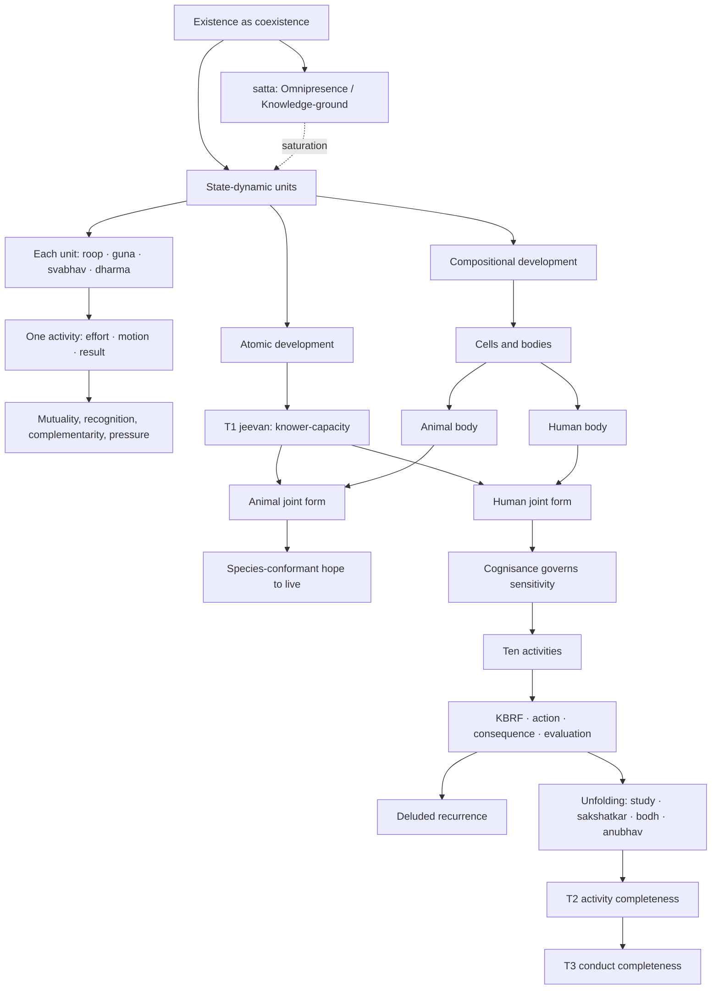
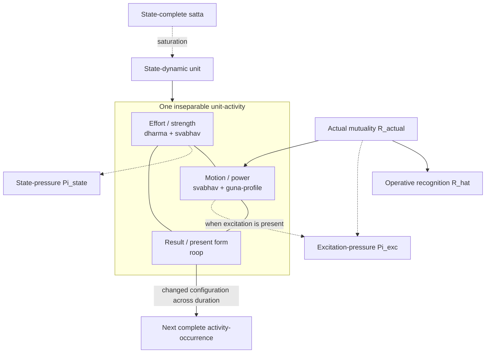
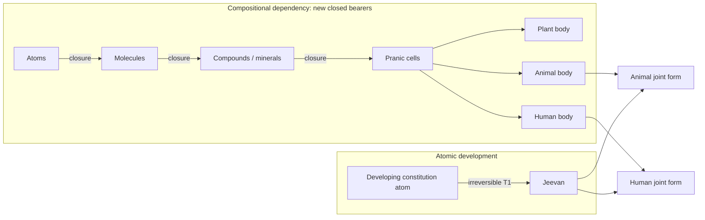
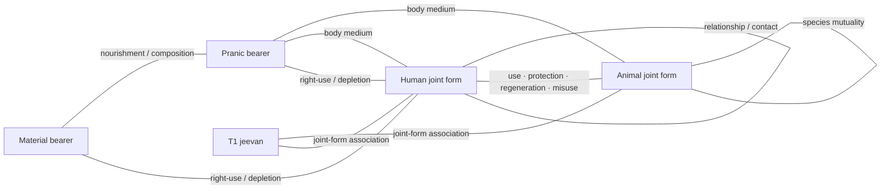
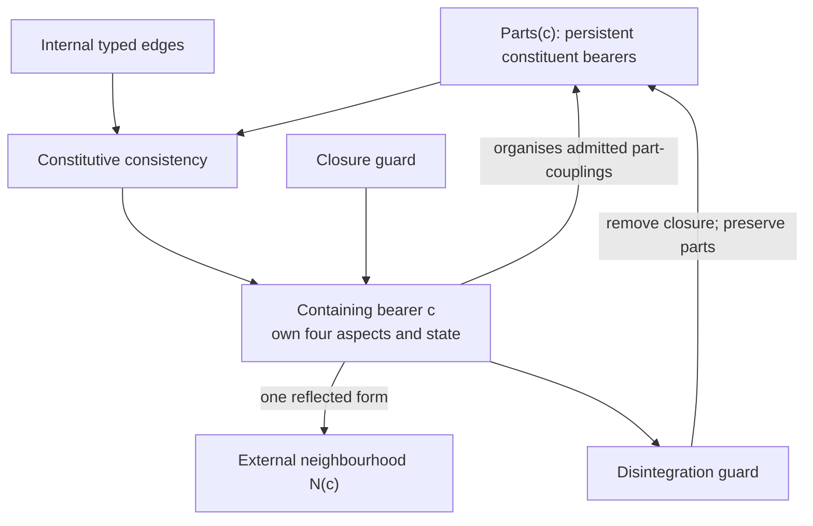
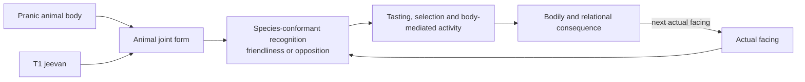
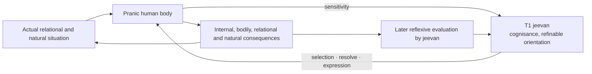

# From Unit Activity to Human Orderliness: A State-Dynamic Reconstruction of Coexistence

**Author:** [AnalyticMadhyasthDarshan.org](https://github.com/raghavamohan/AnalyticMadhyasthDarshan) — a group of people studying Madhyasth Darshan philosophy. Source repository: [raghavamohan/AnalyticMadhyasthDarshan](https://github.com/raghavamohan/AnalyticMadhyasthDarshan).

**Edited on:** August 27, 2026, 8:53 AM IST
**Status:** Draft

This paper develops a source-bounded causal architecture from unit activity to human orderliness. It reconstructs one connected account of material change, compositional closure, sentient participation, reflexive evaluation, and public conduct while preserving the different kinds of bearer and evidence involved. The result is a typed qualitative hybrid model, not a quantitative theory that predicts physical trajectories or proves every ontological claim.

At its ontological base, state-complete Omnipresence (*satta*) coexists with countlessly many state-dynamic units. The same *satta* is also named Knowledge or Space: actionless ground and source of inspiration, with inspiration inherent through saturation (MVD, pp. 35–36, 174). Every unit bears form (*roop*), property (*guna*), essential nature (*svabhav*), and *dharma*; every activity is effort, motion, and result together. The reconstruction separates the roles that make such activity intelligible: saturation grounds energy-fullness and intrinsic activeness; actual mutuality supplies the proximate conditions of change; constitution and conformance constrain the available response; *guna* and *svabhav* characterise its power and function; *niyati-kram* restricts the sequence of manifested orders; and *dharma* specifies order-relative fulfilment without acting as an additional force.

At the structural level, the model distinguishes two development lines. Compositional closure establishes molecules, compounds, cells, and bodies as new bounded bearers whose constituents persist. Atomic development instead reaches constitutional completeness (T1), yielding *jeevan* with invariant hope-bondage. The auxiliary role *J* represents unjoined T1 *jeevan* without adding a fifth order. Animal and human orders become manifest only through body–*jeevan* joint forms, so the human is neither a later animal composition nor a body that produces sentience.

At the human level, the same architecture extends from the five faculties and ten activities of *jeevan* into knowing, believing, recognising, fulfilling, action, consequence, and reflexive evaluation. This is unfolding of already-present knowledge rather than acquisition of a new power. It can represent both deluded recurrence and refinement through study, direct recognition (*sakshatkar*), enlightenment (*bodh*), and realisation (*anubhav*). Activity completeness (T2) names inner resolution; conduct completeness (T3) names its repeatable public evidence in relationship, work, family, society, and participation in orderliness.

Formally, the study contributes typed states, a dynamic relation graph, actual and operative recognition, order-relative invariants, guarded transitions, joint-form interfaces, qualitative human traces, and observation predicates. It also marks its limits: the physical identification of T1, the body–*jeevan* interface, quantitative calibration, and social-scale dynamics remain unresolved. Direct textual claims, translation choices, analytical reconstructions, proposed operational criteria, and open empirical questions are kept visibly distinct throughout.

## Model at a glance

The diagram shows three joints that organise the whole paper. Form, property, essential nature, and *dharma* describe the same active unit as effort–motion–result. Compositional development supplies bodies while atomic development supplies T1 *jeevan*; animal and human joint forms arise where those lines meet, so the human is not a later animal composition and *jeevan* is not produced by a body. *Satta* is also Knowledge-ground and remains actionless: the glance therefore keeps a single saturation arrow rather than a second Knowledge-force. Animal sentience expresses species-conformant hope to live, not knowledge-grounded evaluation or unfolding of determinate content *K**. Human unfolding proceeds through study, *sakshatkar*, *bodh*, and *anubhav*; it reorganises existing strength and power and does not add a force to effort–motion–result. Read against the paper: ground and units are §1, effort–motion–result §2, form, property, essential nature, and *dharma* §3, composition and coupling §4–§5, T1 and joint forms §6, human knowledge and refinement §7–§8, and completeness and verification §9–§10.

### Model contract

| Kind of statement | Meaning in this paper | Example |
|-------------------|-----------------------|---------|
| Direct textual claim | Stated in the primary texts in ordinary philosophical prose | Coexistence, saturation, four orders, effort–motion–result, the four aspects of a unit, T1–T3, ten activities |
| Translation choice | One English running term selected where translations vary | Omnipresence for *satta*; contemplation for *chintan*; justice-natural for *nyaya-sahaj* |
| Analytical reconstruction | A structure introduced to keep the claims explicit and mutually consistent | Typed states, relation graph, guarded transitions, observation maps |
| Proposed operational criterion | A checkable interpretation whose exact equivalence is not stated by the texts | Qualitative predicates for T2, T3, species-conformant animal sentience and public verification |
| Open empirical question | A source claim without an accepted contemporary scientific counterpart | Physical identification of T1 and persistence of *jeevan* apart from a body |

This contract governs every symbol and diagram. A formal object may organise a textual claim without becoming a further claim of the darshan.

### Core glossary

| Term | Plain meaning |
|------|---------------|
| Coexistence (*saha-astitva*) | The inseparable presentness of state-complete *satta* and countlessly many state-dynamic units. |
| Saturation (*samprikt*) | Every unit is soaked, submerged, and surrounded in *satta*, the basis of its energy-fullness and activity. |
| Knowledge-ground | *Satta* named as Knowledge or Space: actionless availability for realisation, not a second force or transmitted content. |
| Unfolding (*gyan udghatan*) | Human realisation and evidence of already-present knowledge through *jeevan*, proceeding through study, direct recognition (*sakshatkar*) in *chitta*, enlightenment (*bodh*) in *buddhi*, and realisation (*anubhav*) in *atma*; not a transfer of energy or information into the knower. |
| Cognisance / sensitivity | *Jeevan*'s knowing-and-accepting capacity (*sangyansheelta*) and embodied sensory responsiveness (*sanvedansheelta*); in the human joint form, cognisance governs sensitivity. |
| Higher- / lower-conformance | Governance of *mun* by inspiration from *vritti*, *chitta*, *buddhi*, and *atma* — justice-natural at tasting, selection, and behaviour — against governance by pressure from vitality, senses, body, and established behaviour. |
| Unit (*ikai*) | A bounded, countable bearer whose activity is effort, motion, and result together. |
| Effort–motion–result (*shram–gati–parinam*) | Three simultaneous aspects of one unit-activity. |
| Four aspects of a unit | Form (*roop*), property (*guna*), essential nature (*svabhav*), and *dharma*. |
| Form (*roop*) | The bearer's present bounded configuration and the result-side of its activity, not its complete typed state. |
| Property (*guna*) | Relative power evident in mutuality as generative, degenerative, and mediative tendencies. |
| Essential nature (*svabhav*) | The order-specific functional character through which strength and power operate; not a separate *shakti*. |
| *Dharma* | The invariant innateness of an order: what its fulfilment and orderliness mean, rather than knowledge, encoded instructions, or an additional force. |
| Mutuality | The actual facing among units and the order-specific recognition through which complementarity or contradiction is evidenced. |
| Pressure | Force recognised in state; excitation-pressure is the received compulsion evident in an excited facing. Neither is an external energy reservoir. |
| Closed bearer | An atom, molecule, compound, cell, body, or joint form with its own bounded conduct and four aspects. |
| Constitutional completeness (T1) | The irreversible atomic threshold at which *jeevan* is free of molecular- and weight-bondage and bears hope-bondage. |
| *Jeevan* | The constitutionally complete sentient atom that operates through an animal or human body. |
| Auxiliary sentient role *J* | The model's role for T1 *jeevan* when no body association is active in the bounded situation; not a fifth order or *dharma* profile. |
| Animal joint form | Animal body with *jeevan*, evidencing hope to live through species-conformant recognition, tasting, and selection. |
| Human joint form | Human body with *jeevan*, capable of knowing, believing, reflexive evaluation, refinement and humane conduct. |
| Evaluation-references | The set presently governing human comparison: pleasure–health–profit in delusion, or justice, *dharma*, and truth in humane consciousness. The humane members work in distinct fields: justice in behaviour, *dharma* in thought, truth in realisation. |
| Activity completeness (T2) | Restfulness of effort through realised inner resolution. |
| Conduct completeness (T3) | Destination of motion through repeatable humane conduct. |

The expanded terminology and every model symbol are collected in Appendix B.

## 1. Ontological foundations

Madhyasth Darshan holds that existence is neither a collection of static material substances nor an undifferentiated idealist field. Existence is coexistence (*saha-astitva*): the inseparable, perpetual presentness of Omnipresence (*satta*) and countlessly many discrete, active units (*ikai*) (SB, pp. 48–50; MVD, pp. 11, 34). Omnipresence is **state-complete** (*sthitipurna*): unbounded, everywhere uniform, non-transforming, and free from motion and pressure. Nature is **state-dynamic** (*sthitishil*): every bounded unit is inseparably present in state and motion within the state-complete (MVD, p. 26; SB, pp. 49–50, 248; KD 3.5, p. 70; KD 3.8, p. 84). The whole neither increases nor decreases, expands nor contracts, while development and awakening become manifest within it (KD 3.5, p. 70).

Every unit is saturated (*samprikt*) in Omnipresence: soaked, submerged, and surrounded in it. Omnipresence is permeative through units and present between them. That between-ness makes their boundaries and mutual distances possible; the same condition permits joining and separation without ever separating a unit from Omnipresence (SB, pp. 48–50, 249–250; JV, p. 149). Saturation is not a transfer from a finite store and Omnipresence does not push units by an applied force. It is the ontological basis on which each unit is energised, forceful, self-regulated, and active (MVD, pp. 40–41, 46; SB, pp. 57, 61, 69, 248; JV, p. 149; KD 3.9, p. 88; KD 3.13, p. 122).

This distinction is also stated as **absolute energy** and **relative energy**. Absolute energy is Omnipresence itself: everywhere present, non-active in itself, and the basis of basic impulsion. Relative energy is the unit's power made evident in mutuality; pressure, waves, fields, heat, sound, electricity, and related effects are physical-chemical expressions of that relative power (MVD, pp. 40–41). Omnipresence is also named fundamental uniform energy, while the perpetual activity of molecules, atoms, and atomic particles evidences that each is energised (KD 3.13, p. 122). Pressure does not supply a second stock of activity or stand beside *bal* and *shakti* as an additional power. It is the unit's force recognised in state and, in the narrower excitation sense, the compulsion received in an excited mutuality; such mutual pressure can condition change without becoming an external energy source (MVD, pp. 46, 114; SB, pp. 49, 59, 256; KD 3.11, pp. 105–106; KD 3.13, p. 118).

The same ground is also named Knowledge or Space. Knowledge in this sense is actionless and non-transforming: neither an activity nor an agent performing activities, while serving as their ground and source of inspiration, with inspiration inherent through saturation (MVD, pp. 32–36, 174). Units act; Omnipresence does not. Availability of this ground for realisation is therefore not a transition rule, an applied force, or a second energy beside saturation. How that availability unfolds as realised content in the human joint form is taken up in §7.

Mutuality is inherent in coexistence. Units recognise one another according to their order, and complementarity becomes evident through offering, acceptance, influence, composition, nourishment, use, and fulfilment. Recognition in the first three orders names definite response according to constitution, seed, or species. Necessary propensity leads to recognition and mutual recognition, while natural-state motion evidences determinate conduct at a good mutual distance (KD 3.5, p. 70; KD 3.10, p. 100).

Generative (*sam*), degenerative (*visam*), and mediative (*madhyastha*) tendencies belong to property; mediative activity regulates generative and degenerative tendencies (MVD, p. 26; KD 3.10–3.11, pp. 100–104; SB, p. 248). Excitation-pressure is received compulsion where *sam–visam* excitation is evident, while the wider state sense recognises force as pressure. An unfulfilled complementarity is not by that fact alone physical pressure. Every unit has inherent strength, and progress proceeds through mutual offering and acceptance (MVD, pp. 114, 230; SB, pp. 49–51, 61; JV, pp. 157–158).

The total activity of any unit is **effort–motion–result** (*shram–gati–parinam*). These are not three successive moments on a timeline in which effort causes motion and motion later produces a result. They are simultaneous, co-extensive dimensions of one activity-whole:

> **"Every physical-chemical activity is an inseparable presence of effort, motion and result."**
> — SB, p. 58

## 2. Effort–motion–result

The reconstruction uses continuous change only within a fixed bearer type and guarded transitions when a bearer forms, disintegrates, reaches T1, or enters or leaves a joint form. Time indexes the duration (*kaal*) of unit-activity rather than a container in which a unit is placed (see [*Nature of Time*](../Nature-Of-Time/Nature-Of-Time.pdf)). The resulting system is qualitative and hybrid: its labels and predicates preserve textual distinctions without pretending that the sources provide numerical coordinates or differential laws. Appendix A states the corresponding types and transition rules.

### 2.1 Result (*parinam*) and model state

*Parinam* is the form or configuration realised in a unit's activity: a different existent state in a quantitative and qualitative chain (KD 3.11, p. 107). The model writes that configurational result as *P*i. It writes the modeller's fuller description as *x*i, which may also record bearer kind, constitution, relations, and orientation. Keeping *P* and *x* distinct prevents spatial *roop* from being mistaken for every coordinate needed to describe a cell, body, animal, or human. Human action-consequences receive a third symbol, *Y*, because bodily, relational, and natural consequences are broader than configurational *parinam* alone (§8.2).

### 2.2 Effort (*shram*) as strength in the state

Effort is strength or force (*bal*) borne by the unit. The state is the force-bearing side of activity, while power is present in motion; effort is explicitly aligned with *dharma* and *svabhav* (SB, pp. 60–61, 248, 256–257). This alignment does not identify *dharma* with strength. *Dharma* names the unit's inseparable order-orientation, while *bal* names the strength borne in effort; *shakti* names its expression in motion. State and motion are indivisible, and their meanings as strength and power apply across units from atoms to planetary bodies (KD 3.8, p. 84; KD 3.11, pp. 102–109). The model represents effort by a qualitative strength description *B*i, not a scalar magnitude, potential, or stored quantity. The bearer's type already carries its order-specific *dharma*; *dharma* is therefore an invariant of the admissible state and transition family, not a moment-to-moment control input. Forcefulness remains present in every state, and effort persists until its stated restfulness in completeness (SB, pp. 60–61).

> **"Strength in state evidences orderliness in oneself; power in motion evidences participation in the overall orderliness."**
> — KD 3.11, p. 106

### 2.3 Actual mutuality and recognised mutuality

No unit is met in isolation. Form is reflected, power becomes effect, and complementarity or contradiction becomes evident in reciprocity (SB, pp. 49–51, 249–252). The model separates the relation actually present, *R*actual, from the relation operatively recognised, R̂. In material and pranic activity, and in species-conformant animal activity, recognition is definite according to constitution, seed, or species; recognising and fulfilling are stated as inherent in every entity of nature, an atomic particle included (JV, p. 69). In the human, R̂ can agree with or diverge from *R*actual; this difference is indispensable for modelling misrecognition, correction, and justice in relationship. Neither term is a force or universal deficit score. Together they record which bearers meet, what coupling joins them, and what order-specific complementarity, nourishment, use, relationship, or fulfilment is at issue.

### 2.4 Motion (*gati*) as power with a *guna*-profile

Motion is the unit's power (*shakti*) in operation: displacement, change of configuration, or another order-specific transformation. Generative, degenerative, and mediative tendencies give that power its *guna*-profile γ; essential nature gives the expression its order-specific functional character. *Sam* does not already mean integration in every order, nor does *visam* already mean cruelty. The sources allow mediative regulation to remain active while generative or degenerative tendencies are evident, so γ is a qualitative profile or dominant regime rather than a one-hot selector (MVD, p. 26; SB, pp. 60–62; KD 3.10–3.11, pp. 100–107). The transition relation is typed by the bearer's kind, manifested order, coupling kind, essential nature, and γ. The order type carries *dharma* as an invariant; it is not added as a separate force.

Natural-state motion is continuing power under definite conduct, with mediative regulation maintaining orderliness. Generative and degenerative tendencies remain activities of the unit's own property. The distinction from excitation concerns the facing and its pressure-expression, not the presence or absence of inherent strength and power.

### 2.5 State-pressure and excitation-pressure

Pressure has a general and a narrow sense. Force in state is recognised as pressure and power in motion as flow; the model marks this general expression as Πstate (SB, pp. 49, 256; KD 3.11, pp. 105–106). When *sam–visam* excitation is present, the received compulsion is excitation-pressure, Πexc (SB, p. 59; KD 3.13, p. 118). Departure from good mutual distance and its mediative restoration provide a material illustration (KD 3.11, pp. 103–104). Both terms belong to the force–power–property activity of units in mutuality. They may condition a transition through the relational facing, but neither is an energy reservoir, an applied force from *satta*, or a measure of every unfulfilled human relation.

### 2.6 Result and continuing transition

Over a duration, motion is evident as a changed result, and that configuration is immediately a force-bearing state in further mutuality. Effort is the grandeur of existent state, motion the spreading of effect, and result a different existent state in a quantitative and qualitative chain (KD 3.11, p. 107). Appendix A represents this continuity by transitions between complete activity-occurrences, without dividing one occurrence into effort first, motion second, and result last. Pressure and flow are simultaneous expressions within the occurrence; a transition records what becomes different across duration (MVD, pp. 40, 114; SB, pp. 58–62, 248, 256–257; KD 3.8, p. 84).

For material and pranic bearers, constitution, structure, seed, and mutuality determine the next expression without sentient comparison. Animal *jeevan* adds species-conformant hope to live, recognition, tasting, and selection; human *jeevan* adds knowing, believing, reflexive evaluation, dissatisfaction, and possible refinement of *sanskar*. These later layers relate complete activities to one another without changing effort–motion–result within any activity.

## 3. Form, property, essential nature, and *dharma*

Every unit has four inseparable aspects: form (*roop*), property (*guna*), essential nature (*svabhav*), and *dharma* (MVD, p. 47). They specify one activity-whole: effort or strength is present as *dharma–svabhav*, motion or power as *svabhav–guna*, and result as *roop* (SB, pp. 60–62). The alignment is not a causal ladder. *Dharma* names invariant order-orientation; *svabhav* names order-specific functional character; *guna* names relative power or tendency in mutuality; and *roop* names the bounded configuration present on the result side. *Svabhav* crosses effort and motion, while the other three terms mark different aspects joined through it. All four aspects belong to every closed bearer — atom, molecule, cell, body, or joint form — rather than being inherited as a sum from its constituents (§5.4).

Undirected spokes mark co-present aspects of one activity. Directed arrows mark analytical dependence or a relation across duration, not a temporal division of effort–motion–result.

### 3.1 Form (*roop*): bounded configuration

*Roop* is the spatial configuration and boundary-framework (*rachna*) of a unit, differentiated through shape, volume, and density or mass (MVD, pp. 49–50; SB, pp. 249–250; KD 3.10, pp. 100–101). It is the bounded way in which the unit is presently formed and available for reflection and recognition in mutuality. Form is unit-grounded; reflection presents it to another unit without creating it (MVD, pp. 42, 49–50; KD 3.9, p. 94).

The alignment of result with *roop* does not make form a passive shell. Motion spreads effect, and *parinam* is the different existent configuration realised in that activity (KD 3.11, p. 107). The same realised configuration can therefore be read as *P*i,n, the result-aspect of one complete activity-occurrence, and as φi,n, the form-coordinate of the bearer's state. These are two analytical roles for the configuration, not two additional constituents of the unit.

Nor is *roop* the unit's entire state, essential nature, or order. A bearer can retain identity, constitutional kind, and *dharma* while its configuration changes. Conversely, similarity of shape or size does not by itself establish the same constitution, *svabhav*, or mutuality. The model therefore writes the fuller typed state as *x*i,n = (φi,n, χi,n), where χ records relevant non-spatial and internal conditions. *Roop* remains real and indispensable without being asked to carry every feature needed for a dynamic description.

### 3.2 Property (*guna*): relative power in motion

*Guna* is relative power (*sapeksha shakti*): effect and influence evident when units come into mutuality (MVD, pp. 40, 47, 49–50; SB, pp. 248–252, 256–257). It aligns with motion or power, which spreads effect and participates in overall orderliness (KD 3.8, p. 84; KD 3.11, pp. 102, 106–107). The primary classification is generative (*sam*), degenerative (*visam*), and mediative (*madhyastha*). Generative tendency assists formation, degenerative tendency assists dissolution, and mediative tendency maintains or regulates what is formed (MVD, pp. 49–50; KD 3.10, pp. 100–101).

Property is therefore not a static descriptive label stored inside an otherwise inactive thing. It is the qualitative profile of relative power becoming effective in a facing. The model records that profile as γ, without assigning numerical weights or treating the three tendencies as mutually exclusive. Mediative regulation may remain present while generative or degenerative activity is evident (MVD, p. 26; SB, p. 248; KD 3.10–3.11, pp. 100–104). State-pressure and excitation-pressure describe how force–power is encountered under particular relational conditions; neither is an additional *guna*.

*Guna* and *svabhav* must nevertheless remain distinct. *Guna* gives the general tendency and relative effect of power; *svabhav* gives that activity its order-specific functional character. Integration and disintegration, vitalising and devitalising, cruel and non-cruel conduct, and humane or human-opposing conduct are not four further *gunas*. They are the functional meanings through which property is evidenced in the respective orders. The reconstruction does not impose a deterministic one-to-one conversion from each *guna* to each *svabhav* and therefore retains separate γ and *s* fields.

In the first three orders, constitution, conformance, and neighbourhood determine the expressed profile without human reflective option. In the knowledge order, the same three tendencies remain powers of *jeevan*, while their expression in conduct is answerable to understanding and freedom of action. Delusion can express degenerative property in treachery, exploitation, and war; awakening establishes mediative conduct (KD 3.10, pp. 100–101). Knowledge reorganises the expression of power without creating the underlying *guna* or *shakti*.

### 3.3 Essential nature (*svabhav*): functional character

*Svabhav* is fundamental character (*maulikata*) and the usefulness (*upayogita*) of properties (MVD, p. 47). Usefulness here means order-specific functional significance, not benefit to a human observer or moral approval: the same texts include disintegration, devitalising activity, and cruelty among the essential natures of their respective orders. Material units integrate or disintegrate; pranic units vitalise or devitalise; animal units evidence cruel or non-cruel conduct; and knowledge-order units can evidence humane or human-opposing dispositions (MVD, pp. 50–51, 57–58; SB, pp. 60–61, 179–180; KD 3.9–3.10, pp. 98–102).

*Svabhav* is thus a form of expression only if expression is understood functionally rather than as appearance. It is not itself *shakti*: relative power belongs to *guna*, and operative power appears in motion. *Svabhav* specifies what the unit's strength and power do as activity of this order. Its presence in both *dharma–svabhav* on the effort side and *svabhav–guna* on the motion side makes it the shared functional character spanning state and motion (SB, pp. 60–62). The transition relation is therefore typed separately by an admissible essential nature *s* and a *guna*-profile γ.

The relation to *dharma* is likewise not an automatic alignment mechanism. In the first three orders, constitution, seed-conformance, and species-conformance make the order-specific functional repertoire definite. In humans, *dharma* remains happiness while present essential nature can be human-opposing. Human-opposing expression appears as baseness, wretchedness, cruelty, covetousness, and causing pain; humane and higher-humane expression appears as fortitude, valour, generosity, kindness, grace, and compassion. Education, study, and qualitative development of *sanskar* make transformation toward humane essential nature possible (MVD, p. 124; KD, pp. 8–9, 26–27; KD 3.9, pp. 98–99).

This transformability belongs to the human joint form; it does not make the constitution-governed repertoire of a mineral or plant into a voluntary choice. Human *svabhav* can therefore support or obstruct conscious fulfilment of human *dharma*. Knowledge does not supply a new power called *svabhav*; it refines the functional character through which existing strength, power, and property are expressed in conduct. Read together, *dharma* gives the invariant orientation, *svabhav* the order-specific way of functioning, *guna* the relative-power profile, and *roop* the configuration present as result.

### 3.4 *Dharma*: innateness and invariant orientation

*Dharma* is innateness (*dharana*): what is borne, maintained, and cannot be separated from a unit of an entire order (MVD, p. 47). Existence, growth, hope to live, and happiness are stated cumulatively across the four orders (MVD, pp. 50, 115; SB, p. 179; KD 3.9–3.10, pp. 95, 100–102). Material *dharma* is existence; pranic *dharma* includes growth; animal *dharma* includes hope to live; human *dharma* includes happiness. These are four cumulative order-profiles built from four contents, not four forces or independently acting objects. The later order does not discard the earlier constituents of its profile.

The invariance is order-relative. Continuing activity, growth, configuration change, and human refinement do not manufacture or revise the *dharma* of an established bearer in the same order. Compositional closure can establish a new containing bearer whose order carries another cumulative profile while its constituents retain their own profiles. T1 is different from compositional closure: the developing atom retains identity but irreversibly changes constitutional kind, becomes *jeevan*, and immediately bears hope-bondage (MVD, p. 91). Progression therefore manifests a bearer or joint form to which an order-profile applies; it does not gradually append new *dharma* contents to an unchanged order-type.

This definition rules out treating *dharma* itself as knowledge or data. A material unit does not need a cognitive representation of existence, a plant does not consult encoded instructions called growth, and an animal does not first formulate hope as a proposition. Constitution, seed-conformance, and species-conformance are the respective conditions through which those orders continue. A formal model may store *D*o as a symbol attached to an order type, but the symbol is data in the model; the *dharma* it represents is not an information packet, program, or algorithm inside the unit.

Nor is *dharma* an additional strength or power. Effort or strength is present as *dharma–svabhav*, while motion or power is present as *svabhav–guna* (SB, pp. 60–62). The first alignment places *dharma* on the state-and-effort side of activity without equating it with *bal*. Strength is what the unit bears in state; power is its operative expression in motion; *svabhav* supplies order-specific functional character; and *guna* names relative power evident in mutuality. *Dharma* specifies the invariant orientation whose fulfilment is at issue. It does not push the unit, supply energy, calculate the next state, or act alongside strength and power as a third causal quantity.

Calling *dharma* an organising principle is therefore appropriate only in a constitutive sense. It states what continuing orderliness and fulfilment mean for a bearer of that order; it is not an external organiser imposing order upon otherwise inert material. The texts relate strength in state to being an orderliness and power in motion to participation in overall orderliness (KD 3.11, p. 106). They do not state a causal sequence in which *dharma* applies force and thereby produces order. Orderliness is the condition in which the unit's order-specific innateness is fulfilled and evidenced through its activity and mutuality.

In the human order, *dharma* additionally becomes an object of knowledge. Human *dharma* remains happiness even while a deluded human misunderstands how happiness is fulfilled. Understanding makes resolution possible, and resolution can be evidenced as orderly conduct in relationship, work, and participation (JV, pp. 110, 121–123; KD 3.5, p. 69). Knowledge does not create human *dharma*: it enables conscious comprehension and fulfilment of an orientation already present. The model accordingly separates the invariant *D*o, the occurrence-level predicate `fulfils_dharma`, and the human epistemic predicate `comprehends_dharma`. This preserves the textual connection between *dharma* and effort without reducing *dharma* to force, information, or an automatic transition rule.

### 3.5 The four orders

| Order | Typical bearer | Cumulative *dharma* | Essential nature emphasised here | Continuing conformance | Sentient evaluation |
|-------|----------------|----------------------|-----------------------------------|------------------------|---------------------|
| Material | Atom, molecule, compound, mineral | Existence | Integration and disintegration | Constitution or structure | None |
| Pranic | Cell, plant body, animal or human body as bodily medium | Existence and growth | Vitalising and devitalising | Seed and body lineage | None |
| Animal | Animal body with T1 *jeevan* | Existence, growth, hope to live | Cruel and non-cruel conduct | Species | Recognition of essential nature, friendliness and opposition |
| Knowledge | Human body with T1 *jeevan* | Existence, growth, hope to live, happiness | Human-opposing, humane and higher-humane conduct | *Sanskar* | Reflexive evaluation through knowing, believing, justice, *dharma,* truth and value-fulfilment |

The table separates bodily kind from manifested order. Animal and human bodies are pranic bearers; the animal and knowledge orders become manifest through their association with T1 *jeevan*.

## 4. Compositional development and closed bearers

The insentient line (*jada*) spans the material and pranic orders. A constitution-oriented atom, a molecule, a cell, and a body are not successive coordinate values of one bearer. Each closure establishes a bearer of a different type, with its own boundary, activity, form, property, essential nature, *dharma*, constituents, and relations. Composition is therefore represented by formation and disintegration transitions among typed bearers rather than by movement through one continuous state space.

Definiteness in this line does not mean immobility. *Roop* and result change, particles exchange, compositions form and disintegrate, and pranic bodies grow. Recognition and fulfilment occur according to constitution, structure, or seed rather than sentient evaluation. The unit remains state-dynamic while its conduct is definite by type and conformance.

### 4.1 Constraints of the material field

The material account distinguishes atomic constitution, molecular bonding, and weight-bonding. Atomic constitution (*gathan*) concerns the number and arrangement of particles in the nucleus and orbits. Hungry and overfull atoms remain open to absorption or displacement until a further definite atomic result is established (KD 3.1–3.3, pp. 56–62). **Molecular-bondage** concerns one atom joining another in a molecule rather than the particle count internal to one atom (KD 3.11, pp. 103–104). **Weight-bondage** concerns the weight-bearing relation of constitution-oriented atoms, molecules, and material bodies. Constitutionally complete *jeevan* is described as free of both bondages (MVD, p. 91; KD 3.3, p. 62). Inertia is not added as a separate doctrinal category.

### 4.2 Particle exchange, molecular joining, and closure

Before an overfull atom displaces a particle it is excited; the displaced particle can be absorbed by a hungry atom, after which both atoms establish their respective natural-state motions (KD 3.1, pp. 57–58). Molecular joining is related but distinct: atoms recognise one another and remain together at a definite good distance (KD 3.11, pp. 103–104). The model represents openness by an exchange-enabled relation and guarded displacement or absorption events, not by the failure of a trajectory to converge.

When complementary participation closes a new motion-path, a **compound** (*yaugik*) presents a new bearer with its own bounded conduct and four aspects. In a **mixture**, no new bearer closes and the components continue to exhibit their respective conducts (MVD, p. 42). A closure event creates the containing bearer and its part relation; a disintegration event removes that closure while the constituents persist according to their own types.

Composition and atomic development remain different processes. A compound, cell, or body may close as a new bearer while atomic development toward constitutional completeness proceeds on its own line (SB, pp. 75–76; KD 3.2–3.3). Their meeting in animal and human joint forms does not turn the two lines into one ladder.

### 4.3 Typed compositional bearers

The model assigns each kind of closed bearer its own qualitative state type: *X*atom, *X*molecule, *X*compound, *X*cell, *X*plant-body, *X*animal-body, and *X*human-body. Constitutive dependency among these types is a partial order, not set inclusion. A molecule depends on atoms without being an atom-state; a body depends on cells without being a cell-state. Within each type, form and relations may change while the bearer's bounded conduct remains recognisable.

The compositional sequence the texts set out on this earth runs, under conducive conditions, from constitution-oriented atoms through molecules and molecule-composed solids, liquids, and rarefied states, through compounds and minerals, through chemical resonance that yields nourishment- and composition-elements, through pranic cells, through plant-order bodies, through animal bodies, and as far as the human body whose *medhas* composition is the richest compositional plateau (KD 3.2, pp. 58–60). Four orders are perceivable in that sequence: the material state in soil and stone; the pranic state in the plant-order; the *jeevan* state and the knowledge state as joint forms of body and *jeevan* (KD 3.2, p. 59; SB, p. 179).

| Bearer type | Closed unit | Manifested order | Continuing conformance |
|-------------|-------------|------------------|------------------------|
| Atomic constitution | Atom | Material | Structure- or result-conformance |
| Molecular aggregation | Molecule | Material | Structure-conformance |
| Compound and mineral | Closed chemical composition | Material | Structure-conformance |
| Pranic cell | Cell with inherent composition-method | Pranic | Seed-conformance |
| Plant body | Organism composed of cells | Pranic | Seed-conformance |
| Animal body | Organism composed of cells | Pranic | Seed-conformance |
| Human body | Developed *medhas* composition | Pranic (expression medium) | Lineage of the body |
| Animal joint form | Animal body with *jeevan* | Animal | Species-conformance |
| Human joint form | Human body with *jeevan* | Knowledge | *Sanskar*-conformance |

The table is this paper's reconstruction of the sequence and the four-order partition. It is not a further completeness threshold numbered after T1. A plant body is a pranic composition; it is not *jeevan*. The animal order comprises animals and birds, excluding humans; the knowledge order comprises only humans (JV, p. 47). An animal or human is a joint form in which the compositional line supplies **that order's** body and the atomic line supplies constitutionally complete *jeevan* (§6). The human joint form is not the next animal. Most atoms remain engaged in physical and chemical constitution rather than attaining T1. Biological compositions return to material constituents after disintegration (MVD, pp. 8, 13; JV, pp. 47–48).

The upper arrows express constitutive dependency among bearer types, not one unit changing order. The lower lane is development in an atom. The lanes meet when an animal or human body operates with T1 *jeevan*; there is no transition from the animal joint form to the human joint form.

### 4.4 Nested dependence

Each bearer type supplies a **constitutive condition** for later closure. Molecules require atoms of the relevant kinds; compounds and minerals require molecular constituents; pranic cells require chemical substances, definite heat, and the composition-method of the *prana sutra*. Plant, animal, and human bodies require cells. The animal joint form requires an animal body and T1 *jeevan*; the human joint form requires the developed human bodily medium and T1 *jeevan* (KD 3.2, pp. 58–60; JV, pp. 47–48, 59, 69–70). The human body follows lineage tradition, whereas *jeevan* is not produced by that lineage (JV, p. 59).

Existential progression (*niyati-kram*) is the definite order in which the four orders become manifest on this earth under conducive conditions — material, pranic, animal, and knowledge (MVD, pp. 8, 13). The way of existence (*niyati-vidhi*) is the conformance by which a formed bearer maintains definite conduct. Constitutional completeness is development in the atom; compositional development closes new bearers. The two lines meet in animal and human joint forms without implying that a human is constituted from an animal joint form.

Definiteness does not mean that effort–motion–result is a teleological force pulling every atom through all four orders. Effort–motion–result states the completeness of each activity, while *niyati-kram* constrains the sequence in which order-types can become manifest. Most atoms continue in physical and chemical activity; some compositions close as new material or pranic bearers; constitutional completeness occurs on the distinct atomic line. The four *dharma* profiles are consequently a fixed repertoire of order-relative fulfilment criteria, not four dynamical attractors toward which every trajectory must converge. Treating them as attractors would add a convergence law beyond the qualitative transition structure adopted here.

### 4.5 Intrinsic activeness and proximate conditions

Progression is causally articulated at more than one level. Saturation in state-complete Omnipresence is the ontological ground of energy-fullness, forcefulness, basic impulsion, and the continuous activeness of every unit. That activeness is evident as effort–motion–result (SB, pp. 62, 69; KD 3.13, p. 122). Omnipresence does not intervene by pushing a unit toward a later order; the active strength and power belong to the saturated unit.

A particular material or compositional change depends on that inherent strength–power operating in actual mutuality. Motion, effort, environmental and mutual pressure, good distance, temperature, chemical composition, and complementary facing condition which result becomes possible. Integration, disintegration, particle exchange, molecular joining, and compositional closure therefore arise through local relational conditions rather than through attraction to a future order-profile (MVD, p. 114; SB, pp. 59–62; KD 3.11, pp. 102–109). Constitution, seed, species, and *sanskar* further constrain the response according to the bearer or joint form. *Guna* describes the relative-power tendency expressed in the activity, *svabhav* its order-specific functional character, and *roop* the resulting configuration.

These causal roles remain distinct. Effort–motion–result describes the inseparable completeness of present activity. *Niyati-kram* constrains the admissible sequence of manifested orders. *Dharma* specifies order-relative innateness and fulfilment, not the energy or transition rule. Under conducive conditions, actual mutuality can satisfy the guard for exchange, closure, growth, association, or another typed change. T1 is an irreversible constitutional completeness with definite postconditions, while an empirically accepted microphysical guard that predicts which developing atom reaches T1 or when remains open.

Development and awakening are also named as the goal of the whole universe, and the impulsion of insentient units is described as oriented toward development progression and development (MVD, p. 230). This purposive horizon makes activity intelligible through orderliness, complementarity, and development without asserting that every atom must successively become a pranic, animal, and knowledge-order bearer. The model therefore preserves purposive orientation while requiring local typed conditions for each transition.

## 5. Coupled units across orders

Bearer types do not occupy separate worlds. Mineral, plant, animal, and human units share one coexistence, recognise and fulfil at the level of their orders, and evidence complementarity in mutuality (SB, pp. 49–53; JV, pp. 43, 69; KD 3.10–3.11, pp. 100–109). The reconstruction therefore uses a dynamic typed relation graph rather than one isolated trajectory. Its vertices are persistent bearers; its edges record actual facings, containment, nourishment, relationship, contact, and body–*jeevan* association. Closure and disintegration can add or remove a containing vertex or edge without creating or destroying its constituent identities.

### 5.1 Many bearers

Let a bounded scenario be a finite subgraph with an explicit environment boundary. Every vertex has a **constitutional kind** — material atom, composition, pranic body, or T1 *jeevan* — and a **manifested order or role** — material, pranic, animal joint form, or knowledge joint form. The two axes prevent T1 *jeevan* from changing constitutional kind when it operates through an animal or human body. A bearer's neighbourhood contains only its actual facings and containing relations, not a mean field over nature. Form is reflected and property becomes effect in those facings (MVD, pp. 47, 49–50; SB, pp. 249–252).

The transition family is typed by the kinds and orders of the bearers that meet, the coupling kind, the essential nature expressed, and the qualitative *guna*-profile. A material unit may integrate or disintegrate; a pranic unit may vitalise or devitalise. A constituent's neighbourhood includes the containing bearer and the parts it actually faces. State-pressure and any excitation-pressure are recorded at the bearer and facing where they are evidenced (§2.5).

### 5.2 Structural relations and modes of fulfilment

Coupling has two dimensions. The first records how bearers are structurally related; the second records what fulfilment is relevant in their facing. Keeping these dimensions separate prevents composition, nourishment, and human relationship from becoming competing members of one list.

| Structural relation | What it records |
|---------------------|-----------------|
| Mutual facing | Bearers recognise and affect one another while retaining their identities. |
| Compositional closure | Complementary constituents close a new bounded bearer such as a molecule or compound. |
| Containment and organisation | A compound, cell, or body organises parts that retain their constitutional kinds and orders. |
| Joint-form association | An animal or human body operates as the medium of T1 *jeevan*. |

| Fulfilment in the facing | Where it appears |
|--------------------------|------------------|
| Structural need and exchange | Particle displacement and absorption; molecular joining; material composition. |
| Nourishment, use, protection, and regeneration | Pranic dependence on material composition and human participation with the first three orders. |
| Species mutuality | Recognition, hope to live, friendliness or opposition, and fulfilment in the animal order. |
| Relationship, contact, and participation | Human–human mutuality in the knowledge order. |

Overfull atoms displace particles and hungry atoms absorb them; atoms also recognise and gather with other atoms to form molecules. Particle exchange and molecular joining are related expressions of complementarity, but not every molecular bond is reduced to a direct hungry–overfull pairing (KD 3.1, pp. 56–58; KD 3.11, pp. 103–104). A coupling may change existing bearers or close a new one.

Pranic units take material compositions as nourishment- and composition-elements under seed-conformance. Animals select and taste through species-conformant bodies. Humans can know, believe, recognise, and fulfil with units of all four orders (JV, pp. 69–70). Knowledge-order use is bounded by right-use, protection, and regeneration; extraction beyond regeneration evidences contradiction in the coupling (MVD, pp. 105, 264; JV, pp. 58, 77).

A **relationship** (*sambandh*) has expectations predetermined in the sense of completeness, while a **contact** or association (*sampark*) has voluntary expectations (MVD, pp. 61–62). These value-bearing forms belong to knowledge-order mutuality. Every case remains an order-typed facing in which each bearer brings its own strength and power.

### 5.3 Order-typed interaction

Cross-order coupling does not impose one law on every pair. Essential nature is order-specific and evidenced in a facing rather than stored as a private scalar (MVD, pp. 50–51; SB, p. 179). Two material units meet as integration or disintegration. A composition meets a pranic body as vitalising or devitalising. Animals evidence cruel or non-cruel conduct through species-conformant recognition and activity. Humans meet as humane or inhumane and participate with the first three orders through use, right-use, protection, regeneration, or misuse.

The transition relation is indexed by source and target kinds and orders, coupling kind κ, essential nature *s*, and *guna*-profile γ. The same profile can accompany different functional characters: generative tendency is not already vitalising, and degenerative tendency is not already cruel. In material, pranic, and animal activity, constitution and conformance make recognition definite. Human R̂ may diverge from *R*actual; freedom of action can therefore express either humane or human-opposing *svabhav* in the same objectively established relationship.

Natural-state motion continues under complementary mutuality and mediative regulation; it need not be static. Adverse environment, over-extraction, or human mis-evaluation can condition excitation without changing the unit's *dharma* or constitutional kind. The pressure profile belongs to that actual facing, while the human's recognition of the facing may be correct or mistaken (§2.3, §2.5).

### 5.4 The four aspects of a containing unit

A closed unit that contains others is a further bearer, not a bag of states. In a compound, the participating entities cease to exhibit their respective conducts as the public conduct of the whole and a new conduct appears; in a mixture they remain publicly distinct (MVD, p. 42). The reconstruction assigns form, property, essential nature, and *dharma* to the containing bearer while each constituent retains those four aspects according to its own kind and order (SB, p. 260). The two-level description is an analytical synthesis; the texts do not supply a formal mereology.

Write *c* for a containing whole and *i* for one of its parts. The part relation *i* ≺ *c* is distinct from the external neighbourhood of *c*. The whole carries its own state, strength, *guna*-profile, essential nature, *dharma*, and external facings. Each part retains its kind and order while its neighbourhood includes the whole and the other parts it actually faces.

A constitutive-consistency predicate relates the state of *c*, its parts, and their internal edges. It states that the parts realise and sustain the closed bearer without reducing its conduct to a sum. The whole reciprocally organises which part-couplings are admitted, bounded, nourished, or excited. A closure guard creates the part relations and the new bearer; a disintegration guard removes them while preserving the constituent bearers.

| Aspect of *c* | Reconstructed representation | Consequence |
|---------------|------------------------------|-------------|
| Form (*roop*) | Bounded configuration φc | Other units meet the whole as one reflected form. |
| Property (*guna*) | Qualitative profile γc | Generative or degenerative part-activity can remain under mediative organisation. |
| Essential nature (*svabhav*) | Order- and coupling-typed transition family | A plant body vitalises or devitalises as that body; a compound integrates or disintegrates as that compound. |
| *Dharma* | Invariant *D*o(c) attached to the whole's order | The whole bears the innateness of its order while its parts retain theirs (SB, pp. 60–61, 179). |

A mixture has no containing bearer *c*. A compound, cell, or body does. The animal and human joint forms add an association between a pranic body and T1 *jeevan* without turning either into a part of one fused substance. The body remains a pranic containing unit; *jeevan* remains one sentient atom. The model treats associations among multiple *jeevans* as relations among persistent bearers rather than composition into a larger *jeevan*.

### 5.5 A material trace: exchange and restored motion

Consider an overfull atom, a hungry atom, and a displaced particle in mutual facing. Each row describes a complete activity-occurrence; the rows do not divide effort, motion, and result into a sequence within one occurrence.

| Occurrence | Source-level description | Reconstructed reading |
|------------|--------------------------|-----------------------|
| Mutual facing | The atoms meet with definite constitutions and complementary requirements. | Typed edges record actual distance, particle requirement, and operative recognition. |
| Excited activity | The overfull atom becomes excited before displacement; each unit remains forceful and active. | Each bears its own strength and *guna*-profile; Πstate is present and Πexc records the excited facing. |
| Changed configuration | A particle is displaced and may be absorbed, changing the atomic constitutions. | An exchange guard admits the transition and produces new configurational results *P*′. |
| Restored facing | The new constitutions continue in definite natural-state motion. | The next occurrence retains strength, power, property, and mutuality even when excitation-pressure is no longer present. |

If participation closes a compound, the transition additionally creates a containing bearer and its part relations. If it forms a mixture, only the mutual-facing edges change.

## 6. Constitutional completeness and joint forms

The transition from the insentient constitution-oriented atom to the sentient cognitive line is **constitutional completeness** (*gathanpurnata*, T1). It is not a further compositional plateau. When a developing atom achieves complete subatomic particle balance in its nucleus and orbits, particle hunger drops to zero and the atom crosses an irreversible threshold (SB, pp. 55, 61, 92, 144–145; KD 3.3, pp. 60–61). The compositional sequence can already have produced minerals, cells, and bodies; those remain of the order of what constitutes them. Only the atom reaches T1.

The sources also state a qualitative antecedent for that development. The sentient state is given as the result of frustration (*kshobh*) in insentient activity; frustration of effort is itself named as the cause of development, resulting in a thirst for restfulness (MVD, p. 91). This is a stated orientation of development, not a measurable precursor: §11.1 keeps the empirical identification of T1 open.

### 6.1 The T1 bifurcation and invariant constitution

At constitutional completeness, the atom becomes free of molecular- and weight-bondage and does not return to constitution-oriented status. Its particle constitution no longer undergoes the increase and decrease characteristic of hungry and overfull atoms; its strength and power are described as inexhaustible, and constitutional completeness as the immortality of result (MVD, p. 91; SB, pp. 55, 58, 61, 92; KD 3.3, pp. 61–62).

> **"An evolving-constitution atom is with molecular-bondage and weight-bondage. However, when the contraction and expansion activity increases in this atom, it instantly breaks free from its group and attains constitutional completeness, becoming a jeevan atom. The evidence of constitutional completeness is the jeevan atom's liberation from molecular-bondage and weight-bondage, and its having the hope-bondage."**
> — MVD, p. 91

The model records that invariance as a persistent core *c*J: no further particle increase or decrease and no reversal to constitution-oriented status. The primary texts do not formulate T1 in the modern vocabulary of splitting, fusion, or degradation, so those possible physical interpretations remain open rather than being included in the definition. T1 is not repeated when understanding changes; later development concerns *jeevan* activity and awakening while its constitution remains complete (KD, pp. 26–27; KD 3.16, pp. 142–145).

The same sentence that states the two liberations states what becomes invariant at T1: **hope-bondage** (*asha-bandhan*). *Jeevan* is not released into indifference. The invariant is kept generic at the T1 level: the sources evidence that orientation as hope of living in animals (MVD, p. 77). Happiness belongs to the cumulative *dharma*-profile of the knowledge order (§3.4); it is not hope-bondage rewritten as a human constitution. Joint-form activation assigns the order-profile — hope to live in the animal order, happiness in the knowledge order — without altering the invariant core. In the human recursion of §7–§9, this is where delusion persists or awakening begins (MVD, p. 91; KD, pp. 1–4). Hope-bondage is therefore the sentient counterpart of the structural bondages it replaces — an orientation borne in the constitution of *jeevan*, not a physical constraint on a trajectory.

### 6.2 Pranic bodies as living media

The pranic order requires more than a plateau label. A pranic cell bears an inherent composition-method associated with the *prana sutra*; under conducive material, nourishment, heat, and environmental conditions, cells form bodies that respire, take nourishment, grow, reproduce, decline, and disintegrate according to seed-conformance (KD 3.2, pp. 58–60; JV, pp. 47–48). A plant body remains pranic. Animal and human bodies are likewise pranic compositions before association with *jeevan* and continue to maintain bodily integrity through material and pranic activity while alive.

The model therefore gives every pranic body a seed or lineage pattern, a nourishment relation, a respiration condition, a growth condition, and a bodily-integrity predicate. Growth and reproduction are guarded closure transitions; decline and death remove the body's organising closure and return its constituents to material couplings. These are qualitative types, not a biochemical growth law.

### 6.3 The animal joint form

The animal and knowledge orders are joint forms of a pranic body and constitutionally complete *jeevan* (SB, p. 55). In an animal joint form, *jeevan* expresses the hope to live through species-conformance (JV, p. 49). Species-conformant recognition includes friendliness and opposition (SB, p. 249), together with the tasting and selection inherent in every *jeevan* and the sensitivity evidenced by animal-order beings (JV, pp. 38–39, 69–70). These activities serve the animal's hope to live. The model does not classify them as knowledge-grounded evaluation: they do not include the specifically human circuit of knowing, believing, evaluation through justice–*dharma*–truth, or refinement through realised knowledge.

The same trace device applies to the animal case. Each row describes a complete activity-occurrence; the rows do not divide effort, motion, and result into a sequence within one occurrence.

| Occurrence | Source-level description | Reconstructed reading |
|------------|--------------------------|-----------------------|
| Mutual facing | The animal joint form meets another bearer in its bodily and relational situation. | Typed edges record the actual facing; operative recognition is fixed by species rather than compared. |
| Species-conformant recognition | Essential nature is recognised, including friendliness and opposition. | R̂ is definite through species-conformance and is not revised by knowing and believing. |
| Tasting, selection, and bodily activity | Animal tasting, selection, sensitivity, and body-mediated activity follow. | Order-typed expression under the animal *dharma*-profile; no unfolding of *K** and no revision of *sanskar*. |
| Bodily and relational consequence | The consequence becomes the situation in which the next activity occurs. | The result is written into the situation as the neighbourhood of the next occurrence. |

The consequence of one animal activity alters the bodily and relational situation of the next. The reconstruction does not infer a human-style *sanskar* revision operator or a quantitative animal-learning law from this recurrence.

### 6.4 The human joint form and its interface

The human body remains a pranic bearer while T1 *jeevan* operates through it. The interface is bidirectional. The body presents sensitivity through sound, touch, sight, taste, and smell; *jeevan* cognises, accepts, and expresses through selection, imaging, analysis, resolve, and evidence. Cognisance governs sensitivity in the human joint form while the two work in balance; bodily activity still does not become knowledge, and refinement in *jeevan* does not reconstruct its invariant constitution (KD 3.10, p. 102; KD 3.16, pp. 141–145; JV, pp. 47–49, 59; SB, pp. 63–64).

Every body and *jeevan* activity remains effort–motion–result. Species-conformant animal recognition and human reflexive evaluation relate complete sentient activities to their situations; neither adds a fourth part to effort–motion–result. This paper models a joint form across one bodily span. Persistence of *jeevan* and *sanskar* across bodies is treated in [*Death, Continuity, and Rebirth*](../Death-Continuity-And-Rebirth/Death-Continuity-And-Rebirth.pdf).

## 7. Knowledge and the internal configuration of *jeevan*

The human joint state is written [*x*B, *c*J, *z*H] in Appendix A: the pranic body, invariant T1 core, and refinable human orientation. The brackets record a coupled unit of analysis without making body and *jeevan* one substance. Orientation *z*H contains a faculty profile, present *sanskar*, qualitative knowledge profile, evaluation references, and operative recognition.

### 7.1 Two uses of Knowledge

Madhyasth Darshan names Knowledge in two registers that this reconstruction must not collapse. The omnipresent ground within coexistence is itself Knowledge or Space: actionless and non-transforming, neither an activity nor an agent, while remaining the ground and source of inspiration for unit-activity (MVD, pp. 32–36, 174). That ground is *satta* under another name. Saturation already states its energy-role; the Knowledge-name states its intelligibility and availability for realisation. It does not drive constitutional completeness, animal species-conformance, or awakening, and it is not added as a second force beside effort and motion.

The determinate content realised by *jeevan* is coexistence, *jeevan*, and humane conduct. Participation in undivided society and universal orderliness is its purpose and evidence rather than a transmitted fourth substance (KD, pp. 3–4; KD 3.17, pp. 145–148). The content is not made variable by one person's ignorance. What varies is unfolding (*gyan udghatan*): knowledge is present throughout coexistence, while its unfolding occurs through awakened human beings and through the sentient aspect or thought (MVD, pp. 115–116, 289). In the human joint form that unfolding proceeds through study, *sakshatkar*, *bodh*, and *anubhav* (§7.4). *Jeevan* is the knower; the human joint form presents the evidence. The epistemological setting of knower, known, and evidence is developed in [*The Epistemology of Coexistence*](../The-Epistemology-of-Coexistence/The-Epistemology-of-Coexistence.pdf) §§1.1–1.5; this section records only the causal roles required by the state-dynamic architecture.

### 7.2 Sensitivity, cognisance, and conformance

The body–*jeevan* interface of §6.4 has two sides. Sensitivity (*sanvedansheelta*) is embodied responsiveness through sound, touch, sight, taste, and smell. Cognisance (*sangyansheelta*) is the knowing-and-accepting capacity through which *jeevan* understands relationship, value, purpose, and orderliness (SB, pp. 63–64). Sensory contact is required for bodily interaction; it does not by repetition yield the continuous satisfaction sought by *jeevan*. Recognising and fulfilling proceed through the balanced method of cognisance and sensitivity, and the human must awaken to the point where cognisance governs sensitivity (SB, pp. 63–64; KD 3.10, p. 102). The animal joint form remains species-conformant in recognition, tasting, and selection without this knowing-and-believing circuit, and therefore without unfolding of *K**.

Inspiration reaching *mun* from *vritti*, *chitta*, *buddhi*, and *atma* is higher-conformance. The sources name this direction justice-natural (*nyaya-sahaj*): *mun*'s work is tasting and selection, and that selection becomes behaviour, which is regulated through justice (MVD, p. 208). Pressure from vitality, senses, body, and established behaviour is lower-conformance. Lower-conformance is necessary to bodily maintenance. Error arises when it defines *jeevan*'s final purpose rather than remaining the body's contribution to the joint form. Higher-conformance is the path by which realised content reaches tasting and selection.

*Dharma* and truth already work in the faculties from which that inspiration comes. Awakening of *buddhi* and *chitta* continues until thought can present resolution; awakening of *atma* continues until realisation in Omnipresence; awakening of *vritti* and *mun* continues until behaviour and action are aligned with justice (MVD, p. 156). Justice is the manifestation of realisation in behaviour, *dharma* its manifestation in thought, and coexistence realised in *atma* is the ultimate truth (MVD, p. 155). The evaluation-reference profile *q*H records the whole humane set that governs comparison (§8.3). Higher-conformance names the direction of governance at *mun*. It is not an applied force from *satta*, and it does not add a faculty that T1 *jeevan* lacked.

### 7.3 Five state-motion pairs

The five faculties each have an activity in state, expressed as strength, and a paired activity in motion, expressed as power. In awakened activity, realisation is evidenced outward through these pairs (KD 3.6, pp. 71–72; KD 3.16, p. 145; MVD, p. 78; JV, pp. 92–94).

| Faculty | State / strength activity | Motion / power activity |
|---------|---------------------------|-------------------------|
| *Atma* | Realisation (*anubhav*) | Evidence or authentication (*pramanyata*) |
| *Buddhi* | Enlightenment (*bodh*) | Resolve (*sankalp*) |
| *Chitta* | Contemplation (*chintan*) | Imaging or visualisation (*chitran*) |
| *Vritti* | Comparison or weighing (*tulana*) | Analysis (*vishleshan*) |
| *Mun* | Tasting (*asvadan*) | Selection (*chayan*) |

Each row gives paired descriptions of the forceful and projective sides of *jeevan* activity. State and motion remain indivisible as realisation and evidence, enlightenment and resolve, contemplation and imaging, comparison and analysis, and tasting and selection. A developed human body provides the medium through which all ten can be evidenced; in delusion, their full exercise remains unavailable (KD 3.16–3.17, pp. 145–147; JV, pp. 92–94). In the unfolding sequence of §7.4, *chitta*'s contemplation is accomplished as direct recognition (*sakshatkar*) of justice, *dharma*, and truth. Realisation does not add faculties. It makes the upper pairs effective so that inspiration from *atma* and *buddhi* can govern comparison, tasting, and selection — the higher-conformance of §7.2. In delusion those pairs remain unevidenced, and *mun* is organised from below.

### 7.4 Realised knowledge as orientation

Let *K** denote the determinate content — coexistence, *jeevan*, and humane conduct. A qualitative profile *k*H records which parts have been studied, directly recognised in *chitta* (*sakshatkar*), enlightened in *buddhi*, realised in *atma*, and made available as evidence. It is not a scalar degree, and it does not treat knowledge as a possessed quantity. The profile records incomplete unfolding of already-present *K**.

> **"Affirmation of truth in the form of coexistence through the way of study is referred to as ratiocination in mun (in the form of acceptance), deliberation in vritti (by way of qualitative analysis), direct recognition in chitta, and enlightenment in buddhi."**
> — MVD, p. 126

Study is the work of that sequence. Direct recognition in *chitta* is its accomplishment at meaning; enlightenment in *buddhi* is its culmination; realisation in *atma* follows that enlightenment. Realisation is attained after revelation (*sakshatkar*) and definitive understanding (*avdharna bodh*) (JV, p. 62; MVD, pp. 99–100). Realised content is then projected through resolve, imaging, analysis, and selection (MVD, p. 100; KD 3.6, pp. 71–72; KD 3.12, p. 112; KD 3.17, pp. 145–148). No transition rule makes study automatically produce *sakshatkar*, enlightenment, or realisation.

### 7.5 Initial *sanskar* and deluded evaluation

Every human acts from present acceptance. Environment, study, and *sanskar* contribute to the orientation from which thought and conduct are expressed, while the body provides the sensory and motor medium (KD, pp. 6–9; KD 3.16, pp. 141–145). The faculty, knowledge, acceptance, evaluation, and recognition fields of *z*H are qualitative predicates rather than neurological measurements.

In delusion (*bhram*), identification of *jeevan* with the body leaves the upper activities unevidenced and organises comparison from sensory input. Of the ten activities, only four and a half are then effective — selection, tasting, analysis, imaging, and half of comparison — while pleasure, health, and profit become its prevailing perspectives (MVD, pp. 58, 78, 80–81; SB, pp. 91–92; JV, pp. 73–74, 93–94, 97–98). Human *dharma* remains happiness; the error lies in what is accepted as its fulfilment. Freedom of action leaves both human-opposing and humane expression possible.

### 7.6 Knowing, believing, recognising, and fulfilling

Human evidence joins four distinguishable aspects: knowing and believing organise the internal orientation; recognising relates that orientation to actual mutuality; fulfilling becomes bodily and public conduct (JV, pp. 69–70). Their agreement cannot be assumed. A person may know a proposition verbally yet misrecognise a relationship, or recognise a responsibility yet fail to fulfil it. The model therefore records a qualitative KBRF profile rather than treating knowledge as possession of information.

Study enters through typed human–human relations involving teacher, learner, language, tradition, projection, and reflection. These relations can present content for attention and evaluation, while *sakshatkar*, enlightenment, and realisation remain activities of the learner's *jeevan*. Knowledge is neither copied as a state variable nor transmitted as energy. This representation supplies an explicit route by which study can alter the material available to later reflection without predetermining *sakshatkar*, enlightenment, or realisation.

## 8. Human effort-motion-result and internal refinement

Effort–motion–result applies to *jeevan* as it does to every unit. Human activity differs because its orientation includes acceptance, knowledge profile, operative recognition, and evaluation references. These qualify expression through faculties and body while constitutional capacity remains invariant.

### 8.1 The four aspects in human activity

Human *dharma* *D*H,n remains happiness through resolution and participation in orderliness while the knowledge-order joint form is active. The qualitative predicate `ComprehendsDharma(H,n)` records its present comprehension and evidence. Present *sanskar*, knowledge profile, operative recognition, and freedom of action condition the humane or human-opposing *svabhav* and *guna*-profile expressed in conduct. Human-opposing expression can be transformed toward fortitude, valour, generosity, kindness, grace, and compassion, while awakened conduct becomes mediative (KD, pp. 26–27; KD 3.9–3.10, pp. 98–101).

The invariant constitution *c*J, with its inexhaustible strength and power, is distinguished from the current expression *B*H,n. Power appears in selection, analysis, imaging, resolve, evidence, and body-mediated conduct. Knowledge does not replace *bal–shakti*; it qualifies its knowledge-order expression through understood purpose. The same loop is named as *karan–karta–karya*: the knowledge-state as cause, the human being as doer, and participation in universality as effect (KD 3.17, pp. 145–150). It does not add a mechanism beyond that qualification of existing strength and power. The T1 core *c*J remains invariant throughout refinement.

### 8.2 Result in the knowledge order

Every human action carries the hope for happiness and yields a coupled consequence profile. The body is the medium of outward expression, while acceptance and evaluation occur in *jeevan* (KD, pp. 1–4, 26–27; KD 3.16, pp. 142–145). The model distinguishes configurational *parinam* *P* from the following consequences *Y*:

| Result aspect | What changes |
|---------------|--------------|
| Internal | The alignment and operative orientation of *atma, buddhi, chitta, vritti,* and *mun* |
| Bodily | Speech, bodily action, production, use, and the body's physical condition |
| Relational | Recognition, value-fulfilment, trust, satisfaction, or contradiction in human mutuality |
| Natural | Nourishment, right-use, protection, regeneration, imbalance, or depletion in couplings with the other orders |

The four aspects form one consequence profile; the sources do not assign the internal aspect exclusive priority. For the narrower question of how one activity conditions another, its internal consequence can be carried in *z*H, while bodily, relational, and natural states are updated in the actual graph. Results expressed through the body prompt further thought and reflection; thought arising from action can be settled again as conception through inference (KD, p. 3; KD 3.17, p. 147; MVD, p. 218).

### 8.3 Evaluation links successive activities

One consequence can become the object of a later complete activity of tasting, comparison, contemplation, enlightenment, or realisation. The model relates the consequence profile, its observation from the present standpoint, and an admissible orientation update. Evaluation itself remains effort–motion–result.

In delusion, pleasure, health, and profit organise evaluation. In humane consciousness, justice, *dharma*, and truth supply the reference points as one governing set. The evaluation-reference profile *q*H records which of these sets presently governs comparison; the six named perspectives of pleasant–unpleasant, healthy–unhealthy, profitable–unprofitable, justice, *dharma*, and truth are set out in [*The Epistemology of Coexistence*](../The-Epistemology-of-Coexistence/The-Epistemology-of-Coexistence.pdf) §1.4.

Each member of the humane set has a distinct field of work. Behaviour is regulated through justice: a relationship is recognised, its values are fulfilled, that fulfilment is evaluated, and mutual satisfaction is the evidence (JV, pp. 97–98, 137–139). Thought is disciplined through *dharma*: comparison is oriented toward resolution and orderly participation. Realisation takes place only through truth: understanding is tested against existence itself (MVD, p. 137). The profile *q*H therefore records the governing set, while later evidence still distinguishes the three fields. Because the actual relationship and the human's operative recognition are separate fields, the model can represent error and correction in the justice sequence without changing the relationship that was objectively present. The same update relation can refine thought under *dharma* or open inquiry toward truth.

An update can preserve an acceptance, correct recognition, refine evaluation, or stabilise realised *sanskar*. Realisation-oriented conceptions in *buddhi* manifest in thought and action; thought arising from action is settled again as conception through inference (MVD, p. 218). Completed humane *sanskar* is understanding, honesty, responsibility, and participation (JV, p. 49). The update relation is non-deterministic: repetition does not turn error into knowledge, and one corrected act does not establish completeness.

### 8.4 Dissatisfaction, recurrence, and inquiry

The non-attainment of *jeevan* values is experienced as dissatisfaction or internal contradiction. Deluded sensory living leaves the human dissatisfied, while satisfaction becomes possible through understanding (JV, p. 77). The model records this as a qualitative predicate, not a measured error, excitation-pressure, or force applied to *jeevan*.

If the same acceptance and pleasure–health–profit references organise the next activity, the pattern can recur. If contradiction is recognised as a need for understanding, inquiry and study can begin. Study may reach *sakshatkar* in *chitta*; *sakshatkar* may open enlightenment in *buddhi*; enlightenment may become realisation in *atma*; realised orientation reorganises comparison, contemplation, selection, and conduct through justice, *dharma*, and truth (MVD, pp. 99–100, 126; JV, p. 62; KD, pp. 1–4; KD 3.6, pp. 71–72; KD 3.12, p. 112; KD 3.17, pp. 147–148). Dissatisfaction does not mechanically force this branch because freedom of action remains.

### 8.5 A human trace: one consequence, two evaluations

Suppose a person accepts responsibility in a recognised relationship but abandons it for immediate profit. This analytical example illustrates the transition schema rather than a case narrated in the primary texts.

| Moment | Activity and consequence | Reconstructed reading |
|--------|--------------------------|-----------------------|
| Present orientation | Profit organises comparison; the responsibility is recognised but not fulfilled. | *z*H,n, R̂H,n, and *q*H,n condition the expressed activity. |
| Consequence | The act produces internal contradiction, a work consequence, and diminished relational trust or satisfaction. | *Y*H,n updates internal, bodily, relational, and natural fields. |
| Recurrent evaluation | Profit remains decisive and the act is justified. | The update preserves the prior evaluation profile; dissatisfaction may recur. |
| Inquiry-oriented evaluation | Non-fulfilment is recognised as a question of justice, *dharma*, and truth, beginning in the unfulfilled relationship. | Study and reflection may correct R̂ and refine accepted conception. |
| Later evidence | Responsibility is fulfilled and assessed through mutual satisfaction. | Changed orientation becomes publicly testable; one act alone does not establish T2 or T3. |

The trace makes the distinction between dissatisfaction and excitation-pressure concrete. The former is a sentient consequence of unresolved value or orientation; the latter belongs to an excited force–power relation.

## 9. *Jeevan* values and completeness

The destination of this refinement is harmony within *jeevan*. Happiness, peace, contentment, and bliss are names for harmony among adjacent faculties, while realisation in coexistence at *atma* is ultimate bliss. The effect of realised *atma* reaches the remaining faculties as a nested order (MVD, pp. 100–101; JV, pp. 60, 137–138; KD 3.6, pp. 71–72).

### 9.1 Nested internal harmony

| Site of harmony | Evidence in *jeevan* |
|-----------------|----------------------|
| *Atma* realised in coexistence | Ultimate bliss (*paramanand*) |
| *Buddhi–atma* | Bliss (*anand*) |
| *Chitta–buddhi* | Contentment (*santosh*) |
| *Vritti–chitta* | Peace (*shanti*) |
| *Mun–vritti* | Happiness (*sukh*) |

The model records a qualitative harmony profile drawn from *sukh, shanti, santosh, anand,* and *paramanand*. These are nested relations among faculties, not interchangeable magnitudes. Realisation is accepted in *buddhi*, contemplated in *chitta*, compared in *vritti*, and tasted in *mun*. The internal harmonies differ from the established relational values of §10.1 while supplying the orientation from which relational conduct can remain stable (JV, pp. 137–139).

### 9.2 Activity completeness (T2 - *kriyapurnata*)

Activity completeness is the restfulness of effort (*shram ka vishram*) in realised activity (SB, p. 58; MVD, p. 104; KD 3.6, pp. 71–72). The model proposes four mutually supporting criteria: realisation of *K**, all ten activities effective, full internal harmony, and restfulness of effort. Their conjunction is an operational reconstruction rather than an exact equivalence stated in one passage. Absence of reported dissatisfaction may accompany T2 but is not sufficient to define it.

### 9.3 Conduct completeness (T3 - *acharanpurnata*)

Conduct completeness is the lived evidence of T2 through humane conduct (*manaviya acharan*) and is named the destination of motion (*gati ka gantavya*). Humane conduct integrates character (*charitra*), ethics (*niti*), and values (*mulya*). Character is evidenced through rightfully owned wealth, marital faithfulness, and kindness in action. Ethics directs body, mind, and wealth toward right-use and protection; values are recognised and fulfilled in relationship (MVD, pp. 80, 102, 104; SB, p. 58; JV, pp. 54–55; KD, p. 67). The model treats T3 as T2 together with stable humane conduct across a relevant diversity of relationship and work contexts. “Stable” is qualitative and sustained, not a universal duration supplied by the sources.

## 10. Verification in relationship, work, and society

Madhyasth Darshan seeks harmony and integrality across the human dimensions of work, behaviour, thought, and realisation (MVD, p. 18). These domains test different effects of one orientation without reducing them to a numerical score or allowing private assertion to substitute for conduct.

### 10.1 Relationship, value, and mutual satisfaction

Human–human justice follows a definite relational sequence: actual relationship and role are present; the person operatively recognises them; inherent values are recognised and fulfilled; fulfilment is evaluated; mutual satisfaction becomes evidence (JV, pp. 97–98, 137–139). Trust, respect, affection, gratitude, and the remaining values belong to relationship, while satisfaction or dissatisfaction is the experienced consequence of their fulfilment or non-fulfilment. Separating *R*actual from R̂ makes both misrecognition and correction explicit. That sequence is justice in relationship; the thought and realisation domains of §10.2 carry the other two fields of §8.3.

### 10.2 Fourfold verification and work with *jada*

The reconstruction assigns each domain one of four statuses: supported, contradicted, undetermined, or not assessed. It does not aggregate them. The four domains record the three fields of §8.3 together with work in nature (MVD, p. 137).

| Domain | Evidence and access |
|--------|---------------------|
| Thought | Discipline through *dharma*: resolution and orderly participation, compared under justice, *dharma*, and truth; accessible through first-person report and coherent expression |
| Behaviour | Regulation through justice: actual relationship, operative recognition, value-fulfilment, contradiction, evaluation, and mutual satisfaction; jointly assessed by those involved |
| Work | Law (*niyam*), regulation (*niyantran*), balance (*santulan*), protection, right-use, regeneration, or depletion; publicly and sometimes instrumentally accessible |
| Realisation | Realisation through truth: first-person realisation in coexistence and its coherent evidence through the remaining faculties; not directly reducible to an external measurement |

Material and pranic bearers continue through their order-typed activity; animal *jeevan* retains species-conformant hope to live and recognition; human evaluation governs selection, work, use, and restraint. Education and *sanskar* concern law, regulation, balance, and justice; natural use is bounded by right-use, protection, and expenditure in proportion to regeneration (JV, pp. 58, 138–139; MVD, p. 264). Exploitation in relationship or depletion in work contradicts a present claim of complete public evidence even when inner realisation is asserted.

### 10.3 Undivided society

The primary texts link the human goals as resolved individual, prosperous family, fearless society, and universal coexistence (JV, pp. 60–61; SB, pp. 246–247):

**Resolved individual → prosperous family → fearless society → universal coexistence**

Resolution is lived as happiness, prosperity supports peace in family, fearlessness supports contentment in social order, and understanding is evidenced as bliss in participation (JV, pp. 60–61). The present formal model stops at individual and relational traces. Deriving the social chain would require family resource states, relationship networks, institutions, production–regeneration relations, and population-level participation. Until those modules are supplied, the chain remains a source-stated direction of evidence rather than a theorem of the reconstruction.

## 11. Open problems

### 11.1 Identifying T1

T1 remains a metaphysical and textual threshold without an accepted counterpart in contemporary physics. The sources state freedom from molecular- and weight-bondage, constitutional invariance, inexhaustible strength and power, and hope-bondage. They do not supply a laboratory guard, measured particle count, or observation protocol by which a developing atom could be identified as *jeevan*. The model therefore marks T1's postconditions while leaving its empirical detection undetermined.

### 11.2 Quantitative calibration

Strength, *guna*-profile, essential nature, actual mutuality, operative recognition, state-pressure, excitation-pressure, harmony, and verification are qualitative types or predicates. The sources provide no common scale, interaction kernel, potential, probability, or learning rate. Order-specific empirical submodels may eventually refine selected material or pranic transitions, but no one metric can be assumed to span atoms, bodies, values, and realisation.

### 11.3 Boundaries of a containing bearer

The distinction between mixture and compound supports the idea of new public conduct, while the persistence of constituent order supports a two-level account. The sources do not provide necessary and sufficient criteria for every compound, organism, ecosystem, institution, or other proposed whole. The constitutive-consistency predicate therefore remains a model placeholder whose application must be justified bearer by bearer.

### 11.4 Animal sentience and species-conformance

Animal recognition of essential nature, friendliness, opposition, tasting, selection, and hope to live are textually stated. Their relation to learning, memory, species variation, and contemporary animal cognition remains under-specified. The present animal module treats these activities as expressions of species-conformant hope to live rather than as the knowledge-grounded evaluation specific to humans, without reducing animal sentience to behavioural conditioning.

### 11.5 The body–*jeevan* interface

The joint-form account requires bodily presentation to *jeevan* and sentient expression through the body. The sources name the faculties and bodily medium but do not provide a physical transfer mechanism or empirical interface variable. The two directed interface relations in Appendix A preserve the distinction without explaining its physical implementation.

### 11.6 Evidence and counterevidence

First-person realisation, mutual satisfaction, repeatable conduct, work with nature, instrument-based observation, and textual fidelity provide different access. No single observation proves all layers. The model can record support, contradiction, or indeterminacy, but robust criteria for counterevidence—especially for T1, T2, and claims of realisation—require further philosophical and empirical work.

### 11.7 Social-scale dynamics

The four human goals require family, resource, trust, production, institution, and relationship-network states. The present reconstruction supplies individual and relational traces but not a population model. A future extension must preserve persons as agents and relationships as value-bearing relations rather than deriving society from an aggregate satisfaction score.

### 11.8 Relation to contemporary science

Typed closure, pranic growth, animal sentience, and human cognition can be compared with chemistry, biology, neuroscience, and social science without treating the vocabularies as already equivalent. Mapping the darshan's atom, *prana sutra*, T1 *jeevan*, faculties, and completeness stages to contemporary entities remains a comparative research programme rather than an achievement of the present formalism.

## Appendix A. A typed qualitative hybrid model

### A.1 Reading the formalism

This appendix is a qualitative reconstruction, not a mathematical form found in the primary texts. It keeps different kinds of bearer, activity, relation, transition, and evidence from being collapsed into one equation. The symbols carry types and logical relations but no numerical metric, probability, force law, learning algorithm, or proof of the darshan.

The model is **hybrid** in a limited sense. Activity may continue over a duration within a stable bearer kind. Composition, disintegration, constitutional completeness, body–*jeevan* association, and changes in accepted conception are guarded transitions between complete activity-occurrences. An occurrence index *n* distinguishes such occurrences; Δ*t*n records the duration considered. Neither is an ontological container in which existence is placed.

Effort, motion, and result remain simultaneous aspects of every unit-activity. A transition relates one complete occurrence to another; it does not put effort, motion, and result in temporal sequence within one occurrence. An evaluative occurrence is likewise a complete sentient activity rather than a fourth part of effort–motion–result.

Actual mutuality can condition which activity is expressed, and environmental pressure can condition excitation. Pressure remains an expression of unit force–power in mutuality rather than an independent energy reservoir.

A companion note, [*The Occurrence-Cycle of a Unit*](Research-Note-Occurrence-Cycle-Of-A-Unit.md), restates this appendix as an occurrence-cycle of a unit in a neighbourhood — standing conditions, situation cycle, unit occurrence, and guarded events — for readers who want the same architecture presented as what a unit does.
### A.2 Ontological types and standing invariants

Let $\mathbb{S}$ denote state-complete Omnipresence (*satta*), and let $i,j,c,b$, and $h$ denote bounded bearers or analytical joint-form handles. Two type axes remain distinct:

| Type axis | Symbol | Values used here |
|-----------|--------|------------------|
| Constitutional kind | $\kappa_{i,n}$ | Developing atom, T1 *jeevan*, molecule, compound or mineral, pranic cell, pranic body, joint-form handle |
| Manifested order or role | $o_{i,n}$ | Material $M$, pranic $P$, animal $A$, knowledge $K$, or auxiliary unjoined-sentient role $J$ |

The indices matter only at guarded boundaries. Constitutional kind and manifested role remain stable across continuing occurrences, but T1 changes the same atom from developing constitution to T1 *jeevan*, while body–*jeevan* association activates an animal- or knowledge-order joint-form handle. T1 *jeevan* retains its constitution whether associated with an animal body, a human body, or no body in the bounded situation. Animal and knowledge order name joint-form roles rather than different constitutions of *jeevan*. A joint-form handle refers to the coupled body–*jeevan* unit of analysis without introducing a third substance.

$J$ is an auxiliary role, not a fifth order. It marks a T1 *jeevan* for which no body–*jeevan* association is active in the bounded situation. The four-order *dharma* map is therefore defined only for $M$, $P$, $A$, and $K$. The model does not infer a fifth cumulative profile for $J$; it records the narrower source-stated T1 orientation as the invariant predicate $\operatorname{HopeBondage}(j)$.

The generic activity schema uses a standing orientation input

$$
\mathcal{I}_{i,n}
=
\begin{cases}
D_{o_{i,n}}, & o_{i,n}\in\{M,P,A,K\},\\
\operatorname{HopeBondage}(i), & o_{i,n}=J.
\end{cases}
$$

The second branch is not a fifth $D_o$. It keeps the source-stated sentient invariant available when the four-order cumulative profile is inapplicable because no animal or human joint form is active.

The standing constraints are

$$
\operatorname{StateComplete}(\mathbb{S}),
\qquad
\mathbb{S}\notin U_n,
$$

$$
\forall i\in U_n:
\operatorname{Bounded}(i)
\land
\operatorname{Saturated}(i,\mathbb{S}).
$$

No transition changes $\mathbb{S}$, assigns motion or pressure to it, or treats saturation as an applied input. Every bearer has persistent identity $\operatorname{id}(i)$. Composition activates a containing bearer without annihilating its constituents. Disintegration deactivates that closure while constituent identities continue. T1 preserves atomic identity while irreversibly changing constitutional kind.

The order-specific *dharma* and its fulfilment are separate. For an order-manifesting bearer or joint-form handle,

$$
D_{i,n}=D_{o_{i,n}},
\qquad
o_{i,n}\in\{M,P,A,K\},
\qquad
\operatorname{FulfilsDharma}(i,n)
\in
\{\mathrm{true},\mathrm{false},\mathrm{undetermined}\}.
$$

Across an established order interval,

$$
o_{i,n+1}=o_{i,n}
\Longrightarrow
D_{i,n+1}=D_{i,n}.
$$

Human *dharma* can remain happiness while an occurrence fails to fulfil it. $D_{i,n}$ is neither an applied force nor an instruction determining the next state. Compositional closure assigns the applicable profile to the newly active containing bearer while its constituents retain theirs. T1 does not calculate a new profile from the material one: it changes constitutional kind and activates the source-stated hope-bondage invariant in the persistent *jeevan* identity. Animal- or knowledge-order *dharma* belongs to the corresponding joint-form handle when body association makes that order manifest.

For a human joint form $H$, comprehension is represented separately:

$$
\operatorname{ComprehendsDharma}(H,n)
\in
\{\mathrm{true},\mathrm{false},\mathrm{undetermined}\}.
$$

This is an epistemic relation to human *dharma*, not the source of *dharma*. Comprehension makes deliberate fulfilment possible but does not mechanically determine conduct; its evidence remains assessable through the occurrence-level fulfilment predicate. Conversely, failure to comprehend or fulfil *dharma* does not remove $D_{H,n}$ while the human joint form is active. Strength and power remain the effort and motion variables introduced in §A.4, not alternate names for $D_{i,n}$.

### A.3 A bounded situation as a dynamic typed graph

A bounded situation at occurrence $n$ is

$$
\mathcal{Q}_n=
\left(
U_n,\,
x_n,\,
E_n,\,
\prec_n,\,
\bowtie_n,\,
\partial U_n
\right).
$$

Here $U_n$ is the finite set of bearers selected for the scenario; $x_n$ assigns each one a typed state; $E_n$ is a directed typed multigraph of actual mutualities; $i\prec_n c$ means that $i$ is a constituent of containing bearer $c$; $j\bowtie_n b$ is a body–*jeevan* association; and $\partial U_n$ records relevant edges to bearers outside the local selection. The finite boundary is analytical and does not imply isolation.

The edge kinds are

$$
\mathsf{EdgeKind}=
\left\{
\begin{array}{l}
\text{mutual facing},\;
\text{complementary need},\;
\text{organisation},\\
\text{nourishment or use},\;
\text{relationship},\;
\text{contact},\\
\text{teaching or study},\;
\text{body--jeevan association}
\end{array}
\right\}.
$$

An actual edge is $e=(i,j,\lambda_e,\rho^{\mathrm{actual}}_{e,n})$, where $\lambda_e$ is its kind and $\rho^{\mathrm{actual}}_{e,n}$ records the relevant facing, distance, role, complementarity, containment, nourishment, use, expectation, or other order-typed condition. No scalar is assumed.

### A.4 State, activity, result, and consequence

The full model state of a bearer is

$$
x_{i,n}=(\phi_{i,n},\chi_{i,n}),
$$

where $\phi_i$ is bounded form or configuration and $\chi_i$ is the order-specific internal condition. Examples of $\chi_i$ include atomic constitution, bondages, seed-pattern, respiration and growth condition, and sentient orientation. The fields remain qualitative unless a separate empirical submodel supplies measurements.

$\phi_{i,n}$ represents *roop*, not the complete bearer. It records the configuration as a coordinate of model state. $P_{i,n}$ below records the same realised configuration in its role as the *parinam* of the occurrence. This role distinction prevents the formalism from multiplying entities while preserving the textual alignment of result with form.

One complete unit-activity is

$$
\alpha_{i,n}
=
\left\langle
B_{i,n},\,
S_{i,n},\,
P_{i,n}
\right\rangle ,
$$

where $B$ is effort or strength borne in state, $S$ is motion or power in expression, and $P$ is the presently realised configurational *parinam*. They are co-present in the typed admissibility relation

$$
\operatorname{Act}_{\kappa_{i,n},o_{i,n}}
\left(
x_{i,n},\,
R^{\mathrm{actual}}_{i,n},\,
\widehat R_{i,n},\,
\mathcal{I}_{i,n},\,
s_{i,n},\,
\Gamma_{i,n};\,
\alpha_{i,n}
\right).
$$

Here $s_{i,n}$ is essential nature evidenced in the facing, and

$$
\Gamma_{i,n}
\in
\mathcal{G}_{o_{i,n}}
\subseteq
2^{\{\textit{sam},\textit{visam},\textit{madhyastha}\}}
\setminus\{\varnothing\}
$$

is the expressed *guna*-profile. Set notation permits mediative regulation to remain present with a generative or degenerative tendency; it does not assign numerical weights. $\operatorname{Act}$ is an admissibility schema rather than a deterministic vector field. It states that state, strength, motion, result, standing order-or-T1 orientation, essential nature, property, and mutuality form one compatible activity-whole.

$s_{i,n}$ and $\Gamma_{i,n}$ are not interchangeable. The first records the order-specific functional character evidenced in activity; the second records the relative-power tendencies expressed in mutuality. The sources do not give a universal conversion function between them, so both type the admissible activity without either being calculated mechanically from the other.

Recurrence between complete occurrences is written

$$
\left(
\mathcal{Q}_n,\,
\{\alpha_{i,n}\}_{i\in U_n}
\right)
\xRightarrow[\lambda_n]{\Delta t_n}
\mathcal{Q}_{n+1}.
$$

The transition label identifies continuity or guarded change; it does not order the members of $\alpha$.

Configurational *parinam* remains distinct from human consequence:

$$
Y_{H,n}
=
\left(
Y^{\mathrm{internal}}_n,\,
Y^{\mathrm{bodily}}_n,\,
Y^{\mathrm{relational}}_n,\,
Y^{\mathrm{natural}}_n
\right).
$$

Consequences may become content for later evaluation without redefining *roop*.

### A.5 Actual mutuality and operative recognition

For bearer $i$,

$$
R^{\mathrm{actual}}_{i,n}
=
\left\{
\rho^{\mathrm{actual}}_{e,n}:
e\in E_n
\text{ and }e\text{ is incident on }i
\right\},
$$

while operative recognition is

$$
\widehat R_{i,n}
\in
\operatorname{Recognise}_{\kappa_{i,n},o_{i,n}}
\left(
x_{i,n},R^{\mathrm{actual}}_{i,n}
\right).
$$

Material and pranic recognition is definite according to constitution or seed. Animal recognition is definite according to species-conformance and serves hope to live. In the human, $\widehat R_H$ may agree with or diverge from $R^{\mathrm{actual}}_H$. Action proceeds from operative recognition while bodily, relational, and natural consequences occur in actual mutuality. This distinction makes misrecognition, correction, justice in relationship, and mutual satisfaction representable.

A human relationship edge may carry role, inherent values, fulfilled values, and mutual-satisfaction status. A contact edge instead carries voluntary expectations. They remain different edge kinds even when joining the same people.

### A.6 The two pressure descriptions

State-pressure is the received recognition of a force-bearing unit in mutuality:

$$
\Pi^{\mathrm{state}}_{j\to i,n}
\in
\operatorname{ReceiveForce}
\left(
B_{j,n},
\rho^{\mathrm{actual}}_{e,n}
\right).
$$

Excitation-pressure is the narrower predicate

$$
\Pi^{\mathrm{exc}}_{j\to i,n}
\Longleftrightarrow
\operatorname{Excited}(e,n)
\land
\left(
\Gamma_{e,n}
\cap
\{\textit{sam},\textit{visam}\}
\neq\varnothing
\right),
$$

where $\Gamma_{e,n}$ is the *guna*-profile expressed in facing $e$ at occurrence $n$.

The actual relational condition may guard or condition a transition. Both descriptions name how unit force–power is encountered; neither is a separate energy source or applied force from *satta*. An unfulfilled human relation does not by itself satisfy the physical excitation predicate.
### A.7 Containing units and closure

For containing bearer $c$,

$$
\operatorname{Parts}_n(c)
=
\{i\in U_n:i\prec_n c\},
$$

while its external neighbourhood is

$$
N^{\mathrm{ext}}_n(c)
=
\{j:(c,j,\lambda,\rho)\in E_n
\text{ and }j\not\prec_n c\}.
$$

A containing state is admitted only when whole and constituents satisfy an order-typed closure constraint:

$$
\operatorname{Closed}_{\kappa_c,o_c}
\left(
x_{c,n},\,
\{x_{i,n}:i\in\operatorname{Parts}_n(c)\},\,
E^{\mathrm{internal}}_n(c)
\right).
$$

The constraint does not define $x_c$ as a sum. It states that a new bounded conduct is realised by definite internal organisation. The containing bearer has its own form, property, essential nature, *dharma*, and activity, while each constituent retains identity, kind, order, and activity. The whole organises constituent couplings; constituent continuity remains constitutively relevant to the whole.

A mixture adds facing edges among existing bearers without activating a containing bearer. A compound, cell, or body activates a new $c$ and part relations. Disintegration removes those containing relations and deactivates $c$ while constituent identities continue.

### A.8 Guarded transition kinds

A transition of kind $\lambda$ is admissible only when

$$
\operatorname{Guard}_{\lambda}(\mathcal{Q}_n)
\land
\operatorname{Transition}_{\lambda}
(\mathcal{Q}_n,\mathcal{Q}_{n+1}).
$$

The guard separates the universal source of activeness from the proximate conditions of a particular change. Saturation in Omnipresence grounds the bearer's continuing energy-fullness and forcefulness; it does not by itself select $\lambda$. The current constitutional kind, order-role, configuration, actual relations, mutual pressure, and relevant conformance determine whether a typed transition is admissible. *Niyati-kram* restricts order-level reachability, while *dharma* remains the invariant criterion of fulfilment rather than a guard value or applied input.

| Transition | What changes | Identity and order constraint |
|------------|--------------|-------------------------------|
| Continuing activity | Configuration and actual facings within an established kind | Same bearer and order-role; *dharma* profile invariant |
| Atomic exchange | Particle constitution, hunger or overfullness, and relevant couplings | Developing atom identities persist |
| Mixture formation or separation | Actual facing edges | No containing bearer |
| Compositional closure | Compound, cell, or body and part relations become active | New containing bearer receives its order-profile; constituents retain identity, order, and profiles |
| Disintegration | A containing bearer and its part relations cease | Constituents continue in lower-level couplings |
| Pranic growth or reproduction | Seed-conformant cells or bodies close, grow, or reproduce | The resulting body remains pranic |
| T1 constitutional completeness | A developing atom becomes constitutionally complete *jeevan* and bears hope-bondage | Same atomic identity; constitutional kind changes irreversibly |
| Body–*jeevan* association or separation | An animal- or knowledge-order joint handle becomes active or ceases | Body and *jeevan* remain distinct; their persistent kinds survive the role change |
| Animal sentience | Hope to live expressed through species-conformant recognition, tasting, selection, and bodily response | No human knowing–believing circuit, *sanskar* revision, or justice–*dharma*–truth evaluation-references |
| Human evaluation and refinement | Operative recognition, conception, evaluation profile, or *sanskar* changes | T1 core and human *dharma* remain invariant |

No transition receives a probability. Dissatisfaction does not force inquiry, study does not mechanically force realisation, and individual change does not automatically establish a social theorem.
### A.9 The four order modules

| Order or role | Typed state emphasis | Conformance and distinctive activity |
|---------------|----------------------|--------------------------------------|
| Material | Form, constitution, bondages, hunger or overfullness, composition | Structure-conformance; exchange, integration, disintegration, mediative regulation |
| Pranic | Material composition, seed or *prana-sutra* pattern, respiration, reproduction, nourishment, growth, bodily integrity | Seed-conformance; growth, nourishment, reproduction, decline and return to material constituents |
| Animal joint form | Pranic animal body, invariant T1 core, species-conditioned sentient orientation | Species-conformance; hope to live, sensitivity, tasting, selection, and friendliness/opposition |
| Human joint form | Pranic human body, invariant T1 core, refinable knowledge-order orientation | *Sanskar*-conformance; knowing, believing, recognising, fulfilling, reflexive evaluation and possible refinement |

$J$ is deliberately absent from this four-order table. It is the auxiliary role of the persistent T1 *jeevan* when no joint-form association is active, not another order alongside material, pranic, animal, and knowledge. Its constitution and hope-bondage remain explicit in §A.10; animal hope to live and human orientation toward happiness are expressed only through their respective joint forms.

The animal and human joint states are

$$
x_{A,n}
=
\left[
x_{B_A,n},c_J,z_{A,n}
\right],
\qquad
x_{H,n}
=
\left[
x_{B_H,n},c_J,z_{H,n}
\right].
$$

The brackets describe coupled states of analysis, not fusion or three substances. $z_A$ records species-conformant hope to live, sensitivity, operative recognition, tasting, and selection. No human *sanskar*-revision law is assigned to it.

### A.10 T1 and the body–*jeevan* interface

For developing atom $j$, T1 is the guarded event

$$
\begin{aligned}
&\kappa^-_j=\text{developing atom},
\qquad
o^-_j=M,
\qquad
\operatorname{Guard}_{T1}(x^-_j),\\
&\kappa^+_j=\text{T1 jeevan},
\qquad
\operatorname{id}(j^+)=\operatorname{id}(j^-),
\qquad
o^+_j=J.
\end{aligned}
$$

Its stated postconditions are

$$
\neg\operatorname{MolecularBondage}(j),
\qquad
\neg\operatorname{WeightBondage}(j),
$$

$$
\operatorname{ConstitutionInvariant}(c_J),
\qquad
\operatorname{HopeBondage}(j).
$$

The sources supply these qualitative postconditions but no empirically accepted guard. $J$ records the post-T1 sentient bearer without extending the four-order taxonomy. Hope-bondage is kept generic at this level. The sources evidence it as hope of living in the animal order. Happiness in the knowledge order comes from the cumulative *dharma*-profile of that manifested order (§A.9), not from rewriting hope-bondage as a human constitution.

For joint-form handle $h$,

$$
\operatorname{Joint}_n(h;j,b)
\Longleftrightarrow
j\bowtie_n b
\land
\operatorname{Components}(h)=\{j,b\}
\land
o_{h,n}\in\{A,K\}.
$$

Activating $h$ assigns the cumulative *dharma* profile of its manifested order without altering $c_J$ or the pranic body's profile. Separation deactivates the joint handle and its order-role; the body and *jeevan* remain distinct persistent bearers, and *jeevan* is again represented by the auxiliary role $J$.

The interface has two typed directions:

$$
u^{B\to J}_n
\in
\operatorname{BodilyPresentation}
\left(
x_{B,n},
R^{\mathrm{actual}}_{H,n}
\right),
$$

$$
u^{J\to B}_n
\in
\operatorname{JeevanExpression}
\left(
z_{H,n},
\widehat R_{H,n}
\right).
$$

The first records sensory and bodily presentation to *jeevan*. The second records selection, resolve, and sentient expression through the body, drawing on the human orientation $z_{H}$ set out in §A.11. They condition complete activities without converting bodily motion into knowledge or transferring external energy into *jeevan*.

Body-mediated expression updates coupled states:

$$
\left(
x_{B,n+1},
Y^{\mathrm{bodily}}_n,
Y^{\mathrm{relational}}_n,
Y^{\mathrm{natural}}_n
\right)
\in
\operatorname{ExpressThroughBody}
\left(
x_{B,n},
u^{J\to B}_n,
R^{\mathrm{actual}}_{H,n}
\right).
$$

### A.11 Human knowledge and orientation

Knowledge-ground is $\mathbb{S}$ and is not a bearer variable. The determinate knowledge-content remains fixed:

$$
K^{*}
=
\left\{
K_{\mathrm{coexistence}},
K_{\mathrm{jeevan}},
K_{\mathrm{humane\ conduct}}
\right\}.
$$

Presence of that content is written $\operatorname{Present}(K^{*})$. Unfolding in a human occurrence is the qualitative predicate $\operatorname{Unfolding}(H,n)$, which records incomplete study, direct recognition, enlightenment, realisation, and evidence rather than a transfer of energy. The body–*jeevan* interface of §A.10 is further typed by $\operatorname{Sensitivity}$ on the bodily presentation side and $\operatorname{Cognisance}$ on the sentient side. $\operatorname{HigherConformance}(H,n)$ records whether *mun* is governed by inspiration from the upper faculties rather than by lower-conformance pressure from vitality, senses, body, and established behaviour. These predicates add no force, energy, or learning rate. Optional faculty-level product spaces are developed in [*A Functional Model of Jeevan*](../The-Epistemology-of-Coexistence/Research-Note-Jeevan-Functional-Model.pdf); they are not source doctrine and are not required by the present reconstruction.

Human orientation is

$$
z_{H,n}
=
\left(
f_{H,n},
\sigma_{H,n},
k_{H,n},
q_{H,n},
\widehat R_{H,n}
\right).
$$

Here $f_H$ is the qualitative faculty and effective-activity profile; $\sigma_H$ is present acceptance and *sanskar*-orientation; $k_H$ is a qualitative knowledge profile; $q_H$ is the evaluation-reference profile, recording whether pleasure–health–profit or justice–*dharma*–truth presently governs comparison; and $\widehat R_H$ is operative recognition. Each symbol has one role, so *sanskar* is no longer duplicated inside and outside the orientation state.

The knowledge profile is

$$
k_H=
\left(
k^{\mathrm{studied}},
k^{\mathrm{sakshatkar}},
k^{\mathrm{bodh}},
k^{\mathrm{anubhav}},
k^{\mathrm{evidence}}
\right),
$$

with the source-aligned dependency

$$
k^{\mathrm{evidence}}
\subseteq
k^{\mathrm{anubhav}}
\subseteq
k^{\mathrm{bodh}}
\subseteq
k^{\mathrm{sakshatkar}}
\subseteq
k^{\mathrm{studied}}
\subseteq
K^*.
$$

These inclusions express logical dependence rather than automatic progression. The profile $k_H$ is incomplete unfolding of already-present $K^{*}$, not a possessed scalar. $\operatorname{Effective}_{10}(f_H)$ means that all five state and five motion activities are effective. In delusion the profile is limited to the stated four and a half activities and $q_H$ is organised principally by pleasure, health, and profit. In humane consciousness $q_H$ is organised by justice, *dharma*, and truth together, each later evidenced in its own field (§8.3).

Knowing, believing, recognising, and fulfilling are represented by

$$
\operatorname{KBRF}_{H,n}
=
\left(
\operatorname{Know}_{H,n},
\operatorname{Believe}_{H,n},
\operatorname{Recognise}_{H,n},
\operatorname{Fulfil}_{H,n}
\right).
$$

Knowing and believing concern internal orientation; recognising relates it to actual mutuality; fulfilling is evidenced through body-mediated conduct. Teaching and study are typed edges in $E_n$. Projection and reflection may change what is available to evaluation, but knowledge is realised by the learner's *jeevan* rather than transmitted as energy.

### A.12 Consequence, evaluation, and refinement

A human conduct occurrence is

$$
\operatorname{Act}_H
\left(
x_{H,n},
R^{\mathrm{actual}}_{H,n},
\widehat R_{H,n},
D_{H,n},
s_{H,n},
\Gamma_{H,n};
\alpha^{\mathrm{conduct}}_{H,n}
\right).
$$

It yields $Y_{H,n}$. A later evaluative occurrence is

$$
\operatorname{Act}_H
\left(
z_{H,n},
\operatorname{Observe}(Y_{H,n}),
\widehat R_{H,n},
D_{H,n},
s^{\mathrm{eval}}_{H,n},
\Gamma^{\mathrm{eval}}_{H,n};
\alpha^{\mathrm{eval}}_{H,n}
\right).
$$

The evaluative occurrence specialises the §A.4 schema: the orientation $z_{H,n}$ stands in for the full state, and the observed consequence stands in for actual mutuality, because evaluation takes a prior consequence rather than a present facing as its object. The next orientation belongs to the admissible relation

$$
z_{H,n+1}
\in
\operatorname{Update}_H
\left(
z_{H,n},
\alpha^{\mathrm{eval}}_{H,n},
\operatorname{Study}_n,
\operatorname{ProjectionReflection}_n
\right).
$$

$\operatorname{Update}_H$ is not a learning algorithm. It permits repetition, correction of operative recognition, refinement of evaluation, and stabilisation of realised *sanskar* without making awakening automatic.

Dissatisfaction is the experienced predicate

$$
\operatorname{Dissatisfied}_H
\left(
z_{H,n},
Y_{H,n},
q_{H,n}
\right).
$$

It is neither excitation-pressure nor applied force. Both repetition and inquiry remain admissible because freedom of action prevents dissatisfaction from determining the branch.

### A.13 Harmony, T2, and T3

Let

$$
\mathcal{H}^{*}
=
\left\{
\textit{sukh},
\textit{shanti},
\textit{santosh},
\textit{anand},
\textit{paramanand}
\right\},
$$

and let $\mathcal{H}_H(z_H)\subseteq\mathcal{H}^{*}$ record the harmonies presently evidenced. The entries are named qualitative relations rather than magnitudes.

The proposed activity-completeness predicate is

$$
\begin{aligned}
T2^{*}(H)
\Longleftrightarrow\;&
\operatorname{Realised}(K^{*},H)\\
&\land\operatorname{Effective}_{10}(f_H)\\
&\land\mathcal{H}_H(z_H)=\mathcal{H}^{*}\\
&\land\operatorname{RestfulnessOfEffort}(H).
\end{aligned}
$$

Absence of presently reported dissatisfaction is expected but insufficient.

The proposed conduct-completeness predicate is

$$
T3^{*}(H)
\Longleftrightarrow
T2^{*}(H)
\land
\operatorname{StableHumaneConduct}(H,\mathcal{C},I),
$$

where $\mathcal{C}$ is a relevant diversity of relationship and work contexts and $I$ is a sustained trace. No universal duration is assigned. T2 concerns internal realisation and restfulness; T3 concerns repeatable public evidence. The asterisks mark operational reconstructions rather than source equations.

### A.14 Observation and verification

The posited state is separated from access available to different verifiers:

| Observation map | Accessible evidence |
|-----------------|--------------------|
| $\mathcal{O}^{\mathrm{first}}$ | First-person report of realisation, satisfaction, dissatisfaction, and harmony |
| $\mathcal{O}^{\mathrm{rel}}$ | Relationship recognition, value-fulfilment, contradiction, and mutual satisfaction reported by those involved |
| $\mathcal{O}^{\mathrm{conduct}}$ | Repeatable speech, bodily action, character, ethics, and participation visible to others |
| $\mathcal{O}^{\mathrm{work}}$ | Production, use, protection, regeneration, imbalance, and depletion |
| $\mathcal{O}^{\mathrm{instrument}}$ | Instrument-recordable material and pranic configurations and consequences |
| $\mathcal{O}^{\mathrm{text}}$ | Status as direct claim, translation choice, reconstruction, operational criterion, or open question |

Each judgement takes one of four statuses:

$$
\mathsf{VStatus}
=
\{
\mathrm{supported},
\mathrm{contradicted},
\mathrm{undetermined},
\mathrm{not\ assessed}
\}.
$$

For a human trace,

$$
V_H(I,\mathcal{C})
=
\left(
V_{\mathrm{thought}},
V_{\mathrm{behaviour}},
V_{\mathrm{work}},
V_{\mathrm{realisation}}
\right)
\in
\mathsf{VStatus}^{4}.
$$

The statuses are not aggregated. Contradiction in relationship or work defeats a present claim of complete public evidence even when inner realisation is asserted. Lack of an accepted instrument for T1 leaves its empirical status undetermined rather than measured.

Population-level goals are not derived by aggregating $V_H$. Family prosperity, social fearlessness, undivided society, and universal orderliness require further family, resource, network, and institutional states.
## Appendix B. Expanded glossary and notation

### B.1 Expanded conceptual glossary

| Term | Meaning in this reconstruction |
|------|--------------------------------|
| Omnipresence / absolute energy (*satta* / *nirpeksha urja*) | The unbounded, non-transforming reality in which every unit is saturated; no motion, pressure, or applied force is assigned to it. Also named Knowledge or Space when its actionless availability for realisation is at issue. |
| Knowledge-ground | The same *satta* under the Knowledge-name; not a second causal quantity beside saturation. |
| Unfolding (*gyan udghatan*) | Human realisation and evidence of already-present *K**; not a transfer of energy or a third development line. |
| Cognisance / sensitivity | Knowing-and-accepting capacity of *jeevan*, and embodied sensory responsiveness; cognisance governs sensitivity in the human joint form. |
| Higher- / lower-conformance | Governance of *mun* from the upper faculties versus from vitality, senses, body, and established behaviour. |
| Relative energy (*sapeksha urja*) | Unit power evident in mutuality as pressure, flow, waves, fields, heat, sound, electricity, and related effects. |
| Strength / force (*bal*) | Effort borne in a unit's state; represented qualitatively rather than as a scalar store. |
| Power (*shakti*) | Motion or operative expression of a force-bearing unit in mutuality. |
| State-pressure | Force relationally encountered in state; neither an additional force nor external source of activity. |
| Excitation-pressure | Received compulsion when *sam–visam* excitation is present. |
| Form (*roop*) | The real bounded configuration, shape, volume, and density of a bearer; the result-side of activity, but not the full typed state. |
| Property (*guna*) | Relative power or effect in mutuality, expressed through generative, degenerative, and mediative tendencies; not a static attribute or a synonym for *svabhav*. |
| Essential nature (*svabhav*) | Order-specific functional character or usefulness of property: how strength and power function in that order, not an additional *shakti* and not a guarantee of *dharma*-fulfilment. |
| *Dharma* | Order-relative invariant innateness: the orientation that defines fulfilment and orderliness for a bearer of that order, not knowledge, encoded instructions, force, power, or a transition rule. |
| Knowledge of *dharma* | The human epistemic relation of comprehending *dharma*; it does not create the invariant it knows. |
| Fulfilment of *dharma* | The occurrence-level evidence that activity and mutuality accord with the order's invariant orientation. |
| Constitutional kind | What a bearer is constituted as: atom, composition, pranic body, or T1 *jeevan*. |
| Manifested order | The role in which a bearer or joint form operates: material, pranic, animal, or knowledge. |
| Auxiliary sentient role *J* | T1 *jeevan* without an active body association in the bounded situation; not a fifth order and not a fifth *dharma* profile. |
| Containing bearer | A closed compound, cell, or body with its own conduct, form, property, essential nature, and *dharma*, realised through parts that retain identities and orders. |
| Complementarity | Order-appropriate reciprocity in structural need, nourishment, use, relationship, or participation. |
| Relationship (*sambandh*) | Human mutuality with inherent roles, expectations, and values. |
| Contact (*sampark*) | Human mutuality whose expectations are voluntary. |
| Evaluation | Reflexive human comparison of recognition and fulfilment, governed either by pleasure–health–profit or by justice–*dharma*–truth. |
| Internal orientation | Human faculty, acceptance, knowledge, evaluation, and recognition profile. |
| *Sanskar* | Realisation-oriented acceptance evidenced as understanding, honesty, responsibility, and participation. |
| Hope-bondage (*asha-bandhan*) | The sentient orientation borne by constitutionally complete *jeevan*, expressed as hope to live in an animal joint form and as orientation toward happiness in a human joint form. |
| *Jeevan* values | *Sukh, shanti, santosh,* and *anand*, grounded in *paramanand* at realised *atma*. |
| Dissatisfaction | Experienced non-fulfilment or internal contradiction; neither physical pressure nor applied force. |
| Existential progression | Definite manifestation of material, pranic, animal, and knowledge orders under conducive conditions. |
| T1 / T2 / T3 | Constitutional completeness; activity completeness; conduct completeness. |

### B.2 Model notation

| Symbol | Meaning |
|--------|---------|
| $\mathbb{S}$ | State-complete Omnipresence / Knowledge-ground; not a bearer or transition variable |
| $\operatorname{Present}(K^{*})$ | Standing presence of determinate knowledge-content; not a human state variable |
| $\operatorname{Unfolding}(H,n)$ | Qualitative predicate for incomplete study, enlightenment, realisation, and evidence |
| $\operatorname{Cognisance},\operatorname{Sensitivity}$ | Sentient knowing-and-accepting and bodily sensory presentation |
| $\operatorname{HigherConformance}(H,n)$ | Governance of *mun* by inspiration from the upper faculties |
| $n,\Delta t_n$ | Activity-occurrence index and considered duration |
| $\mathcal{Q}_n$ | Complete bounded situation at occurrence $n$ |
| $U_n,\partial U_n$ | Active bearers in the local scenario and relevant external couplings |
| $\operatorname{id}(i)$ | Persistent identity of bearer $i$ |
| $\kappa_{i,n},o_{i,n}$ | Occurrence-indexed constitutional kind and manifested order or auxiliary role |
| $x_{i,n}=(\phi_{i,n},\chi_{i,n})$ | Full typed state: *roop* or form plus order-specific internal condition |
| $\phi_{i,n},P_{i,n}$ | The realised configuration as state-coordinate and as occurrence-result respectively |
| $D_{i,n}=D_{o_{i,n}}$ | Order-relative *dharma* profile for material, pranic, animal, or knowledge bearers; invariant while the order-role is fixed |
| $\mathcal{I}_{i,n}$ | Standing activity orientation: the applicable four-order *dharma* profile, or `HopeBondage` for auxiliary role $J$ |
| $\operatorname{FulfilsDharma}(i,n)$ | Qualitative fulfilment status in one occurrence |
| $\operatorname{ComprehendsDharma}(H,n)$ | Human comprehension and evidence of invariant human *dharma* |
| $s_{i,n}$ | Order-specific functional character or *svabhav* evidenced in activity |
| $\Gamma_{i,n}$ | Non-empty qualitative *guna*-profile of relative-power tendencies |
| $\alpha_{i,n}=\langle B_{i,n},S_{i,n},P_{i,n}\rangle$ | One complete effort–motion–result activity |
| $Y_{H,n}$ | Human consequence profile: internal, bodily, relational, and natural |
| $E_n,e,\lambda_e,\rho^{\mathrm{actual}}_e$ | Typed graph, edge, coupling kind, and actual relational condition |
| $R^{\mathrm{actual}}_i,\widehat R_i$ | Actual relational neighbourhood and operative recognition |
| $i\prec c,\operatorname{Parts}(c),N^{\mathrm{ext}}(c)$ | Part relation, constituents, and external neighbours of a containing bearer |
| $j\bowtie_n b$ | Body–*jeevan* association at occurrence $n$; not material containment or fusion |
| $c_J$ | Invariant constitutionally complete core and hope-bondage of *jeevan* |
| $x_A,x_H$ | Animal and human joint states |
| $u^{B\to J},u^{J\to B}$ | Bodily presentation to *jeevan* and sentient expression through the body |
| $K^{*}$ | Fixed content: coexistence, *jeevan*, and humane conduct |
| $z_H=(f_H,\sigma_H,k_H,q_H,\widehat R_H)$ | Refinable human orientation |
| $k_H$ | Qualitative study, *sakshatkar*, enlightenment, realisation, and evidence profile |
| $q_H$ | Evaluation-reference profile: pleasure–health–profit, or justice–*dharma*–truth |
| $\operatorname{KBRF}_H$ | Knowing, believing, recognising, and fulfilling profile |
| $\operatorname{Update}_H$ | Non-deterministic admissibility relation for orientation refinement |
| $\Pi^{\mathrm{state}},\Pi^{\mathrm{exc}}$ | General state-pressure description and narrow excitation-pressure predicate |
| $\mathcal{H}^{*},\mathcal{H}_H$ | Full named harmony set and presently evidenced harmonies |
| $T2^{*},T3^{*}$ | Proposed operational predicates for activity and conduct completeness |
| $\mathcal{O}^{*},V_H$ | Observation maps and four-domain verification profile |
## Editorial Notes

### Running terms

The translations vary between state-complete/state-dynamic, status-complete/status-dynamic, and state-complete/state-active. This paper uses **state-complete** and **state-dynamic**. It uses **property** for *guna*, **essential nature** for *svabhav*, **effort** for *shram*, **motion** for *gati*, **result** for *parinam*, and **contact** for *sampark*. The English translation renders *nyaya-sahaj poorvanukram* as higher-conformance “aligned with justice” (MVD, p. 208). This paper uses **justice-natural** for that Hindi when the inherent character of the direction is at issue; quoted passages retain their translation wording.

### Omnipresence, Omnipotence, and absolute energy

The English sources render *satta* as Omnipresence and Omnipotence and also name it Space, uniform energy, and absolute energy. They equate Omnipotence with Omnipresence (SB, p. 250). **Omnipresence** is the running term because the same account denies motion, pressure, waves, and applied force to *satta*. **Absolute energy** is retained when the absolute–relative distinction is itself under discussion.

### Form, property, essential nature, *dharma*, and effort–motion–result

One passage aligns effort or strength with *dharma–svabhav*, motion or power with *svabhav–guna*, and result with *roop* (SB, pp. 60–62). Strength is independently aligned with state, power with motion, and result with a different existent state (KD 3.8, p. 84; KD 3.11, pp. 106–107). The paper follows those alignments without claiming a one-to-one derivation, since *svabhav* crosses effort and motion.

### *Chintan* and *sakshatkar* in *chitta*

The paired-activity enumerations name *chitta*'s state activity as contemplation (*chintan*) and its motion activity as imaging (*chitran*) (JV, p. 73; KD 3.6, pp. 71–72). The awakened account describes contemplation as direct recognition (*sakshatkar*) of justice, *dharma*, and truth, while a later summary abbreviates *chitta*'s strength as direct recognition (KD 3.8, p. 84; KD 3.16, p. 145). This paper uses **contemplation** for the activity-name and **direct recognition** for its awakened content or accomplishment. Unfolding therefore proceeds through study, *sakshatkar*, *bodh*, and *anubhav* without adding a sixth faculty: *sakshatkar* is *chitta*'s accomplishment in that sequence, not a separate coordinate of $f_H$ (MVD, p. 126; JV, p. 62). Realisation-based *sakshatkar* after enlightenment names the outward contemplation of already-realised content rather than a second inward rung (MVD, p. 99). The $k_H$ inclusions record logical dependence along the inward sequence; they do not assert that successful *sakshatkar* automatically produces *bodh* and *anubhav*.

### Knowledge as ground and realised content

The opening postulate names an omnipresent ground of Knowledge or Omnipotence containing insentient and sentient nature (KD, pp. 1–4). The same ground is named Knowledge or Space in the coexistence account, where it remains actionless while serving as inspiration inherent through saturation (MVD, pp. 32–36, 174). Later passages enumerate complete knowledge as coexistence, *jeevan*, and humane conduct, with participation in orderliness included in one formulation (KD 3.5, p. 69; KD 3.17, p. 148). $K^{*}$ represents the three-content epistemic formulation; participation is treated as purpose and evidence rather than a transmitted fourth substance. Presence of that content is distinct from unfolding through the sentient aspect (MVD, pp. 115–116, 289). The knowledge profile records studied, *sakshatkar*, *bodh*, *anubhav*, and evidence of already-present $K^{*}$. The glance diagram therefore keeps a single saturation arrow from *satta* to units: a second Knowledge-force arrow would present unfolding as an applied driver, which the sources do not state.

### Four *jeevan* values and *paramanand*

One enumeration names *sukh, shanti, santosh,* and *anand* as harmonies between adjacent faculties (JV, pp. 137–138). The faculty-level account also names *paramanand* as the lasting effect of realisation at *atma*, with the four values as effects through the remaining faculties (MVD, pp. 100–101). The harmony set records this nested account without introducing a fifth reward alongside the common four-value enumeration.

### Pressure at two levels

Force in state is recognised as pressure and power in motion as flow; nature and material mutuality are also described through motion and pressure (SB, pp. 49, 256; MVD, p. 114; KD 3.11, pp. 105–106). Excitation-pressure is more narrowly the compulsion received under *sam–visam* excitation, contrasted with natural-state motion (SB, p. 59; KD 3.13, p. 118). The two descriptions concern one force–power relation. Pressure can condition change in mutuality without supplying the unit's basic impulsion or an external energy reservoir.

### Animal sentience and human evaluation

Animal sentience includes hope to live, recognition of essential nature under species-conformance, friendliness and opposition, tasting, and selection (SB, pp. 55, 249; JV, pp. 49, 69–70). This paper reserves **evaluation** for the human knowledge-order circuit involving knowing, believing, justice, *dharma*, truth, value-fulfilment, and possible revision of accepted orientation (JV, pp. 69–70, 97–98). The formal model therefore supplies an animal sentient occurrence governed by species-conformance and a distinct human reflexive evaluation relation, together with cognisance, sensitivity, and higher-conformance as qualitative predicates rather than additional forces.

### The four and a half activities

The translation renders the deluded profile as selection, taste, analysis, visualisation, and half of deliberation (JV, pp. 73–74). Deliberation belongs to *vritti* in the study-sequence enumeration — ratiocination in *mun*, deliberation in *vritti*, direct recognition in *chitta*, enlightenment in *buddhi* (MVD, p. 126) — so this paper renders the half-effective activity as half of comparison (*tulana*), and visualisation as imaging (*chitran*), in line with its running terms for the ten activities.

### Justice, *dharma*, and truth

The six perspectives are one governing set: pleasure–health–profit in delusion, justice–*dharma*–truth in humane consciousness (MVD, pp. 66–67). A later passage assigns the humane members different work: behaviour is regulated through justice, thought is disciplined through *dharma*, and realisation takes place only through truth (MVD, p. 137). The paper therefore records one evaluation-reference profile *q*H for which set presently governs comparison, while verification still distinguishes the three fields. Justice in relationship is the exhibit for which the actual/recognised split is indispensable; it is not a stand-in for the whole humane set. Evaluative *dharma* (*dharma–adharma*) is a perspective of thought and resolution. It is not the unit's order-innateness, which remains the invariant *D*o.

Higher-conformance answers a different question: from which side *mun* is governed. The definition at MVD p. 208 names that direction justice-natural because tasting and selection become behaviour. *Dharma* and truth belong to the source of the inspiration — resolution in *buddhi* and *chitta*, realisation in *atma* — as the faculty-awakening passage also states (MVD, p. 156). Expanding the p. 208 definition into “aligned with justice, *dharma*, and truth” would mix the conformance-direction with the evaluation-reference set. A later developmental scale treats thought and behaviour aligned with justice only as partial development, justice and *dharma* as half-developed, and realised truth together with both as awakened (MVD, p. 160). Justice at *mun* is therefore the outward, first-evidenced layer of higher-conformance, not the whole of unfolding.

### Composition, T1, and the containing bearer

Composition closes a new public conduct while constituents retain their own orders (MVD, p. 42; SB, p. 260). Atomic development reaches T1 instead (SB, pp. 75–76; KD 3.2–3.3). The dynamic graph and constitutive-consistency predicate are analytical devices for keeping these claims together. The sources do not formulate part relations, bearer creation events, or the four aspects of both whole and constituent mathematically.

### Auxiliary sentient role *J*

The four-order enumeration remains material, pranic, animal, and knowledge. T1 passages separately describe the persistent constitutionally complete *jeevan*, its freedom from molecular- and weight-bondage, and its hope-bondage; animal and human order appear through body–*jeevan* joint forms. $J$ is therefore introduced only as an analytical role for T1 *jeevan* when no joint-form association is active. The formalism assigns it no fifth cumulative $D_o$ profile: $\mathcal{I}_{i,n}$ carries `HopeBondage` at $J$, while animal and knowledge joint handles receive their respective four-order profiles.

### Hope-bondage and order-*dharma*

T1 passages state that constitutionally complete *jeevan* bears hope-bondage (MVD, p. 91). A nearby definitional passage evidences that orientation as hope of living in animals (MVD, p. 77). The four-order *dharma* enumeration separately assigns hope to live to the animal profile and happiness to the knowledge profile (MVD, pp. 50, 115). The model therefore keeps hope-bondage as the T1 invariant of unjoined *jeevan*, treats hope to live as how that sentient orientation is borne in the animal *dharma*-profile rather than as a second constitution, and treats happiness as knowledge-order *dharma* rather than as hope-bondage rewritten for the human. Joint-form activation assigns the cumulative profile without altering *c*J. The sources do not themselves state this case distinction; it is an analytical reconstruction grounded in those claims.

### *Karan–karta–karya*

The loop is enumerated twice in the same section: the knowledge order as cause, the human being as doer, and participation in universality as effect (KD 3.17, pp. 145–146); and, in a later formulation, ever-present coexistence as cause, *jeevan* as doer, and the human statuses as effect (KD 3.17, p. 148). §8.1 uses the first enumeration in its account of the four aspects in human activity. The two formulations assign cause and doer differently, and no harmonisation is asserted here.

### Purposive orientation and dynamical attractors

The language of goal and impulsion in MVD p. 230 supports a purposive interpretation of development and awakening. It does not supply the mathematical commitments needed for a dynamical attractor: a common state space for all bearer types, a metric or evolution law, basins of attraction, and convergence of individual trajectories. Sections §4.4–§4.5 therefore retain the doctrinal purposiveness while representing progression through intrinsic activeness, typed mutual conditions, guarded closure, and constrained order-level reachability.

### Operational status of T2 and T3

Restfulness of effort, destination of motion, internal harmonies, ten effective activities, and humane conduct are separately supported (MVD, p. 104; SB, p. 58; JV, pp. 73–74, 137–139). $T2^{*}$ and $T3^{*}$ combine them into proposed operational predicates. The asterisk marks that the conjunction is a reconstruction rather than a source equation.

### Source boundary of the core mechanism

| Proposition | Status | Primary basis |
|-------------|--------|---------------|
| Omnipresence is state-complete; nature is countlessly unitised and state-dynamic | Direct textual claim | MVD p. 26; SB pp. 49–50, 248; KD p. 70 |
| Saturation is the basis of unit energy-fullness, forcefulness, regulation, and activity | Direct textual claim | MVD pp. 40–41, 46; SB pp. 57, 61, 69, 248; KD pp. 88, 122 |
| Omnipresence is also Knowledge or Space, actionless ground and source of inspiration | Direct textual claim | MVD pp. 32–36, 174 |
| Presence of knowledge is distinct from unfolding through the sentient aspect | Direct textual claim | MVD pp. 115–116, 289 |
| Unfolding of $K^{*}$ proceeds through study, *sakshatkar* in *chitta*, *bodh* in *buddhi*, and *anubhav* in *atma* | Direct textual claim | MVD pp. 99–100, 126; JV p. 62 |
| Cognisance and sensitivity work as a balanced method, and cognisance governs sensitivity in the awakened human joint form | Direct textual claim | SB pp. 63–64; KD 3.10, p. 102 |
| Higher-conformance is justice-natural inspiration from the upper faculties at *mun*; lower-conformance is pressure from vitality, senses, body, and behaviour | Direct textual claim | MVD p. 208 |
| Justice is realisation manifested in behaviour, *dharma* in thought, and coexistence realised in *atma* as truth | Direct textual claim | MVD p. 155 |
| Effort, motion, and result are one inseparable activity | Direct textual claim | SB p. 58 |
| Effort aligns with *dharma–svabhav*, motion with *svabhav–guna*, result with *roop* | Direct textual alignment | SB pp. 60–62; KD pp. 84, 106–107 |
| Force in state is pressure; excitation-pressure is received compulsion under *sam–visam* excitation | Direct textual claim | SB pp. 49, 59, 256; KD pp. 105–106, 118 |
| Particular material development depends on inherent motion and effort operating under mutual and environmental pressure | Direct textual claim | MVD p. 114; SB pp. 59–62; KD pp. 102–109 |
| Development and awakening are the goal, and insentient impulsion is oriented toward development progression and development | Direct textual claim | MVD p. 230 |
| Material, pranic, animal, and knowledge orders continue through their respective conformances | Direct textual claim | MVD pp. 8, 13; JV pp. 47–49 |
| Animal *jeevan* evaluates essential nature through species-conformant friendliness or opposition | Direct textual claim | SB pp. 55, 249; JV pp. 49, 69–70 |
| T1 *jeevan* is free of molecular- and weight-bondage and bears hope-bondage | Direct textual claim | MVD p. 91; SB pp. 55, 58, 61; KD pp. 61–62 |
| Auxiliary role $J$ and the standing-orientation split between `HopeBondage` and four-order $D_o$ profiles | Analytical reconstruction grounded in direct claims | The texts state four orders, T1 hope-bondage (evidenced as hope of living in animals), and body–*jeevan* joint forms; they do not assign hope-bondage and order-*dharma* as distinct model cases |
| Intrinsic activeness, typed local guards, order-level reachability, and fulfilment criteria are represented as distinct causal roles | Analytical reconstruction grounded in direct claims | The texts distinguish saturation, mutual pressure, conformance, progression, and *dharma*, but do not provide a mathematical causal hierarchy |
| The purposive orientation of development is not represented as a four-attractor convergence law | Analytical boundary | The texts use goal and impulsion language but supply no common state space, basin, or convergence dynamics |
| Five state and five motion activities belong to *jeevan* | Direct textual claim | JV pp. 92–94; KD pp. 71–72, 145 |
| Justice relates relationship recognition, value-fulfilment, evaluation, and mutual satisfaction | Direct textual claim | JV pp. 97–98, 137–139 |
| Behaviour is regulated through justice, thought is disciplined through *dharma*, and realisation takes place only through truth | Direct textual claim | MVD p. 137 |
| Constitutional kind, manifested order, typed graph, actual/recognised relation, pressure predicates, and guarded events | Analytical reconstruction | The sources supply qualitative distinctions, not these formalisms |
| Pranic, animal, body–*jeevan*, KBRF, evaluation, and observation modules | Analytical reconstruction grounded in direct claims | The sources supply activities and relations, not state schemas |
| $\operatorname{Present}(K^{*})$, $\operatorname{Unfolding}$, $\operatorname{Cognisance}$, $\operatorname{Sensitivity}$, and $\operatorname{HigherConformance}$ | Analytical reconstruction grounded in direct claims | The sources name presence, unfolding, cognisance, sensitivity, and conformance; they do not supply these predicates |
| $T2^{*}$, $T3^{*}$, and four-status verification | Proposed operational criteria | The sources supply completeness and evidence claims, not formal equivalences |
| A contemporary physical identification of T1 | Open empirical question | No accepted scientific counterpart is assumed |

## References

### Madhyasth Darshan (primary sources)

- **MVD** — Nagraj, A. [*Madhyasth Darshan — Co-existentialism*](../References/Madhyasth-Darshan/MVD-Madhyasth-Darshan-Coexistentialism.pdf). English translation by Rakesh Gupta. Cited: coexistence, state-completeness, state-dynamism, saturation, energy, and the four aspects of a unit (pp. 11, 26, 34, 40–47; §1–§3); Knowledge-ground, unfolding, and inspiration (pp. 32–36, 115–116, 174, 289; §1, §7.1); existential progression and material hunger (pp. 8, 13; §4); compound conduct and reflected form (pp. 42, 49–50; §3.1, §4.2, §5.4); *guna, svabhav,* and *dharma* across orders (pp. 26, 49–51, 57–58, 115, 124; §1, §3, §5); mutual pressure in material development (p. 114; §1–§2, §4.5); development and awakening as goal and purposive impulsion (p. 230; §4.5, Editorial Notes); relationship, contact, and the use-ladder (pp. 61–62, 105; §5); six perspectives and the assignment of justice, *dharma*, and truth to behaviour, thought, and realisation (pp. 66–67, 137; §8.3, §10.2); T1, two liberations, hope-bondage, and its evidence as hope of living (pp. 77, 91; §3.4, §6.1, Editorial Notes); the four human dimensions (p. 18; §10.2); study, *sakshatkar*, enlightenment, realisation, internal values, restfulness of effort, and destination of motion (pp. 99–104, 126; §7.4, §8.4, §9); faculties and delusion (pp. 58, 78, 80–81; §7.3, §7.5); justice as realisation in behaviour, *dharma* in thought, and coexistence in *atma*, with the faculty-awakening ladder (pp. 155–156; §7.2); higher- and lower-conformance as justice-natural direction at *mun* (p. 208; §7.2); justice-only as partial development (p. 160; Editorial Notes); humane conduct (pp. 80, 102; §9.3); action-to-conception feedback (p. 218; §8.2–§8.3); right-use and regeneration (p. 264; §5.2, §10.2).
- **SB** — Nagraj, A. [*Samadhanatmak Bhautikvad* (*Resolution Centred Materialism*)](../References/Madhyasth-Darshan/SB-Samadhanatmak-Bhautikvad.pdf). English translation by Rakesh Gupta. Cited: coexistence, saturation, recognition, pressure, environmental excitation, directionality, and the alignment of effort–motion–result with form, property, essential nature, and *dharma* (pp. 48–61; §1–§3, §4.5); energy-fullness, basic impulsion, and activeness (pp. 62, 69; §1, §4.5); composition distinguished from development (pp. 75–76; §4); four orders and their *svabhav* and *dharma* (pp. 179–180; §3–§5); property, reflection, effect, state-pressure, flow, and relative power (pp. 248–257; §1–§3, §5); animal and knowledge orders as joint forms and animal recognition of essential nature (pp. 55, 249; §6.3, §A.9); T1, atomic stability, and inexhaustible effort and motion (pp. 55, 61, 92, 144–145; §6.1); constituent order in composition (p. 260; §5.4); the balanced method of cognisance and sensitivity (pp. 63–64; §6.4, §7.2); delusion (pp. 91–92; §7.5); undivided society (pp. 246–247; §10.3).
- **JV** — Nagraj, A. [*Jeevan Vidya: An Introduction*](../References/Madhyasth-Darshan/JV-Jeevan-Vidya-An-Introduction.pdf). English translation by Rakesh Gupta. Cited: coexistence, mutuality, inherent strength, and the absence of applied force from Omnipresence (pp. 43, 69, 149, 157–158; §1–§2, §5); animal-order sensitivity (pp. 38–39; §6.3); four orders, conformance, animal hope, *sanskar*, body lineage, and complementarity (pp. 47–49, 59; §4–§7); values, character, ethics, right-use, protection, and human goals (pp. 54–61; §5, §9–§10); realisation after *sakshatkar* and *avdharna bodh* (p. 62; §7.4, §8.4); knowing, believing, recognising, and fulfilling (pp. 69–70; §5.2, §7.6); dissatisfaction under delusion and satisfaction through understanding (p. 77; §8.4); ten activities and the four-and-a-half account (pp. 73–74, 92–94; §7.3, §7.5, §9.2); justice, relationship, values, evaluation, and mutual satisfaction (pp. 97–98, 137–139; §8–§10); human *dharma* as happiness and orderliness (pp. 110, 121–123; §3.4, §8.1).
- **KD** — Nagraj, A. *Manav Karm Darshan*. [Working English translation](../References/Madhyasth-Darshan/KD-Karm-Darshan-English/KD-Karm-Darshan-English.pdf); Hindi source `KD-karm darshan v5.pdf`. Machine-assisted working translation — not a published translation; cited as corroboration only. Cited: knowledge, action, human consequence, hope for happiness, experience, inference, and absolute knowledge (pp. 1–4; §7–§8); environment, study, *sanskar*, and transformable human essential nature (pp. 6–9, 25–27; §3.3, §7–§8); humane values, character, and ethics (p. 67; §9.3); particle exchange and molecular joining (3.1, pp. 56–58; 3.11, pp. 103–104; §4–§5); compositional sequence and T1 (3.2–3.3, pp. 58–62; §4, §6); complete knowledge and five state–motion pairs (3.5–3.6, pp. 69–72; §3.4, §7–§9); state–motion indivisibility, forcefulness, and reflection (3.8–3.9, pp. 84, 88, 94; §1–§3, §5); order-specific *svabhav, dharma,* and *guna* (3.9–3.10, pp. 98–102; §2–§3, §5, §8); cognisance governing sensitivity (3.10, p. 102; §6.4, §7.2); strength, power, result, pressure, and flow (3.11, pp. 102–109; §1–§3, §4.5, §5); study and the realisation-oriented method (3.12, p. 112; §7.4, §8.4); excitation-pressure and uniform energy (3.13, pp. 118, 122; §1–§2, §4.5); body–*jeevan*, faculties, result-to-reflection, knower, object of knowledge, and *karan–karta–karya* (3.16–3.17, pp. 141–150; §6–§8).

### Related studies in this collection

- [*The Occurrence-Cycle of a Unit*](Research-Note-Occurrence-Cycle-Of-A-Unit.md) — companion technical note to this study, reading Appendix A as an occurrence-cycle of a unit in a neighbourhood
- [*The Ontology of Coexistence*](../The-Ontology-of-Coexistence/The-Ontology-of-Coexistence.pdf) — saturation, four orders, compositional versus atomic development, T1–T3, and *jeevan* (§§1.2–1.7); companion technical note [*Rūpa, Guṇa, Svabhāva, and Dharma in a State-Dynamic Unit*](../The-Ontology-of-Coexistence/Technical-Note-Roop-Guna-Svabhava-Dharma.pdf)
- [*Coexistence from First Principles*](../Coexistence-From-First-Principles/Coexistence-From-First-Principles.pdf) — compound-closure, order-relative stability, four progressions, order-typed coupling, and the guarded status of T1
- [*The Epistemology of Coexistence*](../The-Epistemology-of-Coexistence/The-Epistemology-of-Coexistence.pdf) — knowing, evidence, presence versus unfolding, cognisance and sensitivity, higher-conformance, *sakshatkar*, and the faculty architecture (§§1.1–1.6); companion [*A Functional Model of Jeevan*](../The-Epistemology-of-Coexistence/Research-Note-Jeevan-Functional-Model.pdf)
- [*Nature of Time*](../Nature-Of-Time/Nature-Of-Time.pdf) — *kaal* as duration of unit-activity
- [*Human Behavior and Society*](../Human-Behavior-And-Society/Human-Behavior-And-Society.pdf) — humane conduct and social organisation
- [*Family Relationships and Values*](../Family-Relationships-And-Values/Family-Relationships-And-Values.pdf) — established values and mutual satisfaction
- [*How Undivided Society Is Established*](../How-Undivided-Society-Is-Established/How-Undivided-Society-Is-Established.pdf) — family to universal order
- [*Why Humans Are Not Just Material*](../Why-Humans-Are-Not-Just-Material/Why-Humans-Are-Not-Just-Material.pdf) — body and *jeevan*
- [*Death, Continuity, and Rebirth*](../Death-Continuity-And-Rebirth/Death-Continuity-And-Rebirth.pdf) — persistence of *jeevan* and *sanskar* across bodies
