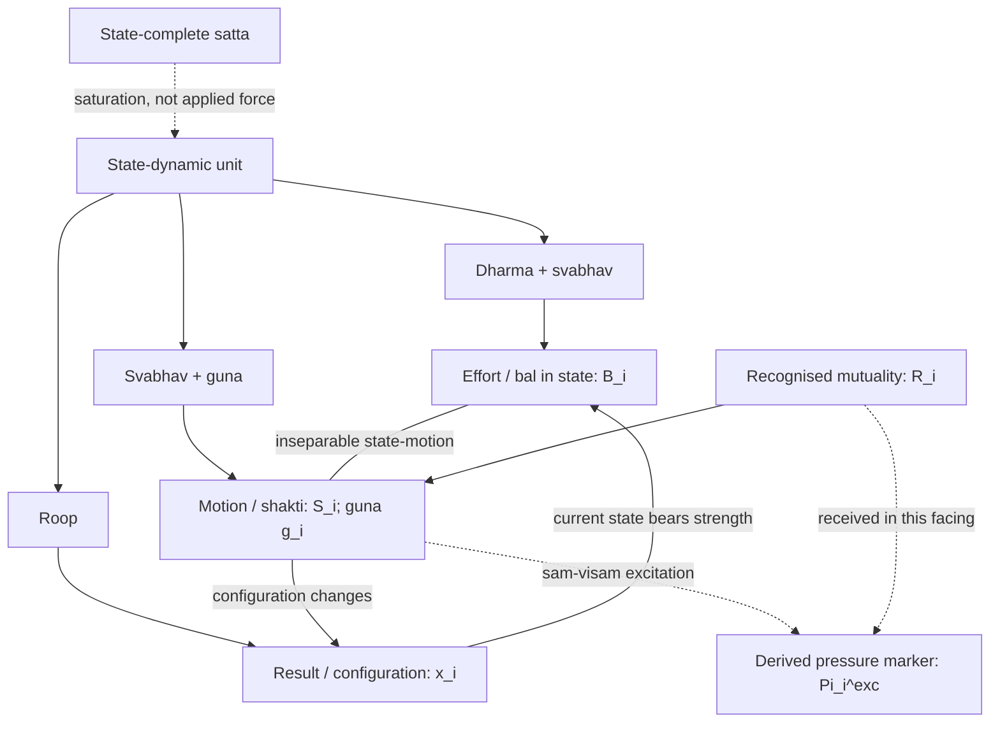
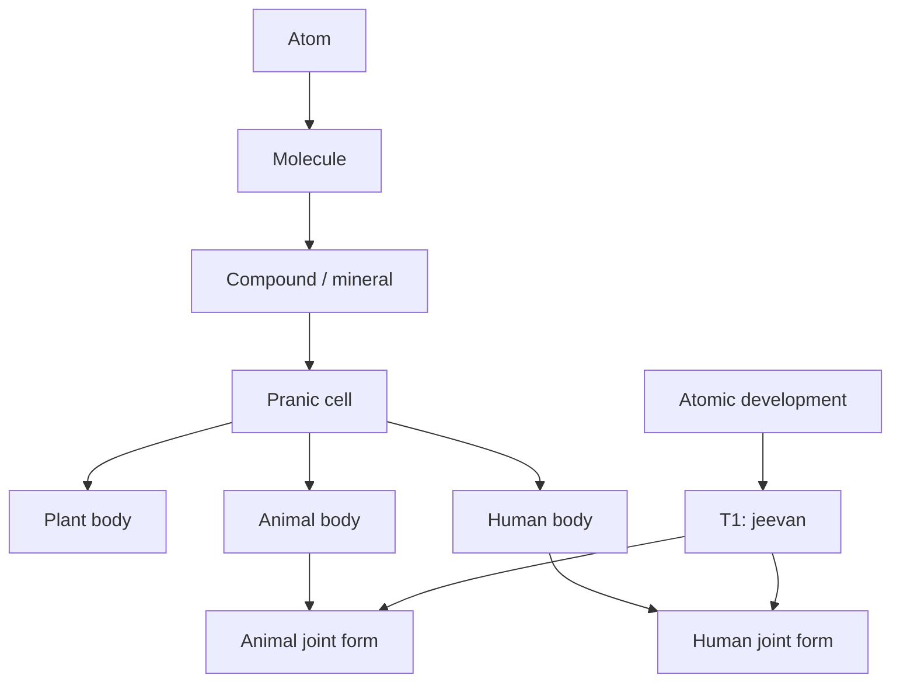
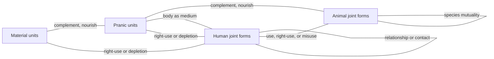
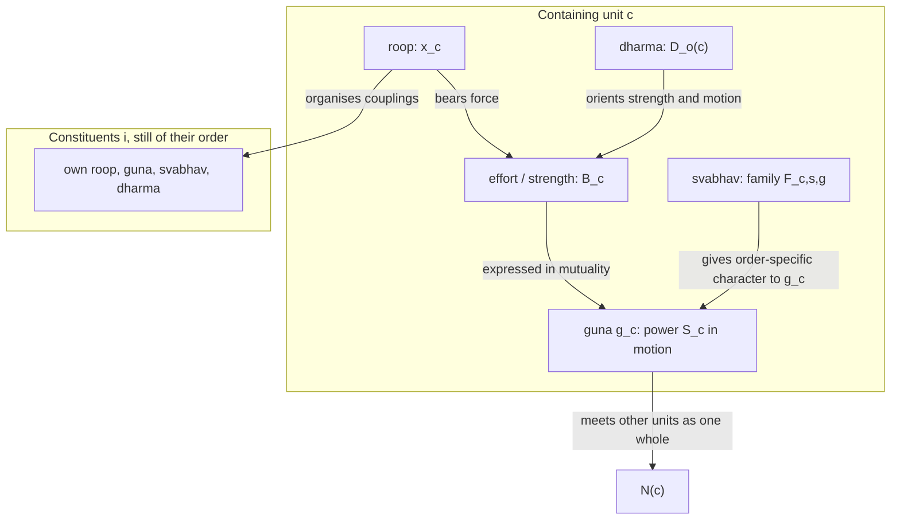

# A State-Dynamic Model of Coexistence

**Author:** [AnalyticMadhyasthDarshan.org](https://github.com/raghavamohan/AnalyticMadhyasthDarshan) — a group of people studying Madhyasth Darshan philosophy. Source repository: [raghavamohan/AnalyticMadhyasthDarshan](https://github.com/raghavamohan/AnalyticMadhyasthDarshan).

**Edited on:** August 24, 2026, 3:47 PM IST
**Status:** Draft

**The question:** Can state-complete Omnipresence, countlessly many saturated state-dynamic units, absolute and relative energy, the effort–motion–result triad, and the four aspects of a unit be stated as one model that also keeps nested compositional plateaus, the completeness thresholds T1–T3, and coupled activity across orders in view?

This paper reconstructs those claims from Madhyasth Darshan (Co-existentialism), as presented by Shri A. Nagraj, in the language of a continuous state space. Omnipresence (*satta*) is state-complete: unbounded, non-transforming, and without motion or pressure. Nature is state-dynamic: countlessly many bounded units, each saturated in Omnipresence and therefore energy-endowed, forceful, and active. Within a unit, **effort–motion–result** (*shram–gati–parinam*) is one inseparable activity. Effort is represented as the strength (*bal*) borne in the current state, motion as the power (*shakti*) expressed in mutuality, and result as the configuration thereby present and changing. The four aspects specify the same activity: *dharma* and essential nature (*svabhav*) are present with effort, *svabhav* and property (*guna*) with motion, and form (*roop*) with result. The three modes of *guna* — generative (*sam*), degenerative (*visam*), and mediative (*madhyastha*) — therefore belong to the unit's own power in motion. Pressure is not another power beside them; it is the received or observable expression of force–power in an excited mutuality.

Effort–motion–result already closes relatively stable existents in the material world: molecules, compounds, and minerals, then pranic cells and the plant, animal, and human bodies composed from them. Those plateaus are the constitutive conditions for later units. A distinct atomic line reaches constitutional completeness (T1), after which *jeevan* works through a body. The animal and human joint forms are parallel meetings of those two lines, not one body-line that turns into the next order. Units of every order remain in mutuality: minerals, cells, plants, animals, and humans do not occupy separate universes. The reconstruction therefore couples many bearers, typed by order, rather than evolving a single isolated *x*(*t*). It then follows both developmental lines into activity completeness (T2) and conduct completeness (T3), and into the public verification of humane conduct in undivided society (*akhanda samaja*).

The equations below are this paper's analytical reconstruction. The primary texts do not write state vectors, derivatives, state-functions for strength, or quantitative pressure maps. They state coexistence, saturation, state-completeness and state-dynamism, absolute and relative energy, force and power, the inseparable triad, the four aspects, and the completeness stages in ordinary philosophical prose. The formalism is a lens for keeping those claims simultaneous and checkable; it is not a proof that the darshan is a dynamical system. In particular, it must not turn pressure into an energy source or a fourth property-mode alongside *sam–visam–madhyastha*.

## Standpoint and scope

These studies are written from the standpoint of a scientist and technologist trained to graduate-level physics and mathematics and familiar with conservation laws, phase-space models, and contemporary accounts of material binding. From that background, matter-first explanations are familiar: configurations evolve under forces, and consciousness is often identified with brain processes or treated as emergent from physical activity. The natural sciences constrain any credible account of material trajectory through mechanism, prediction, and public evidence, but their success does not by itself settle the hard problem of consciousness, the status of the self, or the reality of value in favour of matter-only reductionism.

The paper reads Madhyasth Darshan's primary texts, states the darshan's claims, and then reconstructs them in parallel with the mathematics of state and motion. Comparison with physics and the natural sciences is therefore one leg of the work, not the sole framework into which the philosophy must be translated. Full comparison with Advaita Vedanta and modern Western philosophy of mind, value, and society is developed in the related topical studies and is not repeated here.

The aim is rigorous comparative understanding — testing definitions, internal consistency, and the limits of the formal analogy — rather than persuasion or devotional endorsement. Logical reconstruction, first-person realisation, evidence in conduct, and instrument-based scientific confirmation are kept distinct so that agreement at one level is not mistaken for agreement at every level. Physics and dynamical-systems language do not establish immortal *jeevan*, constitutional completeness, or undivided society; those remain explicit points for examination.

Clear and checkable prose remains the series priority. This paper is a formal reconstruction of structure already stated in the topical studies; it does not require a further layer of category theory or proof, and it does not treat the reconstruction as source doctrine.

## Quick Glossary

| Term | Plain meaning |
|------|---------------|
| Coexistence (*saha-astitva*) | The inseparable presentness of state-complete Omnipresence (*satta*) and countlessly many state-dynamic units (*ikai*). |
| Omnipresence / absolute energy (*satta* / *nirpeksha urja*) | The unbounded, non-transforming, everywhere-present reality in which all units are saturated; it has no motion, pressure, or applied force. |
| Relative energy (*sapeksha urja*) | Power that becomes evident in unit–unit mutuality as pressure, waves, fields, heat, sound, electricity, and other effects. |
| Saturation (*samprikt*) | Every unit is soaked, submerged, and surrounded in *satta*; energy-fullness, forcefulness, regulation, and activeness follow as entailments of coexistence. |
| Unit (*ikai*) | A bounded, countable bearer in nature — insentient or sentient — whose activity is effort, motion, and result together. |
| Effort–motion–result (*shram–gati–parinam*) | The inseparable triad of unit-activity; not three successive moments. |
| Strength / force (*bal*) | Effort as borne in the unit's state; the forceful side of the unit, inseparable from power in motion. |
| Power (*shakti*) | Motion as the operative expression of a force-bearing unit, evident relatively in mutuality. |
| Excitation-pressure | The received or observable expression of a unit's force–power when *guna* is manifest as generative or degenerative excitation; not an additional force and not every unfulfilled relation. |
| Form (*roop*) | Shape, volume, density: the real bounded configuration of the unit, reflected in mutual facing. |
| Property (*guna*) | Relative power, effective as generative, degenerative, or mediative influence when units come together. |
| Essential nature (*svabhav*) | The order-specific usefulness or characteristic conducts of those effects — a set, not one conduct. |
| *Dharma* | What is innately borne and fulfilled according to order: existence, with growth, hope to live, and happiness stated cumulatively in the higher orders. |
| *Jeevan* | The constitutionally complete sentient atom; the knower that works through the body. |
| Constitutional completeness (T1) | The atomic threshold at which a developing atom becomes *jeevan* and is free of molecular-bondage and weight-bondage. |
| Activity completeness (T2) | Restfulness of effort: realisation (*anubhav*) resolves the inner seeking of *jeevan*. |
| Conduct completeness (T3) | Destination of motion: realised understanding evidenced as humane conduct. |
| Compositional plateau | A closed unit-form — molecule, compound, mineral, cell, or body — whose bounded conduct persists while complementary couplings hold. |
| Existential progression | The definite order in which material, pranic, animal, and knowledge orders become manifest under conducive conditions. |
| Coupling | Mutual facing in which form is reflected and property becomes effect; not isolation. |
| Containing unit | A closed bearer — compound, cell, or body — that organises lower-order constituents while remaining one unit with its own *roop*, *guna*, *svabhav*, and *dharma*. |
| Complementary mutuality | Need met by need across units — hungry with overfull, nourishment with eater — without converting one order into another. |
| Relationship (*sambandh*) | Knowledge-order mutuality whose expectations are predetermined in the sense of completeness. |
| Contact (*sampark*) | Mutuality whose expectations are voluntary; not the full relational expectation of *sambandh*. |
| State vector *x*(*t*) | This paper's symbol for one unit's instantaneous configuration (*parinam*) in a reconstructed phase space *X*. |
| *D*o | This paper's symbol for the invariant *dharma*-orientation of order *o*; it constrains the model rather than acting as an applied force. |
| *B*i | This paper's state-function for the effort or strength borne by unit *i* in its current configuration, with *dharma* and *svabhav* present. |
| *R*i | This paper's order-typed representation of the recognised mutuality and complementarity between unit *i* and its actual neighbourhood. |
| *g*i | The *guna*-mode evidenced in a facing: *sam*, *visam*, or *madhyastha*. |
| Πexci | This paper's derived marker for excitation-pressure in a facing; it is read from *bal–shakti–guna* in recognised mutuality and is not an independent input to motion. |
| *S*i, *F*o,s,g | *S*i is power in motion, written as ẋi; *F*o,s,g is the family of motion maps typed by order *o*, essential nature *s*, and *guna*-mode *g*. |

## 1. Ontological foundations

Madhyasth Darshan holds that existence is neither a collection of static material substances nor an undifferentiated idealist field. Existence is coexistence (*saha-astitva*): the inseparable, perpetual presentness of Omnipresence (*satta*) and countlessly many discrete, active units (*ikai*) (SB, pp. 48–50; MVD, pp. 11, 34). Omnipresence is **state-complete** (*sthitipurna*): unbounded, everywhere uniform, non-transforming, and free from motion and pressure. Nature is **state-dynamic** (*sthitishil*): every bounded unit is inseparably present in state and motion within the state-complete (MVD, p. 26; SB, pp. 49–50, 248; KD 3.5, p. 70; KD 3.8, p. 84). The whole neither increases nor decreases, expands nor contracts, while development and awakening become manifest within it (KD 3.5, p. 70).

Every unit is saturated (*samprikt*) in Omnipresence: soaked, submerged, and surrounded in it. Omnipresence is permeative through units and present between them. That between-ness makes their boundaries and mutual distances possible; the same condition permits joining and separation without ever separating a unit from Omnipresence (SB, pp. 48–50, 249–250; JV, p. 149). Saturation is not a transfer from a finite store and Omnipresence does not push units by an applied force. It is the ontological basis on which each unit is energised, forceful, self-regulated, and active (MVD, pp. 40–41, 46; SB, pp. 57, 61, 69, 248; JV, p. 149; KD 3.9, p. 88; KD 3.13, p. 122).

This distinction is also stated as **absolute energy** and **relative energy**. Absolute energy is Omnipresence itself: everywhere present, non-active in itself, and the basis of basic impulsion. Relative energy is the unit's power made evident in mutuality; pressure, waves, fields, heat, sound, and electricity are physical-chemical expressions of that relative power (MVD, pp. 40–41). Omnipresence is also named the fundamental uniform energy, while the perpetual activity of molecules, atoms, and atomic particles evidences that each is energised (KD 3.13, p. 122). Basic impulsion belongs to the saturated unit's activity. Pressure neither supplies that activity nor stands beside *bal* and *shakti* as an additional power; it is a way their effect is recognised or received in mutuality (MVD, p. 46; SB, p. 256; KD 3.13, p. 118).

Mutuality is inherent in coexistence. Units recognise one another according to their order, and complementarity becomes evident through offering, acceptance, influence, composition, nourishment, use, and fulfilment. Recognition in the first three orders does not mean reflective human perception; it names definite response according to constitution, seed, or species. Necessary propensity leads to recognition and then to mutual recognition, while natural-state motion evidences definite conduct at a good mutual distance (KD 3.5, p. 70; KD 3.10, p. 100). The three modes of *guna* belong to every unit: *sam* combines or generates, *visam* decomposes or degenerates, and *madhyastha* maintains or regulates what is formed (KD 3.10, pp. 100–101; SB, p. 248). Pressure is the received compulsion of the same force–power when *sam–visam* excitation is evident, not a force imported from outside the tetrad (KD 3.13, p. 118). An unfulfilled complementarity is therefore not by that fact alone pressure. Every unit has inherent strength, and progress proceeds through mutual offering and acceptance (MVD, pp. 114, 230; SB, pp. 49–51, 61; JV, pp. 157–158).

The total activity of any unit is the triad of **effort–motion–result** (*shram–gati–parinam*). These are not three successive moments on a timeline in which effort causes motion and motion later produces a result. They are simultaneous, co-extensive dimensions of one activity-whole:

> **"Every physical-chemical activity is an inseparable presence of effort, motion and result."**
> — SB, p. 58

## 2. Mathematical scaffolding of the triad

To keep that simultaneity visible without introducing temporal lags or linear causal fragmentation, this paper represents each unit in a continuous state-dynamic framework. Time *t* is an index of duration (*kaal*) of unit-activity, not a container in which the unit is placed (see [*Nature of Time*](../Nature-Of-Time/Nature-Of-Time.pdf)). The assignment is a reconstruction: the texts name state and motion, strength and power, recognised mutuality, pressure, effort–motion–result, and the tetrad; they do not name *x*, ẋ, *B*, *R*, *g*, Πexc, *D*, or *F*.

### 2.1 Result (*parinam*) as the state vector

*Parinam* is the instantaneous configuration, structural arrangement, or developmental plateau of unit *i* at a given duration. Result is the grandeur of a different existent state, arranged in a quantitative and qualitative chain (KD 3.11, p. 107). This paper writes it as the position of the unit in the reconstructed state space:

**xi(t) ∈ Xo(i)**

### 2.2 Effort (*shram*) as strength in the state

Effort is strength or force (*bal*) borne by the unit. The state is the force-bearing side of activity, while power is present in motion; effort is explicitly aligned with *dharma* and *svabhav* (SB, pp. 60–61, 248, 256–257). State and motion are indivisible, and their meanings as strength and power apply across units from atoms to planetary bodies (KD 3.8, p. 84; KD 3.11, pp. 102–109). This paper therefore represents effort by a state-function rather than by an internal potential:

**Bi(t) = 𝓑o(i),s(xi(t); Do(i))**

*B*i does not assert a measurable scalar, a store of energy, or a potential well. It records that this bounded configuration is force-bearing and effortful, with the order's *dharma* and the essential nature *s* present on the side of effort. The primary claim is stronger than a transient push: forcefulness remains present in every state, and effort persists until its restfulness in completeness (SB, pp. 60–61).

> **"Strength in state evidences orderliness in oneself; power in motion evidences participation in the overall orderliness."**
> — KD 3.11, p. 106

### 2.3 Recognised mutuality and complementarity

Write *N*(*i*) for the units actually in mutual facing with *i*. Each unit recognises its mutuality according to its order; form is reflected, power becomes effect, and complementarity or incompleteness becomes evident in reciprocity (SB, pp. 49–51, 249–252). Natural-state motion itself occurs in such mutuality: units maintain a definite good distance, mutually recognise, and evidence determinate conduct (KD 3.5, p. 70; KD 3.10, p. 100). This paper collects the recognised relational configuration in an order-typed term:

***R*i(t) = 𝓡o(i)(xi(t), xN(i)(t))**

*R*i is not a force and does not imply reflective perception. It records which mutualities are present and what order-specific complementarity, nourishment, use, relationship, or fulfilment is applicable. When such a complementarity is not fulfilled, the model may mark that condition within *R*i. This remains a guarded analytical interpretation: the texts do not supply one universal scalar “relationship deficit,” and lower-order recognition is not a mental survey of missing relationships.

### 2.4 Motion (*gati*) as power, *guna*, and relational transformation

Motion is the unit's power (*shakti*) in operation: displacement, change of configuration, or another order-specific relational transformation. The same power is expressed through the three modes of property:

***g*i(t) ∈ G = {*sam*, *visam*, *madhyastha*}**

Here *g* names the *guna*-mode and *s* the order-specific essential nature evidenced in the facing. The distinction matters: *sam* does not by itself mean integration in every order, nor does *visam* by itself mean cruelty. *Svabhav* gives the power its order-specific functional character, while *dharma* supplies the invariant orientation that modulates which expressions are admissible for the order. This paper writes motion as

**Si(t) ≡ ẋi(t) = Fo(i),s,gi(xi(t), xN(i)(t); Bi(t), Ri(t), Do(i))**

The terms after the semicolon are simultaneous constraints, not additive forces. *B* is effort or strength and self-orderliness in the current state; *R* is recognised mutuality; *D* is the order's *dharma*-orientation; and *S* = ẋ is power in motion, spreading effect, and participation in the overall orderliness. The index pair (*s*, *g*) makes the textual alignment explicit: effort or strength carries *dharma–svabhav*, while motion or power carries *svabhav–guna* (SB, pp. 60–62; KD 3.10–3.11, pp. 100–107).

Natural-state motion is not zero motion and not the absence of *guna*. It is the unit's continuing power under definite conduct, with mediative regulation maintaining its orderliness. Generative and degenerative tendencies remain modes of the unit's own property; they do not require an external reservoir of activity.

### 2.5 Excitation-pressure as a derived relational expression

Pressure is the received compulsion of force–power in mutuality. Where *sam* or *visam* becomes manifest as excitation rather than natural-state motion, that compulsion is recognised as excitation-pressure (KD 3.13, p. 118). A material illustration is departure from the definite good distance among atomic particles: the mediating nucleus applies its own force so that the mutual distance is restored (KD 3.11, pp. 103–104). Pressure therefore belongs to the same *bal–shakti–guna* activity; it is not a second source acting beside it.

This paper retains Πexci only as a **derived marker** of that relational expression:

**Πexci(t) := 𝓟o(i),s,gi(Bi(t), Si(t), Ri(t)), when the facing is excited**

Πexci is read from the unit's strength, power, *guna*-mode, and recognised mutuality after these have been stated; it is not an independent argument of *F*. It may describe attraction, repulsion, compression, or another received compulsion where excitation is identified. It must not convert every mutual relation, complementary need, or unfulfilled human relationship into physical pressure. In natural-state motion this derived excitation marker is absent, although strength, power, *guna*, and mutuality all remain present.

### 2.6 Result and the continuing activity-loop

Over a duration Δ*t*, motion is evident as a changed result:

**xi(t + Δt) − xi(t) = Δt Si(t) + o(Δt)**

The changed configuration is immediately the state in which strength is borne and the next mutuality is recognised. Effort is the grandeur of the existent state, motion the spreading of effect, and result a different existent state in a quantitative and qualitative chain (KD 3.11, p. 107). The finite-difference expression reconstructs that continuing chain without making effort, motion, and result three successive events inside one activity. State and motion remain locked at every duration; any pressure evidenced in the facing is a manifestation within this loop, not a prior power that starts it (MVD, pp. 40, 46, 114; SB, pp. 58–62, 248, 256–257; KD 3.8, p. 84).

## 3. The tetrad in the state-dynamic model

Every unit has four inseparable aspects: form (*roop*), property (*guna*), essential nature (*svabhav*), and *dharma* (MVD, p. 47). They are not four detachable components and not four successive stages. They specify one activity-whole: effort or strength is present as *dharma–svabhav*, motion or power as *svabhav–guna*, and result as *roop* (SB, pp. 60–62). *Svabhav* crosses effort and motion; *guna* is the mode of the unit's power, and pressure is that force–power relationally received when excitation is present. The same tetrad attaches to every closed bearer — an atom, a molecule, a cell, a body, or a joint form — and is not inherited as a sum from the units it contains (§5.4).

### 3.1 Form (*roop*): bounded configuration

*Roop* is the spatial configuration, boundary-framework (*rachna*), shape, volume, and density of the unit (SB, pp. 249–250). It maps to **result (*parinam*)** in the reconstructed model: the currently realised coordinates of *x*(*t*) itself. Result is the different existent state that remains after motion spreads effect (KD 3.11, p. 107). Form is objectively unit-grounded. It is encountered in mutuality as a reflected image (*pratibimbita*), but reflection presents the form; it does not create it (MVD, pp. 42, 49–50; KD 3.9, p. 94).

### 3.2 Property (*guna*): relative power in motion

*Guna* is relative power (*sapeksha shakti*), the effect and influence that arise when units come into mutuality (MVD, pp. 40, 47; SB, pp. 248–252, 256–257). It maps to **motion (*gati*)**: *S*i = ẋi. Strength belongs to the property-endowed bearer in its state; power is that bearer's property in motion, spreading effect and participating in the overall orderliness (KD 3.8, p. 84; KD 3.11, pp. 102, 106–107). Its modes are generative (*sam*), degenerative (*visam*), and mediative (*madhyastha*) across the four orders (MVD, pp. 26, 49–50; SB, p. 248; KD 3.10, pp. 100–101). Pressure is not a fourth mode. Force may be recognised as pressure and power as flow, so pressure names an encountered expression of the same property-endowed unit and its power (SB, p. 256). Under *sam–visam* excitation, the reconstruction records that expression as Πexc; it does not add it back as an independent cause of *S*.

### 3.3 Essential nature (*svabhav*): functional character

*Svabhav* is fundamental character (*maulikata*) and the usefulness (*upayogita*) of properties (MVD, p. 47). Usefulness here is order-specific functional significance, not benefit to a human observer: the same texts include devitalising and cruel essential natures. *Svabhav* spans both **effort (*shram*)** and **motion (*gati*)**, making it the bridge between strength and the order-specific expression of power. The same *guna*-mode receives different functional content by order: material units integrate or disintegrate, pranic units vitalise or devitalise, animal units evidence cruel or non-cruel conduct, and knowledge-order units evidence humane or inhumane dispositions (MVD, pp. 50–51, 115; SB, pp. 60–61, 179–180; KD 3.10, pp. 100–102). This paper therefore writes motion as a **family of maps** *Fo,s,g*, indexed both by essential nature *s* and *guna*-mode *g*. A given facing evidences a definite pair (*s*, *g*); motion is not a sum or blend of the whole family.

### 3.4 *Dharma*: innateness and invariant orientation

*Dharma* is innateness (*dharana*): what is innately borne, maintained, and characteristic of an entire order (MVD, p. 47). It is present on the side of **effort (*shram*)** together with *svabhav* (SB, pp. 60–61). This paper writes its order-specific orientation as *D*o: existence, growth, hope to live, and happiness, stated cumulatively across the four orders (SB, p. 179; KD 3.9–3.10, pp. 95, 100–102). Saturation grounds the universal *dharma* of existence and the directionality of completeness; the order qualifies the further content borne by a unit (SB, pp. 49–51). *D*o constrains the strength function and family of motion maps and, in that limited formal sense, modulates which order-compatible (*s*, *g*) expression can be evidenced. It is not a moment-to-moment control signal, physical potential, separate force, exact instruction for the next state, or attractor basin supplied by the texts.

## 4. The material order: phase-space boundedness

In the insentient line (*jada*), spanning the physical order and the bio-growth order, the reconstructed state vector of a constitution-oriented atom is confined to physical-chemical parameters:

**x(t) = xphysical(t) ∈ Xphysical**

That confinement describes one bearer. It does not flatten every later composition into the same undifferentiated field. Effort–motion–result already closes new bounded units from those parameters, and those units occupy nested plateaus of *X* (§4.3).

### 4.1 Constraints of the material field

The material-order state, strength, recognised relational configuration, *guna*-mode, essential nature, and admissible motion are conditioned, in the darshan's terms, by two forms of structural bondage. **Weight-bondage** (*bhara-bandhana*) subjects the unit to gravitational and inertial mutuality, so its trajectory depends on other mass-bearing units. **Molecular-bondage** (*anu-bandhana*) fixes internal stability by subatomic particle counts in nuclear and orbital constitution. Atoms carry structural hunger (*bhukha*) or overfullness (*adhikya*), and they collide, exchange particles, and form molecular compounds on that basis (MVD, pp. 8, 91; SB, pp. 58, 71).

### 4.2 Open atomic motion and closed plateaus

The reconstructed material trajectory of a constitution-oriented atom

**Sphysical = ẋphysical = Fmaterial,s,g(xphysical, xN; Bphysical, Rphysical, Dmaterial)**

already depends on the neighbouring units *N* with which it collides and exchanges particles, on the essential nature evidenced as integration or disintegration, and on the *sam–visam–madhyastha* mode of power (§3.2–§3.3, §5). Written without those neighbours and without (*s*, *g*) it is only a factor. Hungry and overfull atoms remain open to particle exchange. Before an overfull atom displaces a particle it is excited; displacement and subsequent absorption change the two configurations, after which natural-state motion is re-established (KD 3.1, p. 57). The displacement, absorption, and regulation are expressions of the units' own *svabhav–guna* in motion. Any pressure evidenced in that exchange is derived from the same force–power in mutuality, not inserted as a further causal term. For those open bearers the model does not treat *parinam* as a terminal constant:

**limt → ∞ xphysical(t) ≠ constant**

That limit statement is a reconstruction of openness, not a theorem of physics and not a sentence in the primary texts. It must not be read as a claim that matter has no stable existents. When complementary units close a new motion-path, a **compound** (*yaugik*) presents a new definite bearer with its own constitution, bounded conduct, and therefore its own *roop*, *guna*, *svabhav*, and *dharma*; a **mixture** does not, and the components keep their respective conducts (MVD, p. 42; SB, pp. 75–76). The closed bearer occupies a relatively invariant region of *X* while its couplings remain complementary. How that new tetrad enters the coupled field is written in §5.4. Disintegration returns constituents to a lower plateau. Composition is not development: a new compound may close a new bounded conduct while the atomic development progression toward constitutional completeness remains a distinct line (SB, pp. 75–76; KD 3.2–3.3).

### 4.3 Nested compositional plateaus

The qualitative attributes of *x*(*t*) therefore include more than particle-count and bondage. They include the **kind of closed unit** presently evidenced. This paper writes those kinds as nested plateaus *Pℓ ⊂ X*. Each plateau is a region in which a unit's *roop*, *guna*, *svabhav*, and *dharma* remain recognisable as that order's closed form. The unit is still in effort–motion–result: ẋ is not required to vanish, and more than one essential nature of the order can still be evidenced in different facings. What remains relatively invariant is the closed form, not an idle point and not a single map *F*.

The compositional sequence the texts set out on this earth runs, under conducive conditions, from constitution-oriented atoms through molecules and molecule-composed solids, liquids, and rarefied states, through compounds and minerals, through chemical resonance that yields nourishment- and composition-elements, through pranic cells, through plant-order bodies, through animal bodies, and as far as the human body whose *medhas* composition is the richest compositional plateau (KD 3.2, pp. 58–60). Four orders are perceivable in that sequence: the material state in soil and stone; the pranic state in the plant-order; the *jeevan* state and the knowledge state as joint forms of body and *jeevan* (KD 3.2, p. 59; SB, p. 179).

| Plateau | Closed unit | Order | Way of existence |
|---------|-------------|---------|------------------|
| Atomic constitution | Atom | Material | Structure- or result-conformance |
| Molecular aggregation | Molecule | Material | Structure-conformance |
| Compound and mineral | Closed chemical composition | Material | Structure-conformance |
| Pranic cell | Cell with inherent composition-method | Pranic | Seed-conformance |
| Plant body | Organism composed of cells | Pranic | Seed-conformance |
| Animal body | Organism composed of cells | Pranic | Seed-conformance |
| Human body | Developed *medhas* composition | Pranic (expression medium) | Lineage of the body |
| Animal joint form | Animal body with *jeevan* | Animal | Species-conformance |
| Human joint form | Human body with *jeevan* | Knowledge | *Sanskar*-conformance |

The table is this paper's reconstruction of the sequence and the four-order partition. It is not a further completeness threshold numbered after T1. A plant body is a pranic composition; it is not *jeevan*. The animal order comprises animals and birds, excluding humans; the knowledge order comprises only humans (JV, p. 47). An animal or human is a joint form in which the compositional line supplies **that order's** body and the atomic line supplies constitutionally complete *jeevan* (§6). The human joint form is not the next animal. Most atoms remain engaged in physical and chemical constitution rather than attaining T1. Biological compositions return to material constituents after disintegration (MVD, pp. 8, 13; JV, pp. 47–48).

The solid arrows are constitutive: a later closed unit requires the earlier plateau already occupied. They are not the living couplings of §5. The animal joint form and the human joint form both require T1 *jeevan* and a body of their own kind. There is no arrow from the animal joint form to the human joint form.

### 4.4 Nested dependence

A plateau is not only a description of what has already closed. It is a **constitutive condition** for the next closed unit. Molecules form when atoms of the required kinds are already present and complementary; compounds and minerals require those molecules; pranic cells require chemical substances, definite heat, and the inherent composition-method of the *prana sutra*; plant, animal, and human **bodies** require cells; the animal joint form requires an animal body together with a T1 *jeevan*; the human joint form requires the further developed human bodily medium, through which knowing, believing, recognising, and fulfilling can be evidenced, together with a T1 *jeevan* (KD 3.2, pp. 58–60; JV, pp. 47–48, 59). The human body follows lineage tradition; *jeevan* is not produced by that lineage (JV, p. 59).

Existential progression (*niyati-kram*) is the definite order in which the four orders become **manifest** on this earth under conducive conditions — material, then pranic, then animal, then knowledge (MVD, pp. 8, 13). That sequence of appearance is not a claim that each human is constituted from an animal joint form, and it is not the living use-ladder of §5.2. The way of existence (*niyati-vidhi*) is the conformance by which each plateau maintains definite conduct once formed. The two must not be collapsed into T1. Constitutional completeness is development in the atom; the plateaus are development in composition. They meet in the animal and human joint forms as two parallel joints, not as one ladder that a single *x*(*t*) climbs by accumulating attributes until it becomes *jeevan*.

## 5. Coupled units across orders

Plateaus name kinds of closed unit. They do not place those units in separate worlds. A mineral, a plant, an animal, and a human share one coexistence: each recognises and fulfils at the level of its order, and complementarity is evident in mutuality (SB, pp. 49–53; JV, pp. 43, 69; KD 3.10–3.11, pp. 100–109). The dynamics must therefore be a **coupled system** of many bearers, not a single isolated trajectory that changes kind. The coupled field is also where relative energy becomes evident; Omnipresence does not apply a force to the units from outside (MVD, p. 40; JV, p. 149).

### 5.1 Many bearers

Let a situation comprise a finite collection of units *U*. Each unit *i* has an order *o*(*i*) — material, pranic, animal, or knowledge — and a state *xi*(*t*) in the corresponding region of *X*. The joint configuration is the tuple

**xU(t) = (x1(t), …, xn(t))**

As in §2.3, *N*(*i*) contains the units actually in mutual facing with *i*, not a mean field over all of nature. Form is reflected in that facing; property becomes effect there (MVD, pp. 47, 49–50; SB, pp. 249–252). The strength, recognised relational configuration, *guna*-mode, and motion of each bearer are written as

**Bi = 𝓑o(i),s(xi; Do(i))**

***R*i = 𝓡o(i)(xi, xN(i))**

***g*i ∈ {*sam*, *visam*, *madhyastha*}**

**Si = ẋi = Fo(i),s,gi(xi, xN(i); Bi, Ri, Do(i))**

where *s* belongs to the set of essential natures of order *o*(*i*) and *g*i is the *guna*-mode evidenced in that facing. The map is not unique for an order. A material unit may integrate or disintegrate, and a pranic unit may vitalise or devitalise; the same *dharma* does not yield one undifferentiated *F*. Constitution, recognised neighbourhood, and relational configuration condition which (*s*, *g*) pair is evidenced. When *i* is a constituent of a closed unit *c*, that neighbourhood includes *c* as a containing bearer with its own tetrad, strength, and family of maps, not as a fused sum of the constituents (§5.4). If *sam–visam* excitation occurs, Πexci may be derived from (*B*i, *S*i, *g*i, *R*i) as in §2.5. It is not a fifth input to the motion map. Coexistence does not supply an isolated unit.

### 5.2 Three kinds of coupling

The texts distinguish how units come together. This paper groups those distinctions as three reconstructed coupling kinds. In each, *R* represents recognised mutuality and the applicable complementarity, not friction or a contest for survival. The coupling does not inject power into a previously inactive unit: saturation already grounds *bal–shakti*, while *svabhav–guna* gives the motion its order-specific character. Where *sam–visam* excitation is received, pressure is the relational expression of that same activity (KD 3.13, p. 118). Incompleteness is intelligible only with respect to completeness, while complementarity is fulfilled through order-appropriate reciprocity (MVD, pp. 40, 46, 114; SB, pp. 49–51, 61; JV, pp. 157–158; KD 3.5, p. 70; KD 3.11, pp. 106–107).

**Complementary need** is offering and acceptance among units whose hungers or overfullness meet. Hungry and overfull atoms bond; the same schema organises later composition when the required kinds are already present (MVD, p. 8; JV, p. 67). The coupling may close a new unit (a compound) or restore natural-state motion without closing (an expelled particle absorbed by a hungry atom). It does not convert every contact into a new order.

**Containment and organisation** is the way a higher-order body includes and regulates lower-order compositions: cells in a plant or animal body, minerals and water in the earth to which the plant remains joined, the human body as the richest such composition (KD 3.2, pp. 58–60). Higher-order *dharma* includes the lower-order *dharmas* while adding a further one (SB, p. 179). Containment does not rewrite the order of the constituent. Whatever a thing is constituted of, it remains of the order of that constituent: soil remains soil in a pot; pranic cells remain of the pranic order in a body (SB, p. 260). The containing unit is nevertheless itself a unit, with its own four aspects. Those aspects organise the constituents without replacing their plateaus (§5.4).

**Use, nourishment, and participation** is fulfilment across orders without identity of order. The texts state a living use-ladder, distinct from the constitutive sequence of §4. A knowledge-order unit makes use, right-use, or misuse of many animal-order units; an animal-order unit is complementary to many biological units; a biological unit is complementary to many material units (MVD, p. 105). Pranic units take material compositions as nourishment-element and composition-element under seed-conformance. Animals select and taste through a species-limited body. Humans can know, believe, recognise, evaluate, and fulfil with material, pranic, animal, and human units (JV, pp. 47–48, 69). Apart from humans, the first three orders are already mutually complementary; humans have still to evidence that complementarity (JV, p. 59). Knowledge-order use of lower orders is bounded by right-use and regeneration; extraction beyond regeneration is an unfulfilled coupling that destabilises the containing assembly (MVD, p. 264; JV, p. 77).

Human–human mutuality is of two kinds in the texts. A **relationship** (*sambandh*) is a mutuality whose expectations are predetermined in the sense of completeness; a **contact** or association (*sampark*) is a mutuality whose expectations are voluntary (MVD, pp. 61–62). Work, family, and undivided society sit in that knowledge-order coupling. Lower orders have definite recognition–fulfilment, not this value-laden *sambandh*.

The edges below are living couplings in mutuality, not conversions of order and not the constitutive arrows of §4.3. Containment of cells in a body remains the organisation named above; it is not drawn as humans containing minerals or animals.

### 5.3 Order-typed interaction

Cross-order coupling does not impose one force-law on every pair. Essential nature is order-specific, and it is evidenced **in the coupling**, not as a private scalar of an isolated *x* (MVD, pp. 50–51; SB, p. 179). Two material units meet as integration or disintegration. A chemical or pranic composition meets a body as vitalising or devitalising in that context. Animals meet as cruel or non-cruel, and they meet plants as complementarity. Humans meet as humane or inhumane; they meet animals as use, right-use, or misuse; they meet vegetation and minerals as cyclical enrichment or as depletion.

Those are distinct maps, not variants of one order-typed field. This paper therefore types *F* by the pair of orders in mutuality, by the essential nature *s*, and by the *guna*-mode *g* evidenced there. The same *g* can accompany more than one *s*: generative power is not already vitalising, and degenerative power is not already cruel. *Svabhav* specifies what that property-mode means for the order and facing. A human does not interact with a mineral by the same map as two atoms, does not interact with an animal by the same map as an animal with a plant, and an animal does not evaluate a plant by the human circuit of knowing and believing. In the first three orders, constitution and neighbourhood determine the evidenced pair without reflective option. In the knowledge order, option can alter the *svabhav–guna* expressed in conduct. The coupling can nourish, constrain, compose, or — under human delusion — deplete. It does not turn a mineral into a cell or a cell into *jeevan*. Those transitions, when they occur, remain the compositional and atomic lines of §4–§6.

Natural-state motion in each order continues when couplings are complementary. Complementarity therefore does not mean ẋ = 0 or the disappearance of *guna*; it means that power expresses the unit's order and participates in the overall orderliness under mediative regulation. *Sam* and *visam* remain modes and tendencies of property, while pressure becomes evident where their expression is received as excitation (KD 3.5, p. 70; KD 3.10, pp. 100–101; KD 3.11, pp. 103–109; KD 3.13, p. 118). Adverse environment, over-extraction, or human mis-evaluation can excite a unit without changing its *dharma* or order. Material, pranic, and animal recognition and fulfilment remain definite through structure-, seed-, and species-conformance. The knowledge order is the fallible coupling: reflexive evaluation can agree with or diverge from the definite mutuality actually present (§7.1, §9).

### 5.4 The tetrad of a containing unit

A closed unit that contains others is a further bearer, not a bag of their states. In a compound, the participating entities give up exhibiting their respective conducts as the public motion of the whole and exhibit a new kind of conduct; in a mixture they do not (MVD, p. 42). That new conduct is the containing unit's own *roop*, *guna*, *svabhav*, and *dharma*. The constituents remain of their order (SB, p. 260). The reconstruction therefore assigns two tetrads, not one fused tetrad.

Write *c* for a closed containing unit on plateau *Pℓ*, and *i* for a constituent on a lower plateau. This paper writes

**Bc = 𝓑o(c),sc(xc; Do(c))**

***g*c ∈ {*sam*, *visam*, *madhyastha*}**

**Sc = ẋc = Fo(c),sc,gc(xc, xN(c); Bc, Rc, Do(c))**

**Si = ẋi = Fo(i),si,gi(xi, xN(i), xc; Bi, Ri, Do(i))**

*D*o(c) is the *dharma*-orientation of *c*'s order, not an aggregate of the constituents' orientations or strengths. *B*c is the forcefulness of the containing unit in its own state, likewise not a sum of the *B*i. *N*(*c*) is the neighbourhood of the **whole** — the units that meet *c* as one bounded form — not the union of every constituent's private meetings. *R*c represents mutuality in those whole-unit facings; pressure, where excitation is evidenced, is derived from the containing unit's own *B*c, *S*c, *g*c, and *R*c. It is not another input or an intrinsic component accumulated from the constituents. *x*c enters the constituent equation as organisation: it admits, bounds, or excites the couplings of *i* without rewriting *o*(*i*) or replacing the constituent's own set of essential natures. If *c* disintegrates, the extra argument drops and the constituents return to lower-plateau couplings (§4.2).

| Aspect of *c* | In this reconstruction | Effect on the dynamics |
|---------------|------------------------|------------------------|
| Form (*roop*) | *xc* as the closed bounded configuration | Sets which constituent couplings are inside the motion-path of *c*; other units meet *c* by this reflected form, not by inspecting each cell |
| Property (*guna*) | *g*c selects *sam*, *visam*, or *madhyastha*; *S*c = ẋc is the relative power of the whole | The assembly acts as one generative, degenerative, or mediative influence in mutuality; mediative power in *c* can hold the constituents' generative and degenerative motions in a definite organisation. Those modes can accompany more than one essential nature of *c* |
| Essential nature (*svabhav*) | The family *Fo(c),sc,gc* | A plant-body as a unit vitalises or devitalises according to the facing; a molecule integrates or disintegrates as that compound, not as a list of atomic hungers |
| *Dharma* | *D*o(c), present with effort in *B*c | Orients the strength function and family of maps of *c* by the innateness of *c*'s order — existence, and where the order adds them, growth, hope to live, and happiness — while the constituents continue to fulfil the *dharma* of their own order (SB, pp. 60–61, 179) |

A mixture has no such *c*. Each *Fo(i),si,gi* continues with the constituents' own tetrads; results flow, but no new bounded *x*c appears. A compound, a cell, and a body are the cases in which a new *x*c, *B*c, *g*c, *D*o(c), and family of maps of *c* do appear. The human joint form does not collapse those levels: the body remains a pranic containing unit with a pranic tetrad; *jeevan* is the sentient atom whose knowledge-order tetrad is evidenced through that body, not a sum of cellular *dharmas* (§7). Composing *jeevan* yields an organised assembly of *jeevan*, never a larger *jeevan*.

## 6. Constitutional completeness

The transition from the insentient constitution-oriented atom to the sentient cognitive line is **constitutional completeness** (*gathanpurnata*, T1). It is not a further compositional plateau. When a developing atom achieves complete subatomic particle balance in its nucleus and orbits, particle hunger drops to zero and the atom crosses an irreversible threshold (SB, pp. 55, 61, 92; KD 3.3, pp. 60–61). The compositional sequence can already have produced minerals, cells, and bodies; those remain of the order of what constitutes them. Only the atom reaches T1.

### 6.1 The T1 bifurcation

At that threshold the atom is no longer available to molecular-bondage and weight-bondage. It cannot be split, fused, or degraded by the physical-chemical forces that bound it as a developing constitution.

> "An evolving-constitution atom is with molecular-bondage and weight-bondage. However, when the contraction and expansion activity increases in this atom, it instantly breaks free from its group and attains constitutional completeness, becoming a jeevan atom. The evidence of constitutional completeness is the jeevan atom's liberation from molecular-bondage and weight-bondage, and its having the hope-bondage."
> — MVD, p. 91

In the reconstructed state space, the continuous physical coordinates of particle-exchange collapse into an invariant structural core, and a further set of **cognitive coordinates** xcognitive becomes the relevant description of activity. The unit is now *jeevan*: a constitutionally complete, immortal, sentient atom that operates through a physical body and is not reducible to the laws of molecular and weight bondage. The body through which it operates is still a compositional plateau (§4.3). Whether and how that threshold is to be identified in contemporary physics remains an open problem (§11).

## 7. The cognitive order: the ten-activity circuit

Upon crossing T1, *jeevan* still requires a body composed along the other line. Animal and human beings are joint forms: compositional progression supplies the body, atomic development supplies *jeevan* (§4.4). The reconstructed state vector is therefore composite:

**x(t) = [ xphysical(t) , xcognitive(t) ]T**

The product notation does not divide *jeevan* into two substances. The body remains the expression medium, itself a closed pranic composition; *jeevan* is the sentient unit. The cognitive coordinates track the five faculties and ten activities named in the texts (MVD, p. 78; JV, pp. 92–94). Animal bodies restrict their expression; a developed human body, whose *medhas* composition is the highest compositional plateau, provides for their full exercise (KD 3.2, p. 60; JV, p. 59). Delusion (*bhram*) can still misdirect evaluation by identifying *jeevan* with the body (JV, pp. 93–94).

| Faculty | Activities |
|---------|------------|
| *Mun* | Selection / tasting (*chayana* / *asvadana*) |
| *Vritti* | Analysis / weighing (*vishleshana* / *tulana*) |
| *Chitta* | Imaging / contemplation (*chitrana* / *chintana*) |
| *Buddhi* | Discrimination / verification (*sankalpa* / *bodha*) |
| *Atma* | Realisation / authentication (*anubhava* / *pramanyata*) |

### 7.1 The deluded human state

In the unawakened human state, knowledge-order *dharma* and the forcefulness of *jeevan* remain present; they do not become a misaligned potential. What is misdirected is evaluation in mutuality. The upper faculties (*buddhi* and *atma*) remain unevidenced, while cognitive motion is organised by feedback from the body's sensory inputs and seeks happiness through sensory pleasure, profit, and temporary comfort (SB, pp. 91–92; MVD, p. 78).

Because *jeevan* is an infinite cognitive unit in the darshan's terms, attempting to stabilise it on finite, transient sensory inputs yields an unstable inner trajectory. This paper writes that instability as

**rconfusion(xcognitive) ≠ 0 ⇒ psychological division / suffering**

The residual *r*confusion is this paper's reconstruction of delusion as unresolved cognitive motion, not a clinical diagnosis and not a quantitative psychology. It avoids treating all cognitive activity as a defect: *jeevan* remains active in both deluded and awakened states.

## 8. Activity completeness and conduct completeness

Resolution requires that the upper cognitive loop become active, so that evaluation of mutuality is no longer organised from sensory input outward but from realisation outward into conduct.

### 8.1 Activity completeness (T2 — *kriyapurnata*)

Activity completeness is reached when *atma* directly perceives coexistence (*anubhav*). That realisation is the restfulness of effort (*shram ka vishram*): the restless search for certainty stabilises into knowing (SB, p. 58; MVD, Ch. 5). In the reconstruction, T2 is the resolved condition *r*confusion = 0, not ẋcognitive = 0. Cognitive and bodily activity continue; unresolved seeking does not.

### 8.2 Conduct completeness (T3 — *acharanpurnata*)

Conduct completeness is the lived evidence of T2 in physical reality through humane conduct (*manaviya acharan*). It is the destination of motion (*gati ka gantavya*): invariant behavioural output aligned across the modes of interaction (MVD, p. 80; SB, p. 58). Humane conduct is stated as an integrated structure of character (*charitra*), ethics (*niti*), and values (*mulya*). Character locks external action into rightfully owned wealth (*sva-dhana*), marital faithfulness (*sva-nari* / *sva-purusha*), and kindness in action (*dayapurna karya*). Ethics bounds the use of body, mind, and wealth (*tan-man-dhana*) by right-use (*sadupyoga*) and protection (*suraksha*). Values are recognised and fulfilled in relationship — trust, respect, gratitude, and the remaining established values — producing mutual satisfaction (*ubhaya-tripti*).

## 9. Verification of conduct

Madhyasth Darshan does not treat human rightness as a private taste or a relativistic convention. Rightness is to be evidenced in experience, behaviour, work, and thought. This paper writes that fourfold demand as a single reconstructed protocol:

| Verification protocol |
|-----------------------|
| Anubhav (experience) |
| Vyavahar (behaviour) |
| Karya (work) |
| Vichara (thought) |

### 9.1 The verification matrix

Let *V* be a reconstructed verification operator on an individual human system *x*. The conduct is valid if and only if it satisfies the simultaneous system constraints:

| Operator | Implication |
|----------|-------------|
| *V*thought(*x*) | Internal harmony (*r*confusion = 0) |
| *V*behavior(*x*, *y*) | Mutual satisfaction (*ubhaya-tripti* for any interlocutor *y*) |
| *V*work(*x*, *xN*) | Cyclical enrichment of the coupled natural units (*avartanashilata*); right-use bounded by regeneration (§5.2–§5.4) |
| *V*experience(*x*) | Absolute alignment with truth (*pramanikta*) |

Authentic conduct requires simultaneous success across all four criteria. If an individual claims internal enlightenment (T2) but their outward trajectory produces exploitation in society (*V*behavior &lt; 0) or extraction beyond regeneration in the coupled natural units (*V*work &lt; 0), the system remains deluded. *V*behavior is the human–human coupling of §5; *V*work is the knowledge-order coupling with material, pranic, and animal units. The inequalities are qualitative markers in this reconstruction, not measured scores.

## 10. Undivided society

When the verification protocol is satisfied across a population, individual trajectories are described in the darshan as synchronising from individual resolution to universal harmony: resolved individual, prosperous family, fearless society, universal coexistence (JV, p. 61; SB, pp. 246–247). This paper writes that chain as

**Resolved individual → prosperous family → fearless society → universal coexistence**

That state is the realisation of undivided society (*akhanda samaja*) and universal orderliness (*sarvabhauma vyavastha*). It is not a collection of isolated human trajectories. The resolved population is a coupled human system — family, society, and the remaining human–human relations of §5 — whose *V*behavior constraints succeed together, and whose *V*work couplings with material, pranic, and animal units remain within regeneration. Social stability is not produced by external legal coercion. It is the public evidence of units that have crossed T1 as *jeevan*, reached T2 as realised understanding, and manifested T3 as verified conduct in those couplings. The reconstruction does not claim that the chain is a dynamical theorem; it records the darshan's own social completion of the same triad.

## 11. Open problems

The reconstruction leaves several questions unset.

First, the texts insist that effort, motion, and result are simultaneous. Writing motion as ẋ and result as *x* is a convenient pair in ordinary dynamics, but it can reintroduce the very sequence the triad refuses. Whether a genuinely simultaneous formalism — without a privileged time derivative — would be more faithful remains open.

Second, *R*i represents recognised mutuality, while Πexci is only a derived marker read from strength, motion, *guna*, and that mutuality when excitation is evidenced. Neither has a quantitative scale. The texts do not state that unfulfilled complementarity always produces pressure, that complementarity minimises one scalar, or that motion follows the gradient of a potential. Whether defensible order-specific measures of relational configuration and excitation can be constructed remains open.

Third, the operator *V* names four public constraints. It does not yet supply a quantitative, observer-independent scoring of mutual satisfaction or cyclical balance. Those remain qualitative evidences, as in the related studies of family values and undivided society.

Fourth, T1 is a metaphysical and textual threshold. Contemporary physics has no accepted counterpart for an atom that leaves molecular and gravitational bondage while remaining a countable unit. The reconstruction records the claim; it does not close the empirical question.

Fifth, the nested plateaus are this paper's reconstruction of compositional progression and existential order. They organise what the texts state about closed units and conducive conditions. They do not supply a mapping onto evolutionary phylogeny, origin-of-life chemistry, or laboratory phase diagrams. Relating *niyati-kram* to those sciences remains an open comparison, as in the related ontology study.

Sixth, the coupled maps *F*o(i),s,g are typed by order-pairs, by the essential nature and *guna*-mode evidenced in the facing, and by the three kinds of mutuality in §5. The containing unit's state, strength, *dharma*-orientation, recognised relational configuration, and family *F*o(c),sc,gc are this paper's reconstruction of new conduct in a compound. Excitation-pressure, where evidenced, is derived from those dynamics rather than supplied as another input. The texts state complementarity, containment, recognition–fulfilment, and right-use; they do not supply a quantitative cross-order force, a universal interaction kernel, or an N-body reduction of *jeevan*. Writing those couplings as a family of maps is this paper's reconstruction. Specifying the maps in laboratory coordinates remains open.

## Editorial Notes

### Formal status of the equations

The state vector *x*(*t*), derivative ẋ(*t*), strength function *B*i, relational-configuration map *R*i, *guna*-mode index *g*i, derived excitation-pressure marker Πexci, *dharma*-orientation *D*o, power variable *S*i, composite physical–cognitive coordinates, plateau regions *P*ℓ, neighbourhood *N*(*i*), family of maps *F*o,s,g, containing-unit maps *F*o(c),sc,gc, joint configuration *x*U, confusion residual *r*confusion, and verification operator *V* are this paper's constructions. They organise what the primary texts state about the triad, the four aspects, compositional sequence, mutuality across orders, the completeness stages, and public evidence. They are not quotations, and they are not additional doctrine. Where the exposition says “this paper writes” or “the reconstruction,” the claim is formal, not textual.

### Running terms

Analytical prose uses the series running terms: form (*roop*), property (*guna*), essential nature (*svabhav*), *dharma*, effort (*shram*), strength (*bal*), motion (*gati*), power (*shakti*), result (*parinam*), *jeevan*, and Omnipresence (*satta*). Block quotes keep the translation's wording. IAST spellings (*rūpa*, *guṇa*, *svabhāva*, *śram*) are not used as a second running vocabulary.

### Omnipresence, Omnipotence, and absolute energy

The English primary texts variously render *satta* as “Omnipresence” and “Omnipotence” and also name it Space, uniform energy, and absolute energy. This paper uses **Omnipresence** as the running term because the same sources deny motion, pressure, waves, and applied force to *satta*. “Absolute energy” is retained when the absolute–relative distinction itself is under discussion. These names refer to one state-complete reality in the source account, not to separate media.

### Mapping of the tetrad to the triad

One passage relates effort or strength to *dharma* and *svabhav*, motion or power to *svabhav* and *guna*, and result to *roop* (SB, pp. 60–62). Strength is independently aligned with state, power with motion, and result with a different existent state, while their indivisibility is preserved (KD 3.8, p. 84; KD 3.11, pp. 106–107). This paper follows those alignments. It does not claim a one-to-one derivation, because *svabhav* crosses both effort and motion. The mermaid figure is an aid to that reconstruction, not a source diagram.

### Pressure, complementarity, and basic impulsion

The texts use pressure at two levels of description. Force in state is recognised as pressure and power in motion as flow; attraction and repulsion are encounters among property-endowed units in mutuality (SB, pp. 49, 256). Excitation-pressure is specified more narrowly as the compulsion received in a facing when *sam* or *visam* is excited, in contrast with natural-state motion (KD 3.13, p. 118). These are not two powers. In both descriptions, pressure is how the unit's own force–power–*guna* becomes relationally evident.

The reconstruction therefore gives *R*i and Πexci unequal formal roles. *R*i records the relational configuration disclosed through mutual recognition and may, where an order supplies the relevant definite relation, mark an unfulfilled complementarity. Πexci is derived from *B*i, *S*i, *g*i, and *R*i only when excitation is evidenced; it never drives *F* as an independent input. Natural-state motion remains mutual and active when that marker is absent, because saturation is the basis of forcefulness and basic impulsion (MVD, pp. 40, 46, 114; SB, pp. 49–51, 61; KD 3.5, p. 70; KD 3.13, pp. 118, 122). Neither symbol is a universal lack-function. The unit's next configuration follows from motion over duration; the primary triad itself remains simultaneous.

### Source boundary of the core mechanism

| Proposition | Status in this paper | Primary basis |
|-------------|----------------------|---------------|
| Omnipresence is state-complete; nature is countlessly unitised and state-dynamic | Direct textual claim | MVD p. 26; SB pp. 49–50, 248; KD p. 70 |
| Omnipresence has no motion, pressure, waves, or applied force; its between-ness permits unit distinction and joining | Direct textual claim | SB p. 49; JV p. 149 |
| Saturation is the basis of forcefulness, basic impulsion, and activity | Direct textual claim | MVD pp. 40–41, 46; SB pp. 61, 248; KD pp. 88, 122 |
| Effort is strength in state; motion is power; result is form or present configuration | Direct textual alignment | SB pp. 60–61, 248, 256–257; KD pp. 84, 106–107 |
| *Sam*, *visam*, and *madhyastha* are modes or tendencies of the unit's property and power | Direct textual claim | SB p. 248; KD pp. 100–102 |
| Recognised mutuality and natural-state motion occur at definite good distance | Direct textual claim | KD pp. 70, 100, 103–109; SB pp. 49–51 |
| Force is recognised as pressure and power as flow; excitation-pressure is received compulsion when *sam* or *visam* is excited | Direct textual claim | SB p. 256; KD p. 118 |
| *R*i may encode order-specific unfulfilled complementarity; Πexci is derived from *B*i, *S*i, *g*i, and *R*i rather than supplied as a separate cause | Analytical reconstruction | The texts supply the qualitative relation, not quantitative maps |
| *B*i, *F*o,s,g, and the duration update form a recursive state-dynamic loop | Mathematical reconstruction | KD p. 107 supplies the conceptual effort–motion–result sequence, not these equations |

### Composite state vector

Writing *x* as a pair of physical and cognitive coordinates is a modelling convenience. It must not be read as a Cartesian dualism of two substances. *Jeevan* is one constitutionally complete atom; the body is its expression medium, itself a closed pranic composition. The pair records two descriptions of one joint form.

### Plateaus are not completeness thresholds

The nested regions *Pℓ* and the table in §4.3 reconstruct compositional sequence and order-partition. They are not a fourth completeness stage and are not numbered T0. Composition closes a new bounded unit; development in the atom reaches T1. The two lines meet in animal and human joint forms as parallel joints: each requires a body of its own kind plus T1 *jeevan*. The paper does not assert that the human joint form is constituted from the animal joint form, that every instance advances, or that a plant is a deficient animal.

### Constitutive sequence and living coupling are distinct

The mermaid in §4.3 records constitutive conditions for closed units. The mermaid in §5.2 records living complementarity and use. Existential progression names the order in which the four orders become manifest on this earth; the use-ladder of MVD p. 105 names how a knowledge-order unit relates to animal, pranic, and material units already present. Those are not one diagram.

### Family of maps, not one *F*

The texts name more than one essential nature in each order and three *guna*-modes of property. Collapsing those names into the qualitative character of a single vector field would treat *svabhav* and *guna* as moods of one *F*. This paper therefore indexes motion as *Fo,s,g*. Instantaneous activity in a facing is one member of the family, not a superposition. *Svabhav* gives the order-specific functional character; *guna* gives the generative, degenerative, or mediative mode. Which pair is evidenced is definite in the first three orders given constitution and neighbourhood, and optional in the knowledge order. That indexing is reconstruction; the sources list the conducts and modes, they do not write a family of maps.

### Coupled dynamics are not N-body physics

The single-unit expression of §2.4 is a factor. The coupled form in §5 reconstructs mutuality: complementary need, containment, and use/nourishment/participation, typed by the orders of the units that actually meet and by the essential nature and *guna*-mode evidenced in that facing. A containing unit *c* has its own *B*c, *D*o(c), *g*c, and family *F*o(c),sc,gc; its facings supply *R*c, while any excitation-pressure is derived from the resulting force–power expression. Constituents keep their own states, strengths, order-orientations, essential natures, and *guna*-modes. That split is this paper's reconstruction of MVD p. 42 together with SB p. 260. It is not a universal force, not a mean-field over all of nature, and not a reduction of *jeevan* to a material ODE. Cross-order coupling does not convert a mineral into a cell or a cell into *jeevan*. Those remain the compositional and atomic lines of §4 and §6.

## References

### Madhyasth Darshan (primary sources)

- **MVD** — Nagraj, A. [*Madhyasth Darshan — Co-existentialism*](../References/Madhyasth-Darshan/MVD-Madhyasth-Darshan-Coexistentialism.pdf). English translation by Rakesh Gupta. Cited: coexistence and the four aspects (pp. 11, 34, 47; §1, §3); state-complete Omnipresence and state-dynamic nature (p. 26; §1); absolute and relative energy, basic impulsion, and activity independent of environmental pressure (pp. 40–41, 46; §1–§2, §5); hungry and overfull atoms, existential order (pp. 8, 13; §4.1, §4.4, §5.2); atomic constitution and change of form (pp. 42, 49–50; §3.1, §4.2, §5.1, §5.4); *sam–visam–madhyastha* (pp. 26, 49–50; §3.2, §5.4); order-specific *svabhav* and *dharma* (pp. 50–51, 115; §3.3–§3.4, §5.3); material motion, effort, and mutual pressure (p. 114; §1–§2, §5); relationship and contact (pp. 61–62; §5.2); the use-ladder across orders (p. 105; §5.2–§5.3); environmental pressure and mutual influence (pp. 230–231; §1); T1 evidence, molecular-bondage and weight-bondage (p. 91; §6.1); *atma* and orbital faculties (p. 78; §7); delusion as body-identification (p. 78; §7.1); restfulness of effort (Ch. 5; §8.1); authentic conduct (p. 80; §8.2); expenditure of natural abundance in proportion to regeneration (p. 264; §5.2).
- **SB** — Nagraj, A. [*Samadhanatmak Bhautikvad* (*Resolution Centred Materialism*)](../References/Madhyasth-Darshan/SB-Samadhanatmak-Bhautikvad.pdf). English translation by Rakesh Gupta. Cited: coexistence, saturation, state-completeness, state-dynamism, recognition, pressure, and directionality toward completeness (pp. 48–51; §1–§3, §5); recognition and regulation (p. 57; §1); unit and energy-fullness as activeness (p. 69; §1); inseparable effort–motion–result, effort as strength, and the mapping to *dharma–svabhav–guna–roop* (pp. 53, 58–62; §1–§3, §5); force in state, power in motion, *sam–visam–madhyastha*, force recognised as pressure, power recognised as flow, reflection, effect, relative power, and the force-bearing unit (pp. 248–252, 256–257; §1–§3, §5); completeness goals of the triad (pp. 58, 71; §8); composition is not development (pp. 75–76; §4.2); four orders (p. 179; §3.4, §4.3, §5.2–§5.3); T1 and inexhaustibility (pp. 55, 61, 92; §6); order-specific *dharma* (p. 179; §3.4); order-specific *svabhav* (pp. 179–180; §3.3, §5.3); a composition remains of the order of its constituent (p. 260; §5.2, §5.4); delusion and the body (pp. 91–92; §7.1); undivided society (pp. 246–247; §10).
- **JV** — Nagraj, A. [*Jeevan Vidya: An Introduction*](../References/Madhyasth-Darshan/JV-Jeevan-Vidya-An-Introduction.pdf). English translation by Rakesh Gupta. Cited: nothing isolated, complementarity in mutuality (pp. 43, 69; §2.3, §5); Omnipresence between units, unit distinction and joining, and the denial that Omnipresence applies force (p. 149; §1, §5); inherent strength, non-conflict, and progress through mutual offering and acceptance (pp. 157–158; §1, §5); four orders, animal order excluding humans, and conformance (pp. 47–48; §4.3–§4.4, §5.2); inclination toward coexistence (p. 67; §5.2); relationship with the Earth (p. 77; §5.2); human bodily medium, lineage of the body, and complementarity of the first three orders (p. 59; §4.4, §5.2, §7); ten activities (pp. 92–94; §7); delusion and four-and-a-half effective activities (pp. 93–94; §7); human goals (p. 61; §10).
- **KD** — Nagraj, A. *Manav Karm Darshan*. [Working English translation](../References/Madhyasth-Darshan/KD-Karm-Darshan-English/KD-Karm-Darshan-English.pdf) of chapter 3; Hindi source `KD-karm darshan v5.pdf`. Machine-assisted working translation — not a published translation; cited as corroboration only. Cited: overfull-atom excitation, particle displacement, absorption, and restoration of natural-state motion (3.1, p. 57; §4.2); saturation, forcefulness, mutual recognition, and orderliness (3.5, p. 70; 3.9, p. 88; 3.13, p. 122; §1–§2, §5); state–motion indivisibility and strength–power (3.8, p. 84; 3.11, pp. 102–109; §1–§3, §5); effort–motion–result and result as a different existent state (3.9, p. 94; 3.11, p. 107; §2–§3); property, essential nature, *dharma*, and *sam–visam–madhyastha* propensity in mutual recognition (3.10, pp. 100–102; §2–§3, §5); excitation-pressure as the received expression of *sam–visam* excitation, distinct from natural-state motion (3.13, p. 118; §1–§2, §5); compositional sequence from atom and molecule through cell, plant, animal body, and human *medhas* (3.2, pp. 58–60; §4.3–§4.4, §5.2, §7); development in the atom as T1, distinct from composition (3.3, pp. 60–61; §4.2, §6).

### Related studies in this collection

- [*The Ontology of Coexistence*](../The-Ontology-of-Coexistence/The-Ontology-of-Coexistence.pdf) — saturation, four orders, compositional versus atomic development, T1–T3, and *jeevan* (§§1.2–1.7); companion technical note [*Rūpa, Guṇa, Svabhāva, and Dharma in a State-Dynamic Unit*](../The-Ontology-of-Coexistence/Technical-Note-Roop-Guna-Svabhava-Dharma.pdf)
- [*Coexistence from First Principles*](../Coexistence-From-First-Principles/Coexistence-From-First-Principles.pdf) — compound-closure, order-relative stability, four progressions, order-typed coupling, and the guarded status of T1
- [*The Epistemology of Coexistence*](../The-Epistemology-of-Coexistence/The-Epistemology-of-Coexistence.pdf) — knowing, evidence, and the faculty architecture; companion [*A Functional Model of Jeevan*](../The-Epistemology-of-Coexistence/Research-Note-Jeevan-Functional-Model.pdf)
- [*Nature of Time*](../Nature-Of-Time/Nature-Of-Time.pdf) — *kaal* as duration of unit-activity
- [*Human Behavior and Society*](../Human-Behavior-And-Society/Human-Behavior-And-Society.pdf) — humane conduct and social organisation
- [*Family Relationships and Values*](../Family-Relationships-And-Values/Family-Relationships-And-Values.pdf) — established values and mutual satisfaction
- [*How Undivided Society Is Established*](../How-Undivided-Society-Is-Established/How-Undivided-Society-Is-Established.pdf) — family to universal order
- [*Why Humans Are Not Just Material*](../Why-Humans-Are-Not-Just-Material/Why-Humans-Are-Not-Just-Material.pdf) — body and *jeevan*
