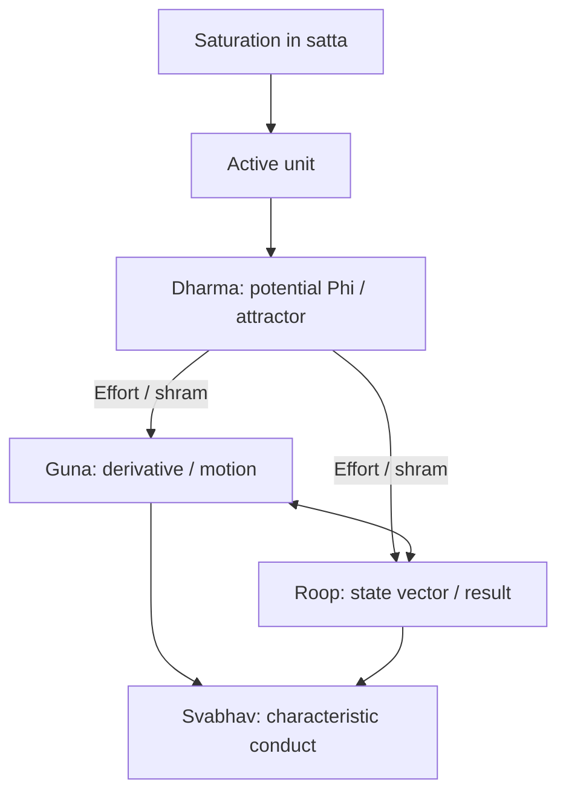

# A State-Dynamic Model of Coexistence

**Author:** Raghava Mohan Madhwapathi

**Edited on:** August 19, 2026, 8:52 AM IST

Author: AnalyticMadhyasthDarshan.org — a group of people studying Madhyasth Darshan philosophy. Source repository: raghavamohan/AnalyticMadhyasthDarshan.
Edited on: August 19, 2026, 8:47 AM IST
Status: Draft
The question: Can the effort–motion–result triad and the four aspects of a unit be stated as one state-dynamic model, and can that model carry the unit from material configuration through jeevan to verified human conduct?
This paper reconstructs those claims from Madhyasth Darshan (Co-existentialism), as presented by Shri A. Nagraj, in the language of a continuous state space. It maps effort–motion–result (shram–gati–parinam) and form, property, essential nature, and dharma (roop–guna–svabhav–dharma) onto a bounded, active unit (ikai) as that unit moves from weight-bound physicochemical configuration (jada) to the cognitive activity of the sentient self (chaitanya). The reconstruction then follows the three completeness thresholds — constitutional completeness (T1), activity completeness (T2), and conduct completeness (T3) — into the public verification of humane conduct in undivided society (akhanda samaja).
The equations below are this paper's analytical reconstruction. The primary texts do not write state vectors, derivatives, or attractor basins. They state coexistence, saturation, the inseparable triad, the four aspects, and the completeness stages in ordinary philosophical prose. The formalism is a lens for keeping those claims simultaneous and checkable; it is not a proof that the darshan is a dynamical system, and it does not replace the comparative treatment in the related topical studies.
Standpoint and scope
These studies are written from the standpoint of a scientist and technologist trained to graduate-level physics and mathematics and familiar with conservation laws, phase-space models, and contemporary accounts of material binding. From that background, matter-first explanations are familiar: configurations evolve under forces, and consciousness is often identified with brain processes or treated as emergent from physical activity. The natural sciences constrain any credible account of material trajectory through mechanism, prediction, and public evidence, but their success does not by itself settle the hard problem of consciousness, the status of the self, or the reality of value in favour of matter-only reductionism.
The paper reads Madhyasth Darshan's primary texts, states the darshan's claims, and then reconstructs them in parallel with the mathematics of state and motion. Comparison with physics and the natural sciences is therefore one leg of the work, not the sole framework into which the philosophy must be translated. Full comparison with Advaita Vedanta and modern Western philosophy of mind, value, and society is developed in the related topical studies and is not repeated here.
The aim is rigorous comparative understanding — testing definitions, internal consistency, and the limits of the formal analogy — rather than persuasion or devotional endorsement. Logical reconstruction, first-person realisation, evidence in conduct, and instrument-based scientific confirmation are kept distinct so that agreement at one level is not mistaken for agreement at every level. Physics and dynamical-systems language do not establish immortal jeevan, constitutional completeness, or undivided society; those remain explicit points for examination.
Clear and checkable prose remains the series priority. This paper is a formal reconstruction of structure already stated in the topical studies; it does not require a further layer of category theory or proof, and it does not treat the reconstruction as source doctrine.
Quick Glossary
Term	Plain meaning
Coexistence (saha-astitva)	The inseparable presentness of Omnipresence (satta) and countable units (ikai).
Saturation (samprikt)	Every unit is soaked, submerged, and surrounded in satta; energy-fullness, regulation, and activeness follow as entailments of that bond.
Unit (ikai)	A bounded, countable bearer in nature — insentient or sentient — whose activity is effort, motion, and result together.
Effort–motion–result (shram–gati–parinam)	The inseparable triad of unit-activity; not three successive moments.
Form (roop)	Shape, volume, density: the real bounded configuration of the unit, reflected in mutual facing.
Property (guna)	Relative power, effective as generative, degenerative, or mediative influence when units come together.
Essential nature (svabhav)	The order-specific usefulness or characteristic conduct of those effects.
Dharma	What is innately borne and fulfilled according to order: existence, with growth, hope to live, and happiness stated cumulatively in the higher orders.
Jeevan	The constitutionally complete sentient atom; the knower that works through the body.
Constitutional completeness (T1)	The atomic threshold at which a developing atom becomes jeevan and is free of molecular-bondage and weight-bondage.
Activity completeness (T2)	Restfulness of effort: realisation (anubhav) resolves the inner seeking of jeevan.
Conduct completeness (T3)	Destination of motion: realised understanding evidenced as humane conduct.
State vector $x(t)$	This paper's symbol for the unit's instantaneous configuration (parinam) in a reconstructed phase space $X$.
$\Phi$	This paper's symbol for the internal potential associated with effort (shram) and order-specific dharma.
1. Ontological foundations
Madhyasth Darshan holds that existence is neither a collection of static material substances nor an undifferentiated idealist field. Existence is coexistence (saha-astitva): the inseparable, perpetual presentness of unmediated Omnipresence (satta) and discrete, active units (ikai) (SB, pp. 48–49; MVD, pp. 11, 34).
Every unit is saturated (samprikt) in Omnipresence. Saturation is not a transfer of energy from a finite store. It is the way a unit exists, and the texts treat three conditions as its entailments. Units are energy-enpowered (urja-sanyuktata): they do not generate or consume the energy evident in their activity, but are never devoid of it (SB, p. 69). They are self-regulated (niyantrana): orderliness is inherent in saturated unithood, not an external law imposed on otherwise lawless matter (MVD, p. 26; SB, p. 57). And they are actively expressive (kriyashilata): to exist as a unit is to act; there is no inert remainder (SB, p. 53).
The total activity of any unit is the triad of effort–motion–result (shram–gati–parinam). These are not three successive moments on a timeline in which effort causes motion and motion later produces a result. They are simultaneous, co-extensive dimensions of one activity-whole:
> "Every physical-chemical activity is an inseparable presence of effort, motion and result. Each of these is a joint form of the other two."
> — SB, p. 58
2. Mathematical scaffolding of the triad
To keep that simultaneity visible without introducing temporal lags or linear causal fragmentation, this paper represents the unit in a continuous state-dynamic framework. A unit is assigned a state vector $x(t)$ in a phase space $X$. Time $t$ here is an index of duration (kaal) of unit-activity, not a container in which the unit is placed (see Nature of Time). The assignment is a reconstruction: the texts name effort, motion, and result; they do not name $x$, $\dot{x}$, or $\Phi$.
2.1 Result (parinam) as the state vector
Parinam is the instantaneous configuration, structural arrangement, or developmental plateau of the unit at a given duration. This paper writes it as the position of the unit in the reconstructed state space:
$$
x(t) \in X
$$
2.2 Motion (gati) as the state-derivative
Gati is the order-specific activity, velocity of change, or relational transformation of the unit. This paper writes it as the instantaneous state-derivative:
$$
\dot{x}(t) = \frac{dx}{dt}
$$
The derivative notation must not be read as a claim that motion is later than result. In the reconstruction, $x$ and $\dot{x}$ are defined together at every duration, matching the texts' insistence that state and motion are inseparable (SB, pp. 58–62, 248–252).
2.3 Effort (shram) as the system potential
Shram is the inherent structural tension, particle-deficit, or developmental drive that powers the vector field. This paper writes it as an internal potential:
$$
\Phi(x)
$$
The complete reconstructed system is then
$$
\dot{x}(t) = F\bigl(x(t);\Phi\bigr).
$$
State and motion are locked at every infinitesimal instant of the model. One cannot alter parinam without an immediate manifestation in gati, and the trajectory remains bounded by the unit's internal potential and structural constraints. That locking is the formal counterpart of the triad's joint form, not an additional physical law.
3. The tetrad in the state-dynamic model
Every unit has four inseparable aspects: form (roop), property (guna), essential nature (svabhav), and dharma (MVD, p. 47). They are not four detachable components and not four successive stages. They are simultaneous aspects of one activity-whole, mapping onto the reconstructed triad as follows.

3.1 Form (roop): bounded configuration
Roop is the spatial configuration, boundary-framework (rachna), shape, volume, and density of the unit (SB, pp. 249–250). It maps to result (parinam) in the reconstructed model: the currently realised coordinates of $x(t)$. Form is objectively unit-grounded. It is encountered in mutuality as a reflected image (pratibimbita), but reflection presents the form; it does not create it (MVD, pp. 42, 49–50).
3.2 Property (guna): relative power in motion
Guna is relative power (sapeksha shakti), the effect and influence that arise when units come into mutuality (MVD, p. 47; SB, pp. 248–252). It maps to motion (gati): the state-derivative field $\dot{x}(t)$. Its directional modes remain generative (sam), degenerative (visam), and mediative (madhyastha) across the four orders (MVD, pp. 26, 49–50).
3.3 Essential nature (svabhav): functional character
Svabhav is fundamental character (maulikata) and the usefulness (upayogita) of properties (MVD, p. 47). Usefulness here is order-specific functional significance, not benefit to a human observer: the same texts include devitalising and cruel essential natures. In the reconstruction, svabhav spans both effort (shram) and motion (gati). It names the qualitative character of $F\bigl(x(t);\Phi\bigr)$. Unlike guna, whose directional modes remain the same triad, svabhav changes with order: integration–disintegration in matter, vitalising–devitalising in the pranic order, cruel–non-cruel in the animal order, and humane or inhumane dispositions in the knowledge order (MVD, pp. 50–51, 115; SB, p. 179).
3.4 Dharma: innateness and invariant orientation
Dharma is innateness (dharana): what is innately borne, maintained, and characteristic of an entire order (MVD, p. 47). It maps fundamentally to effort (shram). In the reconstruction it is the potential $\Phi$ together with the order-specific orientation toward fulfilment — existence, growth, hope to live, and happiness, stated cumulatively (SB, p. 179). The word “attractor” in what follows is this paper's dynamical-systems analogy for that orientation. The texts speak of development and completeness, not of basins of attraction.
4. The material order: phase-space boundedness
In the insentient material line (jada), spanning the physical order and the bio-growth order, the reconstructed state vector is confined to physical-chemical parameters:
$$
x(t) = x_{\mathrm{physical}}(t) \in X_{\mathrm{physical}}.
$$
4.1 Constraints of the material field
The material potential $\Phi_{\mathrm{material}}$ is defined, in the darshan's terms, by two forms of structural bondage. Weight-bondage (bhara-bandhana) subjects the unit to gravitational and inertial mutuality, so its trajectory depends on other mass-bearing units. Molecular-bondage (anu-bandhana) fixes internal stability by subatomic particle counts in nuclear and orbital constitution. Atoms carry structural hunger (bhukha) or overfullness (adhikya), and they collide, exchange particles, and form temporary molecular compounds on that basis (MVD, pp. 8, 91; SB, pp. 58, 71).
4.2 Material attractor dynamics
The reconstructed material trajectory
$$
\dot{x}{\mathrm{physical}} = F\bigl(x{\mathrm{physical}};\Phi_{\mathrm{material}}\bigr)
$$
represents the continuous composition and decomposition (gathana-vigathana) of matter. Because material configurations remain vulnerable to external impact, their parinam is transient. The model therefore does not treat a material configuration as a terminal constant:
$$
\lim_{t \to \infty} x_{\mathrm{physical}}(t) \neq \mathrm{constant}.
$$
That limit statement is a reconstruction of transience, not a theorem of physics and not a sentence in the primary texts. Composition is not development: a new compound may close a new bounded conduct while the atomic development progression toward constitutional completeness remains a distinct line (SB, pp. 75–76; KD 3.2–3.3).
5. Constitutional completeness
The transition from the insentient material line to the sentient cognitive line is constitutional completeness (gathanpurnata, T1). When a developing atom achieves complete subatomic particle balance in its nucleus and orbits, particle hunger drops to zero and the atom crosses an irreversible threshold (SB, pp. 55, 61, 92).
5.1 The T1 bifurcation
At that threshold the atom is no longer available to molecular-bondage and weight-bondage. It cannot be split, fused, or degraded by the physical-chemical forces that bound it as a developing constitution.
> "An evolving-constitution atom is with molecular-bondage and weight-bondage. However, when the contraction and expansion activity increases in this atom, it instantly breaks free from its group and attains constitutional completeness, becoming a jeevan atom. The evidence of constitutional completeness is the jeevan atom's liberation from molecular-bondage and weight-bondage, and its having the hope-bondage."
> — MVD, p. 91
In the reconstructed state space, the continuous physical coordinates of particle-exchange collapse into an invariant structural core, and a further set of cognitive coordinates $x_{\mathrm{cognitive}}$ becomes the relevant description of activity. The unit is now jeevan: a constitutionally complete, immortal, sentient atom that operates through a physical body and is not reducible to the laws of molecular and weight bondage. Whether and how that threshold is to be identified in contemporary physics remains an open problem (§10).
6. The cognitive order: the ten-activity circuit
Upon crossing T1, the reconstructed state vector is composite:
$$
x(t) = \begin{bmatrix} x_{\mathrm{physical}}(t) \ x_{\mathrm{cognitive}}(t) \end{bmatrix}.
$$
The product notation does not divide jeevan into two substances. The body remains the expression medium; jeevan is the sentient unit. The cognitive coordinates track the five faculties and ten activities named in the texts (MVD, p. 78; JV, pp. 92–94):
Faculty	Activities
Mun	Selection / tasting (chayana / asvadana)
Vritti	Analysis / weighing (vishleshana / tulana)
Chitta	Imaging / contemplation (chitrana / chintana)
Buddhi	Discrimination / verification (sankalpa / bodha)
Atma	Realisation / authentication (anubhava / pramanyata)
All ten activities belong to every jeevan. Animal bodies restrict their expression; a developed human body provides for their full exercise. Delusion (bhram) can still misdirect evaluation by identifying jeevan with the body (JV, pp. 93–94).
6.1 The deluded human state
In the unawakened human state the reconstructed cognitive potential $\Phi_{\mathrm{cognitive}}$ is misaligned. The upper faculties (buddhi and atma) remain unevidenced. The derivative $\dot{x}_{\mathrm{cognitive}}$ is driven by feedback from the body's sensory inputs, seeking happiness through sensory pleasure, profit, and temporary comfort (SB, pp. 91–92; MVD, p. 78).
Because jeevan is an infinite cognitive unit in the darshan's terms, attempting to stabilise it on finite, transient sensory inputs yields an unstable inner trajectory. This paper writes that instability as
$$
\text{Internal friction }(\dot{x}_{\mathrm{cognitive}} \neq 0) \implies \text{psychological division / suffering}.
$$
The implication is a reconstruction of delusion as unresolved cognitive motion, not a clinical diagnosis and not a quantitative psychology.
7. Activity completeness and conduct completeness
Resolution requires that the upper cognitive loop become active, so that the inner potential is no longer organised from sensory input outward but from realisation outward into conduct.
7.1 Activity completeness (T2 — kriyapurnata)
Activity completeness is reached when atma directly perceives coexistence (anubhav). That realisation is the restfulness of effort (shram ka vishram): the restless search for certainty stabilises into knowing (SB, p. 58; MVD, Ch. 5). In the reconstruction, T2 is the fixed point at which $\dot{x}_{\mathrm{cognitive}} = 0$ in the sense of inner coherence, not in the sense that jeevan becomes inactive. Motion continues; confusion does not.
7.2 Conduct completeness (T3 — acharanpurnata)
Conduct completeness is the lived evidence of T2 in physical reality through humane conduct (manaviya acharan). It is the destination of motion (gati ka gantavya): invariant behavioural output aligned across the modes of interaction (MVD, p. 80; SB, p. 58). Humane conduct is stated as an integrated structure of character (charitra), ethics (niti), and values (mulya). Character locks external action into rightfully owned wealth (sva-dhana), marital faithfulness (sva-nari / sva-purusha), and kindness in action (dayapurna karya). Ethics bounds the use of body, mind, and wealth (tan-man-dhana) by right-use (sadupyoga) and protection (suraksha). Values are recognised and fulfilled in relationship — trust, respect, gratitude, and the remaining established values — producing mutual satisfaction (ubhaya-tripti).
8. Verification of conduct
Madhyasth Darshan does not treat human rightness as a private taste or a relativistic convention. Rightness is to be evidenced in experience, behaviour, work, and thought. This paper writes that fourfold demand as a single reconstructed protocol:
$$
\text{Verification protocol} = \begin{bmatrix}
\text{Anubhav (experience)} \
\text{Vyavahar (behaviour)} \
\text{Karya (work)} \
\text{Vichara (thought)}
\end{bmatrix}.
$$
8.1 The verification matrix
Let $V$ be a reconstructed verification operator on a human system $x$. Conduct is valid in the model when the four constraints hold together:
$$
\begin{aligned}
V_{\mathrm{thought}}(x) &\implies \text{internal harmony }(\dot{x}{\mathrm{cognitive}} = 0) \
V{\mathrm{behavior}}(x, y) &\implies \text{mutual satisfaction }(\text{ubhaya-tripti with interlocutor } y) \
V_{\mathrm{work}}(x, \text{nature}) &\implies \text{ecological enrichment }(\text{avartanashilata / cyclical balance}) \
V_{\mathrm{experience}}(x) &\implies \text{alignment with truth }(\text{pramanikta})
\end{aligned}
$$
Authentic conduct requires simultaneous success across all four. A claim of inner enlightenment (T2) that produces exploitation in society ($V_{\mathrm{behavior}} \lt 0$) or ecological depletion ($V_{\mathrm{work}} \lt 0$) remains, in the darshan's terms, deluded. The inequalities are qualitative markers in this reconstruction, not measured scores.
9. Undivided society
When the verification protocol is satisfied across a population, individual trajectories are described in the darshan as synchronising from individual resolution to universal harmony: resolved individual, prosperous family, fearless society, universal coexistence (JV, p. 61; SB, pp. 246–247). This paper writes that chain as
$$
\text{Resolved individual} \longrightarrow \text{prosperous family} \longrightarrow \text{fearless society} \longrightarrow \text{universal coexistence}.
$$
That state is the realisation of undivided society (akhanda samaja) and universal orderliness (sarvabhauma vyavastha). Social stability is not produced by external legal coercion. It is the public evidence of units that have crossed T1 as jeevan, reached T2 as realised understanding, and manifested T3 as verified conduct. The reconstruction does not claim that the chain is a dynamical theorem; it records the darshan's own social completion of the same triad.
10. Open problems
The reconstruction leaves several questions unset.
First, the texts insist that effort, motion, and result are simultaneous. Writing motion as $\dot{x}$ and result as $x$ is a convenient pair in ordinary dynamics, but it can reintroduce the very sequence the triad refuses. Whether a genuinely simultaneous formalism — without a privileged time derivative — would be more faithful remains open.
Second, “attractor basin” is this paper's analogy for completeness-orientation. The texts speak of development until realisation, not of asymptotic stability in a potential well. Constitutional completeness is a selected atomic threshold, not a fate of every particle. The analogy must not be read as a universal dynamical law.
Third, the operator $V$ names four public constraints. It does not yet supply a quantitative, observer-independent scoring of mutual satisfaction or cyclical balance. Those remain qualitative evidences, as in the related studies of family values and undivided society.
Fourth, T1 is a metaphysical and textual threshold. Contemporary physics has no accepted counterpart for an atom that leaves molecular and gravitational bondage while remaining a countable unit. The reconstruction records the claim; it does not close the empirical question.
Editorial Notes
Formal status of the equations
The state vector $x(t)$, derivative $\dot{x}(t)$, potential $\Phi$, composite physical–cognitive coordinates, and verification operator $V$ are this paper's constructions. They organise what the primary texts state about the triad, the four aspects, the completeness stages, and public evidence. They are not quotations, and they are not additional doctrine. Where the exposition says “this paper writes” or “the reconstruction,” the claim is formal, not textual.
Running terms
Analytical prose uses the series running terms: form (roop), property (guna), essential nature (svabhav), dharma, effort (shram), motion (gati), result (parinam), jeevan, and Omnipresence (satta). Block quotes keep the translation's wording. IAST spellings (rūpa, guṇa, svabhāva, śram) are not used as a second running vocabulary.
Mapping of the tetrad to the triad
One SB passage relates effort to dharma and svabhav, motion to svabhav and guna, and result to roop (SB, pp. 60–62). This paper follows that alignment. It does not claim a one-to-one derivation, because svabhav crosses both effort and motion. The mermaid figure is an aid to that reconstruction, not a source diagram.
Composite state vector
Writing $x$ as a stack of physical and cognitive coordinates is a modelling convenience. It must not be read as a Cartesian dualism of two substances. Jeevan is one constitutionally complete atom; the body is its expression medium. The stack records two descriptions of one joint form.
References
Madhyasth Darshan (primary sources)
MVD — Nagraj, A. Madhyasth Darshan — Co-existentialism. English translation by Rakesh Gupta. Cited: coexistence and the four aspects (pp. 11, 34, 47; §1, §3); mediative regulation (p. 26; §1); hungry and overfull atoms (p. 8; §4.1); atomic constitution and change of form (pp. 42, 49–50; §3.1); sam–visam–madhyastha (pp. 26, 49–50; §3.2); order-specific svabhav and dharma (pp. 50–51, 115; §3.3–§3.4); T1 evidence, molecular-bondage and weight-bondage (p. 91; §5.1); atma and orbital faculties (p. 78; §6); delusion as body-identification (p. 78; §6.1); restfulness of effort (Ch. 5; §7.1); authentic conduct (p. 80; §7.2).
SB — Nagraj, A. Samadhanatmak Bhautikvad (Resolution Centred Materialism). English translation by Rakesh Gupta. Cited: coexistence and saturation (pp. 48–49; §1); recognition and regulation (p. 57; §1); unit and energy-fullness as activeness (p. 69; §1); inseparable effort–motion–result (pp. 53, 58; §1–§2); state and motion, force and power (pp. 58–62, 248–252; §2.2, §3); completeness goals of the triad (pp. 58, 71; §7); composition is not development (pp. 75–76; §4.2); T1 and inexhaustibility (pp. 55, 61, 92; §5); order-specific dharma (p. 179; §3.4); delusion and the body (pp. 91–92; §6.1); undivided society (pp. 246–247; §9).
JV — Nagraj, A. Jeevan Vidya: An Introduction. English translation by Rakesh Gupta. Cited: ten activities (pp. 92–94; §6); delusion and four-and-a-half effective activities (pp. 93–94; §6); human goals (p. 61; §9).
KD — Nagraj, A. Manav Karm Darshan. Working English translation of chapter 3; Hindi source `KD-karm darshan v5.pdf`. Machine-assisted working translation — not a published translation; cited as corroboration only. Cited: two developments, compositional and atomic (3.2–3.3; §4.2).
Related studies in this collection
The Ontology of Coexistence — saturation, the four aspects in mutuality, T1–T3, and jeevan (§§1.2–1.7); companion technical note Rūpa, Guṇa, Svabhāva, and Dharma in a State-Dynamic Unit
Coexistence from First Principles — kernel reconstruction, completeness orientation, and the guarded status of T1
The Epistemology of Coexistence — knowing, evidence, and the faculty architecture; companion A Functional Model of Jeevan
Nature of Time — kaal as duration of unit-activity
Human Behavior and Society — humane conduct and social organisation
Family Relationships and Values — established values and mutual satisfaction
How Undivided Society Is Established — family to universal order
Why Humans Are Not Just Material — body and jeevan