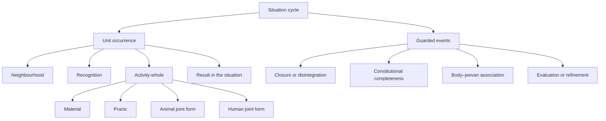

# Technical Note: The Activity-Procedure of a Unit

**Author:** [AnalyticMadhyasthDarshan.org](https://github.com/raghavamohan/AnalyticMadhyasthDarshan) — a group of people studying Madhyasth Darshan philosophy. Source repository: [raghavamohan/AnalyticMadhyasthDarshan](https://github.com/raghavamohan/AnalyticMadhyasthDarshan).

**Edited on:** August 25, 2026, 3:23 PM IST

**Status:** Internal technical companion; not a catalog entry. Written for review before possible integration into the parent study.

**Parent study:** [*From Unit Activity to Human Orderliness: A State-Dynamic Reconstruction of Coexistence*](A-State-Dynamic-Model-Of-Coexistence.md)

**Scope:** This note restates the formal reconstruction as an **activity-procedure of a unit** in a neighbourhood. It is written in ordinary English: no symbols, no quantitative laws, and no claim that the primary texts already present a procedure or a program. The parent study remains the source of the architecture. This note is an exhibit of that architecture as something a unit **does**.

## 1. Purpose and thesis

Appendix A of the parent study inventories types, invariants, and predicates. A reader can see what must not be mixed, but cannot easily see what a unit does. The topical sections already contain the architecture. They do not yet present it as one runnable cycle.

The thesis of this note is:

> The reconstruction is most clearly stated as an activity-procedure of a unit in a neighbourhood. Standing conditions are never computed as outputs. One complete occurrence has effort, motion, and result co-present. Guarded events are the only way kind or relation may change. Order-modules specialise that kernel; they do not replace it with a second engine. Omnipresence, *dharma*, and the sequence of manifested orders are standing conditions, not routines.

This is an analytical reconstruction. It organises claims already developed in the parent study. It is not source doctrine, not a stored program inside the unit, and not a learning algorithm.

Call it an **activity-procedure**, **occurrence-cycle**, or **process of the unit**. Do not call it the unit's program. *Dharma* is innateness, not instructions. Omnipresence is actionless ground, not a scheduler. The sequence of manifested orders restricts what can appear; it does not pull every atom through every order.

## 2. Claim status

The same contract as the parent study governs every sentence here.

| Kind of statement | Meaning in this note | Example |
|-------------------|----------------------|---------|
| Direct textual claim | Stated in the primary texts in ordinary philosophical prose | Coexistence, saturation, the triad, the tetrad, four orders, constitutional completeness, ten activities |
| Translation choice | One English running term selected where translations vary | Omnipresence for *satta*; activity-procedure for this reconstruction |
| Analytical reconstruction | A structure introduced to keep the claims explicit and mutually consistent | Situation cycle, unit occurrence, modules, guarded-event table |
| Proposed operational criterion | A checkable reading whose exact equivalence is not stated by the texts | Activity completeness and conduct completeness as trace-checks |
| Open empirical question | A source claim without an accepted contemporary scientific counterpart | Physical identification of constitutional completeness; the body–*jeevan* interface |

The procedure itself is an analytical reconstruction. Rejecting the procedure-form does not by itself reject the textual claims it organises.

## 3. Standing conditions

These are true throughout. They are never an output of a cycle.

1. Existence is coexistence: state-complete Omnipresence together with countlessly many state-dynamic units (SB, pp. 48–50; MVD, pp. 11, 34).
2. Every unit in a bounded situation is bounded, has persistent identity, and is saturated in Omnipresence. Saturation is the ground of energy-fullness and activeness. It is not an applied input and is not selected per event (MVD, pp. 40–41, 46; SB, pp. 57, 61, 69, 248).
3. Omnipresence does not move, press, or become a bearer in the situation. The same ground is also named Knowledge or Space: actionless availability for realisation, not a second force (MVD, pp. 32–36, 174).
4. Every unit bears form (*roop*), property (*guna*), essential nature (*svabhav*), and *dharma* as four aspects of one unit (MVD, p. 47).
5. Every activity is effort, motion, and result together. These are not three successive moments (SB, p. 58).
6. A bearer has two axes that must not be fused:
   - **Constitutional kind:** developing atom, constitutionally complete *jeevan*, molecule, compound or mineral, pranic cell, pranic body, or a joint-form handle used only as a unit of analysis.
   - **Manifested order or role:** material, pranic, animal, or knowledge. For *jeevan* with no body association in this situation, an auxiliary unjoined-sentient role is used. That role is not a fifth order.
7. While the manifested order-role is unchanged, *dharma* does not change. Fulfilment of *dharma* is occurrence-level evidence, not the engine of the next state. In the human, comprehension of *dharma* is a further epistemic relation; it does not create *dharma* (MVD, p. 47; JV, pp. 110, 121–123).
8. The definite sequence of manifested orders (*niyati-kram*) restricts what can appear, and in what order, under conducive conditions. It does not pull every atom through every order, and it is not a convergence law (MVD, pp. 8, 13).
9. Compositional development and atomic development are different lines. They meet in animal and human joint forms. The human is not a later animal composition. A body does not produce *jeevan* (SB, pp. 75–76; JV, pp. 47–48, 59).

## 4. Two layers

A unit procedure cannot be written in isolation. Facing, composition, and joint forms are relations among bearers. Two layers are therefore required.

**The situation cycle** is the outer procedure: a finite neighbourhood under study, with an explicit boundary to the rest of nature. It holds the bearers, their actual facings, which bearers are parts of which containing wholes, and which *jeevans* are associated with which bodies.

**The unit occurrence** is the kernel: what one bearer does in its actual neighbourhood during one complete activity-occurrence.

Many units proceed at once. Mutuality is shared. There is no global brain and no mean-field summary of nature. A bearer meets only what it actually faces, contains, or is contained in.

## 5. The situation cycle

**Given** a bounded situation: a finite set of bearers; each with a present form and internal condition; the actual facings among them; part-relations of containing wholes; body–*jeevan* associations; and the relevant edges across the analytical boundary.

**Then, for one occurrence of the situation:**

1. Each bearer undergoes one unit-occurrence, concurrently, in its actual neighbourhood.
2. Results are written back into the situation. Forms, facings, internal conditions, and consequences are those of this occurrence.
3. Guards are then inspected. If a typed event is admissible, that event may fire. If none is admissible, activity continues in the same kinds and relations.
4. Identity rules are enforced. Closure adds a containing bearer without annihilating constituents. Disintegration removes the closure while constituents continue. Constitutional completeness preserves atomic identity while changing kind irreversibly. Association activates a joint-form role without fusing body and *jeevan* into one substance.
5. The next situation-occurrence begins from that updated situation.

The situation cycle does not assign probabilities. It does not force dissatisfaction into inquiry, study into realisation, or individual change into a social theorem.

## 6. The unit occurrence

This is the kernel. Every later module specialises a step here. None of them is a second engine.

The numbered steps below describe **what is co-present** in one occurrence, then **what may become different** across duration. They do not divide effort, motion, and result into a temporal pipeline.

### 6.1 Read the neighbourhood

Collect the actual relations incident on this bearer:

- mutual facing;
- complementary need;
- organisation inside a containing whole;
- nourishment or use;
- relationship or contact;
- teaching or study;
- body–*jeevan* association.

Record, without a number, the relevant facing conditions: distance, role, complementarity, containment, nourishment, expectation, and so on.

Keep two dimensions separate:

- **How** the bearers are related: facing, closure, containment, association.
- **What fulfilment is at issue** in that facing: exchange, nourishment, species mutuality, human relationship, right-use or depletion.

If this bearer is a part, its neighbourhood includes the whole and the other parts it actually faces. If it is a containing whole, its external neighbourhood is not the same as its internal organisation.

### 6.2 Recognise

Form an **operative recognition** of that actual neighbourhood.

- Material and pranic: definite according to constitution, structure, or seed.
- Animal: definite according to species.
- Human: may agree with or diverge from what is actually there.

Action proceeds from operative recognition. Bodily, relational, and natural consequences occur in actual mutuality. That split is what later makes misrecognition, correction, and justice representable.

Pressure belongs here as a condition of the facing, not as a store of energy:

- force in state may be recognised as pressure;
- if generative–degenerative excitation is present, received compulsion is excitation-pressure;
- an unfulfilled human relation is not, by that fact, excitation-pressure.

### 6.3 Express one activity-whole

This step is not a sequence. In this occurrence the unit **is** effort, motion, and result together.

- **Effort:** strength borne in the state. *Dharma* gives the invariant orientation of the order; essential nature gives the functional character on the effort side. Strength is not a stored quantity and not another name for *dharma*.
- **Motion:** power in operation, with a property-profile — generative, degenerative, mediative, possibly together, not as exclusive switches. Essential nature gives that power its order-specific function. Generative is not already vitalising; degenerative is not already cruel.
- **Result:** the present bounded form, the configuration realised in this activity. Form is not the whole state. Kind, constitution, relations, and, where relevant, sentient orientation are also part of the description.

The activity is admissible only as one compatible whole: present state, actual neighbourhood, operative recognition, standing orientation, essential nature, and property-profile. Standing orientation is the *dharma* of the manifested order, or hope-bondage for unjoined *jeevan*.

Dispatch by kind and order — this is the first modular break:

| Bearer | What expression looks like | Conformance |
|--------|----------------------------|-------------|
| Material | Integration or disintegration; exchange; joining; mediative regulation | Constitution or structure |
| Pranic | Vitalising or devitalising; nourishment, respiration, growth, decline | Seed and lineage |
| Animal joint form | Hope to live; tasting, selection; friendliness or opposition | Species |
| Human joint form | Knowing, believing, recognising, fulfilling; humane or human-opposing conduct | Present *sanskar* |
| Unjoined *jeevan* | Sentient bearer with hope-bondage; no animal or knowledge-order *dharma*-profile until a joint form is active | Constitutional completeness already attained |

Natural-state motion can continue under complementary mutuality and mediative regulation. It need not be static.

> **"Every physical-chemical activity is an inseparable presence of effort, motion and result."**
> — SB, p. 58

### 6.4 Write the result into the situation

The changed configuration is immediately a force-bearing state for the next facing. Neighbours now meet a different form and a different relation.

For a human, configurational result is not the whole consequence. Record together:

- **internal** alignment and orientation of the faculties;
- **bodily** speech, action, production, use, bodily condition;
- **relational** recognition, value-fulfilment, trust, satisfaction, or contradiction;
- **natural** nourishment, right-use, protection, regeneration, imbalance, or depletion.

These four are one consequence-profile. None is a fourth member of the triad.

### 6.5 Leave the occurrence complete

Do not insert evaluation inside this occurrence as a later phase of the same triad. If evaluation happens, it is a **later complete occurrence** of the same kernel, whose neighbourhood includes the observed consequence of what just occurred.

## 7. Guarded events

After unit-occurrences have written their results, the situation inspects guards. Saturation does not choose the event. *Dharma* does not choose the event. Local kind, order-role, configuration, actual relations, mutual pressure, and conformance decide whether a typed change is admissible. The sequence of orders only restricts what kinds of manifestation can appear.

| When this is admissible | What changes | What must not change |
|-------------------------|--------------|----------------------|
| Continuing activity | Form and facings within the same kind | Identity, kind, order-role, *dharma*-profile |
| Atomic exchange | Particle constitution, hunger or overfullness, relevant couplings | Developing-atom identities |
| Mixture formation or separation | Facing edges among existing bearers | No new containing bearer |
| Compositional closure | A compound, cell, or body and part-relations become active | New whole receives its own order-profile; parts keep identity, order, and profiles |
| Disintegration | Containing bearer and part-relations cease | Constituents continue in lower-level couplings |
| Pranic growth or reproduction | Seed-conformant cells or bodies close, grow, or reproduce | Resulting body remains pranic |
| Constitutional completeness | A developing atom becomes *jeevan* and bears hope-bondage | Same atomic identity; kind changes irreversibly; no fifth order |
| Body–*jeevan* association or separation | Animal or knowledge joint-form becomes active or ceases | Body remains pranic; *jeevan* remains one sentient atom |
| Animal evaluation | Species-conformant recognition and bodily response | No human knowing–believing or justice criterion |
| Human evaluation and refinement | Operative recognition, conception, evaluation-references, or *sanskar* | *Jeevan* constitution and human *dharma* remain invariant |

No event receives a probability. If a guard is not satisfied, it does not fire.

## 8. Modules

Each module fills in a step of the kernel or a row of the event table. It does not replace the kernel.

### 8.1 Mutuality

Owns neighbourhood and the actual side of recognition.

- Structural relation versus fulfilment-in-the-facing.
- Relationship (expectations in the sense of completeness) versus contact (voluntary expectations) (MVD, pp. 61–62).
- Teaching and study as typed human–human edges: they can present content; they do not copy knowledge as energy.

### 8.2 Recognition

Owns the operative side of recognition.

- Definite recognition in the first three orders.
- Human divergence from the actual relation.
- Pressure as how force–power is encountered, not as a reservoir, and not as human dissatisfaction.

### 8.3 Tetrad expression

Owns the inner structure of the activity-whole.

- Form: bounded configuration on the result side.
- Property: relative power in the facing.
- Essential nature: order-specific function spanning effort and motion.
- *Dharma*: invariant orientation of the order; fulfilment and comprehension kept separate.

This module is shared. Order modules only say which essential natures and which *dharma*-profile apply.

### 8.4 Material

Specialises expression and the exchange, mixture, and closure events.

- Atomic constitution, molecular-bondage, weight-bondage.
- Hungry and overfull atoms; displacement and absorption; then restored natural-state motion (KD 3.1, pp. 57–58).
- Joining at a definite good distance, related to exchange but not identical with it (KD 3.11, pp. 103–104).
- Mixture: no new public conduct. Compound: a new bearer with its own tetrad (MVD, p. 42).

### 8.5 Containing whole

Specialises closure, disintegration, and nested neighbourhood.

- The whole is a further bearer, not a bag of parts.
- Parts keep their own tetrads.
- The whole organises which part-couplings are admitted, bounded, nourished, or excited.
- Constitutive consistency: parts realise and sustain the closed conduct without the whole being a sum.
- Joint form is not this module. Association is not containment of *jeevan* inside the body as a chemical part.

### 8.6 Pranic

Specialises living media.

- Cell with inherent composition-method; conducive material, nourishment, heat, environment.
- Bodies respire, take nourishment, grow, reproduce, decline, disintegrate by seed-conformance (KD 3.2, pp. 58–60; JV, pp. 47–48).
- Plant body remains pranic. Animal and human bodies are pranic compositions even when a joint form is later active.
- Death of a body removes organising closure and returns constituents to material couplings. Persistence of *jeevan* across bodies is out of this study's span.

### 8.7 Atomic development

Specialises the constitutional-completeness event.

- Not a further compositional plateau.
- When a developing atom reaches complete particle balance, hunger drops to zero, molecular- and weight-bondage cease, constitution becomes invariant, hope-bondage begins (MVD, p. 91; SB, pp. 55, 61; KD 3.3, pp. 60–62).
- Strength and power are described as inexhaustible; this is a textual postcondition, not a measured conservation law.
- Most atoms never take this event. The situation must not treat it as the default next step of the material or containing-whole modules.
- After this event, unjoined *jeevan* is represented by the auxiliary role until a body association is active.

The physical identification of the guard remains open. The procedure records postconditions; it does not supply a laboratory test.

### 8.8 Joint form

Specialises association, not fusion.

- Animal or knowledge order is a pranic body together with constitutionally complete *jeevan* (SB, p. 55).
- Two directions, both remaining effort–motion–result:
  - body presents sensitivity through sound, touch, sight, taste, and smell to *jeevan*;
  - *jeevan* expresses selection, imaging, analysis, resolve, and evidence through the body.
- In the human, cognisance regulates sensitivity (SB, p. 64). Bodily motion does not become knowledge. Refinement does not rebuild the invariant constitution of *jeevan*.
- Activating the joint form assigns the cumulative *dharma*-profile of that order to the joint-form handle. The body's pranic profile and *jeevan*'s constitution stay what they were.
- Separation deactivates the handle; both identities continue.

### 8.9 Animal evaluation

Specialises recognition, expression, and result for the animal joint form.

- Hope to live through species-conformance.
- Recognition of essential nature, including friendliness and opposition.
- Tasting, selection, sensitivity, bodily fulfilment (SB, p. 249; JV, pp. 49, 69–70).
- Consequence of one activity alters the next bodily and relational situation.
- No unfolding of determinate knowledge-content, no knowing-and-believing circuit, no *sanskar*-revision law.

### 8.10 Human orientation

Specialises the internal condition of the human joint form. The jeevan functional companion details the faculty protocol further; this note only needs the causal roles.

Standing orientation of the human joint form includes:

- faculty profile (which of the ten activities are effective);
- present acceptance and *sanskar*;
- qualitative knowledge-profile — studied, directly recognised, enlightened, realised, evidenced — as incomplete unfolding of already-present content (coexistence, *jeevan*, humane conduct), not a possessed quantity;
- evaluation-references (pleasure–health–profit, or justice, *dharma*, truth);
- operative recognition.

Knowing and believing organise internal orientation; recognising relates it to actual mutuality; fulfilling is body-mediated conduct. Their agreement cannot be assumed (JV, pp. 69–70).

Higher-conformance: *mun* governed by inspiration from *vritti*, *chitta*, *buddhi*, and *atma*. Lower-conformance: pressure from vitality, senses, body, and established behaviour (MVD, p. 208). Lower-conformance is necessary to bodily maintenance. Error is when it defines *jeevan*'s purpose.

In delusion, identification with the body leaves the upper activities unevidenced; four and a half activities organise living; pleasure, health, and profit prevail (MVD, pp. 58, 78, 80–81; JV, pp. 73–74, 93–94). Human *dharma* remains happiness. Freedom of action leaves both human-opposing and humane expression possible.

Study, direct recognition (*sakshatkar*), enlightenment (*bodh*), and realisation (*anubhav*) are admissible inner events, not automatic functions of writing a result. No transition rule makes study produce realisation (MVD, pp. 99–100, 126; JV, p. 62).

### 8.11 Human conduct and later evaluation

Specialises two successive uses of the kernel.

**Conduct occurrence.** Same triad, qualified by present orientation. Knowledge does not replace strength and power; it qualifies their expression through understood purpose. The invariant constitution of *jeevan* does not change.

**Consequence.** Internal, bodily, relational, natural — written into the situation.

**Later evaluative occurrence.** The consequence becomes an object of tasting, comparison, contemplation, enlightenment, or realisation. Evaluation is itself effort–motion–result.

**Admissible updates.** Preserve an acceptance; correct recognition; refine evaluation; stabilise realised *sanskar*. Repetition does not turn error into knowledge. One corrected act does not establish completeness.

**Dissatisfaction.** Experienced non-attainment of *jeevan* values. Not excitation-pressure, not a force on *jeevan*. If the same references organise the next conduct, the pattern can recur. If contradiction is recognised as a need for understanding, inquiry and study can begin. Freedom of action keeps both branches open.

### 8.12 Completeness

These are proposed checks on a **trace**, not steps inside one occurrence.

- **Activity completeness:** realisation of the determinate content; all ten activities effective; nested internal harmony (happiness, peace, contentment, bliss, ultimate bliss); restfulness of effort. Absence of reported dissatisfaction may accompany this; it is not enough to define it (SB, p. 58; MVD, p. 103).
- **Conduct completeness:** that inner resolution lived as stable humane conduct — character, ethics, values — across a relevant diversity of relationship and work. “Stable” is qualitative and sustained, not a duration fixed by the sources (MVD, pp. 80, 101, 103; JV, pp. 54–55).

### 8.13 Observation

This module is not part of the unit. It records how different verifiers may assess a trace without collapsing access:

- first-person report;
- those involved in the relationship;
- repeatable public conduct;
- work with nature (law, regulation, balance, protection, right-use, regeneration or depletion);
- instruments, where they apply;
- textual status (claim, translation, reconstruction, proposed check, open question).

Each domain is supported, contradicted, undetermined, or not assessed. The four human domains — thought, behaviour, work, realisation — are not aggregated. Contradiction in relationship or work defeats a present claim of complete public evidence.

The chain resolved individual → prosperous family → fearless society → universal coexistence is a source-stated direction of evidence (JV, pp. 60–61). This procedure stops at individual and relational traces. Family, institution, and population are not yet modules.

## 9. How the modules compose

Call order, not causal ladder:

1. Standing conditions always hold.
2. The situation cycle calls a unit occurrence for every bearer.
3. The unit occurrence always uses mutuality, recognition, and tetrad expression, then writes a result.
4. Material, pranic, animal, or human modules fill in expression according to kind and order. The containing-whole module is used when the bearer is a whole or a part.
5. After all current occurrences, the event table may call material, containing-whole, pranic, atomic-development, joint-form, animal, or human-evaluation modules.
6. Completeness and observation inspect traces; they never fire events.

Invariants that the composition must preserve:

- Composition does not call constitutional completeness.
- A body does not produce *jeevan*.
- Animal evaluation does not call human unfolding or justice-evaluation.
- Human evaluation does not add a force, a fourth triad-member, or an automatic update.
- Instruments do not decide constitutional completeness, and first-person report does not decide work.

## 10. Two executions

These are the same kernel, not new machinery.

### 10.1 Material exchange

An overfull atom, a hungry atom, and a displaced particle are in mutual facing.

| Occurrence | What happens | Which modules |
|------------|--------------|---------------|
| Mutual facing | The atoms meet with definite constitutions and complementary requirements. | Mutuality, recognition |
| Excited activity | The overfull atom becomes excited before displacement; each unit remains forceful and active. | Tetrad expression, material |
| Changed configuration | A particle is displaced and may be absorbed. | Guarded event: atomic exchange |
| Restored facing | The new constitutions continue in definite natural-state motion. | Continuing activity |

If participation closes a compound, the containing-whole module fires and a new bearer appears. If it forms a mixture, only the facing edges change.

### 10.2 Human evaluation

A person accepts responsibility in a recognised relationship but abandons it for immediate profit. This is an analytical example, not a case narrated in the primary texts.

| Occurrence | What happens | Which modules |
|------------|--------------|---------------|
| Present orientation | Profit organises comparison; the responsibility is recognised but not fulfilled. | Joint form, human orientation, conduct |
| Consequence | Internal contradiction, a work consequence, and diminished relational trust or satisfaction. | Result written into the situation |
| Recurrent evaluation | Profit remains decisive and the act is justified. | Later evaluative occurrence; update preserves prior references |
| Inquiry-oriented evaluation | Non-fulfilment is recognised as a question of relationship, value, and justice. | Admissible update: recognition may be corrected |
| Later evidence | Responsibility is fulfilled and assessed through mutual satisfaction. | Publicly testable conduct; one act does not establish completeness |

The trace makes the distinction between dissatisfaction and excitation-pressure concrete. The former is a sentient consequence of unresolved value; the latter belongs to an excited force–power relation.

## 11. Relation to other documents

- **Parent study.** This note is a reading of that study's architecture as a procedure. If the note is accepted, the parent study would be re-cut so that standing conditions, the situation cycle, and the unit occurrence become the main exhibit, with the present Appendix A retained as a type-contract. Until then, the parent study is unchanged.
- **Jeevan functional companion.** [*A Functional Model of Jeevan*](../The-Epistemology-of-Coexistence/Research-Note-Jeevan-Functional-Model.md) is the inner specialisation of human orientation: faculties, reception, inquiry, and embodied consequence. This note owns the outer process — unit and situation — of which that companion is one module.
- **Tetrad technical note.** [*Four Aspects of the Active Unit*](../The-Ontology-of-Coexistence/Technical-Note-Roop-Guna-Svabhava-Dharma.md) supplies the aspect-definitions used in tetrad expression. This note does not reopen those definitions.

## 12. Questions for review before integration

These are the decisions this note is meant to settle.

1. **Naming.** Is “activity-procedure of a unit” the right exhibit-name, or is “occurrence-cycle” / “process of the unit” clearer for a reader of the darshan?
2. **Placement.** If integrated, should the kernel sit immediately after “Model at a glance,” replacing the present walk through triad and tetrad as the first formal section?
3. **Appendix A.** Keep it as a type-contract behind the procedure, shorten it, or drop symbols from the published study and retain them only in a companion?
4. **Module grain.** Are the thirteen modules the right cuts, or should mutuality and recognition be one module, and completeness and observation be left in the parent study's later sections?
5. **Human inner protocol.** Keep faculty-level unfolding in the jeevan companion, or lift a shorter version into this procedure?
6. **Traces.** Are the two executions sufficient, or is a pranic-growth execution also required before integration?
7. **Language.** Does any sentence still sound as if *dharma*, Omnipresence, or the sequence of orders were a routine?

## References

### Madhyasth Darshan (primary sources)

- **MVD** — Nagraj, A. [*Madhyasth Darshan — Co-existentialism*](../../References/Madhyasth-Darshan/MVD-Madhyasth-Darshan-Coexistentialism.pdf). English translation by Rakesh Gupta. Cited: four orders and progression (pp. 8, 13; §§3, 7); coexistence (pp. 11, 34; §3); Knowledge or Space (pp. 32–36, 174; §§3, 8.10); saturation and relative energy (pp. 40–41, 46; §3); mixture and compound (p. 42; §8.4); the tetrad (p. 47; §§3, 8.3); relationship and contact (pp. 61–62; §8.1); delusion and effective activities (pp. 58, 78, 80–81; §8.10); humane conduct and completeness (pp. 80, 101, 103; §8.12); constitutional completeness and hope-bondage (p. 91; §8.7); realisation sequence (pp. 99–100, 126; §8.10); higher- and lower-conformance (p. 208; §8.10).
- **SB** — Nagraj, A. [*Samadhanatmak Bhautikvad* (*Resolution Centred Materialism*)](../../References/Madhyasth-Darshan/SB-Samadhanatmak-Bhautikvad.pdf). English translation by Rakesh Gupta. Cited: coexistence and saturation (pp. 48–50, 57, 61, 69, 248; §3); joint form (p. 55; §8.8); effort–motion–result (p. 58; §§3, 6.3, 8.12); constitutional completeness (pp. 55, 61; §8.7); cognisance and sensitivity (p. 64; §8.8); composition is not development (pp. 75–76; §3); animal recognition (p. 249; §8.9).
- **JV** — Nagraj, A. [*Jeevan Vidya: An Introduction*](../../References/Madhyasth-Darshan/JV-Jeevan-Vidya-An-Introduction.pdf). English translation by Rakesh Gupta. Cited: four orders and bodies (pp. 47–49, 59; §§3, 8.6); humane conduct (pp. 54–55; §8.12); human goals (pp. 60–61; §8.13); realisation sequence (p. 62; §8.10); knowing, believing, recognising, fulfilling (pp. 69–70; §§8.9, 8.10); delusion (pp. 73–74, 93–94; §8.10); *dharma* and resolution (pp. 110, 121–123; §3).
- **KD** — Nagraj, A. [*Manav Karm Darshan*](../../References/Madhyasth-Darshan/Manav-Karm-Darshan.pdf). Hindi source, v5. Cited: hungry and overfull atoms (3.1, pp. 57–58; §§8.4, 10.1); pranic sequence (3.2, pp. 58–60; §8.6); constitutional completeness (3.3, pp. 60–62; §8.7); molecular joining (3.11, pp. 103–104; §8.4).

### Related studies and notes in this collection

- [*From Unit Activity to Human Orderliness: A State-Dynamic Reconstruction of Coexistence*](A-State-Dynamic-Model-Of-Coexistence.md) — parent study; this note is a procedure-reading of its architecture.
- [*Four Aspects of the Active Unit*](../The-Ontology-of-Coexistence/Technical-Note-Roop-Guna-Svabhava-Dharma.md) — tetrad definitions used in §8.3.
- [*A Functional Model of Jeevan*](../The-Epistemology-of-Coexistence/Research-Note-Jeevan-Functional-Model.md) — inner specialisation of §8.10.
- [*The Ontology of Coexistence*](../The-Ontology-of-Coexistence/The-Ontology-of-Coexistence.md) — coexistence, saturation, composition, and constitutional completeness.
- [*The Epistemology of Coexistence*](../The-Epistemology-of-Coexistence/The-Epistemology-of-Coexistence.md) — knowing, evaluation-references, and evidence.
- [*Nature of Time*](../Nature-Of-Time/Nature-Of-Time.md) — duration of unit-activity rather than a container.
- [*Death, Continuity, and Rebirth*](../Death-Continuity-And-Rebirth/Death-Continuity-And-Rebirth.md) — persistence of *jeevan* across bodies, excluded from this procedure's span.
