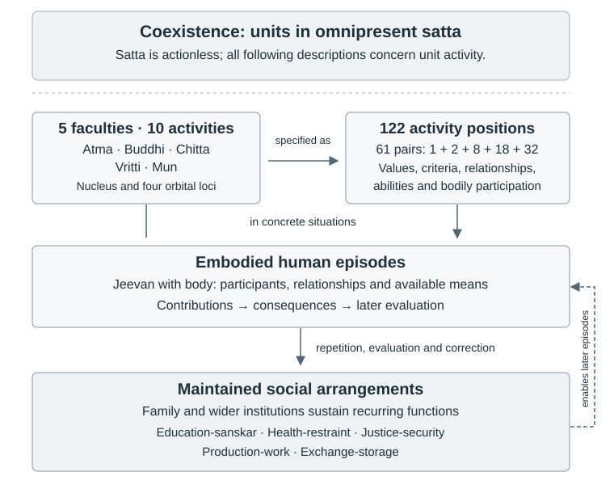
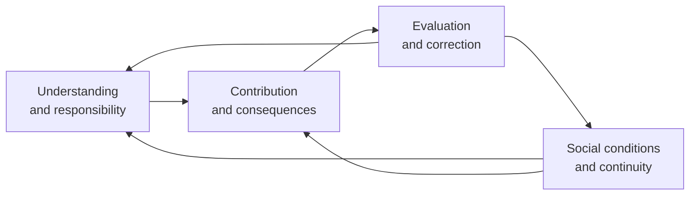

# Research Note: Jeevan Activities, Value Fulfilment, and Human Order

**Author:** Raghava Mohan Madhwapathi ([analyticmadhyasthdarshan.org](https://analyticmadhyasthdarshan.org))

**Edited on:** September 11, 2026, 6:00 AM IST

**Scope:** This companion to [*A State-Dynamic Model of Coexistence*](A-State-Dynamic-Model-Of-Coexistence.md) examines the organisation of the 122 activities of *jeevan*, their connection with the thirty values, and the conditions through which individual activity participates in durable human order. It brings the activity inventory, Epistemology, Ontology, Axiology, the five-pass social research programme, and an additional preliminary research report into a connected primary-text review. It proposes refinements to the model; it does not amend the parent study or treat a proposed formalisation as a demonstrated account of physical or social causation.

The central finding is that the inventory has several intersecting organisations: faculty and mode, value and its expression, harmony between faculties, relationship and responsibility, bodily participation, and continuity through human practice. Their connections support a more precise account of how understanding becomes conduct and how conduct is sustained socially. The most useful extension is therefore a contextual account of activity, fulfilment, evidence, and institutional maintenance. A numerical activation vector alone would discard much of the structure that makes the inventory informative.

## 1. What is being organised

### 1.1 Five faculties, ten generic activities, and 122 positions

The nucleus and four orbits supply five faculty loci. Each has a generic *bal–shakti* pair, with detailed pairs distributed as follows (AVD, pp. 91–94; MVD, pp. 78, 328–339; MSM, pp. 37–43):

| Locus | Faculty | Generic *bal* activity | Generic *shakti* activity | Detailed pairs | Entries |
|---|---|---|---|---:|---:|
| Nucleus | *Atma* | *Anubhav*, realisation | *Pramanikta*, authenticity | 1 | 2 |
| First orbit | *Buddhi* | *Bodh*, enlightenment | *Sankalp*, resolve | 2 | 4 |
| Second orbit | *Chitta* | *Chintan*, contemplation | *Chitran*, visualisation | 8 | 16 |
| Third orbit | *Vritti* | *Tulan*, deliberation | *Vishleshan*, analysis | 18 | 36 |
| Fourth orbit | *Mun* | *Asvadan*, taste | *Chayan*, selection | 32 | 64 |
| Total | | | | 61 | 122 |

These are three levels of description of one *jeevan*. The ten generic activities are not ten faculties. The 122 positions are not 122 independent faculties, nor necessarily 122 distinct words. A recurrent name can occupy several source positions, while one position can participate in more than one classification. The [Activity-Pair Inventory](../The-Epistemology-of-Coexistence/Research-Note-Activity-Pair-Inventory.md) preserves the documentary positions and their definitions; the proposed extension should retain that provenance.

The detailed entries also have different explanatory roles. Some name realisation or authenticity; some name what is understood, such as existence, form, quality, *dharma*, or truth; some name value fulfilment, relationship responsibilities, abilities, or bodily contact. Their occurrence in an activity inventory means that their defined content belongs to the functioning of *jeevan*. It does not make objective existence, a bodily effect, and a person's recognition of either the same kind of entity (MVD, pp. 328–348).

Both columns contain activities. Their source assignment is more reliable than an English impression that one term sounds inward and another outward. The pairing often connects establishment with expression, but its specific relation must be read from the definitions. Courage, *veerta*, appears in *bal*, while fortitude, *dheerta*, appears in *shakti*. An identical input–output interpretation imposed on every row would obscure such cases (AVD, p. 92; MVD, p. 338).

### 1.2 Constitutional location and functional dependence

The explicit nucleus–orbit correspondence is a positive source finding. What remains unresolved is the further identification of each named pair with one particle, or of the orbital counts with modern quantum states. The sequence 2, 8, 18, 32 agrees arithmetically with $2n^2$ for $n=1,2,3,4$. That agreement does not supply a physical derivation of the activities. The separate nucleus count of one is not obtained by setting $n=0$, which gives zero. The constitutional description, numerical analogy, and proposed physical interpretation therefore require separate arguments (MVD, p. 78; AVD, pp. 91–94).

In the conventional electron-shell count, the principal quantum number starts at one. For a given $n$, the orbital angular-momentum values are $\ell=0,\ldots,n-1$, each admitting $2\ell+1$ magnetic states. Including the two spin possibilities gives:

$$
N_n=2\sum_{\ell=0}^{n-1}(2\ell+1)=2n^2.
$$

This counts allowed electron states, not positions on a spherical boundary. The nucleus is not the $n=0$ member of that enumeration, so its separate treatment is no mathematical breakdown. Neither spherical surface area nor an assumed motionless central point establishes the inventory's counts or identifies *atma* with a physical nucleus (MIT, *Particle-Wave Duality*, transcript pp. 2–3). The orbital language can remain source-governed while its proposed physical interpretation remains open.

The important functional question is how the whole *jeevan* understands and fulfils the contents distributed across these loci. Faculty placement identifies a principal operation within the architecture. It need not assign exclusive ownership of a value or a social domain to that faculty.

### 1.3 An overview across scales

The diagram places the architecture, its detailed inventory, human episodes, and maintained social functions in one view. Coexistence is the ground presupposed throughout; it is not an earlier event producing the next layer. The horizontal arrow is a change in descriptive detail. The downward connections concern participation and continuity, while the return connection concerns the conditions of subsequent activity (§§4–5; MVD, pp. 55–56, 78, 199–205; MSM, pp. 64–65).



The five social functions draw on the whole *jeevan* in embodied, coordinated living. The diagram therefore contains no faculty-to-institution assignment and does not identify sensory or motor coupling as a nourishment/depletion mechanism. Their relation remains the contextual and evidential question developed below.

## 2. The values reveal several connected patterns

### 2.1 Thirty classification places, twenty-eight distinct named slots

The thirty-value canon comprises four *jeevan* values, six human values, nine established relationship values, nine expressed relationship values, and two values of things (PS, pp. 151, 154). Its relation to the inventory is close but not a one-to-one correspondence.

| Canonical family | Places in the canon | Directly named inventory mappings | Distinctive relation |
|---|---:|---:|---|
| *Jeevan* values | 4 | 4 | Four *bal* positions associated with interfaculty harmony |
| Human values | 6 | 6 | Five entries in *vritti*; generosity in *mun* |
| Established relationship values | 9 | 9 | Three *bal* entries each in *chitta*, *vritti*, and *mun* |
| Expressed relationship values | 9 | 9 | The corresponding nine *shakti* entries |
| Values of things | 2 | 1 | *Kala* has a named slot; usefulness has no separate headword |
| Total | 30 | 29 | Twenty-eight distinct slots because *udarta* belongs to two families |

Generosity, *udarta*, is both a human value and the expression paired with care, *mamta*, at *Mun* 2. Usefulness, *upyogita*, is not absent from the functional account merely because it lacks a separate heading. The definition of *medha* explicitly includes the joint accomplishment of usefulness and art; useful, rightly used, and purposeful representation also belongs to the account of *chitran* (MVD, p. 330; PS, pp. 71–72). A comparison restricted to exact headwords would miss this connection.

The thirty-value classification and the activity inventory are thus intersecting classifications of connected content. They are not two disjoint partitions with a bijection between their elements. The repetition of *udarta* is especially informative: an expression of care also participates in the human character through which one contributes body, mind, and wealth towards awakening, health, and prosperity (MVD, pp. 339–340).

### 2.2 The three–three–three pattern is real

The established and expressed relationship values occupy nine complete pairs. The following grouping follows inventory location; it does not introduce new tiers of relationship (AVD, pp. 91–93; MAD, reader p. 30).

| Faculty and pair | Established value, *bal* | Expressed value, *shakti* |
|---|---|---|
| *Chitta* 6 | *Prem*, love | *Ananyata*, non-otherness |
| *Chitta* 7 | *Vatsalya*, guidance | *Sahajta*, naturalness |
| *Chitta* 8 | *Shraddha*, reverence | *Pujyata*, devoutness |
| *Vritti* 8 | *Kritagyata*, gratitude | *Saumyata*, humility |
| *Vritti* 9 | *Gaurav*, glory | *Saralta*, simplicity |
| *Vritti* 10 | *Vishwas*, trust | *Saujanyata*, concordance |
| *Mun* 2 | *Mamta*, care | *Udarta*, generosity |
| *Mun* 3 | *Samman*, respect | *Sauhardta*, cordiality |
| *Mun* 4 | *Sneha*, affection | *Nishtha*, dedication |

The definitions make these placements intelligible through complementary functional emphases. In *chitta*, love concerns completeness, guidance sustains progress towards comprehensive resolution, and reverence directs movement towards awakening and complete conduct. Reverence is explicitly described as movement in which contemplation predominates. The fuller account of guidance extends through children, guardians, teachers, and succeeding generations (MVD, pp. 331–332; MSM, pp. 230–236).

In *vritti*, gratitude acknowledges assistance towards advancement, glory accepts and expresses assessed excellence, and trust fulfils values in mutuality. Gratitude and humility are explicitly connected with the joint operation of deliberation and analysis; the account of glory connects value, evaluation, and mutual satisfaction. Freedom from tension belongs to its expressed partner, *saralta*, and should not replace the definition of glory itself (MSM, pp. 130, 135–136; MVD, pp. 335–336).

In *mun*, care, respect, and affection concern accepted affinity, recognised excellence, and willing participation in just relationships. Care includes nurturing another towards awakening, and respect involves evaluation of understanding and conduct. These contents connect with tasting and selecting how one participates; they extend beyond immediate bodily care or face-to-face presence (MSM, pp. 48–51, 54; MVD, pp. 339–340).

Together these passages support a positive correspondence with contemplation and representation, deliberation and analysis, and tasting and selection. They do not derive the number three from a faculty's scope, or establish that only its assigned values require that operation. Their fulfilment remains integrated across *jeevan* (§2.4).

The equal distribution invites further interpretation, but the definitions do not establish three exclusive domains of cosmic, social, and intimate relationship. Love is relevant in immediate relationships; guidance operates in everyday education; trust is common across relationships; generosity includes assistance towards awakening as well as bodily provision. Nor does placement specify a unique vertical coupling between one row in each faculty (MVD, pp. 331, 335–336, 339–340; MAD, reader pp. 30, 43).

There are, however, explicit connections stronger than a speculative coupling matrix. Trust is the common relationship value, and love is the complete value in relation to the other established values. Love also has a definition through the combined expression of kindness, grace, and compassion. The architecture therefore contains relations of common requirement, completeness, and joint expression, in addition to the nine documentary pairs (MVD, p. 331; MAD, reader pp. 30, 43).

### 2.3 Four harmonies and the human values

The four *jeevan* values occupy successive *bal* positions associated with harmony between adjacent faculties (MVD, p. 327; MAD, reader p. 47):

| Value | Inventory position | Harmony concerned |
|---|---|---|
| *Anand*, bliss | *Buddhi* 1, *bal* | *Buddhi–atma* |
| *Santosh*, contentment | *Chitta* 5, *bal* | *Chitta–buddhi* |
| *Shanti*, peace | *Vritti* 4, *bal* | *Vritti–chitta* |
| *Sukh*, happiness | *Mun* 19, *bal* | *Mun–vritti* |

These connections give the inventory an architecture of lived coherence. Their meaning is governed by realised understanding and humane conduct; agreement among private beliefs alone is insufficient evidence of this harmony. The account connects inward fulfilment with justice in relationships, resolution in thought, and appropriate work (MAD, reader pp. 47, 51; JV, pp. 138–140).

The six human values add another cross-cutting pattern. Courage and fortitude are the two sides of *Vritti* 15; kindness is *Vritti* 4 *shakti*; grace and compassion are the two sides of *Vritti* 5; generosity is *Mun* 2 *shakti*. Thus *Vritti* 4 connects peace and kindness, while *Mun* 2 connects care and generosity. The value families intersect the pair architecture at these particular points (AVD, pp. 92–93).

A local developmental account runs through fortitude, courage, generosity, kindness, grace, and compassion, with the last three jointly related to love. This sequence crosses faculties and columns. It is evidence for a specific connection among defined activities, not a chronological ordering of all 122 entries (MSM, p. 225).

There is also a stated order of dedication, running from usefulness and need through expressed and established values to human and *jeevan* values. It clarifies how material provision serves fulfilled human living. It does not supply numerical weights or a processing sequence through faculties (MAD, reader p. 34).

### 2.4 The decisive principle: distributed fulfilment

The values are expressed and communicated through *jeevan*, with their names connected to relationship and purpose. All values are tasted in *mun*, while their direct apprehension and complete representation belong to *chitta*. Trust provides an instructive example: its inventory position is in *vritti*, yet its functioning involves representation, assessment, expression, and tasted fulfilment across the whole person (MSM, pp. 34, 43, 243).

This is the strongest answer to the organisational question. The inventory is differentiated by faculty but integrated in fulfilment. A location tells us where a named content is principally enumerated; its successful operation can depend on several faculties, embodied contributions, another person's participation, and subsequent evaluation. A model should preserve those dependencies rather than turn the table into exclusive compartments.

## 3. Why truth, dharma, and justice also appear as activities

Truth, *satya*, has an ontological reference: what is realisable across time, together with authenticity towards existence in its activity definition. *Dharma* concerns inseparable *dharana*; for human living, happiness and resolution are central to its specification. Justice, *nyaya*, concerns recognition of relationship, fulfilment of values, evaluation, and mutual satisfaction. Their activity forms belong to the understanding and conduct through which a human recognises and fulfils these contents (MVD, p. 336; PS, pp. 93–94, 178).

The distinction between reality, understood content, operative judgement, and fulfilled conduct is essential. Someone's assertion of truth does not make the asserted relation actual. An intention to act justly does not establish that the other's need was met. An internally coherent interpretation can still misrecognise the body, relationship, or consequences. Ontology fixes what the activity concerns; Epistemology examines its apprehension and knowing; Axiology concerns fulfilment and evaluation. The activity account connects these inquiries within living.

The relevant source pairs also remain distinct: *satya–dharma* is *Vritti* 11; *nyaya–samvedna* is *Vritti* 12; *samyama–niyam* is *Vritti* 14. These placements do not by themselves derive the complete sixfold governing grammar. Their definitions contribute to it together with the wider account of natural and human participation (MVD, pp. 336–337).

Similarly, knowing, believing, recognising, and fulfilling should remain a connected grammar of functioning. They cannot be assigned exclusively, one per faculty. The *buddhi* definition of existence includes knowing, believing, and accepting; justice includes recognising and fulfilling; *mun* has a recognition entry of its own. In delusion, believing without knowing remains operative. It is knowledge-grounded acceptance that has not been established as the governing basis, not the absence of belief altogether (MVD, pp. 98–100, 328–329, 336, 346; KD, p. 84).

### 3.1 Six perspectives and the four-and-a-half account

Deliberation has six perspectives: *priya*, *hita*, *labh*, *nyaya*, *dharma*, and *satya*. Their correspondence with named inventory entries can be stated precisely while retaining the distinction between an evaluative perspective and a documentary position (MVD, pp. 66–67; PS, p. 85).

| Perspective | Named inventory correspondence | Defined content relevant here |
|---|---|---|
| *Priya* | *Mun* 10, *bal*, paired with *pravrittiyan* | Sensory conduciveness relative to bodily wellness |
| *Hita* | *Mun* 9, *bal*, paired with *svasthya* | Usefulness within the bodily domain |
| *Labh* | No separately named position | Receiving more than the labour or contribution given; not a synonym for prosperity |
| *Nyaya* | *Vritti* 12, *bal*, paired with *samvedna* | Recognition, fulfilment, evaluation, and mutual satisfaction |
| *Dharma* | *Vritti* 11, *shakti*, paired with *satya* | Inseparable *dharana*, with human resolution as its contextual application |
| *Satya* | *Vritti* 11, *bal*, paired with *dharma* | Existential truth and authenticity towards reality |

The assignments follow AVD pp. 92–93 and MVD pp. 336, 342–343. They are not six separate slots or a division of the operation of deliberation among three faculties. In particular, *labh* cannot be placed at *svayatta–samriddhi* or *medha–kala* merely because those definitions concern production or usefulness. Receiving more value, goods, or services than one's contribution differs from producing beyond assessed needs. Usefulness concerns what something can fulfil, while *medha–kala* concerns its apprehension or accomplishment together with art (MVD, pp. 58, 67, 310, 330, 342).

The four-and-a-half account operates at the generic activity level: tasting and selection contribute two; analysis and visualisation contribute one each; deliberation governed by pleasantness, bodily benefit, and profit supplies the half. The contrast concerns effective functioning under sensitivity and its transformation through awakened coordination. The same account states that all ten activities continuously operate, while only four and a half are effective under sensitivity (JV, printed pp. 72–74).

This explains the half within deliberation without deriving an activation mask over the 122 positions. Awakening regulates sensory and bodily considerations through justice, resolution, and truth; it does not abolish bodily suitability or sensory participation. The regulation of *priya–hita–labh* tendencies into consonance with *nyaya–dharma–satya* provides a direct formulation of that connection (MSM, p. 49).

## 4. From activity to its social conditions

### 4.1 Fulfilment opens the architecture to the world

Care has a recipient. Guidance has a learner. Justice has a mutuality. Production has materials, bodily effort, and an assessed purpose. Nourishment has an actual body whose condition can differ from what a caregiver assumes. The relevant activity therefore cannot be adequately described by an inward condition alone. Its definition leads outward to the persons, means, consequences, and evidence required for fulfilment (MVD, pp. 330–340, 347–348; MSM, pp. 64–65, 101, 104–105).

The Epistemology dossiers make this opening explicit by asking, for each entry, about its bearer, object, counterpart, operation, completion criterion, evidence, correction, and continuity. This supplies an appropriate intermediate step between a faculty architecture and social organisation. The following diagram summarises that reconstruction. The arrows express enabling and evidential dependence, not a mandatory clocked sequence.



A repeated practice becomes socially durable when participants can learn its purpose, obtain its means, perform their contributions, evaluate its results, and correct failures across time and changes of personnel. The inference from activity to institution is conditional: if a responsibility is to be fulfilled continuously, its recurrent enabling conditions must be maintained. It does not follow that a single institution, household form, ownership arrangement, or administrative hierarchy is uniquely required.

The inventory itself contains a particularly direct bridge at *Vritti* 18, *tushti–pushti*. *Tushti* includes resolution and prosperity in family living and participation in undivided society and universal order. *Pushti* includes continuing inspection, testing, and evaluation, together with dissemination and continuity as humane tradition. Social participation and the maintenance of evidence are therefore already present within a named activity pair; they need not be imported solely from an external institutional theory (MVD, pp. 338–339).

### 4.2 The influence works in both directions

Human understanding shapes relations, work, and organisation. Social conditions also affect receptivity, learning, available skill, and opportunities for fulfilment. The conditions associated with receptivity include support for freedom from crime, injustice, attachment, and ignorance through orderliness, humane conduct, study, and inward regulation (MVD, p. 284). Education-*sanskar* and health-restraint are explicitly connected with the availability of justice, production, and exchange (MSM, p. 65).

An especially direct social sequence connects sociality with needs, experimentation and production, wealth, use and right-use, practical participation, humaneness, and renewed sociality. Here, needs include the means for value fulfilment, bodily nourishment and protection, and social participation. This supplies a primary basis for modelling a recurrent social-material cycle rather than treating institutional names as sufficient explanations of social dynamics (MVD, pp. 55–56).

This supports a feedback account. Education can improve recognition and competence; maintained provision can make a recognised responsibility practicable; just evaluation can expose error; repeated conduct can contribute to later *sanskar*. Conversely, fear can suppress evidence, deprivation can obstruct a contribution, and an arrangement can reward output while hiding harmful consequences. The last three are analytical failure possibilities to test, not automatic diagnoses of any particular institution (MVD, pp. 218, 284; Epistemology lifecycle and counterfactual notes).

Society remains a maintained arrangement among persons and their activities in material surroundings. Its institutions do not acquire an additional *atma*, and the five faculties do not become five social organs. The bridge is coordinated participation and continuity, consistent with the parent model's account of maintained forms in Appendix A.7.

## 5. Five social functions and many possible organisations

### 5.1 Distinguishing what must continue

Five dimensions of human order are explicitly proposed: education-*sanskar*, health-restraint, justice-security, production-work, and exchange-storage (JV, pp. 109–110, 140; MSM, pp. 64–65). The existing social research interprets them through five different objects whose continuity must be maintained. That interpretation clarifies their work without deriving their number from the number of faculties.

| Function | What must be maintained, in the reconstruction | Activity connections | Evidence that the function is being fulfilled |
|---|---|---|---|
| Education-*sanskar* | Understood orientation and its transmission | Articulation and memory; guidance; teacher and learner; *vidya–pragya* | Learners can explain, enact, examine, and continue the understanding |
| Health-restraint | Bodily capability for living and participation | Nourishment, protection, sensory assessment, suitable use of means | Actual bodily condition and capability, including recipients needing assistance |
| Justice-security | Fulfilled claims and responsibilities in mutuality | Recognition, trust, courage, value fulfilment and evaluation | Contributions and consequences assessed with counterpart evidence and correction |
| Production-work | Material means transformed for definite need | *Medha–kala*, aptitude, readiness, labour and prosperity | Useful output, appropriate quantity and quality, and acceptable bodily and ecological consequences |
| Exchange-storage | Access to appropriate means across persons and time | Need assessment, rightful receiving, contribution, generosity and evaluation | Access, fair assessment of contribution, usable reserves, and correction of shortages or excess |

The middle two columns combine primary definitions with the existing lifecycle reconstruction; the final column states proposed evidence requirements. Relevant anchors include education and inquiry (MVD, pp. 329, 332, 344; MSM, p. 117), usefulness and work (MVD, pp. 330, 334–335, 342), justice (MVD, pp. 311, 336), bodily contact (MVD, pp. 347–348), and exchange and labour-value assessment (MVD, pp. 260, 268–269).

Each function draws on several faculties. Each faculty participates in several functions. *Samyama*, for example, concerns regulated humane thought, behaviour, and vocation, so its presence in the inventory cannot assign it exclusively to health. Generosity contributes to provision, but does not replace the assessment, circulation, preservation, and accountability needed for exchange and storage.

### 5.2 Human activities cross these functions

The four dimensions of experience, thought, behaviour, and work answer a different question from the five social functions. They concern how humane living is expressed; the five functions concern what a human order maintains. The same educational or productive episode can involve all four dimensions. Neither classification should be forced into a partition of the other (PS, pp. 149–154; Axiology, §§1.2–1.4).

This distinction allows a comprehensive treatment of human activities without manufacturing a new faculty for every profession:

| Domain of activity | Principal intersections to examine |
|---|---|
| Scientific inquiry and technology | Learning and evidence; material transformation; bodily and ecological effects; access; accountability for use |
| Art and design | Representation and expression; usefulness and convenience; cultural transmission; contribution and evaluation |
| Care and shared household life | Relationship continuity; bodily provision; learning; allocation of effort and means; the recipient's participation |
| Governance | Public deliberation, coordination, responsibility, information, and correction across the functions |
| Ecological stewardship | Consequences of production, use, and disposal; renewal of material conditions; delayed and dispersed evidence |

These are proposed applications of the functional account. Calling science or governance cross-cutting does not establish that their organisations must be absorbed into other organisations. Conversely, the existence of a distinct scientific institute does not by itself prove a sixth basic continuity object. Functional classification and organisational design must be examined at their own levels.

### 5.3 Family, scale, and universal participation

Family provides an immediate field of sustained relationship, intergenerational learning, care, production, and provision in the primary social proposal (MVD, pp. 55–62; JV, pp. 55–60, 108–110). The functional question is what such shared living must sustain. Whether non-kin or distributed arrangements can fulfil comparable requirements is a further analytical comparison, not a claim that the primary proposal itself specifies all those alternatives.

The need for wider coordination grows when dependencies exceed one shared-living group: specialised skills, dispersed materials, wider consequences, or continuity across generations. This explains why institutions and scales can multiply without adding new faculties. It does not derive an exact number of administrative tiers.

Universality also requires attention to the person. A competent minority delivering adequate aggregate output cannot by itself establish that everyone has access to understanding, bodily means, participation, and correction. Disability, age, and dependence require suitable assistance and division of work. Universal *jeevan* architecture does not imply that every person must perform every bodily role, become a parent, or hold every institutional office. Application must preserve the relevant responsibility while examining who can perform which contribution and with what support.

## 6. Worked bridges to social practice

### 6.1 Learning that can become independent participation

A learning episode can engage articulation and memory, the learner's actual hearing, representation, deliberation, resolve, and the teacher–learner relation. In the inventory, *shruti* concerns realised articulation or expression through language; it should not be glossed simply as hearing. The inventory names *guru–pramanik* at *Mun* 13 and *shishya–jigyasu* at *Mun* 14; teacher and learner are not the two sides of one pair. *Vidya–pragya* connects learning with its intelligent expression. The appropriate evidence includes what the learner understands and can subsequently enact, not only the teacher's delivery or the learner's repetition (MVD, pp. 329, 332, 344; MSM, p. 117).

For continuity, this requires teachers, available time, accessible explanation, opportunities for practice, and correction. A school can house these conditions, but the conditions also operate in family, work, and other shared learning. The model should distinguish the contribution made by the teacher, its reception, subsequent understanding, and later performance.

An illustrative counterfactual holds lesson delivery constant while removing opportunities to question or apply it. Attendance and recall can remain high while independent understanding remains unestablished. The trace should retain that uncertainty rather than count delivery as proof of completed education.

### 6.2 Care carried through production and provision

Consider the provision of food for a dependent person. Care and generosity concern the relationship and contribution; knowledge of need and suitability informs choice; work transforms materials; exchange or storage makes them available; bodily effects provide evidence. The usefulness of the food, the caregiver's appraisal, and the recipient's actual condition are distinguishable parts of one episode (MVD, pp. 330, 339–340, 347–348; MSM, pp. 101, 104–105).

This example crosses all five functions. Education supplies understanding and skill; health provides the bodily criterion; production supplies useful means; exchange and storage maintain access; justice concerns whether responsibility and need were recognised and fulfilled. No single named value substitutes for this entire chain.

The nourishment–depletion distinction is particularly useful here, but it is a criterion of bodily effect rather than a solved physiological interface. An application would have to specify the actual body, material, quantity, duration, and consequences. Pleasant taste and good intention cannot establish adequate nourishment on their own. Equally, inability to procure an appropriate material does not establish the absence of care: the model must distinguish orientation, skill, means, contribution, and outcome.

The failure tests are correspondingly different. If suitable food exists but cannot be accessed, provision is at issue. If the provided material does not fulfil the bodily need, suitability or production may be at issue. If a recipient cannot report difficulty without penalty, evaluation is compromised. These are proposed diagnostic distinctions, not clinical guidance or a quantitative nutritional model.

### 6.3 Justice sustained under disagreement

A disagreement over work or allocation requires recognition of the actual relationship and responsibility, examination of contributions, assessment of consequences, and mutual evaluation. Trust is relevant across the relationship; courage, fortitude, and appropriate assistance can support its fulfilment. Justice is completed through the full relation among recognition, fulfilment, evaluation, and mutual satisfaction (MVD, pp. 311, 336, 338; MAD, reader pp. 30, 43).

A quiet meeting is inadequate evidence if a participant cannot disagree. For the proposed model extension, effective participation therefore includes an opportunity to affect deliberation, receive reasons, challenge an assessment, and seek correction without retaliation. These procedural criteria are analytical safeguards for observing mutuality; they are not presented as a verbatim institutional prescription from the primary texts.

The required evidence comes from more than the person who controls the assessment. Counterpart accounts, material consequences, later recurrence, and a route to correction help distinguish fulfilled agreement from concealed failure. A formal trace in which declarations of harmony remain unchanged while adverse consequences accumulate should fail the evidence test. This extends the parent's existing distinction between actual and recognised mutuality rather than introducing that distinction for the first time.

## 7. What the existing five-pass research establishes

The two social syntheses and their pilot and five-pass companions already develop much of this bridge. The useful sequence is source anatomy, activity lifecycle, overlapping spheres, durable functions, and comparative institutional arrangements. It should remain the starting point for further work.

### 7.1 Results that can be retained

The anatomy and lifecycle passes make the 122 positions available for systematic comparison. The sphere analysis reports 53 of 122 members with overlapping membership; that result agrees with the substantive finding that activities can require several environments. The durability analysis records 185 channel memberships rather than 185 different activities. The counterfactual programme supplies nineteen cases concerning family alternatives, organisational boundaries, scarcity, disability, coercion, disagreement, migration, technology, ecological delay, universality, and false positives. These are valuable distinctions and test scenarios.

Their status matters. The classifications use interpreted definitions and authored coding. The cases are analytical constructions, not observations of nineteen implemented societies. Removing faculty and institutional labels from an input table can reduce a source of bias, but cannot remove assumptions already embedded in its feature definitions.

### 7.2 Why numerical recovery does not prove a unique five-function basis

The [Pass-Four implementation](https://github.com/raghavamohan/AnalyticMadhyasthDarshan/blob/0a50f06ca389145e974b78f823b80fd71048df08/Scripts/_analyze_jeevan_pass_four.py#L473-L506) starts with five specified continuity channels. Its candidate bundles and conflict rules are also supplied in advance. In its comparison function, practical minimality requires complete coverage, no combined channels, and no channel split across nominal functions. Consequently, a bundle with five separate channels is favoured by that definition. This does not independently demonstrate that every four-function arrangement necessarily loses coverage or independent correction.

For example, under the current rules, a diagnostic bundle joining education and health while leaving justice, production, and exchange separate retains full coverage and returns true for the implementation's independent-correction flag, yet fails practical minimality solely because it combines channels. The flag checks a supplied conflict list; it does not establish actual institutional independence. This does not recommend that merger. It shows that semantic distinctness, organisational separation, coverage, and correction must be tested separately before claiming minimality.

The Pass-Five outcomes likewise encode authored judgements. The [implementation](https://github.com/raghavamohan/AnalyticMadhyasthDarshan/blob/0a50f06ca389145e974b78f823b80fd71048df08/Scripts/_validate_jeevan_pass_five.py#L481-L503) assigns the absence of a new continuity object to each case rather than discovering that result from external evidence. The present programme therefore offers a source-informed interpretation with a reproducible calculation over its assumptions. Stronger claims of exhaustive derivation, uniqueness, or empirical validation exceed what those calculations establish.

### 7.3 Feature extraction needs a robustness pass

Review of the sphere-analysis implementation identifies a further issue preceding interpretation. Its [field-segmentation routine](https://github.com/raghavamohan/AnalyticMadhyasthDarshan/blob/0a50f06ca389145e974b78f823b80fd71048df08/Scripts/_analyze_jeevan_pass_three.py#L354-L362) returns the entire normalised row when an exact marker is absent. In 101 of the 122 current rows, the exact marker `consequence:` is absent, often because the row uses `consequence and evidence:`. Features intended to describe consequences can then inherit material from other fields. Unbounded keyword matching in the [domain rules](https://github.com/raghavamohan/AnalyticMadhyasthDarshan/blob/0a50f06ca389145e974b78f823b80fd71048df08/Scripts/_analyze_jeevan_pass_three.py#L173-L216) also permits unintended substring matches: `form` can match transformation or performance, and `air` can match impairment. These are defects in feature extraction, not discoveries about the activities.

The reported clustering counts should therefore be retained as results of the current encoding, with their robustness unresolved. Before using them to support a stronger social inference, normalise the source fields explicitly, reject missing fields rather than substitute the whole row, use bounded or reviewed phrase matching, inspect the changed memberships, and recompute the affected downstream analyses. Independent recoding and sensitivity to thresholds and analytical grain should follow. The present note records these repairs as a separate research agenda; it does not silently replace the earlier results.

For implementation, recognise all field headers in a single pass so that an operation field also stops at a compound consequence/evidence header. A suitable starting recogniser for the register's semicolon-separated fields is:

```python
HEADER_RE = re.compile(
    r"(?:^|;\s*)"
    r"(?P<header>locus|operation|"
    r"consequence\s+and\s+evidence|consequence|evidence)"
    r"\s*:\s*",
    re.IGNORECASE,
)
```

Each value ends at the next recognised header span. A compound header supplies both consequence and evidence with a shared-span provenance marker; it must not silently become two independent observations. Missing fields remain explicit, and duplicate or conflicting headings require review. Topology and provenance codes should be removed from semantic field text only after being retained in their own fields. The treatment of shared spans in feature weighting must also be specified before recalculation.

The current `tagged()` function already applies `re.search` to regex patterns; it does not perform simple substring membership tests. Repairs should therefore target the problematic alternatives, preserving intentional morphology elsewhere. Examples are `r"\bforms?\b"`, `r"\bair\b"`, and `r"\borgans?\b"`. Applying `re.escape` to every existing regex would disable meaningful alternatives and stems. The same review is needed for other dictionaries and direct scans such as `locus_tokens()`.

| Repair check | Required result |
|---|---|
| Separate operation, consequence, and evidence headers | Each value ends at the next field; no whole-row substitution |
| A compound consequence-and-evidence header | The shared value is identified for both fields with common provenance |
| A missing, duplicate, or conflicting field | An explicit unresolved field or validation error |
| Transformation, informed peers, or performance | No aesthetic-form tag from the substring `form` alone |
| Impairment or organisation | No air or bodily-organ tag from those substrings alone |
| Literal form, forms, air, organ, and organs | The intended bounded term still matches |

These checks specify a repair to the extraction stage. They do not determine revised cluster memberships in advance or establish that the five-function conclusion will remain unchanged.

## 8. A compatible extension of the state-dynamic model

### 8.1 Preserve the existing account and add semantic precision

The current model already treats the inventory as active, represents five generic faculty pairs, distinguishes actual and recognised relation, and places subsequent evaluation after conduct and consequence. It also distinguishes observation from verification. The opportunity is to connect those structures more precisely with the defined contents of the 122 entries (parent study, §§7.3, 7.7, 8.3; Appendices A.8–A.9 and C).

First, maintain a fixed inventory registry outside the changing ontic state. Each source position receives an identifier consisting of faculty, pair number, and column, together with its source name, definition, variants, and provenance. A second map links concepts and canonical value families to one or more positions. This permits *udarta* to have two value-family memberships without duplicating the underlying activity slot, and permits usefulness to be linked through definitions without inventing a missing headword.

Next, represent different semantic links explicitly: documentary pairing, faculty operation, definition through other activities, common relationship requirement, harmony, developmental connection, and bodily or social dependency. Love's connection with kindness, grace, and compassion is a joint relation; three independent keyword links alone would lose that meaning. Every asserted edge should identify whether it comes from an explicit passage or a proposed synthesis.

### 8.2 Annotate occurrences, not independent activation switches

An occurrence of teaching, feeding, or evaluating can instantiate several inventory contents. Conversely, one inventory content can occur across many relationships and settings. The proposed annotation record is therefore contextual:

| Record component | Required distinction |
|---|---|
| Person, context, occurrence, and relevant entries | Constitutional capacity versus activity in this situation |
| Actual relationship and operative recognition | What the relationship requires versus what a participant believes |
| Faculty operation and understood content | The act of assessing versus the value or object assessed |
| Bodily capability, means, and counterpart conditions | Availability and applicability versus willingness |
| Intended and performed contribution | Purpose versus enacted participation |
| Actual consequences and reported consequences | What happened versus what was noticed or declared |
| Evaluation, counterevidence, and correction | A claim of fulfilment versus its present evidential standing |

This augments the parent's occurrence and later-evaluation records. It should not make one report count as independent evidence merely because several values refer to it. Nor should observer uncertainty become an ontic zero. Preserve Appendix C's four statuses: supported, contradicted, undetermined, and not assessed. Record non-applicability separately; it is neither a failed activity nor an additional degree of verification.

An explicit proposed schema can reuse the parent types. For faculty $f\in\{A,B,C,V,M\}$, let the pair bounds be $(N_A,N_B,N_C,N_V,N_M)=(1,2,8,18,32)$ and define:

$$
\mathsf{Position}=\{(f,i,c):1\leq i\leq N_f,
\ c\in\{\mathsf{bal},\mathsf{shakti}\}\}.
$$

For the human association $\eta=(j,b,H)$ and occurrence index $n$, let $y_{\eta,n}$ be the existing consequence record from Appendix A.9. The occurrence annotation and assessment schemas below are payloads of immutable records $\langle\mathsf{AnnotationID},r,\mathsf{payload}\rangle$, with a unique identifier and the log boundary $r$ at which the annotation becomes available. Its target records must exist by $r$. Recording time is distinct from the occurrence or evaluation being described: an interpretation added later cannot become evidence at an earlier index. An occurrence annotation payload can take the form:

$$
\begin{aligned}
\mathcal A_{\eta,n}=\langle
&\operatorname{ref}(y_{\eta,n}),\xi,P_{\mathrm{ref}},
C_{\mathrm{int}},C_{\mathrm{act}},\\
&M_{\mathrm{req}},M_{\mathrm{avail}},D_{\mathrm{refs}},
\mathsf{SourceRefs}\rangle .
\end{aligned}
$$

| Field | Type and interpretation |
|---|---|
| $\operatorname{ref}(y_{\eta,n})$ | Stable reference to the parent record, which already retains actual relation, operative recognition, KBRF, action, and immediate consequence |
| $\xi$ | Context identifier resolving to the participants, relevant situation, and scope of the episode; distinct from the parent's constitutional-kind map $\kappa_n$ |
| $P_{\mathrm{ref}}\subseteq\mathsf{Position}$ | Referenced or candidate inventory positions, not an observed activation mask |
| $C_{\mathrm{int}},C_{\mathrm{act}}$ | Intended-contribution specification and references or views of the enacted contributions |
| $M_{\mathrm{req}},M_{\mathrm{avail}}$ | Requirements for capability and means, and references or views of their actual availability in the situation |
| $D_{\mathrm{refs}}$ | Set of responsibility-version identifiers to which the occurrence contributes |
| $\mathsf{SourceRefs}$ | Source locations and semantic-registry references supporting the proposed interpretation |

Fields referring to the parent occurrence and situation are views, not independently writable copies. Delayed consequences receive later records linked to the earlier occurrence. They are not inserted into the immediate record as though they had already occurred or been observed at $n$.

At a later evaluation index $m>n$, retain the parent's distinct evaluation record $e_{\eta,n,m}$. Assess a proposition $p$ through a further annotation:

$$
\mathcal V_{\eta,n,m,p}=\langle
\operatorname{ref}(e_{\eta,n,m}),p,P,a,B_{p,m},v,
\mathsf{Links}\rangle ,
$$

$$
B_{p,m}\subseteq L_m,\qquad
v=\operatorname{Verify}(P,p,a,I_{\leq m})
\in\mathsf{VStatus}.
$$

Here $P$ is a nonempty evaluator set; $a$ is a nonempty selection of Appendix C's access domains; $B_{p,m}$ records the trace-derived evidence basis actually used by verification under a declared relevance rule, including relevant counterevidence; and $\mathsf{Links}$ records correction or supersession links. The basis is an audit view of verification over the available trace, not an independently chosen favourable subset. $\mathsf{VStatus}$ retains the four statuses already listed. The evaluator set and evidence identifiers provide observational provenance, separately from the primary-text provenance in $\mathsf{SourceRefs}$.

Applicability, enactment, recipient benefit, and fulfilment of a continuing responsibility are different propositions and may receive different assessments. Supported non-applicability can be represented as a supported negative applicability claim, not a fifth status. New assessments and correction links are appended; they can supersede an earlier judgement explicitly without deleting it. This retains the parent's distinction between a complete occurrence and its later evaluation.

The generic four-and-a-half account and the 122-entry account also have different grains. Neither supplies a source-derived mask in which every deluded person's higher entry is zero and every awakened person's entry is one. Partial understanding, intermittent humane conduct, limited means, and established continuity must remain distinguishable. Context-specific evidence can refine the current generic profile without turning it into a numerical measure of awakening.

### 8.3 Represent maintained functions through repeated occurrences

An institution can be represented as a maintained arrangement of participants, responsibilities, resources, records, and correction practices. Particular occurrences enact its functions. Its continuity claim concerns whether those conditions and contributions remain available over an interval, including changes in participants and means.

The next formal object to specify is a responsibility record. It identifies the bearer and affected persons, actual relation, purpose, required contribution, available capability and means, fulfilment criterion, evidence access, and correction responsibility over a relevant interval. An allocation then links that responsibility to the persons and resources maintaining it; an occurrence records its performance; later evaluation records whether the criterion was met. Separate the existence of an assignment, the capability to fulfil it, and its actual fulfilment. A policy document proves the first at most.

For a stable responsibility identifier $d$ and version $k$, a proposed record is:

$$
\begin{aligned}
\mathcal R_{d,k}=\langle
&d,k,g,\mathsf{RelationRefs},\mathsf{RequiredRoles},\\
&\mathsf{Affected},\mathsf{Purpose},F,\mathsf{MeansReq},
\mathsf{Criterion},\\
&\mathsf{CorrectionPath},W,\mathsf{Provenance}\rangle .
\end{aligned}
$$

| Field group | Type and interpretation |
|---|---|
| $d,k,g$ | Responsibility identifier, version identifier, and maintained-arrangement identifier; $g$ does not designate a new ontic unit |
| $\mathsf{RelationRefs}$ | References to the actual relationships and their trace-indexed roles on which the responsibility is based |
| $\mathsf{RequiredRoles},\mathsf{Affected}$ | Required contribution roles and references to affected persons or explicitly represented affected interests |
| $\mathsf{Purpose},F$ | Understood purpose and a nonempty subset of the five social-function labels; a responsibility can support several functions |
| $\mathsf{MeansReq}$ | Capability and resource requirements, checked against available means in the relevant situations |
| $\mathsf{Criterion}$ | A fulfilment condition on contributions and consequences over the specified scope; its truth and its verification remain distinct |
| $\mathsf{CorrectionPath}$ | Designated review roles, evidence access, and procedures for correction when the criterion is disputed or unmet |
| $W,\mathsf{Provenance}$ | Target interval or continuity horizon, with the sources and decisions establishing this version of the responsibility |

Assignments and actual contributions require separate links:

$$
\operatorname{Allocated}(\eta,\mathsf{role},d,k,I),\qquad
\operatorname{Contributes}(y_{\eta,n},d,k,\mathsf{role}).
$$

The first assigns a role to a human association over interval $I$; the second links performed activity to that responsibility version. An operative assignment requires a valid role in $\mathsf{RequiredRoles}$ and an active human association over its operative interval. A planned future assignment remains a commitment until its conditions are met. Voluntary contributions can be recorded without a prior allocation. Neither assignment nor contribution alone implies fulfilment.

Changes of personnel create new allocations, and changes to purpose, criterion, or correction arrangements create new versions with provenance. Evidence assesses responsibility through the proposition-specific records in §8.2. Where $W$ extends into the future, assessment must distinguish fulfilment over its observed portion from a commitment to maintain future fulfilment; present evidence cannot certify an unobserved future interval.

These records make institutional failure more precise. A responsibility may be unassigned, assigned without means, performed ineffectively, mis-evaluated, or repeatedly left uncorrected. A change of organisation can be assessed by whether it preserves or improves the relevant contributions and correction, rather than by whether it reproduces the same institutional names. This develops the missing social modules identified in the parent study's §§11.3 and 12.7.

This suggests extending the model at three linked levels: the person's activity and evidence record; coordinated episodes involving several persons and materials; and the maintained arrangement that makes subsequent episodes possible. The five functions classify what the arrangement sustains. The four dimensions of living describe the human participation within it. The extension should allow many-to-many mappings at each level.

As a formal design requirement, forgetting the new annotations and institutional summaries from an extended trace should recover an admissible trace of the parent model. If $T'$ is an admissible extended trace and $\pi$ forgets those additions, require:

$$
\pi(T')\in\operatorname{Traces}(\mathrm{SDM}).
$$

This is a proposed compatibility condition, not a proved theorem. It prevents an attractive inventory formalisation from silently changing the ontic ground, the body–*jeevan* distinction, the occurrence structure, or the timing of evaluation. Full trace conservativity would additionally require every admissible parent trace to admit an extension; the displayed condition alone does not establish that stronger property.

## 9. Concrete revision agenda

The following changes would improve the parent study while preserving its main architecture. They are recommendations for a subsequent revision.

| Location | Suggested refinement | Reason |
|---|---|---|
| §12.1 | Recognise the explicit nucleus–orbit faculty correspondence; retain uncertainty about particle-per-pair and quantum identification | MVD p. 78 supports the faculty mapping |
| §§7.3–7.4 | Preserve ordered source pairs and distinguish local pair meaning from the wider sixfold synthesis | A shared column does not establish a universal input–output mechanism |
| §7.8 | Describe value families and activity positions as intersecting classifications | Thirty places map through twenty-nine named mappings to twenty-eight distinct slots |
| §§7.7, 8.3; Appendix A.8 | Retain connected knowing–believing–recognising–fulfilling and add contextual refinements without an exclusive faculty assignment | Several definitions cross the proposed compartments |
| Appendix A.9 | Add inventory-linked occurrence annotations, applicability, means, counterpart evidence, and provenance | Makes the inventory useful in concrete episodes |
| Appendix C | Separate activity breadth, quality, continuity, and evidential sufficiency | Neither counting entries nor self-report establishes complete functioning |
| §12.5 | Use actual nourishment and recognised bodily suitability as a worked interface problem | Supplies a bounded criterion without claiming a solved physiological mechanism |
| §§11.3, 12.7; Appendix A.7 | Develop responsibility records and person–episode–institution continuity with feedback from social conditions | Connects individual architecture to maintained social order |

The immediate research sequence should begin with semantic and parser repair, then a small set of fully documented episodes. Education, dependent care, production with delayed consequences, and contested allocation would exercise different parts of the model. Each dossier should include a plausible success account, a counterfactual that removes a necessary condition, and a false positive that preserves favourable appearances while fulfilment fails.

Institutional comparison should then test whether distinct functions remain fulfilled under different organisational arrangements. Coverage, access, independence of correction, continuity, and person-level participation should have separate criteria. Empirical comparison can follow only after the observation protocol is specified. This order makes the model progressively more explanatory without attributing unsupported numerical precision to the primary enumeration.

## Editorial Notes

### Review of the additional preliminary report

The supplied report, *The 122 Activities of Jeevan, the 30 Values, and the State-Dynamic Model of Coexistence* (11 September 2026, unpublished research memorandum), contributed the questions about numerical organisation, value placement, and social application. The following decisions govern its incorporation here.

| Proposal in the memorandum | Assessment used in this note |
|---|---|
| The 2, 8, 18, 32 sequence proves a quantum or cosmic geometric derivation | Retain the arithmetic correspondence; a mechanism and physical identity remain unestablished |
| Every one of the thirty values is a distinct named inventory entry | Correct the count and recover usefulness through its definitional connections |
| Three values per outer faculty establish cosmic, social, and intimate tiers | Retain placement; treat exclusive scopes and vertical coupling as unsupported hypotheses |
| Sixty-one numerical coordinates measure awakening | Replace with contextual activity and evidence records; no source-derived scale is supplied |
| One active value from each tier is necessary and sufficient for relational harmony | Do not adopt: the condition can omit trust and does not establish actual fulfilment, evaluation, or mutual satisfaction |
| Nourishment/depletion solves the bodily interface | Retain a bodily evaluation criterion; leave the actual interface and measurement problem open |
| Faculties generate five societal systems | Develop many-to-many dependencies through participation and continuity; five functions are independently source-proposed |
| The present model makes the inventory passive and lacks relational evaluation | Correct the characterisation: both activity and later evaluation are already explicit |

### Source language, variants, and scope of verification

Transliterations follow the existing inventory; English glosses are aids to the defined meanings. *Indriya-sannikarsha* means sensory contact, not sensory addiction. The ordered pair is *samyama–niyam*. *Guru–pramanik* and *shishya–jigyasu* are separate pairs; *sevak–sahyogi* supplies alternative names on one side paired with *kartavya*. The generic *mun* activities are tasting and selecting; variants in English ordering do not alter the source columns.

Temperature and the six tastes require the inventory's parallel documentary treatment: repeated *poshan* in the AVD column does not make all sensory rows literally the same nourishment/depletion pair. Hearing is discussed in the surrounding primary account but is not a warrant for inserting an additional numbered row. Relationship-role definitions also require attention to whose responsibility or acceptance is being described; ambiguous English agency should be checked against the Hindi context rather than silently reversed.

The review concentrated on the complete inventory and associated definitions, value passages, the relevant Hindi psychological account, and passages on constitution, knowing, conduct, and social order across the primary works listed below. This is a cross-textual investigation of the question, not a claim to have newly reread every page of every primary volume. The empirical adequacy of the darshan's constitutional account, a modern physical identification of *jeevan*, and the predictive performance of the proposed social formalisation remain outside the findings established here.

The methodological findings in §7 concern the current versions of the Pass-Three, Pass-Four, and Pass-Five implementations cited below. Reproducibility of those computations is distinct from validity of their input coding and social interpretation. Their defects and proposed repairs should be resolved before stronger conclusions are transferred into the formal model.

## References

### Primary Madhyasth Darshan texts

- **AVD** — A. Nagraj, [*Adhyatmvad*](https://analyticmadhyasthdarshan.org/References/Madhyasth-Darshan/AVD-Adhyatmvad.docx.pdf), working English translation by Sanjeev Chopra. The tabulated faculty, orbit, column, and activity assignments, pp. 91–94 (§§1–2 and Editorial Notes).
- **MVD** — A. Nagraj, [*Madhyasth Darshan: Co-existentialism*](https://analyticmadhyasthdarshan.org/References/Madhyasth-Darshan/MVD-Madhyasth-Darshan-Coexistentialism.pdf), translated by Rakesh Gupta. Family and constitutional architecture, pp. 55–62, 78 (§§1, 5); profit and the six perspectives, pp. 58, 66–67, 310 (§3.1); believing and knowing, pp. 98–100 (§3); the body–jeevan joint form, pp. 199–205 (§1.3); action and subsequent formation, p. 218 (§4); exchange and labour-value assessment, pp. 260, 268–269 (§5); receptivity, p. 284 (§4); justice, p. 311 (§§3, 6); interfaculty harmony and complete activity definitions, pp. 327–348 (§§1–6, 8–9). Page numbers are the printed pagination of this rendering.
- **MSM** — A. Nagraj, [*Manav Sanchetnavadi Manovigyan*](../../References/Madhyasth-Darshan/MSM-manav-sanchetnavaadi-manovigyan.pdf), Hindi, 2008 OCR edition. Value expression and purpose, p. 34; activity architecture and tasting values, pp. 37–43 (§§1–2); care, respect, affection, and regulation of the perspectives, pp. 48–51, 54 (§§2.2, 3.1); social functions and their dependencies, pp. 64–65 (§§4–5); nourishment, provision, and responsibility, pp. 101, 104–105 (§§4, 6); sensory definitions and hearing, pp. 107–109 (Editorial Notes); learning and expression, p. 117 (§§5–6); gratitude, glory, and trust, pp. 130, 135–136 (§2.2); the human-value sequence and love, p. 225; guidance and contemplation-led reverence, pp. 230–236; apprehension and complete representation of values, p. 243 (§2). Printed page plus twelve gives the one-based PDF position.
- **PS** — A. Nagraj, *Paribhasha Samhita*, Hindi, third edition 2012, printed 14 January 2016; [official publications](https://originals.madhyasth.org/granth/published), [source collection](https://u.pcloud.link/publink/show?code=kZ6Gm05ZfUbbDBW8fKmKB9ejvrO6cSRnRRH7), file `15_paribhasha_sanhita_2015_ocr.pdf`. Visualisation, usefulness, and practice, pp. 71–72 (§2); comparison through the six perspectives, p. 85 (§3.1); *dharma*, pp. 93–94 (§3); values and their dimensions of expression, pp. 149–154 (§§2, 5); justice–dharma–truth in deliberation, p. 178 (§3). Printed page plus eight gives the one-based PDF position; the filename does not establish the edition date.
- **MAD** — A. Nagraj, *Manav Abhyas Darshan*, Hindi native reader: [p. 30](https://db.madhyasth.org/books/read/144/?page=30) and [p. 43](https://db.madhyasth.org/books/read/144/?page=43), relationship pairs, common trust, and complete love (§§2, 6); [p. 34](https://db.madhyasth.org/books/read/144/?page=34), order of dedication; [p. 47](https://db.madhyasth.org/books/read/144/?page=47) and [p. 51](https://db.madhyasth.org/books/read/144/?page=51), harmony and value continuity (§2). These are displayed reader pages, not PDF positions.
- **KD** — A. Nagraj, [*Manav Karm Darshan*, Hindi](../../References/Madhyasth-Darshan/KD-karm%20darshan%20v5.pdf), printed p. 84, §3.8, faculty operations over connected contents (§3); [working English rendering](../../References/Madhyasth-Darshan/KD-Karm-Darshan-English/KD-Karm-Darshan-English.pdf). The original-language passage was checked for the distinction between functional correspondence and exclusive assignment.
- **JV** — A. Nagraj, [*Jeevan Vidya: An Introduction*](https://analyticmadhyasthdarshan.org/References/Madhyasth-Darshan/JV-Jeevan-Vidya-An-Introduction.pdf), translated by Rakesh Gupta. Family and education, pp. 55–60; the ten activities and four-and-a-half effective account, pp. 72–74 (§3.1); relationships and social functions, pp. 108–110; the values of *jeevan* and dimensions of order, pp. 138–140 (§§2, 5). These are printed pages; in the cited body of this edition, the one-based PDF position is printed page plus one.

### Physics clarification

- **MIT** — Donald R. Sadoway, *Introduction to Solid State Chemistry*, MIT OpenCourseWare, Fall 2010, session 6, [*Particle-Wave Duality*](https://ocw.mit.edu/courses/3-091sc-introduction-to-solid-state-chemistry-fall-2010/pages/structure-of-the-atom/6-particle-wave-duality/), [lecture transcript](https://ocw.mit.edu/courses/3-091sc-introduction-to-solid-state-chemistry-fall-2010/9927ec108937913f79bfa65ad757a5c0_MIT3_091SCF10lec06_iPOD.pdf), PDF pp. 2–3. Quantum-number enumeration and the Pauli principle support the conventional shell-count clarification in §1.2; this source does not establish a physical identification of *jeevan*.

### Studies and research materials reviewed

- [*A State-Dynamic Model of Coexistence*](A-State-Dynamic-Model-Of-Coexistence.md), especially §§7–8, 12 and Appendices A and C; [*The Epistemology of Coexistence*](../The-Epistemology-of-Coexistence/The-Epistemology-of-Coexistence.md); [*The Ontology of Coexistence*](../The-Ontology-of-Coexistence/The-Ontology-of-Coexistence.md); [*Axiology: Value Theory*](../Axiology-Value-Theory/Axiology-Value-Theory.md), especially §§1.2–1.8 and Editorial Notes.
- [*The Sixty-One Activity Pairs of Jeevan*](../The-Epistemology-of-Coexistence/Research-Note-Activity-Pair-Inventory.md); [*Jeevan Architecture*](../The-Epistemology-of-Coexistence/Research-Note-Jeevan-Architecture.md); [*A Functional Model of Jeevan*](../The-Epistemology-of-Coexistence/Research-Note-Jeevan-Functional-Model.md).
- [*From the Activity Architecture of Jeevan to Universal Human Order*](../The-Epistemology-of-Coexistence/Research-Note-Jeevan-To-Universal-Human-Order.md) and [*Proposed External Organisation from the Activity Architecture of Jeevan*](../The-Epistemology-of-Coexistence/Research-Note-Proposed-External-Organisation-From-Jeevan-Architecture.md), the social syntheses reviewed in §§4–7.
- [Pilot dossiers](../The-Epistemology-of-Coexistence/Research-Note-Jeevan-Activity-Environment-Pilot-Dossiers.md), [Pass One: anatomy](../The-Epistemology-of-Coexistence/Research-Note-Jeevan-Activity-Anatomy-Pass-One.md), [Pass Two: lifecycle](../The-Epistemology-of-Coexistence/Research-Note-Jeevan-Activity-Lifecycle-Pass-Two.md), [Pass Three: spheres](../The-Epistemology-of-Coexistence/Research-Note-Jeevan-Activity-Spheres-Pass-Three.md), [Pass Four: durable functions](../The-Epistemology-of-Coexistence/Research-Note-Jeevan-Durable-Functions-Pass-Four.md), and [Pass Five: counterfactual validation](../The-Epistemology-of-Coexistence/Research-Note-Jeevan-Counterfactual-Validation-Pass-Five.md), with their associated data and implementation references (§§4–7).
- Methodological audit (§7): the [Pass-Three parser and feature rules](https://github.com/raghavamohan/AnalyticMadhyasthDarshan/blob/0a50f06ca389145e974b78f823b80fd71048df08/Scripts/_analyze_jeevan_pass_three.py), [Pass-Four channel and bundle comparison](https://github.com/raghavamohan/AnalyticMadhyasthDarshan/blob/0a50f06ca389145e974b78f823b80fd71048df08/Scripts/_analyze_jeevan_pass_four.py), and [Pass-Five case registration and classification](https://github.com/raghavamohan/AnalyticMadhyasthDarshan/blob/0a50f06ca389145e974b78f823b80fd71048df08/Scripts/_validate_jeevan_pass_five.py), with the corresponding data linked from the five-pass notes. Links pin the reviewed repository revision so later repairs do not erase the basis of this assessment.
- *The 122 Activities of Jeevan, the 30 Values, and the State-Dynamic Model of Coexistence*, additional unpublished preliminary research memorandum supplied for this review, 11 September 2026. Its proposed extensions are assessed in the Editorial Notes; it is not used as primary-text authority.
