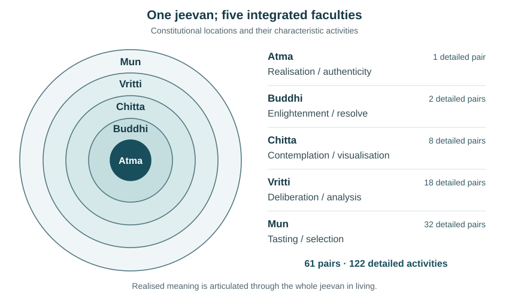

# Technical Note: Jeevan Concentric Architecture and the State-Dynamic Model

**Author:** Raghava Mohan Madhwapathi ([AnalyticMadhyasthDarshan.org](https://analyticmadhyasthdarshan.org))

**Edited on:** September 11, 2026, 8:46 AM IST

This note develops a synthesis of Shri A. Nagraj's account of *jeevan* in Madhyasth Darshan. Its starting point is the constitution and activity of the conscious unit asserted in that account: a nucleus and four orbits, five faculties, and 122 detailed activities. It asks how this concentric organisation helps explain the connections among understanding, values, bodily participation, and human order. The account is examined on its own philosophical terms; this note neither identifies *jeevan* with an atom of current physics nor presents the synthesis as physically verified.

The organising claim is that **one realised understanding becomes differentiated in representation, assessment, and participation while remaining integrated in fulfilment**. The concentric model makes these relationships intelligible: the centre concerns realisation in coexistence, and the orbital faculties articulate that understanding through resolve, contemplation, deliberation, and situated conduct. The [State-Dynamic Model of Coexistence](A-State-Dynamic-Model-Of-Coexistence.md) (**SDM**) can use this organisation to connect its general activity descriptions with particular responsibilities and their evidence. The [research companion on activities, values, and human order](Research-Note-Jeevan-Activities-Values-And-Human-Order.md) supplies the wider documentary and methodological analysis; the present note develops the concentric synthesis and its explanatory use.

## 1. The constitution and activity being modelled

### 1.1 A conscious unit in coexistence

Madhyasth Darshan holds that an atom attaining constitutional completeness becomes *jeevan*, a conscious unit whose constitution remains complete. Its nucleus is *atma*; its four successive orbits are *buddhi*, *chitta*, *vritti*, and *mun*. These are integral faculties of one unit. *Satta*, the all-pervading ground in which nature is saturated, is present throughout the unit and its constituents. Realisation in *atma* concerns coexistence: nature saturated in *Satta* (MVD, pp. 78, 89–91, 323, 328).

This gives the concentric account both a centre and an encompassing reality. The centre is the faculty through which the individual *jeevan* realises coexistence; the encompassing ground is present throughout existence. The faculties participate together in the understanding and expression of that reality. Nagraj's first-person account connects his apprehension of the nucleus and orbits with the 122 conducts and their presentation for human understanding and awakening (JV, pp. 12, 91–92, 165).

### 1.2 Five faculties and two descriptive grains

Each faculty has a generic *bal–shakti* pair. *Bal* names activity in state and *shakti* activity in motion; both are activities. The detailed inventory gives the named content of these five pairs at sixty-one positions (KD, p. 84; AVD, pp. 91–94).

| Locus | Faculty | Generic *bal* activity | Generic *shakti* activity | Detailed pairs |
|---|---|---|---|---:|
| Nucleus | *Atma* | Realisation, *anubhav* | Authenticity, *pramanikta* | 1 |
| First orbit | *Buddhi* | Enlightenment, *bodh* | Resolve, *sankalp* | 2 |
| Second orbit | *Chitta* | Contemplation, *chintan* | Visualisation, *chitran* | 8 |
| Third orbit | *Vritti* | Deliberation, *tulan* | Analysis, *vishleshan* | 18 |
| Fourth orbit | *Mun* | Tasting, *asvadan* | Selection, *chayan* | 32 |

The resulting count is:

$$
2(1+2+8+18+32)=122.
$$

The ten generic activities describe the faculties' characteristic operations. The detailed positions specify contents such as realisation, form, truth, trust, care, educational responsibility, and sensory contact. This allows the same episode to be understood at both grains: as deliberation and selection, for example, and as the fulfilment of trust, duty, or bodily care. The [Activity-Pair Inventory](../The-Epistemology-of-Coexistence/Research-Note-Activity-Pair-Inventory.md) preserves the exact rows, definitions, and source variants.

### 1.3 What concentric organisation explains

The model brings three connections into one view. First, the faculties have an ordered relation: realisation informs enlightenment, enlightenment informs contemplation, contemplation informs deliberation, and deliberation informs tasting. Second, the inventory differentiates what those activities concern. Third, fulfilment is expressed through concordance among faculties and through conduct with other units (MVD, pp. 276–277, 322–327).

Concentricity consequently serves as an organising model of grounded articulation. At each faculty, a common understanding receives a characteristic form: accepted meaning and resolve, representation, assessed judgement, and participation. Reading inward asks what gives an intention or choice its basis; reading outward asks how understood reality becomes evident in living. These relationships provide the explanatory substance of the model. The arithmetic pattern in the orbital counts is addressed separately in the Editorial Notes.

*Figure 1. Constitutional locations and functional articulation in the synthesis. Circle sizes are schematic; they encode no measured radius or quantitative capacity. Every faculty belongs to the same jeevan in coexistence.*

## 2. From realised understanding to differentiated fulfilment

### 2.1 The relation between inward orientation and outward expression

In the realisation-based account, enlightenment in *buddhi* accords with realisation in *atma*; contemplation in *chitta* accords with enlightenment; deliberation of justice, *dharma*, and truth in *vritti* accords with contemplation; and tasting in *mun* accords with deliberation. The body participates under the direction of *mun*. This is the positive connection through which the concentric architecture explains coherent conduct (MVD, pp. 276–277).

The inward orientation is also explicit. The body has its aim in *mun*, *mun* in *vritti*, *vritti* in *chitta*, *chitta* in *buddhi*, and *buddhi* in *atma*; *atma* has its aim in evidence of realisation in coexistence. Complete development connects the reception of realised meaning with creative visualisation, thoughts of *dharma*, and receptivity for just behaviour (MVD, pp. 322–323). The architecture therefore connects the question of what an action serves with the question of how understanding becomes action.

This relationship helps explain the difference between sensory preference governing thought and understanding governing sensory participation. Under the former orientation, desire and thought support the satisfaction being sought. In awakening, tasted fulfilment accords with deliberation grounded in justice, *dharma*, and truth. *Mun* can accordingly taste the fulfilment of these values in living (MVD, pp. 276–277; MSM, pp. 38, 43).

These are relations of orientation and integration within one *jeevan*. The model uses them to examine the basis and expression of conduct. The temporal course of a person's learning or a particular action remains a matter for the episode concerned.

### 2.2 Representation, assessment, and participation

The functions become clearer through their connections. *Buddhi*'s two detailed pairs concern accepted existence with steadfastness, and bliss with its continuing expression. They connect the acceptance of reality with sustained resolve. *Chitta* gives a contemplated meaning a form that can be represented: the account names form, property, count, time, expanse, effort, motion, and result among the dimensions of visualisation. Its *medha–kala* pair connects the apprehension and accomplishment of usefulness with appropriate artistic expression. A purpose can thereby become an intelligible arrangement of means and activity (MVD, pp. 327–330).

*Vritti* brings deliberation and analysis to that representation. Justice concerns recognition of relationship, fulfilment of values, evaluation, and mutual satisfaction. Trust, gratitude, glory, courage, and fortitude give named content to assessment and responsible participation. The pairs *satya–dharma*, *nyaya–samvedna*, and *samyama–niyam* retain their specific definitions within this account (MVD, pp. 335–338).

*Mun* participates through tasting and selection. Its relational entries include care, respect, affection, duty, inquiry, and educational responsibility. The definitions of generosity concern another's awakening, health, and prosperity; affection concerns willing participation in just behaviour. These give its outward participation a content extending through the purposes of human living (MVD, pp. 339–346).

The synthesis thus distinguishes operations while following their joint fulfilment. A relationship can be represented in *chitta*, assessed in *vritti*, and accepted and fulfilled through the activity of *mun*. All values are tasted in *mun*; their apprehension and representation involve *chitta*. The same value can therefore be followed across operations while retaining its particular inventory location (MSM, pp. 34, 43, 243).

### 2.3 The values as an architecture of coherence

The nine established relationship values and their nine expressions form three pairs in each of the outer three faculties (AVD, pp. 91–93; MSM, pp. 40–41).

| Faculty | Established value and its expression | Functional emphasis in this synthesis |
|---|---|---|
| *Chitta* | Love–non-otherness; guidance–naturalness; reverence–devoutness | Contemplation of completeness, advancement, and awakening |
| *Vritti* | Gratitude–humility; glory–simplicity; trust–concordance | Assessment of assistance, excellence, and fulfilled mutuality |
| *Mun* | Care–generosity; respect–cordiality; affection–dedication | Accepted relationship expressed through participation |

Love concerns completeness; guidance sustains movement towards comprehensive resolution; reverence concerns awakening and complete conduct. Gratitude acknowledges assistance, and glory involves assessed excellence. Care accepts affinity, respect accepts personality and talent, and affection participates in just behaviour. These definitions make the faculty correspondences intelligible through complementary operations (MVD, pp. 331–332, 335–336, 339–340).

The four *jeevan* values add explicit links between adjacent faculties (MVD, p. 327).

| Value | Named *bal* position | Concordance concerned |
|---|---|---|
| Bliss, *anand* | *Buddhi* 1 | *Buddhi–atma* |
| Contentment, *santosh* | *Chitta* 5 | *Chitta–buddhi* |
| Peace, *shanti* | *Vritti* 4 | *Vritti–chitta* |
| Happiness, *sukh* | *Mun* 19 | *Mun–vritti* |

Together, the two patterns explain coherence from two directions. The relationship pairs specify content to be fulfilled; the harmonies concern the accord of the faculties through which it is fulfilled. The relevant accord is grounded in realised understanding and just conduct (MVD, pp. 276–277, 327).

The six human values cross these connections. Courage and fortitude form *Vritti* 15; kindness is the expression paired with peace in *Vritti* 4; grace and compassion form *Vritti* 5; generosity is the expression paired with care in *Mun* 2. Human character consequently connects inward fulfilment, just assessment, and contribution (AVD, pp. 92–93).

The thirty-value account is completed by the two values of things: usefulness and aesthetic value. Their relation to activity is expressed through *medha–kala*: the apprehension and accomplishment of usefulness and art, and beautification consistent with usefulness. In the synthesis, material arrangements take their purpose from human fulfilment, while their actual usefulness must be recognised in relation to what they can provide (PS, pp. 71–72, 149–154; MVD, p. 330). The overlapping classifications and exact counts are recorded in the Editorial Notes.

### 2.4 Relationships, embodiment, and the breadth of Mun

The thirty-two Mun pairs give the architecture considerable detail at the point of participation. Its first twenty-two positions include relational roles and dispositions; the final ten concern sensory and work-organ activity. An analytical grouping identifies ten role-bearing positions, twelve other relational or dispositional positions, and ten sensory/work-organ positions. The role-bearing positions are M05–07, M13–16, and M20–22; the row identifiers follow the documentary inventory (AVD, pp. 92–94; MVD, pp. 339–348).

This range explains why the outward faculty concerns more than sensation. A teacher's role is paired with authentic evidence, a learner's with inquiry, and an associate's with duty. Their definitions concern education, awakening, and fulfilment of values in relationships. The particularity of the outer faculty includes who participates, what is accepted, and what responsibility is undertaken (MVD, pp. 341–342, 344).

The sensory account connects contact with the purpose of bodily health. Temperature and the six tastes are interpreted through nourishment and depletion; bearing, respiration, and responses to visible form have their own entries. These distinctions let an episode be examined in terms of both bodily consequence and the person's recognition of it (MVD, pp. 347–348). The body–*jeevan* association supplies the embodied setting in which this participation occurs (MVD, pp. 199–205).

## 3. Using the concentric model to explain an episode

### 3.1 A shared garden as an illustration

Consider a teacher and learner planning a garden that will contribute to their families' needs. This is an illustration constructed for the model. It shows how the architecture organises an inquiry into understanding and participation; it does not classify either person's degree of awakening from a single performance.

Their purpose can first be considered in relation to coexistence and mutual fulfilment. At the level of *buddhi*, the inquiry concerns what is understood and accepted, and the resolve to act accordingly. At the level of *chitta*, that purpose is represented through the land, plants, quantities, time, work, and expected result. The source's visualisation dimensions make this movement from purpose to an intelligible arrangement explicit (MVD, pp. 276–277, 327).

Deliberation and analysis examine the arrangement: whose needs it serves, whether the responsibilities and contributions are appropriate, and how its results will be assessed. Tasting and selection concern the participants' acceptance and fulfilment of their relationship, their choices of work, and their experienced participation. Guidance, inquiry, respect, trust, and duty have identifiable places in the inventory while being fulfilled through the whole activity of each person (MVD, pp. 331–332, 335–336, 339–344).

Suppose the teacher declares care but gives the learner no explanation or opportunity to question. The architecture directs inquiry towards several connections: the intended purpose of guidance, the recognition of the learner's role, the contribution actually performed, and the learner's experience. If the plans are well explained but the means are unavailable, the immediate problem is different. The model helps separate failures of understanding, representation, assessment, provision, and participation without claiming that one observation locates a defective inner faculty.

### 3.2 What the synthesis adds to the SDM

The parent SDM already treats the inventory as active content of the generic pairs (§7.3 and Editorial Notes), distinguishes actual from recognised mutuality (§2.3), and represents conduct, consequences, and later evaluation (Appendix A.9). The concentric synthesis adds a connected way to organise those existing distinctions around particular named activities.

In the garden episode, a general record of contribution can be connected with educational responsibility, inquiry, trust, or duty. The representation of a purpose can be compared with the contribution and outcome; subsequent evidence can show whether responsibilities were fulfilled and how the arrangement should change. The explanatory benefit comes from following these connections across an episode rather than treating a declared value as its successful fulfilment.

The research companion develops the broader activity and responsibility records and the radial hypothesis (§8 and Appendix H). The present note uses the source-supported order of realisation, articulation, and participation to organise their interpretation. The next section defines a compatible annotation layer for that use.

## 4. Refining the State-Dynamic Model through the activity architecture

### 4.1 A fixed inventory and contextual annotations

Let the faculty indices be $f\in\{A,B,C,V,M\}$, with pair counts $(N_A,N_B,N_C,N_V,N_M)=(1,2,8,18,32)$. Define the documentary positions:

$$
\mathsf{Position}=
\{(f,i,c):1\leq i\leq N_f,\;
c\in\{\mathsf{bal},\mathsf{shakti}\}\}.
$$

The 122 positions retain their names, definitions, pair assignments, source variants, and provenance. Preserve the parent's human orientation $z_{j,n}$ and faculty profile. Extend a bounded situation with a collection of annotations:

$$
\widehat{\mathcal Q}_n=\langle\mathcal Q_n,\mathcal D_n\rangle.
$$

Each annotation has an immutable identifier, a recording boundary $r$, and a payload. Records are appended; corrections refer to earlier records. A reference to an inventory position states what an episode is being interpreted through. It does not assert that the corresponding value was successfully fulfilled.

### 4.2 Occurrence and later assessment

For a human association $\eta=(j,b,H)$, the parent's consequence record $y_{\eta,n}$ already retains actual relation, operative recognition, conduct, and immediate consequence (Appendix A.9). An occurrence annotation links to that record and supplies the following fields.

| Field | Content |
|---|---|
| Parent occurrence and context | Reference to $y_{\eta,n}$ and the bounded context concerned |
| Relevant positions | $P_{\mathrm{ref}}\subseteq\mathsf{Position}$, with reasons for each assignment |
| Contribution | Intended contribution and contribution actually performed |
| Capability and means | What was required and what was available |
| Responsibilities | References to the relevant responsibility versions |
| Provenance | Source definitions and the testimony or observations supporting the annotation |

These references are views of the parent records. They do not create independently writable versions of the actual relationship or consequence.

Later assessment remains separate. At $m>n$, it refers to the parent's evaluation $e_{\eta,n,m}$ and identifies a proposition $p$, evaluator set $P$, relevant access selection $a$, and the evidence actually used. Verification retains the parent operation (Appendix C.2):

$$
v=\operatorname{Verify}(P,p,a,I_{\leq m}).
$$

The evaluator set and relevant access selection are nonempty. Evidence belongs to the log available at $m$ and includes relevant counterevidence. The statuses remain supported, contradicted, undetermined, and not-assessed. An annotation can only be recorded once the records it references exist; an annotation referencing the evaluation committed to the next log therefore has boundary $r\geq m+1$.

Applicability of an activity description, performance of a contribution, recipient benefit, and sustained fulfilment are separate propositions. Delayed consequences acquire later evidence and assessments rather than being written back into the original occurrence.

### 4.3 Preservation of parent traces

For this proposal, annotations describe parent traces while leaving their transition guards and permitted events unchanged. Define an enriched trace as $\widehat T=(T,D)$, where $T$ is an admissible parent trace and $D$ is any annotation sequence satisfying the typing, provenance, and availability rules above. The empty sequence is permitted.

With $\pi(\widehat T)=T$, the construction gives:

$$
\pi(\operatorname{Traces}(\widehat{\mathrm{SDM}}))
=
\operatorname{Traces}(\mathrm{SDM}).
$$

Every enriched trace projects to its parent trace, and every parent trace lifts through the empty annotation sequence. This establishes trace preservation for the defined annotation layer. Complete dossiers can be required for a particular study of episodes; such a requirement selects its evidence base. A future model making annotation contents govern transitions would require a separate preservation argument. Observation and correction by human participants continue through the parent's human-occurrence and orientation-revision relations.

### 4.4 Nourishment as a bodily evaluation criterion

The *poshan–shoshan* distinction gives bodily assessment a definite purpose: conducive contact nourishes, while deprivation or adverse contact depletes (MVD, pp. 347–348). An application can formulate propositions about a specified body, material, quantity, duration, and observed consequence.

For example, provision of food can be examined through care, generosity, relevant sensory entries, production, and access to means. The record distinguishes the intended benefit from the actual provision and subsequent bodily evidence. Pleasant taste, adequate provision, and nourishment are separately assessed claims.

This extends the description of bodily evidence in the SDM's existing interfaces (Appendix A.4). Defining a criterion of benefit does not supply the physiological mechanism or establish that benefit from the contributor's intention alone. The model keeps physical consequence and its recognition distinguishable.

### 4.5 Relational coherence across the faculties

The three–three–three distribution organises inquiry into relationship through contemplation, assessment, and participation. For an actual relation $\rho$, declare the propositions that need assessment: recognition of roles and needs, trust, appropriate contribution, counterpart experience, consequences, and mutual satisfaction. Each receives its contextual verification status.

Faculty placement helps interpret the evidence. Guidance can direct attention to the purpose and representation of learning, trust to mutual recognition and fulfilment, and care to the contribution actually made. These are connected questions about a whole relationship.

A declaration of affection accompanied by evidence of distrust prompts examination of the conflict between recognition and conduct. Selecting love, glory, and affection from the three faculties cannot substitute for assessing trust. Neither missing evidence nor one person's declaration establishes possessiveness or fulfilled harmony. Those conclusions require the relevant occurrence and counterpart evidence (SDM, Appendix A.9; MSM, pp. 43, 243).

### 4.6 Maintaining social responsibilities

The five social functions organise continuity through education–*sanskar*, justice–security, health–restraint, production–work, and exchange–storage. The source account connects individual and family participation with these arrangements (MVD, pp. 55–56; MSM, pp. 64–65). In the synthesis, each function draws on the activity of whole persons.

| Function | Examples of relevant inventory content |
|---|---|
| Education–*sanskar* | *Vidya–pragya* (V01), *shruti–smriti* (C01), *guru–pramanik* (M13), *shishya–jigyasu* (M14), guidance (C07) |
| Justice–security | *Nyaya–samvedna* (V12), *satya–dharma* (V11), trust (V10), *samyama–niyam* (V14), *veerta–dheerta* (V15) |
| Health–restraint | *Hita–svasthya* (M09), restraint (V14), and the differentiated bodily-contact entries (M23–32) |
| Production–work | *Tatparta–utsah* (V07), *medha–kala* (C02), *svayatta–samriddhi* (M08), associate–duty (M07) |
| Exchange–storage | Generosity (M02), prosperity (M08), *santosh–shree* (C05), together with assessment of needs and contributions |

These are illustrative, overlapping contributions. The five functions are a framework in the primary account; the table interprets their connections with the inventory (AVD, pp. 91–94; MVD, pp. 330–348).

A versioned responsibility record can preserve these connections across changes of personnel and resources.

| Field | What remains identifiable |
|---|---|
| Arrangement and relationships | The maintained arrangement, actual relationships, required roles, and affected persons |
| Purpose and functions | What is to be fulfilled and the social functions to which it contributes |
| Means and capability | Requirements for the responsibility to be carried out |
| Criterion and correction | How fulfilment is assessed and how a failure is addressed |
| Interval and version | Period of applicability and links to preceding or superseding versions |

Allocation links persons to roles; contribution links occurrences to responsibility versions; assessment examines fulfilment. Sustained contributions and correction supply evidence of continuity over the observed interval. This develops the parent's maintained relational orders (Appendix A.7) and its inquiry into undivided society (§11.3).

## 5. The explanatory use of the synthesis

The concentric model connects the ground of understanding with the differentiation required by living. It explains why representation, deliberation, and participation should be considered together when examining a value. It also shows how a particular responsibility can involve several faculties, bodily means, another person's activity, and repeated social arrangements.

The garden example can accordingly be followed beyond one lesson. Education sustains competence; justice concerns responsibilities and mutual fulfilment; health–restraint concerns bodily capability and appropriate use of means; production supplies what is needed; exchange–storage maintains availability across persons and times. Each function preserves conditions through which understanding can continue to become conduct. The constitutional architecture belongs to each *jeevan*, while the social arrangement connects the participation of many persons (MVD, pp. 55–56, 276–277; MSM, pp. 64–65).

The companion notes approach the SDM through different questions.

| Companion | Contribution |
|---|---|
| [MD-TOPOS](Technical-Note-MD-TOPOS-And-The-State-Dynamic-Model.md) | Assesses categorical semantics, context, and evidence ledgers for a typed SDM fragment |
| [Wolfram and EMR](Technical-Note-Wolfram-Computational-Universe-And-EMR.md) | Examines operational rewrite interpretations and their relation to SDM traces |
| [Activities, values, and human order](Research-Note-Jeevan-Activities-Values-And-Human-Order.md) | Reviews inventory definitions, value fulfilment, social dependencies, and proposed model refinements |
| This concentric synthesis | Organises the connections from realised meaning through differentiated activity to situated fulfilment |

Its practical contribution is an explanatory discipline for teaching and modelling: identify the understood purpose, its representation, its assessment, its enacted contribution, and the evidence of fulfilment. Follow how those relations are maintained or corrected. The concentric account gives that inquiry a source-grounded organisation while preserving the unity of *jeevan* and the participation of whole persons.

## Glossary

| Term | Use in this note |
|---|---|
| *Jeevan* | The constitutionally complete conscious unit in Madhyasth Darshan |
| *Atma* and *Satta* | Respectively, the nucleus/faculty of the individual *jeevan*, and the all-pervading ground in which nature is saturated |
| *Bal–shakti* | Activity in state and in motion; the two source columns |
| Realisation-based / realisation-oriented | Expression grounded in realisation, and orientation towards realisation; connected directions in the primary account |
| *Pramanikta* | Authenticity; the parent SDM also uses evidence for its generic activity |
| *Tulan*, *chitran*, *asvadan* | Deliberation, visualisation, and tasting; comparison, imaging, and taste are corresponding labels in the parent model |
| Fulfilment | Actual participation through which the relevant value is realised, examined with consequence and counterpart evidence |
| Concentric synthesis | The organisation of these connected meanings through the nucleus and four orbital faculties |

## Editorial Notes

### Numerical pattern and explanatory scope

The orbital pair counts follow $N_f=2n^2$ for orbit numbers $n=1,2,3,4$, with one separately specified central pair. This arithmetic summarises the inventory; it does not derive its named contents. An area-based interpretation would additionally require a relation between orbit number and radius, a density of counted positions, and a normalisation. Those premises are not supplied by the cited inventory passages. The research companion's Appendix H examines that further hypothesis. The present synthesis rests on the explicit constitutional assignments and the functional connections in MVD pp. 276–277 and 322–327. It does not require a surface-capacity argument.

The eight dimensions of visualisation and the eight detailed Chitta pairs are distinct enumerations. Both help explain representation; the common number does not establish a one-to-one mapping between their members.

### Inventory, value counts, and translation

The thirty canonical classification places comprise four *jeevan*, six human, eighteen established/expressed relationship, and two object values (PS, pp. 151, 154). Twenty-nine places have directly named inventory mappings. Generosity occupies one inventory slot shared by two families, giving twenty-eight distinct named slots; usefulness is connected through the definition of *medha* rather than a separate headword (MVD, p. 330). The classifications intersect.

The source ordering is *samyama–niyam*. *Sevak* and *sahyogi* are alternative names on one side of the pair with *kartavya*. Teacher–authentic evidence and learner–inquiry are two pairs. *Saujanyata* is rendered concordance, consistently with the collection's value terminology. These choices preserve the meanings needed for contextual interpretation.

AVD repeats *poshan* in the *shakti* column for temperature and six tastes; MVD defines those sensory headings through the nourishment/depletion contrast. Their documentary difference is preserved in the linked inventory. The ten/twelve/ten grouping of Mun positions in §2.4 is an analytical classification of rows, with its membership specified; it is not offered as a further primary enumeration.

### Development and model use

The inward and outward readings concern the orientation and expression of understanding. They do not assign a compulsory timetable to the 122 positions. The four-and-a-half account concerns effective generic functioning under sensitivity, while the detailed inventory presents awakened conduct (JV, pp. 72–74; MVD, p. 323). The model records evidence of particular contributions without inferring a complete awakening state from an isolated episode.

The source-informed interpretation of an episode is distinguishable from its formal representation. §4 defines an annotation layer, with a limited trace-preservation result for that layer. It proposes no automatic inference from a faculty name to successful fulfilment, and no replacement for the parent's human or bodily dynamics. The worked example and the function-to-activity table are applications of the synthesis, not examples attributed to Nagraj.

## References

### Primary Madhyasth Darshan texts

- **MVD** — A. Nagraj, [*Madhyasth Darshan — Co-existentialism*](https://analyticmadhyasthdarshan.org/References/Madhyasth-Darshan/MVD-Madhyasth-Darshan-Coexistentialism.pdf), translated by Rakesh Gupta. Constitutional locations, p. 78 (§§1.1–1.2); constitutional completeness, pp. 89–91 (§1.1); bodily association, pp. 199–205 (§2.4); realisation-based and realisation-oriented functioning, pp. 276–277 (§§1.3, 2.1, 2.3, 3.1, 5); means, aims, and integral development, pp. 322–323 (§§1.1, 1.3, 2.1 and Editorial Notes); visualisation and interfaculty harmonies, p. 327 (§§1.3, 2.2–2.3, 3.1); activity definitions, pp. 328–348 (§§1.1–1.2, 2.2–2.4, 3.1, 4.4, 4.6 and Editorial Notes); family and social functions, pp. 55–56 (§§4.6, 5). Page numbers are the printed pagination of this rendering.
- **AVD** — A. Nagraj, [*Adhyatmvad*](https://analyticmadhyasthdarshan.org/References/Madhyasth-Darshan/AVD-Adhyatmvad.docx.pdf), working English translation by Sanjeev Chopra. Faculty, column, and detailed-pair inventory, pp. 91–94 (§§1.2, 2.3–2.4, 4.1, 4.6 and Editorial Notes).
- **MSM** — A. Nagraj, [*Manav Sanchetnavadi Manovigyan*](../../References/Madhyasth-Darshan/MSM-manav-sanchetnavaadi-manovigyan.pdf), Hindi, 2008 OCR edition. Values and purpose, p. 34 (§2.2); awakened tasting and activity distribution, pp. 38–43 (§§2.1–2.3, 4.5); social functions, pp. 64–65 (§§4.6, 5); representation of values, p. 243 (§§2.2, 4.5). Printed pages correspond to PDF positions twelve higher.
- **PS** — A. Nagraj, *Paribhasha Samhita*, Hindi, third edition 2012, printing 2016; [official publications](https://originals.madhyasth.org/granth/published) and [source collection](https://u.pcloud.link/publink/show?code=kZ6Gm05ZfUbbDBW8fKmKB9ejvrO6cSRnRRH7). Visualisation and usefulness, printed pp. 71–72 (§2.3); values and their dimensions of expression, pp. 149–154 (§2.3 and Editorial Notes).
- **JV** — A. Nagraj, [*Jeevan Vidya: An Introduction*](https://analyticmadhyasthdarshan.org/References/Madhyasth-Darshan/JV-Jeevan-Vidya-An-Introduction.pdf), translated by Rakesh Gupta. First-person account of the architecture and 122 conducts, printed pp. 12, 91–92, 165 (§1.1); effective functioning under sensitivity, pp. 72–74 (Editorial Notes). PDF positions are one higher.
- **KD** — A. Nagraj, [*Manav Karm Darshan*, Hindi](../../References/Madhyasth-Darshan/KD-karm%20darshan%20v5.pdf); [working English rendering](../../References/Madhyasth-Darshan/KD-Karm-Darshan-English/KD-Karm-Darshan-English.pdf). Activity in state and motion, printed p. 84, §3.8 (§1.2).

### Related studies and companion notes

- **SDM** — [*From Unit Activity to Human Orderliness: A State-Dynamic Reconstruction of Coexistence*](A-State-Dynamic-Model-Of-Coexistence.md). Actual and recognised mutuality, §2.3 (§3.2); generic activity and its vocabulary, §7.3 and Editorial Notes (§§1.2, 3.2); maintained orders and human evaluation, Appendices A.3–A.9 (§4); verification, Appendix C.2 (§4.2); undivided society, §11.3 (§§4.6, 5).
- [*Research Note: Jeevan Activities, Value Fulfilment, and Human Order*](Research-Note-Jeevan-Activities-Values-And-Human-Order.md). Inventory and value synthesis, §§1–3 (§2); contextual records, §8 (§§3.2, 4); radial hypothesis, Appendix H (§§1.3, 3.2 and Editorial Notes).
- [*The Sixty-One Activity Pairs of Jeevan*](../The-Epistemology-of-Coexistence/Research-Note-Activity-Pair-Inventory.md). Documentary rows, definitions, and variants, §§4–8 (§§1.2, 2.4, 4.6 and Editorial Notes).
- [*Axiology: Value Theory*](../Axiology-Value-Theory/Axiology-Value-Theory.md). The thirty-value canon and its expression, §§1.2–1.3 (§2.3 and Editorial Notes).
- [*Technical Note: MD-TOPOS and the State-Dynamic Model of Coexistence*](Technical-Note-MD-TOPOS-And-The-State-Dynamic-Model.md). Typed semantics and evidence ledgers, §§5–8 (§5).
- [*Technical Note: EMR and Wolfram's Computational Universe*](Technical-Note-Wolfram-Computational-Universe-And-EMR.md). Operational scope and adoption decision, §§9–10 (§5).
