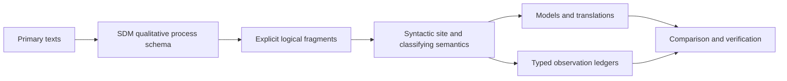

# Technical Note: MD-TOPOS and the State-Dynamic Model of Coexistence

**Author:** Raghava Mohan Madhwapathi ([AnalyticMadhyasthDarshan.org](https://analyticmadhyasthdarshan.org))

**Edited on:** August 30, 2026, 2:52 AM IST

**Status:** Internal technical note; not a catalog entry. Prepared as a semantic extension note for *[From Unit Activity to Human Orderliness](A-State-Dynamic-Model-Of-Coexistence.pdf)*.

**Scope.** This note reviews Balmukund Meena's *Minimal Decidable Site for the Madhyasth-Darshan Classifying Topos via Single-Flag Morleyisation* (**MD-TOPOS**) to determine what role its categorical architecture can play in the State-Dynamic Model of Coexistence (**SDM**). MD-TOPOS is treated as a secondary formal proposal, not as a primary source for Madhyasth Darshan. Its construction is assessed against the typed distinctions and claim boundaries already present in the SDM.

MD-TOPOS should not replace the SDM's ontology or its occurrence dynamics. Its defensible role is downstream: it can motivate a **classifying semantics for explicitly selected fragments of the SDM**, so that different models, translations, observation interfaces, and contexts can be compared without being mistaken for the primary theory. The present 26+1 predicate construction cannot be imported unchanged. Its single-sorted vocabulary erases distinctions on which the SDM depends, and several of its claims of conservativity, atomicity, and modal complement preservation require repair.

The proposed division of labour is:

This order matters. The texts constrain the reconstruction; the SDM types the reconstruction; categorical semantics then classifies models of a stated fragment. A finite ledger is an interface over those models, not an exhaustive inventory of what exists.

## 1. The two formalisms answer different questions

The SDM is a qualitative process reconstruction. It distinguishes standing ontological context, a bounded situation, one complete occurrence, structural events applied at a boundary, and later trace assessment. Its candidate-state recurrence

$$
\mathcal Q_n
\xrightarrow{\operatorname{Occur}(A_n)}
\widetilde{\mathcal Q}_{n+1}
\xrightarrow{\operatorname{Apply}(\Lambda_n)}
\mathcal Q_{n+1}
$$

states how these descriptive registers depend on one another. The schema keeps *satta* distinct from units, ontic units distinct from body–*jeevan* associations, structural closure distinct from maintained human arrangements, an occurrence distinct from its later evaluation, and a source claim distinct from a proposed operational test. It does not claim to be a quantitative evolution law or a proof that the reconstructed entities exist.

MD-TOPOS asks a semantic question. Given a formal vocabulary and geometric or coherent axioms, can one construct a site whose sheaf topos classifies models of the resulting theory? It further asks whether selected observables can be decidable while the ambient logic remains intuitionistic, and whether context-sensitive operators can be represented by subtoposes or Lawvere–Tierney nuclei. These are valuable questions, but they arise only after the vocabulary, types, and axioms have been justified.

The relation is therefore not a merger of two competing kernels. The SDM supplies the content to be formalised; a repaired MD-TOPOS programme may supply a semantic environment in which formal fragments of that content can be compared.

## 2. What MD-TOPOS genuinely contributes

### 2.1 Theory is not one implementation

A classifying topos, when it exists for a stated theory, represents its models in varying Grothendieck toposes and the structure-preserving maps among them. This is useful for the SDM because the same qualitative commitments may admit several presentations: a relational structure, a graph implementation, a trace database, or a contextual sheaf model. The semantic question becomes whether these are models of the same fragment, reducts or extensions of it, or genuinely different theories.

The distinction would prevent a data schema or simulator from silently becoming the ontology. It would also make every claimed equivalence between two presentations a proof obligation rather than an assertion based on similar terminology.

### 2.2 Constructive theory can have scoped decidable observations

MD-TOPOS rightly resists the assumption that the entire philosophical theory must be Boolean merely because a software interface needs yes/no queries. The SDM can adopt that principle. A finite observation ledger may be made decidable for a specified model class while the underlying theory retains partial information, open questions, and context-sensitive evidence.

Decidability must remain local and typed. A material closure ledger may ask whether a candidate whole is constituted, persists, or has disintegrated. A human trace ledger may ask whether a relationship was recognised, a value was fulfilled, or a later assessment contradicted an earlier judgement. These are different ledgers over different sorts and evidence conditions. Neither is a list of ontological atoms.

### 2.3 Sites make coverage and translation explicit

A syntactic site forces the formaliser to declare which formulas and arrows generate the presentation and which families count as covers. That discipline would improve the SDM's next formal stage. It requires a coverage audit, a minimality audit, and explicit tracking of every definitional extension. It also makes countermodels useful: if a proposed axiom is not derivable, a model satisfying the earlier theory and violating the new axiom exposes the gap.

### 2.4 Context change may be represented formally

The SDM distinguishes ontological, structural, sentient, epistemic, and trace-level questions. Categorical semantics can represent some changes of context through reducts, expansions, slices, or subtoposes. This offers a disciplined way to compare what is visible in a material description, a body–*jeevan* association, a human conduct trace, or an organisational record.

The value is conditional. A nucleus or modality must be constructed and its preservation properties proved. Naming five operators after faculties or values does not establish their mathematical behaviour or their philosophical adequacy.

## 3. Why the published 26+1 construction cannot be imported

### 3.1 The vocabulary is single-sorted and extensionally flat

MD-TOPOS uses one sort of “world-points” and 26 unary predicates grouped as six Walls, six Virtues, four Responsibilities, five Scales, and five nested Shells, together with the predicate `Rwalls`. This collapses distinctions among bearer, faculty, activity, quality, responsibility, association scale, institutional role, and observational status. The SDM cannot express its central relations in that form without losing their types.

The primary texts support narrower claims than the flattened ledger suggests. They distinguish a unit's state and motion and its form, property, essential nature, and *dharma* (MVD, p. 47; SB, pp. 248–257). They distinguish a constitutionally complete *jeevan* from the body through which animal or human activity is expressed (JV, p. 59). These passages do not license the mutual exclusivity of virtues, responsibilities, scales, or faculties as unary states of one underlying point.

### 3.2 The claimed Morleyisation changes the theory

In the base theory, the Wall predicates cover every point, while Wall exclusivity is deliberately absent. The later theory adds `Rwalls` as a name for the Wall disjunction **and** adds pairwise Wall exclusivity as Axiom A2*. Naming an existing formula is a definitional extension; imposing a new exclusivity axiom is not. A model of the base theory in which two Wall predicates overlap has no expansion satisfying A2*. The forgetful functor from models of the later theory to models of the base theory therefore cannot be an equivalence on the axioms printed in the paper (MD-TOPOS §§3–5, Proposition 4.5).

The syntactic rewrite also deletes the original Wall-cover axiom and later speaks of a resolved context satisfying `not Rwalls`. Under the original cover, `Rwalls` names a predicate true of every point, so its complement cannot describe an inhabited conservative subtheory. A repaired construction must decide which theory is intended and must not describe a strengthening or alteration as a definitional extension.

### 3.3 The predicates do not form 27 independent atoms

The paper calls the 26 geometric predicates plus `Rwalls` atoms of a finite Boolean ledger. Its own axioms, however, make the Shell predicates nested and allow predicates from different families to co-hold. Nested predicates are not disjoint atoms, and cross-family intersections create further cells. `Rwalls` is definitionally the union of the Wall predicates, so it is not an independent twenty-seventh atom.

A usable ledger must be generated from the cells of a declared partition or from explicitly decidable propositions. Its size and minimality must be calculated after the relations among generators are imposed. The number of names in a signature does not determine the number of Boolean atoms.

### 3.4 Modal Transparency is not established for arbitrary nuclei

The modal proof uses preservation of finite meets and disjoint coproducts to conclude preservation of complements. A Lawvere–Tierney nucleus preserves truth and finite meets, but an arbitrary nucleus need not preserve falsehood, joins, or complements. The proof's step from an empty intersection to an empty intersection after closure therefore needs additional hypotheses; so does the claim that the chosen operators preserve the proposed ledger algebra (MD-TOPOS §8).

For the SDM, modalities should be deferred until each operator is defined on a typed semantic fragment and the needed preservation theorem is proved. If the application needs Boolean behaviour, that behaviour should be stated as a property of the selected ledger and operator, not attributed to all nuclei.

### 3.5 The World-Family layer is an added structure

MD-TOPOS separately assumes ten disjoint tier flags and an election relation, then assigns social and knowledge roles to them. Later tier formulas are nested or dependent, so they do not automatically satisfy the earlier disjointness condition, and their inhabitation is not proved from the minimal site. More importantly, the institutional hierarchy is not derived from the 26+1 vocabulary.

The SDM should treat family, work, organisation, and wider social participation as maintained relational orders among persons, relationships, roles, material means, and consequences. No categorical encoding may turn an organisation into a higher ontic unit or attribute a collective *jeevan* to it. A World-Family module, if pursued, must be a separately sourced and typed social theory built after the human-conduct fragment.

## 4. The role of MD-TOPOS in the new SDM formulation

MD-TOPOS can play four bounded roles.

| SDM need | Categorical contribution | Boundary |
|---|---|---|
| Compare different formal implementations | A classifying semantics for a stated fragment | Does not prove the fragment's ontology or empirical truth |
| Keep formal modules connected without flattening them | Many-sorted signatures, reducts, extensions, and geometric morphisms | Does not license an untyped universal ledger |
| Support machine-checkable observation interfaces | Finite decidable ledgers over typed models | A ledger is derived and purpose-specific, not exhaustive |
| Represent restricted contexts or available evidence | Slices, subtoposes, or proved modal operators | Context operators require construction and preservation proofs |

This places categorical semantics after the SDM's qualitative schema and before concrete software or simulation. It is a semantic extension of the model, not another appendix of process equations.

## 5. A typed semantic signature for the SDM

The first categorical reconstruction should be many-sorted. The exact signature remains a design task, but its minimum distinctions are already visible.

| Sort or family | Intended role |
|---|---|
| `Ground` | The formal place-holder for state-complete *satta*, kept outside the unit sort |
| `Unit`, `Kind`, `Order` | Ontic units and their typed constitutional or order profiles |
| `Body`, `Jeevan` | The two relata of animal or human association |
| `AssociationScope` | A derived scope for a body–*jeevan* association, not a third unit |
| `Relationship`, `MaintainedOrder` | Actual human relations and bounded arrangements among persons |
| `Occurrence`, `StructuralEvent` | Complete effort–motion–result and compatible boundary changes |
| `TraceRecord`, `VerificationStatus` | Later consequence, assessment, provenance, and operational status |

Relations should include saturation, actual mutuality, containment, body–*jeevan* association, participation in an occurrence, recognition, fulfilment, candidate closure, event compatibility, consequence retention, and later verification. Functions or functional relations for form, result, accepted orientation, and order profile should be introduced only where their totality and uniqueness are justified.

The full Appendix A schema is not automatically a coherent theory. It uses finite sets, partial functions, non-emptiness, uniqueness, acyclicity, temporal inequalities, undefinedness, and invariants. Some of these can be expressed geometrically after retyping; some require a regular, coherent, first-order, or external metalanguage; some should remain properties of a chosen implementation. The classifying object must therefore be built fragment by fragment rather than claimed for the whole schema at once.

## 6. Recommended first formal fragment

The first pilot should be the material structural-closure fragment. It is small enough to expose the semantic method and central enough to test the SDM's distinction between a mixture, a closed containing activity, and later disintegration.

The fragment should type units, actual mutuality, occurrences, candidate wholes, containment, closure events, and positive outcome tags such as `Closed`, `Nonclosing`, and `Disintegrated`. It should represent `ConstructClosure` as an event whose guards are explicit. It should not encode failure merely as classical negation, assume that every candidate has a decided outcome, or treat closure as evidence for T1.

Three model families would make the pilot substantive:

1. A relational model that interprets only the declared sorts and relations.
2. A graph/state implementation corresponding to the relevant part of Appendix A.
3. A contextual or sheaf model in which locally available observations can be glued when compatible.

The first success criterion is not a large categorical object. It is a proved relationship among these three presentations: which theory each satisfies, which information a translation forgets, and whether any claimed equivalence is conservative.

Body–*jeevan* association should form a second module. Human occurrence, faculty dependence, conduct, and trace assessment should follow later because they combine first-person claims, public consequences, temporal evaluation, and multiple access domains. The social module should follow the human module and preserve persons as agents.

## 7. Observation ledgers and context operators

The SDM needs several small ledgers rather than one universal 27-item ledger.

| Ledger | Example questions | Required type boundary |
|---|---|---|
| Material closure | Was a candidate whole constituted, retained, or disintegrated? | Unit, occurrence, and structural event |
| Association | Is a body–*jeevan* association active, separated, or unresolved? | Body, *jeevan*, and association scope |
| Human conduct | Was a relationship recognised and was its value fulfilled? | Person, relationship, occurrence, and consequence |
| Trace verification | Is a claim supported, contradicted, unresolved, or not yet tested in this domain? | Trace record, claim kind, access domain, and status |
| Provenance | Is the statement textual, translational, reconstructed, bounded, operational, or empirically open? | Proposition and claim kind |

Each ledger requires a coverage statement, a disjointness or overlap statement, and a rule for unknown or unavailable information. A decidability proof must identify the model class in which it holds. Cross-ledger conjunctions remain possible without pretending that all entries are atoms of one partition.

Context operators should be introduced only after the ledgers are stable. Candidate operators include restriction to a bounded situation, projection from a body–*jeevan* association to its bodily or sentient relatum, restriction of a trace to an access domain, and forgetting proposed operational annotations to recover the qualitative process theory. These maps have direct semantic meanings. Faculty names, value names, or World-Family tiers should not be used as modal operators until a corresponding construction is specified.

## 8. Proof obligations

A credible SDM classifying-semantics programme should satisfy the following obligations before it inherits any of MD-TOPOS's stronger vocabulary.

| Obligation | Required demonstration |
|---|---|
| Source boundary | Every non-logical axiom is tagged as textual, translational, reconstructed, bounded, operational, or open |
| Type safety | No bearer, activity, relation, evidence record, or context is represented as another without an explicit map |
| Conservativity | Every alleged definitional extension admits unique expansion of every prior model, or is labelled a strengthening |
| Coverage | The site generators and covers represent the intended fragment and no more |
| Minimality | Removal tests or countermodels show that each generator or axiom is needed for the stated result |
| Decidability | The propositions, equality relation, model class, and proof of decidability are all specified |
| Modal preservation | Every operator is constructed and the exact meets, joins, falsehood, or complements it preserves are proved |
| Model adequacy | At least one nontrivial model and one discriminating countermodel are exhibited |
| Presentation comparison | Claimed equivalences are established by functors and proof obligations, not vocabulary matching |
| Empirical modesty | Classification of models is not presented as verification of the darshan's ontological claims |

These obligations are more valuable to the SDM than the number 27. They turn MD-TOPOS from a proposed finished foundation into a source of formal questions and audit methods.

## 9. Adoption decision

| MD-TOPOS component | Decision for the SDM | Reason |
|---|---|---|
| Classifying-topos programme | Adopt for explicit fragments | Separates theory from its models and implementations |
| Coherent syntactic site | Adopt after a fragment is typed | Makes coverage and translation inspectable |
| Intuitionistic ambient logic | Adopt as the default stance | Preserves partial and contextual information |
| Scoped decidable ledgers | Adopt with separate proofs | Supports computation without global Booleanisation |
| Single sort of world-points | Reject | Erases the SDM's bearer, relation, event, and evidence types |
| Fixed 26+1 inventory | Reject | Neither exhaustive nor an atomic Boolean partition |
| Published single-flag conservativity claim | Reject as proved | A2* strengthens the printed base theory |
| Five named nuclei and Modal Transparency | Defer | Operators and preservation hypotheses are not established |
| Ten-tier World-Family derivation | Reject as a consequence of the site | The social structure is added separately and must be sourced and typed |

## 10. Conclusion

MD-TOPOS offers the SDM a research direction, not a ready-made foundation. Its strongest contribution is the insistence that a formal philosophical theory should have an explicit language, a category of models, audited translations, scoped decidable observations, and disciplined changes of context. The SDM can use that architecture once its own typed distinctions determine the signature.

The first implementation should construct a classifying semantics for the material structural-closure fragment and compare relational, graph/state, and contextual models. Observation ledgers should be derived from that typed theory. Body–*jeevan*, human conduct, trace verification, and social order should be added as separate modules with their own evidence and logical requirements. This path retains the ambition of MD-TOPOS while avoiding its flattening of the darshan into 27 names and its unproved claims of conservative Boolean and modal structure.

## Editorial Notes

### Relation to the retired first-principles formulation

An earlier internal note examined MD-TOPOS against *Coexistence From First Principles*. The present note does not carry that kernel forward. It replaces its symbols and generative assumptions with the SDM's current distinctions: $\mathbb S$, $\mathcal Q_n$, ontic units, actual mutuality, complete occurrences, structural events, body–*jeevan* associations, maintained relational orders, and later trace verification. The reusable conclusion is architectural: categorical semantics belongs downstream of a source-bounded typed process theory.

### Mathematical status of this note

This is a design and audit note, not a construction of a classifying topos. It identifies candidate fragments and proof obligations. No equivalence, decidability theorem, nucleus, or modal preservation result is asserted for the SDM until the relevant theory, site, and model maps have been written and checked.

## References

### Paper under review

- **MD-TOPOS** — Meena, Balmukund. [*Minimal Decidable Site for the Madhyasth-Darshan Classifying Topos via Single-Flag Morleyisation*](../../References/Applied-Studies/MD_TOPOS.pdf). Version of record, DOI 10.5281/zenodo.16786431. Reviewed: signature and 26+1 ledger (§2); base axioms, Morleyisation, and conservativity claim (§§3–5); site and comparison claim (§§6–7); modal transparency (§8); World-Family layer (§9 and appendices).

### State-dynamic reconstruction

- **SDM** — [*From Unit Activity to Human Orderliness: A State-Dynamic Reconstruction of Coexistence*](A-State-Dynamic-Model-Of-Coexistence.pdf). Used: process and claim boundaries (§12 and Appendices A–C); source-status audit (Editorial Notes).

### Primary Madhyasth Darshan texts

- **MVD** — Nagraj, A. [*Madhyasth Darshan — Co-existentialism*](../../References/Madhyasth-Darshan/MVD-Madhyasth-Darshan-Coexistentialism.pdf). English translation by Rakesh Gupta. Cited: state and motion, *guna*, *svabhav*, and *dharma* as aspects of a unit and as evident in mutuality (p. 47; §3.1).
- **SB** — Nagraj, A. [*Samadhanatmak Bhautikvad* (*Resolution Centred Materialism*)](../../References/Madhyasth-Darshan/SB-Samadhanatmak-Bhautikvad.pdf). English translation by Rakesh Gupta. Cited: units as state and motion and the inseparability of form, property, essential nature, and *dharma* from the bearer (pp. 248–257; §3.1).
- **JV** — Nagraj, A. [*Jeevan Vidya: An Introduction*](../../References/Madhyasth-Darshan/JV-Jeevan-Vidya-An-Introduction.pdf). English translation by Rakesh Gupta. Cited: the human body as an evolved formation for evidencing understanding and the necessity of body–*jeevan* association for human activity (p. 59; §3.1).
