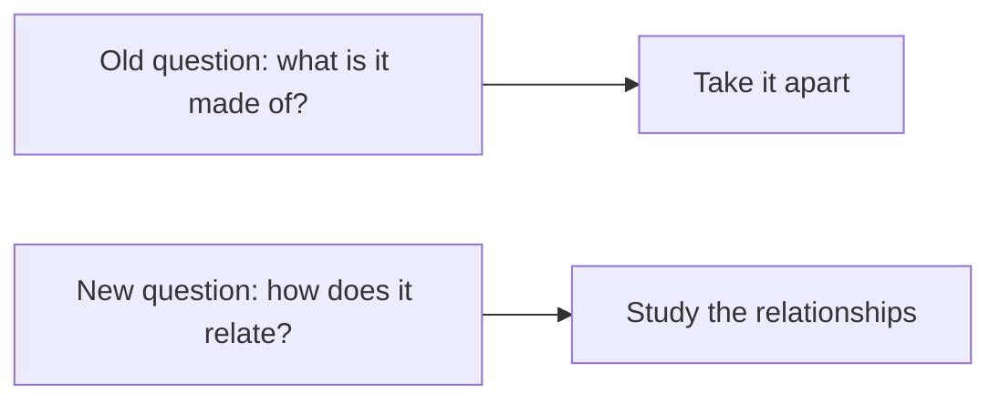
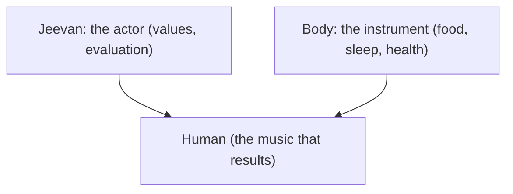
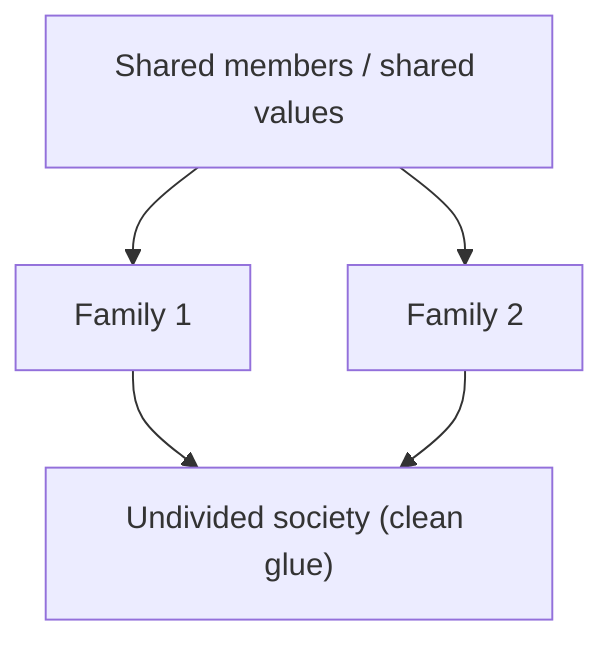
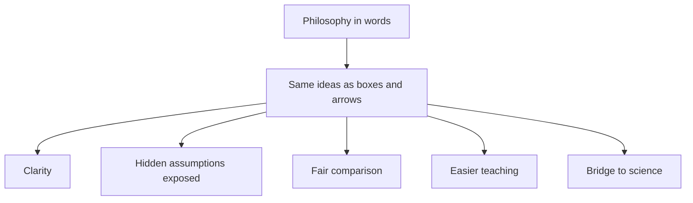
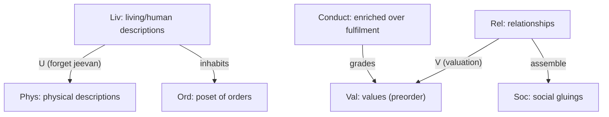
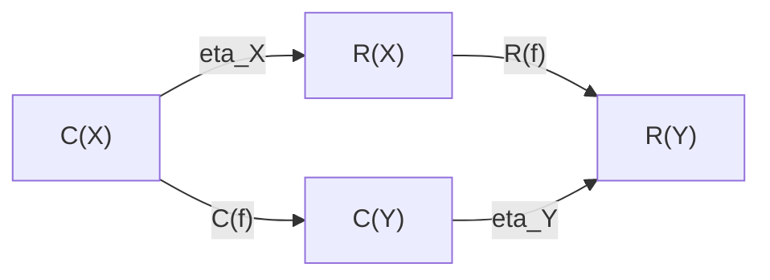
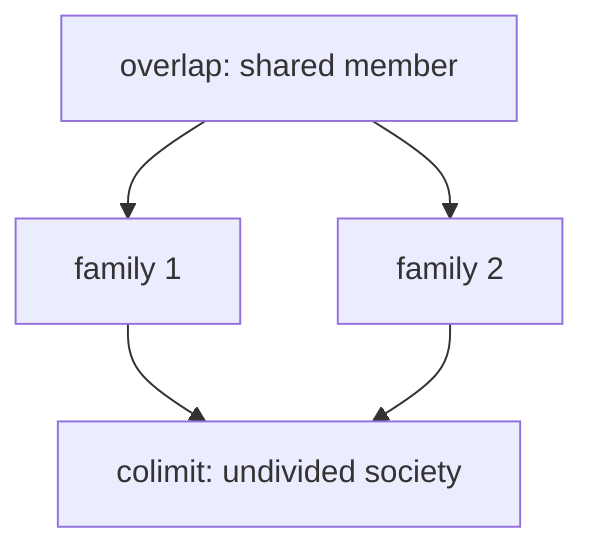

# Category Theory Explained — A Complete Guide

**Author:** [AnalyticMadhyasthDarshan.org](https://github.com/raghavamohan/AnalyticMadhyasthDarshan) — a group of people studying Madhyasth Darshan philosophy. Source repository: [raghavamohan/AnalyticMadhyasthDarshan](https://github.com/raghavamohan/AnalyticMadhyasthDarshan).

## Who this is for

This is a single, self-contained guide to describing Shri A. Nagraj's Madhyasth Darshan using a branch of mathematics called **category theory**. It is written so that a reader with **no mathematical background** can follow Parts 1 to 5, while Part 6 gives the **complete, rigorous formal theory** for readers who want the precise version. Nothing is assumed: every technical idea is introduced in plain language first.

The source ideas come from the workspace summaries [*Why Humans Are Not Just Material*](Why-Humans-Are-Not-Just-Material.pdf) and [*Human Behaviour and Society*](Human-Behavior-And-Society.pdf), which in turn draw on [*Madhyasth Darshan - Co-existentialism* (MVD)](../References/Madhyasth-Darshan/MVD-Madhyasth-Darshan-Coexistentialism.pdf), [*Samadhanatmak Bhautikvad / Resolution Centred Materialism* (SB)](../References/Madhyasth-Darshan/SB-Samadhanatmak-Bhautikvad.pdf), and [*Jeevan Vidya: An Introduction* (JV)](../References/Madhyasth-Darshan/JV-Jeevan-Vidya-An-Introduction.pdf).

A note on honesty, stated once and meant throughout: category theory here is a **lens for clarity**, not a proof machine. It makes the philosophy's logic visible and shows exactly what each conclusion depends on. It does not prove the metaphysics, and it cannot supply empirical evidence.

---

## The one big idea (read this even if you read nothing else)

Category theory is built on a single shift in attention:

> **Stop asking only "what is each thing made of?" and start asking "how does each thing relate to everything else?"**

Most of modern science explains things by **breaking them into parts** (cells, molecules, atoms, particles). Category theory instead studies the **arrows between things** � the relationships, the flows, the transformations � and treats those relationships as the real subject matter.

This is why it fits Madhyasth Darshan so naturally. The darshan's core claim is that **existence is coexistence**: nothing is fully understood in isolation; a thing's meaning comes from how it lives in relationship with everything else. That is almost exactly the attitude of category theory, expressed in philosophy instead of mathematics.



---

## Part 1: The four basic words

Category theory has only a few core ideas. Here they are in plain language.

### 1. Objects = the "things"

An **object** is just a thing you want to talk about. It can be concrete (a body, a family) or abstract (justice, resolution, fulfilment). In a diagram, objects are the labelled boxes.

> Everyday picture: the dots on a map (cities).

### 2. Morphisms (arrows) = the "relationships"

A **morphism**, usually drawn as an arrow, is a relationship or a way of getting from one thing to another. It might mean "supports", "develops into", "understands", "uses rightly", or "fulfils".

> Everyday picture: the roads between cities on the map. The roads, not the cities, are what category theory cares about most.

### 3. Composition = "chaining relationships"

If there is an arrow from A to B, and another from B to C, then there is a combined arrow from A to C. This is **composition** � following one relationship by another.

> Everyday picture: if there's a road from Delhi to Bhopal, and one from Bhopal to Amarkantak, then there is a route from Delhi to Amarkantak. You can chain them.

In the darshan this shows up as:

```text
Understanding -> Resolution -> Humane conduct -> Social order
```

Chaining these gives the shortcut "Understanding leads (eventually) to social order." The claim that the chain holds together is the interesting part.

### 4. Identity = "staying yourself"

Every object has a trivial "do nothing" arrow to itself, called the **identity**. It sounds empty, but it lets us ask a sharp question later: *has a person actually changed, or only stayed the same while looking different?*

> Everyday picture: staying in the same city.

That is the entire foundation. Boxes, arrows, chaining arrows, and a do-nothing arrow. Everything else is built from these.

---

## Part 2: A few more tools, each in one breath

These are the slightly fancier tools the formal theory uses. Each is given here as a plain idea plus how the darshan uses it. You do not need to memorise them; refer back as they appear.

| Tool | Plain-language meaning | Everyday analogy | How Madhyasth Darshan uses it |
|------|------------------------|------------------|-------------------------------|
| **Functor** | A faithful translation from one world of things-and-arrows to another that keeps the structure intact | Translating a recipe to another language so the steps still work | Turning relationships into the values they should fulfil |
| **Forgetful functor** | A translation that deliberately throws away some information | Photocopying a colour photo in black and white | Describing a human using only physics, dropping values and `jeevan` |
| **Natural transformation** | A consistent, across-the-board upgrade from one way of doing things to another | Upgrading every road on the map to a highway, uniformly | Shifting from "consumption" to "right-use" everywhere at once |
| **Retract** | A part that sits inside a whole, where the whole cannot be rebuilt from the part alone | A thumbnail made from a photo: you can shrink, but not un-shrink | Comfort is a real part of fulfilment, but not the whole of it |
| **Colimit (gluing)** | Joining many small pieces into one big consistent whole, along what they share | Gluing map tiles into one map where the edges match | Families joining into one undivided society |
| **Enrichment** | Recording not just "is there a relationship" but "of what quality/grade" | A road map that also marks each road's quality | Distinguishing momentary, lasting, and permanent satisfaction |

---

## Part 3: The philosophy, redrawn as a map

### 3.1 The four orders as a ladder

Madhyasth Darshan says nature has four orders, each containing the ones below it:


The arrows point one way for a reason. A human contains and depends on the material, plant, and animal levels � but you **cannot go backwards** and rebuild human knowing out of pure chemistry. In category-theory language this one-directional ladder (a "partial order") is the cleanest way to say:

> Higher includes lower, but higher is not reducible to lower.

Notice the formalism does not *prove* this; it *records* it cleanly, so the claim is explicit and cannot be smuggled in or out unnoticed.

### 3.2 A human being: an actor and an instrument

The darshan says a human is **body + `jeevan`** (the sentient "self"), and crucially that these are not equal partners: `jeevan` is the actor, the body is its instrument.

A natural first guess is to write this as a simple pair, "Human = Body and Jeevan." That turns out to be the **wrong** picture, because a "pair" suggests two equal, separable halves. A better plain-language picture is:

> `Jeevan` is like a musician; the body is like the instrument. The music (values, evaluation, resolution) comes through the instrument but is not produced by the wood and strings alone. And you cannot swap them � the instrument does not play the musician.



This asymmetry is the heart of the darshan's claim that a human cannot be fully studied as a body alone. In category-theory terms, the "black-and-white photocopy" (the forgetful functor that keeps only physics) loses the musician and keeps only the instrument.

### 3.3 Delusion: mistaking a part for the whole

This is the most elegant idea in the whole exercise, and it needs no equations.

- **Comfort** (pleasure, wealth, health) is a genuine *part* of human fulfilment.
- But **fulfilment** is bigger than comfort; you cannot rebuild full fulfilment out of comfort alone.

In the tools table this is a **retract**: comfort fits inside fulfilment, but the arrow does not reverse. **Delusion**, in Madhyasth Darshan, is precisely the error of treating the part as if it were the whole � believing "maximise comfort" equals "achieve fulfilment".


Both arrows exist (comfort feeds fulfilment; fulfilment includes comfort), but going out and coming back does **not** return you to where you started � something is always left over. That "left over" is exactly what the darshan calls resolution, the part comfort can never supply. This gives a precise, non-preachy way to state "money and pleasure are necessary but not sufficient."

### 3.4 Right-use: an all-or-nothing upgrade

The darshan contrasts **consumption** (using nature as raw material to be extracted) with **right-use** (using it complementarily, sustainably).

The key insight is that right-use must be **consistent across every domain at once**. You cannot claim to practise right-use toward the forest while exploiting workers, or right-use toward workers while poisoning rivers. A genuine shift to right-use upgrades *every* relationship uniformly, the way upgrading a road network only counts if you upgrade the whole network, not one favourite road.


So "partial right-use" is, structurally, not yet right-use. That matches the darshan's claim that selective ethics is not yet humane conduct.

### 3.5 Society: gluing families that agree

How does a good society form? Not by force, and not by simply piling up individuals. The darshan says it grows from families and communities into one "undivided society".

The "gluing" tool gives a precise condition for when this works:

> Many families can be glued into one society **exactly when they agree about the people and values they share.** Where two families place *contradictory* demands on the same shared person, the gluing is forced to collapse or break.



This is the one place where the mathematics actually adds something the prose did not state clearly: **universal order is possible precisely to the degree that local relationships are mutually consistent.** Conflict over shared values is not a minor friction; it is the exact thing that prevents the glue from setting.

---

## Part 4: How this formalism helps

Why bother translating a philosophy into this language at all? Six concrete payoffs.

1. **It forces clarity.** You cannot draw an arrow without saying what relates to what. Vague claims ("everything is connected") become specific ("this supports that; that fulfils the other"). Fuzzy ideas either sharpen or fall apart.

2. **It exposes hidden assumptions.** Each conclusion, drawn as a chain of arrows, makes visible exactly which link is doing the work. For example, "a human is not just a body" turns out to rest entirely on one assumption: that two physically identical acts can differ in value. The formalism puts a spotlight on that assumption instead of letting it hide.

3. **It catches inconsistencies.** Drawing a diagram reveals when two paths that *should* agree actually don't. The "delusion" idea is literally a diagram that fails to close up � a precise picture of a confused belief.

4. **It enables fair comparison.** Once materialism, religion, and Madhyasth Darshan are each drawn as "worlds of things and arrows", you can compare them honestly: what does each one keep, and what does each one throw away? Reductionism becomes "the translation that forgets values" � a clear, checkable description rather than an insult.

5. **It is teachable and language-neutral.** Diagrams cross language barriers. A student who finds the Sanskrit-derived vocabulary daunting can still follow boxes and arrows, then attach the names afterward.

6. **It builds a bridge to science and computation.** The same mathematics is used in physics, computer science, and AI. Phrasing the darshan in it opens a door for dialogue with those fields instead of leaving philosophy and science speaking different languages.



---

## Part 5: How it can actually be used

This is not only an academic exercise. Here are practical applications.

### In education
Teach values as **relationships to be fulfilled** rather than rules to be obeyed. A curriculum can literally map each relationship (parent-child, teacher-student, citizen-society) to the values it carries, and ask students where the arrows are currently broken.

### As an ethics or technology checklist
Before adopting a technology or policy, ask the "right-use" question structurally:
- Does this upgrade *every* affected relationship, or only some while harming others?
- Can its benefits be "lifted back" into coexistence, or do they depend on extraction somewhere?

A tool passes only if the upgrade is uniform � a concrete, auditable test.

### In policy and social design
Use the "gluing" condition as a diagnostic: where a community is failing to cohere, look for **shared people or resources carrying contradictory expectations**. The theory predicts that is where the breakdown will be � so that is where to intervene.

### In AI and value alignment
Modern AI struggles with exactly the darshan's complaint: optimising a single number (engagement, profit, "reward") maximises the wrong thing. The "fulfilment is not a single number" idea (enrichment with grades of satisfaction) is a precise argument for **multi-level objectives** instead of one scalar reward � directly relevant to designing systems that don't optimise humanity into a corner.

### In interfaith and science-philosophy dialogue
Because the formalism states what each worldview *keeps and forgets*, it lets very different traditions compare notes without insult or conversion. The conversation becomes "here is what your map includes" rather than "you are wrong."

### As a research programme
It suggests genuine open questions: Can "coexistence" be modelled as the background that makes all the arrows compose? Can grades of satisfaction be derived rather than assumed? These are real, workable problems for anyone wanting to take the darshan seriously and rigorously.

---

## Part 6: The complete formal theory

Parts 1 to 5 gave the intuition. This part gives the precise version for readers comfortable with (or curious about) the mathematics. It is written to be honest about exactly what the formalism can and cannot carry.

### 6.0 Design discipline (the rules this theory obeys)

A loose use of categorical vocabulary can mislead. This theory commits to five rules.

1. **One kind of morphism per category.** A single category may not mix causal, developmental, epistemic, and normative arrows, because then composition is meaningless. Different kinds of relation live in different categories, connected by functors.
2. **Composition and identities must be specified and associative.** If a composite has no clear meaning, the structure is a quiver (a labelled directed graph), not a category, and is labelled as such.
3. **Universal properties must be stated and, where claimed, checked.** Products, colimits, adjoints, and monoidal structures are not invoked by name unless their defining property is given.
4. **Every nontrivial claim names its hidden premise.** Where a conclusion depends on a contested Madhyasth assumption, that premise is stated explicitly. The categorical step is then valid only relative to it.
5. **Propositions are conditional, not theorems about reality.** Nothing here proves `jeevan`, sentient atoms, or coexistence. The propositions show what *follows structurally if* the premises are granted.

A note on what category theory is. Category theory is **structuralist**: by the Yoneda principle, an object is determined entirely by its pattern of relations to other objects. This will matter, because one of Madhyasth Darshan's core claims is **substantialist** (that `jeevan` is a real entity, not merely a relational role). That mismatch is the deepest limit of the whole project, treated in Section 6.12.

### 6.1 Architecture: several categories and functors, not one

Instead of a single all-purpose category, we use a small system of categories, each internally clean, related by functors and one natural transformation.



### 6.2 The poset of orders (mereological containment)

The four orders are modelled by the simplest possible category: a **thin category**, i.e. a partial order, where there is at most one arrow between any two objects.

```text
Objects:   M, B, A, K  (material, biological, animal, knowledge)
Order:     M <= B <= A <= K
Reading of x <= y:  "order y contains and depends upon order x"
```

- **Morphism-kind:** containment/dependence only.
- **Composition:** transitivity of `<=`. Trivially associative.
- **Identities:** reflexivity `x <= x`.

Why a poset is the right tool. The claim "the higher-order universe contains the lower-order universe" (MVD Ch. 3) is **mereological** (part/whole), not transformational. Posets and lattices are the natural home of part/whole structure.

**Honest note.** The non-existence of `K <= M` is exactly the anti-reductionist content; here it is a flat structural fact, not an argument. The poset *encodes* the claim, it does not *prove* it.

### 6.3 Reduction as a forgetful functor

Let `Liv` be human descriptions that include value-bearing structure, and `Phys` purely physical descriptions. Define the forgetful functor:

```text
U : Liv -> Phys
U(human situation) = its physical substrate
U(humane transition) = the underlying physical change
```

**Is `U` faithful?** (`U` is faithful iff distinct `Liv`-morphisms never collapse to the same `Phys`-morphism.)

- **Premise (stated):** two acts can be physically identical yet differ in value � e.g. genuine justice versus an outwardly identical imitation differ in `jeevan`-level content (SB Ch. 7).
- **Conditional conclusion:** *if* that premise holds, then **`U` is not faithful**. The functor formalism contributes precision, not evidence; the premise does all the work.

**Does `U` have a left adjoint (a "free jeevan" functor)?** A left adjoint would freely generate life/value from bare matter.

- **Premise (stated):** `jeevan`-status is reached by irreversible *development* (`shram-gati-parinam`, SB Ch. 7), not a free, uniform construction.
- **Conditional conclusion:** *if* development is selective and irreversible, there is **no left adjoint with iso unit**; "adding life freely to matter" is not a structural operation.

**What this does not do.** It does not show the premise is true. A physicalist who denies the value-distinct premise keeps `U` faithful and is untouched.

### 6.4 The human: not a product, but an action

A categorical **product** (`Human = Body x Jeevan`) is wrong here: a product is symmetric and freely separable, but the darshan says body and `jeevan` are inseparable in function and asymmetric ("`jeevan` is the bearer; the body is a vehicle and medium", SB Ch. 7, JV Ch. 1). A better model: `jeevan` as a **monoid acting on body-states**.

```text
Let (J, *, e) be a monoid of jeevan-activities (valuing, evaluating, resolving).
Let Bdy be the body-states.
A human is an action:   act : J x Bdy -> Bdy
with                    act(e, b) = b
                        act(j1 * j2, b) = act(j1, act(j2, b))
```

This captures asymmetry (`J` acts on `Bdy`, not vice versa), inseparability-in-function (a human is the *action*, not a detachable pair), and "results beyond bodily need" (the orbit can contain states unreachable by body-dynamics alone).

**Honest note.** This is a modeling choice, not the unique one; a fibration, comma object, or monad algebra would each capture part of the same asymmetry. The non-uniqueness is itself an issue (Section 6.13).

### 6.5 Delusion as a retract that is mistaken for an isomorphism

Let `F` be **complete fulfilment** and `C` **bodily comfort**. Comfort is genuinely part of fulfilment:

```text
i : C -> F      (comfort contributes into fulfilment)
p : F -> C      (fulfilment includes a recoverable comfort aspect)
with    p . i = id_C     (C is a retract of F)
but     i . p != id_F    (F cannot be rebuilt from C alone)
```

So `C` is a **retract** of `F` but **not isomorphic** to it.

**Definition (delusion).** Delusion is the false assertion that `i` is an isomorphism, i.e. treating `i . p = id_F` � identifying the two distinct endomorphisms `id_F` and `i . p` of `F`.


Because both `id_F` and `i . p` have the same domain and codomain `F`, asking whether they are equal is well-typed; the darshan asserts they are unequal. This is a clean structural statement of "pleasure/wealth/health are necessary but not sufficient" (the three satisfactions, MVD Ch. 4).

### 6.6 Fulfilment as enrichment, not a scalar

MVD Ch. 4 distinguishes sensory (momentary), intellectual (lasting), and existential (non-transformable) satisfaction. Model this by **enrichment over a preorder**.

```text
Let W = (sensory <= intellectual <= existential), made monoidal by min, unit = existential.
Enrich the conduct category over W:
the hom-object Conduct(f, g) is an element of W recording the quality of fulfilment realized.
```

Enriched composition requires `Conduct(g,h) (x) Conduct(f,g) <= Conduct(f,h)` � "a chain is only as high-grade as its weakest link." This refuses the collapse of fulfilment into one additive scalar, which is exactly the Madhyasth objection to utility/happiness maximization.

**Honest note.** The base `W` and the choice of `min` are modeling decisions. The enrichment captures *ordering of qualities* well; it does not capture *what existential realisation is*.

### 6.7 Right-use as a natural transformation

Let `D` be "domains of use" (nature, wealth, body, knowledge) and `Pr` a category of practices. Define two functors:

```text
C : D -> Pr     consumption practice
R : D -> Pr     right-use practice
```

A natural transformation `eta : C => R` has components `eta_X : C(X) -> R(X)` such that for every domain-morphism `f : X -> Y`:

```text
R(f) . eta_X  =  eta_Y . C(f)        (naturality square commutes)
```



The naturality square is the substantive content: the shift from consumption to right-use is **uniform across all domains**. **Conditional conclusion:** *if* right-use is one principle (not domain-by-domain opportunism), then partial right-use that violates naturality is incoherent � a precise version of "selective ethics is not yet humane conduct."

### 6.8 Undivided society as a colimit

```text
Index category J:
  objects   = families and communities
  morphisms = inclusions of shared members / shared relationships
Diagram   D : J -> Rel
  assigns each family its value-structure, and each overlap the shared sub-structure.
Undivided society := colim D     (the gluing of all families along shared members)
```

The simplest case is a pushout of two families sharing a member:



**Universal property.** Any consistent assignment of value-fulfilment to all families that **agrees on overlaps** factors *uniquely* through `colim D`.

**The crucial caveat (a feature).** The colimit behaves well **only if the diagram is compatible** � families assign the *same* values to shared members. Conflicting assignments force a **quotient** that collapses distinctions or degenerates.

```text
Compatible local value-structures  ->  clean gluing  ->  undivided society
Conflicting local value-structures ->  forced collapse  ->  no coherent undivided society
```

This is the one place the mathematics contributes a genuine, independent result: **universal order is coherent exactly when local value-structures agree on what they share.**

### 6.9 Development as a monoidal/Petri process

`shram-gati-parinam` (effort to motion to result) and "Material + effort = Biological", etc. (MVD Ch. 3) are **resource-sensitive transitions**, best modelled by a **symmetric monoidal category** (equivalently the free such category on a Petri net), where the tensor is "co-presence of resources" and transitions consume inputs to produce outputs.

```text
Places (resources):   matter, effort, life, sentience, knowing
Transitions:
   vitalise   : matter (x) effort      -> life
   animate    : life   (x) effort      -> sentience
   awaken     : sentience (x) effort   -> knowing
```

Transitions are generally **not invertible**, which models irreversibility ("the sentient atom does not revert", SB Ch. 7) for free. **Honest note.** This captures the *bookkeeping* of development only; the structure is content-agnostic and would equally model "matter + effort -> magic." Structure cannot certify content.

### 6.10 Propositions (conditional, with hidden premises exposed)

These are stated as: **structural claim, given premise P**. None is a theorem about reality.

| # | Structural claim | Required premise (the contested part) | Status |
|---|------------------|----------------------------------------|--------|
| P1 | `U : Liv -> Phys` is not faithful | Two physically identical acts can differ in value | Valid given premise; premise unproven |
| P2 | No left adjoint `F ? U` with iso unit | Development is selective/irreversible, not free | Valid given premise; premise unproven |
| P3 | Comfort `C` is a retract of fulfilment `F`, not iso | Sensory satisfaction is a proper part of fulfilment | Valid given premise; premise plausible |
| P4 | Delusion = asserting `i . p = id_F` | P3 holds | Coherent definition |
| P5 | Right-use is a natural transformation; partial right-use breaks naturality | Right-use is a single cross-domain principle | Valid given premise |
| P6 | Undivided society = `colim D` exists cleanly iff diagram is compatible | Shared members carry consistent values | Close to a real theorem about colimits |
| P7 | Means-only categories cannot generate value-morphisms | The is/ought gap (Hume), not Madhyasth-specific | Valid; but it is philosophy, not categorical novelty |

The honest pattern: **P6 is the only place the mathematics does substantive independent work.** Everywhere else, the category theory sharpens and exposes the argument, but the load is carried by a Madhyasth premise.

### 6.11 Coverage map: what is represented, and how well

| Madhyasth concept | Categorical representation | Fit | Comment |
|---|---|---|---|
| Four orders contain lower orders | Poset `Ord` | Strong | Mereology is exactly what posets are for |
| Anti-reductionism | No `K <= M`; non-faithful `U` | Strong structurally; encodes, not proves | Becomes a structural fact, not evidence |
| Body vs `jeevan`, asymmetry | Monoid action | Moderate | Captures asymmetry/inseparability; not unique |
| Delusion | Retract not iso | Strong | Coherent and genuinely categorical |
| Three satisfactions | Enrichment over preorder | Moderate | Captures ordering; not the nature of realisation |
| Right-use vs consumption | Natural transformation | Strong | Naturality square is a real constraint |
| Relationship to sociality | Functor `V : Rel -> Val` | Moderate | Clean, but "value" is taken as primitive |
| Undivided society | Colimit with compatibility | Strong | Best fit; math adds a real precondition |
| Development / effort | Monoidal/Petri | Moderate | Captures bookkeeping and irreversibility only |
| Education | Functor `Info -> Conduct`, faithfulness | Moderate | "Information without conduct" = non-faithful functor |
| Means cannot fix ends | No generating functor (Hume) | Weak as novelty | True, but philosophy supplies it |

### 6.12 What does NOT fit well (and why)

1. **`Jeevan` as a substance.** The deepest mismatch. Category theory is structuralist: by Yoneda, an object just *is* its web of morphisms. So a faithful categorical reading inevitably re-describes `jeevan` as a **functional role** � precisely the reductionist/functionalist position the darshan rejects. The formalism cannot represent "substantial existence over and above relational role" without leaving category theory.

2. **Samadhi / samyama as the warrant.** Nagraj's epistemic foundation is realisation through `sadhana-samadhi-samyama` (MVD, point 4): private, first-person, non-relational. It is the *source of the axioms* and necessarily sits **outside** the category.

3. **Sentient atoms / insentient-to-sentient transition.** Encodable as an irreversible transition, but the structure is content-agnostic; the specific metaphysical claim is invisible to it.

4. **Omnipresence (`vyapak`).** "All units inseparably present in Omnipresence" (MVD, point 7) is an **ambient ground**, not a relation between units. Terminal object, monoidal unit, or topos-as-space are all stretches.

5. **Coexistence: object, relation, or ground?** It functions partly as the *background* that makes composition possible and partly as a *constraint* (colimit compatibility). That it cannot be pinned to one role signals it is a **first principle**.

6. **Truth/realisation-in-existence (`satya`).** Temptingly a terminal object (unique target), but realisation is experiential and self-involving, which the terminal-object analogy loses.

7. **The self-knowing of the knowledge order.** Knower and known coincide � reflexive. This gestures at fixed points or Yoneda self-reference but risks paradox and is not obviously well-founded.

8. **Normativity (`ought`).** Category theory describes structure, not obligation. Arrows like `usesRightly` smuggle an "ought" into a descriptive arrow; the is/ought gap is untouched.

### 6.13 Issues and open problems

1. **Non-uniqueness of the formalization.** Body/`jeevan` could be a monoid action, a fibration, a comma object, or a monad algebra; the "theory" is really a *family* of models.
2. **The premises do the work.** In all propositions except P6, the categorical step is valid but inert without a contested premise.
3. **Structuralism vs substantialism** (6.12.1) is unresolved and possibly unresolvable within category theory � a boundary of the tool, not a bug.
4. **No empirical contact.** Nothing yields a measurement or prediction of `jeevan`, coexistence, or sentient atoms.
5. **Risk of mathematical theater.** Elegant diagrams can create an illusion of proof. The conditional framing and this list are the safeguard.
6. **Enrichment base underdetermined.** The quality preorder `W` is chosen, not derived.
7. **Coexistence as ground resists internalization** (6.12.5).

---

## Part 7: Being honest about the limits (in plain language)

A clear guide must also say what this does **not** do.

- **It does not prove the philosophy.** Drawing `jeevan` as a box does not show `jeevan` exists. The diagrams organise the claims; they do not verify them.
- **It can quietly shrink `jeevan`.** Category theory describes things purely by their relationships. But the darshan insists `jeevan` is a real *entity*, not just a role it plays. So the more faithfully you use the mathematics, the more it risks turning `jeevan` into "the thing that does these jobs" � closer to the materialist view the darshan rejects. This tension is real and unresolved.
- **It cannot capture realisation.** The darshan's foundation is a first-person, meditative realisation (`samadhi`). That is the *source* of the assumptions, and it sits outside any diagram.
- **It adds no evidence.** No measurement of `jeevan`, sentient atoms, or coexistence comes out of this. For that, science would still need testable definitions and observations.

So the honest summary is:

> Category theory is a **lens for clarity**, not a proof machine and not a new physics. It makes Madhyasth Darshan's logic visible, shows exactly what each conclusion depends on, and even contributes one real insight about social cohesion � while leaving the deepest metaphysical claims open.

---

## One-page takeaway

- Category theory studies **relationships and transformations**, not just parts. That matches the darshan's "existence is coexistence."
- The vocabulary is small: **things (objects)**, **relationships (arrows)**, **chaining (composition)**, **staying the same (identity)**.
- A few extra tools give sharp pictures: **forgetting detail** (reductionism), **uniform upgrade** (right-use), **part vs whole** (delusion), **gluing** (society), **grades** (kinds of satisfaction).
- The complete formal theory (Part 6) keeps each kind of relationship in its own clean category, links them by functors, and states every conclusion as conditional on an explicit premise.
- The payoff is **clarity, exposed assumptions, fair comparison, teachability, and a bridge to science** � plus one genuine new insight: *society coheres exactly to the degree that shared values are consistent.*
- The limit is equally clear: it **organises and clarifies** the philosophy; it does **not prove** it, and it cannot fully hold the darshan's idea of `jeevan` as a substance.

The diagram below is the whole journey on one line:


## References

All sources cited in this document. Each entry begins with the bold tag used in the text. Companion papers in this collection are internal studies, not bibliographic sources.

### Madhyasth Darshan (primary sources)

- **MVD** — Nagraj, A. [*Madhyasth Darshan – Co-existentialism*](../References/Madhyasth-Darshan/MVD-Madhyasth-Darshan-Coexistentialism.pdf). English translation by Rakesh Gupta.
- **SB** — Nagraj, A. [*Samadhanatmak Bhautikvad / Resolution Centred Materialism*](../References/Madhyasth-Darshan/SB-Samadhanatmak-Bhautikvad.pdf). English translation by Rakesh Gupta.
- **JV** — Nagraj, A. [*Jeevan Vidya: An Introduction*](../References/Madhyasth-Darshan/JV-Jeevan-Vidya-An-Introduction.pdf). English translation by Rakesh Gupta.

### Companion papers in this collection

- [*Why Humans Are Not Just Material*](Why-Humans-Are-Not-Just-Material.pdf)
- [*Human Behaviour and Society*](Human-Behavior-And-Society.pdf)
