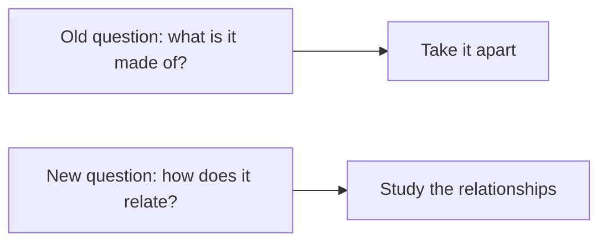
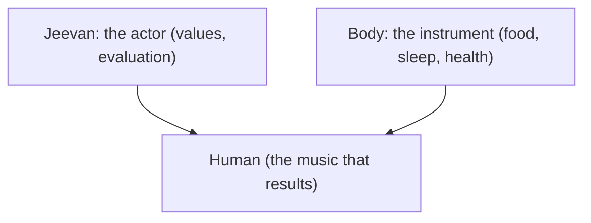
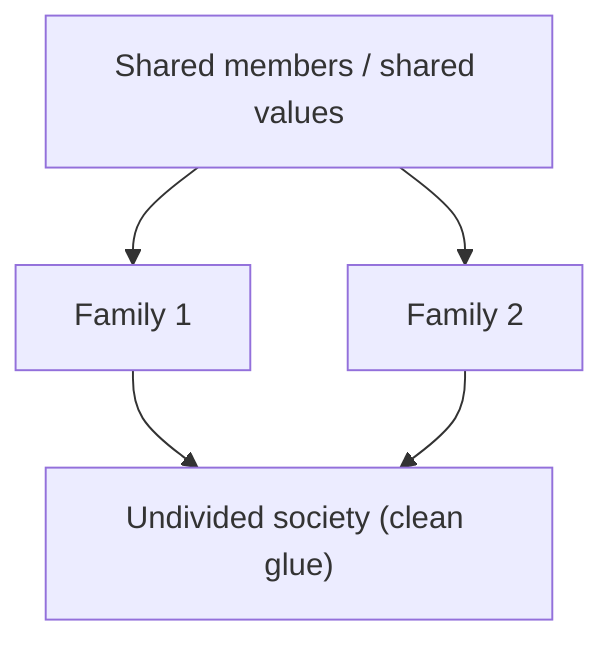
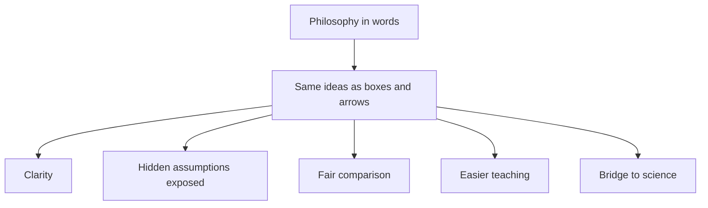
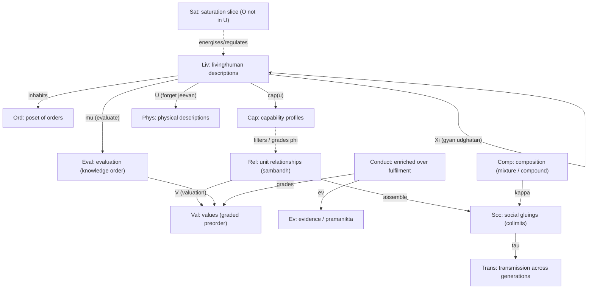
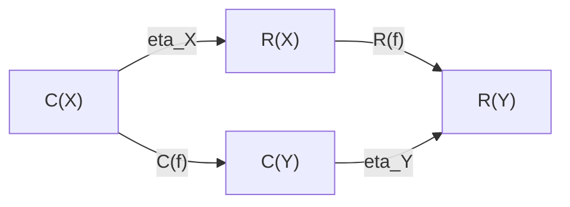
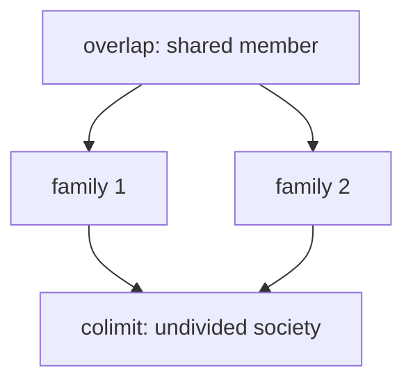
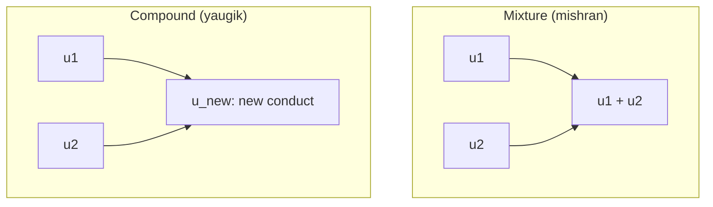

# Category Theory Explained — A Complete Guide

**Author:** [AnalyticMadhyasthDarshan.org](https://github.com/raghavamohan/AnalyticMadhyasthDarshan) — a group of people studying Madhyasth Darshan philosophy. Source repository: [raghavamohan/AnalyticMadhyasthDarshan](https://github.com/raghavamohan/AnalyticMadhyasthDarshan).

**Edited on:** June 29, 2026, 3:55 AM IST
**Status:** Draft

**The question:** What does category theory clarify about the structure of Madhyasth Darshan — and where does that notation stop?

This is a self-contained guide to describing Shri A. Nagraj's Madhyasth Darshan using **category theory**. Parts 1 to 5 introduce the ideas in plain language; Part 6 gives the precise formal theory. The ontological ground and the tier-neutral formal template are developed in [*The Ontology of Coexistence*](../The-Ontology-of-Coexistence/The-Ontology-of-Coexistence.pdf) and [*The Coexistence Template*](../The-Coexistence-Template/The-Coexistence-Template.pdf); human-tier conduct and society are worked out further in [*Why Humans Are Not Just Material*](../Why-Humans-Are-Not-Just-Material/Why-Humans-Are-Not-Just-Material.pdf) and [*Human Behavior and Society*](../Human-Behavior-And-Society/Human-Behavior-And-Society.pdf). Primary texts: [*Madhyasth Darshan — Co-existentialism* (MVD)](../References/Madhyasth-Darshan/MVD-Madhyasth-Darshan-Coexistentialism.pdf), [*Samadhanatmak Bhautikvad* (SB)](../References/Madhyasth-Darshan/SB-Samadhanatmak-Bhautikvad.pdf), and [*Jeevan Vidya: An Introduction* (JV)](../References/Madhyasth-Darshan/JV-Jeevan-Vidya-An-Introduction.pdf).

Category theory here is a **lens for clarity**, not a proof machine. It makes the philosophy's logic visible and shows exactly what each conclusion depends on. It does not prove the metaphysics, and it cannot supply empirical evidence.


## The one big idea

Category theory is built on a single shift in attention:

> **Stop asking only "what is each thing made of?" and start asking "how does each thing relate to everything else?"**

Most of modern science explains things by **breaking them into parts** (cells, molecules, atoms, particles). Category theory instead studies the **arrows between things** — the relationships, the flows, the transformations — and treats those relationships as the real subject matter.

Madhyasth Darshan defines **existence as coexistence** (*saha-astitva*): the co-eternally present togetherness of formless Omnipresence (*satta*) and countless real units (*ikai*), bound in **saturation** — pervasive co-location in which inherent energy and regulation belong to each unit through that relationship, not physical extraction from *satta* — and then in definite **relationships** (*sambandh*) with other units ([The Ontology of Coexistence](../The-Ontology-of-Coexistence/The-Ontology-of-Coexistence.pdf) §§1.1–1.4). Between those two layers, the texts name a **regulation ladder**: regulation read from saturation becomes evident as **law**, executes through **order-specific conformance regimes** (*niyati-vidhi*), and within constitutionally complete *jeevan* as **inward regulation** under mediative *atma*, then **justice** and assembly self-governance at the knowledge order — not efficient causation from *satta*, and not institutional self-governance as statutory command ([The Ontology of Coexistence](../The-Ontology-of-Coexistence/The-Ontology-of-Coexistence.pdf) §§1.5, 1.7, 1.9, 1.10.1; [The Coexistence Template](../The-Coexistence-Template/The-Coexistence-Template.pdf) D2a–D2b). That layered picture is close to category theory's attention to structure, though saturation is not itself a morphism between units (§6.13).




## Part 1: The four basic words

Category theory has only a few core ideas. Here they are in plain language.

### 1. Objects = the "things"

An **object** is just a thing you want to talk about. It can be concrete (a body, a family) or abstract (justice, resolution, fulfilment). In a diagram, objects are the labelled boxes.

> Everyday picture: the dots on a map (cities).

### 2. Morphisms (arrows) = the "relationships"

A **morphism**, usually drawn as an arrow, is a relationship or a way of getting from one thing to another. It might mean "supports", "develops into", "understands", "uses rightly", or "fulfils".

> Everyday picture: the roads between cities on the map. The roads, not the cities, are what category theory cares about most.

### 3. Composition = "chaining relationships"

If there is an arrow from A to B, and another from B to C, then there is a combined arrow from A to C. This is **composition** — following one relationship by another.

> Everyday picture: if there's a road from Delhi to Bhopal, and one from Bhopal to Amarkantak, then there is a route from Delhi to Amarkantak. You can chain them.

In the darshan this shows up as:

```text
Understanding -> Resolution -> Humane conduct -> Social order
```

Chaining these gives the shortcut "Understanding leads (eventually) to social order." The claim that the chain holds together is the interesting part.

### 4. Identity = "staying yourself"

Every object has a trivial "do nothing" arrow to itself, called the **identity**. It sounds empty, but it lets us ask a sharp question later: *has a person actually changed, or only stayed the same while looking different?*

> Everyday picture: staying in the same city.

That is the entire foundation. Boxes, arrows, chaining arrows, and a do-nothing arrow. Everything else is built from these.


## Part 2: A few more tools, each in one breath

These are the slightly fancier tools the formal theory uses. Each is given here as a plain idea plus how the darshan uses it. You do not need to memorise them; refer back as they appear.

| Tool | Plain-language meaning | Everyday analogy | How Madhyasth Darshan uses it |
|------|------------------------|------------------|-------------------------------|
| **Functor** | A faithful translation from one world of things-and-arrows to another that keeps the structure intact | Translating a recipe to another language so the steps still work | Turning relationships into the values they should fulfil |
| **Forgetful functor** | A translation that deliberately throws away some information | Photocopying a colour photo in black and white | Describing a human using only physics, dropping values and `jeevan` |
| **Natural transformation** | A consistent, across-the-board upgrade from one way of doing things to another | Upgrading every road on the map to a highway, uniformly | Shifting from "consumption" to "right-use" everywhere at once |
| **Retract** | A part that sits inside a whole, where the whole cannot be rebuilt from the part alone | A thumbnail made from a photo: you can shrink, but not un-shrink | Comfort is a real part of fulfilment, but not the whole of it |
| **Colimit (gluing)** | Joining many small pieces into one big consistent whole, along what they share | Gluing map tiles into one map where the edges match | Families joining into one undivided society |
| **Enrichment** | Recording not just "is there a relationship" but "of what quality/grade" | A road map that also marks each road's quality | Graded values — object, established, civic — and kinds of satisfaction |
| **Indexed enrichment / fibration** | Structure that varies with who is acting — not one fixed grade for everyone | Same recipe, but what you can actually cook depends on your kitchen | Fulfilment modulated by capacity, ability, and receptivity (§6.6.1) |
| **Mixture vs compound** | Two ways of joining units: side-by-side aggregation, or fusion into a new whole | Fruit salad vs baking a cake | *Mishran* keeps each conduct; *yaugik* creates a new tier with new **sig(*u*)** (§6.9) |
| **Unit signature** | Every unit carries form, properties, essential nature, and *dharma* | Each recipe tile lists ingredients *and* the dish's role in the menu | **sig(*u*) = ⟨roop, gun, svabhav, dharma⟩**; properties generative/degenerative/mediative (template D1, D1a) |
| **Regulation ladder** | How ground-level order reaches each tier without the ground acting | Same recipe rules at every kitchen station, but pastry vs grill follow different checks | **Sat** → law-as-regulation → order conformance (D2) → inward **AtmaReg** on `Liv` (D2b); not a morphism in `Rel` (§6.1.1) |


## Part 3: The philosophy, redrawn as a map

### 3.1 The four orders as a ladder

Madhyasth Darshan names four real developmental plateaus — material (*padarth*), pranic/bio (*pran*), animal (*jeev*), and knowledge (*gyan*) — each containing the ones below:


The arrows point one way for a reason. A human contains and depends on the material, plant, and animal levels — but you **cannot go backwards** and rebuild human knowing out of pure chemistry. In category-theory language this one-directional ladder (a "partial order") is the cleanest way to say:

> Higher includes lower, but higher is not reducible to lower.

The formalism does not *prove* this; it *records* it cleanly, so the claim is explicit and cannot be smuggled in or out unnoticed.

**Orders vs planes.** The four **orders** name what a unit *is* (material through knowledge). SB also names four **planes** — physicochemical, delusional, deific, divine — as developmental stages toward completeness, mapped to transitions T1–T3 (constitutional, activity, and conduct completeness). Deluded and awakened humans share the knowledge order but occupy different planes; the sentience threshold sits at the pranic→animal junction ([The Ontology of Coexistence](../The-Ontology-of-Coexistence/The-Ontology-of-Coexistence.pdf) §§1.5, 1.10; [The Coexistence Template](../The-Coexistence-Template/The-Coexistence-Template.pdf) D11). Category theory models orders as the poset `Ord` (§6.2); planes need a second layered typing (§6.2.1).

### 3.2 A human being: an actor and an instrument

The darshan says a human is **body + `jeevan`** (the sentient self), and crucially that these are not equal partners: `jeevan` is the actor, the body is its instrument. *Jeevan* is a **constitutionally complete composite atom** (*gathanpurna parmanu*) — a self-maintaining sentient unit, not an elementary particle of physics ([The Ontology of Coexistence](../The-Ontology-of-Coexistence/The-Ontology-of-Coexistence.pdf) §§1.5, 1.9–1.10).

A natural first guess is to write this as a simple pair, "Human = Body and Jeevan." That turns out to be the **wrong** picture, because a "pair" suggests two equal, separable halves. A better plain-language picture is:

> `Jeevan` is like a musician; the body is like the instrument. The music (values, evaluation, resolution) comes through the instrument but is not produced by the wood and strings alone. And you cannot swap them — the instrument does not play the musician.



This asymmetry is the heart of the darshan's claim that a human cannot be fully studied as a body alone. In category-theory terms, the "black-and-white photocopy" (the forgetful functor that keeps only physics) loses the musician and keeps only the instrument.

### 3.3 Delusion: mistaking a part for the whole

- **Comfort** (pleasure, wealth, health) is a genuine *part* of human fulfilment.
- But **fulfilment** is bigger than comfort; you cannot rebuild full fulfilment out of comfort alone.

In the tools table this is a **retract**: comfort fits inside fulfilment, but the arrow does not reverse. **Delusion**, in Madhyasth Darshan, is precisely the error of treating the part as if it were the whole — believing "maximise comfort" equals "achieve fulfilment". The texts diagnose a related pathology as unbounded "more" (JV p. 41); the darshan moves toward **definite completeness**, not open-ended maximisation ([The Coexistence Template](../The-Coexistence-Template/The-Coexistence-Template.pdf) §5).


Both arrows exist (comfort feeds fulfilment; fulfilment includes comfort), but going out and coming back does **not** return you to where you started — something is always left over. That "left over" is exactly what the darshan calls resolution, the part comfort can never supply.

### 3.4 Right-use: an all-or-nothing upgrade

The darshan contrasts **consumption** (using nature as raw material to be extracted) with **right-use** (using it complementarily, sustainably).

Right-use must be **consistent across every domain at once**. You cannot claim to practise right-use toward the forest while exploiting workers, or right-use toward workers while poisoning rivers. A genuine shift to right-use upgrades *every* relationship uniformly, the way upgrading a road network only counts if you upgrade the whole network, not one favourite road.


So "partial right-use" is, structurally, not yet right-use. That matches the darshan's claim that selective ethics is not yet humane conduct.

### 3.5 Society: gluing families that agree — and transmitting understanding

How does a good society form? Not by force, and not by simply piling up individuals. The darshan says it grows from families and communities into one "undivided society".

The "gluing" tool gives a precise condition for when this works:

> Many families can be glued into one society **exactly when they agree about the people and values they share.** Where two families place *contradictory* demands on the same shared person, the gluing is forced to collapse or break.



Gluing alone is not enough at the knowledge order. An assembly **persists** while its relationships are fulfilled (natural state) and **declines** when they are not (excited state); and every persisting assembly **transmits its method of composition** across generations — by education-*sanskar* at the human tier ([The Coexistence Template](../The-Coexistence-Template/The-Coexistence-Template.pdf) L4–L5). A society that coheres locally but fails to transmit understanding decays on member turnover.

### 3.6 *Jeevan*: evaluation and self-evidencing

Lower orders already **show** orderliness: a peepal tree exhibits definite conduct (JV p. 113) — that is *anubhav jnan* as ontological given (MVD p. 11), not knowledge-order evaluation. At the human tier something further is required: only *jeevan* **evaluates** value (template D6), **unfolds** knowledge (*gyan udghatan*, MVD pp. 115–116, 289), and must **evidence** what it understands in conduct.

MVD p. 12 gives a reflexive chain — each link *is* the next:

> Realisation itself is the ultimate evidence; evidence itself is understanding; understanding itself is manifest as resolution, work, and behaviour; work and behaviour itself is evidence; evidence itself is awakened tradition; awakened tradition itself is coexistence.

Private conviction without conduct is incomplete knowledge ([Knowledge, Knower, and Known](../Knowledge-Knower-And-Known/Knowledge-Knower-And-Known.pdf) §1.6). The musician/instrument picture from §3.2 extends here: the body can display effects; only *jeevan* evaluates and makes understanding **evident** to others — *pramanikta* at conduct completeness (T3; [The Ontology of Coexistence](../The-Ontology-of-Coexistence/The-Ontology-of-Coexistence.pdf) §1.10). Four knowledge registers must be kept apart (template D12; formal sketch §6.15).


## Part 4: How this formalism helps

Why bother translating a philosophy into this language at all? Six concrete payoffs.

1. **It forces clarity.** You cannot draw an arrow without saying what relates to what. Vague claims ("everything is connected") become specific ("this supports that; that fulfils the other"). Fuzzy ideas either sharpen or fall apart.

2. **It exposes hidden assumptions.** Each conclusion, drawn as a chain of arrows, makes visible exactly which link is doing the work. For example, "a human is not just a body" turns out to rest entirely on one assumption: that two physically identical acts can differ in value. The formalism puts a spotlight on that assumption instead of letting it hide.

3. **It catches inconsistencies.** Drawing a diagram reveals when two paths that *should* agree actually don't. The "delusion" idea is literally a diagram that fails to close up — a precise picture of a confused belief.

4. **It enables fair comparison.** Once materialism, religion, and Madhyasth Darshan are each drawn as "worlds of things and arrows", you can compare what each one keeps and what each one throws away. Reductionism becomes "the translation that forgets values" — a clear, checkable description rather than an insult.

5. **It is teachable and language-neutral.** Diagrams cross language barriers. A student who finds the Sanskrit-derived vocabulary daunting can still follow boxes and arrows, then attach the names afterward.

6. **It builds a bridge to science and computation.** The same mathematics is used in physics, computer science, and AI. Phrasing the darshan in it opens a door for dialogue with those fields instead of leaving philosophy and science speaking different languages.




## Part 5: How it can actually be used

This is not only an academic exercise. Here are practical applications, aligned with the template's forward and reverse uses ([The Coexistence Template](../The-Coexistence-Template/The-Coexistence-Template.pdf) §1.1).

### In education
Teach values as **relationships to be fulfilled** rather than rules to be obeyed. A curriculum can map each relationship (parent-child, teacher-student, citizen-society) to the values it carries, and ask students where the arrows are currently broken.

### As an ethics or technology checklist
Before adopting a technology or policy, ask the "right-use" question structurally:
- Does this upgrade *every* affected relationship, or only some while harming others?
- Can its benefits be "lifted back" into coexistence, or do they depend on extraction somewhere?

A tool passes only if the upgrade is uniform — a concrete, auditable test (naturality of §6.7).

### In policy and social design
Use the gluing condition as a diagnostic: where a community is failing to cohere, look for **shared people or resources carrying contradictory expectations**. Add transmission: does the assembly institutionalise understanding for incoming members, or only rules?

### In AI and value alignment
Modern AI struggles with exactly the darshan's complaint: optimising a single number (engagement, profit, "reward") maximises the wrong thing. Graded fulfilment (enrichment over a value preorder, §6.6) is an argument for **multi-level objectives** instead of one scalar reward.

### In interfaith and science-philosophy dialogue
Because the formalism states what each worldview *keeps and forgets*, it lets very different traditions compare notes without insult or conversion.

### As a research programme
Open questions include: how saturation in *O* (inherent energy and regulation in units through co-location — not a morphism, not physical transfer from *O*) relates to the categories of unit-to-unit structure; how the **regulation ladder** (template D2a: law-as-regulation, order conformance, inward *atma* regulation) is best indexed alongside `Sat` and `Ord` without misrepresenting *O* as an arrow; whether plane transitions T1–T3 admit a clean layered-type or fibration model alongside `Ord`; whether transmission τ admits a clean coalgebra or indexed-category model; and whether complementarity of need (template L3) can be fully internalised or must remain an external guard on admissible diagrams (§6.9.2).


## Part 6: The complete formal theory

Parts 1 to 5 gave the intuition. This part gives the precise version for readers comfortable with (or curious about) the mathematics, and states exactly what the formalism can and cannot carry.

### 6.0 Design discipline (the rules this theory obeys)

A loose use of categorical vocabulary can mislead. This theory commits to five rules.

1. **One kind of morphism per category.** A single category may not mix causal, developmental, epistemic, and normative arrows, because then composition is meaningless. Different kinds of relation live in different categories, connected by functors.
2. **Composition and identities must be specified and associative.** If a composite has no clear meaning, the structure is a quiver (a labelled directed graph), not a category, and is labelled as such.
3. **Universal properties must be stated and, where claimed, checked.** Products, colimits, adjoints, and monoidal structures are not invoked by name unless their defining property is given.
4. **Every nontrivial claim names its hidden premise.** Where a conclusion depends on a contested Madhyasth assumption, that premise is stated explicitly. The categorical step is then valid only relative to it.
5. **Propositions are conditional, not theorems about reality.** Nothing here proves `jeevan`, constitutional completeness, or coexistence. The propositions show what *follows structurally if* the premises are granted.

Category theory is **structuralist**: by the Yoneda principle, an object is determined entirely by its pattern of relations to other objects. That will matter, because Madhyasth Darshan holds that `jeevan` is a **substantial** entity, not merely a relational role — the deepest limit of the whole project (§6.13.1).

### 6.1 Architecture: several categories and functors, not one

Instead of a single all-purpose category, we use a small system of categories, each internally clean, related by functors, natural transformations, and — where needed — structure that sits outside ordinary inter-unit morphisms.



**Sat (saturation).** Omnipresence **O** is not a unit and not an object of `Rel` ([The Coexistence Template](../The-Coexistence-Template/The-Coexistence-Template.pdf) §3.1). Saturation is pervasive co-location in which **inherent energy and regulation belong to each unit** through the O–unit bond — mutual dependence for manifestation, not physical extraction from *O* (template A1–A2; [The Ontology of Coexistence](../The-Ontology-of-Coexistence/The-Ontology-of-Coexistence.pdf) §§1.2–1.3). Categorically it is best treated as an **ambient** or **enrichment base** — a family of regulators indexed by units — not as a morphism *u₁ → u₂*. The **regulation ladder** (template D2a) adds a typed overlay on that family: for each u ∈ U, regulation from `Sat` is read as **law-as-regulation**, then as an **order conformance regime** (result-/structural / seed / species / *sanskar* — definite below the knowledge order, achieved through knowing → believing → recognising → fulfilling within it), then for constitutionally complete *jeevan* as **inward regulation** under mediative *atma* (D2b; ontology §§1.9, 1.10.2), then **justice** as knowledge-order evaluative closure and assembly self-governance at fulfilled human scale (D7; ontology §§1.10.5, 1.13). **Statutory/public law** (*dharma-niti*, *rajya-niti*) is a third register outside `Sat`/`Rel` — deferred to the planned *Governance Justice and Undivided Society* study (Ontology §1.10.5). Model inward regulation as a partial endomorphism **AtmaReg : Liv ⇀ Liv** on the faculty stack — parallel to mediative regulation at the atomic nucleus, not an arrow in `Rel`. Terminal-object and topos-as-space readings of *vyapak* remain stretches (§6.13.4).

**Eval and μ.** Evaluation is defined **only for knowledge-order units** (template D6): *jeevan* assesses value delivered in a relationship — bodily mechanisms implement conduct but do not evaluate. Model `μ : Liv → Eval` (or an endofunctor on `Liv`) that does not factor through `Phys`. Justice is the composite **ρ → φ → μ → mutual satisfaction** — an **operator over** *V*, not a member of *V* (template D7). Complete knowledge requires the evidence cycle (template D13, L7; §6.15).

**Ξ and *gyan udghatan*.** Knowledge unfolding is a **partial** endofunctor `Ξ : Liv ⇀ Liv`, defined only for awakened knowledge-order units (template D12; MVD pp. 115–116, 289). It does not drive material-tier κ_comp.

**Ev and *pramanikta*.** Model conduct readable as evidence by `ev : Conduct → Ev`. T3 (conduct completeness) corresponds to a lift in `Pln` when `ev ∘ conduct` reaches *pramanikta* — authenticity others can recognize ([The Ontology of Coexistence](../The-Ontology-of-Coexistence/The-Ontology-of-Coexistence.pdf) §1.10).

**Trans and τ.** Transmission re-instantiates an assembly's composition method across member turnover (template L5). At the knowledge order, τ carries **evidenced** understanding (template D10), not rules without φ. A clean categorical home is an **indexed category** or **coalgebra**: generations as objects, τ as structure-preserving maps carrying education-*sanskar* forward. Colimits alone do not generate τ (proposition P8).

**Cap and cap(*u*).** Fulfilment is not automatic from recognising a relationship: it is modulated by **capacity** (*kshamata*), **ability** (*yogyata*), and **receptivity** (*patrata*) (template D5a). Model cap as a functor `cap : Liv → Cap` into a category of capability profiles; `Rel` and `Conduct` are then **fibred** or **indexed** over unit capability (§6.6.1).

**Comp and κ.** Composition takes two modes — **mixture** and **compound** (template D8). Only **compound-mode** κ creates a new tier; mixture aggregates at the same tier. Categorically this is the difference between a **coproduct preserved at fixed order** and a ** colimit that changes signature** (§6.9).

### 6.1.1 Relation to the coexistence template

[*The Coexistence Template*](../The-Coexistence-Template/The-Coexistence-Template.pdf) states the tier-neutral structure formally; this paper supplies natural notation for parts of it. The mapping is intentional, not a proof that the symbols coincide.

| Template | Symbol / law | Categorical analogue in this paper | Fit / gap |
|---|---|---|---|
| Coexistence, saturation | **O**, A1–A2 | Ambient `Sat`; inherent energy in units through co-location; not in `Rel`; not transfer from *O* | Medium is constitutive; CT has no default for non-morphismic ground |
| Regulation ladder | **D2a**, **D2b** | Typed overlay on `Sat`: **law** (all orders) → order conformance by `Ord`; **AtmaReg : Liv ⇀ Liv** for inward regulation | Not one functor; *O* must not appear as efficient-cause arrow |
| Law vs justice | **D2** vs **D7** | **Law**: universal orderliness overlay on `Sat`/`Ord`. **Justice**: partial composite ρ → φ → μ on `Liv` only — operator over *V*, not in *V*; dual role as *drishti* perspective and ontological closure (Ontology §1.10.5) | **Statutory/public law** is third register — outside `Rel`/`Sat`; deferred to *Governance Justice and Undivided Society* |
| Order conformance | **D2** | Index regulation regime by order in `Ord`; definite vs achieved typing on `Liv` | Strong for four orders; knowledge-order achievement is guard, not automatic |
| Knowledge registers | **D12**: AJ, O_gyan, Ξ, TEL | Ambient typing on all objects; `Sat` as O_gyan base; `Ξ : Liv ⇀ Liv`; TEL as progression target (not object in `Sat`) | See §6.15; TEL ≠ terminal object in `Sat` |
| Self-evidencing | **D13**, **L7** | Partial cycle `ev ∘ φ ∘ μ`; evidenced `Trans`; quiver not single endomorphism | §6.15 |
| Units, signature | **U**, D1, D1a | Objects across categories; **sig(*u*)** typed data (roop, gun, svabhav, dharma) | Strong for orders; property triad generative/degenerative/mediative is typed, not derived |
| Relationships | **R**, D3 | Category `Rel`; expectation profiles **E(r)** on arrows | Strong; association vs relationship is typing, not composition |
| Values / essentiality | **V**, D4 | Preorder `Val`; enrichment base **W**; essentiality (*maulikta*) as participation-as-value | Moderate — six-fold taxonomy (utility / art / *jeevan* / human / established / expression) compresses in §6.6 |
| Recognition, fulfilment | **ρ**, **φ**, D5 | Morphisms/processes on `Rel` / `Conduct`; fibred over `Cap` | Moderate — cap(*u*) = ⟨ksh, yog, pat⟩ in §6.6.1 |
| Evaluation | **μ**, D6 | `Eval` on `Liv` only | Moderate — order-restriction is essential (P10) |
| Composition | **κ**, D8 | `Comp`: mixture = coproduct; compound = tier-changing colimit | Moderate — modes distinguished in §6.9 |
| Planes, completeness | **D11**, P6 | Layered typing on units; T1 irreversible vs T2–T3 in `Liv` (§6.2.1) | Partial — plane membership for humans is state, not order |
| Complementarity | **L3** | — | **Gap:** selection rule for which diagrams are admissible; CT is silent (Template §7) |
| Persistence | **L4**, D9 | Colimit compatibility + natural/excited typing | Partial |
| Transmission | **τ**, L5 | `Trans` coalgebra / indexed maps | Weak — not derivable from κ alone |
| Tier iteration | **L6** | Poset `Ord` + iterated colimits | Strong |
| Four orders | D2 | Poset `M ≤ B ≤ A ≤ K` | Strong |

The template's §7 comparison row states the division of labour plainly: category theory is the natural notation for **κ** and **L6**, but **L3** (complementary need as the engine of assembly) is the selection rule the notation lacks. Any colimit model of society must be supplemented by an external criterion — complementary deficiency and surplus — for which diagrams count as development-progression bonding rather than arbitrary gluing.

### 6.2 The poset of orders (mereological containment)

The four orders are modelled by a **thin category** (a partial order), with at most one arrow between any two objects.

```text
Objects:   M, B, A, K  (material, biological, animal, knowledge)
Order:     M <= B <= A <= K
Reading of x <= y:  "order y contains and depends upon order x"
```

- **Morphism-kind:** containment/dependence only.
- **Composition:** transitivity of `<=`. Trivially associative.
- **Identities:** reflexivity `x <= x`.

The claim "the higher-order universe contains the lower-order universe" (MVD Ch. 3) is **mereological** (part/whole), not transformational. Posets are the natural home of part/whole structure.

The non-existence of `K <= M` is exactly the anti-reductionist content; here it is a flat structural fact, not an argument. The poset *encodes* the claim, it does not *prove* it.

### 6.2.1 Planes, completeness stages, and two progressions

[*The Ontology of Coexistence*](../The-Ontology-of-Coexistence/The-Ontology-of-Coexistence.pdf) §§1.5, 1.10 and the template (D11, P6) distinguish **orders** (what a unit *is*) from **planes** (where development has reached in nature's progression toward completeness). Four progressions must not be collapsed: **existential progression** (*niyati-kram*), **way of existence** (*niyati-vidhi*), **development progression** (*vikas-kram*), and **awakening progression** (*jagriti-kram*). The three completeness stages map to plane transitions:

| Transition | Completeness stage | Plane move |
|---|---|---|
| **T1** | Constitutional (*gathanpurnata*) | Physicochemical → delusional |
| **T2** | Activity (*kriyapurnata*) | Delusional → deific |
| **T3** | Conduct (*vyavaharpurnata*) | Deific → divine (complete) |

**Development Progression** (*vikas-kram*) reaches T1 through compound-mode κ_comp — irreversible at the atomic level (SB p. 92). At T1 the constitutionally complete atom is read as liberated from **molecular-bondage and weight-bondage** and bearing hope-bondage instead (Ontology §1.10; MVD p. 91) — the Petri transition names bookkeeping, not ordinary molecular decay grammar. **Awakening Progression** (*jagriti-kram*) runs in *jeevan* already constitutionally complete toward T2 and T3; it is not a second atomic transformation.

Categorically: **`Ord`** models mereological containment among orders (§6.2). **Planes** need a second labelling — a fibration, indexed type, or layered poset **`Pln`** — because knowledge-order humans can change plane (deluded → awakened → evidenced) without changing order. T1 is an **irreversible transition** in the Petri/monoidal layer (§6.10); T2 and T3 are **endomorphisms or lifts within `Liv`**, guarded by cap(*u*) and μ, not by κ_comp at the material tier.

### 6.3 Reduction as a forgetful functor

Let `Liv` be human descriptions that include value-bearing structure, and `Phys` purely physical descriptions. Define the forgetful functor:

```text
U : Liv -> Phys
U(human situation) = its physical substrate
U(humane transition) = the underlying physical change
```

**Is `U` faithful?** (`U` is faithful iff distinct `Liv`-morphisms never collapse to the same `Phys`-morphism.)

- **Premise (stated):** two acts can be physically identical yet differ in value — e.g. genuine justice versus an outwardly identical imitation differ in `jeevan`-level content (SB Ch. 7).
- **Conditional conclusion:** *if* that premise holds, then **`U` is not faithful**. The functor formalism contributes precision, not evidence; the premise does all the work.

**Does `U` have a left adjoint (a "free jeevan" functor)?** A left adjoint would freely generate life/value from bare matter.

- **Premise (stated):** *gathanpurnata* is reached by irreversible **Development Progression** (*vikas-kram*) through effort–motion–result (*shram–gati–parinam*), not a free, uniform construction ([The Ontology of Coexistence](../The-Ontology-of-Coexistence/The-Ontology-of-Coexistence.pdf) §§1.8–1.10).
- **Conditional conclusion:** *if* development is selective and irreversible, there is **no left adjoint with iso unit**; "adding life freely to matter" is not a structural operation.

**What this does not do.** It does not show the premise is true. A physicalist who denies the value-distinct premise keeps `U` faithful and is untouched.

### 6.4 The human: not a product, but an action

A categorical **product** (`Human = Body x Jeevan`) is wrong here: a product is symmetric and freely separable, but the darshan says body and `jeevan` are inseparable in function and asymmetric ("`jeevan` is the bearer; the body is a vehicle and medium", SB Ch. 7, JV Ch. 1). A better model: `jeevan` as a **monoid acting on body-states**.

```text
Let (J, *, e) be a monoid of jeevan-activities (valuing, evaluating, resolving).
Let Bdy be the body-states.
A human is an action:   act : J x Bdy -> Bdy
with                    act(e, b) = b
                        act(j1 * j2, b) = act(j1, act(j2, b))
```

This captures asymmetry (`J` acts on `Bdy`, not vice versa), inseparability-in-function (a human is the *action*, not a detachable pair), and "results beyond bodily need" (the orbit can contain states unreachable by body-dynamics alone).

This is a modeling choice, not the unique one; a fibration, comma object, or monad algebra would each capture part of the same asymmetry. Ontology §1.9 distinguishes **faculties** (*mun* through *atma* — what *jeevan* **is** structurally) from **koshas** (developmental envelopes of body + *jeevan* — where awakening has opened); they must not be read as parallel columns. The non-uniqueness is itself an issue (§6.14).

### 6.5 Delusion as a retract that is mistaken for an isomorphism

Let `F` be **complete fulfilment** and `C` **bodily comfort**. Comfort is genuinely part of fulfilment:

```text
i : C -> F      (comfort contributes into fulfilment)
p : F -> C      (fulfilment includes a recoverable comfort aspect)
with    p . i = id_C     (C is a retract of F)
but     i . p != id_F    (F cannot be rebuilt from C alone)
```

So `C` is a **retract** of `F` but **not isomorphic** to it.

**Definition (delusion).** Delusion is the false assertion that `i` is an isomorphism, i.e. treating `i . p = id_F` — identifying the two distinct endomorphisms `id_F` and `i . p` of `F`. Equivalently: treating movement toward unbounded "more" as movement toward completeness (Template §5).


Because both `id_F` and `i . p` have the same domain and codomain `F`, asking whether they are equal is well-typed; the darshan asserts they are unequal. This is a clean structural statement of "pleasure/wealth/health are necessary but not sufficient" (MVD Ch. 4).

### 6.6 Fulfilment as enrichment, not a scalar

The texts give value a **six-fold taxonomy** (Template D4; Ontology §1.6): **object values** — utility and art — at all orders where applicable; *jeevan*, human, established, and expression values at the knowledge order. Mutuality also includes **impression** — one unit's activity registering on another — alongside complementarity and mutual recognition (Ontology §1.6). MVD Ch. 4 also distinguishes sensory (momentary), intellectual (lasting), and existential (non-transformable) satisfaction. Model the ordering by **enrichment over a preorder**.

```text
Let W = (sensory <= intellectual <= existential), made monoidal by min, unit = existential.
Enrich the conduct category over W:
the hom-object Conduct(f, g) is an element of W recording the quality of fulfilment realized.
```

Enriched composition requires `Conduct(g,h) (x) Conduct(f,g) <= Conduct(f,h)` — "a chain is only as high-grade as its weakest link." This refuses the collapse of fulfilment into one additive scalar — the Madhyasth objection to utility/happiness maximisation — and aligns with definite completeness rather than open-ended optimisation.

The base `W` and the choice of `min` are modeling decisions. The enrichment captures *ordering of qualities* well; it does not capture TEL (*satta mein anubhav* as telos), nor the full D4 class hierarchy without a finer indexed enrichment. **Fulfilment capacity** (template D5a) supplies that finer index — §6.6.1.

### 6.6.1 Fulfilment modulated by capacity (cap(u))

Template D5a writes **cap(*u*) = ⟨ksh, yog, pat⟩** for capacity (*kshamata*), ability (*yogyata*), and receptivity (*patrata*) (MVD p. 62). Recognition ρ and fulfilment φ are universal across orders (template L1), but **φ is realised only at the level cap(*u*) permits** — not by receptivity alone. In the material order, **ascending** (*agreshan*) is balance and receptivity gained while converting capacity and ability into effort (*shram*); **frustration** (*kshobh*) is the shortcoming in that conversion — "incompleteness of receptivity" (MVD p. 79). In the knowledge order, cap(*u*) for worldview arises from environment, study, and prior *sanskar* (MVD p. 134); extent of receptivity is qualification (*arhta*), yielding perspective (*drishti*) and worldview (*darshan*) (MVD p. 142) ([The Ontology of Coexistence](../The-Ontology-of-Coexistence/The-Ontology-of-Coexistence.pdf) §§1.4, 1.10.5). Evaluative *sapëkshata* (relativity) arises from how *jeevan* views and understands — *drishti*, *drishya*, and *darshan* — not from unreality of the underlying *Rel* structure ([Knowledge, Knower, and Known](../Knowledge-Knower-And-Known/Knowledge-Knower-And-Known.pdf) §1.4.1; [The Ontology of Coexistence](../The-Ontology-of-Coexistence/The-Ontology-of-Coexistence.pdf) §1.9); μ therefore operates on perspective-dependent seeing, unlike the forgetful functor `U`, which drops value from physical description.

#### The capability category `Cap`

Define a category **`Cap`** whose objects are capability profiles **c = ⟨ksh, yog, pat⟩**, each coordinate living in an order-specific preorder (material profiles are not human profiles). A morphism **c → c′** means coordinate-wise improvement — more scope, more convertibility, more readiness.

Each unit carries a profile by a functor:

```text
cap : Liv -> Cap
cap(u) = <ksh(u), yog(u), pat(u)>
```

`Phys` has a trivial or collapsed image: lower-order units convert capacity and ability into bonding automatically; the interesting fibred structure appears at the knowledge order, where cap can **fail** to improve and where μ can misfire (over-, under-, mis-evaluation, MVD p. 38).

#### Three roles of the triad (what each coordinate gates)

| Coordinate | Textual role | Categorical gate |
|---|---|---|
| **pat** (*patrata*) | Readiness for a relationship's expectations and values to register | **Existence of morphisms:** `(u,r) ∈ Rel` only if `pat(u) ≥ pat_req(r)` |
| **yog** (*yogyata*) | Competence to convert capacity into effort, conduct, or bonding | **Composition of φ-steps:** the composite φ₂ ∘ φ₁ is defined only if yog(*u*) suffices along the chain; failure = *kshobh* |
| **ksh** (*kshamata*) | Scope for participating in relationships and bearing what coexistence makes available | **Grade ceiling in *W*:** effective satisfaction grade is `min(W_chain, ksh_ceiling(u))` |

Receptivity alone does not produce fulfilment: a unit may **recognise** a relationship (ρ) yet deliver only a truncated value flow because yog or ksh is insufficient — the template's diagnosis of frustrated or partial order.

#### Fibred enrichment over units

Combine §6.6's enrichment base **W** with **Cap** by passing to a **fibred category** (or indexed category) over units:

```text
pi : E -> Rel
```

For each relationship arrow `r : u -> v` in `Rel`, the fibre carries **Conduct**-morphisms enriched in **W**, but:

1. The arrow `r` appears in the fibre over `u` only if **pat(*u*)** meets the relationship's requirement.
2. Composition in the fibre uses **min** on **W** as in §6.6, and is **defined** only when **yog(*u*)** (and yog(*v*) where needed) supports the composite effort.
3. The grade recorded in the fibre is capped by **ksh(*u*)**.

**Effective fulfilment** along `r` is therefore not a single functor `Rel → Val` but a **family** `φ_u` indexed by units, with:

```text
grade(φ_u(r)) = min(grade_inherent(r), ksh(u))   in W
```

when yog(*u*) and pat(*u*) permit φ at all. At the knowledge order, **μ** compares `grade(φ_u(r))` to the value inherent in the relationship — the three failure modes are precisely μ operating on a φ that was already cap-truncated or cap-blocked.

#### Justice as a cap-sensitive composite

Justice (template D7) is **ρ → φ → μ → mutual satisfaction**, not a member of *V*. Ontological prose (law universal, justice knowledge-order only): [The Ontology of Coexistence](../The-Ontology-of-Coexistence/The-Ontology-of-Coexistence.pdf) §1.10.5. Categorically it is a **partial composite** on the fibred conduct category:

```text
Justice_u(r) = mu_u o phi_u o rho_u(r)
```

defined only when all three coordinates of cap(*u*) permit the chain. The knowledge-order discontinuity (template P3) is visible here: in the first three orders cap is high enough that the composite executes definitely; in the knowledge order the same diagram may **fail to compose** — which is exactly why human assembly is the unfinished tier.

#### What this does not do

The preorders on ksh, yog, and pat are **order-specific** and textually grounded, not derived from category theory. The fibred model **organises** D5a; it does not prove that cap(*u*) has the stated coordinates or that frustration is always "incompleteness of receptivity." A simpler stopgap — a single scalar "competence" per unit — would lose the template's distinction between recognising, converting, and bearing.

### 6.7 Right-use as a natural transformation

Let `D` be "domains of use" (nature, wealth, body, knowledge) and `Pr` a category of practices. Define two functors:

```text
C : D -> Pr     consumption practice
R : D -> Pr     right-use practice
```

A natural transformation `eta : C => R` has components `eta_X : C(X) -> R(X)` such that for every domain-morphism `f : X -> Y`:

```text
R(f) . eta_X  =  eta_Y . C(f)        (naturality square commutes)
```



The naturality square is the substantive content: the shift from consumption to right-use is **uniform across all domains**. **Conditional conclusion:** *if* right-use is one principle (not domain-by-domain opportunism), then partial right-use that violates naturality is incoherent — a precise version of "selective ethics is not yet humane conduct."

### 6.8 Undivided society as a colimit — with persistence and transmission

```text
Index category J:
  objects   = families and communities
  morphisms = inclusions of shared members / shared relationships
Diagram   D : J -> Rel
  assigns each family its value-structure, and each overlap the shared sub-structure.
Undivided society := colim D     (the gluing of all families along shared members)
```

The simplest case is a pushout of two families sharing a member:



**Universal property.** Any consistent assignment of value-fulfilment to all families that **agrees on overlaps** factors *uniquely* through `colim D`.

**Compatibility (template L4).** The colimit behaves well **only if the diagram is compatible** — families assign the *same* values to shared members. Conflicting assignments force a **quotient** that collapses distinctions or degenerates. Natural state ↔ fulfilled relationships; excited state ↔ decomposition pressure.

```text
Compatible local value-structures  ->  clean gluing  ->  undivided society
Conflicting local value-structures ->  forced collapse  ->  no coherent undivided society
```

**Transmission (template L5, P3–P4).** At the knowledge order, sustainment also requires **τ**: common cause, goal, and programme (MVD p. 55), carried by education-*sanskar*. A colimit that glues families in one generation but lacks τ across turnover is structurally incomplete — the template predicts decay when understanding is not transmitted, even if local φ held momentarily.

This is where the mathematics contributes a genuine, independent result about gluing: **universal order is coherent exactly when local value-structures agree on what they share.** Transmission is a further clause category theory does not derive from colimits alone.

At the knowledge tier, a successful **compound** κ (§6.9) — not merely mixture — is what produces a new social conduct with its own sig(·); the colimit in `Soc` should be read as **compound-mode** gluing when the assembly is meant to ascend a tier.

### 6.9 Composition: mixture and compound (κ)

Template D8 distinguishes two modes of composition κ (MVD p. 42; [The Ontology of Coexistence](../The-Ontology-of-Coexistence/The-Ontology-of-Coexistence.pdf) §1.8):

- **Mixture** (*mishran*): components **all maintain their respective conducts** — aggregation without a new joint conduct.
- **Compound** (*yaugik*): components combine **in definite proportion**, **discard their own conducts**, and **present another kind of conduct** — a genuinely new unit with its own **sig(*u*) = ⟨roop, gun, svabhav, dharma⟩**, where **gun** is generative, degenerative, or mediative in mutuality (MVD pp. 50–51; template D1, D1a).

**Only compound-mode κ creates a new tier** of the hierarchy (template L6). **Composition is not development** ([The Ontology of Coexistence](../The-Ontology-of-Coexistence/The-Ontology-of-Coexistence.pdf) §1.8): arbitrary coproducts and colimits do not model ontological order ascent; only admissible compound-mode κ_comp along *vikas-kram* reaches T1. Development Progression (*vikas-kram*) toward *gathanpurnata* is the canonical **compound** path (MVD p. 8; SB pp. 55, 59). Awakening Progression (*jagriti-kram*) runs in already constitutionally complete *jeevan* and must not be conflated with material-tier κ ([The Ontology of Coexistence](../The-Ontology-of-Coexistence/The-Ontology-of-Coexistence.pdf) §§1.9–1.10.4).

#### Categorical semantics: two colimit-like constructors

Work in a category **`Unit`** of units typed by order (objects carry a label in `Ord`).

**Mixture** κ_mix(*u₁*, *u₂*): a **coproduct** (or coproduct preserved in a subcategory at **fixed order**)

```text
u1 --i1--> u1 sqcup u2 <--i2-- u2
```

with injections **i₁**, **i₂**, such that:

- Each component's conduct factorises through its injection — **no fusion** of *dharma*.
- sig(κ_mix) **decomposes** as the pair (sig(*u₁*), sig(*u₂*)) — same tier, side-by-side.
- Example gloss: co-present units in a mixture without a new joint law — aggregate, not ascent.

**Compound** κ_comp(*u₁*, *u₂*): a ** colimit** (often a **pushout** or **coequaliser** following a bonding span) that **quotients** the coproduct by a **fusion** relation

```text
         span of bonding (complementary need)
u1 --------------------> u_new <-------------------- u2
```

such that:

- The old separate conducts are **not** recoverable as independent projections — they are **identified** in the new conduct.
- sig(κ_comp) is a **new** signature; the output may occupy the **same or a higher** tier (hungry/overfull bond → molecule; bond chain → *gathanpurna* threshold).
- **L6 iteration** applies to κ_comp outputs, not to κ_mix outputs.



#### Relation to §6.8 colimits

§6.8 models **undivided society** as `colim D` over families. Read by mode:

| Reading | Mode | Outcome |
|---|---|---|
| Families cohabit but retain separate household conducts | **Mixture** | Coproduct-like diagram; no new social *dharma* |
| Families fuse into one **undivided** conduct with shared values on overlaps | **Compound** | Colimit with compatibility (L4); new tier of assembly |

The **universal property** of §6.8 is the **compound** case: agreement on overlaps is the fusion relation. Mixture corresponds to a **disjoint coproduct** of family categories with no shared quotient — weaker cohesion.

#### Order-relative examples

| Tier | Mixture-like | Compound-like |
|---|---|---|
| Material | Co-present atoms without molecular bond | Hungry/overfull atoms → molecule; progression toward *gathanpurna* |
| Biological | Cells co-located without multicellular integration | Cells → organism with new joint conduct (JV p. 82) |
| Knowledge | Individuals in proximity without family order | Family → community → undivided society (MVD p. 55) |

#### 6.9.1 Complementarity as an external guard (L3)

Template **L3** drives κ_comp: bonding from **complementary deficiency and surplus** (MVD p. 8), not from arbitrary pairs. Category theory supplies **the form** of colimits and coproducts; it does **not** supply **which spans are admissible**.

Model L3 as a **subcategory** or **predicate** on spans:

```text
AdmissibleComp ⊂ Span(Unit)
(u1 <- s -> u2) admissible  iff  need(u1) complements surplus(u2) [and order rules]
```

Only admissible spans define κ_comp transitions. This is proposition **P9** restated at the composition layer: **L3 is a selection rule on diagrams**, not a universal property. The Petri net of §6.10 labels **transitions**, not **which transitions nature permits**.

**Conditional conclusion:** *if* L3 is the engine of assembly, then a categorical model of Madhyasth Darshan must treat **`AdmissibleComp`** (or an equivalent guard) as **given data** alongside the categories — the same division of labour noted in [The Coexistence Template](../The-Coexistence-Template/The-Coexistence-Template.pdf) §7.

### 6.10 Development as a monoidal/Petri process

**Development Progression** (*vikas-kram*) — distinct from **Awakening Progression** (*jagriti-kram*) in already constitutionally complete *jeevan* ([The Ontology of Coexistence](../The-Ontology-of-Coexistence/The-Ontology-of-Coexistence.pdf) §§1.8–1.10) — runs through effort–motion–result (*shram–gati–parinam*), read toward completeness at each stage: result → constitutional completeness; effort → activity completeness; motion → conduct completeness (SB p. 58). *Kaal* is the duration of that activity, not an independent container ([Nature of Time](../Nature-Of-Time/Nature-Of-Time.pdf) §1.1).

Hungry/overfull atomic bonding is **compound-mode** κ_comp guarded by L3 (§6.9.1). The progression is **resource-sensitive**, best modelled by a **symmetric monoidal category** (equivalently the free such category on a Petri net), where the tensor is co-presence of resources and **transitions consume inputs to produce outputs**.

| Layer | Transition | Input | Output | Note |
|-------|------------|-------|--------|------|
| **Places (resources)** | — | — | matter, effort, partial composites, *gathanpurna* threshold | Petri places |
| κ_comp (*vikas-kram*; AdmissibleComp) | bond | hungry-atom ⊗ overfull-atom | molecular composite | compound |
| κ_comp (*vikas-kram*; AdmissibleComp) | complete | composite ⊗ effort | *gathanpurna parmanu* | compound; T1 irreversible |
| *jagriti-kram* (in `Liv`; not κ_comp) | awaken | deluded K-order unit | deific plane | T2: activity completeness |
| *jagriti-kram* (in `Liv`; not κ_comp) | evidence | awakened K-order unit | divine plane | T3: conduct completeness; *pramanikta* via `ev` |

**Mixture transitions** (if included) are **identity-preserving** on each factor — token duplication without fusion — and do **not** advance Development Progression toward a new tier. Likewise, social colimits (§6.8) and large assemblies do **not** substitute for order transition: composition is not development ([The Ontology of Coexistence](../The-Ontology-of-Coexistence/The-Ontology-of-Coexistence.pdf) §1.8).

Transitions toward *gathanpurnata* are generally **not invertible** — the constitutionally complete atom does not revert to insentient configuration (SB p. 55). At T1 the texts read the sentient atom as liberated from **molecular-bondage and weight-bondage** (Ontology §1.10; MVD p. 91); the Petri layer records the transition, not that metaphysical claim. Insentient cycles may still exhibit **cyclical restoration** in exchange (SB pp. 52–53; [Nature of Time](../Nature-Of-Time/Nature-Of-Time.pdf) §3.5). The Petri model captures **bookkeeping** of compound κ along *vikas-kram*, not metaphysical content, and would equally model "matter + effort → magic." Structure cannot certify content.

### 6.11 Propositions (conditional, with hidden premises exposed)

These are stated as: **structural claim, given premise P**. None is a theorem about reality.

| # | Structural claim | Required premise (the contested part) | Status |
|---|------------------|----------------------------------------|--------|
| P1 | `U : Liv -> Phys` is not faithful | Two physically identical acts can differ in value | Valid given premise; premise unproven |
| P2 | No left adjoint `F ⊣ U` with iso unit | Development Progression is selective/irreversible, not free | Valid given premise; premise unproven |
| P3 | Comfort `C` is a retract of fulfilment `F`, not iso | Sensory satisfaction is a proper part of fulfilment | Valid given premise; premise plausible |
| P4 | Delusion = asserting `i . p = id_F` | P3 holds | Coherent definition |
| P5 | Right-use is a natural transformation; partial right-use breaks naturality | Right-use is a single cross-domain principle | Valid given premise |
| P6 | Undivided society = `colim D` exists cleanly iff diagram is compatible | Shared members carry consistent values | Close to a real theorem about colimits |
| P7 | Means-only categories cannot generate value-morphisms | The is/ought gap (Hume), not Madhyasth-specific | Valid; philosophy supplies it |
| P8 | Transmission τ is not reconstructible from colimits / κ alone | L5 is independent of L3–L6 gluing | Valid; τ needs separate formalisation |
| P9 | Complementarity (L3) is not derivable from universal properties | Assembly is driven by need/surplus, not any colimit | Valid; external selection rule on diagrams |
| P10 | Evaluation μ does not factor through `U` or lower-order categories | μ is jeevan-only (D6) | Valid; encodes knowledge-order discontinuity |
| P11 | Effective φ is fibred over cap(*u*); justice is a partial composite | D5a: fulfilment modulated by ksh, yog, pat | Valid given premise; preorders not derived |
| P12 | κ_mix (coproduct) ≠ κ_comp (fusion colimit); only κ_comp iterates L6 | D8: mishran vs yaugik | Valid; distinguishes §6.8 readings |
| P13 | T1 is irreversible in the Petri layer; T2–T3 are lifts in `Liv` | D11: planes vs orders; *vikas-kram* vs *jagriti-kram* | Valid; separates atomic and awakening progressions |
| P14 | μ is not definable on `Phys` or `Rel` alone | D6: evaluation is *jeevan*-only | Valid; restates P10 with ontology citation |
| P15 | Complete knowledge requires composable `ev ∘ φ ∘ μ` (and conduct via `act`) | D13, L7: self-evidencing closure | Valid given premise; cycle blocked by cap(u) or deluded plane |
| P16 | τ at knowledge order preserves evidenced understanding | D10: τ_ev not rules without φ | Valid; links §6.8 to MVD p. 12 tradition step |

**P6** (undivided society colimit) is the only place ordinary category theory does substantive independent work on gluing. Elsewhere the notation sharpens and exposes the argument, but the load is carried by a Madhyasth premise or by structure outside CT (P8–P9, L3 guard in §6.9.1).

### 6.12 Coverage map: what is represented, and how well

| Madhyasth concept | Categorical representation | Fit | Comment |
|---|---|---|---|
| Saturation in *O* (A1–A2) | Ambient `Sat`; inherent energy in unit through co-location; regulation ladder overlay (D2a); not `Rel` morphism; not transfer from *O* | Weak–moderate | Two-layer ontology plus typed regulation; CT has no native ground |
| Inward regulation (D2b) | Partial **AtmaReg : Liv ⇀ Liv** on faculty stack | Weak | Mediative pattern at sentient scale; not derivable from `Phys` |
| Unit signature (D1, D1a) | Typed **sig(*u*)** on objects; compound assigns new signature | Moderate | Property triad and order *svabhav*/*dharma* are data, not derived |
| Planes, T1–T3 (D11) | Layered typing `Pln`; T1 in Petri; T2–T3 in `Liv` | Partial | Orders in `Ord`; planes cross-cut knowledge order |
| Four orders contain lower orders | Poset `Ord` | Strong | Mereology is what posets are for |
| Anti-reductionism | No `K <= M`; non-faithful `U` | Strong structurally | Encodes, does not prove |
| *Gathanpurna parmanu* | Irreversible transition in Petri/monoidal layer | Moderate | Bookkeeping only |
| Body vs `jeevan`, asymmetry | Monoid action | Moderate | Not unique; see §6.14 |
| Delusion / completeness not "more" | Retract not iso | Strong | Coherent and categorical |
| Graded values (D4) | Enrichment over preorder `W` | Moderate | Compresses six-fold taxonomy |
| Evaluation μ, justice operator | `Eval` on `Liv`; partial composite ρ→φ→μ | Moderate | Order-restriction; φ fibred over cap (§6.6.1) |
| cap(*u*) triad (D5a) | Fibred enrichment; `cap : Liv → Cap` | Moderate | Preorders given; frustration = failed composition |
| Right-use vs consumption | Natural transformation | Strong | Naturality square is real constraint |
| Unit relationships | `Rel`, functor `V : Rel -> Val` | Moderate | Effective φ_u family, not global functor |
| Undivided society | Colimit + compatibility (L4) | Strong | Compound κ_comp reading of §6.8 |
| Mixture vs compound (D8) | Coproduct vs fusion colimit | Moderate | Modes distinguished §6.9; content guard separate |
| Transmission τ (L5) | `Trans` coalgebra (sketch) | Weak | Not derivable from κ |
| Complementarity (L3) | `AdmissibleComp` guard on spans | Partial | Predicate on diagrams, not CT-derived (§6.9.1) |
| Development / effort | Monoidal/Petri; κ_comp transitions | Moderate | *vikas-kram* bookkeeping only |
| Education / sanskar | τ + faithfulness of Info→Conduct | Moderate | Tied to transmission; evidenced τ (P16) |
| *Anubhav jnan* (AJ, D12) | Ambient typing: sig(*u*) + orderliness from `Sat` | Moderate | Given data, not derived |
| *Gyan udghatan* (Ξ, D12) | Partial endofunctor `Ξ : Liv ⇀ Liv` | Partial | "Awakened" guard external |
| *Satta mein anubhav* (TEL, D12) | Target of progression functors / fulfilled `Rel` diagrams | Partial | Not a new object in `Sat` |
| Evidence loop (D13, L7) | Quiver across `Eval`, `Conduct`, `Ev`, `Trans` | Weak–moderate | Not one composable endomorphism |
| *Pramanikta* (T3) | `ev : Conduct → Ev`; lift in `Pln` | Partial | Faculty link in ontology §1.9 |
| Means cannot fix ends | No generating functor (Hume) | Weak as novelty | True; philosophy supplies it |

### 6.13 What does NOT fit well (and why)

1. **`Jeevan` as a substance.** Category theory is structuralist: by Yoneda, an object just *is* its web of morphisms. A faithful categorical reading inevitably re-describes `jeevan` as a **functional role** — precisely the reductionist/functionalist position the darshan rejects. The formalism cannot represent "substantial existence over and above relational role" without leaving category theory. [The Ontology of Coexistence](../The-Ontology-of-Coexistence/The-Ontology-of-Coexistence.pdf) commits to the **Saturation-Reflector Model** (§§1.2, 1.9–1.10, 6.2.10) — ever-present *gyan* in *satta* **latency actualized** as active *chaitanya* through a constitutionally complete mediating configuration, not strong emergence from dead matter — as the darshan's reply to this structuralism-vs-substance tension. Category theory can encode the threshold as an irreversible Petri transition (§6.10) but cannot discharge the **selection** and **grounding** problems that remain open in Ontology §6.2.10.

2. **Samadhi / samyama as the warrant.** Nagraj's epistemic foundation is *sadhana-samadhi-samyama* (MVD p. 7): private, first-person, non-relational. It is the *source of the axioms* and necessarily sits **outside** the categories — distinct from *anubhav jnan* (ontological given, template D12 AJ) and from *satta mein anubhav* (telos TEL).

3. **Constitutional completeness as content.** Encodable as an irreversible transition, but the Petri structure is content-agnostic; the specific metaphysical claim is invisible to it.

4. **Saturation vs unit relationships.** Omnipresence provisions inherent energy and regulation in every unit through pervasive co-location (A1–A2) — mutual dependence for manifestation, not physical extraction from *O* — but **O** is **not** a member of **U** and not an arrow in `Rel`. Saturation is the first ontological layer; the **regulation ladder** (D2a–D2b) is how that layer reaches order-specific conduct and inward *jeevan* regulation without *O* acting as governor; **justice** (D7) is the knowledge-order closure — distinct from universal **law** and from **statutory/public law** (Ontology §1.10.5); *sambandh* is the second layer of unit-to-unit structure ([The Ontology of Coexistence](../The-Ontology-of-Coexistence/The-Ontology-of-Coexistence.pdf) §§1.7, 1.10.5). Terminal object, monoidal unit, or topos-as-space are inadequate substitutes.

5. **Coexistence: ground and constraint.** It functions as the background that makes composition possible and as a constraint (colimit compatibility). That dual role signals a **first principle** not fully internalisable as a single categorical object.

6. **Four knowledge registers and TEL.** *Anubhav jnan*, *gyan* as *satta*, *gyan udghatan*, and *satta mein anubhav* (template D12; [The Ontology of Coexistence](../The-Ontology-of-Coexistence/The-Ontology-of-Coexistence.pdf) §1.11) must not be collapsed. TEL (*satta mein anubhav*) is temptingly a terminal object, but it names relationships fulfilled and coexistence evident — not a new state of *O* in `Sat`. The terminal-object analogy loses the experiential, self-involving closure of D13/L7.

7. **The self-knowing of the knowledge order.** Knower and known coincide — reflexive. This gestures at fixed points or Yoneda self-reference but risks paradox and is not obviously well-founded.

8. **Normativity (`ought`).** Category theory describes structure, not obligation. Arrows like `usesRightly` smuggle an "ought" into a descriptive arrow; the is/ought gap is untouched.

9. **Complementarity as selection (L3).** Colimits and coproducts describe **how** to glue; L3 specifies **which** spans fire. The guard `AdmissibleComp` (§6.9.1) must be imported as data — P9 and P12.

10. **Order-specific cap preorders.** The fibred model (§6.6.1) types ksh, yog, pat by order, but the numeric or comparative structure of those preorders is textual, not categorical.

### 6.14 Issues and open problems

1. **Non-uniqueness of the formalization.** Body/`jeevan` could be a monoid action, a fibration, a comma object, or a monad algebra; cap(*u*) could be a fibration, a profunctor, or a weighted enrichment — the "theory" is really a *family* of models.

2. **The premises do the work.** In all propositions except P6, the categorical step is valid but inert without a contested premise, or requires structure outside CT (P8–P9, L3 guard).

3. **Structuralism vs substantialism** (§6.13.1) is unresolved and possibly unresolvable within category theory — a boundary of the tool, not a bug.

4. **"Mystery" in delusion.** MVD Ch. 17 names *bauddhik rahasya* when lower *jeevan* faculties fail to take refuge in the one above — misaligned projection–reflection, not an irreducible ontological opacity ([The Ontology of Coexistence](../The-Ontology-of-Coexistence/The-Ontology-of-Coexistence.pdf) §1.9; [Knowledge, Knower, and Known](../Knowledge-Knower-And-Known/Knowledge-Knower-And-Known.pdf) §1.11).

5. **No empirical contact.** Nothing yields a measurement or prediction of `jeevan`, coexistence, or constitutional completeness.

6. **Risk of mathematical theater.** Elegant diagrams can create an illusion of proof. The conditional framing and this list are the safeguard.

7. **Enrichment base underdetermined.** The quality preorder `W`, D4 taxonomy, and cap preorders are chosen, not derived.

8. **Saturation and τ resist full internalization** (§6.13.4–5, P8).

9. **L3 guard underdetermined.** `AdmissibleComp` is named and typed (§6.9.1) but not uniquely specified — the same span may be admissible under complementarity yet fail other textual constraints (proportion, order).

10. **Mixture/compound boundary cases.** Real assemblies may exhibit intermediate behaviour (partial fusion). The binary κ_mix / κ_comp split is a modelling convenience; finer quotients may be needed for some tiers.

### 6.15 Knowledge registers and self-evidencing (template D12–D13, L7)

[The Coexistence Template](../The-Coexistence-Template/The-Coexistence-Template.pdf) D12 names four registers the texts must not conflate; D13 and L7 formalise the MVD p. 12 evidence chain for the knowledge order only. This section maps them categorically — conditional sketches, not theorems.

| Register | Template | Categorical role | Fit / gap |
|---|---|---|---|
| *anubhav jnan* | **AJ** | **Ambient typing** on all objects: every unit carries `sig(u)` + inherent orderliness from `Sat` — initial data, not a morphism | Strong as given structure; not derived |
| *gyan* as *satta* | **O_gyan** | **Enrichment base / regulator** for `Sat`; not an object in `Rel` | Already §6.1; name explicitly |
| *gyan udghatan* | **Ξ** | **Partial endofunctor** `Ξ : Liv ⇀ Liv` — unfolding only on awakened knowledge-order units | Partial — awakened guard is extra data |
| *satta mein anubhav* | **TEL** | **Target** of progression functors (limit/colimit of fulfilled `Rel` diagrams), **not** a new object in `Sat` | Do not read as terminal object in `Sat` |
| Samadhi warrant | MVD p. 7 | **Meta**: source of axioms, outside all categories | §6.13.2; not AJ |

**Self-evidencing subsystem.** Lower orders run ρ and φ definitely; the knowledge order adds μ, Ξ, and closure of D13:

```text
mu  : Liv -> Eval
Xi  : Liv -> Liv           (partial; awakened guard)
act : J x Bdy -> Bdy       (§6.4)
ev  : Conduct -> Ev        (pramanikta)
```

At the knowledge order, φ **evidences** use, right-use, and purposeful-use (template D5; MVD p. 62). Justice remains the partial composite **ρ → φ → μ → mutual satisfaction** (§6.6.1), defined only when cap(*u*) permits. Complete knowledge requires a **composable cycle** through conduct and `ev` — blocked when μ misfires or cap(*u*) is insufficient (P15).

MVD p. 12 is modelled as a **directed quiver** (§6.0 rule 2 — not all edges compose in one category):

```text
Realisation --evidence--> Understanding --manifest--> Conduct
     ^                                              |
     +---------------- evidence / tradition ----------+
```

Categorical honesty: this is a **family** of functors and partial composites across `Eval`, `Conduct`, `Ev`, and `Trans` — not `id_Liv`. Transmission τ at the knowledge order must carry **evidenced** understanding (P16), linking the tradition step to education-*sanskar* (§6.8).

Epistemic detail: [Knowledge, Knower, and Known](../Knowledge-Knower-And-Known/Knowledge-Knower-And-Known.pdf) §§1.6–1.8. Ontological exposition: [The Ontology of Coexistence](../The-Ontology-of-Coexistence/The-Ontology-of-Coexistence.pdf) §1.11.


## 7. Limits and conclusion

A clear guide must also say what this does **not** do.

- **It does not prove the philosophy.** Drawing `jeevan` as a box does not show `jeevan` exists. The diagrams organise the claims; they do not verify them.
- **It can quietly shrink `jeevan`.** Category theory describes things purely by their relationships. But the darshan insists `jeevan` is a real *entity*, not just a role it plays. The more faithfully you use the mathematics, the more it risks turning `jeevan` into "the thing that does these jobs" — closer to the materialist view the darshan rejects. This tension is real and unresolved.
- **Samadhi is not the same as ontological *anubhav*.** The darshan's meditative warrant (*sadhana-samadhi-samyama*, MVD p. 7) is the *source* of the axioms and sits outside any diagram — distinct from *anubhav jnan* (given structure) and from *satta mein anubhav* (telos evidenced in fulfilment).
- **It adds no third-person evidence.** No measurement of `jeevan`, constitutional completeness, or coexistence comes out of this notation alone. Madhyasth's own test is conduct-evidence and tradition (MVD p. 12; template D13). Science would still need operational definitions and public observations.

Category theory is a **lens for clarity**, not a proof machine and not a new physics. It makes Madhyasth Darshan's logic visible, shows exactly what each conclusion depends on, maps naturally onto [*The Coexistence Template*](../The-Coexistence-Template/The-Coexistence-Template.pdf) — including **sig(*u*)** and planes (D1a, D11), fibred **cap(*u*)** (§6.6.1), **mixture/compound** κ (§6.9), **knowledge registers** D12, and **self-evidencing** D13/L7 (§6.15) — and contributes one real insight about social gluing. Ontology–epistemology **closure** at the human tier requires `Liv` (μ, Ξ, ev), not `Rel` alone. Saturation, the L3 guard, evidenced transmission, plane typing, and substantial *jeevan* remain explicit boundaries.


Assembly-scale closure **evidences** resolution, prosperity, fearlessness, and coexistence when the justice cycle completes — what coexistence **provisions**, not what humans **automatically achieve**; delusion, accumulation, and fear-based sociality remain live failures (Ontology §1.13; template D7, P1).


## References

### Madhyasth Darshan (primary sources)

- **MVD** — Nagraj, A. [*Madhyasth Darshan — Co-existentialism*](../References/Madhyasth-Darshan/MVD-Madhyasth-Darshan-Coexistentialism.pdf). English translation by Rakesh Gupta. Cited: Realisation Knowledge (p. 11); evidence chain and "Believe what is known" (p. 12); four orders; unit signature (pp. 50–51); relationships and values; capacity–ability–receptivity (pp. 62, 79, 134, 142); mixture and compound (p. 42); hungry/overfull atoms (p. 8); knowledge unfolding (pp. 115–116, 289); realisation in coexistence (p. 116); three satisfactions (Ch. 4); organisation sustainment (p. 55); samadhi-samyama warrant (p. 7).
- **SB** — Nagraj, A. [*Samadhanatmak Bhautikvad / Resolution Centred Materialism*](../References/Madhyasth-Darshan/SB-Samadhanatmak-Bhautikvad.pdf). English translation by Rakesh Gupta. Also at https://www.youtube.com/playlist?list=PL69PCoz1OQW0dhshZ0Xv3KtZ7ajJOIpgv (bilingual Hindi and English). Cited: effort–motion–result (p. 58); planes and completeness transitions (pp. 51–52, 92); constitutional completeness (p. 55); essentiality as value (p. 50); value-distinct acts (Ch. 7).
- **JV** — Nagraj, A. [*Jeevan Vidya: An Introduction*](../References/Madhyasth-Darshan/JV-Jeevan-Vidya-An-Introduction.pdf). English translation by Rakesh Gupta. Cited: body as instrument (Ch. 1); complementarity (p. 157); commerce and "more" (p. 41).

### Related studies in this collection

- [*The Ontology of Coexistence*](../The-Ontology-of-Coexistence/The-Ontology-of-Coexistence.pdf) — ontological exposition: coexistence, saturation, **regulation ladder** (§§1.7, 1.10.5–1.10.6, 1.13), **law vs justice** (§1.10.5), six *drishti* and humane refuge (§1.10.5), *jeevan* structure and inward regulation (§§1.9, 1.10.6), *kosha* mapping (§§1.9–1.10.4), unit signature, *sambandh*, **six-fold value taxonomy** (§1.6), fulfilment by order (§§1.6, 1.7), *niyati-kram* and *niyati-vidhi* (§§1.5, 1.7), four orders and planes, four progressions (§1.10.1), awakening and *gathanpurnata*, activity triad, conservation (§1.12), four human goals and provisions vs achievements (§1.13), Saturation-Reflector Model (§§1.2, 1.9–1.10.3, 6.2.10)
- [*The Coexistence Template*](../The-Coexistence-Template/The-Coexistence-Template.pdf) — formal template (κ, τ, ρ, φ, μ, D2a–D2b regulation ladder, D12–D13, L7, L1–L6, D11, P6); reciprocal link at §7 and §6.1.1
- [*Knowledge, Knower, and Known*](../Knowledge-Knower-And-Known/Knowledge-Knower-And-Known.pdf) — evidence chain, *gyan udghatan*, *pramana* (§§1.2, 1.6–1.8)
- [*Nature of Time*](../Nature-Of-Time/Nature-Of-Time.pdf) — *kaal* as duration of unit-activity; *shram–gati–parinam* and directional *vikas*
- [*Why Humans Are Not Just Material*](../Why-Humans-Are-Not-Just-Material/Why-Humans-Are-Not-Just-Material.pdf) — human-tier anthropology
- [*Human Behavior and Society*](../Human-Behavior-And-Society/Human-Behavior-And-Society.pdf) — conduct and social order
