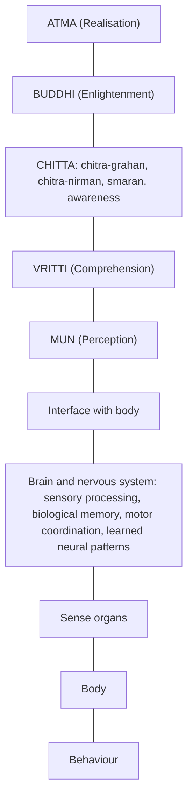

# Chitta, the Brain, and the Architecture of Memory — Study Proposal

**Author:** AnalyticMadhyasthDarshan working group.

**Proposed contributors:** Rakesh (originating idea, primary-text basis) and collaborators.

**Drafted on:** June 30, 2026, 7:30 AM IST

**Status:** Proposal (pre-study planning document)

**Subject area:** Philosophy of Mind, compared with cognitive science and the neuroscience of memory.

> This is a planning document, not the study itself. It states the question, the
> proposed thesis, the main problems we will have to solve, the research and
> (where possible) experimental work involved, and the literature we intend to
> read. It is written so it can stand on its own and be published in more than
> one venue.

## 1. Summary

This study asks a single, sharp question: **where does memory live, and what does each part of a human being actually remember?** Mainstream neuroscience has strong, well-replicated evidence that the brain encodes, stores, and retrieves information — synaptic plasticity, the hippocampus and consolidation, engram cells, procedural learning in the basal ganglia and cerebellum. Madhyasth Darshan attributes cognitive activity — image reception (*chitra-grahan*), image construction (*chitra-nirman*), and remembrance (*smaran*) — to *chitta*, a faculty of *jeevan*, not to the biological body.

The proposal develops a reconciling model: **the brain need not be the repository of all experiential content.** Instead there are **two complementary memory systems** — a *biological memory* belonging to the body (genetic, cellular, immune, neural, and sensorimotor continuities) and a *conscious remembrance* belonging to *jeevan* through *chitta* (reception, construction, and recall of meaning-laden experiential representations). The brain and nervous system are the **biological interface** for receiving sensation and executing action; *chitta* performs the value-bearing cognitive work.

The intellectual challenge is not to assert this model but to make it precise and to confront the hardest objections honestly: the interaction problem, the engram-implantation results, and the risk of unfalsifiability. The bulk of this proposal is therefore about **what work we must do** — careful textual exegesis of the primary Madhyasth Darshan sources, a disciplined synthesis of the memory literature, the search for *differential predictions* that could distinguish a two-system model from a brain-only account, and an honest assessment of what can and cannot be tested experimentally.

## 2. Audience and genre — philosophy or science?

This will be, in the first place, a work of **comparative philosophy of mind** — not an experimental science paper and not a devotional exposition. Its central claims are conceptual and interpretive: what *chitta* is said to do, how that maps onto the architecture of memory, and whether a two-system account is coherent and defensible. But it is philosophy written to **scientific standards of evidence and clarity**: it treats the neuroscience of memory as a hard constraint, represents the empirical findings accurately, and is willing to be embarrassed by them. It neither does new bench experiments nor pretends that philosophical argument can overrule replicated data.

So the honest label is **interdisciplinary, philosophy-led**. The empirical sciences enter as one leg of the comparison and as a source of constraints and candidate differential predictions; they are not the genre of the paper. Where the model makes contact with testable questions, we say so (§7); where it does not, we say that too.

The study is written for several overlapping readers, and the prose must serve all of them without collapsing into either jargon or sermon:

- **Students and practitioners of Madhyasth Darshan** who want an intellectually honest bridge between the darshan's account of *chitta* and what neuroscience has established about memory.
- **Philosophers of mind and cognitive scientists** interested in non-physicalist and dual-aspect accounts of memory, and in how such a model compares with Bergson, the extended-mind debate, and personal-identity theory.
- **Scientifically literate general readers** — including working scientists and engineers — curious whether anything rigorous can be said here without either dismissing the texts or suspending critical judgement.
- **Researchers at the science–contemplative interface** who work on memory, consciousness, and first-person methods.

The writing assumes scientific literacy but **not** a neuroscience or Sanskrit specialism: technical terms (neural and textual alike) are defined on first use. The aim is rigour a specialist will respect and accessibility a non-specialist can follow — comparative understanding, not persuasion.

## 3. The question and why it matters

Two facts sit in tension. First, neuroscience can disrupt, erase, and even artificially reactivate specific memories by intervening on neural tissue — strong evidence that the brain is *causally* central to remembering. Second, Madhyasth Darshan locates *chitra-grahan* and *chitra-nirman* in *chitta*, a faculty of *jeevan*, and treats meaning, value, and evaluation as *jeevan*'s work, not the body's.

A naive reading forces a false choice: either the brain is the whole story (and *chitta* is redundant), or the texts are right and the neuroscience must be wrong. The two-system model dissolves the dilemma by distinguishing **two kinds of memory with different jobs** — mechanical/biological continuity versus conscious remembrance of meaning. The study's contribution is to make that distinction precise, defensible, and honest about its evidential status, rather than to explain away either body of evidence.

## 4. Core thesis — two complementary memory systems

### 4.1 Biological memory (the body–brain system)

This belongs to the body, a constitution of the biological order. It includes:

- genetic memory (DNA), cellular memory, immune memory;
- neural memory and learned sensorimotor patterns;
- conditioned motor skills, language articulation, reflexes, habitual responses.

These are mechanical and biological continuities that depend on the organisation of the body. The body receives sensory stimuli and executes actions, but does not by itself perform value-based evaluation. The brain remembers **how** to do things — walking, writing, speaking, recognising a face, playing the piano.

### 4.2 Conscious remembrance (*jeevan*, through *chitta*)

*Jeevan* works through five faculties — *mun*, *vritti*, *chitta*, *buddhi*, *atma*. Among these, *chitta* performs three distinct activities:

- **Chitra-grahan (चित्र ग्रहण) — image reception.** Receiving impressions from experience. These are not merely visual: they span all sensory modalities (visual, auditory, tactile, olfactory, gustatory). In modern terms, *experiential representations* — though Nagraj Ji's *chitra* is broader than "image."
- **Chitra-nirman (चित्र निर्माण) — image construction.** *Chitta* does not merely replay impressions; it recombines, compares, and constructs new representations. This grounds imagination, planning, anticipation, creativity, and conceptual visualisation.
- **Smaran (स्मरण) — remembrance.** Recall of prior representations when required, supporting comparison, evaluation, learning, relationship, justice, and awakening.

*Chitta* remembers the **meaning** of experiences — relationships, values, justice, mistakes, responsibilities — and their reconstruction and reinterpretation.

### 4.3 The interface between *jeevan* and the brain

**Information flow, world → *jeevan*:** external world → sense organs → brain and nervous system → *mun* (perception) → *vritti* (comprehension) → *chitta* (receives representations via *chitra-grahan*, relates them to prior remembrance, constructs new representations via *chitra-nirman*) → *buddhi* (enlightenment) → *atma* (realisation).

**Information flow, *jeevan* → behaviour:** realisation → *buddhi* → *chitta* → *vritti* → *mun* → brain → motor system → behaviour.

### 4.4 Why both systems are indispensable

The brain provides the **biological organisation** needed to receive and express experience; *chitta* provides the **continuity of conscious experience** through reception, construction, remembrance, and awareness. They function in conjunction: the body's memory carries skill and form, *chitta*'s remembrance carries meaning and value.

## 5. Textual basis versus inference

The study must keep a clear line between **what Madhyasth Darshan explicitly states** and **what we infer**.

- **Explicit (textual):** *chitta* is responsible for *chitra-grahan* and *chitra-nirman*. This gives a textual basis for attributing conscious remembrance to *chitta*.
- **Inferred (explanatory model):** the further partition into *biological memory* (brain) and *conscious remembrance* (chitta) is a **coherent explanatory model built upon** those teachings, not a verbatim doctrine.

This model is philosophically strong because it lets us acknowledge well-established neuroscientific evidence for neural memory while preserving Madhyasth Darshan's account of higher cognition, meaning, evaluation, and awakening as activities of *jeevan*. The study must flag every inference as such and resist over-reading the texts.

## 6. Main issues we must tackle

These are the substantive problems the study has to solve. Each is a place where the model is most exposed; none can be skipped.

### 6.1 The interaction problem

If *chitta* is not the brain, how does it *read* sensory representations from neural tissue and *write* motor intentions back without a detectable violation of energy conservation or an unexplained causal anomaly in the brain's physical budget? This is the single hardest objection. The study must either (a) specify a coupling that is not energy-violating (e.g., a constraint/selection relation rather than a force), (b) argue the anomaly is real but below current detection thresholds and say what would detect it, or (c) concede the gap and locate the claim as principled-but-unverified. Hand-waving is not acceptable.

### 6.2 The engram-implantation challenge

Optogenetic activation and "implantation" of specific memories in animals, and the lesion/stimulation literature in humans, are the strongest evidence that *content* is neurally encoded. The study must state precisely what these experiments demonstrate — that a neural trace is **necessary** for, and can **trigger**, a remembered episode — and whether that is compatible with the brain being an *interface and store of form* while *chitta* supplies *meaning*. The distinction between a trace's **vehicle** and its **content/meaning** has to be made rigorous, or the model collapses into a relabelling exercise.

### 6.3 The falsifiability problem

A model that can absorb any neuroscientific result by reassigning it to "biological memory" is untestable. We must state, in advance, **what observation would count against** the two-system split — for example, a complete mechanistic account of valuation and meaning-recall that leaves *chitta* with no work to do, or conversely a reproducible dissociation that brain-only models cannot accommodate.

### 6.4 Meaning, value, and binding

The model's real claim is that *chitta* carries **meaning** while the brain carries **form/skill**. This requires a defensible account of what "meaning" is such that it is not just more neural pattern — and of how meaning gets *bound* to a neural trace at encoding and *re-bound* at recall. Without this, "the brain stores how, chitta stores meaning" is a slogan, not a theory.

### 6.5 Continuity, identity, and loss

If remembrance belongs to *chitta*, why do brain injury, anaesthesia, and dementia degrade or erase *meaningful* memory and personality, not merely skills? The study must address amnesia (e.g., hippocampal lesion cases), semantic dementia, and the apparent neural dependence of autobiographical memory — and say what, if anything, the two-system model predicts about edge cases such as paradoxical (terminal) lucidity.

### 6.6 Avoiding two failure modes

The exposition must avoid (i) **god-of-the-gaps** — assigning to *chitta* only what neuroscience has not yet explained, so the claim shrinks with every result; and (ii) **vacuous dualism** — positing *chitta* with no observable consequences. The way out is differential predictions (§7.3).

## 7. Research programme and the experimental question

The honest position is that a single knockdown experiment proving *chitta* is non-physical is almost certainly **not** available with current methods. What *is* available is a structured programme of textual, analytical, and empirical-synthesis work, plus the disciplined search for differential predictions and the careful examination of edge-case data. We set out four workstreams.

### 7.1 Primary-text exegesis (foundational, our own work)

Exhaustively extract, from the primary Madhyasth Darshan sources, every passage bearing on *mun*, *vritti*, *chitta*, *buddhi*, *atma*, and specifically on *chitra-grahan*, *chitra-nirman*, and *smaran*. Establish:

- exactly what is **explicitly attributed** to *chitta* (versus *vritti* or *buddhi*);
- whether the texts say anything about the **brain/body's** role in receiving and expressing;
- the precise sense of *chitra* (representation vs. "image");
- where our two-system partition is **inference**, marked as such.

This is original scholarly work and the spine of the study; it determines how much the rest can claim.

### 7.2 Synthesis of the memory sciences (literature work)

A disciplined review of the memory literature (§10), organised so that each finding is sorted into: (a) clearly *biological/bodily* memory; (b) clearly *meaning/value* memory; or (c) **contested**, where the two-system model and the brain-only model make the same or different predictions. The contested cell is where the study earns its keep.

### 7.3 Differential predictions (the closest thing to a test)

The model is only worth holding if it predicts something. Candidate places to look for a difference between a two-system account and a pure brain-only account:

- **Dissociations of skill from meaning** — cases where "how-to" memory is intact but the *valuation/relationship* memory is selectively disturbed, or vice versa, beyond what standard procedural/declarative dissociation already explains.
- **Persistence of personality and values under heavy neural degradation**, and reports of **paradoxical (terminal) lucidity** in advanced dementia, where coherent, meaning-laden remembrance briefly returns despite severe structural damage.
- **Veridical recall reported during periods of minimal measurable brain activity** (the near-death and cardiac-arrest literature) — to be examined critically, including the strong methodological objections.
- **Construction/imagination overlap** — the finding that remembering and imagining share machinery (constructive simulation) is a strong fit for *chitra-nirman*; the question is whether the two-system model adds any prediction beyond the neuroscientific account.

For each candidate we will state: what the two-system model predicts, what brain-only models predict, whether the data already exist, and what study design (even if only in principle) would discriminate them.

### 7.4 The experimental question — what is, and is not, feasible

We should be explicit about feasibility:

- **Feasible now:** systematic literature synthesis; re-analysis of existing dissociation, lesion, and lucidity case data against the model's predictions; conceptual modelling of a non-energy-violating coupling.
- **Feasible but hard:** pre-registered observational studies of edge cases (e.g., structured documentation of terminal-lucidity episodes); first-person/contemplative reports gathered with discipline.
- **Probably not feasible / out of scope:** any direct instrument-based detection of a non-physical *chitta* reading or writing to neurons, given no proposed mechanism and no candidate signal. The study should say so plainly rather than imply an experiment it cannot specify.

The deliverable of this workstream is an honest **"what would move the debate"** section: the observations that would support, weaken, or be neutral to the model.

## 8. Proposed structure of the eventual study

1. **The question** — where memory lives; the two-facts tension (§3).
2. **The Madhyasth Darshan account** — *chitta* and *chitra-grahan / chitra-nirman / smaran*; the five faculties; the interface model; explicit text vs. inference (§§4–5).
3. **The neuroscience of memory** — taxonomy (declarative/non-declarative, episodic/semantic, working memory), molecular and systems basis (LTP, hippocampus, consolidation, engram cells), reconstruction and reconsolidation, memory–imagination overlap, and biological/cellular/immune/genetic memory.
4. **Comparison and the contested cases** — the parallel reading of §7.2–§7.3, with Bergson's *habit-memory vs. recollection* as the closest Western parallel and a brief Advaita comparison.
5. **Main issues and critical review** — the problems of §6, with strengths and weaknesses argued, not asserted.
6. **What would move the debate** — differential predictions and feasibility (§7.3–§7.4), and open problems.

A standpoint-and-scope section and a glossary will be added when the study is written up.

## 9. Standpoint and scope (to carry into the study)

The study will be written from a scientist/technologist standpoint — trained in graduate physics and mathematics, acknowledging matter-first science while not treating the hard problem, the self, and value as settled for materialism. Method: read the primary Madhyasth Darshan texts; state the darshan; then compare in parallel with **neuroscience and cognitive science**, **the philosophy of memory and mind**, and **Advaita Vedanta**. Empirical science is one leg of the comparison, not the only one. Aim: rigorous comparative understanding, not persuasion.

## 10. Reading list — the modern science of memory we plan to study

These are the works we intend to read for the neuroscience and philosophy leg, grouped by theme, each with a note on how it bears on the model. DOIs are given where stable.

### 10.1 Memory systems — taxonomy and architecture

- **Atkinson, R. C., & Shiffrin, R. M. (1968).** "Human memory: A proposed system and its control processes," in *The Psychology of Learning and Motivation*, Vol. 2. — The multi-store model (sensory register → short-term → long-term). *Bears on:* the staged flow sense-organs → *mun* → *vritti* → *chitta*.
- **Tulving, E. (1972).** "Episodic and semantic memory," in *Organization of Memory*. — The episodic/semantic distinction; later mental time travel. *Bears on:* recalling *an experience* (chitra) versus *meaning*.
- **Baddeley, A. D., & Hitch, G. (1974).** "Working memory," in *The Psychology of Learning and Motivation*, Vol. 8. — Active manipulation/construction in short-term stores. *Bears on:* *chitra-nirman* as recombination.
- **Squire, L. R. (2004).** "Memory systems of the brain," *Neurobiology of Learning and Memory*, 82(3), 171–177. [doi:10.1016/j.nlm.2004.06.005](https://doi.org/10.1016/j.nlm.2004.06.005) — Declarative vs. non-declarative taxonomy. *Bears on:* the biological-memory inventory in §4.1.

### 10.2 Neural and molecular basis (the engram)

- **Hebb, D. O. (1949).** *The Organization of Behavior.* — Cell assemblies; "cells that fire together wire together." *Bears on:* a mechanism for neural memory.
- **Lashley, K. S. (1950).** "In search of the engram," *Symposia of the Society for Experimental Biology*, 4, 454–482. — The distributed, hard-to-localise trace. *Bears on:* whether the brain "stores" content at all.
- **Bliss, T. V. P., & Lømo, T. (1973).** Long-term potentiation, *Journal of Physiology*, 232(2), 331–356. [doi:10.1113/jphysiol.1973.sp010273](https://doi.org/10.1113/jphysiol.1973.sp010273) — The synaptic-plasticity substrate. *Bears on:* the physical correlate of learning.
- **Kandel, E. R. (2006).** *In Search of Memory.* — Molecular biology of memory storage (Nobel work on *Aplysia*). *Bears on:* the strongest case that memory is biochemically encoded.
- **Tonegawa, S., et al. (2015).** "Memory engram cells have come of age," *Neuron*, 87(5), 918–931. [doi:10.1016/j.neuron.2015.08.002](https://doi.org/10.1016/j.neuron.2015.08.002) — Optogenetic activation/implantation of specific memories. *Bears on:* the engram-implantation challenge (§6.2).

### 10.3 Hippocampus, consolidation, and amnesia

- **Scoville, W. B., & Milner, B. (1957).** "Loss of recent memory after bilateral hippocampal lesions," *J. Neurol. Neurosurg. Psychiatry*, 20(1), 11–21. [doi:10.1136/jnnp.20.1.11](https://doi.org/10.1136/jnnp.20.1.11) — Patient H.M. *Bears on:* the loss/continuity problem (§6.5).
- **McGaugh, J. L. (2000).** "Memory — a century of consolidation," *Science*, 287(5451), 248–251. [doi:10.1126/science.287.5451.248](https://doi.org/10.1126/science.287.5451.248) — Consolidation and emotional modulation. *Bears on:* time-course of storage.

### 10.4 Memory as reconstruction (not replay)

- **Bartlett, F. C. (1932).** *Remembering.* — Schema-driven reconstruction. *Bears on:* *chitra-nirman* and reinterpretation.
- **Loftus, E. F. (2005).** "Planting misinformation in the human mind," *Learning & Memory*, 12(4), 361–366. [doi:10.1101/lm.94705](https://doi.org/10.1101/lm.94705) — Memory is editable and constructive. *Bears on:* recall as reconstruction.
- **Nader, K., Schafe, G. E., & LeDoux, J. E. (2000).** "Fear memories require protein synthesis in the amygdala for reconsolidation after retrieval," *Nature*, 406, 722–726. [doi:10.1038/35021052](https://doi.org/10.1038/35021052) — Reconsolidation: recalled memories are re-encoded. *Bears on:* the dynamic character of *smaran*.

### 10.5 Memory, imagination, and prediction (closest to *chitra-nirman*)

- **Schacter, D. L., Addis, D. R., & Buckner, R. L. (2007).** "Remembering the past to imagine the future: The prospective brain," *Nature Reviews Neuroscience*, 8, 657–661. [doi:10.1038/nrn2213](https://doi.org/10.1038/nrn2213) — Constructive episodic simulation: imagining and remembering share machinery. *Bears on:* the unity of grahan/nirman/smaran.
- **Hassabis, D., & Maguire, E. A. (2007).** "Deconstructing episodic memory with construction," *Trends in Cognitive Sciences*, 11(7), 299–306. [doi:10.1016/j.tics.2007.05.001](https://doi.org/10.1016/j.tics.2007.05.001) — Construction as the core operation.
- **Clark, A. (2016).** *Surfing Uncertainty: Prediction, Action, and the Embodied Mind.* — Predictive processing; perception as construction. *Bears on:* a framework where the brain *builds* representations.

### 10.6 Procedural / non-declarative, and biological/cellular memory

- **Schacter, D. L. (1996).** *Searching for Memory.* — Accessible synthesis of memory systems. *Bears on:* the skill/"how-to" memory of §4.1.
- Literature on **basal ganglia and cerebellum in motor learning**, **immunological memory** (B/T memory cells, e.g. *Janeway's Immunobiology*), and **epigenetic/transgenerational memory** (review to be selected). *Bears on:* the bodily, non-conscious memory of §4.1.

### 10.7 Philosophy of memory and mind (comparative leg)

- **Bergson, H. (1896/1991).** *Matter and Memory.* — **Habit-memory** (bodily, mechanical) vs. **pure memory / recollection** — the closest Western parallel to the brain/*chitta* split, and a likely anchor for the comparison.
- **Locke, J. (1689).** *An Essay Concerning Human Understanding*, II.27; **Parfit, D. (1984).** *Reasons and Persons.* — Memory and personal identity / psychological continuity. *Bears on:* whether continuity of remembrance grounds identity.
- **Clark, A., & Chalmers, D. (1998).** "The extended mind," *Analysis*, 58(1), 7–19. [doi:10.1093/analys/58.1.7](https://doi.org/10.1093/analys/58.1.7) — Where the boundaries of memory and mind fall. *Bears on:* whether "storage" must be inside the skull.
- **Advaita Vedanta** — *smriti* (memory) as a modification of the inner instrument (*antahkarana*) witnessed by, but not identical with, consciousness; to be cited from the standard Upanishads and *Vivekachudamani*. *Bears on:* a third reading in which memory belongs to neither brain nor an individual *jeevan*, but to witnessed mind.

## 11. Work plan and next steps

**Method.** Read the primary Madhyasth Darshan texts on the faculties first and lock the explicit-vs-inferred boundary (§7.1); then complete the memory-literature synthesis (§7.2); then build the differential-predictions and feasibility analysis (§7.3–§7.4); finally write the comparison and critical review.

**Suggested division of work.**

- **Rakesh:** primary-text basis — confirm and quote the *chitta* / *chitra-grahan* / *chitra-nirman* / *smaran* passages; mark the explicit-vs-inferred boundary.
- **Collaborators:** the memory-science and philosophy synthesis (§10), the differential-predictions analysis, and the write-up.

**Immediate next steps.**

1. Review and refine this proposal; lock the question and the section outline (§8).
2. Pull the exact primary-text citations for §4 from the sources below.
3. Decide which §10 items to read first (anchor: Bergson, Schacter/Addis, Tonegawa, Squire).
4. Draft §§3–5, then the main-issues analysis (§6).

## 12. Where to submit — target venues and organizations

Two different outputs need two different homes: the **comparative philosophy paper** (the main deliverable) targets peer-reviewed journals and scholarly conferences, while the **harder empirical edge-case work** of §7.4 (terminal lucidity, dissociation studies) is what one would take to a research funder. The realistic primary targets are consciousness-studies and comparative-philosophy venues; mainstream empirical neuroscience journals (e.g., *Neuron*, *Nature Neuroscience*) are not realistic homes for a non-physicalist thesis and are noted only as the audience whose evidence we must satisfy. We should also choose framing carefully: present the work as rigorous comparative philosophy of mind, not as advocacy, so it lands in serious venues rather than fringe ones.

### 12.1 Peer-reviewed journals (philosophy paper)

- **Journal of Consciousness Studies** (Imprint Academic) — interdisciplinary; a long record of publishing Indian-tradition and consciousness work. Best primary target.
- **Philosophy East and West** (University of Hawai'i Press) — comparative philosophy; regularly publishes consciousness, self, and cognition across Indian traditions. Strong fit for the Madhyasth Darshan comparison.
- **Journal of Indian Philosophy** (Springer) — for the textual/exegetical core (§7.1).
- **Journal of the Indian Council of Philosophical Research** (Springer / ICPR) — Indian philosophy and philosophy of mind.
- **Phenomenology and the Cognitive Sciences** (Springer) — first-person method meets cognitive science.
- **Review of Philosophy and Psychology** (Springer) — philosophy of mind engaging empirical results.
- **Frontiers in Psychology** — *Consciousness Research* / *Theoretical and Philosophical Psychology* sections — open access; has published hypothesis papers bridging Indian thought and Western theory. Good for reaching scientists.
- **Mind & Matter** (Imprint Academic) and **Religious Studies** (Cambridge; recent panpsychism/pan(en)theism issues) — secondary options for the metaphysics-of-self angle.

### 12.2 Societies and conferences

- **Association for the Scientific Study of Consciousness (ASSC)** — annual meeting; rigorous, empirically oriented.
- **The Science of Consciousness (TSC)**, Center for Consciousness Studies, University of Arizona — interdisciplinary; welcomes contemplative and Eastern contributions.
- **Mind & Life Institute** — contemplative science dialogues and the Summer Research Institute (cross-tradition, historically Buddhist-leaning).
- **Indian Council of Philosophical Research (ICPR)** — seminars and conferences in India.
- **World Congress of Philosophy (FISP)** and the **American Academy of Religion (AAR)** — for the comparative-philosophy and religion audiences.
- **India-based cognitive/consciousness groups** worth approaching: NIMHANS (Bengaluru), IIT Gandhinagar, the University of Hyderabad (cognitive science / philosophy), and IIT Kanpur.

### 12.3 Research funders and organizations (for the empirical edge-case work)

- **Bial Foundation** (Portugal) — funds psychophysiology and consciousness research on the "healthy human being"; grants up to €60,000, 2026/2027 call open until 31 August 2026 ([bialfoundation.com](https://bialfoundation.com/com/grants)). Strong fit for the terminal-lucidity / minimal-brain-activity studies — though its parapsychology framing calls for careful positioning.
- **Mind & Life Institute** — Francisco J. Varela grants (up to $25,000, early-career; preference for first-person/contemplative methods; requires Summer Research Institute attendance) ([mindandlife.org/grants](https://www.mindandlife.org/grants/)).
- **John Templeton Foundation** — a major funder of science-and-philosophy "Big Questions," consciousness, and mind work; suited to a larger interdisciplinary proposal.
- **Institute of Noetic Sciences (IONS)** and the **Tiny Blue Dot Foundation** — consciousness research, including near-death and perception studies.
- **Scientific and Medical Network / Galileo Commission** (UK) — a venue and network for "post-materialist" science; useful for dialogue, with the same positioning caution as above.

### 12.4 Preprints and open dissemination

Post the manuscript to **PhilArchive** / **PhilSci-Archive** (philosophy) and **PsyArXiv** or **OSF** (psychology/cognitive science) for early feedback and open access ahead of journal submission.

## References

### Madhyasth Darshan (primary sources)

- **AVD** — Nagraj, A. [*Adhyatmvad* (Spiritualism)](../References/Madhyasth-Darshan/AVD-Adhyatmvad.docx.pdf). *For:* *jeevan*, *atma*, and the inner faculties — the primary source to confirm *chitra-grahan* and *chitra-nirman*.
- **MVD** — Nagraj, A. [*Madhyasth Darshan – Co-existentialism*](../References/Madhyasth-Darshan/MVD-Madhyasth-Darshan-Coexistentialism.pdf). English translation by Rakesh Gupta. *For:* the faculties, the brain as *medhas*/medium, and the knowledge order.
- **JV** — Nagraj, A. [*Jeevan Vidya: An Introduction*](../References/Madhyasth-Darshan/JV-Jeevan-Vidya-An-Introduction.pdf). English translation by Rakesh Gupta. *For:* values and evaluation as *jeevan*'s work; the body as vehicle.
- **SB** — Nagraj, A. [*Samadhanatmak Bhautikvad*](../References/Madhyasth-Darshan/SB-Samadhanatmak-Bhautikvad.pdf). English translation by Rakesh Gupta. *For:* the body–*jeevan* distinction; sleep as a bodily activity.
