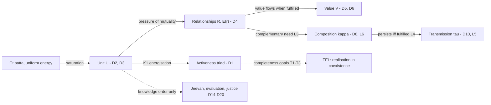
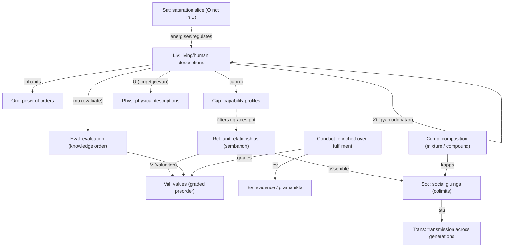

# Coexistence From First Principles

## The kernel, template, and formal theory of Madhyasth Darshan

**Author:** [AnalyticMadhyasthDarshan.org](https://github.com/raghavamohan/AnalyticMadhyasthDarshan) — a group of people studying Madhyasth Darshan philosophy. Source repository: [raghavamohan/AnalyticMadhyasthDarshan](https://github.com/raghavamohan/AnalyticMadhyasthDarshan).

**Edited on:** July 3, 2026, 2:05 PM IST
**Status:** Draft
**The thesis:** Madhyasth Darshan's ontology can be generated from a kernel of co-eternal *satta* and countable units under saturation, with **activeness** — the inseparable triad of effort, motion, and result — as how a saturated unit manifests, not as a substrate from which units are constructed. From that kernel this paper constructs the full tier-neutral structure of the darshan: units as real *ikai*, relationships as definite couplings, value as what a coupling realises, composition as coupling that closes a new boundary, and transmission as the composition method recurring across member turnover — stated as one formal template of twenty definitions, seven laws, and six propositions, each grounded in the primary texts. A **recovery audit** classifies every clause as *derived* from the kernel, *definitional*, or *substantive textual data*, and a categorical formalisation supplies precise notation for the parts of the structure mathematics can carry — functors, enrichment, colimits, traced monoidal processes, Petri bookkeeping, faculty adjunctions, and an operadic sketch — while naming exactly where the notation stops.

Madhyasth Darshan's exposition is layered: *Samadhanatmak Bhautikvad* opens with fully general assertions about units, energy, and activity before any particular order is discussed, and *Manav Vyavahar Darshan* derives its human programme from the same general ground. This paper reads that layering generatively. It states the head of the chain as a formal kernel (§2), constructs the rest as a template whose clauses follow the texts' own generative order (§§3–5), audits every clause against the kernel (§6), and then gives the mathematics — category-theoretic where the fit is real, operadic where the kernel suggests its own form (§7). What the construction cannot produce, it names: the taught content of the darshan — the specific virtues, the value taxonomy, the transmission carriers, the restriction of evaluation to *jeevan* — held out in the open rather than smuggled into the formalism.

## 1. Why a kernel, and what counts as success

A natural reading of Madhyasth Darshan focuses on its human programme: justice in relationships, family-based order, humane education. On that reading, the recurring pattern — units forming larger wholes through valued relationships — looks like a human story that one might *extrapolate* to atoms and cells. The texts support a stronger position: the general structure is asserted first, and the human case is derived as its hardest instance. The opening analysis of *Samadhanatmak Bhautikvad* states it in fully general terms:

> **"Each unit is a whole along with its environment."**
> — SB p. 13–14

> **"Each unit is orderliness with its ness and participates in overall orderliness."**
> — SB p. 13–14 (*ness* = *self-ness* in the bilingual edition; PDF extraction drops the prefix)

> **"Each unit moves towards development in its natural state and decline in its excited state."**
> — SB p. 13–14

The same universality appears in *Manav Vyavahar Darshan*:

> **"All units saturated in the Omnipresence (permeative and transparent) have form, properties, essential nature & dharma, and have inherent orderliness & participate in overall orderliness."**
> — MVD p. 11

So the task is not extrapolation but **articulation** — making explicit, in one formal structure, what the texts assert piecewise about atoms (MVD p. 8; JV p. 67), cells (JV p. 82), organisms (SB p. 16), and human collectives (MVD p. 55, p. 161) — and then **reduction**: a formalisation earns its keep only if it can say precisely what was gained and what was assumed. A flat list of primitives conceals dependency structure: units are **primitive** and saturated in O; bounded triadic activity is how they **manifest**; relationships are *defined* over units; value is *defined* as what flows in relationships — the template clauses lean on one another in a definite **expository** order that is not the same as ontological construction. The kernel makes that order load-bearing for the audit. Success is measured clause by clause: a construction counts as a **derivation** when a template clause follows from kernel axioms plus definitions; as **definitional** when it merely names structure the kernel already contains; and as **substantive data** when the texts assert content no kernel manipulation could produce — the specific six virtues, the four carriers of transmission, the restriction of evaluation to *jeevan*. The audit (§6) assigns one of these three statuses to every clause, and §11 states the irreducible remainder plainly.

Precision has an applied point as well. Shri Nagraj elaborated the structure in depth for a single tier — the human — and asserted, but did not work out, its operation at the others. A tier-neutral formal statement lets the same structure be **carried to systems he did not himself analyse**, in two directions. **Forward, as design:** given a system one wishes to build — an organisation, an economy, an institutional architecture — the template supplies a constructive checklist of what a stable assembly requires: identifiable units, definite relationships with explicit expectation profiles, capacity sufficient for value to flow, composition by complementary need rather than competition, persistence conditional on fulfilment, and an explicit carrier of transmission across member turnover. **In reverse, as diagnosis:** given a failing system, walk the clauses and find the one that is unmet — a relationship unrecognised, its value unfulfilled, blocked by insufficient capacity, mis-evaluated, extracted beyond regeneration, or never transmitted to the next generation of members. Each unmet clause names a specific, addressable failure, and the knowledge-order discontinuity (P3) predicts that human-tier systems fail at exactly the understanding-dependent steps first.

Three cautions govern everything that follows. The texts *assert* piecewise; this paper *derives* — every derivation is this paper's construction, warranted by citations but not identical with them. The formalism is a **lens for clarity**, not a proof machine: it does not prove the metaphysics, and several axioms (notably the reality of the medium and of *jeevan*) are exactly the points where Madhyasth Darshan differs from mainstream science. And a reduction can flatten: the review of Meena's topos-theoretic formalisation (§7.11) found a single-sort predicate ledger discarding precisely the structure a formalisation of this darshan must keep. The kernel avoids that fate by keeping **units** as co-eternal with O — not featureless points, not derived from activity clusters — and by refusing to derive what the texts present as content. One scope note: the template's textual warrant is drawn from *Manav Vyavahar Darshan*, *Samadhanatmak Bhautikvad*, and *Jeevan Vidya*; the corpus also contains *Vyavaharatmak Janvad* and *Anubhavatmak Adhyatmvad*, which this paper does not yet cite — their social-order and spiritual content is a named extension, not silently covered.

## 2. The kernel

### 2.1 Primitives

**O** (*satta*, Omnipresence). The indivisible, omnipresent, actionless reality: "Space is uniform in all dimensions… this reality is omnipresent" (JV p. 31). O is state-complete while everything else is state-dynamic (MVD p. 12); it is energy in equilibrium and knowledge-natured (*gyan*), the intelligibility-ground of whatever is saturated in it (MVD p. 11). O is not a unit, and statements that quantify over units never apply to O.

**U** (units, *ikai*). The co-eternal primitive alongside O: "Nature is in the form of entities that can be counted" (JV p. 45). Units are real wholes — not clusters assembled from free-floating activity, not logical constructions from occasions of becoming. Every unit is saturated in O; saturation is the first relation, not a later overlay on independently existing points.

**Saturation.** The primitive relation between O and every unit: soaked, surrounded, submerged — and O is not a unit. "There is no provision in existence to separate units of nature from Omnipresence" (JV p. 18). Saturation is constitutive co-location, not containment of one thing inside another thing of the same kind. It names the first ontological relation — between the medium and every unit — distinct from unit-to-unit relationships, and it is not physical extraction or depletion of O: inherent energy and regulation belong to the saturated unit through the relation itself (SB pp. 49, 62).

**A** (activeness). The manifest display of a saturated unit: every unit is active because it is replete with energy through saturation, and that activeness **is** the inseparable triad of **effort** (*shram*), **motion** (*gati*), and **result** (*parinam*) — each aspect the joint form of the other two (MVD p. 105); their combined activity is *mool cheshta*, basic impulsion (MVD p. 40). Formally, activeness is a family indexed by units — a functor **Act : U → Triad** in §7 — not a substrate from which units are built. The texts state the identity directly:

> **"Unit + Energy fullness = Activeness"**
> — SB p. 69

Read as definitional co-presence, not as a construction recipe that derives units from activity.

### 2.2 Kernel axioms

**K1 (Energisation).** Every unit is energy-replete through saturation, and activeness is neither created nor destroyed — results transform it, they never annihilate it. The texts state the equation directly:

> **"Nature is the set of countless units. The fundamental unit of nature is the atom. Every unit in its atomic state is active as orderliness, because it has inherent energy due to being saturated in Omnipotence. There is no unit or particle in nature which is not replete with energy. Every unit is active because of this itself. This activeness is seen in every unit in the form of effort, motion and result."**
> — SB p. 69

"Unit + Energy fullness = Activeness" (SB p. 69): one uniform energy manifests as the triad in every saturated unit.

**K2 (Motion-path regulation).** Each unit's activeness runs along the motion-path of its particles; that path is simultaneously the unit's line of regulation and its boundary — it does not *construct* the unit from activity, it describes how unit-activity is disciplined:

> **"Every atom’s activity is along with the motion-path of its particles. This motion-path itself is that atom’s line of regulation and also its boundary."**
> — SB p. 58

The same closure that bounds also regulates: boundary and discipline are one structure, which is why the regulation ladder (D12) can begin inside the unit rather than descending on it. O has no motion-path and is therefore not a unit.

**K3 (Coupling).** Unit-activities couple: one unit's results enter another's as input, and no unit is uncoupled — "Nothing is isolated – that is the principle" (JV p. 43). The texts name the coupling's contribution explicitly:

> **"The development and order of matter depend on that unit’s motion, effort, and pressure of its mutuality - by which integration, disintegration, and result take place."**
> — MVD p. 114

The definite form of coupling is complementarity of deficiency and surplus — development progression operates "in the atom in the form of hungry and overfull atoms" (MVD p. 8). Coupling is primitive in form; *which* couplings are admissible is content the texts supply case by case.

**K4 (Recognition-as-law).** Saturation provisions recognition: "Regulation itself becomes clear in the form of law. Consequently, there is provision in every unit for recognising one another based on law" (SB p. 57). Recognition is therefore not an added cognitive faculty at the bottom tiers; it is the lawfulness of coupling itself.

**K5 (Completeness orientation).** Each triad aspect has a completeness goal:

> **"Every atom continues to undergo insertion and expulsion of particles until constitutional completeness, because every atom exists in the form of activity, and every activity has an inseparable presence of effort, motion, and result. The result is meant to attain the goal of immortality, the effort is meant to attain the goal of restfulness, motion is meant to attain the goal of destination. This goal itself becomes evident in the form of development progression and development."**
> — SB p. 71

Development is thereby directed without being an optimisation: the goals are terminal states (immortality, restfulness, destination), not maxima — the distinction §9 defends at length.

### 2.3 Corollaries the texts also assert as first principles

Three assertions the texts state independently follow from the kernel and are recorded here so the audit can classify them. **Conservation:** existence is beginless and stable — "Existence neither increases nor decreases" (JV p. 127); results transform activity, they never annihilate it — a corollary of K1. **No isolation:** every unit participates in at least one relationship — the totality clause of K3, asserted directly at JV p. 43. **Inherent orderliness:** every unit is orderliness in itself and a participant in the overall orderliness (MVD p. 11; SB p. 13) — K2's motion-path is the unit's own orderliness, and participation follows from K3. There is no "loose matter" outside the structure — and without primitive units (U), there is no countable ontology for the template to quantify over.

## 3. Notation in brief

The template of §4 uses only sets, operators, and typed tuples. The formal theory of §7 uses category theory, and this section gives the working vocabulary in plain language so the paper is self-contained; readers at home with the mathematics can skip to §4.

Category theory is built on a single shift in attention: stop asking only "what is each thing made of?" and start asking "how does each thing relate to everything else?". An **object** is a thing to talk about — concrete (a body, a family) or abstract (justice, fulfilment). A **morphism** (arrow) is a relationship or a way of getting from one object to another. **Composition** chains arrows: an arrow from A to B and one from B to C yield one from A to C. Every object has an **identity** arrow to itself. That is the entire foundation; the remaining tools are built from it:

| Tool | Plain-language meaning | How this paper uses it |
|------|------------------------|------------------------|
| **Functor** | A translation from one world of things-and-arrows to another that keeps structure intact | Turning relationships into the values they should fulfil |
| **Forgetful functor** | A translation that deliberately throws away information | Describing a human using only physics, dropping values and *jeevan* (§7.3) |
| **Natural transformation** | A consistent, across-the-board upgrade from one way of doing things to another | Shifting from consumption to right-use everywhere at once (§7.7) |
| **Retract** | A part that sits inside a whole, where the whole cannot be rebuilt from the part alone | Comfort as a real part of fulfilment, not the whole of it (§7.5) |
| **Colimit (gluing)** | Joining many pieces into one consistent whole along what they share | Families joining into one undivided society (§7.8) |
| **Enrichment** | Recording not just whether a relationship holds but of what quality or grade | Graded values and kinds of satisfaction (§7.6) |
| **Fibred / indexed structure** | Structure that varies with who is acting | Fulfilment modulated by capacity, ability, and receptivity (§7.6) |
| **Trace / feedback** | A wire that feeds an output back as a simultaneous constraint on inputs | The joint-form activity triad — effort, motion, and result co-present (§7.10) |
| **Monoidal / Petri process** | Resource-sensitive transitions that consume inputs and produce outputs | κ_comp bookkeeping along *vikas-kram* (§7.10) |
| **Operad (boxes and wiring)** | Boxes with typed ports, wired together and collapsible into one box | The kernel's own mathematics: units, couplings, and compound composition (§7.12) |

The formal theory obeys five design rules. **One kind of morphism per category** — causal, developmental, epistemic, and normative arrows live in different categories, connected by functors. **Composition and identities must be specified and associative** — otherwise the structure is a labelled graph, and is labelled as such. **Universal properties must be stated and, where claimed, checked.** **Every nontrivial claim names its hidden premise** — where a conclusion depends on a contested Madhyasth assumption, the premise is stated, and the categorical step is valid only relative to it. **Propositions are conditional, not theorems about reality** — nothing here proves *jeevan*, constitutional completeness, or coexistence. One background fact shapes the deepest limit of the whole project: category theory is structuralist — by the Yoneda principle an object is determined entirely by its pattern of relations — while the darshan holds that *jeevan* is a substantial entity, not merely a relational role (§7.11).

## 4. The formal template

The clauses below are not a flat list: the texts assert them in a generative order, and the numbering now follows that order. Omnipresence saturates every unit (K1); repleteness is manifest as the triad of effort, motion, and result (D1); each unit carries a signature and is regulated along its motion-path (D2–D3); results depend on the pressure of mutuality (MVD p. 114), which is where relationships (D4) and the values flowing in them (D5–D7) enter; complementary need drives units into composition (D8, L3), composed assemblies persist exactly as long as their relationships are fulfilled (D9, L4), and persisting assemblies transmit their method of composition across member turnover (D10, L5). The orders classify how a unit's method persists (D11–D13), and the knowledge order adds evaluative and epistemic registers over the same chain (D14–D20) — which is why the chain's execution is definite everywhere except at the human tier.



### 4.1 Primitives

The kernel supplies the primitives: **O**, the omnipresent medium; **U**, the set of units (countable — "Nature is in the form of entities that can be counted", JV p. 45); **saturation** between O and every u ∈ U; and **A**, activeness as the triad fibred over units. The further sorts the clauses quantify over are **R ⊆ U × U**, relationships (*sambandh*, MVD p. 61); **V**, values (*mulya*) — the content exchanged in relationships (SB p. 50); **κ**, the composition operator (JV p. 67); and **τ**, the transmission operator (JV pp. 48, 51). O is not a member of U.

### 4.2 Definitions

**D1 (Activity triad).** Every activity carries an inseparable triad — **effort** (*shram*), **motion** (*gati*), and **result** (*parinam*) — and the triad is how saturation-energisation (K1) becomes evident: a unit is active *because* it is replete with energy through saturation, and that activeness *is* the triad (SB p. 69). The triad's internal constitution is a joint form, not a sequence — each moment is the outcome of the other two (MVD p. 105); their combined activity is basic impulsion (*mool cheshta*, MVD p. 40). Nor is the triad confined within the unit: results arise from effort, motion, *and* the pressure of mutuality (MVD p. 114) — integration and disintegration are themselves results, and results exchanged between units are the currency of composition, so the triad is the interface at which relationships (D4) and composition (D8) act on a unit. Each moment has completeness as its goal (K5): immortality of result, restfulness of effort, destination of motion (SB p. 71) — the engine of the completeness stages in D13. In the knowledge order the triad returns in two further registers: *chitta* visualises through eight activities that include effort, motion, and result themselves (MVD p. 327), so the triad is also a category of understanding; and human effort becomes **labour**, whose deployment on natural abundance through body and mind is the basis of prosperity and the source of utility value (JV pp. 128–129, 155). Even at completeness effort does not cease — upon attaining immortality "there is no lack of effort in the activity of 'jeevan'" (MVD p. 78); completeness ends frustration, not activity. *Kaal* (time) is the duration of activity — the temporal reading is developed in [Nature of Time](../Nature-Of-Time/Nature-Of-Time.pdf) §1.1 and not formalised here.

**D2 (Unit).** A unit is a saturated whole in U — co-eternal with O, not derived from activity clusters. Its activeness is the triad (D1), disciplined along the motion-path that is simultaneously its boundary and line of regulation (K2). Insentient units are "active within the bounds of their length, width and height"; sentient units are "active in [the medium] beyond the bounds of their length, width and height" (MVD p. 33) — the motion-path bounds the activity's *extent* without necessarily bounding its *reach*. An **atom** (*parmanu*) is not an elementary particle of physics: its kind, state, and measure are fixed by the number of particles in its nucleus (*madhyansh*) and its orbiting dependent particles (MVD p. 42). **Constitutional completeness** (*gathanpurnata*) is reached when a composite atom integrates the required number of such particles into a stable compound configuration (D8; SB pp. 55, 59) — functionally indivisible and sentient as *jeevan* (D14), not a point-like substrate.

**D3 (Unit signature).** Each unit u ∈ U carries an intrinsic four-tuple — form (*roop*), properties (*gun*), essential nature (*svabhav*), *dharma* — written **sig(u) = ⟨roop, gun, svabhav, dharma⟩** (MVD p. 11). Properties in every order are generative, degenerative, and mediative — assisting creation, dissolution, and sustainment in mutuality (MVD pp. 50–51). Each order fixes characteristic *svabhav* and cumulative *dharma* (MVD pp. 50–51; SB p. 50):

| Order | Essential nature (*svabhav*) | *Dharma* (cumulative) |
|---|---|---|
| Material (*padarth*) | integration–disintegration | existence (*astitva*) |
| Bio (*pran*) | vitalising–devitalising | + growth (*pushti*) |
| Animal (*jeev*) | cruel–uncruel | + hope to live |
| Knowledge / human (*gyan*) | fortitude, courage, generosity, kindness, grace, compassion | + happiness (*sukh*) |

Compound assemblies inherit a new sig(·) at each tier (D8); the four-aspect signature iterates with every genuine new unit.

**D4 (Relationship and association).** A **relationship** is "the mutuality where expectations are predetermined in the sense of completeness"; an **association** is "the mutuality where expectations are voluntary" (MVD p. 61–62). Formally, each r = (u₁, u₂) ∈ R carries an expectation profile **E(r)**; r is a relationship if E(r) is fixed by the orders and signatures of u₁, u₂, and an association if E(r) is adopted.

**D5 (Value).** The value of a unit *in* a relationship is its **essentiality** (*maulikta*) — its usefulness and complementarity, its participation-as-value in mutuality. This is general, not human-specific:

> **"Entire beingness implies the essentiality of units in every plane and order. Essentiality refers to value… It is values that are reciprocated and mutually recognised, as complementarity, mutual recognition, and impression occur only in mutuality."**
> — SB p. 50

Formally, a valuation **v: R → V** assigns to every relationship the value flowing in it. The value set **V is not flat**: the texts sort essentiality into **six kinds** (MVD p. 306; JV pp. 43, 138–139). At every order, **object values** — utility and art — operate wherever production and exchange occur; the remaining four kinds operate only at the knowledge order and presuppose *jeevan*:

| Value type | What it is | Operates in |
|---|---|---|
| **Object values: utility** (*upyogita*) | Usefulness of natural abundance made available through labour; definite and constant across time | All orders; human–nature relation (JV pp. 123, 138) |
| **Object values: art** (*kala*) | Aesthetic enhancement that adds convenience to usefulness (MVD p. 324) | All orders where production layers aesthetics on utility |
| ***Jeevan* values** | Happiness, peace, contentment, bliss — harmonies within the sentient unit across faculty pairs | Knowledge order (JV p. 138) |
| **Human values** | Values of humane living grasped through coexistence understanding | Knowledge order (JV pp. 44, 139) |
| **Established values** | Care, guidance, trust, affection, gratitude, glory, love, reverence, respect — nine relationship values that flow when relationships are recognised | Knowledge order; mutuality (JV pp. 108, 138) |
| **Expression values** (*civic* in MVD/JV) | Right-use of body, mind, and wealth; conduct evidencing values in the social order | Knowledge order; assembly participation (MVD p. 306) |

The established values are not produced deliberately; they *flow* from *jeevan* the moment a relationship is recognised: "when a mother has recognised her child then motherly care starts surging by itself from her. No five-year plan is needed for that!" (JV p. 138). They also have an internal generative order — "With gratitude, other values start to manifest. Following gratitude, the values of affection, love, and trust naturally develop" (JV p. 108) — so V carries a partial ordering, not just a membership list.

**D6 (Recognition and fulfilment).** Recognition **ρ** is a unit's identification of a relationship and its expectation profile; fulfilment **φ** is conduct that delivers v(r) in accordance with E(r). "Fulfilling is to evidence use, right-use and purposeful-use" (MVD p. 27); at the knowledge order, "Fulfilling is to evidence use, right-use and purposeful-use along with resolution and prosperity, or to prove being mutually complementary" (MVD p. 62).

**D7 (Fulfilment capacity).** Fulfilment is modulated by the **intellectual means** (*bauddhik sadhan*): **capacity** (*kshamata*), **ability** (*yogyata*), and **receptivity** (*patrata*) (MVD p. 62). Write **cap(u) = ⟨ksh, yog, pat⟩**. φ is realised at the level cap(u) permits — not by receptivity alone. In the material order, **ascending** (*agreshan*) is balance and receptivity gained while converting capacity and ability into effort; **frustration** (*kshobh*) is the shortcoming in that conversion — "incompleteness of receptivity" (MVD p. 79). In the knowledge order, cap(u) for worldview arises from environment, study, and prior *sanskar* (MVD p. 134); extent of receptivity constitutes qualification (*arhta*), which yields perspective (*drishti*) and worldview (*darshan*) (MVD p. 142). What this clause describes is the conversion of capacity and ability into effort within the activity triad (D1); *kshobh* is the triad failing to close toward restfulness — at the human tier, that very frustration is the yearning that drives awakening (MVD p. 104).

**D8 (Composition, two modes).** κ takes a finite set of units with compatible signatures to a new unit. The texts distinguish two modes (MVD p. 42): **mixture** (*mishran*) — components "all maintain their respective conducts", aggregation without a new joint conduct — and **compound** (*yaugik*) — components combine "in definite proportion", "discard their own conducts, and present another kind of conduct": a genuinely new unit with its own sig(·). Only compound-mode composition creates a new tier of the hierarchy; mixture and large assemblies alone do not substitute for order transition — composition is not development (SB pp. 75–76). **Development Progression** (*vikas-kram*) in the atom is the canonical compound path to constitutional completeness — hungry and overfull atoms bonding until a sentient threshold is reached (MVD p. 8; SB pp. 55, 59). **Awakening Progression** (*jagriti-kram*) runs in *jeevan* already constitutionally complete toward activity and conduct completeness (MVD pp. 13–14, 27) — a distinct progression, not to be conflated with κ at the material tier.

**D9 (Natural and excited state).** A unit (or assembly) is in its **natural state** when its relationships are being fulfilled within conducive conditions, and in an **excited state** otherwise. "Each unit moves towards development in its natural state and decline in its excited state" (SB p. 14). In triad terms (D1) the excited state is the activity failing to close toward restfulness — the charged rather than charge-free condition, and only the state free from charges counts as the natural state in which development is possible (SB p. 71); the natural state is the triad closing toward its completeness goals, which is the process content of the restfulness reading in [Restfulness and Least Action](../Restfulness-And-Least-Action/Restfulness-And-Least-Action.pdf).

**D10 (Transmission).** τ re-instantiates an assembly's method of composition (*rachna vidhi*) in new member-units, so the assembly persists across member turnover. The carrier of τ differs by order (L5). At the knowledge order, τ carries **evidenced** understanding (education-*sanskar*), not rules without φ: ignorance cannot flow in tradition (JV p. 49).

**D11 (Orders).** U is partitioned into four orders (*avastha*): material, pranic/bio (*pran*), animal, knowledge (JV p. 47; MVD p. 9). The order of a unit fixes its **capability set** and its **regulation regime**:

| Order | Capabilities | Regulation regime | Mode |
|-------|--------------|-------------------|------|
| Material | recognising, fulfilling | result- / structural-conformance | definite |
| Pranic / bio (*pran*) | + selection (of nutrients, season) | seed-conformance (*beej*) | definite |
| Animal | + sensation, hope (living instinct) | species/lineage-conformance (*vansh*) | definite |
| Knowledge | + knowing, believing, evaluation, choice | *sanskar*-conformance (achieved through knowing → believing → recognising → fulfilling) | achieved |

Grounding: "The material order is regulated by structural conformity, while the biological order is regulated by seed conformity. The animal order is regulated by species conformity… Humans also require definite conduct, which they achieve through sanskar-conformity" (JV p. 48); "the differentiating feature in biological order is the activity of selection" (MVD p. 49); "Humans have two additional activities – knowing and believing" (JV p. 70). SB states the same law of orderliness with *ness* at every order:

> **"The material order, within coexistence, fulfils the law of orderliness with –ness through a result-conformance process that is both sensorily perceptible and cognitively perceptible. This is the very meaning of the material order being lawful. In the biological order, this law of orderliness with –ness is manifest as remaining regulated through the seed-conformance process. In the animal order, this law is manifest as remaining balanced through the species-conformance process."**
> — SB p. 236

> **"There is a distinctive grandeur of law in the knowledge order. This grandeur is in the form of the tradition of evidence of the seer-status and of awakening."**
> — SB p. 236

In kernel terms an order is a **persistence regime** — the way a bounded activity's method survives — which is why the order taxonomy and the transmission carriers of L5 align row by row (§5.6).

**D12 (Regulation ladder).** The ontological translation from O to order-specific conduct is a chain of six links — not additional axioms, but the reading order of K1, K4, and D11: **saturation** (pervasive co-location; inherent energy and regulatory order in each unit); **law-as-regulation** (regulation becomes evident as law; every unit has provision to recognise others based on law, SB p. 57 — universal across all orders); **order conformance** (the same law of orderliness appears as result-/structural, seed, species, or *sanskar* conformance — definite in the first three orders, achieved in the knowledge order; the definiteness of conduct at each order is *niyati-vidhi*); **inward regulation** (within constitutionally complete *jeevan*, mediative *atma* disciplines the orbital faculties, D14); **justice** (the knowledge-order closure, D16); and **assembly self-governance** (when human assemblies fulfil relationships at scale — deferred to the planned *Governance Justice and Undivided Society* study and applied in [How To Form Self-Sustaining Organizations](../How-To-Form-Self-Sustaining-Organizations/How-To-Form-Self-Sustaining-Organizations.pdf)). Orderliness (*vyavastha*) at the order level is **self-regulation** (*swatah-saspurt*): inherent in co-existing orders, not dispensed by O acting as governor.

**D13 (Planes and completeness transitions).** SB names four **planes** (*pad*) — physicochemical, delusional, deific, and divine (complete) — as developmental stages in nature's progression toward completeness, alongside the four **orders** (D11) that name what a unit *is*. The three completeness stages map to plane transitions:

| Transition | Completeness | From → to |
|---|---|---|
| **T1** | Constitutional (*gathanpurnata*) | Physicochemical → delusional |
| **T2** | Activity (*kriyapurnata*) | Delusional → deific |
| **T3** | Conduct (*vyavaharpurnata*) | Deific → divine (complete) |

The three stages are the fulfilled moments of the activity triad (D1): constitutional completeness as immortality of result, activity completeness as restfulness of effort, conduct completeness as destination of motion (SB p. 58). T1 is irreversible at the atomic level (SB p. 92); T2 and T3 are awakening milestones within constitutionally complete *jeevan* in the knowledge order. Plane membership for humans can change with study and realization; the sentience threshold itself does not lapse (SB p. 55). At T3, conduct completeness carries **evidence** (*pramanikta*) — benevolence others can recognize, not private conviction alone. Four progressions must not be collapsed: **existential progression** (*niyati-kram*) — fixed order emergence material → pranic → animal → knowledge; **way of existence** (*niyati-vidhi*) — definiteness in each order's conduct (D11); **development progression** (*vikas-kram*) — through the physicochemical complex until T1; **awakening progression** (*jagriti-kram*) — within constitutionally complete *jeevan* toward T2–T3.

**D14 (Jeevan).** *Jeevan* is the sentient self: a constitutionally complete composite atom (*gathanpurna parmanu*) whose result-aspect has reached its K5 goal — immortality of result, after which "both effort and motion become inexhaustible" (SB p. 61; the strengths and powers of the constitutionally complete atom, SB p. 80). Its constitution is a five-fold faculty structure that *is* the atom's nucleus-and-orbit structure, not an optional overlay:

> **"The nucleus of the sentient unit (a constitutionally complete atom) is referred to as atma. The particles in its first orbit are referred to as buddhi, those in the second orbit are referred to as chitta, those in the third orbit are referred to as vritti, and those in the fourth orbit are referred to as mun."**
> — MVD p. 78

The faculties operate through the projection–reflection cycle (*paravartan*–*pratyavartan*): selection and taste in *mun*, analysis and deliberation in *vritti*, visualisation and contemplation in *chitta*, resolve (*sankalp*) and enlightenment (*bodh*) in *buddhi*, authenticity (*pramanikta*) and realisation (*anubhav*) in *atma* — ten coordinated activities across nucleus and orbits (JV p. 92; MVD p. 13). **Inward regulation:** since *atma* is mediative activity, *buddhi*, *chitta*, *vritti*, *mun*, and the body are naturally regulated and disciplined by *atma*; effort resisting this regulation gives rise to discord (MVD pp. 77, 277) — ontological self-regulation **within** the sentient unit, parallel to mediative regulation at the atomic nucleus (MVD p. 26), and distinct from order-level *swatah-saspurt* and from institutional self-governance. **Body and jeevan:** a human (and an animal) is the joint form of body and *jeevan* — *jeevan* is the actor that works through the body as its instrument; the body is produced by lineage and provisioned to evidence understanding (JV p. 59), while *jeevan*, being constitutionally complete, is not dissolved at the body's death. Death, continuity, and the *jeevan*–body relation across lives are treated in the planned *Death, Continuity, and Rebirth* study; here the dyad enters the template only as the asymmetry that evaluation, choice, and evidence belong to *jeevan* working through a body, never to the body alone (JV p. 39).

**D15 (Evaluation).** Evaluation **μ** is a second-order operation: assessing the value delivered in a relationship against the value inherent in it. μ is defined **only for knowledge-order units**, and it is performed by *jeevan*, not by any bodily mechanism: "Jeevan evaluates the values that emanate from itself… No external instrument is needed for this evaluation" (JV p. 139); "Values and evaluation are processes of understanding; they are not bodily or mechanical processes" (JV p. 39). Bodily mechanisms implement conduct but do not evaluate; over-, under-, and mis-evaluation (MVD p. 38) block closure of the evidence cycle (D20, L7).

**D16 (Justice).** Justice (*nyaya*) has a dual role in the knowledge order. As a **perspective** (*nyaya*–*anyaya*), it assesses behaviour in relationships — one of six *drishti* through which *jeevan* evaluates, with *priya*, *hita*, and *labh* subordinated under the humane refuge of *nyaya*, *dharma*, and *satya*. As an **ontological closure**, justice is not a member of V — it is the name the texts give to the complete operation on a relationship: the composite **ρ → φ → μ → mutual satisfaction**. This is a definition, not a gloss:

> **"Recognising relationships, fulfilling values, evaluating, and achieving mutual satisfaction is justice."**
> — MVD p. 311 (repeated MVD p. 336); cf. "justice — manifested through relationships, values, evaluation, and mutual satisfaction" (JV p. 55)

So justice-as-closure is the knowledge-order instantiation of the template's core cycle (L1) with evaluation (D15) added — an **operator over V**, not an element of it. Equivalently, "Humane behaviour in mutuality itself is justice" (MVD p. 35).

**D17 (Trust).** Trust (*vishwas*) occupies two roles at once, which is why it stands closest to the template of all the established values. Its own definition coincides almost verbatim with fulfilment φ:

> **"Trust is the act of fulfilling the inherent expectation of values in mutuality."**
> — MVD p. 73 (and p. 336: "Fulfilment of values inherent in mutuality")

Thus trust is **(i)** a member of V (an established value) and **(ii)** the value-level name of the φ step itself — what is established when the fulfilment part of justice succeeds. The texts give the resulting causal order explicitly: "happiness and peace lead to affection, affection leads to trust, trust leads to enlightenment of coexistence" (MVD p. 72). Justice is the operation; trust is the value that operation deposits.

**D18 (Human goals).** The knowledge order's telos is stated in four terms:

> **"The goal of jeevan is happiness, and the human goal is resolution, prosperity, fearlessness, and coexistence. Ethics are essential for achieving these goals and give them purpose."**
> — JV p. 165

*Jeevan*'s own goal is happiness (*sukh*); **human** living evidences **resolution** (*samadhan* — understanding and relational closure without residue), **prosperity** (*samriddhi* — production beyond need with right-use, not hoarding), **fearlessness** (*abhay* — sociality not founded on fear), and **coexistence** (*sah-astitva* — complementarity among humans and with nature) together (MVD p. 106; MVD pp. 263–264). These four are what the justice cycle (D16) **evidences** when it closes — provisions of coexistence, not automatic outcomes: delusion, accumulation detached from right-use, and fear-based sociality remain live failures at the knowledge order. Scaled to humankind the same telos is **undivided society** (*akhand samaj*) with universal orderliness — human *dharma* read at the scale of the human race (SB pp. 246–247).

**D19 (Knowledge registers).** Four registers the texts must not conflate:

| Symbol | Name | Template reading |
|---|---|---|
| **AJ** | *anubhav jnan* | **Given structure** on every u ∈ U: sig(u) + inherent orderliness from saturation; not the engine of compound κ |
| **O_gyan** | *gyan* as name of O | Intelligibility-ground: state-complete regulator (already O; named explicitly) |
| **Ξ** | *gyan udghatan* | Partial operator on knowledge-order *jeevan*: unfolding of knowledge; defined only for awakened humans (MVD pp. 115–116, 289) |
| **TEL** | *satta mein anubhav* | **Telos** of the D13 progressions: relationships fulfilled, coexistence evident; not a new state of O |

Samadhi-samyama (MVD p. 7) is **epistemic warrant** for the axioms — meta to the template, not identical to AJ.

**D20 (Evidence and self-evidencing).** MVD p. 12 gives a reflexive evidence chain for the knowledge order:

> **"Realisation itself is the ultimate evidence, Evidence itself is the understanding or knowledge, Understanding itself is manifest, The manifest itself is resolution, work and behaviour, Work and behaviour itself is evidence, Evidence itself is awakened tradition, Awakened tradition itself is coexistence."**
> — MVD, p. 12

Formally, the knowledge-order cycle is:

```text
ρ → φ → μ → conduct manifest → pram(ev) → τ_ev → coexistence
```

where **pram(ev)** = *pramanikta* (authenticity in conduct others can recognize; T3) and **τ_ev** = transmission of evidenced understanding (extends D10). φ already evidences use, right-use, and purposeful-use (D6; MVD p. 62).

### 4.3 Laws

**L1 (Universal recognition-fulfilment).** Every unit recognises and fulfils its relationships through capacity, ability, and receptivity at the level of its order (D7):

> **"Every entity of nature recognises another; that is why it fulfils. An atomic particle too recognises another, and as a result, these particles abide in orderliness. They cohabit and function with one another, thus manifesting coexistence. Similarly, starting from molecules to planets, the entities of nature recognise one another and fulfil accordingly."**
> — JV p. 69

For the first three orders this is automatic and inerrant — their conduct is *definite* ("A peepal tree maintains its definite conduct with all its fruits, seeds and leaves exhibiting peepal's properties, intrinsic nature and dharma", JV p. 113). For the knowledge order, recognition and fulfilment pass through knowing and believing, and can therefore fail (JV p. 70).

**L2 (Complementarity, not struggle).** The engine of inter-unit dynamics is mutual offering and acceptance, not conflict:

> **"I have seen that there is no conflict in existence. Each unit has inherent strength. Even a subatomic particle has inherent strength, as do atoms, molecules, and bodies composed of molecules… They are capable of achieving complementarity through mutual offering and acceptance, leading to progress."**
> — JV p. 157

**L3 (Assembly by complementary need).** Composition is driven by complementarity of deficiency and surplus. The canonical instance is atomic: development-progression operates "in the atom in the form of hungry and overfull atoms" (MVD p. 8) — an atom deficient in particles bonds with one bearing excess. Generally:

> **"Everywhere, there exists a natural inclination towards coexistence. This inclination is what leads atomic particles to assemble into atoms, atoms to combine into molecules, and molecules to combine into molecular forms."**
> — JV p. 67

Even gravitation is read as this law: "weight is evident in the mutuality of two atoms due to their tendency to form molecules… In reality, it indicates participation in the develo[pment progression]" (JV p. 150).

**L4 (Persistence ⇔ fulfilment).** An assembly persists in its natural state — relationships fulfilled, conditions conducive — and declines or decomposes in the excited state (SB p. 14). Conducive conditions are order-relative: for vegetation, climatic balance; for humans, a tradition of understanding (SB p. 15–16). Notably, in the material order even the excited state can be complementary (an excited atom's expelled particles feed a hungry atom, SB p. 15) — only in the deluded knowledge order does excitation damage both self and others (SB p. 16).

**L5 (Transmission by order).** Every persisting assembly transmits its composition method. The carrier ascends with the orders:

| Order | Carrier of τ | Grounding |
|-------|--------------|-----------|
| Material | the constitution itself (*gathan*) | JV p. 48 |
| Biological | the seed: cells "carry the composition method of the entire tree, allowing them to recreate the same kind of tree" — the *beej-vriksha* principle | MVD p. 92 |
| Animal | lineage/heredity (*vansh*), with the body produced by lineage tradition | JV p. 59; MVD p. 79 |
| Knowledge | education-*sanskar*: "understanding flows in tradition… with each successive generation, it becomes more robust and refined" | JV p. 49 |

The texts explicitly mark this as one principle with order-specific realisations: "The process of seed coordination, or heredity tradition, has its own uniqueness in the biological order, animal order, and knowledge order. While the principle of seed coordination remains the same across these orders, there are fundamental differences in their state and behaviour" (MVD p. 93). At the cellular level the carrier is named outright: "The method of formation is inherent in the pran sutra (genetic material) situated in the cell. This is called rachna vidhi (genetic code)" (JV p. 82).

**L6 (Closure / iteration).** The output of κ is a unit, so the template applies to it in turn. This is what generates the tiered hierarchy: "The coexistence of one cell (pran kosha) with another cell leads to multicellular forms, resulting in the formation of definite organisms" (JV p. 82); "this Earth and every other planet are compositions of atoms and molecules" (MVD p. 8); "More than one human coming together or becoming organised is referred to as a family, community, or undivided society" (MVD p. 55).

**L7 (Self-evidencing closure).** In the knowledge order, complete knowledge (*paripoorna gyan*, SB p. 116) requires the D20 cycle to close: realisation is ultimate *pramana* only when evidenced in conduct and transmissible in τ — private conviction without φ, μ, or pram(ev) is incomplete (MVD p. 12; [Knowledge, Knower, and Known](../Knowledge-Knower-And-Known/Knowledge-Knower-And-Known.pdf) §1.6).

### 4.4 Propositions (consequences the texts also assert)

**P1 (Tiered hierarchy).** Iterating κ under L3–L6 yields the observed ladder: particles → atoms → molecules → molecular structures → planets (insentient line); cells → organisms (biological line); individual → family → community → undivided society → universal orderliness (knowledge line, MVD p. 161: the "ten-tier family-based orderliness, wherein family is the first tier"). Each tier is a unit *and* a participant in the next.

**P2 (Stability at top and bottom, dynamism in between).** Existence as a whole is stable and the medium is state-complete; *within* that stability, units undergo definite development-progression. Stability of the whole and restlessness of the parts are not in tension; the second occurs inside the first (MVD p. 5, p. 12).

**P3 (The knowledge-order discontinuity).** In the first three orders, every clause of the template executes definitely; therefore those orders are *already* in orderliness. In the knowledge order, ρ, φ, μ and κ all route through understanding, so they can fail (delusion: over/under/mis-evaluation), and so human assembly is the unique unfinished tier: "Knowledge Order: This comprises only humans, who are yet to achieve orderliness" (JV p. 47). The corollary is sharp: the universal template predicts that human-tier assemblies are **built and sustained only by an unbroken transmission of understanding**, since *sanskar* is the only τ-carrier available at this tier (JV p. 48–54).

**P4 (Sustainment requires shared cause, goal, and programme).** For deliberate (knowledge-order) assemblies: "For an organisation, commonness of cause and goal is necessary. For its sustainment, commonness of the program is also necessary" (MVD p. 55). This is φ and τ restated for voluntary composition.

**P5 (Boundedness of extraction).** A unit's relationships with lower-order units are also governed by E(r): right-use and purposeful-use, bounded by regeneration — "expenditure of natural abundance like minerals and forests in proportion to their regeneration" (MVD p. 264). Extraction beyond regeneration is an unfulfilled relationship and, by L4, destabilises the containing assembly: "we overlooked the purpose of our relationship with the Earth… This lack of understanding led to the catastrophic collapse of our planet['s environment]" (JV p. 77).

**P6 (Completeness-directed development).** Every unit is active and developing solely for completeness (SB p. 51). Development Progression runs through constitutional completeness in the atom; Awakening Progression runs in *jeevan* already constitutionally complete toward activity and conduct completeness (MVD pp. 13–14, 27). The same drive appears as plane transitions T1–T3 (D13) — oriented **until realisation in coexistence** (TEL; *satta mein anubhav*, SB p. 51; MVD p. 116) — a definite terminal orientation, not unbounded maximisation (§9).

## 5. The constructions

The template of §4 is textually faithful clause by clause; this section shows how much of it the kernel generates. Each construction defines a template notion in kernel vocabulary and states what follows and what remains data.

### 5.1 Units and activeness

Units are **kernel primitives** (§2.1), not outputs of a construction. What §5 contributes here is a **reading**: each u ∈ U manifests activeness **Act(u)** as the triad (D1), regulated along the motion-path named in K2. Everything D2 asserts is therefore **definitional** in the audit: a unit is a saturated whole whose activeness is triadic and motion-path-bounded; insentient units are active within their bounds, sentient units beyond them (MVD p. 33). The signature sig(u) = ⟨roop, gun, svabhav, dharma⟩ splits by status: form (*roop*) is the geometry of the motion-path — definitional from K2; properties, essential nature, and *dharma* are what the texts assert about each order's activity — data organised by the kernel, not produced by it. The kernel's strongest derived results are elsewhere: countability from the texts plus primitive U; the unit/medium distinction (O ∉ U, no motion-path); and K1+K3 coupling as the engine of relationships and value-slots.

### 5.2 Relationships from coupling

Define a **relationship** as a definite coupling of triads (K3) whose profile is fixed by the coupled units' orders and signatures; an **association** is a coupling whose profile is adopted rather than fixed — the D4 distinction recovered as the modality of the coupling. The expectation profile E(r) is the complementarity of deficiency and surplus between the coupled activities. Recognition ρ is the lawfulness of the coupling (K4); fulfilment φ is the coupling executing — results actually delivered into the partner's activity. L1 (universal recognition-fulfilment) is then derived for the definite orders, and L2's "no struggle" reading is the observation that coupling's definite form is complementary, with the textual claim that *no* inter-unit dynamics is conflictual (JV p. 157) retained as assertion rather than theorem.

### 5.3 Value from participation

Define the **value** of a unit in a relationship as what its coupling realises: the contribution its triad makes to the partner's activity — essentiality as "participation-as-value in mutuality" (SB p. 50). The construction produces the *slot*: value as the content of coupling, real at every tier because coupling is. What fills the slot is data: the six kinds of value, the nine established values and their generative order, the distinction of *jeevan* values from human values (D5). A kernel that claimed to derive kindness from motion-paths would be exactly the over-derivation this paper exists to avoid.

### 5.4 Composition from closure of coupling

Define **compound composition** as a coupling that closes a *new* joint motion-path: the coupled activities cease to maintain separate closures and present one bounded activity with a new signature. Define **mixture** as coupling without new closure — the components' own boundaries persist. This recovers D8's two-mode distinction (MVD p. 42) from K2 + K3 alone, and L6 (iteration) becomes immediate: the output of compound composition satisfies the definition of a unit, so every construction applies to it in turn. That the *sentient threshold* is reached along this path — constitutional completeness as a specific compound configuration (SB pp. 55, 59) — is data about which closure is special, not a consequence of closure in general.

### 5.5 Transmission from method persistence

Define **transmission** as the recurrence of a composition method: the assembly's *rachna vidhi* — itself a result of the assembly's activity — entering as constitutive input in successive member-units, "the method of formation is inherent in the pran sutra situated in the cell" (JV p. 82). The construction gives τ's *form*: a result whose content is a method, recurring across member turnover. It does not give τ's carriers — constitution, seed, lineage, education-*sanskar* (JV p. 48; MVD p. 93) — which ascend with the orders as textual data, nor the knowledge-order asymmetry that only understanding flows in tradition (JV p. 49). C5 is a constructor schema, the weakest of the five constructions, and is flagged as such in the audit.

### 5.6 Orders, jeevan, and the reflexive triad

The four orders classify how a unit's triad maintains its definiteness: by result-conformance, seed-conformance, species-conformance, or *sanskar*-conformance (JV p. 48; SB p. 236). In kernel terms an order is a **persistence regime** — the way a bounded activity's method survives — which is why the order taxonomy (D11) and the transmission carriers (L5) align row by row. The four-fold list itself, and each order's characteristic *svabhav* and *dharma*, are data.

**Jeevan** is defined in the kernel as a unit whose result-aspect has reached its K5 goal: immortality of result — *gathanpurnata*, after which "both effort and motion become inexhaustible" (SB p. 61). The knowledge order's additional capabilities are then one move: **the triad applied reflexively**. *Chitta*'s eight activities of visualisation include effort, motion, and result themselves (MVD p. 327) — a *jeevan* is an activity that grasps activities. Knowing and believing, evaluation and choice (JV p. 70) are second-order operations on couplings: evaluation μ assesses the value a coupling realises against the value inherent in it, and justice is the closed cycle recognise → fulfil → evaluate → mutual satisfaction (MVD p. 311). The knowledge-order discontinuity (P3) acquires a kernel formulation: **reflexive triads must achieve the definiteness that non-reflexive triads have by constitution** — a second-order coupling can misfire (over-, under-, mis-evaluation, MVD p. 38) precisely because it is mediated by grasping, and *kshobh* at this tier is the frustration of effort that "itself is their yearning for restfulness" (MVD p. 104), driving the awakening progression the way deficiency drives bonding below.

The reflexivity reading is this paper's interpretive contribution, not a quotation. What the texts assert is the list of additional activities and their location in *jeevan* (D14); that the list is unified as the triad turned on triads is a construction — flagged accordingly in the audit, and offered because it explains with one device why evaluation exists only where constitutional completeness does.

## 6. The recovery audit

The kernel is adequate only if the template survives translation. The audit below assigns each clause of §4 one of three statuses: **derived** (follows from K1–K5 plus the constructions of §5), **definitional** (a conservative name for kernel structure), or **data** (textual content the kernel organises but cannot produce).

| Clause | Status | Notes |
|---|---|---|
| Saturation | kernel primitive | The saturation relation between O and U |
| U (units) | kernel primitive | Co-eternal with O; countable (JV p. 45) |
| K1–K5 | kernel axioms | Energisation, motion-path regulation, coupling, recognition-as-law, completeness orientation |
| Conservation (§2.3) | derived | Corollary of K1: results transform activeness, never annihilate it |
| No isolation (§2.3) | derived, with one assumption | Totality of coupling on units; the texts assert it (JV p. 43), the kernel needs it as a clause of K3 |
| Inherent orderliness (§2.3) | derived | K2's motion-path is the unit's own orderliness; participation from K3 |
| D1 (activity triad) | kernel primitive | Activeness structure fibred over U (A) |
| D2 (unit) | kernel primitive + definitional | Primitive U; motion-path reading from K2; *roop* definitional |
| D3 (signature) | data | Per-order *svabhav* and *dharma*; the four-tuple form is definitional |
| D4 (relationship and association) | derived | C2 (§5.2); the definite/adopted split as modality of coupling |
| D5 (value) | derived slot + data | C3 (§5.3); the six kinds and nine established values are data |
| D6 (recognition and fulfilment) | derived | K4 + coupling execution |
| D7 (fulfilment capacity) | data | The triad ⟨ksh, yog, pat⟩ is textual; its gating role is derived from C2 |
| D8 (composition, two modes) | derived | C4 (§5.4) |
| D9 (natural and excited state) | derived | K5: closure toward goals versus charged non-closure |
| D10 (transmission) | schema + data | C5's form derived; carriers data |
| D11 (orders) | definitional + data | Persistence regimes as the classifying notion; the four-fold list is data |
| D12 (regulation ladder) | definitional | Reading order of K1, K4, D11 |
| D13 (planes and transitions) | derived orientation + data | K5 gives the direction; plane names and T1 irreversibility are data |
| D14 (jeevan) | data + definitional organisation | Constitutional completeness as the K5 result-goal is derived in form; the faculty inventory, orbital structure, and body–*jeevan* dyad are data; the reflexivity reading (§5.6) and adjunction tower (§7.13) organise but do not derive them |
| D15 (evaluation) | data | The restriction to *jeevan* is irreducible |
| D16 (justice) | definitional | The name of the closed second-order cycle |
| D17 (trust) | data | Value-level name of successful φ |
| D18 (human goals) | data | The four-fold telos is taught content; that the justice cycle evidences *something* when it closes is definitional |
| D19 (knowledge registers) | data | Organised by the reflexivity reading |
| D20 (evidence chain) | data | Knowledge-order specific; no kernel derivation claimed |
| L1 (recognition-fulfilment) | derived | For definite orders; achieved mode at the knowledge order per §5.6 |
| L2 (complementarity, not struggle) | derived form + assertion | Complementary form from K3; universality of non-conflict is textual |
| L3 (assembly by complementary need) | derived form + data | The guard's content — which complementarities are admissible — remains data (§7.9) |
| L4 (persistence ⇔ fulfilment) | derived | K5 + C2: natural state as coupling closing |
| L5 (transmission by order) | data | The carrier ladder |
| L6 (closure/iteration) | derived | C4's output is a unit |
| L7 (self-evidencing) | data | With the reflexive formulation of §5.6 as its organising frame |

Independence of the kernel axioms is witnessed by countermodels in the intended informal semantics: without primitive U there is no countable ontology — nothing for the template to quantify over; without K2 motion-path regulation activeness has no boundary or discipline inside the unit; without K3 units are windowless and value has no slot; without K4 coupling is arbitrary and the definite orders lose their lawfulness; without K5 development has no direction and the natural/excited distinction collapses; without K1 units float free of energisation through the medium and the first ontological layer (saturation before *sambandh*) is lost. Formalising these countermodels — and mechanising the whole audit — is the continuation this paper's discipline makes possible but does not yet execute.

The headline: of the audited clauses, roughly a third are derived, a handful are definitional, and the remainder is data — which is not a defect but the honest shape of a philosophy whose ground is asserted from realisation and whose content is taught. The kernel's value is that the boundary now runs through named clauses instead of through an undifferentiated primitive list.

## 7. Categorical formalisation

The template invites precise notation, and this section supplies it where the fit is real. Instead of a single all-purpose category, the theory uses a small system of categories, each internally clean, related by functors and natural transformations — with structure that resists that treatment named explicitly.

### 7.1 Architecture



**Sat.** Omnipresence O is not a unit and not an object of `Rel`. Saturation is pervasive co-location in which inherent energy and regulation belong to each unit through the O–unit bond — mutual dependence for manifestation, not physical extraction. Categorically it is best treated as an **ambient** or **enrichment base** — a family of regulators indexed by units — not as a morphism u₁ → u₂. The regulation ladder (D12) adds a typed overlay: law-as-regulation, then an order conformance regime indexed by `Ord`, then for constitutionally complete *jeevan* inward regulation as a partial endomorphism **AtmaReg : Liv ⇀ Liv** on the faculty stack (§7.13) — parallel to mediative regulation at the atomic nucleus, not an arrow in `Rel`.

**Act.** Activeness is fibred over units: **Act : U → Triad** assigns to each unit its effort–motion–result display (D1, §2.1). The traced monoidal layer (§7.10) models the joint-form constraint on that display; Petri bookkeeping (§7.10) models resource-sensitive κ_comp along *vikas-kram* separately.

**Eval and μ.** Evaluation is defined only for knowledge-order units (D15): model `μ : Liv → Eval` (or an endofunctor on `Liv`) that does not factor through `Phys`. Justice is the composite ρ → φ → μ → mutual satisfaction — an operator over V, not a member of it (D16). **Ξ** (*gyan udghatan*) is a partial endofunctor `Ξ : Liv ⇀ Liv`, defined only for awakened knowledge-order units (D19). **Ev** models conduct readable as evidence by `ev : Conduct → Ev`; T3 corresponds to a lift when `ev ∘ conduct` reaches *pramanikta*. **Trans** and τ re-instantiate an assembly's composition method across member turnover; a clean categorical home is an indexed category or coalgebra — colimits alone do not generate τ (Q8). **Cap** models cap(u) = ⟨ksh, yog, pat⟩ as a functor `cap : Liv → Cap` into a category of capability profiles; `Rel` and `Conduct` are then fibred over unit capability (§7.6). **Sanskar** models accumulated education-*sanskar* as an endofunctor **Sanskar : Cap → Cap** improving coordinates through study and practice (MVD p. 134), and as a coalgebra **σ : Liv → Sanskar(cap(u)) ⊗ IchType(u)** updating both capability and which *ichcha*-states count as reoriented (Ich⁺) versus sensation-fed (Ich⁻) — the mechanism by which τ at the knowledge order shapes future state-space without being derivable from colimits alone (Q8, Q20).

### 7.2 Orders and planes

The four orders form a **thin category** (partial order) `M ≤ B ≤ A ≤ K`, reading x ≤ y as "order y contains and depends upon order x". The claim "the higher-order universe contains the lower-order universe" (MVD Ch. 3) is mereological, and posets are the natural home of part/whole structure. The non-existence of `K ≤ M` is exactly the anti-reductionist content — a flat structural fact the poset *encodes*, not an argument that *proves* it.

**Planes** (D13) need a second labelling — a fibration or layered poset `Pln` — because knowledge-order humans can change plane (deluded → awakened → evidenced) without changing order. T1 is the Saturation-Reflector transition (§7.14), not merely a Petri label; T2 and T3 are endomorphisms or lifts within `Liv`, guarded by cap(u), μ, and the faculty adjunctions (§7.13), not by compound κ at the material tier. The four progressions of D13 must not collapse into one; the cleanest form puts *two* order structures on the same family of subuniverses — mereological containment on `Ord` and an orthogonal awakening preorder on the knowledge order's planes — with their orthogonality as an explicit axiom (Q13).

### 7.3 Reduction as a forgetful functor

Let `Liv` be human descriptions that include value-bearing structure, and `Phys` purely physical descriptions. Define the forgetful functor `U : Liv → Phys` sending a human situation to its physical substrate. **Is U faithful?** The stated premise — two acts can be physically identical yet differ in value (SB Ch. 7) — yields the conditional conclusion: *if* that premise holds, **U is not faithful**. The functor formalism contributes precision, not evidence; the premise does all the work. **Does U have a left adjoint** (a "free jeevan" functor that would freely generate life from bare matter)? *If* development is selective and irreversible (D8, D13), there is no left adjoint with iso unit — "adding life freely to matter" is not a structural operation. A physicalist who denies the value-distinct premise keeps U faithful and is untouched.

### 7.4 The human: not a product, but an action

A categorical product (`Human = Body × Jeevan`) is wrong: a product is symmetric and freely separable, but body and *jeevan* are inseparable in function and asymmetric — *jeevan* is the bearer; the body is a vehicle and medium (SB Ch. 7; JV Ch. 1; D14). A better model: *jeevan* as a **monoid acting on body-states**:

```text
Let (J, *, e) be a monoid of jeevan-activities (valuing, evaluating, resolving).
Let Bdy be the body-states.
A human is an action:   act : J x Bdy -> Bdy
with                    act(e, b) = b
                        act(j1 * j2, b) = act(j1, act(j2, b))
```

This captures asymmetry (J acts on Bdy, not vice versa), inseparability-in-function (a human is the *action*, not a detachable pair), and results beyond bodily need (the orbit can contain states unreachable by body-dynamics alone). It is a modeling choice, not the unique one — a fibration, comma object, or monad algebra would each capture part of the same asymmetry.

### 7.5 Delusion as a retract mistaken for an isomorphism

Let F be complete fulfilment and C bodily comfort. Comfort is genuinely part of fulfilment: `i : C → F` and `p : F → C` with `p ∘ i = id_C` (C is a **retract** of F) but `i ∘ p ≠ id_F` (F cannot be rebuilt from C alone). **Delusion** is the false assertion that i is an isomorphism — treating movement toward unbounded "more" as movement toward completeness (§9). Because both `id_F` and `i ∘ p` have the same domain and codomain, asking whether they are equal is well-typed; the darshan asserts they are unequal — a clean structural statement of "pleasure, wealth, and health are necessary but not sufficient" (MVD Ch. 4).

### 7.6 Fulfilment as enrichment, fibred over capacity

MVD Ch. 4 distinguishes sensory (momentary), intellectual (lasting), and existential (non-transformable) satisfaction. Model the ordering by **enrichment over a preorder** W = (sensory ≤ intellectual ≤ existential), made monoidal by min: the hom-object Conduct(f, g) is an element of W recording the quality of fulfilment realised, and enriched composition — "a chain is only as high-grade as its weakest link" — refuses the collapse of fulfilment into one additive scalar, the Madhyasth objection to utility maximisation.

Capacity (D7) supplies the finer index. Define `Cap` whose objects are profiles c = ⟨ksh, yog, pat⟩, each coordinate in an order-specific preorder, with morphisms as coordinate-wise improvement, and `cap : Liv → Cap`. Each coordinate gates something specific: **pat** gates the existence of morphisms — (u, r) ∈ Rel only if pat(u) meets the relationship's requirement; **yog** gates composition of φ-steps — the composite is defined only if yog suffices along the chain, and failure is *kshobh*; **ksh** caps the grade — effective satisfaction is min(W_chain, ksh_ceiling(u)). Effective fulfilment along r is therefore not a single functor `Rel → Val` but a **family** φ_u indexed by units. Justice (D16) becomes a **cap-sensitive partial composite** `Justice_u(r) = μ_u ∘ φ_u ∘ ρ_u(r)`, defined only when all three coordinates permit the chain — and the knowledge-order discontinuity (P3) is visible here: in the first three orders cap is high enough that the composite executes definitely; in the knowledge order the same diagram may fail to compose, which is exactly why human assembly is the unfinished tier. The preorders on ksh, yog, and pat are order-specific and textually grounded, not derived: the fibred model organises D7, it does not prove it.

### 7.7 Right-use as a natural transformation

Let D be domains of use (nature, wealth, body, knowledge) and Pr practices, with functors `C : D → Pr` (consumption) and `R : D → Pr` (right-use). A natural transformation η : C ⇒ R has components η_X : C(X) → R(X) such that for every domain-morphism f : X → Y, `R(f) ∘ η_X = η_Y ∘ C(f)`. The naturality square is the substantive content: the shift from consumption to right-use is **uniform across all domains**. *If* right-use is one principle (not domain-by-domain opportunism), then partial right-use that violates naturality is incoherent — a precise version of "selective ethics is not yet humane conduct."

### 7.8 Undivided society as a colimit — with persistence and transmission

Take an index category J of families and communities with inclusions of shared members, and a diagram `D : J → Rel` assigning each family its value-structure and each overlap the shared sub-structure. **Undivided society := colim D** — the gluing of all families along shared members. The universal property: any consistent assignment of value-fulfilment to all families that agrees on overlaps factors uniquely through colim D. The colimit behaves well **only if the diagram is compatible** — families assign the *same* values to shared members; conflicting assignments force a quotient that collapses distinctions or degenerates (L4: natural state ↔ fulfilled relationships; excited state ↔ decomposition pressure). This is where the mathematics contributes a genuine, independent result about gluing: **universal order is coherent exactly when local value-structures agree on what they share.** Transmission is a further clause colimits do not derive: at the knowledge order, sustainment also requires τ — common cause, goal, and programme (MVD p. 55; P4), carried by education-*sanskar* — and a colimit that glues families in one generation but lacks τ across turnover is structurally incomplete. Individual T2/T3 completeness does not by itself supply the compatibility condition; [How Undivided Society Is Established](../How-Undivided-Society-Is-Established/How-Undivided-Society-Is-Established.pdf) §4.6 names the textual bridge (the MVD p. 27 delusionlessness ladder) under which individual completeness sources the telos while assembly-scale gluing still evidences it separately.

### 7.9 Composition: mixture, compound, and the admissibility guard

Work in a category `Unit` of units typed by order. **Mixture** κ_mix is a **coproduct** at fixed order: each component's conduct factorises through its injection — no fusion of *dharma*; the signature decomposes as a pair. **Compound** κ_comp is a **colimit** (typically a pushout following a bonding span) that quotients the coproduct by a fusion relation: the old separate conducts are not recoverable as independent projections, sig(κ_comp) is a new signature, and L6 iteration applies to κ_comp outputs only. The society colimit of §7.8 read by mode: families cohabiting with separate household conducts is mixture; families fusing into one undivided conduct with shared values on overlaps is compound — the universal property belongs to the compound case.

L3 drives κ_comp, and category theory supplies the *form* of colimits but not *which spans are admissible*. Model L3 as a predicate on spans — `AdmissibleComp ⊂ Span(Unit)`, admissible iff need(u₁) complements surplus(u₂) and order rules permit — treated as **given data** alongside the categories (Q9). By the conservativity discipline of §7.11 the guard is classified *substantive*: no combination of colimit vocabulary defines it, so its content must come from the texts. At the knowledge order, [How Undivided Society Is Established](../How-Undivided-Society-Is-Established/How-Undivided-Society-Is-Established.pdf) §5.2 supplies candidate content: reoriented *ichcha* (desire in *chitta*) powering the sociality–production chain, not physical need alone.

### 7.10 The activity triad: traced joint form and Petri bookkeeping

The triad appears twice in the formal theory, and conflating the two layers was a source of textual friction. **Ontologically**, effort, motion, and result are a joint form — each moment the outcome of the other two (MVD p. 105) — not a sequence in which one aspect is consumed to produce another. **Developmentally**, compound κ along *vikas-kram* is resource-sensitive: hungry and overfull atoms bond, composites integrate particles, and bookkeeping tracks which configurations are present. The first belongs in a traced monoidal layer; the second in Petri semantics.

#### 7.10.1 Traced monoidal joint form

Model the three aspects as objects **E**, **G**, **R** (effort, motion, result) in a symmetric monoidal category with a **trace** operator **Tr** on feedback wires. A moment of activeness is not a morphism E → R that deletes E; it is a simultaneous constraint in which each aspect is the joint outcome of the other two — captured by cyclic trace equations rather than token consumption. Mutuality coupling (MVD p. 114) can attach external ports to the traced diagram without breaking joint-form closure inside the unit. Frustration (*kshobh*, D7) is the trace diagram failing to close toward restfulness — inputs present in the joint form, completeness goal (K5) not reached. This layer is the categorical home of D1's internal constitution; it does not by itself certify which Petri transitions fire (Q16).

#### 7.10.2 Petri bookkeeping for κ_comp

Development progression along *vikas-kram* is resource-sensitive, best modelled by a **symmetric monoidal category** (equivalently the free such category on a Petri net), where the tensor is co-presence of resources and transitions consume inputs to produce outputs. This layer tracks **which** compound configurations are present and how they fuse under L3 — φ reads value off produced tokens when a transition fires. The Petri semantics is native to mutuality at the assembly tier: a transition's inputs legitimately include *other* units' outputs — one atom's expelled result enabling another's bonding (MVD p. 114). It is **derivative bookkeeping**, not triad ontology: it would equally model "matter + effort → magic" without the Saturation-Reflector content of T1 (§7.14). Transition labels carry effort, motion, and result jointly as metadata, not as sequential consumption inside the triad.

| Layer | Transition | Input | Output | Note |
|-------|------------|-------|--------|------|
| κ_comp (*vikas-kram*; AdmissibleComp) | bond | hungry-atom ⊗ overfull-atom | molecular composite | compound |
| κ_comp (*vikas-kram*; AdmissibleComp) | complete | composite ⊗ effort | *gathanpurna parmanu* | compound; bookkeeping only — T1 semantics in §7.14 |
| *jagriti-kram* (in `Liv`; not κ_comp) | awaken | deluded K-order unit | deific plane | T2: activity completeness (§7.13) |
| *jagriti-kram* (in `Liv`; not κ_comp) | evidence | awakened K-order unit | divine plane | T3: conduct completeness; *pramanikta* via `ev` |

Transitions toward *gathanpurnata* are generally not invertible — the constitutionally complete atom does not revert to insentient configuration (SB p. 55). Structure cannot certify content.

### 7.11 Conditional propositions, coverage, and the logic layer

The categorical claims are conditional — structural claim given premise, none a theorem about reality:

| # | Structural claim | Required premise (the contested part) |
|---|------------------|----------------------------------------|
| Q1 | `U : Liv → Phys` is not faithful | Two physically identical acts can differ in value |
| Q2 | No left adjoint F ⊣ U with iso unit | Development is selective/irreversible, not free |
| Q3 | Comfort C is a retract of fulfilment F, not iso | Sensory satisfaction is a proper part of fulfilment |
| Q4 | Delusion = asserting `i ∘ p = id_F` | Q3 holds |
| Q5 | Right-use is a natural transformation; partial right-use breaks naturality | Right-use is a single cross-domain principle |
| Q6 | Undivided society = colim D exists cleanly iff diagram is compatible | Shared members carry consistent values |
| Q7 | Means-only categories cannot generate value-morphisms | The is/ought gap (Hume), not Madhyasth-specific |
| Q8 | Transmission τ is not reconstructible from colimits / κ alone | L5 is independent of L3–L6 gluing |
| Q9 | Complementarity (L3) is not derivable from universal properties | Assembly is driven by need/surplus, not any colimit |
| Q10 | Evaluation μ does not factor through `U` or lower-order categories | μ is *jeevan*-only (D15) |
| Q11 | Effective φ is fibred over cap(u); justice is a partial composite | D7: fulfilment modulated by ksh, yog, pat |
| Q12 | κ_mix (coproduct) ≠ κ_comp (fusion colimit); only κ_comp iterates L6 | D8: *mishran* vs *yaugik* |
| Q13 | T1 is irreversible in the Petri layer; T2–T3 are lifts in `Liv` | D13: planes vs orders; *vikas-kram* vs *jagriti-kram* |
| Q14 | Complete knowledge requires composable `ev ∘ φ ∘ μ` and conduct via `act` | D20, L7: self-evidencing closure |
| Q15 | τ at knowledge order preserves evidenced understanding | D10: τ_ev not rules without φ |
| Q16 | Joint triad coherence ↔ traced feedback closure (not Petri sequence) | D1: joint-form constitution (MVD p. 105) |
| Q17 | Contentment ↔ counit iso of Par ⊣ Refl on Ich⁺ relative to μ_hum | JV p. 138 harmony *chitta*–*buddhi*; MVD p. 293 |
| Q18 | Delusion ↔ ε : Par ∘ Refl → id ill-typed through comfort retract | Q3–Q4; MVD pp. 275–276 |
| Q19 | Bliss ↔ counit iso of Sankalp ⊣ Bodh; T3 bridge to `ev` | JV p. 138; D13 T3 |
| Q20 | Sanskar shapes future cap(u) and Ich⁺/Ich⁻ typing | D10: education-*sanskar* carrier; MVD p. 134 |

Q6 is the only place ordinary category theory does substantive independent work; elsewhere the notation sharpens and exposes the argument, but the load is carried by a Madhyasth premise or by structure outside category theory (Q8–Q9). The fit, summarised: **strong** for the orders poset, anti-reductionism (encoded, not proven), delusion, right-use naturality, the society colimit, and the contentment criterion (Q17, conditional); **moderate** for signature typing, enriched and fibred fulfilment, composition modes, the traced monoidal triad, the faculty adjunction tower, the Saturation-Reflector sketch, sanskar coalgebra, and the knowledge registers; **weak** for saturation's native categorical ground (ambient enrichment only) and the evidence loop as one composable endomorphism (still a quiver across `Eval`, `Conduct`, `Ev`, `Trans`).

A parallel formal effort approaches the darshan from the level of logic. Meena's topos-theoretic study (MD-TOPOS) axiomatises Madhyasth classifications as a single-sort predicate ledger, proves the resulting finite site presents a classifying topos with decidable equality on ledger states, and shows Lawvere–Tierney nuclei preserving that decidability. The flattening discards nearly everything §§7.1–7.10 articulate — units with signatures, relationships with expectation profiles, assembly, transmission — but four of its devices land on real problems here and are adopted: the template as an **internal coherent theory** over the §7.1 system (many-sorted, one sort per category), so each Q-proposition reads as a sequent whose hypotheses are visible; **open subuniverses** (Lawvere–Tierney nuclei) absorbing the partial-endofunctor-plus-guard shape of Ξ, AtmaReg, and the planes — *awakened* becomes an open subuniverse of `Liv` where Ξ is total and the Par ⊣ Refl counit is iso on Ich⁺ (§7.13); a **decidability reading of delusion** — the deluded plane is one whose internal logic cannot yet *decide* the comfort/fulfilment equation, and awakening is passage to the subuniverse where it becomes decidable, with *kshobh* (MVD p. 104) as the engine of that passage; and the **conservativity discipline** — every named predicate is classified as definitional or substantive, which is what the recovery audit of §6 executes at the clause level. Declined from the topos route: the single-sort flattening; exclusivity axioms that purchase decidability at the cost of fidelity (the texts describe virtues as co-present, not mutually exclusive); and Brahma as terminal object — the terminal object is relationally trivial, while saturation is constitutive.

### 7.12 The operadic sketch

The kernel suggests its own mathematics, different from the colimit vocabulary above and closer to the operadic treatment of open systems. A unit is a **box with typed ports**: its deficiencies and surpluses, read off its triad. A relationship is a **wiring** between ports — results flowing out of one box into another, the pressure of mutuality made diagrammatic. Compound composition is the **collapse** of a wired diagram into a single box with a new interface: the operation operads axiomatise, and exactly L6 — the collapsed box is again a box, so wiring and collapse iterate up the tiers. Mixture is wiring without collapse. The L3 guard becomes a *typing constraint on wirings* — only complementary port-pairs connect — rather than an external predicate on spans, which is a structural improvement on the `AdmissibleComp` device even though the port types themselves remain textual data.

**Decorated cospans** sharpen the sketch: each unit is a cospan foot, the relationship is the apex wiring, and the **decoration** records saturation — co-location in O — on the whole diagram. Decoration carries Sat without making O a box or a unit: the ambient enrichment base (§7.1) labels every wiring diagram with the regulatory medium in which the coupled units already participate. This is the clean operadic form of "units saturated in Omnipresence" (MVD p. 11): ports are unit boundaries; decoration is the ever-present ground.

Transmission is the least natural fit, as it was for colimits: a collapsed box's wiring pattern re-instantiated in fresh boxes is algebra-like structure over the operad, and its correct formulation is left open — though the coalgebra **σ** on `Cap` and IchType (§7.1) supplies the knowledge-order case. Petri bookkeeping (§7.10.2) remains the right tool for resource dynamics *inside* this picture; the traced layer (§7.10.1) supplies joint-form constraints on what happens inside each box; the operadic layer organises what the boxes and wirings *are*. Developing this sketch into a theorem-bearing formalism is the natural sequel.

### 7.13 Inward regulation as a faculty adjunction tower

D14 lists the five faculties and the projection–reflection cycle (*paravartan*–*pratyavartan*); §7.1 names **AtmaReg** as mediative inward regulation. What was missing is a mathematical mechanism for the bidirectional loop — how reflection on one orbit shapes the next projection. The adjunction tower supplies that mechanism without deriving the faculty inventory (it remains **data** in the audit).

Work in a fibration over **Pln × Cap** (planes from §7.2, capability from §7.6). At each orbital cut, model projection as a left adjoint and reflection as its right adjoint:

```text
Sel ⊣ Taste       (mun)
Ana ⊣ Delib      (vritti)
Par ⊣ Refl       (chitta – buddhi)
Sankalp ⊣ Bodh   (buddhi – atma)
Pram ⊣ Anubhav   (atma)
```

The state spaces **Ch_{p,c}** and **Bu_{p,c}** are fibres for *chitta* and *buddhi* at plane p and capability c — not a lateral partition of one space but **radial** orbital layers: *buddhi* is the first orbit around mediative *atma*, *chitta* the second (MVD p. 78). The adjunction law at the central cut reads: `Hom_Bu(Par(c), b) ≅ Hom_Ch(c, Refl(b))` — the ways a resolve can address a given visualisation correspond to the ways that desire can be held in contemplation under that resolve.

Three guards prevent Whitehead-style process reduction. **Perspective:** deluded dynamics use evaluation through the lower triad (*priya*, *hita*, *labh*); awakening requires the adjunction law relative to **μ_hum** (*nyaya*, *dharma*, *satya*, MVD p. 67). **Ichcha typing:** define **Ich⁺ ⊂ Ch** (desire reoriented under understanding, MVD p. 293) and **Ich⁻ ⊂ Ch** (the sensation-fed chain: hope → thought → desire, MVD pp. 275–276). **Par** is a partial functor `Par : Ich⁺ ⇀ Bu`; on Ich⁻ the cycle runs internally in *chitta* without *sankalp* closure. **AtmaReg** is then a natural transformation **α** between the deluded and awakened adjunction presentations — *atma* re-types which morphisms count as paravartan/pratyavartan, parallel to mediative regulation at the atomic nucleus (MVD pp. 77, 277).

Delusion and awakening are not membership in *buddhi* versus *chitta* but properties of the **counit** **ε : Par ∘ Refl → id_Bu**. On the delusional plane, ε is not mono — resolve collapses to the comfort retract of §7.5 (`i ∘ p` mistaken for `id_F`, Q18). **Contentment** — harmony between *chitta* and *buddhi* (JV p. 138) — is ε iso on Ich⁺ relative to μ_hum (Q17); that passage is **T2** (activity completeness). **Bliss** — harmony between *buddhi* and *atma* — is the counit iso of Sankalp ⊣ Bodh toward *pramanikta* via `ev` (Q19, T3). Happiness and peace are the corresponding unit/counit strength at the *mun*–*vritti* and *vritti*–*chitta* cuts (JV p. 138). The four *jeevan* values are therefore not add-ons but **adjunction coherence** read outward through the stack.

### 7.14 Saturation-Reflector sketch (T1 latency)

Petri's `complete` transition (§7.10.2) records that a *gathanpurna parmanu* appears in the development ledger; it does not explain **why** that configuration actualises active sentience (*chaitanya*) from what was latent in *satta*. That explanation is the **Saturation-Reflector Model** developed in [*The Ontology of Coexistence*](../The-Ontology-of-Coexistence/The-Ontology-of-Coexistence.pdf) §6.2.1: ever-present *gyan* in coexistence is **actualized**, not strong-emerged from dead matter, when a constitutionally stable atom-configuration acts as a **mediating reflector**.

Categorically: let **Gyan ⊂ Sat** name the latency layer in the ambient enrichment base. Define a guarded partial morphism **Reflect : U_comp ⇀ Display(Liv)** on the subcategory **U_comp ⊂ U** of constitutionally complete composites. **T1** is the first totalisation of Reflect — irreversible at the atomic level (SB p. 92) — selecting which compound configuration channels the ground into active sentience. The **selection predicate** on configurations is **substantive data** (Ontology §6.2.1(a)): mathematics can host the guard, not derive its content from colimit or Petri vocabulary alone. Latency thereby converts an emergence problem into a **selection** problem and a **grounding** problem — both named open problems, not discharged here.

This sketch aligns with the dual-primitive kernel: units are real before T1; T1 changes what the unit **displays**, not whether a unit exists. *Jeevan* as substantial entity (§11) is therefore not reduced to "emergence from Petri tokens" — the reflector reads saturation forward into sentience.

## 8. The template at every tier

| Template element | Material order | Biological order | Animal order | Knowledge order |
|---|---|---|---|---|
| Unit | particle, atom, molecule | cell, plant | animal (body + jeevan) | human (body + jeevan) |
| Saturation (K1) | saturated in O; inherent energy and regulation in unit through co-location | same | same | same |
| Regulation (D12, D14) | law → result-/structural conformance (definite) | law → seed conformance (definite) | law → species conformance (definite) | law → *sanskar* conformance (achieved); inward regulation under *atma* (D14); **justice** (D16) as knowledge-order closure |
| Relationship (D4) | bonding mutuality | nutrient/season relations | herd, lineage relations | the definite human relations (mother, father, teacher…) with purposes: nurturing, protection, usefulness-complementarity, right-use, purposeful-use (JV p. 109) |
| Value (D5) | utility + art values (constant) | utility in food-chains ("food for food", JV p. 77) | utility + sensitivity | *jeevan*, human, established, and expression values; μ evaluates |
| Recognition-fulfilment (L1) | definite; cap(u) automatic | definite | definite | must be achieved; **justice** (D16) when ρ → φ → μ → mutual satisfaction completes |
| Activity triad (D1) | definite triadic activity; excitation still complementary | definite | definite | activity routes through understanding; *kshobh* and delusion-driven misdirection possible; effort becomes labour producing utility value |
| Assembly (L3) | hungry/overfull bonding → molecules → structures | cells → multicellular organisms | bodies via lineage; herds | family → ten-tier self-governance → world-family order |
| Persistence (L4) | natural state | climatic balance | species conditions | fulfilment of values; mutual satisfaction |
| Transmission (L5) | constitution | seed (*rachna vidhi*) | lineage/species | education-*sanskar* |
| Evidence / unfolding (D19–D20) | orderliness evident in definite conduct (structural φ) | same | same | μ, Ξ, D20 loop, pram(ev) at T3 |
| Failure mode | (excitation still complementary) | death/decomposition | species stress | delusion → exploitation, war, ecological overdraw |

Two structural observations the table makes visible. **The same column-shape repeats four times** — that is the precise sense in which the template is universal: it is not a metaphor carried from human life down to atoms; the texts assert each row for each order. And **each row's content is richer in the knowledge order but never absent below it**: value does not first appear with humans; it is "the essentiality of units in every plane and order" (SB p. 50). What first appears with humans is *evaluation* of value — and with it the possibility of error.

## 9. What the structure is not

These contrasts matter because the most natural modern glosses quietly replace the structure with something else.

**Not optimisation.** It is tempting to summarise the template as "units organise so as to maximise value." The texts never use a maximisation principle, and their machinery actively excludes it. Conduct in the first three orders is *definite* — an oak does not do more or less oak-ness (JV p. 113); the usefulness value of objects is *constant* (JV p. 123); development is a *definite progression* toward completeness — a **terminal state**, not an unbounded objective. Even in the human case the goal-language is saturation language: resolution, satisfaction, completeness. Maximisation ("more") is, in fact, the diagnosed pathology: "Commerce… has become profit-driven, perpetually pursuing 'more'" (JV p. 41). The correct abstract gloss is: **units move definitely toward fulfilment and completeness of their relationships**, not toward a maximum of any quantity.

**Not struggle or selection.** The assembly engine is complementarity of need and surplus (L2, L3), explicitly opposed to dialectical conflict and survival-of-the-fittest readings (JV p. 157; SB p. 13). Where Darwinian narratives explain structure by differential destruction, this template explains structure by mutual offering-acceptance; destruction (decomposition) is the *loss* of structure when relations go unfulfilled, not the designer of it.

**Not bottom-up emergence alone.** Capacities are *provisioned* in existence and manifest when composition reaches the right tier (the human body "has the provision to evidence understanding", JV p. 59); the medium energises and regulates from below every tier at once (K1). A purely emergentist reading drops O and turns energisation into magic; the texts treat O as doing real explanatory work.

**Not value-as-epiphenomenon.** Value is the *content of fulfilment* — what flows in a relationship — present at every tier (SB p. 50). The human innovation is a second-order operation on it (evaluation, D15), located in *jeevan*, "not bodily or mechanical" (JV p. 39). Any restatement that makes value a human projection onto a value-free substrate inverts the doctrine.

## 10. Relation to other frameworks, and uses

Stated at this level of generality, the structure invites comparison with several modern frameworks — useful chiefly for locating what is *distinctive* here.

| Framework | Shared structure | Where it differs |
|---|---|---|
| **Holarchy** (Koestler's holons) | Every unit is simultaneously a whole and a part (L6) | No medium O, no value content in relations, no transmission operator |
| **Autopoiesis** (Maturana & Varela) | Persistence through continuous re-production of organisation (τ at the organism tier) | Defined for living systems only; the template runs from atoms to societies, and grounds persistence in relationship-fulfilment, not self-production alone |
| **Multilevel / group selection** | Nested units whose higher tiers persist or fail as wholes | Selectionist engines are competitive and stochastic; the template's engine is complementarity and is definite (L2, L3) |
| **Thermodynamic self-organisation** | Larger structures arising from flows between non-equilibrium units | Dissipative structures require throughput of free energy and are maintenance-costly; the template's units are energised constitutively by saturation (K1) — a claim with no thermodynamic analogue |
| **Category-theoretic composition** (§7) | Relationships as morphisms; assemblies as colimits; tiers as a partial order | Natural notation for κ and L6, but silent on which compositions occur; L3 is the selection rule the notation lacks |
| **Classifying-topos formalisation** (MD-TOPOS) | Geometric sequents parallel the clause structure; value layers as modal closure operators | Single-sort world-points erase units, signatures, assembly, and transmission; exclusivity axioms are stipulated for decidability, not drawn from the texts |

The two genuinely distinctive commitments, visible only when the structure is laid out formally: **(i)** the medium O as a constitutive, energising, regulating presence at every tier simultaneously — not an aether *within* physics but a precondition *of* it; and **(ii)** value as the universal content of relations, with evaluation appearing only at the top tier. Frameworks that drop (i) must find energy and regulation inside the units; frameworks that drop (ii) must reconstruct value as preference or fitness. The darshan does neither.

The template's uses follow its forward and reverse readings (§1). **For human organisations:** P3 and P4 jointly say a deliberate human assembly persists only if its relationships are recognised and their values actually fulfilled — not merely incentivised — and it institutionalises transmission of its understanding to incoming members. An organisation that fulfils values but does not transmit understanding decays on member turnover; one that transmits rules without value-fulfilment holds together only as long as enforcement does — the theoretical core of [How To Form Self-Sustaining Organizations](../How-To-Form-Self-Sustaining-Organizations/How-To-Form-Self-Sustaining-Organizations.pdf), worked out at the scale of assembly composition in [How Undivided Society Is Established](../How-Undivided-Society-Is-Established/How-Undivided-Society-Is-Established.pdf). **For ecology and economics:** P5 turns sustainability from an ethical add-on into a stability condition — extraction beyond regeneration is an unfulfilled relationship at the planetary tier, and L4 then predicts decomposition pressure on the containing assembly. **For AI and value alignment:** graded fulfilment (enrichment over a value preorder, §7.6) is an argument for multi-level objectives instead of one scalar reward — optimising a single number maximises the wrong thing, which is the darshan's own diagnosis of unbounded "more". **For the study of the darshan itself:** the template provides a checklist for reading any passage — identify the unit, the tier, the relationships, the expectation profile, the value, the conformance regime, and the transmission carrier; much apparent repetition across the texts resolves into the same template instantiated at different tiers. **As a falsifiable-in-parts structure:** the metaphysical clauses are not empirically testable, but several template-level claims are confronted by evidence and argument — that assembly is everywhere complementarity-driven rather than selection-driven; that human collectives sustained by understanding-transmission outlast those sustained by incentive; that definite, non-maximising development better describes lower-order dynamics than optimisation models. Holding the template explicit makes it possible to say exactly which clause any given criticism touches.

## 11. Limitations and open problems

**Formalisation is interpretive.** The symbols (κ, τ, μ, K1–K5) do not appear in the texts; they are this paper's compression of textual claims, and the page citations are the warrant for each. Every derivation in §5 is this paper's construction, warranted by citations but not identical with them.

**The irreducible remainder.** O, U, and saturation are primitives: the kernel begins from them and cannot ground them. The triad structure of activeness is taken from the texts whole — the kernel does not explain why activity has exactly these three aspects. The content of admissibility (which complementarities bond), the transmission carriers, the six kinds of value, the four orders' signatures, the *jeevan* faculty inventory, the Saturation-Reflector selection predicate, and the four human goals are taught content. Evaluation's restriction to *jeevan* is asserted, and the reflexivity reading organises it without deriving it.

**Unit primacy and generative reading.** An earlier draft of this paper treated activity as ontologically prior and units as maximal bounded clusters — a generative reading convenient for proof-style exposition but closer to process philosophy than to SB's "Unit + Energy fullness = Activeness" (p. 69). The dual-primitive revision aligns the kernel with co-existential realism: units and *satta* are co-eternal; activeness is how a saturated unit manifests. The template's **expository order** — triad before relationships, relationships before value — remains the texts' pedagogical sequence; it is not a claim that activity constructs units.

**Jeevan's substantiality.** Category theory is structuralist: by Yoneda, an object just *is* its web of morphisms, so a faithful categorical reading inevitably re-describes *jeevan* as a functional role — precisely the position the darshan rejects. Fibred activeness and adjunction towers organise *jeevan*'s activities without dissolving the substantial unit — but the tension with Yoneda-style reduction remains a boundary of the tools, not a bug, and possibly unresolvable within them.

**The samadhi warrant.** Shri Nagraj presents these claims as seen in samadhi-samyama (MVD p. 7) — private, first-person, non-relational. It is the source of the axioms and necessarily sits outside every formalism, this one included. The texts are realisation-reports, not arguments from premises; the template organises the claims and cannot supply independent evidence for them.

**No empirical contact.** Nothing here yields a measurement or prediction of *jeevan*, coexistence, or constitutional completeness. Elegant diagrams can create an illusion of proof; the conditional framing and this list are the safeguard.

**Translation risk.** Quotations follow the published English translations of Hindi originals; several key terms (*vyavastha* as "orderliness", *nirvah* as "fulfilment", *samprikt* as "saturated") carry interpretive choices made by the translators. The corpus beyond MVD, SB, and JV — *Vyavaharatmak Janvad* and *Anubhavatmak Adhyatmvad* — is not yet cited; clauses grounded there (notably the social-order elaborations) await incorporation.

**Open problems, collected.** The formal countermodels for K1–K5 and mechanisation of the recovery audit — the internal theory of §7.11 is finitary and within reach of a proof assistant. Mechanising the traced monoidal triad (§7.10.1) and the faculty adjunction tower (§7.13). The operadic formulation of §7.12, especially transmission-as-algebra and decorated cospans. The **selection predicate** for the Saturation-Reflector morphism (§7.14; Ontology §6.2.1(a)). Whether the reflexivity reading of the knowledge order can be sharpened into a definition with consequences — for instance, deriving the possibility of the three evaluation failures from second-order coupling structure. Whether the kernel's derivation of D9 from K5 can be connected formally to the stationarity comparison in [Restfulness and Least Action](../Restfulness-And-Least-Action/Restfulness-And-Least-Action.pdf) §6.2. The non-uniqueness of the categorical models (body/*jeevan* as monoid action, fibration, comma object, or monad algebra; adjunction versus substantial *jeevan*); the underdetermination of the enrichment base W and the cap preorders; and the mixture/compound boundary cases where real assemblies exhibit partial fusion.

## 12. Conclusion

Read generatively, Madhyasth Darshan's ground is coexistence itself: co-eternal *satta* and countable units under saturation, with activeness — effort, motion, and result — as how each saturated unit manifests, not as a substrate from which units are built. From that kernel, the relationship, the value-slot, both modes of composition, and the form of transmission are constructions — and the tiered world of the template, from atoms to the possibility of undivided society, is the iteration of those constructions under the completeness orientation the texts assert for every unit's activeness. Stated formally, the structure is one template: coexistence as co-eternally present medium and units; saturation and *sambandh* as two relational layers; the regulation ladder from energisation through law to order conformance and inward regulation in *jeevan*; signatures with order-specific *svabhav* and *dharma*; definite relationships; value as essentiality modulated by capacity, ability, and receptivity; composition by complementarity; persistence by fulfilment; transmission by order-specific carriers; iterated into a tiered hierarchy; development through three completeness stages toward realisation in coexistence — with a single discontinuity at the knowledge order, where every clause must pass through understanding and evidence itself in conduct, making the human tier at once the most capable and the only unfinished level of the structure.

What the kernel cannot produce, it names: the taught content of the darshan, clause by clause. The categorical formalisation makes the structure's logic visible and shows exactly what each conclusion depends on — contributing one real theorem about social gluing and honest boundaries everywhere else. The audit holds the whole out in the open where the independence programme — and eventually a proof assistant — can reach it.

## References

### Madhyasth Darshan (primary sources)

- **MVD** — Nagraj, A. [*Madhyasth Darshan (Manav Vyavahar Darshan)*](../References/Madhyasth-Darshan/MVD-Madhyasth-Darshan-Coexistentialism.pdf). English version 4.0. Cited: state-complete/state-dynamic and evidence chain (p. 12); *gyan* as intelligibility-ground (p. 11); basic impulsion (p. 40); hungry/overfull atoms (p. 8); joint form of effort, motion, and result (p. 105); mutuality pressure in integration, disintegration, and result (p. 114); mediative Omnipotence and nucleus (p. 26); composite atoms, mixture and compound (p. 42); relationship vs association, capacity–ability–receptivity (pp. 61–62); development through effort–motion–result (p. 75); effort persisting in *jeevan* at immortality (p. 78); *atma* as nucleus with orbital faculties (p. 78); ascending/frustration (p. 79); frustration of effort as yearning for restfulness (p. 104); justice as closure (pp. 311, 336); trust as fulfilment (pp. 72–73, 336); evaluation failures (p. 38); insentient/sentient activity bounds (p. 33); *chitta*'s eight visualisation activities (p. 327); inward regulation of *jeevan* energies (pp. 77, 277); deluded hope–thought–desire chain (pp. 275–276); reoriented *ichcha* under understanding (p. 293); knowledge unfolding (pp. 115–116, 289); realisation in coexistence (p. 116); *patrata*–*drishti*–*darshan* (pp. 134, 142, 302); organisation sustainment (p. 55); ten-tier orderliness (p. 161); resolution and prosperity as joint evidence (p. 106); regeneration bound (pp. 263–264); samadhi-samyama warrant (p. 7). Page numbers refer to this edition.
- **SB** — Nagraj, A. [*Samadhanatmak Bhautikvad* (Resolution Centred Materialism)](../References/Madhyasth-Darshan/SB-Samadhanatmak-Bhautikvad.pdf). English translation by Rakesh Gupta. Also at https://www.youtube.com/playlist?list=PL69PCoz1OQW0dhshZ0Xv3KtZ7ajJOIpgv (bilingual Hindi and English). Cited: unit as whole with environment, orderliness with *ness*, natural and excited state (pp. 13–14); motion-path as regulation line and boundary (p. 58); unit + energy fullness = activeness (p. 69); effort–motion–result completeness goals (pp. 58, 71); regulation as law with recognition provision (p. 57); essentiality as value (p. 50); constitutional completeness and inexhaustibility (pp. 55, 59, 61, 80); composition is not development (pp. 75–76); planes and completeness transitions (pp. 51–52, 92); order conformance regimes and law of orderliness with *ness* (p. 236); undivided society and human dharma (pp. 246–247); complete knowledge (p. 116). Page numbers refer to this edition.
- **JV** — Nagraj, A. [*Jeevan Vidya: An Introduction*](../References/Madhyasth-Darshan/JV-Jeevan-Vidya-An-Introduction.pdf) (*jv-parichaya*). English translation, version 3.0. Cited: Space uniform and omnipresent (p. 31); no provision to separate units from Omnipresence (p. 18); nothing isolated (p. 43); countable entities (p. 45); order conformance (p. 48); understanding flows in tradition (p. 49); *rachna vidhi* in the *pran sutra* (p. 82); no conflict in existence (p. 157); knowing and believing (p. 70); existence neither increases nor decreases (p. 127); universal recognition-fulfilment (p. 69); assembly inclination (p. 67); gravitation as bonding participation (p. 150); six-fold values and established values (pp. 43, 108, 138–139); *jeevan* evaluates without external instrument (pp. 39, 139); ten activities across nucleus and orbits (p. 92); body provisioned to evidence understanding (p. 59); human goals (p. 165); labour and prosperity (pp. 128–129, 155); definite conduct of the peepal tree (p. 113); commerce and "more" (p. 41); Earth-relationship overlooked (p. 77). Page numbers refer to this edition.

### Formal approaches to Madhyasth Darshan

- **MD-TOPOS** — Meena, B. [*Minimal Decidable Site for the Madhyasth–Darshan Classifying Topos via Single-Flag Morleyisation*](../References/Applied-Studies/MD_TOPOS.pdf). Zenodo preprint, 2025; DOI [10.5281/zenodo.16786431](https://doi.org/10.5281/zenodo.16786431). Cited: single-sort predicate ledger, Morleyisation, Lawvere–Tierney value nuclei, and independence proofs — the methodological precedent for the recovery audit of §6, engaged critically in §7.11.

### Related studies in this collection

- [*The Ontology of Coexistence*](../The-Ontology-of-Coexistence/The-Ontology-of-Coexistence.pdf) — ontological exposition of saturation, the regulation ladder, unit signature, six-fold value taxonomy, orders, planes, and progressions; *jeevan* faculty structure and inward regulation (§§1.9, 1.10.6); four human goals and provisions vs achievements (§1.13); Saturation-Reflector Model and T1 latency (§§1.10.3, 6.2.1)
- [*How Undivided Society Is Established*](../How-Undivided-Society-Is-Established/How-Undivided-Society-Is-Established.pdf) — the architectural account of assembly composition from family through humankind: five-layer establishment chain, delusionlessness ladder, and the *ichcha*-driven sociality–production chain supplying candidate content for the admissibility guard (§7.9)
- [*Knowledge, Knower, and Known*](../Knowledge-Knower-And-Known/Knowledge-Knower-And-Known.pdf) — evidence chain, *gyan udghatan*, *pramana* (§§1.2, 1.6–1.8)
- [*Nature of Time*](../Nature-Of-Time/Nature-Of-Time.pdf) — *kaal* as duration of unit-activity; *shram–gati–parinam* and directional development
- [*Restfulness and Least Action*](../Restfulness-And-Least-Action/Restfulness-And-Least-Action.pdf) — the energetic registers of the triad and the stationarity comparison (§6.2) that the kernel's derivation of D9 connects to
- [*How To Form Self-Sustaining Organizations*](../How-To-Form-Self-Sustaining-Organizations/How-To-Form-Self-Sustaining-Organizations.pdf) — the template's forward use applied to deliberate human assemblies
- [*Why Humans Are Not Just Material*](../Why-Humans-Are-Not-Just-Material/Why-Humans-Are-Not-Just-Material.pdf) — human-tier anthropology
- [*Human Behavior and Society*](../Human-Behavior-And-Society/Human-Behavior-And-Society.pdf) — conduct and social order
