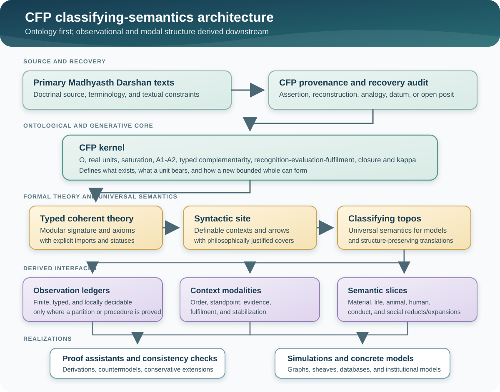

# Research Note: MD-TOPOS as a Classifying Semantics for *Coexistence From First Principles*

**Author:** Raghava Mohan Madhwapathi ([analyticmadhyasthdarshan.org](https://analyticmadhyasthdarshan.org))

**Edited on:** August 9, 2026, 10:06 PM IST

**Status:** Internal research note (not a catalog entry). Prepared to support the next formal development of *[Coexistence From First Principles](Coexistence-From-First-Principles.pdf)* (CFP), especially its kernel (§2), categorical spine (§6), cross-order schema (§7), and open formal problems (§10).

**Scope.** This note examines Balmukund Meena's *Minimal Decidable Site for the Madhyasth-Darshan Classifying Topos via Single-Flag Morleyisation* (hereafter **MD-TOPOS**) for one practical purpose: to determine what can be reused while CFP develops a more comprehensive formalism for Madhyasth Darshan. It explains the categorical-logic background required to read the paper, reconstructs its proposed formal object, identifies its genuine contribution, audits the claims that need repair, and sets out an integration programme for CFP.

The paper's most useful contribution is **not the particular claim that Madhyasth Darshan has exactly 26 geometric predicates plus one logical flag**. That inventory is philosophically narrow and several of its mathematical claims do not survive close examination. The useful contribution is architectural: MD-TOPOS asks whether a finite, machine-presentable logical theory can have a **classifying topos** that simultaneously supports constructive reasoning, a decidable observational vocabulary, context-sensitive modalities, and several connected views of personal, social, and cosmic order. CFP can use this architecture as a semantic envelope around its own generative kernel, provided that CFP supplies the typed ontology, treats observational predicates as derived rather than exhaustive, and proves rather than assumes the required logical properties.

The resulting division of labour would be:

```text
CFP kernel: what exists, what a unit bears, and how units couple and close
        ↓
Typed coherent theory: the explicit propositions licensed by that kernel
        ↓
Classifying topos: the universe of models and structure-preserving translations
        ↓
Observation ledger: finite decidable questions used in proofs and simulations
        ↓
Modal/context layer: order, standpoint, development, and evidence restrictions
```

This is the central recommendation of the note.

## 1. The research question

CFP currently has a compact ontological and generative structure. Its primitives are the actionless omnipresent medium `O`, real countable units `U`, and the saturation of every unit in `O`. A1 specifies the endowments associated with saturation; A2 specifies order-relative orientation toward completeness; the complementarity relation `C_o` and the sequence recognition–evaluation–fulfilment–closure organize coupling; and `κ` records the formation of a new bounded bearer when a fulfilled coupling closes. A separate reflexive transition opens the knowledge order and its richer activity structure.

That structure answers a question of **generation and dependence**: what is primitive, what follows from what, and how one tier can be composed from units at another tier. It does not yet supply a complete formal semantics for the many kinds of statement made across Madhyasth Darshan. Among the missing questions are:

- What is the formal language in which propositions about units, orders, relations, faculties, conduct, and social organization are stated?
- What counts as a model of that language?
- When two apparently different presentations express the same theory, how is their equivalence established?
- Which questions should be decidable for computation without forcing the whole philosophy into classical logic?
- How should a proposition change when restricted to a material, biological, animal, human, epistemic, or social standpoint?
- How can local descriptions be glued into a coherent whole while retaining the difference between bearer, activity, relation, and evidence?

MD-TOPOS is relevant because it attempts to answer questions of this second kind. It does not provide a satisfactory ontology from which CFP should borrow its primitives. It proposes machinery for turning an already selected vocabulary and axiom set into a formal semantic universe. Its potential role is therefore **downstream of the CFP kernel**.

The key research question is:

> Can the site/topos/modal architecture of MD-TOPOS be rebuilt over the better-grounded and more expressive CFP kernel, so that Madhyasth Darshan obtains an overall formalism without being reduced to a flat list of unary predicates?

The answer developed here is yes in principle. The architecture is promising; the particular construction in MD-TOPOS cannot be imported unchanged.

## 2. Background: the method used in MD-TOPOS

MD-TOPOS draws on categorical logic. The terminology can make a relatively simple design idea appear more remote than it is, so this section gives the minimum background needed for the rest of the note.

### 2.1 A coherent theory

A **formal theory** begins with a signature: sorts, predicates, functions, and relations. It then adds axioms determining which structures count as models. A **coherent theory** restricts the logical forms used in its axioms to finite conjunction, finite disjunction, equality, existential quantification, truth, and falsehood. Coherent logic is constructive: it does not assume that every proposition is either true or false merely because a classical meta-language would permit that assumption.

For example, a typed fragment of CFP might contain sorts `Unit`, `Order`, and `Context`; a relation `AtOrder(u,o)`; and a relation `Complementary_o(u,v,c)`. A coherent axiom could state that every material compound has components:

```text
Compound(x) ⊢ ∃u ∃v (Component(u,x) ∧ Component(v,x)).
```

It could also state that incompatible exact-order labels cannot co-occur:

```text
AtExactOrder(u,o₁) ∧ AtExactOrder(u,o₂) ⊢ ⊥       when o₁ ≠ o₂.
```

The restriction to coherent logic matters for computation and for stability across models. Statements expressed geometrically or coherently are preserved by the inverse-image parts of geometric morphisms, which makes them portable between mathematical contexts.

### 2.2 From formulas to a syntactic category

A coherent theory determines a **syntactic category**. Informally:

- an object is a formula or a definable type of thing;
- an arrow from `φ` to `ψ` records a provable way of obtaining `ψ` from `φ`;
- finite limits encode conjunction and compatible substitution;
- finite coproduct-like structure encodes controlled disjunction;
- images encode existential quantification.

This converts logical inference into category-theoretic structure. The category is not a second ontology alongside the theory. It is the organized space of the theory's definable contexts and entailments.

### 2.3 A site and its sheaves

A **site** is a category together with a rule saying which families of arrows count as covers. A cover expresses that an object or proposition can be understood from compatible local pieces. A **sheaf** assigns data to each context so that compatible data on a cover glue uniquely into data on the covered object.

For Madhyasth Darshan, this language is attractive because many descriptions are explicitly local to an order, scale, bodily condition, developmental stage, or relationship. A sheaf semantics can keep these descriptions local while requiring principled agreement on overlaps. A family-level description and a society-level description need not be identical, but where they concern the same people and relations their shared content must agree.

The coverage is not arbitrary. It must be generated by actual axioms of the theory or by justified observation protocols. Calling a family a cover is a substantive formal commitment: it says that the listed cases jointly exhaust the relevant context.

### 2.4 The classifying topos

The category of sheaves on a suitable syntactic site is a **classifying topos** for the theory. Its importance is semantic: models of the theory in another topos correspond, in a precise sense, to geometric morphisms into the classifying topos.

The classifying topos can therefore be read as a universal home for all models of the theory. Instead of identifying Madhyasth Darshan with one simulation, database, graph, or set-theoretic model, one specifies a theory and studies the whole category of its models. A concrete implementation is then one point of realization within a larger semantics.

This is particularly useful for CFP. Its formal reconstruction should not be tied to one programming language or one numerical representation. A classifying semantics would let a finite simulator, a proof-assistant model, a relational database, and a qualitative social model count as different realizations of the same typed commitments when the appropriate structure is preserved.

### 2.5 Intuitionistic logic and decidability

The internal logic of an arbitrary topos is generally **Heyting** or intuitionistic rather than globally Boolean. A proposition need not have a complement merely because it has been named. This is a feature when formalizing partial information, context-sensitive knowledge, or open-ended empirical questions.

Decidability can nevertheless be required for a selected class of propositions. Categorically, equality on an object `X` is decidable when its diagonal

$$
\Delta_X \hookrightarrow X \times X
$$

has a complement. For a finite collection of genuinely disjoint, jointly exhaustive cases, equality is decidable: one can distinguish the diagonal pieces from the off-diagonal pieces.

The design opportunity is to keep the overall theory intuitionistic while selecting a finite **observation ledger** whose entries are decidable. A simulation may need a definite answer to “which exact material order is this unit currently classified under?” without pretending that every metaphysical, interpretive, or empirical proposition in the theory has a decidable answer.

### 2.6 Morleyisation

**Morleyisation** enlarges a language by adding a new symbol for a formula that was already expressible. If `R(x)` is added together with both directions

```text
R(x) ⊢ φ(x)
φ(x) ⊢ R(x),
```

then `R` is merely a name for `φ`. This is a definitional extension and is conservative: it does not change what the original language can prove.

The distinction between **naming** a formula and **strengthening** the theory is essential. If the extended theory also adds a new exclusivity, existence, or totality axiom that was not derivable before, that part is not Morleyisation and need not be conservative. CFP should retain a machine-checkable separation between:

1. definitional symbols introduced for convenience;
2. derived theorems proved from the kernel;
3. new modelling assumptions added for a particular application.

One of MD-TOPOS's main failures comes from crossing these three levels.

### 2.7 Lawvere–Tierney topologies and nuclei

A **Lawvere–Tierney topology** on a topos supplies a notion of closure and determines a subtopos of sheaves. Its corresponding nucleus acts like a disciplined modal operator. For a proposition `P`, one may read `□P` as the closure, stabilization, or local truth of `P` under a specified standpoint.

A nucleus is idempotent and preserves finite meets, but it does not automatically preserve all joins, falsehood, or complements. Therefore a philosophical interpretation such as “Buddhi scope” or “Vritti disposition” does not by itself prove that the associated operator preserves decidability. The operator must be constructed, and each required preservation law must be proved.

Used carefully, nuclei could represent several kinds of restriction relevant to CFP:

- localization to an order or scale;
- closure under an evidence protocol;
- stabilization under repeated recognition and fulfilment;
- passage from a detailed model to a coarser observational standpoint;
- a context in which additional propositions become locally valid.

They should not be treated as mathematical translations of the five faculties merely because five operators are available.

### 2.8 Open subtoposes and connected viewpoints

A subtopos represents a restricted semantic universe. MD-TOPOS uses open subtoposes to relate three knowledge slices called CK, HCK, and SK. The intended idea is that material, humane-conduct, and self-knowledge viewpoints are distinct but connected.

CFP can use the general idea while replacing the paper's unexplained inclusions with typed reducts and expansions. A material model may forget the reflexive structure of *jeevan*; a human-conduct model adds expression, evaluation, fulfilment, and evidence; a self-knowledge model adds the constitution and activities of *jeevan*. The arrows between these views should say exactly which structure is forgotten, retained, or reconstructed.

## 3. What MD-TOPOS constructs

MD-TOPOS proposes a single-sorted coherent theory over “world-points” `P`. It assigns 26 unary predicates to five families and then adds one logical predicate, `Rwalls`, intended to name the disjunction of the six Wall predicates.

### 3.1 The 26+1 ledger

The paper's philosophical mapping is concentrated in its signature table and Appendix D.

| Family | Predicates | Intended MD reading | Formal treatment in the paper |
|---|---:|---|---|
| Shells `Δ` | 5 | Atma, Buddhi, Chitta, Vritti, Mana | Nested chain |
| Scales `Sc` | 5 | Self, Family, Society, Nature, Co-existence | Exclusive cover |
| Responsibilities `R` | 4 | Realisation, Thought, Behaviour, Work | Exclusive cover |
| Virtues `V` | 6 | Fortitude, Courage, Generosity, Kindness, Grace, Compassion | Exclusive cover |
| Walls `Σ` | 6 | Lust, anger, intoxication, infatuation, greed, wrath | Cover; exclusivity added later |
| Logical flag `Rwalls` | 1 | Some Wall-state is present | Defined as the union of the six Walls |

The base axioms assert covers for Walls, Virtues, Responsibilities, and Scales; pairwise exclusivity for Virtues, Responsibilities, and Scales; and nesting for the five Shells. Cross-family conjunctions are allowed. Brahma is represented by a terminal object `1_B`.

The paper calls Boolean combinations of these predicates **ledger-clopens**. It seeks decidable equality only on this finite observational domain, not on the entire topos.

### 3.2 The single-flag proposal

The Wall family is deliberately non-exclusive in the initial theory. The paper argues that this prevents the Wall-family diagonal from having a complement. It then introduces `Rwalls` as a name for the Wall disjunction and adds pairwise Wall exclusivity. The result is claimed to be a 27-generator decidable coherent site.

The intended methodological contribution is clear: audit a finite vocabulary family by family, add logical names only where constructive proof search requires them, and avoid global Booleanisation. CFP should preserve that **audit discipline**, though not this specific result.

### 3.3 The site and claimed equivalence

The proposed site has four families of generating covers: Walls, Virtues, Responsibilities, and Scales. Shells contribute no cover because they are nested rather than an exhaustive disjoint family. The paper then invokes the Comparison Lemma to claim

$$
\operatorname{Sh}(C^*_{MD},J^*) \simeq \mathcal{W}(T_{MD}),
$$

where the left side is the topos of sheaves on the new finite site and the right side is the classifying topos of the original theory.

If valid, this would be an important result: a small decidable presentation would classify the same theory as the larger original syntax. The idea of searching for a compact site presentation is valuable for CFP even though the proof here is not valid as written.

### 3.4 The five modalities

Five Lawvere–Tierney nuclei are associated with:

| Operator | Paper's reading |
|---|---|
| `□J` | Atma depth / shell / permeation |
| `□D` | Buddhi scope / scale / transparency |
| `□b` | Chitta ought / resolution |
| `□r` | Vritti disposition / responsiveness |
| `□ℓ` | Mana reactivity / self-reliance |

The paper claims that every nucleus preserves complements on ledger-clopens. It calls this **Modal Transparency**: a proposition decidable in the observation ledger remains decidable as it moves through each value layer.

The philosophical aim is attractive. A value-sensitive or faculty-sensitive change of standpoint should not make an already definite observation arbitrarily ambiguous. But the paper does not construct the five nuclei from Madhyasth Darshan or establish the algebraic assumptions needed for the proof.

### 3.5 The World-Family layer

MD-TOPOS defines ten tier flags from combinations of Work-responsibility, Scale, and selected Virtues. It then adds family roles, teachers, councils, stewards, eligibility conditions, guidance relations, and an instance opfibration intended to model bottom-up nomination or election.

A human is represented as an Atma-object in the self-knowledge slice joined to a material body in the material slice, with a humane-conduct structure in the intermediate slice. This is the paper's broadest constructive ambition: it tries to place inner constitution, bodily embodiment, family relations, cultural transmission, and governance in one categorical setting.

The social construction is not a consequence of the 27 predicates alone. Numerous tier formulas, stage constraints, council objects, relations, and compatibility assumptions are supplied separately. That does not make the construction useless, but it means the paper formalizes a proposed institutional model rather than deriving World-Family organization from its minimal site.

## 4. The main contribution for Madhyasth Darshan formalization

MD-TOPOS's central contribution is the proposal that Madhyasth Darshan should be formalized at the level of a **theory and its classifying semantics**, not only as one set of equations or one computational simulation.

Four aspects of this proposal are especially useful.

### 4.1 A formalism should distinguish theory from model

A single simulator can demonstrate one interpretation of CFP's kernel but cannot tell us whether another implementation expresses the same commitments. A classifying topos shifts attention from “the model” to the structured collection of all models. This supports comparison, conservative extension, translation, and modular growth.

For an overall Madhyasth Darshan formalism, this is more appropriate than identifying the philosophy with a Petri net, hypergraph, state machine, type theory, or differential model. Those may become models of selected fragments. The formal theory determines what they must preserve.

### 4.2 Constructive logic can coexist with decidable observables

The paper correctly resists the assumption that all meaningful propositions must be globally Boolean. Madhyasth Darshan contains metaphysical commitments, experiential claims, developmental conditions, and empirical questions whose status should remain explicit. At the same time, applications require finite decisions: a role is eligible or not under a declared policy; a simulated coupling closes or does not; an exact order label is one of a finite set.

The idea of a deliberately scoped decidable ledger is therefore valuable. CFP should build several **typed observation ledgers**, each justified by its application, rather than one universal 27-item ledger declared complete.

### 4.3 Modalities can represent disciplined changes of context

Madhyasth Darshan repeatedly describes the same reality from different standpoints: material composition, biological organization, animal expression, human evaluation, family conduct, social order, and coexistence. A modal or subtopos treatment may formalize how a proposition is restricted, stabilized, or translated across these contexts.

The reusable idea is not the one-to-one naming of five arbitrary nuclei after five faculties. It is the requirement that each change of standpoint be an explicit operator with stated preservation laws.

### 4.4 A finite site can make a philosophical theory machine-presentable

If CFP's typed theory admits a coherent site generated by a finite or effectively enumerable collection of contexts and covers, then parts of it can be mechanized. Proof obligations, model consistency, countermodels, and application-specific simulations become tractable without claiming that the finite presentation exhausts the reality described by the philosophy.

The phrase **machine-presentable** is more appropriate than “computably proving Madhyasth Darshan.” Formal methods can verify consequences of explicit premises. They cannot prove the metaphysical truth of `O`, saturation, *jeevan*, or realization by encoding them as symbols.

## 5. Where MD-TOPOS fits relative to CFP

CFP and MD-TOPOS formalize different layers.

| Question | CFP | MD-TOPOS |
|---|---|---|
| What is ontologically primitive? | `O`, units, saturation | A single sort `P` plus unary predicates |
| What generates a new whole? | Typed complementarity, fulfilment, closure, `κ` | Not represented in the 27-atom site |
| What does a unit bear? | Boundary, constitution, order, state, capacities, activity | Predicate membership only |
| How are propositions organized? | Partly specified | Coherent syntax, site, sheaves |
| How are models compared? | Open problem | Classifying-topos programme |
| Which observations are decidable? | Application-dependent | Proposed ledger-clopens |
| How do contexts alter truth? | Order and standpoint annotations | Nuclei and subtoposes |
| How is social structure represented? | Compatibility-conditioned gluing and transmission | Tier flags, roles, councils, election |

The best integration treats MD-TOPOS as a proposal for **the right-hand columns that CFP has not yet built**. CFP should not replace `O`, units, saturation, `C_o`, or `κ` with Walls, Virtues, Shells, Scales, and Responsibilities. The latter may become definable observational vocabularies over richer carrier and relation structures.

### 5.1 Proposed layered architecture



The arrows are important. Primary texts constrain the recovery audit; the audit constrains the CFP kernel; the kernel constrains the formal theory. The observation ledger is derived only after these layers are in place. This reverses the order used in MD-TOPOS, where the finite ledger effectively becomes the ontology.

<div style="break-before: page; page-break-before: always;"></div>

### 5.2 A many-sorted CFP theory

The single sort `P` is too weak for CFP. At minimum, a first coherent signature should distinguish:

- `Unit` — real countable bearers;
- `Order` — physicochemical, bio, animal, and knowledge orders, with finer tiers where justified;
- `Context` — environmental and relational conditions;
- `Coupling` — episodes or structures in which units participate;
- `Composite` — bounded wholes with component relations;
- `Jeevan` and `Body` — distinct carriers connected by an expression relation;
- `Relation` or typed relationship families — where expectations and values are evidenced;
- `EvidenceStatus` — textual assertion, reconstruction, analogy, taught datum, or open posit, if provenance is internalized in the machine-readable layer.

`O` should not merely be equated with a terminal object. A terminal object supplies a unique arrow from every object, but that categorical fact alone does not express saturation, actionlessness, energy-repleteness, recognition-capability, or inherent regulation. CFP needs explicit structure—such as a saturation relation or a natural family of maps—whose interpretation is constrained by A1. The terminal-object analogy may remain one representation of omnipresence, not the definition of *satta*.

### 5.3 Translating the CFP kernel into categorical logic

The following table sketches where CFP's existing constructs can enter a coherent or geometric theory.

| CFP construct | Candidate formal role | Caution |
|---|---|---|
| `O` | Distinguished context/medium object plus saturation structure | Terminality alone is insufficient |
| `U` | Sort or category of definite unit carriers | Do not identify a unit with its predicate profile |
| `B(u)` | Typed carrier data or a fibration of constitutions over units | Avoid a flat property bundle |
| `M(u,c)` | Context-indexed subobjects recording evidenced aspects | Evidence does not create the bearer |
| `AtOrder(u,o)` | Typed relation to an order object | Distinguish exact-order labels from cumulative capacities |
| `C_o(u₁,…,uₙ;c)` | Definable subobject of a finite product in context `c` | Order-specific content remains taught or empirically open |
| `ρ`, `ε`, `φ` | Relations or morphisms between coupling stages | Preserve the difference between recognition, evaluation, and fulfilment |
| `κ` | Partial functional relation from fulfilled closing couplings to new composites | Do not make every syntactic match close |
| Mixture | Fulfilled non-closing coupling | Must not create a new bearer |
| Reflexive turn | Typed transition adding self-referential activity to constitutionally complete *jeevan* | Not another ordinary `κ` firing |
| `ν, β, ρ, φ, μ` | Activity relations internal to the knowledge-order fragment | Their philosophical meaning requires source-grounded axioms |
| `τ` transmission | Structure-preserving re-instantiation across bearer turnover | Crucial for families and institutions |
| Society gluing | Colimit or sheaf compatibility across overlapping assemblies | Compatibility must express fulfilled values, not adjacency alone |

The initial theory need not encode every line of CFP. It should begin with the load-bearing distinctions and add modules conservatively.

### 5.4 Observation ledgers as derived interfaces

MD-TOPOS's five predicate families can be retained as candidates for an **application ledger**, especially in human and social models. Their formal status should change:

- Shell or faculty terms should be attached to *jeevan* and its activities, not treated as five nested unary regions of an undifferentiated world-point.
- Virtues should be predicates on dispositions, expectations, relations, or fulfilled conduct as justified by the texts; declaring them mutually exclusive requires evidence.
- Responsibilities should be typed arenas or dimensions of activity. Realisation, thought, behaviour, and work should not be made mutually exclusive unless “exactly one current classification” is the intended application-specific reading.
- Scales should distinguish participation from exact administrative level. A person can participate in family, society, nature, and coexistence without those realities becoming mutually exclusive.
- Walls can be diagnostic predicates on evaluation or conduct. A resolved state should be expressible without first asserting that every person necessarily occupies a Wall-state.

The ledger then becomes a finite API exposed by a richer model. Its predicates are decidable only where CFP supplies a decision procedure or a justified partition.

### 5.5 Modalities as restrictions, not faculty labels

CFP can explore nuclei in three better-grounded roles.

**Order localization.** A material-order modality retains the structure visible in material composition; a knowledge-order expansion adds reflexive activity and evidence. These may be formalized as reduct/expansion adjunctions if the signature modules support them.

**Evidence closure.** A proposition supported by primary text, by formal derivation, or by observed conduct may inhabit different evidence contexts. A closure operator can express what becomes warranted once a declared evidence protocol is applied.

**Fulfilment stabilization.** Repeatedly closing a set of relations under recognition, evaluation, fulfilment, and compatibility may define a fixed substructure. This is closer to the mathematical meaning of a nucleus than simply assigning one operator to each faculty.

Only after such constructions exist should CFP ask whether they correspond to Atma, Buddhi, Chitta, Vritti, or Mana. The philosophical interpretation must follow the operator's defined action, not precede it.

## 6. What CFP should adopt

### 6.1 Adopt the theory–site–topos separation

CFP should specify:

1. a signature and axiom modules;
2. a syntactic category generated by those modules;
3. a justified coverage;
4. the resulting classifying semantics;
5. concrete models and simulations as realizations.

This separation prevents one implementation choice from becoming an accidental metaphysical commitment.

### 6.2 Adopt local Booleanity rather than global Booleanisation

Finite partitions and decision procedures are useful for computation. CFP should declare them locally, with scope. Examples include exact order labels in a given simulation, success/failure of closure under a fully specified `κ` instance, or eligibility under a fixed institutional rule.

Questions such as whether a bodily configuration supports *jeevan*, whether a person has realised coexistence, or whether a particular social relation fulfils its value should not become decidable by declaration alone.

### 6.3 Adopt an explicit definitional-extension ledger

Every added symbol should be tagged as one of:

- primitive;
- definitionally introduced abbreviation;
- theorem;
- new application axiom;
- empirical or taught parameter.

This directly extends CFP's existing two-axis model-status audit. It also prevents a convenient predicate name from smuggling in a substantive philosophical assumption.

### 6.4 Adopt coverage and minimality audits

For each proposed family of cases, CFP should ask:

- Are the cases jointly exhaustive?
- Are they exclusive, nested, overlapping, or merely differently indexed?
- Is every case inhabited?
- Is the classification about bearers, activities, relations, stages, or evidence?
- What breaks if one generator or cover is removed?
- Is minimality syntactic, semantic, computational, or philosophical?

MD-TOPOS deserves credit for making this style of audit central, even though its own answers are often unsupported.

### 6.5 Adopt equivalence as a formal obligation

When CFP develops two presentations—perhaps a category-theoretic theory and a rewrite implementation—it should not call them equivalent because they use similar names. A comparison functor must be defined, and preservation, conservativity, density, or bi-interpretability must be proved at the appropriate level.

The classifying-topos perspective makes this obligation visible.

### 6.6 Adopt connected semantic slices

The material, biological, animal, human, and social fragments should be separate modules with explicit interfaces. A model may forget or add structure as it moves between them. This is more precise than placing all vocabulary in one flat signature, and it matches CFP's insistence that the cross-order schema changes type rather than merely repeating one material mechanism.

## 7. What must be repaired before reuse

The following problems affect MD-TOPOS's headline results. They should be recorded as proof obligations, not treated as editorial details.

### 7.1 The Morleyised theory is not a conservative extension

Adding `Rwalls` as a name for `Σ₁ ∨ … ∨ Σ₆` is definitional. Adding pairwise Wall exclusivity is a new axiom. The base theory deliberately permits a point to satisfy two Wall predicates, and Appendix B constructs exactly such a model. That model cannot be expanded to the exclusive theory.

Therefore the forgetful functor from models of the new theory to models of the old theory is not an equivalence, and the claimed conservativity does not follow. The subsequent Comparison-Lemma argument cannot establish equivalence with the original classifying topos on the basis given.

**CFP repair.** Keep naming extensions separate from theory strengthening. If a decidable tagged Wall classification is required, introduce a new sort of observation records or a coproduct of tagged cases with a map into the underlying person/state. Do not force the original overlapping predicates to become exclusive.

### 7.2 The Wall cover conflicts with the resolved state

The base axiom asserts that every `P` satisfies at least one Wall predicate. If `Rwalls` names that union, `Rwalls` is true everywhere and its complement is empty. The later interpretation of `¬Rwalls` as an inhabited resolved or Stage-D condition is then unavailable.

The Morleyised theory deletes the original cover but does not replace it with an equivalent assertion that `Rwalls` holds everywhere. This is another reason the theories are not equivalent.

**CFP repair.** Treat Walls as optional diagnostic states over a typed domain such as deluded evaluation episodes. Define resolution positively or as the complement of the Wall union only after proving that the relevant observation algebra has complements. Do not assert a global Wall cover over all persons, stages, or world-points.

### 7.3 The Boolean ledger proof treats overlapping and nested predicates as independent atoms

Appendix A identifies the ledger algebra with the powerset of 26 atoms. But the five Shell predicates form a chain, so a deeper Shell implies the shallower ones. Cross-family co-holding is also expressly allowed. These predicates are not 26 independent Boolean atoms.

For example, if `Δ₂ ≤ Δ₁`, the set of ledger predicates below `Δ₁` contains `Δ₂`; the analysis map cannot recover the singleton `{Δ₁}` as claimed. The section–retraction proof therefore fails.

**CFP repair.** Construct the actual finite distributive lattice presented by the relations, or use tagged exact cells obtained from a proved partition. Preserve the difference between primitive predicate symbols, join-irreducible elements, and Boolean atoms.

### 7.4 `Rwalls` is definable and therefore not an indecomposable twenty-seventh atom

The paper identifies `Rwalls` with the union of the six Wall predicates and simultaneously counts it as an indecomposable generator. Under the proposed exclusivity axiom it is explicitly a disjoint coproduct of six pieces, hence decomposable.

**CFP repair.** Count primitive names, definitional abbreviations, generators of a presentation, join-irreducibles, and semantic atoms separately. “27 symbols” is not the same result as “27 indecomposable generators” or “27 necessary philosophical categories.”

### 7.5 Modal Transparency is not proved for arbitrary nuclei

A Lawvere–Tierney nucleus preserves finite meets and truth. It need not preserve falsehood, arbitrary finite joins, or complements. The proof assumes that the reflector followed by the inclusion preserves disjoint finite coproducts in the ambient topos and that the closure of the empty subobject is empty. Those properties require additional hypotheses.

**CFP repair.** For each proposed modality, prove that it preserves the chosen finite observation algebra. One sufficient route is to define a finite Boolean subalgebra invariant under the operator and prove that the restricted action is a Boolean algebra endomorphism. Another is to work with a geometric morphism whose inverse image preserves the relevant structure. The property cannot be inferred from the word “nucleus.”

### 7.6 The ten tier flags are neither disjoint nor shown inhabited

Several tier formulas are nested. `W₃`, for example, adds a virtue condition to `W₂` and is therefore a subobject of it. Similar containments occur at later scales. This conflicts with the earlier claim that all ten tier flags are pairwise disjoint. The axioms also do not prove that each intersection used to define a tier is inhabited.

The orientation changes as well: one early definition names `W₁` as the root, while the later chain names `W₁₀` as the root.

**CFP repair.** Decide whether the ten objects are cumulative levels or exact disjoint strata. If cumulative, write `L₁ ≤ … ≤ L₁₀`. If exact strata are needed, define them by proved differences only inside a suitable complemented algebra. Keep the administrative hierarchy separate from scales of living and prove existence of instances independently.

### 7.7 Philosophical typing and source grounding are too thin

The main signature is unary and single-sorted. It cannot distinguish a faculty from its activity, a virtue from fulfilled conduct, a scale from participation at that scale, or a responsibility from an arena of activity. Exclusivity axioms for Virtues, Responsibilities, and Scales are asserted rather than established from the primary text.

The exact count of 26 is supported mainly by the author's companion constructions rather than by a transparent derivation from Shri A. Nagraj's categories. Some indexing also shifts: one passage calls `R₁` Work, while the ledger and tier definitions use `R₄` for Work.

**CFP repair.** Preserve the recovery audit. Every type, cover, exclusivity, nesting, and modal interpretation must cite its textual basis or be marked as a reconstruction, application convention, or open hypothesis.

## 8. A concrete CFP integration programme

### 8.1 Work package A: freeze the semantic boundary

Create a formal inventory of CFP constructs with four columns:

| Construct | Philosophical source/status | Formal type | Allowed axioms |
|---|---|---|---|
| `O` | Textual assertion; open metaphysical posit | Medium/context structure | Actionless; all units saturated; not a unit |
| Unit carrier | Textual assertion | Sort/object with definite bearer data | Countable; bounded; order/state/capacities |
| Saturation | Textual assertion organized by CFP | Relation/natural structure | Total over units; non-separability |
| A1 endowments | Reconstruction from textual claims | Axiom module | Activeness, recognisability, regulation |
| A2 orientation | Textual assertion formalized by CFP | Axiom or schema | Order-relative completeness, not unbounded maximization |
| `C_o` | Reconstruction hosting taught content | Typed relation family | Application-specific instances |
| `κ` | Formal reconstruction | Partial operation/functional relation | Requires fulfilment and closure |
| Reflexive turn | Interpretive model | Guarded typed transition | Not reducible to material composition |

This boundary prevents category-theoretic convenience from silently altering the ontology.

### 8.2 Work package B: define `T_CFP` as modules

Build the coherent theory in modules rather than one monolithic signature:

1. **Ground module:** `O`, units, saturation, bearer distinction.
2. **Activity module:** effort–motion–result, state, context, natural/excited conditions.
3. **Coupling module:** recognition, evaluation, fulfilment, complementarity.
4. **Composition module:** closure, mixture, component, composite, order transition.
5. **Life module:** biological organization, seed and lineage transmission.
6. **Jeevan module:** constitutional completeness, reflexive activity, faculty/activity distinctions.
7. **Embodiment module:** *jeevan*–body expression, animal and human media.
8. **Conduct module:** relationship, expectation, value, justice, evidence in behaviour and work.
9. **Social module:** family, education-*sanskar*, organization, compatibility, transmission, universal-order dimensions.

Each module should declare its imports. A material model need not interpret the later modules. This gives a principled version of the connected slices sought by MD-TOPOS.

### 8.3 Work package C: construct the syntactic site

For each module:

- list generating contexts;
- list proven covers;
- classify each family as partition, overlap, chain, or open family;
- verify pullback stability;
- distinguish axiomatic covers from application-specific observation covers;
- test whether a smaller dense subcategory presents the same fragment.

Minimality should be postponed until the semantic distinctions are stable. The first objective is a faithful effective presentation, not the lowest predicate count.

### 8.4 Work package D: define observation ledgers

Build several ledgers rather than one universal ledger.

**Material simulation ledger.** Exact material order, hungry/overfull condition where operationalized, complementary/non-complementary under a fixed `C_o`, closing/non-closing, compound/mixture, natural/excited under a specified model.

**Human-conduct ledger.** Relationship type, recognized expectation, capacity, evaluation, fulfilment evidence, mutual satisfaction, and transmission state. Virtues and responsibilities may be derived labels over these relations.

**Provenance ledger.** Textual assertion, reconstruction, analogy, taught datum, open metaphysical posit, empirical parameter.

**Institutional ledger.** Membership, role, authorization, guidance, accountability, family anchoring, and compatibility of policies with declared value constraints.

For every ledger, publish a decision table identifying which entries are mechanically decidable, decidable only relative to supplied data, or intentionally non-decidable.

### 8.5 Work package E: construct and test modalities

Candidate operators should be introduced by mathematical action rather than philosophical naming. Initial candidates include:

- restriction to an order fragment;
- forgetting/refining carrier detail;
- closure under a declared evidence protocol;
- closure under compatible gluing of local relationships;
- stabilization under a fulfilled transmission process;
- passage from actual conduct evidence to warranted relational claims.

For each operator, test:

1. monotonicity;
2. idempotence;
3. finite-meet preservation;
4. action on falsehood;
5. action on the chosen ledger's joins and complements;
6. interaction with `κ`, mixture, and transmission;
7. philosophical interpretation after the formal properties are known.

Only operators satisfying the Lawvere–Tierney conditions should be called nuclei. Others may be closure operators, adjunctions, monads, partial transitions, or evidence transformers.

### 8.6 Work package F: mechanize countermodels before positive proofs

MD-TOPOS shows why countermodels are essential: its own overlapping-Wall model refutes its later conservativity claim. CFP should build small finite models designed to break proposed axioms.

Required tests include:

- saturation without coupling, showing why no-isolation is independent;
- coupling without closure, representing mixture;
- overlapping observational labels, testing false partition assumptions;
- a carrier with identical observable behaviour but distinct identity, testing anti-reductionism;
- local relationship assignments that fail global compatibility;
- a definitional extension compared with a strengthened theory;
- a modality that preserves meets but not complements;
- cumulative levels compared with exact disjoint strata.

A theorem should enter the main formal spine only after these countermodel classes are excluded by explicit premises.

### 8.7 Work package G: prove presentation equivalences

The first realistic equivalence target is not the whole darshan. Choose a small fragment, such as material coupling and closure:

1. define a coherent theory `T_κ`;
2. construct its syntactic category and topology;
3. build a finite attributed-hypergraph or relational implementation;
4. define the comparison interpretation;
5. prove soundness and identify precisely where completeness fails;
6. determine whether a smaller site is dense;
7. only then claim equivalence of presentations.

This would turn the Comparison-Lemma ambition of MD-TOPOS into a tractable CFP result.

### 8.8 Work package H: add the World-Family only after the conduct module

Family, education, governance, and universal order should be built from typed relationships, fulfilment, transmission, and compatibility—not from a numerical tier flag alone. The ten dimensions or levels may index institutional contexts, but their objects and arrows must be constructed from the conduct and social modules.

The reusable idea from MD-TOPOS is the separation between a linear level category and a branching category of concrete instances. CFP can model the projection from families, assemblies, councils, or institutions to their declared level as a fibration or opfibration where appropriate. Election is then one possible transition protocol, not the categorical meaning of World-Family itself.

## 9. Proposed first formal artifact

The next CFP artifact should be a **small classifying semantics for the material coupling fragment**, not an immediate topos for all of Madhyasth Darshan.

### 9.1 Suggested signature

```text
Sorts:
  Unit, MaterialOrder, Context, Coupling, Composite

Relations:
  Saturated(Unit)
  AtOrder(Unit, MaterialOrder)
  Participates(Unit, Coupling)
  InContext(Coupling, Context)
  Complementary(Coupling)
  Recognized(Coupling)
  Evaluated(Coupling)
  Fulfilled(Coupling)
  Closes(Coupling)
  Produces(Coupling, Composite)
  Component(Unit, Composite)
  Mixture(Coupling)
```

`O` remains outside the unit sort and enters through the interpretation of `Saturated` plus the A1 module. `Produces` should be functional only on fulfilled closing couplings. `Mixture` should characterize fulfilled non-closing couplings without producing a new bearer.

### 9.2 Initial proof obligations

1. `Closes(c) ⊢ Fulfilled(c)`.
2. `Produces(c,x) ⊢ Closes(c)`.
3. `Produces(c,x) ∧ Produces(c,y) ⊢ x = y` for a fixed closure event.
4. `Mixture(c) ⊢ Fulfilled(c) ∧ ¬Closes(c)` only if the selected fragment supports the required complement; otherwise use disjoint positive outcome tags.
5. Every produced composite has at least two participating components where the modeled material case requires it.
6. Produced composites re-enter `Unit` through a typed carrier map, without identifying their carrier with the production event.
7. The observation ledger for outcome tags is a proved finite partition.

The use of positive tagged outcomes is preferable to assuming arbitrary negation is geometric.

### 9.3 Initial semantic models

Implement at least three models:

- a finite relational model for proof search;
- an attributed graph model for discrete simulation;
- a sheaf model over varying contexts, demonstrating local compatibility and gluing.

If all three interpret the same theory, CFP will have a concrete example of why a classifying semantics is useful.

### 9.4 Success criteria

The artifact succeeds if it provides:

- a source-audited signature;
- an explicit coherent axiom set;
- small countermodels for rejected strengthenings;
- a justified site coverage;
- a working ledger with proved decision procedures;
- a documented interpretation into the graph implementation;
- no claim that the formal model proves the metaphysical truth of its primitives.

## 10. Decision table for reuse

| MD-TOPOS proposal | Reuse in CFP? | CFP decision |
|---|---|---|
| Coherent/geometric theory | Yes | Use as the first logical target, modular and many-sorted |
| Classifying topos | Yes | Use as the semantic envelope for families of models |
| Finite dense site | Explore | Seek fragment by fragment after the theory is stable |
| One universal 27-predicate ledger | No | Replace with typed, derived, application-specific ledgers |
| Single-flag Morleyisation | Method only | Retain definitional naming; reject added exclusivity as “conservative” |
| Global intuitionistic logic | Yes | Preserve open and context-sensitive propositions |
| Local decidability | Yes | Require proofs or decision procedures for explicitly scoped ledgers |
| Five nuclei named after faculties | Not yet | Construct operators first; interpret them only after their action is clear |
| Modal complement preservation | Conditional | Prove it separately for each invariant finite algebra |
| CK/HCK/SK connected subtoposes | Explore | Replace with typed reducts/expansions between CFP modules |
| Human as self + body + conduct structure | Yes, conceptually | Rebuild with separate *jeevan*, body, expression, and conduct types |
| Ten tier flags from Responsibility/Scale/Virtue conjunctions | No | Reconstruct social levels from conduct, transmission, and compatibility |
| Linear levels plus branching instances | Yes | Useful for institutional models if level semantics are independently grounded |
| Steward/election opfibration | Application-specific | Retain as one governance protocol, not as core MD ontology |
| Machine-checking programme | Yes | Begin with the material coupling fragment and explicit countermodels |

## 11. Risks for the CFP programme

### 11.1 Formal elegance can outrun philosophical meaning

Topos theory offers many structures that can be named after MD concepts. Naming is not interpretation. CFP must be able to state what a nucleus, subtopos, cover, or adjunction does before assigning it a philosophical term.

### 11.2 A finite vocabulary can be mistaken for an exhaustive ontology

An observation ledger records questions a formal application can ask. It need not enumerate everything that exists. Units, their constitution, activity, context, and relations cannot be replaced by the truth values of 26 labels without abandoning CFP's carrier-primacy.

### 11.3 Decidability can be purchased by changing the theory

One can make cases decidable by imposing exclusivity or totality, but then one has changed the theory. CFP should treat decidability as a design constraint to be satisfied faithfully, not as permission to strengthen the philosophy until proof search becomes convenient.

### 11.4 Social hierarchy can be projected backward into ontology

The ten-tier material in MD-TOPOS combines scale, virtue, responsibility, family role, council, and election. CFP should not assume that one institutional design is the ontological structure of coexistence. Social arrangements belong to an applied module justified by humane conduct and fulfilment.

### 11.5 The classifying topos can remain purely formal

Even a correct classifying topos only classifies models of stated axioms. It does not establish that nature or human experience realizes those axioms. CFP's textual, philosophical, and empirical audits remain indispensable.

## 12. Conclusion

MD-TOPOS is valuable to CFP as an architectural provocation. It asks a question our current work has not yet fully answered: after reconstructing Madhyasth Darshan's generative kernel, what mathematical universe should hold all of its models, contexts, observations, and translations?

Its answer—a coherent theory presented by a site, interpreted in a classifying topos, equipped with locally decidable observations and modal subcontexts—is directionally strong. It offers a path from CFP's “checkable map of what depends on what” to a formal semantics in which those dependencies can be interpreted across multiple models and implementations.

The paper's literal construction is not ready to serve as that foundation. The purported conservative Morleyisation strengthens the theory; the Wall cover conflicts with the resolved state; nested and overlapping predicates are treated as independent Boolean atoms; Modal Transparency assumes preservation laws not supplied by arbitrary nuclei; and the ten tier flags conflict with their claimed disjointness. Its single-sorted predicate ledger also omits CFP's load-bearing distinctions between medium and unit, bearer and manifestation, coupling and closure, *jeevan* and body, relationship and value-evidence.

CFP should therefore adopt the **semantic architecture and audit questions**, not the 27-atom answer. The recommended overall formalism is layered:

1. primary-text provenance and epistemic status;
2. the CFP ontological-generative kernel;
3. a modular many-sorted coherent theory;
4. its syntactic site and classifying topos;
5. derived finite observation ledgers with proved decision procedures;
6. constructed modalities for order, evidence, and fulfilment contexts;
7. concrete proof-assistant, graph, sheaf, and social models.

The first implementation should formalize the material coupling fragment around `C_o`, recognition–evaluation–fulfilment, closure, mixture, and `κ`. A successful small classifying semantics there would be a firmer contribution than a premature topos for the whole philosophy. It would also provide the reusable pattern by which the biological, animal, human, and social modules can later be added without flattening their differences.

## References

### Paper under review

- **MD-TOPOS** — Meena, Balmukund. *[Minimal Decidable Site for the Madhyasth-Darshan Classifying Topos via Single-Flag Morleyisation](../../References/Applied-Studies/MD_TOPOS.pdf)*. 9 August 2025. Cited: aims and claimed results (pp. 1, 4–6); signature and axioms (§§2–3, pp. 7–11); Morleyisation and site (§§4–7, pp. 11–18); Modal Transparency (§8, pp. 18–20); World-Family and CK/HCK/SK bridge (§9, pp. 20–22); conclusions (pp. 25–26); Boolean ledger and technical proofs (Apps. A–C, pp. 26–30); philosophical mapping and tier catalogue (Apps. D–H, pp. 30–37).

### CFP and related work in this collection

- *[Coexistence From First Principles](Coexistence-From-First-Principles.pdf)* — the O/U/saturation kernel, A1–A2, complementarity, recognition–evaluation–fulfilment, `κ`, the categorical spine, cross-order schema, and formal open problems (§§2, 4, 6–7, 10).
- *[Research Note: Stephen Wolfram's Computational Universe and the Madhyasth Darshan Generative Kernel](Research-Note-Wolfram-Computational-Universe-And-MD-Kernel.pdf)* — attributed rewriting and multiway computation as implementation machinery downstream of the CFP kernel.
- *[The Ontology of Coexistence](../The-Ontology-of-Coexistence/The-Ontology-of-Coexistence.pdf)* — source-grounded exposition of saturation, units, orders, composition, *jeevan*, and coexistence.

### Categorical-logic background

- Caramello, Olivia. *Theories, Sites, Toposes: Relating and Studying Mathematical Theories through Topos-Theoretic Bridges*. Oxford University Press, 2018.
- Johnstone, Peter T. *Sketches of an Elephant: A Topos Theory Compendium*. Oxford University Press, 2002.
- Mac Lane, Saunders, and Ieke Moerdijk. *Sheaves in Geometry and Logic: A First Introduction to Topos Theory*. Springer, 1992.
- Makkai, Michael, and Gonzalo E. Reyes. *First Order Categorical Logic*. Springer, 1977.

## Method note

This note treats MD-TOPOS as a proposed applied formalization, not as a primary source for Madhyasth Darshan. Its mathematical claims were checked against the definitions and proofs printed in the paper; the audit is internal rather than a claim of peer-reviewed consensus. The proposed CFP architecture and work packages are constructions of this note. Madhyasth Darshan content continues to be governed by the source and model-status practices of CFP and *The Ontology of Coexistence*.
