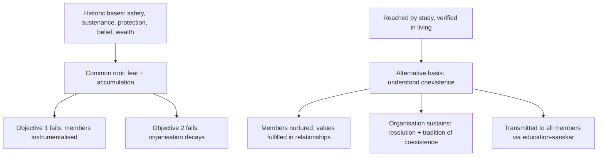

# How to form Self-Sustaining Organizations ?
## Based on Madhyasth Darshan — so that organisations sustain and members are not instrumentalised

**Author:** [AnalyticMadhyasthDarshan.org](https://github.com/raghavamohan/AnalyticMadhyasthDarshan) — a group of people studying Madhyasth Darshan philosophy. Source repository: [raghavamohan/AnalyticMadhyasthDarshan](https://github.com/raghavamohan/AnalyticMadhyasthDarshan).

**Edited on:** July 1, 2026, 4:36 PM IST
**Status:** Released
**The question:** must organisations be built on fear or accumulation, or is there a basis on which they sustain *and* their members are not used as instruments?

This study takes the near-universal history of human organisation — grouping for safety, sustenance, protection, shared belief, and finally wealth and power — and asks whether every such basis reduces to **fear** and **accumulation**, and whether that reduction explains two recurring failures together: members treated as instruments, and organisations that dissolve once the founding fear passes or the accumulation stalls. Against that pattern it sets Madhyasth Darshan's alternative — organisation around **understood coexistence**: shared cause, goal, and programme; values fulfilled in relationships; prosperity through right-use rather than accumulation; and understanding transmitted to every member through education-sanskar. The design is argued to be coherent but is untested at civilisational scale, and its deepest premises are asserted rather than demonstrated (§10).

This is an **applied** study: it instantiates the general assembly template of coexistence in the concrete case of human organisations. The ontological account of units, saturation, orders, and regulation is developed in [*The Ontology of Coexistence*](../The-Ontology-of-Coexistence/The-Ontology-of-Coexistence.pdf); the formal statement of units, relationships, values, composition, and transmission — which explicitly names this paper as its applied instantiation — is [*The Coexistence Template*](../The-Coexistence-Template/The-Coexistence-Template.pdf); a diagrammatic re-drawing is [*Category Theory Explained*](../Category-Theory-Explained/Category-Theory-Explained.pdf). This paper does not re-derive those foundations; it applies them and cross-references them where they carry the argument.

## Standpoint and scope

These studies are written from the standpoint of a **scientist and technologist** — someone trained to graduate-level **physics and mathematics**, at home with formal models and with the empirical study of institutions. Organisational questions are approached the way a modelling problem is approached: what an organisation is *organised around* is treated as a structural variable with predictable consequences, not a matter of exhortation.

From that background a matter-first picture of the human being is hard to avoid, and with it a matter-first picture of organisations — as incentive systems that align self-interested agents. Modern social science is powerful on mechanism, measurement, and prediction; yet whether members are being *used*, and why some institutions outlast their founders while others fracture, remain contested. The standpoint here does not treat those questions as settled by incentive-alignment alone, nor does it treat the darshan's deeper premises — *jeevan*, awakening, existence-as-coexistence — as proven.

The method reads the primary Madhyasth Darshan texts, states what the darshan itself holds about organisation, and compares it in parallel with **modern organisational and social forms**, with **Advaita Vedanta** (the nearest Indian non-dual rival, §11), and with the ordinary economics of profit and incentive. Physics and mathematics are **one leg** of the modelling habit brought to the problem, not the whole of the comparison, which is social and philosophical as much as formal.

The aim is rigorous comparative understanding — testing the design's internal consistency, its fit with what is known about why organisations succeed or fail, and the real limits of its untested claims — not persuasion or devotional endorsement. Like the other studies in this series, it states the argument in clear, checkable prose first; formal treatment of the underlying template is available in the companion papers and is not required to follow the argument here.

## Glossary of key terms

| Term | Meaning in this paper |
|------|----------------------|
| **Jeevan** | The sentient self, distinct from the body; the seat of desire, thought, and understanding. |
| **Coexistence (sah-astitva)** | Existence as units submerged in all-pervading space — distinct, energised, related; the darshan's account of reality itself. |
| **Resolution (samadhan)** | The state in which every *why* and *how* one lives by is answered; understanding without residue. |
| **Right-use (sadupyog)** | Use of body, mind, and wealth for their purpose, as against consumption or hoarding. |
| **Education-sanskar** | The paired institution of teaching (education) and formation of disposition (sanskar) by which understanding is transmitted across generations. |
| **Undivided society (akhand samaj)** | Humankind as one society, not finally divided into sects, classes, or nations. |
| **Universal orderliness (sarvabhaum vyavastha)** | Self-organising governance scaling from family to world. |
| **Dharma-niti / Rajya-niti** | Moral policy (right-use of body, mind, wealth) and state policy (security of the same). |
| **Awakening (jagriti)** | Living from correct understanding, evidenced in conduct. |
| **Instrumentalised** | Treated as a means — net-extracted-from — rather than as an end (this paper's term, not the texts'). |

## 1. The central question

Reviewing history, humans have organised in a near-universal sequence — around **safety**, **sustenance**, **protection**, **shared belief**, and finally **wealth and power**. §2 traces this sequence in the sources.

The question of this paper: is this the only way to form human organisations? Any better answer must meet two design objectives together:

1. **Objective 1 — members are not instrumentalised.** People in the organisation are happy and do not feel "used" by the system.
2. **Objective 2 — the organisation sustains.** It remains orderly and alive over long periods, across generations.

Madhyasth Darshan answers **No, this is not the only way** — and claims the two objectives are met together or not at all.

The argument of the paper in one diagram:

## 2. The historic pattern and its common root

SB's *History of Humans* as well as JV, tell the story of how humans organized themselves as a sequence of ages — each stage formed to answer a felt lack, each stage leaving that lack unresolved.

In the jungle and stone ages, fear of nature and wild animals drove the first groupings. Forest, food, and shelter became the first wealth. Humans then submitted to monarchs. SB records that "The submission age was accepted based on assurances of ... comfort by the monarch" (SB, Ch. 2); JV adds that the promise was never kept:

> **"The promise was that the king would ensure the security of life and property, but that hasn't happened until now. Life and property remain insecure; peace and harmony are further still."**
> - JV

Theocratic states and idealism came next. JV recounts that idealism imposed "dos and don'ts, labelling non-believers as sinners and subjecting them to harassment, as documented in history" (JV, Ch. 1). Materialism followed — which "in practice, became caught in the cycle of accumulation" (SB, Ch. 2) — and power-centric rule built on monopoly.

The darshan's central diagnostic claim is that all five bases reduce to two intertwined roots — **fear** and **accumulation**:

> **"Only three causes are observed for all the fear in humans: (1) Fear of natural events (2) Fear of animals (3) Fear of inhumaneness in humans."**
> - MVD, Ch. 5

> **"The lust for accumulation does not lead to satisfaction, because there is no end to accumulation."**
> - MVD, Ch. 12

The mapping is direct. Organising for safety and under monarchs is organising around **fear** — of nature, of animals, of other humans and groups. Organising for food, shelter, and wealth is organising around **accumulation**. Organising around shared belief trades on both: fear of sin, death, or damnation on one side, and accumulation of merit or salvation on the other. The power-centric economy, finally, is accumulation guarded by force — that is, by fear.

Every stage is reactive. Humans organise *against* something feared or *for* something accumulated. The organising principle is never the human relationship itself; it is always an external threat or an external object.

## 3. Why such organisations instrumentalise their members

If an organisation is held together by fear and accumulation, its members are inevitably treated as **means** — instruments for producing safety or wealth for someone else. The darshan defines this with unusual precision:

> **"Nurturing (poshan): Unit + Conducive unit."**
> - MVD, Ch. 3

> **"Exploitation (shoshan): Unit - Conducive unit."**
> - MVD, Ch. 3

Exploitation **subtracts** from the other; nurturing **adds**. And:

> **"To disregard sentiments (values) in a relationship is indeed exploitation of that relationship."**
> - MVD, Ch. 16

> **"No human wants their own exploitation."**
> - MVD, Ch. 16

In the template of coexistence these are not loose metaphors. Every unit stands in **relationships** — mutualities whose expectations are *predetermined* toward completeness — and in looser **associations**, whose expectations are *voluntary* (MVD, Ch. 4; [*The Coexistence Template*](../The-Coexistence-Template/The-Coexistence-Template.pdf) D3). Formally an organisation is mostly an **association**: people join and leave by choice. But it is built out of, and imposes demands on, real **relationships**, and the value (*mulya*) owed in any relationship is its **essentiality** — what the parties reciprocate and mutually recognise ([*The Ontology of Coexistence*](../The-Ontology-of-Coexistence/The-Ontology-of-Coexistence.pdf) §1.6). To *disregard* that value is, by the definition above, exploitation. This is exactly why a purely voluntary, contractual association can still instrumentalise its members: consenting to join does not license disregard of the relationship-values the association carries.

Profit-bound organisations must extract more from members than they return, because profit is defined as that very imbalance — "Getting higher value in exchange for lower value itself is profit" (MVD, Ch. 4) — and "No one is happy from earning obtained through exploitation" (MVD, Ch. 13). The political form of instrumentalisation is rule itself:

> **"A thinker is invariably a sustainer of orderliness, whereas a ruler is invariably an exploiter of orderliness."**
> - MVD, Ch. 15

The sense of being instrumentalised is not a complaint about a particular boss or regime. It is the **predictable signature of any organisation whose organising principle is fear or accumulation**, because such a principle requires some members to be net-extracted-from so that others (or the system) can be net-secured. This is the failure of Objective 1.

## 4. Why such organisations do not sustain

Fear-and-accumulation is not merely unkind; it is *structurally fragile*. This is the failure of Objective 2.

Fear-based collectivity is animal-order, and dissolves when the fear passes:

> **"The semblance of collectivity among animals is generally observed only in situations of fear. Under no circumstances is such collectivity observed in activities of study, production, or the maintenance of orderliness."**
> - MVD, Ch. 4

> **"A person may remain restrained by the fear of livelihood for some time, but eventually, they shed that fear. The end of slavery in history exemplifies this. ... neither fear nor temptation can be the basis of orderliness, as they are unacceptable to humans."**
> - JV

Accumulation breeds suspicion, and suspicion breeds conflict: "War has always been driven by suspicion, mistrust, apprehension, coercion, bribery" (SB, Ch. 6); "Profit and loss constitute a relentless cycle that not only fails to secure humans but also destroys everything in its path" (JV).

The sustainability claim is stated decisively:

> **"Resolution is the very foundation of sustainability."**
> - SB, Ch. 4

> **"There is no sustainment of sociality without the tradition of coexistence."**
> - MVD, Ch. 4

An organisation does not last because it accumulates the most resources or commands the most force. It lasts because it produces **resolution** (members understand why and how they live and work together) and lives a **tradition of coexistence** (members complement rather than extract from each other). Resources and security are outputs of such an order, not its foundation.

This fragility is not only a moral observation but a structural one built into the template of coexistence. Every assembly — molecule, body, or organisation — **persists in its natural state** while its relationships are being fulfilled, and **declines in its excited state** when they are not ([*The Coexistence Template*](../The-Coexistence-Template/The-Coexistence-Template.pdf) L4; [*The Ontology of Coexistence*](../The-Ontology-of-Coexistence/The-Ontology-of-Coexistence.pdf) §1.8). What is special about human organisations is that they sit at the **knowledge order** — the one tier where recognition and fulfilment are not automatic but must be *achieved* through understanding, evaluation, and choice, and therefore the one tier of nature that can actually fail ([*The Coexistence Template*](../The-Coexistence-Template/The-Coexistence-Template.pdf) P3; [*The Ontology of Coexistence*](../The-Ontology-of-Coexistence/The-Ontology-of-Coexistence.pdf) §1.8). A molecule cannot mis-evaluate its bonds; an organisation can. Fear and accumulation are two ways of holding an assembly together *without* fulfilling the relationships inside it — that is, of pinning it in a permanently excited state. Such an organisation lasts only as long as the external pressure that holds it does.

## 5. The alternative basis: coexistence

### 5.1 Coexistence as the binding principle

> **"Resolution Centred Materialism is coexistence only."**
> - SB, Ch. 7

> **"For an organisation, commonness of cause and goal is necessary. For its sustainment, commonness of the program is also necessary."**
> - MVD, Ch. 4

A durable organisation thus needs a **shared cause** (why we exist), **shared goal** (what we are for), and **shared programme** (how we live it daily) — the very condition the template states as its proposition for deliberate, knowledge-order assemblies ([*The Coexistence Template*](../The-Coexistence-Template/The-Coexistence-Template.pdf) P4). The binding is not contract or command but duty and dedication: "The fulfilment of sociality is through duty and dedication ... Otherwise, its decline occurs" (MVD, Ch. 4). The glue is **trust**:

> **"Trust is the act of fulfilling the inherent expectation of values in mutuality."**
> - MVD, Ch. 4

And the positive formula:

> **"The foundational basis of sociality in awakened humans is living in resolution, prosperity, fearlessness, and coexistence."**
> - MVD, Ch. 4

> **"Coexistence means living with complementarity. Fearlessness is trust in the present. Prosperity is producing in excess of our family's needs. Resolution is living with justice."**
> - JV

These four — resolution, prosperity, fearlessness, coexistence — are not this paper's shorthand but the darshan's stated **human goal**, what awakened sociality *evidences* when the relational cycle closes, distinguished throughout from what coexistence merely provisions ([*The Ontology of Coexistence*](../The-Ontology-of-Coexistence/The-Ontology-of-Coexistence.pdf) §1.13).

Note the precision of the term this paper turns on: the basis is not coexistence as sentiment, slogan, or mere peaceableness, but **understood coexistence** — coexistence that each member has studied and verified for themselves. §6 unpacks what this understanding consists of and how it is reached.

### 5.2 Organisational design: ten-tier governance and two policies

The same principle scales from individual to family to society to nation to undivided world: "a family is an integral part of the undivided society, while an individual is an integral part of a family" (MVD, Ch. 14). It is implemented as **family-based self-organising orderliness** — ten-tier self-governance from family assembly up to world family assembly (MVD, Ch. 4).

How that scaling works is precise in the template. Units glue into a larger unit only when they are genuinely **complementary** and the result is a **compound** — a new unit with its own conduct — not a mere **mixture** in which each part keeps its own conduct unchanged ([*The Coexistence Template*](../The-Coexistence-Template/The-Coexistence-Template.pdf) D8; [*Category Theory Explained*](../Category-Theory-Explained/Category-Theory-Explained.pdf) §6.9). A set of individuals bound only by contract or fear is a mixture; a family or team that shares cause, goal, and programme is a compound. And the gluing succeeds only where the parts **agree on what they share** — the same members and the same values, without contradictory demands placed on them ([*Category Theory Explained*](../Category-Theory-Explained/Category-Theory-Explained.pdf) §6.8; [*How Undivided Society Is Established*](../How-Undivided-Society-Is-Established/How-Undivided-Society-Is-Established.pdf) §5). Where two units place contradictory expectations on a shared person, the larger unit is forced to collapse. This is the structural reason the small unit must be oriented toward the larger whole rather than toward sectarian self-interest.

SB specifies the working machinery at the local tier: the village council nominates **five self-governance working committees**, each with defined roles:

> **"There will be five such committees: 1. Education-Sanskar Committee 2. Justice-Security Committee 3. Health-Restraint Committee 4. Production-Work Committee 5. Exchange-Reserve Committee. Each committee will have clearly defined roles and responsibilities."**
> - SB, Ch. 8

The five names are the four-fold goal made administrative: education-sanskar transmits understanding (§6); justice-security holds relationships and protection together; health-restraint covers the body and self-regulation; production-work delivers prosperity; exchange-reserve circulates goods without the profit-motive.

By design, two policies operate **together**, not in rivalry:

- **Dharma-niti** (*moral policy*): orderliness for the *right-use* of body, mind, and wealth.
- **Rajya-niti** (*state policy*): orderliness for the *security* of the same.

Each person desires both utilisation and protection; the darshan requires them to be **integrated** at every level from family to nation. They address different aspects of the same assets — not competing programmes.

Morality-versus-power — in its familiar form, religion-versus-state — is usually treated as an inherent rivalry. The darshan treats the rivalry as a **symptom, not a definition**: failure occurs when the two orders stop complementing each other and begin exploiting or interfering with each other and with the public:

> **"When these two orders start exploiting or interfering with each other ... societal imbalance arises."**
> - MVD, Ch. 4

JV and SB name the present form of this split — moral authority lodged in religion, protection lodged in state, neither delivering orderliness. SB traces how **religion-based politics** and **economics-based politics** each anticipated complementarity between religion and state, or between economics and state, yet failed to secure orderliness in practice (SB, Ch. 2; synthesis).

JV adds that struggle-centred rule yields nothing apart from problems and suffering:

> **"Whatever revolts, rebellions, exploitations, and wars that humans have committed until now, these all were contrary to the principles of coexistence."**
> - JV, Ch. 1

Rule without understanding repeats the exploitation logic already seen in §3 — the ruler exploits orderliness; only the thinker sustains it.

### 5.3 How coexistence answers both design objectives

Both design objectives of §1 are answered by the same move:

1. *Objective 1 — members not instrumentalised:* the organisation must add to the member, not subtract (`Unit + Conducive unit`); fulfil the values owed in each relationship; and hold to justice above mere legality. Justice here is not one value among values but the **closure of the whole relational cycle** — "recognising relationships, fulfilling values, evaluating, and achieving mutual satisfaction" ([*The Ontology of Coexistence*](../The-Ontology-of-Coexistence/The-Ontology-of-Coexistence.pdf) §1.10.5; [*The Coexistence Template*](../The-Coexistence-Template/The-Coexistence-Template.pdf) D7) — so that "Humane behaviour in mutuality itself is justice" (MVD, Ch. 1). Instrumentalisation is precisely this cycle left open: values unfulfilled or mis-evaluated, mutual satisfaction never reached. A member can therefore be treated entirely legally and still be exploited, because legality is not the closure of that cycle.
2. *Objective 2 — sustainment:* shared cause-goal-programme; resolution as foundation; prosperity through right-use rather than accumulation — "Material prosperity is accomplished only by adhering to the policy of 'more production than the needs'" (MVD, Ch. 5), with "earning for expenditure" as non-accumulation (MVD, Ch. 10) and a **cyclical economics** (JV); and transmission across generations through **education-sanskar** — "This is how understanding flows in tradition. Ignorance cannot flow in tradition" (JV).

The two objectives are not in tension. Extraction-based systems must trade member welfare against growth; a coexistence-based system avoids the trade-off because the member's flourishing *is* the organisation's strength.

| Dimension | Fear / accumulation basis | Coexistence basis |
|---|---|---|
| Why people join | Escape a threat; secure a scarce object | Fulfil values in relationships; live with resolution |
| Binding force | Fear, temptation, command, contract | Shared cause + goal + programme; trust; duty |
| View of the member | Means (net-extracted-from) | End (net-nurtured) |
| Economy | Profit, accumulation, hoarding | Right-use, production beyond need, cyclical |
| Failure mode | Dissolves when fear passes or accumulation stalls | Fragile only if understanding is not transmitted |
| Longevity basis | Force and resources (external) | Resolution and tradition of coexistence (internal) |

## 6. What it takes to understand coexistence

Everything above rests on the load-bearing phrase introduced in §5.1: organisations founded on **understood coexistence**. This is not a figure of speech. In the darshan, "understanding coexistence" names a definite cognitive achievement with definite content, a definite method, and definite tests — and it is deliberately contrasted with belief, sentiment, agreement, and mystical experience.

### 6.1 What is to be understood

Coexistence here is not tolerance, compromise, or "getting along." It is a claim about the structure of reality: existence is units **submerged in** all-pervading space — distinct, energised, and related — and the four natural orders (material, bio, animal, and knowledge order) are mutually complementary ([*The Ontology of Coexistence*](../The-Ontology-of-Coexistence/The-Ontology-of-Coexistence.pdf) §§1.1, 1.5). To understand coexistence is to know the darshan's three inseparable areas of complete knowledge ([*The Ontology of Coexistence*](../The-Ontology-of-Coexistence/The-Ontology-of-Coexistence.pdf) §1.11.3):

1. **Existence** — reality as coexistence; the complementarity of all orders
2. **Jeevan** — the conscious self, distinct from the body, that desires happiness and is satisfied only by understanding
3. **Humane conduct** — the values, character, and ethics that follow for a being who lives among other such beings

This is why "shared belief" cannot substitute for it. A belief locates the bond in an object of faith; understanding locates it in a recognisable structure of reality that each member can examine. The first divides humankind into sects; the second cannot, because what is understood is the same for everyone — "Humankind is united in the right and divided in the wrong" (MVD, Ch. 16).

### 6.2 How it is reached: study, not belief or command

The darshan insists this understanding is *teachable* — open to examination, not reserved for the initiated or granted by grace:

> **"According to the idealistic scriptures and the mystery-based God-centric contemplation knowledge and tradition, the knowledge is unmanifest and ineffable. According to Madhyasth Darshan, the knowledge is manifest, effable, and understandable through studying, and its evidence becomes accessible to all through behaviour."**
> - MVD, *The Alternative*

> **"The alternative path is - perform study, attain mastery, then evidence it in living."**
> - JV, Ch. 1

The method is a sequence: **study** (adhyayan — sustained engagement with the proposal, guided by someone who already lives it), **contemplation** (turning the proposal over against one's own observation and natural acceptance), **understanding** (the point where every *why* and *how* is answered — which is what the darshan means by *resolution*), and finally **evidence in living** (pramaan — the understanding showing up as justice, trust, and right-use in actual relationships). In the ontology's terms this is the knowledge-order cycle **knowing → believing → recognising → fulfilling**: what a member unfolds (*gyan udghatan*) is not a private conviction but the relationships already built into coexistence, brought into lived conduct ([*The Ontology of Coexistence*](../The-Ontology-of-Coexistence/The-Ontology-of-Coexistence.pdf) §§1.11.1–1.11.2). The teaching is offered as a *proposal* to be verified, never as a command to be obeyed: each person checks it against what is naturally acceptable to them and validates it in their own living.

### 6.3 How one knows it has been understood

Three tests separate understanding from its substitutes:

1. **Resolution, not residue.** Belief survives unanswered questions; understanding does not begin until they are answered. If "why coexistence?" still needs authority, fear, or incentive to back it, it has not been understood.
2. **Communicability.** What is understood can be made understandable to another. Mystery, by the darshan's definition, cannot — which is why it transmits as allegiance instead of knowledge.
3. **Evidence in behaviour.** The decisive test is conduct: fulfilment of values in relationships, right-use of resources, production beyond need. An understanding that changes nothing in behaviour is, on this view, not yet understanding. This is the template's **self-evidencing closure**: realisation counts as complete knowledge only when it is evidenced in conduct and made transmissible, never as private conviction alone ([*The Coexistence Template*](../The-Coexistence-Template/The-Coexistence-Template.pdf) D13, L7).

### 6.4 Why every member must understand — and what this means for organisations

This is the organisational crux. In belief-based and command-based organisations, the "understanding" is held centrally — by the priesthood, the founder, the ideology, the management — and members participate by trust in authority. The darshan's design forbids this delegation: resolution must live in **each member**, because trust is "fulfilling the inherent expectation of values in mutuality" (MVD, Ch. 4), and mutuality cannot be outsourced.

Hence two structural consequences already met above:

- **Education-sanskar is the central institution**, not an auxiliary one: "Education-sanskar is the only source of enlightenment and definitive understanding" (SB, Ch. 4). An organisation of understood coexistence is, before anything else, a teaching-and-learning organisation — "This is how understanding flows in tradition. Ignorance cannot flow in tradition" (JV).
- **The family is the first site of verification.** Relationships in the family are where values are first recognised, fulfilled, and evaluated — which is why the darshan's self-organising orderliness is *family-based* rather than individual-based or state-based.

This also explains the failure modes catalogued earlier. Organisations decay precisely at the point where understanding stops being transmitted and is replaced by its cheaper substitutes — belief in the founder, fear of the rule, or incentive of the pay-off. The darshan's claim is that no organisational structure can compensate for that substitution, and no structure is needed where it has not occurred.

The template states this sharply. At the material, biological, and animal orders an assembly transmits its method of composition automatically — by constitution, seed, or lineage — but at the knowledge order the only available carrier is **education-sanskar**, and it carries understanding alone ([*The Coexistence Template*](../The-Coexistence-Template/The-Coexistence-Template.pdf) L5). Because human assembly is the one tier where the relational cycle can fail (P3), a human organisation is "built and sustained only by an unbroken transmission of understanding" ([*The Coexistence Template*](../The-Coexistence-Template/The-Coexistence-Template.pdf) P3). That is why a coexistence-based organisation is not merely an organisation that happens to run a school; it is one whose survival mechanism *is* the school.

## 7. Modern organisational forms in brief

The darshan predates these modern forms and does not name them; this section applies its criteria to them. Modern forms line up on a spectrum by what binds members, from extraction toward coexistence:

| Modern form | Organised around | Darshan's reading |
|---|---|---|
| Shareholder firm; platform/gig | Return on capital; transaction volume | Purest accumulation order; relationship replaced by transaction |
| Bureaucratic state; command economy | Authority; central plan | Power-centric rule; replacing private owners with state planners changes *who* extracts, not *whether* extraction is the principle |
| Liberal democracy; stakeholder/ESG firm | Consent, rights; multi-stakeholder value | Better form, same basis — consent regulates exploitation but legality is not justice; "a nexus of votes and money" (MVD, Preface) |
| Cooperatives; self-management (Teal) | Shared ownership; distributed authority | Strong echo of self-organising orderliness and "values and evaluation" over "fear and temptation" (JV); but bounded to one firm, market-embedded, no transmission mechanism |
| Commons (Ostrom); peer production; mission orgs; intentional communities | Shared resource, cause, or belief | Closest in spirit — non-extraction, right-use, self-governance; but bounded to one domain or cause, funding/founder-fragile, or belief-based rather than understanding-based |

The best modern forms independently arrive at several darshan principles. What even they stop short of supplying together: **a universal (non-sectarian) goal** oriented to undivided society ([*How Undivided Society Is Established*](../How-Undivided-Society-Is-Established/How-Undivided-Society-Is-Established.pdf)); **resolution as understood coexistence** rather than shared interest or belief; **the four-fold goal** (resolution, prosperity, fearlessness, coexistence) as a set; **a transmission mechanism** (education-sanskar) independent of founder or funding ([*Education and Sanskar*](../Education-And-Sanskar/Education-And-Sanskar.pdf)); and **an integrated cyclical economy of right-use** rather than accumulation merely constrained by rules ([*Prosperity, Economics, and Right Use*](../Prosperity-Economics-And-Right-Use/Prosperity-Economics-And-Right-Use.pdf)).

## 8. Practical principles

An organisation that wants to sustain and not instrumentalise its people should:

1. **Organise around an understood common cause and goal, not around a threat** (§2, §5.1).
2. **Make the programme common and explicit** — sustainment requires shared *how*, not just shared *why* (§5.1).
3. **Treat every internal relationship as value-bearing**; disregarding the values owed (trust, fair return, respect, care) is exploitation by definition (§3).
4. **Design for nurturing, not extraction** (`Unit + Conducive unit`) (§3).
5. **Replace fear and temptation with values and evaluation** — compliance bought by fear or incentive is temporary (§4).
6. **Hold to justice above mere legality** (§5.3).
7. **Aim for prosperity through right-use, not accumulation** — produce beyond need, spend righteously, avoid profit-as-imbalance (§5.3).
8. **Keep moral order and governance complementary**, neither dominating the people (§5.2).
9. **Transmit understanding through education-sanskar** across generations (§6.4).
10. **Orient the small unit toward the larger whole** — family/team toward society and undivided society, not sectarian self-interest (§5.2).

## 9. From here to there: the transition path

The darshan describes an end-state, not a reform programme for existing institutions. The texts do not prescribe how a fear- or accumulation-based organisation converts itself. But the darshan's own logic implies a definite ordering, and it is worth making explicit. *(This section is inference from the texts' method, not quotation.)*

1. **Understanding precedes structure.** Since no organisational structure can compensate for the absence of understanding (§6.4), transition cannot begin with restructuring — new charters, new incentives, new org-charts on the old basis reproduce the old basis. It begins with members studying and verifying the proposal.
2. **Start at the scale where verification is possible.** The family — or the smallest working team — is the first site where values can actually be recognised, fulfilled, and evaluated (§6.4). Larger tiers federate what already works; they cannot conjure it.
3. **Education-sanskar before governance reform.** The first committee is the teaching one (§5.2). A transmission mechanism that does not depend on the founder must exist before the founder's understanding can outlive them.
4. **Evidence attracts; command does not.** The method is study → mastery → evidence in living (JV, §6.2). An organisation demonstrating resolution, prosperity, and fearlessness recruits by being visibly worth joining — the darshan's answer to "how does this spread?" is demonstration, not conquest or decree.

The implied sequence — understand, live it small, teach it, federate — also explains why the darshan is unimpressed by reforms that begin at the top: they change who holds the structure, not what the structure is organised around.

## 10. Limits and open questions

The diagnosis explains a real, recurring pattern — fear- or accumulation-founded organisations do treat members as instruments and do fracture when the founding fear recedes or accumulation stalls. The definition of exploitation as *disregarding values in a relationship* gives a usable test for whether people are being instrumentalised, and the resolution-plus-coexistence thesis dissolves the apparent trade-off between member welfare and durability.

There are however following questionable points in the claims made by the Madhyasth Darshan:

- *Fear has legitimate uses.* Grouping against genuine threats is sometimes necessary. The defensible version of the claim is that threat-avoidance cannot be the *foundational organising principle*, not that safety-driven cooperation is wrong.
- *Accumulation versus prudent reserve.* "Earning for expenditure" and "production more than needs" partly anticipate the need for reserves, but the boundary between healthy surplus and harmful hoarding is left to judgement.
- *No theory of bad-faith actors.* The design assumes members who understand or are willing to study. The texts name a Justice-Security committee (SB, Ch. 8) but give no procedure for the member who persistently exploits, dissents, or refuses to participate — no account of adjudication, sanction, exit, or expulsion. Institutional justice and statutory order are deferred to the planned [*Governance, Justice, and Undivided Society*](../Governance-Justice-And-Undivided-Society/Governance-Justice-And-Undivided-Society.pdf) study, but for an organisational design this remains the largest practical gap: every real organisation eventually meets the person its theory says should not exist.
- *Dependence on the ontology.* The deepest premises — jeevan, awakening, existence-as-coexistence — are asserted, not empirically demonstrated. A secular designer can adopt nearly the whole practical programme on organisational grounds alone while remaining agnostic about the metaphysics; a strength for adoption, a weakness for anyone seeking a proven first principle.

## 11. Comparison with Advaita Vedanta

A natural question for an Indian reader: does **Advaita Vedanta**, the oldest non-dual tradition, already offer a basis for building a prosperous society? The two are close relatives — Shri A. Nagraj came through the Vedic/Vedantic stream, and Madhyasth Darshan defines itself partly against Advaita's formula "*Brahma satya, jagat mithya*" (MVD, *The Alternative*). The full metaphysical comparison — Brahman and *mithya*, the two truths, and where the traditions' categories do and do not map — is developed in [*The Ontology of Coexistence*](../The-Ontology-of-Coexistence/The-Ontology-of-Coexistence.pdf) §2 and §5.7; here the question is narrowly organisational, measured against this paper's two design objectives. *(Beyond the three primary sources this draws on Shankara (AV), Vivekananda's "Practical Vedanta" (SV), and Rambachan (ATR); readings are marked interpretation where they exceed the texts.)*

Advaita is not socially empty. If *tat tvam asi* — the self of every being is Brahman — then there is ontologically no "Other" to exploit, arguably a stronger anti-exploitation premise than any rights theory; *nishkama karma* and *lokasamgraha* give a reason to serve rather than accumulate; and modern readings (Vivekananda's "potential divinity" of every being, Rambachan's "not-two is not one") built activism against caste and ecological harm, sustained by real institutions such as the Ramakrishna Mission. On the darshan's own spectrum (§7), Advaita-inspired organisations belong with the closest, non-extractive forms.

Measured against the two objectives, though, classical Advaita falls short in identifiable ways. Its goal is *individual moksha*, not organisational: community, family, and production belong to the world the renunciant turns from, so an organisation is at best instrumental to liberation, never the locus of value. "*Jagat mithya*" undercuts prosperity — a philosophy cannot found a prosperous society on a premise that devalues the domain in which prosperity occurs; even sympathetic reformers concede pre-reform Vedanta became "a philosophy of escape" (SV). The two-truths doctrine let perfect equality at the absolute level coexist with caste hierarchy at the empirical level for over a millennium — *interpretation:* a unity that does not bind conduct fails the darshan's test that understanding become **evidence in behaviour**. Transmission ran through guru-shishya lineage and monastic qualification (*adhikara*) for a renunciant minority — the opposite of an education-sanskar meant to reach **all** through ordinary families. And Advaita specifies no economy, governance, or family order — no counterpart to "commonness of cause and goal ... and of the program" (MVD, Ch. 4).

The decisive divergence is metaphysical and has direct organisational consequences. Advaita resolves plurality *upward* into one reality without a second: relationships, like the related persons, are ultimately appearance. Madhyasth Darshan refuses this move — existence is units *submerged in* all-pervading space, distinct and related. Plurality is real, therefore **relationships are real**, therefore the values inherent in them (trust, respect, justice) are real and their fulfilment or violation is real. That is what makes "exploitation = disregarding values in a relationship" a usable organisational test rather than a provisional truth awaiting dissolution.

| Dimension | Advaita Vedanta | Madhyasth Darshan |
|---|---|---|
| Ultimate reality | Brahman, one without a second; world is mithya | Existence as coexistence; world is real and perpetual |
| Human goal | Individual moksha through self-knowledge | Resolution, prosperity, fearlessness, coexistence — lived in relationship |
| Basis against exploitation | No "Other" exists (ontological unity) | Values in real relationships; nurturing vs extraction |
| Status of relationships | Empirically valid, ultimately appearance | Constitutive of reality; locus of justice |
| Prosperity | Not a goal; renunciation idealised | Defined goal: production beyond need, right-use |
| Organisational design | None (monastic orders as exception) | Ten-tier family-based self-organising orderliness |
| Transmission | Guru-shishya, monastic, qualified few | Education-sanskar for all, through families |

Advaita supplies the strongest possible **premise** for human unity — there is finally no Other — but not the **programme** for human organisation; its strongest social readings (SV, ATR) are modern efforts to extract from non-duality what Madhyasth Darshan builds in from the start: a real world, real relationships, a defined economy, and a transmission mechanism for all. The darshan keeps Advaita's insistence on human dignity and the unity of existence while replacing "one without a second" with "coexistence," so that unity can bind conduct and production rather than dissolve them. This comparison is between Advaita's *historical record* and the darshan's *design principles*: the latter has not been tested at civilisational scale, so the claim is about coherence and completeness of design, not a proven track record.

## 12. Conclusion

Humans do not *have* to organise around fear, food, protection, belief, or accumulation. Those are the bases history happened to use, and they are precisely why organisations exploit their members and eventually decay. The durable, non-exploitative basis is organisation around understood coexistence — shared cause, goal, and programme; fulfilment of values in relationships; right-use rather than accumulation; and a tradition that transmits this understanding across generations.

> **Fear + accumulation** → members instrumentalised → organisation decays
> **Coexistence + resolution** → members fulfilled → organisation sustains

The contribution of this view is to collapse two problems usually treated separately — *keeping people happy* and *keeping the institution alive* — into a single design choice about what an organisation is organised *around*. Choose fear or accumulation, and the two goals fight each other. Choose understood coexistence, and the same principle that fulfils the member also sustains the whole.

## References

### Madhyasth Darshan (primary sources)

- **MVD** — Nagraj, A. [*Madhyasth Darshan – Co-existentialism, Part 1: Holistic View of Human Behaviour*](../References/Madhyasth-Darshan/MVD-Madhyasth-Darshan-Coexistentialism.pdf). English translation by Rakesh Gupta. Cited by chapter.
- **SB** — Nagraj, A. [*Samadhanatmak Bhautikvad / Resolution Centred Materialism*](../References/Madhyasth-Darshan/SB-Samadhanatmak-Bhautikvad.pdf). English translation by Rakesh Gupta. Cited by chapter.
- **JV** — Nagraj, A. [*Jeevan Vidya: An Introduction*](../References/Madhyasth-Darshan/JV-Jeevan-Vidya-An-Introduction.pdf). English translation by Rakesh Gupta. Cited by chapter.

### Advaita Vedanta comparison

- **AV** — [*Śaṅkara*, Stanford Encyclopedia of Philosophy](../References/Comparative-Philosophy/AV-Shankara-Stanford-Encyclopedia.html). Shankara's classical position as summarised in the SEP entry. Also at https://plato.stanford.edu/entries/shankara/
- **SV** — Swami Vivekananda. [*Practical Vedanta*](../References/Comparative-Philosophy/SV-Vivekananda-Practical-Vedanta.pdf) (Complete Works). Cited for the social reading of non-duality and the Ramakrishna tradition.
- **ATR** — Rambachan, A. [*A Hindu Theology of Liberation: Not-Two Is Not One*](https://sunypress.edu/Books/A/A-Hindu-theology-of-liberation2). SUNY Press, 2015.

### Related studies in this collection

- [*The Ontology of Coexistence*](../The-Ontology-of-Coexistence/The-Ontology-of-Coexistence.pdf) — the ontological base: units, saturation, the four orders, regulation and law, the justice cycle, and societal fulfilment outcomes. Cited: §§1.1, 1.5–1.8, 1.10.5, 1.11, 1.13; and §2, §5.7 for the Advaita comparison.
- [*The Coexistence Template*](../The-Coexistence-Template/The-Coexistence-Template.pdf) — the formal statement this paper instantiates: relationship vs association (D3), value (D4), justice-as-closure (D7), composition (D8), persistence (L4), transmission (L5), the knowledge-order discontinuity (P3), and shared cause-goal-programme (P4).
- [*Category Theory Explained*](../Category-Theory-Explained/Category-Theory-Explained.pdf) — the diagrammatic re-drawing: compound vs mixture (§6.9) and undivided society as a compatible colimit (§6.8).
- [*How Undivided Society Is Established*](../How-Undivided-Society-Is-Established/How-Undivided-Society-Is-Established.pdf) — the consolidated social-establishment account: ten-tier family orderliness and the five orderliness dimensions.
- [*Education and Sanskar*](../Education-And-Sanskar/Education-And-Sanskar.pdf) — the transmission mechanism (education-sanskar) treated in full.
- [*Prosperity, Economics, and Right Use*](../Prosperity-Economics-And-Right-Use/Prosperity-Economics-And-Right-Use.pdf) — the cyclical economy of right-use rather than accumulation.
- [*Ethics and Morals in Human Beings*](../Ethics-And-Morals-In-Human-Beings/Ethics-And-Morals-In-Human-Beings.pdf) — justice, dharma, and truth as the humane refuge for conduct.
- [*Governance, Justice, and Undivided Society*](../Governance-Justice-And-Undivided-Society/Governance-Justice-And-Undivided-Society.pdf) — institutional self-governance, statutory order, and adjudication.
