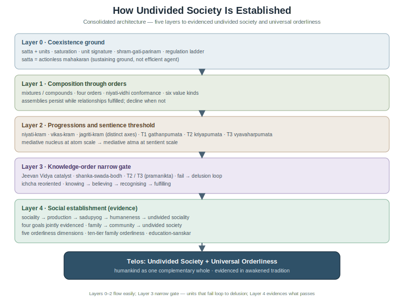

# How Undivided Society Is Established

**Author:** [AnalyticMadhyasthDarshan.org](https://github.com/raghavamohan/AnalyticMadhyasthDarshan) — a group of people studying Madhyasth Darshan philosophy. Source repository: [raghavamohan/AnalyticMadhyasthDarshan](https://github.com/raghavamohan/AnalyticMadhyasthDarshan).

**Edited on:** June 27, 2026, 11:33 PM IST
**Status:** Draft
**The question:** What is Madhyasth Darshan's grand vision of undivided society (*akhand samaj*), and how — according to the primary texts — is it established and evidenced?

This study gives the **consolidated architectural account**: one connected chain from coexistence through awakening to social evidence. It **builds on** the coexistence ontology, completeness transitions, and social-order exposition in [*The Ontology of Coexistence*](../The-Ontology-of-Coexistence/The-Ontology-of-Coexistence.pdf) and related studies in this collection (see References). It reads **Shri A. Nagraj's** primary works — *Madhyasth Darshan* (MVD), *Samadhanatmak Bhautikvad* (SB), *Jeevan Vidya* (JV), *Janvad* (JVD), and *Adhyatmvad* (AVD) — and states what the darshan itself teaches about establishment. Comparative treatment of other traditions is intentionally omitted; this paper expounds Madhyasth Darshan's vision only. Minute detail on statutory governance, formal template mathematics, or cyclical-economics treatises appears in linked studies listed under References.

## Standpoint and scope

These studies are written from the standpoint of a **scientist and technologist** — someone trained to graduate-level **physics and mathematics**. That background informs how the atomic development account in §1.8 is read, but this paper does **not** perform parallel comparison with Advaita Vedanta, modern Western philosophy, or the natural sciences; those comparisons belong in other papers in this collection.

The work reads the primary Madhyasth Darshan texts carefully and states what follows from the darshan itself on **how undivided society can be established**. The aim is a **self-contained architectural exposition** — rigorous, checkable prose that a reader can follow without opening other studies for the main chain. Formal mathematical treatment and institutional codification may follow or supplement elsewhere; this paper does not require them. Terms are defined in the essay where they first arise; a consolidated glossary appears in the Appendix.

## 1. The architecture of establishment

Madhyasth Darshan holds that *akhand samaj* is not an automatic scale-up of physical regulation. It is an **achieved telos** at the knowledge order: when awakened humans close the justice cycle, evidence resolution, prosperity, fearlessness, and coexistence together, and compose assemblies from family through community into humankind as one unit paired with **universal orderliness**. The architecture has five layers and a telos; the figure at §1.21 renders the whole.

### 1.1 Coexistence and saturation

Madhyasth Darshan defines **existence** as ever-present **coexistence** — formless Omnipresence (*satta*) and countless bounded **units** of nature, co-eternal, neither made from the other (SB, p. 48; MVD, p. 11). What changes is unit-activity, development, and awakening within saturation, not the ground itself.

**Saturation** (*samprikt*) names the bond: each unit is surrounded, submerged, and soaked in *satta*. Through that bond every unit has **inherent energy** and regulatory order **in** it — not extracted from a finite store by an outside push (SB, pp. 48, 57, 69).

> **"Nature, saturated in Omnipotence, exists as countless units. Each unit, being saturated in Omnipotence, remains surrounded, submerged, and soaked in it."**
> - SB, p. 48

*Satta* is **actionless** (*kriya-shunya*): it performs no actions. It is nevertheless named **supreme cause** (*mahakaran*) in the **sustaining** sense — the ground through which unit-activity is energised and regulated, not the efficient trigger of particular change (MVD, pp. 288–289; SB, p. 62). The causal work of change is done by units themselves.

*Madhyasth* means **mediative**: *satta* regulates and conserves every unit without itself acting (MVD, p. 26). The same mediative pattern recurs within nature at the atomic nucleus and, in sentient *jeevan*, at *atma* (§1.8).

### 1.2 Unit signature and relationships

Every saturated unit carries the same four inseparable aspects — **form**, **properties**, **essential nature**, and ***dharma*** — regardless of order (MVD, pp. 50–51). **Properties** (*gun*) are generative, degenerative, and mediative: assisting creation, dissolution, and sustainment in mutuality.

Nothing in nature is isolated:

> **"Every entity of nature recognises another; that is why it fulfils. An atomic particle too recognises another, and as a result, these particles abide in orderliness."**
> - JV, p. 69

A **relationship** is mutuality where expectations are predetermined toward completeness; an **association** is mutuality where expectations are voluntary (MVD, pp. 61–62). Fulfilment proceeds through **capacity** (*kshamata*), **ability** (*yogyata*), and **receptivity** (*patrata*). What units reciprocate is **value** — essentiality (*maulikta*) in every order (SB, p. 50).

In its **natural state**, a unit moves toward development; in its **excited state**, toward decline (SB, pp. 14–15). Participation means recognising and fulfilling built-in relationships — the completeness drive orienting unit-activity toward satisfaction (SB, p. 51).

### 1.3 Activity and regulation

All change is **unit-activity** — the inseparable triad **effort, motion, and result** (*shram–gati–parinam*):

> **"Every physical-chemical activity is an inseparable presence of effort, motion and result. Each of these is a joint form of the other two."**
> - SB, p. 58

**Regulation** becomes evident as **law**: orderliness with *ness*, expressed in order-specific conformance regimes (SB, p. 57). The **regulation ladder** reads upward:

1. **Saturation** — inherent energy and order in each unit.
2. **Law** — mutual-recognition provision structurally real in coexistence.
3. **Order conformance** — definiteness of conduct at each order (*niyati-vidhi*; §1.5).
4. **Inward regulation** — mediative *atma* disciplining faculties in *jeevan* (§1.12).
5. **Justice** (*nyaya*) — evaluative closure of the relational cycle at the knowledge order (§1.11).
6. **Assembly order** — human compositions persisting while relationships are fulfilled.

Orderliness at the order level is **self-regulation** (*swatah-saspurt*): inherent in nature's orders, not dispensed by *satta* acting as governor (MVD, p. 26).

### 1.4 Composition

Complementary units **compose** into larger units when relationships are fulfilled:

> **"Everywhere, there exists a natural inclination towards coexistence. This inclination is what leads atomic particles to assemble into atoms, atoms to combine into molecules, and molecules to combine into molecular forms."**
> - JV, p. 67

In a **mixture** (*mishran*), components retain separate conducts. In a **compound** (*yaugik*), components combine in definite proportion and present a new unified signature (MVD, p. 42). **Composition is not development** — crossing to sentience is constitutional completeness of the atom, not mere assembly size (SB, pp. 75–76).

Assemblies **persist** in natural state while relationships are fulfilled and **decline** when they are not (SB, p. 14). Transmission of composition method (*rachna vidhi*) runs by constitution, seed, lineage, or education-*sanskar* according to order (JV, pp. 48, 82; MVD, pp. 92–93).

### 1.5 Four orders and the way of existence

Madhyasth Darshan names four **orders**: material (*padarth*), pranic/bio (*pran*), animal (*jeev*), and knowledge/human (*gyan*). Higher orders **include** lower *dharma*s cumulatively (SB, p. 179; MVD, p. 115). Material and pranic orders are **insentient** (*jada*); **hope to live** (*jeene ki aasha*) enters at the animal order — the sentient *jeevan* threshold (§1.8).

**The way of existence** (*niyati-vidhi*) names definiteness in each order's conduct:

| Order | Conformance mode | Definite or achieved |
|---|---|---|
| Material | Result- / structural-conformance | Definite |
| Bio | Seed-conformance (via genetic code / seed-lineage) | Definite |
| Animal | Species-conformance | Definite |
| Knowledge / human | *Sanskar*-conformance | **Achieved** through knowing → believing → recognising → fulfilling |

Macro **existential progression** (*niyati-kram*) — material → pranic → animal → knowledge on Earth — is the order-emergence chain named in *Paribhasha Samhita* and expounded in MVD/SB (MVD, pp. 8, 13). It must be kept distinct from atomic **development progression** (*vikas-kram*) and **awakening progression** (*jagriti-kram*) (§1.7).

Because humans conform to *sanskar* (understanding and conditioning) rather than physical lineage or genetic codes, the method of composition for human society cannot be transmitted biologically. A stable human assembly must perpetuate itself through the generation-to-generation transmission of realized understanding. This makes education-*sanskar* not merely a social service, but the primary systemic engine for conserving the structure of undivided society.

### 1.6 Six kinds of value

Essentiality sorts into **six kinds** of value at the knowledge order (MVD p. 306; JV pp. 43, 138–139):

| Value type | What it is |
|---|---|
| **Utility** (*upyogita*) | Usefulness of natural abundance through labour |
| **Art** (*kala*) | Aesthetic enhancement layered on usefulness |
| ***Jeevan* values** | Happiness, peace, contentment, bliss — harmonies within the sentient unit |
| **Human values** | Humane living grasped through coexistence understanding |
| **Established values** | Care, guidance, trust, affection, gratitude, glory, love, reverence, respect — flowing when relationships are recognised |
| **Expression values** | Right-use of body, mind, and wealth; civic conduct in the social order |

Justice (§1.11) is the **operation** on these values at the knowledge order — recognise, fulfil, evaluate, mutual satisfaction — not a member of the value set itself.

### 1.7 Four progressions

Four terms name progressions at different levels; they must not be collapsed (MVD, pp. 13–14):

1. ***Niyati-kram*** — fixed order emergence: material → pranic → animal → knowledge.
2. ***Niyati-vidhi*** — definiteness in each order's conduct (§1.5).
3. ***Vikas-kram*** — through the physicochemical complex until an atom reaches **constitutional completeness** (*gathanpurnata*).
4. ***Jagriti-kram*** — within constitutionally complete *jeevan*, toward **activity** and **conduct** completeness.

*Vikas-kram* and *niyati-kram* **coincide** at animal life — the order-level chain supplies the body, the atomic-level development supplies sentient *jeevan* — but they remain distinct axes (MVD, pp. 8, 13, 91; SB, pp. 76–77).

### 1.8 Constitutional completeness and the joint form

**Development progression (*vikas-kram*).** T1 is not posited arbitrarily. MVD understands *vikas-kram* in the atom as hungry and overfull atoms complementary until the atom becomes satiated and constitutionally complete — *jeevan* in being and abiding (MVD, p. 8). On Earth, atomic types appear as a sequence of **hungry** atoms (deficient in particles) and **overfull** atoms (bearing excess): hungry atoms continually incorporate particles until they reach an overfull state; from overfull to maximum capacity, particle decay occurs, allowing hungry atoms to absorb expelled particles into their structure — incorporation and expulsion cycles until the elevation point is reached (MVD, p. 8; SB, pp. 55, 59, 71). When the required particle constitution closes, the atom becomes **satiated** — constitutionally complete (*gathanpurnata*) — with neither increase nor decrease in particle count; qualitative change without quantitative change (SB, pp. 55, 59). T1 is **irreversible** at the atomic level (SB, p. 92). This grounds Layer 2 in the darshan's own physicochemical account rather than in a bare assertion of sentience.

An insentient atom reaches *gathanpurnata* through this particle incorporation and environmental mutuality. On crossing **T1**, it is liberated from molecular-bondage and weight-bondage; **hope-bondage** replaces them as the sentient mode's defining bondage (MVD, p. 91):

> **"An evolving-constitution atom is with molecular-bondage and weight-bondage. However, when the contraction and expansion activity increases in this atom, it instantly breaks free from its group and attains constitutional completeness, becoming a jeevan atom."**
> - MVD, p. 91

At *gathanpurnata*, latent intelligibility in *satta* is **actualised** as active sentience — latency actualised, not strong emergence from dead substrate. T1 is **irreversible** at the atomic level (SB, p. 92).

An **animal** or **human** is the **joint form** of constitutionally complete *jeevan* working through a body of that order (MVD, pp. 13, 115). The **nucleus** of every atom is mediative activity regulating generative–degenerative orbiting particles (MVD, p. 26); in *jeevan*, **inward regulation** under mediative *atma* is the sentient-scale counterpart (MVD, pp. 77, 277) — identity at two scales, not mere analogy.

### 1.9 Planes and completeness transitions

**Orders** name what a unit **is**; **planes** (*pad*) name where development has reached (SB, p. 52). Three completeness transitions structure awakening within the knowledge order:

| Transition | Completeness | What becomes evident |
|---|---|---|
| **T1** | Constitutional (*gathanpurnata*) | Sentient *jeevan*; hope to live |
| **T2** | Activity (*kriyapurnata*) | Orderliness with *ness* in awakened humans |
| **T3** | Conduct (*vyavaharpurnata*) | Living proof (*pramanikta*) |

Pre-awakening humans occupy the **delusional** plane (body mistaken for self). Awakening moves through the **deific** plane toward the **divine** (complete) plane (MVD, p. 160; SB, pp. 137–138). Activity and conduct completeness belong to ***jagriti-kram*** within constitutionally complete *jeevan* — they **source and seed** assembly-scale *akhand samaj*, but do not automatically substitute for it (§1.9.2).

In the sentient mode, SB's *shram–gati–parinam* framework, when mapped onto the three completeness stages, yields: **result** toward constitutional completeness; **effort** toward activity completeness; **motion** toward conduct completeness (SB, p. 58). SB states the developmental goals explicitly: result toward immortality, effort toward restfulness, motion toward destination (SB, p. 71). At the knowledge order, **restfulness of effort** and **destination of motion** name what T2 and T3 evidence in awakened humans — not private calm or mere movement, but orderliness with *ness* and conduct others can recognise.

### 1.9.1 Activity and conduct completeness — achievement

MVD holds that in **awakening progression**, awakening in deluded humans itself **is** activity completeness and conduct completeness — the substance of *jagriti-kram*, not optional ornaments after private insight (MVD, p. 27). An awakened human nurtures right-use and purposeful-use through work with less developed nature; study, practice, and contemplation continue toward further awakening (MVD, p. 27).

**How the milestones are reached.** Madhyasth Darshan names a three-stage method: **study**, then **experiment and practice**, then **realisation with evidence** — the third stage is the accomplishment and success (MVD, p. 88). Realisation-evidence must embody humaneness in **work and behaviour**, becoming apparent within **family order and world-family order** (MVD, p. 88). Knowledge-order fulfilment runs **knowing → believing → recognising → fulfilling** under justice, dharma, and truth (JV, p. 48; AVD, pp. 174–175). Inward regulation — mediative *atma* channelling curiosity in *mun*, enthusiasm in *vritti*, delight in *chitta*, immersion in *buddhi*, and realisation in *atma* — is essential throughout (MVD, p. 77).

**Activity completeness (T2).** Upon attaining realisation of orderliness, a person can become **evidence of living in orderliness**; this state, or the state of awakening itself, is activity completeness (AVD, p. 173). AVD observes that activity completeness — also meaning **doing everything worth doing in humane ways** — materialises through six modes: **physical**, **verbal**, **mental**, **doing**, **getting-done**, and **consenting** (AVD, p. 173). Living with justice and in orderliness is the meaningfulness of this stage; as a result, **universality of orderliness and undividedness in human society becomes defined, explained, and prevalent** (AVD, p. 173).

**Conduct completeness (T3).** Divine humans **produce evidence of conduct completeness** — named **awakening completeness** (*jagritipurnata*) (AVD, p. 173). Liberation from bondage is found **in humane conduct**; it must become **apparent in work and behaviour** (AVD, p. 173). *Pramanikta* — authentic conduct as living proof that understanding has taken hold — closes the evidence chain at this stage ([Knowledge, Knower, and Known](../Knowledge-Knower-And-Known/Knowledge-Knower-And-Known.pdf) §1.6.1). AVD distinguishes two states of *jeevan* activity in humans: projection and reflection **according to visualisation** versus **according to realisation** (AVD, p. 176). Conduct completeness belongs to the second — faculties aligned under realisation, not picture-based imagination alone.

Delusion-less **deific** humans evidence activity completeness; **divine** humans with complete awakening evidence conduct completeness — the typology of human development on the planes (MVD, p. 160; MVD, p. 27). Realisation knowledge and understanding become complete only in the delusion-less state (MVD, p. 27).

### 1.9.2 Role in establishing *akhand samaj*

If T2 and T3 are individual milestones, how do they connect to society-scale undivided society? The texts answer not by collapsing the individual into the social, but by naming a ladder on which individual completeness sources assembly-scale telos while Layer 4 still evidences it in tradition.

Individual completeness and assembly-scale telos are **tightly coupled** in the texts — not collapsed into one, but not separable in the establishment chain.

MVD states the ladder from delusionlessness to social telos:

> **"Delusionlessness is awakening; awakening is enlightenment; enlightenment is lordship; lordship is sovereignty; sovereignty is undivided society and universal orderliness."**
> - MVD, p. 27 (translation from Hindi source text)

Activity and conduct completeness sit **on** this ladder as the achievements of *jagriti-kram*; they are not a parallel track beside *akhand samaj*.

AVD names humane, deific, and divine humans as those who **act as sources** of undivided society and universal system (AVD, p. 173). Divine humans evidence conduct completeness; their work depicts *jeevan* knowledge, existence-knowledge, and humane conduct — **awakening completeness is the basis of evidence**, since every person wishes to be evidence (AVD, p. 173). AVD further holds that **humaneness is the definition and description** of undivided society and universal orderliness, and that the **way of awakening is the only way** to recognise humaneness (AVD, p. 175). Undivided society and universal system are the **only direction** for a universal goal accessible to everyone (AVD, p. 175).

MVD postulates that the sentient unit *jeevan* **evidences undivided society in human tradition upon awakening** (MVD, p. 14). Realisation-evidence in family and world-family order is **absolutely necessary** for recognising and evaluating humaneness in all aspects of behaviour (MVD, p. 88). The architectural point is therefore twofold: awakened humans at T2/T3 **source, seed, and exemplify** the telos; **assembly composition** at family, community, and humankind scale still **evidences** it in tradition — individual completeness enables and initiates; Layer 4 closure at scale is not automatic scale-up of physical regulation alone (§1.13, §1.17).

### 1.9.3 Five operational traditions post-awakening

AVD names what awakened humans **do** operationally — the bridge from individual completeness to social-scale orderliness:

> **"While in the state of awakening, all humans are naturally found to be working towards establishing the harmonious tradition of non-accumulation (by way of prosperity), of affection (by complementariness), of knowledge (by knowledge of jeevan), of simplicity (by holistic view of coexistence), and of fearlessness (by humane conduct)."**
> - AVD, p. 14

These five *prathishtha* are not optional cultural ornaments after private insight. They are how awakened humans produce the material and relational conditions for undivided society. Read against JV's five dimensions of universal orderliness (§1.18), the operational traditions map as follows: **non-accumulation** (*a-sangraha*) to exchange-reserve and production-work; **affection** (*sneha*) to justice-security; **knowledge** (*vidya*) to education-*sanskar*; **simplicity** (*saralta*) to health-restraint and holistic coexistence understanding; **fearlessness** (*abhaya*) to humane conduct closing the justice cycle across assemblies. Individual completeness at T2/T3 therefore sources telos; these five traditions are how that sourcing becomes livable tradition at scale.

### 1.10 Delusion and the six perspectives

Only *jeevan* at the knowledge order **evaluates** (JV, p. 70). Six built-in **perspectives** (*drishti*) structure evaluation:

> **"All human behaviour is manifest in six perspectives: - (1) pleasant-unpleasant, (2) healthy-unhealthy, (3) profit-loss, (4) justice-injustice, (5) dharma-adharma, and (6) truth-untruth."**
> - MVD, p. 67

Inhumane refuge organises under *priya*, *hita*, and *labh* — instinct, body, and material gain. Humane refuge reorganises under *nyaya*, *dharma*, and *satya* — regulating **conduct**, **thought toward resolution**, and **realisation in existence** respectively (MVD, pp. 67, 137). The lower triad remains legitimate in its domain but is **not sufficient** as the organising standpoint of a knowledge-order being.

Delusion — mistaking body for self — roots sectarian, defensive, and fear-bound sociality resembling animal collectivity under threat (MVD, Ch. 4; SB, pp. 91–92). **Awakening** is the knowledge-order **gate** without which Layer 4 evidence cannot close.

### 1.11 Justice, law, and evaluation

Below the knowledge order, recognition and fulfilment are lawful and definite without bearing the name *justice*. Once *jeevan* must evaluate and can err, the texts name the full relational activity **justice**:

> **"Recognising relationships, fulfilling values, evaluating, and achieving mutual satisfaction is justice."**
> - MVD, p. 311

Three registers must be kept apart:

| Register | Scope |
|---|---|
| **Regulation / law** | All four orders — inherent orderliness with *ness* |
| **Justice** (*nyaya*) | Knowledge order — complete relational cycle with evaluation |
| **Statutory / public law** | Human assemblies — codified order; may satisfy legality while violating justice |

Statutory codification (*dharma-niti*, *rajya-niti*) belongs to institutional detail treated elsewhere; the **architectural** point is that justice names evaluative closure of values in relationships, not merely compliance with rules.

### 1.12 The awakening path

Knowledge-order fulfilment runs **knowing → believing → recognising → fulfilling**, then evaluation and choice (JV, p. 48; MVD, p. 77). Awakening proceeds through staged **study**, **experiment and practice**, and **realisation with evidence in conduct** (MVD, p. 88; JV, pp. 48–49). This study–experiment–realisation path is what the delusionlessness ladder in §1.9.2 names — from delusionlessness through awakening and enlightenment to sovereignty and undivided society.

AVD names **realisation-rooted method**: humane education-*sanskar* nurtures the art of living and the strength of realisation together (AVD, pp. 172–173). JVD names **meaningful dialogue** as the public form — content spanning resolution, prosperity, fearlessness, coexistence, understanding, honesty, responsibility, and participation (JVD, p. 76).

> **"The mode of channelling jeevan's energies towards development (awakening) is through curiosity in mun, enthusiasm in vritti, delight in chitta, elation and immersion in buddhi, and finally, realisation in atma. For this, inward regulation of jeevan energies is essential."**
> - MVD, p. 77

Inward regulation — mediative *atma* disciplining *buddhi*, *chitta*, *vritti*, *mun*, and the body — is what makes humane evaluation stable enough for social evidence. That regulation, carried through study and experiment into realisation-evidence, is what moves a human from the delusional plane through **activity completeness** (T2) to **conduct completeness** (T3) — the individual gate through which Layer 4 social evidence becomes possible (§1.9.1).

### 1.13 Provision versus achievement

Coexistence **provisions** regulation, values, relationships, and the six perspectives. It does **not guarantee** prosperity, trust, or undivided society regardless of conduct. Delusion, legality without justice, accumulation detached from right-use, false learning, and fear as lack of wisdom remain live failures at the knowledge order (MVD, pp. 263–264).

The architecture therefore has two sides at Layer 3–4: what is **built in** to coexistence, and what humans must **evidence** through awakening. *Akhand samaj* belongs to the second — as **telos and achievable evidence**, not as automatic ontological outcome.

### 1.14 The telos defined

**Undivided society** (*akhand samaj*) and **universal orderliness** (*sarvabhaum vyavastha*) are **paired evidence** in awakened human tradition:

> **"More than one human coming together or becoming organised is referred to as a family, community, or undivided society. In the awakened human tradition, undivided society is evidenced along with the universal orderliness."**
> - MVD, Ch. 4

> **"Society is humane only when it is undivided. Societal functioning means - participation for undivided society, in other words participation in universal orderliness."**
> - JVD, p. 157

Wealth exists within society, originates from society, and is meant for society; delusion alone drives 'mine' versus 'yours' individualism (MVD, p. 195). The undivided society is a **system of orderliness** comprising individuals living with understanding, connected through associations and relationships (MVD, p. 244).

AVD states that **unity and undividedness is the natural expression of awakening** — division appears only under delusion (AVD, p. 80). Humans alone evidence undivided society and serve as witness (*drishta pad*) to universal orderliness (MVD, p. 297; AVD, p. 214).

### 1.15 Sociality and production

Establishment at the social tier follows a definite **production–conduct chain** (MVD, Ch. 4):

> **"Sociality gives rise to needs; needs give rise to experimentation and production; experimentation and production give rise to creation of wealth; creation of wealth gives rise to use, right-use and purposeful-use; use, right-use and purposeful-use give rise to practicality; practicality gives rise to humaneness, and humaneness gives rise to sociality. Sociality is meaningful when it is towards undivided sociality."**
> - MVD, Ch. 4

**Purposeful-use** (*prayojansheelta*) names utilisation of body, mind, and wealth **toward undivided society and universal orderliness upon awakening** (MVD, Ch. 4). Material prosperity requires **more production than needs**; awakening is evidenced only by *sadupyog* conduct — otherwise decline is inevitable (MVD, p. 106).

JVD contrasts accumulation-and-comfort versus devotion-and-detachment — both proved insufficient; humans are evidenced in undivided society within understanding, aspiration, and participation in the universal system (JVD, p. 76). Tradition replete with understanding is the recourse for undivided society and universal orderliness (JVD, p. 93).

At the material level, sectarian divisions and state borders are driven by the fear of scarcity and the impulse for group-level accumulation (*sangraha*). When families produce a physical surplus beyond their needs and dedicate that surplus to right-use and purposeful-use, accumulation is replaced by trust and mutual distribution (*a-sangraha*). Per *Avartansheel Arthshastra*, the exchange-reserve (*vinimay-kosh*) system operates on value-equivalence rather than profit-extraction. By resolving the material cycle, the economic motive for defense, competition, and sectarian division is neutralized, establishing the material baseline for an undivided society.

The sociality–production chain, when closed through right-use and purposeful-use, manifests the four human goals — resolution, prosperity, fearlessness, and coexistence — at their respective levels (§1.16).

### 1.16 Four human goals jointly evidenced

JV names *jeevan*'s goal and the human goal distinctly, then ties them:

> **"The goal of jeevan is happiness, and the human goal is resolution, prosperity, fearlessness, and coexistence."**
> - JV, p. 165

> **"Resolution = Happiness. We realise happiness wherever we are resolved… We realise peace while evidencing resolution and prosperity in the family. We realise contentment by living orderly in society. We realise bliss in the course of evidencing our understanding."**
> - JV, p. 61

The four goals — *samadhan*, *samridhi*, *abhaya*, *saha-astitva* — are **joint** human telos, evidenced together when the justice cycle closes. They map to *jeevan* harmonies (happiness, peace, contentment, bliss) at individual, family, and societal levels — not one goal assigned to one tier alone. The table below is a **synthesis** from JV's separate statements of goals and harmonies (JV, pp. 61, 165); JV does not present this four-level mapping as a single table.

| Level of Existence | Human Goal | Manifested Harmony (Jeevan Value) |
|---|---|---|
| **Individual** | Resolution (*Samadhan*) | Happiness (*Sukh*) |
| **Family** | Prosperity (*Samridhi*) | Peace (*Shanti*) |
| **Society** | Fearlessness / Trust (*Abhaya*) | Contentment (*Santosh*) |
| **Nature / Existence** | Coexistence (*Saha-astitva*) | Bliss (*Anand*) |

Awakened sociality contrasts with animal collectivity observed **only under fear** — never in study, production, or maintenance of orderliness (MVD, Ch. 4). **Resolution itself is restfulness** (*vishram* / *abhyudaya*) — comprehensive closure, not private calm alone.

### 1.17 Assembly composition

Human groupings compose upward: **individual → family → community → undivided society**. Organisation requires **commonness of cause, goal, and programme** for sustainment (MVD, Ch. 4).

AVD distinguishes terminologies that the deluded and awakened traditions use for the same scale. **Sect** (*samaj* in the deluded sense) names groupings of more than one family built on assumptions of race, colour, caste, ideology, and creed — assumptions that produce divisions and sections in what is naturally one humankind. **Community** (*sampradaya* in the awakened sense) names human tradition with purpose of completeness, awakening, and guidance toward undivided society, completeness, and unity (AVD, p. 23). Establishing *akhand samaj* is therefore not reform of sects from above but the transformation of sect-based *samaj* into completeness-oriented *sampradaya* through awakening — the same assemblies, reorganised under humaneness rather than fear-bound identity.

Resource intention scales through **selfishness** (confined to one person or family), **altruism** (comfort of others), and **benevolence** (universal wellbeing through resolution, affectionate relationships, and shared access) (MVD, Ch. 4). The highest organisation makes humane living **available to all** — not welfare alone but resolution accessible in tradition.

Fulfilling relationships and associations **is** sociality (MVD, Ch. 4). Assemblies persist while values in relationships are fulfilled; they decline when expectations toward completeness break down — the same composition rule as molecules and bodies (§1.4).

### 1.18 Universal orderliness

JV names **five dimensions** of orderliness for undivided society (JV, p. 110):

1. Education-*sanskar*
2. Justice-security
3. Health-restraint
4. Production-work
5. Exchange-reserve

MVD names **ten-tier family-based orderliness**, wherein **family is the first tier** and every individual takes responsibility from understanding (MVD, p. 161). Three recognitions of the same ladder appear in MVD: individual, family, society, state, nation, and inter-nation; individual, family, undivided society, and universal orderliness; and **ten family assemblies** from family through extended family, village, region, and upward to world family — each tier **self-governing** (*swarajya*) from understanding rather than governed from above (*shasan*). JVD extends the image from **family council to world family council** as meaningful dialogue content (JVD, p. 76).

**Education-*sanskar*** is the architectural method of transmission: evidenced understanding carried across generations at the knowledge order — not rules without fulfilment (JV, p. 49). Shri A. Nagraj designed the **Jeevan Vidya** workshop program for individual awakening — study of existence, *jeevan*, and humane conduct through staged study, experiment, and realisation (JV, pp. 3, 19). **Janvad** (*behaviour-centred public discourse*) is the named collective method: structured public dialogue comparing fragmented state with undivided society and universal orderliness, with content spanning resolution, prosperity, fearlessness, coexistence, and participation (JVD, pp. 76, 220). Awakening adds the fifth *kosha* — *vigyanmaya*, right knowledge — so humans function across five developmental envelopes (MVD, pp. 49–50).

MVD posits **Manav Dharma-niti** (humane moral policy — right-use of body, mind, and wealth) and **Manav Rajya-niti** (humane state policy — security of the same) as twin policy frameworks that, when based on humane conduct, replace fragmented moral and state policies (JV; MVD, Ch. 4). They integrate utilisation and protection at every tier from family upward; minute statutory codification is deferred to the planned *Governance Justice and Undivided Society* study.

### 1.19 Consciousness transformation and witness

Establishment requires a shift of consciousness (MVD, p. 297):

> **"In this sequence, transformation from community consciousness to human consciousness, and from human consciousness to society consciousness, is indeed the important event."**

Only **humans** evidence undivided society and universal orderliness; humans alone serve as witness to that evidence. The proposal postulates that humankind becomes one complementary whole when fear-bound groupings mature through comprehensive resolution accomplished by education-*sanskar* (MVD, p. 297).

Activity completeness makes universality of orderliness and undividedness **defined and prevalent** in human society (AVD, p. 173; §1.9.1).

### 1.20 Blockers and dialogue

JVD traces why *akhand samaj* has not yet been established at scale: not individual delusion alone, but historically accumulated sectarian structures. Each community established culture and civility on its own beliefs; cultural identities developed in parallel, producing recurring confrontation (JVD, pp. 16–18). Youth attach identity to religion, region, nation, language, and caste; the four seats of state, religion, commerce, and education drift toward comfort and accumulation; stone, metal, and industrial ages reinforced hedonism and warfare for national identity (JVD, pp. 18–22). Public discourse remains dominated by crime, sensuality, and profit-driven individualism rather than resolution and coexistence (JVD, pp. 24–27).

**Blockers** to establishment include:

- Evaluation stuck in *priya–hita–labh* alone — survival, comfort, and profit as sufficient parameters (MVD, Ch. 4).
- **Fear-bound collectivity** mimicking social order without study, production, or orderliness (MVD, Ch. 4).
- **Comfort-accumulation** versus **devotion-detachment** oscillation — both ending in individualism (JVD, p. 76).
- Hoarding, legality without justice, false learning, and sectarian/defensive groupings (MVD, pp. 263–264).

JVD treats **meaningful dialogue** as the public method to make the alternative accessible: should humanity live in undivided society and universal order, or remain in fragmented state structures? (JVD, p. 220). Dialogue content is itself evidence of reality — resolution, prosperity, fearlessness, and coexistence as eternal realities humans accept (JVD, p. 76).

JVD identifies public dialogue (*samvad*) as the non-coercive mechanism of collective transition. While individual study initiates awakening, the societal shift occurs when communities engage in structured, public dialogue to compare the systemic crises of community-consciousness (war, exploitation, ecological decay) with the natural viability of human-consciousness. Dialogue acts as the collective parallel to the individual study-practice method, resolving societal doubt and establishing the public consensus needed for universal orderliness.

Each blocker maps to a specific layer failure: evaluation stuck in *priya–hita–labh* is a Layer 3 failure; fear-bound collectivity is a Layer 4 failure; comfort-accumulation oscillation is a Layer 3–4 failure; hoarding, legality without justice, false learning, and sectarian groupings are Layer 3–4 failures. The architecture in §1.21 shows how each layer, when properly closed, addresses these.

### 1.21 The complete architecture

The establishment of *akhand samaj* is one chain with five layers and a telos. The delusionlessness ladder (§1.9.2) is the structural spine: Layer 3 closes the knowledge-order gate (delusionlessness → awakening → enlightenment); Layer 4 evidences lordship and sovereignty in assemblies; the telos is undivided society with universal orderliness.

The diagram depicts five horizontal layers rising from coexistence ground at the bottom to *akhand samaj* at the top, with arrows showing how each layer depends on the one below and enables the one above. The telos sits above Layer 4 as the culminating evidence.

**Layer 0 — Coexistence ground.** *Satta* and units co-eternal; saturation provisions inherent energy and regulation in each unit; unit signature and relationships; *shram–gati–parinam*; regulation ladder from saturation through law.

**Layer 1 — Composition through orders.** Mixtures and compounds; four orders with *niyati-vidhi* conformance; six value kinds; assemblies persist or decline with relationship-fulfilment.

**Layer 2 — Progressions and T1.** Four progressions kept distinct; *vikas-kram* through hungry–overfull–satiated atoms; constitutional completeness and *jeevan*–body joint form; mediative nucleus / mediative *atma* parallel; *shram–gati–parinam* mapped to T1–T3.

**Layer 3 — Knowledge-order gate.** Six *drishti*; justice cycle; inward regulation; study → experiment → realisation-evidence; **T2 activity completeness** and **T3 conduct completeness** (*jagritipurnata*, *pramanikta*); five operational *prathishtha* (§1.9.3); knowing → believing → recognising → fulfilling; individual completeness sources telos — awakening required.

**Layer 4 — Social evidence.** Sociality–production chain; four human goals jointly; assembly composition and *sampradaya* transformation; five orderliness dimensions and ten-tier family orderliness; Jeevan Vidya and *janvad*; *dharma-niti* and *rajya-niti*; education-*sanskar*; consciousness shift; blockers named.

**Telos.** *Akhand samaj* evidenced with *sarvabhaum vyavastha* — humankind as one complementary whole in awakened tradition.

| Layer | Sections | Key concept |
|---|---|---|
| Layer 0 | §1.1–1.4 | Coexistence ground, saturation, unit signature, composition |
| Layer 1 | §1.5–1.7 | Four orders, six values, four progressions |
| Layer 2 | §1.8 | Constitutional completeness (T1), *vikas-kram*, *jeevan*–body joint form |
| Layer 3 | §1.9–1.13 | Knowledge-order gate, T2/T3, five *prathishtha*, six perspectives, justice, delusion vs. achievement |
| Layer 4 | §1.14–1.20 | Telos, production chain, four goals, assembly composition, five dimensions, consciousness shift, blockers |
| Telos | §1.14, §1.21 | *Akhand samaj* + *sarvabhaum vyavastha* as paired evidence |

Society is stabilised at sentient scale by **inward mediative *atma*** and the **justice cycle** closing in assemblies — parallel to the mediative nucleus stabilising generative–degenerative activity in the atom. *Satta* remains actionless ground; it does not integrate society by acting on it. Undivided society is what awakened humans **evidence** when the full architecture closes — the grand vision of Madhyasth Darshan made livable in tradition.

To answer the opening question: *Akhand samaj* is established when the knowledge-order gate closes — when awakened humans, having achieved activity and conduct completeness, compose assemblies from family through world-family in which the justice cycle closes at every level, the sociality–production chain operates through right-use and purposeful-use, the four human goals are jointly evidenced, the five operational traditions operate through universal orderliness, and education-*sanskar* transmits awakened understanding across generations. It is not an automatic outcome of coexistence but an achieved telos, evidenced in tradition through the delusionlessness–awakening–enlightenment–sovereignty–undivided-society ladder.

## 2. Open problems

Several points remain unsettled within the darshan's own terms and translation corpus:

- **Evidential threshold at scale.** The texts describe undivided society as telos and evidence in tradition; what counts as sufficient evidence across diverse regions and institutions is not fully specified in the English translations alone.
- **Translation corpus.** JVD and AVD are work-in-progress English translations; Hindi originals and fuller vocabulary in *Manav Vyavahar Darshan* and *Avartansheel Arthshastra* may extend the production–governance chain beyond what this study cites.
- **Paribhasha definitions.** Formal terms (*niyati-kram*, *niyati-vidhi*, and related entries) are named in *Paribhasha Samhita* on [madhyasth.org](https://www.madhyasth.org/browse-texts/browse-topics/definitions); dynamic web presentation limits offline mirroring for quote verification.
- **Statutory implementation.** The architecture includes law, justice, and assembly order conceptually; detailed *dharma-niti* and *rajya-niti* codification is minute institutional detail deferred to the planned *Governance Justice and Undivided Society* study.

## Appendix: Quick Glossary

Key terms from §1 are collected here for quick reference. Each term is also defined where it first appears in the exposition.

| Term | Plain meaning |
|------|---------------|
| ***Akhand samaj*** | Undivided society — defined in §1.14; humankind as one complementary whole evidenced with universal orderliness in awakened tradition. |
| ***Sarvabhaum vyavastha*** | Universal orderliness — education-*sanskar*, justice-security, health-restraint, production-work, and exchange-reserve; paired with *akhand samaj* in tradition (§1.18). |
| ***Sampradaya*** | Community in the awakened sense — human tradition with purpose of completeness, awakening, and guidance toward undivided society (AVD). |
| ***Samaj*** | Sect in the deluded sense — groupings based on race, colour, caste, ideology, and creed that fragment what is naturally one humankind (AVD). |
| ***Satta*** | Omnipresence — formless, all-pervasive ground in which all units are saturated. |
| ***Jeevan*** | The sentient self — constitutionally complete unit working through the body. |
| ***Sadupyog*** | Right-use — use of body, mind, and wealth toward humane purpose, not hoarding or mere appetite. |
| ***Prayojansheelta*** | Purposeful-use — utilisation toward undivided society and universal orderliness upon awakening. |
| ***Kriyapurnata*** | Activity completeness — orderliness with *ness* evidenced in awakened human activity (T2; deific plane). |
| ***Vyavaharpurnata*** | Conduct completeness — living proof (*pramanikta*) of awakening in work and behaviour (T3; divine plane). |
| ***Jagritipurnata*** | Awakening completeness — conduct completeness as the fulfilled awakening milestone (AVD). |
| ***Pramanikta*** | Authentic conduct — outward evidence that understanding has taken hold; transmissible in tradition. |
| **MVD / SB / JV / JVD / AVD** | Primary texts cited in this study; full bibliographic entries under References. |

## References

### Madhyasth Darshan (definitions)

- **Paribhasha** — Nagraj, A. [*Paribhasha Samhita*](https://www.madhyasth.org/browse-texts/browse-topics/definitions) (Hindi, ed. 2008). English selection of definitions on madhyasth.org. Cited: *niyati-kram*, *niyati-vidhi* (§1.5, §1.7).

### Madhyasth Darshan (primary sources)

- **MVD** — Nagraj, A. [*Madhyasth Darshan — Co-existentialism*](../References/Madhyasth-Darshan/MVD-Madhyasth-Darshan-Coexistentialism.pdf). English translation by Rakesh Gupta. Cited: coexistence and Realisation Knowledge (pp. 5, 11–14); hungry/overfull atoms and order emergence (pp. 8, 13); mediative Omnipotence and nucleus (p. 26); awakening progression and delusionlessness ladder (p. 27); mixture vs compound (p. 42); six *drishti* and humane refuge (pp. 67, 137); inward regulation (pp. 77, 277); study–experiment–realisation-evidence (p. 88); constitutional completeness and hope-bondage (p. 91); relationship vs association and fulfilment (pp. 61–62); human typology on planes (p. 160); value taxonomy (p. 306); justice cycle (p. 311); sociality chain and undivided society (Ch. 4); production policy (p. 106); ten-tier orderliness (p. 161); wealth in society (p. 195); consciousness shift and witness (p. 297); live failures (pp. 263–264).
- **SB** — Nagraj, A. [*Samadhanatmak Bhautikvad*](../References/Madhyasth-Darshan/SB-Samadhanatmak-Bhautikvad.pdf). English translation by Rakesh Gupta. Cited: coexistence and saturation (pp. 48–49, 57); natural and excited state (pp. 14–15); essentiality as value (p. 50); effort–motion–result and completeness mapping (pp. 58, 71); regulation as law (p. 57); composition not development (pp. 75–76); order *dharma*s (p. 179); hungry–overfull atom sequence and constitutional completeness (pp. 55, 59, 71, 92); perceiver status and planes (pp. 137–138).
- **JV** — Nagraj, A. [*Jeevan Vidya: An Introduction*](../References/Madhyasth-Darshan/JV-Jeevan-Vidya-An-Introduction.pdf). English translation by Rakesh Gupta. Cited: Jeevan Vidya program and workshops (pp. 3, 19); nothing isolated (p. 43); six value kinds (pp. 43, 138); recognition and fulfilment (p. 69); coexistence inclination (p. 67); justice in relationships (p. 55); five orderliness dimensions (p. 110); human and *jeevan* goals (pp. 61, 165); knowing and believing (p. 48).
- **JVD** — Nagraj, A. [*Janvad* (*Behaviour Centred Public Discourse*)](../References/Madhyasth-Darshan/JVD-Janvad.pdf). English translation by Sanjeev Chopra (WIP). Cited: wish for undivided society (p. 13); historical formation of sectarian structures (pp. 16–22); meaningfulness and dialogue content (p. 76); tradition and understanding (p. 93); regulation through undivided society (p. 126); responsibilities and orderliness (p. 133); participation in universal orderliness (p. 157); self-motivated participation (p. 219); collective dialogue question (p. 220); comprehensive resolution (p. 274).
- **AVD** — Nagraj, A. [*Adhyatmvad* (*Realisation Centred Spiritualism*)](../References/Madhyasth-Darshan/AVD-Adhyatmvad.docx.pdf). English translation by Sanjeev Chopra (WIP). Cited: knowing orderliness and undividedness (p. 31); unity as expression of awakening (p. 80); *samaj* vs *sampradaya* (p. 23); five operational traditions post-awakening (p. 14); universal needs for justice, dharma, truth (p. 156); education-*sanskar* and realisation method (pp. 172–173); activity and conduct completeness, six activity modes, sources of undivided society (p. 173); liberation from delusion and knowing chain (pp. 174–175); humaneness as definition of telos (p. 175); visualisation vs realisation in faculty activity (p. 176); witness and doer (p. 214); establishment through comprehensive resolution (p. 274).

### Related studies in this collection

- [*The Ontology of Coexistence*](../The-Ontology-of-Coexistence/The-Ontology-of-Coexistence.pdf) — deep ontology, conservation, comparative philosophy.
- [*Human Behavior and Society*](../Human-Behavior-And-Society/Human-Behavior-And-Society.pdf) — behaviour and organisation with tradition comparison.
- [*Ethics and Morals in Human Beings*](../Ethics-And-Morals-In-Human-Beings/Ethics-And-Morals-In-Human-Beings.pdf) — faculty-level humane conduct.
- [*How to Form Self-Sustaining Organizations*](../How-To-Form-Self-Sustaining-Organizations/How-To-Form-Self-Sustaining-Organizations.pdf) — applied assembly design.
- [*The Coexistence Template*](../The-Coexistence-Template/The-Coexistence-Template.pdf) — formal template of units, relationships, and assemblies.
- [*Knowledge, Knower, and Known*](../Knowledge-Knower-And-Known/Knowledge-Knower-And-Known.pdf) — *pramanikta*, study–experiment–practice, false learning.
