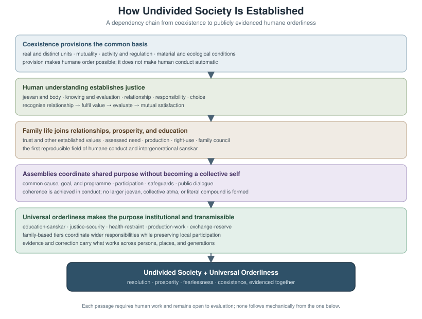

# How Undivided Society Is Established

**Author:** [AnalyticMadhyasthDarshan.org](https://github.com/raghavamohan/AnalyticMadhyasthDarshan) — a group of people studying Madhyasth Darshan philosophy. Source repository: [raghavamohan/AnalyticMadhyasthDarshan](https://github.com/raghavamohan/AnalyticMadhyasthDarshan).

**Edited on:** September 4, 2026, 4:01 AM IST
**Status:** Released
**The question:** What basis could make humankind an undivided society, why are influential contemporary alternatives insufficient by themselves, and how does Madhyasth Darshan propose that such a society be established and evidenced?

Madhyasth Darshan does not use *akhand samaj*, undivided society, as a name for political uniformity, a world state, or the numerical enlargement of an existing community. It names humankind recognised as one field of relationships, living through mutually fulfilling conduct and participating in universal orderliness (*sarvabhaum vyavastha*). The claim is demanding: unity must be compatible with distinct persons and families, prosperity with non-accumulation, freedom with responsibility, and social continuity with understanding rather than coercion.

This study asks what would make that claim more than an aspiration. It develops the Madhyasth Darshan account from coexistence, *jeevan*, relationship, justice, and awakening; compares that basis with science-only materialism, Advaita Vedanta, and religious authority within the diverse field called Hinduism; and follows establishment from the individual through family, institutions, and intergenerational tradition. The process reconstruction in [*From Unit Activity to Human Orderliness*](../A-State-Dynamic-Model-Of-Coexistence/A-State-Dynamic-Model-Of-Coexistence.pdf) informs the distinction between structural closure, body–*jeevan* association, and maintained relational order, but the present argument remains in ordinary philosophical prose.

## Standpoint and scope

These studies are written from the standpoint of a scientist and technologist trained to graduate-level physics and mathematics. From that background, matter-first explanation is familiar and indispensable: physical and natural sciences provide powerful accounts of bodies, ecosystems, production, communication, and institutional effects. The hard problem of consciousness, the status of the self, and the reality of value nevertheless remain contested. This study does not treat materialism as proven merely because material explanation is methodologically successful.

The method is to read the primary Madhyasth Darshan texts and first state the darshan's social argument in its own terms. That argument is then compared in parallel with physics and the natural sciences, Advaita Vedanta, modern Western philosophy where it bears on facts and values, and religious social authority. Physics and mathematics are one leg of the comparison, not the sole tribunal for questions of self, justice, value, or human purpose.

The comparison is neither missionary nor dismissive. Science, Advaita, and Hindu traditions each preserve genuine achievements: public inquiry and causal knowledge; disciplined examination of self and attachment; moral formation, service, and durable communities. The narrower question is whether any one of them, taken by itself, supplies a universal and publicly examinable basis for humane conduct, material sufficiency, fulfilled relationships, non-sectarian social identity, and institutional continuity.

The aim is rigorous comparative understanding rather than devotional endorsement. The prose therefore distinguishes what Madhyasth Darshan asserts, what can be reconstructed from its concepts, and what remains an open empirical or philosophical problem. Clear and checkable exposition comes first; formal mathematics may follow elsewhere, but this study does not require it.

## 1. What a universal social basis must explain

### 1.1 Undivided society and universal orderliness

Madhyasth Darshan describes society as humane only when it is undivided. This does not erase families, languages, cultures, functions, or local institutions. Division in the relevant sense occurs when such differences become ultimate identities whose security or advantage is pursued against other human beings. Undividedness instead makes human identity primary and treats every smaller association as participation in the wellbeing of the whole.

> **"Society is humane only when it is undivided. Societal functioning means participation for undivided society, in other words participation in universal orderliness."**
> - JVD, p. 157

Undivided society and universal orderliness name two aspects of one achievement. The first concerns recognition: humankind is one society, and every person enters an already present field of human relationships. The second concerns functioning: education, justice, health, production, and exchange must be organised so that this recognition can be lived. Recognition without institutions remains sentiment; institutions without recognition readily become systems of control, competition, or group advantage.

The human goal gives the achievement its evaluative content: resolution, prosperity, fearlessness, and coexistence. Resolution concerns clarity in the individual; prosperity is the family's assurance of more production than its needs; fearlessness is trust in society; coexistence is participation with the whole of nature. These are mutually supporting outcomes rather than four independent programmes. Material sufficiency without resolution can become accumulation, inward peace without just relationships can remain private, and social security purchased through fear cannot become fearlessness.

### 1.2 Criteria of adequacy

A basis capable of supporting this telos must answer several connected questions. It must say what a human being is, because a body-only organism, an immortal soul awaiting another world, and a *jeevan*-body joint form imply different accounts of need and fulfilment. It must explain whether values are objective, conventional, commanded, or selected. It must connect knowledge to conduct, since a social philosophy that can be affirmed without being lived cannot explain its own evidence. It must include production and ecology, because no society persists through inward realisation alone. It must also explain how understanding and institutions pass to new generations without depending permanently on force or charismatic authority.

Universality adds a further constraint. A foundation for all humankind cannot require prior membership in one ancestry, scripture, deity, nation, or sect. Its claims must be available for study, examination, and practical evaluation by any human being. This does not require cultural sameness. It requires a common basis on which differences can meet without one community's inherited authority ruling everyone else.

These criteria make the question harder than choosing a desirable moral slogan. A viable basis must join ontology, philosophical anthropology, value, conduct, economy, ecology, education, and institutions in one intelligible account. Madhyasth Darshan's distinctive proposal is that this connection is already implicit in coexistence and becomes explicit in awakened human conduct.

## 2. The Madhyasth Darshan foundation

### 2.1 Coexistence without a collective super-being

Madhyasth Darshan holds that existence is coexistence: formless Omnipresence (*satta*) and countless bounded units of nature are ever present together. Each unit is saturated in *satta* and thereby active, energised, and regulated in mutuality. Units remain real and distinct; coexistence is not their dissolution into one substance or consciousness. The social importance of this ontology is that unity need not mean sameness, absorption, or subordination to a whole.

The four orders of material, pranic, animal, and knowledge-order nature display progressively different forms of organisation. Physical and biological units exhibit definite conduct according to their constitutions, seeds, and species. Human conduct is not definite in that way. A human being can understand, mis-evaluate, choose, and revise; humane definiteness must therefore be achieved through *sanskar*, understood disposition, rather than inherited as a biological programme.

The darshan explains sentience through *jeevan*, the constitutionally complete unit that works through an animal or human body. Its detailed atomic account is a doctrinal claim, not an established result of contemporary physics or neuroscience. For the social argument, the load-bearing distinction is more modest: the body provides sensation and material action, while *jeevan* is said to desire happiness, evaluate, understand, and evidence conduct. The updated ontology and state-dynamic study examine the stronger atomic and continuity claims in depth; this paper does not make social order depend on presenting them as settled natural science.

Human organisation must also not be mistaken for a literal physicochemical compound. A family or assembly does not become a larger *jeevan*, acquire a collective *atma*, or erase the agency of its members. The analogy with composition is limited but useful: an assembly becomes a coherent whole when its members recognise a shared purpose, fulfil relationships, evaluate outcomes, and carry the method across changes of membership. At the human order, that closure is voluntary, understanding-mediated, fallible, and corrigible.

### 2.2 Relationship, value, and justice

Lower orders exhibit mutuality, recognition, and fulfilment in definite conduct. Human relationship adds consciously recognisable expectations, responsibilities, values, and evaluation. A relationship is not merely contact or exchange. It is a mutuality in which expectations are oriented toward completeness: parent and child, partners, siblings, friends, teachers, and learners can ask what is to be fulfilled and whether mutual satisfaction has been achieved.

Values are the essentiality fulfilled in such mutuality. Utility and art concern objects and production; *jeevan* values concern happiness, peace, contentment, and bliss; human, established, and expression values concern humane identity, trust, affection, care, gratitude, respect, and the right-use of body, mind, and wealth. Justice is not one value added to this list. It is the complete relational activity of recognising a relationship, fulfilling its values, evaluating the fulfilment, and reaching mutual satisfaction.

> **"Recognising relationships, fulfilling values, evaluating, and achieving mutual satisfaction is justice."**
> - MVD, p. 311

This makes justice prior to statutory legality in the order of explanation. Law can protect conditions for justice, settle disputes, and restrain harm, but compliance alone does not establish mutual satisfaction. Conversely, personal goodwill without public arrangements cannot secure education, production, health, exchange, or protection at scale. Humane policy must therefore preserve the relational purpose of justice while giving it dependable institutional form.

### 2.3 Rule, justice, resolution, and truth

Karm Darshan states the grounding sequence with unusual clarity. Omnipresence is the basis of balance in nature; rule is the basis of balanced activity; justice is the basis of balanced behaviour; resolution is the basis of balanced thought; and coexistence as supreme truth is the basis of realisation (KD, pp. 7-8). These are not interchangeable levels. A physical regularity does not by itself become a norm of human conduct, and a norm does not become socially effective merely by being written into law.

The sequence corrects two opposite reductions. Society cannot be derived by scaling physical regulation upward, because human beings evaluate and can depart from humane conduct. Nor can social order be produced from moral exhortation alone, because conduct occurs through bodies, resources, production, ecosystems, and institutions. Madhyasth Darshan proposes continuity without collapse: nature provisions order and mutuality; human understanding recognises their meaning; justice closes relationships; resolution stabilises thought; and conduct makes the understanding publicly evident.

Karm Darshan describes awakened tradition as doing after understanding, while deluded tradition learns only after acting and undergoing consequences (KD, p. 7). This distinction turns education into more than information transfer. Humane education must develop the capacity to anticipate relational and ecological consequences, examine desire, and act from understood purpose. Social continuity depends on making such understanding ordinarily available, not on waiting for exceptional saints or rulers.

### 2.4 Provision and achievement

Coexistence provisions activity, mutuality, values, the possibility of recognition, and the human capacity to understand. It does not guarantee resolution, prosperity, trust, or undivided society independently of human conduct. At the knowledge order, the same freedom that makes awakening possible also permits mis-evaluation, accumulation, exploitation, and sectarian identity.

Undivided society therefore belongs to achievement, not automatic natural development. The first three orders exhibit definite conduct without moral deliberation; the human order must bring knowing, believing, recognising, fulfilling, and evaluating into agreement. Activity completeness and conduct completeness name the settlement of this process in awakened living. Their evidence is not a private state alone but humane work and behaviour that others can recognise and learn from.

## 3. Why human society remains divided

### 3.1 Delusion and incomplete evaluation

Madhyasth Darshan locates the root disorder in taking the body to be the whole self. Sensation, bodily security, and material facility then organise desire as if they exhausted human fulfilment. Evaluation remains dominated by pleasant and unpleasant, healthy and unhealthy, and profit and loss. These perspectives are necessary within their domains, but they cannot by themselves settle justice and injustice, dharma and adharma, or truth and untruth.

The diagnosis should not be reduced to one psychological slogan. Body-identification becomes socially consequential through several mechanisms: desires expand without a criterion of sufficiency; wealth becomes accumulation rather than assurance; inherited affiliation becomes defensive identity; authority substitutes for understanding; and institutions reward short-term advantage while distributing consequences to others. Internal contradiction and external conflict reinforce one another.

Karm Darshan contrasts necessary tendencies of non-accumulation through prosperity, affection, learning, simplicity, and fearlessness with convenience, accumulation, hatred, ignorance, conceit, and fear (KD, p. 8). The contrast is not an attack on comfort, property, or knowledge. It asks whether they remain means within humane purpose or become organising ends that fragment relationships.

### 3.2 From difference to division

Human diversity does not itself produce division. Division arises when colour, caste, creed, ideology, nationality, or economic position becomes a final boundary of responsibility. Communities then organise trust internally and fear externally. Cooperation may remain strong within the group while the human whole is treated as a field of rivals, converts, markets, subjects, or threats.

Madhyasth Darshan distinguishes such sectarian organisation from community as a bearer of humane tradition. A community contributes to undivided society when its cause, goal, and programme are open to universal human participation and when its internal solidarity does not require another group's inferiority. Cultural plurality can then persist as expression rather than harden into competing accounts of who is fully human.

### 3.3 Accumulation, coercion, and delayed understanding

Material need is finite enough to assess at the family level, while desire under comparison and insecurity can become indefinite. When prosperity is confused with accumulation, production serves competitive advantage rather than assured sufficiency and right-use. Fear then appears to justify hoarding, military protection, exclusion, and central control; these arrangements reproduce the insecurity they promise to solve.

Coercion can preserve an institution for a time, but endurance alone is not humane orderliness. An assembly sustained by fear, dependency, or information control has not internalised its own purpose. The relevant test is whether members can understand the cause and goal, participate in evaluation, fulfil responsibilities without permanent compulsion, and transmit the method to new members.

## 4. Why influential alternatives are insufficient by themselves

### 4.1 Science-only materialism

Modern science is indispensable for an undivided society. It provides disciplined observation, causal explanation, technological capability, ecological measurement, medicine, and ways to test institutional consequences. Scientific findings about climate, cooperation, development, trauma, public health, and resource use can correct ideology and expose ineffective practice.

Science as an empirical method does not, however, determine its own ultimate ends. Measurements can compare outcomes after an aim has been selected; they cannot by measurement alone establish why universal wellbeing should outrank national advantage, why mutual satisfaction should outrank aggregate preference, or why a person must never be treated merely as a resource. Facts constrain action, but a description of what occurs does not by itself yield a complete account of what ought to be fulfilled.

Science-only materialism adds a philosophical claim to scientific method: the human being is exhaustively a bodily system and values are products of biology, preference, or social construction. That claim remains contested by the hard problem of consciousness, first-person awareness, personal identity, and the apparent normativity of truth and justice. Even a sophisticated optimisation system must receive objectives, weights, and constraints from an account of the human good. Once justice, relationship, ecological responsibility, and universal human dignity enter the objective, value-neutral science is no longer the whole basis.

Science is therefore a necessary means and a continuing corrective, but not a sufficient social foundation by itself. Madhyasth Darshan's contrast is with scientism, not with careful empirical inquiry. Its own claims about *jeevan*, atomic development, education, and social effects must remain open to conceptual criticism and empirical examination wherever evidence is possible.

### 4.2 Advaita Vedanta

Advaita Vedanta offers a profound challenge to egoic and bodily identification. It holds that the deepest Self is not separate from Brahman, treats liberation through knowledge as the highest aim, and can support equanimity, non-attachment, compassion, and a universal regard that crosses ordinary social boundaries. Any comparison that reduces Advaita to ritual obedience or sectarian belief misses its philosophical force.

The difficulty concerns derivation of a social order. At the ultimate level, Advaita sublates plurality and treats the empirical world as *mithya*: dependently experienced and neither absolutely real nor simply nonexistent. Ethics, duty, family, production, and governance remain meaningful within *vyavahara*, but they do not have the same ultimate status as knowledge of Brahman. Non-dual realisation can transform conduct, yet the metaphysics does not by itself specify a necessary cycle of relationship-recognition, value-fulfilment, evaluation, mutual satisfaction, family prosperity, five social dimensions, or universal institutional participation.

Madhyasth Darshan takes a different route. Persons, units, relationships, and the world remain real in coexistence; liberation from delusion is evidenced through conduct within those relationships rather than through the ultimate sublation of difference. The disagreement is not whether inward knowledge matters. It is whether social fulfilment follows as an explicit and indispensable completion of knowledge. For establishing the particular telos of undivided society, Advaita can contribute self-inquiry and freedom from possessive identity but is insufficient as the sole architectural basis.

### 4.3 Hindu religious authority and social tradition

"Hinduism" does not name one philosophy, scripture, deity, ritual system, or social programme. It includes Advaita and other Vedanta schools, devotional traditions, Yoga, Samkhya, Nyaya, temple communities, household practices, renunciant paths, and many competing accounts of dharma. Its plurality has supported remarkable philosophical inquiry, moral discipline, service, art, family continuity, and forms of ecological reverence.

That plurality is precisely why Hinduism as a general label cannot function as one determinate universal foundation. Appeals to revelation, deity, guru, caste duty, inherited custom, or sacred law do not command equal acceptance across Hindu traditions, much less across all humankind. Where moral authority rests finally on a community's scripture or lineage, disagreement between communities has no shared method of resolution except interpretation, conversion, accommodation, or power.

Karm Darshan's critique targets this authority structure rather than every religious insight. It argues that spiritualism, god-centred thought, and other idealisms have often retained mystery at both their basis and destination, while materialism removes the need for sacred authority without supplying a complete humane end (KD, pp. 146-151). The proposed alternative is not hostility to devotion. It is to make claims about self, relationship, justice, and social purpose available for study and verification in conduct, so that humane identity does not depend on accepting one community's revelation.

Religious traditions can therefore contribute practices of restraint, care, service, gratitude, and intergenerational meaning. They become inadequate as the sole basis when obedience replaces understanding, promised otherworldly outcomes displace present relationship-fulfilment, or inherited community identity limits universal responsibility.

### 4.4 The contrast in social foundations

| Question | Madhyasth Darshan | Science-only materialism | Advaita Vedanta | Hindu authority as basis |
|---|---|---|---|---|
| Human being | *Jeevan*-body joint form capable of understanding and humane conduct | Bodily organism or information-processing system | Self is ultimately Brahman; individuality belongs to empirical reality | Varies by school, scripture, and practice |
| Status of the world | Real and perpetual coexistence of distinct units in *satta* | Physical world is fundamental | Empirical world is *mithya* relative to Brahman | Ranges from realism to qualified or non-dual accounts |
| Source of value | Essentiality in relationships, known and evidenced through justice | Biological disposition, preference, convention, or selected objective | Dharma within *vyavahara*, informed by liberating knowledge | Revelation, dharma traditions, reason, custom, or devotion |
| Evidence of fulfilment | Mutual satisfaction, humane conduct, four human goals, universal participation | Measurable outcomes relative to chosen aims | Liberating knowledge and its ethical expression | Fidelity, virtue, ritual, service, liberation, or divine relation |
| Social completion | Family-based orderliness maturing into undivided society | Efficient and adaptive institutions; ends remain externally selected | No single necessary institutional programme follows from non-duality | Multiple community-specific social visions |

Madhyasth Darshan is broader in architectural ambition, but breadth is not proof. Its advantage is the explicit linkage it proposes; its burden is to show that the links are coherent, teachable, non-coercive, and evidenced in actual living.

## 5. The path of establishment

### 5.1 Individual understanding and awakening

Establishment begins with a human being because institutions act only through persons, but it does not end in private transformation. Madhyasth Darshan describes the learning sequence as study, experiment or practice, and realisation evidenced in conduct. Knowing must become believing or accepting within oneself, then recognition and fulfilment in relationships. Doubt and verification are part of this process; mere repetition of doctrine is not awakening.

Jeevan Vidya is presented as a programme for making this study available in dialogue. Its proper role is catalytic rather than ecclesiastical: participants examine whether the distinctions among body, *jeevan*, sensation, desire, relationship, and coexistence make sense in their own experience and conduct. A teacher can present a proposal and help inquiry, but cannot confer understanding by authority.

Activity completeness names settled functioning under understanding; conduct completeness names its dependable evidence in work and behaviour. These concepts should not be read as claims of moral flawlessness. They identify the darshan's requirement that insight become stable enough to guide action, accept evaluation, and serve as a learnable example.

### 5.2 Family as the first field of evidence

The family is the first sustained field in which relationship, need, production, use, education, and evaluation meet. Trust cannot remain an abstraction there: care, guidance, affection, gratitude, respect, and responsibility must be fulfilled among recognisable persons. Justice becomes concrete when expectations are understood, values are fulfilled, and all parties can evaluate whether mutual satisfaction has been reached.

Prosperity also becomes assessable at this scale. Madhyasth Darshan defines it as the feeling of having or producing more than the family's needs, not as indefinite possession. This requires competence in production, an agreed assessment of need, restraint in consumption, and confidence that relationships will not collapse when surplus is shared or put to purposeful use. Non-accumulation is therefore expected to arise from prosperity, not from glorifying deprivation.

The family council joins deliberation and implementation. In deliberation the family functions as an assembly; in daily work it functions as a cooperative unit. Children and new members learn not only rules but how needs are assessed, disagreements heard, responsibilities accepted, resources used, and consequences evaluated. This is *kutumb shiksha*, family education, as the smallest reproducible form of humane orderliness.

### 5.3 Assemblies through shared purpose

Families do not scale into society merely by aggregation. A humane assembly requires commonness of cause, goal, and programme. Its cause is the unresolved human condition; its goal is the fourfold human aspiration; its programme comprises education, justice, health, production, exchange, and the practices through which members evaluate them. Commonness does not require identical opinions. It requires enough shared understanding to coordinate action and correct departures without making force the permanent source of unity.

Human composition remains an analogy, not a new super-organism. The assembly is coherent when relationships and responsibilities are fulfilled, decisions remain answerable to justice, members experience mutual satisfaction, and the method survives turnover through education-*sanskar*. An institution can persist empirically through coercion while failing this humane criterion; persistence and orderliness must not be confused.

The texts describe a family-based sequence extending through larger councils toward a world-family council. The philosophical point is subsidiarity with shared purpose: responsibility should be exercised at the most immediate competent level, while wider tiers address matters that cross local boundaries. Universal orderliness is not a command centre above humankind but coordinated participation among self-responsible tiers.

### 5.4 Five dimensions of universal orderliness

Jeevan Vidya names five dimensions through which social purpose becomes institutional practice:

1. **Education-*sanskar*** makes understanding and humane competence available.
2. **Justice-security** fulfils relationships, resolves disputes, and protects persons and resources.
3. **Health-restraint** supports bodily health while keeping sensation and consumption within understood purpose.
4. **Production-work** ensures material sufficiency through skilled and ecologically responsible labour.
5. **Exchange-reserve** circulates surplus and maintains provision without making profit-extraction the organising aim.

These dimensions constrain one another. Production without ecological and bodily restraint destroys its own conditions. Security without justice becomes domination. Education without productive competence becomes abstraction. Exchange without prosperity encourages debt and accumulation. Health without resolution can become another market in anxiety. Universal orderliness means their coordinated functioning toward the same human goal.

Karm Darshan adds natural responsibility to the social account. Mineral, forest, water, and climatic balances must be understood, and use must remain proportionate to regenerative processes (KD, p. 7). Coexistence with nature is therefore not a ceremonial fifth goal after human prosperity; it is a condition of production and the wider test of right-use.

### 5.5 Policy, protection, and public dialogue

Madhyasth Darshan distinguishes humane moral policy (*manav dharma-niti*) from humane state policy (*manav rajya-niti*). The first concerns right-use of body, mind, and wealth; the second secures the conditions in which that right-use can continue. Neither is sufficient alone. Moral teaching without protection leaves humane conduct vulnerable to exploitation, while security detached from humane purpose protects existing power rather than justice.

Public dialogue (*janvad*) is the bridge between private study and collective decision. It places resolution, prosperity, fearlessness, coexistence, and participation before citizens as matters to be examined rather than slogans to be imposed. Dialogue is meaningful when it can revise programmes in light of experience, include affected persons in evaluation, and distinguish disagreement from enmity.

### 5.6 Transition in a mixed society

No existing society begins with universal awakening, and the primary texts do not yet provide a detailed transition theory for contemporary plural states. A plausible Madhyasth Darshan transition must therefore work among people with unequal understanding, competing commitments, and inherited institutions. Requiring every person to complete awakening before any social improvement begins would make establishment circular.

The process can begin with exemplars and small institutions that make limited claims and accept public evaluation. Families, schools, workplaces, and local councils can test whether explicit relationship expectations, transparent need assessment, shared production, restorative evaluation, and non-coercive dialogue increase resolution, sufficiency, and trust. Practices that work can be taught and federated; practices that fail must be revised rather than insulated by doctrinal authority.

Law remains necessary during transition because understanding is incomplete and harms are real. Its legitimate role is protective and enabling: restraining violence and exploitation, preserving space for inquiry and participation, and making institutions answerable. The long-term movement is from external control toward self-regulation, but invoking self-regulation must never excuse the absence of safeguards for vulnerable persons.

Pluralism also requires freedom of conscience. A person may contribute humane conduct from scientific, Advaitic, devotional, secular, or other convictions without first adopting Madhyasth Darshan's entire ontology. What the social programme can reasonably require is participation in just relationships and publicly assessable institutions. The darshan's stronger metaphysical claims must persuade through study and evidence, not become tests of citizenship.

### 5.7 Evidence at each scale

The four human goals provide a disciplined but still incomplete evidential frame. At the individual scale, resolution should appear as reduced contradiction and greater consistency between understanding and action. At the family scale, prosperity should appear as assured need-fulfilment, productive competence, and non-accumulative use of surplus. At the social scale, fearlessness should appear as trustworthy relationships, accessible justice, and declining dependence on threat. At the ecological and universal scale, coexistence should appear as responsible participation with other humans and the regenerative processes of nature.

Evidence cannot be only self-certification. Claims of resolution or awakening must remain answerable to those affected by the claimant's conduct. Family members, co-workers, neighbours, and institutions must be able to evaluate whether values are actually fulfilled. Quantitative indicators can assist this evaluation, but no single metric substitutes for relational judgement; both first-person and public evidence are required.

Education carries whatever has genuinely been evidenced. Karm Darshan calls education and orderliness the means of maintaining collective balance (KD, p. 8). A tradition becomes humane when each generation receives not merely conclusions but the capacity to investigate, understand, practise, evaluate, and improve them.

## 6. The establishment architecture

The full movement can now be stated without treating society as an enlarged atom. Coexistence provisions real plurality, mutuality, activity, and the possibility of value. The human being adds reflective evaluation and therefore the possibility of both delusion and justice. Understanding reorders desire; justice fulfils relationships; family life joins relationship with prosperity and education; assemblies coordinate shared purpose through five institutional dimensions; public dialogue and policy protect participation; education-*sanskar* carries evidenced understanding across generations. Undivided society is approached as these practices become universal in availability and orientation, while universal orderliness is their functioning form.

The existing figure should be read as dependency, not deterministic ascent. Ontology does not cause awakened society without human understanding, and individual awakening does not automatically create just institutions. Each passage has its own work: inquiry at the person, fulfilment in relationships, production and evaluation in family, coordination and safeguards in institutions, and transmission in tradition.

The decisive reversal is from acting first and understanding only through consequences to understanding, acting, and evaluating in a continuing cycle. This is how the darshan proposes to replace fear-bound organisation without replacing it with doctrinal command. Its strongest claim is not that harmony will happen automatically, but that a non-coercive order has an intelligible basis and a reproducible path.

## 7. Critical review

### 7.1 Madhyasth Darshan — an integrated but demanding proposal

**Strengths.**

- It joins ontology, self, value, relationship, material production, ecology, education, and institutions instead of treating social harmony as moral sentiment alone.
- It makes conduct and mutual satisfaction evidence of understanding, limiting the authority of private spiritual claims.
- It distinguishes prosperity from accumulation and places material competence inside, rather than outside, humane life.
- It preserves distinct persons and families within a universal human identity, avoiding both atomistic individualism and absorption into a collective self.

**Weaknesses.**

- The ontology of *jeevan* and the detailed atomic development account are not established by contemporary public evidence.
- The transition from exemplary families to large, plural, technologically complex societies remains under-specified.
- Terms such as awakening, resolution, and mutual satisfaction need operational criteria that resist self-certification and institutional capture.
- A movement teaching universal human identity can itself become sectarian if textual loyalty replaces open inquiry or if metaphysical assent becomes a condition of participation.

Madhyasth Darshan is strongest as an integrated research programme for humane living; it becomes weakest when its completeness is asserted in advance of social evidence.

### 7.2 Advaita Vedanta — inward universality without a necessary social architecture

**Strengths.**

- It offers a rigorous critique of egoic identification and possessiveness.
- Its non-dual vision can support universality, equanimity, compassion, and freedom from narrow identity.
- It has developed sophisticated disciplines of inquiry, interpretation, and contemplative practice.

**Weaknesses.**

- The ultimate sublation of plurality weakens the derivation of permanent relational and institutional categories.
- Liberation and ethical transformation do not by themselves specify production, prosperity, justice-security, exchange, or family-based governance.
- Social consequences depend heavily on supplementary doctrines and historical institutions rather than following uniquely from non-duality.

Advaita can deepen the inward critique of division, but it does not alone provide the full establishment programme examined here.

### 7.3 Science and materialism — indispensable correction without self-sufficient ends

**Strengths.**

- Science supplies public methods, causal knowledge, measurement, and correction by evidence.
- The natural and social sciences are indispensable for health, ecology, production, institutional design, and testing consequences.
- Materialism resists explanations that are protected from criticism by mystery or authority.

**Weaknesses.**

- Empirical method does not choose its own ultimate values or derive obligation from description alone.
- Reductionist accounts of consciousness, self, and normativity remain philosophically contested.
- Technical optimisation can intensify exploitation when its objective is inherited from power, profit, or group advantage.

Science is a necessary partner and evaluator of social practice. Scientism is insufficient as the sole account of humane purpose.

### 7.4 Hindu religious traditions — moral resources without one universal authority

**Strengths.**

- Hindu traditions preserve extensive resources for duty, restraint, service, devotion, family life, contemplation, and reverence for nature.
- Their plurality demonstrates many ways in which moral and spiritual meaning can be carried through culture.
- Shared practices can sustain communities beyond contractual or economic interest.

**Weaknesses.**

- No single scripture, deity, lineage, caste order, or account of liberation is authoritative across the whole field.
- Inherited authority can protect hierarchy and sectarian identity from examination.
- Otherworldly or ritual fulfilment can become detached from present justice, production, and universal human participation.

Hindu traditions can nourish humane life, but Hindu identity or scriptural authority cannot by itself be the universally examinable basis of undivided humankind.

### 7.5 Open problems

Several questions remain open for the study and practice of Madhyasth Darshan:

- **Threshold of social evidence.** The sources name the four goals and awakened tradition but do not specify when a village, institution, region, or world society qualifies as sufficiently evidenced.
- **Transition and pluralism.** The relation between family councils, existing constitutional states, markets, rights, and global institutions needs a detailed non-coercive transition account.
- **Power and failure correction.** Consensus and self-regulation require safeguards against concealed domination, exclusion, abuse, and confident but mistaken claims of understanding.
- **Measurement and interpretation.** Resolution, prosperity, fearlessness, and coexistence require mixed first-person, relational, ecological, and institutional evidence; their indicators remain to be developed.
- **Textual scope.** JVD and AVD remain work-in-progress translations, while Karm Darshan's English translation is newly available. Fuller work on *Manav Vyavahar Darshan* and *Avartansheel Arthshastra* may alter the institutional account.
- **Metaphysical burden.** It remains unsettled how much of the practical programme depends on accepting the full ontology of *satta* and *jeevan*, and how much can be tested as a social proposal across different metaphysical commitments.

## 8. Conclusion

Undivided society cannot be established by enlargement, decree, shared belief, or technical administration alone. Science can discipline means and consequences but does not choose a complete human end. Advaita can loosen egoic identity but does not necessarily derive a social architecture. Hindu traditions can sustain virtue and community but do not provide one authority available to all humankind. Each can contribute, yet none by itself satisfies the combined requirements of universal identity, value, material sufficiency, just relationship, institutional continuity, and publicly recognisable conduct.

Madhyasth Darshan proposes coexistence as the common basis and awakened human conduct as its social evidence. Its path runs through understanding rather than conformity, justice rather than legality alone, prosperity rather than accumulation, family education rather than isolated moral instruction, coordinated institutions rather than central domination, and tradition as the transmission of examinable understanding. The proposal becomes credible only where those claims survive dialogue and appear in the lives of persons, families, institutions, and their relations with nature.

Its central insight is therefore both philosophical and practical: humankind becomes undivided when universal human relationship is not merely affirmed but fulfilled, evaluated, protected, produced for, and taught. Whether Madhyasth Darshan can establish that at scale remains open. It has at least stated the test by which its vision should be judged.

## Appendix: Quick Glossary

| Term | Plain meaning |
|---|---|
| ***Akhand samaj*** | Undivided society: humankind recognised and lived as one field of mutually fulfilling relationships. |
| ***Sarvabhaum vyavastha*** | Universal orderliness through education-*sanskar*, justice-security, health-restraint, production-work, and exchange-reserve. |
| ***Satta*** | Formless Omnipresence in which all bounded units are saturated. |
| ***Jeevan*** | The sentient self, held by Madhyasth Darshan to work through the body while remaining distinct from it. |
| **Complementarity** | Mutual participation through which units or persons fulfil essentiality; definite in lower-order conduct and consciously achieved in humane relationships. |
| **Justice** | Recognition of relationship, fulfilment of values, evaluation, and mutual satisfaction. |
| ***Sanskar*** | Understood disposition and its transmissible formation through education and living tradition. |
| ***Kutumb shiksha*** | Family education through shared deliberation, work, relationship-fulfilment, and evaluation. |
| ***Samadhan*** | Resolution: clarity and freedom from contradiction in thought and conduct. |
| ***Samridhi*** | Prosperity: assurance of more production or available means than assessed family needs. |
| ***Abhaya*** | Fearlessness: trust evidenced in social relationship and justice. |
| ***Sadupyog*** | Right-use of body, mind, wealth, and natural abundance within humane purpose. |
| ***Prayojansheelta*** | Purposeful-use directed toward undivided society and universal orderliness. |
| ***Pramanikta*** | Authentic conduct that serves as publicly recognisable evidence of understanding. |
| **MVD / SB / JV / JVD / AVD / KD** | Primary Madhyasth Darshan texts listed below. |

## Editorial Notes

### Science and scientism

"Science" names empirical inquiry and its bodies of tested knowledge. "Scientism" or "science-only materialism" names the stronger philosophical claim that empirical and material explanation is sufficient to settle consciousness, value, and ultimate human ends. The criticism in §4.1 and §7.3 concerns the latter claim.

### Hinduism as a comparison category

Hinduism is internally plural and includes Advaita Vedanta. This paper therefore does not treat it as one doctrine. "Hindu religious authority" names attempts to ground universal social order finally in a particular scripture, deity, lineage, caste duty, ritual, or inherited community identity.

### Composition at the human order

Terms such as composition and closure are analogical when applied to families and assemblies. They do not imply a collective *jeevan*, a collective *atma*, or a literal *yaugik* compound. The analogy concerns coherent conduct, shared purpose, justice, persistence, and transmission.

## References

### Madhyasth Darshan primary sources

- **MVD** — Nagraj, A. [*Madhyasth Darshan — Co-existentialism*](https://analyticmadhyasthdarshan.org/References/Madhyasth-Darshan/MVD-Madhyasth-Darshan-Coexistentialism.pdf). English translation by Rakesh Gupta. Cited: coexistence and the four orders; *jeevan* and the human joint form; six perspectives; relationship, value, justice, awakening, family order, undivided society, and universal orderliness.
- **SB** — Nagraj, A. [*Samadhanatmak Bhautikvad*](https://analyticmadhyasthdarshan.org/References/Madhyasth-Darshan/SB-Samadhanatmak-Bhautikvad.pdf). English translation by Rakesh Gupta. Cited: saturation, complementarity, natural and excited states, composition and development, completeness, and societal evidence.
- **JV** — Nagraj, A. [*Jeevan Vidya: An Introduction*](https://analyticmadhyasthdarshan.org/References/Madhyasth-Darshan/JV-Jeevan-Vidya-An-Introduction.pdf). English translation by Rakesh Gupta. Cited: the study process, relationship values, justice, the human goals, prosperity, and five dimensions of orderliness.
- **JVD** — Nagraj, A. [*Janvad* (*Behaviour Centred Public Discourse*)](https://analyticmadhyasthdarshan.org/References/Madhyasth-Darshan/JVD-Janvad.pdf). English translation by Sanjeev Chopra (WIP). Cited: sectarian organisation, public dialogue, family council, participation, undivided society, and universal orderliness.
- **AVD** — Nagraj, A. [*Adhyatmvad* (*Realisation Centred Spiritualism*)](https://analyticmadhyasthdarshan.org/References/Madhyasth-Darshan/AVD-Adhyatmvad.docx.pdf). English translation by Sanjeev Chopra (WIP). Cited: awakening, activity and conduct completeness, humane tradition, community, and sources of undivided society.
- **KD** — Nagraj, A. [*Karm Darshan*](../References/Madhyasth-Darshan/KD-Karm-Darshan-English/KD-Karm-Darshan-English.pdf). Working English translation. Cited: humane orderliness and universal wellbeing (introductory principles); rule, justice, resolution, truth, social and natural balance (pp. 7-8); knowledge, knower, known and the critique of idealist and materialist foundations (pp. 146-153).

### Comparative sources

- **ChU** — [*Chandogya Upanishad*](../References/Advaita-Vedanta/CU-Chandogya-Upanishad-Gambhirananda.pdf). Cited for the Advaita tradition's non-dual identity claim as developed through later commentary.
- **BSB** — Sankara. [*Brahma Sutra Bhashya*](../References/Advaita-Vedanta/BSB-Brahma-Sutra-Bhashya-Gambhirananda.pdf). Cited for Advaita's account of Brahman, liberation through knowledge, and the status of empirical plurality.
- **SEP-AV** — [*Advaita Vedanta*](https://plato.stanford.edu/entries/advaita-vedanta/), Stanford Encyclopedia of Philosophy. Cited for contemporary scholarly framing of non-duality, *mithya*, ethics, and liberation.
- **SEP-SR** — [*Scientific Realism*](https://plato.stanford.edu/entries/scientific-realism/), Stanford Encyclopedia of Philosophy. Cited for the scope and philosophical interpretation of scientific knowledge.
- **SEP-ME** — [*Metaethics*](https://plato.stanford.edu/entries/metaethics/), Stanford Encyclopedia of Philosophy. Cited for the distinction between empirical facts and accounts of normativity.

### Related studies in this collection

- [*The Ontology of Coexistence*](../The-Ontology-of-Coexistence/The-Ontology-of-Coexistence.pdf) — the full ontological account and detailed comparison with Advaita, modern philosophy, and science.
- [*From Unit Activity to Human Orderliness*](../A-State-Dynamic-Model-Of-Coexistence/A-State-Dynamic-Model-Of-Coexistence.pdf) — three maintained forms (§3.6), their typed representation (Appendix A), and the source/model-status audit (Editorial Notes).
- [*Human Behavior and Society*](../Human-Behavior-And-Society/Human-Behavior-And-Society.pdf) — extended comparison of behaviour, science, religion, and Advaita.
- [*How to Form Self-Sustaining Organizations*](../How-To-Form-Self-Sustaining-Organizations/How-To-Form-Self-Sustaining-Organizations.pdf) — application of shared purpose, relationship-fulfilment, and transmission to organisations.
- [*The Epistemology of Coexistence*](../The-Epistemology-of-Coexistence/The-Epistemology-of-Coexistence.pdf) — study, knowing, evidence, and *pramanikta*.
