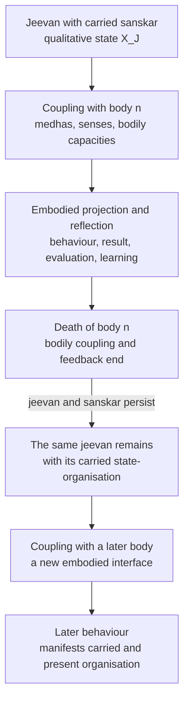

# Research Note: A Control-System Model of *Jeevan*—*Bal*, *Shakti*, and Activity

**Author:** Raghava Mohan Madhwapathi ([analyticmadhyasthdarshan.org](https://analyticmadhyasthdarshan.org))

**Edited on:** August 12, 2026, 2:27 PM IST

**Status:** Internal research note (not a catalog entry). Compiled to support [*The Epistemology of Coexistence*](The-Epistemology-of-Coexistence.md), especially its account of *jeevan*, knowing, reflection, projection, regulation, and evidence.

**Scope:** This note develops the activity architecture of *jeevan* as a qualitative, hierarchical, closed-loop control system. *Satta* is Knowledge rather than an acting controller. *Jeevan* is the sentient regulator; *bal* names its established state activities, *shakti* their motion and projection, and the body their temporary medium of expression and feedback.

Two axes organise the model. *Bal* and *shakti* are state and motion within each faculty. Projection and reflection are directions in which the ordered faculties are traversed—outward from *atma* toward *mun* and the body, and inward from the body and *mun* toward *atma*. Their combined form is *avartan*, the awakened *jeevan* cycle (MVD, p. 275; §1). The sources carry a second vocabulary in which strength names the faculties and power their orientations, pairing by direction rather than by state and motion; this note adopts the state-and-motion reading and records the other in the Editorial Notes rather than harmonising them.

The acquired organisation of *jeevan* is treated as *sanskar*. It is distributed across *mun*, *vritti*, *chitta*, and *buddhi* rather than stored as information in one place, is held to the realisation at *atma* rather than deposited there, is refined through reflection, projection, result, evaluation, and correction, and remains with *jeevan* when a bodily coupling ends. The twelve practical knowledge domains specify the content organised and applied through this architecture.

The controlled objective is not the maximisation of any one value. Bliss, contentment, peace, and happiness are one immersion arising from realisation and named at four levels of *jeevan*; where that immersion is absent, discord among the faculties produces frustration and the thirst for restfulness, and the pursuit of restfulness is what drives the loop (§3).

*Saturation* is the ontological bond through which the Knowledge to be known is available to *atma*. Coupling with the body is carried by named activities rather than by saturation: *prana* joins the gross body to the subtle and *chitta* joins the subtle to the causal (§2.1). This is an interpretive functional model: it does not reduce *jeevan* to a computer, the faculties to brain regions, *sanskar* to a database, or qualitative activity to numerical variables. Which of its components are given in the primary texts, which are syntheses across them, and which are hypotheses of the control model is set out in §2.3.

## 1. *Jeevan* as an embodied regulator

*Satta* is Knowledge. *Jeevan* can be modelled as an integrated sentient regulator that realises this Knowledge in coexistence and acquires its practical content as *sanskar*. *Bal* establishes that content as a qualitative internal organisation; *shakti* makes the organisation effective in projection. Through *mun*, the projected organisation selects embodied action. Bodily, relational, and natural consequences then occasion the inquiry that reflection bears inward. The loop is complete when Knowledge governs action, the result provides evidence of mutual fulfilment, and evaluation refines the organisation that will govern later projection.

The model has two directional movements:

- **Reflection**, or *pratyavartan*, is the movement of awakening. Each outer faculty's orientation comes to be governed by the faculty inward of it, and inquiry raised at the outer levels is borne inward. Where an embodied consequence occasions this movement, *jeevan* receives through *medhas* and the body its bodily condition; signals through sound, touch, visible form, taste, and smell; the performed action and its material result; another person's behaviour and relational response; and words or symbols that indicate conceptual meaning. *Mun* tastes acceptability, *vritti* forms a comparative judgment, *chitta* recognises meaning, relationship, process, result, and purpose, *buddhi* establishes definiteness, and *atma* relates that definite content to realisation.
- **Projection**, or *paravartan*, carries realised orientation outward. *Atma* bears authenticity, *buddhi* forms resolve, *chitta* forms an image or plan, *vritti* analyses alternatives and consequences, *mun* selects, and *medhas* and the body express the selection in action and observable result.

These movements are not separate systems. They are the recurrent operation of one *jeevan*, and their combined form carries a name of its own:

> In awakening, hope in *mun* is according to *vritti*, thoughts in *vritti* are according to *chitta*, desires in *chitta* are according to enlightenment of *buddhi*, and enlightenment in *buddhi* is according to *atma*'s realisation in existence. As a result, all the activities of reflection and projection are accomplished. The combined form of reflection and projection is referred to as the cognisance-sensitivity cycle. This itself is the awakened *jeevan* cycle. (MVD, p. 275)

*Avartan* therefore names the closed loop this note formalises. The two movements do not create *jeevan*'s basic capacity. *Jeevan* is held to be constitutionally complete and its strength and power inexhaustible; awakening changes the quality, coordination, governing criteria, and evidence of its activity without increasing its constitution quantitatively (MVD, p. 199; SB, Ch. 4).

Stated as a control system, the *bal* activities constitute and regulate the internal state-structure of *jeevan*, and the corresponding *shakti* activities make that structure effective toward an adjoining activity. Motion has a direction. Set outward, it evidences as *pramanikta* (authenticity or evidence-bearing orientation), *sankalp* (resolve), *chitran* (image or plan), *vishleshan* (analysis), and *chayan* (selection), and through *medhas* and the body the selection becomes embodied action, result, and publicly observable evidence. Set inward, it produces the capacity to receive the signal of the faculty inward of it (§6.3). Decline is apparent where a unit's powers flow outward alone and development where they are turned inward, inward deployment being described as drawing conclusions through reflection, inspection, and examination in self, and then evidencing them (MVD, p. 91).

The activities themselves are inherent in *jeevan*; they are not acquired through practice. What is acquired is understood content and its coherent organisation as *sanskar*. Practice progressively brings this content into agreement across the five dimensions and tests that agreement in living. Bodily death ends the current channel of expression and feedback, not the sentient regulator or the acquired organisation it bears.

## 2. System boundary and ontological commitments

A control model first requires a clear system boundary. The controller is not *satta*, *atma* by itself, or the brain. *Jeevan* is the integrated sentient unit bearing all five faculties. The human being is the joint form of *jeevan* and body through which knowing becomes embodied evidence.

The unit so bounded has a definite constitution. *Jeevan* is a constitutionally complete atom whose nucleus is named *atma*, the particles of its first orbit *buddhi*, of its second *chitta*, of its third *vritti*, and of its fourth *mun* (MVD, p. 78). *Atma* at that centre is the mediative activity, unaffected by generative or degenerative force. Constitutional completeness is evident in the atom's release from molecular and weight bondage together with its retention of the bondage of hope (MVD, p. 91). The five faculties are consequently orbital groupings within one unit rather than five components assembled into a system. This is why the model treats them as an ordered stack inside a single controller, and why the ordering—*atma* innermost, *mun* outermost—is constitutional rather than a modelling convenience.

The block diagram identifies the system being modelled and the elements with which it is coupled:

The solid system boundary encloses *jeevan*: its five-faculty state established as *bal*, and its motion as *shakti*, which is set outward in projection and inward in *antarniyaman*. *Satta* supplies the reality-reference without acting on the controller. *Prana*, the heart, *medhas*, and the body belong to the temporary embodied interface, while body, relationship, work, society, and nature form the field in which projection produces consequences. Feedback crosses the interface, but it does not itself become internal content: it occasions the inquiry that is borne inward (§6.4).

| Model element | Madhyasth Darshan referent | Function in the model | Boundary condition |
|---|---|---|---|
| Knowledge itself | *Satta* or Omnipresence | Actionless reality of *niyam*, *niyantran*, and *santulan*—the facts, rules, relations, and constraints available to be realised | Not a command source, acting controller, representation-producing mind, or perceiving subject |
| Reality and governing reference | Coexistence, including *jeevan* and humane conduct | What is to be known and the reference with which activity is to agree | Not an internal construction produced by the controller |
| Sentient regulator | *Jeevan* | Knower; bearer of state, motion, reflection, projection, and evaluation | Integrated unit; not reducible to an algorithm or brain process |
| Realised reference-centre | *Atma* | *Anubhav* in coexistence and projection as *pramanikta* | Faculty of *jeevan*, not an independent homunculus |
| Persistent acquired state | *Sanskar* in *jeevan* | Qualitative organisation of understanding, acceptance, criteria, valuation, and readiness for projection | Borne by *jeevan*; not genetic inheritance, a bodily trace, or a separate memory store |
| Embodied interface | *Prana*, heart, *medhas*, nervous system, senses, and body | Ordered bidirectional medium between *jeevan* and bodily activity: *prana* bears upon the heart, the heart upon the cognitive and work organs, and those organs upon behaviour and gratification (MVD, p. 204) | Temporary medium of evidence, not the originating knower or bearer of *sanskar* |
| Controlled field | Body, relationship, work, exchange, society, and participation in nature | Where selection becomes action and produces consequences | The human joint form acts within mutuality, not on an inert external world |
| Feedback | Bodily condition, sensory information, material result, another person's response, and evaluation | Returns consequences for tasting, comparison, recognition, definiteness, and correction | Feedback is interpreted through the current organisation of *jeevan* |

This boundary yields an essential distinction. The controller and its acquired qualitative state belong to *jeevan*; the body is the current interface through which that state becomes behaviour and receives consequences. Formation and decomposition belong to the body. Persistence, carried orientation, and the possibility of further awakening belong to *jeevan*.

### 2.1 Interface bonds: saturation and the named couplings

The two interfaces of the control model rest on different grounds, and conflating them obscures both.

The [ontology study](../The-Ontology-of-Coexistence/The-Ontology-of-Coexistence.md) defines *saturation* as the inseparable presence of nature in Omnipresence: every unit is soaked, submerged, and surrounded in *satta*. Saturation is a condition of existence rather than a temporal event, an external efficient cause, or an exchange of energy (§1.2). Because *jeevan*, including *atma*, exists saturated in *satta*, coexistence is ontologically present and available for *anubhav*. What the sources establish is the saturation and the availability; that saturation is the whole of what the *satta*–*atma* relation requires, with no further bond to be identified, is this model's reading of them. *Satta* does not send signals, issue commands, or become a second subject; knowing and *anubhav* belong to *jeevan* and *atma*.

The *jeevan*–body interface does not require saturation to do that second work, because the activities that carry it are named. Body, heart, and *prana* together are the gross body; *mun*, *vritti*, and *chitta* the subtle body; *buddhi* and *atma* the causal body, where "body" means activity rather than anatomy. The union of gross and subtle is through *prana*, and the union of subtle and causal is through *chitta*, the causal and subtle activities being indivisible (MVD, pp. 204–205). Desires follow from the causal and subtle bodies, while work and behaviour follow from the subtle and gross.

| Interface | What carries it | What remains unspecified |
|---|---|---|
| *Satta–atma* | Saturation, as the standing ontological condition under which coexistence is available to *anubhav* | Whether anything further is required; this model treats the relation as no channel and no traffic, which is its reading rather than a source statement |
| Subtle–causal, that is *chitta*–*buddhi* | *Chitta*, as the coupling activity between the two | How the coupling admits some content and withholds other content |
| Gross–subtle, that is body–*mun* | *Prana*, as the coupling activity between the two | How a particular selection becomes a particular bodily process |

A mechanism is also indicated for the outermost stage. Vibrational motion conveyed to *medhas* from the cognitive organs is described as the wave through which knowledge unfolds, and the wave arising from *jeevan*'s own signal as that through which sensitivity and cognisance become apparent in behaviour; the impetus behind sensory activity is a wave in the *prana* air bearing the effect of *mun* (MVD, p. 200). This is more determinate than an appeal to saturation, and it is where a physical account would have to engage the darshan. What it does not yet supply is a discriminating theory—why one wave carries this content rather than that—which §13 records as an open limit rather than a solved problem.

### 2.2 Knowledge as actionless regulatory structure

The model must distinguish **regulation as Knowledge** from **regulation as performed activity**. In *satta*, *niyam*, *niyantran*, and *santulan* are not acts being continuously executed by a cosmic controller. They name the definite facts and relations of coexistence: how an activity is constituted, what preserves its relatedness and purpose, and what balance obtains when participating units remain mutually compatible. In control-system language, these are the ground truth, constraints, and reference relations of the model. “Representation” here means their realised or conceptual form within *jeevan*; it does not imply that *satta* contains mental symbols.

The active meaning appears in the unit, and especially in awakened human doing. *Jeevan* knows the relevant fact or rule, accepts it as the basis of activity, selects accordingly, and evaluates whether the result exhibits balance. Thus actionless Knowledge becomes the governing content of action without *satta* itself becoming an actor:

**Knowledge as fact and rule → realisation and definitive understanding → regulation of selection and action → balance evident in the result**

### 2.3 Claim status and the distinctions the model rests on

A control model of a philosophical text mixes three kinds of statement, and the note is easier to use and to criticise if they are separated once at the outset. What follows classifies its main components; the Editorial Notes carry the detail.

| Component | Status | Basis or record |
|---|---|---|
| Five ordered faculties in one constitutionally complete atom | Primary text | MVD, pp. 78, 275 |
| Ten basic activities; four and a half effective in delusion | Primary text | MVD, p. 79; JV, pp. 70, 72–74 |
| Per-faculty counts totalling 122 in state and motion | Primary text | MVD, p. 323 |
| *Avartan* as the combined form of reflection and projection | Primary text | MVD, p. 275 |
| *Pratyavartan* as the outer conforming to the inner | Primary text | MVD, pp. 277, 307, 314 |
| Four values as one immersion named at four levels | Primary text | MVD, pp. 155–156, 307 |
| Discord, frustrated effort, and the thirst for restfulness | Primary text | MVD, pp. 79, 91, 276 |
| *Prana* joining gross to subtle, *chitta* subtle to causal | Primary text | MVD, pp. 204–205 |
| Six activities reserved to the sentient aspect | Primary text | MVD, pp. 313–314 |
| Twelve practical knowledges as the aspects of what *jeevan* knows | Oral exposition; component groups attested in print | Editorial Notes; §14 |
| Four values as immersion and as adjoining concurrence, read as one account | Cross-text synthesis | MVD, pp. 307, 327; Editorial Notes |
| *Bal* and *shakti* as an axis independent of projection and reflection | Cross-text synthesis, one vocabulary chosen over another | JV, pp. 40, 61; MVD, pp. 131, 323; Editorial Notes |
| Assignment of each named activity to the *bal* or the *shakti* side | Control-model hypothesis | §11; Editorial Notes |
| *Samvahan*, *sambodhan*, and *samvartan* as an inter-faculty request-and-response protocol | Control-model hypothesis | §§6.1, 7.3 |
| Saturation as the whole of what the *satta*–*atma* relation requires | Control-model hypothesis | §2.1 |
| Full-depth intrinsic *avartan* with no embodied occasion | Control-model hypothesis | §6 |
| Immersion, discord, and thirst as Boolean equivalences | Control-model hypothesis | §7.5 |
| Carriage of the whole persistent organisation across embodiments | Control-model hypothesis | §7.6 |
| Two-tier reading of *niyam–niyantran–santulan* against justice, *dharma*, truth | Analytical layering | MVD, p. 174; Editorial Notes |

Four distinctions do the most work in what follows, and collapsing any of them changes the model's claims rather than merely its wording.

| Do not conflate | With | What turns on it |
|---|---|---|
| *Bal* and *shakti*, which are state and motion within a faculty | Projection and reflection, which are directions through the ordered faculties | Every faculty holds state and every faculty acts on its neighbour in both directions; treating projection as *shakti* alone makes reflection a passive return (§4) |
| Bodily and sensory feedback crossing the interface | *Pratyavartan*, the outer faculty's orientation coming to be governed by the inner | Feedback occasions inquiry; it is not itself borne inward, and awakening is not a consequence arriving from outside (§§6.3, 6.4) |
| Continuity of *jeevan* and of attained understanding | Preservation of every coordinate of the modelled state | The first is stated by the sources; the second is a modelling choice, and behaviour cannot distinguish them (§7.6) |
| A successful *bodh*, which cannot be false | The condition of *buddhi*, which can be alienated, expectational, or unenlightened | Without the distinction, either *buddhi* becomes a fallible belief register or its attested disorders become invisible (§§4.1, 5.2, 12) |

## 3. Reference structure and the controlled objective

A control system is defined by what it is regulating toward. The objective here is *vishram*, restfulness: the eradication of unhappiness, attained as resolution and named the ultimate goal of the universe, of which awakened human tradition is the evidence (MVD, p. 68). Restfulness is not idleness. Effort, motion, and result continue in every constitutionally evolving unit, and there is no lack of effort in *jeevan* until it has developed the capacity, ability, and receptivity for restfulness (MVD, pp. 78–79). The objective is therefore recurrent coherence under continuing activity, not the cessation of activity.

### 3.1 The reference: one immersion named at four levels

Bliss, contentment, peace, and happiness are not four separate quantities to be traded against one another. They are one immersion, *aplavan*, described as effect and flow, which arises from realisation in Omnipresence and reaches through the four faculties outward from *atma*:

> *Buddhi*, *chitta*, *vritti*, and *mun* are affected from immersion (as effect and flow) attained by realisation in Omnipresence. This immersion is referred to as bliss at the level of *buddhi*, contentment at the level of *chitta*, peace at the level of *vritti*, and happiness at the level of *mun*. This realisation itself is the highest achievement in *jeevan*. (MVD, p. 307)

Immersion is the effect of delusionlessness, and *buddhi* becomes immersed on attaining it (MVD, p. 77). Bliss specifically is the effect upon *buddhi* of *atma* realised in truth (MVD, p. 101), and the effect of realisation reaches as immersion into *buddhi*, *chitta*, *vritti*, and *mun* alike (MVD, pp. 155–156). In control terms this is the reference of the system: a single flow whose presence at a level is that level's satisfaction. It is not a reward computed from results, and it does not originate at the outer end where results arrive.

The same four values are also given as what obtains when adjoining activities are in concurrence, and the ladder extends in both directions beyond *jeevan*:

| Concurrent pair | What the concurrence yields |
|---|---|
| Just behaviour and vocation | Coexistence and prosperity |
| Body and heart | Satisfaction |
| Heart and *prana* | Health and growth |
| *Prana* and *mun* | Strength and motivation |
| *Mun* and *vritti* | Happiness |
| *Vritti* and *chitta* | Peace |
| *Chitta* and *buddhi* | Contentment |
| *Buddhi* and *atma* | Bliss |
| *Atma* and Omnipresence | Eternal concurrence, realised as ultimate bliss and its evidence |

The two accounts agree exactly: the value named at a faculty is the value of that faculty's concurrence with the faculty inward of it, as recorded in the Editorial Notes. Bliss is felt at *buddhi* and arises from *buddhi*'s concurrence with *atma*; happiness is felt at *mun* and arises from *mun*'s concurrence with *vritti*. The ladder's outer rungs show that the embodied levels the model covers—body, heart, *prana*—carry their own concurrence values, and that just behaviour and vocation extend the same relation into the controlled field as coexistence and prosperity (MVD, p. 327; JV, p. 138).

### 3.2 The error signal and what drives the loop

The system has a definite error signal, and it is structural rather than incidental. Each faculty is more developed than the one outside it: *mun* than the body, *vritti* than *mun*, *chitta* than *vritti*, *buddhi* than *chitta*. When the outer end sets the terms—when hope in *mun* seeks the satisfaction of bodily sensation and thought, desire, and expectation are recruited to support it—the more developed faculty cannot conform to the less developed one, and their mutualities fall into discord:

> The steering of the gross body is according to *mun*, whereby there is hope between them. However, since *vritti* is more developed than *mun*, it is unable to become according to the hope of *mun*, resulting in mutual discord. *Vritti* intends to use *mun* and body according to itself. Similarly, there is mutual discord between *vritti* and *chitta*. This discord itself proves to be the cause of frustration and thirst for restfulness. (MVD, p. 276)

*Vishamata*, discord, is thus the error; *shram ki anubhuti*, frustration of effort, is its manifestation; and *vishram ki trisha*, the thirst for restfulness, is the drive it produces. Frustration is defined as the shortcoming in converting capacity and ability into effort, which is incompleteness of receptivity (MVD, p. 79), and frustration of effort is described as the cause of development itself, issuing in the thirst for restfulness (MVD, p. 91). Every deluded human, on this account, remains anxious for restfulness (MVD, p. 68). The pursuit does not have to be motivated from outside the architecture: the gradient guarantees that where the immersion is absent, *jeevan* is unsatisfied and seeks it.

The satisfied condition is described in the same terms, and it inverts the governing direction rather than intensifying the pursuit:

> In awakening, *mun* remains immersed by *vritti*, *vritti* by *chitta*, *chitta* by *buddhi*, and *buddhi* by *atma*. As a result of being active in this manner, due to being satisfied, their functions attain their full potential, leading to no frustration of effort, and restfulness becoming evident in all levels of *jeevan*. This itself is the comprehensive resolution or *abhyudaya*. In this state, the body becomes completely regulated by *mun*, meaning the senses become regulated based on cognisance. (MVD, p. 277)

Full effective capacity is therefore a consequence of satisfaction, not a precondition for it, and the regulation of sensitivity by cognisance is a result of the inversion rather than an act of suppression (§10).

### 3.3 Governing facts and humane criteria

At the level of Knowledge, the reference structure is expressed as *niyam–niyantran–santulan*:

- ***Niyam*** is the definite fact, law, or rule according to which an activity and relationship are constituted.
- ***Niyantran*** is the constraint or regulated relatedness by which the activity remains aligned with its constitution and purpose.
- ***Santulan*** is the fact or condition of balance among activities and units in mutuality.

At the level of doing, an awakened human understands these reference facts, regulates activity accordingly, and evaluates their manifestation as balance. The reference is actionless; recognition, selection, execution, and evaluation are activities of *jeevan* and the human joint form.

For humane conduct, justice, *dharma*, and truth supply the governing criteria. Activity is successful when it protects the relationship on which it depends, fulfils its accepted purpose, and produces mutual satisfaction rather than unilateral advantage. Since *atma* is the mediative activity at the centre of the unit, it is natural for *buddhi*, *chitta*, *vritti*, *mun*, and the body to be regulated by it, and the effort that resists this regulation is what gives rise to discord (MVD, p. 277). The reference and the error signal are consequently two descriptions of one arrangement: correct regulation is the immersion reaching every level, and error is its obstruction at some level.

## 4. State, transition, and output

The model keeps architecture, state, and content distinct. The five faculties, ten basic activities, and 122 detailed activities specify the architecture and its operations. *Sanskar* specifies the acquired organisation presently established across that architecture. The twelve practical knowledge domains specify what is being understood and applied. These are three descriptions of one functioning *jeevan*, not three inventories of stored items.

Madhyasth Darshan treats every unit as activity with state and motion, the plane of a unit being determined by its form, its essential nature, and the strength and power inherent in it—this itself being its state and motion (MVD, p. 131). For *jeevan* the identity is stated directly: the 122 activities are found in the form of strength and power, that is, in state and motion (MVD, p. 323). *Bal* and *shakti* therefore provide the native distinction a control model requires (JV, p. 61).

- ***Bal* is activity in state:** an inwardly established capacity, condition, valuation, meaning, definiteness, or realisation.
- ***Shakti* is activity in motion:** the corresponding selection, analysis, formation, resolve, projection, or evidencing of that state.

This yields a compact functional relation:

**established state (*bal*) → operative transition (*shakti*) → manifest orientation → embodied evidence**

State and motion are a distinct axis from projection and reflection. *Bal* is what a faculty has established in itself, whichever direction the loop is currently running; *shakti* is that establishment becoming effective toward an adjoining activity, and the direction in which it becomes effective is a separate matter (§6). Collapsing the two axes would make projection a property of *shakti* alone and reflection a property of *bal* alone, which the architecture does not support: every faculty holds state and every faculty acts on its neighbour in both movements.

Two qualifications belong here rather than later. The independence of the axes is a commitment of the activity-level vocabulary adopted in this section; a second vocabulary in the sources ties the pair members to direction instead, and the two are not reconciled (Editorial Notes). And the formalism of §7 composes projection out of the *shakti* operations and reflection out of the *bal* operations, so it follows direction more closely than the independence claimed here. The tension is recorded rather than resolved.

“State” does not mean inactivity. Tasting, comparison, contemplation, enlightenment, and realisation are active modes of establishment. “Motion” is wider than bodily movement. Selection, analysis, image-formation, resolve, and authenticity are motions because they make an established organisation effective toward another activity, an action, or a result.

*Bal* should therefore not be understood as an operator acting upon a separate passive store called “state.” Its activities are the modes in which content is established as the state of *jeevan*. On the reflection side, tasting, comparison, and contemplation interpret a returned result and may expose error in valuation, criteria, representation, or application. *Bodh* and *anubhav* establish reality-concurrent definiteness and realisation rather than erroneous conclusions.

*Shakti* holds no second state, but it does have a direction, and the direction is regulated rather than fixed. Set outward, it carries the established organisation into authenticity, resolve, image or plan, analysis, and selection. Set inward through *antarniyaman*, it produces in a faculty the capacity to receive the signal of the faculty inward of it—the ability to receive higher-conformance signals is said to arise solely through the internal regulation of *jeevan*'s powers (MVD, p. 284). Where a unit's powers flow outward alone, decline is apparent; where they are turned inward, development is apparent (MVD, p. 91). This gives reflection a mechanism of its own rather than leaving it as projection reversed. Because projection produces the embodied result that is subsequently reflected, refinement belongs to the complete loop, although establishment and revision occur on its *bal* side.

### 4.1 A qualitative state vector and its content

The internal organisation of *jeevan* may be represented schematically as:

**XJ = (xatma, xbuddhi, xchitta, xvritti, xmun)**

Each component is the established condition of one faculty. It is not a number. It is a typed qualitative state comprising what has been realised, understood, contemplated, compared, and tasted. For each faculty, this state has a persistent aspect—the organisation carried as *sanskar*—and a presently active aspect—the situation-specific content now being tasted, compared, recognised, made definite, or related to realisation. These are temporal aspects of one distributed state, not two stores inside *jeevan*. The 61 detailed *bal* activities refine the five state dimensions.

The content of this state consists of realised identity and concurrence in *atma*; definite acceptances and governing principles in *buddhi*; recognised meanings, relationships, purposes, results, and retained representations or *smriti* in *chitta*; comparative criteria and judgments in *vritti*; and valuations, expectations, hopes, and readiness for selection in *mun*. Its subject matter includes coexistence and the *jeevan–body* distinction; bodily, relational, social, and natural requirements; *niyam, niyantran,* and *santulan*; justice, *dharma,* and truth; the twelve practical knowledge domains; and meanings retained from earlier action and result. Raw bodily and sensory signals become part of it only as they are qualitatively interpreted through reflection.

Error is not distributed symmetrically across these dimensions. *Mun, vritti,* and *chitta* can sustain sensory-governed valuation, inadequate criteria, mistaken judgment, assumption, or misrecognised meaning. A successful *bodh* or *anubhav* is not among the things that can be false: *bodh* is definitive understanding only where the meaning agrees with reality, and *anubhav* is realisation only in concurrence with coexistence. If a candidate meaning is incorrect, it has not reached *bodh*; if coexistence has not been realised, there is no incorrect *anubhav*.

The condition of *buddhi* is a separate question from the correctness of an established *bodh*, and it is not exempt from disorder. Where the enlightenment of truth is absent, *buddhi* is alienated from *atma* and appears as ego, expectation, ignorance, conceit, and ingratitude, and holds its own knowledge superior (MVD, pp. 216–217, 276, 279; §12). “Incomplete” therefore qualifies the effective reach, activation, coordination, or evidential expression of these faculties, not a partially false *bodh* or *anubhav*. The state of *jeevan* as a whole can remain incomplete or internally contradictory because lower-faculty organisation and its projection may not yet be governed by the definite and realised reference, and because *buddhi* itself may be perturbed rather than enlightened.

The projective organisation may likewise be represented as:

**ΠJ = (πatma, πbuddhi, πchitta, πvritti, πmun)**

These components are the corresponding *shakti* operations: evidencing, resolving, forming, analysing, and selecting. The 61 detailed *shakti* activities refine these transition and projection functions. The notation asserts structure and correspondence, not measurability or mathematical independence.

### 4.2 Inherent provision and effective state

Two meanings of capacity must remain distinct.

| Capacity sense | Status in the model | What development means |
|---|---|---|
| Constitutional capacity | *Jeevan*'s complete and inexhaustible provision of *bal* and *shakti* | Does not increase or decrease quantitatively |
| Effective capacity | The currently active clarity, receptivity, coordination, criteria, and evidential reach of those activities | Can be refined qualitatively through study, realisation, practice, and evaluation |

Awakening therefore does not install more power. It changes which activities become effective, what contents and criteria organise them, how well adjoining faculties communicate, and whether projection agrees with realisation.

Effective capacity is not left as a matter of degree. In the knowledge order, *buddhi* is described in three statuses, each identified by which faculty is actually driving the others:

| Status | Tendency of desire, thought, and hope | Which faculty governs |
|---|---|---|
| Partially awakened | Desire-based | *Mun* and *vritti* are driven by *chitta* |
| Half awakened | Based on resolve without *atma-bodh* | *Mun*, *vritti*, and *chitta* are driven by *buddhi* |
| Awakened | Based on resolve with *atma-bodh* | *Mun*, *vritti*, *chitta*, and *buddhi* are regulated and disciplined by *atma* |

These are the gradations of effective capacity the model requires, and they are gradations of governing reference rather than of available power (MVD, pp. 278–279). The distinction is visible in the model's formalism as the depth of the effective cascade (§7.2) and in its account of the two regimes as the source that sets the terms (§10). Constitutional capacity is unaffected throughout: orbital motion within the atom arises from attraction and retraction and continues in every status, differing in form between delusion and awakening rather than in quantity (MVD, p. 200).

### 4.3 *Sanskar* as acquired distributed organisation

*Sanskar* is the learning state of this control model. It is described as acceptance toward completeness; knowledge, wisdom, and science carried toward resolution and evidence; understanding and tendencies for materialising what is understood; and physical, verbal, and mental activity directed toward completeness (MVD, p. 90). Humans are correspondingly *sanskar*-conforming units, with *sanskar* taking the combined form of understanding, honesty, responsibility, and participation (JV, p. 49).

Its place is fixed by contrast with the other orders. The material order is engaged in sequential events of results, the biological order in sequential events of seasons, the animal order in sequential events of instincts, and all human lives in sequential events of *sanskar* (MVD, p. 211). What varies from one order to the next is what carries continuity across events. For the human being it is neither the result nor the season nor the instinct but the acquired organisation itself, which is precisely why a control model of human activity cannot treat that organisation as an accessory to the loop.

It is therefore insufficient to equate *sanskar* with information remembered by *chitta*. Retained representation is one part of it, but *sanskar* is the organisation of understood content across the state-structure, taking the form of attained awakening in *mun*, *vritti*, *chitta*, and *buddhi* (MVD, p. 121):

| Dimension | Form taken by acquired Knowledge |
|---|---|
| *Buddhi* | Made definite through *bodh* and directive through *sankalp* |
| *Chitta* | Retained as meaning and *smriti*, contemplated, and represented as a possible way of living |
| *Vritti* | Organised as criteria, comparison, judgment, and resolved thought |
| *Mun* | Established as valuation, expectation, tasting, and selection |

*Atma* stands in a different relation to this organisation. Realisation in coexistence is what the four are awakened toward and what authenticity carries outward from; it is the reference with which acquired content comes to agree rather than a fifth deposit of acquired content (Editorial Notes). In this sense, the established *bal* configuration of the four outer faculties is the state-side form of operative *sanskar*, held to the realised reference at the centre, while the corresponding *shakti* activities are its transition, projection, communication, and evidence. The word “acquired” refers to content and organisation, not to the constitutional activities themselves.

Because this organisation belongs to *jeevan* rather than the body, the model treats it as persistent. Bodily formation follows composition and heredity, whereas *sanskar* belongs to the sentient aspect and becomes evident through the awakening of *mun*, *vritti*, *chitta*, and *buddhi* (MVD, p. 121); the cause of the body's successive conditions is inertial impression or heredity, and the cause of the sentient aspect's awakening is *sanskar* (MVD, p. 90). The human being is a joint expression of both aspects on exactly this division: the body is primarily species-conformant while consciousness is shaped by *sanskar*-conformance (SB, p. 63). Acceptances toward completeness, the understanding available for evidence, and the unresolved gap among knowing, wanting, doing, and undergoing are described as carried forward in relation to *prarabdh* (MVD, pp. 90–91). *Sanskar* therefore does not have to be transferred out of a dying body: it remains with the *jeevan* whose state it organises.

The organisation is also evaluable rather than neutral. Awakening in the sentient aspect is itself *sanskar*, and this is *susanskar*, while delusion under animal consciousness is *kusanskar*; in the joint form of *jeevan* and body the same organisation is reckoned as culture and civilisation, and becomes evident in tradition (MVD, pp. 314–315). Environment, study, and practice are what accomplish it, its effect being called *prabhav* and the effect's issue *fal* (MVD, p. 121). The learning state of this model consequently has a direction built into it: refinement of resolve, desire, and thought in coexistence is what *susanskar* names, so an organisation can be more or less coherent without the model requiring an external scale on which to score it.

### 4.4 Continuity across bodily death and re-embodiment

The ordinary reflection–projection loop operates through a living body, but the boundary of *jeevan* is not the lifespan of that body. *Jeevan* is held to continue after bodily death and to associate with a later body (JV, pp. 20, 54). When understanding and satisfaction have been attained, their established state is held to continue because *jeevan* does not die (JV, p. 76). In control terms, bodily death disconnects the current interface; it does not create a new controller or reset the qualitative state of the existing one.

Continuity of *sanskar* does not require explicit autobiographical memory of an earlier embodiment. Its organisation can persist as governing criteria, valuation, expectation, readiness, or behavioural tendency without the person recalling when or how it was acquired. Explicit *smriti* is one possible content of *chitta*; it is not the form in which every carried *sanskar* must appear.

The later embodiment therefore does not begin with an empty controller state. Its behaviour may manifest *sanskar* established before the present body, while present bodily capacity, family and social environment, education, new choices, and fresh feedback continue to modify what becomes effective. The dependence can be stated qualitatively:

**present behaviour = projection(carried *sanskar*, present understanding and selection, current body and circumstances)**

This is not mechanical determinism. A present act does not by itself reveal when each component of its governing organisation was acquired. Behaviour is evidence of the operative state of *jeevan* within the darshan's account, but it is not a unique public test that separates previous-embodiment *sanskar* from present learning, bodily condition, or social influence.

## 5. The five-faculty control architecture

The five faculties are not five independent controllers. A sentient unit is said to have five indivisible strengths—*mun*, *vritti*, *chitta*, *buddhi*, and *atma* (MVD, p. 275)—so they form an ordered, recurrent regulation stack within one *jeevan* rather than a federation of parts. Each dimension has a *bal* state activity, a paired *shakti* motion activity, and a recognisable continuing orientation.

The ordering is a developmental gradient, not merely a sequence: *mun* is more developed than the body, *vritti* than *mun*, *chitta* than *vritti*, and *buddhi* than *chitta* (MVD, p. 276). This is the fact that makes the architecture a control problem at all. A more developed faculty cannot be made to conform to a less developed one, so if governance runs outward-in, the stack is necessarily in discord and the four values are unavailable (§3.2). Harmony is an achievement of the inward-governed arrangement rather than a default of the architecture, and each faculty is inspiration for the one outside it—*mun* for the body, *vritti* for *mun*, *chitta* for *vritti*, *buddhi* for *chitta*, *atma* for *buddhi*, and realisation in coexistence for *atma* (MVD, p. 276).

| Faculty | Regulated dimension | *Bal*: established state activity | *Shakti*: transition or projection |
|---|---|---|---|
| *Atma* | Realisation | *Anubhav*: realisation in coexistence | *Pramanikta*: authenticity and evidencing |
| *Buddhi* | Definiteness and commitment | *Bodh*: definitive understanding of correctly recognised meaning | *Sankalp*: resolve according to understanding |
| *Chitta* | Meaning and representation | *Chintan/sakshatkar*: contemplation and direct recognition of meaning | *Chitran*: formation of an image, possibility, or plan |
| *Vritti* | Comparison and analysis | *Tulan*: comparison through definite criteria | *Vishleshan*: analysis of alternatives and consequences |
| *Mun* | Valuation and selection | *Asvadan*: tasting or assessment of acceptability | *Chayan*: selection according to valuation |

The same architecture can be stated in terms of each faculty's control role and the continuing orientation manifested through it:

| Faculty | Control role | Manifest orientation |
|---|---|---|
| *Atma* | Ultimate realised reference-ground and system-wide authenticity constraint | *Praman* or living evidence |
| *Buddhi* | Epistemic validation gate and formation of governing commitment | *Ritambhara* or truth-bearing resolve |
| *Chitta* | Semantic integration and generative representation | *Ichha* or desire |
| *Vritti* | Comparator and analytical transformation | *Vichar* or thought |
| *Mun* | Final selection gate toward embodiment and first sentient recipient of feedback | *Asha* or hope |

The orientations in the third column are located at the faculties. The sources also locate the same five at the couplings between faculties, and the choice made here is recorded in the Editorial Notes rather than argued in place.

### 5.1 *Atma*: realised reference

*Anubhav* is realisation in coexistence, not an episodic sensation or emotional state. It is not a fallible estimate that can be partly true and partly false. Where a content has not reached realisation, *anubhav* concerning it is not yet effectively established; where it is established, it is reality-concurrent. Its projective activity, *pramanikta*, is authenticity: realised understanding becoming effective as evidence. In the control model, *atma* provides the ultimate reference with which definitive understanding and projected conduct must agree. It does not issue detailed commands to lower faculties. Its regulatory role is realised centrality and authenticity.

### 5.2 *Buddhi*: validation and commitment

*Buddhi* is the epistemic validation gate. After *chitta* directly recognises meaning through *sakshatkar*, *bodh* says “yes, this is so” only when that meaning is correctly understood. This is stronger than *manyata*, assent or belief accepted on authority. Subjective certainty, firmness, or commitment does not turn an incorrect interpretation into *bodh*; such content remains assumption, judgment, or unresolved meaning. For any particular content, *buddhi* either establishes reality-concurrent definiteness or *bodh* concerning that content is not yet effective. Its reach may be incomplete across the contents required for living, but an established *bodh* is not itself incorrect. *Sankalp* converts definiteness into governing commitment: “I will organise activity accordingly.”

That an established *bodh* cannot be false says nothing about the condition of *buddhi* where *bodh* is not effective. Non-alignment with *atma* perturbs *buddhi*, and the lack of the enlightenment of truth is that perturbation: delusion, ignorance, conceit, and ingratitude are its named forms, and holding its own knowledge superior is ego (MVD, pp. 216–217, 279). In delusion *buddhi* is reduced to expectation in support of desire (MVD, p. 276). The gate can therefore be alienated, expectational, or unenlightened; what it cannot do is issue a definiteness that reality does not bear out (§12).

The sequence is therefore:

**direct recognition in *chitta* → *bodh* in *buddhi* → *sankalp* → organisation of image, analysis, valuation, and selection**

*Bodh* is the proximate ground of qualitative development in *chitta*, *vritti*, and *mun*, because their operations can now be governed by correct understanding. *Anubhav* remains the ultimate ground. *Buddhi* validates and commits; it does not create the constitutional strength or power of the other faculties.

### 5.3 *Chitta*: semantic and generative model

*Chintan* sustains and contemplates meaning. *Sakshatkar* is successful direct recognition: language or information becomes recognisable as the reality it indicates. *Chitran* gives that meaning a projectable form—an image, anticipated relationship, possibility, plan, or communicable representation. In control terms, *chitta* provides a meaning-bearing model of the intended result. Its quality depends on agreement with recognised meaning rather than imaginative richness alone.

### 5.4 *Vritti*: comparator and analysis

*Tulan* compares through criteria; *vishleshan* distinguishes alternatives, implications, and consequences. *Vritti* is therefore the principal comparator within the action-forming path. It does not merely calculate efficiency. It determines which criteria govern the comparison. Deciding justice and injustice, *dharma* and *adharma*, truth and untruth is given as the innateness of *vritti* itself (MVD, p. 204), so the comparator's jurisdiction is constitutional rather than assigned by the model.

Each of the six evaluative perspectives becomes clear only with respect to its own referent, and it is the referents that make the set an ordering rather than a ranking of preferences:

| Perspective | Referent with respect to which it becomes clear |
|---|---|
| Pleasant–unpleasant | Instincts |
| Healthy–unhealthy | The body |
| Profit–loss | Goods and services |
| Justice–injustice | Behaviour |
| *Dharma–adharma* | Resolution |
| Truth–untruth | Realisation in existence |

The first three are read against conditions that vary; the last three against behaviour, resolution, and existence (MVD, p. 66). A comparison therefore goes wrong not by using the pleasant–unpleasant perspective but by applying it to a question whose referent is behaviour or resolution—which is what §12 records as criterion inversion. Awakening does not discard pleasure, health, or material result. It places them under criteria whose referents can preserve relationship, resolution, and coexistence.

### 5.5 *Mun*: valuation and selection gate

*Asvadan* receives and tastes the acceptability of a possibility or result. *Chayan* selects according to that valuation, choosing what is pleasing to *mun* in expectation of taste (MVD, p. 327). Happiness and unhappiness from what is received and tasted through the organs of sound, touch, sight, taste, and smell is the innateness of *mun* (MVD, p. 204), which is why valuation is proprietary to it rather than delegated from *vritti*.

*Mun* is consequently the final sentient gate toward bodily execution and the first *sentient* faculty to receive interpreted bodily and sensory feedback—not the first recipient outright. Below it the gross body has its own ordered stages: the four instincts of eating, sleeping, defending, and mating are the innateness of the heart, *prana*'s domain is the heart, the heart's domain is the cognitive and work organs, and their domain is behaviour and gratification (MVD, p. 204). The model's outermost interface is therefore *prana*–heart–organs rather than *medhas* alone (§2.1), and *mun* stands one remove further in than the phrase "first recipient of feedback" suggests. Selection reflects the whole current organisation of *jeevan*: what is understood, imagined, compared, expected, and valued.

## 6. The closed reflection–projection loop

This diagram separates two coupled recurrences. The intrinsic loop, *avartan*, belongs to *jeevan*: projection and reflection can continue among *atma*, *buddhi*, *chitta*, *vritti*, and *mun* without a selection being executed by the body and without new bodily feedback. Recurrence without execution is attested at its shallowest, where the union of *vritti* and *mun* alone yields dreams, "imaginations that do not become evident in work and behaviour" (MVD, p. 279; §10). That the cascade can run at full depth to *atma* with no embodied occasion at all is the model's extension of that case, not a statement of the sources, and the further question of activity in a *jeevan* not coupled with a body is left open at §14. The embodied branch begins only when a selection is made available to *medhas* and the body; its consequences can then occasion further inquiry within the intrinsic reflective movement. *Jeevan* remains the persistent controller, while *medhas* and the body are the present interface. The twelve practical knowledge domains constitute governing content within *sanskar* rather than additional signal blocks. The diagram in §4.4 places the embodied branch within the longer continuity across bodily couplings.

The two directions of the loop are not mirror images, and a control abstraction has to preserve the asymmetry. *Sanket*, signal, is the vocabulary of the inner-to-outer direction: each faculty develops completely by accepting the signals of the faculty inward of it. What moves outer-to-inner is named differently—inquiry, as *jigyasa*, *kautuhal*, or *prashna*—and its arrival at an inner faculty is described as effect and immersion rather than as signal reception. Treating reflection as projection run backwards, with the same content interpreted at each stage in reverse, therefore imports a symmetry the sources do not have. §6.1 sets out the activities that carry each direction before the two movements are described.

### 6.1 The six activities of the sentient aspect

Six activities are reserved to the sentient aspect and denied to the insentient, and they are the natural primitives of this model:

| Activity | Definition | Direction in the loop |
|---|---|---|
| *Samvedan*, sensing | Knowledge of the five cognitive organs and the five work organs; also the tendency toward development | At the embodied interface, and as the propensity that starts the movement |
| *Samvahan*, inquiring | The bearing of inquiries for knowledge of completeness | Outer to inner |
| *Sanrakshan*, protecting | Paving the way toward development | Sustains the loop rather than carrying content |
| *Sambodhan*, enlightening | Imparting the understanding of reality | Inner to outer |
| *Samvartan*, adhering | Following the received signals toward refinement and completeness | Outer faculty acting on what it has received |
| *Pratyavartan*, reflecting | The motion of awakening | Outer to inner, as conformance |

These six give the loop its content without recourse to a sensor-and-actuator scheme (MVD, pp. 313–314). What travels inward is an inquiry raised toward completeness, not a measurement; what travels outward is the understanding of reality, not a command. Adherence is the outer faculty's own activity upon what it has received, which is why receiving a signal and being changed by it are distinct events in this architecture. *Sanrakshan* has no directional content at all: it names the clearing of the way, and its absence is a failure mode the model should predict (§12).

The definitions above are the sources'; the third column is not. The six are defined as activities of the sentient aspect, and no consulted passage assembles *samvahan*, *sambodhan*, and *samvartan* into a request-and-response protocol running between adjoining faculties, or states that every embodied result is converted into an inquiry. Reading them that way is what lets §7.3 formalise the inward movement, and it is a hypothesis of this model that the sources permit rather than assert.

### 6.2 Projection: state becomes control action

Projection carries the established organisation of *sanskar* through the intrinsic dependency:

**realisation/authenticity → definiteness/resolve → meaning/image → comparison/analysis → valuation/selection**

This sequence completes the projective movement within *jeevan*. It can produce an image, plan, comparison, expectation, or selected possibility that becomes material for further reflection without bodily execution. When the selection crosses the embodied interface, an additional chain follows:

**selection → *medhas* → body → speech, action, or work → result**

The pairing of the two directions is given directly for each faculty: the power of *mun* is selection in projection and taste in reflection, of *vritti* analysis in projection and deliberation in reflection, of *chitta* visualisation in projection and contemplation in reflection, of *buddhi* resolve in projection and enlightenment in reflection, and of *atma* authenticity in projection and realisation in reflection (SB, p. 63). Each of the five thus has one projective and one reflective form rather than a single fixed function. Both members of every pair are named powers there, with strength reserved for the faculties themselves, so the pairing runs by direction where §4 pairs by state and motion. The two vocabularies, and this note's choice between them, are recorded in the Editorial Notes.

The dependency is not a conversion of one substance into another. *Pramanikta* does not literally become *sankalp*, and resolve does not literally become an image. Each faculty receives the governing orientation of the adjoining faculty and performs its own paired activity. A resulting selection may become available to *medhas* and the body for execution, but bodily execution is not required for projection and reflection to continue within *jeevan*.

What passes outward is *sambodhan*, the imparting of the understanding of reality, and the sources describe its reception as the condition of each faculty's own completion rather than as the delivery of an instruction. The complete development of *atma* lies in realisation in coexistence; of *buddhi*, in accepting the signals of *atma*; of *chitta*, in the capacity for creative visualisation according to the signals of *buddhi* in the presence of truth's realisation; of *vritti*, in accepting the signals of *chitta*, which is the ability to generate thoughts of *dharma*; and of *mun*, in acquiring receptivity for just behaviour on accepting the signals of *vritti* (MVD, p. 323). Projection in this model is consequently developmental at every stage: a faculty that receives well is a faculty that is thereby completed, which is why the same chain appears in §10 as the description of awakening.

The body is not a passive actuator. Health, fatigue, skill, sensory condition, available material, other people, and the natural environment constrain what can be performed. Embodied evidence therefore belongs to the human joint form, not to disembodied *jeevan* or brain alone.

### 6.3 *Pratyavartan*: conformance and receptivity

*Pratyavartan* is defined as the motion of awakening (MVD, p. 314), and it is reflection in the strict sense of the sources: not the return of a consequence, but the outer faculty's orientation coming to be governed by the faculty inward of it. Hope in *mun* becomes according to the thoughts arising in *vritti*; desire in *chitta* is given action-form through those thoughts; the resolve of *buddhi* is aimed at *atma*'s realisation—and it is this regulation that constitutes the activity (MVD, p. 277). Its order runs inward the whole way: the reflection of *mun* occurs in *vritti*, of *vritti* in *chitta*, of *chitta* in *buddhi*, of *buddhi* in *atma*, and of *atma* in Omnipresence; *atma* realises in coexistence, and only then does the reflection of *buddhi* become possible (MVD, p. 307). Reflection itself is described as the cause of awakening (MVD, p. 307).

The mechanism is receptivity, and it is regulated:

> The ability of receiving higher-conformance signals arises solely through the internal regulation process of *jeevan*'s powers. This is the reflection of behaviour into thought, thought into desire, desire into resolve, and resolve into realisation or mediative activity. (MVD, p. 284)

This is where the model's inward movement gets a mechanism distinct from projection. *Antarniyaman* turns motion inward, and what it produces is not content but the capacity to receive—so a faculty can be signalled without being changed, and becoming capable of reception is a separate accomplishment from the signal's availability. Each level's reception is conditional in a specific way:

| Reception | Condition of its occurrence | What the sources say is required |
|---|---|---|
| Reflection of hope, in *mun* | Absence of crime | The pressure and influence of orderliness |
| Reflection of thought, in *vritti* | Absence of injustice | The influence of societal conduct |
| Reflection of desire, in *chitta* | Absence of attachment | The influence of study and *sanskar* |
| Reflection of resolve, in *buddhi* | Absence of ignorance | *Antarniyaman*, or *dhyan* |

Reflection succeeds or fails according to these conditions (MVD, p. 284). Three of the four are social and educative rather than introspective, which is a substantive claim about the loop: the inward movement of a single *jeevan* depends on arrangements outside it, and the model cannot represent awakening as a purely internal optimisation. *Dhyan* is described as focusing *mun*, *vritti*, *chitta*, and *buddhi* both to understand and, after understanding, to evidence—so it belongs to both directions of the loop rather than to reflection alone.

### 6.4 Inquiry borne inward

What travels inward is inquiry. *Samvahan* is the bearing of inquiries for knowledge of completeness (MVD, p. 314), and the inward-facing movement is named at every level:

| Faculty | Inward-facing activity | What it is |
|---|---|---|
| *Mun* | *Kautuhal*, curiosity | The impetus to know the unknown and attain the unattained |
| *Vritti* | *Utsah*, enthusiasm | Intrepidity toward rise or development |
| *Chitta* | *Ahlad*, delight | The lack of the sentiment of lacking, on awareness of that absence |
| *Buddhi* | *Ullas* and *aplavan*, elation and immersion | The effect of delusionlessness |
| *Atma* | *Anubhuti*, realisation | Understanding, state and motion, emergence, and result obtained through natural progression |

This series is given as the mode of channelling *jeevan*'s energies toward development, and the passage that gives it adds that inward regulation of those energies is essential to it (MVD, pp. 77–78). The inward movement is therefore motivational before it is informational: curiosity in *mun* is not a report about a result but an impetus toward what is not yet known. *Vritti*'s own *samvedna* is described partly in the same register, as movement for completeness and as the pain toward development and awakening—quest, expectation, and hope. The same entry also gives it the grasping of external signals through all the cognitive organs, so the register is not exclusively motivational (MVD, p. 337; Editorial Notes).

Reflection within *jeevan* accordingly proceeds through the reverse faculty order:

**Mun → vritti → chitta → buddhi → atma**

When an embodied consequence occasions the movement, that internal order is preceded by an external path:

**result → bodily and sensory signal → *mun***

The result does not travel inward as a message. It raises the inquiry that *samvahan* bears, and what returns is *sambodhan*, the understanding of reality, which the outer faculty then follows through *samvartan*. The stages below describe what each faculty establishes when this happens, not what is relayed through it.

*Mun* tastes an internally projected possibility, remembered content, or embodied result; *vritti* compares it with expectation and governing criteria; *chitta* recognises its meaning; and *buddhi* examines whether it agrees with definitive understanding. These are the reflective forms of the same five powers whose projective forms carry the outward movement (SB, p. 63), which is what allows one architecture to serve both directions. If the candidate meaning does not agree with reality, it remains unestablished rather than becoming incorrect *bodh*. If it becomes definite, it is made available for concurrence with *anubhav*; bodily feedback does not write a fallible conclusion into *atma*. Reflection can refine the internal state-structure and correct the next projection. A bodily signal does not arrive already labelled as justice, fulfilment, or truth; its meaning depends on the effective depth and criteria of reflection.

“Data” in this model therefore means typed qualitative content, not raw measurements passed unchanged from one faculty to the next. Each stage interprets and reorganises what becomes available to it. Carried *sanskar* and memory are not additional external channels; they are part of the current internal state through which incoming signals are interpreted.

The following table begins with bodily and sensory feedback because it details the embodied branch. Its rows from *mun* through *atma* also apply when the movement begins from internally projected, remembered, or otherwise retained content. The second column names what occasions the movement at that level rather than what is transported into it.

| Stage | Occasion at this level | Establishing activity, *bal* | What becomes established | Projective counterpart, *shakti* |
|---|---|---|---|---|
| *Medhas*, senses, and body | Hunger and satiety, pain and ease, fatigue and energy, health and impairment; sound, touch, visible form, taste, and smell; speech and action observed; material and bodily result; another person's response | Bodily and neural mediation of the joint form | Signals concerning bodily condition, event, result, and response; words and symbols available for meaning-recognition | Bodily execution, speech, work, behaviour, and the production of a new result |
| *Mun* | Bodily and sensory signals, attraction and aversion, satisfaction and dissatisfaction, anticipated or observed result | *Asvadan*: tasting or valuing acceptability | Hope and expectation; the felt acceptability or unacceptability of the result and the impulse requiring examination | *Chayan*: selection of a response, object, means, word, or act |
| *Vritti* | The valued result, possible alternatives, prior expectation, and the relevant relationship or need | *Tulan*: comparison under pleasant–unpleasant, healthy–unhealthy, profit–loss, justice–injustice, *dharma–adharma*, and truth–untruth | Comparative judgment or thought: what agrees, conflicts, fulfils, harms, or remains unresolved | *Vishleshan*: analysis of alternatives, means, implications, and consequences |
| *Chitta* | Comparative thought, communicated language, retained representation, and the form of the observed situation | *Chintan/sakshatkar*: contemplation and direct recognition | Recognised identity, form, property, relationship, process, result, and purpose; a meaning-bearing conception of what the situation is | *Chitran*: an image, possibility, explanation, or plan expressing that meaning |
| *Buddhi* | Meaning recognised in *chitta* and its proposed agreement with reality and purpose | *Bodh*: definitive understanding | Definite acceptance of what is so, what the governing criterion is, and what course is coherent with it | *Sankalp*: commitment or resolve to organise projection accordingly |
| *Atma* | Definitive understanding made available through *buddhi* | *Anubhav*: realisation in coexistence | Realised concurrence with Knowledge; the ultimate reference-state rather than another stored record | *Pramanikta*: authenticity through which realisation becomes evident |

The inward movement can consequently be read as **embodied event and result → tasted hope or valuation → comparative thought → recognised meaning and desire → definiteness and resolve → realisation**, which corresponds to the sources' own formulation of reflection as behaviour into thought, thought into desire, desire into resolve, and resolve into realisation (MVD, pp. 282–284). Each faculty performs its own establishing activity on what has become available to it; none relays identical data to the next.

The recurrence can be written schematically:

**refined *sanskar*/state-structure = reflection(current organisation, feedback, governing reference)**

**projected activity = projection(state-structure, purpose, relationship, bodily conditions)**

These are qualitative dependency statements, not numerical update equations.

### 6.5 Practice, assimilation, and transmission

Practice is the learning operation of the embodied loop. It does not manufacture the activities of *jeevan* or begin from a necessarily blank state; it engages the carried and presently acquired organisation so that understood content becomes coherent *sanskar*. A complete practice cycle includes receiving an explanation, recognising its meaning, examining it through comparison, becoming definite through *bodh*, relating it to *anubhav*, projecting it into conduct, evaluating the result, and correcting the internal organisation.

The sources make the causal direction here unusually explicit, and it runs from outer conduct to inner state:

> 1. Following or emulating the just behaviour. 2. Being and abiding in resolved thoughts (*dharma*-based thoughts). The firmness and dedication in the above two programs leads to the authority for realisation of verity, as a result *buddhi* becomes immersed. (MVD, p. 282)

Two outward practices held with firmness and dedication are said to yield the authority for realisation, and the consequence stated is that *buddhi* becomes immersed. The receptivity conditions of §6.3 are met in the same way: *mun* becomes capable of receiving *vritti*'s signal and turns to just behaviour; *vritti* becomes capable of receiving *chitta*'s and peace is realised; *chitta* becomes capable of receiving *buddhi*'s and contentment is realised; *buddhi* becomes capable of receiving *atma*'s and *atma-bodh* occurs (MVD, pp. 282–283). The loop closes when *buddhi*'s reflection toward *atma* takes place, at which point *atma-bodh* and realisation in Omnipresence become effective together and keep *buddhi* immersed (MVD, p. 286). Practice is thus not merely how the outer levels are trained; it is how the inner levels become receivable at all, which is why the model treats conduct as load-bearing rather than as the mere output of understanding.

Assimilation is complete only when the content becomes effective in all five dimensions. Information remembered in *chitta* but not validated in *buddhi* remains uncertain; a principle accepted in *buddhi* but not organised through *vritti* and *mun* remains unevidenced; and an action repeated through the body without correct reference may strengthen habit without establishing Knowledge.

Explanation to another person is a projective activity of *sanskar* and a test of its coherence. Comprehension becomes evident in the ability to convey the understanding to others (JV, p. 25). Explanation does not copy *sanskar* into the recipient. It supplies language, indication, and a proposed organisation; the recipient must recognise, examine, understand, practise, and evidence it through their own faculties. Transmission is correspondingly defined as an inquiry-answering relation: the *guru* is one who establishes inquiries and questions, in the form of resolution, into conception, while the *shishya* is one presented to receive and accept (MVD, p. 344). Teaching therefore engages the same *samvahan* that carries inquiry inward within a single *jeevan* (§6.4), which is how personal understanding becomes *upakar* and continues as humane tradition.

## 7. A qualitative mathematical control-system model

The architecture can be stated mathematically without treating its contents as numbers. The formalism below uses typed sets, ordered transformations, partial functions, and qualitative predicates. It does not assume a metric on understanding, a numerical quantity of *bal* or *shakti*, a scalar reward, or an experimentally identified transfer function. The time index $t$ orders successive embodied control cycles; it is not a claim that the activities of *jeevan* are clocked computations.

### 7.1 State and content spaces

Let the ordered set of faculties be:

$$
\mathcal{F}=\{a,b,c,v,m\}
=\{\textit{atma},\textit{buddhi},\textit{chitta},\textit{vritti},\textit{mun}\}.
$$

Each faculty $f\in\mathcal{F}$ has a qualitative state space $\mathcal{X}(f)$. The internal state of *jeevan* is the product:

$$
\mathcal{X}(J)
=\mathcal{X}(a)\times\mathcal{X}(b)\times
\mathcal{X}(c)\times\mathcal{X}(v)\times\mathcal{X}(m).
$$

$$
X(J,t)=\bigl(x(a,t),x(b,t),x(c,t),x(v,t),x(m,t)\bigr).
$$

The coordinates are typed contents, not real-valued variables. Each $x(f,t)$ has a persistent aspect $s(f,t)$, carried as *sanskar*, and a presently active aspect $q(f,t)$, concerning the current situation:

$$
x(f,t)=\bigl(s(f,t),q(f,t)\bigr).
$$

$$
S(J,t)=\bigl(s(a,t),s(b,t),s(c,t),s(v,t),s(m,t)\bigr).
$$

$$
Q(J,t)=\bigl(q(a,t),q(b,t),q(c,t),q(v,t),q(m,t)\bigr).
$$

$$
X(J,t)=\bigl(S(J,t),Q(J,t)\bigr).
$$

This decomposition is analytical rather than spatial: $S(J,t)$ and $Q(J,t)$ are not two stores inside *jeevan*. $S(J,t)$ is the durable cross-faculty organisation through which $Q(J,t)$ is interpreted and projected. The content space may be partitioned schematically as:

$$
\mathcal{D}
=\mathcal{D}(O)\cup\mathcal{D}(R)\cup
\mathcal{D}(P)\cup\mathcal{D}(E),
$$

where $\mathcal{D}(O)$ concerns coexistence, identity, and the *jeevan–body* distinction; $\mathcal{D}(R)$ concerns relationship, purpose, value, *niyam, niyantran,* and *santulan*; $\mathcal{D}(P)$ contains the twelve practical knowledge domains; and $\mathcal{D}(E)$ contains retained meanings, prior results, expectations, and tendencies acquired through living. A content $d\in\mathcal{D}$ becomes operative *sanskar* only through its distributed organisation across the five state dimensions.

### 7.2 Motion, its direction, and embodied dynamics

Motion carries a direction parameter, because the same *shakti* activity is set outward in projection and inward in *antarniyaman* (§4, §6.3). Let:

$$
\Sigma=\{\mathrm{out},\mathrm{in}\},
\qquad
\mathcal{S}:\mathcal{F}\times\Sigma\longrightarrow\text{operations},
$$

so that $\mathcal{S}(f,\mathrm{out})$ carries the established state of $f$ toward the faculty outward of it, while $\mathcal{S}(f,\mathrm{in})$ carries no content and instead raises the receptivity of $f$ to the faculty inward of it. Write $\operatorname{in}(f)$ for the faculty immediately inward of $f$ and $\operatorname{out}(f)$ for the one immediately outward, with $\operatorname{in}(a)$ and $\operatorname{out}(m)$ undefined within *jeevan*.

Receptivity is a predicate rather than a magnitude. Let $\kappa(f,t)$ be the condition attaching to level $f$—absence of crime at $m$, of injustice at $v$, of attachment at $c$, of ignorance at $b$—and let:

$$
r(f,t)=\mathcal{S}(f,\mathrm{in})\bigl(x(f,t),\kappa(f,t)\bigr)\in\{\top,\bot\}.
$$

$r(f,t)=\top$ means that $f$ can receive the signal of $\operatorname{in}(f)$ at $t$. This makes the effective cascade a consequence rather than a stipulation: $f$ belongs to $\mathcal{F}^{\mathrm{eff}}(t)$ only if receptivity holds along the chain from $f$ inward, which is the formal content of the three statuses of *buddhi* in §4.2.

Let $c(t)$ denote the present context: purpose, relationship, bodily condition, available means, and circumstance. Projection is the ordered composition of the five outward-set motion operations, written $\mathcal{P}(f)=\mathcal{S}(f,\mathrm{out})$:

$$
\mathcal{P}(t)=
\mathcal{P}(m)\circ
\mathcal{P}(v)\circ
\mathcal{P}(c)\circ
\mathcal{P}(b)\circ
\mathcal{P}(a).
$$

$$
p(t)=\mathcal{P}(t)\bigl(X(J,t),c(t)\bigr).
$$

with:

$$
\mathcal{P}(a)=\textit{pramanikta},\quad
\mathcal{P}(b)=\textit{sankalp},\quad
\mathcal{P}(c)=\textit{chitran}.
$$

$$
\mathcal{P}(v)=\textit{vishleshan},\quad
\mathcal{P}(m)=\textit{chayan}.
$$

The displayed composition is the full-depth cascade. More generally, let $\mathcal{F}^{\mathrm{eff}}(t)\subseteq\mathcal{F}$ be the faculties effectively participating in the present cycle. Projection is composed only over that ordered subset. If *atma* and *buddhi* are not effectively governing, for example:

$$
\mathcal{F}^{\mathrm{eff}}(t)=\{c,v,m\}
\quad\Longrightarrow\quad
\mathcal{P}(t)
=\mathcal{P}(m)\circ\mathcal{P}(v)\circ\mathcal{P}(c).
$$

This lower-depth cascade can still produce imagination, analysis, selection, and skilled behaviour, but the model does not insert fictitious *pramanikta* or *sankalp* where *anubhav* and *bodh* are not effective.

Thus $p(t)$ is the selection made available to *medhas*; it is not yet the bodily act. Let $B(t)$ denote the present body and $E(t)$ the relational, social, material, and natural field. The embodied dynamics and observable feedback are:

$$
(B(t+1),E(t+1))
=\mathcal{G}(B(t),E(t),p(t)).
$$

$$
y(t+1)=\mathcal{H}(B(t+1),E(t+1)).
$$

$\mathcal{G}$ includes bodily execution, speech, work, interaction, and material change. $\mathcal{H}$ makes bodily condition, sensory signal, performed action, material result, and another person's response available as feedback. The body and field are therefore the embodied plant of the model, while *jeevan* remains the sentient regulator.

### 7.3 Inquiry, response, and state update

Feedback $y(t+1)$ is not copied unchanged into the internal state, and it is not carried inward as content at all. It occasions an inquiry. The maps below render *samvahan*, *sambodhan*, and *samvartan* as a request-and-response protocol between adjoining faculties; that reading is the model's, not the sources' (§6.1). Let $\mathcal{I}(f)$ be the inquiries that can be raised at level $f$, and let:

$$
\mathsf{Occ}:\mathcal{Y}\times\mathcal{X}(J)\longrightarrow\mathcal{I}(m),
\qquad
\iota(t+1)=\mathsf{Occ}\bigl(y(t+1),X(J,t)\bigr).
$$

*Samvahan* bears an inquiry to the adjoining inward level, and *sambodhan* returns the understanding of reality when the inner level's state can answer it:

$$
\mathsf{Samvahan}(f):\mathcal{I}(f)\longrightarrow\mathcal{I}(\operatorname{in}(f)),
$$

$$
\mathsf{Sambodhan}(f):
\mathcal{X}(\operatorname{in}(f))\times\mathcal{I}(\operatorname{in}(f))
\rightharpoonup\mathcal{C}(f),
$$

where $\mathcal{C}(f)$ is the content that becomes available at $f$. Both are gated by receptivity: $\mathsf{Sambodhan}(f)$ is defined only where $r(f,t)=\top$. An inquiry may therefore be borne inward and go unanswered at a level whose receptivity condition fails, which is the formal counterpart of §6.3 and has no analogue in a scheme where reflection is projection reversed. The outer faculty's own uptake of what returns is *samvartan*:

$$
\mathsf{Samvartan}(f):\mathcal{X}(f)\times\mathcal{C}(f)\longrightarrow\mathcal{X}(f).
$$

Reception and change are thus separate events, and the composite inward pass over the effectively participating levels is the reverse ordered composition:

$$
\mathcal{R}(t)=
\mathcal{R}(a)\circ
\mathcal{R}(b)\circ
\mathcal{R}(c)\circ
\mathcal{R}(v)\circ
\mathcal{R}(m).
$$

$$
z(t+1)=\mathcal{R}(t)\bigl(\iota(t+1);X(J,t)\bigr).
$$

The argument is the raised inquiry rather than the feedback itself, and each $\mathcal{R}(f)$ is the establishing *bal* activity of its level:

$$
\mathcal{R}(m)=\textit{asvadan},\quad
\mathcal{R}(v)=\textit{tulan},\quad
\mathcal{R}(c)=\textit{chintan/sakshatkar}.
$$

$$
\mathcal{R}(b)=\textit{bodh},\quad
\mathcal{R}(a)=\textit{anubhav}.
$$

This is likewise the full-depth reflection cascade. In a shallower cycle, reflection terminates at the highest effectively participating faculty. For $\mathcal{F}^{\mathrm{eff}}(t)=\{c,v,m\}$:

$$
\mathcal{R}(t)
=\mathcal{R}(c)\circ\mathcal{R}(v)\circ\mathcal{R}(m).
$$

Feedback can then alter valuation, judgment, and representation without reaching definiteness or realisation.

Each map changes the type of content: the raised inquiry becomes valuation, valuation comparative judgment, judgment recognised meaning, recognised meaning definiteness, and definiteness realised concurrence. No stage relays the feedback itself. The *bal*-side update may be represented as:

$$
Q(J,t+1)
=\mathcal{U}^{Q}\bigl(Q(J,t),z(t+1);S(J,t)\bigr),
$$

$$
S(J,t+1)=\mathcal{U}^{S}\bigl(S(J,t),z(t+1)\bigr)
\quad\text{when the content is assimilated}.
$$

When the content remains transient or unassimilated:

$$
S(J,t+1)=S(J,t).
$$

The distinction prevents every passing sensation or thought from being counted as a permanent change of *sanskar*. $\mathcal{U}^{S}$ may confirm, extend, or reorganise lower-faculty valuation, criteria, representation, and application. It cannot manufacture an incorrect *bodh* or *anubhav*.

The complete embodied loop is therefore:

$$
p(t)=\mathcal{P}(X(J,t),c(t)).
$$

$$
(B(t+1),E(t+1))=\mathcal{G}(B(t),E(t),p(t)).
$$

$$
y(t+1)=\mathcal{H}(B(t+1),E(t+1)).
$$

$$
\iota(t+1)=\mathsf{Occ}(y(t+1),X(J,t)).
$$

$$
z(t+1)=\mathcal{R}(\iota(t+1);X(J,t)).
$$

$$
X(J,t+1)=\mathcal{U}^{\mathrm{bal}}(X(J,t),z(t+1)).
$$

### 7.4 Correctness and incompleteness constraints

Let $K$ denote reality as the Knowledge-reference with which content must agree. *Bodh* and *anubhav* are modelled as partial, reality-constrained functions rather than fallible belief updates:

$$
\mathsf{Bodh}:\mathcal{X}(c)\rightharpoonup\mathcal{X}(b),
\qquad
\mathsf{Bodh}(c)\downarrow
\Longrightarrow
\operatorname{Agree}(c,K)=\top,
$$

$$
\mathsf{Anubhav}:\mathcal{X}(b)\rightharpoonup\mathcal{X}(a),
\qquad
\mathsf{Anubhav}(b)\downarrow
\Longrightarrow
\operatorname{Agree}(b,K)=\top.
$$

Here $\downarrow$ means that the function is defined for the presented content. If $\operatorname{Agree}(c,K)=\bot$, $\mathsf{Bodh}(c)$ is undefined: the candidate remains assumption, judgment, or unresolved meaning rather than becoming incorrect *bodh*. The same restriction excludes incorrect *anubhav*. If $\operatorname{WrongBodh}$ and $\operatorname{WrongAnubhav}$ denote the sets of reality-discordant outputs attributed to these activities, the constraints are:

$$
\operatorname{WrongBodh}=\varnothing,
\qquad
\operatorname{WrongAnubhav}=\varnothing.
$$

Incompleteness can nevertheless be represented by a restricted effective reach or an incomplete coupling. Let $\Delta(b)$ be the topics in $\mathcal{D}$ for which *bodh* is effective and $\Delta(a)$ those for which *anubhav* is effective:

$$
\Delta(a)\subseteq\Delta(b)\subseteq\mathcal{D}.
$$

The reach is incomplete when either inclusion is proper, or when established definiteness and realisation fail to govern $\mathcal{P}(c),\mathcal{P}(v),\mathcal{P}(m)$. Thus “incomplete *buddhi* or *atma*” means incomplete effective reach, activation, coordination, or evidential expression—not partially false *bodh* or *anubhav*.

### 7.5 The reference flow, qualitative error, and successful regulation

The reference of this system is the immersion of §3.1, and it is indexed by level rather than aggregated. Let $A(f,t)$ hold when immersion is present at level $f$ at time $t$:

$$
A:\{b,c,v,m\}\times T\longrightarrow\{\top,\bot\},
$$

with the four values as its names at the four levels:

$$
\textit{bliss}=A(b),\quad
\textit{contentment}=A(c),\quad
\textit{peace}=A(v),\quad
\textit{happiness}=A(m).
$$

Because a value is the concurrence of its level with the level inward of it, immersion and harmony are the same fact under two descriptions:

$$
A(f,t)=\top
\iff
H\bigl(f,\operatorname{in}(f)\bigr)=\top .
$$

Discord and the drive follow directly. Where immersion fails at a level, that level is in *vishamata*, and the thirst for restfulness is the existential claim over the four:

$$
\operatorname{Vish}(f,t)=\neg A(f,t),
\qquad
\operatorname{Trisha}(t)=\top
\iff
\exists f\in\{b,c,v,m\}:\neg A(f,t).
$$

The system is therefore driven by the absence of its reference rather than by a computed reward, and $\operatorname{Trisha}$ requires no separate motivational term: the developmental gradient of §5 guarantees that outward-set governance leaves some $A(f,t)$ false. Restfulness is the condition $\forall f:A(f,t)=\top$, which the sources describe as no frustration of effort and restfulness evident at all levels.

The three preceding formulas are assumptions of the formal model rather than transcriptions of source statements. What the sources give is a correspondence between the value named at a level and that level's concurrence with the level inward of it (MVD, pp. 307, 327), and a causal account in which discord proves to be the cause of frustration and the thirst for restfulness (MVD, p. 276). Rendering the correspondence as a biconditional, discord as the plain negation of immersion, and thirst as an existential quantification over the four levels are choices that make the model definite; the sources neither state nor exclude them. §14 asks what would distinguish a value's failing at a level from its reaching further in attenuated form, which is a question this formalisation currently forecloses by construction.

The evaluation of an embodied result is a second and independent judgment. The control error concerning the result is not a numerical distance. Let:

$$
e(t+1)
=\mathcal{E}\bigl(y(t+1);K,\rho(t),\mu(t)\bigr)
\in\{\text{agreement},\text{unresolved},\text{contradiction}\},
$$

where $\rho(t)$ is the accepted relationship and purpose and $\mu(t)$ the requirement of mutual fulfilment. The evaluation asks whether the result agrees with reality, preserves the relationship, fulfils its purpose, and exhibits balance.

With $H(m,v),H(v,c),H(c,b),H(b,a)$ the harmonies across *mun–vritti, vritti–chitta, chitta–buddhi,* and *buddhi–atma*, and $M(t)$ mutual fulfilment in the controlled field, successful regulation is the qualitative predicate:

$$
\Phi(t)
=H(m,v)\land H(v,c)\land H(c,b)\land H(b,a)\land M(t)
=\Bigl(\bigwedge_{f\in\{b,c,v,m\}}A(f,t)\Bigr)\land M(t).
$$

$\Phi(t)=\top$ is not the maximisation of pleasure or utility. It says that the immersion reaches every level, the projection accords with the realised and definite reference, and the embodied result is mutually fulfilling. The second conjunct is not redundant: a *jeevan* whose internal levels are in concurrence still acts through a body and a field, and competence, means, and another person's response are not settled by internal coherence (§12). A stable awakened regime is therefore recurrent qualitative coherence under changing circumstances, not a static state with no activity.

### 7.6 Bodily death, re-embodiment, and observability

Index bodily embodiments by $n$, and let $t^{\mathrm{death}}$ be the end of the present bodily coupling. What the sources establish is that the same *jeevan* continues, associates with a later body, and retains attained understanding and satisfaction (JV, pp. 20, 54, 76). They do not specify that every coordinate of the modelled persistent organisation survives unaltered, so the continuity relation is written as carriage rather than as identity. Let $\sqsubseteq$ denote that the organisation on the left is carried into the state on the right without specified loss:

$$
S(J,n,t^{\mathrm{death}-})\sqsubseteq S(J,n+1,0),
\qquad
B(n+1)\not\equiv B(n).
$$

The same persistent organisation becomes associated with a new bodily interface, while the currently active content is reconstituted in the new context:

$$
X(J,n+1,0)
=\bigl(S(J,n+1,0),Q(J,n+1,0)\bigr).
$$

Whether $\sqsubseteq$ can be strengthened to equality is a modelling question the sources leave open, and §14 keeps it open. Neither relation implies explicit autobiographical recall. The carried $S(J)$ can become effective as criteria, valuation, expectation, readiness, or behavioural tendency. Later behaviour is:

$$
o(n+1,t)
=\mathcal{O}\bigl(
S(J,n+1),Q(J,n+1,t),B(n+1,t),E(n+1,t)
\bigr).
$$

For an observed behaviour $o$, the inverse $\mathcal{O}^{-1}(o)$ is non-unique: multiple combinations of carried *sanskar*, present learning, bodily disposition, circumstance, and current selection can produce observationally similar conduct. The model therefore represents continuity without claiming that behaviour alone can identify which part of the state was acquired in an earlier embodiment.

## 8. The twelve practical knowledges as distributed governing content

The twelvefold practical schema distinguishes the **content that is known** from the **activities that know and apply it**. The overall knowledge *jeevan* organises and applies is seen as these twelve aspects. They are not twelve more faculties, twelve additional *bal–shakti* operations, or twelve records held in one location; they are domain labels for content that becomes *sanskar* only by being distributed across realisation, definiteness, representation, comparison, valuation, selection, and evidence. The twelvefold comes from Shri A. Nagraj's oral expositions rather than from a passage in the printed sources consulted here, whose attestation of the individual groups the Editorial Notes record.

The content may be indexed as:

**D12 = (V1…4, S1…4, E1…3, U)**

Here **V** denotes knowledge of four bodily propensities, **S** knowledge of four sensory activities, **E** knowledge of the three *eshanas*, and **U** knowledge of *upakar*. *D* is only a compact index of definite known content; it does not mean numerical data or a database located in one faculty.

| Knowledge family | Count | What must be known | Role as distributed governing content |
|---|---:|---|---|
| Bodily propensities | 4 | Eating, sleeping, protection or defence, and mating: their bodily purpose, need, means, proper performance, limits, and effect on health and relationship | Specifies how the body is nourished, protected, rested, and continued without making bodily satisfaction the purpose of *jeevan* |
| Sensory activities | 4 | What each sensory activity is, how it is rightly performed, which bodily and sensory channels it uses, what information or result it provides, and what constitutes misuse | Specifies how sensitivity supplies usable body–world information and how cognisance regulates its employment |
| *Eshanas* | 3 | *Vitteshana*, *putreshana*, and *lokeshana*: their structure, legitimate purpose, required relationships and means, and rightful employment | Specifies how wealth, familial and social continuity, and public recognition become responsibilities under resolution rather than possessive drives |
| *Upakar* | 1 | The need for help, the other's material or epistemic requirement, one's own capacity and means, the right form of help, and the result expected in prosperity or awakening | Specifies higher-human participation through which resolved capacity supports another without dependency or exploitation |
| **Total** | **12** | **Practical knowledge for embodied and relational activity** | **Supplies the content on which the activities of *jeevan* operate** |

Sensory activity and sensory modality are distinct in the model. Sound, touch, visible form, taste, and smell are bodily channels through which information becomes available; what has to be known is how such activity is rightly performed and what constitutes its misuse. What this note cannot yet supply is the source-Hindi name and definition of each of the four sensory activities, which the printed sources consulted do not enumerate as a set (Editorial Notes; §14).

For every member of **D12**, adequate knowledge has a common structure:

1. **Identity:** what the activity or motive is.
2. **Purpose:** which bodily, relational, social, or higher-human requirement it serves.
3. **Procedure:** how it can be competently performed.
4. **Means and interface:** which body, senses, skills, relationships, and material resources it requires.
5. **Rule:** which *niyam* and governing criterion preserve its rightful use.
6. **Balance:** what *santulan* would mean among need, use, relationship, and available means.
7. **Evidence:** what result and feedback would show fulfilment or reveal error.

This is why the twelve kinds may analytically be described as the data being worked on and as what drives activity. “Data” here means known content instantiated throughout *jeevan*, not input delivered to a central processor. *Atma* realises its ground in Knowledge; *buddhi* validates its meaning and forms commitment; *chitta* retains and represents the intended result; *vritti* compares alternatives under its rules; *mun* selects; and the body performs. The result returns as feedback against the same known structure.

### 8.1 Where the content becomes most directly effective

The content is distributed, but the primary texts support different dominant points of effect.

| Knowledge family | Most direct effect | Distribution across the complete loop |
|---|---|---|
| Four bodily propensities | *Mun* and body: immediate tasting, expectation, selection, and performance | In awakening, *vritti* supplies governing comparison, *chitta* the meaningful intended form, *buddhi* definitive purpose, and *atma* the realised reference |
| Four sensory activities | Body–*medhas*, *mun*, and *vritti*: signal reception, valuation, selection, and sensory regulation | *Chitta* interprets and represents meaning; *buddhi* validates right use; the higher reference prevents sensitivity from defining happiness |
| Three *eshanas* | *Vritti* as awakened thought, followed by representation in *chitta* and selection in *mun* | *Vitteshana* becomes just acquisition and right use, *putreshana* family and social continuity, and *lokeshana* participation in undivided society and humane tradition |
| *Upakar* | The whole projection cascade: resolve in *buddhi*, benevolent visualisation in *chitta*, *daya–krupa–karuna* in *vritti*, and *mamata–udarata* in *mun* | Realisation-based authenticity grounds help; body, mind, and wealth make it effective for another's prosperity and awakening |

These are functional associations rather than exclusive storage locations. The four propensities arise from the hope of *mun*, while the three *eshanas* are nourished by awakened thought (MVD, p. 305). The sensory and work-organ activities appear within the detailed activities of *mun*, while *samvedna* in *vritti* includes grasping external signals through the cognitive organs and performing work, behaviour, and thought according to the law-triad (MVD, p. 337). *Upakar* is distributed across the detailed activities of *chitta*, *vritti*, and *mun*, and its complete expression depends on resolve and authenticity.

Sensory and bodily information is necessary. Error occurs when it becomes the final governing reference. Eating, for example, can be pleasant, health-supporting, affordable, just in exchange, ecologically responsible, and suitable to family need. The controller's task is not suppression but ordering: cognisance regulates sensitivity so that bodily, relational, material, and coexistential requirements remain compatible (SB, p. 64; MVD, pp. 65–68).

Feedback has at least four forms:

1. **Bodily feedback:** health, fatigue, pain, ease, nourishment, and skill.
2. **Material feedback:** whether work produced the intended object, service, or sufficiency.
3. **Relational feedback:** whether values were recognised and fulfilled and whether both persons can evaluate mutual satisfaction.
4. **Internal feedback:** whether adjoining faculties are harmonious or remain contradictory.

No single feedback channel is sufficient. Pleasant sensation can coexist with bodily harm; profit can coexist with injustice; private conviction can coexist with failed relationship. The complete loop evaluates results across all relevant fields.

## 9. A worked embodied control cycle

Consider disagreement over the use of family resources.

| Control phase | Operation in the human joint form |
|---|---|
| Reference | The relationship is to be fulfilled justly; material means are for need, prosperity, and right use rather than domination or hoarding. |
| Relevant knowledge data | Bodily need, the sensory and material facts of the situation, the rightful structure of *vitteshana* and family continuity, and the possibility of *upakar* are drawn from the twelve practical knowledge domains. |
| Disturbance or demand | Competing needs, limited resources, prior expectations, emotional reactions, and bodily conditions create a decision situation. |
| Initial feedback | *Mun* registers attraction, discomfort, satisfaction, dissatisfaction, and the responses of family members. |
| Comparison | *Vritti* considers pleasantness, health, and material consequence under justice, *dharma*, and truth. |
| Meaning formation | *Chitta* recognises the relationship, values, purpose, and form of mutual fulfilment. |
| Validation | *Buddhi* reaches *bodh*: the understood purpose and just course are definite rather than merely asserted. |
| Commitment | *Sankalp* establishes the resolve to organise conduct according to that understanding. |
| Planning and selection | *Chitta* forms a plan, *vritti* analyses alternatives, and *mun* selects words, timing, and action. |
| Embodied execution | The selection is communicated through *medhas* and body as speech, work, restraint, exchange, or provision. |
| Result | Resources are used and the relationship changes in response to the act. |
| Closure | Both parties evaluate whether values were fulfilled and mutual satisfaction attained; remaining contradiction becomes feedback for another cycle. |

Knowledge becomes evidence only when the projected act and evaluated result agree with the governing reference. Correct intention is necessary but not sufficient: the action must competently fulfil the relationship, and its result must remain open to evaluation and correction.

This example begins with “prior expectations” because an embodied control cycle never begins from nowhere. Within the model, those expectations can include organisation carried by *jeevan* from an earlier embodiment as well as learning from the present family and society. The observed decision remains a joint expression of this carried state, present understanding and selection, bodily ability, and the current situation.

## 10. Operating regimes: delusion and awakening

The same constitutional architecture can operate in two qualitatively different regimes, and what distinguishes them is which end of the stack supplies the reference. In delusion the outer end sets the terms: hope in *mun* rests on sensation, thought in *vritti* follows that hope, desire in *chitta* follows that thought, and *buddhi* is reduced to expectation in support of the desire—the arrangement the sources name the sense-rooted sensitivity system, with *buddhi*'s alienation from *atma* producing deluded visualisation and desire (MVD, pp. 275–276). In awakening the direction inverts: *mun* is immersed by *vritti*, *vritti* by *chitta*, *chitta* by *buddhi*, and *buddhi* by *atma* (MVD, p. 277).

The two regimes are therefore one architecture under opposite governance, and the inversion is what a control abstraction exists to express. It also explains why the regimes differ in satisfaction rather than in capability. Outward-set governance asks a more developed faculty to conform to a less developed one, which the gradient forbids, so discord and frustration persist however skilful the loop becomes (§3.2, §5). Inward-set governance asks each faculty to conform to the one whose development exceeds it, which it can do, and full effective capacity follows from the resulting satisfaction.

| Model feature | Delusion | Awakening |
|---|---|---|
| Assumed identity | Body taken as self | *Jeevan* known as knower and body as medium |
| Effective loop depth | Four and a half activities dominate: tasting, selection, analysis, visualisation, and sensory-material comparison | All ten activities become effectively coordinated through enlightenment and realisation |
| Governing reference | Fragments of the twelve knowledge domains are interpreted through sensory satisfaction, bodily benefit, material gain, assumption, and established behaviour | *Satta* is realised as Knowledge; *niyam–niyantran–santulan* and the twelve practical knowledge contents govern doing |
| *Sanskar* and carried orientation | Carried and presently acquired organisation remains only partially coordinated; received assumptions and sensory habits can govern projection | Understanding, honesty, responsibility, and participation form a coherent distributed organisation |
| Comparator criteria | Pleasant–unpleasant, healthy–unhealthy, profit–loss treated as final | Justice–injustice, *dharma–adharma*, truth–untruth govern the relative criteria |
| Projection | Can be skilful and powerful but internally contradictory | Resolve, representation, analysis, and selection agree with understanding |
| Feedback interpretation | Immediate or unilateral result dominates | Bodily condition, relationship, mutual satisfaction, and orderliness are considered together |
| Characteristic result | Intermittent satisfaction with recurring contradiction | Resolution, harmony, mutual fulfilment, and evidence |

Delusion is not the absence of a control loop. It is a partially effective loop organised by an inadequate reference and shallow evaluative closure. A person may display powerful imagination, analysis, planning, and bodily skill while those powers remain sensory-governed. Awakening is not the addition of a new controller. It is the qualitative reconfiguration of reference, criteria, receptivity, and coordination in the existing architecture.

The effective depth of the deluded loop is given a constitutional description. In the awakening progression, *jeevan* expresses four and a half activities through activeness in the fourth, third, and second orbits—that is, in *mun*, *vritti*, and *chitta*—by the body-based way, while on awakening it evidences all ten through the realisation-based way (MVD, p. 79). The fraction falls where *chitta* is reached: *chitran* occurs while *chintan* does not, so the outermost three orbits are active and the second only partly. Until *atma-bodh*, ego is described as the basis of all physical, verbal, and mental activity in waking, dream, and sleep alike, appearing as conceit in *chitta*, stubbornness in *vritti*, and attachment and agitation in *mun* (MVD, p. 279). The union of *vritti* and *mun* alone yields sleep or dream, dreams being imaginations that do not become evident in work and behaviour—which the model reads as the intrinsic loop running at its shallowest, with no embodied branch and no evidential closure.

Neither regime begins anew with each body. Re-embodiment supplies a new bodily interface to the continuing *jeevan*; it does not erase the orientation already established. The distinction between the regimes concerns what governs and coordinates the carried state, not whether a persistent controller is present.

## 11. The 122 activities as a detailed state–transition model

The 122-activity account refines the ten-activity architecture into 61 *bal–shakti* pairs. The per-faculty counts and their identity with state and motion are given at MVD, p. 323, and the activities are named and defined at pp. 328–348. The account specifies how *jeevan* is internally established and becomes active in state and motion; it does not add another content set beside *sanskar* or the twelve practical knowledge domains. Which member of each pair is the *bal* and which the *shakti* is this note's assignment, recorded in the Editorial Notes.

| Faculty | *Bal*: state activities | *Shakti*: motion activities | Total | Generic pair |
|---|---:|---:|---:|---|
| *Atma* | 1 | 1 | 2 | Realisation–authenticity |
| *Buddhi* | 2 | 2 | 4 | Enlightenment–resolve |
| *Chitta* | 8 | 8 | 16 | Contemplation–image-formation |
| *Vritti* | 18 | 18 | 36 | Comparison–analysis |
| *Mun* | 32 | 32 | 64 | Tasting–selection |
| **Total** | **61** | **61** | **122** | State–motion |

In control terms, the 61 *bal* activities are typed articulations of the qualitative internal state, while the 61 *shakti* activities are their paired transition, projection, and evidencing operations. They are not 122 brain modules, scalar variables, energy levels, or independently switchable functions. A pair specifies what a faculty's state is about and how that state becomes effective.

Each pair can be modelled through seven questions:

1. **Faculty:** Which dimension of *jeevan* owns the pair?
2. **State:** What does the *bal* activity establish or regulate internally?
3. **Transition:** How does the paired *shakti* activity make that state effective?
4. **Content:** Which reality, value, relationship, purpose, or bodily need is involved?
5. **Criterion:** Which comparative standard governs the activity?
6. **Interface:** Through which adjoining faculty or embodied path does it become effective?
7. **Evidence:** What observable fulfilment, harmony, or participation would close the loop?

### 11.1 Illustrative state–transition pairs

| Pair | State-side interpretation | Motion-side interpretation | Evidential closure |
|---|---|---|---|
| *Dheerata–veerata* | Firmness and dedication toward justice established in *vritti* | Physical and intellectual powers deployed to enable justice for another | Justice protected or restored in relationship |
| *Mamata–udarata* | Affinity and care established as valuation in *mun* | Bodily, intellectual, and material means selected gladly for right use | Another's awakening, health, or prosperity supported without exploitation |
| *Daya, krupa,* and *karuna* activities | Another's development is understood as relevant to one's own participation | Readiness, capability, inspiration, and help become effective in mutuality | Capability and receptivity for prosperity or awakening increase |

These examples show why “development of *bal*” should mean refinement of state content, criterion, coordination, and effectiveness—not accumulation of a larger quantity of power.

## 12. Failure modes predicted by the model

The control formulation exposes several distinct ways activity can fail.

| Failure mode | Description | Likely manifestation |
|---|---|---|
| Wrong reference | The lower-faculty loop treats body, sensation, possession, status, or belief as the final ground because definitive understanding and realisation are not effectively governing it | Repeated pursuit without continuous satisfaction |
| Missing or misclassified knowledge content | One of the twelve domains is ignored, confused with another, or known only as a name without purpose, procedure, rule, or evidential result | Action operates on incomplete data even when reasoning appears consistent |
| Information without *sanskar* | Content is remembered or repeated but is not made definite, compared, selected, practised, and evidenced across all five dimensions | Verbal knowledge remains disconnected from conduct |
| Repetition without correct reference | An activity is practised repeatedly while sensory satisfaction, social approval, or assumption remains its governing criterion | Habit and skill become stronger without qualitative awakening |
| Shallow reflection | Feedback reaches valuation and analysis but not definitive understanding or realisation | Technically effective action with unresolved contradiction |
| Criterion inversion | Pleasure, health, or profit governs justice, *dharma*, and truth | Efficient exploitation or rationalised injustice |
| Semantic error | *Chitta* forms an image that does not accord with the recognised meaning of relationship or purpose | Attractive plans that cannot fulfil the relationship |
| Validation without commitment | A principle is verbally accepted, but *sankalp* does not follow *bodh* | Persistent gap between stated understanding and conduct |
| Projection without competence | Resolve is correct, but planning, skill, bodily condition, or material means are inadequate | Good intention with ineffective or harmful execution |
| Incomplete feedback | Only one's own intention or advantage is evaluated | Claimed fulfilment without mutual satisfaction |
| Inquiry not raised | *Samvahan* is idle: no question is borne inward, so no signal is sought and none can return | Stable, self-consistent operation at shallow depth with no felt need for examination |
| Signal available but unreceived | The inner faculty's signal is available while the outer faculty's receptivity condition fails | Correct understanding present in the situation without effect on conduct |
| Perturbation of a faculty | A faculty not aligned with the one inward of it takes its own operation to be supreme: perturbed *buddhi* holds its knowledge superior, which is ego; perturbed *chitta* its planning; perturbed *vritti* its reasoning; perturbed *mun* gratification | Dispute rather than resolution, each party defending the level at which it is arrested |
| Interface opacity | Vibration and wave are named as the medium at the *jeevan–medhas* boundary, but no discriminating account explains why a given wave carries this content rather than that | Explanatory gap between sentient selection and neural activity |
| Embodiment-reset assumption | A new body is treated as a new controller with an empty state | The persistence of *sanskar* and its later behavioural manifestation become unintelligible |
| Origin over-attribution | Present behaviour is assigned wholly to previous-embodiment *sanskar* | Current bodily condition, education, relationship, choice, and feedback are ignored |

The perturbation row has direct textual warrant, and the sources extend it outward past *mun*. Non-alignment of *buddhi* with *atma* perturbs *buddhi*, of *chitta* with *buddhi* perturbs *chitta*, of *vritti* with *chitta* perturbs *vritti*, of *mun* with *vritti* perturbs *mun*—and when *prana*, heart, body, and action are not according to *mun*, the perturbation appears in behaviour within relationships and associations. The failures are named at each level: anxiety and lack of enthusiasm in *prana*; loneliness and unhappiness in *mun*; laziness, negligence, and unrest in *vritti*; artificiality, mystery, and dissatisfaction in *chitta*; delusion, ignorance, conceit, and ingratitude where *buddhi* is without enlightenment. Opportunism is identified as the root, and the lack of the enlightenment of truth as the perturbation of *buddhi* itself (MVD, pp. 216–217).

These are diagnostic distinctions, not clinical categories. Their value is to prevent every contradiction from being attributed vaguely to “lack of knowledge.” The model identifies where reference, state, transition, receptivity, interface, execution, or evaluation may be incomplete.

## 13. Interpretive limits

The control-system vocabulary is useful only within explicit limits.

- ***Jeevan* is not a machine.** The model describes functional organisation; it does not replace sentience, realisation, or meaning with computation.
- ***Atma* is not a homunculus or executive processor.** Its regulatory role is realised reference and authenticity, not the issuance of microscopic commands.
- ***Atma* is not a fallible estimator.** An incorrect or partly false conclusion is not *anubhav*; incompleteness concerns whether realisation effectively governs and becomes evident through the whole loop.
- ***Buddhi* is not a belief register.** Incorrect interpretation and subjective certainty remain within unresolved lower-faculty organisation; *bodh* names reality-concurrent definiteness, while incompleteness concerns its effective reach, coordination, and projection.
- ***Satta* is Knowledge, not an input signal.** Modelling *niyam*, *niyantran*, and *santulan* as facts, rules, and reference relations does not turn *satta* into a database, command agent, energy source, or external intervention.
- ***Bal* is not stored physical force.** It is activity in state and the established qualitative organisation of *jeevan*.
- ***Shakti* is not transferable spiritual energy.** It is activity in motion through which established organisation becomes effective.
- **The *bal*–*shakti* axis is one of two source vocabularies.** The model uses the activity-level reading, in which state activities are strengths and motion activities powers. A faculty-level reading, in which the five faculties are the strengths and hope, thought, desire, resolve, and realisation the powers, is equally attested and is not reconciled here (Editorial Notes; §14).
- **The twelvefold is not anchored in the printed sources.** It is given in oral exposition, and the individual groups are attested in print, but no consulted passage enumerates the twelve as a set or names the four sensory activities (Editorial Notes; §14).
- **The faculties are not anatomical brain regions.** They are the nucleus and the first four orbital groups of one constitutionally complete atom (§2). *Medhas* and the body mediate expression and feedback; the faculties belong to the account of the sentient unit.
- **The 122 activities are not numerical state variables.** The source gives a qualitative taxonomy but no measurement scales, transfer functions, or externally validated identification procedure.
- **The twelve knowledges are content, not twelve additional activities.** They specify what must be known for rightful doing; the ten and 122 activities describe how *jeevan* establishes and applies that content.
- ***Sanskar* is not a separate memory store.** It is the acquired organisation of understanding, acceptance, responsibility, participation, and readiness distributed across the activities of *jeevan*. Its persistence is persistence of the controller's qualitative state, not transfer of records from one body to another.
- **Explanation does not transfer *sanskar* mechanically.** It presents meaning and organisation for another *jeevan* to recognise, examine, assimilate, practise, and evidence.
- **Happiness is not a reward scalar.** It is the name of one immersion at one level, inseparable from peace, contentment, bliss, just relationship, and mutual fulfilment (§3.1).
- **The couplings are named, but their operation is not explained.** *Prana* and *chitta* are identified as the activities joining the three bodies, and vibration and wave as the medium at *medhas*; what remains open is how a particular selection becomes a particular bodily process and how a particular bodily signal occasions a determinate sentient content (§2.1). The gap is one of mechanism, not of identification.
- **Receptivity is a condition, not yet a theory of its own.** The model can say that reflection at a level requires the absence of crime, injustice, attachment, or ignorance, and that *antarniyaman* raises receptivity. It cannot say what constitutes the sufficient absence, or how a partial absence bears on partial reception.
- **Re-embodiment is not yet a coupling theory.** The sources affirm that the same *jeevan* continues and later associates with another body, but the model does not specify how a particular *jeevan* becomes coupled with a particular developing body.
- **Behaviour is not a unique provenance test.** Behaviour can manifest carried *sanskar*, but observation of an act alone cannot separate earlier-embodiment organisation from present education, bodily condition, social circumstances, and current selection.

The model is therefore a qualitative architecture and a research programme. It clarifies components, directions, dependencies, criteria, persistence, and possible failure points. It does not yet provide a quantitative dynamical system, an empirically discriminating theory of the *jeevan–body* interface, or a public procedure for identifying the earlier-embodiment contribution to present behaviour.

## 14. Questions for further research

1. What are the exact source-Hindi names and definitions of the four sensory activities in the twelvefold practical-knowledge enumeration, and how do they use the five sensory modalities?
2. Can each of the twelve knowledge contents be specified through identity, purpose, procedure, means, rule, balance, and evidential result?
3. What observable changes would show that one of these contents has become distributed *sanskar* rather than remaining information or verbal acceptance?
4. How does practice refine each of the 61 *bal–shakti* pairs, and how do the paired changes accumulate as coherence across all five dimensions?
5. Can each of the 61 *bal–shakti* pairs be expressed as a definite state–transition specification with content, governing criterion, adjoining interface, and evidential result?
6. How do *kshamata*, *yogyata*, and *patrata*—capacity, ability, and receptivity—modify the effective operation of each faculty without implying quantitative change in constitutional capacity?
7. What is the exact relation among *chintan*, *sakshatkar*, *bodh*, and *anubhav* when the inward process is represented as state estimation, validation, and realised closure?
8. Firmness in just behaviour and *dharma*-based thought is stated to make *buddhi* immersed (§6.5). Does that operate by removing a receptivity condition, by positively changing state, or both? How do the texts distinguish correction, refinement, and awakening?
9. What observations could distinguish a loop governed by justice, *dharma*, and truth from one that merely reports those criteria while remaining governed by sensory or social reward?
10. How can mutual satisfaction be evaluated without reducing it to agreement, compliance, or self-report?
11. *Prana* and *chitta* are named as the couplings among the three bodies, and vibration conveyed to *medhas* as the medium of the outermost stage. What account would make that signalling discriminating—why one wave carries this content rather than that—without reducing sentient activity to neural activity or leaving the interface causally indeterminate?
12. What activity, if any, refines or otherwise changes the organisation of *jeevan* while it is not coupled with a body?
13. What determines the association of a particular continuing *jeevan* with a particular developing body, and what role does saturation play beyond supplying the ontological condition of coupling?
14. What observations could distinguish the behavioural effect of carried *sanskar* from present bodily disposition, education, environment, and deliberate choice without reasoning circularly from the behaviour to its proposed origin?
15. Can the model be related rigorously to contemporary control theory, predictive processing, or cognitive architecture while preserving the darshan's ontological distinctions?
16. What determines whether *samvahan* is active at all? A loop in which no inquiry is raised is stable and self-consistent at shallow depth, so the initiation of inquiry cannot be explained by the presence of contradiction alone.
17. How does the absence of immersion at one level bear on the levels outside it? Does the flow fail at a level and stop, or reach further in attenuated form, and what would distinguish the two in conduct?
18. Do the four receptivity conditions—absence of crime, injustice, attachment, and ignorance—admit of degrees? If they do, can partial reception be distinguished from non-reception without reasoning backwards from the conduct it was invoked to explain?
19. Three of the four receptivity conditions are met through orderliness, societal conduct, and study rather than through individual practice (§6.3). What does that imply for a control model of a single *jeevan*, whose loop is then not closed within the unit being modelled?
20. At which grain do *bal* and *shakti* apply? The activity-level reading makes them state and motion within a faculty; the faculty-level reading makes the five faculties the strengths and the five orientations the powers. Does one subsume the other, or do they answer different questions?
21. How does the directional sense of projection and reflection stand to the recognising-and-fulfilling sense, in which projection recognises form and property through sensory contact while values, essential nature, and *dharma* are recognised in reflection?
22. How do knowing, believing, recognising, and fulfilling map onto the *bal–shakti* pairs and the six sentient activities, given that *sanskar* is itself described as that fourfold process?
23. Can the carriage relation of §7.6 be strengthened to equality? What, if anything, of an established organisation is not carried across a bodily coupling?
24. Is a deluded organisation *sanskar* or not? One formulation makes delusion under animal consciousness *kusanskar*; another holds that wrongs are never accepted and so never become *sanskar*, leaving the person ensnared by what did not become their organisation. Which reading governs what re-embodiment carries?
25. Where in the recorded expositions is the twelvefold practical enumeration given, and can the four sensory activities be named from that record?

## Editorial Notes

### The two vocabularies of *bal* and *shakti*

The sources use strength and power at two different grains, and the difference is not a translation artefact. At the level of the activity, state activities are strengths and motion activities are powers (JV, pp. 40, 61), the plane of a unit is determined by its form, essential nature, and inherent strength and power, and "this itself is its state and motion" (MVD, p. 131), and the 122 activities are found "in the form of strength & power or state & motion" (MVD, p. 323). At the level of the faculty, the five faculties themselves are the strengths and the five orientations the powers: a sentient unit "has five indivisible strengths: *mun*, *vritti*, *chitta*, *buddhi*, and *atma*", which is "hope, thought, desire, resolve, and realisation in existence, respectively" (MVD, p. 275), the vibrational motion in *jeevan* is "in the form of five inexhaustible strengths and powers" (MVD, p. 199), and consciousness "encompasses inexhaustible strengths such as *mun*, *vritti*, *chitta*, *buddhi*, and *atma*, along with inexhaustible powers such as hope, thought, desire, resoluteness, and evidence" (SB, p. 63).

This note adopts the activity-level vocabulary throughout, because a control model needs the state-and-motion distinction inside each faculty and the faculty-level vocabulary does not supply one. The consequence must be stated plainly. Under the faculty-level vocabulary, *asvadan*, *tulan*, *chintan*, *bodh*, and *anubhav* are not *bal* at all: they are the reflective forms of the five powers, paired with *chayan*, *vishleshan*, *chitran*, *sankalp*, and *pramanikta* as their projective forms (SB, p. 63). The tables in §5 and the formalism in §7 assign the reflective member of each pair to *bal* and the projective member to *shakti*, which is a choice available under the activity-level vocabulary and unavailable under the faculty-level one.

The two vocabularies are not harmonised in the sources and are not harmonised here. Where §4 says the state–motion axis is independent of the projection–reflection axis, that independence is a commitment of the activity-level reading; the faculty-level passages tie the pair members to direction instead. §7 formalises projection as the ordered composition of the *shakti* operations and reflection as the ordered composition of the *bal* operations, and to that extent the formalism follows direction rather than state and motion. Resolving which grain the darshan intends, and whether one subsumes the other, is left open at §14.

### Projection and reflection in the recognising-and-fulfilling account

§1 and §6 define projection as the movement outward from *atma* toward *mun* and the body and reflection as the movement inward. A second account uses the same pair differently. The reflection and projection of the sentient powers "are actualised in recognising and fulfilling"; consciousness "in its projection, recognises form and properties" and "fulfils through its reflection"; the physical and chemical world "comes into recognition in the course of projection through sensory contact", whereas "values and existence — or essential nature and *dharma* — are recognised only in reflection" (SB, pp. 63–64). Here projection reaches outward to sensory contact and returns form and property, which the note's exclusively inner-to-outer definition does not accommodate.

The note does not attempt to reconcile the two. It keeps the directional definition, which MVD p. 275 and p. 307 support, and records the recognising-and-fulfilling account as a second use of the same terms whose relation to the first is unsettled.

The fourfold that account belongs to — knowing, believing, recognising, and fulfilling — is used across SB and is not developed in this note. It bears directly on §4.3, since *sanskar* is described as "the process of knowing, believing, recognising, and becoming evident in the form of fulfilling", and "the entirety of human *sanskar* is precisely the processes of knowing, believing, recognising and fulfilling" (SB, p. 237). A control-model treatment of that fourfold, and of how it stands to the *bal–shakti* pairs, is left to later work.

### The two formulations of the four values

Bliss, contentment, peace, and happiness are given in two ways, and this note treats them as one account rather than as variants to be chosen between. At MVD p. 307 the four are the names of a single immersion at the levels of *buddhi*, *chitta*, *vritti*, and *mun*. At MVD p. 327 the same four are what the concurrence of adjoining activities yields: *buddhi* with *atma*, *chitta* with *buddhi*, *vritti* with *chitta*, *mun* with *vritti*. The two lists correspond term for term, because the value named at a faculty is the value of that faculty's concurrence with the faculty inward of it. §3.1 states the correspondence and uses both passages; no reconciliation beyond the correspondence itself is asserted.

The reflection sequence at MVD p. 307—*mun* in *vritti*, *vritti* in *chitta*, *chitta* in *buddhi*, *buddhi* in *atma*, *atma* in Omnipresence—runs in the same order as the immersion, inward. §6.3 follows it. The note does not claim that immersion and *pratyavartan* are the same activity, only that they traverse the same couplings.

### Where the manifest orientations are located

*Asha*, *vichar*, *ichha*, *sankalp*, and *praman* are located at the faculties in §5 and in the reflection table of §6.4. MVD p. 276 supports that placement, giving hope in *mun*, thought in *vritti*, desire in *chitta*, and expectation in *buddhi*. MVD p. 275 locates the same five at the couplings instead: hope between the gross body and *mun*, thought between *mun* and *vritti*, desire between *vritti* and *chitta*, resoluteness between *chitta* and *buddhi*, and evidence between *buddhi* and *atma*. The note adopts the faculty placement because its tables are organised by faculty, and records the coupling placement here. The sources are not harmonised on this point and the note does not assert that one placement subsumes the other.

Placement is not the only question these five raise. Under the faculty-level vocabulary they are not orientations manifested at or between the faculties but the *shakti* of *jeevan* itself, paired with the faculties as its *bal* (MVD, pp. 199, 275; SB, p. 63). §5 presents them in a third column of manifest orientation, which is compatible with the activity-level vocabulary this note adopts and not with that one.

### The 61/61 partition of the 122 activities

MVD p. 323 gives the per-faculty counts—two in *atma*, four in *buddhi*, sixteen in *chitta*, thirty-six in *vritti*, sixty-four in *mun*—and states that the total of 122 is in the form of strength and power, that is, state and motion. The activities themselves are named and defined at pp. 328–348. A related pairing is attested at the level of the ten activities, where each faculty's power is given one projective and one reflective form (SB, p. 63), but that is a pairing by direction of motion rather than by state and motion, and it belongs to the faculty-level vocabulary recorded above. What the sources do not do is label each named activity as the *bal* or the *shakti* of its pair. The even split into 61 and 61 in §11 follows from the state-and-motion framing and from the generic pairs given per faculty; the assignment of particular named activities to one side or the other is this note's, and §11.1 presents its examples as interpretations rather than as source labels.

### *Sanskar* and the place of *atma*

MVD p. 121 states that *sanskar* in the sentient aspect "is in the form of attaining the awakening of *mun*, *vritti*, *chitta*, & *buddhi*", and p. 315 that awakening in the sentient aspect is itself *sanskar*. Four faculties are named; *atma* is not among them. §4.3 accordingly restricts acquired organisation to those four and gives *atma* a different role, as the realisation with which acquired content comes to agree and from which authenticity is projected.

That role is not the absence of a role. Realisation in coexistence is the complete development of *atma* (MVD, p. 323), *bodh* becomes effective when *buddhi*'s reflection reaches it (MVD, p. 286), and the immersion that names the four values arises from it (MVD, p. 307). The distinction the note draws is between content acquired through environment, study, and practice, which the sources place in the four, and realised reference, which they place at the centre. Whether the darshan would accept that distinction, or would regard the awakening of the four as including *atma* implicitly, is not settled by the passages consulted.

### *Susanskar*, *kusanskar*, and wrongs that are not accepted

Two passages pull in different directions on whether a deluded organisation is *sanskar* at all. MVD treats it as one kind of *sanskar*: awakening in the sentient aspect is *susanskar*, "while delusion due to animal consciousness itself is *kusanskar*" (p. 315), and *kusanskar* is "the tendency of living like animals", the thoughts and practices that frustrate development (p. 94). JV denies the category: *sanskar* is the combined form of understanding, honesty, responsibility, and participation, and "since wrongs are not acceptable to anyone, they do not become *sanskar*. No one accepts wrongs but remains ensnared by them. Even if a person has committed a thousand wrongs, those wrongs remain" (p. 49).

The difference may be one of criterion — MVD classifying by what in fact organises conduct, JV by what a person can accept — but the sources do not say so, and the note does not assert it. §4.3 follows MVD in treating the organisation as evaluable and directional, and §12 treats deluded operation as a partially effective loop rather than as an absence of organisation. On JV's formulation the deluded person is ensnared by wrongs that never became *sanskar*, which would make the persistent state of §7.6 carry less than the note's $S(J)$ represents. The question bears on what re-embodiment carries and is recorded at §14.

### The twelvefold practical schema

The twelvefold division of practical knowledge is given in Shri A. Nagraj's oral expositions, where the knowledge *jeevan* organises and applies is presented as these twelve aspects. It is not a construction of this note. What the note cannot yet do is anchor it in the printed sources consulted here: no passage in MVD, SB, or JV enumerates the twelve as a set, and the recorded session held in `References/Madhyasth-Darshan/Nagraj-Recorded-Sessions/` is not one in which the enumeration appears.

The component groups are attested individually. The four bodily propensities appear as the innateness of the heart (MVD, p. 204) with their point of effect at p. 305; the three *eshanas* appear at p. 305 as nourished by awakened thought; *upakar* is distributed across the detailed activities of *chitta*, *vritti*, and *mun* (pp. 328–348). The fourth group is the one still unanchored in print: the five modalities of sound, touch, visible form, taste, and smell are named repeatedly, and sensory activity appears among the detailed activities of *mun* and as *samvedna* in *vritti* (p. 337), but a set of four sensory activities is not enumerated and this note does not supply names for them. §8 therefore presents the twelve as governing content while marking the four sensory activities as awaiting their source-Hindi names, and §14 keeps that question open.

### The two-tier reading of the reference structure

§3.3 presents *niyam*, *niyantran*, and *santulan* as the reference structure at the level of Knowledge and justice, *dharma*, and truth as the governing criteria for humane conduct. MVD p. 174 presents these not as two tiers but as one unbroken identity chain running from knowledge through law, regulation, and balance into justice, *dharma*, and truth. The two-tier presentation is this note's layering, adopted because a control model distinguishes reference facts from evaluative criteria. The distinction is analytical and is not claimed for the source.

### Terms that resemble one another

Three pairs of terms are close enough in form to be read as one, and the model depends on keeping them apart.

| Term | Where it belongs | Not to be read as |
|---|---|---|
| *Medhas* | The brain and neural mediation at the embodied interface (MVD, p. 200; §2.1) | *Medha*, "the carrier-bearer activity of memory", a named detailed activity of *chitta* (MVD, p. 330) |
| *Samvedan* | Sensing: knowledge of the five cognitive and five work organs, and the tendency toward development — one of the six activities reserved to the sentient aspect (MVD, p. 313; §6.1) | *Samvedna*, a named detailed activity of *vritti* (MVD, p. 337) |
| Sensitivity as the pair-term of cognisance | The sense-rooted mode of governance contrasted with cognisance throughout §§3.2, 8.1, and 10 | The English gloss the source gives for *samvedna* at MVD p. 337, which is also "Sensitivity" |

The *samvedna* entry is worth reading whole, because the note draws on only part of it. It is given as movement for completeness; work, behaviour, and thought performed in accordance with the law-triad; "the pain towards development and awakening, as quest, expectation, hope"; the spontaneous objective and process of *jeevan* for believing what is known and fulfilling what is recognised; the activity of grasping external signals through all cognitive organs; and readiness for participation in orderliness (MVD, p. 337). §6.4 uses the third of these for the inward-facing register. The fifth cuts the other way, giving *vritti* a signal-grasping activity of its own, and the fourth is the knowing–believing–recognising–fulfilling fourfold recorded above. The note does not treat *vedana* as a term distinct from *samvedna*; the source phrase is a single entry.

## References

- **JV** — A. Nagraj, [*Jeevan Vidya: An Introduction*](../../References/Madhyasth-Darshan/JV-Jeevan-Vidya-An-Introduction.md). Cited: continuity of *jeevan* after bodily death (p. 20; §4.4); conveying understanding as evidence of comprehension (p. 25; §6.5); the strength and power of an entity manifesting in its state and motion respectively (p. 40; Editorial Notes); *sanskar* as understanding, honesty, responsibility, and participation, with wrongs not accepted and therefore not becoming *sanskar* (p. 49; §4.3, Editorial Notes); association of continuing *jeevan* with a new body (p. 54; §§4.4, 7.6); state activity as strength, motion activity as power, inward realisation, and evidence in mutuality (p. 61; §4, Editorial Notes); the five faculties, ten activities, and four-and-a-half effective activities in delusion (pp. 70, 72–74; §§5, 10); the continued state of understanding and satisfaction (p. 76; §§4.4, 7.6); harmony and the four *jeevan* values (p. 138; §3.1).

- **MVD** — A. Nagraj, [*Madhyasth Darshan: Coexistentialism*](../../References/Madhyasth-Darshan/MVD-Madhyasth-Darshan-Coexistentialism.md). Cited: bodily, sensory, intellectual, and higher-human fields (pp. 65–68; §§3, 8.1); the six evaluative perspectives with the referents against which each becomes clear (p. 66; §5.4); restfulness as the eradication of unhappiness and the ultimate goal of the universe, with every deluded human anxious for it (p. 68; §§3, 3.2); *aplavan* as the effect of delusionlessness, and the inward-facing series of curiosity, enthusiasm, delight, elation, and realisation with the inward regulation of energies it requires (pp. 77–78; §§3.1, 6.4); *jeevan* as a constitutionally complete atom with *atma* as nucleus and the four faculties as orbital groups (p. 78; §§2, 13); vibrational motion in *jeevan* as five inexhaustible strengths and powers (p. 199; §1, Editorial Notes); *kusanskar* as the tendency of living like animals, frustrating development (p. 94; Editorial Notes); no lack of effort until capacity, ability, and receptivity for restfulness are developed, and *kshobh* as the shortcoming in converting capacity into effort (pp. 78–79; §§3, 3.2); the four-and-a-half activities as activeness in the fourth, third, and second orbits (p. 79; §10); the four descriptions of *sanskar* and bodily heredity distinguished from *sanskar* in the sentient aspect (p. 90; §4.3); what is carried forward as *prarabdh* (pp. 90–91; §§4.3–4.4); constitutional completeness as release from molecular and weight bondage with retention of the bondage of hope, frustration of effort as the cause of development issuing in the thirst for restfulness, and decline where a unit's powers flow outward against development where they are turned inward (p. 91; §§1, 2, 3.2, 4); bliss as the immersion of the truth-realised *atma* upon *buddhi* (p. 101; §3.1); *sanskar* in the sentient aspect as the attained awakening of *mun*, *vritti*, *chitta*, and *buddhi*, with *prabhav* and *fal* (p. 121; §4.3, Editorial Notes); the plane of a unit determined by form, essential nature, and inherent strength and power, this itself being state and motion (p. 131; §4, Editorial Notes); Knowledge, law, regulation, and balance continuing into justice, *dharma*, and truth (p. 174; §§2.2, 3.3, Editorial Notes); realisation's effect as immersion in *buddhi*, *chitta*, *vritti*, and *mun* (pp. 155–156; §3.1); orbital motion under attraction and retraction, the wave conveyed to *medhas* through which knowledge unfolds, and the impetus as a wave in the *prana* air bearing the effect of *mun* (p. 200; §§2.1, 4.2, 13); the innateness of each faculty and of the heart, the *prana*–heart–organ chain, the three bodies with *prana* coupling gross to subtle and *chitta* coupling subtle to causal, and ego as *buddhi* alienated from *atma* (pp. 204–205; §§2, 2.1, 5.4, 5.5, 12); the order-level contrast with all human lives engaged in sequential events of *sanskar* (p. 211; §4.3); the per-faculty perturbation taxonomy extending outward through *prana*, heart, and body (pp. 216–217; §12); the five indivisible strengths of a sentient unit, *avartan* as the combined form of reflection and projection and the awakened *jeevan* cycle, the interface variables at the five couplings, the deluded sense-rooted sensitivity system, the developmental gradient and the discord, frustration, and thirst for restfulness it causes, and the inspiration chain (pp. 275–276; §§1, 3.2, 5, 10, Editorial Notes); the realisation-based faculty sequence, *pratyavartan* defined as the outer conforming to the inner, *atma*'s mediative regulation and the discord caused by resisting it, and awakening as immersion of each faculty by the next inward one with restfulness at every level as comprehensive resolution and *abhyudaya* (p. 277; §§3.2, 3.3, 6.3, 10); the three statuses of *buddhi*'s development, sleep and dream as the union of *vritti* and *mun* alone, and ego as the basis of all activity until *atma-bodh* (pp. 278–279; §§4.2, 10); just behaviour and *dharma*-based thought making *buddhi* immersed, the signal-reception chain at each coupling, reflection from behaviour through thought, desire, and resolve to realisation, the *antarniyaman* of *jeevan*'s powers with *dhyan*, and the four absence-conditions for reflection (pp. 282–284; §§4, 6.3, 6.4, 6.5); *buddhi*'s reflection toward *atma* making *atma-bodh* and realisation in Omnipresence effective together (p. 286; §6.5); the dominant faculty effects of the bodily propensities and *eshanas* (p. 305; §8.1); the single immersion from realisation in Omnipresence named bliss, contentment, peace, and happiness at *buddhi*, *chitta*, *vritti*, and *mun*, and the inward reflection sequence (p. 307; §§3.1, 6.3, Editorial Notes); reflection as the cause of awakening (p. 307; §6.3); the six activities reserved to the sentient aspect with their definitions, *susanskar* and *kusanskar*, and *sanskar* as culture and civilisation in the joint form (pp. 313–315; §§4.3, 6.1, 6.3, 6.4, Editorial Notes); the complete development of each faculty by accepting the signals of the one inward of it, and the per-faculty counts totalling 122 activities in the form of strength and power, that is, state and motion (p. 323; §§4, 6.2, 11, Editorial Notes); *chayan* as choosing what is pleasing to *mun* in expectation of taste, the eight activities of *chitran*, and the concurrence ladder from just behaviour and vocation through to *atma* and Omnipresence (p. 327; §§3.1, 5.3, 5.5); the definitions of the 122 activities, including *medha* as the carrier-bearer activity of memory (p. 330) and *samvedna* in *vritti* as movement for completeness, work and thought under the law-triad, quest and expectation, believing and fulfilling, and the grasping of external signals (p. 337), and the *guru* as one who establishes inquiries and questions as resolution into conception (p. 344) (pp. 328–348; §§6.4, 6.5, 8.1, 11, Editorial Notes).

- **SB** — A. Nagraj, [*Samadhanatmak Bhautikvad*](../../References/Madhyasth-Darshan/SB-Samadhanatmak-Bhautikvad.md). Cited: constitutional completeness, inexhaustible strength and power, and qualitative change without quantitative change (Ch. 4; §§1, 4.2); the five faculties as inexhaustible strengths and hope, thought, desire, resoluteness, and evidence as inexhaustible powers, the projective and reflective form of each faculty's power, and *sanskar*-conformance distinguished from bodily species-conformance (p. 63; §§4.3, 6.2, 6.4, Editorial Notes); projection recognising form and properties through sensory contact against values, essential nature, *dharma*, and existence recognised in reflection, and the recognising and fulfilling of the insentient and sentient world through the balance of cognisance and sensitivity (p. 64; §8.1, Editorial Notes); *sanskar* as the process of knowing, believing, recognising, and becoming evident as fulfilling (p. 237; Editorial Notes).

### Related studies and research notes

- [*The Epistemology of Coexistence*](The-Epistemology-of-Coexistence.md), especially §§1.2–1.4 on the human goal, activities of knowing, sensory regulation, and universal orderliness.
- [*The Ontology of Coexistence*](../The-Ontology-of-Coexistence/The-Ontology-of-Coexistence.md), especially §1.2 on saturation, §§1.6–1.8 on *jeevan*, the human joint form, and its values, and §1.11 on regulation.
- [*Research Note: Manav Karm Darshan—Ontological Summary*](../The-Ontology-of-Coexistence/Research-Note-Karm-Darshan-Ontological-Summary.md), especially §§7, 9–10 on force–power and projection–reflection.
- [*Research Note: Sakshatkar–Bodh–Anubhav–Praman*](../Spiritual-Practice-And-Realization/Research-Note-Sakshatkar-Bodh-Anubhav-Praman-Session.md), for the recorded-session account of the inward knowing sequence.
