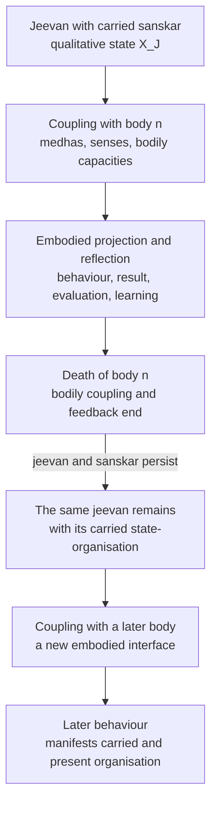

# Research Note: A Control-System Model of *Jeevan*—*Bal*, *Shakti*, and Activity

**Author:** Raghava Mohan Madhwapathi ([analyticmadhyasthdarshan.org](https://analyticmadhyasthdarshan.org))

**Edited on:** August 11, 2026, 2:45 PM IST

**Status:** Internal research note (not a catalog entry). Compiled to support [*The Epistemology of Coexistence*](The-Epistemology-of-Coexistence.md), especially its account of *jeevan*, knowing, reflection, projection, regulation, and evidence.

**Scope:** This note develops the activity architecture of *jeevan* as a qualitative, hierarchical, closed-loop control system. *Satta* is Knowledge rather than an acting controller. *Jeevan* is the sentient regulator; *bal* names its established state activities, *shakti* their motion and projection, and the body their temporary medium of expression and feedback.

The acquired organisation of *jeevan* is treated as *sanskar*. It is distributed across all five faculties rather than stored as information in one place, is refined through reflection, projection, result, evaluation, and correction, and remains with *jeevan* when a bodily coupling ends. The twelve practical knowledge domains specify the content organised and applied through this architecture.

The model adopts *saturation* as the common ontological bond enabling the *satta–atma* and *jeevan–medhas/body* interfaces. It is an interpretive functional model: it does not reduce *jeevan* to a computer, the faculties to brain regions, *sanskar* to a database, or qualitative activity to numerical variables.

## 1. *Jeevan* as an embodied regulator

*Satta* is Knowledge. *Jeevan* can be modelled as an integrated sentient regulator that realises this Knowledge in coexistence and acquires its practical content as *sanskar*. *Bal* establishes that content as a qualitative internal organisation; *shakti* makes the organisation effective in projection. Through *mun*, the projected organisation selects embodied action. Bodily, relational, and natural consequences then return through reflection. The loop is complete when Knowledge governs action, the result provides evidence of mutual fulfilment, and evaluation refines the organisation that will govern later projection.

The model has two directional movements:

- **Reflection** carries the consequences of embodied activity inward. Through *medhas* and the body, *jeevan* receives bodily condition; signals through sound, touch, visible form, taste, and smell; the performed action and its material result; another person's behaviour and relational response; and words or symbols that indicate conceptual meaning. *Mun* tastes acceptability, *vritti* forms a comparative judgment, *chitta* recognises meaning, relationship, process, result, and purpose, *buddhi* establishes definiteness, and *atma* relates that definite content to realisation.
- **Projection** carries realised orientation outward. *Atma* bears authenticity, *buddhi* forms resolve, *chitta* forms an image or plan, *vritti* analyses alternatives and consequences, *mun* selects, and *medhas* and the body express the selection in action and observable result.

These movements are not separate systems. They are the recurrent operation of one *jeevan*. Nor do they create its basic capacity. *Jeevan* is held to be constitutionally complete and its strength and power inexhaustible; awakening changes the quality, coordination, governing criteria, and evidence of its activity without increasing its constitution quantitatively (SB, Ch. 4).

The central control-system formulation is:

> The *bal* activities constitute and regulate the internal state-structure of *jeevan*. Through reflection, this structure is qualitatively refined from sensory-governed valuation toward coherent realisation; the corresponding *shakti* activities carry that organisation outward in the order *pramanikta* (authenticity or evidence-bearing orientation), *sankalp* (resolve), *chitran* (image or plan), *vishleshan* (analysis), and *chayan* (selection). Through *medhas* and the body, the selection becomes embodied action, result, and publicly observable evidence.

The activities themselves are inherent in *jeevan*; they are not acquired through practice. What is acquired is understood content and its coherent organisation as *sanskar*. Practice progressively brings this content into agreement across the five dimensions and tests that agreement in living. Bodily death ends the current channel of expression and feedback, not the sentient regulator or the acquired organisation it bears.

## 2. System boundary and ontological commitments

A control model first requires a clear system boundary. The controller is not *satta*, *atma* by itself, or the brain. *Jeevan* is the integrated sentient unit bearing all five faculties. The human being is the joint form of *jeevan* and body through which knowing becomes embodied evidence.

The block diagram identifies the system being modelled and the elements with which it is coupled:

The solid system boundary encloses *jeevan*: its five-faculty state, *bal*-side establishment and refinement, and *shakti*-side projection. *Satta* supplies the reality-reference without acting on the controller. *Medhas* and the body belong to the temporary embodied interface, while body, relationship, work, society, and nature form the field in which projection produces consequences. Feedback crosses the interface and becomes internal content only through reflection.

| Model element | Madhyasth Darshan referent | Function in the model | Boundary condition |
|---|---|---|---|
| Knowledge itself | *Satta* or Omnipresence | Actionless reality of *niyam*, *niyantran*, and *santulan*—the facts, rules, relations, and constraints available to be realised | Not a command source, acting controller, representation-producing mind, or perceiving subject |
| Reality and governing reference | Coexistence, including *jeevan* and humane conduct | What is to be known and the reference with which activity is to agree | Not an internal construction produced by the controller |
| Sentient regulator | *Jeevan* | Knower; bearer of state, motion, reflection, projection, and evaluation | Integrated unit; not reducible to an algorithm or brain process |
| Realised reference-centre | *Atma* | *Anubhav* in coexistence and projection as *pramanikta* | Faculty of *jeevan*, not an independent homunculus |
| Persistent acquired state | *Sanskar* in *jeevan* | Qualitative organisation of understanding, acceptance, criteria, valuation, and readiness for projection | Borne by *jeevan*; not genetic inheritance, a bodily trace, or a separate memory store |
| Embodied interface | *Medhas*, nervous system, senses, and body | Bidirectional medium between *jeevan* and bodily activity | Temporary medium of evidence, not the originating knower or bearer of *sanskar* |
| Controlled field | Body, relationship, work, exchange, society, and participation in nature | Where selection becomes action and produces consequences | The human joint form acts within mutuality, not on an inert external world |
| Feedback | Bodily condition, sensory information, material result, another person's response, and evaluation | Returns consequences for tasting, comparison, recognition, definiteness, and correction | Feedback is interpreted through the current organisation of *jeevan* |

This boundary yields an essential distinction. The controller and its acquired qualitative state belong to *jeevan*; the body is the current interface through which that state becomes behaviour and receives consequences. Formation and decomposition belong to the body. Persistence, carried orientation, and the possibility of further awakening belong to *jeevan*.

### 2.1 Saturation as the interface bond

The [ontology study](../The-Ontology-of-Coexistence/The-Ontology-of-Coexistence.md) defines *saturation* as the inseparable presence of nature in Omnipresence: every unit is soaked, submerged, and surrounded in *satta*. Saturation is a condition of existence rather than a temporal event, an external efficient cause, or an exchange of energy (§1.2). This note adopts that bond as the enabling condition for both interfaces in the control model.

| Interface | Control-system interpretation | Limit of the interpretation |
|---|---|---|
| *Satta–atma* | Because *jeevan*, including *atma*, exists saturated in *satta*, coexistence is ontologically present and available for *anubhav*. Saturation is the bond through which the Knowledge to be known is available for realisation. | *Satta* does not send signals, issue commands, or become a second subject. Knowing and *anubhav* belong to *jeevan* and *atma*. |
| *Jeevan–medhas/body* | Because *jeevan* and body constitute the human joint form within saturated coexistence, saturation is assumed to be the coupling bond through which selection becomes available to *medhas* and bodily signals become available to *mun*. | The assumption identifies the ontological condition of coupling; it does not specify the neural or sentient transduction mechanism. |

The first application follows directly from saturation as the ground–unit bond. The second is an explicit modelling extension. It supplies an ontological condition for coupling across the human joint form without treating saturation as an undiscovered physical signal.

### 2.2 Knowledge as actionless regulatory structure

The model must distinguish **regulation as Knowledge** from **regulation as performed activity**. In *satta*, *niyam*, *niyantran*, and *santulan* are not acts being continuously executed by a cosmic controller. They name the definite facts and relations of coexistence: how an activity is constituted, what preserves its relatedness and purpose, and what balance obtains when participating units remain mutually compatible. In control-system language, these are the ground truth, constraints, and reference relations of the model. “Representation” here means their realised or conceptual form within *jeevan*; it does not imply that *satta* contains mental symbols.

The active meaning appears in the unit, and especially in awakened human doing. *Jeevan* knows the relevant fact or rule, accepts it as the basis of activity, selects accordingly, and evaluates whether the result exhibits balance. Thus actionless Knowledge becomes the governing content of action without *satta* itself becoming an actor:

**Knowledge as fact and rule → realisation and definitive understanding → regulation of selection and action → balance evident in the result**

## 3. Reference structure and the controlled objective

The model is not organised around the maximisation of sensory pleasure. Happiness is the *dharma* of the knowledge order, yet a human being requires knowledge to organise freedom of imagination and action so that happiness becomes continuous rather than dependent on temporary sensory satisfaction. The controlled objective is coherence within *jeevan* together with fulfilment in body, relationship, work, and participation.

At the level of Knowledge, the reference structure is expressed as *niyam–niyantran–santulan*:

- ***Niyam*** is the definite fact, law, or rule according to which an activity and relationship are constituted.
- ***Niyantran*** is the constraint or regulated relatedness by which the activity remains aligned with its constitution and purpose.
- ***Santulan*** is the fact or condition of balance among activities and units in mutuality.

At the level of doing, an awakened human understands these reference facts, regulates activity accordingly, and evaluates their manifestation as balance. The reference is actionless; recognition, selection, execution, and evaluation are activities of *jeevan* and the human joint form.

For humane conduct, justice, *dharma*, and truth supply governing criteria. Activity is successful when it protects the relationship on which it depends, fulfils its accepted purpose, and produces mutual satisfaction rather than unilateral advantage. The corresponding inward performance conditions are the four harmonies of *jeevan*:

| Coupled faculties | Regulated harmony | *Jeevan* value |
|---|---|---|
| *Mun–vritti* | Selection agrees with considered thought | Happiness |
| *Vritti–chitta* | Thought agrees with contemplated meaning | Peace |
| *Chitta–buddhi* | Meaning and image agree with definitive understanding | Contentment |
| *Buddhi–atma* | Definitive understanding agrees with realisation | Bliss |
| *Atma–satta* | Realisation remains in concurrence with Knowledge in Omnipresence | Ultimate bliss and its evidence |

These values are not scalar rewards. They are qualitative relations among adjoining activities. The system does not optimise happiness by sacrificing peace, contentment, relationship, or ecological order. Correct regulation brings the layers into agreement and becomes evident as mutual fulfilment. The texts describe eternal concurrence between *atma* and Omnipresence as ultimate bliss and its evidence (JV, p. 138; MVD, pp. 326–327).

## 4. State, transition, and output

The model keeps architecture, state, and content distinct. The five faculties, ten basic activities, and 122 detailed activities specify the architecture and its operations. *Sanskar* specifies the acquired organisation presently established across that architecture. The twelve practical knowledge domains specify what is being understood and applied. These are three descriptions of one functioning *jeevan*, not three inventories of stored items.

Madhyasth Darshan treats every unit as activity with state and motion. For *jeevan*, *bal* and *shakti* provide the native distinction needed for a control model (MVD, p. 131; JV, p. 61).

- ***Bal* is activity in state:** an inwardly established capacity, condition, valuation, meaning, definiteness, or realisation.
- ***Shakti* is activity in motion:** the corresponding selection, analysis, formation, resolve, projection, or evidencing of that state.

This yields a compact functional relation:

**established state (*bal*) → operative transition (*shakti*) → manifest orientation → embodied evidence**

“State” does not mean inactivity. Tasting, comparison, contemplation, enlightenment, and realisation are active modes of establishment. “Motion” is wider than bodily movement. Selection, analysis, image-formation, resolve, and authenticity are motions because they make an established organisation effective toward another activity, an action, or a result.

*Bal* should therefore not be understood as an operator acting upon a separate passive store called “state.” Its activities are the modes in which content is established as the state of *jeevan*. On the reflection side, tasting, comparison, and contemplation interpret a returned result and may expose error in valuation, criteria, representation, or application. *Bodh* and *anubhav* establish reality-concurrent definiteness and realisation rather than erroneous conclusions. *Shakti* does not hold a second state; it carries the established organisation into authenticity, resolve, image or plan, analysis, and selection. Because projection produces the embodied result that is subsequently reflected, refinement belongs to the complete loop, although establishment and revision occur on its *bal* side.

### 4.1 A qualitative state vector and its content

The internal organisation of *jeevan* may be represented schematically as:

**XJ = (xatma, xbuddhi, xchitta, xvritti, xmun)**

Each component is the established condition of one faculty. It is not a number. It is a typed qualitative state comprising what has been realised, understood, contemplated, compared, and tasted. For each faculty, this state has a persistent aspect—the organisation carried as *sanskar*—and a presently active aspect—the situation-specific content now being tasted, compared, recognised, made definite, or related to realisation. These are temporal aspects of one distributed state, not two stores inside *jeevan*. The 61 detailed *bal* activities refine the five state dimensions.

The content of this state consists of realised identity and concurrence in *atma*; definite acceptances and governing principles in *buddhi*; recognised meanings, relationships, purposes, results, and retained representations or *smriti* in *chitta*; comparative criteria and judgments in *vritti*; and valuations, expectations, hopes, and readiness for selection in *mun*. Its subject matter includes coexistence and the *jeevan–body* distinction; bodily, relational, social, and natural requirements; *niyam, niyantran,* and *santulan*; justice, *dharma,* and truth; the twelve practical knowledge domains; and meanings retained from earlier action and result. Raw bodily and sensory signals become part of it only as they are qualitatively interpreted through reflection.

Error is not distributed symmetrically across these dimensions. *Mun, vritti,* and *chitta* can sustain sensory-governed valuation, inadequate criteria, mistaken judgment, assumption, or misrecognised meaning. *Buddhi* and *atma* do not establish incorrect content: *bodh* is definitive understanding only where the meaning agrees with reality, and *anubhav* is realisation only in concurrence with coexistence. If a candidate meaning is incorrect, it has not reached *bodh*; if coexistence has not been realised, there is no incorrect *anubhav*. “Incomplete” therefore qualifies the effective reach, activation, coordination, or evidential expression of these faculties, not a partially false *bodh* or *anubhav*. The state of *jeevan* as a whole can remain incomplete or internally contradictory because lower-faculty organisation and its projection may not yet be governed by the definite and realised reference.

The projective organisation may likewise be represented as:

**ΠJ = (πatma, πbuddhi, πchitta, πvritti, πmun)**

These components are the corresponding *shakti* operations: evidencing, resolving, forming, analysing, and selecting. The 61 detailed *shakti* activities refine these transition and projection functions. The notation asserts structure and correspondence, not measurability or mathematical independence.

### 4.2 Inherent provision and effective state

Two meanings of capacity must remain distinct.

| Capacity sense | Status in the model | What development means |
|---|---|---|
| Constitutional capacity | *Jeevan*'s complete and inexhaustible provision of *bal* and *shakti* | Does not increase or decrease quantitatively |
| Effective capacity | The currently active clarity, receptivity, coordination, criteria, and evidential reach of those activities | Can be refined qualitatively through study, realisation, practice, and evaluation |

Awakening therefore does not install more power. It changes which activities become effective, what contents and criteria organise them, how well adjoining faculties communicate, and whether projection agrees with realisation.

### 4.3 *Sanskar* as acquired distributed organisation

*Sanskar* is the learning state of this control model. It is described as acceptance toward completeness; knowledge, wisdom, and science carried toward resolution and evidence; understanding and tendencies for materialising what is understood; and physical, verbal, and mental activity directed toward completeness (MVD, p. 89). Humans are correspondingly *sanskar*-conforming units, with *sanskar* taking the combined form of understanding, honesty, responsibility, and participation (JV, p. 49).

It is therefore insufficient to equate *sanskar* with information remembered by *chitta*. Retained representation is one part of it, but *sanskar* is the organisation of understood content across the whole state-structure:

| Dimension | Form taken by acquired Knowledge |
|---|---|
| *Atma* | Grounded through *anubhav* in Knowledge and projected as authenticity |
| *Buddhi* | Made definite through *bodh* and directive through *sankalp* |
| *Chitta* | Retained as meaning and *smriti*, contemplated, and represented as a possible way of living |
| *Vritti* | Organised as criteria, comparison, judgment, and resolved thought |
| *Mun* | Established as valuation, expectation, tasting, and selection |

In this sense, the established *bal* configuration of all five faculties is the state-side form of operative *sanskar*, while the corresponding *shakti* activities are its transition, projection, communication, and evidence. The word “acquired” refers to content and organisation, not to the constitutional activities themselves.

Because this organisation belongs to *jeevan* rather than the body, the model treats it as persistent. Bodily formation follows composition and heredity, whereas *sanskar* belongs to the sentient aspect and becomes evident through the awakening of *mun*, *vritti*, *chitta*, and *buddhi* (MVD, p. 120). Acceptances toward completeness, the understanding available for evidence, and the unresolved gap among knowing, wanting, doing, and undergoing are described as carried forward in relation to *prarabdh* (MVD, pp. 89–90). *Sanskar* therefore does not have to be transferred out of a dying body: it remains with the *jeevan* whose state it organises.

### 4.4 Continuity across bodily death and re-embodiment

The ordinary reflection–projection loop operates through a living body, but the boundary of *jeevan* is not the lifespan of that body. *Jeevan* is held to continue after bodily death and to associate with a later body (JV, pp. 20, 54). When understanding and satisfaction have been attained, their established state is held to continue because *jeevan* does not die (JV, p. 76). In control terms, bodily death disconnects the current interface; it does not create a new controller or reset the qualitative state of the existing one.

Continuity of *sanskar* does not require explicit autobiographical memory of an earlier embodiment. Its organisation can persist as governing criteria, valuation, expectation, readiness, or behavioural tendency without the person recalling when or how it was acquired. Explicit *smriti* is one possible content of *chitta*; it is not the form in which every carried *sanskar* must appear.

The later embodiment therefore does not begin with an empty controller state. Its behaviour may manifest *sanskar* established before the present body, while present bodily capacity, family and social environment, education, new choices, and fresh feedback continue to modify what becomes effective. The dependence can be stated qualitatively:

**present behaviour = projection(carried *sanskar*, present understanding and selection, current body and circumstances)**

This is not mechanical determinism. A present act does not by itself reveal when each component of its governing organisation was acquired. Behaviour is evidence of the operative state of *jeevan* within the darshan's account, but it is not a unique public test that separates previous-embodiment *sanskar* from present learning, bodily condition, or social influence.

## 5. The five-faculty control architecture

The five faculties are not five independent controllers. They form an ordered, recurrent regulation stack within one *jeevan*. Each dimension has a *bal* state activity, a paired *shakti* motion activity, and a recognisable continuing orientation.

| Faculty | Regulated dimension | *Bal*: established state activity | *Shakti*: transition or projection |
|---|---|---|---|
| *Atma* | Realisation | *Anubhav*: realisation in coexistence | *Pramanikta*: authenticity and evidencing |
| *Buddhi* | Definiteness and commitment | *Bodh*: definitive understanding of correctly recognised meaning | *Sankalp*: resolve according to understanding |
| *Chitta* | Meaning and representation | *Chintan/sakshatkar*: contemplation and direct recognition of meaning | *Chitran*: formation of an image, possibility, or plan |
| *Vritti* | Comparison and analysis | *Tulan*: comparison through definite criteria | *Vishleshan*: analysis of alternatives and consequences |
| *Mun* | Valuation and selection | *Asvadan*: tasting or assessment of acceptability | *Chayan*: selection according to valuation |

The same architecture can be stated in terms of each faculty's control role and the continuing orientation manifested through it:

| Faculty | Control role | Manifest orientation |
|---|---|---|
| *Atma* | Ultimate realised reference-ground and system-wide authenticity constraint | *Praman* or living evidence |
| *Buddhi* | Epistemic validation gate and formation of governing commitment | *Ritambhara* or truth-bearing resolve |
| *Chitta* | Semantic integration and generative representation | *Ichha* or desire |
| *Vritti* | Comparator and analytical transformation | *Vichar* or thought |
| *Mun* | Final selection gate toward embodiment and first recipient of feedback | *Asha* or hope |

### 5.1 *Atma*: realised reference

*Anubhav* is realisation in coexistence, not an episodic sensation or emotional state. It is not a fallible estimate that can be partly true and partly false. Where a content has not reached realisation, *anubhav* concerning it is not yet effectively established; where it is established, it is reality-concurrent. Its projective activity, *pramanikta*, is authenticity: realised understanding becoming effective as evidence. In the control model, *atma* provides the ultimate reference with which definitive understanding and projected conduct must agree. It does not issue detailed commands to lower faculties. Its regulatory role is realised centrality and authenticity.

### 5.2 *Buddhi*: validation and commitment

*Buddhi* is the epistemic validation gate. After *chitta* directly recognises meaning through *sakshatkar*, *bodh* says “yes, this is so” only when that meaning is correctly understood. This is stronger than *manyata*, assent or belief accepted on authority. Subjective certainty, firmness, or commitment does not turn an incorrect interpretation into *bodh*; such content remains assumption, judgment, or unresolved meaning in the *chitta–vritti–mun* organisation. For any particular content, *buddhi* either establishes reality-concurrent definiteness or *bodh* concerning that content is not yet effective. Its reach may be incomplete across the contents required for living, but an established *bodh* is not itself incorrect. *Sankalp* converts definiteness into governing commitment: “I will organise activity accordingly.”

The sequence is therefore:

**direct recognition in *chitta* → *bodh* in *buddhi* → *sankalp* → organisation of image, analysis, valuation, and selection**

*Bodh* is the proximate ground of qualitative development in *chitta*, *vritti*, and *mun*, because their operations can now be governed by correct understanding. *Anubhav* remains the ultimate ground. *Buddhi* validates and commits; it does not create the constitutional strength or power of the other faculties.

### 5.3 *Chitta*: semantic and generative model

*Chintan* sustains and contemplates meaning. *Sakshatkar* is successful direct recognition: language or information becomes recognisable as the reality it indicates. *Chitran* gives that meaning a projectable form—an image, anticipated relationship, possibility, plan, or communicable representation. In control terms, *chitta* provides a meaning-bearing model of the intended result. Its quality depends on agreement with recognised meaning rather than imaginative richness alone.

### 5.4 *Vritti*: comparator and analysis

*Tulan* compares through criteria; *vishleshan* distinguishes alternatives, implications, and consequences. *Vritti* is therefore the principal comparator within the action-forming path. It does not merely calculate efficiency. It determines which criteria govern the comparison.

The six evaluative perspectives form a nested criterion set:

| Relative, condition-dependent information | Governing humane criteria |
|---|---|
| Pleasant–unpleasant | Justice–injustice |
| Healthy–unhealthy | *Dharma–adharma* |
| Profit–loss | Truth–untruth |

Awakening does not discard pleasure, health, or material result. It places them under criteria capable of preserving relationship, resolution, and coexistence.

### 5.5 *Mun*: valuation and selection gate

*Asvadan* receives and tastes the acceptability of a possibility or result. *Chayan* selects according to that valuation. *Mun* is consequently the final sentient gate toward bodily execution and the first faculty to receive interpreted bodily and sensory feedback. Selection reflects the whole current organisation of *jeevan*: what is understood, imagined, compared, expected, and valued.

## 6. The closed reflection–projection loop

This diagram separates two coupled recurrences. The intrinsic loop belongs to *jeevan*: projection and reflection can continue among *atma*, *buddhi*, *chitta*, *vritti*, and *mun* without a selection being executed by the body and without new bodily feedback. The embodied branch begins only when a selection is made available to *medhas* and the body; its consequences can then supply additional feedback to the intrinsic reflective movement. *Jeevan* remains the persistent controller, while *medhas* and the body are the present interface. The twelve practical knowledge domains constitute governing content within *sanskar* rather than additional signal blocks. The diagram in §4.4 places the embodied branch within the longer continuity across bodily couplings.

### 6.1 Projection: state becomes control action

Projection carries the established organisation of *sanskar* through the intrinsic dependency:

**realisation/authenticity → definiteness/resolve → meaning/image → comparison/analysis → valuation/selection**

This sequence completes the projective movement within *jeevan*. It can produce an image, plan, comparison, expectation, or selected possibility that becomes material for further reflection without bodily execution. When the selection crosses the embodied interface, an additional chain follows:

**selection → *medhas* → body → speech, action, or work → result**

The dependency is not a conversion of one substance into another. *Pramanikta* does not literally become *sankalp*, and resolve does not literally become an image. Each faculty receives the governing orientation of the adjoining faculty and performs its own paired activity. A resulting selection may become available to *medhas* and the body for execution, but bodily execution is not required for projection and reflection to continue within *jeevan*.

The body is not a passive actuator. Health, fatigue, skill, sensory condition, available material, other people, and the natural environment constrain what can be performed. Embodied evidence therefore belongs to the human joint form, not to disembodied *jeevan* or brain alone.

### 6.2 Reflection: content returns inward

Reflection within *jeevan* proceeds through the reverse faculty order:

**Mun → vritti → chitta → buddhi → atma**

When reflection receives content from an embodied consequence, that internal order is preceded by an external feedback path:

**result → bodily and sensory signal → *mun***

*Mun* tastes an internally projected possibility, remembered content, or embodied result; *vritti* compares it with expectation and governing criteria; *chitta* recognises its meaning; and *buddhi* examines whether it agrees with definitive understanding. If the candidate meaning does not agree with reality, it remains unestablished rather than becoming incorrect *bodh*. If it becomes definite, it is made available for concurrence with *anubhav*; bodily feedback does not write a fallible conclusion into *atma*. Reflection can refine the internal state-structure and correct the next projection. A bodily signal does not arrive already labelled as justice, fulfilment, or truth; its meaning depends on the effective depth and criteria of reflection.

“Data” in this model therefore means typed qualitative content, not raw measurements passed unchanged from one faculty to the next. Each stage interprets and reorganises what becomes available to it. Carried *sanskar* and memory are not additional external channels; they are part of the current internal state through which incoming signals are interpreted.

The following table begins with bodily and sensory feedback because it details the embodied branch. Its rows from *mun* through *atma* also apply when reflection begins from internally projected, remembered, or otherwise retained content.

| Stage | Content received or available | Reflection-side operation | Content established or carried inward | Projective counterpart |
|---|---|---|---|---|
| *Medhas*, senses, and body | Hunger and satiety, pain and ease, fatigue and energy, health and impairment; sound, touch, visible form, taste, and smell; speech and action observed; material and bodily result; another person's response | Bodily and neural mediation of the joint form | Signals concerning bodily condition, event, result, and response; words and symbols available for meaning-recognition | Bodily execution, speech, work, behaviour, and the production of a new result |
| *Mun* | Bodily and sensory signals, attraction and aversion, satisfaction and dissatisfaction, anticipated or observed result | *Asvadan*: tasting or valuing acceptability | Hope and expectation; the felt acceptability or unacceptability of the result and the impulse requiring examination | *Chayan*: selection of a response, object, means, word, or act |
| *Vritti* | The valued result, possible alternatives, prior expectation, and the relevant relationship or need | *Tulan*: comparison under pleasant–unpleasant, healthy–unhealthy, profit–loss, justice–injustice, *dharma–adharma*, and truth–untruth | Comparative judgment or thought: what agrees, conflicts, fulfils, harms, or remains unresolved | *Vishleshan*: analysis of alternatives, means, implications, and consequences |
| *Chitta* | Comparative thought, communicated language, retained representation, and the form of the observed situation | *Chintan/sakshatkar*: contemplation and direct recognition | Recognised identity, form, property, relationship, process, result, and purpose; a meaning-bearing conception of what the situation is | *Chitran*: an image, possibility, explanation, or plan expressing that meaning |
| *Buddhi* | Meaning recognised in *chitta* and its proposed agreement with reality and purpose | *Bodh*: definitive understanding | Definite acceptance of what is so, what the governing criterion is, and what course is coherent with it | *Sankalp*: commitment or resolve to organise projection accordingly |
| *Atma* | Definitive understanding made available through *buddhi* | *Anubhav*: realisation in coexistence | Realised concurrence with Knowledge; the ultimate reference-state rather than another stored record | *Pramanikta*: authenticity through which realisation becomes evident |

The inward movement can consequently be read as **embodied event and result → tasted hope or valuation → comparative thought → recognised meaning and desire → definiteness and resolve → realisation**. The primary-text formulation describes reflection as behaviour returning into thought, thought into desire, desire into resolve, and resolve into realisation (MVD, pp. 281–283). The intermediate table makes explicit what kind of content is transformed at each step without treating the faculties as channels that merely relay identical data.

The recurrence can be written schematically:

**refined *sanskar*/state-structure = reflection(current organisation, feedback, governing reference)**

**projected activity = projection(state-structure, purpose, relationship, bodily conditions)**

These are qualitative dependency statements, not numerical update equations.

### 6.3 Practice, assimilation, and transmission

Practice is the learning operation of the embodied loop. It does not manufacture the activities of *jeevan* or begin from a necessarily blank state; it engages the carried and presently acquired organisation so that understood content becomes coherent *sanskar*. A complete practice cycle includes receiving an explanation, recognising its meaning, examining it through comparison, becoming definite through *bodh*, relating it to *anubhav*, projecting it into conduct, evaluating the result, and correcting the internal organisation.

Assimilation is complete only when the content becomes effective in all five dimensions. Information remembered in *chitta* but not validated in *buddhi* remains uncertain; a principle accepted in *buddhi* but not organised through *vritti* and *mun* remains unevidenced; and an action repeated through the body without correct reference may strengthen habit without establishing Knowledge.

Explanation to another person is a projective activity of *sanskar* and a test of its coherence. Comprehension becomes evident in the ability to convey the understanding to others (JV, p. 25). Explanation does not copy *sanskar* into the recipient. It supplies language, indication, and a proposed organisation; the recipient must recognise, examine, understand, practise, and evidence it through their own faculties. This is how personal understanding becomes *upakar* and continues as humane tradition.

## 7. A qualitative mathematical control-system model

The architecture can be stated mathematically without treating its contents as numbers. The formalism below uses typed sets, ordered transformations, partial functions, and qualitative predicates. It does not assume a metric on understanding, a numerical quantity of *bal* or *shakti*, a scalar reward, or an experimentally identified transfer function. The time index $t$ orders successive embodied control cycles; it is not a claim that the activities of *jeevan* are clocked computations.

### 7.1 State and content spaces

Let the ordered set of faculties be:

$$
\mathcal{F}=\{a,b,c,v,m\}
=\{\textit{atma},\textit{buddhi},\textit{chitta},\textit{vritti},\textit{mun}\}.
$$

Each faculty $f\in\mathcal{F}$ has a qualitative state space $\mathcal{X}(f)$. The internal state of *jeevan* is the product:

$$
\mathcal{X}(J)
=\mathcal{X}(a)\times\mathcal{X}(b)\times
\mathcal{X}(c)\times\mathcal{X}(v)\times\mathcal{X}(m).
$$

$$
X(J,t)=\bigl(x(a,t),x(b,t),x(c,t),x(v,t),x(m,t)\bigr).
$$

The coordinates are typed contents, not real-valued variables. Each $x(f,t)$ has a persistent aspect $s(f,t)$, carried as *sanskar*, and a presently active aspect $q(f,t)$, concerning the current situation:

$$
x(f,t)=\bigl(s(f,t),q(f,t)\bigr).
$$

$$
S(J,t)=\bigl(s(a,t),s(b,t),s(c,t),s(v,t),s(m,t)\bigr).
$$

$$
Q(J,t)=\bigl(q(a,t),q(b,t),q(c,t),q(v,t),q(m,t)\bigr).
$$

$$
X(J,t)=\bigl(S(J,t),Q(J,t)\bigr).
$$

This decomposition is analytical rather than spatial: $S(J,t)$ and $Q(J,t)$ are not two stores inside *jeevan*. $S(J,t)$ is the durable cross-faculty organisation through which $Q(J,t)$ is interpreted and projected. The content space may be partitioned schematically as:

$$
\mathcal{D}
=\mathcal{D}(O)\cup\mathcal{D}(R)\cup
\mathcal{D}(P)\cup\mathcal{D}(E),
$$

where $\mathcal{D}(O)$ concerns coexistence, identity, and the *jeevan–body* distinction; $\mathcal{D}(R)$ concerns relationship, purpose, value, *niyam, niyantran,* and *santulan*; $\mathcal{D}(P)$ contains the twelve practical knowledge domains; and $\mathcal{D}(E)$ contains retained meanings, prior results, expectations, and tendencies acquired through living. A content $d\in\mathcal{D}$ becomes operative *sanskar* only through its distributed organisation across the five state dimensions.

### 7.2 Projection and embodied dynamics

Let $c(t)$ denote the present context: purpose, relationship, bodily condition, available means, and circumstance. Projection is the ordered composition of the five *shakti* operations:

$$
\mathcal{P}(t)=
\mathcal{P}(m)\circ
\mathcal{P}(v)\circ
\mathcal{P}(c)\circ
\mathcal{P}(b)\circ
\mathcal{P}(a).
$$

$$
p(t)=\mathcal{P}(t)\bigl(X(J,t),c(t)\bigr).
$$

with:

$$
\mathcal{P}(a)=\textit{pramanikta},\quad
\mathcal{P}(b)=\textit{sankalp},\quad
\mathcal{P}(c)=\textit{chitran}.
$$

$$
\mathcal{P}(v)=\textit{vishleshan},\quad
\mathcal{P}(m)=\textit{chayan}.
$$

The displayed composition is the full-depth cascade. More generally, let $\mathcal{F}^{\mathrm{eff}}(t)\subseteq\mathcal{F}$ be the faculties effectively participating in the present cycle. Projection is composed only over that ordered subset. If *atma* and *buddhi* are not effectively governing, for example:

$$
\mathcal{F}^{\mathrm{eff}}(t)=\{c,v,m\}
\quad\Longrightarrow\quad
\mathcal{P}(t)
=\mathcal{P}(m)\circ\mathcal{P}(v)\circ\mathcal{P}(c).
$$

This lower-depth cascade can still produce imagination, analysis, selection, and skilled behaviour, but the model does not insert fictitious *pramanikta* or *sankalp* where *anubhav* and *bodh* are not effective.

Thus $p(t)$ is the selection made available to *medhas*; it is not yet the bodily act. Let $B(t)$ denote the present body and $E(t)$ the relational, social, material, and natural field. The embodied dynamics and observable feedback are:

$$
(B(t+1),E(t+1))
=\mathcal{G}(B(t),E(t),p(t)).
$$

$$
y(t+1)=\mathcal{H}(B(t+1),E(t+1)).
$$

$\mathcal{G}$ includes bodily execution, speech, work, interaction, and material change. $\mathcal{H}$ makes bodily condition, sensory signal, performed action, material result, and another person's response available as feedback. The body and field are therefore the embodied plant of the model, while *jeevan* remains the sentient regulator.

### 7.3 Reflection and state update

Feedback $y(t+1)$ is not copied unchanged into the internal state. Reflection is the reverse ordered composition:

$$
\mathcal{R}(t)=
\mathcal{R}(a)\circ
\mathcal{R}(b)\circ
\mathcal{R}(c)\circ
\mathcal{R}(v)\circ
\mathcal{R}(m).
$$

$$
z(t+1)=\mathcal{R}(t)\bigl(y(t+1);X(J,t)\bigr).
$$

where:

$$
\mathcal{R}(m)=\textit{asvadan},\quad
\mathcal{R}(v)=\textit{tulan},\quad
\mathcal{R}(c)=\textit{chintan/sakshatkar}.
$$

$$
\mathcal{R}(b)=\textit{bodh},\quad
\mathcal{R}(a)=\textit{anubhav}.
$$

This is likewise the full-depth reflection cascade. In a shallower cycle, reflection terminates at the highest effectively participating faculty. For $\mathcal{F}^{\mathrm{eff}}(t)=\{c,v,m\}$:

$$
\mathcal{R}(t)
=\mathcal{R}(c)\circ\mathcal{R}(v)\circ\mathcal{R}(m).
$$

Feedback can then alter valuation, judgment, and representation without reaching definiteness or realisation.

Each map changes the type of content: signal becomes valuation, valuation comparative judgment, judgment recognised meaning, recognised meaning definiteness, and definiteness realised concurrence. The *bal*-side update may be represented as:

$$
Q(J,t+1)
=\mathcal{U}^{Q}\bigl(Q(J,t),z(t+1);S(J,t)\bigr),
$$

$$
S(J,t+1)=\mathcal{U}^{S}\bigl(S(J,t),z(t+1)\bigr)
\quad\text{when the content is assimilated}.
$$

When the content remains transient or unassimilated:

$$
S(J,t+1)=S(J,t).
$$

The distinction prevents every passing sensation or thought from being counted as a permanent change of *sanskar*. $\mathcal{U}^{S}$ may confirm, extend, or reorganise lower-faculty valuation, criteria, representation, and application. It cannot manufacture an incorrect *bodh* or *anubhav*.

The complete embodied loop is therefore:

$$
p(t)=\mathcal{P}(X(J,t),c(t)).
$$

$$
(B(t+1),E(t+1))=\mathcal{G}(B(t),E(t),p(t)).
$$

$$
y(t+1)=\mathcal{H}(B(t+1),E(t+1)).
$$

$$
z(t+1)=\mathcal{R}(y(t+1);X(J,t)).
$$

$$
X(J,t+1)=\mathcal{U}^{\mathrm{bal}}(X(J,t),z(t+1)).
$$

### 7.4 Correctness and incompleteness constraints

Let $K$ denote reality as the Knowledge-reference with which content must agree. *Bodh* and *anubhav* are modelled as partial, reality-constrained functions rather than fallible belief updates:

$$
\mathsf{Bodh}:\mathcal{X}(c)\rightharpoonup\mathcal{X}(b),
\qquad
\mathsf{Bodh}(c)\downarrow
\Longrightarrow
\operatorname{Agree}(c,K)=\top,
$$

$$
\mathsf{Anubhav}:\mathcal{X}(b)\rightharpoonup\mathcal{X}(a),
\qquad
\mathsf{Anubhav}(b)\downarrow
\Longrightarrow
\operatorname{Agree}(b,K)=\top.
$$

Here $\downarrow$ means that the function is defined for the presented content. If $\operatorname{Agree}(c,K)=\bot$, $\mathsf{Bodh}(c)$ is undefined: the candidate remains assumption, judgment, or unresolved meaning rather than becoming incorrect *bodh*. The same restriction excludes incorrect *anubhav*. If $\operatorname{WrongBodh}$ and $\operatorname{WrongAnubhav}$ denote the sets of reality-discordant outputs attributed to these activities, the constraints are:

$$
\operatorname{WrongBodh}=\varnothing,
\qquad
\operatorname{WrongAnubhav}=\varnothing.
$$

Incompleteness can nevertheless be represented by a restricted effective reach or an incomplete coupling. Let $\Delta(b)$ be the topics in $\mathcal{D}$ for which *bodh* is effective and $\Delta(a)$ those for which *anubhav* is effective:

$$
\Delta(a)\subseteq\Delta(b)\subseteq\mathcal{D}.
$$

The reach is incomplete when either inclusion is proper, or when established definiteness and realisation fail to govern $\mathcal{P}(c),\mathcal{P}(v),\mathcal{P}(m)$. Thus “incomplete *buddhi* or *atma*” means incomplete effective reach, activation, coordination, or evidential expression—not partially false *bodh* or *anubhav*.

### 7.5 Qualitative error and successful regulation

The control error is not a numerical distance. Let:

$$
e(t+1)
=\mathcal{E}\bigl(y(t+1);K,\rho(t),\mu(t)\bigr)
\in\{\text{agreement},\text{unresolved},\text{contradiction}\},
$$

where $\rho(t)$ is the accepted relationship and purpose and $\mu(t)$ the requirement of mutual fulfilment. The evaluation asks whether the result agrees with reality, preserves the relationship, fulfils its purpose, and exhibits balance.

Let $H(m,v),H(v,c),H(c,b),H(b,a)$ denote harmony across *mun–vritti, vritti–chitta, chitta–buddhi,* and *buddhi–atma*, and let $M(t)$ denote mutual fulfilment in the controlled field. Successful regulation is the qualitative predicate:

$$
\Phi(t)
=H(m,v)\land H(v,c)\land H(c,b)\land H(b,a)\land M(t).
$$

$\Phi(t)=\top$ is not the maximisation of pleasure or utility. It says that the internal layers agree, the projection accords with the realised and definite reference, and the embodied result is mutually fulfilling. A stable awakened regime is therefore recurrent qualitative coherence under changing circumstances, not a static state with no activity.

### 7.6 Bodily death, re-embodiment, and observability

Index bodily embodiments by $n$, and let $t^{\mathrm{death}}$ be the end of the present bodily coupling. The continuity claim is:

$$
S(J,n+1,0)=S(J,n,t^{\mathrm{death}-}),
\qquad
B(n+1)\not\equiv B(n).
$$

The same persistent organisation becomes associated with a new bodily interface, while the currently active content is reconstituted in the new context:

$$
X(J,n+1,0)
=\bigl(S(J,n,t^{\mathrm{death}-}),Q(J,n+1,0)\bigr).
$$

This equation does not imply explicit autobiographical recall. The carried $S(J)$ can become effective as criteria, valuation, expectation, readiness, or behavioural tendency. Later behaviour is:

$$
o(n+1,t)
=\mathcal{O}\bigl(
S(J,n+1),Q(J,n+1,t),B(n+1,t),E(n+1,t)
\bigr).
$$

For an observed behaviour $o$, the inverse $\mathcal{O}^{-1}(o)$ is non-unique: multiple combinations of carried *sanskar*, present learning, bodily disposition, circumstance, and current selection can produce observationally similar conduct. The model therefore represents continuity without claiming that behaviour alone can identify which part of the state was acquired in an earlier embodiment.

## 8. The twelve practical knowledges as distributed governing content

The twelvefold practical schema distinguishes the **content that is known** from the **activities that know and apply it**. The twelve kinds are not twelve more faculties, twelve additional *bal–shakti* operations, or twelve records held in one location. They are domain labels for content that becomes *sanskar* only by being distributed across realisation, definiteness, representation, comparison, valuation, selection, and evidence.

The content may be indexed as:

**D12 = (V1…4, S1…4, E1…3, U)**

Here **V** denotes knowledge of four bodily propensities, **S** knowledge of four sensory activities, **E** knowledge of the three *eshanas*, and **U** knowledge of *upakar*. *D* is only a compact index of definite known content; it does not mean numerical data or a database located in one faculty.

| Knowledge family | Count | What must be known | Role as distributed governing content |
|---|---:|---|---|
| Bodily propensities | 4 | Eating, sleeping, protection or defence, and mating: their bodily purpose, need, means, proper performance, limits, and effect on health and relationship | Specifies how the body is nourished, protected, rested, and continued without making bodily satisfaction the purpose of *jeevan* |
| Sensory activities | 4 | What each sensory activity is, how it is rightly performed, which bodily and sensory channels it uses, what information or result it provides, and what constitutes misuse | Specifies how sensitivity supplies usable body–world information and how cognisance regulates its employment |
| *Eshanas* | 3 | *Vitteshana*, *putreshana*, and *lokeshana*: their structure, legitimate purpose, required relationships and means, and rightful employment | Specifies how wealth, familial and social continuity, and public recognition become responsibilities under resolution rather than possessive drives |
| *Upakar* | 1 | The need for help, the other's material or epistemic requirement, one's own capacity and means, the right form of help, and the result expected in prosperity or awakening | Specifies higher-human participation through which resolved capacity supports another without dependency or exploitation |
| **Total** | **12** | **Practical knowledge for embodied and relational activity** | **Supplies the content on which the activities of *jeevan* operate** |

The four sensory activities should not be conflated with the five sensory modalities. The four are activity domains within the twelvefold knowledge count; sound, touch, visible form, taste, and smell are bodily channels that can supply information within those activities. The available passages explicitly identify the five channels but do not yet supply the four names of the separate sensory-activity set, so the model preserves their functional distinction without manufacturing a one-to-one list.

For every member of **D12**, adequate knowledge has a common structure:

1. **Identity:** what the activity or motive is.
2. **Purpose:** which bodily, relational, social, or higher-human requirement it serves.
3. **Procedure:** how it can be competently performed.
4. **Means and interface:** which body, senses, skills, relationships, and material resources it requires.
5. **Rule:** which *niyam* and governing criterion preserve its rightful use.
6. **Balance:** what *santulan* would mean among need, use, relationship, and available means.
7. **Evidence:** what result and feedback would show fulfilment or reveal error.

This is why the twelve kinds may analytically be described as the data being worked on and as what drives activity. “Data” here means known content instantiated throughout *jeevan*, not input delivered to a central processor. *Atma* realises its ground in Knowledge; *buddhi* validates its meaning and forms commitment; *chitta* retains and represents the intended result; *vritti* compares alternatives under its rules; *mun* selects; and the body performs. The result returns as feedback against the same known structure.

### 8.1 Where the content becomes most directly effective

The content is distributed, but the primary texts support different dominant points of effect.

| Knowledge family | Most direct effect | Distribution across the complete loop |
|---|---|---|
| Four bodily propensities | *Mun* and body: immediate tasting, expectation, selection, and performance | In awakening, *vritti* supplies governing comparison, *chitta* the meaningful intended form, *buddhi* definitive purpose, and *atma* the realised reference |
| Four sensory activities | Body–*medhas*, *mun*, and *vritti*: signal reception, valuation, selection, and sensory regulation | *Chitta* interprets and represents meaning; *buddhi* validates right use; the higher reference prevents sensitivity from defining happiness |
| Three *eshanas* | *Vritti* as awakened thought, followed by representation in *chitta* and selection in *mun* | *Vitteshana* becomes just acquisition and right use, *putreshana* family and social continuity, and *lokeshana* participation in undivided society and humane tradition |
| *Upakar* | The whole projection cascade: resolve in *buddhi*, benevolent visualisation in *chitta*, *daya–krupa–karuna* in *vritti*, and *mamata–udarata* in *mun* | Realisation-based authenticity grounds help; body, mind, and wealth make it effective for another's prosperity and awakening |

These are functional associations rather than exclusive storage locations. The four propensities arise from the hope of *mun*, while the three *eshanas* are nourished by awakened thought (MVD, pp. 304–305). The sensory and work-organ activities appear within the detailed activities of *mun*, while *samvedana* in *vritti* includes receiving external signals and acting according to the law-triad (MVD, pp. 335–347). *Upakar* is distributed across the detailed activities of *chitta*, *vritti*, and *mun*, and its complete expression depends on resolve and authenticity.

Sensory and bodily information is necessary. Error occurs when it becomes the final governing reference. Eating, for example, can be pleasant, health-supporting, affordable, just in exchange, ecologically responsible, and suitable to family need. The controller's task is not suppression but ordering: cognisance regulates sensitivity so that bodily, relational, material, and coexistential requirements remain compatible (SB, p. 64; MVD, pp. 64–67).

Feedback has at least four forms:

1. **Bodily feedback:** health, fatigue, pain, ease, nourishment, and skill.
2. **Material feedback:** whether work produced the intended object, service, or sufficiency.
3. **Relational feedback:** whether values were recognised and fulfilled and whether both persons can evaluate mutual satisfaction.
4. **Internal feedback:** whether adjoining faculties are harmonious or remain contradictory.

No single feedback channel is sufficient. Pleasant sensation can coexist with bodily harm; profit can coexist with injustice; private conviction can coexist with failed relationship. The complete loop evaluates results across all relevant fields.

## 9. A worked embodied control cycle

Consider disagreement over the use of family resources.

| Control phase | Operation in the human joint form |
|---|---|
| Reference | The relationship is to be fulfilled justly; material means are for need, prosperity, and right use rather than domination or hoarding. |
| Relevant knowledge data | Bodily need, the sensory and material facts of the situation, the rightful structure of *vitteshana* and family continuity, and the possibility of *upakar* are drawn from the twelve practical knowledge domains. |
| Disturbance or demand | Competing needs, limited resources, prior expectations, emotional reactions, and bodily conditions create a decision situation. |
| Initial feedback | *Mun* registers attraction, discomfort, satisfaction, dissatisfaction, and the responses of family members. |
| Comparison | *Vritti* considers pleasantness, health, and material consequence under justice, *dharma*, and truth. |
| Meaning formation | *Chitta* recognises the relationship, values, purpose, and form of mutual fulfilment. |
| Validation | *Buddhi* reaches *bodh*: the understood purpose and just course are definite rather than merely asserted. |
| Commitment | *Sankalp* establishes the resolve to organise conduct according to that understanding. |
| Planning and selection | *Chitta* forms a plan, *vritti* analyses alternatives, and *mun* selects words, timing, and action. |
| Embodied execution | The selection is communicated through *medhas* and body as speech, work, restraint, exchange, or provision. |
| Result | Resources are used and the relationship changes in response to the act. |
| Closure | Both parties evaluate whether values were fulfilled and mutual satisfaction attained; remaining contradiction becomes feedback for another cycle. |

Knowledge becomes evidence only when the projected act and evaluated result agree with the governing reference. Correct intention is necessary but not sufficient: the action must competently fulfil the relationship, and its result must remain open to evaluation and correction.

This example begins with “prior expectations” because an embodied control cycle never begins from nowhere. Within the model, those expectations can include organisation carried by *jeevan* from an earlier embodiment as well as learning from the present family and society. The observed decision remains a joint expression of this carried state, present understanding and selection, bodily ability, and the current situation.

## 10. Operating regimes: delusion and awakening

The same constitutional architecture can operate in two qualitatively different regimes.

| Model feature | Delusion | Awakening |
|---|---|---|
| Assumed identity | Body taken as self | *Jeevan* known as knower and body as medium |
| Effective loop depth | Four and a half activities dominate: tasting, selection, analysis, visualisation, and sensory-material comparison | All ten activities become effectively coordinated through enlightenment and realisation |
| Governing reference | Fragments of the twelve knowledge domains are interpreted through sensory satisfaction, bodily benefit, material gain, assumption, and established behaviour | *Satta* is realised as Knowledge; *niyam–niyantran–santulan* and the twelve practical knowledge contents govern doing |
| *Sanskar* and carried orientation | Carried and presently acquired organisation remains only partially coordinated; received assumptions and sensory habits can govern projection | Understanding, honesty, responsibility, and participation form a coherent distributed organisation |
| Comparator criteria | Pleasant–unpleasant, healthy–unhealthy, profit–loss treated as final | Justice–injustice, *dharma–adharma*, truth–untruth govern the relative criteria |
| Projection | Can be skilful and powerful but internally contradictory | Resolve, representation, analysis, and selection agree with understanding |
| Feedback interpretation | Immediate or unilateral result dominates | Bodily condition, relationship, mutual satisfaction, and orderliness are considered together |
| Characteristic result | Intermittent satisfaction with recurring contradiction | Resolution, harmony, mutual fulfilment, and evidence |

Delusion is not the absence of a control loop. It is a partially effective loop organised by an inadequate reference and shallow evaluative closure. A person may display powerful imagination, analysis, planning, and bodily skill while those powers remain sensory-governed. Awakening is not the addition of a new controller. It is the qualitative reconfiguration of reference, criteria, receptivity, and coordination in the existing architecture.

Neither regime begins anew with each body. Re-embodiment supplies a new bodily interface to the continuing *jeevan*; it does not erase the orientation already established. The distinction between the regimes concerns what governs and coordinates the carried state, not whether a persistent controller is present.

## 11. The 122 activities as a detailed state–transition model

The 122-activity account refines the ten-activity architecture into 61 unambiguously assigned *bal–shakti* pairs (MVD, pp. 322–339). It specifies how *jeevan* is internally established and becomes active in state and motion; it does not add another content set beside *sanskar* or the twelve practical knowledge domains.

| Faculty | *Bal*: state activities | *Shakti*: motion activities | Total | Generic pair |
|---|---:|---:|---:|---|
| *Atma* | 1 | 1 | 2 | Realisation–authenticity |
| *Buddhi* | 2 | 2 | 4 | Enlightenment–resolve |
| *Chitta* | 8 | 8 | 16 | Contemplation–image-formation |
| *Vritti* | 18 | 18 | 36 | Comparison–analysis |
| *Mun* | 32 | 32 | 64 | Tasting–selection |
| **Total** | **61** | **61** | **122** | State–motion |

In control terms, the 61 *bal* activities are typed articulations of the qualitative internal state, while the 61 *shakti* activities are their paired transition, projection, and evidencing operations. They are not 122 brain modules, scalar variables, energy levels, or independently switchable functions. A pair specifies what a faculty's state is about and how that state becomes effective.

Each pair can be modelled through seven questions:

1. **Faculty:** Which dimension of *jeevan* owns the pair?
2. **State:** What does the *bal* activity establish or regulate internally?
3. **Transition:** How does the paired *shakti* activity make that state effective?
4. **Content:** Which reality, value, relationship, purpose, or bodily need is involved?
5. **Criterion:** Which comparative standard governs the activity?
6. **Interface:** Through which adjoining faculty or embodied path does it become effective?
7. **Evidence:** What observable fulfilment, harmony, or participation would close the loop?

### 11.1 Illustrative state–transition pairs

| Pair | State-side interpretation | Motion-side interpretation | Evidential closure |
|---|---|---|---|
| *Dheerata–veerata* | Firmness and dedication toward justice established in *vritti* | Physical and intellectual powers deployed to enable justice for another | Justice protected or restored in relationship |
| *Mamata–udarata* | Affinity and care established as valuation in *mun* | Bodily, intellectual, and material means selected gladly for right use | Another's awakening, health, or prosperity supported without exploitation |
| *Daya, krupa,* and *karuna* activities | Another's development is understood as relevant to one's own participation | Readiness, capability, inspiration, and help become effective in mutuality | Capability and receptivity for prosperity or awakening increase |

These examples show why “development of *bal*” should mean refinement of state content, criterion, coordination, and effectiveness—not accumulation of a larger quantity of power.

## 12. Failure modes predicted by the model

The control formulation exposes several distinct ways activity can fail.

| Failure mode | Description | Likely manifestation |
|---|---|---|
| Wrong reference | The lower-faculty loop treats body, sensation, possession, status, or belief as the final ground because definitive understanding and realisation are not effectively governing it | Repeated pursuit without continuous satisfaction |
| Missing or misclassified knowledge content | One of the twelve domains is ignored, confused with another, or known only as a name without purpose, procedure, rule, or evidential result | Action operates on incomplete data even when reasoning appears consistent |
| Information without *sanskar* | Content is remembered or repeated but is not made definite, compared, selected, practised, and evidenced across all five dimensions | Verbal knowledge remains disconnected from conduct |
| Repetition without correct reference | An activity is practised repeatedly while sensory satisfaction, social approval, or assumption remains its governing criterion | Habit and skill become stronger without qualitative awakening |
| Shallow reflection | Feedback reaches valuation and analysis but not definitive understanding or realisation | Technically effective action with unresolved contradiction |
| Criterion inversion | Pleasure, health, or profit governs justice, *dharma*, and truth | Efficient exploitation or rationalised injustice |
| Semantic error | *Chitta* forms an image that does not accord with the recognised meaning of relationship or purpose | Attractive plans that cannot fulfil the relationship |
| Validation without commitment | A principle is verbally accepted, but *sankalp* does not follow *bodh* | Persistent gap between stated understanding and conduct |
| Projection without competence | Resolve is correct, but planning, skill, bodily condition, or material means are inadequate | Good intention with ineffective or harmful execution |
| Incomplete feedback | Only one's own intention or advantage is evaluated | Claimed fulfilment without mutual satisfaction |
| Interface opacity | The *jeevan–medhas* coupling is presumed without an account of its discriminating operation | Explanatory gap between sentient selection and neural activity |
| Embodiment-reset assumption | A new body is treated as a new controller with an empty state | The persistence of *sanskar* and its later behavioural manifestation become unintelligible |
| Origin over-attribution | Present behaviour is assigned wholly to previous-embodiment *sanskar* | Current bodily condition, education, relationship, choice, and feedback are ignored |

These are diagnostic distinctions, not clinical categories. Their value is to prevent every contradiction from being attributed vaguely to “lack of knowledge.” The model identifies where reference, state, transition, interface, execution, or evaluation may be incomplete.

## 13. Interpretive limits

The control-system vocabulary is useful only within explicit limits.

- ***Jeevan* is not a machine.** The model describes functional organisation; it does not replace sentience, realisation, or meaning with computation.
- ***Atma* is not a homunculus or executive processor.** Its regulatory role is realised reference and authenticity, not the issuance of microscopic commands.
- ***Atma* is not a fallible estimator.** An incorrect or partly false conclusion is not *anubhav*; incompleteness concerns whether realisation effectively governs and becomes evident through the whole loop.
- ***Buddhi* is not a belief register.** Incorrect interpretation and subjective certainty remain within unresolved lower-faculty organisation; *bodh* names reality-concurrent definiteness, while incompleteness concerns its effective reach, coordination, and projection.
- ***Satta* is Knowledge, not an input signal.** Modelling *niyam*, *niyantran*, and *santulan* as facts, rules, and reference relations does not turn *satta* into a database, command agent, energy source, or external intervention.
- ***Bal* is not stored physical force.** It is activity in state and the established qualitative organisation of *jeevan*.
- ***Shakti* is not transferable spiritual energy.** It is activity in motion through which established organisation becomes effective.
- **The faculties are not anatomical brain regions.** *Medhas* and the body mediate expression and feedback; the faculties belong to the account of the sentient unit.
- **The 122 activities are not numerical state variables.** The source gives a qualitative taxonomy but no measurement scales, transfer functions, or externally validated identification procedure.
- **The twelve knowledges are content, not twelve additional activities.** They specify what must be known for rightful doing; the ten and 122 activities describe how *jeevan* establishes and applies that content.
- ***Sanskar* is not a separate memory store.** It is the acquired organisation of understanding, acceptance, responsibility, participation, and readiness distributed across the activities of *jeevan*. Its persistence is persistence of the controller's qualitative state, not transfer of records from one body to another.
- **Explanation does not transfer *sanskar* mechanically.** It presents meaning and organisation for another *jeevan* to recognise, examine, assimilate, practise, and evidence.
- **Happiness is not a reward scalar.** It is one relation of harmony within *jeevan*, inseparable from peace, contentment, bliss, just relationship, and mutual fulfilment.
- **Saturation is not yet a transduction theory.** Treating it as the interface bond leaves open how a particular selection changes a particular neural process and how a bodily signal becomes a determinate sentient content.
- **Re-embodiment is not yet a coupling theory.** The sources affirm that the same *jeevan* continues and later associates with another body, but the model does not specify how a particular *jeevan* becomes coupled with a particular developing body.
- **Behaviour is not a unique provenance test.** Behaviour can manifest carried *sanskar*, but observation of an act alone cannot separate earlier-embodiment organisation from present education, bodily condition, social circumstances, and current selection.

The model is therefore a qualitative architecture and a research programme. It clarifies components, directions, dependencies, criteria, persistence, and possible failure points. It does not yet provide a quantitative dynamical system, an empirically discriminating theory of the *jeevan–body* interface, or a public procedure for identifying the earlier-embodiment contribution to present behaviour.

## 14. Questions for further research

1. What are the exact source-Hindi names and definitions of the four sensory activities in the twelvefold practical-knowledge enumeration, and how do they use the five sensory modalities?
2. Can each of the twelve knowledge contents be specified through identity, purpose, procedure, means, rule, balance, and evidential result?
3. What observable changes would show that one of these contents has become distributed *sanskar* rather than remaining information or verbal acceptance?
4. How does practice refine each of the 61 *bal–shakti* pairs, and how do the paired changes accumulate as coherence across all five dimensions?
5. Can each of the 61 *bal–shakti* pairs be expressed as a definite state–transition specification with content, governing criterion, adjoining interface, and evidential result?
6. How do *kshamata*, *yogyata*, and *patrata*—capacity, ability, and receptivity—modify the effective operation of each faculty without implying quantitative change in constitutional capacity?
7. What is the exact relation among *chintan*, *sakshatkar*, *bodh*, and *anubhav* when the inward process is represented as state estimation, validation, and realised closure?
8. Does feedback change an internal state, reveal an already established contradiction, or both? How do the texts distinguish correction, refinement, and awakening?
9. What observations could distinguish a loop governed by justice, *dharma*, and truth from one that merely reports those criteria while remaining governed by sensory or social reward?
10. How can mutual satisfaction be evaluated without reducing it to agreement, compliance, or self-report?
11. What further account would explain how saturation supports discriminating bidirectional signalling between *mun* and *medhas* without reducing sentient activity to neural activity or leaving the interface causally indeterminate?
12. What activity, if any, refines or otherwise changes the organisation of *jeevan* while it is not coupled with a body?
13. What determines the association of a particular continuing *jeevan* with a particular developing body, and what role does saturation play beyond supplying the ontological condition of coupling?
14. What observations could distinguish the behavioural effect of carried *sanskar* from present bodily disposition, education, environment, and deliberate choice without reasoning circularly from the behaviour to its proposed origin?
15. Can the model be related rigorously to contemporary control theory, predictive processing, or cognitive architecture while preserving the darshan's ontological distinctions?

## References

- **JV** — A. Nagraj, [*Jeevan Vidya: An Introduction*](../../References/Madhyasth-Darshan/JV-Jeevan-Vidya-An-Introduction.md). Cited: continuity of *jeevan* after bodily death (p. 20; §4.4); conveying understanding as evidence of comprehension (p. 25; §6.3); *sanskar* as understanding, honesty, responsibility, and participation (p. 49; §4.3); association of continuing *jeevan* with a new body (p. 54; §4.4); state activity as strength, motion activity as power, inward realisation, and evidence in mutuality (p. 61; §4); the five faculties, ten activities, and four-and-a-half effective activities in delusion (pp. 70, 72–74; §§5, 10); the continued state of understanding and satisfaction (p. 76; §4.4); harmony and the four *jeevan* values (p. 138; §3).

- **MVD** — A. Nagraj, [*Madhyasth Darshan: Coexistentialism*](../../References/Madhyasth-Darshan/MVD-Madhyasth-Darshan-Coexistentialism.md). Cited: bodily, sensory, intellectual, and higher-human fields (pp. 64–67, 73; §§3, 8); *sanskar* as acceptance, understanding, knowledge, wisdom, science, tendency, and activity toward completeness, together with what is carried forward as *prarabdh* (pp. 89–90; §§4.3–4.4); bodily heredity distinguished from *sanskar* in the sentient aspect (p. 120; §§2, 4.3); strength–power as state–motion and capacity–ability–receptivity (p. 131; §4); Knowledge, law, regulation, and balance (pp. 137, 174; §§2.2–3); *medhas* and the body as the medium of *jeevan*'s signals (pp. 83–84, 200; §§2, 6.1–6.2); the realisation-based faculty sequence and regulation of sensitivity (pp. 276–277; §5); reflection from behaviour through thought, desire, and resolve to realisation (pp. 281–283; §6.2); the dominant faculty effects of bodily propensities and *eshanas* (pp. 304–305; §8.1); development and signalling among faculties (p. 322; §11); faculty harmony and ultimate bliss in concurrence with Omnipresence (pp. 326–327; §3); the 122-activity taxonomy and definitions, including sensory activity and distributed forms of *upakar* (pp. 327–347; §§8.1, 11).

- **SB** — A. Nagraj, [*Samadhanatmak Bhautikvad*](../../References/Madhyasth-Darshan/SB-Samadhanatmak-Bhautikvad.md). Cited: constitutional completeness, inexhaustible strength and power, and qualitative change without quantitative change (Ch. 4; §§1, 4.2); cognisance regulating sensitivity (p. 64; §8.1).

### Related studies and research notes

- [*The Epistemology of Coexistence*](The-Epistemology-of-Coexistence.md), especially §§1.2–1.4 on the human goal, activities of knowing, sensory regulation, and universal orderliness.
- [*The Ontology of Coexistence*](../The-Ontology-of-Coexistence/The-Ontology-of-Coexistence.md), especially §1.2 on saturation, §§1.6–1.8 on *jeevan*, the human joint form, and its values, and §1.11 on regulation.
- [*Research Note: Manav Karm Darshan—Ontological Summary*](../The-Ontology-of-Coexistence/Research-Note-Karm-Darshan-Ontological-Summary.md), especially §§7, 9–10 on force–power and projection–reflection.
- [*Research Note: Sakshatkar–Bodh–Anubhav–Praman*](../Spiritual-Practice-And-Realization/Research-Note-Sakshatkar-Bodh-Anubhav-Praman-Session.md), for the recorded-session account of the inward knowing sequence.
