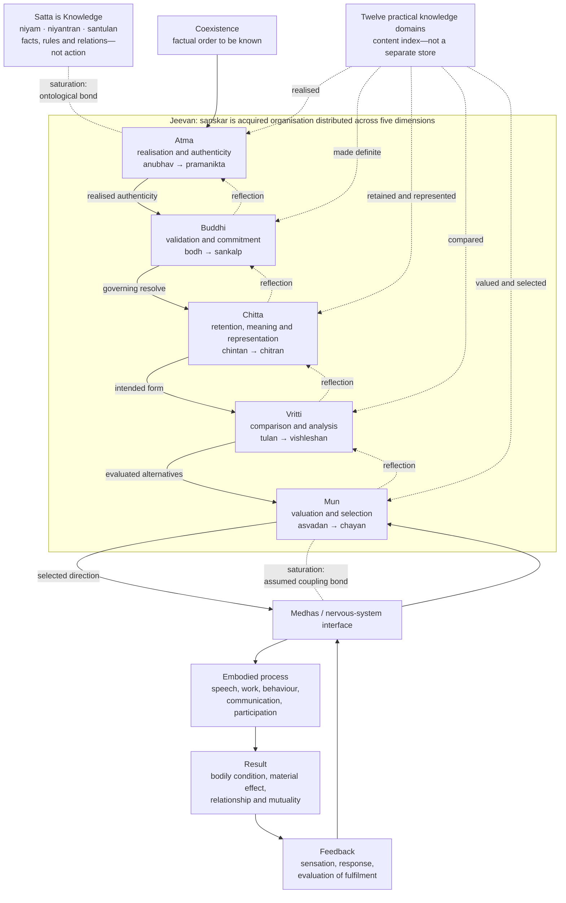

# Research Note: A Control-System Model of *Jeevan*—*Bal*, *Shakti*, and Activity

**Author:** Raghava Mohan Madhwapathi ([analyticmadhyasthdarshan.org](https://analyticmadhyasthdarshan.org))

**Edited on:** August 11, 2026, 8:26 AM IST

**Status:** Internal research note (not a catalog entry). Compiled to support [*The Epistemology of Coexistence*](The-Epistemology-of-Coexistence.md), especially its account of *jeevan*, knowing, reflection, projection, regulation, and evidence.

**Scope:** This note develops the activity architecture of *jeevan* as a qualitative, hierarchical, closed-loop control system. *Satta* is Knowledge: *niyam*, *niyantran*, and *santulan* are available as actionless facts, rules, relations, and constraints rather than as actions performed by *satta*. Their realised practical content is organised here into twelve kinds of knowledge concerning four bodily propensities, four sensory activities, three *eshanas*, and *upakar*. This content is acquired as *sanskar*: a communicable organisation of understanding distributed across all five dimensions of *jeevan*, not a separate store or database. Practice refines this internal organisation through reflection, projection, embodied result, evaluation, and correction. The model explains how *bal* constitutes the established state-structure of *sanskar*, how *shakti* transforms and projects that structure, and how harmony with Knowledge becomes evident as happiness, peace, contentment, bliss, and ultimately realised authenticity. It adopts *saturation* as the common ontological bond enabling the *satta–atma* and *jeevan–medhas/body* interfaces. The model is interpretive: it organises the textual account functionally without reducing *jeevan* to a computer, the faculties to brain regions, or its qualitative activities to numerical variables.

## 1. The model in one statement

*Satta* is Knowledge. *Jeevan* can be modelled as an integrated sentient regulator that realises this Knowledge in coexistence, acquires its practical content as *sanskar*, establishes that content as a qualitative internal organisation through *bal*, projects it through *shakti*, selects embodied action through *mun*, and evaluates the resulting bodily, relational, and natural consequences through reflection. The loop is complete when Knowledge governs action, the result provides evidence of mutual fulfilment, and the corrected understanding becomes more firmly assimilated as *sanskar*.

The model has two directional movements:

- **Reflection** brings bodily, sensory, relational, and conceptual material inward through *mun*, *vritti*, *chitta*, and *buddhi* toward *atma*.
- **Projection** carries realised understanding outward through *buddhi*, *chitta*, *vritti*, and *mun* toward *medhas*, the body, action, and evidence.

These movements are not separate systems. They are the recurrent operation of one *jeevan*. Nor do they create its basic capacity. *Jeevan* is held to be constitutionally complete and its strength and power inexhaustible; awakening changes the quality, coordination, governing criteria, and evidence of its activity without increasing its constitution quantitatively (SB, Ch. 4).

The central control-system formulation is:

> The *bal* activities constitute and regulate the internal state-structure of *jeevan*. Through reflection, this structure is qualitatively refined from sensory-governed valuation toward coherent realisation; the corresponding *shakti* activities project that refined organisation into thought, choice, action, and evidence.

The activities themselves are inherent in *jeevan*; they are not acquired through practice. What is acquired is understood content and its coherent organisation as *sanskar*. Practice progressively brings this content into agreement across the five dimensions and tests that agreement in living.

## 2. System boundary and ontological commitments

A control model first requires a clear system boundary. The controller is not *satta*, *atma* by itself, or the brain. *Jeevan* is the integrated sentient unit bearing all five faculties. The human being is the joint form of *jeevan* and body through which knowing becomes embodied evidence.

| Model element | Madhyasth Darshan referent | Function in the model | Boundary condition |
|---|---|---|---|
| Knowledge itself | *Satta* or Omnipresence | Actionless reality of *niyam*, *niyantran*, and *santulan*—the facts, rules, relations, and constraints available to be realised | Not a command source, acting controller, representation-producing mind, or perceiving subject |
| Reality and governing reference | Coexistence, including *jeevan* and humane conduct | What is to be known and the reference with which activity is to agree | Not an internal construction produced by the controller |
| Sentient regulator | *Jeevan* | Knower; bearer of state, motion, reflection, projection, and evaluation | Integrated unit; not reducible to an algorithm or brain process |
| Realised reference-centre | *Atma* | *Anubhav* in coexistence and projection as *pramanikta* | Faculty of *jeevan*, not an independent homunculus |
| Embodied interface | *Medhas*, nervous system, senses, and body | Bidirectional medium between *jeevan* and bodily activity | Medium of evidence, not the originating knower |
| Controlled field | Body, relationship, work, exchange, society, and participation in nature | Where selection becomes action and produces consequences | The human joint form acts within mutuality, not on an inert external world |
| Feedback | Bodily condition, sensory information, material result, another person's response, and evaluation | Returns consequences for tasting, comparison, recognition, definiteness, and correction | Feedback is interpreted through the current organisation of *jeevan* |

### 2.1 Saturation as the interface bond

The [ontology study](../The-Ontology-of-Coexistence/The-Ontology-of-Coexistence.md) defines *saturation* as the inseparable presence of nature in Omnipresence: every unit is soaked, submerged, and surrounded in *satta*. Saturation is a condition of existence rather than a temporal event, an external efficient cause, or an exchange of energy (§1.2). This note adopts that bond as the enabling condition for both interfaces in the control model.

| Interface | Control-system interpretation | Limit of the interpretation |
|---|---|---|
| *Satta–atma* | Because *jeevan*, including *atma*, exists saturated in *satta*, coexistence is ontologically present and available for *anubhav*. Saturation is the bond through which the Knowledge to be known is available for realisation. | *Satta* does not send signals, issue commands, or become a second subject. Knowing and *anubhav* belong to *jeevan* and *atma*. |
| *Jeevan–medhas/body* | Because *jeevan* and body constitute the human joint form within saturated coexistence, saturation is assumed to be the coupling bond through which selection becomes available to *medhas* and bodily signals become available to *mun*. | The assumption identifies the ontological condition of coupling; it does not specify the neural or sentient transduction mechanism. |

The first application follows directly from saturation as the ground–unit bond. The second is an explicit modelling extension. It supplies ontological continuity across the human joint form without treating saturation as an undiscovered physical signal.

### 2.2 Knowledge as actionless regulatory structure

The model must distinguish **regulation as Knowledge** from **regulation as performed activity**. In *satta*, *niyam*, *niyantran*, and *santulan* are not acts being continuously executed by a cosmic controller. They name the definite facts and relations of coexistence: how an activity is constituted, what preserves its relatedness and purpose, and what balance obtains when participating units remain mutually compatible. In control-system language, these are the ground truth, constraints, and reference relations of the model. “Representation” here means their realised or conceptual form within *jeevan*; it does not imply that *satta* contains mental symbols.

The active meaning appears in the unit, and especially in awakened human doing. *Jeevan* knows the relevant fact or rule, accepts it as the basis of activity, selects accordingly, and evaluates whether the result exhibits balance. Thus actionless Knowledge becomes the governing content of action without *satta* itself becoming an actor:

**Knowledge as fact and rule → realisation and definitive understanding → regulation of selection and action → balance evident in the result**

## 3. Reference structure and the controlled objective

The model is not organised around the maximisation of sensory pleasure. Happiness is the *dharma* of the knowledge order, yet a human being requires knowledge to organise freedom of imagination and action so that happiness becomes continuous rather than dependent on temporary sensory satisfaction. The controlled objective is coherence within *jeevan* together with fulfilment in body, relationship, work, and participation.

At the level of Knowledge, the reference structure is expressed as *niyam–niyantran–santulan*:

- ***Niyam*** is the definite fact, law, or rule according to which an activity and relationship are constituted.
- ***Niyantran*** is the constraint or regulated relatedness by which the activity remains aligned with its constitution and purpose.
- ***Santulan*** is the fact or condition of balance among activities and units in mutuality.

At the level of doing, an awakened human understands these reference facts, regulates activity accordingly, and evaluates their manifestation as balance. The reference is actionless; recognition, selection, execution, and evaluation are activities of *jeevan* and the human joint form.

For humane conduct, justice, *dharma*, and truth supply governing criteria. Activity is successful when it protects the relationship on which it depends, fulfils its accepted purpose, and produces mutual satisfaction rather than unilateral advantage. The corresponding inward performance conditions are the four harmonies of *jeevan*:

| Coupled faculties | Regulated harmony | *Jeevan* value |
|---|---|---|
| *Mun–vritti* | Selection agrees with considered thought | Happiness |
| *Vritti–chitta* | Thought agrees with contemplated meaning | Peace |
| *Chitta–buddhi* | Meaning and image agree with definitive understanding | Contentment |
| *Buddhi–atma* | Definitive understanding agrees with realisation | Bliss |
| *Atma–satta* | Realisation remains in concurrence with Knowledge in Omnipresence | Ultimate bliss and its evidence |

These values are not scalar rewards. They are qualitative relations among adjoining activities. The system does not optimise happiness by sacrificing peace, contentment, relationship, or ecological order. Correct regulation brings the layers into agreement and becomes evident as mutual fulfilment. The texts describe eternal concurrence between *atma* and Omnipresence as ultimate bliss and its evidence (JV, p. 138; MVD, pp. 326–327).

## 4. State, transition, and output

Madhyasth Darshan treats every unit as activity with state and motion. For *jeevan*, *bal* and *shakti* provide the native distinction needed for a control model (MVD, p. 131; JV, p. 61).

- ***Bal* is activity in state:** an inwardly established capacity, condition, valuation, meaning, definiteness, or realisation.
- ***Shakti* is activity in motion:** the corresponding selection, analysis, formation, resolve, projection, or evidencing of that state.

This yields a compact functional relation:

**established state (*bal*) → operative transition (*shakti*) → manifest orientation → embodied evidence**

“State” does not mean inactivity. Tasting, comparison, contemplation, enlightenment, and realisation are active modes of establishment. “Motion” is wider than bodily movement. Selection, analysis, image-formation, resolve, and authenticity are motions because they make an established organisation effective toward another activity, an action, or a result.

### 4.1 A qualitative state vector

The internal organisation of *jeevan* may be represented schematically as:

**XJ = (xatma, xbuddhi, xchitta, xvritti, xmun)**

Each component is the established condition of one faculty. It is not a number. It is a typed qualitative state comprising what has been realised, understood, contemplated, compared, and tasted. The 61 detailed *bal* activities refine these five state dimensions.

The projective organisation may likewise be represented as:

**ΠJ = (πatma, πbuddhi, πchitta, πvritti, πmun)**

These components are the corresponding *shakti* operations: evidencing, resolving, forming, analysing, and selecting. The 61 detailed *shakti* activities refine these transition and projection functions. The notation asserts structure and correspondence, not measurability or mathematical independence.

The content distributed through this architecture may be indexed as a twelve-part practical knowledge set:

**D12 = (V1…4, S1…4, E1…3, U)**

Here **V** denotes knowledge of four bodily propensities, **S** knowledge of four sensory activities, **E** knowledge of the three *eshanas*, and **U** knowledge of *upakar*. *D* does not mean raw numerical data or a database located in one faculty. It is an index of definite known content: what an activity is, what it is for, how it is performed, which means and relationships it uses, what rule governs it, and what result would evidence balance. Each content is distributed across the state vector: realised in *atma*, made definite in *buddhi*, retained and represented in *chitta*, compared in *vritti*, and valued and selected in *mun*. The actionless reference structure of *niyam–niyantran–santulan* governs this content; the *bal–shakti* architecture establishes, interprets, transforms, and applies it.

### 4.2 Inherent provision and effective state

Two meanings of capacity must remain distinct.

| Capacity sense | Status in the model | What development means |
|---|---|---|
| Constitutional capacity | *Jeevan*'s complete and inexhaustible provision of *bal* and *shakti* | Does not increase or decrease quantitatively |
| Effective capacity | The currently active clarity, receptivity, coordination, criteria, and evidential reach of those activities | Can be refined qualitatively through study, realisation, practice, and evaluation |

Awakening therefore does not install more power. It changes which activities become effective, what contents and criteria organise them, how well adjoining faculties communicate, and whether projection agrees with realisation.

### 4.3 *Sanskar* as acquired distributed organisation

*Sanskar* is the learning state of this control model. It is described as acceptance toward completeness; knowledge, wisdom, and science carried toward resolution and evidence; understanding and tendencies for materialising what is understood; and physical, verbal, and mental activity directed toward completeness (MVD, p. 89). JV correspondingly describes humans as *sanskar*-conforming units and *sanskar* as the combined form of understanding, honesty, responsibility, and participation (JV, p. 49).

It is therefore insufficient to equate *sanskar* with information remembered by *chitta*. Retained representation is one part of it, but *sanskar* is the organisation of understood content across the whole state-structure:

| Dimension | Form taken by acquired Knowledge |
|---|---|
| *Atma* | Grounded through *anubhav* in Knowledge and projected as authenticity |
| *Buddhi* | Made definite through *bodh* and directive through *sankalp* |
| *Chitta* | Retained as meaning and *smriti*, contemplated, and represented as a possible way of living |
| *Vritti* | Organised as criteria, comparison, judgment, and resolved thought |
| *Mun* | Established as valuation, expectation, tasting, and selection |

In this sense, the established *bal* configuration of all five faculties is the state-side form of operative *sanskar*, while the corresponding *shakti* activities are its transition, projection, communication, and evidence. The word “acquired” refers to content and organisation, not to the constitutional activities themselves.

## 5. The five-faculty control architecture

The five faculties are not five independent controllers. They form an ordered, recurrent regulation stack within one *jeevan*. Each dimension has a *bal* state activity, a paired *shakti* motion activity, and a recognisable continuing orientation.

| Faculty | Regulated dimension | *Bal*: established state activity | *Shakti*: transition or projection | Control role | Manifest orientation |
|---|---|---|---|---|---|
| *Atma* | Realisation | *Anubhav*: realisation in coexistence | *Pramanikta*: authenticity and evidencing | Ultimate realised reference-ground and system-wide authenticity constraint | *Praman* or living evidence |
| *Buddhi* | Definiteness and commitment | *Bodh*: definitive understanding of correctly recognised meaning | *Sankalp*: resolve according to understanding | Epistemic validation gate and formation of governing commitment | *Ritambhara* or truth-bearing resolve |
| *Chitta* | Meaning and representation | *Chintan/sakshatkar*: contemplation and direct recognition of meaning | *Chitran*: formation of an image, possibility, or plan | Semantic integration and generative representation | *Ichha* or desire |
| *Vritti* | Comparison and analysis | *Tulan*: comparison through definite criteria | *Vishleshan*: analysis of alternatives and consequences | Comparator and analytical transformation | *Vichar* or thought |
| *Mun* | Valuation and selection | *Asvadan*: tasting or assessment of acceptability | *Chayan*: selection according to valuation | Final selection gate toward embodiment and first recipient of feedback | *Asha* or hope |

### 5.1 *Atma*: realised reference

*Anubhav* is realisation in coexistence, not an episodic sensation or emotional state. Its projective activity, *pramanikta*, is authenticity: realised understanding becoming effective as evidence. In the control model, *atma* provides the ultimate reference with which definitive understanding and projected conduct must agree. It does not issue detailed commands to lower faculties. Its regulatory role is realised centrality and authenticity.

### 5.2 *Buddhi*: validation and commitment

*Buddhi* is the epistemic validation gate. After *chitta* directly recognises meaning through *sakshatkar*, *bodh* says “yes, this is so” only when that meaning is correctly understood. This is stronger than *manyata*, assent or belief accepted on authority. *Sankalp* converts definiteness into governing commitment: “I will organise activity accordingly.”

The sequence is therefore:

**direct recognition in *chitta* → *bodh* in *buddhi* → *sankalp* → organisation of image, analysis, valuation, and selection**

*Bodh* is the proximate ground of qualitative development in *chitta*, *vritti*, and *mun*, because their operations can now be governed by correct understanding. *Anubhav* remains the ultimate ground. *Buddhi* validates and commits; it does not create the constitutional strength or power of the other faculties.

### 5.3 *Chitta*: semantic and generative model

*Chintan* sustains and contemplates meaning. *Sakshatkar* is successful direct recognition: language or information becomes recognisable as the reality it indicates. *Chitran* gives that meaning a projectable form—an image, anticipated relationship, possibility, plan, or communicable representation. In control terms, *chitta* provides a meaning-bearing model of the intended result. Its quality depends on agreement with recognised meaning rather than imaginative richness alone.

### 5.4 *Vritti*: comparator and analysis

*Tulan* compares through criteria; *vishleshan* distinguishes alternatives, implications, and consequences. *Vritti* is therefore the principal comparator within the action-forming path. It does not merely calculate efficiency. It determines which criteria govern the comparison.

The six evaluative perspectives form a nested criterion set:

| Relative, condition-dependent information | Governing humane criteria |
|---|---|
| Pleasant–unpleasant | Justice–injustice |
| Healthy–unhealthy | *Dharma–adharma* |
| Profit–loss | Truth–untruth |

Awakening does not discard pleasure, health, or material result. It places them under criteria capable of preserving relationship, resolution, and coexistence.

### 5.5 *Mun*: valuation and selection gate

*Asvadan* receives and tastes the acceptability of a possibility or result. *Chayan* selects according to that valuation. *Mun* is consequently the final sentient gate toward bodily execution and the first faculty to receive interpreted bodily and sensory feedback. Selection reflects the whole current organisation of *jeevan*: what is understood, imagined, compared, expected, and valued.

## 6. The closed reflection–projection loop

### 6.1 Projection: state becomes control action

Projection carries the established organisation of *sanskar* through the dependency:

**realisation/authenticity → definiteness/resolve → meaning/image → comparison/analysis → valuation/selection → *medhas* → body → result**

The dependency is not a conversion of one substance into another. *Pramanikta* does not literally become *sankalp*, and resolve does not literally become an image. Each faculty receives the governing orientation of the adjoining faculty and performs its own paired activity. The resulting selection becomes available to *medhas* and the body for execution.

The body is not a passive actuator. Health, fatigue, skill, sensory condition, available material, other people, and the natural environment constrain what can be performed. Embodied evidence therefore belongs to the human joint form, not to disembodied *jeevan* or brain alone.

### 6.2 Reflection: consequence becomes corrected state

Reflection returns through the reverse order:

**result → bodily and sensory signal → *mun* → *vritti* → *chitta* → *buddhi* → *atma***

*Mun* tastes the result, *vritti* compares it with the intended result and governing criteria, *chitta* recognises its meaning, and *buddhi* examines whether it agrees with definitive understanding. Reflection can then refine the internal state-structure and correct the next projection. A bodily signal does not arrive already labelled as justice, fulfilment, or truth; its meaning depends on the effective depth and criteria of reflection.

The recurrence can be written schematically:

**refined *sanskar*/state-structure = reflection(current organisation, feedback, governing reference)**

**projected activity = projection(state-structure, purpose, relationship, bodily conditions)**

These are qualitative dependency statements, not numerical update equations.

### 6.3 Practice, assimilation, and transmission

Practice is the learning operation of the loop. It does not manufacture the activities of *jeevan*; it repeatedly engages them so that acquired content becomes coherent *sanskar*. A complete practice cycle includes receiving an explanation, recognising its meaning, examining it through comparison, becoming definite through *bodh*, relating it to *anubhav*, projecting it into conduct, evaluating the result, and correcting the internal organisation.

Assimilation is complete only when the content becomes effective in all five dimensions. Information remembered in *chitta* but not validated in *buddhi* remains uncertain; a principle accepted in *buddhi* but not organised through *vritti* and *mun* remains unevidenced; and an action repeated through the body without correct reference may strengthen habit without establishing Knowledge.

Explanation to another person is a projective activity of *sanskar* and a test of its coherence. JV states that the proof of comprehension lies in the ability to convey the understanding to others (JV, p. 25). Explanation does not copy *sanskar* into the recipient. It supplies language, indication, and a proposed organisation; the recipient must recognise, examine, understand, practise, and evidence it through their own faculties. This is how personal understanding becomes *upakar* and continues as humane tradition.

## 7. The twelve practical knowledges as distributed governing content

The twelvefold practical schema distinguishes the **content that is known** from the **activities that know and apply it**. The twelve kinds are not twelve more faculties, twelve additional *bal–shakti* operations, or twelve records held in one location. They are domain labels for content that becomes *sanskar* only by being distributed across realisation, definiteness, representation, comparison, valuation, selection, and evidence.

| Knowledge family | Count | What must be known | Role as distributed governing content |
|---|---:|---|---|
| Bodily propensities | 4 | Eating, sleeping, protection or defence, and mating: their bodily purpose, need, means, proper performance, limits, and effect on health and relationship | Specifies how the body is nourished, protected, rested, and continued without making bodily satisfaction the purpose of *jeevan* |
| Sensory activities | 4 | What each sensory activity is, how it is rightly performed, which bodily and sensory channels it uses, what information or result it provides, and what constitutes misuse | Specifies how sensitivity supplies usable body–world information and how cognisance regulates its employment |
| *Eshanas* | 3 | *Vitteshana*, *putreshana*, and *lokeshana*: their structure, legitimate purpose, required relationships and means, and rightful employment | Specifies how wealth, familial and social continuity, and public recognition become responsibilities under resolution rather than possessive drives |
| *Upakar* | 1 | The need for help, the other's material or epistemic requirement, one's own capacity and means, the right form of help, and the result expected in prosperity or awakening | Specifies higher-human participation through which resolved capacity supports another without dependency or exploitation |
| **Total** | **12** | **Practical knowledge for embodied and relational activity** | **Supplies the content on which the activities of *jeevan* operate** |

The four sensory activities should not be conflated with the five sensory modalities. The four are activity domains within the twelvefold knowledge count; sound, touch, visible form, taste, and smell are bodily channels that can supply information within those activities. The present local source bundle establishes the five channels but does not explicitly name the four members of the separate sensory-activity set, so this model preserves their functional distinction without manufacturing a one-to-one list.

For every member of **D12**, adequate knowledge has a common structure:

1. **Identity:** what the activity or motive is.
2. **Purpose:** which bodily, relational, social, or higher-human requirement it serves.
3. **Procedure:** how it can be competently performed.
4. **Means and interface:** which body, senses, skills, relationships, and material resources it requires.
5. **Rule:** which *niyam* and governing criterion preserve its rightful use.
6. **Balance:** what *santulan* would mean among need, use, relationship, and available means.
7. **Evidence:** what result and feedback would show fulfilment or reveal error.

This is why the twelve kinds may analytically be described as the data being worked on and as what drives activity. “Data” here means known content instantiated throughout *jeevan*, not input delivered to a central processor. *Atma* realises its ground in Knowledge; *buddhi* validates its meaning and forms commitment; *chitta* retains and represents the intended result; *vritti* compares alternatives under its rules; *mun* selects; and the body performs. The result returns as feedback against the same known structure.

### 7.1 Where the content becomes most directly effective

The content is distributed, but the primary texts support different dominant points of effect.

| Knowledge family | Most direct effect | Distribution across the complete loop |
|---|---|---|
| Four bodily propensities | *Mun* and body: immediate tasting, expectation, selection, and performance | In awakening, *vritti* supplies governing comparison, *chitta* the meaningful intended form, *buddhi* definitive purpose, and *atma* the realised reference |
| Four sensory activities | Body–*medhas*, *mun*, and *vritti*: signal reception, valuation, selection, and sensory regulation | *Chitta* interprets and represents meaning; *buddhi* validates right use; the higher reference prevents sensitivity from defining happiness |
| Three *eshanas* | *Vritti* as awakened thought, followed by representation in *chitta* and selection in *mun* | *Vitteshana* becomes just acquisition and right use, *putreshana* family and social continuity, and *lokeshana* participation in undivided society and humane tradition |
| *Upakar* | The whole projection cascade: resolve in *buddhi*, benevolent visualisation in *chitta*, *daya–krupa–karuna* in *vritti*, and *mamata–udarata* in *mun* | Realisation-based authenticity grounds help; body, mind, and wealth make it effective for another's prosperity and awakening |

The source evidence therefore supports functional association rather than exclusive storage. The four propensities are described as arising from the hope of *mun*, while the three *eshanas* are nourished by awakened thought (MVD, pp. 304–305). The sensory and work-organ activities appear within the detailed activities of *mun*, while *samvedana* in *vritti* includes receiving external signals and acting according to the law-triad (MVD, pp. 335–347). *Upakar* is distributed across the detailed activities of *chitta*, *vritti*, and *mun*, and its complete expression depends on resolve and authenticity.

Sensory and bodily information is necessary. Error occurs when it becomes the final governing reference. Eating, for example, can be pleasant, health-supporting, affordable, just in exchange, ecologically responsible, and suitable to family need. The controller's task is not suppression but ordering: cognisance regulates sensitivity so that bodily, relational, material, and coexistential requirements remain compatible (SB, p. 64; MVD, pp. 64–67).

Feedback has at least four forms:

1. **Bodily feedback:** health, fatigue, pain, ease, nourishment, and skill.
2. **Material feedback:** whether work produced the intended object, service, or sufficiency.
3. **Relational feedback:** whether values were recognised and fulfilled and whether both persons can evaluate mutual satisfaction.
4. **Internal feedback:** whether adjoining faculties are harmonious or remain contradictory.

No single feedback channel is sufficient. Pleasant sensation can coexist with bodily harm; profit can coexist with injustice; private conviction can coexist with failed relationship. The complete loop evaluates results across all relevant fields.

## 8. Operating regimes: delusion and awakening

The same constitutional architecture can operate in two qualitatively different regimes.

| Model feature | Delusion | Awakening |
|---|---|---|
| Assumed identity | Body taken as self | *Jeevan* known as knower and body as medium |
| Effective loop depth | Four and a half activities dominate: tasting, selection, analysis, visualisation, and sensory-material comparison | All ten activities become effectively coordinated through enlightenment and realisation |
| Governing reference | Fragments of the twelve knowledge domains are interpreted through sensory satisfaction, bodily benefit, material gain, assumption, and established behaviour | *Satta* is realised as Knowledge; *niyam–niyantran–santulan* and the twelve practical knowledge contents govern doing |
| *Sanskar* | Information, inherited assumption, and sensory habit remain only partially coordinated across the faculties | Understanding, honesty, responsibility, and participation form a coherent distributed organisation |
| Comparator criteria | Pleasant–unpleasant, healthy–unhealthy, profit–loss treated as final | Justice–injustice, *dharma–adharma*, truth–untruth govern the relative criteria |
| Projection | Can be skilful and powerful but internally contradictory | Resolve, representation, analysis, and selection agree with understanding |
| Feedback interpretation | Immediate or unilateral result dominates | Bodily condition, relationship, mutual satisfaction, and orderliness are considered together |
| Characteristic result | Intermittent satisfaction with recurring contradiction | Resolution, harmony, mutual fulfilment, and evidence |

Delusion is not the absence of a control loop. It is a partially effective loop organised by an inadequate reference and shallow evaluative closure. A person may display powerful imagination, analysis, planning, and bodily skill while those powers remain sensory-governed. Awakening is not the addition of a new controller. It is the qualitative reconfiguration of reference, criteria, receptivity, and coordination in the existing architecture.

## 9. The 122 activities as a detailed state–transition model

The twelve practical knowledges, *sanskar*, and the 122 activities answer different control questions. The twelve specify **what content is known and applied**; *sanskar* specifies **how that content has been assimilated and coordinated across *jeevan***; and the 122 specify **how *jeevan* is internally established and becomes active in state and motion**. The ten basic activities define the architecture, and the 122-activity account refines it into 61 unambiguously assigned *bal–shakti* pairs (MVD, pp. 322–339).

| Faculty | *Bal*: state activities | *Shakti*: motion activities | Total | Generic pair |
|---|---:|---:|---:|---|
| *Atma* | 1 | 1 | 2 | Realisation–authenticity |
| *Buddhi* | 2 | 2 | 4 | Enlightenment–resolve |
| *Chitta* | 8 | 8 | 16 | Contemplation–image-formation |
| *Vritti* | 18 | 18 | 36 | Comparison–analysis |
| *Mun* | 32 | 32 | 64 | Tasting–selection |
| **Total** | **61** | **61** | **122** | State–motion |

In control terms, the 61 *bal* activities are typed articulations of the qualitative internal state, while the 61 *shakti* activities are their paired transition, projection, and evidencing operations. They are not 122 brain modules, scalar variables, energy levels, or independently switchable functions. A pair specifies what a faculty's state is about and how that state becomes effective.

Each pair can be modelled through seven questions:

1. **Faculty:** Which dimension of *jeevan* owns the pair?
2. **State:** What does the *bal* activity establish or regulate internally?
3. **Transition:** How does the paired *shakti* activity make that state effective?
4. **Content:** Which reality, value, relationship, purpose, or bodily need is involved?
5. **Criterion:** Which comparative standard governs the activity?
6. **Interface:** Through which adjoining faculty or embodied path does it become effective?
7. **Evidence:** What observable fulfilment, harmony, or participation would close the loop?

### 9.1 Illustrative state–transition pairs

| Pair | State-side interpretation | Motion-side interpretation | Evidential closure |
|---|---|---|---|
| *Dheerata–veerata* | Firmness and dedication toward justice established in *vritti* | Physical and intellectual powers deployed to enable justice for another | Justice protected or restored in relationship |
| *Mamata–udarata* | Affinity and care established as valuation in *mun* | Bodily, intellectual, and material means selected gladly for right use | Another's awakening, health, or prosperity supported without exploitation |
| *Daya, krupa,* and *karuna* activities | Another's development is understood as relevant to one's own participation | Readiness, capability, inspiration, and help become effective in mutuality | Capability and receptivity for prosperity or awakening increase |

These examples show why “development of *bal*” should mean refinement of state content, criterion, coordination, and effectiveness—not accumulation of a larger quantity of power.

## 10. A worked control cycle

Consider disagreement over the use of family resources.

| Control phase | Operation in the human joint form |
|---|---|
| Reference | The relationship is to be fulfilled justly; material means are for need, prosperity, and right use rather than domination or hoarding. |
| Relevant knowledge data | Bodily need, the sensory and material facts of the situation, the rightful structure of *vitteshana* and family continuity, and the possibility of *upakar* are drawn from the twelve practical knowledge domains. |
| Disturbance or demand | Competing needs, limited resources, prior expectations, emotional reactions, and bodily conditions create a decision situation. |
| Initial feedback | *Mun* registers attraction, discomfort, satisfaction, dissatisfaction, and the responses of family members. |
| Comparison | *Vritti* considers pleasantness, health, and material consequence under justice, *dharma*, and truth. |
| Meaning formation | *Chitta* recognises the relationship, values, purpose, and form of mutual fulfilment. |
| Validation | *Buddhi* reaches *bodh*: the understood purpose and just course are definite rather than merely asserted. |
| Commitment | *Sankalp* establishes the resolve to organise conduct according to that understanding. |
| Planning and selection | *Chitta* forms a plan, *vritti* analyses alternatives, and *mun* selects words, timing, and action. |
| Embodied execution | The selection is communicated through *medhas* and body as speech, work, restraint, exchange, or provision. |
| Result | Resources are used and the relationship changes in response to the act. |
| Closure | Both parties evaluate whether values were fulfilled and mutual satisfaction attained; remaining contradiction becomes feedback for another cycle. |

Knowledge becomes evidence only when the projected act and evaluated result agree with the governing reference. Correct intention is necessary but not sufficient: the action must competently fulfil the relationship, and its result must remain open to evaluation and correction.

## 11. Failure modes predicted by the model

The control formulation exposes several distinct ways activity can fail.

| Failure mode | Description | Likely manifestation |
|---|---|---|
| Wrong reference | Body, sensation, possession, status, or belief is treated as the final ground | Repeated pursuit without continuous satisfaction |
| Missing or misclassified knowledge content | One of the twelve domains is ignored, confused with another, or known only as a name without purpose, procedure, rule, or evidential result | Action operates on incomplete data even when reasoning appears consistent |
| Information without *sanskar* | Content is remembered or repeated but is not made definite, compared, selected, practised, and evidenced across all five dimensions | Verbal knowledge remains disconnected from conduct |
| Repetition without correct reference | An activity is practised repeatedly while sensory satisfaction, social approval, or assumption remains its governing criterion | Habit and skill become stronger without qualitative awakening |
| Shallow reflection | Feedback reaches valuation and analysis but not definitive understanding or realisation | Technically effective action with unresolved contradiction |
| Criterion inversion | Pleasure, health, or profit governs justice, *dharma*, and truth | Efficient exploitation or rationalised injustice |
| Semantic error | *Chitta* forms an image that does not accord with the recognised meaning of relationship or purpose | Attractive plans that cannot fulfil the relationship |
| Validation without commitment | A principle is verbally accepted, but *sankalp* does not follow *bodh* | Persistent gap between stated understanding and conduct |
| Projection without competence | Resolve is correct, but planning, skill, bodily condition, or material means are inadequate | Good intention with ineffective or harmful execution |
| Incomplete feedback | Only one's own intention or advantage is evaluated | Claimed fulfilment without mutual satisfaction |
| Interface opacity | The *jeevan–medhas* coupling is presumed without an account of its discriminating operation | Explanatory gap between sentient selection and neural activity |

These are diagnostic distinctions, not clinical categories. Their value is to prevent every contradiction from being attributed vaguely to “lack of knowledge.” The model identifies where reference, state, transition, interface, execution, or evaluation may be incomplete.

## 12. Interpretive limits

The control-system vocabulary is useful only within explicit limits.

- ***Jeevan* is not a machine.** The model describes functional organisation; it does not replace sentience, realisation, or meaning with computation.
- ***Atma* is not a homunculus or executive processor.** Its regulatory role is realised reference and authenticity, not the issuance of microscopic commands.
- ***Satta* is Knowledge, not an input signal.** Modelling *niyam*, *niyantran*, and *santulan* as facts, rules, and reference relations does not turn *satta* into a database, command agent, energy source, or external intervention.
- ***Bal* is not stored physical force.** It is activity in state and the established qualitative organisation of *jeevan*.
- ***Shakti* is not transferable spiritual energy.** It is activity in motion through which established organisation becomes effective.
- **The faculties are not anatomical brain regions.** *Medhas* and the body mediate expression and feedback; the faculties belong to the account of the sentient unit.
- **The 122 activities are not numerical state variables.** The source gives a qualitative taxonomy but no measurement scales, transfer functions, or externally validated identification procedure.
- **The twelve knowledges are content, not twelve additional activities.** They specify what must be known for rightful doing; the ten and 122 activities describe how *jeevan* establishes and applies that content.
- ***Sanskar* is not a separate memory store.** It is the acquired organisation of understanding, acceptance, responsibility, participation, and readiness distributed across the activities of *jeevan*.
- **Explanation does not transfer *sanskar* mechanically.** It presents meaning and organisation for another *jeevan* to recognise, examine, assimilate, practise, and evidence.
- **Happiness is not a reward scalar.** It is one relation of harmony within *jeevan*, inseparable from peace, contentment, bliss, just relationship, and mutual fulfilment.
- **Saturation is not yet a transduction theory.** Treating it as the interface bond leaves open how a particular selection changes a particular neural process and how a bodily signal becomes a determinate sentient content.

The model is therefore a qualitative architecture and a research programme. It clarifies components, directions, dependencies, criteria, and possible failure points. It does not yet provide a quantitative dynamical system or an empirically discriminating theory of the *jeevan–body* interface.

## 13. Questions for further research

1. What are the exact source-Hindi names and definitions of the four sensory activities in the twelvefold practical-knowledge enumeration, and how do they use the five sensory modalities?
2. Can each of the twelve knowledge contents be specified through identity, purpose, procedure, means, rule, balance, and evidential result?
3. What observable changes would show that one of these contents has become distributed *sanskar* rather than remaining information or verbal acceptance?
4. How does practice refine each of the 61 *bal–shakti* pairs, and how do the paired changes accumulate as coherence across all five dimensions?
5. Can each of the 61 *bal–shakti* pairs be expressed as a definite state–transition specification with content, governing criterion, adjoining interface, and evidential result?
6. How do *kshamata*, *yogyata*, and *patrata*—capacity, ability, and receptivity—modify the effective operation of each faculty without implying quantitative change in constitutional capacity?
7. What is the exact relation among *chintan*, *sakshatkar*, *bodh*, and *anubhav* when the inward process is represented as state estimation, validation, and realised closure?
8. Does feedback change an internal state, reveal an already established contradiction, or both? How do the texts distinguish correction, refinement, and awakening?
9. What observations could distinguish a loop governed by justice, *dharma*, and truth from one that merely reports those criteria while remaining governed by sensory or social reward?
10. How can mutual satisfaction be evaluated without reducing it to agreement, compliance, or self-report?
11. What further account would explain how saturation supports discriminating bidirectional signalling between *mun* and *medhas* without reducing sentient activity to neural activity or leaving the interface causally indeterminate?
12. Can the model be related rigorously to contemporary control theory, predictive processing, or cognitive architecture while preserving the darshan's ontological distinctions?

## References

**JV** — A. Nagraj, [*Jeevan Vidya: An Introduction*](../../References/Madhyasth-Darshan/JV-Jeevan-Vidya-An-Introduction.md). Cited: conveying understanding as evidence of comprehension (p. 25); *sanskar* as understanding, honesty, responsibility, and participation (p. 49); state activity as strength, motion activity as power, inward realisation and evidence in mutuality (p. 61); the five faculties, ten activities, and four-and-a-half effective activities in delusion (pp. 70, 72–74); harmony and the four *jeevan* values (p. 138).

**MVD** — A. Nagraj, [*Madhyasth Darshan: Coexistentialism*](../../References/Madhyasth-Darshan/MVD-Madhyasth-Darshan-Coexistentialism.md). Cited: bodily, sensory, intellectual, and higher-human fields (pp. 64–67, 73); *sanskar* as acceptance, understanding, knowledge, wisdom, science, tendency, and activity toward completeness (p. 89); strength–power as state–motion and capacity–ability–receptivity (p. 131); Knowledge, law, regulation, and balance (pp. 137, 174); *medhas* and the body as the medium of *jeevan*'s signals (pp. 83–84, 200); the realisation-based faculty sequence and regulation of sensitivity (pp. 276–277); the dominant faculty effects of bodily propensities and *eshanas* (pp. 304–305); development and signalling among faculties (p. 322); faculty harmony and ultimate bliss in concurrence with Omnipresence (pp. 326–327); the 122-activity taxonomy and definitions, including sensory activity and distributed forms of *upakar* (pp. 327–347).

**SB** — A. Nagraj, [*Samadhanatmak Bhautikvad*](../../References/Madhyasth-Darshan/SB-Samadhanatmak-Bhautikvad.md). Cited: constitutional completeness, inexhaustible strength and power, and qualitative change without quantitative change (Ch. 4); cognisance regulating sensitivity (p. 64).

### Related studies and research notes

- [*The Epistemology of Coexistence*](The-Epistemology-of-Coexistence.md), especially §§1.2–1.4 on the human goal, activities of knowing, sensory regulation, and universal orderliness.
- [*The Ontology of Coexistence*](../The-Ontology-of-Coexistence/The-Ontology-of-Coexistence.md), especially §1.2 on saturation, §§1.6–1.8 on *jeevan*, the human joint form, and its values, and §1.11 on regulation.
- [*Research Note: Manav Karm Darshan—Ontological Summary*](../The-Ontology-of-Coexistence/Research-Note-Karm-Darshan-Ontological-Summary.md), especially §§7, 9–10 on force–power and projection–reflection.
- [*Research Note: Sakshatkar–Bodh–Anubhav–Praman*](../Spiritual-Practice-And-Realization/Research-Note-Sakshatkar-Bodh-Anubhav-Praman-Session.md), for the recorded-session account of the inward knowing sequence.
