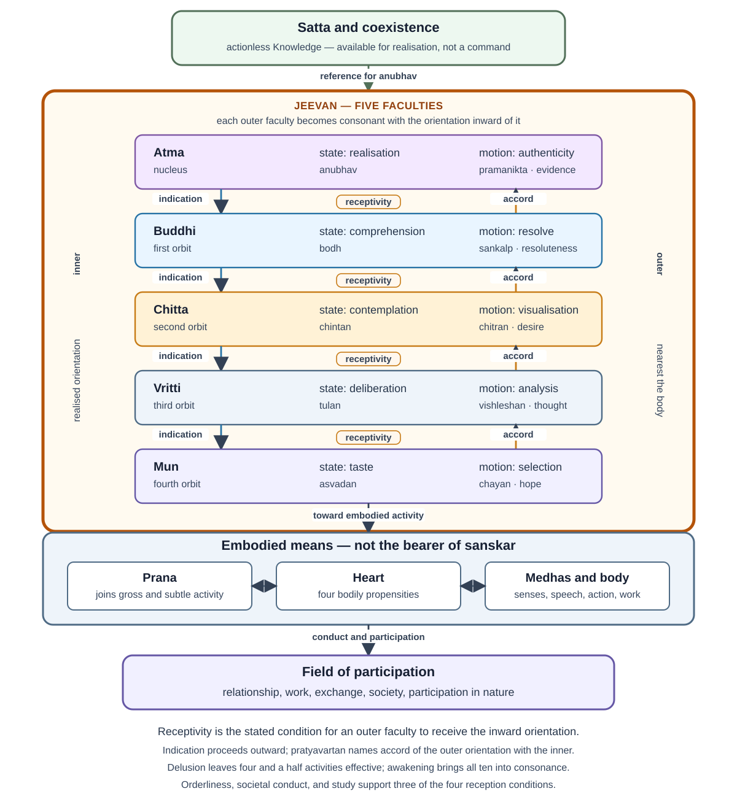
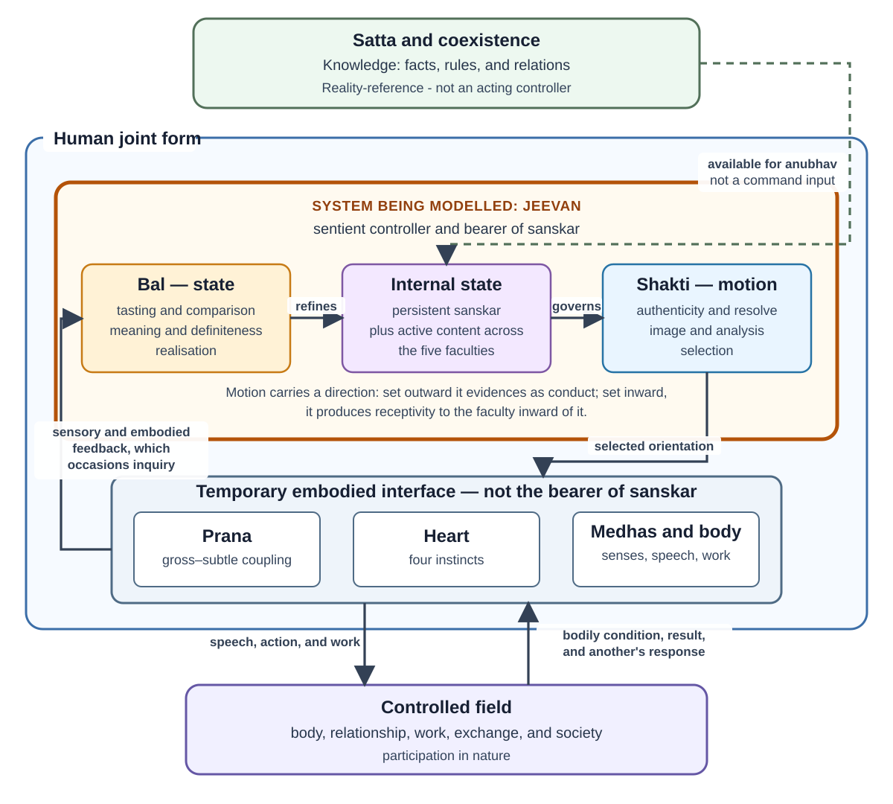
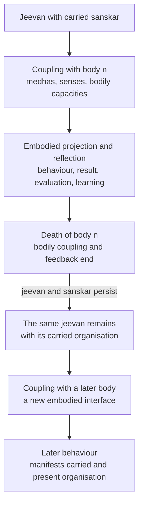

# Research Note: A Control-System Model of *Jeevan*—*Bal*, *Shakti*, and Activity

**Author:** Raghava Mohan Madhwapathi ([analyticmadhyasthdarshan.org](https://analyticmadhyasthdarshan.org))

**Edited on:** August 13, 2026, 12:00 AM IST

**Status:** Internal research note (not a catalog entry). Compiled to support [*The Epistemology of Coexistence*](The-Epistemology-of-Coexistence.md), especially its account of *jeevan*, knowing, reflection, projection, regulation, and evidence.

**Scope:** This note reads the activity architecture of *jeevan* as a qualitative five-stage cascade. Each inner faculty is the reference for the next outer one; the body is *mun*'s plant; *sanskar* is a slow learning state; delusion is the outer loops disconnected. *Satta* is Knowledge rather than an acting controller. *Jeevan* is the sentient regulator; *bal* names its established state activities, *shakti* their motion, and the body their temporary medium of expression and feedback.

The exposition follows the strata the primary texts set out: *jeevan* as one constitutionally complete atom, its five faculties, the ten activities that pair a state with a motion in each faculty, and the 122 detailed activities into which those ten are refined. Where the control reading requires machinery the sources do not supply—typed spaces, composed operators, gating predicates, an inquiry protocol—that machinery is gathered in Appendix A. The body can be read without the appendix, and the appendix can be rejected without disturbing the body.

This is an interpretive functional model. It does not reduce *jeevan* to a computer, the faculties to brain regions, *sanskar* to a database, or qualitative activity to numerical variables.

| Role | Assignment | What it is not |
|---|---|---|
| Controller | *Jeevan* as one five-faculty unit | *Satta*, *atma* alone, or the brain |
| Ultimate reference | *Satta* and coexistence, realised at *atma* | A command input or setpoint injected from outside |
| Satisfied condition | One immersion named bliss, contentment, peace, and happiness | A reward scalar or the maximisation of any one value |
| Structural error | Discord among unequally developed faculties; thirst for restfulness | A computed $r - y$ |
| Operational error | Evaluation of the embodied result against relationship and mutual fulfilment | Settled by internal concurrence alone |
| Fast state | Presently active content across the five faculties | A numerical state vector |
| Slow state | *Sanskar*, the acquired organisation of *mun*, *vritti*, *chitta*, and *buddhi* | A memory store in one faculty, or a fifth deposit at *atma* |
| Plant of *mun* | The body, reached through *prana*, heart, and *medhas* | The bearer of *sanskar* |
| Plant of the joint form | Relationship, work, society, and participation in nature | An inert external world |
| Modes and depths | Delusion: four and a half activities, outer end sets the terms. Partially and half-awakened states reconnect progressively deeper stages. Awakening: all ten, inner end sets the terms | Different controllers or an all-at-once installation |
| Inward-side roles | Receptivity enables reflection; *pratyavartan* is reflection as conformance; unresolved content may raise inquiry | One reverse copy of projection, or three kinds of reflection |
| Closure | Three of four receptivity conditions are social | A loop closed inside a single *jeevan* |

Four layers sit on one another. Mixing them is the usual way the architecture is misread.

| Layer | Count | What it is | What it is not |
|---|---:|---|---|
| Faculties | 5 | Orbital groupings of one atom: *atma*, *buddhi*, *chitta*, *vritti*, *mun* | Five controllers or five brain regions |
| Paired activities | 10 | Two functions per faculty: a state activity and a motion activity | Ten independent modules |
| Detailed activities | 122 = 61 pairs | What each faculty does it over | 122 variables or switchable functions |
| Practical knowledges | 12 (oral) | Content organised as *sanskar*: four propensities, four sensory activities, three *eshanas*, *upakar* | Twelve more faculties. The printed sources attest the component groups; they do not enumerate the twelve as a set (§7) |

## Glossary

| Term | Running sense in this note |
|---|---|
| *Jeevan* | The constitutionally complete sentient atom; the controller |
| *Satta* | Omnipresence as actionless Knowledge; the reality-reference |
| *Bal* | Activity in state: what a faculty has established in itself |
| *Shakti* | Activity in motion: that establishment becoming effective toward an adjoining activity or the body |
| Plant | Control-theory term for what an operation acts on: the next outer faculty, the body for *mun*, and the relational or material field for the human joint form |
| *Paravartan* | Projection: signal and evidencing outward from *atma* toward *mun* and the body |
| *Pratyavartan* | Reflection: the outer faculty's orientation coming to be governed by the inner; not returned data |
| Awakened *jeevan* cycle | The combined form of projection and reflection (MVD, p. 275). Hindi *avartan kriya* names that combined form; at p. 291 the same word is paired against *pratyavartan* as one of two directions (Editorial Notes) |
| *Sanskar* | Acquired organisation of the four outer faculties, held to realisation at *atma* |
| *Sanket* | Signal, used inner to outer |
| *Antarniyaman* | Internal regulation of *jeevan*'s powers, producing receptivity; carries no content (§6.4) |
| *Bodh* | Enlightenment as reality-concurrent definiteness; an established *bodh* is not false |
| *Anubhav* | Realisation in coexistence; not an episodic sensation |
| *Vishram* | Restfulness: the objective, recurrent coherence under continuing activity |
| *Aplavan* | Immersion: one flow named at four levels |
| *Vishamata* | Discord among faculties; the structural error |
| *Kshamata*, *yogyata*, *patrata* | Capacity, ability, receptivity: effective capacity of *chitta*, *vritti*, and *mun* |
| *Medhas* | Neural mediation at the embodied interface; not *medha*, a detailed activity of *chitta* |
| Saturation | Ontological presence of nature in *satta*; the *satta*–*atma* bond, not the *jeevan*–body coupling |
| *Niyam*, *niyantran*, *santulan* | Law, regulated relatedness, and balance: the Knowledge-level reference |
| Cognisance / sensitivity | The axis along which the cycle is assessed; sensitivity under cognisance is the awakened evidence |

## 1. *Jeevan* as an embodied regulator

*Jeevan* is a constitutionally complete atom whose nucleus is named *atma*, the particles of its first orbit *buddhi*, of its second *chitta*, of its third *vritti*, and of its fourth *mun* (MVD, p. 78; AVD, p. 87). *Atma* at that centre is the mediative activity, unaffected by generative or degenerative force. Every one of those five groupings is active, and the faculties take their names from them (AVD, p. 87). Constitutional completeness is evident in the atom's release from molecular and weight bondage together with its retention of the bondage of hope (MVD, p. 91). The five faculties are therefore orbital groupings within one unit rather than five components assembled into a system, and their ordering—*atma* innermost, *mun* outermost—is constitutional rather than a convenience of the model.

Two directional movements run through the ordered faculties. **Projection**, *paravartan*, carries realised orientation outward: *atma* bears authenticity, *buddhi* forms resolve, *chitta* forms an image or plan, *vritti* analyses alternatives and consequences, *mun* selects, and *prana*, heart, *medhas*, and the body express the selection in action and observable result. **Reflection**, *pratyavartan*, is the movement of awakening: each outer faculty's orientation comes to be governed by the faculty inward of it. Receptivity is the condition that enables reflection at a coupling. When unresolved content or an embodied consequence prompts a question, inquiry may be borne inward; inquiry is neither the consequence itself nor another name for *pratyavartan*. These are not separate systems but the recurrent operation of one *jeevan*, and the combined form of reflection and projection carries a name of its own:

> In awakening, hope in *mun* is according to *vritti*, thoughts in *vritti* are according to *chitta*, desires in *chitta* are according to enlightenment of *buddhi*, and enlightenment in *buddhi* is according to *atma*'s realisation in existence. As a result, all the activities of reflection and projection are accomplished. The combined form of reflection and projection is referred to as the cognisance-sensitivity cycle. This itself is the awakened *jeevan* cycle. (MVD, p. 275)

The Hindi of that sentence names the combined form *avartan kriya*. This note uses **awakened *jeevan* cycle** for that combined sense. Where MVD p. 291 pairs *avartan* with *pratyavartan*, the same word is one of two directions; that use is recorded in the Editorial Notes and is not the sense used for the cycle as a whole.

The two movements do not create *jeevan*'s basic capacity. *Jeevan* is constitutionally complete and its strength and power inexhaustible; awakening changes the quality, coordination, governing criteria, and evidence of its activity without increasing its constitution quantitatively (MVD, p. 199; SB, Ch. 4). The activities themselves are inherent and are not acquired through practice. What is acquired is understood content and its coherent organisation as *sanskar*. Bodily death ends the current channel of expression and feedback, not the sentient regulator or the acquired organisation it bears.

Read as a control architecture, this is a five-stage cascade with gated outer loops, a slow learning state, and a regime change with intermediate depths. Each inner faculty's established state is the reference for the next outer faculty; that outer faculty's state activity is how it comes into agreement with that reference; its motion activity is the control action toward the next plant. *Mun*'s plant is the body; the joint form's plant is the field. Immersion at every level is an invariant to be reached, not a trajectory to be tracked. *Sanskar* changes, on a slower time scale, what the fast cascade will do next. Delusion is the inner stages disconnected, so that four and a half activities remain effective; partially and half-awakened states reconnect deeper stages; awakening is the full cascade. Three of the four gates depend on orderliness, societal conduct, and study, so the unit's loop is not closed inside the unit being modelled (§§4.1, 6.4).

*Bal* establishes content as a qualitative internal organisation; *shakti* makes the organisation effective toward an adjoining activity or the body. Through *mun*, the organisation selects embodied action. Bodily, relational, and natural consequences may then occasion inquiry. The loop is complete when Knowledge governs action, the result provides evidence of mutual fulfilment, and evaluation refines the organisation that will govern later projection.

### 1.1 Distinctions the model rests on

Collapsing any of the following changes what the model claims rather than merely how it is worded.

| Do not conflate | With | What turns on it |
|---|---|---|
| *Bal* and *shakti*, which are state and motion within a faculty | Projection and reflection, which are directions through the ordered faculties | Every faculty holds state and every faculty acts on its neighbour in both directions; treating projection as *shakti* alone makes reflection a passive return (§4). AVD Table 1 places state activities under *pratyavartan* and motion activities under *paravartan*; that column layout is not taken here as identifying state with reflection (§9.1) |
| The realisation-based way, which runs the state activities outward | The motion activities, which are the control action toward the next plant | MVD pp. 276–277: *anubhav* → *bodh* → *chintan* → *tulan* → *asvadan*. If state were reflection, that cascade would be reflection going outward (§6.2) |
| Receptivity, *pratyavartan*, and inquiry | Three kinds of reflection | Receptivity is the condition that enables reflection; *pratyavartan* is reflection as conformance of orientation; inquiry is a question that may be borne inward when something remains unresolved (§6.3–§6.5) |
| Bodily and sensory feedback crossing the interface | *Pratyavartan* | Feedback may occasion inquiry; it is not itself borne inward, and awakening is not a consequence arriving from outside |
| Continuity of *jeevan* and of attained understanding | Preservation of every coordinate of a modelled state | The first is stated by the sources; the second belongs to the formalism and behaviour cannot distinguish them (§4.3; Appendix A.7) |
| A successful *bodh*, which cannot be false | The condition of *buddhi*, which can be alienated, expectational, or unenlightened | Without the distinction, either *buddhi* becomes a fallible belief register or its attested disorders become invisible (§§5.2, 10) |

### 1.2 A cycle in ordinary terms

Disagreement over the use of family resources is enough to see the cascade before the later sections name every activity.

The relationship is to be fulfilled justly; material means are for need, prosperity, and right use. Competing needs, limited resources, and prior expectations create a decision. *Mun* tastes attraction, discomfort, and the responses of family members. *Vritti* deliberates pleasantness, health, and material consequence under justice, *dharma*, and truth. *Chitta* recognises the relationship and the form of mutual fulfilment. *Buddhi* reaches *bodh*: the just course is definite rather than merely asserted. Resolve organises a plan, analysis of alternatives, and a selection of words, timing, and action. The selection is spoken and done through *medhas* and the body. Resources are used; the relationship changes. Both parties evaluate whether values were fulfilled. Remaining contradiction becomes inquiry for another cycle.

The cycle never begins from nowhere. Present expectations can include organisation carried by *jeevan* from an earlier embodiment as well as learning from the present family. Correct intention is not sufficient: the action must competently fulfil the relationship, and its result must remain open to evaluation. Appendix A.9 walks the same situation with the formal operators.

## 2. The system boundary and what lies outside it

A control model first requires a clear boundary. The controller is not *satta*, *atma* by itself, or the brain. *Jeevan* is the integrated sentient unit bearing all five faculties. The human being is the joint form of *jeevan* and body through which knowing becomes embodied evidence.

The solid boundary encloses *jeevan*: its five-faculty state established as *bal*, and its motion as *shakti*, which is set outward in projection and inward as receptivity. *Satta* supplies the reality-reference without acting on the controller. *Prana*, the heart, *medhas*, and the body belong to the temporary embodied interface, while relationship, work, exchange, society, and participation in nature form the field in which projection produces consequences. Feedback crosses the interface, but it does not itself become internal content: it may occasion inquiry, which is borne inward when raised (§6.5). Three of the four conditions under which an outer faculty becomes able to receive the inner one's orientation are social and educative rather than introspective (§6.4), so the unit's loop is not closed inside the unit being modelled.

| Model element | Madhyasth Darshan referent | Function in the model | Boundary condition |
|---|---|---|---|
| Knowledge itself | *Satta* or Omnipresence | Actionless reality of *niyam*, *niyantran*, and *santulan*—the facts, rules, relations, and constraints available to be realised | Not a command source, acting controller, representation-producing mind, or perceiving subject |
| Reality and governing reference | Coexistence, including *jeevan* and humane conduct | What is to be known and the reference with which activity is to agree | Not an internal construction produced by the controller |
| Sentient regulator | *Jeevan* | Knower; bearer of state, motion, reflection, projection, and evaluation | Integrated unit; not reducible to an algorithm or brain process |
| Realised reference-centre | *Atma* | *Anubhav* in coexistence and projection as *pramanikta* | Faculty of *jeevan*, not an independent homunculus |
| Persistent acquired state | *Sanskar* in *jeevan* | Qualitative organisation of understanding, acceptance, criteria, valuation, and readiness for projection | Borne by *jeevan*; not genetic inheritance, a bodily trace, or a separate memory store |
| Embodied interface | *Prana*, heart, *medhas*, nervous system, senses, and body | Ordered bidirectional medium between *jeevan* and bodily activity: *prana* bears upon the heart, the heart upon the cognitive and work organs, and those organs upon behaviour and gratification (MVD, p. 204) | Temporary medium of evidence, not the originating knower or bearer of *sanskar* |
| Controlled field | Relationship, work, exchange, society, and participation in nature | Where embodied selection produces relational, social, and material consequences | The human joint form acts within mutuality, not on an inert external world |
| Feedback | Bodily condition, sensory information, material result, another person's response, and evaluation | Returns consequences for tasting, comparison, recognition, definiteness, and correction | Feedback is interpreted through the current organisation of *jeevan* |

The boundary yields an essential division. The controller and its acquired qualitative state belong to *jeevan*; the body is the current interface through which that state becomes behaviour and receives consequences. Formation and decomposition belong to the body. Persistence, carried orientation, and the possibility of further awakening belong to *jeevan*.

### 2.1 Interface bonds: saturation and the named couplings

The two interfaces rest on different grounds, and conflating them obscures both.

The [ontology study](../The-Ontology-of-Coexistence/The-Ontology-of-Coexistence.md) defines *saturation* as the inseparable presence of nature in Omnipresence: every unit is soaked, submerged, and surrounded in *satta*. Saturation is a condition of existence rather than a temporal event, an external efficient cause, or an exchange of energy (§1.2). Because *jeevan*, including *atma*, exists saturated in *satta*, coexistence is ontologically present and available for *anubhav*. *Satta* does not send signals, issue commands, or become a second subject; knowing and *anubhav* belong to *jeevan* and *atma*.

The *jeevan*–body interface does not require saturation to do that second work, because the activities that carry it are named. Body, heart, and *prana* together are the gross body; *mun*, *vritti*, and *chitta* the subtle body; *buddhi* and *atma* the causal body, where "body" means activity rather than anatomy. The union of gross and subtle is through *prana*, and the union of subtle and causal is through *chitta*, the causal and subtle activities being indivisible (MVD, pp. 204–205). Desires follow from the causal and subtle bodies, while work and behaviour follow from the subtle and gross.

| Interface | What carries it | What remains unspecified |
|---|---|---|
| *Satta–atma* | Saturation, as the standing ontological condition under which coexistence is available to *anubhav* | Whether the relation requires anything beyond saturation |
| Subtle–causal, that is *chitta*–*buddhi* | *Chitta*, as the coupling activity between the two | How the coupling admits some content and withholds other content |
| Gross–subtle, that is body–*mun* | *Prana*, as the coupling activity between the two | How a particular selection becomes a particular bodily process |

A mechanism is indicated for the outermost stage. Vibrational motion conveyed to *medhas* from the cognitive organs is the wave through which knowledge unfolds, and the wave arising from *jeevan*'s own signal is that through which sensitivity and cognisance become apparent in behaviour; the impetus behind sensory activity is a wave in the *prana* air bearing the effect of *mun* (MVD, p. 200). This is more determinate than an appeal to saturation, and it is where a physical account would have to engage the darshan. What it does not supply is a discriminating theory—why one wave carries this content rather than that—which §11.1 records as an open limit.

### 2.2 Knowledge as actionless regulatory structure

The model must distinguish **regulation as Knowledge** from **regulation as performed activity**. In *satta*, *niyam*, *niyantran*, and *santulan* are not acts being continuously executed by a cosmic controller. They name the definite facts and relations of coexistence: how an activity is constituted, what preserves its relatedness and purpose, and what balance obtains when participating units remain mutually compatible. In control-system language, these are the ground truth, constraints, and reference relations of the model. "Representation" here means their realised or conceptual form within *jeevan*; it does not imply that *satta* contains mental symbols.

The active meaning appears in the unit, and especially in awakened human doing. *Jeevan* knows the relevant fact or rule, accepts it as the basis of activity, selects accordingly, and evaluates whether the result exhibits balance. Actionless Knowledge thereby becomes the governing content of action without *satta* itself becoming an actor:

**Knowledge as fact and rule → realisation and definitive understanding → regulation of selection and action → balance evident in the result**

## 3. What the system regulates toward

A control system is defined by what it is regulating toward. The objective here is *vishram*, restfulness: the eradication of unhappiness, attained as resolution and named the ultimate goal of the universe, of which awakened human tradition is the evidence (MVD, p. 68). Restfulness is not idleness. Effort, motion, and result continue in every constitutionally evolving unit, and there is no lack of effort in *jeevan* until it has developed the capacity, ability, and receptivity for restfulness (MVD, pp. 78–79). The objective is therefore recurrent coherence under continuing activity, not the cessation of activity.

### 3.1 The reference: one immersion named at four levels

Bliss, contentment, peace, and happiness are not four separate quantities to be traded against one another. They are one immersion, *aplavan*, described as effect and flow, which arises from realisation in Omnipresence and reaches through the four faculties outward from *atma*:

> *Buddhi*, *chitta*, *vritti*, and *mun* are affected from immersion (as effect and flow) attained by realisation in Omnipresence. This immersion is referred to as bliss at the level of *buddhi*, contentment at the level of *chitta*, peace at the level of *vritti*, and happiness at the level of *mun*. This realisation itself is the highest achievement in *jeevan*. (MVD, p. 307)

Immersion is the effect of delusionlessness, and *buddhi* becomes immersed on attaining it (MVD, p. 77). Bliss specifically is the effect upon *buddhi* of *atma* realised in truth (MVD, p. 101), and the effect of realisation reaches as immersion into *buddhi*, *chitta*, *vritti*, and *mun* alike (MVD, pp. 155–156). In control terms this is the reference of the system: a single flow whose presence at a level is that level's satisfaction. It is not a reward computed from results, and it does not originate at the outer end where results arrive.

The same four values are also given as what obtains when adjoining activities are in concurrence, and the ladder extends in both directions beyond *jeevan*:

| Concurrent pair | What the concurrence yields |
|---|---|
| Just behaviour and vocation | Coexistence and prosperity |
| Body and heart | Satisfaction |
| Heart and *prana* | Health and growth |
| *Prana* and *mun* | Strength and motivation |
| *Mun* and *vritti* | Happiness |
| *Vritti* and *chitta* | Peace |
| *Chitta* and *buddhi* | Contentment |
| *Buddhi* and *atma* | Bliss |
| *Atma* and Omnipresence | Eternal concurrence, realised as ultimate bliss and its evidence |

The two accounts agree term for term: the value named at a faculty is the value of that faculty's concurrence with the faculty inward of it. Bliss is felt at *buddhi* and arises from *buddhi*'s concurrence with *atma*; happiness is felt at *mun* and arises from *mun*'s concurrence with *vritti*. The ladder's outer rungs show that the embodied levels—body, heart, *prana*—carry their own concurrence values, and that just behaviour and vocation extend the same relation into the controlled field as coexistence and prosperity (MVD, p. 327; JV, p. 138).

### 3.2 The error signal and what drives the loop

The system has a definite error signal, and it is structural rather than incidental. Each faculty is more developed than the one outside it: *mun* than the body, *vritti* than *mun*, *chitta* than *vritti*, *buddhi* than *chitta*. When the outer end sets the terms—when hope in *mun* seeks the satisfaction of bodily sensation and thought, desire, and expectation are recruited to support it—the more developed faculty cannot conform to the less developed one, and their mutualities fall into discord:

> The steering of the gross body is according to *mun*, whereby there is hope between them. However, since *vritti* is more developed than *mun*, it is unable to become according to the hope of *mun*, resulting in mutual discord. *Vritti* intends to use *mun* and body according to itself. Similarly, there is mutual discord between *vritti* and *chitta*. This discord itself proves to be the cause of frustration and thirst for restfulness. (MVD, p. 276)

*Vishamata*, discord, is the error; *shram ki anubhuti*, frustration of effort, is its manifestation; and *vishram ki trisha*, the thirst for restfulness, is the drive it produces. Frustration is the shortcoming in converting capacity and ability into effort, which is incompleteness of receptivity (MVD, p. 79), and frustration of effort is the cause of development itself, issuing in the thirst for restfulness (MVD, p. 91). Every deluded human remains anxious for restfulness (MVD, p. 68). The pursuit does not have to be motivated from outside the architecture: the gradient guarantees that where the immersion is absent, *jeevan* is unsatisfied and seeks it.

A second evaluation concerns the embodied result, and it is independent of the first. Internal concurrence does not settle whether the act fulfilled the relationship, whether the means were adequate, or whether the other person can recognise mutual satisfaction. That operational error is agreement, unresolved remainder, or contradiction in the field (§10; Appendix A.6). The structural error drives the loop even when no new bodily result has arrived; the operational error is what an embodied cycle is for.

The satisfied condition is described in the same terms, and it inverts the governing direction rather than intensifying the pursuit:

> In awakening, *mun* remains immersed by *vritti*, *vritti* by *chitta*, *chitta* by *buddhi*, and *buddhi* by *atma*. As a result of being active in this manner, due to being satisfied, their functions attain their full potential, leading to no frustration of effort, and restfulness becoming evident in all levels of *jeevan*. This itself is the comprehensive resolution or *abhyudaya*. In this state, the body becomes completely regulated by *mun*, meaning the senses become regulated based on cognisance. (MVD, p. 277)

Full effective capacity is therefore a consequence of satisfaction, not a precondition for it, and the regulation of sensitivity by cognisance is a result of the inversion rather than an act of suppression (§8).

### 3.3 Governing facts and humane criteria

At the level of Knowledge the reference structure is *niyam–niyantran–santulan*. *Niyam* is the definite fact, law, or rule according to which an activity and relationship are constituted. *Niyantran* is the constraint or regulated relatedness by which the activity remains aligned with its constitution and purpose. *Santulan* is the fact or condition of balance among activities and units in mutuality. At the level of doing, an awakened human understands these reference facts, regulates activity accordingly, and evaluates their manifestation as balance. The reference is actionless; recognition, selection, execution, and evaluation are activities of *jeevan* and the human joint form.

For humane conduct, justice, *dharma*, and truth supply the governing criteria. Activity is successful when it protects the relationship on which it depends, fulfils its accepted purpose, and produces mutual satisfaction rather than unilateral advantage. Since *atma* is the mediative activity at the centre of the unit, it is natural for *buddhi*, *chitta*, *vritti*, *mun*, and the body to be regulated by it, and the effort that resists this regulation is what gives rise to discord (MVD, p. 277). Reference and error are consequently two descriptions of one arrangement: correct regulation is the immersion reaching every level, and error is its obstruction at some level.

## 4. State and motion: *bal* and *shakti*

Every unit is activity with state and motion. The strength and power of an entity manifest in its state and motion respectively (JV, p. 40), and the plane of a unit is determined by its form, its essential nature, and the strength and power inherent in it, this itself being its state and motion (MVD, p. 131). For *jeevan* the identity is stated directly: the 122 activities are found in the form of strength and power, that is, in state and motion (MVD, p. 323), and in the awakened human *bal* and *shakti* become evident as state and motion, which are inseparable (SB, p. 139). State activities are strengths and motion activities powers, the motion activities being evidenced in their mutuality with one another and the state activities realised within oneself (JV, p. 62).

- ***Bal* is activity in state:** an inwardly established capacity, condition, valuation, meaning, definiteness, or realisation.
- ***Shakti* is activity in motion:** the corresponding selection, analysis, formation, resolve, projection, or evidencing of that state.

This yields a compact functional relation:

**established state (*bal*) → operative transition (*shakti*) → manifest orientation → embodied evidence**

State and motion are a distinct axis from projection and reflection. *Bal* is what a faculty has established in itself, whichever direction the loop is currently running; *shakti* is that establishment becoming effective toward an adjoining activity, and the direction in which it becomes effective is a separate matter (§6). Collapsing the two axes would make projection a property of *shakti* alone and reflection a property of *bal* alone, which the architecture does not support: every faculty holds state and every faculty acts on its neighbour in both movements.

"State" does not mean inactivity. Tasting, deliberation, contemplation, enlightenment, and realisation are active modes of establishment. "Motion" is wider than bodily movement. Selection, analysis, image-formation, resolve, and authenticity are motions because they make an established organisation effective toward another activity, an action, or a result. *Bal* is accordingly not an operator acting upon a separate passive store called "state"; its activities are the modes in which content is established as the state of *jeevan*.

*Shakti* holds no second state, but it does have a direction, and the direction is regulated rather than fixed. Set outward, it carries the established organisation into authenticity, resolve, image or plan, analysis, and selection. Set inward, it produces in a faculty the capacity to receive the signal of the faculty inward of it—the ability to receive higher-conformance signals arises solely through the internal regulation of *jeevan*'s powers (MVD, p. 284; §6.4). Where a unit's powers flow outward alone, decline is apparent; where they are turned inward, development is apparent, inward deployment being drawing conclusions through reflection, inspection, and examination in self, and then evidencing them (MVD, p. 91). This gives receptivity a mechanism of its own rather than leaving reflection as projection reversed.

### 4.1 Inherent provision and effective state

Two meanings of capacity must remain distinct.

| Capacity sense | Status in the model | What development means |
|---|---|---|
| Constitutional capacity | *Jeevan*'s complete and inexhaustible provision of *bal* and *shakti* | Does not increase or decrease quantitatively |
| Effective capacity | The currently active clarity, receptivity, coordination, criteria, and evidential reach of those activities | Can be refined qualitatively through study, realisation, practice, and evaluation |

Awakening therefore does not install more power. The provision is complete with constitutional completeness itself: on release from weight and molecular bondage the atom is endowed with inexhaustible strength and power (AVD, p. 84). What awakening changes is which activities become effective, what contents and criteria organise them, how well adjoining faculties communicate, and whether projection agrees with realisation.

Effective capacity is not one undifferentiated magnitude. In the knowledge order, *buddhi* is described in three statuses, each identified by which faculty is actually driving the others:

| Status | Tendency of desire, thought, and hope | Which faculty governs |
|---|---|---|
| Partially awakened | Desire-based | *Mun* and *vritti* are driven by *chitta* |
| Half awakened | Based on resolve without *atma-bodh* | *Mun*, *vritti*, and *chitta* are driven by *buddhi* |
| Awakened | Based on resolve with *atma-bodh* | *Mun*, *vritti*, *chitta*, and *buddhi* are regulated and disciplined by *atma* |

These are gradations of governing reference rather than of available power (MVD, pp. 278–279). Constitutional capacity is unaffected throughout: orbital motion within the atom arises from attraction and retraction and continues in every status, differing in form between delusion and awakening rather than in quantity (MVD, p. 200).

Effective capacity has a name of its own, and it is given as three terms rather than one magnitude. Capacity, ability, and receptivity—*kshamata*, *yogyata*, and *patrata*—are the intellectual means (MVD, p. 62). They arise from the interconnected process of environment, study, and prior *sanskar*, and movement toward awakening or decline depends solely on them (MVD, p. 134); they follow from the *sanskar* of the sentient unit (MVD, p. 298); each unit stands in its plane according to them (MVD, p. 132); and attaining them in the form suited to realisation is the pinnacle of a unit's awakening (MVD, p. 302). None of that concerns quantity of provision. No consulted passage says that *bal* or *shakti* increases; what the trio varies is what the constitutionally complete provision is currently able to do.

The three terms are also distributed rather than global. The complete development of *chitta* is by attaining the **capacity** for creative visualisation according to the signals of *buddhi* in the presence of truth's realisation; of *vritti*, from the **ability** to generate thoughts of *dharma* on accepting the signals of *chitta*; and of *mun*, by acquiring the **receptivity** for just behaviour on accepting the signals of *vritti* (MVD, pp. 322–323). *Kshamata* accordingly names what *chitta* must have to form an image adequate to *buddhi*'s signal, *yogyata* what *vritti* must have to generate thought adequate to *chitta*'s, and *patrata* what *mun* must have to take *vritti*'s signal into conduct. For *buddhi* and *atma* the same passage names only the accepting of *atma*'s signals and realisation in coexistence, so the trio as stated covers the three outer faculties. The same signal-acceptance chain is the outward completion of each faculty; it is stated here once and is the cascade of §6.2.

Their acquisition is a conversion, and both its failure and its success are named. *Kshobh*, frustration, is the shortcoming in converting capacity and ability into effort, and this is the incompleteness of receptivity; *agreshan*, ascending, is the balance or receptivity gained in that same conversion (MVD, pp. 78–79). The three condition one another rather than forming one scale: at the root of endeavour is capacity, at the root of capacity study, at the root of study receptivity, at the root of receptivity ability, and at the root of ability the practice of literature, behaviour, and work (MVD, p. 144). They also admit of degree where the receptivity conditions of §6.4 do not: the extent of one's receptivity constitutes one's qualification (MVD, p. 142), and between two people one side may have a greater or lesser degree of ability and receptivity than the other, with married life useful for striving toward balance in them (MVD, p. 248).

### 4.2 *Sanskar* as acquired distributed organisation

*Sanskar* is the learning state of this control model. It is acceptance toward completeness; knowledge, wisdom, and science carried toward resolution and evidence; understanding and tendencies for materialising what is understood; and physical, verbal, and mental activity directed toward completeness (MVD, p. 90). Humans are correspondingly *sanskar*-conforming units, with *sanskar* taking the combined form of understanding, honesty, responsibility, and participation (JV, p. 50).

Its place is fixed by contrast with the other orders. The material order is engaged in sequential events of results, the biological order in sequential events of seasons, the animal order in sequential events of instincts, and all human lives in sequential events of *sanskar* (MVD, p. 211). What varies from one order to the next is what carries continuity across events. For the human being it is neither the result nor the season nor the instinct but the acquired organisation itself, which is why a control model of human activity cannot treat that organisation as an accessory to the loop.

It is therefore insufficient to equate *sanskar* with information remembered by *chitta*. Retained representation is one part of it, but *sanskar* is the organisation of understood content across the state-structure, taking the form of attained awakening in *mun*, *vritti*, *chitta*, and *buddhi* (MVD, p. 121):

| Dimension | Form taken by acquired Knowledge |
|---|---|
| *Buddhi* | Made definite through *bodh* and directive through *sankalp* |
| *Chitta* | Retained as meaning and *smriti*, contemplated, and represented as a possible way of living |
| *Vritti* | Organised as criteria, deliberation, judgment, and resolved thought |
| *Mun* | Established as valuation, expectation, tasting, and selection |

*Atma* stands in a different relation to this organisation. Realisation in coexistence is what the four are awakened toward and what authenticity carries outward from; it is the reference with which acquired content comes to agree rather than a fifth deposit of acquired content (Editorial Notes). The established *bal* configuration of the four outer faculties is the state-side form of operative *sanskar*, held to the realised reference at the centre, while the corresponding *shakti* activities are its transition, projection, communication, and evidence. "Acquired" refers to content and organisation, not to the constitutional activities themselves.

Because this organisation belongs to *jeevan* rather than the body, it persists. Bodily formation follows composition and heredity, whereas *sanskar* belongs to the sentient aspect and becomes evident through the awakening of *mun*, *vritti*, *chitta*, and *buddhi* (MVD, p. 121); the cause of the body's successive conditions is inertial impression or heredity, and the cause of the sentient aspect's awakening is *sanskar* (MVD, p. 90). The human being is a joint expression of both aspects on exactly this division: the body is primarily species-conformant while consciousness is shaped by *sanskar*-conformance (SB, p. 63). Acceptances toward completeness, the understanding available for evidence, and the unresolved gap among knowing, wanting, doing, and undergoing are carried forward in relation to *prarabdh* (MVD, pp. 90–91). *Sanskar* therefore does not have to be transferred out of a dying body: it remains with the *jeevan* whose state it organises.

The organisation is evaluable rather than neutral. Awakening in the sentient aspect is itself *sanskar*, and this is *susanskar*, while delusion under animal consciousness is *kusanskar*; in the joint form of *jeevan* and body the same organisation is reckoned as culture and civilisation, and becomes evident in tradition (MVD, pp. 314–315). Environment, study, and practice are what accomplish it, its effect being called *prabhav* and the effect's issue *fal* (MVD, p. 121). The learning state of this model consequently has a direction built into it, so an organisation can be more or less coherent without the model requiring an external scale on which to score it.

### 4.3 Continuity across bodily death and re-embodiment

The ordinary reflection–projection loop operates through a living body, but the boundary of *jeevan* is not the lifespan of that body. *Jeevan* continues after bodily death and associates with a later body (JV, pp. 20, 55). Where understanding and satisfaction have been attained, their established state continues because *jeevan* does not die (JV, p. 77). In control terms, bodily death disconnects the current interface; it does not create a new controller or reset the qualitative state of the existing one.

Continuity of *sanskar* does not require explicit autobiographical memory of an earlier embodiment. Its organisation can persist as governing criteria, valuation, expectation, readiness, or behavioural tendency without the person recalling when or how it was acquired. Explicit *smriti* is one possible content of *chitta*; it is not the form in which every carried *sanskar* must appear.

The later embodiment does not begin with an empty controller. Its behaviour may manifest *sanskar* established before the present body, while present bodily capacity, family and social environment, education, new choices, and fresh feedback continue to modify what becomes effective:

**present behaviour = projection(carried *sanskar*, present understanding and selection, current body and circumstances)**

This is not mechanical determinism. A present act does not by itself reveal when each component of its governing organisation was acquired. Behaviour is evidence of the operative state of *jeevan* within the darshan's account, but it is not a public test that separates previous-embodiment *sanskar* from present learning, bodily condition, or social influence.

## 5. The five faculties and their paired activities

The five faculties are not five independent controllers. A sentient unit has five indivisible strengths—*mun*, *vritti*, *chitta*, *buddhi*, and *atma* (MVD, p. 275)—so they form an ordered, recurrent stack within one *jeevan* rather than a federation of parts.

The ordering is a developmental gradient, not merely a sequence: *mun* is more developed than the body, *vritti* than *mun*, *chitta* than *vritti*, and *buddhi* than *chitta* (MVD, p. 276). This is what makes the architecture a control problem at all. A more developed faculty cannot be made to conform to a less developed one, so if governance runs outward-in, the stack is necessarily in discord and the four values are unavailable (§3.2). Harmony is an achievement of the inward-governed arrangement rather than a default of the architecture, and each faculty is inspiration for the one outside it—*mun* for the body, *vritti* for *mun*, *chitta* for *vritti*, *buddhi* for *chitta*, *atma* for *buddhi*, and realisation in coexistence for *atma* (MVD, p. 276).

Each faculty has exactly two functions, and the pairs are given identically in two places. *Mun* has selection (*chayan*) and taste (*asvadan*); *vritti* analysis (*vishleshan*) and deliberation (*tulan*); *chitta* visualisation (*chitran*) and contemplation (*chintan*); *buddhi* resolve (*sankalp*) and enlightenment (*bodh*); *atma* authenticity (*pramanikta*) and realisation (*anubhav*). Every *jeevan* operates continuously through these ten activities (JV, p. 73). The detailed enumeration of the 122 activities is organised by the same pairs, each faculty's block being headed with them: the two activities of *atma* as realisation and authenticity, the four of *buddhi* in the form of enlightenment and resolve, the sixteen of *chitta* in the form of contemplation and visualisation, the thirty-six of *vritti* in the form of deliberation and analysis, and the sixty-four of *mun* in the form of selection and taste (MVD, pp. 328, 329, 332, 339).

The pair members divide by state and motion, and the same division appears as direction: the power of *mun* is selection in projection and taste in reflection, of *vritti* analysis in projection and deliberation in reflection, of *chitta* visualisation in projection and contemplation in reflection, of *buddhi* resolve in projection and enlightenment in reflection, and of *atma* authenticity in projection and realisation in reflection (SB, p. 63). That pairing is how the ten are named there. This note does not take it as collapsing state with reflection: the realisation-based way already runs the state activities outward (§6.2), and *pratyavartan* is conformance of orientation rather than the *bal* column run in reverse (§§1.1, 6.3).

The state-and-motion division is also stated of these ten directly: five of the ten activities function in the form of *bal* and five in the form of *shakti*, and in the awakened human *bal* and *shakti* become evident as state and motion (SB, p. 139). Each faculty's *shakti* there is the outward member of its pair—*chayan*, *vishleshan*, *chitran*, *sankalp*, *pramanikta*—while its *bal* is what comes to be recognised in the pair taken whole. The inward member is the *bal* activity directly: *asvadan*, *tulan*, *chintan*, *bodh*, and *anubhav* are the five *bal* always present in *jeevan* for manifestation (AVD, p. 151), and the tabulated enumeration places them in the *bal* column (AVD, pp. 91–94; §9.1).

| Faculty | Regulated dimension | *Bal*: established state activity | *Shakti*: transition or projection | Manifest orientation |
|---|---|---|---|---|
| *Atma* | Realisation | *Anubhav*: realisation in coexistence | *Pramanikta*: authenticity and evidencing | *Praman*, living evidence |
| *Buddhi* | Definiteness and commitment | *Bodh*: enlightenment as definitive understanding | *Sankalp*: resolve according to understanding | *Ritambhara*, truth-bearing resolve |
| *Chitta* | Meaning and representation | *Chintan*: contemplation, with *sakshatkar* as direct recognition | *Chitran*: visualisation as image, possibility, or plan | *Ichha*, desire |
| *Vritti* | Deliberation and analysis | *Tulan*: deliberation under definite criteria | *Vishleshan*: analysis of alternatives and consequences | *Vichar*, thought |
| *Mun* | Valuation and selection | *Asvadan*: taste, the assessment of acceptability | *Chayan*: selection according to valuation | *Asha*, hope |

The orientations in the last column are located at the faculties. The sources also locate the same five at the couplings between faculties, and the choice made here is recorded in the Editorial Notes rather than argued in place.

### 5.1 *Atma*: realisation and authenticity

*Anubhav* is realisation in coexistence, not an episodic sensation or emotional state. It is not a fallible estimate that can be partly true and partly false. Where a content has not reached realisation, *anubhav* concerning it is not yet effectively established; where it is established, it is reality-concurrent. Its projective activity, *pramanikta*, is authenticity: realised understanding becoming effective as evidence. *Atma* provides the reference with which definitive understanding and projected conduct must agree. It does not issue detailed commands to lower faculties. Its regulatory role is realised centrality and authenticity, and the complete development of *atma* lies in realisation in coexistence (MVD, p. 323).

### 5.2 *Buddhi*: enlightenment and resolve

*Bodh* says "yes, this is so" only when a meaning recognised in *chitta* is correctly understood. This is stronger than *manyata*, assent or belief accepted on authority. Subjective certainty, firmness, or commitment does not turn an incorrect interpretation into *bodh*; such content remains assumption, judgment, or unresolved meaning. For any particular content, *buddhi* either establishes reality-concurrent definiteness or *bodh* concerning that content is not yet effective. Its reach may be incomplete across the contents required for living, but an established *bodh* is not itself incorrect. *Sankalp* converts definiteness into governing commitment.

That an established *bodh* cannot be false says nothing about the condition of *buddhi* where *bodh* is not effective. Non-alignment with *atma* perturbs *buddhi*, and the lack of the enlightenment of truth is that perturbation: delusion, ignorance, conceit, and ingratitude are its named forms, and holding its own knowledge superior is ego (MVD, pp. 216–217, 279). In delusion *buddhi* is reduced to expectation in support of desire (MVD, p. 276). *Buddhi* can therefore remain perturbed, expectational, or unenlightened; where *bodh* becomes effective, however, it cannot establish a definiteness that reality does not bear out (§10).

The sequence is:

**direct recognition in *chitta* → *bodh* in *buddhi* → *sankalp* → organisation of image, analysis, valuation, and selection**

*Bodh* is the proximate ground of qualitative development in *chitta*, *vritti*, and *mun*, because their operations can now be governed by correct understanding. *Anubhav* remains the ultimate ground. *Buddhi* validates and commits; it does not create the constitutional strength or power of the other faculties.

### 5.3 *Chitta*: contemplation and visualisation

*Chintan* sustains and contemplates meaning. *Sakshatkar* is successful direct recognition: language or information becomes recognisable as the reality it indicates. *Chitran* gives that meaning a projectable form—an image, anticipated relationship, possibility, plan, or communicable representation. *Chitta* thereby carries a meaning-bearing model of the intended result, whose quality depends on agreement with recognised meaning rather than on imaginative richness alone. Its complete development lies in the capacity for creative visualisation according to the signals of *buddhi* in the presence of truth's realisation (MVD, p. 323).

### 5.4 *Vritti*: deliberation and analysis

*Tulan* deliberates through criteria; *vishleshan* distinguishes alternatives, implications, and consequences. *Vritti* does not merely calculate efficiency; it determines which criteria govern the deliberation. Deciding justice and injustice, *dharma* and *adharma*, truth and untruth is the innateness of *vritti* itself (MVD, p. 204), so that jurisdiction is constitutional rather than assigned by the model, and the complete development of *vritti* is the ability to generate thoughts of *dharma* on accepting the signals of *chitta* (MVD, p. 323).

Each of the six evaluative perspectives becomes clear only with respect to its own referent, and it is the referents that make the set an ordering rather than a ranking of preferences:

| Perspective | Referent with respect to which it becomes clear |
|---|---|
| Pleasant–unpleasant | Instincts |
| Healthy–unhealthy | The body |
| Profit–loss | Goods and services |
| Justice–injustice | Behaviour |
| *Dharma–adharma* | Resolution |
| Truth–untruth | Realisation in existence |

The first three are read against conditions that vary; the last three against behaviour, resolution, and existence (MVD, p. 66). A deliberation goes wrong not by using the pleasant–unpleasant perspective but by applying it to a question whose referent is behaviour or resolution, which §10 records as criterion inversion. This division also fixes the extent of *vritti*'s operation in delusion, where deliberation runs under the first three perspectives only (§8). Awakening does not discard pleasure, health, or material result; it places them under criteria whose referents can preserve relationship, resolution, and coexistence.

### 5.5 *Mun*: selection and taste

*Asvadan* receives and tastes the acceptability of a possibility or result. *Chayan* selects according to that valuation, choosing what is pleasing to *mun* in expectation of taste (MVD, p. 327). Happiness and unhappiness from what is received and tasted through the organs of sound, touch, sight, taste, and smell is the innateness of *mun* (MVD, p. 204), which is why valuation is proprietary to it rather than delegated from *vritti*.

*Mun* is the final sentient stage toward bodily execution and the first *sentient* faculty to receive interpreted bodily and sensory feedback—not the first recipient outright. Below it the gross body has its own ordered stages: the four instincts of eating, sleeping, defending, and mating are the innateness of the heart, *prana*'s domain is the heart, the heart's domain is the cognitive and work organs, and their domain is behaviour and gratification (MVD, p. 204). The outermost interface is therefore *prana*–heart–organs rather than *medhas* alone (§2.1). Selection reflects the whole current organisation of *jeevan*: what is understood, imagined, deliberated, expected, and valued, and the complete development of *mun* is receptivity for just behaviour on accepting the signals of *vritti* (MVD, p. 323).

## 6. The reflection–projection cycle

The diagram separates two coupled recurrences. The intrinsic cycle belongs to *jeevan*: projection and reflection continue among the five faculties, receptivity conditions reflective conformance, and unresolved content may occasion inquiry. Recurrence without bodily execution is attested at its shallowest, where the union of *vritti* and *mun* alone yields dreams, "imaginations that do not become evident in work and behaviour" (MVD, p. 279; §8). The embodied branch begins when a selection is made available to *prana*, heart, *medhas*, and the body; its consequences can then occasion further inquiry. *Jeevan* remains the persistent controller. Practical knowledge is governing content within *sanskar* rather than additional signal blocks, and the diagram in §4.3 places the embodied branch within the longer continuity across bodily couplings.

The two directions are not mirror images. *Sanket*, signal, is the vocabulary of the inner-to-outer direction. *Pratyavartan* is reflection as inward governance: an outer orientation comes under the faculty inward of it rather than receiving a returned copy of projection. When unresolved content prompts a question, inquiry—as *jigyasa*, *kautuhal*, or *prashna*—may be borne inward; it is neither a third direction nor a synonym for reflection. Bodily feedback may occasion such inquiry, but it does not itself become *pratyavartan*. Treating reflection as projection run backwards, with the same content interpreted at each stage in reverse, would import a symmetry the sources do not have.

### 6.1 What the cycle explains

What is not understood is the recurrence itself. Progression towards development or decline proves to be based on *avartansheelta*, recurrence; every human desires awakening yet arrives at decline through delusion, and the cause is the absence of knowledge of the cycle and *pratyavartan* activities among *mun*, *vritti*, *chitta*, *buddhi*, and *atma* and of their effects, which keeps the human mind agitated in the form of mysteriousness (MVD, p. 291). The Hindi of that sentence pairs *avartan* with *pratyavartan* as two directions; the combined cycle is the sense used in §1. Mysteriousness is the incapacity to attain understanding or to make it evident (MVD, p. 273). A model of this loop therefore addresses the deficiency the darshan itself names, and the faults it must be able to express are faults of recurrence rather than of any single faculty.

The outward direction is named faculty by faculty, and the naming is already evaluative. Agitation in *mun*, stubbornness in *vritti*, delusion in *chitta*, and *buddhi*'s alienation from *atma* are body-rooted propensities; friendly hope in *mun*, resolved thought in *vritti*, benevolent desire in *chitta*, resoluteness in *buddhi*, and realisational evidence in *atma* are the *paravartan* activities of awakening (MVD, p. 293). Those five are the orientations in their awakened quality, not the five motion pair-members. Acceptance belongs to the same vocabulary: it is the activity of evidencing in *paravartan*, as received, all the signals indicated in realisation-based effect (MVD, p. 345). What a faculty accepts is therefore settled by what it goes on to evidence rather than by the signal's arrival.

The combined movement carries a name that fixes the axis along which the loop is assessed—the cognisance–sensitivity cycle (MVD, p. 275; §1)—so sensitivity is not a neutral input channel within it. Evidencing orderliness with cognisance through the five cognitive organs is what the taste of values in *mun* rests upon, and this is at once the evidence of continuous happiness and the evidence of *samvedna* held under regulation by cognisance (MVD, p. 273). Where sensation sets the terms instead, the same faculties constitute the sense-rooted sensitivity system of delusion (MVD, pp. 275–276; §8). A control reading has to carry that asymmetry inside the loop rather than adding an evaluator on top of it.

Neither direction is a measurement or a command, so the loop requires no sensor-and-actuator scheme. Appendix A.4 formalises inquiry as a request the inner level answers from its state; that protocol belongs to the appendix and not to the sources.

### 6.2 Projection: two outward cascades

The sources give more than one inner-to-outer account. They are not the same list, and this note does not treat them as interchangeable.

The **realisation-based way** runs the state activities outward. Evidence of realisation in coexistence happens in *atma*; enlightenment according to realisation happens in *buddhi*; contemplation according to enlightenment happens in *chitta*; deliberation of justice, *dharma*, and truth according to contemplation happens in *vritti*; and taste according to deliberation happens in *mun* (MVD, pp. 276–277):

**anubhav → bodh → chintan → tulan → asvadan**

Each inner faculty's established state is here the reference the next outer faculty comes into agreement with. That is the cascade of §1: the state activity is how a faculty takes the inner as reference.

The **motion activities** are the control action toward the next plant. Authenticity, resolve, visualisation, analysis, and selection make the established organisation effective toward the adjoining outer faculty or, at *mun*, toward the body:

**pramanikta → sankalp → chitran → vishleshan → chayan**

This sequence can produce an image, plan, deliberation, expectation, or selected possibility that becomes material for further inquiry without bodily execution. When the selection crosses the embodied interface, an additional chain follows:

**selection → prana, heart, medhas, and body → speech, action, or work → result**

The dependency is not a conversion of one substance into another. *Pramanikta* does not literally become *sankalp*, and realisation does not literally become *bodh*. Each faculty receives the governing orientation of the adjoining faculty and performs its own paired activity.

What passes outward as *sanket* is the condition of each faculty's own completion rather than the delivery of an instruction. The complete development of *atma* lies in realisation in coexistence; of *buddhi*, in accepting the signals of *atma*; of *chitta*, in creative visualisation according to the signals of *buddhi* in the presence of truth's realisation; of *vritti*, in accepting the signals of *chitta*, which is the ability to generate thoughts of *dharma*; and of *mun*, in acquiring receptivity for just behaviour on accepting the signals of *vritti* (MVD, p. 323). A faculty that receives well is thereby completed, which is why the same chain describes awakening in §8.

What passes outward is also named at the couplings. Realisation of coexistence occurs in *atma* and its *bodh* in *buddhi*; in the union of *buddhi* and *chitta* the *pratiti* or awareness of realisation occurs; in the union of *chitta* and *vritti* its *aabhas* or comprehension occurs, which is the deliberation activity in the form of justice, *dharma*, and truth; and in the union of *vritti* and *mun* its *bhas* or perception occurs, which becomes evident as the tasting of values and the selection of relationships (MVD, pp. 99–100). The reference is therefore neither delivered to *mun* as realisation nor degraded into something unrelated on the way out. *Chintan* is the awareness of truth and resolved thought its comprehension (MVD, p. 316).

*Paravartan* of awakening names the orientations as evidenced: friendly hope, resolved thought, benevolent desire, resoluteness, realisational evidence (MVD, p. 293). The motion activities are how those orientations are produced. The two lists are not substitutes for each other.

The body is not a passive actuator. Health, fatigue, skill, sensory condition, available material, other people, and the natural environment constrain what can be performed. Embodied evidence therefore belongs to the human joint form, not to disembodied *jeevan* or brain alone.

### 6.3 *Pratyavartan*: conformance

*Pratyavartan* is the motion of awakening (MVD, p. 314), and it is reflection in the strict sense of the sources: not the return of a consequence, and not the state activities run in reverse, but the outer faculty's orientation coming to be governed by the faculty inward of it. Hope in *mun* becomes according to the thoughts arising in *vritti*; desire in *chitta* is given action-form through those thoughts; the resolve of *buddhi* is aimed at *atma*'s realisation—and it is this regulation that constitutes the activity (MVD, p. 277). Its order runs inward the whole way: the reflection of *mun* occurs in *vritti*, of *vritti* in *chitta*, of *chitta* in *buddhi*, of *buddhi* in *atma*, and of *atma* in Omnipresence; *atma* realises in coexistence, and only then does the reflection of *buddhi* become possible (MVD, p. 307). Reflection itself is the cause of awakening (MVD, p. 307). Its governing content is not empty: justice, *dharma*, and truth become active in *vritti* and course inward through *chitta* and *buddhi* to realisation in *atma* (AVD, p. 86).

### 6.4 Receptivity: internal regulation of the powers

A faculty can be signalled without being changed. Becoming capable of reception is a separate accomplishment from the signal's availability, and it is this that *antarniyaman* names. The ability of receiving higher-conformance signals arises solely through the internal regulation of *jeevan*'s powers (MVD, p. 284). What that regulation produces is not content but the capacity to receive. In control terms it is a gate, not a gain: success or failure at a coupling, not a weakened copy of the inner state.

> The ability of receiving higher-conformance signals arises solely through the internal regulation process of *jeevan*'s powers. This is the reflection of behaviour into thought, thought into desire, desire into resolve, and resolve into realisation or mediative activity. (MVD, p. 284)

Each level's reception is conditional in a specific way:

| Reception | Condition of its occurrence | What is required |
|---|---|---|
| Reflection of hope, in *mun* | Absence of crime | The pressure and influence of orderliness |
| Reflection of thought, in *vritti* | Absence of injustice | The influence of societal conduct |
| Reflection of desire, in *chitta* | Absence of attachment | The influence of study and *sanskar* |
| Reflection of resolve, in *buddhi* | Absence of ignorance | *Antarniyaman*, or *dhyan* |

Reflection succeeds or fails according to these conditions (MVD, p. 284). Three of the four are social and educative rather than introspective: the inward movement of a single *jeevan* depends on arrangements outside it, and the model cannot represent awakening as a purely internal optimisation. *Dhyan* is focusing *mun*, *vritti*, *chitta*, and *buddhi* both to understand and, after understanding, to evidence—so it belongs to both directions of the loop rather than to receptivity alone.

The formulation is threshold-like throughout—*mun* becomes capable of receiving *vritti*'s signal, *vritti* of receiving *chitta*'s, and so on (MVD, pp. 282–283)—and reflection at a level is said to succeed or to fail, not to succeed partially. The four values are withheld on the same terms: until *buddhi*, *chitta*, *vritti*, and *mun* become completely affected by *atma*, there is no realisation of bliss in *buddhi*, contentment in *chitta*, peace in *vritti*, or happiness in *mun* (MVD, p. 290), and awakening at each level continues until the capacity belonging to that level is attained (MVD, p. 156). Outward activity does not stop where alignment fails. It operates perturbed, with the disorders §10 lists (MVD, pp. 216–217), and visualisation formed without the enlightenment of truth necessarily carries flaws of excess, deficiency, or omission (MVD, p. 286). The model therefore reads receptivity as conditional gating with perturbed outward operation rather than as one flow arriving in weakened form. The receptivity conditions themselves are stated privatively and without degree, while receptivity and ability are elsewhere matters of extent (MVD, pp. 142, 248; §4.1)—a difference the sources do not reconcile (Appendix B).

### 6.5 Inquiry borne inward

When an embodied result occasions reflection, inquiry—not the result itself—is what may be borne inward. Inquiry is one content-bearing occurrence within the inward-facing process, not the definition of *pratyavartan* as a whole. The motivational sequence associated with this movement is named at every level:

| Faculty | Inward-facing activity | What it is |
|---|---|---|
| *Mun* | *Kautuhal*, curiosity | The impetus to know the unknown and attain the unattained |
| *Vritti* | *Utsah*, enthusiasm | Intrepidity toward rise or development |
| *Chitta* | *Ahlad*, delight | The lack of the sentiment of lacking, on awareness of that absence |
| *Buddhi* | *Ullas* and *aplavan*, elation and immersion | The effect of delusionlessness |
| *Atma* | *Anubhuti*, realisation | Understanding, state and motion, emergence, and result obtained through natural progression |

This series is the mode of channelling *jeevan*'s energies toward development, and inward regulation of those energies is essential to it (MVD, pp. 77–78). The movement is motivational before it is informational: curiosity in *mun* is not a report about a result but an impetus toward what is not yet known. *Vritti*'s own *samvedna* is described partly in the same register, as movement for completeness and as the pain toward development and awakening—quest, expectation, and hope. The same entry also gives it the grasping of external signals through all the cognitive organs, so the register is not exclusively motivational (MVD, p. 337; Editorial Notes).

When an embodied consequence occasions the movement, the internal order **mun → vritti → chitta → buddhi → atma** is preceded by **result → bodily and sensory signal → mun**. The result does not travel inward as a message. It may raise an inquiry; when it does, what returns is the understanding of reality, which the outer faculty then follows. The stages below describe what each faculty establishes when this happens, not what is relayed through it. The first row details the embodied branch; the rows from *mun* through *atma* also apply when the movement begins from internally projected or retained content.

| Stage | Occasion at this level | Establishing activity, *bal* | What becomes established | Motion activity, *shakti* |
|---|---|---|---|---|
| *Prana*, heart, *medhas*, and body | Hunger and satiety, pain and ease, fatigue and energy, health and impairment; sound, touch, visible form, taste, and smell; speech and action observed; material and bodily result; another person's response | Bodily and neural mediation of the joint form | Signals concerning bodily condition, event, result, and response; words and symbols available for meaning-recognition | Bodily execution, speech, work, behaviour, and the production of a new result |
| *Mun* | Bodily and sensory signals, attraction and aversion, satisfaction and dissatisfaction, anticipated or observed result | *Asvadan*: tasting or valuing acceptability | Hope and expectation; the felt acceptability or unacceptability of the result | *Chayan*: selection of a response, object, means, word, or act |
| *Vritti* | The valued result, possible alternatives, prior expectation, and the relevant relationship or need | *Tulan*: deliberation under pleasant–unpleasant, healthy–unhealthy, profit–loss, justice–injustice, *dharma–adharma*, and truth–untruth | Comparative judgment or thought: what agrees, conflicts, fulfils, harms, or remains unresolved | *Vishleshan*: analysis of alternatives, means, implications, and consequences |
| *Chitta* | Comparative thought, communicated language, retained representation, and the form of the observed situation | *Chintan* and *sakshatkar*: contemplation and direct recognition | Recognised identity, form, property, relationship, process, result, and purpose | *Chitran*: an image, possibility, explanation, or plan expressing that meaning |
| *Buddhi* | Meaning recognised in *chitta* and its proposed agreement with reality and purpose | *Bodh*: enlightenment as definitive understanding | Definite acceptance of what is so, what the governing criterion is, and what course is coherent with it | *Sankalp*: commitment or resolve to organise projection accordingly |
| *Atma* | Definitive understanding made available through *buddhi* | *Anubhav*: realisation in coexistence | Realised concurrence with Knowledge; the reference-state rather than another stored record | *Pramanikta*: authenticity through which realisation becomes evident |

The table shows what each faculty establishes when inquiry is taken up. It is not a claim that reflection is the composition of the state activities. The realisation-based way already runs those same state activities outward (§6.2). Direction of traversal and which pair-member is active remain independent (§1.1).

If a candidate meaning does not agree with reality, it remains unestablished rather than becoming incorrect *bodh*, and bodily feedback does not write a fallible conclusion into *atma*. A bodily signal does not arrive already labelled as justice, fulfilment, or truth; its meaning depends on the effective depth and criteria of the cascade. Carried *sanskar* and memory are not additional external channels; they are part of the current internal state through which incoming signals are interpreted.

### 6.6 Practice, assimilation, and transmission

Practice is the learning operation of the embodied loop. It does not manufacture the activities of *jeevan* or begin from a necessarily blank state; it engages the carried and presently acquired organisation so that understood content becomes coherent *sanskar*. A complete practice cycle includes receiving an explanation, recognising its meaning, examining it through deliberation, becoming definite through *bodh*, relating it to *anubhav*, projecting it into conduct, evaluating the result, and correcting the internal organisation.

The causal direction here is unusually explicit, and it runs from outer conduct to inner state:

> 1. Following or emulating the just behaviour. 2. Being and abiding in resolved thoughts (*dharma*-based thoughts). The firmness and dedication in the above two programs leads to the authority for realisation of verity, as a result *buddhi* becomes immersed. (MVD, p. 282)

Two outward practices held with firmness and dedication yield the authority for realisation, and the consequence stated is that *buddhi* becomes immersed. They work in both registers at once: the immersion is a positive attainment, and the same two practices are what secure the privative conditions of §6.4, since reflection of hope, thought, desire, and resolve requires the absence of crime, injustice, attachment, and ignorance, and those absences are secured through the enforcement of orderliness, the influence of societal conduct, study and *sanskar*, and *antarniyaman* (MVD, p. 284). The receptivity conditions of §6.4 are met in the same way: *mun* becomes capable of receiving *vritti*'s signal and turns to just behaviour; *vritti* becomes capable of receiving *chitta*'s and peace is realised; *chitta* becomes capable of receiving *buddhi*'s and contentment is realised; *buddhi* becomes capable of receiving *atma*'s and *atma-bodh* occurs (MVD, pp. 282–283). The reflection chain reaches its innermost closure when *buddhi*'s reflection toward *atma* takes place, at which point *atma-bodh* and realisation in Omnipresence become effective together and keep *buddhi* immersed (MVD, p. 286). Practice is thus not merely how the outer levels are trained; it is how the inner levels become receivable at all, which is why the model treats conduct as load-bearing rather than as the mere output of understanding.

Assimilation is complete only when the content becomes effective in all five dimensions. Information remembered in *chitta* but not validated in *buddhi* remains uncertain; a principle accepted in *buddhi* but not organised through *vritti* and *mun* remains unevidenced; and an action repeated through the body without correct reference may strengthen habit without establishing Knowledge.

Explanation to another person is a projective activity of *sanskar* and a test of its coherence. Comprehension becomes evident in the ability to convey the understanding to others (JV, p. 26). Explanation does not copy *sanskar* into the recipient. It supplies language, indication, and a proposed organisation; the recipient must recognise, examine, understand, practise, and evidence it through their own faculties. Transmission is correspondingly an inquiry-answering relation: the *guru* is one who establishes inquiries and questions, in the form of resolution, into conception, while the *shishya* is one presented to receive and accept (MVD, p. 344). Teaching therefore engages the same bearing of inquiry that carries it inward within a single *jeevan* (§6.5), which is how personal understanding becomes *upakar* and continues as humane tradition.

## 7. The twelve practical knowledges as distributed governing content (oral schema)

The twelvefold practical schema is given in Shri A. Nagraj's oral expositions. It is not a construction of this note, and it is not enumerated as a set in the printed sources consulted here. The component groups are attested individually: the four bodily propensities, the three *eshanas*, and *upakar*. A set of four sensory activities is not named in print. The schema is therefore governing content for the model, marked as oral, and is not a twelfth layer of the activity architecture.

It distinguishes the **content that is known** from the **activities that know and apply it**. The twelve are not twelve more faculties, twelve additional *bal–shakti* operations, or twelve records held in one location; they are domain labels for content that becomes *sanskar* only by being distributed across realisation, definiteness, representation, deliberation, valuation, selection, and evidence.

The content may be indexed, as a convenience of the note rather than a source formula, as:

**D12 = (V1…4, S1…4, E1…3, U)**

Here **V** denotes knowledge of four bodily propensities, **S** knowledge of four sensory activities, **E** knowledge of the three *eshanas*, and **U** knowledge of *upakar*. *D* is only a compact index of definite known content; it does not mean numerical data or a database located in one faculty.

| Knowledge family | Count | What must be known | Role as distributed governing content |
|---|---:|---|---|
| Bodily propensities | 4 | Eating, sleeping, protection or defence, and mating: their bodily purpose, need, means, proper performance, limits, and effect on health and relationship | Specifies how the body is nourished, protected, rested, and continued without making bodily satisfaction the purpose of *jeevan* |
| Sensory activities | 4 | What each sensory activity is, how it is rightly performed, which bodily and sensory channels it uses, what information or result it provides, and what constitutes misuse | Specifies how sensitivity supplies usable body–world information and how cognisance regulates its employment |
| *Eshanas* | 3 | *Vitteshana*, *putreshana*, and *lokeshana*: their structure, legitimate purpose, required relationships and means, and rightful employment | Specifies how wealth, familial and social continuity, and public recognition become responsibilities under resolution rather than possessive drives |
| *Upakar* | 1 | The need for help, the other's material or epistemic requirement, one's own capacity and means, the right form of help, and the result expected in prosperity or awakening | Specifies higher-human participation through which resolved capacity supports another without dependency or exploitation |
| **Total** | **12** | **Practical knowledge for embodied and relational activity** | **Supplies the content on which the activities of *jeevan* operate** |

Sensory activity and sensory modality are distinct. Sound, touch, visible form, taste, and smell are bodily channels through which information becomes available; what has to be known is how such activity is rightly performed and what constitutes its misuse. What this note cannot yet supply is the source-Hindi name and definition of each of the four sensory activities, which the printed sources consulted do not enumerate as a set (Editorial Notes; §11.2).

For every member of **D12**, adequate knowledge has a common structure: the **identity** of the activity or motive; the **purpose** it serves; the **procedure** by which it can be competently performed; the **means and interface** of body, senses, skills, relationships, and material resources it requires; the **rule** and governing criterion that preserve its rightful use; the **balance** among need, use, relationship, and available means; and the **evidence** that would show fulfilment or reveal error.

This is why the twelve kinds may be described both as the content being worked on and as what drives activity. "Data" here means known content instantiated throughout *jeevan*, not input delivered to a central processor. *Atma* realises its ground in Knowledge; *buddhi* validates its meaning and forms commitment; *chitta* retains and represents the intended result; *vritti* deliberates among alternatives under its rules; *mun* selects; and the body performs. The result returns as feedback against the same known structure.

### 7.1 Where the content becomes most directly effective

The content is distributed, but the primary texts support different dominant points of effect.

| Knowledge family | Most direct effect | Distribution across the complete loop |
|---|---|---|
| Four bodily propensities | *Mun* and body: immediate tasting, expectation, selection, and performance | In awakening, *vritti* supplies governing deliberation, *chitta* the meaningful intended form, *buddhi* definitive purpose, and *atma* the realised reference |
| Four sensory activities | Body–*medhas*, *mun*, and *vritti*: signal reception, valuation, selection, and sensory regulation | *Chitta* interprets and represents meaning; *buddhi* validates right use; the higher reference prevents sensitivity from defining happiness |
| Three *eshanas* | *Vritti* as awakened thought, followed by representation in *chitta* and selection in *mun* | *Vitteshana* becomes just acquisition and right use, *putreshana* family and social continuity, and *lokeshana* participation in undivided society and humane tradition |
| *Upakar* | The whole projection cascade: resolve in *buddhi*, benevolent visualisation in *chitta*, *daya–krupa–karuna* in *vritti*, and *mamata–udarata* in *mun* | Realisation-based authenticity grounds help; body, mind, and wealth make it effective for another's prosperity and awakening |

These are functional associations rather than exclusive storage locations. The four propensities arise from the hope of *mun*, while the three *eshanas* are nourished by awakened thought (MVD, p. 305). The sensory and work-organ activities appear within the detailed activities of *mun*, while *samvedna* in *vritti* includes grasping external signals through the cognitive organs and performing work, behaviour, and thought according to the law-triad (MVD, p. 337). *Upakar* is distributed across the detailed activities of *chitta*, *vritti*, and *mun*, and its complete expression depends on resolve and authenticity.

Sensory and bodily information is necessary. Error occurs when it becomes the final governing reference. Eating, for example, can be pleasant, health-supporting, affordable, just in exchange, ecologically responsible, and suitable to family need. The task is not suppression but ordering: cognisance regulates sensitivity so that bodily, relational, material, and coexistential requirements remain compatible (SB, p. 64; MVD, pp. 65–68). No single feedback channel is sufficient for this. Bodily feedback reports health, fatigue, pain, ease, nourishment, and skill; material feedback whether work produced the intended object, service, or sufficiency; relational feedback whether values were recognised and fulfilled and whether both persons can evaluate mutual satisfaction; and internal feedback whether adjoining faculties are harmonious or remain contradictory. Pleasant sensation can coexist with bodily harm, profit with injustice, and private conviction with failed relationship.

## 8. Operating regimes: delusion and awakening

The same constitutional architecture can operate in two qualitatively different regimes, and what distinguishes them is which end of the stack supplies the reference. In delusion the outer end sets the terms: hope in *mun* rests on sensation, thought in *vritti* follows that hope, desire in *chitta* follows that thought, and *buddhi* is reduced to expectation in support of the desire—the sense-rooted sensitivity system, with *buddhi*'s alienation from *atma* producing deluded visualisation and desire (MVD, pp. 275–276). In awakening the direction inverts: *mun* is immersed by *vritti*, *vritti* by *chitta*, *chitta* by *buddhi*, and *buddhi* by *atma* (MVD, p. 277).

The two regimes are therefore one architecture under opposite governance, and the inversion is what a control abstraction exists to express. It also explains why they differ in satisfaction rather than in capability. Outward-set governance asks a more developed faculty to conform to a less developed one, which the gradient forbids, so discord and frustration persist however skilful the loop becomes (§§3.2, 5). Inward-set governance asks each faculty to conform to the one whose development exceeds it, which it can do, and full effective capacity follows from the resulting satisfaction.

The partially awakened and half-awakened statuses of §4.1 are intermediate depths in this regime change. They reconnect progressively deeper references without adding another controller or requiring all four couplings to change in one event.

The effective depth of the deluded loop is stated exactly, and the arithmetic is worth following because it locates the shortfall precisely. Deluded humans of the knowledge order have selection and taste in *mun*; analysis and deliberation towards pleasure, health, and profit in *vritti*; and visualisation in *chitta*—and these constitute the four and a half activities by way of delusion (MVD, p. 89). The half is deliberation: the four and a half are selection, taste, analysis, visualisation, and half of deliberation, deliberation based on sensitivity operating from the perspective of pleasure, health, and profit (JV, p. 73). *Tulan* counts as half because it runs under only the first three of the six evaluative perspectives, leaving justice, *dharma*, and truth unused (§5.4). *Chitta* contributes one activity, visualisation, with contemplation absent altogether; *buddhi* and *atma* contribute none. This matches the constitutional description, in which *jeevan* expresses its four and a half activities with activeness in the fourth, third, and second orbits—*mun*, *vritti*, and *chitta*—through the body-based way (MVD, p. 79).

What the half restricts is jurisdiction, and the consequence of the restriction is stated. Deliberation confined to the perspectives of pleasant, health, and profit does not become the content of contemplation, because all of these are senses-based and return to tasting, so selection made on those terms is accomplished entirely within the confines of the four and a half activities, that is, up to the visualisation activity (AVD, p. 152). The half is therefore not a weakened *tulan* feeding a weakened *chintan*; it is a *tulan* whose result cannot enter *chitta*'s contemplative activity at all, which is why contemplation is absent rather than partial. Alongside jurisdiction the sources also speak of effectiveness for the set of ten, four and a half being effective while the remaining activities lack the substance for understanding (JV, p. 73), but no comparable fraction is assigned to analysis or to visualisation. What is said of visualisation is different in kind: without the enlightenment of truth it necessarily carries the flaws of excess, deficiency, or omission (MVD, p. 286; Appendix B).

| Model feature | Delusion | Awakening |
|---|---|---|
| Assumed identity | Body taken as self | *Jeevan* known as knower and body as medium |
| Effective loop depth | Four and a half activities: selection and taste in *mun*, analysis and half of deliberation in *vritti*, visualisation in *chitta* | All ten activities become effectively coordinated through enlightenment and realisation |
| Governing reference | Fragments of the twelve knowledge domains are interpreted through sensory satisfaction, bodily benefit, material gain, assumption, and established behaviour | *Satta* is realised as Knowledge; *niyam–niyantran–santulan* and the twelve practical knowledge contents govern doing |
| *Sanskar* and carried orientation | Carried and presently acquired organisation remains only partially coordinated; received assumptions and sensory habits can govern projection | Understanding, honesty, responsibility, and participation form a coherent distributed organisation |
| Deliberative criteria | Pleasant–unpleasant, healthy–unhealthy, profit–loss treated as final | Justice–injustice, *dharma–adharma*, truth–untruth govern the relative criteria |
| Projection | Can be skilful and powerful but internally contradictory | Resolve, representation, analysis, and selection agree with understanding |
| Feedback interpretation | Immediate or unilateral result dominates | Bodily condition, relationship, mutual satisfaction, and orderliness are considered together |
| Characteristic result | Intermittent satisfaction with recurring contradiction | Resolution, harmony, mutual fulfilment, and evidence |

Delusion is not the absence of a control loop. It is a partially effective loop organised by an inadequate reference and shallow evaluative closure. A person may display powerful imagination, analysis, planning, and bodily skill while those powers remain sensory-governed. Awakening is not the addition of a new controller. It is the qualitative reconfiguration of reference, criteria, receptivity, and coordination in the existing architecture. Until *atma-bodh*, ego is the basis of all physical, verbal, and mental activity in waking, dream, and sleep alike, appearing as conceit in *chitta*, stubbornness in *vritti*, and attachment and agitation in *mun*, and the union of *vritti* and *mun* alone yields sleep or dream (MVD, p. 279).

Neither regime begins anew with each body. Re-embodiment supplies a new bodily interface to the continuing *jeevan*; it does not erase the orientation already established. The distinction between the regimes concerns what governs and coordinates the carried state, not whether a persistent controller is present.

## 9. The 122 activities

The ten-activity architecture is refined into 122 detailed activities. The per-faculty counts and their identity with state and motion are given at MVD, p. 323, the activities are named and defined at pp. 328–348, and the whole set is tabulated as the 122 conducts of awakened *jeevan* at AVD, pp. 91–94. The enumeration specifies how *jeevan* is internally established and becomes active in state and motion; it does not add another content set beside *sanskar* or the twelve practical knowledge domains.

The total is not a bare count. It is given as an arithmetic decomposition of the constitution of *jeevan* itself:

$$2 \times (1 + 2 + 8 + 18 + 32) = 2 \times 61 = 122$$

The inner sum counts constitutional positions. One column of the table is headed *constituent of jeevan* and runs nucleus, first orbit, second, third, fourth—the same five loci that name the faculties (AVD, p. 91; MVD, p. 78; §1). The factor of two is the pairing: each locus carries one state activity and one motion activity, which is why the nucleus has two activities and each orbit two (JV, pp. 92–93), and why every entry in the detailed definitions is a dyad rather than a single term (MVD, pp. 328–348).

| Locus | Faculty | Positions | Activities | Block heading in the source |
|---|---|---:|---:|---|
| Nucleus | *Atma* | 1 | 2 | Realisation and authenticity (MVD, p. 328) |
| First orbit | *Buddhi* | 2 | 4 | Enlightenment and resolve (MVD, p. 328) |
| Second orbit | *Chitta* | 8 | 16 | Contemplation and visualisation (MVD, p. 329) |
| Third orbit | *Vritti* | 18 | 36 | Deliberation and analysis (MVD, p. 332) |
| Fourth orbit | *Mun* | 32 | 64 | Selection and taste (MVD, p. 339) |
| **Total** | | **61** | **122** | Strength and power, that is, state and motion (MVD, p. 323) |

What the sources supply here is a decomposition, not a derivation. The positions are stated; no consulted passage argues them from anything more basic, and the general account of atomic constitution says only that each orbit holds one or more particles (MVD, p. 78; §§11.1, Appendix B).

### 9.1 The 61 pairs and their state–motion partition

The 61 pairs divide evenly, and the division is the source's own rather than a grid imposed on the list. The tabulated enumeration has five columns: the activities of inexhaustible *bal* under the heading *pratyavartan*, the name of the *bal*, the constituent of *jeevan*, the name of the *shakti*, and the activities of inexhaustible *shakti* under the heading *paravartan* (AVD, pp. 91–94). Every one of the 122 stands in one activity column or the other, giving 61 state activities and 61 motion activities. The same assignment is legible in the detailed definitions, where each dyad heading names its *bal* first and its *shakti* second—*shruti* before *smriti*, *vidya* before *pragya*, *bhakti* before *tanmayata* (MVD, pp. 328–348).

| Faculty | *Bal*: state activities | *Shakti*: motion activities | Total | Generic pair |
|---|---:|---:|---:|---|
| *Atma* | 1 | 1 | 2 | Realisation–authenticity |
| *Buddhi* | 2 | 2 | 4 | Enlightenment–resolve |
| *Chitta* | 8 | 8 | 16 | Contemplation–visualisation |
| *Vritti* | 18 | 18 | 36 | Deliberation–analysis |
| *Mun* | 32 | 32 | 64 | Taste–selection |
| **Total** | **61** | **61** | **122** | State–motion |

AVD Table 1 places the *bal* activities under *pratyavartan* and the *shakti* activities under *paravartan*. That is the source's column layout. This note does not take the headings as identifying state with reflection. The realisation-based way already runs the state activities outward (MVD, pp. 276–277; §6.2), so direction of traversal and which pair-member is active remain independent (§1.1; Appendix A.3).

The 61 pairs sit inside the five faculty states rather than beside them. Each pair occupies one constitutional position in one faculty, so $x(f,t)$ is the presently active and persistent organisation of that faculty's pairs—not a sixty-first independent controller, and not 122 further variables. How a pair-level content becomes a coordinate of $\mathcal{X}(f)$ is left open (§11.2). The two grains at which strength and power are used remain recorded in the Editorial Notes.

### 9.2 What the enumeration specifies

The detailed activities are not 122 brain modules, scalar variables, energy levels, or independently switchable functions. The ten activities of §5 state what *jeevan* does; the 61 pairs state what it does it over. Each pair occupies one constitutional position and fixes one content type: what the state activity there establishes, and how the paired motion activity makes it effective.

Read that way, each faculty's block is an inventory of its own jurisdiction. *Atma*'s single pair carries eternal presence and realisation-based expression, which is the reference and its evidencing (MVD, p. 328). *Buddhi*'s two pairs carry bliss with *dhee* and existence with *dhruti*—uninterrupted celebration with readiness for projection, and delusion-free acceptance of state, motion, development, awakening, and the present, whose mark is the absence of fear and trust in the present (MVD, pp. 328–329). Definiteness and fearlessness exhaust what *buddhi* holds.

*Chitta*'s eight pairs are the representational and evaluative repertoire: articulation with memory, intellect with art, radiance with form, inspection with properties, contentment with abundance, love with non-otherness, guidance with effortlessness, and reverence with devoutness (MVD, pp. 329–332). Visualisation itself has eight dimensions—form, property, count, time, expanse, effort, motion, result—which fix what a projected image must contain (MVD, p. 327). *Vritti*'s eighteen pairs are the criteria of deliberation together with the dispositions that sustain them, running from learning and intelligence through truth and *dharma*, justice and sensitivity, restraint and law, to satiation and confirmation (MVD, pp. 332–339); that inventory is the same jurisdiction *vritti* holds constitutionally in deciding justice, *dharma*, and truth (MVD, p. 204; §5.4).

*Mun*'s thirty-two pairs fall into two groups. Twenty-two are relational values—devotion, care, respect, affection, the parental, filial, teaching, and spousal relationships, self-reliance, prosperity, wellness, modesty, and the rest—and ten are sensory: soft and hard, cold and hot, the six tastes, smell, and visible form (MVD, pp. 339–348). Between them they exhaust what can be received and valued, which is *mun*'s innateness (MVD, p. 204; §5.5).

A pair can accordingly be characterised by which faculty owns it, what the state activity establishes, how the paired motion activity makes that state effective, which reality or relationship is involved, which criterion governs it, through which adjoining faculty or embodied path it becomes effective, and what observable fulfilment would close the loop.

## 10. Failure modes

The control formulation exposes several distinct ways activity can fail.

| Failure mode | Description | Likely manifestation |
|---|---|---|
| Wrong reference | The lower-faculty loop treats body, sensation, possession, status, or belief as the final ground because definitive understanding and realisation are not effectively governing it | Repeated pursuit without continuous satisfaction |
| Missing or misclassified knowledge content | One of the twelve domains is ignored, confused with another, or known only as a name without purpose, procedure, rule, or evidential result | Action operates on incomplete content even when reasoning appears consistent |
| Information without *sanskar* | Content is remembered or repeated but is not made definite, deliberated, selected, practised, and evidenced across all five dimensions | Verbal knowledge remains disconnected from conduct |
| Repetition without correct reference | An activity is practised repeatedly while sensory satisfaction, social approval, or assumption remains its governing criterion | Habit and skill become stronger without qualitative awakening |
| Shallow reflective uptake | An inquiry occasioned by feedback is taken up at valuation and analysis, but reflective conformance does not become effective through definitive understanding or realisation | Technically effective action with unresolved contradiction |
| Criterion inversion | Pleasure, health, or profit governs justice, *dharma*, and truth | Efficient exploitation or rationalised injustice |
| Semantic error | *Chitta* forms an image that does not accord with the recognised meaning of relationship or purpose | Attractive plans that cannot fulfil the relationship |
| Validation without commitment | A principle is verbally accepted, but *sankalp* does not follow *bodh* | Persistent gap between stated understanding and conduct |
| Projection without competence | Resolve is correct, but planning, skill, bodily condition, or material means are inadequate | Good intention with ineffective or harmful execution |
| Incomplete feedback | Only one's own intention or advantage is evaluated | Claimed fulfilment without mutual satisfaction |
| Inquiry not raised | No question is borne inward, so no signal is sought and none can return | Stable, self-consistent operation at shallow depth with no felt need for examination |
| Signal available but unreceived | The inner faculty's signal is available while the outer faculty's receptivity condition fails | Correct understanding present in the situation without effect on conduct |
| Perturbation of a faculty | A faculty not aligned with the one inward of it takes its own operation to be supreme: perturbed *buddhi* holds its knowledge superior, which is ego; perturbed *chitta* its planning; perturbed *vritti* its reasoning; perturbed *mun* gratification | Dispute rather than resolution, each party defending the level at which it is arrested |
| Interface opacity | Vibration and wave are named as the medium at the *jeevan–medhas* boundary, but no discriminating account explains why a given wave carries this content rather than that | Explanatory gap between sentient selection and neural activity |
| Embodiment-reset assumption | A new body is treated as a new controller with an empty state | The persistence of *sanskar* and its later behavioural manifestation become unintelligible |
| Origin over-attribution | Present behaviour is assigned wholly to previous-embodiment *sanskar* | Current bodily condition, education, relationship, choice, and feedback are ignored |

The perturbation row has direct textual warrant, and the sources extend it outward past *mun*. Non-alignment of *buddhi* with *atma* perturbs *buddhi*, of *chitta* with *buddhi* perturbs *chitta*, of *vritti* with *chitta* perturbs *vritti*, of *mun* with *vritti* perturbs *mun*—and when *prana*, heart, body, and action are not according to *mun*, the perturbation appears in behaviour within relationships and associations. The failures are named at each level: anxiety and lack of enthusiasm in *prana*; loneliness and unhappiness in *mun*; laziness, negligence, and unrest in *vritti*; artificiality, mystery, and dissatisfaction in *chitta*; delusion, ignorance, conceit, and ingratitude where *buddhi* is without enlightenment. Opportunism is the root, and the lack of the enlightenment of truth is the perturbation of *buddhi* itself (MVD, pp. 216–217).

These are diagnostic distinctions, not clinical categories. Their value is to prevent every contradiction from being attributed vaguely to "lack of knowledge." The model identifies where reference, state, transition, receptivity, interface, execution, or evaluation may be incomplete.

## 11. Limits and open questions

### 11.1 Interpretive limits

The control-system vocabulary is useful only within explicit limits.

- ***Jeevan* is not a machine.** The model describes functional organisation; it does not replace sentience, realisation, or meaning with computation.
- ***Atma* is not a homunculus or executive processor.** Its regulatory role is realised reference and authenticity, not the issuance of microscopic commands.
- ***Atma* is not a fallible estimator.** An incorrect or partly false conclusion is not *anubhav*; incompleteness concerns whether realisation effectively governs and becomes evident through the whole loop.
- ***Buddhi* is not a belief register.** Incorrect interpretation and subjective certainty remain within unresolved lower-faculty organisation; *bodh* names reality-concurrent definiteness, while incompleteness concerns its effective reach, coordination, and projection.
- ***Satta* is Knowledge, not an input signal.** Modelling *niyam*, *niyantran*, and *santulan* as facts, rules, and reference relations does not turn *satta* into a database, command agent, energy source, or external intervention.
- ***Bal* is not stored physical force,** and ***shakti* is not transferable spiritual energy.** They are activity in state and activity in motion.
- **The *bal*–*shakti* axis is used at two grains.** The activity-level reading is used here. The faculty-level reading, in which the five faculties are the strengths and hope, thought, desire, resoluteness, and evidence the powers, is given alongside it in one place and is treated as the same scheme at a coarser grain; the residue that treatment leaves is recorded in the Editorial Notes.
- **State–motion and projection–reflection are independent axes.** Every faculty holds state and every faculty acts on its neighbour in both directions. AVD Table 1's column headings and SB p. 63's pairing are the sources' layout; they are not taken here as identifying *bal* with reflection (§1.1, §9.1).
- **The twelvefold is not anchored in the printed sources.** It is given in oral exposition, and the individual groups are attested in print, but no consulted passage enumerates the twelve as a set or names the four sensory activities (Editorial Notes; §11.2). The index $\mathrm{D}_{12}$ is a convenience of §7, not a layer of the activity architecture.
- **The faculties are not anatomical brain regions.** They are the nucleus and the first four orbital groups of one constitutionally complete atom (§1). *Medhas* and the body mediate expression and feedback.
- **The 122 activities are not numerical state variables.** The source gives a qualitative taxonomy but no measurement scales, transfer functions, or externally validated identification procedure.
- **The constitutional positions are stated, not derived.** The decomposition $2 \times (1 + 2 + 8 + 18 + 32)$ fixes the total from the constitution of *jeevan* rather than leaving 122 unexplained (§9), but nothing argues why an orbit holds the number of positions it holds, and the general account of atomic constitution says only that each orbit holds one or more particles (MVD, p. 78).
- **The twelve knowledges are content, not twelve additional activities.** They specify what must be known for rightful doing; the ten and 122 activities describe how *jeevan* establishes and applies that content.
- ***Sanskar* is not a separate memory store.** It is the acquired organisation of understanding, acceptance, responsibility, participation, and readiness distributed across the activities of *jeevan*.
- **Explanation does not transfer *sanskar* mechanically.** It presents meaning and organisation for another *jeevan* to recognise, examine, assimilate, practise, and evidence.
- **Happiness is not a reward scalar.** It is the name of one immersion at one level, inseparable from peace, contentment, bliss, just relationship, and mutual fulfilment (§3.1).
- **The couplings are named, but their operation is not explained.** *Prana* and *chitta* are identified as the activities joining the three bodies, and vibration and wave as the medium at *medhas*; what remains open is how a particular selection becomes a particular bodily process and how a particular bodily signal occasions a determinate sentient content (§2.1).
- **Receptivity is a condition, not yet a theory of its own.** Reflection at a level requires the absence of crime, injustice, attachment, or ignorance, *antarniyaman* raises receptivity, and *patrata* is named as *mun*'s member of the trio of §4.1. What remains unstated is what constitutes the sufficient absence, and how a partial absence bears on partial reception, given that the conditions carry no degree while receptivity itself is a matter of extent (§6.4).
- **Re-embodiment is not yet a coupling theory.** The same *jeevan* continues and later associates with another body, and the sources place that association in the womb from about the fourth or fifth month of pregnancy (JV, p. 94). What the model cannot specify is why a particular *jeevan* becomes coupled with a particular developing body.
- **Behaviour is not a unique provenance test.** Behaviour can manifest carried *sanskar*, but observation of an act alone cannot separate earlier-embodiment organisation from present education, bodily condition, social circumstances, and current selection.
- **Appendix A is the model's own construction.** Its typed spaces, composed operators, gating predicates, inquiry protocol, Boolean value predicates, and carriage relation make the reading definite; the sources neither state nor exclude them, and rejecting the appendix leaves the body intact.
- **The architecture is a qualitative cascade, not a quantitative identification.** §1 names it as a five-stage cascade with gated outer loops, a slow *sanskar* state, a delusion/awakening regime change with intermediate depths, two errors, and a loop not closed inside the unit. Relating that reading further to contemporary control theory, predictive processing, or cognitive architecture is not required for the model and is not left open below.

The model is therefore a qualitative architecture and a research programme. It clarifies components, directions, dependencies, criteria, persistence, and possible failure points. It does not provide a quantitative dynamical system, an empirically discriminating theory of the *jeevan–body* interface, or a public procedure for identifying the earlier-embodiment contribution to present behaviour.

### 11.2 Questions that bound the model

These six questions bound what the architecture can presently claim. Further research questions are collected in Appendix B.

1. What are the source-Hindi names and definitions of the four sensory activities of the twelvefold, and how do they stand to the five modalities? The modalities are named throughout, *samvedna* in *vritti* includes the grasping of external signals through all the cognitive organs, and *mun*'s sensory pairs cover four modality groups, but no passage consulted in MVD, SB, JV, AVD, JVD, or KD enumerates four sensory activities as a set (MVD, pp. 337, 347–348).
2. *Prana* and *chitta* are named as the couplings among the three bodies, and vibration conveyed to *medhas* as the medium of the outermost stage. What account would make that signalling discriminating without reducing sentient activity to neural activity or leaving the interface causally indeterminate?
3. What determines the association of a particular continuing *jeevan* with a particular developing body, and what role does saturation play beyond supplying the ontological condition of coupling? The division of determinants is stated—the body follows species-conformance and heredity while consciousness follows *sanskar*-conformance (MVD, pp. 90, 121; SB, p. 63)—and the coupling is timed from about the fourth or fifth month of pregnancy (JV, p. 94), but no consulted passage gives a pairing rule, and *prarabdh* is described as what remains to be undergone rather than as a matching principle (MVD, pp. 90–91).
4. Receptivity is read as conditional gating with perturbed outward operation rather than as attenuated flow (§6.4). What observation in conduct would distinguish the two readings?
5. Three of the four receptivity conditions are met through orderliness, societal conduct, and study rather than through individual practice (§6.4). What does that imply for a control model of a single *jeevan*, whose loop is then not closed within the unit being modelled?
6. The 61 pairs occupy constitutional positions inside the five faculties, so they are the content of $X(J)$ rather than 61 further controllers (§9.1). How does a pair-level state become a coordinate of $x(f,t)$, and can each pair be expressed as a definite state–transition specification with content, governing criterion, adjoining interface, and evidential result? The enumeration supplies a uniform two-slot form but not uniform fields: some dyads state a criterion or an evidential result and others a single clause, and the tabulated version has five columns with none of the three (MVD, pp. 328–348; AVD, pp. 91–94).

## Appendix A. The control model formalised

### A.1 What this appendix is

Everything in this appendix is the model's construction rather than the sources' statement. The body of the note states what the primary texts establish; the machinery below makes that reading definite enough to reason with, and in doing so commits to structure the sources neither assert nor exclude. Each section names the commitment it introduces. The appendix can be rejected in whole or in part without disturbing the body. §11.2 keeps the six questions that bound the model; Appendix B keeps the remainder.

The architecture being formalised is the one named in §1: a five-stage cascade; gated outer loops; a slow *sanskar* state; a delusion/awakening regime change with intermediate depths; two errors, structural discord and operational evaluation of the embodied result; and a loop not closed inside the unit, because three of the four receptivity conditions are social.

The formalism uses typed sets, ordered transformations, partial functions, and qualitative predicates. It does not assume a metric on understanding, a numerical quantity of *bal* or *shakti*, a scalar reward, or an experimentally identified transfer function. The time index $t$ orders successive embodied cycles; it is not a claim that the activities of *jeevan* are clocked computations.

### A.2 State and content spaces

*Commitment: that the state of jeevan can be represented as a product over faculties, and that persistent and presently active content can be separated as coordinates.*

Let the ordered set of faculties be:

$$
\mathcal{F}=\{a,b,c,v,m\}
=\{\textit{atma},\textit{buddhi},\textit{chitta},\textit{vritti},\textit{mun}\}.
$$

Each faculty $f\in\mathcal{F}$ has a qualitative state space $\mathcal{X}(f)$, and the internal state of *jeevan* is the product:

$$
\mathcal{X}(J)
=\mathcal{X}(a)\times\mathcal{X}(b)\times
\mathcal{X}(c)\times\mathcal{X}(v)\times\mathcal{X}(m),
$$

$$
X(J,t)=\bigl(x(a,t),x(b,t),x(c,t),x(v,t),x(m,t)\bigr).
$$

Let $\mathcal{F}_{\mathrm{acq}}=\{b,c,v,m\}$ be the four faculties in which the sources locate acquired *sanskar*. Each outer coordinate $x(f,t)$ for $f\in\mathcal{F}_{\mathrm{acq}}$ has a persistent aspect $s(f,t)$, carried as *sanskar*, and a presently active aspect $q(f,t)$. *Atma* has the realised-reference coordinate $q(a,t)$ rather than a fifth acquired deposit:

$$
x(f,t)=\bigl(s(f,t),q(f,t)\bigr)
\quad(f\in\mathcal{F}_{\mathrm{acq}}),
\qquad
x(a,t)=q(a,t).
$$

$$
S(J,t)=\bigl(s(b,t),s(c,t),s(v,t),s(m,t)\bigr),
\qquad
Q(J,t)=\bigl(q(a,t),q(b,t),q(c,t),q(v,t),q(m,t)\bigr),
$$

$$
X(J,t)=\bigl(S(J,t),Q(J,t)\bigr).
$$

The decomposition is analytical rather than spatial: $S(J,t)$ and $Q(J,t)$ are not two stores inside *jeevan*. $S(J,t)$ is the durable four-faculty acquired organisation through which $Q(J,t)$ is interpreted and projected, while $q(a,t)$ supplies the realised reference with which that organisation agrees. The content space may be partitioned as:

$$
\mathcal{D}
=\mathcal{D}(O)\cup\mathcal{D}(R)\cup
\mathcal{D}(P)\cup\mathcal{D}(E),
$$

where $\mathcal{D}(O)$ concerns coexistence, identity, and the *jeevan–body* distinction; $\mathcal{D}(R)$ concerns relationship, purpose, value, *niyam, niyantran,* and *santulan*; $\mathcal{D}(P)$ contains practical content attested in print—the four bodily propensities, the three *eshanas*, and *upakar*—together with whatever further practical content study supplies; and $\mathcal{D}(E)$ contains retained meanings, prior results, expectations, and tendencies. The oral twelvefold of §7 may be used as an index of $\mathcal{D}(P)$; the product $\mathcal{X}(J)$ does not depend on that index. A content $d\in\mathcal{D}$ becomes operative *sanskar* only through its distributed organisation across the four acquired dimensions, held to the realised reference at *atma*.

### A.3 Two outward cascades, motion's direction, and embodied dynamics

*Commitment: that the realisation-based way is the ordered composition of the state activities outward, that the motion activities are the control action toward the next plant, and that receptivity is a two-valued predicate gating the cascade. Direction of traversal and which pair-member is active are independent.*

Write $\operatorname{in}(f)$ for the faculty immediately inward of $f$ and $\operatorname{out}(f)$ for the one immediately outward, with $\operatorname{in}(a)$ and $\operatorname{out}(m)$ undefined within *jeevan*. Let $\mathcal{B}(f)$ be the state activity of faculty $f$:

$$
\mathcal{B}(a)=\textit{anubhav},\quad
\mathcal{B}(b)=\textit{bodh},\quad
\mathcal{B}(c)=\textit{chintan},\quad
\mathcal{B}(v)=\textit{tulan},\quad
\mathcal{B}(m)=\textit{asvadan}.
$$

The realisation-based way is the ordered composition of those five, inner to outer (MVD, pp. 276–277; §6.2):

$$
\mathcal{B}(t)=
\mathcal{B}(m)\circ
\mathcal{B}(v)\circ
\mathcal{B}(c)\circ
\mathcal{B}(b)\circ
\mathcal{B}(a).
$$

Each inner faculty's established state is here the reference the next outer faculty comes into agreement with. This composition is not reflection, and it is not the reverse of projection.

Motion carries a direction parameter, because the same *shakti* activity is set outward in projection and inward as receptivity (§§4, 6.4). Let:

$$
\Sigma=\{\mathrm{out},\mathrm{in}\},
\qquad
\mathcal{S}:\mathcal{F}\times\Sigma\longrightarrow\text{operations},
$$

so that $\mathcal{S}(f,\mathrm{out})$ carries the established state of $f$ toward $\operatorname{out}(f)$, while $\mathcal{S}(f,\mathrm{in})$ carries no content and instead raises the receptivity of $f$ to $\operatorname{in}(f)$.

For $f\in\mathcal{F}_{\mathrm{acq}}$, let $\kappa(f,t)$ be the condition attaching to level $f$—absence of crime at $m$, of injustice at $v$, of attachment at $c$, of ignorance at $b$—and let:

$$
r(f,t)=\mathcal{S}(f,\mathrm{in})\bigl(x(f,t),\kappa(f,t)\bigr)\in\{\top,\bot\}.
$$

$r(f,t)=\top$ means that $f$ can receive the signal of $\operatorname{in}(f)$ at $t$. This makes the effective cascade a consequence rather than a stipulation: $f$ belongs to $\mathcal{F}^{\mathrm{eff}}(t)$ only if receptivity holds along the chain from $f$ inward, which is the formal counterpart of the three statuses of *buddhi* in §4.1.

Let $c(t)$ denote the present context: purpose, relationship, bodily condition, available means, and circumstance. The control action toward the next plant is the ordered composition of the five outward-set motion operations, written $\mathcal{P}(f)=\mathcal{S}(f,\mathrm{out})$:

$$
\mathcal{P}(t)=
\mathcal{P}(m)\circ
\mathcal{P}(v)\circ
\mathcal{P}(c)\circ
\mathcal{P}(b)\circ
\mathcal{P}(a),
\qquad
p(t)=\mathcal{P}(t)\bigl(X(J,t),c(t)\bigr),
$$

with $\mathcal{P}(a)=\textit{pramanikta}$, $\mathcal{P}(b)=\textit{sankalp}$, $\mathcal{P}(c)=\textit{chitran}$, $\mathcal{P}(v)=\textit{vishleshan}$, and $\mathcal{P}(m)=\textit{chayan}$. $\mathcal{B}(t)$ and $\mathcal{P}(t)$ are two compositions, not one list under two names.

The displayed compositions are the full-depth cascade. More generally, let $\mathcal{F}^{\mathrm{eff}}(t)\subseteq\mathcal{F}$ be the faculties effectively participating in the present cycle; both compositions run only over that ordered subset. If *atma* and *buddhi* are not effectively governing:

$$
\mathcal{F}^{\mathrm{eff}}(t)=\{c,v,m\}
\quad\Longrightarrow\quad
\mathcal{P}(t)
=\mathcal{P}(m)\circ\mathcal{P}(v)\circ\mathcal{P}(c).
$$

This lower-depth cascade can still produce imagination, analysis, selection, and skilled behaviour, but the model does not insert fictitious *pramanikta* or *sankalp* where *anubhav* and *bodh* are not effective. That full-depth intrinsic recurrence can proceed with no embodied occasion at all is an extension of the attested shallow case of dream (§6), not a source statement.

Thus $p(t)$ is the selection made available to *medhas*; it is not yet the bodily act. Let $B(t)$ denote the present body and $E(t)$ the relational, social, material, and natural field:

$$
(B(t+1),E(t+1))
=\mathcal{G}(B(t),E(t),p(t)),
\qquad
y(t+1)=\mathcal{H}(B(t+1),E(t+1)).
$$

$\mathcal{G}$ includes bodily execution, speech, work, interaction, and material change. $\mathcal{H}$ makes bodily condition, sensory signal, performed action, material result, and another person's response available as feedback.

### A.4 Inquiry, conformance, and state update

*Commitment: that an inquiry raised at an outer level is borne to the adjoining inward level, answered there from that level's state, and taken up by the outer faculty as a separate event; that an embodied result may occasion inquiry but need not do so; and that pratyavartan is reflection as conformance of orientation, not this protocol. The sources name inquiry as an inward-facing occurrence and sanket as moving outward, but no consulted passage gives the protocol (§§6.1, 6.5).*

Feedback $y(t+1)$ is not copied unchanged into the internal state, and it is not carried inward as the content of reflection. It may occasion an inquiry. Let $\mathcal{I}(f)$ be the inquiries that can be raised at level $f$, and let the occasioning operation be partial:

$$
\mathsf{Occ}:\mathcal{Y}\times\mathcal{X}(J)\rightharpoonup\mathcal{I}(m).
$$

$$
\begin{aligned}
&
\mathsf{Occ}\bigl(y(t+1),X(J,t)\bigr)\downarrow
\\
&\qquad
\Longrightarrow
\iota(t+1)=\mathsf{Occ}\bigl(y(t+1),X(J,t)\bigr).
\end{aligned}
$$

Here $\downarrow$ means that the result has raised an actual inquiry. When $\mathsf{Occ}$ is undefined, no inquiry pass follows from that result; this is the failure mode "Inquiry not raised" in §10.

For $f\in\mathcal{F}_{\mathrm{acq}}$, an inquiry is borne to the adjoining inward level, and what returns is the understanding that level's state can supply:

$$
\mathsf{Bear}(f):\mathcal{I}(f)\longrightarrow\mathcal{I}(\operatorname{in}(f)),
$$

$$
\mathsf{Answer}(f):
\mathcal{X}(\operatorname{in}(f))\times\mathcal{I}(\operatorname{in}(f))
\rightharpoonup\mathcal{C}(f),
$$

where $\mathcal{C}(f)$ is the content that becomes available at $f$. The answer and the outer faculty's uptake are conditioned by receptivity: $\mathsf{Answer}(f)$ is defined only where $r(f,t)=\top$. An inquiry may therefore be borne inward and go unanswered at a level whose receptivity condition fails, which is the formal counterpart of §6.4 and has no analogue in a scheme where reflection is projection reversed. The outer faculty's own uptake of what returns is a further operation:

$$
\mathsf{Uptake}(f):\mathcal{X}(f)\times\mathcal{C}(f)\rightharpoonup\mathcal{X}(f).
$$

Reception and change are thus separate events. The composite inward pass of inquiry over the effectively participating levels is the reverse ordered composition of $\mathsf{Bear}$, $\mathsf{Answer}$, and $\mathsf{Uptake}$, written $\mathcal{Q}(t)$:

$$
z(t+1)=\mathcal{Q}(t)\bigl(\iota(t+1);X(J,t)\bigr).
$$

$\mathcal{Q}(t)$ is not the reverse of $\mathcal{P}$, and it is not the composition of the $\mathcal{B}(f)$. The realisation-based way already runs those state activities outward. In a shallower cycle the inquiry terminates at the highest effectively participating faculty, so that for $\mathcal{F}^{\mathrm{eff}}(t)=\{c,v,m\}$ its uptake can alter valuation, judgment, and representation without reaching definiteness or realisation.

*Pratyavartan* is reflection: conformance of orientation, not returned data and not the inquiry pass. For $f\in\mathcal{F}_{\mathrm{acq}}$, let $C(f,t)$ be the orientation at $f$—hope, thought, desire, or resolve—with $C(a,t)$ as realisational evidence, and let:

$$
\Pi(f,t)=\top
\iff
C(f,t)\text{ is according to }C(\operatorname{in}(f),t),
$$

defined only where $r(f,t)=\top$. Awakening is $\Pi(f,t)=\top$ along the four-coupling chain, not a successful $\mathcal{Q}(t)$ alone.

No stage of $\mathcal{Q}$ relays the feedback itself. The state update may be represented as:

$$
Q(J,t+1)
=\mathcal{U}^{Q}\bigl(Q(J,t),z(t+1);S(J,t)\bigr),
$$

$$
S(J,t+1)=\mathcal{U}^{S}\bigl(S(J,t),z(t+1)\bigr)
\quad\text{when the content is assimilated},
$$

with $S(J,t+1)=S(J,t)$ when the content remains transient. The distinction prevents every passing sensation or thought from being counted as a permanent change of *sanskar*. $\mathcal{U}^{S}$ may confirm, extend, or reorganise lower-faculty valuation, criteria, representation, and application; it cannot manufacture an incorrect *bodh* or *anubhav*.

### A.5 Correctness and incompleteness constraints

*Commitment: that bodh and anubhav are formalised as partial functions whose definedness entails agreement with reality.*

Let $K$ denote reality as the Knowledge-reference with which content must agree:

$$
\mathsf{Bodh}:\mathcal{X}(c)\rightharpoonup\mathcal{X}(b),
\qquad
\mathsf{Bodh}(c)\downarrow
\Longrightarrow
\operatorname{Agree}(c,K)=\top,
$$

$$
\mathsf{Anubhav}:\mathcal{X}(b)\rightharpoonup\mathcal{X}(a),
\qquad
\mathsf{Anubhav}(b)\downarrow
\Longrightarrow
\operatorname{Agree}(b,K)=\top.
$$

Here $\downarrow$ means that the function is defined for the presented content. If $\operatorname{Agree}(c,K)=\bot$, $\mathsf{Bodh}(c)$ is undefined: the candidate remains assumption, judgment, or unresolved meaning rather than becoming incorrect *bodh*. The same restriction excludes incorrect *anubhav*, so that $\operatorname{WrongBodh}=\varnothing$ and $\operatorname{WrongAnubhav}=\varnothing$.

Incompleteness is represented by restricted effective reach. Let $\Delta(b)$ be the topics in $\mathcal{D}$ for which *bodh* is effective and $\Delta(a)$ those for which *anubhav* is effective:

$$
\Delta(a)\subseteq\Delta(b)\subseteq\mathcal{D}.
$$

The reach is incomplete when either inclusion is proper, or when established definiteness and realisation fail to govern $\mathcal{P}(c),\mathcal{P}(v),\mathcal{P}(m)$. "Incomplete *buddhi* or *atma*" therefore means incomplete effective reach, activation, coordination, or evidential expression—not partially false *bodh* or *anubhav*. This formalisation says nothing about the condition of *buddhi* where *bodh* is undefined, which §5.2 treats separately.

### A.6 Reference flow, qualitative error, and successful regulation

*Commitment: that immersion is a two-valued predicate per level, that its correspondence with adjoining concurrence is a biconditional, and that thirst is an existential quantification. The sources give a correspondence and a causal account; the logical form is the model's.*

Let $A(f,t)$ hold when immersion is present at level $f$:

$$
A:\{b,c,v,m\}\times T\longrightarrow\{\top,\bot\},
$$

with the four values as its names at the four levels: $\textit{bliss}=A(b)$, $\textit{contentment}=A(c)$, $\textit{peace}=A(v)$, $\textit{happiness}=A(m)$. Because a value is the concurrence of its level with the level inward of it:

$$
A(f,t)=\top
\iff
H\bigl(f,\operatorname{in}(f)\bigr)=\top .
$$

Discord and the drive follow:

$$
\operatorname{Vish}(f,t)=\neg A(f,t),
\qquad
\operatorname{Trisha}(t)=\top
\iff
\exists f\in\{b,c,v,m\}:\neg A(f,t).
$$

The system is therefore driven by the absence of its reference rather than by a computed reward, and $\operatorname{Trisha}$ requires no separate motivational term: the developmental gradient guarantees that outward-set governance leaves some $A(f,t)$ false. Restfulness is the condition $\forall f:A(f,t)=\top$. Question 4 in §11.2 asks what would distinguish a value's failing at a level from its reaching further in attenuated form, which this formalisation forecloses by construction.

The evaluation of an embodied result is a second and independent judgment:

$$
e(t+1)
=\mathcal{E}\bigl(y(t+1);K,\rho(t),\mu(t)\bigr)
\in\{\text{agreement},\text{unresolved},\text{contradiction}\},
$$

where $\rho(t)$ is the accepted relationship and purpose and $\mu(t)$ the requirement of mutual fulfilment. With $H(m,v),H(v,c),H(c,b),H(b,a)$ the harmonies across the four couplings and $M(t)$ mutual fulfilment in the controlled field, successful regulation is:

$$
\Phi(t)
=H(m,v)\land H(v,c)\land H(c,b)\land H(b,a)\land M(t)
=\Bigl(\bigwedge_{f\in\{b,c,v,m\}}A(f,t)\Bigr)\land M(t).
$$

$\Phi(t)=\top$ is not the maximisation of pleasure or utility. It says that the immersion reaches every level, the projection accords with the realised and definite reference, and the embodied result is mutually fulfilling. The second conjunct is not redundant: a *jeevan* whose internal levels are in concurrence still acts through a body and a field, and competence, means, and another person's response are not settled by internal coherence (§10).

### A.7 Bodily death, re-embodiment, and observability

*Commitment: that the persistent organisation is carried across embodiments as a modelled object. The sources state that the same jeevan continues with its attained understanding; they do not speak of coordinates.*

Index bodily embodiments by $n$, and let $t^{\mathrm{death}}$ be the end of the present coupling. Let $\sqsubseteq$ denote that the organisation on the left is carried into the state on the right without specified loss:

$$
S(J,n,t^{\mathrm{death}-})\sqsubseteq S(J,n+1,0),
\qquad
B(n+1)\not\equiv B(n).
$$

Whether $\sqsubseteq$ can be strengthened to equality is left open, and question 15 in Appendix B bears on it: if a deluded organisation is not *sanskar* at all, the carried state contains less than $S(J)$ represents. Neither relation implies explicit autobiographical recall. Later behaviour is:

$$
o(n+1,t)
=\mathcal{O}\bigl(
S(J,n+1),Q(J,n+1,t),B(n+1,t),E(n+1,t)
\bigr).
$$

For an observed behaviour $o$, the inverse $\mathcal{O}^{-1}(o)$ is non-unique: multiple combinations of carried *sanskar*, present learning, bodily disposition, circumstance, and current selection can produce observationally similar conduct. The model therefore represents continuity without claiming that behaviour alone can identify which part of the state was acquired in an earlier embodiment.

### A.8 Pair-level state and motion semantics

*Commitment: the functional characterisation of individual pairs below. The 61/61 partition itself is the source's, tabulated by column at AVD, pp. 91–94 and stated in the body at §9.1; what the appendix adds is a reading of what each side of a pair does.*

The 61 state activities are typed articulations of the qualitative internal state, and the 61 motion activities their paired transition, projection, and evidencing operations. The examples below are interpretations, not source labels:

| Pair | State-side interpretation | Motion-side interpretation | Evidential closure |
|---|---|---|---|
| *Dheerata–veerata* | Firmness and dedication toward justice established in *vritti* | Physical and intellectual powers deployed to enable justice for another | Justice protected or restored in relationship |
| *Mamata–udarata* | Affinity and care established as valuation in *mun* | Bodily, intellectual, and material means selected gladly for right use | Another's awakening, health, or prosperity supported without exploitation |
| *Daya, krupa,* and *karuna* activities | Another's development is understood as relevant to one's own participation | Readiness, capability, inspiration, and help become effective in mutuality | Capability and receptivity for prosperity or awakening increase |

These examples show why "development of *bal*" should mean refinement of state content, criterion, coordination, and effectiveness—not accumulation of a larger quantity of power.

### A.9 A worked cycle

*Commitment: the phase decomposition below is the model's, applied to an ordinary situation for illustration.*

Consider disagreement over the use of family resources.

| Phase | Operation in the human joint form |
|---|---|
| Reference | The relationship is to be fulfilled justly; material means are for need, prosperity, and right use rather than domination or hoarding |
| Relevant known content | Bodily need, the sensory and material facts of the situation, the rightful structure of *vitteshana* and family continuity, and the possibility of *upakar* |
| Disturbance | Competing needs, limited resources, prior expectations, emotional reactions, and bodily conditions create a decision situation |
| Initial feedback | *Mun* registers attraction, discomfort, satisfaction, dissatisfaction, and the responses of family members |
| Deliberation | *Vritti* considers pleasantness, health, and material consequence under justice, *dharma*, and truth |
| Meaning formation | *Chitta* recognises the relationship, values, purpose, and form of mutual fulfilment |
| Validation | *Buddhi* reaches *bodh*: the understood purpose and just course are definite rather than merely asserted |
| Commitment | *Sankalp* establishes the resolve to organise conduct according to that understanding |
| Planning and selection | *Chitta* forms a plan, *vritti* analyses alternatives, and *mun* selects words, timing, and action |
| Embodied execution | The selection is communicated through *medhas* and body as speech, work, restraint, exchange, or provision |
| Result | Resources are used and the relationship changes in response to the act |
| Closure | Both parties evaluate whether values were fulfilled and mutual satisfaction attained; remaining contradiction becomes feedback for another cycle |

Knowledge becomes evidence only when the projected act and evaluated result agree with the governing reference. Correct intention is necessary but not sufficient: the action must competently fulfil the relationship, and its result must remain open to evaluation and correction. The cycle begins with prior expectations because an embodied cycle never begins from nowhere; within the model those expectations can include organisation carried by *jeevan* from an earlier embodiment as well as learning from the present family and society. §1.2 is the same situation in ordinary terms, without the operators.

## Appendix B. Further research questions

These questions remain open. They do not bound the architecture named in §1; they record unfinished source work, further comparisons, and residues the body has already located.

1. Where in the recorded expositions is the twelvefold given? The one session held in `References/Madhyasth-Darshan/Nagraj-Recorded-Sessions/` does not contain it and the wider transcription corpus is not yet promoted into `References/`, so the search has to move there. The nearest printed passage sets the four instincts and the three *eshanas* against each other as levels of evaluation—deluded humans valuing the instincts most, discerning humans the *eshanas*, delusion-free humans liberation from delusion—rather than as members of one list (MVD, p. 319).
2. Can the seven-part specification of §7 be derived from the schemas the sources do give—form, properties, essential nature, and *dharma* for any unit (MVD, p. 273), and the four domains of complete knowledge, namely the holistic view of existence as coexistence, *jeevan*, humane conduct, and participation in the overall orderliness (KD, §3.5, p. 69)—or does it remain the model's own template?
3. What observable change shows that one of the twelve contents has become distributed *sanskar* rather than remaining information or verbal acceptance? The test the sources themselves give is evidence in conduct and the ability to convey the understanding to another (JV, p. 26; MVD, p. 344), which still has to be distinguished from fluent restatement.
4. Capacity, ability, and receptivity are assigned to *chitta*, *vritti*, and *mun* at complete development (§4.1). What plays the corresponding role at *buddhi* and *atma*, for which the same passage names only the accepting of *atma*'s signals and realisation in coexistence (MVD, pp. 322–323)?
5. *Sakshatkar* is placed in *chitta* as the affirmation study reaches there (MVD, p. 126), the *sakshatkar* of enlightenment and resolve is called realisation-based contemplation (MVD, p. 99), and the recorded session treats *sakshatkar* as the one thing worked at, with *bodh*, *anubhav*, and *praman* following of themselves. Does *sakshatkar* name *chintan* at that locus, or the moment at which study succeeds (Editorial Notes)?
6. What observations could distinguish a loop governed by justice, *dharma*, and truth from one that merely reports those criteria while remaining governed by sensory or social reward?
7. How can mutual satisfaction be evaluated without reducing it to agreement, compliance, or self-report? Justice is defined as recognising relationships, fulfilling values, evaluating, and reaching mutual satisfaction (MVD, pp. 311, 336), which names the terminus without supplying a way of assessing it from outside the relationship.
8. What activity, if any, refines or otherwise changes the organisation of *jeevan* while it is not coupled with a body? The sources assert continuity and later association without describing development in the interval; the nearest case of reduced coupling is the union of *vritti* and *mun* alone, which yields sleep or dream and is not evidenced in work and behaviour (MVD, p. 279).
9. What observations could distinguish the behavioural effect of carried *sanskar* from present bodily disposition, education, environment, and deliberate choice without reasoning circularly from the behaviour to its proposed origin? The sources cut against a hereditary reading of it—the *medhas* system is held equal in all humans, and the children of the learned turn out to be fools and the children of fools learned (KD, §3.16, p. 143)—which sharpens the question rather than answering it.
10. What determines whether inquiry is raised at all? Every human is said to have a thirst for understanding, and that thirst is itself the evidence that receptivity is present in all humans (MVD, p. 88); *kautuhal* is placed in *mun* (MVD, p. 78); frustration of effort issues in the thirst for restfulness (MVD, p. 91); and study is imparted according to the disciple's need and inquiry (MVD, p. 248). What no consulted passage supplies is why the standing thirst becomes an actual question in one case and not in another, which a loop stable at shallow depth needs (§10).
11. Do the four receptivity conditions—absence of crime, injustice, attachment, and ignorance—admit of degrees? They are stated privatively and their outcome as success or failure, while receptivity and ability are elsewhere matters of extent and of greater or lesser degree (MVD, pp. 142, 248). Can partial reception be defined without reasoning backwards from the conduct it was invoked to explain?
12. Each faculty is named as a *bal* and each manifest orientation as its *shakti*, while the same faculty's reflective activity is also called a *bal* (AVD, pp. 91, 151). Does that nesting hold throughout, and how does it stand to SB, p. 139, where a faculty's *bal* is recognised in the pair taken whole, and to SB, p. 80, where *manobal* manifests as hope-*shakti* and is identified with both of *mun*'s activities?
13. How does the directional sense of projection and reflection stand to the recognising-and-fulfilling sense and to the third use in which understanding is reflection and making-understood is projection (SB, pp. 63–64; KD, §3.12, p. 110)? Insentient nature is said to have projection only while sentient nature has both (SB, p. 60), so the pair also carries ontological work that the directional reading does not cover.
14. How do knowing, believing, recognising, and fulfilling stand to the paired activities? The fourfold divides across the cognisance–sensitivity axis, knowing and believing on the one side and recognising and carrying out on the other (KD, §3.4, p. 66), but no consulted passage assigns its members to faculties or to the ten.
15. Is a deluded organisation *sanskar* or not? One formulation makes delusion under animal consciousness *kusanskar*; another holds that wrongs are never accepted and so never become *sanskar*. Which reading governs what re-embodiment carries (Editorial Notes)?
16. Visualisation formed without the enlightenment of truth necessarily carries the flaws of excess, deficiency, or omission (MVD, p. 286). Is that a further specification of the four and a half activities, or a separate account of deluded *chitran* alongside the jurisdictional restriction of *tulan* (§8)?
17. The total is decomposed as $2 \times (1 + 2 + 8 + 18 + 32)$, whose inner terms are positions in the nucleus and the four orbits (§9). The four orbital terms are the shell capacities $2n^2$ for $n = 1$ to $4$. Nothing in MVD, SB, JV, or AVD states that correspondence or argues the positions from anything more basic, the general account of atomic constitution saying only that each orbit holds one or more particles (MVD, p. 78). Is the correspondence intended?
18. Among *mun*'s thirty-two pairs the sensory ones cover touch, temperature, the six tastes, smell, and visible form, but sound appears only inside a definition and not as a pair of its own (MVD, pp. 343, 347–348). Does that omission follow from the enumeration's principle, and does it bear on naming the four sensory activities sought in §11.2?

## Editorial Notes

### The two Hindi uses of *avartan*

At MVD p. 275 the Hindi names the combined form of reflection and projection *avartan kriya*, and that combined form is the awakened *jeevan* cycle. At MVD p. 291 the same word is paired with *pratyavartan* as one of two directions whose absence of knowledge is the cause of decline. This note uses **awakened *jeevan* cycle** for the combined sense of p. 275, and *paravartan* / *pratyavartan* for the two directions. It does not treat the two uses as one term, and it does not assert a harmonisation the sources do not state.

### The two grains of *bal* and *shakti*

The sources use strength and power at two different grains, and the difference is not a translation artefact. At the level of the activity, "the strength and power of an entity manifest in its state and motion, respectively" and state activities are strengths while motion activities are powers (JV, pp. 40, 62), the plane of a unit is determined by its form, essential nature, and inherent strength and power, and "this itself is its state and motion" (MVD, p. 131), and the 122 activities are found "in the form of strength & power or state & motion" (MVD, p. 323). At the level of the faculty, the five faculties themselves are the strengths and the five orientations the powers: a sentient unit "has five indivisible strengths: *mun*, *vritti*, *chitta*, *buddhi*, and *atma*", which is "hope, thought, desire, resolve, and realisation in existence, respectively" (MVD, p. 275), the vibrational motion in *jeevan* is "in the form of five inexhaustible strengths and powers" (MVD, p. 199), and consciousness "encompasses inexhaustible strengths such as *mun*, *vritti*, *chitta*, *buddhi*, and *atma*, along with inexhaustible powers such as hope, thought, desire, resoluteness, and evidence" (SB, p. 63).

Both grains appear within SB, so the difference is not one book's usage set against another's. At p. 139 the activity-level naming is explicit and given faculty by faculty: ten activities, five functioning in the form of strength and five in the form of power, with strength and power becoming evident as state and motion in the awakened human. The assignment there is asymmetric. Each faculty's *shakti* is named by the outward member alone—*chayan* for *mun*, *vishleshan* for *vritti*, *chitran* for *chitta*, *sankalp* for *buddhi*, *pramanikta* for *atma*—which is the *shakti* column of §5 exactly. Each faculty's *bal* is named by the pair taken whole: *manobal* recognised in taste and selection, *vritti bal* in deliberation and analysis, *chitta bal* in contemplation and visualisation, *buddhi bal* in enlightenment and resolve, *atmabal* in realisation and authenticity. The verbs follow the terms—*bal* comes to be recognised, *shakti* becomes evidenced—which matches JV p. 62, where motion activities are evidenced in mutuality and state activities are realised within oneself.

The two grains are given together in one passage, which is what allows them to be read as one scheme. *Mun*, *vritti*, *chitta*, *buddhi*, and *atma* are the five inexhaustible *bal* and hope, thought, desire, resoluteness, and authenticity the five inexhaustible *shakti*; two sentences later *asvadan*, *tulan*, *chintan*, *bodh*, and *anubhav* are themselves named as those five *bal*, always present in *jeevan* for manifestation (AVD, p. 151). The tabulated enumeration puts the same relation in columns: the faculty is the name of the *bal*, the orientation the name of the *shakti*, and the activities of each stand respectively under *pratyavartan* and *paravartan* (AVD, pp. 91–94). Read so, the faculty is the *bal* and its reflective activity is that *bal*'s activity, while the orientation is the *shakti* and its projective activity is that *shakti*'s activity. Desire accomplishes visualisation, thought analysis, and hope selection, exactly as the column layout requires (AVD, p. 85).

This note therefore adopts the activity-level reading without treating it as a rival to the faculty-level one. What the reconciliation does not cover is the naming at SB, p. 139, where each faculty's *bal* is recognised in the pair taken whole—*manobal* in taste and selection together—rather than in the reflective member alone. The same book runs the identification the other way at p. 80, where *manobal* manifests itself as hope-*shakti* and is identified with the activities of selection and taste, so that *bal* and *shakti* name one thing seen in state and in motion rather than two members of a pair. That is a difference of emphasis rather than of assignment, and the passages consulted do not settle it (Appendix B).

AVD Table 1 places the *bal* activities under *pratyavartan* and the *shakti* activities under *paravartan*. That is the source's column layout. This note does not take the headings as identifying state with reflection. The realisation-based way already runs the state activities outward (MVD, pp. 276–277; §6.2), so direction of traversal and which pair-member is active remain independent (§1.1, §9.1; Appendix A.3).

### Projection and reflection in the recognising-and-fulfilling account

§§1 and 6 define projection as the movement outward from *atma* toward *mun* and the body and reflection as the movement inward. The corpus uses the same pair at two further grains. In one, the reflection and projection of the sentient powers "are actualised in recognising and fulfilling"; consciousness "in its projection, recognises form and properties" and "fulfils through its reflection"; the physical and chemical world "comes into recognition in the course of projection through sensory contact", whereas "values and existence — or essential nature and *dharma* — are recognised only in reflection" (SB, pp. 63–64). Here projection reaches outward to sensory contact and returns form and property, which the note's exclusively inner-to-outer definition does not accommodate. In the other, the pair separates understanding from teaching: by the reflection method we understand and by the method of making understood we are projected, with projection at the root of all human activity and reflection at the root of projection (KD, §3.12, p. 110). The pair also carries ontological weight that direction alone does not, since insentient nature has projection only while sentient nature has both (SB, p. 60).

The note does not attempt to reconcile the three. It keeps the directional definition, which MVD p. 275 and p. 307 support, and records the others as further uses of the same terms whose relation to the first is unsettled (Appendix B).

The fourfold the recognising-and-fulfilling account belongs to — knowing, believing, recognising, and fulfilling — is not developed in this note. It bears directly on §4.2, since *sanskar* is described as "the process of knowing, believing, recognising, and becoming evident in the form of fulfilling", and "the entirety of human *sanskar* is precisely the processes of knowing, believing, recognising and fulfilling" (SB, p. 237). Two further passages place the fourfold within the architecture modelled here. It divides across the cognisance–sensitivity axis, knowing and believing falling to cognisance and recognising and carrying out to sensitivity, with the awakened human keeping sensation under control by means of cognisance (KD, §3.4, p. 66). And awakening is stated as the joining of the two halves: it "cannot happen unless and until we connect our activities of recognising and fulfilling, with our activities of knowing and believing", the four and a half activities having so far been evidenced through recognising and fulfilling sensory desires alone (JV, p. 74). The fourfold is therefore a second description of the transition §8 describes through the count of activities. A treatment of it, and of how its members stand to the paired activities, is left to later work (Appendix B).

### The six specialties of the sentient aspect

Sensing, enquiring, protecting, enlightening, adhering, and reflecting are given as "specialties of the sentient aspect that are not found in the insentient", each with a short definition (MVD, pp. 313–314). §6 does not use that list as the content of the cycle, and works instead with *paravartan*, *pratyavartan*, and *avartan*, which the corpus develops.

Four of the six carry their listed sense nowhere else in the corpus. *Samvahan* and *samvartan* occur in MVD only in the list and its definitions, apart from an unrelated tactile sense of *samvahan* (p. 347); *sambodhan* occurs besides only at p. 144 and, in the ordinary sense of how a relative is addressed, at p. 344; and none of the four appears in SB, JV, or AVD. The one place their defining phrases recur is between persons rather than between faculties. Adherence of received signals among *jeevans* for the purpose of mutual resolution is *ekasutrata*, integrality, and integrality and awakening come only through adherence to signals given clearly by one who is awakened; a deluded person addressing another deluded person cannot evidence awakening, and it is an awakened person paving the way for a deluded person's awakening that is evidenced (MVD, p. 144), a formulation repeated where an awakened human evidences their own awakening by paving the path of awakening for deluded humans (MVD, p. 273). Those are the phrases that define *samvartan*, *sambodhan*, and *sanrakshan* in the list. *Sanrakshan* across MVD is predominantly the protection of humaneness through policy, law, culture, and orderliness (pp. 60, 71, 169, 188), and at the organ level the removal of obstacles for ease (p. 347). Reading the six as traffic between faculties within one *jeevan* would take a vocabulary the corpus uses for transmission between people and for social arrangement and turn it inward.

The remaining two require no such transfer, and both are used in this note under their own names. *Pratyavartan* is developed as the inward movement of awakening (MVD, pp. 275, 277, 284, 291, 293, 307; §6.3). *Samvedan* is developed too, but not as a neutral channel: sensation left to set the terms is the deluded system, while *samvedna* under regulation by cognisance is the evidence of the awakened one (MVD, pp. 273, 275–276; §§6.1, 8).

Two details of the list itself are worth recording. The entry defining its first member is headed *samvedna*, the same word as *vritti*'s named detailed activity (MVD, p. 337), while the list line reads *samvedan*; the difference between the two placements is scope, not vocabulary. And the definition of *samvahan* carries a second clause the published English omits—bearability in the sense of completeness—which is the sense the word has at p. 347.

### *Sakshatkar* and the activity it names

§6.2 uses *pratiti*, *aabhas*, and *bhas* for the forms realisation takes at successive couplings, and *chintan* is the awareness of truth (MVD, pp. 99–100, 316). *Sakshatkar* has no place of its own in that sequence. It appears instead as what affirmation of truth becomes when study reaches *chitta*—ratiocination in *mun*, deliberation in *vritti*, *sakshatkar* in *chitta*, enlightenment in *buddhi* (MVD, p. 126)—and as the *sakshatkar* of enlightenment and resolve, which is called realisation-based contemplation (MVD, p. 99). Both placements put it where *chintan* already sits. The recorded session treats it as the one thing a seeker works at, with *bodh*, *anubhav*, and *praman* following of themselves.

The note therefore uses *chintan* for the activity at that locus and introduces no separate *sakshatkar* stage. Whether *sakshatkar* names *chintan* under another aspect or the moment at which study succeeds is recorded at Appendix B.

### The two formulations of the four values

Bliss, contentment, peace, and happiness are given in two ways, and this note treats them as one account rather than as variants to be chosen between. At MVD p. 307 the four are the names of a single immersion at the levels of *buddhi*, *chitta*, *vritti*, and *mun*. At MVD p. 327 the same four are what the concurrence of adjoining activities yields: *buddhi* with *atma*, *chitta* with *buddhi*, *vritti* with *chitta*, *mun* with *vritti*. The two lists correspond term for term, because the value named at a faculty is the value of that faculty's concurrence with the faculty inward of it. §3.1 states the correspondence and uses both passages; no reconciliation beyond the correspondence itself is asserted.

The reflection sequence at MVD p. 307—*mun* in *vritti*, *vritti* in *chitta*, *chitta* in *buddhi*, *buddhi* in *atma*, *atma* in Omnipresence—runs in the same order as the immersion, inward. §6.3 follows it. The note does not claim that immersion and *pratyavartan* are the same activity, only that they traverse the same couplings.

### Where the manifest orientations are located

*Asha*, *vichar*, *ichha*, *sankalp*, and *praman* are located at the faculties in §5. MVD p. 276 supports that placement, giving hope in *mun*, thought in *vritti*, desire in *chitta*, and expectation in *buddhi*, and the tabulated enumeration supports it again, setting each orientation on its own faculty's row as the name of that faculty's *shakti* (AVD, p. 91). MVD p. 275 locates the same five at the couplings instead: hope between the gross body and *mun*, thought between *mun* and *vritti*, desire between *vritti* and *chitta*, resoluteness between *chitta* and *buddhi*, and evidence between *buddhi* and *atma*. The note adopts the faculty placement and records the coupling placement here. The sources are not harmonised on this point and the note does not assert that one placement subsumes the other.

What these five are, as distinct from where they sit, is settled by the same table: they are the *shakti* whose *bal* is the faculty they stand on (AVD, pp. 91, 151). §5 calls them manifest orientations, which names their role in the loop rather than their standing in the strength-and-power scheme.

### *Sanskar* and the place of *atma*

MVD p. 121 states that *sanskar* in the sentient aspect "is in the form of attaining the awakening of *mun*, *vritti*, *chitta*, & *buddhi*", and p. 315 that awakening in the sentient aspect is itself *sanskar*. Four faculties are named; *atma* is not among them. §4.2 accordingly restricts acquired organisation to those four and gives *atma* a different role, as the realisation with which acquired content comes to agree and from which authenticity is projected.

That role is not the absence of a role. Realisation in coexistence is the complete development of *atma* (MVD, p. 323), *bodh* becomes effective when *buddhi*'s reflection reaches it (MVD, p. 286), and the immersion that names the four values arises from it (MVD, p. 307). The distinction drawn is between content acquired through environment, study, and practice, which the sources place in the four, and realised reference, which they place at the centre. Whether the darshan would accept that distinction, or would regard the awakening of the four as including *atma* implicitly, is not settled by the passages consulted.

### *Susanskar*, *kusanskar*, and wrongs that are not accepted

Two passages pull in different directions on whether a deluded organisation is *sanskar* at all. MVD treats it as one kind of *sanskar*: awakening in the sentient aspect is *susanskar*, "while delusion due to animal consciousness itself is *kusanskar*" (p. 315), and *kusanskar* is "the tendency of living like animals", the thoughts and practices that frustrate development (p. 94). JV denies the category: *sanskar* is the combined form of understanding, honesty, responsibility, and participation, and "since wrongs are not acceptable to anyone, they do not become *sanskar*. No one accepts wrongs but remains ensnared by them. Even if a person has committed a thousand wrongs, those wrongs remain" (p. 49).

The difference may be one of criterion — MVD classifying by what in fact organises conduct, JV by what a person can accept — but the sources do not say so, and the note does not assert it. §4.2 follows MVD in treating the organisation as evaluable and directional, and §10 treats deluded operation as a partially effective loop rather than as an absence of organisation. On JV's formulation the deluded person is ensnared by wrongs that never became *sanskar*, which would make the carried state of Appendix A.7 contain less than $S(J)$ represents. The question bears on what re-embodiment carries and is recorded at Appendix B.

### The four and a half activities

Two passages fix the fraction, and they agree. Deluded humans of the knowledge order have "selection and taste activities in *mun*; analysis and deliberation activities towards pleasure, health, and profit in *vritti*; and visualisation activity in *chitta*", constituting the four and a half activities by way of delusion (MVD, p. 89). The half is named directly elsewhere: "These four and a half activities are selection, taste, analysis, visualisation, and half of deliberation. … Deliberation, based on sensitivity, operates from the perspective of pleasure, health, and profit" (JV, p. 73).

The half therefore falls on *tulan* in *vritti*, because deliberation runs under only the first three of the six evaluative perspectives (MVD, p. 66). *Chitta* contributes exactly one activity, visualisation, with contemplation absent; *buddhi* and *atma* contribute none. The arithmetic matches the constitutional description of activeness in the fourth, third, and second orbits (MVD, p. 79).

What the half restricts is stated in the direction of jurisdiction: deliberation confined to the pleasant, health, and profit does not become the content of contemplation, and selection made on those terms is accomplished entirely within the four and a half (AVD, p. 152). §8 follows that reading, which is why contemplation is absent rather than partial. The sources also speak of effectiveness for the set of ten (JV, p. 73) and describe the same transition through the fourfold, awakening requiring that recognising and fulfilling be connected to knowing and believing where the four and a half have been evidenced through sensory desires alone (JV, p. 74). Whether the flaws that visualisation necessarily carries without the enlightenment of truth (MVD, p. 286) extend the fraction to *chitran* or stand beside it as a separate account is recorded at Appendix B.

### The twelvefold practical schema

The twelvefold division of practical knowledge is given in Shri A. Nagraj's oral expositions, where the knowledge *jeevan* organises and applies is presented as these twelve aspects. It is not a construction of this note. What the note cannot yet do is anchor it in the printed sources consulted here: no passage in MVD, SB, or JV enumerates the twelve as a set, and the recorded session held in `References/Madhyasth-Darshan/Nagraj-Recorded-Sessions/` is not one in which the enumeration appears.

The component groups are attested individually. The four bodily propensities appear as the innateness of the heart (MVD, p. 204) with their point of effect at p. 305; the three *eshanas* appear at p. 305 as nourished by awakened thought; *upakar* is distributed across the detailed activities of *chitta*, *vritti*, and *mun* (pp. 328–348). The fourth group is the one still unanchored in print: the five modalities of sound, touch, visible form, taste, and smell are named repeatedly, and sensory activity appears among the detailed activities of *mun* and as *samvedna* in *vritti* (p. 337), but a set of four sensory activities is not enumerated and this note does not supply names for them. §7 therefore presents the twelve as governing content while marking the four sensory activities as awaiting their source-Hindi names.

One lead is worth recording without being pressed into a claim. The sensory pairs closing *mun*'s thirty-two cover four modalities—touch with temperature, the six tastes, smell, and visible form—while sound appears only inside the definition of *priya* and not as a pair of its own (MVD, pp. 343, 347–348). Whether those four are the four sensory activities of the twelvefold, or the coincidence of number is accidental, the passages consulted do not say (Appendix B).

### The two-tier reading of the reference structure

§3.3 presents *niyam*, *niyantran*, and *santulan* as the reference structure at the level of Knowledge and justice, *dharma*, and truth as the governing criteria for humane conduct. MVD p. 174 presents these not as two tiers but as one unbroken identity chain running from knowledge through law, regulation, and balance into justice, *dharma*, and truth. The two-tier presentation is this note's layering, adopted because a control model distinguishes reference facts from evaluative criteria. The distinction is analytical and is not claimed for the source.

### Terms that resemble one another

Several terms are close enough in form to be read as one, and the model depends on keeping them apart.

| Term | Where it belongs | Not to be read as |
|---|---|---|
| *Medhas* | The brain and neural mediation at the embodied interface (MVD, p. 200; §2.1) | *Medha*, "the carrier-bearer activity of memory", a named detailed activity of *chitta* (MVD, p. 330) |
| Sensitivity as the pair-term of cognisance | The sense-rooted mode of governance contrasted with cognisance throughout §§3.2, 6.1, 7.1, and 8 | The English gloss the source gives for *samvedna* at MVD p. 337, which is also "Sensitivity" |

The *samvedna* entry is worth reading whole, because the note draws on only part of it. It is given as movement for completeness; work, behaviour, and thought performed in accordance with the law-triad; "the pain towards development and awakening, as quest, expectation, hope"; the spontaneous objective and process of *jeevan* for believing what is known and fulfilling what is recognised; the activity of grasping external signals through all cognitive organs; and readiness for participation in orderliness (MVD, p. 337). §6.5 uses the third of these for the inward-facing register. The fifth cuts the other way, giving *vritti* a signal-grasping activity of its own, and the fourth is the knowing–believing–recognising–fulfilling fourfold recorded above. The note does not treat *vedana* as a term distinct from *samvedna*; the source phrase is a single entry.

## References

- **AVD** — A. Nagraj, [*Adhyatmvad* (*Realisation Centred Spiritualism*)](../../References/Madhyasth-Darshan/AVD-Adhyatmvad.docx.pdf). English translation by Sanjeev Chopra (WIP); pages follow the PDF. Cited: *jeevan* as an atom free of weight and molecular bondage, endowed with inexhaustible strength and power on constitutional completeness (p. 84; §4.1); desire accomplishing visualisation, thought analysis, and hope selection (p. 85; Editorial Notes); justice, *dharma*, and truth becoming active in *vritti* and coursing inward to realisation in *atma* (p. 86; §6.3); *jeevan* as a definite structure of one central and four orbital particle groups, all of them active, with the faculties named from them (p. 87; §1); Table 1, the 122 conducts of awakened *jeevan*, its decomposition $2 \times (1 + 2 + 8 + 18 + 32) = 2 \times 61 = 122$, its mapping of the counts to nucleus and four orbits, and its five columns assigning every named activity to *bal* under *pratyavartan* or to *shakti* under *paravartan* (pp. 91–94; §§5.5, 9, 9.1, 11.2, A.8, Editorial Notes); the five faculties as the inexhaustible *bal* with hope, thought, desire, resoluteness, and authenticity as the inexhaustible *shakti*, *asvadan*, *tulan*, *chintan*, *bodh*, and *anubhav* named as those five *bal* always present for manifestation, and the pointer to *Manav Sanchetanavadi Manovigyan* for systematic study of the tabulated activities (p. 151; §§5.5, 9.1, Appendix B, Editorial Notes); deliberation confined to the pleasant, health, and profit not becoming the content of contemplation, so that selection made on those terms is accomplished entirely within the four and a half activities (p. 152; §8, Editorial Notes).

- **JV** — A. Nagraj, [*Jeevan Vidya: An Introduction*](../../References/Madhyasth-Darshan/JV-Jeevan-Vidya-An-Introduction.md). Pages follow the PDF, which runs one ahead of the printed number. Cited: continuity of *jeevan* after bodily death (p. 20; §4.3); conveying understanding as evidence of comprehension (p. 26; §§6.6, Appendix B); the strength and power of an entity manifesting in its state and motion respectively (p. 40; §4, Editorial Notes); *sanskar* as understanding, honesty, responsibility, and participation, with wrongs not accepted and therefore not becoming *sanskar* (p. 50; §4.2, Editorial Notes); association of continuing *jeevan* with a new body (p. 55; §4.3); state activity as strength and motion activity as power, with motion activities evidenced in mutuality and state activities realised within oneself (p. 62; §4, Editorial Notes); the ten activities named for each faculty, and the four and a half effective in delusion as selection, taste, analysis, visualisation, and half of deliberation (p. 73; §§5, 8, Editorial Notes); awakening as the connecting of recognising and fulfilling with knowing and believing, the four and a half having been evidenced through sensory desires alone (p. 74; Editorial Notes); the continued state of understanding and satisfaction (p. 77; §4.3); two activities in the nucleus of the *jeevan* atom and two in each of its four orbits (pp. 92–93; §9); *jeevan* animating the body from about the fourth or fifth month of pregnancy, so that *jeevan* and body unite within the womb (p. 94; §§11.1, 11.2); harmony and the four *jeevan* values (p. 138; §3.1).

- **KD** — A. Nagraj, *Manav Karm Darshan* (Madhyasth Darshan, Part 2). [Working English rendering](../../References/Madhyasth-Darshan/KD-Karm-Darshan-English/KD-Karm-Darshan-English.pdf); [Hindi–English review edition](../../References/Madhyasth-Darshan/KD-Karm-Darshan-English/KD-Karm-Darshan-Hindi-English.pdf). Section and printed-page pointers are to Part 3 of the rendering, which is a working translation rather than a published one. Cited: the cognisance–sensitivity division, knowing and believing falling to the one and recognising and carrying out to the other, with the awakened human keeping sensation under control by means of cognisance (§3.4, p. 66; Appendix B, Editorial Notes); the four domains of complete knowledge as the holistic view of existence as coexistence, *jeevan*, humane conduct, and participation in the overall orderliness (§3.5, p. 69; Appendix B); understanding by the reflection method and projection by the method of making understood, with projection at the root of activity and reflection at the root of projection (§3.12, p. 110; Appendix B, Editorial Notes); the *medhas* system equal in all humans irrespective of caste, race, language, country, and time, and the children of the learned turning out fools and of fools learned (§3.16, p. 143; Appendix B).

- **MVD** — A. Nagraj, [*Madhyasth Darshan: Coexistentialism*](../../References/Madhyasth-Darshan/MVD-Madhyasth-Darshan-Coexistentialism.md). Cited: the protection of humaneness as the aim of behavioural law and just policy and as what the study of culture, civilisation, way, and orderliness serves (pp. 60, 71, 169, 188; Editorial Notes); the intellectual means as capacity, ability, and receptivity (p. 62; §4.1); bodily, sensory, intellectual, and higher-human fields (pp. 65–68; §§3, 7.1); the six evaluative perspectives with the referents against which each becomes clear (p. 66; §§5.4, 8); restfulness as the eradication of unhappiness and the ultimate goal of the universe, with every deluded human anxious for it (p. 68; §§3, 3.2); *aplavan* as the effect of delusionlessness, and the inward-facing series of curiosity, enthusiasm, delight, elation, and realisation with the inward regulation of energies it requires (pp. 77–78; §§3.1, 6.5); *jeevan* as a constitutionally complete atom with *atma* as nucleus and the four faculties as orbital groups, each orbit holding one or more particles, and *kautuhal* placed in *mun* (p. 78; §§1, 11.1, Appendix B); no lack of effort until capacity, ability, and receptivity for restfulness are developed, and *kshobh* as the shortcoming in converting capacity into effort (pp. 78–79; §§3, 3.2); the four and a half activities as activeness in the fourth, third, and second orbits (p. 79; §8, Editorial Notes); every human's thirst for understanding as the evidence that receptivity is present in all humans (p. 88; Appendix B); the enumeration of the four and a half as selection and taste in *mun*, analysis and deliberation towards pleasure, health, and profit in *vritti*, and visualisation in *chitta* (p. 89; §8, Editorial Notes); the four descriptions of *sanskar* and bodily heredity distinguished from *sanskar* in the sentient aspect (p. 90; §4.2); what is carried forward as *prarabdh* (pp. 90–91; §§4.2–4.3); constitutional completeness as release from molecular and weight bondage with retention of the bondage of hope, frustration of effort as the cause of development issuing in the thirst for restfulness, and decline where a unit's powers flow outward against development where they are turned inward (p. 91; §§1, 3.2, 4); *kusanskar* as the tendency of living like animals, frustrating development (p. 94; Editorial Notes); the *sakshatkar* of enlightenment and resolve as realisation-based contemplation, and *pratiti*, *aabhas*, and *bhas* as the awareness, comprehension, and perception of realisation at successive couplings (pp. 99–100; §§6.2, Appendix B, Editorial Notes); bliss as the immersion of the truth-realised *atma* upon *buddhi* (p. 101; §3.1); *sanskar* in the sentient aspect as the attained awakening of *mun*, *vritti*, *chitta*, and *buddhi*, with *prabhav* and *fal* (p. 121; §4.2, Editorial Notes); affirmation of truth through study as ratiocination in *mun*, deliberation in *vritti*, *sakshatkar* in *chitta*, and enlightenment in *buddhi* (p. 126; Appendix B, Editorial Notes); the plane of a unit determined by form, essential nature, and inherent strength and power, this itself being state and motion (p. 131; §4, Editorial Notes); each unit situated in its plane according to capacity, ability, and receptivity (p. 132; §4.1); the trio arising from the interconnected process of environment, study, and prior *sanskar*, with movement toward awakening or decline depending on them (p. 134; §4.1); the extent of receptivity constituting one's qualification (p. 142; §§4.1, Appendix B); the chain from endeavour through capacity, study, receptivity, and ability to the practice of literature, behaviour, and work, integrality as the adherence of received signals among *jeevans* for mutual resolution, and awakening evidenced where an awakened person paves the way for a deluded one rather than where one deluded person addresses another (p. 144; §4.1, Editorial Notes); realisation's effect as immersion in *buddhi*, *chitta*, *vritti*, and *mun*, and awakening at each level continuing until the capacity belonging to it is attained (pp. 155–156; §§3.1, 6.4); Knowledge, law, regulation, and balance continuing into justice, *dharma*, and truth (p. 174; §§2.2, 3.3, Editorial Notes); vibrational motion in *jeevan* as five inexhaustible strengths and powers (p. 199; §1, Editorial Notes); orbital motion under attraction and retraction, the wave conveyed to *medhas* through which knowledge unfolds, and the impetus as a wave in the *prana* air bearing the effect of *mun* (p. 200; §§2.1, 4.1, 11.1); the innateness of each faculty and of the heart, the *prana*–heart–organ chain, the three bodies with *prana* coupling gross to subtle and *chitta* coupling subtle to causal, and ego as *buddhi* alienated from *atma* (pp. 204–205; §§2, 2.1, 5.4, 5.5, 10); the order-level contrast with all human lives engaged in sequential events of *sanskar* (p. 211; §4.2); the per-faculty perturbation taxonomy extending outward through *prana*, heart, and body (pp. 216–217; §§5.2, 6.4, 10); the mutual evaluation of receptivity and ability, one side having a greater or lesser degree than the other, and study imparted according to the disciple's need and inquiry (p. 248; §§4.1, 6.4, Appendix B); form, properties, essential nature, and *dharma* as what a comprehensive study of any unit covers, mysteriousness as the incapacity to attain understanding or to make it evident, an awakened human evidencing their own awakening by paving the path of awakening for deluded humans, and the taste of values in *mun* resting on cognisance-borne evidencing of orderliness as at once the evidence of continuous happiness and of *samvedna* held under regulation by cognisance (p. 273; §§6.1, Appendix B, Editorial Notes); the five indivisible strengths of a sentient unit, *avartan* as the combined form of reflection and projection and the awakened *jeevan* cycle, the deluded sense-rooted sensitivity system, the developmental gradient and the discord, frustration, and thirst for restfulness it causes, and the inspiration chain (pp. 275–276; §§1, 3.2, 5, 8, Editorial Notes); *pratyavartan* defined as the outer conforming to the inner, *atma*'s mediative regulation and the discord caused by resisting it, and awakening as immersion of each faculty by the next inward one with restfulness at every level as comprehensive resolution and *abhyudaya* (p. 277; §§3.2, 3.3, 6.3, 8); the three statuses of *buddhi*'s development, sleep and dream as the union of *vritti* and *mun* alone, and ego as the basis of all activity until *atma-bodh* (pp. 278–279; §§4.1, 5.2, 6, 8); just behaviour and *dharma*-based thought making *buddhi* immersed, the signal-reception chain at each coupling, reflection from behaviour through thought, desire, and resolve to realisation, the *antarniyaman* of *jeevan*'s powers with *dhyan*, and the four absence-conditions for reflection (pp. 282–284; §§4, 6.4, 6.6); *buddhi*'s reflection toward *atma* making *atma-bodh* and realisation in Omnipresence effective together, and visualisation without the enlightenment of truth necessarily carrying the flaws of excess, deficiency, or omission (p. 286; §§6.4, 6.6, 8, Appendix B, Editorial Notes); the four values withheld until *buddhi*, *chitta*, *vritti*, and *mun* become completely affected by *atma* (p. 290; §6.4); development and decline alike proving out on *avartansheelta*, with the absence of knowledge of the *avartan* and *pratyavartan* activities among the faculties and of their effects as the cause of decline (p. 291; §6.1, Editorial Notes); the *paravartan* activities of awakening named faculty by faculty against the body-rooted propensities (p. 293; §6.1, Editorial Notes); capacity, ability, and receptivity determined by the *sanskar* of the sentient unit (p. 298; §4.1); the attainment of suitable capacity, ability, and receptivity as the pinnacle of a unit's awakening (p. 302; §4.1); the dominant faculty effects of the bodily propensities and *eshanas* (p. 305; §7.1); justice as recognising relationships, fulfilling values, evaluating, and achieving mutual satisfaction (p. 311; Appendix B); the single immersion from realisation in Omnipresence named bliss, contentment, peace, and happiness at *buddhi*, *chitta*, *vritti*, and *mun*, the inward reflection sequence, and reflection as the cause of awakening (p. 307; §§3.1, 6.3, Editorial Notes); the six specialties of the sentient aspect with their definitions, among them *pratyavartan* as the movement of awakening, *susanskar* and *kusanskar*, and *sanskar* as culture and civilisation in the joint form (pp. 313–315; §§4.2, 6.3, Editorial Notes); *chintan* as the awareness of truth, resolved thought as its comprehension, and just behaviour as its perception (p. 316; §6.2, Editorial Notes); the levels of evaluation, with deluded humans holding the four instincts most valuable, discerning humans the three *eshanas*, and delusion-free humans liberation from delusion (p. 319; Appendix B); the complete development of each faculty by accepting the signals of the one inward of it—*chitta* by capacity for creative visualisation, *vritti* by ability to generate thoughts of *dharma*, *mun* by receptivity for just behaviour—and the per-faculty counts totalling 122 activities in the form of strength and power, that is, state and motion (pp. 322–323; §§4, 4.1, 5, 6.2, 9, 11.2, Appendix B, Editorial Notes); *chayan* as choosing what is pleasing to *mun* in expectation of taste, the eight activities of visualisation in *chitta* as form, property, count, time, expanse, effort, motion, and result, and the concurrence ladder from just behaviour and vocation through to *atma* and Omnipresence (p. 327; §§3.1, 5.5, 9.2); the block headings of the detailed enumeration—two activities of *atma* as realisation and authenticity and four of *buddhi* in the form of enlightenment and resolve (p. 328), sixteen of *chitta* in the form of contemplation and visualisation (p. 329), thirty-six of *vritti* in the form of deliberation and analysis (p. 332), and sixty-four of *mun* in the form of selection and taste (p. 339) (§§5, 9); the definitions of the 122 activities in dyads, each naming its *bal* first and its *shakti* second, including *medha* as the carrier-bearer activity of memory (p. 330), justice given again as recognition of relationships, fulfilling of values, evaluation, and mutual satisfaction (p. 336), *samvedna* in *vritti* (p. 337), the five cognitive modalities named within the definition of *priya* (p. 343), the *guru* as one who establishes inquiries and questions as resolution into conception (p. 344), *svikriti* as the activity of evidencing in *paravartan*, as received, all the signals indicated in realisation-based effect (p. 345), and the sensory pairs of touch, temperature, the six tastes, smell, and visible form, with *samvahan* as bearability and *sanrakshan* as organ-level protection, among the activities of the cognitive and work organs (pp. 347–348) (pp. 328–348; §§6.1, 6.4, 6.5, 6.6, 7.1, 9, 9.1, 9.2, Editorial Notes).

- **SB** — A. Nagraj, [*Samadhanatmak Bhautikvad*](../../References/Madhyasth-Darshan/SB-Samadhanatmak-Bhautikvad.md). Cited: constitutional completeness, inexhaustible strength and power, and qualitative change without quantitative change (Ch. 4; §§1, 4.1); projection alone in insentient nature against projection and reflection in sentient nature (p. 60; Appendix B, Editorial Notes); *manobal* manifesting itself as hope-*shakti* and identified with the activities of selection and taste (p. 80; Appendix B, Editorial Notes); the five faculties as inexhaustible strengths and hope, thought, desire, resoluteness, and evidence as inexhaustible powers, the projective and reflective form of each faculty's power, and *sanskar*-conformance distinguished from bodily species-conformance (p. 63; §§4.2, 5, Editorial Notes); projection recognising form and properties through sensory contact against values, essential nature, *dharma*, and existence recognised in reflection, and the recognising and fulfilling of the insentient and sentient world through the balance of cognisance and sensitivity (p. 64; §7.1, Editorial Notes); the ten activities as five functioning in the form of strength and five in the form of power, strength and power becoming evident as state and motion in the awakened human, and the per-faculty naming of each *bal* by its pair and each *shakti* by the outward member (p. 139; §§4, 5, Editorial Notes); *sanskar* as the process of knowing, believing, recognising, and becoming evident as fulfilling (p. 237; Editorial Notes).

### Related studies and research notes

- [*The Epistemology of Coexistence*](The-Epistemology-of-Coexistence.md), especially §§1.2–1.4 on the human goal, activities of knowing, sensory regulation, and universal orderliness.
- [*The Ontology of Coexistence*](../The-Ontology-of-Coexistence/The-Ontology-of-Coexistence.md), especially §1.2 on saturation, §§1.6–1.8 on *jeevan*, the human joint form, and its values, and §1.11 on regulation.
- [*Research Note: Manav Karm Darshan—Ontological Summary*](../The-Ontology-of-Coexistence/Research-Note-Karm-Darshan-Ontological-Summary.md), especially §§7, 9–10 on force–power and projection–reflection.
- [*Research Note: Sakshatkar–Bodh–Anubhav–Praman*](../Spiritual-Practice-And-Realization/Research-Note-Sakshatkar-Bodh-Anubhav-Praman-Session.md), for the recorded-session account of the inward knowing sequence.
