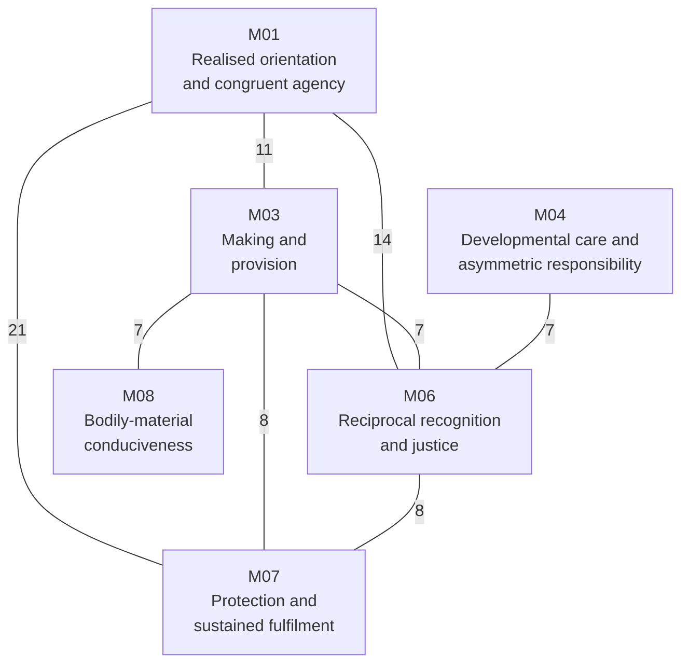

# Research Note: Pass-Three Derivation of *Jeevan* Activity Spheres

**Author:** Raghava Mohan Madhwapathi ([analyticmadhyasthdarshan.org](https://analyticmadhyasthdarshan.org))

**Edited on:** August 16, 2026, 10:09 AM IST

**Status:** Internal research note (not a catalog entry). Pass Three of the activity-to-sphere analysis.

**Scope:** This note implements the institution-neutral clustering prescribed by the [Pass-Two lifecycle register](Research-Note-Jeevan-Activity-Lifecycle-Pass-Two.md). It exports one frozen sixteen-position vector for each of the 122 *jeevan* members, replaces names, faculties, pair positions, role terms, family vocabulary, and institution vocabulary with anonymous structural tokens, and compares coarse, middle, and fine partitions under three treatments of unresolved fields. Only after the blind partitions are fixed does it restore the source labels and interpret recurring fields as candidate spheres, bridges, or residuals. It does not itself decide which spheres require durable organisation or test the family and five-function proposal; those questions are completed in the [Pass-Four durable-function analysis](Research-Note-Jeevan-Durable-Functions-Pass-Four.md).

The result is a constrained sphere architecture rather than an institutional blueprint. Three broad domains are stable at coarse resolution. At the selected middle resolution, four clusters remain stable under both sensitivity tests, two operate primarily as cross-domain bridges, and two are produced by unresolved or weakly specified records and cannot yet be treated as spheres. The four stable cores concern realised orientation and congruent agency, developmental care under unequal capability, reciprocal recognition and justice, and bodily-material conduciveness. Their number does not imply four institutions: a sphere is a recurring field of fulfilment and evidence, while an institution is one possible durable arrangement for maintaining one or several spheres.

## 1. The Pass-Three question

The unit of analysis remains the independently coded member, not the source pair and not the faculty. Pass Two established for every member its entry form, locus, operation, consequence, evidence, counterpart, internal dependencies, lifecycle requirements, correction path, continuity requirements, external relation types, universality level, false positives, and unresolved fields. Pass Three asks whether recurrent configurations of those features form stable fields before any social label is supplied.

A cluster is not automatically a sphere. This note uses three distinctions.

- A **stable core** is a cluster whose membership survives removal of open-field indicators and survives holding unresolved members outside the partition. Its members also retain substantially similar co-cluster neighbourhoods across treatments.
- A **bridge** is a recurrent configuration whose members connect stable cores through overlapping lifecycle requirements but whose boundary changes materially under sensitivity analysis.
- A **residual grouping** is formed chiefly by unresolved entry grammar, missing criterion, or repeated tabular vocabulary. It preserves a research problem and is not promoted to a social function.

These distinctions impose a stopping rule. Pass Three may derive stable functional and relational fields, identify interfaces, and reject premature groupings. It may not infer that a stable field must be a separate institution, that the number of fields determines the number of institutions, or that one named social proposal is uniquely required.

## 2. Frozen anonymous feature matrix

### 2.1 Sixteen equally weighted positions

The feature order is fixed by the Pass-Two handoff:

1. entry-form family and residual flag;
2. ontological locus;
3. operation field;
4. consequence field;
5. evidence field and evaluator standpoints;
6. constitutive counterpart and participation topology;
7. internal dependencies;
8. endpoint and governing-criterion provenance;
9. development and orientation requirements;
10. expression requirements;
11. evidence requirements;
12. correction and protection paths;
13. sustaining and transmission requirements;
14. external relation types and strength-scope codes;
15. universality levels; and
16. false-positive class and unresolved fields.

Each prose field is translated into a controlled structural vocabulary. Examples include `locus:relational`, `operation:meaning_truth`, `evaluator:affected_party`, `correction:protection_appeal`, `continuity:skill_tools_maintenance`, and `scope:n_evd`. These terms describe the functional content of the Pass-Two record without retaining a member name, faculty, source pair, or institution. Unknown fields remain explicit but do not count as evidence of similarity: two records do not become neighbours merely because the coding lacks a token for both.

Similarity is the equal-weight mean of sixteen field-wise Jaccard scores. Within each position, the shared-token count is divided by the union-token count. The sixteen position scores are then averaged. Equal field weight prevents a long evidence paragraph from outweighing a short but decisive entry-form, topology, provenance, or universality field.

### 2.2 Anonymisation and leakage control

The source-order members become `X001` through `X122`. The anonymous matrix contains neither source ID nor member name. It excludes faculty labels and source-embedded terms for family relations, teaching roles, social institutions, governance, exchange, and production. Their structural implications remain available only through neutral features such as direct or durable counterpart, guided learning, material provision, affected-party voice, public review, and intergenerational transmission.

The frozen anonymous matrix is [available as CSV](Research-Data-Jeevan-Pass-Three-Anonymous-Matrix.csv). Its SHA-256 digest is `D00CC76E386F4DC15A84CDD85EF78575725E148E4454A2018C6A6845E27BFD89`. The restored mapping is kept separately in [the membership register](Research-Data-Jeevan-Pass-Three-Restored-Memberships.csv), and the complete numerical diagnostics are in [the diagnostics file](Research-Data-Jeevan-Pass-Three-Diagnostics.json). The [analysis script](../../Scripts/_analyze_jeevan_pass_three.py) regenerates all three artifacts deterministically from the Pass-Two note and fails if prohibited vocabulary leaks into the anonymous matrix.

### 2.3 Three treatments of unresolved fields

Thirty-four members contain an explicit open feature in their normalized location or risk row. This count is wider than the twelve classes in the Pass-Two residual register because one class can affect both members of a pair or several repeated slots. The three required treatments are:

1. **include-open** - retain every member and the explicit open-field indicators;
2. **drop-open** - retain every member but remove the open and residual indicators from similarity; and
3. **residual-holdout** - remove the thirty-four open members from partition formation while preserving them for later interpretation.

The first treatment records what the complete register currently says. The second tests whether records group merely because they share uncertainty. The third tests whether a cluster survives when unresolved members cannot serve as bridges or centroids. No missing criterion or disputed entry form is imputed in any treatment.

## 3. Clustering and stability procedure

### 3.1 Deterministic average-link partitions

The clustering is deterministic average-link agglomeration. Every member begins as a singleton. At each step the two clusters with the greatest mean pairwise similarity are merged, with anonymous order breaking exact ties. The procedure uses no seed cluster, pilot sphere, faculty, pair identity, member name, or institution label.

The search bands were fixed by analytical resolution before interpreting the source labels: three to five clusters for a coarse partition, six to eleven for a middle partition, and twelve to sixteen for a fine partition. Within each band the selected value maximises a composite of separation and sensitivity stability:

> `0.55 × silhouette + 0.225 × ARI(drop-open) + 0.225 × ARI(residual-holdout)`

The adjusted Rand comparisons are label-invariant. For the holdout comparison, only the eighty-eight non-residual members are compared. The selected resolutions are three coarse domains, eight middle clusters, and fourteen fine clusters.

| Resolution | Selected count | Silhouette | ARI after dropping open indicators | ARI after residual holdout | Composite |
|---|---:|---:|---:|---:|---:|
| Coarse | 3 | 0.133 | 0.751 | 0.921 | 0.449 |
| Middle | 8 | 0.127 | 0.694 | 0.910 | 0.431 |
| Fine | 14 | 0.116 | 0.660 | 0.790 | 0.390 |

The low silhouette values are substantively important. The records do not form sharply separated natural kinds. Their lifecycle requirements overlap because one activity can depend on several fields of embodiment, relationship, evidence, correction, and continuity. Stability under perturbation is stronger than geometrical separation. Pass Three therefore treats the hard partition as a way to identify cores and then restores overlap rather than claiming eight exclusive compartments.

### 3.2 Overlapping membership

For each member, its average similarity to every cluster is calculated. Secondary membership is retained when the score is at least `0.20`, at least eighty-six per cent of the member's best score, and no more than `0.06` below that best score. Fifty-three of the 122 members satisfy the overlap rule at middle resolution. Overlap is therefore a primary result, not an exception to be forced back into one category.

A cluster is treated as a stable middle core only when its best-match Jaccard is at least `0.75` in both sensitivity comparisons and the mean member-neighbour stability is at least `0.70`. This threshold is declared before interpreting names. A cluster below the threshold may remain a bridge or residual, but its boundary cannot support an institutional inference.

## 4. Blind structural result

### 4.1 Three stable coarse domains

All three coarse clusters survive both sensitivity treatments.

| Blind ID | Members | Drop-open Jaccard | Holdout Jaccard | Dominant anonymous signature |
|---|---:|---:|---:|---|
| C01 | 60 | 0.88 | 0.98 | Sentient-inward locus joined to embodied expression, direct and collective evidence, inquiry, agency, and transmission |
| C02 | 36 | 0.78 | 0.86 | Embodied and material locus joined to capability, making, provision, sensory consequence, maintenance, and wider material continuity |
| C03 | 26 | 0.80 | 0.92 | Direct and durable counterparts joined to reciprocal fulfilment, care, protection, affected-party evidence, and intergenerational continuity |

The stable broad form is thus triadic: meaning and agency, embodied-material capability, and relational fulfilment. These are domains of lifecycle dependence, not three institutions. Each contains internal distinctions that become visible at middle resolution.

### 4.2 Eight middle clusters, four stable cores

The blind middle partition produces the following result. “Stable members” counts members whose co-cluster neighbourhood remains above the declared stability threshold; it does not count merely repeated names or pair partners.

| Blind ID | Members | Stable members | Drop-open Jaccard | Holdout Jaccard | Blind status and signature |
|---|---:|---:|---:|---:|---|
| M01 | 46 | 44 | 0.80 | 0.95 | Stable core: inward orientation, embodied agency, direct and collective evidence, correction, and transmissible congruence |
| M02 | 9 | 0 | 0.33 | 0.00 | Residual: open criterion or entry grammar joined to discrimination and public or material evidence |
| M03 | 14 | 0 | 0.17 | 0.67 | Bridge: material provision, making, capability, participation, tools, maintenance, and multiple affected fields |
| M04 | 16 | 15 | 0.79 | 0.86 | Stable core: constitutive direct or durable relation, unequal capability, care, protection, and intergenerational transmission |
| M05 | 2 | 0 | 0.04 | 0.00 | Residual: affective reception or esteem with unresolved criterion |
| M06 | 10 | 8, plus 2 moderate | 0.80 | 1.00 | Stable core: reciprocal relation, counterpart evaluation, justice, repair, and relational continuity |
| M07 | 3 | 0, plus 2 moderate | 0.67 | 0.67 | Bridge: sustained protection, fulfilment, and continuity across agency, relation, and material capability |
| M08 | 22 | 22 | 0.79 | 0.92 | Stable core: bodily health, sensory-material consequence, measurement, care, correction, and continued capability |

M02 and M05 vanish as coherent clusters when unresolved members are held out. They cannot be counted as spheres. M03 and M07 preserve real interface content, but their members change neighbourhoods when open indicators are removed. They are better represented as bridge fields connecting stable cores. M01, M04, M06, and M08 satisfy all three stability conditions.

### 4.3 The fine partition tests boundaries rather than adding fourteen spheres

At fourteen clusters the developmental-care core, reciprocal-justice core, and bodily-material core remain nearly intact. The large M01 core divides principally between inward recognition and outwardly testable agency, but the first subdivision has only moderate stability. The material-provision bridge splits among making, sufficiency, shared capability, and protective continuation, while several residual members become singletons or small unstable groups.

The fine partition therefore clarifies boundaries but does not establish fourteen durable fields. In particular, the isolation of an unresolved member is evidence for retaining it as a residual, not evidence for a one-member social sphere.

## 5. Restored interpretation of the stable cores

Names and source positions were restored only after the blind IDs, memberships, overlaps, and sensitivity results were written. The source labels help interpret what each configuration is about; they do not alter membership.

### 5.1 Realised orientation and congruent agency - M01

M01 contains forty-six members across all five faculties, including *anubhav*, *pramanikta*, *anand*, *astitva*, *shruti*, *smriti*, *vidya*, *pragya*, *nishchaya*, *tadatmayata*, *sahas*, *samyama*, *niyam*, *bhakti*, *nishtha*, *dayitva*, *sheel*, *pramanik*, *jigyasu*, *sukh*, and *sfoorti*. The common field is not a faculty or one inward state. It is the lifecycle by which accepted or realised content becomes definite, expressible, examinable, correctable, and congruent in embodied conduct.

Its recurrent invariants are free inquiry, freedom from status substitution, intelligible expression, access to relevant consequences, distinction between error in criterion and error in performance, and correction through renewed inquiry joined to changed conduct or repair. Continuity requires recollection, records, demonstration, repeated congruence, and learner verification without treating transmission as transfer of realisation.

M01 is a stable activity sphere, but it is not yet “education,” “science,” or “governance.” Those arrangements may maintain parts of the sphere, while no one of them exhausts realised orientation, personal agency, public evidence, and correction.

### 5.2 Developmental care and asymmetric responsibility - M04

M04 contains sixteen members centred on care, help, protection, developmental roles, and responsibility across unequal capability: *vatsalya*, *daya*, *krupa*, *karuna*, *kshama*, *veerta*, *mamta*, *samman*, *putra-putri*, *sathi*, *sankoch*, *guru*, *shishya*, *pati-patni*, *mata*, and *pita*. The grouping is not produced by family vocabulary, because those terms were hidden. Its blind signature is a constitutive direct or durable counterpart, dependence or developmental asymmetry, care and protection, evidence in the other's growing capability, and continuity beyond one episode.

The invariant is not permanent hierarchy. A correct asymmetric relation must remain oriented toward the other's capability and agency, preserve voice, distinguish help from control, and provide protection or appeal where proximity conceals harm. Competence, succession, respite, material support, and intergenerational transmission recur because the endpoint exceeds unaided episodic action.

This sphere is compatible with family-like and teaching relations after labels are restored, but it does not derive one household composition, fixed gender role, authority structure, or schooling system.

### 5.3 Reciprocal recognition and justice - M06

M06 contains *dhairya*, *kritagyata*, *vishwas*, *nyaya*, *bhav*, *sneha*, *anurag*, *kartavya*, *bhai-mitra*, and *bahan*. Its members require a counterpart who can evaluate whether recognition, expectation, responsibility, value-fulfilment, consent, and repair are actually present. The relation cannot be evidenced solely from the bearer's intention.

The recurrent invariants are reciprocal recognition, truthful expectation, mutual evidence, protected voice, repair after contradiction, and continuity of value-fulfilment through changing circumstances. Where power defeats direct reciprocity, appeal and independent protection become necessary. Gratitude, trust, affection, duty, and justice cluster together not as a list of sentiments but because their correctness becomes available through shared conduct and counterpart evaluation.

This sphere is distinct from developmental care because the endpoint is reciprocal fulfilment rather than the capable party's responsibility for another's development. The two overlap in seven members because real relationships can contain both reciprocity and temporary asymmetry.

### 5.4 Bodily health and material-sensory conduciveness - M08

M08 contains twenty-two members concerned with bodily usefulness, health, sensory discrimination, physical qualities, breathing, and repeated *poshan* criteria. It includes *hita*, *svasthya*, *priya*, *ruchi*, *mridu-kathor*, *sheet-ushna*, the taste and smell positions, *shvasan-nihshvasan*, *suroop-kuroop*, and the corresponding nourishment assessments. All twenty-two members retain stable neighbourhoods, and the cluster survives the holdout of unresolved records with Jaccard `0.92`. The repeated *poshan* slots therefore do not manufacture the core, although their exact documentary status remains open.

The stable field joins body-object contact, discrimination, bodily response, health criterion, material access, skilled evaluation, treatment or accommodation, safe use, maintenance, and ecological consequence. First-person experience remains indispensable, while health competence, measurement, caregiver observation, and delayed material effects provide non-substitutable evidence.

This sphere does not specify a medical system, food regime, technology, dwelling form, or environmental agency. It establishes the more general requirement that embodied human activity remain capable through health-serving material relations open to evidence and correction.

### 5.5 Material making, provision, and participation - M03 bridge

M03 contains *kala*, *shree*, *ananyata*, *saujanyata*, *samveg*, *udarta*, *sahyogi*, *svayatta*, *samriddhi*, *pragati*, *unnati*, *yatitva-satitva*, one *poshan* assignment, and *vahan-samvahan*. Its controlled features recur around usefulness, capability, provision, means, skill, affected parties, maintenance, and continuity. Yet its boundary changes sharply when open indicators are removed.

The correct conclusion is that making and provision form a recurrent interface, not that Pass Three has already derived a discrete production or exchange sphere. These members connect realised agency to bodily-material capability and connect personal sufficiency to shared participation. Pass Four must test whether their durable requirements form an independent function, belong to several mutually correcting arrangements, or remain a cross-sphere method.

### 5.6 Protection and sustained fulfilment - M07 bridge

M07 contains *dheerta*, *pushti*, and *sanrakshan*. Its members sit at the interface of sustained agency, protected continuation, bodily or material capability, and wider fulfilment. Two members have moderate neighbourhood stability, but the cluster does not pass the declared threshold.

Protection and continuity are nevertheless recurrent throughout the matrix. Their failure to form a stable exclusive cluster suggests that they are cross-cutting lifecycle requirements rather than one self-contained sphere. Inquiry needs protection from coercion, reciprocal relations need appeal, care needs safeguarding, bodily capability needs safety, and material provision needs maintenance and reserve.

### 5.7 Unresolved discrimination and affective reception - M02 and M05 residuals

M02 collects *medha*, *guna*, *gaurav*, *satya*, *dharma*, *jati*, *kaal*, *swagat*, and *swagat-aswagat*. M05 contains *pujyata* and *haas*. These groupings are driven principally by open criterion or disputed entry grammar. They disappear under residual holdout and must remain in the residual register.

Their content still matters. Discrimination of form, property, truth, order, kind, and duration may later distribute across inquiry, material evidence, and value evaluation. Esteem, joy, welcome, and affinity may distribute across orientation and relationship. Pass Three does not choose among those alternatives without clearer source or criterion evidence.

## 6. Sphere interfaces and overlap

Fifty-three members receive more than one middle-cluster membership. The strongest interfaces are shown below; edge labels count members assigned to both fields under the declared overlap rule.

The network discloses why exclusive institutional mapping would be premature. Protection is needed inside every stable field. Material provision connects agency, relationship, and bodily capability. Developmental care depends on reciprocal recognition without collapsing into it. Realised orientation requires outward relational and material evidence even when the inward occurrence is not externally caused.

The recurring interfaces can be stated without naming organisations:

- **inquiry and evidence:** access to reasons, consequences, competent criticism, and correction;
- **protected participation:** voice, dissent, appeal, boundary, and restoration where power can suppress evidence;
- **embodiment and means:** bodily capability, skill, time, tools, materials, and accessible environments;
- **continuity:** records, memory, maintained competence, succession, reserve, and intergenerational verification; and
- **ecological consequence:** evidence that present fulfilment has not displaced cost to nature or future participants.

These interfaces are candidates for cross-cutting design requirements in Pass Four. Their recurrence does not require each to become a separate institution.

## 7. Tests after restoring source structure

### 7.1 The spheres do not reproduce the five faculties

The adjusted Rand index between the eight-cluster primary partition and the five restored faculty labels is `0.0267`, close to zero. M01 alone contains members from all five faculties. M04 spans *chitta*, *vritti*, and *mun*; M06 spans *vritti* and *mun*. M08 is concentrated in *mun*, but its field is defined by embodied and material lifecycle requirements rather than by the faculty label.

The result rejects a simple analogy from five faculties to five social institutions. Faculty architecture remains an internal functional structure of *jeevan*; a sphere groups recurrent conditions of expression, evidence, correction, and continuity across that structure.

### 7.2 Source pairs are documentary units, not automatic sphere units

Only twenty-five of the sixty-one *bal/shakti* pairs place both members in the same primary middle cluster. Forty pairs share at least one overlapping cluster. The remaining twenty-one pairs have no common middle membership under the declared threshold.

This confirms the Pass-One decision to keep 122 independent analytic units. Pairing can express dependency, complement, shared criterion, bearer-expression relation, or unresolved tabular grammar. It does not guarantee one external field.

### 7.3 The pilot atlas is partly recovered and partly revised

The eight pilot pairs were withheld as seeds. After restoration, four have both members in the same primary cluster and six share at least one overlapping cluster.

| Pilot field | Restored Pass-Three result |
|---|---|
| Realised knowing and authentic evidence - A-01 | Both members fall in M01; recovered as part of the larger realised-orientation sphere |
| Definite understanding and responsible agency - B-02 | Both members fall in M01; the pilot distinction merges at middle resolution |
| Whole-sensitive inquiry and property evidence - C-04 | The members share unstable M02 overlap; no independent stable sphere is recovered |
| Reciprocal relationship and protected participation - V-12 | *Nyaya* enters M06 while *samvedna* enters M01/M07; the pilot pair splits between reciprocal justice and participatory expression |
| Multi-scale fulfilment and living continuity - V-18 | The members share M01 through overlap, while *pushti* bridges M07/M08; recovered as an interface rather than one core |
| Sufficiency and regenerative provision - M-08 | Both members enter M03; the content recurs, but M03 remains a sensitivity-dependent bridge |
| Inquiry-led teaching and lived credibility - M-13 | The role member enters M04 and the evidential member M01; teaching relation and authentic evidence separate |
| Bodily-material conduciveness and protective care - M-24 | Both members enter M08; the bodily-material core is recovered |

The pilot was therefore useful as a contrast set but not a final atlas. Pass Three merges two pilot fields into M01, splits two pair-based fields, retains two as overlap interfaces, and strongly recovers the bodily-material field.

## 8. Limits and open problems

The clustering is an explicit formalisation of an interpretive register, not independent empirical confirmation of Madhyasth Darshan. Several limits remain.

First, the controlled vocabulary is coded from prose written by the same research programme. Equal field weighting prevents verbosity from dominating but does not eliminate author judgement in choosing structural tags. Independent recoding and inter-coder comparison would strengthen the result.

Second, silhouette values remain low at every resolution. The stability result supports cores under the tested perturbations, not naturally discrete or unique boundaries. Another defensible feature vocabulary or similarity measure may change the bridges and fine partition.

Third, thirty-four members carry explicit open fields. Residual holdout is deliberately severe, but a later source clarification could integrate some of them into stable cores or disclose a new sphere. M02 and M05 must not be institutionalised from present evidence.

Fourth, repeated sensory and *poshan* records create a dense bodily-material region. Its survival under residual holdout shows that the core is not solely an enumeration artifact, but its internal fine structure remains sensitive to whether repeated *poshan* is an activity, criterion, or shorthand.

Fifth, overlap thresholds are methodological choices. The complete similarity and membership data are preserved so that Pass Four or an independent review can rerun stricter and looser thresholds without recoding the 122 members.

Finally, universality remains conditional on the underlying account of common *jeevan* architecture and on the adequacy of the Pass-One and Pass-Two readings. Pass Three derives common functional and relational constraints within that standpoint. It does not establish their truth independently of the primary ontology and epistemology.

## 9. Completion statement and completed handoff to Pass Four

Pass Three is complete at the declared analytical grain. It has produced a leakage-checked anonymous matrix, deterministic coarse, middle, and fine partitions, three residual treatments, overlapping memberships, member and cluster stability measures, restored interpretations, and post-restoration comparisons with faculties, source pairs, and the pilot atlas.

The strongest result is a layered architecture:

- three stable coarse domains - meaning and agency, embodied-material capability, and relational fulfilment;
- four stable middle cores - realised orientation and congruent agency, developmental care and asymmetric responsibility, reciprocal recognition and justice, and bodily-material conduciveness;
- two recurrent but boundary-sensitive bridges - making/provision/participation and protection/sustained fulfilment;
- two residual groupings that cannot yet support a sphere claim; and
- cross-cutting interfaces of inquiry, protected participation, embodiment and means, continuity, and ecological consequence.

The [Pass-Four durable-function analysis](Research-Note-Jeevan-Durable-Functions-Pass-Four.md) has now completed this handoff. It translates every anonymous lifecycle vector into durability tests, unnamed continuity channels, cross-cutting safeguards, and arrangement scales before restoring social labels. The result contains 185 channel memberships across all 122 members. Five non-substitutable continuity objects align after restoration with education-*sanskar*, justice-security, health-restraint, production-work, and exchange-reserve. Among five tested bundles, the five-function basis alone obtains full coverage without forced combination or unsupported splitting while preserving independent correction. This establishes sufficiency and practical minimality at the selected grain, not five organisations or numerical uniqueness.

## References

### Madhyasth Darshan

- **AVD** - A. Nagraj, [*Adhyatmvad*](../../References/Madhyasth-Darshan/AVD-Adhyatmvad.docx.pdf), tr. Sanjeev Chopra (work in progress). Cited: the five-column table, faculty allocation, and sixty-one *bal/shakti* assignments whose documentary positions are restored only after blind clustering (pp. 91-94; §§1, 7).
- **MVD** - A. Nagraj, [*Madhyasth Darshan - Co-existentialism*](../../References/Madhyasth-Darshan/MVD-Madhyasth-Darshan-Coexistentialism.md), tr. Rakesh Gupta. Cited: the constitutional activity count and definitions underlying the Pass-One anatomy and Pass-Two lifecycle records (pp. 323, 327-348; §§1-9). The feature engineering, clustering, stability criteria, and sphere interpretation in this note are analytical constructions, not direct textual claims.

### Related research notes and artifacts

- [*The Sixty-One Activity Pairs of Jeevan*](Research-Note-Activity-Pair-Inventory.md) - the bilingual source inventory and documentary variants.
- [*Pass-One Anatomy of the Remaining Jeevan Activities*](Research-Note-Jeevan-Activity-Anatomy-Pass-One.md) - source and anatomy records for the 106 non-pilot members.
- [*Bottom-Up Pilot Derivation of Jeevan Activity Spheres*](Research-Note-Jeevan-Activity-Environment-Pilot-Dossiers.md) - the sixteen pilot records and the multi-pass protocol.
- [*Pass-Two Lifecycle and Evidence Coding of All 122 Jeevan Members*](Research-Note-Jeevan-Activity-Lifecycle-Pass-Two.md) - the normalized lifecycle matrix and frozen feature order used here.
- [*Jeevan Activity-to-Sphere Dossier Template*](Research-Template-Jeevan-Activity-Environment-Dossier.md) - the provenance, lifecycle, clustering, institution-comparison, and validation schema.
- [*Pass-Four Derivation of Durable Social Functions from Jeevan*](Research-Note-Jeevan-Durable-Functions-Pass-Four.md) - the completed durability tests, five continuity channels, family-like field, and comparative institutional bundles.
- [*From the Activity Architecture of Jeevan to Universal Human Order*](Research-Note-Jeevan-To-Universal-Human-Order.md) - the social hypothesis withheld from this clustering input and subsequently tested in Pass Four.
- [Anonymous feature matrix](Research-Data-Jeevan-Pass-Three-Anonymous-Matrix.csv) - the frozen sixteen-position vectors for `X001`-`X122`.
- [Restored membership register](Research-Data-Jeevan-Pass-Three-Restored-Memberships.csv) - source names and positions restored after partition formation, including primary, overlapping, and sensitivity assignments.
- [Diagnostics](Research-Data-Jeevan-Pass-Three-Diagnostics.json) - resolution scores, cluster signatures, stability comparisons, overlap interfaces, and post-restoration tests.
