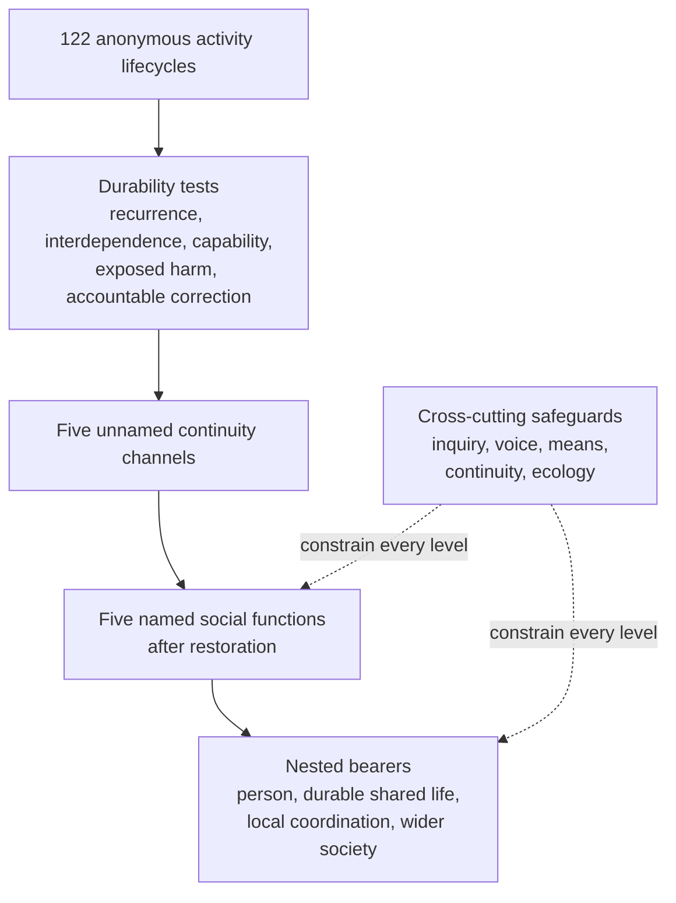

# Research Note: Pass-Four Derivation of Durable Social Functions from *Jeevan*

**Author:** Raghava Mohan Madhwapathi ([analyticmadhyasthdarshan.org](https://analyticmadhyasthdarshan.org))

**Edited on:** August 16, 2026, 10:16 AM IST

**Status:** Internal research note (not a catalog entry). Pass Four of the activity-to-sphere analysis.

**Scope:** This note asks what durable external structure is required for the complete lifecycle of all 122 *jeevan* activities after the [Pass-Three sphere derivation](Research-Note-Jeevan-Activity-Spheres-Pass-Three.md). It does not assign activities directly to family, school, market, government, or the five functions proposed in Madhyasth Darshan. Each anonymous activity vector is first tested for durability, translated into unnamed continuity channels, and located across personal, relational, shared, and wider scales. Only after those results are frozen are the source names restored and the five channels compared with education-*sanskar*, justice-security, health-restraint, production-work, and exchange-reserve. Family is tested as an integrative field, not entered as a coding category.

The analysis finds five non-substitutable objects of durable responsibility: understood orientation, claims between persons, bodily capability, transformed material means, and access to provision across persons and time. All 122 activity rows enter at least one of these channels; seventy-two enter one, thirty-eight enter two, eleven enter three, and one enters four. A five-function bundle covers all 185 member-channel obligations without combining causally distinct channels or splitting one channel without a derived need. Three- and four-function alternatives either leave requirements without a durable bearer or concentrate performance and correction in the same function. A seven-function alternative preserves coverage and correction but introduces two subdivisions not required by the activity evidence.

This supplies a plausible activity-based reason for five **institutional functions**. It does not prove that society must contain exactly five organisations. Each function may require several organisations; one organisation may responsibly serve more than one function when decision rights, evidence, and correction remain distinct. The result establishes functional closure and practical minimality at the chosen analytical grain, not numerical uniqueness across every possible social design.

## 1. The Pass-Four question

Pass Three derived four stable activity cores, two bridge fields, and five cross-cutting interfaces. It deliberately stopped before institutional interpretation. Pass Four begins from the distinction between a recurring activity sphere and a durable social function.

A sphere describes a recurrent configuration of development, expression, evidence, correction, and continuity. A durable function exists when responsibility for one of those configurations cannot safely depend upon an isolated act or one person's goodwill. An institution is a concrete arrangement of roles, norms, resources, authority, records, and correction that maintains one or more durable functions. These three levels must not be collapsed:

```text
activity lifecycle -> recurrent sphere -> durable function -> concrete organisation
```

The first implication is negative. The five faculties do not become five institutions, and the four stable middle cores do not become four institutions. Faculty labels organise the internal architecture of *jeevan*. Sphere boundaries group similar lifecycle requirements. Durable functions must instead be derived from what has to remain available across persons, consequences, dependency, turnover, distance, and time.

The second implication concerns causal modesty. An external arrangement does not produce *anubhav*, understanding, resolve, or right evaluation inside *jeevan*. It can protect inquiry, supply bodily and material means, make consequences visible, preserve reciprocal voice, correct harm, and maintain transmission. The institutional claim therefore concerns the complete embodied and social lifecycle of an activity, not the constitutional occurrence of activity in the sentient unit.

The third implication is a stopping rule. Pass Four may establish that a function is necessary for closure, that a tested bundle is sufficient for the coded requirements, or that a smaller bundle creates unacceptable combinations. It may not call one household form, administrative design, property regime, or organisational count uniquely necessary unless alternatives have been excluded by further evidence. That counterfactual work remains Pass Five.

## 2. Anonymous derivation method

### 2.1 Frozen input and leakage control

The input is the sixteen-position anonymous matrix produced in Pass Three. It contains structural tokens such as `operation:meaning_truth`, `evaluator:affected_party`, `expression:material_means`, `correction:protection_appeal`, and `continuity:reserve_reliable_provision`. It contains no member name, source ID, faculty, family term, or institution name.

The [Pass-Four analysis script](../../Scripts/_analyze_jeevan_pass_four.py) translates those records deterministically. The resulting [anonymous requirement register](Research-Data-Jeevan-Pass-Four-Anonymous-Requirements.csv) has SHA-256 digest `CCE1247E38C75F69F4D83A0D14C9E164DFFAA11F738295425FC9C8E22F73E4C7`. Source names and the proposed function labels appear only in the separate [restored coverage register](Research-Data-Jeevan-Pass-Four-Restored-Coverage.csv). The [bundle diagnostics](Research-Data-Jeevan-Pass-Four-Bundle-Comparison.json) preserve counts, tests, and the comparison result.

The anonymous register uses five kinds of code:

- `D01` to `D05` record the five durability tests;
- `U01` to `U05` record unnamed continuity channels;
- `X01` to `X05` record cross-cutting safeguards;
- `S01` to `S05` record arrangement scales; and
- `D0` to `D3` record the strength of the durable-responsibility conclusion.

No number is chosen to mirror the five faculties or the five source-proposed social functions. Five channels remain only if five different continuity objects survive the activity-by-activity substitution test.

### 2.2 Five durability tests

Every member is evaluated against the institutionalisation test stated in the pilot. Durable responsibility becomes indicated as the following conditions converge:

1. **Recurrence:** the endpoint or its evidence must remain available beyond one episode.
2. **Interdependence:** the complete lifecycle exceeds one person's unaided capacity or requires a counterpart, affected party, skilled evaluator, or ecological witness.
3. **Persistent capability:** roles, competence, tools, material access, memory, or succession must survive turnover.
4. **Exposed harm:** failure can injure another person, a body, a shared material field, or future ecological conditions.
5. **Accountable correction:** voice, appeal, records, review, restitution, treatment, redesign, or restoration must not depend on goodwill alone.

`D3` means that durable responsibility is required for the member's **complete lifecycle**. It does not mean an institution causes the activity's inward occurrence. `D2` means the responsibility is distributed or conditional; `D1` means supportive or episodic external conditions are indicated; `D0` would mean that the register derives no durable external claim.

One hundred and eighteen members satisfy `D3`, two satisfy `D2`, and two satisfy `D1`; none falls into `D0`. The four weaker cases are *anand* and *ullas* at `D2`, and *kanti* and *haas* at `D1`. Their inward or expressive character can occur without a persistent external bearer, while their wider evidence and continuity can still be supported socially. The overwhelming `D3` result reflects the question being asked: not whether an activity exists inside *jeevan*, but whether its full development, embodied evidence, correction, and transmission can remain reliably available to every human being.

### 2.3 From feature evidence to continuity channels

Each channel receives a score from structurally relevant tokens. Strong tokens name its operation, consequence, endpoint, development, correction, or continuity. Supporting tokens name locus, evaluator, counterpart, expression, evidence, or internal dependency. A member enters its highest-scoring channel and receives overlapping membership where another channel reaches at least seventy per cent of that score and an absolute score of four. The fifth channel also requires both a material-access anchor and a distributional or temporal anchor; generic public coordination alone cannot be mistaken for circulation and reserve.

This rule yields 185 memberships across 122 members:

| Anonymous channel | Member count | Members with `D2` or `D3` | Object whose continuity is maintained |
|---|---:|---:|---|
| U01 | 59 | 57 | Understood meaning, warranted orientation, communicable evidence, and verified learning |
| U02 | 61 | 60 | A claim between persons: recognition, responsibility, protection, repair, and relational continuity |
| U03 | 23 | 22 | Bodily capability, safe sensory-material relation, care, treatment, and restraint |
| U04 | 30 | 30 | Useful transformation of material means through skill, work, maintenance, and regeneration |
| U05 | 12 | 12 | Availability of provision across persons, places, and time through circulation, access, and reserve |

The memberships are not classifications of what an activity “really is.” A member may be inward in its ontological locus and still require bodily, relational, or material channels for complete evidence. The columns say which durable responsibilities its lifecycle touches.

The overlap boundary was also rerun at sixty-five and seventy-five per cent of each member's best channel score. The lower boundary yields 201 memberships with channel counts `65/64/24/34/14`; the higher yields 175 with counts `56/61/23/26/9`, in U01-U05 order. All five channels remain populated under both alternatives. The result therefore does not depend on the selected seventy-per-cent boundary for the existence of a channel, although marginal member overlap remains threshold-sensitive.

### 2.4 Cross-cutting safeguards and nested scales

Five interfaces recur across the channels. Inquiry and evidence appear in 105 activity rows; protected participation in 100; embodiment and usable means in 91; continuity and succession in 115; and ecological or long-horizon consequence in 32. These are design constraints on every relevant function, not automatically additional functions.

The activity evidence also occupies several scales. Personal practice appears in 98 records, direct relation in 97, durable care or intergenerational relation in 99, shared local coordination in 105, and wider temporal or ecological coordination in 41. The numbers overlap because the same activity can begin personally, become evident in direct relationship, depend on shared means, and produce consequences at a wider scale.

The complete derivation therefore has two dimensions: five horizontal continuity responsibilities and nested relational scales. It is not a flat list of organisations.



## 3. The five continuity channels after restoration

### 3.1 U01 - education and *sanskar*

U01 maintains understood orientation across persons and generations. Its object is not information alone. It joins inquiry, recognition of meaning, communicable evidence, competence, lived congruence, correction, memory, and learner verification. A proposition can circulate without understanding, and a habit can be transmitted without right evaluation; neither closes this channel.

After restoration, U01 corresponds to education-*sanskar*. The pairing matters. Education makes the content, reasons, and evidence available; *sanskar* concerns the durable orientation through which knowing, believing, recognising, and fulfilling become congruent. Teaching cannot transfer realisation, but a society must preserve free inquiry, competent guidance, practice, public evidence, and the possibility that every learner verifies rather than merely obeys (MVD, pp. 248, 270, 313–315, 344; JV, pp. 55–60, 108).

U01 is distinct from justice because a correct adjudication cannot substitute for understanding. It is distinct from health because treatment does not establish meaning. It is distinct from production because successful output does not establish the right criterion of work. It is distinct from exchange because access to goods does not transmit the knowledge of right-use.

### 3.2 U02 - justice and security

U02 maintains the validity of claims between persons. Its object includes recognition, expectation, responsibility, consent, mutual value-fulfilment, protected voice, repair, and the continuity of relationship through changing circumstances. The bearer's good intention is insufficient evidence because the counterpart or affected party is a non-substitutable evaluator.

After restoration, U02 corresponds to justice-security. Justice identifies and fulfils relationship-values, evaluates mutual satisfaction, and corrects contradiction. Security preserves the conditions under which participation, bodily integrity, appeal, and repair remain possible when direct reciprocity is defeated by force, dependency, secrecy, or concentrated power (MVD, pp. 310–311, 336).

U02 is distinct from education because a person can know the value while violating it. It is distinct from health because relational wrong cannot be treated as bodily malfunction. It is distinct from production and exchange because the agent whose conduct or allocation is under review cannot be the sole judge of harm.

### 3.3 U03 - health and restraint

U03 maintains the body as an adequate means for awakened human participation. It includes nourishment, sensory-material conduciveness, bodily self-report, skilled observation, safe environments, treatment, accommodation, and correction of habits or conditions that degrade capability. Its criterion is neither pleasure alone nor medically normal appearance, but usable bodily capability without displaced injury.

After restoration, U03 corresponds to health-restraint. Health requires material and relational support; restraint concerns the regulation of consumption, habit, exposure, effort, and use in accordance with the body's purpose and limits. The function remains answerable to the person's experience while also requiring competence, measurement, and long-horizon evidence (MVD, pp. 199–205, 275–291).

U03 is distinct from production because output pressure can conflict with bodily safety. It is distinct from exchange because a good may be available yet unhealthy, inaccessible, or coercively supplied. Independent health evidence must therefore be able to correct productive and allocative arrangements.

### 3.4 U04 - production and work

U04 maintains the transformation of material reality into useful means. Its object is the making, cultivation, construction, repair, transport, and maintenance through which assessed needs can be met. The channel joins purpose, skill, bodily effort, tools, materials, coordination, user evidence, safety, and ecological regeneration. An output is not successful merely because it exists or can be sold; it must be useful, maintainable, and compatible with the regenerative order on which later activity depends.

After restoration, U04 corresponds to production-work. Production names the material transformation; work names the embodied, skilful participation through which it is realised. The human joint form supplies purpose and evaluation while the body supplies movement and material intervention. Work is therefore an evidentiary field of understanding, not an activity opposed to learning (KD, pp. 12, 25; JV, pp. 152–153).

U04 is distinct from health because the producer cannot define safe consequence solely by output. It is distinct from exchange because making a useful surplus does not determine who should receive it, when it should be held, or how scarcity should be answered.

### 3.5 U05 - exchange and reserve

U05 maintains the availability of provision across differences of person, place, need, and time. Its object is not material transformation but circulation: access, transfer, storage, information about stocks and needs, protection of future capability, and correction of exclusion, hoarding, manipulation, or depletion. The extra material-access gate in the analysis prevents generic public participation from being counted as exchange.

After restoration, U05 corresponds to exchange-reserve. Exchange makes useful provision available beyond the producing unit. Reserve protects continuity across delay, season, interruption, dependency, emergency, and future need. Neither price nor administrative allocation is a sufficient criterion; the evidence is dependable access without exploitation or hidden transfer of cost (JV, pp. 109–110, 140, 152–153).

U05 is distinct from production because a producer may have an interest in controlling allocation, scarcity information, or terms of access. The separation is functional rather than necessarily bureaucratic: a small community may use one organisation for both, but it must preserve transparent accounts, affected-party voice, and an independent correction path.

## 4. Minimum durable architecture of each function

The five channels become institutional functions only when their responsibilities are made durable. Concrete organisations can vary, but each function requires a minimum architecture.

### 4.1 Education-*sanskar*

| Element | Minimum durable requirement |
|---|---|
| Roles | Learner, competent guide, practising exemplar, peer or public witness, and reviewer of disputed claims |
| Norms | Free inquiry, intelligible reasons, distinction between testimony and verification, congruence of claim and conduct, and equal learner capability |
| Resources | Time for study and practice, language, source access, demonstrations, records, tools of inquiry, and settings where consequences can be observed |
| Decision rights | Right to question, inspect evidence, compare accounts, refuse status as proof, practise, and revise an accepted conclusion |
| Safeguards | No permanent knower–follower division; competence open to review; protection from indoctrination, humiliation, exclusion, and credential substitution |
| Records and correction | Reasons, demonstrations, revisions, failed tests, and learner feedback; correction through renewed inquiry, changed practice, and public clarification |

### 4.2 Justice-security

| Element | Minimum durable requirement |
|---|---|
| Roles | Counterparts, affected parties, trusted facilitator, protector, impartial reviewer, and person or body able to secure repair |
| Norms | Recognition, truthful expectation, consent, reciprocal fulfilment, proportional protection, non-domination, and restoration where possible |
| Resources | Safe participation, accessible dialogue, confidential disclosure where needed, appeal, emergency protection, and means of restitution |
| Decision rights | Voice, boundary, refusal, reasoned challenge, appeal, participation in remedy, and protection against retaliation |
| Safeguards | Adjudication independent of the power being reviewed; no intimacy, status, wealth, or majority support accepted as proof of justice |
| Records and correction | Commitments, reasons, harms, decisions, remedies, and recurrence; correction through dialogue, changed fulfilment, restitution, restraint, and institutional redesign |

### 4.3 Health-restraint

| Element | Minimum durable requirement |
|---|---|
| Roles | The embodied person, caregiver, health-skilled peer, environmental observer, and reviewer of shared risks |
| Norms | Bodily self-report joined to competent evidence, informed participation, sufficiency, prevention, accommodation, and restraint from harmful excess |
| Resources | Food, water, air, shelter, movement, rest, sanitation, care, treatment, measurement, assistive means, and safe work and dwelling conditions |
| Decision rights | Bodily voice, informed consent, access to explanation, refusal of unsafe exposure, accommodation, and appeal against neglect or coercion |
| Safeguards | Health evidence independent of productive output, commercial interest, stigma, and administrative convenience |
| Records and correction | Condition, exposure, intervention, outcome, and delayed effect; correction through treatment, changed habit, accommodation, prevention, and environmental repair |

### 4.4 Production-work

| Element | Minimum durable requirement |
|---|---|
| Roles | Need assessor, designer, skilled worker, material custodian, user, maintainer, safety witness, and ecological observer |
| Norms | Production for assessed need and right-use, competence, safe participation, maintainability, transparency of consequence, and regenerative material relation |
| Resources | Land or material inputs, tools, energy, skill, time, infrastructure, maintenance capacity, and knowledge of natural cycles |
| Decision rights | Participation in purpose and method, access to needed skill, ability to stop unsafe work, user feedback, and challenge to displaced harm |
| Safeguards | Health, user, and ecological review not controlled solely by output authority; no labour compliance or saleability accepted as proof of useful work |
| Records and correction | Inputs, methods, labour conditions, outputs, use, waste, maintenance, and ecological effects; correction through redesign, retraining, repair, restoration, or cessation |

### 4.5 Exchange-reserve

| Element | Minimum durable requirement |
|---|---|
| Roles | Producing and receiving units, persons able to state need, circulation or storage custodians, record keepers, and independent reviewers |
| Norms | Dependable access, non-exploitation, transparent terms, priority to assessed need, protection of common and future capability, and accountable stewardship of surplus |
| Resources | Information about need and stock, transport, storage, communication, accessible transfer mechanisms, emergency capacity, and maintained reserve |
| Decision rights | Inspect terms and stocks, participate in priority decisions, contest exclusion or manipulation, and request release of reserve under declared conditions |
| Safeguards | Separation of custodianship from private appropriation; anti-hoarding and conflict-of-interest rules; affected-party and future-consequence review |
| Records and correction | Stocks, flows, obligations, unmet need, loss, and future commitments; correction through reallocation, restitution, changed terms, reserve restoration, and public review |

These requirements show why the functions are not five departments imposed on human activity. They are five durable responsibilities that may be carried through many organisational forms and at several scales.

## 5. Deriving the family-like field

Family terms were absent from the anonymous register. Nevertheless, ninety-nine activity rows require a durable care or intergenerational scale, and twenty-nine satisfy a stricter integrative signature: durable relational continuity, membership in the relational channel, and simultaneous dependence on at least one meaning, bodily, material, or distributive channel. This is the quantitative trace of the family-like field anticipated in the pilot and recovered through the developmental-care and reciprocal-justice spheres in Pass Three.

The field is characterised by six jointly recurring conditions:

- relationships persist long enough for claim and conduct to become mutually evident;
- care answers periods of unequal capability without turning asymmetry into permanent superiority;
- children or new participants encounter language, meaning, practice, and exemplars across time;
- bodily need, work, use, maintenance, and provision are encountered together rather than as detached abstractions;
- responsibility and mutual evaluation are repeated in ordinary life; and
- outside evidence, protection, health competence, and appeal remain available when closeness hides error or harm.

This configuration provides a reason for family to be the first integrative field of human order. It combines all five functions in lived form: education through intergenerational learning, justice through value-fulfilment, health through daily care and restraint, production through participation in useful work, and exchange-reserve through shared need, access, and provision. Wider institutions do not replace this field; they extend capabilities that a close group cannot independently maintain and provide correction when the group fails.

The derivation is functional rather than genealogical. It does not prove one household size, residence pattern, marriage rule, gender division, property system, or authority hierarchy. A biologically related household that lacks care, learning, mutual evaluation, shared provision, and protection does not fulfil the invariant merely by carrying the name family. A materially different arrangement could qualify if it reliably sustains the same durable shared-life responsibilities. Pass Five must test those equivalents and adverse cases.

## 6. Comparative institutional bundles

Five bundles were specified before naming the source proposal. The comparison uses no weighted welfare score. It records coverage of the 185 member-channel obligations, residual members, forced combination of causally distinct channels, unnecessary splitting of one channel, high-conflict combinations, and whether an independent correction path remains structurally available.

| Bundle | Coverage and residual | Combination or split | Correction and conclusion |
|---|---|---|---|
| B01 Stable-core-only, 4 functions | 77.30%; 36 residual members | No forced combination; one unnecessary split | Correction remains available only for covered channels. Making and distribution bridges lack a durable bearer. |
| B02 Three-domain compression, 3 functions | 100%; no residual member | Three forced high-conflict combinations | Independent correction is not structurally protected because body, making, and distribution are combined. |
| B03 Integrated provision, 4 functions | 100%; no residual member | One forced high-conflict combination | Independent correction is not structurally protected because making, allocation, and reserve are combined. |
| B04 Five-continuity basis, 5 functions | 100%; no residual member | No forced combination and no unnecessary split | Independent correction remains structurally available. The bundle is sufficient and practically minimal at this grain. |
| B05 Seven specialised functions, 7 functions | 100%; no residual member | No forced combination; two unnecessary splits | Independent correction remains available, but two subdivisions have no separately derived continuity object. |

### 6.1 Why the stable cores are insufficient by themselves

B01 tests the tempting inference from four stable middle cores to four institutions. It covers orientation, relation, and bodily capability but leaves material transformation and circulation without distinct durable responsibility. Thirty-six members have at least one uncovered channel. The bridge status of making and provision in Pass Three therefore does not mean that these requirements are dispensable; it means they connect several activity cores and need a later functional treatment.

### 6.2 Why the three coarse domains are too compressed

B02 preserves complete coverage by treating meaning-agency, relation, and embodied-material capability as three institutional domains. The last domain must then combine bodily health, production, and distribution. This creates three high-conflict combinations. The authority responsible for output also controls evidence of bodily harm, terms of access, and reserve. Correction becomes vulnerable precisely where the activity matrix requires independent health evidence, affected-party voice, and long-horizon review.

### 6.3 Why production and exchange should remain functionally distinct

B03 combines making with circulation and reserve. It is complete in a set-theoretic sense but fails the independence test. Production asks how material means can be created competently and regeneratively. Exchange-reserve asks how already produced means remain available across differences of person, place, and time. When the same undifferentiated function controls both, output authority can manufacture scarcity, conceal stock, privilege its own users, or define future need in its own interest.

The analysis does not forbid one cooperative or local organisation from performing both. It requires separate accounts, decision rights, affected-party evidence, and appeal sufficient to preserve the two purposes and allow each to correct the other.

### 6.4 Why seven is possible but not derived as necessary

B05 separates formation from inquiry and developmental care from adjudication. Such organisational specialisation may be prudent in a large or technologically complex society. It does not add a new continuity object. Formation and inquiry remain two moments of maintaining warranted orientation; care and adjudication remain different modes of maintaining just relational claims. The activity evidence therefore permits seven or more organisations but does not require seven basic functions.

### 6.5 The status of the five-function result

B04 is the only tested bundle that simultaneously achieves full coverage, leaves no activity row with an uncovered channel, avoids forced combination of distinct continuity objects, preserves independent correction, and avoids a subdivision for which the activity matrix supplies no separate object. This establishes three conclusions of different strength:

- **Sufficiency:** the five functions jointly cover the coded external requirements of all 122 activities.
- **Practical minimality:** among the tested bundles at this grain, reducing the count either leaves a bridge without a bearer or combines functions whose purposes and correction paths must remain distinguishable.
- **Non-uniqueness:** the result does not prove one organisational chart or forbid responsible splitting, nesting, or administratively combined delivery with functional safeguards.

The strongest justified statement is therefore not “there can be only five institutions.” It is: **five non-substitutable institutional functions form a complete and practically minimal basis for maintaining the full embodied-social lifecycle of the 122 activities, while the number and form of organisations that carry them remain open.**

## 7. Science, governance, ecology, communication, and care

Several recurrent requirements do not become a sixth continuity channel.

**Science** is a disciplined method of inquiry, measurement, causal explanation, modelling, and correction. It operates most visibly through U01, but its evidence constrains health, production, exchange, justice, and ecological consequence. A separate research organisation may be necessary, yet science does not maintain an additional kind of human endpoint beyond the five channels. Its independence is a safeguard against doctrine, commercial pressure, or administrative convenience determining results (JV, pp. 151, 157–158).

**Governance** coordinates decision rights, resources, reasons, review, and correction across scales. It is especially visible in protected participation and public review, but it has no adequate content apart from coordinating education, justice, health, production, exchange, and their interfaces. Separate governing bodies may be indispensable; governance is cross-functional authority and accountability rather than a sixth human fulfilment.

**Ecology** is a correctness horizon on bodily conditions, material transformation, circulation, reserve, and future access. Ecological evidence appears in thirty-two activity rows and wider temporal or ecological scale in forty-one. It cannot be treated as optional. Yet it tests whether U03, U04, and U05 displace harm; it does not add another object separate from bodily capability, material means, and continuity of access. Dedicated ecological organisations may be necessary to preserve independent long-horizon evidence.

**Communication and records** make meaning, claims, consequences, stock, and correction visible. They are infrastructure for all five channels. Communication without correct content is not education; publicity without affected-party voice is not justice; records without truthful measurement do not secure health, production, or reserve.

**Care** is both a mode of relationship and a cross-channel responsibility. Developmental care joins education, justice, health, material means, and continuity. Its importance supports family-like and specialised care organisations, but it does not become a sixth channel because its concrete object changes with the person and condition being cared for.

## 8. The derived external environment

For the 122 activities to be fully active in embodied human life, society must make a common environment available rather than merely create five labels.

At the **personal scale**, each person requires bodily capability, time for reflection, access to relevant objects and consequences, language, skill, and freedom from coercion sufficient for inquiry and responsible action.

At the **durable shared-life scale**, persons require stable relationships in which care, value-fulfilment, intergenerational learning, daily work, need assessment, use, and mutual evidence are integrated. This is the family-like field. Its authority remains answerable to the developing capability of every member and to outside protection.

At the **local shared-work scale**, communities require accessible competence, productive means, health support, conflict correction, circulation, maintenance, record keeping, and participation in decisions whose consequences they directly bear. Local self-reliance means dependable capability and cooperation, not isolation from wider knowledge, exchange, or protection.

At the **wider social scale**, distributed resources, specialised knowledge, ecological systems, serious harm, mobility, and future consequences require coordination across families and localities. Reasons, stocks, risks, and effects must remain inspectable; affected parties must have voice; appeal must cross the boundary of the organisation being challenged.

The five functions operate through all these scales, though not with the same organisational form at each. Family introduces and integrates them. Local society shares competence and material capability. Wider society coordinates difference, specialisation, reserve, protection, and long-horizon consequence. A humane organisation is therefore polycentric and mutually correcting: responsibility is located as close as competent fulfilment permits, while evidence and appeal extend as widely as consequence travels.

This architecture constrains work, trade, science, education, and governance.

- Work must join assessed need, competence, bodily safety, user evidence, maintainability, and ecological regeneration.
- Trade or other exchange must make provision available transparently without turning scarcity, information, or reserve into domination.
- Science must remain open to evidence and correction while answering to humane purpose and long-horizon consequence.
- Education must develop each person's capacity to understand, verify, act, and correct rather than preserve a permanent division between knowers and followers.
- Governance must protect participation and coordinate shared conditions without replacing understanding with command or judging its own harms without appeal.

The universality claim follows from common *jeevan* architecture only at the level of these functions and constraints. If every human has the same activity architecture and every embodied activity requires the same classes of evidence, relationship, bodily means, material consequence, correction, and continuity, then every person must have access to all five functions and their safeguards. Uniform administration does not follow. Different cultures and material conditions may realise the invariant through different but testably equivalent arrangements.

## 9. Limits and handoff to Pass Five

The Pass-Four result is a formalisation of the Pass-Two lifecycle coding and Pass-Three sphere result. It is not independent empirical confirmation of the source ontology. Channel rules, the seventy-per-cent overlap threshold, durability tests, and conflict pairs contain interpretive judgement. An independent recoding could alter marginal memberships, especially among the thirty-four Pass-Three residual members.

The comparative table tests five deliberately contrasting bundles, not every possible partition of five channel objects. Its minimality conclusion is conditional on treating understood orientation, relational claim, bodily capability, material transformation, and distributed availability as causally non-substitutable. A critic may propose a different grain or show that two objects can be combined without losing independent evidence and correction. That proposal should be encoded and compared rather than rejected by terminology.

The family result derives a durable shared-life invariant more strongly than a particular kinship form. The five-function result derives durable responsibilities more strongly than five organisations. The ten-scale social proposal in the source remains a concrete design to be examined, not a numerical consequence of the activity count.

Pass Five should now test the complete model under counterfactual and adverse conditions:

1. Can a non-kin shared-life arrangement meet the family invariant across generation, dependency, work, provision, and appeal?
2. Can production and exchange be administratively combined while preserving transparent stocks, affected-party voice, health evidence, and independent correction?
3. Does a separate science, ecological, care, or governance organisation disclose a sixth continuity object, or only protect an interface already present?
4. Do scarcity, disability, coercion, disagreement, migration, technological concentration, and ecological delay expose uncovered activity requirements?
5. Can an arrangement display compliance, output, reputation, prosperity, or immediate satisfaction while failing the activity's governing criterion?
6. What observable evidence would show that every person, rather than only a competent minority, can participate in all five functions?

Pass Four is complete when read as a derivation of functional responsibility. It supports the five-function proposal more strongly than Pass Three could: five arises from five distinct objects that must remain continuous in human living, and the proposed source functions match those objects after restoration. It stops short of proving five organisations, one family form, or a unique administrative order.

## References

### Madhyasth Darshan

- **AVD** - A. Nagraj, [*Adhyatmvad*](../../References/Madhyasth-Darshan/AVD-Adhyatmvad.docx.pdf), tr. Sanjeev Chopra (work in progress). Cited: the sixty-one-pair table and 122 activity positions that remain the documentary basis of the member register (pp. 91-94; §§1-9).
- **JV** - A. Nagraj, [*Jeevan Vidya: An Introduction*](../../References/Madhyasth-Darshan/JV-Jeevan-Vidya-An-Introduction.md), tr. Rakesh Gupta. Cited: value, character, family relations, and education-*sanskar* (pp. 55-60, 84, 108; §§3-8); the five dimensions of orderliness (pp. 109-110, 140; §§3-8); science in consonance with wisdom (pp. 151, 157-158; §7); and participation in production and right-use of surplus (pp. 152-153; §§3-8).
- **KD** - A. Nagraj, [*Manav Karm Darshan*, working English rendering](../../References/Madhyasth-Darshan/KD-Karm-Darshan-English/KD-Karm-Darshan-English.pdf). Cited: bodily effort, motion, and result in work (p. 12; §§3-8) and production in accord with nature's cyclic order (p. 25; §§3-8).
- **MVD** - A. Nagraj, [*Madhyasth Darshan - Co-existentialism*](../../References/Madhyasth-Darshan/MVD-Madhyasth-Darshan-Coexistentialism.md), tr. Rakesh Gupta. Cited: family, need, relationship, and organisation (pp. 55-62; §§5, 8); *sanskar* and its formation (pp. 90, 121, 134, 218, 315; §§3-8); the human joint form and bodily mediation (pp. 199-205; §§1-8); education-*sanskar*, teaching, and inquiry (pp. 248, 270, 313-315, 344; §§3-8); inner-to-outer activity and reception conditions (pp. 275-291; §§1-8); justice and mutual satisfaction (pp. 310-311, 336; §§3-8); and the 122 activities (p. 323; §§1-9).

### Related research notes and artifacts

- [*Pass-Two Lifecycle and Evidence Coding of All 122 Jeevan Members*](Research-Note-Jeevan-Activity-Lifecycle-Pass-Two.md) - the member-by-member external requirements from which this pass derives durable responsibilities.
- [*Pass-Three Derivation of Jeevan Activity Spheres*](Research-Note-Jeevan-Activity-Spheres-Pass-Three.md) - the anonymous matrix, stable cores, bridges, residuals, and interfaces that constrain this pass.
- [*Bottom-Up Pilot Derivation of Jeevan Activity Spheres*](Research-Note-Jeevan-Activity-Environment-Pilot-Dossiers.md) - the original institutionalisation test and comparative-bundle plan.
- [*From the Activity Architecture of Jeevan to Universal Human Order*](Research-Note-Jeevan-To-Universal-Human-Order.md) - the earlier five-function hypothesis now tested against the bottom-up result.
- [*Jeevan Activity-to-Sphere Dossier Template*](Research-Template-Jeevan-Activity-Environment-Dossier.md) - the reusable schema and pass sequence.
- [*Pass-Four Anonymous Requirement Register*](Research-Data-Jeevan-Pass-Four-Anonymous-Requirements.csv) - durability, unnamed-channel, interface, and scale codes for every member.
- [*Pass-Four Restored Coverage Register*](Research-Data-Jeevan-Pass-Four-Restored-Coverage.csv) - source names and named-function memberships restored after anonymous derivation.
- [*Pass-Four Bundle Diagnostics*](Research-Data-Jeevan-Pass-Four-Bundle-Comparison.json) - counts, comparison metrics, selected bundle, and interpretive limit.
