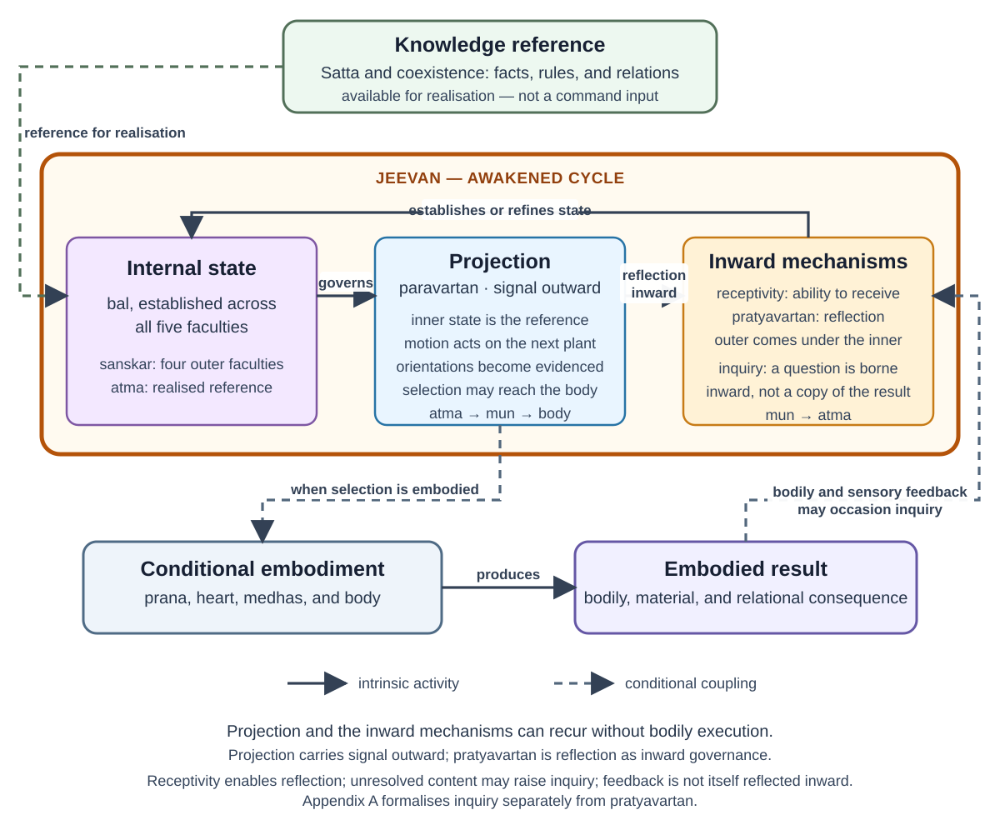

# Technical Companion: A Functional Model of *Jeevan*

**Author:** Raghava Mohan Madhwapathi ([analyticmadhyasthdarshan.org](https://analyticmadhyasthdarshan.org))

**Edited on:** August 13, 2026, 6:56 PM IST

**Status:** Internal technical companion (not a catalog entry).

**Scope:** This companion formalises the interpretation developed in [*The Activity Architecture of Jeevan*](Research-Note-Bal-Shakti-And-Activity.md). It represents the five faculties, their paired activities, acquired organisation, embodied expression, evaluation, and continuity in a precise qualitative notation. The primary texts do not state this formalism. Their direct claims, the cross-text synthesis built from them, and the remaining textual variants are kept distinct below.

The formalism is optional. It can be rejected without changing the primary-text account in the reader note or the documentary assignment of the sixty-one pairs in [*The Sixty-One Activity Pairs of Jeevan*](Research-Note-Activity-Pair-Inventory.md).

## 1. Commitments and boundaries

Four levels of claim must not be merged.

1. **Primary-text claims.** *Jeevan* is one constitutionally complete sentient atom with five faculties and ten paired activities. The activities are found in state and motion, and the detailed enumeration contains 122 activities in sixty-one pairs. Delusion, awakening, the four-and-a-half effective activities, the four values, bodily mediation, and continuity across bodily death are also stated in the primary texts.
2. **Cross-text synthesis.** The five faculties can be presented as an ordered activity architecture in which an inwardly established orientation becomes effective through the adjoining outward faculties and the body. *Sanskar* can be read as acquired organisation spanning *buddhi*, *chitta*, *vritti*, and *mun*, held in relation to realisation at *atma*.
3. **Formal commitments.** Product state spaces, time indices, partial functions, reception predicates, ordered compositions, an inquiry protocol, qualitative success conditions, and a carriage relation across embodiments belong to this model alone.
4. **Unsettled matters.** The relation between state–motion and projection–reflection, the operation of the *jeevan*–body connection, the exact scope of *sanskar*, and the provenance of an orally reported twelvefold practical schema remain open.

The model concerns *jeevan*, not *satta*. Omnipresence is actionless Knowledge and the reality with which understanding is to agree. The sources nevertheless call it the basis and source of inspiration for activity, with inspiration inherent through saturation (MVD, pp. 35–36, 174). The formalism represents that standing availability as a reference rather than inventing an acting source of instructions. The body is also outside the modelled state of *jeevan*. It is the temporary embodied medium through which selection becomes conduct and bodily, material, and relational consequences become available for evaluation (MVD, pp. 199–205).

## 2. Faculty-wise state and activity

Let the ordered set of faculties be

$$
\mathcal{F}=\{a,b,c,v,m\}
:=\{\textit{atma},\textit{buddhi},\textit{chitta},\textit{vritti},\textit{mun}\}.
$$

Let $\mathcal{F}_{\mathrm{out}}=\{b,c,v,m\}$ and define the adjoining inward faculty by

$$
\operatorname{in}(b)=a,\quad
\operatorname{in}(c)=b,\quad
\operatorname{in}(v)=c,\quad
\operatorname{in}(m)=v.
$$

Each faculty $f\in\mathcal{F}$ is assigned a qualitative state space $\mathcal{X}(f)$. The state of *jeevan* is represented analytically as

$$
\mathcal{X}(J)
:=\mathcal{X}(a)\times\mathcal{X}(b)\times
\mathcal{X}(c)\times\mathcal{X}(v)\times\mathcal{X}(m),
$$

$$
X(J,t)=\bigl(x(a,t),x(b,t),x(c,t),x(v,t),x(m,t)\bigr).
$$

The product notation does not divide *jeevan* into five agents or spatial stores. It records the distinct activity attributed to each faculty within one indivisible unit.

### 2.1 Acquired and presently active organisation

The sources locate the attained awakening called *sanskar* in *mun*, *vritti*, *chitta*, and *buddhi* while placing realisation at *atma* (MVD, pp. 121, 315, 323). The model therefore lets

$$
\mathcal{F}_{\mathrm{acq}}=\{b,c,v,m\}
$$

and represents each outer coordinate as an enduring acquired aspect $s(f,t)$ together with a presently active aspect $q(f,t)$:

$$
x(f,t)=\bigl(s(f,t),q(f,t)\bigr)
\quad(f\in\mathcal{F}_{\mathrm{acq}}),
\qquad
x(a,t)=q(a,t).
$$

Thus

$$
S(J,t)=\bigl(s(b,t),s(c,t),s(v,t),s(m,t)\bigr),
\qquad
Q(J,t)=\bigl(q(a,t),q(b,t),q(c,t),q(v,t),q(m,t)\bigr).
$$

$S$ and $Q$ are analytical aspects, not two stores. Restricting acquired organisation to four faculties is a reading of the passages, not an explicit storage theory. A formulation in which awakening of the four implicitly includes a transformed relation to *atma* remains compatible with the sources.

### 2.2 The paired activities

Let $B_f$ denote the activity classified as *bal* in the tabulated activity-level enumeration:

$$
\begin{aligned}
B_a&=\textit{anubhav},&
B_b&=\textit{bodh},&
B_c&=\textit{chintan},\\
B_v&=\textit{tulan},&
B_m&=\textit{asvadan}.
\end{aligned}
$$

Let $P_f$ denote its paired *shakti* activity:

$$
\begin{aligned}
P_a&=\textit{pramanikta},&
P_b&=\textit{sankalp},&
P_c&=\textit{chitran},\\
P_v&=\textit{vishleshan},&
P_m&=\textit{chayan}.
\end{aligned}
$$

The activity-level assignment is directly tabulated in AVD, pp. 91–94, and the ordering agrees with every paired heading in MVD, pp. 328–348. Interpreting $B_f$ as an established qualitative state and $P_f$ as its outward efficacy is the model's functional reading. These symbols name activities; they are not functions.

The realisation-based dependency order is represented as

$$
\mathbf{B}_{\mathrm{out}}
=\langle B_a,B_b,B_c,B_v,B_m\rangle,
$$

corresponding to

$$
\textit{anubhav}\rightarrow\textit{bodh}\rightarrow
\textit{chintan}\rightarrow\textit{tulan}\rightarrow\textit{asvadan}.
$$

The paired activities that make this organisation effective outward are ordered as

$$
\mathbf{P}_{\mathrm{out}}
=\langle P_a,P_b,P_c,P_v,P_m\rangle.
$$

The angle brackets record order and dependence, not composition or conversion. Realisation does not turn into enlightenment as one substance becoming another; each faculty performs its own activity in relation to the orientation available from the faculty inward of it.

The independence of these ordered paths from the direction terms *paravartan* and *pratyavartan* is a hypothesis. AVD places the *bal* activities under *pratyavartan* and the *shakti* activities under *paravartan*, while MVD, pp. 276–277, orders the state activities outward in the realisation-based way. The model keeps the tension explicit rather than treating either arrangement as a settled identity.

### 2.3 Symbols used below

Let $T$ be the set of time indices within an embodied life. For $f\in\mathcal{F}$, $\mathcal{C}(f)$ denotes contents or orientations available at $f$, $\gamma_f(t)\in\mathcal{C}(f)$ the manifest orientation at time $t$, and $\mathcal{I}(f)$ inquiries borne at $f$. Let $\mathcal{S}_J$ and $\mathcal{Q}_J$ be the respective ranges of $S(J,t)$ and $Q(J,t)$, and $\mathcal{Q}_{\mathrm{pass}}$ the possible results of a completed inquiry pass. $\mathcal{Y}$ denotes observable embodied consequences, $\mathcal{P}_{\mathrm{body}}$ possibilities selected for bodily expression, $\mathcal{B}_{\mathrm{gross}}$ bodily states, $\mathcal{E}_{\mathrm{field}}$ surrounding conditions, and $\Gamma$ the relevant context of relationship, bodily condition, means, and circumstance.

§§2–8 suppress the embodied-life index; §9 restores it. Thus $X(J,n,t)$, $S(J,n,t)$, and $Q(J,n,t)$ are the same quantities for life $n$ at time $t$, not functions of a different arity.

## 3. Receptivity and reflective accord

An outer faculty does not become consonant with the one inward of it merely because an indication is available. The four reception conditions and their social or educative supports are set out in the [reader note](Research-Note-Bal-Shakti-And-Activity.md) §3.2 (MVD, pp. 282–286).

For $f\in\mathcal{F}_{\mathrm{out}}$, define

$$
r:\mathcal{F}_{\mathrm{out}}\times T\longrightarrow\{\top,\bot\}.
$$

$r(f,t)=\top$ means that the stated absence-condition at $f$ is sufficiently met for $f$ to receive the orientation of $\operatorname{in}(f)$ at $t$. This is a binary modelling simplification. The passages describe success and failure, while receptivity elsewhere admits of extent; a graded account may ultimately be required (MVD, pp. 142, 248, 284).

This predicate is not identified with an inward use of the pair-member $P_f$. The primary text states that internal regulation of *jeevan*'s powers produces the ability to receive; it does not state that resolve, visualisation, analysis, or selection is itself reversed or supplied with a direction parameter.

For each outer faculty, let $\operatorname{Accord}_f\subseteq\mathcal{C}(f)\times\mathcal{C}(\operatorname{in}(f))$ be the model's qualitative relation “according to the adjoining inward orientation.” Reflective accord is represented by

$$
\Pi(f,t)=\top
\iff
r(f,t)=\top
\ \land\
\operatorname{Accord}_f\bigl(\gamma_f(t),\gamma_{\operatorname{in}(f)}(t)\bigr).
$$

Full directional *pratyavartan* is the conjunction of this accord across the four adjoining faculty relations. This formalises the directional sense adopted in the reader note; it does not exclude the recognising-and-fulfilling and understanding-and-teaching uses found elsewhere in the corpus (SB, pp. 63–64; KD §3.12, p. 110).

Three of the four conditions depend on social or educative arrangements. The effective activity of an individual *jeevan* is therefore not modelled as self-sufficient: orderliness, relationship, study, and an evidence-bearing tradition form part of the conditions under which deeper understanding becomes effective.

## 4. Embodied consequence, inquiry, and change

Let $B(t)\in\mathcal{B}_{\mathrm{gross}}$ denote the present body and $E(t)\in\mathcal{E}_{\mathrm{field}}$ the surrounding relationships, work, society, material conditions, and nature. A selected possibility $p(t)$ is made available for embodied expression:

$$
\mathsf{Express}:
\mathcal{X}(J)\times\Gamma
\rightharpoonup
\mathcal{P}_{\mathrm{body}},
$$

$$
p(t)=\mathsf{Express}\bigl(X(J,t),\chi(t)\bigr),
\qquad \chi(t)\in\Gamma,
$$

when an orientation becomes selected for bodily expression. $\mathsf{Express}$ represents the ordered contribution of resolve, visualisation, analysis, and selection without treating their activity labels as composable functions. Embodied change and its observable consequence are represented by

$$
\mathcal{G}:
\mathcal{B}_{\mathrm{gross}}\times\mathcal{E}_{\mathrm{field}}
\times\mathcal{P}_{\mathrm{body}}
\longrightarrow
\mathcal{B}_{\mathrm{gross}}\times\mathcal{E}_{\mathrm{field}},
\qquad
\mathcal{H}:
\mathcal{B}_{\mathrm{gross}}\times\mathcal{E}_{\mathrm{field}}
\longrightarrow\mathcal{Y},
$$

$$
(B(t+1),E(t+1))
:=\mathcal{G}(B(t),E(t),p(t)),
$$

$$
y(t+1)=\mathcal{H}(B(t+1),E(t+1)).
$$

$\mathcal{G}$ includes speech, bodily execution, work, interaction, and material change. $\mathcal{H}$ makes bodily condition, performed action, material result, and another person's response available for evaluation. The source passages name bodily waves, *prana*, heart, *medhas*, cognitive and work organs, behaviour, and gratification, but do not supply one serial mechanism joining them (MVD, pp. 199–205).

### 4.1 A proposed inquiry protocol

The sources place curiosity in *mun*, describe *samvahan* as bearing inquiry, and connect study with the learner's need and questions (MVD, pp. 77–78, 248, 313–314, 344). They also give a developmental sequence from curiosity in *mun* through enthusiasm in *vritti*, delight in *chitta*, elation and immersion in *buddhi*, and realisation in *atma* (MVD, pp. 77–78). That sequence concerns the inward regulation of energies toward awakening; it is not the consequence-to-question protocol below. The texts do not give this protocol, which is introduced only to distinguish consequence, question, understanding, and reflective accord.

An embodied consequence may occasion an inquiry:

$$
\mathsf{Occ}:\mathcal{Y}\times\mathcal{X}(J)
\rightharpoonup\mathcal{I}(m).
$$

When $\mathsf{Occ}$ is undefined, no question follows from that consequence. When it is defined, an inquiry may be borne toward an inward faculty:

$$
\mathsf{Bear}(f):
\mathcal{I}(f)\longrightarrow\mathcal{I}(\operatorname{in}(f)).
$$

An inward faculty may make an answer available from its current organisation,

$$
\mathsf{Answer}(f):
\mathcal{X}(\operatorname{in}(f))
\times\mathcal{I}(\operatorname{in}(f))
\rightharpoonup\mathcal{C}(f),
$$

and the outer faculty may take that content up:

$$
\mathsf{Uptake}(f):
\mathcal{X}(f)\times\mathcal{C}(f)\times T
\rightharpoonup\mathcal{X}(f).
$$

The uptake map is defined only where reception is available:

$$
\mathsf{Uptake}(f)(x,\gamma,t)\downarrow
\Longrightarrow
r(f,t)=\top.
$$

Reception and change are separate. A question may remain unanswered; an answer may be heard without changing the outer faculty; a passing thought need not become enduring *sanskar*. When bearing, answering, and uptake are all defined, their result is denoted $\mathcal{Q}(t)\in\mathcal{Q}_{\mathrm{pass}}$. If uptake makes $\gamma_f(t)$ accord with the adjoining inward orientation, then $\Pi(f,t)=\top$; neither $\mathcal{Q}(t)$ nor a bodily consequence is itself the definition of *pratyavartan*.

Let the two analytical update maps be

$$
\mathcal{U}^{Q}:
\mathcal{Q}_J\times\mathcal{Q}_{\mathrm{pass}}\times\mathcal{S}_J
\longrightarrow\mathcal{Q}_J,
\qquad
\mathcal{U}^{S}:
\mathcal{S}_J\times\mathcal{Q}_{\mathrm{pass}}
\rightharpoonup\mathcal{S}_J.
$$

Present activity and enduring organisation may then be represented as

$$
Q(J,t+1)
:=\mathcal{U}^{Q}\bigl(Q(J,t),\mathcal{Q}(t),S(J,t)\bigr),
$$

$$
S(J,t+1)=
\mathcal{U}^{S}\bigl(S(J,t),\mathcal{Q}(t)\bigr)
\quad\text{when uptake occurs and the content is assimilated}.
$$

The stronger printed learning sequence should govern interpretation of these symbols: realisation-oriented conceptions in *buddhi* become thought and action, and thoughts arising through action are instilled again as *sanskar* through inference (MVD, p. 218). The formal protocol must not replace that source-grounded account.

## 5. Correctness, incompleteness, and evidence

The model treats *bodh* and *anubhav* as success terms rather than fallible estimates. Let $K$ denote reality as the Knowledge-reference, and let $\operatorname{Agree}(x,K)$ be the model's qualitative agreement relation between a candidate content $x$ and that reference:

$$
\mathsf{Bodh}:\mathcal{X}(c)\rightharpoonup\mathcal{X}(b),
\qquad
\mathsf{Bodh}(x_c)\downarrow
\Longrightarrow
\operatorname{Agree}(x_c,K)=\top,
\quad x_c\in\mathcal{X}(c),
$$

$$
\mathsf{Anubhav}:\mathcal{X}(b)\rightharpoonup\mathcal{X}(a),
\qquad
\mathsf{Anubhav}(x_b)\downarrow
\Longrightarrow
\operatorname{Agree}(x_b,K)=\top,
\quad x_b\in\mathcal{X}(b).
$$

If agreement is absent, the candidate remains assumption, judgment, or unresolved meaning rather than becoming incorrect *bodh* or *anubhav*. This is a formal interpretation of the success vocabulary, not a source formula. The condition of a perturbed or unenlightened *buddhi* is represented by the functions being undefined for the content, not by a false result.

Incompleteness may concern subject matter, coordination, or evidence. Let $\mathcal{D}$ be the domain of subject matters considered by the model, and let $\Delta(b)$ and $\Delta(a)$ be the subdomains for which enlightenment and realisation are effective:

$$
\Delta(a)\subseteq\Delta(b)\subseteq\mathcal{D}.
$$

The inclusions and the domain model are analytical. They allow incomplete reach without introducing partly false realisation.

Knowledge is not complete in the model merely because an inner state is coherent. It must become intelligible, directive in activity, embodied competently, evaluated in relationship, and conveyable to another. This requirement follows the primary evidence chain from realisation through behaviour, experiment, and awakened tradition (MVD, p. 12; JV, p. 26).

## 6. Values and two qualitative judgments

Let $A(f,t)$ hold when immersion is present at $f\in\{b,c,v,m\}$:

$$
A:\{b,c,v,m\}\times T\longrightarrow\{\top,\bot\}.
$$

When $A(f,t)=\top$, the value is named by the faculty:

$$
\operatorname{Value}(b)=\textit{bliss},\quad
\operatorname{Value}(c)=\textit{contentment},\quad
\operatorname{Value}(v)=\textit{peace},\quad
\operatorname{Value}(m)=\textit{happiness}.
$$

Let $H(f,\operatorname{in}(f),t)$ denote qualitative concurrence between adjoining faculties. It is a relation assessed at a time, not the embodied-consequence map $\mathcal{H}$ of §4. The correspondence between immersion and adjoining concurrence is represented as

$$
A(f,t)=\top
\iff
H\bigl(f,\operatorname{in}(f),t\bigr)=\top.
$$

The sources give both formulations and their term-for-term correspondence; the biconditional is the model's logical sharpening (MVD, pp. 307, 327).

Discord is represented by the failure of one or more such relations. The thirst for restfulness is present when at least one remains unresolved:

$$
\operatorname{Trisha}(t)=\top
\iff
\exists f\in\{b,c,v,m\}:\neg A(f,t).
$$

An embodied result requires a second judgment. For the accepted relationship and purpose $\rho(t)$ and the requirement of mutual fulfilment $\mu(t)$, define

$$
\mathcal{E}_{K,\rho(t),\mu(t)}:
\mathcal{Y}
\longrightarrow
\{\text{agreement},\text{unresolved},\text{contradiction}\},
$$

$$
e(t+1)
:=\mathcal{E}_{K,\rho(t),\mu(t)}\bigl(y(t+1)\bigr).
$$

Successful activity is represented as

$$
\Phi(t)
:=\Bigl(\bigwedge_{f\in\{b,c,v,m\}}A(f,t)\Bigr)
\land M(t),
$$

with $M(t)$ denoting mutual fulfilment in embodied relationship. This guards against treating inward concurrence, correct intention, pleasure, or unilateral advantage as sufficient evidence.

## 7. Modes and effective depth

Let $\mathcal{F}^{\mathrm{eff}}(t)\subseteq\mathcal{F}$ contain the faculties effectively participating in the present activity. Delusion is directly described through four and a half effective activities: selection and taste in *mun*, analysis and deliberation restricted to pleasure, health, and profit in *vritti*, and visualisation in *chitta* (MVD, pp. 79, 89; JV, pp. 73–74; AVD, p. 152).

The model represents this shallow depth without inserting effective *bodh* or *anubhav*:

$$
\mathcal{F}^{\mathrm{eff}}(t)=\{c,v,m\}.
$$

Partially awakened, half-awakened, and awakened statuses are represented by progressively deeper effective participation. Their source-given faculty relations are tabulated in the [reader note](Research-Note-Bal-Shakti-And-Activity.md) §4.2; representing them as one formal transition sequence would go beyond the passages (MVD, pp. 278–279).

The union of *vritti* and *mun* alone is associated with sleep or dream, where imagination is not evidenced in work and behaviour (MVD, p. 279). It supplies a directly stated shallow case of recurrent activity without present bodily execution; extending that possibility to a complete five-faculty recurrence is a model hypothesis.

The fraction in “four and a half” concerns the restricted jurisdiction of *tulan*: pleasantness, health, and profit operate, while justice, *dharma*, and truth do not yet govern. Visualisation remains effective but necessarily carries excess, deficiency, or omission without enlightenment in truth (MVD, p. 286). The sources do not settle whether that flaw is part of the fraction or a second description of deluded *chitran*.

## 8. Pair-level semantics

The sixty-one *bal–shakti* assignments are documentary facts of AVD, pp. 91–94, confirmed by the dyad order in MVD, pp. 328–348. A functional schema for a pair $j$ belonging to faculty $f$ may be written

$$
\operatorname{Pair}(f,j)
=\bigl(B_{f,j},P_{f,j},R_{f,j},C_{f,j},E_{f,j}\bigr),
$$

where $B$ is the established member, $P$ its paired motion member, $R$ the reality or relationship involved, $C$ a governing criterion where stated, and $E$ an evidential result where stated. The sources do not provide all five fields for every pair, so this is a research template rather than a recovered specification.

No single relation connects all sixty-one pairs. The following families are analytical groupings rather than source headings:

- accepted states paired with readiness for projection, most clearly in *buddhi*;
- held conditions paired with outward evidence, including *santosh–shree*, *svayatta–samriddhi*, *sukh–sfoorti*, *hita–svasthya*, and *tushti–pushti*;
- relationships paired with an associated value, responsibility, inquiry, or form of progress;
- an act paired with its object, as in *nireekshan–guna* and *ruchi–pehchan*;
- sensory qualities paired with varied correlates such as bearing, nourishing, respiration, or affinity; and
- residual category pairs that do not establish a directional relation.

The source columns rather than these families govern assignment. The unpaired glossary's statement that *medha* bears *kala* is not imported into the paired definitions; that cross-list variant and the complete documentary evidence belong in [the pair inventory](Research-Note-Activity-Pair-Inventory.md) §8.

## 9. Continuity and observability

Index embodied lives by $n$ and let $t^{\mathrm{death}}$ end the current bodily association. Let $\sqsubseteq$ denote that established organisation is carried forward without specifying whether every aspect is preserved:

$$
S(J,n,t^{\mathrm{death}-})
\sqsubseteq
S(J,n+1,0),
\qquad
B(n+1)\not\equiv B(n).
$$

The sources state continuity of *jeevan*, later association with a body, continuation of attained understanding and satisfaction, and bodily association from about the fourth or fifth month of pregnancy (JV, pp. 20, 55, 77, 94). Acceptances toward completeness and knowledge, wisdom, and science moving toward resolution are said to be carried forward as *prarabdh*; *prarabdh* also names what remains between knowing, desiring, doing, and undergoing (MVD, pp. 90–91). Neither formulation gives a body-matching rule. The passages do not state this carriage relation, identify its coordinates, or establish equality.

The interval without a gross body is not inactive: subtle activities are said to occur according to the indication of *buddhi* (KD, p. 31). The carriage relation spans that interval without specifying which subtle activities occur, how they alter established organisation, or how later bodily association follows.

Later conduct may be represented as

$$
o(n+1,t)
:=\mathcal{O}\bigl(
S(J,n+1,t),Q(J,n+1,t),B(n+1,t),E(n+1,t)
\bigr).
$$

The inverse is non-unique. Similar conduct can arise from different combinations of carried organisation, present education, bodily condition, relationships, circumstances, and current selection. Conduct can evidence operative organisation but cannot by itself identify which part arose before the present body.

This caution is strengthened by the unresolved *sanskar* variant. One passage calls delusion under animal consciousness *kusanskar*; another says wrongs are not accepted and therefore do not become *sanskar* (MVD, pp. 94, 315; JV, pp. 49–50). What is carried under either formulation is not yet settled.

## 10. Worked example: a family-resource decision

The [reader note](Research-Note-Bal-Shakti-And-Activity.md) §3.3 describes disagreement over the use of family resources. In the formal notation, $\chi(t)$ includes the relationship, competing needs, bodily conditions, available means, and the criterion of just fulfilment. The current organisation of the five faculties and that context may yield a bodily possibility:

$$
p(t)=\mathsf{Express}\bigl(X(J,t),\chi(t)\bigr).
$$

Its performance changes body and field through $\mathcal{G}$, and $\mathcal{H}$ makes the resulting material use and relational response available as $y(t+1)$. The qualitative judgment $e(t+1)$ then asks whether the result agrees with the relationship, mutual fulfilment, and the Knowledge-reference. If contradiction occasions a question, $\mathsf{Occ}$, $\mathsf{Bear}$, $\mathsf{Answer}$, and reception-constrained $\mathsf{Uptake}$ represent the possible inquiry pass; assimilation may update $S(J,t)$.

This instantiation does not imply that ordinary decisions traverse consciously reportable stages. It shows only how context, expression, consequence, evaluation, inquiry, and lasting change remain distinct in the model.

## 11. Diagnostic distinctions

The model separates failures that would otherwise be grouped under “lack of knowledge.”

- **Criterion inversion:** a sensory or material criterion is treated as final, so repeated pursuit continues without stable satisfaction.
- **Information without assimilation:** terminology is remembered but does not govern valuation, deliberation, selection, or conduct.
- **Repetition under an inadequate criterion:** skill or habit grows without qualitative awakening.
- **Meaning error:** an attractive representation does not preserve the recognised relationship or purpose.
- **Definiteness without resolve:** a principle is verbally accepted but does not organise action.
- **Resolve without competence:** the understood aim is not fulfilled because planning, bodily capacity, skill, or means are inadequate.
- **Unilateral evaluation:** intention or personal advantage is taken as evidence without mutual satisfaction.
- **Inquiry not raised:** contradiction remains stable because no question is formed.
- **Indication available but not received:** the stated condition of receptivity is absent.
- **Shallow uptake:** a question or answer alters present thought without becoming stable orientation or conduct.
- **Perturbation at a faculty:** its own operation is treated as supreme when it is not in accord with the faculty inward of it.
- **Downstream perturbation:** unresolved causal or subtle activity appears in *chitta*, *vritti*, *mun*, *prana*, body, work, or behaviour without identifying one linear cause (MVD, pp. 215–217).
- **Opaque bodily mediation:** waves and named bodily stages do not yet explain why a specific sentient selection corresponds to a specific neural and bodily process.
- **Over-attribution to an earlier life:** present body, education, relationship, circumstance, and current choice are ignored.
- **Embodiment reset assumed:** later embodiment is treated as erasing established organisation even though continuity is the source claim.
- **Unsourced schema treated as architecture:** the reported twelvefold practical enumeration is used to constrain the model before its four sensory activities and source are located.

These are analytical distinctions, not clinical categories or source-given diagnostic labels.

## 12. Limits and research questions

1. **State, motion, projection, and reflection.** Can the activity-level partition and the source's directional column headings be reconciled without declaring independent axes that no passage explicitly states?
2. **Two grains of *bal* and *shakti*.** How do faculty-level strength and orientation relate to the activity-level pair, especially where one passage recognises a faculty's *bal* in both activities?
3. **Uses of projection and reflection.** How do directional movement, recognising and fulfilling, and understanding and making-understood relate?
4. **Receptivity.** Are the four absence-conditions binary, graded, or threshold descriptions of capacities that otherwise admit of degree?
5. **Inquiry.** What causes a standing thirst for understanding to become an actual question, and what source-grounded sequence replaces or constrains the proposed protocol?
6. **Body relation.** How do *prana*, heart, *medhas*, cognitive and work organs, bodily waves, and sentient content form a discriminating connection?
7. **Mutual satisfaction.** How can it be assessed without reducing it to agreement, compliance, or self-report?
8. ***Sanskar*.** Does acquired organisation exclude *atma*, and is a deluded organisation *kusanskar* or something that never became *sanskar*?
9. **Continuity.** What determines association with a particular developing body, which subtle activities occur without a gross body, how they affect established organisation, and what—if anything—is preserved without loss?
10. **Behavioural evidence.** What observations distinguish carried organisation from present learning and circumstance without circular inference?
11. **Pair specification.** Can the sixty-one pairs support a uniform functional schema when their stated relations and definitional fields differ?
12. **Constitutional counts.** Is the sequence $1+2+8+18+32$ intentionally related to the shell-capacity expression $2n^2$, or is that numerical correspondence accidental?
13. **Missing sound pair.** Why do the closing sensory pairs cover touch, temperature, taste, smell, and visible form while sound appears only inside another definition?
14. **Knowing, believing, recognising, and fulfilling.** How does this source-grounded fourfold map, if at all, to the ten activities?
15. ***Sakshatkar*.** Does it name *chintan* under another aspect or the success of study at *chitta*?
16. **The oral twelvefold.** Where is the reported enumeration of four bodily propensities, four sensory activities, three *eshanas*, and *upakar* recorded? Until the four sensory activities and the complete set are sourced, it should not constrain the formal state.

## 13. Textual variants and excluded schemas

### 13.1 Uses of *avartan*, projection, and reflection

At MVD, p. 275, *avartan kriya* names the combined form of reflection and projection, the awakened *jeevan* cycle. At p. 291, the wording presents projection and reflection as the activities whose effects must be understood to avoid mysteriousness and decline. Insentient nature is also distinguished as having projection alone, while sentient nature has both projection and reflection (SB, p. 60). Projection and reflection elsewhere distinguish sensory recognition of form and properties from recognition of value, essential nature, *dharma*, and existence (SB, pp. 63–64), while another passage names understanding as reflection and making-understood as projection (KD §3.12, p. 110). The directional account formalised in §3 is therefore one source-supported use rather than an exclusive corpus-wide definition.

### 13.2 Faculty locations and adjoining relations

Hope, thought, desire, resoluteness, and evidence are located at faculties in some passages and at the relations between body, *mun*, *vritti*, *chitta*, *buddhi*, and *atma* in another (MVD, pp. 275–276; AVD, p. 91). The model uses faculty coordinates for tractability. Awareness (*pratiti*), comprehension (*aabhas*), and perception (*bhas*) at three adjoining relations are retained in the reader account rather than introduced as extra coordinates (MVD, pp. 99–100).

### 13.3 *Sanskar*, *sakshatkar*, and overlapping vocabulary

The four-faculty placement in §2.1 follows attained awakening in *mun*, *vritti*, *chitta*, and *buddhi* (MVD, p. 121). Delusion under animal consciousness is called *kusanskar* in one formulation, while another holds that wrongs are not accepted and therefore do not become *sanskar* (MVD, pp. 94, 315; JV, pp. 49–50). *Sakshatkar* appears where study reaches *chitta* and as realisation-based contemplation of enlightenment and resolve, overlapping the locus of *chintan* without establishing a separate faculty stage (MVD, pp. 99, 126).

*Medhas* names neural mediation, while *medha* is an activity of *chitta* associated with bearing memory and art (MVD, pp. 200, 330). *Samvedna* names sensitivity in one account and a detailed activity of *vritti* in another (MVD, pp. 273, 337). Sensing, enquiring, protecting, enlightening, adhering, and reflecting are also listed as sentient specialties; several concern inquiry, teaching, mutual resolution, protection, and human relationship rather than internal traffic among faculties (MVD, pp. 313–314).

### 13.4 Documentary and oral exclusions

The flat glossary at MVD, pp. 323–326, and the paired definitions at pp. 328–348 are not identical. Their variants, the eight dimensions of visualisation, and the missing sound pair are documented in [the pair inventory](Research-Note-Activity-Pair-Inventory.md) §8 rather than merged into the formal state. The reported twelvefold practical schema—four bodily propensities, four sensory activities, three *eshanas*, and *upakar*—remains excluded because no located source enumerates the twelve or names the four sensory activities.

## References

- **AVD** — A. Nagraj, [*Adhyatmvad*](../../References/Madhyasth-Darshan/AVD-Adhyatmvad.docx.pdf), tr. Sanjeev Chopra (work in progress). Cited: five faculties and orientations, activity-level *bal–shakti* columns, and the sixty-one-pair decomposition (pp. 91–94, 151–152; §§2, 7, 8, 12–13).
- **JV** — A. Nagraj, [*Jeevan Vidya: An Introduction*](../../References/Madhyasth-Darshan/JV-Jeevan-Vidya-An-Introduction.md), tr. Rakesh Gupta. Cited: continuity across bodily death, later embodiment, state and motion, the four-and-a-half activities, continued understanding, and association during pregnancy (pp. 20, 40, 49–50, 55, 62, 73–77, 94; §§1, 7, 9, 12).
- **KD** — A. Nagraj, [*Manav Karm Darshan*, working English rendering](../../References/Madhyasth-Darshan/KD-Karm-Darshan-English/KD-Karm-Darshan-English.pdf). Cited: subtle activity without a gross body (p. 31; §§9, 12); understanding and making-understood as reflection and projection (§3.12, p. 110; §§3, 12–13).
- **MVD** — A. Nagraj, [*Madhyasth Darshan — Co-existentialism*](../../References/Madhyasth-Darshan/MVD-Madhyasth-Darshan-Coexistentialism.md), tr. Rakesh Gupta. Cited: the evidence chain (p. 12; §5); actionless Knowledge, inspiration, and the law sequence (pp. 35–36, 174; §1); the developmental inquiry sequence (pp. 77–78; §4); faculty constitution, the four-and-a-half activities, and *prarabdh* (pp. 78–79, 89–91; §§1, 7, 9); adjoining awareness terms, *sakshatkar*, *sanskar*, and variants (pp. 94, 99–100, 121, 126, 218, 315; §§2, 4, 9, 12–13); receptivity in degree and the bearing of inquiry (pp. 142, 248; §§3–4); bodily mediation and perturbation (pp. 199–205, 215–217; §§1, 4, 11–13); the directional cycle, dream, operating statuses, receptivity, and values (pp. 275–291, 307, 327; §§2–7, 13); sentient specialties and overlapping terms (pp. 313–314, 330, 337; §§4, 13); the ten and 122 activities (pp. 323–348; §§1, 2, 8, 12–13).
- **SB** — A. Nagraj, [*Samadhanatmak Bhautikvad*](../../References/Madhyasth-Darshan/SB-Samadhanatmak-Bhautikvad.md), tr. Rakesh Gupta. Cited: projection alone in insentient nature and projection with reflection in sentient nature (p. 60; §13); projection and reflection in recognising and fulfilling and the faculty-level/activity-level *bal–shakti* usages (pp. 63–64, 80, 139; §§2, 3, 12–13).

### Related notes

- [*The Activity Architecture of Jeevan*](Research-Note-Bal-Shakti-And-Activity.md) — reader-facing account and source-status audit.
- [*The Sixty-One Activity Pairs of Jeevan*](Research-Note-Activity-Pair-Inventory.md) — pair-by-pair documentary inventory.
- [*The Epistemology of Coexistence*](The-Epistemology-of-Coexistence.md) — broader epistemological study.
