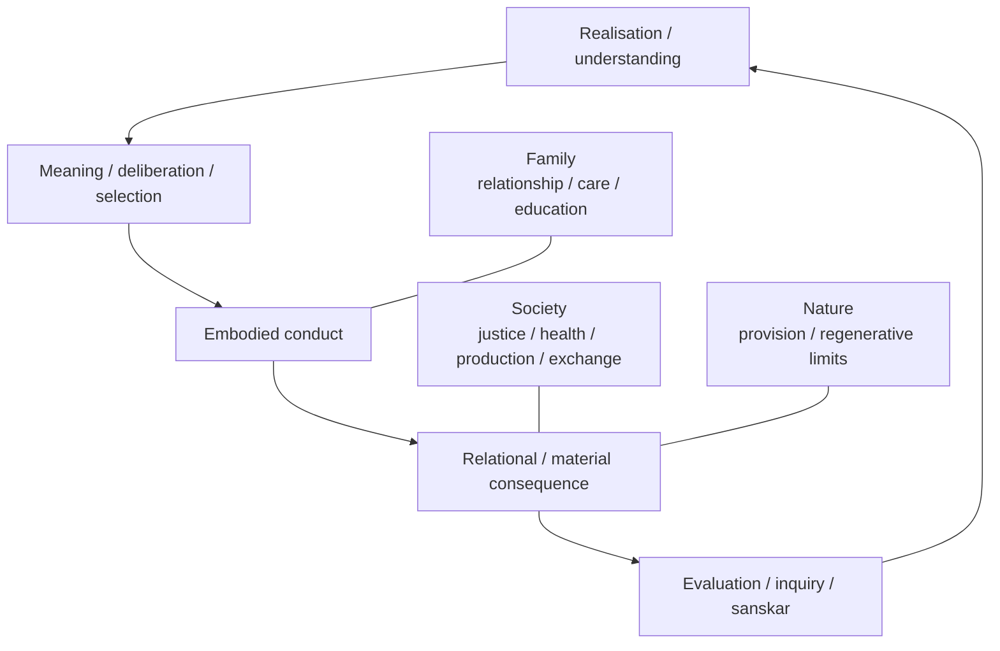

# Research Note: From the Activity Architecture of *Jeevan* to Universal Human Order

**Author:** Raghava Mohan Madhwapathi ([analyticmadhyasthdarshan.org](https://analyticmadhyasthdarshan.org))

**Edited on:** August 14, 2026, 12:02 PM IST

**Status:** Internal research note (not a catalog entry). Compiled to support [*The Epistemology of Coexistence*](The-Epistemology-of-Coexistence.md).

**Scope:** This note asks what follows for family, society, education, science, work, production, exchange, and governance if Madhyasth Darshan's account of *jeevan* is accepted. It begins with the five faculties, ten generic activities, and sixty-one pairs or 122 detailed activities; identifies the embodied and social conditions under which they can become effectively ordered; and derives the functional requirements of a universal human order. It distinguishes those requirements from particular household forms, technologies, property systems, or administrative designs that the activity architecture does not by itself determine.

Madhyasth Darshan holds that every human being is the joint form of a constitutionally complete sentient *jeevan* and a physicochemical body. The constitution of *jeevan* is the same in every human: *atma*, *buddhi*, *chitta*, *vritti*, and *mun*, with their ten generic and 122 detailed activities. Bodies, skills, languages, circumstances, and acquired *sanskar* differ, but the capacity for realisation, understanding, contemplation, deliberation, valuation, choice, relationship, and evidence does not belong to one culture or class of humans alone.

This common architecture supports a universal social conclusion, but not by a direct move from five faculties to one prescribed institution. The architecture first establishes the human aim and the form of awakened activity. The human joint form then establishes the need for bodily means, work, and material consequence. Relationship and evaluation establish the need for mutuality and public evidence. Learning and *sanskar* establish the need for an intergenerational environment. From these together follows an ecology of awakening: family as the first sustained field of relationship, need, education, work, and evaluation; society as the wider coordination of education, justice, health, production, and exchange; and universal orderliness as participation open to every human on the same basis.

## 1. The form and limit of the derivation

The aim is *vishram*, restfulness: freedom from contradiction and unhappiness while activity continues, rather than inactivity or withdrawal. Restfulness becomes effective when the outer faculties accord with the faculties inward of them. Taste and selection in *mun* become consonant with deliberation in *vritti*; deliberation and analysis become consonant with contemplation in *chitta*; contemplation and visualisation become consonant with enlightenment in *buddhi*; and enlightenment and resolve become consonant with realisation in *atma*. Happiness, peace, contentment, and bliss name the harmonies of the four adjoining relations (MVD, pp. 68, 275–277, 307, 327; JV, p. 138).

This inward consonance does not complete the human claim by remaining inward. Authenticity is realised understanding becoming evident. Resolve, visualisation, analysis, and selection become embodied through speech, behaviour, skill, work, use of resources, and participation. Their effects return as bodily condition, another person's response, relationship-fulfilment or contradiction, material result, and ecological consequence. These are evaluated, can occasion inquiry, and can become lasting *sanskar*. The evidence chain therefore runs from realisation to understanding, resolution, work and behaviour, and an awakened human tradition (MVD, p. 12).

The activity architecture consequently supports three necessities. It requires an **environment of development**, because receptivity and *sanskar* depend upon orderliness, relationship, study, practice, and an evidence-bearing tradition. It requires an **environment of expression**, because understanding must become competent embodied work and behaviour. It requires an **environment of correction**, because consequences must remain available for evaluation, inquiry, and revision. An arrangement that supplies information but prevents expression, supplies work but suppresses evaluation, or permits choice while systematically rewarding injustice cannot support the complete cycle.

Family and society enter through these necessities. They are not additional organs of *jeevan*, and a family or institution does not become a larger sentient unit. They are durable arrangements among persons through which the activities of each *jeevan* can be educated, expressed, evaluated, corrected, and carried into tradition. The derivation is therefore functional and conditional: if restfulness is the aim, if its evidence is complete conduct, and if every human has the same activity architecture, then the arrangements that make complete conduct possible must be universally available.

## 2. The 122 activities and the meaning of complete functioning

The five faculties bear ten generic activities. Their detailed contents are enumerated as sixty-one pairs and 122 activities:

$$
2\times(1+2+8+18+32)=122.
$$

| Faculty | Generic pair | Pairs | Activities | Institutional significance |
|---|---|---:|---:|---|
| *Atma* | Realisation–authenticity | 1 | 2 | Understanding must be allowed to become truthful evidence rather than remain a private assertion. |
| *Buddhi* | Enlightenment–resolve | 2 | 4 | Education and decision must cultivate definiteness and responsible resolve rather than obedience, fear, or borrowed belief. |
| *Chitta* | Contemplation–visualisation | 8 | 16 | Meaning, explanation, imagination, design, and planning require study, cultural expression, scientific inquiry, and freedom from possessive attachment. |
| *Vritti* | Deliberation–analysis | 18 | 36 | Alternatives and consequences must be assessed through justice, *dharma*, and truth while retaining the subordinate tests of pleasure, health, and material result. |
| *Mun* | Taste–selection | 32 | 64 | Daily choices in sensation, relationship, consumption, work, and use must have humane possibilities available for selection and fulfilment. |

The counts and the assignment to activity in state and activity in motion are directly tabulated in the corpus (MVD, p. 323; AVD, pp. 91–94). The sixty-one definitions do not all express one uniform relation, so the table gives a faculty-level institutional reading rather than claiming that a separate institution corresponds to every pair. The detailed inventory remains necessary before stronger pair-by-pair conclusions can be defended.

The phrase “all 122 activities functioning” also needs precision. The constitutional provision of activity is complete; awakening does not add another quantity of power. Under delusion, taste, selection, analysis, pleasure–health–profit deliberation, and visualisation already support sensation, bodily life, technical skill, imagination, and social success. What is incomplete is the effective depth, criterion, coordination, and evidential reach of activity. Complete functioning means that all 122 can become effectively ordered by realisation and understanding, operate in their proper fields, and become evident in humane conduct (MVD, pp. 79, 275–279, 323; AVD, pp. 91–94; JV, pp. 73–74).

This distinction prevents an institutional misunderstanding. Society cannot switch a constitutional activity on from outside, and no administrative arrangement can manufacture realisation. It can nevertheless obstruct or support effective functioning. An education based on fear can fill visualisation while leaving definite understanding silent. Work organised exclusively by profit can exercise analysis and selection while fixing them within lower criteria. A household ordered by domination can train skill and compliance while preventing just recognition and mutual evaluation. Conversely, study, responsible choice, competent work, transparent consequence, and relationship-fulfilment make it possible for deeper activity to become operative and observable.

## 3. The activity cycle is open to body, relationship, and environment

The activity of the human joint form is neither an isolated inward sequence nor a reaction to external stimuli. Orientation becomes selected, bodily means make expression possible, expression changes relationships and material conditions, and consequence becomes available for evaluation and inquiry. The resulting understanding or mis-evaluation contributes to later *sanskar*.

Four conditions of receptivity show why environment belongs inside this account. *Mun* receives the indication of *vritti* under absence of crime, supported by orderliness. *Vritti* receives from *chitta* under absence of injustice, supported by societal conduct. *Chitta* receives from *buddhi* under absence of attachment, supported by study and *sanskar*. *Buddhi* receives from *atma* under absence of ignorance, supported by inward regulation or *dhyan* (MVD, pp. 282–286). Three of the four explicitly involve social or educative life.

These conditions do not make society the cause of knowledge. They show that the effective activity of an embodied *jeevan* is environmentally open. A social arrangement saturated with crime, injustice, possessiveness, and ignorance repeatedly supplies contrary indications and rewards outer faculties for ignoring inward ones. A humane environment reduces those obstructions and provides study, exemplars, relationships, skills, and opportunities through which understanding can be tested. Personal awakening and social order are therefore mutually enabling without becoming identical.

The same openness appears in *sanskar*. Acquired orientation is formed through environment, study, practice, prior organisation, work, behaviour, and evaluation (MVD, pp. 90, 121, 134, 218; JV, pp. 49–50). Institutions are durable organisers of these repeated conditions. Every household, school, workplace, market, laboratory, and public body transmits some orientation through what it rewards, permits, hides, and makes exemplary. Institutional neutrality is impossible in this limited sense: even an institution that refuses explicit value education trains criteria through its actual conduct.

## 4. Why the family is the first field of awakened living

### 4.1 Stable relationship and mutual evidence

Awakened conduct requires more than one human because justice is the complete activity of recognising relationship, fulfilling its values, evaluating the fulfilment, and reaching mutual satisfaction (MVD, pp. 310–311, 336). An isolated person can examine intention but cannot alone establish whether trust, care, guidance, gratitude, respect, or responsibility was fulfilled for another. Repeated relationships are needed because fulfilment, competence, consequence, correction, and confidence develop through time.

The family is the first sustained field in which these requirements ordinarily meet. Parent–child, partner, sibling, teacher–learner, friendship, work, and orderliness relations bring together unequal bodily capacities, recurring expectations, care, learning, material use, and mutual evaluation. The same standards continue outside the household; family is first by immediacy and continuity, not a private morality exempt from the human whole (MVD, pp. 55, 61–62, 190).

This explains why family is epistemically important. A person may speak correctly about trust while failing to be trustworthy, profess care while neglecting bodily need, or declare resolution while preventing another person's evaluation. In sustained family life the distance between statement and conduct repeatedly becomes visible. The family is thus a field in which authenticity can be evidenced or contradicted, not a guarantee of awakening.

### 4.2 Intergenerational *sanskar*

Human children arrive bodily dependent and without the developed skill, language, and social recognition required for participation. Understanding cannot be inherited as a biological programme. It must become available through care, language, study, example, questioning, practice, and evaluation. Parents, teachers, educational procedure, and study must therefore align if education-*sanskar* is to support gratitude and coexistence (MVD, p. 270).

Family conduct teaches before formal explanation does. A household governed by fear, comparison, domination, or accumulation transmits those criteria even if its explicit instruction praises justice. A family living with transparent need assessment, shared responsibility, kindness in work, and openness to correction makes a different orientation available for emulation. The same mechanism transmits *kusanskar* or *susanskar*; the family is necessary as a field of transmission but qualifies as wise only through the conduct it evidences (MVD, pp. 90, 315; SB, p. 237).

### 4.3 Need, prosperity, and work

The human joint form requires food, shelter, health, protection, tools, and the material means of social participation. These are not needs of *jeevan* in the same sense as happiness, yet their reliable provision is necessary for embodied living. Need is defined relative to nourishment, protection, societal participation, and value-fulfilment, with the wise family as its assessing unit (MVD, p. 56).

The family supplies a scale at which material requirement can be related to actual persons and relationships rather than to an isolated appetite or an aggregate statistic. Prosperity is then the assurance of adequacy, materially supported by production beyond assessed need (MVD, pp. 72, 342; SB, p. 223). Surplus is not the end of work. It releases the household from insecurity and makes exchange, reserve, generosity, and purposeful use possible.

Work follows from the joint form rather than from a punishment or a purely economic contract. *Jeevan* supplies understanding, valuation, resolve, planning, and selection; the body supplies effort, skill, motion, and material transformation. Work becomes humane when it fulfils bodily and relational need, produces useful means, develops competence, remains kind in behaviour, and participates in nature's regenerative order (KD, pp. 12, 25; JV, pp. 152–153).

### 4.4 Family form and functional necessity

The activity architecture establishes the need for a stable relational, educative, material, and evaluative unit. It does not by itself establish one household composition, kinship rule, gender allocation, or legal form. The textual vocabulary names familiar relations, while also defining them by purposes such as nurturing, protection, guidance, and complementarity (JV, pp. 56, 84, 108). Adoptive, extended, single-parent, child-free, and other arrangements therefore require separate examination rather than exclusion by assumption.

What must remain invariant is functional: dependable care, recognisable responsibility, value-fulfilment, mutual evaluation, education-*sanskar*, assessed need, productive competence, and participation beyond the household. A biological or legal family that systematically defeats these functions does not become wise merely by preserving its form. Another durable arrangement cannot be dismissed merely because its form is unfamiliar if it fulfils the same human requirements. The texts do not fully settle that boundary.

## 5. From family to society and universal orderliness

No family is materially, educationally, medically, ecologically, or juridically self-sufficient. Knowledge and skill are distributed; watersheds and climates cross household boundaries; production requires tools and cooperation; injuries and disputes require protection; surplus must circulate; and each generation must enter a tradition larger than one household. The same activity cycle therefore generates requirements beyond the family.

Human organisation requires commonness of cause, goal, and programme. The cause is the contradiction and suffering produced by delusion. The goal is resolution, prosperity, fearlessness, and coexistence. The programme maintains the conditions through which these become available: education-*sanskar*, justice-security, health-restraint, production-work, and exchange-reserve (MVD, pp. 55, 253; JV, pp. 109–110, 140).

### 5.1 A five-part functional closure

The plausibility of exactly five institutional functions does not arise from repeating the number of *jeevan*'s faculties at the social scale. It arises from five distinguishable interfaces or continuities that the human activity cycle must maintain. Understanding must continue between persons and generations; present relationships must remain just and protected; the *jeevan*–body joint form must remain bodily capable; material provision must be created through work with nature; and provision must circulate among families and across time. These yield the five functions at a common level of abstraction.

| Interface or continuity | Institutional question | Function |
|---|---|---|
| *Jeevan* to *jeevan* across persons and generations | How are understanding, inquiry, competence, and *sanskar* made available and carried forward? | Education–*sanskar* |
| Human to human in present relationship | How are expectations recognised, values fulfilled, outcomes evaluated, and persons protected from harm? | Justice–security |
| *Jeevan*–body joint form | How is the body nourished, healed, trained, and kept available without making sensation the final criterion? | Health–restraint |
| Human order to the rest of nature | How are bodily effort, knowledge, tools, and natural processes joined to create useful material provision? | Production–work |
| Family to family, and present provision to future need | How are useful results circulated, shared, and preserved through differences of place, skill, season, and circumstance? | Exchange–reserve |

The five form a plausible minimal closure because removing any one leaves the cycle unable to reproduce itself. Without education there is no continuity of understanding; without justice there is no dependable mutuality; without health the body ceases to be an effective means; without production material need is unmet; and without exchange and reserve local surplus cannot answer distributed or later need. The output of the fifth function restores the material conditions under which family life, health, education, and further production can continue.

Several apparent additional functions can be placed across this basis without disappearing. Science is a method of inquiry used in education, health, production, justice, and ecological evaluation. Governance coordinates and protects all five. Ecology supplies a correctness condition on health, production, exchange, and right-use. Culture and communication carry meaning and *sanskar*; care operates through family, education, health, and justice. These may warrant separate organisations, but they do not necessarily introduce a sixth kind of institutional problem.

This is an argument for sufficiency and practical minimality at the chosen grain, not a proof of numerical uniqueness. The five can be subdivided or regrouped, and the detailed sixty-one-pair inventory has not yet been classified by institutional field. A stronger claim that the five are exhaustive would require showing that every one of the 122 activities finds an adequate field of development, expression, and correction within their joint operation, and that no activity requires a sixth irreducible function.

### 5.2 Requirements placed on the five dimensions

| Dimension | Requirement arising from the activity architecture | Character of adequate organisation | Characteristic failure |
|---|---|---|---|
| Education–*sanskar* | Understanding, receptivity, inquiry, competence, and intergenerational continuity | Proposal, study, dialogue, practice, evidence, and alignment among family, teacher, method, and lived conduct | Information, credential, authority, or belief without assimilation |
| Justice–security | Relationship-recognition, value-fulfilment, mutual evaluation, and freedom from crime and injustice | Accessible evaluation, protection from harm, restoration where possible, and responsibility answerable to affected persons | Judgment by power, fear, retaliation, or unilateral satisfaction |
| Health–restraint | A capable body and the ordering of sensation under cognisance | Nourishment, prevention, empirical care, bodily competence, and limits on addictive or excessive use | Neglect of bodily means or the elevation of pleasure and health into final ends |
| Production–work | Embodied expression, material sufficiency, skill, and ecological consequence | Production relative to assessed need, participation in useful work, kindness, right-use, and regeneration | Extraction, alienated consumption, destructive surplus, or profit as the final criterion |
| Exchange–reserve | Interdependence among families, circulation of surplus, and provision through uncertainty | Transparent exchange, assured access, appropriate reserve, non-exploitative terms, and purposeful use of surplus | Hoarding, artificial scarcity, debt dependence, speculation, or accumulation without a point of sufficiency |

### 5.3 Joint operation and organisation across scales

These dimensions are not five social replicas of the five faculties. Each dimension supports several faculties, and each faculty participates across several dimensions. Education engages all five; justice depends upon meaning, deliberation, valuation, resolve, and evidence; production requires planning and analysis as well as bodily skill; exchange requires material calculation governed by relationship and purpose. Their relevance lies in closing the whole human activity cycle, not in a one-to-one correspondence.

Family-based self-governance extends the first field of responsibility through progressively wider assemblies. Its intelligible principle is subsidiarity with a common human aim: decisions remain with the most immediate competent participants, while wider bodies address matters whose effects cross local boundaries. The exact number of tiers, their territorial boundaries, voting procedures, offices, and legal powers do not follow from the sequence of 122 activities. The texts propose a ten-tier architecture, but its administrative adequacy remains a matter for design, transition, and public evidence (MVD, pp. 18, 161, 253).

## 6. How education, science, work, and trade are constrained

### 6.1 Education as awakening rather than information transfer

Education must make it possible for every faculty to function at its effective depth. Sensory familiarity and remembered terminology are insufficient. The learner must be able to ask, examine meaning, compare alternatives, establish definiteness, resolve to act, acquire bodily competence, observe consequence, and communicate the understanding to another. Education is therefore completed in conduct and teachability, not in recall alone (MVD, pp. 248, 270, 313–314, 344; JV, p. 26).

Fear and temptation are structurally opposed to this purpose. They can produce compliance and technical performance while leaving the learner's own evaluation undeveloped. A humane educational arrangement treats the content as a proposal for study, preserves questioning, joins conceptual and practical learning, and makes teachers answerable to the conduct they invite learners to emulate. Family education and formal education must correct one another rather than transmit incompatible criteria.

### 6.2 Science as disciplined knowledge within understood purpose

Science is required wherever causal knowledge, measurement, prediction, technical construction, bodily care, and ecological consequence matter. It provides indispensable correction against wishful thinking and inherited authority. The activity architecture places such inquiry across contemplation, visualisation, deliberation, analysis, selection, embodied experiment, and evaluation. Scientific activity can therefore exercise a wide range of *jeevan*'s capacities.

Its social organisation remains incomplete when the choice of problem, funding, application, and acceptable consequence is governed only by profit, power, or sensory facility. Wisdom supplies recognition of purpose; science supplies disciplined knowledge of means and consequence. Their consonance requires open inquiry, reproducible evidence, freedom to report adverse results, evaluation of affected relationships, and ecological accounting (JV, pp. 151, 157–158).

This does not authorise social doctrine to decide scientific findings in advance. Claims about *jeevan*, the body, nature, health, or social effects retain the kind of evidence appropriate to them. Empirical claims must remain empirically corrigible, while questions of justice and human purpose cannot be settled by measurement alone. Science serves universal orderliness when it expands reliable knowledge and competence under humane ends, not when it is required to ratify a metaphysical conclusion.

### 6.3 Work and production as embodied evidence

Work is one of the principal places where resolve becomes accountable. A person may understand an aim yet fail through inadequate planning, bodily skill, tools, cooperation, timing, or knowledge of natural process. Humane work must therefore join understanding with competence. It should enable people to participate in production and care rather than divide society permanently between those who decide, those who perform, and those who merely consume.

Production is directed toward assessed need, prosperity, and right-use. Producing beyond need creates assurance and shareable surplus; production without a criterion of sufficiency turns abundance into accumulation. Ecological fit is part of correctness because material work changes soil, water, forests, organisms, energy flows, and future conditions. A result that appears profitable while destroying its regenerative basis is an analytical and evaluative failure, not successful production viewed from another department.

The architecture determines these constraints but not one occupation or technology. Agriculture, craft, care work, engineering, medicine, software, research, and administration can each participate in humane work when their result serves need, relationship, competence, and coexistence. The division of labour remains open to empirical design, provided it does not deprive participants of agency, understanding, evaluation, or a fair relation to the result.

### 6.4 Exchange and reserve as circulation of sufficiency

Families differ in resources, skill, climate, and production. Exchange is therefore necessary, but its purpose is the circulation of useful surplus and the assurance of provision. Reserve addresses uncertainty, seasonal variation, maintenance, future production, and persons who cannot presently produce. Both functions become disordered when accumulation becomes their end.

Trade must consequently remain answerable to what is exchanged, how it was produced, which needs it fulfils, whether the terms exploit dependency, and what effects follow for other families and nature. Price can coordinate information without becoming the measure of every value. Profit and loss remain legitimate material perspectives within their field, but justice, *dharma*, and truth determine whether a profitable exchange should occur at all (MVD, pp. 65–67).

The activity architecture does not settle whether humane exchange must use markets, cooperatives, mutual credit, public provisioning, gifts, or some combination. It does require transparent consequence, non-exploitation, a point of material sufficiency, and institutional means for surplus to reach right-use and purposeful-use. Those requirements provide criteria by which alternative economic designs can be compared.

### 6.5 Governance as participation and public correction

Governance is required because effects cross relationships and because delusion, incapacity, and harm remain present during transition. Its purpose is not to replace understanding with command. It protects persons and the conditions of inquiry, secures access to evaluation, coordinates shared resources, and makes institutions answerable to their stated human goal.

The movement is from external control toward responsible self-regulation, but protection cannot wait for universal awakening. Law and public institutions remain necessary where violence, exploitation, exclusion, or ecological damage must be restrained. Their humane direction is tested by whether affected people can participate, reasons and consequences remain visible, correction is possible, and authority is not converted into permanent superiority.

## 7. Happiness in all dimensions

The four *jeevan* values are not four separate pleasures to be maximised. Happiness, peace, contentment, and bliss name consonance at successive adjoining relations within *jeevan*. The four human goals name the outward fields in which awakened living becomes publicly evident: resolution in the individual, prosperity in the family, fearlessness in society, and coexistence in universal orderliness (MVD, p. 327; JV, p. 138).

| Inward achievement | Outward field of evidence | Required social condition |
|---|---|---|
| Happiness through accord of *mun* and *vritti* | Resolution in personal conduct | Choices and habits governed by understood criteria rather than sensation alone |
| Peace through accord of *vritti* and *chitta* | Resolution with prosperity in family living | Just relationships, assessed need, competent work, and mutual satisfaction |
| Contentment through accord of *chitta* and *buddhi* | Fearless participation in society | Trustworthy institutions, shared purpose, accessible justice, and freedom from domination |
| Bliss through accord of *buddhi* and *atma* | Coexistence and communication of understanding | A universal field in which authenticity, learning, and complementarity can continue without exclusion |

The outer condition does not manufacture the inward value, and private experience cannot substitute for its outward evidence. The relation is one of completion: inward consonance gives right orientation to participation, while family and society provide the fields in which that consonance is exercised, tested, and made continuous. A society that produces wealth while normalising fear cannot compensate for the failure with consumption. A peaceful household dependent upon exploitation elsewhere has not completed prosperity. A resolved individual who cannot fulfil relationships has not yet supplied the claimed evidence.

## 8. Why the resulting order is universal without being uniform

Universality begins from the same constitutional possibility in every human. No race, caste, sex, nationality, profession, language, or inherited belief owns a different kind of *atma*, *buddhi*, *chitta*, *vritti*, or *mun*. Each human can in principle understand, recognise relationship, evaluate, work, participate, and communicate understanding. Institutions that permanently reserve these functions for a superior class contradict the premise from which the social derivation begins.

What becomes universal is therefore a structure of purposes and functions:

- every person is recognised as a *jeevan*–body joint form capable of understanding;
- every family requires relationship-fulfilment, education-*sanskar*, assessed need, competence, and prosperity;
- every society requires education, justice, health, production, exchange, and means of public correction;
- every material programme remains answerable to regenerative coexistence;
- every institution is evaluated by whether it supports resolution, prosperity, fearlessness, and coexistence for all affected persons.

Uniform language, dress, ritual, cuisine, occupation, household composition, technology, and administrative procedure do not follow. Different environments may require different crops, tools, settlement patterns, reserves, and decision methods. The universal structure fixes the human purpose and the functions that must be fulfilled; plural forms remain admissible where they fulfil those functions and remain open to evaluation.

This distinction also protects universality from coercion. The commonness of *jeevan* cannot justify forcing one community's unexplained customs upon another. A universal order must make its cause, goal, programme, and evidence available for study by every participant. It succeeds through intelligibility, competence, mutual fulfilment, and correction rather than through identity, fear, or doctrinal conformity.

## 9. An adequacy test for institutions

An institution supports the complete activity of *jeevan* when its ordinary operation gives participants room to understand, resolve, act competently, observe consequence, evaluate mutually, correct error, and transmit what has been learned. This can be examined through ten questions.

1. Does the institution subordinate pleasure, health, and profit to justice, *dharma*, and truth without neglecting their legitimate fields?
2. Can participants question its explanations, purposes, and decisions without fear or exclusion?
3. Does learning become personal understanding, responsible resolve, practical skill, and communicable evidence?
4. Are the consequences of work and policy visible to the persons, relationships, communities, and natural systems that bear them?
5. Can affected persons participate in evaluation, and is mutual satisfaction distinguished from compliance or silence?
6. Does the institution develop the capacity of every participant, or preserve a permanent division between knowers, decision-makers, workers, and dependants?
7. Does its material organisation secure assessed need and prosperity without converting comparison and accumulation into endless goals?
8. Does production preserve or restore the regenerative conditions on which later production depends?
9. Can errors be acknowledged and programmes revised without threatening the institution's identity or authority?
10. Can the practice be offered to every human on the same basis, and can its method survive a change of persons through education-*sanskar*?

No single indicator answers these questions. First-person resolution, mutual relational evaluation, material sufficiency, public trust, competence, health, distribution, and ecological regeneration supply different forms of evidence. Their convergence would strengthen the claim that an arrangement supports awakened activity; their divergence identifies where further inquiry is needed.

## 10. What is established, inferred, proposed, and still open

The derivation has several evidential levels.

| Level | Claims |
|---|---|
| Directly stated | The common constitution of *jeevan*; five faculties; ten and 122 activities; restfulness as the aim; inner-to-outer accord; social and educative conditions of receptivity; work and behaviour as evidence; the four values and four human goals; the family and five dimensions of orderliness. |
| Structural inference | Awakening requires an ecology of development, expression, and correction; stable relationships are necessary for mutual evidence; institutions always shape criteria through their conduct; complete functioning means correct depth and coordination rather than added power; and the five dimensions form a plausible minimal closure of the human activity cycle at the chosen level of abstraction. |
| Institutional proposal | Wise-family need assessment; production beyond family need; family-based self-governance; a ten-tier sequence; organisation of education, justice, health, production, and exchange under one universal programme. |
| Open design and evidence | Household forms; public criteria for a wise family and mutual satisfaction; the exhaustiveness of the five-function partition; mapping of all sixty-one pairs to social fields; exact governance procedures; property and exchange mechanisms; division of labour; transition under unequal power; and empirical evaluation of institutional outcomes. |

The largest unresolved question is whether the 122 detailed activities can support a more discriminating institutional analysis. Their definitions include values, relationships, readiness for expression, acts and objects, sensory qualities, and varied correlates. Treating them as 122 identical capacities would erase precisely the content needed for derivation. A future phase should classify which pairs concern relationship, knowledge, bodily use, production, evaluation, communication, and evidence, then test whether the five social dimensions jointly provide fields for each without forcing a one-to-one mapping.

The second unresolved question concerns circular evidence. A wise family determines need, while wisdom is evidenced through the conduct that need assessment helps organise. Mutual satisfaction evidences justice, while habituation or unequal power may distort what people report as satisfaction. Public criteria must combine first-person report with relationship purpose, material consequence, freedom from coercion, third-party effects, and the possibility of revision.

The third concerns transition. Institutions populated by partially awakened people cannot assume the very understanding they are meant to help make available. Protective law, transparent procedure, distributed power, scientific measurement, and plural participation remain necessary while education and self-regulation develop. Family-based orderliness must therefore be able to correct harmful families and institutions, not merely reproduce their authority at larger scales.

## 11. Conclusion

Knowledge of *jeevan* yields a social architecture when the entire human process is retained. The five faculties and 122 activities establish a universal capacity for understanding and conduct. The body establishes material need, skill, work, and consequence. Relationship establishes justice and mutual evidence. *Sanskar* establishes the need for an intergenerational environment. Ecological participation establishes limits on production and use. The five institutional functions close these requirements by maintaining the continuity of understanding, present relational justice, bodily capability, creation of material provision, and circulation of provision across families and time. Together they require stable family life, humane education, purpose-governed science, competent and regenerative work, non-exploitative exchange, accessible justice, bodily care, and institutions open to public correction.

The universal result is not one culture enlarged to world scale. It is a shared functional order in which every human can develop and evidence the same constitutional possibility: resolution in the individual, prosperity in the family, fearlessness in society, coexistence in universal orderliness, and the inward happiness, peace, contentment, and bliss that these fields allow awakened conduct to complete.

## Editorial Notes

### “Active” and “effectively functioning”

The note uses “all 122 activities functioning” to mean their effective awakened coordination and evidence. It does not mean that deluded *jeevan* lacks constitutional activity or that an institution supplies additional sentient power.

### Functional derivation

Family and society are derived as enabling and evidentiary conditions of embodied awakening, not as additional constituents of *jeevan*. The exact ten-tier design is treated as a textually proposed implementation rather than a numerical consequence of the five faculties or sixty-one pairs.

### Family

The derivation establishes a stable relational, intergenerational, educative, productive, and evaluative unit. The relation between those functions and particular kinship or household forms remains open.

### Science

Science is treated as a cross-cutting method of inquiry, measurement, causal explanation, and technical competence rather than a sixth social dimension. Its consonance with wisdom concerns purpose and consequence; it does not permit doctrine to predetermine empirical results.

### Universality

Universality concerns the common constitution of *jeevan*, the human goal, the five institutional functions, and equal availability of participation. It does not entail cultural or administrative uniformity.

## References

### Madhyasth Darshan

- **AVD** — A. Nagraj, [*Adhyatmvad*](../../References/Madhyasth-Darshan/AVD-Adhyatmvad.docx.pdf), tr. Sanjeev Chopra (work in progress). Cited: the sixty-one-pair table and 122 conducts of awakened *jeevan* (pp. 91–94; §§2, 10).
- **JV** — A. Nagraj, [*Jeevan Vidya: An Introduction*](../../References/Madhyasth-Darshan/JV-Jeevan-Vidya-An-Introduction.md), tr. Rakesh Gupta. Cited: comprehension evidenced through communication (p. 26; §6.1); value, character, family relations, and education-*sanskar* (pp. 55–60, 84, 108; §§4, 6.1); ten and four-and-a-half activities (pp. 73–74; §2); the five dimensions of orderliness (pp. 109–110, 140; §5); the four *jeevan* values (p. 138; §§1, 7); science in consonance with wisdom (pp. 151, 157–158; §6.2); and mind–body participation in production and right-use of surplus (pp. 152–153; §§4.3, 6.3–6.4).
- **KD** — A. Nagraj, [*Manav Karm Darshan*, working English rendering](../../References/Madhyasth-Darshan/KD-Karm-Darshan-English/KD-Karm-Darshan-English.pdf). Cited: balance in nature, education, and orderliness (pp. 7–8; §§5–6); bodily effort, motion, and result in work (p. 12; §§4.3, 6.3); production in accord with nature's cyclic order (p. 25; §§4.3, 6.3); and knowing, believing, recognising, and fulfilling (p. 66; §§1–3).
- **MVD** — A. Nagraj, [*Madhyasth Darshan — Co-existentialism*](../../References/Madhyasth-Darshan/MVD-Madhyasth-Darshan-Coexistentialism.md), tr. Rakesh Gupta. Cited: the evidence chain (p. 12; §1); five human statuses and family-based order (pp. 18, 161, 253; §§4–5); family, need, relationship, and organisation (pp. 55–62; §§4–5); the six perspectives and restfulness (pp. 65–68; §§1, 6.4); *sanskar* and its formation (pp. 90, 121, 134, 218, 315; §§3–4); character and social balance (pp. 189–190; §4); the human joint form and bodily mediation (pp. 199–205; §§1, 3); education-*sanskar* (p. 270; §§4.2, 6.1); the ten activities, inner-to-outer accord, reception conditions, and delusion (pp. 275–291; §§1–3); justice and mutual satisfaction (pp. 310–311, 336; §§4–6); the 122 activities and four values (pp. 323, 327; §§2, 7); prosperity (p. 342; §§4.3, 5); and teaching and inquiry (pp. 248, 313–314, 344; §§3, 6.1).
- **SB** — A. Nagraj, [*Samadhanatmak Bhautikvad*](../../References/Madhyasth-Darshan/SB-Samadhanatmak-Bhautikvad.md), tr. Rakesh Gupta. Cited: family-scale prosperity (p. 223; §4.3) and *sanskar* as knowing, believing, recognising, and fulfilling in family and tradition (p. 237; §§3–4).

### Related studies and research notes

- [*Jeevan Architecture*](Research-Note-Jeevan-Architecture.md) — the reader account of the five faculties, ten activities, 122 detailed activities, embodiment, receptivity, restfulness, and *sanskar*.
- [*The Sixty-One Activity Pairs of Jeevan*](Research-Note-Activity-Pair-Inventory.md) — the pair-by-pair documentary inventory and unresolved semantics needed for a later institutional mapping.
- [*A Functional Model of Jeevan*](Research-Note-Jeevan-Functional-Model.md) — the technical model of state, expression, consequence, evaluation, inquiry, and lasting change.
- [*The Epistemology of Coexistence*](The-Epistemology-of-Coexistence.md) — knowledge, knower, error, evidence, and comparison.
- [*Axiology: Value Theory*](../Axiology-Value-Theory/Axiology-Value-Theory.md) — the four harmonies, relationship-values, justice, evaluation, and public-evidence problems.
- [*Family Relationships and Values*](../Family-Relationships-And-Values/Family-Relationships-And-Values.md) — family, need, prosperity, work, education-*sanskar*, and the limits of the family account.
- [*Human Behaviour and Social Organisation*](../Human-Behavior-And-Society/Human-Behavior-And-Society.md) — humane conduct, production, and family-based social organisation.
- [*How Undivided Society Is Established*](../How-Undivided-Society-Is-Established/How-Undivided-Society-Is-Established.md) — family as the first field of evidence, five social dimensions, transition, and evidence at each scale.
- [*The Ontology of Coexistence*](../The-Ontology-of-Coexistence/The-Ontology-of-Coexistence.md) — constitutional completeness, the human joint form, coexistence, and the four human goals.
