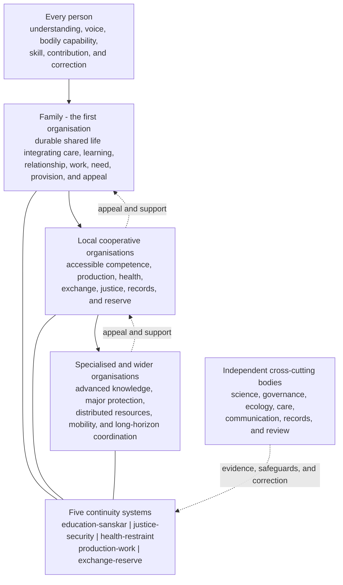

# Research Note: A Proposed External Organisation from the Activity Architecture of *Jeevan*

**Author:** Raghava Mohan Madhwapathi ([analyticmadhyasthdarshan.org](https://analyticmadhyasthdarshan.org))

**Edited on:** August 16, 2026, 6:31 PM IST

**Status:** Internal research note (not a catalog entry). Synthesis of the five-pass activity-to-sphere analysis.

**Scope:** This paper presents an external social organisation derived from the five-pass analysis of the 122 activity positions of *jeevan*. Part I states the proposed structure, its organisations, their functions, and the reasons for their inclusion. Part II explains the method, consolidates the principal findings, identifies limitations and unresolved design questions, and proposes the next stage of research. The paper uses “organisation” for a concrete bearer of responsibility and “function” for the continuity that must be maintained even when several functions share one organisation.

The proposed order begins with **family as the first organisation of human order**. Family is the durable shared-life organisation in which care, learning, relationship, health, work, need assessment, and provision are first integrated. Five function systems maintain education-*sanskar*, justice-security, health-restraint, production-work, and exchange-reserve. Local cooperative organisations extend these functions where affected people can participate directly. Specialised and wider organisations supply advanced competence, coordination, protection, reserve, and long-horizon responsibility. Independent scientific, ecological, governing, care, communication, and review bodies preserve evidence and correction across the five systems.

The organising purpose is to make the full embodied and social lifecycle of every person's *jeevan* activities continuously available: development, right orientation, competent performance, visible consequence, evaluation, correction, sustaining, and transmission. The structure is centred on participation by every person rather than administration by a permanent competent minority.

Throughout this paper, **voice** means the effective, supported opportunity of a person, counterpart, or affected party to express understanding, needs, expectations, agreement, and disagreement; to participate in deliberation and decisions that affect them; to have what they express considered and answered with reasons; and to refuse, challenge, or appeal without retaliation. It does not mean merely being permitted to speak, nor does it imply equal authority in every decision. Voice is meaningful when it can inform a decision, receive a reasoned response, and activate protection or correction where necessary.

## Part I. The proposed external organisation

## 1. Organising principle

Human organisation must maintain five objects through time:

1. **understood orientation** across persons and generations;
2. **right relationship** through recognition, responsibility, protection, and repair;
3. **bodily capability** through care, health, safe conditions, and restraint;
4. **useful material means** through skilled and regenerative work; and
5. **dependable availability** of provision across persons, places, and time.

These objects establish five core functions: education-*sanskar*, justice-security, health-restraint, production-work, and exchange-reserve. They operate at four connected scales: the person, durable shared life, local cooperation, and specialised or wider coordination. Inquiry, participation, usable means, continuity, and ecological consequence constrain every function and scale.

The direction from person to wider society shows expanding coordination, not a hierarchy of human worth. Responsibility remains close to the activity where competence, participation, and correction are adequate. It expands when consequences, dependency, mobility, scarcity, specialised knowledge, or ecological time exceed the immediate field. Evidence and appeal travel beyond the organisation whose conduct is under review.

## 2. Organisations and their functions

### 2.1 Family: the first organisation

Family is the first organisation of human order. It is the durable shared-life field in which persons sustain continuing responsibility for one another and in which the five social functions are first experienced as one way of living. It carries eight responsibilities:

1. stable membership and accountability;
2. intergenerational learning;
3. care through dependency;
4. reciprocal recognition and meaningful participation in deliberation and decisions;
5. daily bodily care;
6. participation in useful work;
7. need assessment and dependable access to provision; and
8. protection and appeal beyond the close group's authority.

This organisation integrates all five functions in daily life. Education begins through language, example, inquiry, participation, and *sanskar*. Justice begins through recognition and fulfilment of relationship-values. Health is maintained through food, rest, care, restraint, sanitation, and attention to bodily condition. Production becomes familiar through participation in useful work and maintenance. Exchange and reserve begin through the assessment of need, sharing, stewardship, and continuity of provision.

The five-pass analysis recovered this field without using family as an input category. Ninety-nine activity rows require a durable care or intergenerational scale. Twenty-nine meet a stricter integrative signature joining durable relationship with at least one meaning, bodily, material, or distributive channel. Family is therefore the first organisation and the first place where the five functions are lived together rather than separately administered. A materially different shared-life arrangement belongs to the family function when it maintains the same durable responsibilities.

### 2.2 Education-*sanskar* organisations

Education-*sanskar* organisations maintain understood orientation. They include learning communities, teachers and mentors, centres of study and practice, public repositories, apprenticeship networks, and institutions of open inquiry.

Their functions are to:

- make knowledge, reasons, language, and methods available;
- develop each person's ability to inquire, verify, apply, and revise;
- join learning with conduct and lived evidence;
- preserve source material, demonstrations, criticism, and correction;
- prepare competent guides without creating a permanent knower-follower division; and
- carry learning and *sanskar* across generations and organisational turnover.

This function exists because understood meaning cannot be replaced by correct orders, bodily treatment, successful output, or access to goods. The analysis assigns fifty-nine activity members to the understood-orientation channel. Inquiry and evidence recur across 105 rows, and continuity or succession across 115. Education must therefore be present in family, work, health, justice, science, and public coordination, while specialised educational organisations maintain the depth and continuity that no one household or workplace can provide alone.

### 2.3 Justice-security organisations

Justice-security organisations maintain valid claims between persons. They include relational forums, mediation and restorative bodies, protection services, independent adjudication, complaint and appeal systems, and organisations able to secure remedy.

Their functions are to:

- recognise relationships, expectations, responsibilities, consent, and boundaries;
- make counterpart and affected-party evidence authoritative in its proper field;
- protect participation where force, dependency, secrecy, or retaliation defeats direct reciprocity;
- distinguish dialogue and repair from cases requiring restraint, separation, or protection;
- preserve reasons, commitments, harms, decisions, remedies, and recurrence; and
- redesign arrangements that repeatedly reproduce domination or injury.

Sixty-one activity members enter the relational-claim channel. Protected participation recurs in 100 rows, and direct relation in ninety-seven. Justice-security remains functionally distinct because knowledge of a value does not guarantee its fulfilment, treatment does not correct relational wrong, and a productive or distributive authority cannot be the sole judge of the harms it creates.

### 2.4 Health-restraint organisations

Health-restraint organisations maintain bodily capability as the material means of human participation. They include daily care networks, clinics and hospitals, preventive-health organisations, public-health and occupational-safety bodies, rehabilitation and assistive services, and environmental-health monitoring.

Their functions are to:

- secure food, water, air, shelter, sanitation, movement, rest, and safe environments;
- join bodily self-report with competent observation and measurement;
- prevent and treat disease, injury, harmful exposure, and degrading habit;
- provide accommodation, rehabilitation, assistive means, and continuity of care;
- protect informed participation, consent, refusal of unsafe exposure, and appeal; and
- correct productive, commercial, domestic, or administrative conditions that damage bodily capability.

Twenty-three activity members enter the bodily-capability channel, while embodiment and usable means recur in ninety-one rows. Health evidence must remain independent of output, profit, stigma, and administrative convenience. Restraint belongs with health because consumption, exposure, effort, habit, and use must remain consonant with bodily purpose and sufficiency.

### 2.5 Production-work organisations

Production-work organisations maintain the creation and preservation of useful material means. They include farms, workshops, manufacturing and construction units, repair and maintenance organisations, infrastructure providers, design and engineering groups, and cooperative work associations.

Their functions are to:

- assess need and define the purpose of production;
- develop skill and give every capable person access to useful work;
- transform material through safe, competent, and maintainable processes;
- include workers, users, maintainers, safety witnesses, and ecological observers in evaluation;
- preserve tools, infrastructure, apprenticeship, records, and regenerative inputs; and
- redesign, repair, restore, or cease work when its consequences contradict its purpose.

Thirty activity members enter the material-transformation channel. Production-work remains distinct from health because output does not establish safety, and distinct from exchange because making a useful surplus does not determine access, priority, reserve, or future need. Work is both material participation and a field in which understanding becomes publicly evident.

### 2.6 Exchange-reserve organisations

Exchange-reserve organisations maintain dependable access to provision across differences of family, place, need, season, interruption, and time. They include circulation networks, cooperatives, marketplaces governed by transparent terms, storage and logistics bodies, common reserves, mutual-aid funds, and public systems for essential provision.

Their functions are to:

- maintain truthful information about need, stock, flow, obligations, and shortage;
- circulate useful provision beyond the producing unit;
- protect access against exploitation, exclusion, hoarding, and manufactured scarcity;
- maintain reserves for dependency, emergency, interruption, and future need;
- give affected persons voice in priorities and terms; and
- correct allocation through re-release, reallocation, restitution, changed terms, and reserve restoration.

Twelve activity members enter the distributed-availability channel. Its smaller membership does not reduce its necessity: every member in the channel requires durable responsibility, and omission leaves provision without a bearer across persons and time. Exchange-reserve remains distinct from production because the authority that creates output has an interest in allocation, price, scarcity information, and reserve. One organisation may perform both functions only with transparent separate accounts, affected-party rights, independent health and ecological evidence, and appeal.

### 2.7 Scientific inquiry and evidence organisations

Scientific organisations maintain disciplined observation, measurement, causal explanation, modelling, reproducibility, criticism, and correction. They serve every core function: learning depends on warranted inquiry; justice may require reliable evidence; health requires causal and clinical knowledge; production requires competent design; exchange requires truthful measurement of stock and consequence; ecology requires long-horizon observation.

Their independence protects adverse findings from doctrinal, commercial, and administrative suppression. Their purpose is not technical novelty alone but reliable knowledge of means and consequence in relation to humane ends. Science is organised separately where specialised competence and independence are needed, while its evidentiary function remains distributed throughout education, work, health, justice, exchange, and governance.

### 2.8 Governance and coordination organisations

Governance organisations coordinate authority, resources, reasons, standards, participation, records, review, and correction across functions and scales. They include assemblies, councils, administrative bodies, public review institutions, and federated structures linking local and wider responsibilities.

Their functions are to:

- allocate authority to capable bearers;
- make the reasons and limits of decisions public;
- protect affected-party participation and minority or dependent voice;
- coordinate resources when consequences cross local boundaries;
- maintain appeal outside the unit being reviewed; and
- revise rules and structures when evidence discloses recurring failure.

Governance has no content apart from the functions and relationships it coordinates. Its adequacy is shown by protected participation, transparent reasons, limited authority, independent review, correction, and succession rather than command or administrative order alone.

### 2.9 Ecological monitoring and protection organisations

Ecological organisations represent material consequences that are delayed, distributed, cumulative, or borne by future participants. They include monitoring bodies, watershed and landscape organisations, resource custodians, biodiversity and pollution observatories, restoration organisations, and independent ecological review.

Their functions are to:

- establish material and ecological baselines;
- observe inputs, extraction, waste, regeneration, and delayed effects;
- represent remote affected communities and future capability;
- apply precaution where consequences are serious and uncertain;
- keep ecological evidence independent of producers and present beneficiaries; and
- assign responsibility for prevention, restoration, and recurrence.

Ecological or long-horizon evidence recurs in thirty-two activity rows, and wider temporal or ecological coordination in forty-one. Ecology directly constrains health, production, and exchange-reserve and informs justice, education, science, and governance.

### 2.10 Specialised care organisations

Care organisations sustain persons through childhood, illness, disability, ageing, crisis, and other conditions of dependency. They include childcare, elder care, disability support, respite, rehabilitation, supported living, and community care networks.

Their functions are to:

- preserve the cared-for person's bodily capability, agency, relationship, and voice;
- support learning and participation rather than custodial dependence;
- maintain continuity across caregivers and organisations;
- provide accommodation and supported decision-making;
- protect confidential complaint and outside review; and
- sustain caregivers through competence, respite, material support, and succession.

Care joins education, justice, health, work, and provision according to the person's condition. It is a cross-functional responsibility and a specialised organisational field.

### 2.11 Communication, records, and review infrastructure

Communication and records make meaning, claims, stock, risk, consequence, decision, and correction inspectable. Every organisation requires accessible language, trustworthy records, privacy where necessary, public reasons where authority is exercised, preservation of disagreement, and audit trails that connect failure to remedy.

Independent review bodies use this infrastructure to test whether an organisation has confused its own output with fulfilment. They examine first-person report, counterpart evidence, bodily and material consequence, competent inquiry, affected-party participation, and long-horizon effects. A record system that serves only managerial control does not meet this function; the people affected must be able to inspect, contest, and correct the relevant record.

## 3. Constitutional rules of the organisational system

### 3.1 Every person is a participant

The organisation exists to develop and express the common capacity of *jeevan* in every human. Each person must have access to understanding, language, inquiry, relationship, bodily means, useful skill, provision, contribution, and correction. Disability or dependency changes the form of participation through accommodation and support; it does not remove the person's standing. Aggregate performance by experts cannot substitute for person-level capability and voice.

### 3.2 Responsibility is nested and polycentric

Daily fulfilment begins with the person and durable shared life. Local organisations carry work, care, learning, health, exchange, and relational correction close to those affected. Specialised and wider bodies enter when competence, resource distribution, migration, major harm, or ecological time exceeds local capability. The scale of responsibility follows the scale of consequence.

### 3.3 Performance and correction remain distinguishable

No organisation is the final judge of its own harms. The authority that teaches cannot use status as proof of understanding. The authority that produces cannot control health and ecological evidence. The authority that allocates provision cannot conceal stock or deny appeal. The family or care organisation cannot silence a dependent member. Governance itself remains subject to reasons, review, and correction.

### 3.4 Functions may share organisations without losing their identity

The five functions do not require exactly five organisations. A shared-life group carries all five. A cooperative may combine production and exchange. A local centre may combine education, health support, mediation, and records. Combination is sound when purposes, evidence, accounts, decision rights, conflicts of interest, and correction paths remain visible and independently reviewable.

### 3.5 Evidence is plural and convergent

Evidence is matched to the object being maintained. Understanding requires the learner's articulation, application, and capacity for revision. Justice requires counterpart and affected-party evidence. Health requires bodily report and competent material evidence. Production requires worker, user, maintenance, safety, and ecological evidence. Exchange requires transparent need, stock, access, reserve, and exclusion evidence. Agreement among relevant standpoints strengthens a conclusion; divergence initiates inquiry and correction.

### 3.6 Continuity is designed into ordinary operation

Every function preserves competence, memory, records, succession, maintenance, reserve, and the capacity to learn from failure. Continuity is not mere organisational survival. An organisation continues legitimately only while it maintains the human and material object for which it exists.

## 4. What this structure means for education, science, work, and trade

Education is organised for verified understanding and lived competence. Learners question, compare, practise, observe consequences, and become capable of teaching and correction. Certification, attendance, recitation, or institutional reputation do not replace this evidence.

Science is organised as open, reproducible, and corrigible inquiry into means and consequence. Research agendas, funding, application, and risk review are publicly answerable to human purpose, affected relationships, bodily conditions, and ecological continuity. Adverse results remain publishable and capable of changing institutional decisions.

Work is organised around assessed need, right-use, competence, safe participation, maintainability, and regeneration. Workers participate in purpose and method; users evaluate usefulness; health and ecological bodies evaluate consequences; records connect inputs, labour conditions, outputs, maintenance, waste, and restoration.

Trade and other forms of exchange are organised for dependable access without exploitation. Terms, stocks, unmet need, reserve, obligations, and future commitments remain inspectable. Scarcity invokes declared priorities, protection of minimum capability, affected-party voice, review, and restoration of provision rather than secrecy or permanent emergency power.

The result is a society in which family, education, science, work, health, justice, exchange, ecology, and governance are not separate worlds. They are mutually supporting bearers of a common human lifecycle, with enough functional distinction to preserve evidence and correction.

## Part II. Basis, method, findings, and research status

## 5. Methodology of the five-pass analysis

### 5.1 Starting question and unit of analysis

The study began with a question: what external structures and environments are required for the 122 activity positions of *jeevan* to become effectively available, rightly oriented, competently embodied, publicly evident, correctable, and continuous? The source supplies sixty-one *bal/shakti* positions distributed across five faculties. The analysis treated the 122 column assignments as independent units because a pair can join an act with a result, a role with a criterion, a relationship with an expression, or two terms whose exact relation remains open.

“Fully active” was defined as complete functioning in embodied human life, not activation by the environment. External arrangements do not create realisation, understanding, resolve, or sentient activity. They can make inquiry, relationship, bodily and material means, consequence, evaluation, correction, and transmission available or obstruct them.

### 5.2 Pass One: source and activity anatomy

Pass One checked the documentary assignment and analysed each member's entry form, bearer, object, counterpart, endpoint, governing criterion, pair semantics, and uncertainty. Sixteen members had already been analysed in eight pilot dossiers; the pass completed the remaining 106, bringing the total to 122.

The principal finding was semantic heterogeneity. The table contains inward successes, readinesses, cognitive acts, relational values, human roles, relationships, bodily states, material properties, sensory qualities, criteria, and results. Treating every term as an internal operation or asking which institution “activates” it would misclassify the source. The pass therefore established entry-form-specific lifecycle paths and field-level **D/I/H/O** provenance: direct statement, structural inference, hypothesis, and open question.

### 5.3 Pass Two: lifecycle, evidence, and continuity

Pass Two asked the same lifecycle questions of all 122 members: internal dependencies; development and right orientation; embodied or relational performance; consequence visibility; evaluator standpoints; correction; sustaining; transmission; universality; false positives; and unresolved fields.

It established that evidence is standpoint-dependent. First-person access is necessary for resolution, intention, pain, and bodily experience; counterparts are necessary for relationship and justice; skilled peers are necessary for competence and causal claims; workers, users, dependants, and affected publics disclose hidden burdens; material and ecological evidence can contradict present satisfaction. Correction likewise divides into renewed inquiry, relational dialogue, protection and appeal, retraining, repair or restitution, redesign, treatment and accommodation, and ecological restoration.

The output was a normalized sixteen-position feature vector for every member, with institution and family terms withheld from the subsequent clustering input.

### 5.4 Pass Three: anonymous sphere derivation

Pass Three replaced member names, faculties, pair positions, role terms, and institutional vocabulary with anonymous structural tokens. Deterministic average-link clustering compared coarse, middle, and fine resolutions under three treatments of unresolved fields: include the open features, drop them, and hold thirty-four open members outside partition formation.

The selected partitions contained three coarse domains, eight middle clusters, and fourteen fine clusters. At middle resolution, four stable cores appeared:

- realised orientation and congruent agency;
- developmental care and asymmetric responsibility;
- reciprocal recognition and justice; and
- bodily-material conduciveness.

Making and provision, and protection with sustained fulfilment, remained boundary-sensitive bridges. Two groupings remained residual and were not promoted into spheres. Fifty-three members received overlapping middle-cluster membership. The adjusted Rand index between the eight-cluster partition and the five faculties was `0.0267`, rejecting a faculty-to-institution mapping.

The low silhouette values and extensive overlap showed that activity spheres are connected fields rather than sharply separated compartments. Recurrent interfaces of inquiry, protected participation, embodiment and means, continuity, and ecological consequence became cross-cutting design requirements for the next pass.

### 5.5 Pass Four: durability and institutional functions

Pass Four applied five tests to every anonymous member: recurrence, interdependence, persistent capability, exposed harm, and accountable correction. It then derived unnamed continuity channels before restoring the source-proposed social labels.

One hundred and eighteen members required durable responsibility for their complete lifecycle (`D3`); two were distributed or conditional (`D2`); two required episodic or supportive external conditions (`D1`); none received `D0`. The channel rules produced 185 memberships across 122 members:

| Continuity object | Restored function | Members |
|---|---|---:|
| Understood orientation | Education-*sanskar* | 59 |
| Claims between persons | Justice-security | 61 |
| Bodily capability | Health-restraint | 23 |
| Useful material transformation | Production-work | 30 |
| Availability across persons and time | Exchange-reserve | 12 |

The existence of all five channels survived lower and higher overlap thresholds. The pass compared five institutional bundles. Four stable cores left thirty-six members with an uncovered durable channel. Three compressed functions covered all members but created three high-conflict combinations and lost independent correction. Combining production and exchange into four functions also covered all members but joined output authority with allocation and reserve. Seven specialised functions preserved coverage but added two subdivisions without a separately derived continuity object. The five-continuity bundle alone achieved complete coverage with no forced merger, unsupported split, or loss of structurally independent correction.

Family terminology remained hidden during the anonymous derivation. The durable shared-life scale nevertheless appeared in ninety-nine rows, and twenty-nine met the strict integrative family-like signature. The pass also located personal, direct-relational, local-cooperative, and wider ecological scales and showed that science, governance, ecology, communication, and care operate across the five functions.

### 5.6 Pass Five: counterfactual and adverse-case validation

Pass Five specified nineteen cases: three family tests, six function-boundary tests, seven adverse conditions, one universal-access test, and two concentrated false-positive tests. The cases examined non-kin and multi-local shared life, coercive biological family, combined production and exchange, separate scientific, governing, ecological and care organisations, scarcity, disability, coercion, disagreement, migration, concentrated technical power, ecological delay, elite-only competence, high output with displaced harm, and reported satisfaction under fear or dependence.

The family invariant survived while kinship and co-residence failed as necessary and sufficient criteria. Five continuity responsibilities remained adequate for every specified case; no sixth object was disclosed. Exactly five organisations was rejected. Combined delivery remained acceptable only with distinct purposes, evidence, accounts, rights, and correction. The pass added a person-level test of universal availability and a minimum-evidence protocol for all five functions.

## 6. Consolidated findings and insights

### 6.1 External organisation follows from lifecycle, not faculty count

The five faculties describe the internal architecture of *jeevan*. External organisation arises from what must remain available when activity is expressed through a body, relationship, work, material consequence, evidence, correction, and succession. The near-zero correspondence between faculty labels and Pass-Three clusters confirms that the proposed social structure is not five faculties enlarged into five institutions.

### 6.2 Five functions arise from five continuity objects

The most important institutional result is the distinction among understood orientation, relational claims, bodily capability, material transformation, and distributed availability. Each has different evidence, failure mechanisms, conflicts of interest, and correction paths. Their restoration to education-*sanskar*, justice-security, health-restraint, production-work, and exchange-reserve explains why those five functions form a coherent basis.

### 6.3 Family is the first organisation and integrative function field

Family is recovered as the first organisation: the durable shared-life field in which learning, relationship, dependency, bodily care, work, need, provision, and mutual evidence meet. It is prior in lived integration, not merely one specialised institution alongside the other five functions. The analysis establishes its functions more strongly than any specific genealogy or residence pattern. A non-kin or multi-local arrangement can fulfil the invariant; a biological household can fail it.

### 6.4 More organisations than functions are expected

Five functions do not imply five departments. Scientific, ecological, governing, care, communication, and review organisations are needed because specialised competence and independent evidence must cross functional boundaries. Conversely, one family, cooperative, or local centre may carry several core functions. The test is preservation of purpose, evidence, rights, accounts, and correction.

### 6.5 Universal structure means equal functional availability

The common architecture of *jeevan* supports a universal requirement that every person can develop, participate, contribute, evaluate, and correct. It does not require identical administration, technology, household form, or individual performance. Accommodation and supported participation are part of universality.

### 6.6 Independent correction is part of organisation itself

Correction is not an external audit added after a system is designed. The activity lifecycles require inquiry, dialogue, protection, appeal, treatment, redesign, restitution, and restoration wherever their corresponding failures can occur. Organisations that control both performance and final evaluation defeat this requirement.

### 6.7 Work, trade, science, and education are mutually constrained

Education supplies understanding and competence but must answer to conduct and consequence. Science supplies reliable knowledge of means but remains answerable to human purpose and affected fields. Work creates useful means but remains answerable to health, users, and ecology. Trade circulates provision but remains answerable to need, access, reserve, and justice. None can serve as the sole measure of the others.

### 6.8 False positives are a central institutional problem

Compliance can conceal coercion; consensus can conceal fear; output can conceal unsafe work; prosperity can conceal unequal access and ecological depletion; reputation can conceal failure of understanding; current satisfaction can conceal delayed harm. The organisation must therefore use object-specific and convergent evidence rather than one aggregate indicator.

## 7. Strengths and issues in the method

### 7.1 Methodological strengths

The analysis covers all 122 source positions rather than selecting only socially suggestive examples. It keeps the activity member separate from its source pair and distinguishes operation, bearer, object, result, criterion, and role. Field-level provenance keeps direct textual content separate from inference, hypothesis, and open questions.

Institutional vocabulary was hidden during sphere clustering and continuity-channel derivation. The method used multiple resolutions, residual treatments, overlapping memberships, threshold sensitivity, alternative bundles, and declared failure tests. Deterministic scripts preserve the matrices, diagnostics, and comparison results. Pass Five then subjected the selected model to materially different arrangements, adverse conditions, and false-positive cases.

### 7.2 Dependence on the source ontology

The analysis is conditional on the Madhyasth Darshan account of a common *jeevan* architecture and on the accuracy of the source inventory and translations. It does not independently establish the existence, number, or internal organisation of the faculties and activities. A change in the primary ontology would require the external derivation to be rerun.

### 7.3 Interpretive coding and recoder dependence

Entry form, endpoint, criterion, structural tokens, durability scores, conflict pairs, and channel rules involve judgement. The same research programme produced most of the prose coding and the controlled vocabulary. An independent team has not yet recoded a representative sample or measured inter-coder agreement. Marginal memberships and residual cases may change under another defensible interpretation.

### 7.4 Open source semantics

Thirty-four members carry an explicit open feature in Pass Three. Disputed slots include mixed operation-result grammar, repeated *poshan*, relation-role syntax, sensory criteria, and pair rationales. Residual holdout prevents these uncertainties from manufacturing a stable sphere, but later textual clarification may redistribute members or disclose a requirement not presently visible.

### 7.5 Weak separation and choice of analytical grain

The cluster silhouette scores are low. Stability under the tested perturbations is stronger than geometrical separation, and fifty-three members overlap. The boundaries are therefore useful functional cores and bridges, not natural kinds. Different feature vocabularies, similarity measures, weights, thresholds, or levels of granularity could yield another defensible partition.

The five-function result is practically minimal among the five tested bundles at the selected grain. The analysis did not enumerate every possible partition or prove numerical uniqueness. A different grain may split education from formation, care from justice, or ecological work from material provision while preserving the same deeper continuity objects.

### 7.6 Risk of conceptual leakage

Family and institutional labels were removed from the clustering inputs, but the analysts knew the source's social proposal while constructing the earlier anatomy and lifecycle language. Leakage control reduces circularity; it cannot eliminate background influence. Independent blind coding from primary definitions would provide a stronger convergence test.

### 7.7 Analytical rather than empirical validation

The nineteen Pass-Five cases are structured arguments based on known vulnerabilities. They show how the model classifies alternatives and failures but do not establish how actual families, cooperatives, schools, workplaces, health systems, markets, or governing bodies perform. The evidence protocol has not yet been calibrated against observed outcomes or tested longitudinally.

### 7.8 Observability of complete functioning

Inward resolution and understanding cannot be directly declared by an institution. Public evidence arises through communication, relationship, work, bodily consequence, correction, and continuity, but these remain fallible indicators. The method requires convergent standpoints without yet specifying statistical thresholds, time horizons, or a complete procedure for resolving persistent disagreement among them.

### 7.9 Power, transition, and material design remain incomplete

The analysis derives decision rights, safeguards, and appeal more strongly than a transition path from present concentrated institutions. It does not settle property systems, financing, compensation, inheritance, reserve ownership, legal enforcement, technology governance, or the distribution of unpleasant and specialised work. It also does not derive the source's ten-tier organisation from the number 122. These are design and comparative questions for the next stage.

## 8. Proposed next steps

### 8.1 Independent replication

Recruit independent readers of the primary texts to recode a stratified sample covering all faculties, entry forms, stable cores, bridges, and residuals. Compare entry forms, endpoints, criteria, lifecycle requirements, structural tokens, continuity channels, and institutional conclusions. Publish disagreements and rerun the later passes on the independent coding.

### 8.2 Resolve documentary and semantic residuals

Return to the primary Hindi sources and available translations for the thirty-four open members, especially repeated or mixed slots. Record variant readings without forced harmonisation. Test whether source clarification integrates the residual groupings, shifts bridge membership, or creates another continuity object.

### 8.3 Expand the institutional-bundle search

Specify and compare more partitions than the original five bundles. Include combined local cooperatives, federated service systems, independent care and ecological functions, networked rather than territorial arrangements, and different separations of funding, delivery, evidence, and appeal. Evaluate coverage, conflict of interest, correction independence, accessibility, continuity, and power concentration.

### 8.4 Convert the evidence protocol into operational indicators

For each function, develop observable measures at the person, relationship, shared-life, local, and wider scales. Combine first-person report, counterpart evaluation, competence evidence, bodily-material measures, records, affected-party testimony, and long-horizon consequence. Define how disagreement triggers investigation and how correction is tracked to outcome.

### 8.5 Conduct comparative field studies

Study contrasting arrangements that perform the same function: kin and non-kin shared life; co-residential and multi-local care; schools and learning communities; private, cooperative, and public production; market, reciprocal, and administered exchange; centralised and federated governance. Use the same evidence and correction protocol across cases.

### 8.6 Run adverse-condition pilots

Test scarcity, disability, migration, coercion, technological concentration, and ecological delay in actual organisational settings or carefully designed simulations. Examine whether affected people retain voice, minimum capability, access to records, appeal, and effective correction when the system is under pressure.

### 8.7 Design the interfaces explicitly

Develop concrete models for the boundaries among family, education, justice, health, production, exchange, science, ecology, and governance. Specify who holds records, who can stop harm, how conflicts of interest are disclosed, where appeals go, how reserves are released, and how correction returns to the responsible field.

### 8.8 Develop transition pathways

Compare incremental and structural transitions from current organisations to the proposed architecture. Identify changes that can begin within households, schools, cooperatives, workplaces, clinics, local governments, and research institutions. Examine how material security and protection can be maintained while authority, evidence, and participation are redistributed.

### 8.9 Compare the derived scales with the ten-tier proposal

Treat the source's ten-tier social order as a proposed implementation. Map its units to the derived personal, shared-life, local, specialised, and wider requirements. Test whether every tier has a necessary object, whether some can be combined, and whether mobility, ecology, digital networks, and distributed production require different boundaries.

### 8.10 Establish a revision cycle

Maintain the activity register, sphere matrix, function model, case set, and evidence protocol as revisable research artifacts. A real case should revise the organisational design when it exposes a missing safeguard. It should revise the function model when it satisfies the stated conditions yet requires a non-substitutable continuity object outside the five. The next version of the proposal should report both kinds of revision.

## 9. Conclusion

The five-pass analysis yields a coherent proposed external organisation from the activity architecture of *jeevan*. Its foundation is the person as an embodied, relational, learning, working, and evaluative participant. Its first organisation is family, the durable shared-life field in which all five functions are integrated. Its horizontal structure consists of education-*sanskar*, justice-security, health-restraint, production-work, and exchange-reserve. Its vertical structure connects personal, family, local, specialised, and wider scales. Its cross-cutting safeguards are inquiry, protected participation, usable means, continuity, ecological evidence, and correction.

The proposal directs family, education, science, work, trade, health, justice, ecology, and governance toward one common task: enabling every person to understand, participate, fulfil relationships, maintain bodily capability, contribute through useful work, receive dependable provision, observe consequences, and correct failure. Organisations are justified by the continuity they maintain and remain legitimate through evidence available to the people and fields they affect.

The method supplies a reason for this structure and a disciplined account of its present limits. The next stage is independent recoding, broader organisational comparison, operational evidence, field observation, adverse-condition testing, and transition design. That work will determine which concrete arrangements most reliably realise the derived functions and where the model itself must change.

## References

### Madhyasth Darshan

- **AVD** - A. Nagraj, [*Adhyatmvad*](../../References/Madhyasth-Darshan/AVD-Adhyatmvad.docx.pdf), tr. Sanjeev Chopra (work in progress). Cited: the five-column table and sixty-one *bal/shakti* positions supplying the 122-member documentary inventory (pp. 91-94; §5.1).
- **JV** - A. Nagraj, [*Jeevan Vidya: An Introduction*](../../References/Madhyasth-Darshan/JV-Jeevan-Vidya-An-Introduction.md), tr. Rakesh Gupta. Cited: family relations and education-*sanskar* (pp. 55-60, 84, 108; §§1-4); the five dimensions of orderliness (pp. 109-110, 140; §§1-4); science in consonance with wisdom (pp. 151, 157-158; §§2.7, 4); and production and right-use of surplus (pp. 152-153; §§2.5-2.6, 4).
- **KD** - A. Nagraj, [*Manav Karm Darshan*, working English rendering](../../References/Madhyasth-Darshan/KD-Karm-Darshan-English/KD-Karm-Darshan-English.pdf). Cited: bodily effort, motion, and result in work (p. 12; §§2.5, 4) and production in accord with nature's cyclic order (p. 25; §§2.5, 4).
- **MVD** - A. Nagraj, [*Madhyasth Darshan - Co-existentialism*](../../References/Madhyasth-Darshan/MVD-Madhyasth-Darshan-Coexistentialism.md), tr. Rakesh Gupta. Cited: family, need, relationship, and organisation (pp. 55-62; §§1-4); the human joint form and bodily mediation (pp. 199-205; §§1-4); education-*sanskar*, teaching, and inquiry (pp. 248, 270, 313-315, 344; §§2.2, 4); inner-to-outer activity and reception conditions (pp. 275-291; §§1-4); justice and mutual satisfaction (pp. 310-311, 336; §§2.3, 4); and the 122 activities (p. 323; §5.1).

### Five-pass analysis and supporting research notes

- [*Bottom-Up Pilot Derivation of Jeevan Activity Spheres*](Research-Note-Jeevan-Activity-Environment-Pilot-Dossiers.md) - the pilot dossiers, institution-neutral question, and refined five-pass protocol.
- [*Pass-One Anatomy of the Remaining Jeevan Activities*](Research-Note-Jeevan-Activity-Anatomy-Pass-One.md) - source, bearer, object, counterpart, endpoint, criterion, and pair-semantics analysis completing all 122 positions.
- [*Pass-Two Lifecycle and Evidence Coding of All 122 Jeevan Members*](Research-Note-Jeevan-Activity-Lifecycle-Pass-Two.md) - the normalized lifecycle, evaluator, correction, continuity, universality, and false-positive register.
- [*Pass-Three Derivation of Jeevan Activity Spheres*](Research-Note-Jeevan-Activity-Spheres-Pass-Three.md) - anonymous multi-resolution clustering, stable cores, bridges, residuals, overlap, and restored tests.
- [*Pass-Four Derivation of Durable Social Functions from Jeevan*](Research-Note-Jeevan-Durable-Functions-Pass-Four.md) - durability tests, five continuity channels, family-like field, nested scales, and comparative institutional bundles.
- [*Pass-Five Counterfactual Validation of the Jeevan Social Model*](Research-Note-Jeevan-Counterfactual-Validation-Pass-Five.md) - family equivalence, organisational boundaries, adverse cases, false positives, evidence protocol, and person-level universality.
- [*From the Activity Architecture of Jeevan to Universal Human Order*](Research-Note-Jeevan-To-Universal-Human-Order.md) - the earlier social thesis now consolidated in this proposal.
- [*Jeevan Architecture*](Research-Note-Jeevan-Architecture.md) - the account of faculties, activities, embodiment, receptivity, complete functioning, and restfulness.
- [*A Functional Model of Jeevan*](Research-Note-Jeevan-Functional-Model.md) - the model of orientation, expression, consequence, evaluation, correction, and lasting change.
- [*Jeevan Activity-to-Sphere Dossier Template*](Research-Template-Jeevan-Activity-Environment-Dossier.md) - the reusable provenance, lifecycle, clustering, institution-comparison, and validation schema.
