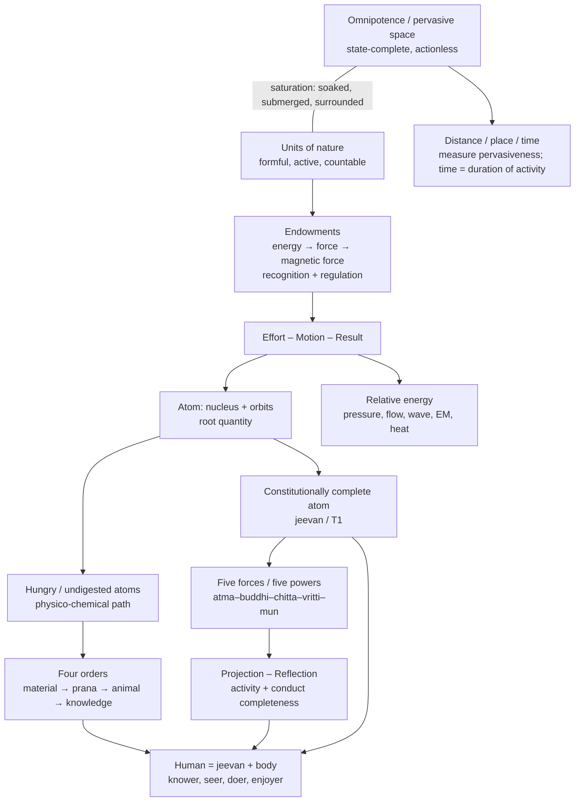

# Research Note: Manav Karm Darshan — Ontological Summary

**Author:** Raghava Mohan Madhwapathi ([analyticmadhyasthdarshan.org](https://analyticmadhyasthdarshan.org))

**Edited on:** July 9, 2026, 11:20 AM IST

**Status:** Internal research note (not a catalog entry). Compiled to support reading and drafting on *The Ontology of Coexistence*, especially §§1.1–1.11, from the working English translation of *Manav Karm Darshan*.

**Source:** A. Nagraj, *Manav Karm Darshan* (Madhyasth Darshan — Part 2), working English in [`References/Madhyasth-Darshan/KD-Karm-Darshan-English/KD-Karm-Darshan-English.md`](../../References/Madhyasth-Darshan/KD-Karm-Darshan-English/KD-Karm-Darshan-English.md). Page markers below are printed pages (`[p. NN]` in that file). These are machine-assisted working translations, not published translations — verify against the Hindi original before quoting in a released study.

**Scope:** This note reorders KD's main concepts into the sequence that makes Nagraj's ontological view intelligible: ground and units first, then endowments and activity, then atomic development and the four orders, then force–space–time, then the human as knower. Chapters 1–2 (karma and upasana) are summarised only where they rest on that ontology. Companion physics compilation: [*Research Note: The Physics of Coexistence*](Research-Note-Physics-Of-Satta-Unit-Interaction.md).

---

## How KD is organised

KD's title-page postulate is the all-pervasiveness of knowledge and the beginninglessness of nature. Its principle is **effort – motion – result** (*śram–gati–pariṇām*). The book has three chapters:

| Chapter | Printed pages | Ontological weight |
|---|---|---|
| 1. Karma | 1–29 | Human action as desire–result; balance grounded in Omnipotence |
| 2. Upasana | 30–49 | Worship and practice as means; not the ontological core |
| 3. Coexistence-ist Science | 53–153 | The systematic ontology: atom → orders → force → space–time → knower |

Chapter 3 is the load-bearing stretch for ontology. The summary below follows that chapter's conceptual order, not the book's chapter numbers alone.

---

## 1. The base claim: existence as coexistence

KD's core formula is stated in the Alternative (*vikalp*) and restated throughout chapter 3: physicochemical entities and *jeevan* entities are present as inseparable in the omnipresent space. Existence is not merely physicochemical.

Coexistence means: the entire insentient and sentient nature is saturated and eternally present in the omnipresent space (*sattā* / Omnipotence / Omnipresence). Within that bond:

1. Hungry (unsaturated) and undigested (unstable) atoms, and constitutionally complete, satisfied atoms that emerge through evolution, are understood — the latter as *jeevan*.
2. A constitutionally complete atom is a sentient unit — *jeevan*.
3. From hungry and undigested atoms, molecules, and biological cells (*prāṇakośa*), physical, chemical, and prana-state structures form; from these, the earth and other planets are understood to have formed.

The human tradition is the combined form of body and *jeevan*. Coexistence is eternally effective; that effectiveness is the natural sequence (*niyatikram*).

**Reading for ontology:** two poles, one bond. Formless, actionless Omnipotence; formful, active nature as countless units. Neither produces the other. Change is only within nature saturated in Omnipotence.

---

## 2. Saturation and the three endowments

KD 3.1 opens the scientific chapter with two questions about atomic particles: how does recognition arise between them, and why do they enter orderliness after recognition? The answer is coexistence itself.

Every unit — from the subtlest particle to the largest composition — is submerged, soaked, and surrounded in the omnipresent. That saturation is the basis of remaining **energy-endowed**. Energy-endowment is understood as **force-endowment** and **magnetic-force endowment**. By that force, particles recognise one another in mutuality and participate in orderliness.

The chain KD states (matching SB's saturation chain) is:

> saturation → energy-endowment → (magnetic) force-endowment → recognition → orderliness / definite conduct

Orderliness's functional form is definite conduct. Constitution-organisation arises on the basis of recognising; coexistence is the fundamental formula and the basis of orderliness. At the root of every state of motion, coexistence is established.

**Reading for ontology:** Omnipotence does not push particles as an external agent. Saturation endows each unit with the capacity to recognise and regulate. Forcefulness names what is always-already true of a soaked unit, not a transmission event from the ground.

---

## 3. The principle: effort – motion – result

The book's principle is the form in which all unit-activity appears. KD 3.11 states it operationally inside every atom:

- **Effort** (*śram*) — grandeur of the existent-state
- **Motion** (*gati*) — grandeur of spreading effect
- **Result** (*pariṇām*) — grandeur of a different existent-state

Every result is arrayed in a quantitative and qualitative chain. Fixed and long-enduring results mark the stability or instability of existent-states. Complementarity and usefulness thread the chain; all stages remain joined — physical with chemical, chemical with living, physico-chemical with human.

In chapter 1, the same triad appears at the human scale: activity together with aspiration is karma; motion together with awareness is complete activity. Every karma has result. Desire, karma, and result in balance is the accomplishment of desire.

**Reading for ontology:** Omnipotence is state-complete (no motion, wave, or pressure of its own). Nature saturated in it is state-dynamic. All change is unit-activity as this inseparable triad — not three sequential steps, but three joint aspects of one activity.

---

## 4. Atomic structure: nucleus, orbits, species

KD 3.1: an atom has one or more particles at the middle (*madhyansh*, nucleus) and one or more particles revolving in orbits. Below that, atomic matter does not come to be. Difference of conduct comes from difference in the number of functioning particles; humans have claimed about 108 species of atoms on earth.

When orbits become more than four, the possibility of decreasing remains; when fewer than four, of increasing. Weight depends on the number of nuclei. Atoms endowed with inherent weight recognise one another and gather as molecules — solid, liquid, rarefied. Solid compositions include large bodies such as the earth. Liquid is the initial substance of the chemical world.

Absorption–displacement (*prasthāpan–visthāpan*) keeps occurring so that result-oriented intent and complementarity are fulfilled. Before a particle is displaced, the atom is excited; after displacement and absorption, both atoms reinstate natural-state motion (*svabhāv gati*). Definite conduct in natural-state motion is the evidence of orderliness; the intent of development remains contained in that progression.

An isolated particle in the limitless void does not evidence orderliness; whirling, it seeks another particle, and either joins an atom or forms one. Orderliness manifests only after atomic constitution.

**Reading for ontology:** the atom is the root unit of physical, chemical, and *jeevan* activity. Species diversity is numerical diversity of particles under one constitution principle.

---

## 5. Development progression in compositions

KD 3.2–3.3 distinguish two developments that must not be collapsed:

1. **Development progression in compositions** — molecules → earth and planets → water → acid/alkali → nourishment- and composition-elements under cosmic heat → algae → prana cells → plant order → sweat-born, egg-born, womb-born animal bodies → human body with enriched *medhas*.
2. **Development in the atom** — the atom becoming constitutionally complete; that complete atom is the conscious unit, *jeevan*.

Four states are perceivable in nature: material (soil, stone…); prana (trees, plants); *jeevan* and knowledge (combined form of body and *jeevan*). The human body is the highest developed composition because the *medhas* composition is fully developed — the medium through which knowing, believing, recognising, and carrying-out are expressed. Non-human orders are limited to recognising and carrying-out; force-endowment is their basis. In the living human, that same endowment is evidenced as knowing, believing, recognising, and carrying-out.

**Reading for ontology:** compositional progression builds bodies and environments on earth; atomic development alone yields sentience. The Ontology study's T1 is this second line.

---

## 6. Constitutional completeness: hungry, undigested, satisfied

KD 3.3: development in the atom means becoming constitutionally complete. In the result-progression, atoms are understood as:

| Kind | Character | Outcome |
|---|---|---|
| Undigested (*ajīraṇ*) | Attempt to expel particles; radiative; internal heat toward nuclei; electricity; radiativeness | Unstable constitution |
| Hungry | Possibility of absorbing more particles | Unsaturated constitution |
| Satisfied (*tript*) | Constitutionally complete | *Jeevan* status |

In the constitutionally complete atom, force and power become **inexhaustible**: however much hope, thought, desire, or evidence is expressed, it does not decrease. *Jeevan* is free of weight-bondage and molecular-bondage; hope, thought, desire, resolve, and evidences cannot be reckoned on the physical scale. The physical (constitution-oriented) atom is inert (*jaḍ*); the constitutionally complete atom is conscious.

Three stages complete development and awakening in the atom:

1. **Constitutional completeness** — *jeevan* as imperishable conscious activity
2. **Activity-completeness** — the *jeevan* atom becoming awakened
3. **Conduct-completeness** — evidencing that awakening within human tradition

Delusion is taking the body to be *jeevan*; while that lasts, development in the atom is not understood. Awakening's entire form is knowing, believing, recognising, and carrying out. Material, prana, and *jeevan* states evidence recognising and carrying-out; the human adds knowing and believing — the mark of the knowledge state.

**Reading for ontology:** T1 / T2 / T3 in the Ontology study map directly onto these three stages. Sentience is an atomic threshold, not neural complexity.

---

## 7. Stability of coexistence; certainty of development and awakening

KD 3.5–3.6: existence-as-coexistence is stable. Development and awakening are certain within it. Coexistence does not decrease or increase, expand or contract; being and remaining continue according to the manifestation of development and awakening.

Natural-state motion is determinate conduct: every atomic particle recognising others so that atomic constitution fulfils determinate conduct. Units participate in orderliness-with-inherence (*tva*) and in overall orderliness. Humans participate with human-ness in that orderliness only after natural-state motion with awakening — understanding, honesty, responsibility, and participation.

*Jeevan* has five activities of **state** (force) and five of **motion** (power):

| Faculty | State (force) | Motion (power / projection) |
|---|---|---|
| *Atma* | Realisation and its continuity | Evidence |
| *Buddhi* | Enlightenment / acceptance of realisation | Resoluteness (*ṛtambharā*) |
| *Chitta* | Contemplation of justice, dharma, truth | Desire (forming of images) |
| *Vritti* | Comparison / deliberation | Thought (analysis) |
| *Mun* | Tasting of value, character, ethics | Hope (selection) |

Realisation alone is the ultimate expression of awakening and of *jeevan*. Satiation in *jeevan* is happiness, peace, contentment on the basis of resolution, prosperity, and fearlessness; in coexistence, realisation is joy. The human goal — resolution, prosperity, fearlessness, coexistence — is evidenced only by the realisation-based method.

**Reading for ontology:** the five-faculty architecture is not an add-on psychology; it is how the constitutionally complete atom's force–power appears as sentient state–motion.

---

## 8. Form, property, essential nature, dharma — and quantity

KD 3.9–3.10: every unit expresses form, property, essential nature, and dharma in an indivisible way, together with quantity. The atom is the root quantity: a unit that is itself an orderliness and participates in overall orderliness. Even a lone particle or a deluded human shows a tendency toward that participation.

Form is shape, volume, and bulk. Property is generative, degenerative, and mediating activity. Essential nature and dharma differ by state:

| State / order | Essential nature | Dharma (cumulative) |
|---|---|---|
| Material | combination–decomposition | existence |
| Prana | essentiality–destructiveness (*sārakta–mārakta*) | + growth (*puṣṭi*) |
| Animal (*jeevan* with body) | cruel–non-cruel | + hope to live |
| Knowledge (human) | fortitude, valour, generosity, compassion, grace, mercy | + happiness |

In conduct of humankind, dharma predominates; in animals, essential nature; in plants, property; in material things, form. Human dharma evidences resolution on the basis of happiness. Human necessity is resolution, prosperity, fearlessness, coexistence — evidenced as value, character, and ethics.

Every substance is luminous: effort–motion–result in every atom manifests sound, heat, electricity, and wave; energy- and magnetic-force endowment keep the unit illumined. Mutual recognition rests on reflection of that luminosity, not only on sunlight to human eyes.

**Reading for ontology:** the four aspects are what every unit *is* as a participant in coexistence. The four orders are stable plateaus of those aspects, not human typologies.

---

## 9. State–motion and force–power

KD 3.8, 3.11: state and motion are indivisible. Force is manifest in state; power in motion. Endowment with force in state means evidence of orderliness in oneself; power in motion means participation in the overall orderliness.

Weight is the arrangement of evidencing coexistence with the earth — not an absolute small/big hierarchy. Gravitation, in KD's reading, is solid evidencing coexistence with solid within the earth's atmospheric bound. Completeness slips out of sight when relativity of small and big dominates; each unit together with its environment is complete.

The nucleus maintains good distance: if orbital distance increases, mediating activity at the centre calls particles near; if they approach too close, it fixes them at good distance. Molecules join by magnetic-force endowment; large bodies such as the earth stand as the fruition of that propensity.

At root: every unit, saturated in the pervasive reality, is energy-endowed and force-endowed. *Jeevan* atoms remain free of molecular and weight bond, and (under delusion) joined to bonds of hope, thought, and desire. Physico-chemical atoms remain joined to molecular and weight bond.

**Reading for ontology:** physical force-language is unit–unit mutuality and the endowment chain from saturation — never Omnipotence applying force. The Ontology study's firewall (satta actionless; pressure in mutuality) is KD's own starting point for force.

---

## 10. Projection–reflection

KD 3.12: at the root of human activity (physical, vocal, mental; done, caused, intended) is projection; at the root of projection, reflection. By reflection we understand; by making understood we are projected.

In the awakened human, evidence of form is:

- in **reflection** — knowledge, science, wisdom
- in **projection** — participation in work, behaviour, orderliness

Teaching is projection; study is reflection. Enlightenment of meaning and realisation are the fruition of study. Human-aspiration (resolution, prosperity, fearlessness, coexistence) and *jeevan*-aspiration (happiness, peace, contentment, bliss) become meaningful together when projection is consistent with sequence, work, behaviour, result, and purpose.

**Reading for ontology:** projection–reflection is how the effort–motion–result triad runs in the sentient atom toward activity and conduct completeness — the Ontology study's T2/T3 path.

---

## 11. Pressure, flow, wave, electromagnetic force

KD 3.13 defines the relative-energy vocabulary:

- **Pressure** — compulsions toward generative–degenerative excitation (*āvesh*), as distinct from natural-state motion
- **Flow** — continuous motion of fluid matter toward a slope
- **Wave** — vibrational forms in solid, liquid, rarefied matter; in rarefied matter: sound, heat, electricity, ray, radiation
- **Electric wave** — flow from fragmentation of magnetic current; nature as medium

Magnetic-force endowment again traces to saturation: soaked → energy-endowed → force-endowed → magnetic-force endowment. The pervasive entity is fundamental uniform energy (*samya ūrjā*). Electric flow is a cyclical process that ultimately merges into the earth again as magneticness. Pollution is not intrinsic to electric energy; it depends on human discretion and on whether perpetual sources (water flow, sun's heat, wind, waves) are preferred over destiny-opposing extraction.

**Reading for ontology:** every named physical force here is relative energy — apparent in mutuality of units — consistent with MVD's absolute vs relative energy distinction used in the Ontology study.

---

## 12. Place, distance, direction — measuring pervasiveness

KD 3.14: whether far or near, every unit remains contained in the pervasive entity. Whatever we measure as distance, amid mutuality there is only the pervasive entity; between pole and pole we are measuring pervasiveness itself.

Extension is the span of a composition; place (*deś*) is that extension. The earth is one undivided composition — inspiration for recognising undivided society. Direction is determined in coexistence, with a pole (human with earth, or sun) and degrees/angles; sight (*dṛṣṭi*) is indispensable. The human visual span is about 90 degrees; eyes alone give incomplete (roughly 180-degree half) awareness of a solid. Mathematics exceeds the eyes; qualitative and causal language (form, property, essential nature, dharma) exceeds mathematics for complete awareness.

Two further directions matter for ontology: the **direction of development** (complementarity with chemical, physical, and animal orders) and the **direction of awakening** (understanding, honesty, responsibility, participation; evidencing *jeevan*- and human-aspiration).

**Reading for ontology:** "distance is satta" — the gap between units is formless existence, not empty nothing. Measurement succeeds because coexistence is the ultimate truth.

---

## 13. Time as duration of activity

KD 3.15: time is the duration of activity. Activity is continuous; some activities recur; recurrence is the basis for recognising time (e.g. one earth rotation as a day). Dividing duration and forgetting activity makes time primary and the thing forgotten — a source of problems. Evaluation should rest on activity and its fruition.

Coexistence is eternally continuous. Time in the meaning of coexistence is the **ever-present**. Past and future are fashioned from the duration of cyclical activity. Dividing duration toward "time-zero" is easy for imaginative freedom and disastrous for recognising conduct, behaviour, and knowledge in the present.

**Reading for ontology:** *kāal* is unit-activity's duration; Omnipotence as ground is not timed. Full treatment belongs with *Nature of Time*; KD supplies the primary definition the Ontology study cites.

---

## 14. The human: body, *jeevan*, and the knower

KD 3.16–3.18 close the ontological arc.

The human is the combined form of prana-state body-composition and *jeevan*. Body-composition repeats as it actually is across generations; imaginativeness and freedom-of-action are the glory of *jeevan*, not of the body. Materialism's claim that consciousness is the outcome of body-composition is rejected: equal *medhas* across humans, failure of cloning-as-consciousness, and children of the learned/foolish not tracking lineage all count as testimony. *Jeevan* operates the body; the understanding human runs the body according to understanding.

From the coexistence-ist viewpoint:

| Triad | Terms |
|---|---|
| Knowledge / knower / known | Holistic view of coexistence, knowledge of *jeevan*, knowledge of humane conduct / *jeevan* / evidencing human- and *jeevan*-aspiration in undivided society |
| Seer / seen / seeing | *Jeevan* / existence-as-coexistence / philosophy of existence |
| Seer / doer / enjoyer | Understanding (awakened) / self-motivated activity in four states / fruition as happiness — human alone evidences all three when awakened |

Physico-chemical nature is in the self-motivated doer-status (effort–motion–result). The conscious status, with awakening, is seer and knower. Delusion evidences doer and enjoyer without seer — problems. Awakened tradition keeps the seer-status intact.

Chapter 1's karma doctrine sits on this ontology: ninefold karma (physical/vocal/mental × done/caused/intended); results as moksha, dharma, *kāma*, wealth; the basis of natural, social, and intellectual balance is Omnipotence, rule, justice, resolution, and coexistence as supreme truth. The deluded human is free while performing karma and subject while undergoing result; the awakened is free in both.

**Reading for ontology:** the human is not a clever animal body. Recognition of the human is by human-ness and *jeevan* activity, never by colour, race, or body-composition alone.

---

## 15. Concept map in logical order

---

## 16. Crosswalk to *The Ontology of Coexistence*

| Ontology study | Primary KD locus |
|---|---|
| §1.1 Coexistence: Omnipotence and units | *Vikalp* 12–16; 3.5 |
| §1.2 Saturation and endowments | 3.1; 3.9; 3.11; 3.13 |
| §1.3 Form, property, essential nature, dharma | 3.9–3.10 |
| §1.5 Four orders | 3.2; 3.4; 3.9–3.10 |
| §1.6 Completeness drive; T1–T3 | 3.2–3.3 (two developments; three stages scoped to *jeevan*); 3.6; 3.18 — Ontology §1.6 now names the compositional vs atomic split so T2/T3 are not read as particle teleology |
| §1.6 Effort–motion–result | Title principle; 3.11; ch. 1 |
| §1.7 Five faculties / *jeevan* | 3.6; 3.16 |
| Force, weight, gravitation, EM | 3.7–3.8; 3.11–3.13 |
| Distance as satta; place | 3.14 |
| Time as duration of activity | 3.15 |
| Human as knower; seer–doer–enjoyer | 3.16–3.18 |
| Karma and desire–result | Chapter 1 |

---

## Method note

Compiled from the working English file `KD-Karm-Darshan-English.md` (front matter + chapters 1 and 3; chapter 2 skimmed for ontological dependence only). Terminology follows project conventions in that folder's README (`śram` = effort, `pariṇām` = result, `svabhāv` = essential nature, `parāvartan`/`pratyāvartan` = projection/reflection, contextual *āvesh*). For released-study quotation, re-check Hindi page images under `References/Madhyasth-Darshan/KD-Karm-Darshan-English/_page-images/` and prefer published MVD/SB/JV wording where the same claim already exists in those translations.
