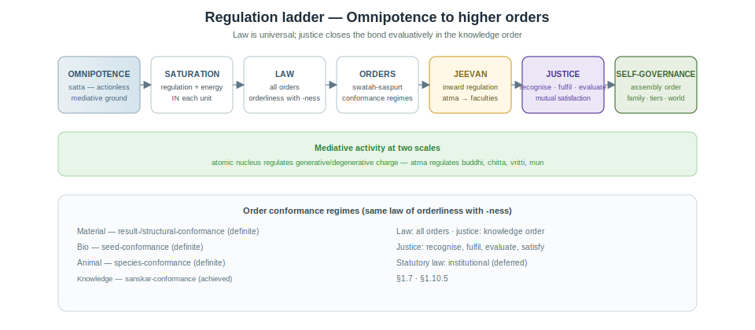
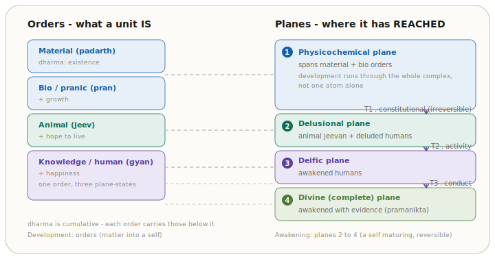
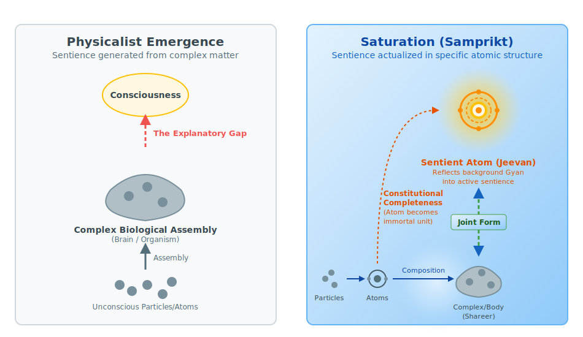
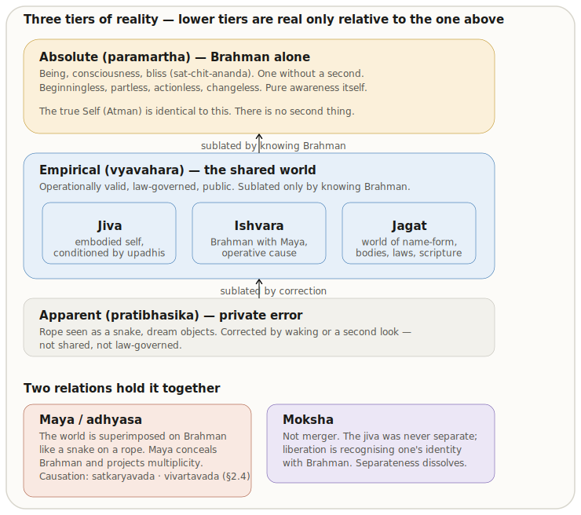

# The Ontology of Coexistence

**Author:** [AnalyticMadhyasthDarshan.org](https://github.com/raghavamohan/AnalyticMadhyasthDarshan) — a group of people studying Madhyasth Darshan philosophy. Source repository: [raghavamohan/AnalyticMadhyasthDarshan](https://github.com/raghavamohan/AnalyticMadhyasthDarshan).

**Edited on:** June 29, 2026, 5:16 AM IST

**Status:** Released

**The question:** What is Existence? What exists? Does what exists begin at some time? Does the individual self (*jeevan*) begin or end with the body? Is the world finally real?

This study examines those questions in **Madhyasth Darshan** (Co-existentialism), as presented by **Shri A. Nagraj**, and compares its answers with **Advaita Vedanta** and selected **modern philosophical and scientific approaches** to physical reality, consciousness, and selfhood. Full treatment of time (*kaal*), *trikaalabadh*, and spacetime physics is in [*Nature of Time*](../Nature-Of-Time/Nature-Of-Time.pdf); here only the core claim is stated — that *kaal* is duration of unit-activity and *satta* is timeless as ground (§1.4).

## Standpoint and scope

These studies are written from the standpoint of a **scientist and technologist** — someone trained to graduate-level **physics and mathematics**, at home with contemporary cosmology, quantum theory, conservation laws, and the logic of formal models.

From that background, a familiar picture of nature is hard to avoid: **consciousness appears as something the brain does** — an epiphenomenon, functional outcome, or emergent property of particular configurations of very large numbers of physical particles. Modern physics and cognitive science are powerful on mechanism, prediction, and public evidence; yet the hard problem of consciousness, the status of the self, and the reality of value remain fiercely contested. The standpoint taken here does not treat those gaps as settled in favour of matter-only reductionism.

Those open questions motivate the comparative inquiry, but **exposition follows the darshan's own order**. Madhyasth Darshan's ontology is stated on its own terms first (§1), then Advaita Vedanta (§2), then modern philosophy and science (§§3–4), and comparison and critical review (§§5–6). Physics and the physicalist default are not narrated as if §1 were written outward from neuroscience; they enter as one leg of parallel testing once MD's definitions are on the table.

The study reads the primary texts carefully, states what follows from the darshan itself, and compares it in parallel with **physics and the natural sciences**, **Advaita Vedanta**, and **modern Western philosophy** (especially philosophy of mind). Advaita Vedanta comes before modern physicalism because it is the nearest non-physicalist rival sharing Indian vocabulary, even though the inquiry starts from the physicalist default. Physics and mathematics are **one leg** of that comparison, not the only one.

The aim is rigorous comparative understanding — testing definitions, internal consistency, and fit with public knowledge — not persuasion or devotional endorsement.

The study develops Madhyasth Darshan's ontology — saturation, causation, unit structure, the sentience threshold, and conservation — then compares it with Advaita Vedanta and selected modern views. It does not claim that physics, neuroscience, or comparative argument alone establish immortal *jeevan*, constitutional completeness, or continuity across bodily death. Where traditions use different criteria of knowing, the dispute is treated as partially incommensurable (§5.3.5); open points are collected in §6.2. These topical studies state the philosophy in clear, checkable prose first; a separate formal mathematical treatment may follow once the definitions are stable across the series.

Several claims the ontology depends on are argued fully elsewhere. The **full-knowability thesis** is developed in [*Knowledge, Knower, and Known*](../Knowledge-Knower-And-Known/Knowledge-Knower-And-Known.pdf) §1.11. **Post-death continuity and evidence** are treated in §§1.12, 6.2.3, and §6.4. Ethics, society, spiritual practice, and the full *kaal* treatment belong in linked studies such as [*Nature of Time*](../Nature-Of-Time/Nature-Of-Time.pdf).

The primary base for this study is three English translations by Rakesh Gupta (MVD, SB, JV). Relationship and value structure, cyclical economics, and some method vocabulary may be fuller in untranslated Hindi works such as *Manav Vyavahar Darshan* and *Avartansheel Arthshastra*, so coverage claims here are scoped to the translated corpus unless noted. Progression vocabulary includes *niyati-kram* and *niyati-vidhi* (named in *Paribhasha Samhita*; expounded here from MVD/SB/JV where those translations carry the doctrine).

Institutional **self-governance**, *dharma-niti*, *rajya-niti*, public justice, and statutory social order belong in the planned study *Governance Justice and Undivided Society* and related social studies. [How to Form Self-Sustaining Organizations](../How-To-Form-Self-Sustaining-Organizations/How-To-Form-Self-Sustaining-Organizations.pdf) applies the assembly template in concrete social forms — it does not replace the ontological account here.

This paper states the regulation ladder ontologically (§1.7), distinguishes law from justice (§1.10.5), and develops saturation through self-governance in §§1.7 and 1.10. §1 can be read on its own; comparative conclusions that rest on those premises are marked where they arise. Terms are defined in the essay where they first arise; a consolidated glossary keyed to §§1–4 appears in the Appendix.

## 1. The Madhyasth Darshan Answer

Madhyasth Darshan defines **existence** as the ever-present **coexistence** of formless **Omnipresence** (*satta*) and countless bounded **units** of nature — beginningless, without creation from nothing, and indestructible at the level of being. Neither pole is produced from the other; what changes is unit-activity, development, and awakening within their bond.

Coexistence is not inert juxtaposition. Ground and units are co-eternally inseparable — *satta* pervades everywhere, even where no local unit appears, while units are real countable wholes bounded within that field, never apart from Omnipresence (§1.1). That saturated, bounded plurality is the ontological basis for **mutual recognition**; **complementarity** and **relationships** predetermined toward completeness follow from it, not as an ethic added to matter but as the basic design of what exists (SB, pp. 49–50, 53). Development expresses complementarity as units move toward designed **statuses** at ever higher levels (§§1.5–1.10). At the knowledge order that designed completeness is what humans must achieve and evidence — resolution, prosperity, fearlessness, and coexistence — scaling into **undivided society** with **universal orderliness**, the **human dharma** telos toward which the whole architecture is ordered (§1.13).

*Madhyasth* means **mediative**, and names how this bond holds without collapse into either pole. *Satta* — all-pervasive and non-transforming — regulates and conserves every unit without itself acting (MVD, p. 26). The same mediative role recurs within nature as the nucleus of every atom (§1.7) and, in *jeevan*, as *atma* (§1.10.6). Madhyasth Darshan names this account *samadhanatmak bhautikvad*, Resolution Centred Materialism.

§1 develops the architecture in layers: the two poles and **saturation** (§§1.1–1.2); what every unit **is**, then **how all change appears** as **unit-activity** (§§1.3–1.4); the **four orders** and **relationships** of recognition and fulfilment (§§1.5–1.6); regulation and **composition** (§§1.7–1.8); *jeevan* **structure** (§1.9); **development**, planes, evaluative awakening, knowledge, conservation, the perpetual world, the **societal fulfilment the ontology evidences** — undivided society and universal orderliness — and the darshan's method of knowing (§§1.10–1.14). The figures at §1.10.4 summarise the full structure.

### 1.1 Coexistence: Omnipresence and units

The translation prints **Omnipotence** for *satta*; this study uses **Omnipresence** in prose and keeps the translation's word inside quotes (Editorial Notes). SB states the two-pole structure most directly:

> **"What is evident is that consciousness and matter are inseparably present. Upon examining their fundamental nature, we learn that all of existence is essentially nature (matter) saturated in Omnipotence (consciousness). Here, 'seeing' is intended in the sense of understanding. Since nature saturated in Omnipotence is inseparably present, existence itself is eternally manifest in the form of coexistence."**
> - SB, p. 48

Existence has two inseparable aspects. **Omnipresence** (*satta* / *vyapak*) is formless, all-pervasive, non-transforming, and immeasurable — actionless energy (*kriya-shunya urja*) that performs no actions yet permeates existence as the ground through which units are energized, regulated, and conserved (SB, pp. 48–49). SB lists several English names for the same *satta* — Uniform Energy, Space (*shunya*), Knowledge (*gyan*), Consciousness, and Absolute Energy among others (SB, p. 48); no single word covers all of them. **Consciousness** and **Knowledge** here do not mean a mind that knows; sentience as the activity of a knower belongs to *jeevan*, not to Omnipresence itself (Editorial Notes; §1.11).

**Units of nature** are the formful, active, countable entities within **nature** — the saturated whole of formful existence. Each unit is bounded from six directions, surrounded, submerged, and soaked in Omnipresence, with form, properties, essential nature, *dharma*, and orderliness (SB, p. 48; MVD, pp. 11, 34). **Realisation Knowledge** (*anubhav jnan*) names that ontological given; four distinct senses of knowledge in the texts are kept apart in §1.11.

Three structural features complete the picture. *Satta* and units **never existed as separate poles** — separation of unit from saturated fullness "never happens" (SB, p. 70; JV, p. 18). Omnipresence has **no absent place**, even where no local unit appears (SB, pp. 48, 62, 69). Units are **distinct from one another** by boundaries within saturation, not by leaving the ground: inter-unit distance is regulated in formless existence — *satta* as Space (*shunya*) between bounded wholes (SB, pp. 57, 59, 79) — which provisions **mutual recognition** (SB, pp. 50, 57, 62). Omnipresence is *sthitipurn* (**state-complete**): without motion, wave, or pressure. Nature saturated in it is *sthitishil* (**state-dynamic**): unit-activity, development, and awakening alone constitute change (SB, pp. 50, 68–69).

### 1.2 Saturation: the ground–unit bond

The source describes units as soaked, submerged, and surrounded — *samprikt* — in Omnipresence. **Saturation** is the ever-present ontological bond between formless *satta* and each formful unit. Omnipresence does not act, transform, or be consumed in saturating a unit.

One way to picture the bond — **illustrative, not identity** — is a living cell in nutrient medium, or a sponge fully soaked in water: the unit remains surrounded, permeated, and sustained **through** the medium, not drained from a finite store. *Satta* is actionless (*kriya-shunya*), non-transforming, and not a physical substance that acts on units.

The texts treat *satta* as actionless (*kriya-shunya*), non-transforming, and not a physical substance that acts on units — yet as permeative presence through which units are energized. **Inherent energy** resides **in** each unit as a consequence of coexistence with that field; it is not an active force propagated from the ground as efficient cause.

Through saturation, every unit has **inherent energy** and regulatory order **in** it:

> **"Every unit in its atomic state is active as orderliness, because it has inherent energy due to being saturated in Omnipotence."**
> - SB, p. 69

> **"Unit + Energy fullness = Activeness."**
> - SB, p. 69

**Basic impulsion** is each unit's inherent drive to be active, given saturation — not an external push. SB and MVD state the reciprocal structure of manifestation:

> **"Thus, without basic impulsion, the energy remains unmanifest, and without the energy, there is no basic impulsion."**
> - SB, p. 62

> **"Without absolute energy, there is no basic impulsion in matter, and without matter, absolute energy is not revealed. Nature is eternally present in absolute energy."**
> - MVD, p. 40

**Mutual dependence for manifestation** means that the ground's uniform energy and unit-activity always appear together. You do not get one without the other. Neither pole creates the other's existence — only its manifestation. Saturation is where a unit gets its regulation, activeness, and forcefulness (SB, p. 57). This does not come from an outside push, like one object hitting another.

*Satta* is actionless in itself, yet called energy because unit-activity manifests through basic impulsion.

Through saturation, *satta* does not push units as an external agent but **endows** each unit with inherent forcefulness, basic impulsion, and the **capacity** (*kshamata*), **ability** (*yogyata*), and **receptivity** (*patrata*) to participate in relationships at its order — a gift present *in* the unit from coexistence, developed fully in §1.6 (SB, pp. 57, 62, 79; MVD, p. 62). What saturation places *in* the unit, conducive **environment** and naturalness activate; neither alone suffices for higher status expression (§1.6).

### 1.3 What every unit is

Every saturated unit carries the same four inseparable aspects — form, properties, essential nature, and *dharma* — regardless of order. They are not optional descriptors; they are what each unit **is** as a participant in coexistence (MVD, pp. 50–51).

**Form** (*roop*) is shared across all orders — shape, volume, and density by which a bounded unit is individuated (MVD, pp. 50, 112).

**Properties** (*gun*) name the effects units have on one another in mutuality, differentiated as **generative**, **degenerative**, and **mediative** — assisting creation, dissolution, and sustainment (MVD, pp. 50–51).

**Essential nature** (*svabhav* — Editorial Notes) is how the usefulness of a unit's properties participates in its order (MVD, pp. 50–51, 112).

**Dharma** names what a unit cannot be separated from — its innateness and fulfilment (SB, p. 50). Since existence is coexistence, indestructibility itself is the ultimate *dharma*.

SB opens with three companion facts:

> **"Each unit is a whole along with its environment."**
> - SB, p. 13

> **"Each unit is orderliness with its ness and participates in overall orderliness."**
> - SB, p. 13

> **"Each unit moves towards 'development' in its natural state and 'decline' in its excited state."**
> - SB, p. 14

**Unit + environment = the unit as a whole** signifies continuity (SB, p. 51). ***Ness*** is what makes a unit the kind of unit it is — its distinctive way of being, shown through essential nature when it is in its natural state (SB, p. 54).

In its **natural state**, a unit moves toward **development** — fulfilment aligned with its innateness. In its **excited state**, it moves toward **decline** (SB, pp. 14–15). **Complementarity** is reciprocal exchange within the natural state; after give and take, both parties reinstate satisfaction or **natural motion** (*svabhav gati*) (SB, p. 59). When a unit has recognised and fulfilled **all** its relationships, it is **at ease** in its natural state — no relational shortfall remains. That ease is what the texts call **restfulness** (*vishram*): effort is for this outcome, and it is perceived when relationships are complete (SB, p. 61). A molecule whose relationships stay fulfilled persists in its natural state; when relationships break down, the assembly declines — the same rule developed for composition in §1.8. Where evaluation can mis-read relationships and block full complementarity — the sentient case — is developed in §§1.6 and 1.10.5.

Participation means **recognising and fulfilling** — observable even in the physicochemical realm, where components within an atom recognise and fulfil one another (SB, p. 123). Endeavour aligned with a unit's innateness moves toward fulfilment; endeavour against it gives rise to problems (MVD, p. 112).

JV illustrates definite conduct: a peepal tree maintains its conduct with all its fruits, seeds, and leaves exhibiting peepal's properties, intrinsic nature, and *dharma* (JV, p. 113). Harmony among the four aspects is what MVD calls the essence of coexistence itself (MVD, p. 21).

### 1.4 All change is unit-activity

§1.1 established that Omnipresence is *sthitipurn*: the ground does not change. §1.3 established what each unit **is** and how units in their natural state move toward development when relationships are fulfilled. The texts answer the next question — how change appears at all — by holding that **all change is unit-activity**, expressed as the inseparable triad of **effort, motion, and result** (*shram–gati–parinam*).

> **"Every physical-chemical activity is an inseparable presence of effort, motion and result. Each of these is a joint form of the other two."**
> - SB, p. 58

Effort, motion, and result are not three sequential steps but three joint aspects of one activity — in sodium and chlorine ions approaching one another, the approach is effort and motion together and the stable salt crystal is result (SB, p. 58).

Saturation endows basic impulsion (§1.2); that impulsion appears as activity, and activity as the triad. SB compresses the progression as identity, not external push:

> **"Saturation in uniform energy itself is forcefulness, forcefulness itself is basic impulsion, basic impulsion itself is activity, activity itself is effort-motion-result, effort-motion-result itself is development and its continuity."**
> - SB, p. 62

Each link is internal unfolding grounded in saturation, not a mechanical reaction chain. In insentient orders, state and motion are inseparable — force in state, power in motion (SB, pp. 248–249). Physicochemical give and take appears as reciprocal exchange in activity (SB, pp. 52–53); natural motion and restfulness after complementarity are developed in §1.3.

The texts distinguish **origination** (units co-eternally present) from **causation** (what produces change when units transform). Omnipresence grounds all units through saturation as **supreme cause** (*mahakaran*) in the sustaining sense — the ground of activity, not its trigger (MVD, pp. 288–289; SB, pp. 49, 62). The causal work of change is done by units themselves. At the sentient level the same triad is read toward stages of completeness; that reading is developed in §§1.9–1.10.4 once the four orders and *jeevan* are in view. **Time** (*kaal*) is the **duration of unit-activity** — inseparable from effort, motion, and result in active units, not a separate cosmic container alongside *satta* and units. Full treatment: [*Nature of Time*](../Nature-Of-Time/Nature-Of-Time.pdf).

### 1.5 The four orders of nature

§1.4 established how change appears as unit-activity. The texts next sort units into four **orders** in nature — material (*padarth*), pranic/bio (*pran*), animal (*jeev*), and knowledge/human (*gyan*). Each order is a stable plateau in development, not a human typology. Higher orders **include** the *dharma*s of lower orders cumulatively (SB, p. 179; MVD, p. 115).

| Order | Essential nature (*svabhav*) | *Dharma* (cumulative) |
|---|---|---|
| Material (*padarth*) | integration–disintegration (*sangathan–vighatan*) | existence (*astitva*) |
| Bio (*pran*) | vitalising–devitalising (*sarak–marak*) | + growth (*pushti*) |
| Animal (*jeev*) | cruel–uncruel | + hope to live (*jeene ki aasha*) |
| Knowledge / human (*gyan*) | fortitude, courage, generosity, kindness, grace, compassion | + happiness (*sukh*) |

The cumulative *dharma*s mark where sentience enters. The material and bio/pranic orders are **insentient** (*jada*): they integrate, disintegrate, vitalise, and grow, but have no hope to live. **Hope to live** (*jeene ki aasha*) is the animal order's addition — and hope is the defining activity of the sentient unit (§1.9). *Jeevan* first appears at the **animal** order; the material and pranic orders are pre-sentient development toward it — the same threshold §1.10.3 traces as constitutional completeness (T1) (SB, pp. 52, 59). The knowledge order's six *svabhav* qualities are developed as **human values** in §1.6 (JV, p. 44).

Existence is stable and development is **definite** — laws natural and inherent to being, not conventions imposed on unstable matter (MVD, p. 5). That definiteness names two paired structures at the order scale. **Existential progression** (*niyati-kram*) is the fixed sequence in which order-level nature manifests on Earth: pranic from material, animal from pranic, knowledge from animal — chemical composition giving rise to biological cells, vegetation enriching, animal and human bodies and traditions established through that chain (MVD, pp. 8, 13; *Paribhasha Samhita*, ed. 2008). SB qualifies without dissolving the chain: the biological order can revert to the material after manifesting its essentiality, while elevation from material into biological order is not irreversible development in the same sense as constitutional completeness at the atomic level (SB, pp. 76–78). **The way of existence** (*niyati-vidhi*) is definiteness in each order's proper conduct — result-, seed-, species-, and *sanskar*-conformance developed in §1.7. SB names **statuses** embedded in this progression: diversity in nature is diversity of statuses within matter, with constitutional, activity, and conduct completeness as further designed stages toward which units are meant for completeness (SB, pp. 50–52, 78; §§1.10.3–1.10.4).

Each order cyclically manifests through saturation in a different mode (MVD, p. 289): material units are **active** because of being in Omnipresence; bio units **pulsate**; animal units carry the **hope of living**; knowledge-order units are **hopeful and conscientious**. *Countless* means practical uncountability — real particulars, indefinitely many from any finite standpoint (SB, p. 49).

### 1.6 Units in relationships

§1.2 named saturation — the relation between Omnipresence and every unit. §1.5 named the four orders. Existence also holds **relations between units**, and it is in those relations that **complementarity** — the essence of coexistence — is actualised as **value** in mutuality (SB, p. 53). Complementarity here is not merely give–take reciprocity in physicochemical exchange (§1.4); it is the whole structure by which units reciprocate essentiality. **Relationships** are where complementarity is predetermined toward completeness; the unit's main drive is to recognise and fulfil them. Nothing in nature is isolated — "nothing is isolated – that is the principle" (JV, p. 43).

MVD defines a **relationship** as "the mutuality where expectations are predetermined in the sense of completeness" (MVD, p. 62), and contrasts it with **association** — "the mutuality where expectations are voluntary" (MVD, p. 61). Neighbours who share a wall have an association; parent and child stand in a relationship with expectations toward completeness.

**Essentiality** in every order is **value** — what units reciprocate and mutually recognise in mutuality:

> **"Entire beingness implies the essentiality of units in every plane and order. Essentiality refers to value… It is values that are reciprocated and mutually recognised, as complementarity, mutual recognition, and impression occur only in mutuality."**
> - SB, p. 50

**Value** (*mulya*) is not one undifferentiated category. At every order, **object values** — **utility** (*upyogita*), the usefulness of natural abundance made available through labour, and **art** (*kala*), aesthetic enhancement that layers convenience on that usefulness — operate wherever production and exchange occur (MVD p. 306; JV pp. 138, 123). At the knowledge order, four further kinds presuppose *jeevan*: internal ***jeevan* harmonies** (happiness, peace, contentment, bliss); **human values** (the six *svabhav* qualities from §1.5); **established** relationship values (care, trust, affection, and the like that flow when relationships are recognised); and **expression** values (right-use of body, mind, and wealth in assembly) — developed in §§1.10.6 and 1.13.

**Impression** names the describable event in which one unit's activity registers on another in mutuality — alongside complementarity and mutual recognition.

Every unit **recognises** its relationships and **fulfils** them:

> **"Every entity of nature recognises another; that is why it fulfils. An atomic particle too recognises another, and as a result, these particles abide in orderliness."**
> - JV, p. 69

That recognition and fulfilment draw on **capacity**, **ability**, and **receptivity** endowed through saturation (§1.2). At the material, biological, and animal orders, fulfilment is **definite** — structural, seed, or species conformance (§1.7). In the knowledge order the same relationships must be **achieved** through knowing → believing → recognising → fulfilling; where evaluation mis-reads relationships, complementarity remains incompletely expressed — evaluative closure is developed in §1.10.5. At every order, fulfilment evidences **use, right-use, and purposeful-use** (MVD, p. 27).

Higher statuses require inherent capacity and a conducive environment together. SB illustrates the bond with seed and naturalness — **illustrative, not identity**: germination begins when a seed is placed in its naturalness; without naturalness, exuberance cannot happen in it (SB, p. 54). Saturation endows **inherent capacity**; **naturalness and mutuality** in environment activate it — neither alone suffices (§1.2). Atomic constitutional completeness and knowledge-order awakening depend on the same dual structure (§§1.9, 1.10.3–1.10.4).

The **completeness drive** (SB, p. 51) turns unit-activity toward fulfilling relationships, step by step, at higher levels. Units move toward satisfaction by recognising and fulfilling relationships built into coexistence — not by maximising an abstract quantity. When those relationships are fully evident across nature, the texts call that **realisation in coexistence** (SB, p. 51): not a new state of the ground, but fulfilment made clear within coexistence — senses distinguished in §1.11.

### 1.7 Regulation and law

Saturation provides inherent energy and regulatory order **in** each unit. The **regulation ladder** reads that bond upward: saturation → law → order-specific conformance → inward regulation in *jeevan* → **justice** (*nyaya*) as evaluative closure in the knowledge order → assembly self-governance. The upper rungs — inward regulation, *justice*, and assembly self-governance — presuppose the sentient self and its capacity to evaluate and err. They are stated here to show the whole ladder and are defined in §§1.9, 1.10.5, and 1.10.6. *Satta* does not descend as statutory command.

> **"Regulation itself becomes clear in the form of law. Consequently, there is provision in every unit for recognising one another based on law. This itself is the meaning of regulation."**
> - SB, p. 57

> **"Omnipotence is mediative, therefore the nature saturated in it is regulated and conserved. The nucleus within every atom is the mediative activity, whereby the atom's generative-degenerative activities and relative powers are regulated and conserved."**
> - MVD, p. 26

Orderliness (*vyavastha*) at the level of co-existing orders is **self-regulation** (*swatah-saspurt*) — inherent in nature's orders, not dispensed by a cosmic governor — the mediative (*madhyasth*) role that gives the darshan its name. The same inherent orderliness in each unit, by which it participates in **overall orderliness** (§1.3), is the law that — recognised and fulfilled at the knowledge order — scales into the **universal orderliness** of an undivided society (§1.13).

**Law** names how regulation and orderliness are **already structurally real** in coexistence — the **law of orderliness with *ness***, expressed in order-specific **conformance regimes**. The definiteness of conduct at each order — the modes tabulated below — is what the texts call ***niyati-vidhi***; it is the conduct-side counterpart to macro *niyati-kram* (§1.5):

| Order | Conformance mode | Definite or achieved |
|---|---|---|
| Material (*padarth*) | Result- / structural-conformance | Definite |
| Bio (*pran*) | Seed-conformance | Definite |
| Animal (*jeev*) | Species-conformance | Definite |
| Knowledge / human (*gyan*) | *Sanskar*-conformance | Achieved through knowing → believing → recognising → fulfilling |

Below the knowledge order, lawful recognition and fulfilment need no separate name for evaluation. Once *jeevan* must evaluate and can err, the texts name the evaluative closure of the relational cycle **justice** (*nyaya*). The six **perspectives** (*drishti*) through which humans evaluate are developed in §1.10.5. **Statutory and public law** (*dharma-niti*, *rajya-niti*) codifies assembly order separately; conduct may satisfy legality while violating justice. Institutional governance belongs in the planned *Governance Justice and Undivided Society* study.

### 1.8 Composition and assemblies

When complementary units fulfil their relationships, they **compose** into larger units:

> **"Everywhere, there exists a natural inclination towards coexistence. This inclination is what leads atomic particles to assemble into atoms, atoms to combine into molecules, and molecules to combine into molecular forms."**
> - JV, p. 67

Each successful composition **opens relationships at a higher tier** — particles to atoms, atoms to molecules, molecules to cells and bodies, and onward to human assemblies — while stability **persists in natural state** and **declines** when fulfilment breaks down (SB, p. 14). The completeness drive (§1.6) thus scales complementarity upward through *niyati-kram*; composition must still be distinguished from atomic development (§1.10.1).

In a **mixture** (*mishran*), components maintain their respective conducts. In a **compound** (*yaugik*), components combine in definite proportion and present a genuinely new unit with its own four-aspect signature (MVD, p. 42).

**Composition is not development.** The developmental plateau is crossed only when an **atom** reaches constitutional completeness. Assemblies **persist** while relationships are fulfilled in their natural state and **decline** when they are not (SB, p. 14). Transmission of composition method (*rachna vidhi*) runs by constitution, seed, lineage, or education-*sanskar* according to order (JV, pp. 48, 82; MVD, pp. 92–93).

When assemblies are **human** compositions — family, community, and society — the same persist-or-decline rule applies, but recognition and fulfilment are **achieved** and evaluative rather than definite. Human assemblies, like molecules and bodies, are real compositions whose durability tracks relationship-fulfilment, not fear or extraction alone. Assembly-scale outcomes at awakened sociality are developed in §1.13.

### 1.9 *Jeevan*: structure and faculties

*Jeevan* — the sentient self that works through the body (*shareer*) — is a **constitutionally complete** unit: a self-maintaining sentient atom whose particle constitution has closed, not a conventional aggregate of insentient parts. How such units arise at the sentience threshold (T1), which **planes** they occupy, and how awakening proceeds are developed in §§1.10.1–1.10.4; here the focus is what *jeevan* **is** structurally.

MVD lists five inseparable aspects — *mun*, *vritti*, *chitta*, *buddhi*, and *atma* — within the *jeevan*-cloud (MVD, p. 13). They operate through the projection and reflection cycle (*paravartan* and *pratyavartan*):

| Strength / power | Projection (*paravartan*) | Reflection (*pratyavartan*) |
|---|---|---|
| *Mun* / hope | selection | taste (*asvad*) |
| *Vritti* / thought | analysis | deliberation |
| *Chitta* / desire | visualisation | contemplation |
| *Buddhi* | resolve (*sankalp*) | enlightenment (*bodh*) |
| *Atma* | authenticity (*pramanikta*) | realisation (*anubhav*) |

The five faculties are not optional layers added to an already-complete atom. They **are** the atom's constitutional structure: *atma* is the nucleus; *buddhi*, *chitta*, *vritti*, and *mun* are the particles in the first through fourth orbits respectively (MVD, p. 78). JV presents the same structure as ten coordinated activities across nucleus and orbits — taste and selection in *mun*, deliberation and analysis in *vritti*, contemplation and visualisation in *chitta*, enlightenment and resolve in *buddhi*, and realisation and authenticity in *atma* (JV, p. 92). Functional indivisibility is structural: the faculties are the sentient atom's parts in their proper orbits, not a conventional aggregate.

> **"The nucleus of the sentient unit (a constitutionally complete atom) is referred to as atma. The particles in its first orbit are referred to as buddhi, those in the second orbit are referred to as chitta, those in the third orbit are referred to as vritti, and those in the fourth orbit are referred to as mun."**
> - MVD, p. 78

These five faculties are one of **two** five-fold structures in the texts and must not be conflated with the second — **they do not align one-to-one**. The five faculties (*mun* through *atma*) name the **invariant parts and orbital structure** of the *jeevan* atom itself: what a constitutionally complete sentient unit **is** at the atomic level.

Alongside them, Madhyasth Darshan maps the developmental **envelopes** of the **joint form** (body + *jeevan*) in **kosha** (sheath) vocabulary — *annamaya*, *pranamaya* (*pran kosha* in the texts' shorthand), *manomaya*, *anandamaya*, and *vigyanmaya* (MVD, pp. 49–50). Animal-order *jeevan* and pre-awakening (deluded) humans function across **four** koshas; awakening adds a fifth, *vigyanmaya* — the sheath of right knowledge — so awakened humans function across **five**. Faculties track **what *jeevan* is structurally**; koshas track **where awakening has opened** on the planes of §1.10.4 — a given faculty is not the same thing as a given sheath, and the two lists cannot be read as parallel columns.

Evaluation through six built-in **perspectives** (*drishti*) is developed in §1.10.5. The four felt harmonies within *jeevan* follow in §1.10.6.

### 1.10 Development, planes, and awakening

Through §§1.1–1.9, this study has built the static architecture of coexistence: the two poles and saturation, what every unit is, how change appears as unit-activity, the four orders and their relationships, regulation and composition, and the structural makeup of constitutionally complete *jeevan*. §1.10 turns to development and awakening — how sentient units **arise**, what **developmental stage** a unit has reached, and how **awakening** proceeds toward realisation in coexistence. Bigger molecules, richer bodies, or higher orders are not the same thing as crossing the sentience threshold; this section keeps those levels apart.

The completeness drive and natural-state development toward fulfilment (§§1.3, 1.6) now read through effort–motion–result in the sentient mode (§1.4). The four orders and the dual condition of inherent capacity plus conducive environment (§§1.5–1.6) supply the backdrop; composition of assemblies must still be distinguished from atomic development (§1.8). §1.9 named what constitutionally complete *jeevan* **is** structurally; what follows traces its **history and stages**. The section moves from four kinds of progression, through orders and planes as coordinates, to three completeness thresholds (T1–T3), and then to evaluative and experiential awakening in §§1.10.5–1.10.6. Summary figures appear at §1.10.4.

Nature saturated in state-complete Omnipotence is oriented for **development and awakening until realisation in coexistence** (SB, p. 51).

### 1.10.1 Four progressions at different levels

The texts use **four different words for "progress"** at different levels; they must not be collapsed:

1. **Existential progression** (*niyati-kram*) — fixed order emergence: material → pranic → animal → knowledge (§1.5).
2. **Way of existence** (*niyati-vidhi*) — definiteness in each order's conduct (§1.7).
3. **Development progression** (*vikas-kram*) — through the physicochemical complex until an atom reaches **constitutional completeness** and sentient *jeevan* appears (MVD, pp. 13–14).
4. **Awakening progression** (*jagriti-kram*) — within constitutionally complete *jeevan*, toward fuller **activity** and **conduct** (MVD, pp. 13–14).

Macro order chain (*niyati-kram*) and atomic development (*vikas-kram*) run on **different levels** — the fixed sequence in which bodies and orders appear on Earth is not the same process as an atom closing its particle constitution at the sentience threshold.

MVD distinguishes **development progression** and **awakening progression** as actualities of coexistence alongside order-level enrichment (MVD, pp. 13–14). Molecules and larger assemblies participate in composition and in *vikas-kram* at the atomic scale; crossing T1 is not the same as the order-to-order chain named in *niyati-kram* (§1.8).

The two axes meet at the pranic→animal junction. *Niyati-kram* delivers, on Earth, the bodily basis of the animal order from enriched pranic life (MVD, pp. 8, 13; SB, pp. 76–77); *vikas-kram* delivers, at the atomic scale, an atom that has reached constitutional completeness (MVD, p. 91). An animal is the joint presence of such a *jeevan* atom with a body of that order — **the body comes from the order chain; the sentient unit comes from atomic constitutional completeness**. The two progressions are distinct in level but coincide in producing animal-order life.

In the sentient mode, effort–motion–result maps to those stages: result toward constitutional completeness; effort toward activity completeness; motion toward conduct completeness (SB, p. 58). Sentient nature also works through projection and reflection toward relational closure (*samadhan*) at the knowledge order (SB, pp. 60, 64–65, 69).

### 1.10.2 Orders and planes

**Order** names what a unit **is**; **plane** (*pad*) names how far its development has gone — where on the map it currently stands, not merely what kind of unit it is (SB, p. 52). SB lists four planes:

| Plane | Plain meaning |
|---|---|
| Physicochemical | Insentient development toward constitutional completeness |
| Delusional | Sentient *jeevan* or pre-awakening human — body mistaken for self |
| Deific | Awakening human — activity completeness (T2) |
| Divine (complete) | Conduct completeness (T3) — living proof of coexistence |

"Delusional" here names a developmental stage in the texts, not psychiatric illness.

Orders and planes are different axes, and they do **not** line up one-to-one. The two insentient orders share the single physicochemical plane; the animal order and the pre-awakening human occupy the delusional plane; and the knowledge order alone spans three plane-states as a human develops (SB, p. 52):

| Order | Plane(s) it occupies | Status |
|---|---|---|
| Material (*padarth*) | Physicochemical | Insentient (*jada*) |
| Bio / pranic (*pran*) | Physicochemical | Insentient (*jada*) |
| Animal (*jeev*) | Delusional | Sentient *jeevan*; body-identified |
| Knowledge / human (*gyan*) | Delusional → deific → divine | Sentient *jeevan*; awakening across planes |

Two orders thus map to one plane (physicochemical), while one order maps to three — the asymmetry the figure below renders, and the reason *order* and *plane* must not be used interchangeably.

Within these planes the texts distinguish five human types by degree of awakening — the servile human (*pashu-manav*) and the brutal human (*rakshas-manav*) on the delusional plane, the discerning human in transition, the *dev-manav* on the deific plane, and the fully awakened *divya-manav* on the divine plane (MVD, p. 160). The typology itself belongs to the ethics and society studies; here it only locates the planes on a human scale.

### 1.10.3 Constitutional completeness and sentience (T1)

**T1** is the irreversible sentience threshold: **constitutional completeness** (*gathanpurnata*) at the atomic level — not neural complexity, molecular size, or mere elevation along the order chain (SB, p. 52). Molecules exhibit characteristics of development but not **actual** development; the sentient threshold is constitutional completeness of the atom (SB, p. 52). T1 is **irreversible** at the atomic level (SB, p. 92).

An insentient atom (*parmanu*) — a **composite** of nucleus and orbiting particles (MVD, p. 42) — reaches *gathanpurnata* through particle incorporation, hungry and overfull complementarity, and **environmental mutuality** — the dual condition of §1.6: inherent capacity from saturation plus a mutuality of environment in which the required particles can integrate (MVD, p. 8; SB, pp. 58, 71). When the required particles are integrated, the atom becomes constitutionally complete: satisfaction within, by, and for that constitution — immortality of result and sentient status (SB, p. 59).

In this state there is neither increase nor decrease in particle count; the atom undergoes **qualitative change without quantitative change** (SB, p. 55).

Before constitutional completeness, an evolving-constitution atom carries **molecular-bondage** and **weight-bondage**. On crossing T1 it is liberated from both; hope-bondage replaces them as the sentient mode's defining bondage (MVD, p. 91; MVD, p. 117; SB, p. 114):

> **"An evolving-constitution atom is with molecular-bondage and weight-bondage. However, when the contraction and expansion activity increases in this atom, it instantly breaks free from its group and attains constitutional completeness, becoming a jeevan atom. The evidence of constitutional completeness is the jeevan atom's liberation from molecular-bondage and weight-bondage, and its having the hope-bondage."**
> - MVD, p. 91

**Tiered intelligibility:** all saturated units participate in inherent orderliness. Insentient units exhibit radiance and projection (SB, p. 69).

At *gathanpurnata*, a constitutionally complete atom acts as a **mediating reflector configuration**: the stable compound reflects what is ever-present in *satta* as active sentience (*chaitanya*). What was **latent** in the ground — permeative *gyan* as the intelligibility of coexistence — is **actualized** when the atom's particle constitution closes. The threshold is constitutional completeness, not mere molecular scale or neural complexity. Sentience becomes evident when a unit's structure is complete enough to reflect what saturation already grounds — **latency actualized** within coexistence. The four senses of knowledge in coexistence are distinguished in §1.11.

### 1.10.4 Awakening milestones (T2 and T3)

**T2** and **T3** are awakening milestones within an already constitutionally complete *jeevan* in the knowledge order — fuller **activity** and **conduct**, not a second atomic transformation. Animal-order *jeevan* and pre-awakening humans occupy the delusional plane; awakening to the knowledge order requires the **human body** as enabling medium — with fully enriched nervous system and imagination — not merely a vehicle any sentient plane could use (MVD, p. 115; JV, pp. 79, 93). Awakening moves a human through the deific plane toward the divine plane. Koshas track **where awakening has opened** on these planes; the five faculties of §1.9 track **what *jeevan* is structurally**.

Delusion on the delusional plane confuses **body** with **self**: *atma* is the "I" at the nucleus; the inseparable orbital set *buddhi*–*chitta*–*vritti*–*mun* is "mine"; awakening is these four coming into accordance with *atma* (MVD, p. 78; §1.9). Mistaking the body for the self is the root of that confusion (SB, pp. 91–92).

Three completeness thresholds align plane shifts with effort–motion–result in the sentient mode:

| Transition | Completeness | Plane shift | Effort–motion–result (sentient mode) | What becomes evident |
|---|---|---|---|---|
| **T1** | Constitutional (*gathanpurnata*) | Physicochemical → delusional | Result → sentience threshold | Sentient *jeevan*; hope to live |
| **T2** | Activity (*kriyapurnata*) | Delusional → deific | Effort | Awakened humans; orderliness with *ness* |
| **T3** | Conduct (*vyavaharpurnata*) | Deific → divine (complete) | Motion | Awakened humans with evidence (*pramanikta*) |

At the knowledge order, **perceiver status** (*drishta pad*) — enlightenment and realisation within the truth of coexistence — is what awakened humans attain. Activity completeness (T2) and conduct completeness (T3) evidence it in orderliness with *ness* and living proof (SB, pp. 137–138, 159).

The figure below pulls together the full §1 architecture: coexistence and saturation, four orders, the three progressions (*niyati-kram*, *vikas-kram*, *jagriti-kram*), and completeness transitions T1–T3.

The next figure traces the same bond from saturation through composition to body, and shows constitutional completeness actualizing sentient *jeevan* as reflector of what *satta* grounds.

### 1.10.5 Evaluative perspectives: justice, dharma, and truth

At the knowledge order, relationships must be **achieved** rather than definite (§1.6), and evaluation can mis-read them — blocking full complementarity. This subsection completes the regulation ladder's upper rungs (§1.7): how *jeevan* evaluates through six built-in **perspectives** and the humane refuge of justice, dharma, and truth.

Only *jeevan* in the knowledge order evaluates (JV, p. 70). It does not use a single lens. *Jeevan*'s design includes six **perspectives** for knowing, believing, evaluation, and choice. In awakening, **humane refuge** reorganises under *nyaya*, *dharma*, and *satya* rather than *priya*, *hita*, and *labh* (MVD, pp. 27, 67).

> **"All human behaviour is manifest in six perspectives: - (1) pleasant-unpleasant, (2) healthy-unhealthy, (3) profit-loss, (4) justice-injustice, (5) dharma-adharma, and (6) truth-untruth."**
> - MVD, p. 67

> **"The behaviour of humans with inhumane perspective is in the refuge of pleasant-unpleasant, healthy-unhealthy, and profit-loss. The behaviour of humans with humane perspective is in the refuge of justice-injustice, dharma-adharma, and truth-untruth."**
> - MVD, p. 67

Each perspective becomes clear with respect to a definite domain (MVD, p. 66):

| Perspective | Becomes clear with respect to | Role in evaluation |
|---|---|---|
| *Priya*–*apriya* | Instincts / sense-objects | Lower refuge; not enough as the main standpoint |
| *Hita*–*ahita* | Body | Same |
| *Labh*–*alabh* | Material goods and comforts | Same |
| *Nyaya*–*anyaya* | **Behaviour** (*vyavahar*) | Humane refuge; regulates conduct |
| *Dharma*–*adharma* | **Resolution** (*samadhan*) | Humane refuge; disciplines thought |
| *Satya*–*asatya* | **Realisation in existence** | Humane refuge; grounds assessment in what is ultimately real |

The lower triad is legitimate in its domain — food and instinct, bodily health, livelihood — but not **sufficient** as the organising refuge of a knowledge-order being. Awakening **subordinates** rather than abandons those domains: pleasant, healthy, and profitable outcomes stay meaningful when ordered under justice, dharma, and truth ([Ethics and Morals in Human Beings](../Ethics-And-Morals-In-Human-Beings/Ethics-And-Morals-In-Human-Beings.pdf) §3.2).

Unit **dharma** (§1.3) — the fourth aspect of every unit's signature — must not be confused with the **dharma–adharma perspective**: the latter is an evaluative *drishti* on thought and resolution, not the innateness and fulfilment of a unit as such.

The three humane perspectives regulate distinct domains of evaluative life (MVD, p. 137):

> **"The regulation of human behaviour takes place through justice, discipline in thoughts takes place through dharma, and realisation takes place only through truth."**
> - MVD, p. 137

| Domain | Humane perspective | What evaluation disciplines |
|---|---|---|
| **Conduct** | *Nyaya*–*anyaya* | Behaviour in relationships — just or unjust |
| **Thought** | *Dharma*–*adharma* | Deliberation and intention toward resolution |
| **Realisation** | *Satya*–*asatya* | Whether assessment is grounded in coexistence as it is |

**Justice** (*nyaya*) has a **dual role**. As a **perspective**, it assesses behaviour as just or unjust. As an **ontological term**, justice names the **full relational activity** when the cycle closes: relationships recognised, values fulfilled, evaluation done, **mutual satisfaction** reached. Justice is not trust, respect, or a moral value among values. The nine established values (§1.6) flow **in** relationships; justice is what happens when that flow is complete and assessed as such.

> **"Recognising relationships, fulfilling values, evaluating, and achieving mutual satisfaction is justice."**
> - MVD, p. 311

**Dharma** as evaluative perspective disciplines **thought** toward resolution (*samadhan*). **Satya** grounds assessment in realisation in existence rather than in liking, bodily expedience, or gain. Deliberation and visualisation from the humane triad are **balanced *vritti*** and **yathartha** *chitta*; stuck in the lower triad they are unbalanced and unreal (MVD, pp. 71, 126–127) — developed in [Ethics and Morals in Human Beings](../Ethics-And-Morals-In-Human-Beings/Ethics-And-Morals-In-Human-Beings.pdf) §3.2.

Below the knowledge order, recognition and fulfilment are lawful and definite without bearing the name *justice*, because evaluation and the possibility of error are not yet in play. In the knowledge order, justice, dharma, and truth structure how *jeevan* evaluates — conduct, thought, and realisation — as the humane refuge built into *jeevan*'s design.

| Domain | Scope | Ontological status |
|---|---|---|
| **Regulation / law** | All four orders | Inherent in saturated units; same law of orderliness with *ness* |
| **Justice** (*nyaya*) | Knowledge order | Complete relational activity: recognise, fulfil, evaluate, mutual satisfaction |
| **Statutory / public law** | Assemblies, society | Institutional codification; may diverge from justice |

### 1.10.6 *Jeevan* values and faculty harmony

Awakening is not only a plane label or completeness stage. It is also **felt harmony** within the faculty structure of §1.9 — happiness, peace, contentment, and bliss as orbital faculties come into accordance with *atma*. Activity completeness (T2) and conduct completeness (T3) evidence perceiver status (*drishta pad*); this subsection names what *jeevan* **experiences** along that path.

The faculty cycle is organised around what *jeevan* **experiences**, not only what it projects and reflects. JV names four *jeevan* values — happiness, peace, contentment, and bliss — as harmonies between faculty pairs:

> **"Among the values, jeevan values are known by the names — happiness, peace, contentment and bliss, which are only names of the state of harmony within jeevan. Happiness is when there is harmony in mun and vritti, peace is when there is harmony in vritti and chitta, contentment is when there is harmony in chitta and buddhi, and bliss is when there is harmony in buddhi and atma."**
> - JV, p. 138

MVD states the same progression as effects of *atma* realised in truth on the lower faculties — taste (*asvad*) in *mun* registers as happiness; enthusiasm or peace in *vritti*; rejoicing or contentment in *chitta*; immersion or bliss in *buddhi* (MVD, p. 101). The taste reflection of *mun* in the projection–reflection table above is therefore not a bare sensory datum but where **sukh** first appears in the cycle. Awakening means retaining happiness, peace, and contentment as human goals are evidenced (JV, pp. 61–62); bliss follows as understanding becomes ingrained in tradition.

> **"The mode of channelling jeevan's energies towards development (awakening) is through curiosity in mun, enthusiasm in vritti, delight in chitta, elation and immersion in buddhi, and finally, realisation in atma. For this, inward regulation of jeevan energies is essential."**
> - MVD, p. 77

**Inward regulation** is self-regulation within the sentient unit — mediative *atma* at the nucleus disciplines the orbital faculties and body (MVD, p. 277). This is the sentient-scale mediative nucleus structure named at the atomic level in §1.7 (MVD, pp. 26, 78) — identity at two scales, not mere analogy.

*Jeevan* does not sleep when the body sleeps; values and evaluation are *jeevan*'s practical purpose. Activity completeness (T2) and conduct completeness (T3) — plane transitions developed in §1.10.4 — evidence perceiver status (*drishta pad*) in orderliness with *ness* and living proof.

> **"Jeevan continues to exist even after death as it does while driving a body."**
> - JV, p. 20

Post-death continuity follows from the darshan's conservation and constitutional-immortality claims (JV, p. 20; §1.12).

### 1.11 Knowledge in coexistence

§§1.1–1.10 established what exists, how units develop and awaken, and how *jeevan* evaluates through six *drishti* and faculty harmony. §1.11 answers a prior question the completeness drive already presupposes: when the texts say *gyan* or knowledge, **which meaning is in play?** Conflating the senses makes Omnipresence a cosmic mind that knows, treats active sentience as mere insentient orderliness, or treats fulfilled relationships as private belief — each misreading breaks the architecture built in §1.

The **completeness drive** (§1.6) moves units toward relationships fulfilled and evident — **realisation in coexistence** as telos. That fulfilment is not automatic at every level. Below the knowledge order, recognition and fulfilment are **definite**; at the knowledge order they must be **achieved**. Latent intelligibility in *satta* (sense 2) is actualized at T1 (§1.10.3); unfolding into complete understanding requires awakened *jeevan* through T2–T3, evaluation under justice, dharma, and truth (§1.10.5), and lived faculty harmony (§1.10.6). This section names the four senses, traces how knowledge is **achieved** at the knowledge order, and states how complete knowing evidences itself in conduct — before conservation (§1.12) and assembly-scale outcomes (§1.13).

### 1.11.1 Four senses of knowledge

The texts use *gyan* and related words at **four distinct senses**. Treating them as one thing is the main source of misreading. The epistemic task is to keep them apart while tracing how they connect in human knowing:

| Sense | What it names | Primary locus | Epistemic role |
|---|---|---|---|
| **Realisation Knowledge** (*anubhav jnan*) | Orderliness already present in saturated units | All units in Omnipresence (MVD, p. 11) | Ontological **given** — what exists to be known |
| ***Gyan* as *satta*** | Intelligibility-ground; Space as knowledge | Omnipresence (MVD, p. 35) | Condition of intelligibility — not a knowing subject |
| **Realisation in coexistence** | Relationships fulfilled and evident | Knowledge-order telos (MVD, p. 116; SB, p. 51) | **Goal** of complete knowing — not a new state of the ground |
| ***Gyan udghatan*** | Unfolding of knowledge in thought and conduct | Awakened *jeevan* only (MVD, pp. 115–116, 289) | **Activity** of the knower — exclusive to awakened humans |

**Realisation Knowledge** is the ontological given already stated in §§1.1 and 1.3 — saturated units with form, properties, essential nature, *dharma*, and orderliness:

> **"All units saturated in the Omnipresence (permeative and transparent) have form, properties, essential nature & dharma, and have inherent orderliness & participate in overall orderliness."**
> - MVD, p. 11

This is knowledge as what **is** in every unit — not yet the human accomplishment of understanding. ***Gyan* as *satta*** names the ground's state-complete intelligibility: relational, evaluatively structured orderliness — not merely statistical regularity, and not a mind that knows (Editorial Notes; §1.1). What was **latent** in that ground is **actualized** as active sentience at constitutional completeness (§1.10.3); Omnipresence does not unfold knowledge as a knower.

**Realisation in coexistence** is the telos the completeness drive names in §1.6 — relationships fulfilled and made evident across nature, not a transformation of *satta* itself. ***Gyan udghatan*** — the unfolding of knowledge — is the activity by which awakened *jeevan* brings what is given into lived understanding; it occurs **only** through the sentient aspect or thoughts, not through insentient units and not through Omnipresence acting as a knower (MVD, pp. 115–116, 289).

Orderliness in all saturated units, active sentience at *gathanpurnata*, and knowledge unfolding through awakened humans are **three different senses**. Conflating them produces either pan-knowing Omnipresence or a world with no inherent intelligibility to unfold.

### 1.11.2 How knowledge is achieved

Knowledge is **inherent everywhere** in coexistence — Realisation Knowledge in every unit, intelligibility in *satta* — but **its unfolding happens through awakened humans** (MVD, p. 115). A sleeping or deluded *jeevan* on the delusional plane does not yet unfold knowledge in the full sense; *gyan udghatan* is the knower-activity exclusive to awakening at the knowledge order.

At that order the same relationships that are **definite** below must be **achieved** through **knowing → believing → recognising → fulfilling** (§§1.6, 1.7). Capacity, ability, and receptivity from saturation (§1.2) and a conducive environment (§1.6) remain necessary; what changes is that evaluation can err, relationships must be **known** before they are fully **fulfilled**, and the six *drishti* under humane refuge — justice, dharma, and truth (§1.10.5) — structure how *jeevan* reads and responds. Inward regulation and faculty harmony (§1.10.6) are the sentient conditions under which unfolding stays stable rather than collapsing into body-identified reactivity.

In a deluded human, **believing is separated from knowing** — believing without knowing. In an awakened human the two are unified:

> **"Believe what is known Know what is believed"**
> - MVD, p. 12

When *jeevan* **knows** existence as coexistence and **believes** in that reality, it spontaneously **recognises** its relationships with units in nature and **fulfils** values — justice, trust, cooperation — in behaviour. Achievement is therefore not a private mental state stored in the body; it is the dynamic closure of the relational cycle the completeness drive already names, now passed through the knowledge order's evaluative and conduct requirements.

The human is a **joint form** of *jeevan* and body (§§1.9–1.10). MVD describes vibrational motion on the brain from the cognitive organs leading to the unfolding of knowledge (MVD, p. 115) — a pathway **within** that joint form, not Omnipresence knowing through matter from outside. How *jeevan* and body interact at the physical interface is developed in §6.2.4; here the ontological point is that unfolding requires the enriched human medium imagination and nervous system provision (§1.10.4), while the **knower** remains constitutionally complete *jeevan*, not the body alone.

When realized, knowledge becomes evident as **wisdom, science, and humane conduct** — the structure the texts call *gyan-vivek-vigyan*. Staged study, experiment, false learning, and the full epistemic chain are developed in [Knowledge, Knower, and Known](../Knowledge-Knower-And-Known/Knowledge-Knower-And-Known.pdf) §§1.2–1.8.

### 1.11.3 Complete knowledge and conduct-evidence

**Complete knowledge** (*paripoorna gyan*) at the knowledge order has three inseparable areas:

> **"1. Knowledge of jeevan 2. Knowledge of holistic view of existence 3. Knowledge of humane conduct"**
> - SB, p. 116

To know completely is to understand the nature of the self (*jeevan*), the structure of existence as coexistence (*saha-astitva*), and how to live in harmony with other humans and nature. MVD ties realization to the telos named in sense 3:

> **"The realisation in coexistence itself is the unfolding of knowledge. The study is in, by and for realisation in coexistence. Knowledge itself is evident in the form of wisdom and science."**
> - MVD, p. 35

Madhyasth Darshan's test of knowledge is not private conviction alone. JV states the dynamic core:

> **"What is knowledge? Knowing and believing constitute knowledge."**
> - JV, p. 165

The texts compress the evidence structure as **Realisation – Behaviour – Experiment** (MVD, p. 12). Humane conduct is **verification** of knowledge, not an ethical appendix added after understanding is complete. A person who claims coexistence but cannot evidence resolution, justice, prosperity, fearlessness, and coexistence in living has not yet closed the evidence cycle — the failure modes named in §1.13 remain live at the knowledge order.

**Conduct completeness** (T3) and **perceiver status** (*drishta pad*) (§1.10.4) evidence understanding as **authentic conduct** (*pramanikta*) — living proof others can recognise, not merely correct opinion or legal compliance. When the justice cycle completes (§1.10.5), the four human goals — resolution, prosperity, fearlessness, and coexistence — are what it **evidences** (§1.13). Comparative epistemology, staged method, false learning, and the full-knowability thesis belong in [Knowledge, Knower, and Known](../Knowledge-Knower-And-Known/Knowledge-Knower-And-Known.pdf) §§1.5–1.11; §1.14 summarises method against the study's framing questions.

### 1.12 Conservation and the perpetual world

Madhyasth Darshan advances **two conservation claims** that must be kept apart.

**Coexistence conservation** holds that what exists does not arise from non-being (*abhava*) and does not vanish into it — only configurations, bodies, and associations begin and end (§4.4). Conservation is asserted of **each** existing particular through configuration change.

***Jeevan* persistence** is a separate commitment — inferred from constitutional immortality together with conservation (JV, p. 20; MVD Reality proposition 9; §1.12).

Existence is **beginningless**:

> **"That which exists continues to be, and that which was not, does not come into existence. Therefore, existence will remain as it is till eternity."**
> - SB, p. 49

> **"Nothing arrives at birth nor does anything depart with death. All that is, exists forever."**
> - JV, p. 20

Underlying *vastu* persists through transformation (*roopantaran*), never annihilated into absolute non-being.

MVD compresses the positive ontology:

> **"Brahma is truth, the world is perpetual."**
> - MVD, p. 13

Madhyasth Darshan holds *jagat satat* — the world is perpetual (MVD, p. 13). Coexistence as an **organic whole** does not dissolve plurality into the ground: Brahman (*satta*) remains state-complete while countless units remain state-dynamic, each progressing as unit-and-environment toward completeness. **Realisation in Omnipresence** is coexistence evident in fulfilment — a perpetual structured world.

### 1.13 Ontology and societal fulfilment outcomes

At the knowledge order, the six *drishti*, the justice cycle (§1.10.5), and effort–motion–result toward resolution (*samadhan*) make explicit what is already built into unit relationships. Ethics is not an optional layer on an indifferent material base.

What coexistence **builds in** must be distinguished from what humans **achieve**. Relationships carry expectations toward completeness; regulation and law are inherent in saturated units; the six perspectives and the justice cycle structure evaluation. None of this guarantees prosperity, trust, or order regardless of conduct. Delusion, legality without justice, **accumulation** detached from right-use expenditure, **false learning** stuck in doubt and mis-evaluation, and **fear** as lack of wisdom remain live failures at the knowledge order (MVD, pp. 263–264). The ontology states what successful human living **evidences** when the relational cycle closes — not automatic outcomes under coercion or survival-optimisation alone.

JV names the human goal in four terms:

> **"The goal of jeevan is happiness, and the human goal is resolution, prosperity, fearlessness, and coexistence. Ethics are essential for achieving these goals and give them purpose."**
> - JV, p. 165

*Jeevan*'s own goal is happiness (*sukh*). **Human** living at the knowledge order evidences resolution, prosperity, fearlessness, and coexistence together. JV ties the two levels of fulfilment:

> **"The values of awakened jeevan are: happiness, peace, contentment, and bliss. Human goals are accomplished by realising jeevan values. These goals are resolution, prosperity, fearlessness, and coexistence. When human goals are evidenced, jeevan values are also evidenced. Resolution = Happiness. We realise happiness wherever we are resolved, and we suffer wherever we are unresolved. Thereafter, we realise peace while evidencing resolution and prosperity in the family. We realise contentment by living orderly in society. We realise bliss in the course of evidencing our understanding."**
> - JV, p. 61

Awakening means retaining the four *jeevan* harmonies as the four human goals are evidenced — not treating happiness as a private mood detached from resolution in conduct. JV ties these goals to **ethics** — right-use of body, mind, and wealth — **character**, and **values** in relationships.

MVD contrasts animal collectivity under fear with awakened human sociality:

> **"The semblance of collectivity among animals is generally observed only in situations of fear. Under no circumstances is such collectivity observed in activities of study, production, or the maintenance of orderliness. In contrast, the foundational basis of sociality in awakened humans is living in resolution, prosperity, fearlessness, and coexistence."**
> - MVD, p. 68

Awakened humans commonly live with the **desire-trio** — progeny-motive, wealth-motive, reputation-motive — **and** evidence the four outcomes with **restfulness** (*vishram*). **Resolution itself is restfulness**, also named *abhyudaya* — comprehensive resolution, not merely private calm.

| Outcome | Plain meaning | Tied to |
|---|---|---|
| **Resolution** (*samadhan*) | Understanding and relational closure without residue; intellectual resolution and material prosperity as joint evidence of complete happiness (MVD, p. 106) | *Dharma*–*adharma* perspective (§1.10.5) |
| **Prosperity** | Material adequacy through production beyond need and right-use — not hoarding or profit-maximisation (MVD, pp. 106, 263) | Justice cycle in conduct |
| **Fearlessness** | Trust in the present; sociality not founded on fear | Contrast with animal collectivity under threat (MVD, p. 68) |
| **Coexistence** | Living with complementarity — among humans and with nature | *Satya*–*asatya* perspective; right-use toward undivided humankind |

When the justice cycle completes (§1.10.5), these four outcomes are what it **evidences** at the knowledge order. Individual conduct composes upward: family and community persist while relationships are fulfilled in their natural state and decline when they are not.

These four outcomes are not a private achievement that happens to scale up. Madhyasth Darshan holds that resolution is **universal** and **undivided**: what cannot be fragmented is **human dharma** (*manav dharma*) itself, present as undivided society and universal orderliness, with happiness as its evidence (SB, pp. 246–247; MVD, p. 28). The assembly-scale telos the texts name **undivided society** (*akhand samaj*) is therefore not a further goal added to the four; it is the same human dharma read at the scale of humankind, evidenced with **universal orderliness** when fear-bound groupings mature into one complementary whole (MVD, p. 68).

> **"The fruition of undivided human society and nation is resolution, prosperity, fearlessness, and coexistence… The undividedness grounded in human dharma itself is undivided society and universal orderliness."**
> - SB, p. 247

That upward composition does not stop at community. Through the **family-based self-organising order**, the same persist-or-decline rule scales toward a world family and world order (SB, p. 246). What it overcomes is **sectarian consciousness** — communities gathered around opinion, and occupation-castes the texts read as "bundles of suffering" — maturing into the consciousness of one undivided human society, on the ground that the human race is one (SB, pp. 246–247).

Universal orderliness is evidenced only through study of science and wisdom aligned with the knowledge of coexistence (MVD, p. 210; §1.11), not through coercion or opinion. JV names five dimensions of that orderliness — education-*sanskar*, justice-security, health-restraint, production-work, and exchange-reserve (JV, p. 110) — each meaningful only at universal scale: understanding of meaning, recognition and fulfilment of relationships, family production beyond need, labour-value exchange, and a body fit to evidence awakening (MVD, p. 260). Family right-use becomes evident as moral policy and security as state policy — the basis of undivided society and universal orderliness (MVD, pp. 74, 256); institutional structure belongs in the planned *Governance Justice and Undivided Society* study. Activity completeness (T2) evidences orderliness with *ness*; conduct completeness (T3) evidences living proof (*pramanikta*).

Character, conduct, family formation, and institutional self-governance belong in linked ethics and society studies; the ontology here states what successful human living **evidences** when the relational cycle closes.

### 1.14 Method, evidence, and what Madhyasth Darshan establishes

Madhyasth Darshan answers the study's framing questions as follows:

| Question | Madhyasth Darshan answer | Developed in |
|---|---|---|
| **What is existence?** | Eternally present coexistence of *satta* and units | §1.1 |
| **What exists?** | Omnipresence and real sentient and insentient units | §§1.1, 1.5 |
| **Does it begin?** | No; bodies and configurations do | §1.12 |
| **Does the individual self begin?** | *Jeevan* does not begin at birth or end with death | §§1.9–1.12 |
| **Is the world finally real?** | Yes — *jagat satat* | §1.12 |
| **Method of knowing** | Staged study → experiment and practice → realisation with evidence in conduct | §§1.11–1.11.3; [*Knowledge, Knower, and Known*](../Knowledge-Knower-And-Known/Knowledge-Knower-And-Known.pdf) for full method |

What the darshan establishes, on its own terms, is a coherent ontology of coexistence, saturation, unit structure, and conservation. Immortal *jeevan* and post-death continuity are commitments within that ontology, grounded in constitutional immortality and conservation (§§1.9–1.12).

## 2. The Advaita Vedanta Answer

Advaita Vedanta holds that existence in the strictest, absolute sense is **Brahman** alone — one without a second (*ekamevaditiyam*). The world of names, forms, bodies, and relations is ***mithya*** — a dependent appearance operationally valid at the empirical level (*vyavahara*) but ultimately sublated at absolute reality (*paramartha*). The true Self (*Atman*) is neither born nor destroyed, because it is ultimately identical with this non-dual Brahman.

The account proceeds in layers. It begins with **Brahman** as absolute existence and **Sat-Chit-Ananda**, then separates the **three tiers of reality** (*pratibhasika*, *vyavahara*, *paramartha*). **Maya**, **adhyasa**, and causal doctrine (*satkaryavada*, *vivartavada*) explain how multiplicity appears on changeless Brahman. The **empirical entities** — Ishvara, jiva, and jagat — structure the shared world. **Witness-consciousness** (*sakshin*, *turiya*) names the irreducible seer discriminated from body and mind. **Conservation**, origination, and temporality divide timeless Brahman from law-governed *vyavahara*. **Liberation** (*moksha*) and the knowledge path state how the illusion of separateness is dispelled. The section closes with **ethics**, *loka-sangraha*, and what realization **evidences** at the empirical order. The full architecture is summarised in the figure at §2.5. Advaita terms are defined in the Appendix, **Terms in §2**.

### 2.1 Brahman and absolute existence

> **"In the beginning this was Existence alone, One only, without a second."**
> - CU 6.2.1

Shankara glosses *sat* as:

> **"mere Existence, a thing that is subtle, without distinction, all pervasive, one, taintless, partless, consciousness"**
> - CU 6.2.1, Shankara commentary

Advaita's opening move parallels Madhyasth Darshan's refusal of origination from non-being, but compresses the answer differently. The text rejects existence arising from non-existence:

> **"By what logic can existence verily come out of non-existence? But surely, o good looking one, in the beginning all this was Existence, One only, without a second."**
> - CU 6.2.2

At ***paramartha***, only this one partless reality exists absolutely. *Paramatman* is not a second absolute beside Brahman — it is Brahman named from the empirical or devotional standpoint, sublated together with Ishvara and jiva when superimposition is perfectly eliminated (VC, v. 244; §2.5).

### 2.2 Sat-Chit-Ananda and the three states

A second classical formulation names existence not only as *sat* — bare being — but as **Sat-Chit-Ananda**: being-consciousness-bliss. These are not three realities added together; Brahman is one partless reality whose nature is expressed in three inseparable names.

> **"Brahman is Truth, Knowledge, and Infinity."**
> - TU 2.1.1

Shankara's tradition reads *satyam* as being/reality, *jnanam* as consciousness, and *anantam* as the infinite. The *anandamaya* passage (TU 2.5) leads the seeker beyond even bliss-as-sheath to the Self beyond all coverings. Shankara states the mature formula in the *Vivekachudamani*:

> **"By that alone he comes to know his own Self as Existence-Knowledge-Bliss Absolute and becomes happy."**
> - VC, v. 152

The same triad recurs at v. 217, one of the most comprehensive Self-descriptions in the *Vivekachudamani*:

> **"That which clearly manifests Itself in the states of wakefulness, dream and profound sleep; which is inwardly perceived in the mind in various forms as an unbroken series of egoistic impressions; which witnesses the egoism, the Buddhi, etc., which are of diverse forms and modifications; and which makes Itself felt as the Existence-Knowledge-Bliss Absolute; know thou this Atman, thy own Self, within thy heart."**
> - VC, v. 217

In this scheme, ***sat*** names absolute being; ***chit*** names consciousness as the very nature of reality and Self, not a function of brain or mind; ***ananda*** names the intrinsic fullness of the Self, free from lack and dependence on objects. Advaita concentrates existence in one subject whose nature is being, consciousness, and bliss without a second.

The Mandukya Upanishad (MU, vv. 3–7) grounds this analysis in the three states (*avastha-traya*): waking, dream, and deep sleep — with **turiya**, the witness beyond all states, as ultimately real. This first-person ladder is not a map of Madhyasth Darshan's four developmental **orders** (§1.5); it analyses how temporal **states** appear and are witnessed from within. Witness analysis is developed in §2.6; the Sat-Chit-Ananda contrast with distributed coexistence is developed in §5.6.

### 2.3 Three tiers of reality

Advaita's standard framework separates three levels of reality. **Private apparent errors** (*pratibhasika*) include a rope mistaken for a snake. **Shared empirical reality** (*vyavahara*) governs bodies, physical laws, ethics, and scripture. **Absolute truth** (*paramartha*) is Brahman alone. The *mithya* doctrine and the three-tier framework are related but distinct tools (Editorial Notes); both are needed to read Advaita's ontology.

> **"A firm conviction of the mind to the effect that Brahman is real and the universe unreal, is designated as discrimination (Viveka) between the Real and the unreal."**
> - VC, v. 20

> **"The individual soul is itself and directly the Supreme Brahman, and nothing else."**
> - VC, v. 216

| Level | What exists? | Status of world / error |
|---|---|---|
| Apparent (*pratibhasika*) | Rope-snake, dream objects, private errors | Sublated by waking or correction |
| Empirical (*vyavahara*) | Bodies, minds, Ishvara, causes, duties, scriptures, science | Shared, law-governed; operationally valid; sublated only by *brahma-jnana* |
| Absolute (*paramartha*) | Brahman alone | World is *mithya*, dependent appearance |

At *vyavahara*, the world is not unreal in the way a hallucination is; it is unreal **relative to Brahman** — like a dream relative to waking. The world is not sheer nothing, nor absolutely real; it is ***mithya*** — dependent appearance. Later Advaita systematises this as *anirvacaniya* ("indescribable" as either absolutely real or sheer nothing); Shankara uses "neither sat nor asat" language without that compound (Editorial Notes). That status matters when comparing Advaita's ethics and science with Madhyasth Darshan's perpetual world (§2.9, §6.3).

### 2.4 Maya, adhyasa, and causal doctrine

The multiplicity of the world rests on Brahman through **superimposition** (*adhyasa*) — like a snake seen on a rope. Cosmic **Maya** conceals Brahman's true nature (*avarana*) and projects the diversity of name-form (*vikshepa*). VC vv. 243–244 distinguish **Maya** (cosmic, Ishvara's superimposition) from **Avidya** (individual, the jiva's superimposition of body-mind on the Self). These are the structural concepts Madhyasth Darshan does not map to saturation (§5.7).

Advaita inherits **satkaryavada** from its Samkhya background: the effect pre-exists in the cause. The Chandogya clay teaching states the pattern:

> **"My dear, as by the knowledge of one lump of clay alone all things made of clay are known — for all transformation has speech as its basis, it being name, while clay alone is real — so, my dear, is this knowledge."**
> - CU 6.1.4

The *Vivekachudamani* compresses the same point:

> **"All modifications of clay, such as the jar, which are always accepted by the mind as real, are (in reality) nothing but clay. Similarly, this entire universe which is produced from the real Brahman, is Brahman Itself and nothing but That."**
> - VC, v. 251

At the empirical level, creation is **vivartavada** — apparent transformation of name-form on changeless Brahman. Brahman does not change; multiplicity is projected through Maya. The effect is not a real transformation of the cause. Creation is therefore not production from nothing; it is manifestation of names and forms on the basis of Brahman. Comparative causal doctrine across traditions is tabulated in §5.4.

The stock error of mistaking a rope for a snake illustrates Advaita's theory of error (*khyativada*): the snake is neither real (it vanishes on knowledge) nor utterly unreal (it was genuinely experienced), but a projection on a real substrate — the same structure Maya writ large applies to the world until Brahman is known. Madhyasth Darshan treats error as removable misidentification within a fully real world, not an indescribable appearance over a sole reality (§5.7).

### 2.5 Ishvara, jiva, and jagat at *vyavahara*

Because Advaita uses a three-tier framework, it posits several categories structurally necessary to explain the empirical world, even if they are ultimately sublated at the absolute level. These are the specific concepts compared against Madhyasth Darshan in §5.

**Brahman** is the sole absolute reality (*paramartha*) — pure, actionless awareness. **Ishvara** (Saguna Brahman) is Brahman associated with *Maya*, functioning as operative cause of name-form manifestation — not a creator *ex nihilo*. Ishvara is a *vyavahara*-level category sublated at *paramartha* (VC, v. 244):

> **"These two are the superimpositions of Ishwara and the Jiva respectively, and when these are perfectly eliminated, there is neither Ishwara nor Jiva."**
> - VC, v. 244

**Jivatman** (*jiva*) is the individual embodied soul — the true Self (*Atman*) conditioned by *upadhis* (limiting adjuncts such as body and mind), appearing as separate until realization. Advaita's *Pancha Kosha* (five sheaths) language shares Upanishadic vocabulary with Madhyasth Darshan's order-and-plane exposition, but the two five-fold structures do not match one-to-one (§5.7.2); here the point is only that empirical individuality is **conditioned**, not that layers are discarded as unreal equipment.

**Jagat** (*nama-roopa*) is the physical universe of names and forms — operationally valid at *vyavahara*, ultimately *mithya* at *paramartha*. Bodies, minds, causal order, scripture, and science belong to this shared tier until *brahma-jnana* sublates the apparent separateness of the world from Brahman.

### 2.6 Witness-consciousness and the Self

The *Drig-Drishya-Viveka* (DDV) offers a rigorous seer-seen (*drig-drishya*) discrimination: whatever can be observed — body, sensations, thoughts — is "seen" and therefore not the seer (DDV, vv. 1–5). What remains is ***Sakshin***, witness-consciousness — irreducible to matter and closer to Advaita's first-person route against physicalism than devotional VC passages alone (see §3.2, §5.6, §6.3).

> **"This body, O son of Kunti, is called the field; he who knows it is called the knower of the field."**
> - BG, 13.1

> **"Know also that I am the Knower of the field in all fields, and the knowledge of the field also am I."**
> - BG, 13.2

In the *Mandukya* analysis, *turiya* — the fourth, witness beyond waking, dream, and deep sleep — plays the same structural role: not another state among states, but the awareness in which states appear (MU, vv. 3–7; §2.2). At liberation, that witness is discovered as **non-personal Brahman** — one partless awareness without a second. Madhyasth Darshan agrees that the seer is not the seen body or brain-state, but locates the irreducible knower in **immortal *jeevan*** with active *gyan udghatan* (§1.11), not in a universal Self that finally absorbs all individuality (§5.6).

### 2.7 Conservation, origination, and temporality

Brahman does not begin: it is beginningless, partless, actionless, non-dual — outside temporal becoming (VC, v. 393). The universe as name-form has origination at the empirical level, but its ultimate truth is Brahman. Advaita's classical cosmology treats *vyavahara* as **beginningless** — creation and dissolution cycle without a first moment — so the empirical world is not a fleeting illusion in the manner of a private error (*pratibhasika*).

Advaita does not devote a separate chapter to *kaal*, but its framework implies a sharp division. At ***paramartha***, only Brahman is absolutely real; temporality belongs to the empirical order. At ***vyavahara***, past, present, and future, birth and death, and causal succession are operationally valid — the world is law-governed and shared (§2.3) — yet finally sublated when Brahman alone is known.

The *Mandukya* analysis of waking, dream, and deep sleep (§2.2) is a first-person route into how temporal **states** appear and are witnessed; the witness (*turiya*) is not another state among them. Madhyasth Darshan accepts the reality of cyclical development and unit-activity across orders (§1.4–1.5) and refuses to sublate the world at the highest realization; its account of *kaal* as duration of activity (§1.4) is therefore closer to a **realist** temporal ontology at every order, while still denying that time is a substance independent of activity. Comparison with Advaita's *trikaal* language and with Madhyasth Darshan's *trikaalabadh* coexistence claim (SB, p. 48) is developed in [*Nature-Of-Time*](../Nature-Of-Time/Nature-Of-Time.pdf) (§2.2, §4).

### 2.8 Liberation and the knowledge path

Liberation (*moksha*) is not dissolution or merger of a real individual into Brahman. The jiva was never a separate entity; realization is **recognition of pre-existing identity** with Brahman, in which the illusion of separate individuality is dispelled. The classical identity formula is *tat tvam asi* — "That thou art" (CU 6.8.7, with Śaṅkara's bhāṣya); BS 1.1.2 treats the same doctrine systematically. VC compresses the pedagogy:

> **"There is neither death nor birth, neither a bound nor a struggling soul, neither a seeker after Liberation nor a liberated one – this is the ultimate truth."**
> - VC, v. 574

> **"The Supreme Brahman is, like the sky, pure, absolute, infinite, motionless and changeless, devoid of interior or exterior, the One Existence, without a second, and one's own Self."**
> - VC, v. 393

Advaita inherits the classical analysis of valid knowledge (*pramana*). For the supreme truth of non-duality, **verbal testimony** (*shabda*) — the revealed word of the Upanishads, processed through reasoning and meditation — is finally competent; perception and inference operate within the subject-object duality to be transcended. The supreme path is classically threefold: hearing the scriptures (*shravana*), reasoning over them (*manana*), and sustained meditation (*nididhyasana*), under a qualified teacher. First-person discrimination (*drig-drishya-viveka*, DDV) complements scripture by negating everything that presents itself as an object until only witnessing awareness remains. Full epistemological comparison: [*Knowledge, Knower, and Known*](../Knowledge-Knower-And-Known/Knowledge-Knower-And-Known.pdf) §2.

Shankara's *Vivekachudamani* insists on ethical discipline as prerequisite to knowledge (VC, vv. 17–19). Ethics at *vyavahara* is developed as the section capstone in §2.9.

### 2.9 Ethics, *loka-sangraha*, and what realization evidences

Advaita's charge that the world is *mithya* at *paramartha* does not make ethics untenable at the level where life is actually lived. At *vyavahara*, ethics and compassion remain fully valid; realization of non-duality deepens rather than weakens them. The Bhagavad Gita, in Shankara's commentary, grounds social responsibility in ***loka-sangraha*** — holding the world together — and ordained duty:

> **"Perform your bounden duty, for action is superior to inaction."**
> - BG, 3.8 (Shankara's commentary: *niyatam kuru karma*; the enlightened still act for the welfare of the world)

What Advaita **provisions** at the empirical order must be distinguished from what realization **evidences** at *paramartha*. Ethics, scripture, causal law, and compassionate action prepare the mind for *brahma-jnana*; they are binding where humans actually live. None of this guarantees that the world retains **final** ontological weight at the highest truth — that dispute is with Madhyasth Darshan's *jagat satat* (§1.12, §5.7).

| Domain | Valid at *vyavahara* | Status at *paramartha* |
|---|---|---|
| **Ethics and duty** | Binding; deepens with realization (VC, vv. 17–19; BG 3.8) | Sublated as means; non-dual identity remains |
| **World and nature** | Law-governed, shared, beginningless cosmology | *Mithya* — dependent appearance |
| **Individual self** | Real as embodied jiva under *upadhi* | Identical with Brahman; separateness dispelled |
| **Relationships and society** | *Loka-sangraha*, ordained action for world-welfare | Not ultimately separate from Brahman |
| **Time and change** | Past, present, future, birth and death operationally valid | Sublated when timeless Self is known |

Realization **evidences** identity with Brahman — the dispelled illusion of separate individuality, not Madhyasth Darshan's four outcomes of resolution, prosperity, fearlessness, and coexistence (§1.13). The enlightened still act for world-welfare at *vyavahara*; what changes at *paramartha* is ontological status, not the possibility of ethical living. Madhyasth Darshan's counter-reply — that robust ethics and beginningless *vyavahara* do not settle **final** world-realness — is developed in §6.3.

## 3. Modern Philosophical Approaches

Modern Western philosophy takes **physical nature as baseline** and disputes how mind, self, value, and the world's final status fit within it. The dominant materialist line holds that consciousness emerges from matter; metaphysical idealism has held the reverse. SB records that neither one-way emergence has been observed — what is evident is **coexistence**:

> **"In this course, metaphysical thought has held that matter arises from consciousness, whereas materialist thought has maintained that consciousness emerges from matter. Both ideologies have proposed numerous arguments, practices, and experiments in support of their claims. Yet, neither has matter been seen emerging from consciousness, nor consciousness emerging from matter. What is evident is that consciousness and matter are inseparably present."**
> - SB, p. 48

Madhyasth Darshan's own title — *Samadhanatmak Bhautikvad* (*Resolution Centred Materialism*) — reframes rather than abandons materialism. Against **dialectical materialism**, which treats struggle as the engine of history and science, SB proposes an orderliness-centred materialism in which nature remains real, saturated in Omnipresence, and oriented toward resolution rather than perpetual conflict (SB, pp. 8, 44). The Western debates below are the philosophical context that framing answers.

The account proceeds in layers. It begins with **physicalist ontology** — what exists on a matter-first picture — then states the **hard problem** and the **responses** physicalists offer (panpsychism, emergentism, illusionism, eliminativism). **Personal identity** and **persistence of the self** follow. **Origination, conservation, and world realism** treat whether what exists begins and whether the world retains final weight. **Alternative Western ontologies** supply historical analogues to ground-and-units coexistence. The section closes with **method and evidential stakes**. The physicalist architecture is summarised in the figure below; comparative detail on time and cosmology is in [*Nature of Time*](../Nature-Of-Time/Nature-Of-Time.pdf) and §4.

### 3.1 Physicalist ontology: what exists

> **"I take physicalism to be the view that every real, concrete phenomenon in the universe is…physical."**
> - Strawson 2006, p. 2

On this view, what exists are physical things, events, fields, organisms, brains, and processes. Minds and selves are not separate substances but **functions, organizations, models, or processes** of physical systems. Reductive physicalism holds that mental descriptions reduce without remainder to physical descriptions; non-reductive physicalism allows autonomous mental or functional levels while insisting that every concrete instance is still physical.

**Methodological naturalism** extends the picture into inquiry: the methods of the natural sciences — observation, experiment, modelling, public replication — are the standard for settling factual claims about the world. **Scientific realism** treats the physical world as **mind-independent** and law-governed: electrons, fields, and brains are not mere useful fictions but the furniture reality is made of, even when descriptions revise with theory change. Constructivist and instrumentalist variants soften that claim; they remain minority positions within mainstream analytic philosophy.

Physicalism also asserts **causal closure**: every physical event has a sufficient physical cause, so no non-physical entity injects energy or intention into the nervous system (Kim 2005). That closure is what makes immortal *jeevan* working through the body a live dispute: if the brain is a closed physical system, a distinct sentient unit cannot be an independent causal partner without violating conservation or epiphenomenalism. Madhyasth Darshan locates *jeevan* as the sentient unit that works through the body, not as a ghost in the machine — but the physicalist still demands a third-person account of how that partnership is possible (§3.4, §6.4).

### 3.2 The hard problem and the first-person datum

> **"The really hard problem of consciousness is the problem of experience. When we think and perceive, there is a whir of information-processing, but there is also a subjective aspect."**
> - Chalmers 1995, p. 3

> **"It is widely agreed that experience arises from a physical basis, but we have no good explanation of why and how it so arises."**
> - Chalmers 1995, p. 3

> **"the fact that an organism has conscious experience at all means, basically, that there is something it is like to be that organism."**
> - Nagel 1974, p. 1

The hard problem is not whether brains correlate with experience — they do — but why any physical process should have an **inside** at all. Advaita's DDV offers a complementary first-person route: whatever can be observed — body, sensations, thoughts — is "seen" and therefore not the seer (DDV, vv. 1–5; §2.6). Madhyasth Darshan reads the explanatory gap as evidence that matter-only ontology is **incomplete**; physicalists often treat it as philosophically non-decisive — a gap in current theory, not proof of extra-physical being (§6.2.1, §6.4).

Some philosophers split the difference through **property dualism**: experience may be an irreducible property of certain physical systems while the laws governing matter remain intact. That fork preserves law-governed physics but adds a primitive experiential aspect Chalmers-style accounts find unavoidable. Madhyasth Darshan does not map cleanly onto property dualism: active *chaitanya* belongs to constitutionally complete *jeevan*, not to every complex physical system, and *satta* as *gyan* is not a property of particles (§1.11).

### 3.3 Physicalist responses: panpsychism, emergentism, illusionism

Physicalists who take the hard problem seriously divide into several families. **Panpsychist physicalism** (Strawson 2006) insists that experience cannot emerge from wholly non-experiential matter:

> **"Full recognition of the reality of experience, then, is the obligatory starting point for any remotely realistic version of physicalism."**
> - Strawson 2006, p. 2

> **"Experiential phenomena cannot be emergent from wholly non-experiential phenomena."**
> - Strawson 2006, p. 12

> **"Real physicalism, realistic physicalism, entails panpsychism."**
> - Strawson 2006, p. 12

This is closer to Madhyasth Darshan than reductive physicalism, since both refuse experience-from-dead-matter. Strawson's anti-emergence principle presses on the *gathanpurnata* account: if experience cannot emerge from the wholly non-experiential, sentience at completeness must be **actualized from an ever-present ground**, not produced from nothing — the latency reading developed in §6.2.1. Madhyasth Darshan differs in scope: it does not say every particle is a subject; active sentience is the status of constitutionally complete atoms only.

Panpsychism's **combination problem** bears directly on that restriction. If micro-experientiality is primitive, how do micro-subjects combine into a unified macro-subject? Strawson and other panpsychists leave this wound open; integrated information theory addresses it through structural integration, at the cost of pan-experiential commitments Madhyasth Darshan rejects (§4.2). Madhyasth Darshan's answer is different in kind: **one constitutionally complete atom is already the sentient unit** — *jeevan* is not assembled from many micro-minds but is a self-maintaining composite whose completeness is functional indivisibility (§1.9–1.10). Whether that avoids the combination problem or relocates it to the threshold itself is examined in §6.2.1.

**Emergentism** offers a middle path: new properties appear at organisational thresholds — digestion from chemistry, life from biochemistry, mind from neural complexity. **Weak emergence** treats higher-level patterns as real but dependent on lower-level physics; **strong emergence** would add causally novel properties irreducible to microphysics. Threshold grammar — a structural condition producing a qualitative level — is shared by emergentism, integrated information theory, and *gathanpurnata* (§6.2.1). Madhyasth Darshan denies **strong** emergence from dead matter while accepting qualitative change at constitutional completeness; latency names ever-present *gyan* in *satta* actualized at the threshold, not a new experiential ingredient from nothing.

At the opposite pole, **illusionism** (Frankish 2016) and **eliminative materialism** (Dennett 1991; Churchland 1986) preserve physicalism by denying or re-describing the datum the hard problem presses:

> **"Another approach, which holds that phenomenal consciousness is an illusion and aims to explain why it seems to exist."**
> - Frankish 2016, p. 1

> **"illusionists deny the existence of phenomenal consciousness properly so-called, but do not deny the existence of a form of consciousness"**
> - Frankish 2016, p. 8

Illusionists retain access-consciousness, self-report, and functional control while treating "what it is like" as a misdescription of introspective models. Eliminativists go further: folk-psychological categories such as belief and desire may fail to refer, to be replaced by neuroscience. Madhyasth Darshan treats experience, valuation, aspiration, and realization as activities of *jeevan*, not brain-model illusions. These views matter because they show how far naturalism will go to preserve a physicalist ontology — and because predictive-processing accounts (§4.1) offer a more sophisticated functionalist reply than bare elimination.

### 3.4 The self: personal identity and persistence

Physicalism's answer to "does the individual self begin or end with the body?" is typically **yes**, in some version. The self is a biological and cognitive achievement — developing through embodiment, memory, and social recognition — and ceasing when brain function ends. **Personal identity** theory asks what, if anything, makes a person the same individual over time.

Locke's classical account ties identity to **psychological continuity** — memory and connectedness of consciousness — rather than to sameness of material particles. Parfit's later work argues that what matters in survival is psychological connectedness and continuity, not a further fact of identity: there is no deep entity beyond the stream of mental states that must persist (Parfit 1984; SEP Personal Identity). On reductionist readings, the question "is this the same *jeevan* after death?" has no fact of the matter beyond causal and psychological links — which bodily death breaks.

Substance views — rational soul as form of the body (§3.6.1), simple monads (§3.6.3) — preserve an enduring individual bearer. Madhyasth Darshan's *jeevan* aligns with substance pluralism: a constitutionally complete, immortal unit that works through the body and persists across bodily death (§§1.9–1.12). Against physicalism, the dispute is not only metaphysical but **causal**: if the physical domain is closed, a non-physical *jeevan* is either epiphenomenal or a violation of closure. Self-model, predictive-processing, and integrated-information accounts in cognitive science (§§4.1–4.2) explain the **sense** of self without positing an immortal unit; Madhyasth Darshan's counter is that regulation and representation do not settle what **works through** the brain (§6.4, §6.2.1).

### 3.5 Origination, conservation, and world realism

Western philosophy asks whether **what exists** had a beginning and whether **particulars** endure through change. Mainstream physicalism holds that local systems — organisms, stars, civilisations — begin and end, while fundamental physics may or may not require a cosmic beginning (§4.3). **Conservation** principles in physics treat certain quantities as preserved through transformation — a structural parallel to Madhyasth Darshan's claim that *vastu* persists through *roop*-change (§1.12, §4.4), though the categories differ.

**Scientific realism** answers "is the world finally real?" with **yes** for the physical universe: tables, fields, and brains are real mind-independent items suitable for public study. **Idealism** (Berkeley and successors) makes reality depend on perception or mind; **nihilism** denies that anything ultimately exists or matters. Both are outliers in contemporary analytic ontology but sharpen the stakes: Madhyasth Darshan's perpetual world (*jagat satat*) is neither mind-dependent appearance nor physical reduction alone — units and Omnipresence are co-eternally real (§1.12).

Philosophy of **time** adds a further fork. Block-universe **eternalism** treats past, present, and future as equally real coordinates; **presentism** privileges the present. Relational theories deny time as an independent container — time is the order of change among things. Madhyasth Darshan's *kaal* as duration of unit-activity is structurally closer to relational and process views than to block eternalism ([*Nature of Time*](../Nature-Of-Time/Nature-Of-Time.pdf) §3). Cosmological questions about a beginningless substrate are developed in §4.3; the philosophical point here is that Western ontology has **no consensus** on whether existence as a whole begins, even when particular configurations do.

### 3.6 Alternative Western ontologies

Before the twentieth-century focus on mind and brain, Western metaphysics developed several **ground-plus-particulars** schemes that map partially onto Madhyasth Darshan's coexistence. They are ordered here from form-matter compounds through monism and pluralism to neutral ground — not as a historical timeline but as a ladder of analogues for §5.5.

### 3.6.1 Hylomorphism and soul-as-form

Aristotelian–Thomistic **hylomorphism** maps form (*forma*) onto matter (*materia*) so that a substance is the compound of both — not mere aggregation. Aquinas treats the rational soul as the **form of the living body** (*anima forma corporis*), giving a joint ontology of soul-and-body that parallels Madhyasth Darshan's *jeevan*–*shareer* joint form and the four-aspect unit signature (form, properties, essential nature, *dharma*) as what a unit **is** (§1.3). *Gathanpurnata* resembles substantial completion: a definite constitution at which a unit's essential nature is fully actualized. The divergences are sharp: Madhyasth Darshan's plural, immortal *jeevan* units, beginningless coexistence with *satta*, and saturation are not Aristotelian prime matter plus a single rational soul per body; yet the soul-as-form debate is a nearer cousin than process philosophy on individual persistence (SEP Form and Matter; Aquinas ST I, q. 75–76).

### 3.6.2 Spinoza: substance and modes

Spinoza's **substance monism** offers a closer analogue to *satta*-with-units than neutral monism. For Spinoza, one infinite substance (*Deus sive Natura*) has infinitely many **modes** — finite particulars expressing the one substance under different attributes (thought and extension). Madhyasth Darshan likewise keeps a pervasive ground and countless real units, but the contrast is decisive: Spinoza has **one** substance whose modes are not ontologically on a par with the whole; Madhyasth Darshan has **co-eternal** *satta* and *ikai*, each real in its own right, bound by saturation rather than modal expression of a single substance (Spinoza, *Ethics*, Part I, Props. 14–15; Part II, Def. 3). Spinoza's parallelism of thought and extension also differs from Madhyasth Darshan's tiered intelligibility: active *chaitanya* belongs only to *jeevan*, not to every mode of extension.

### 3.6.3 Leibniz: monads and harmony

Leibnizian **monads** offer a tighter analogue to plural immortal *jeevan* than Whitehead's occasions. Monads are simple, individual substances that mirror the whole from their perspective, do not interact by efficient causation but harmonize, and do not naturally perish. That plurality-with-harmony and individual immortality align structurally with many distinct *jeevan*-clouds saturated in Omnipresence (MVD, p. 13). The contrast: monads are windowless and perception-based; *jeevan* works through bodies in definite *sambandh* and fulfils relationships in nature's orders (Leibniz, *Monadology*, §§1–14, 78–81).

### 3.6.4 Process philosophy: occasions and becoming

Whitehead's **process philosophy** shares relational realism and refusal of nature bifurcation. His basic units are "actual entities" — "drops of experience, complex and interdependent" (Whitehead 1929, p. 28). The key contrast remains persistence: Whitehead's occasions are momentary and "perpetually perish" subjectively, gaining "objective immortality" only as data for successors (Whitehead 1929, p. 44), whereas Madhyasth Darshan's *jeevan* is a persisting immortal individual. Process metaphysics also treats time as internal to becoming — a partial affinity with activity-based *kaal* (§3.5; [*Nature of Time*](../Nature-Of-Time/Nature-Of-Time.pdf) §3.3).

> **"Actual entities 'perpetually perish' subjectively, but are immortal objectively."**
> - Whitehead 1929, p. 44

### 3.6.5 Neutral monism: common ground

**Neutral monism** (Russell, Mach) resembles Omnipresence as a reality that is neither mind nor matter but common ground. Russell holds that mind and matter are "composed of a neutral-stuff which, in isolation, is neither mental nor material" (Russell 1921, Lecture I). Mach likewise denies any "rift between the psychical and the physical": "There is but one kind of elements, out of which this supposed inside and outside are formed" (Mach 1914, Ch. XIV). The contrast: neutral monism typically builds mind and matter out of the neutral stuff, whereas Madhyasth Darshan keeps Omnipresence non-transforming and lets units be real in their own right rather than constructed from the ground.

> **"Both mind and matter are composed of a neutral-stuff which, in isolation, is neither mental nor material."**
> - Russell 1921, Lecture I

> **"There is no rift between the psychical and the physical, no inside and outside… There is but one kind of elements, out of which this supposed inside and outside are formed."**
> - Mach 1914, Ch. XIV

The Western schemes above — hylomorphism, substance monism, monads, process occasions, neutral ground — chiefly dispute how **ground relates to particulars** and whether **individual selves endure**. Process philosophy treats occasions as perpetually perishing; physicalism (§3.1–3.4) reads the self as embodied achievement rather than immortal substance. Those lines attack the **permanence of the self** while largely retaining the grammar of countable entities in relation — the same grammar §5.5 tabulates. **Madhyamaka** Buddhism is not part of §3's Western exposition, yet it bears directly on Madhyasth Darshan's saturation bond. Nagarjuna's critique of *svabhava* asks whether what exists only through mutual dependence can exist **from its own side** at all — challenging the **coherence of mutual dependence itself**, not only personal immortality. That pressure on coexistence is developed in §6.2.2 and explains why §5.5 omits Buddhism from the entity snapshot rather than adding a fifth column.

### 3.7 Method, evidence, and what philosophy establishes

Modern Western philosophy does not speak with one voice, but a typical physicalist constellation answers the study's framing questions as follows:

| Question | Typical Western philosophical answer |
|---|---|
| **What is existence?** | Concrete physical reality — fields, spacetime, organisms — studied empirically; some add experience as fundamental (panpsychism) or neutral ground (neutral monism). |
| **What exists?** | Physical entities and their organisations; minds as processes; disputed whether experience is reducible, fundamental, or illusory. |
| **Does what exists begin?** | Particular systems begin and end; whether fundamentals had a first moment is unsettled (§3.5, §4.3). |
| **Does the individual self begin?** | The self develops with body and brain; psychological continuity does not survive bodily death on standard physicalist accounts (§3.4). |
| **Is the world finally real?** | Yes, for scientific realism — the physical world is mind-independent; idealism and world-as-illusion are minority views. |
| **Method of knowing** | Observation, argument, public evidence; first-person datum acknowledged but not treated as existence-proof for immortal units. |

What philosophy **has** established, on Madhyasth Darshan's reading, is a high **evidential bar** and a persistent **exposed point**: the hard problem shows that reductive matter-only accounts leave experience unexplained. What it has **not** established is immortal *jeevan*, constitutional completeness, or post-death continuity — an explanatory gap is not an existence proof (§6.4.1–6.4.2). Predictive processing and self-model theories (§4.1) deepen the physicalist reply without settling the ontological dispute (§6.4.3).

Mainstream **science** inherits this physicalist baseline and adds measurement, formal models, and institutional replication — the subject of §4.

## 4. Modern Scientific Approaches

Mainstream science inherits the physicalist baseline of §3 and adds **measurement, formal models, and institutional replication**. Where philosophy disputes mind, self, and world-realness in argument, science operationalises those disputes through instruments, datasets, and peer review. SB records that humans seek to live with evidence through experimentation, behaviour, and experience — not through argument alone:

> **"Humans inherently seek to live with evidence through experimentation, behaviour, and experience. They desire to achieve comprehensive resolution — across various aspects, perspectives, directions, dimensions, and contexts of time and place."**
> - SB, p. 44

Madhyasth Darshan treats public science as one powerful leg of that evidence-seeking: powerful on mechanism, prediction, and correction. It adds **realization and conduct** as further evidence of understanding — the epistemic frame developed in [Knowledge, Knower, and Known](../Knowledge-Knower-And-Known/Knowledge-Knower-And-Known.pdf). JV notes that the human body is provisioned to **evidence** understanding, not merely to house brain activity (JV, p. 59).

The account proceeds in layers. It begins with **mind, self, and predictive processing** in neuroscience, then states **consciousness-science** threshold rivals (IIT, autopoiesis, competing programs). **Cosmology** treats whether the universe began. **Quantum fields and conservation** address what persists through transformation. **Spacetime and entropy** contrast physical time and disorder with *kaal* and *vyavastha*. **Evolution and ecology** treat adaptation and cooperation as biological mechanisms. The section closes with **method and what science establishes**. Detailed time physics is in [*Nature of Time*](../Nature-Of-Time/Nature-Of-Time.pdf); critique of scientific limits is in §6.4.

### 4.1 Mind, self, and predictive processing

Self-model theories in cognitive science (Metzinger 2003) build on the physicalist premise that the self is not an immortal unit but a **predictive model** the brain generates to regulate the organism:

> **"minimal selfhood emerges as the result"**
> - Limanowski and Blankenburg 2013, p. 1

> **"these accounts propose to 'understand the elusive sense of minimal self in terms of having internal models that successfully predict or match the sensory consequences of our own movement, our intentions in action, and our sensory input'."**
> - Limanowski and Blankenburg 2013, p. 3

The most developed recent form is **predictive processing** and **active inference**: the brain as a hierarchically deep generative model that minimizes prediction error (surprise) by updating beliefs and guiding action (Friston 2010; Clark 2016). On this view, valuation, aspiration, the sense of being a continuous self, and the felt reality of the world are not dismissed as mere illusion; they are **functionally real control structures** — layered expectations that keep the organism viable. Seth (2021) extends the picture: conscious selfhood is the brain's "best guess" about its own embodiment, a controlled hallucination tuned by interoceptive and sensorimotor evidence.

For Madhyasth Darshan this is nearly the opposite of the *jeevan* ontology: the self is a real sentient unit using the body, not a model generated by embodied prediction. Science's operational criterion for when that regulative process **ends** is **brain death** — irreversible loss of whole-brain function. On that standard, the person ceases when neural integration fails; there is no post-death survival of the self for medicine to measure. Madhyasth Darshan answers the self-model rival through **latency**: sentience is actualized from the ever-present ground at constitutional completeness, not generated as a new ingredient from dead matter (§6.2.1). Predictive models explain **how** a body self-regulates; they do not settle **whether** the regulator is only neural tissue or a distinct *jeevan* working through the brain (§6.4.3, §5.3.5).

### 4.2 Consciousness science: IIT, autopoiesis, and rival programs

**Integrated Information Theory (IIT)** proposes that consciousness corresponds to integrated information (Φ) in a system, with a quantitative threshold producing a qualitative difference — "an experience is a maximally irreducible conceptual structure" (Tononi 2012). IIT is a useful physicalist mirror of threshold grammar: like *gathanpurnata*, it ties consciousness to a structural condition. The contrasts are decisive: IIT is pan-experiential at the fundamental level in many formulations, operational and measurement-oriented, and silent on immortal individual units or coexistential ground; Madhyasth Darshan restricts **active** sentience to constitutionally complete reflector atoms and locates latency in *satta* as *gyan* (§§1.11, 6.6).

**Autopoiesis** (Maturana and Varela) treats living organization as a self-producing network that maintains its boundary and identity through continuous metabolism — "a machine organized as a network of processes of production of components" that "continuously regenerate and realize the network that produces them" (Maturana and Varela 1980, p. 78). This parallels Madhyasth Darshan's emphasis on self-maintaining constitutional completeness and bio-order cyclicality, but autopoiesis describes organizational closure in biology, not the ontological saturation of units in *satta* or the latency of sentience at *gathanpurnata*.

Contemporary **consciousness science** has no settled account. Competing programs — integrated information, global neuronal workspace, higher-order theory, recurrent processing, and others — offer different structural criteria for when experience is present. Adversarial tests have partly supported and partly challenged leading theories without producing consensus. For this study, the point is structural: science shares **threshold grammar** with *gathanpurnata* but offers no third-person metric for latency in *satta* or for immortal *jeevan* (§6.2.1).

### 4.3 Cosmology and cosmic beginnings

The **ΛCDM** standard model treats the observable universe as expanding from a hot dense state roughly **13.8 billion years ago** — a cosmic beginning for the universe we can observe. That model is extraordinarily successful on large-scale structure, nucleosynthesis, and the cosmic microwave background. It does not by itself answer whether **existence as a whole** began, or only this cosmic epoch.

Several **non-singular** research programs explore a beginningless physical substrate from which local universes or phases arise. **Loop quantum cosmology** replaces the initial singularity with a "bounce" from a prior contracting phase (Ashtekar and Singh 2011). **Penrose's conformal cyclic cosmology** posits successive aeons, each with its own big bang (Penrose 2010). **Eternal inflation** treats our observable patch as one bubble in a potentially infinite multiverse (Guth 2007). These are competing speculative programs, not consensus — the most this comparison claims is **conceptual resonance** with Madhyasth Darshan's claim that nature (*prakriti*) is perpetual (*satat*), not proof that *jagat satat* is established by cosmology (§1.12, §6.2.5).

### 4.4 Quantum fields, particles, and conservation

Particle–antiparticle annihilation and pair creation are not passages into or out of absolute non-being. In quantum field theory, particles are localized excitations of conserved, all-pervasive fields, and annihilation transforms one excitation (matter) into another (radiation) under strict conservation laws (Weinberg 1995). This is broadly consonant with Madhyasth Darshan's claim that fundamental reality (*vastu*) is conserved while configurations (*roop*) transform (§1.12) — though the alignment must be handled with care.

What persists in QFT are **field configurations** and conserved quantities; a "particle" is a localized excitation, not a tiny enduring substance. Madhyasth Darshan's *vastu* names an underlying reality that survives every *roop*-change in countable units with *dharma* saturated in Omnipresence. The parallel is structural, not identity of category: fields are mathematical-physical entities governed by equations, not bounded *ikai* in coexistence.

Comparing *satta* to a physical field is misleading for the same reason. A dynamical field carries energy-momentum, exerts force, and propagates waves — nothing like the actionless (*kriya-shunya*), non-transforming *satta* (§1.2). The nearest physical analogue — non-dynamical background geometry or the quantum vacuum ground state — captures only that units depend on a uniform ground; it drops the darshan's second half: uniform energy stays unmanifest without unit activity (§1.2). Energy conservation itself is subtle in General Relativity: it is tied, via Noether's theorem, to time-symmetry that need not hold globally in an expanding spacetime (Carroll 2010).

### 4.5 Spacetime, entropy, and order

Modern physics treats **spacetime** as a dynamical entity — it can expand, curve, and in some models exhibit local beginnings. Madhyasth Darshan treats *kaal* as the **duration of unit-activity**, numerically reckoned by humans within existence (§1.4; SB, pp. 65, 251; MVD, pp. 34, 195) — not an independent cosmic container. Omnipresence is timeless as non-transforming ground. The contrast is over whether temporality belongs to the ground of reality or only to transforming units, and over whether spacetime is fundamental physics or derivative of measurement conventions on activity. Relational and process philosophies of time (§3.6.4; §3.5) share some structural affinity with activity-based *kaal*; block-universe eternalism does not. Comparative detail: [*Nature-Of-Time*](../Nature-Of-Time/Nature-Of-Time.pdf).

**Thermodynamic entropy** describes a statistical arrow toward disorder in closed systems. Madhyasth Darshan asserts inherent **orderliness** (*vyavastha*) at every order, with development toward greater organization when units are in their natural state. These are not straightforward opposites — biological and ecological systems can increase local order at the cost of entropy elsewhere — but they use different notions of "order." The second law neither supports nor refutes coexistence orderliness.

### 4.6 Evolution, ecology, and cooperation

**Natural selection** is mainstream biology's mechanism for adaptation: heritable variation plus differential reproduction produces organisms fitted to their environments. On this picture, bodies, brains, and behavioural strategies — including cooperation — are **products of evolutionary history**, not eternal units with ontologically fixed *dharma*.

Madhyasth Darshan's *niyati-kram* asserts a **fixed, guaranteed** order of emergence — material to pranic to animal to knowledge on Earth (§1.5) — whereas evolutionary biology explains adaptation through **contingent** variation and selection. The tension is structural: the same four orders can be read as MD's definite plateaus or as science's historically produced taxonomies and lineages; this study does not resolve that dispute (§6.2.6).

**Ecology** treats organisms as nodes in interdependent networks: energy flows, nutrient cycles, symbiosis, and competition. **Cooperation** among conspecifics and across species is widely studied as an evolved strategy — kin selection, reciprocity, mutualism — not as ontologically real *mulya* (*value*) fulfilled in definite *sambandh* (§1.6). Madhyasth Darshan does not deny biological interdependence; it denies that ecological cooperation **replaces** inherent value-recognition and fulfilment at the knowledge order. At the human–nature relation, MD names **utility** (*upyogita*) and **art** (*kala*) — making natural abundance usable and enhancing that usefulness through aesthetic labour (MVD pp. 56–57, 324; JV p. 77) — not a generic claim that value is "structurally real" without category. Science explains how cooperative behaviour arises; MD claims complementarity, essentiality-as-value, and utility–art on nature are **already structurally real** in coexistence (§1.6).

Against all of these, Madhyasth Darshan makes stronger metaphysical claims: coexistence is eternal, units are not annihilated, and *jeevan* is immortal. That eternalism is **consistent with** conservation principles and beginningless cosmological models; individual immortality and constitutional completeness are **distinct commitments** examined in §6.2.

### 4.7 Method, evidence, and what science establishes

Modern science does not speak with one voice across every specialty, but a typical physical-science constellation answers the study's framing questions as follows:

| Question | Typical scientific answer |
|---|---|
| **What is existence?** | Dynamical spacetime, quantum fields, and their excitations — studied through observation, experiment, and mathematical models. |
| **What exists?** | Matter, energy, fields, organisms, brains; minds as functional/processual features of neural systems. |
| **Does what exists begin?** | The observable universe ~13.8 Ga on ΛCDM; whether any substrate is beginningless is unsettled (§4.3). |
| **Does the individual self begin?** | Self develops with brain and body; **brain death** ends the person operationally; no measured post-death continuity (§4.1). |
| **Is the world finally real?** | Yes — the physical world is mind-independent and law-governed, publicly testable. |
| **Method of knowing** | Observation, instrumentation, modelling, replication, peer review; third-person confirmation. |

What science **has** established is precise mechanism, prediction, and correction across domains from particle physics to neuroscience. What it **has not** established — on Madhyasth Darshan's reading — is immortal *jeevan*, constitutional completeness at *gathanpurnata*, or post-death continuity of a sentient unit. An explanatory gap in the hard problem (§3.2) is not an existence proof for *jeevan*; predictive accuracy alone does not settle whether the regulator is only neural or a distinct unit working through the brain (§6.4.3, §5.3.5). The comparative synthesis begins in §5.

## 5. Comparison

Sections §§1–4 stated Madhyasth Darshan, Advaita Vedanta, and modern philosophical and scientific approaches on their own terms. This section synthesizes those expositions. The comparison runs on **seven axes** — ground, world realism, self and survival, causation and beginninglessness, time, method, ethics and purpose — summarized in §5.2 and developed in prose in §5.3. Three **fault lines** cut across those axes: whether existence is exhausted by matter and mechanism; whether the world retains final ontological weight; whether an immortal individual self is established. Madhyamaka's critique of intrinsic nature — previewed in §3.6 — presses the coherence of mutual dependence itself rather than only the permanence of the self; §6.2.2 treats it as the gravest philosophical threat to coexistential realism. §5.1 names the pairwise alliances first; §§5.4–5.7 then deepen causation, entity structure, Sat-Chit-Ananda, and the Advaita-specific structural fork.

### 5.1 Where the alliances fall

No single tradition wins every dispute. Three pairwise patterns clarify what each view shares with and denies to the others:

**Madhyasth Darshan and Advaita against physicalism.** Both refuse to treat existence as merely physicochemical matter. Consciousness, value, and the self are not exhaustively explained as brain-generated epiphenomena. Against reductive materialism, both hold that something more than bare mechanism is required — though they disagree sharply on what that "more" is. Advaita's *Sakshin* / *turiya* route and Madhyasth Darshan's constitutionally complete *jeevan* both reject the predictive self-model picture in which the self is only a hierarchical brain construct (§4.1); Madhyasth Darshan adds latency in *satta* as *gyan* actualized at constitutional completeness (§1.11), not experience generated from dead matter.

**Madhyasth Darshan and science against Advaita.** Both treat the world as real and worth studying. Matter, bodies, relationships, and ecological order are not finally *mithya* or preparatory illusion. Against world-negating non-dualism, both insist that nature and society have final weight — though science does not affirm Omnipresence or immortal *jeevan*. Quantum field conservation and public cosmology treat physical nature as law-governed and investigable (§4.4); Madhyasth Darshan's *jagat satat* agrees that the world is perpetual and real at the highest truth, against Advaita's *paramartha* sublation of name-form (§2.4).

**Advaita and science against Madhyasth Darshan.** Both set a high bar for claims that exceed public evidence. Advaita holds that separate individuality was never ultimately real (VC, v. 574); science treats the self as a biological process that ceases at **brain death** (§4.1). Against Madhyasth Darshan's eternal distinct sentient units, both deny — on different grounds — that an immortal individual self is established.

Each pair agrees on something the third denies. Comparative clarity depends on naming which question is at stake: matter-only reduction, world-reality, or individual immortality.

### 5.2 Cross-tradition summary

The table below aggregates **modern physicalist approaches** — the philosophical baseline of §3 and the scientific operationalizations of §4 — in one column. Where philosophy and science diverge in entity type (hylomorphism versus quantum fields, witness versus predictive self-model), §5.5 splits them into separate columns.

| Question | Madhyasth Darshan | Advaita Vedanta | Modern physicalist approaches | Further detail |
|---|---|---|---|---|
| What is existence? | Eternally present coexistence: Omnipresence plus all units held in it. | Brahman / Existence alone, one without a second. | Concrete physical reality, studied empirically. | §5.3.1; §5.5; §5.6 |
| What exists? | Omnipresence and real units, sentient and insentient. | Brahman alone (absolutely); world *mithya* at *paramartha*. | Usually the physical; experience disputed. | §5.3.1–5.3.2; §5.5 |
| Does it begin? | No — what exists does not come from non-existence; bodies and configurations do. | Brahman does not begin; name-form at *vyavahara*. | Particular systems begin and end; cosmology unsettled. | §5.3.4; §5.4 |
| Does the individual self begin? | *Jeevan* does not begin at birth or die with the body. | *Jiva* is ultimately Brahman; separate individuality dispelled at realization (VC, vv. 244, 574). | Self develops as biological/cognitive process. | §5.3.3; §5.6 |
| What is time? | Duration of unit-activity; human numerical reckoning within existence; *satta* timeless as ground (§1.4). | Brahman beyond temporal becoming; time valid at *vyavahara*, sublated at *paramartha*. | Spacetime as dynamical physical structure; philosophy of time contested. | [*Nature of Time*](../Nature-Of-Time/Nature-Of-Time.pdf) |
| Is the world finally real? | Yes. "Brahma is truth, the world is perpetual." | Empirically valid but ultimately *mithya*. | Yes, as physical reality. | §5.3.2; §5.7 |
| Method of knowing | Study → experiment and practice → realisation with evidence in conduct. | Scripture, reasoning, contemplative discrimination. | Observation, modelling, public evidence. | §5.3.5 |
| Ethical consequence | Humane conduct evidences understanding of coexistence. | Ethics prepares the mind for liberation. | Ethics via naturalism, social/normative theory. | §5.3.6; §5.5 |

### 5.3 Key contrasts

### 5.3.1 Ground and existence

The deepest question is what **existence** itself is. Madhyasth Darshan holds eternally present **coexistence** (*saha-astitva*): formless Omnipresence (*satta*) and countless real units (*ikai*) held in saturation, neither made from the other (§1.2). Advaita Vedanta holds **Brahman alone** — being, consciousness, bliss, one without a second — as absolutely real; the manifold world is dependent appearance at the highest truth (§2.3). Modern physicalist approaches take **concrete physical reality** as baseline: fields, organisms, brains, and processes, studied empirically without positing an actionless omnipresent ground (§3.1). Western ground-plus-particulars schemes — hylomorphism, Spinoza's substance and modes, Leibniz's monads, process creativity, neutral monism (§3.7) — supply partial analogues to coexistence; none names saturation or constitutional *jeevan*. The fork between Madhyasth Darshan and Advaita on ground is developed in §5.6–5.7; the entity snapshot is in §5.5.

### 5.3.2 World realism

Whether the world retains **final** ontological weight divides Madhyasth Darshan from Advaita while aligning it partially with scientific realism. Madhyasth Darshan holds *jagat satat* — the world is perpetual and real at every level of realization: "Brahma is truth, the world is perpetual" (MVD, p. 13; §1.12). Advaita's three-tier scheme (*paramartha*, *vyavahara*, *pratibhasika*) makes the empirical world robust for ethics and daily life yet **mithya** — neither absolutely real nor sheer nothing — at *paramartha* (§§2.3–2.4). Modern **scientific realism** treats the physical world as mind-independent and law-governed (§3.1); that is not the same as Omnipresence, but it allies with Madhyasth Darshan against world-negation at the highest truth. Advaita's fair reply — beginningless *vyavahara*, *loka-sangraha*, preparatory ethics (§2.9) — does not settle whether the world survives sublation; §5.7 treats *mithya* as the unmappable category.

### 5.3.3 Self, consciousness, and survival

On **selfhood**, Madhyasth Darshan and Advaita stand together against reductive physicalism and apart from each other on individuality. Madhyasth Darshan holds many **immortal, constitutionally complete *jeevan* units** — real sentient atoms that work through the body, actualized from latency in *satta* at *gathanpurnata* (§§1.9–1.11). Advaita holds the true Self is **Brahman**; separate *jivatman* is *vyavahara* superimposition dispelled at liberation (VC, vv. 244, 574; §2.5). Modern approaches treat the self as **brain-generated process**: predictive self-models, integrated-information thresholds, or evolved cognitive agents, with **brain death** as the operational end of the person (§4.1). Physicalist rivals — strong emergence, panpsychism, illusionism (§3.2–3.3) — dispute how experience arises but not, in the mainstream, post-death survival of a distinct unit. The Sat-Chit-Ananda distribution of consciousness across ground and *jeevan* is tabulated in §5.6.

### 5.3.4 Causation and beginninglessness

**Causation** determines how each tradition treats origination. Madhyasth Darshan denies origination from non-existence (*abhava*): *satta* is *mahakaran* — sustaining ground, not efficient trigger — and units change through the inseparable triad *shram–gati–parinam* (§§1.2–1.4). Advaita inherits *satkaryavada* (effect in cause) and, at the empirical level, **vivartavada**: changeless Brahman, apparent transformation of name-form through *Maya* (§2.4). Modern physicalism uses **efficient causation** under conservation laws; particular systems begin and end, while a beginningless substrate remains cosmologically unsettled (§4.3). Madhyasth Darshan's slogan — Brahma is truth, the world is perpetual — preserves real unit transformation where Advaita projects and physicalism dynamizes fields. Full comparative detail is in §5.4.

### 5.3.5 Method and what counts as evidence

The three systems do not merely give different answers; they use different **criteria for knowing**. Madhyasth Darshan treats knowing as a **staged path**: (1) **study** — logical comparison through observation, examination, and survey (MVD pp. 88, 115); (2) **experiment and practice** — behaviour and work as trial (MVD p. 88; SB p. 44); (3) **realisation with evidence** — *anubhav* closing the MVD p. 12 chain so understanding becomes evident in humane living and tradition. Deep fixity in conduct follows realisation-based study rather than argument alone (MVD p. 88; Ch. 17). Advaita reserves ultimate competence for scripture processed through reasoning and contemplative discrimination — DDV, *shravana–manana–nididhyasana* (§2.8). Modern science trusts observation, modelling, replication, and public measurement (§4).

| Tradition | Method | Adequate for |
|---|---|---|
| Madhyasth Darshan | Study → experiment and practice → realisation with evidence in conduct | Coexistence as lived evidence; conduct as proof of understanding |
| Advaita | Scripture, reasoning, contemplative discrimination (DDV, VC) | Self as Brahman; sublation of *mithya* |
| Physicalism | Observation, modelling, public evidence | Mechanism, prediction, third-person confirmation |

To that extent the traditions are **partially incommensurable** — no single neutral tribunal settles them. Comparative work can still test internal consistency, fit with public knowledge, and responsible distinction of posits from bare assertion. Full epistemology and the standards of realisation as proof: [*Knowledge, Knower, and Known*](../Knowledge-Knower-And-Known/Knowledge-Knower-And-Known.pdf) §§1.6–1.8.

### 5.3.6 Ethics and life's purpose

**Telos** follows ontology. Madhyasth Darshan seeks **awakened coexistence** (*jagriti*): realization of coexistence expressed as resolved humane conduct (*manaviya aacharan*) in society, with ontologically real values (*mulya*) and relationships (*sambandh*) (§§1.7, 1.10). Advaita seeks **liberation** (*moksha*): recognition of identity with Brahman, in which the illusion of separate self is dispelled; ethics at *vyavahara* purifies the mind for that end (§2.9). Modern physicalist approaches explain ethics through evolution, psychology, social contract, or naturalized normativity; life's purpose, where acknowledged, is adaptation, flourishing, or human-constructed meaning (§§3, 4.6). Madhyasth Darshan ties fulfilment to conduct-evidence; Advaita to sublation; science to mechanism and survival — three different standards for whether a life is well-lived.

### 5.4 Causal doctrine: *Satkaryavada*, *Vivartavada*, and Madhyasth Darshan

Causal doctrine is the deepest structural difference on the beginninglessness axis (§5.2, "Does it begin?"; §5.3.4).

**Advaita (Sankhya inheritance):** *Satkaryavada* — the effect pre-exists in the cause (clay-pot, VC v. 251). At the empirical level, creation is *vivartavada*: apparent transformation of name-form on changeless Brahman — the effect is not a real transformation of the cause. Brahman does not change; multiplicity is projected through *Maya*.

**Madhyasth Darshan:** Denies single-material-cause reduction and linear efficient-cause chains. *Satta* is *mahakaran* (supreme sustaining cause), not efficient cause (§1.2). Units change through the single activity triad *shram–gati–parinam*, read toward completeness in sentient nature through projection, reflection, and *samadhan*, with circular activity, order-specific cyclicality, and *sanskar*-mediated human cycles. Conservation of *vastu* through *roop*-change resembles *parinamavada* at the unit level, but the full picture is not reducible to "*parinamavada*-like" alone.

**Modern physicalism:** Strict efficient causation — mechanism, fields, conservation laws. Origination of particular systems is compatible with a beginningless substrate (§4.3); no teleology or supreme ground.

| Aspect | Advaita | Madhyasth Darshan | Modern physicalism |
|---|---|---|---|
| Effect in cause? | Yes (*satkaryavada*) | Units eternal; change is transformation within coexistence | Conservation laws; particles as field excitations |
| Cause transforms? | No (Brahman changeless; *vivarta*) | *Satta* non-transforming; units transform | Fields/spacetime dynamical |
| Origination vs change | Name-form originates at *vyavahara*; Brahman does not begin | No origination from *abhava*; development and awakening | Local systems begin/end; substrate unsettled |

### 5.5 Entity comparison

The table compares primary entities across the four traditions developed in §§1–4. §3 supplied philosophy analogues (hylomorphism, monads, physicalism, process, panpsychism); §4 supplied science operationalizations (quantum fields, predictive self-models, ecology). The split into **Contemporary Philosophy** and **Modern Science** columns appears here — not in §5.2 — where those traditions genuinely diverge in entity type. Abrahamic and Dvaita ontologies are outside scope.

**Buddhist** traditions, especially Madhyamaka, are omitted **methodologically**, not because they are irrelevant. Madhyamaka denies intrinsic *svabhava* and *anatta* denies an enduring self; it challenges whether the table's enduring-entity grammar applies at all rather than answering it in parallel columns. **Anatta** and Nagarjuna's critique belong in §6.2.2 — the proper venue for the gravest philosophical threat to immortal distinct *jeevan*.

| Entity Category / Attribute | Madhyasth Darshan (Co-existentialism) | Advaita Vedanta (Non-Dualism) | Contemporary Philosophy (Process, Physicalist, Panpsychist) | Modern Science (Physics, CogSci, Cosmology) |
| :--- | :--- | :--- | :--- | :--- |
| **Cosmic Ground** | **Omnipresence (*Satta / Space*)**: Pervasive, formless, actionless energy (*kriya-shunya*). Inherent energy and regulation in units through saturation (*samprikt*); uniform energy manifests as activity only through units (§1.2). | **Brahman**: The single, non-dual absolute reality (*Sat-Chit-Ananda*). The world is *mithya* (dependent appearance) at *paramartha*. | **Form + Matter** (Hylomorphism): Substantial form actualizing matter. **Substance + modes** (Spinoza): One *Deus sive Natura*, finite modes. **Monad field** (Leibniz): Simple substances in harmony. **Creativity / God** (Process): Dynamic process. **Neutral Stuff** (Neutral Monism): Common element. | **Spacetime & Quantum Fields**: Dynamic, physical substrate. No inherent consciousness or teleology. |
| **Individual Self / Sentience** | **Jeevan**: A constitutionally complete, immortal atom (*gathanpurna parmanu*). Many distinct, eternal *jeevan* exist. | **Jivatman / Atman**: Individuality (*jivatman*) is a *vyavahara* superimposition (VC, v. 244). The true Self (*Atman*) is identical to Brahman. | **Rational Soul as Form** (Hylomorphism): Form of the living body. **Monad** (Leibniz): Simple, mirroring, immortal substance. **Self-Model** (Physicalist): Evolved cognitive model. **Φ-threshold system** (IIT): Integrated information. | **Predictive Self / Cognitive Agent**: Brain-generated hierarchical model (§4.1). No survival post-death. |
| **Material Reality / Body** | **Jada Units / Shareer**: Real, perpetual, transforming matter. Composes the body, which acts as the vehicle for *jeevan*. | **Nama-Roopa / Mithya**: Form and name; robust at *vyavahara*; sublated at *paramartha*. | **Physical Matter**: The primary concrete reality (Physicalism); or the outer aspect of experiential units (Panpsychism). | **Matter & Energy**: Consolidated excitations of quantum fields. Governed by conservation laws. Perpetual in base fields. |
| **Relationships & Moral Order** | **Coexistence / Complementarity**: Inherent, ontologically real values (*mulya*) and orderliness (*vyavastha*) through the regulation ladder (§1.7). | **Ethics at *vyavahara***: Valid to purify the mind; *loka-sangraha* (BG); sublated at *paramartha*. | **Social / Internal Relations**: Relationality constitutes the self (Process); or evolutionary strategies for survival (Physicalism). | **Ecology & Cooperation**: Interdependent biological networks. Cooperation is an evolved behavioral strategy. |
| **Primary Causation** | **Cyclical mutually-sustaining causation (§§1.2–1.4)**: *Satta* as *mahakaran*; single *shram–gati–parinam* triad with sentient unfolding; cyclical activity returning units to natural state in give–take complementarity (*svabhav gati*), not vicious circular **grounding**; *sanskar*-mediated human cycles. | **Vivartavada**: Apparent transformation on changeless Brahman (*satkaryavada* background). | **Efficient / Creative Causation**: Physical mechanisms (Physicalism); or "concrescence" (Process). | **Physical Causation**: Mathematical laws, conservation, entropy. |
| **Ultimate Purpose / Realization** | **Awakening (*Jagriti*)**: Realization of coexistence, leading to resolved humane conduct (*manaviya aacharan*) in society. | **Liberation (*Moksha*)**: Recognition of identity with Brahman; illusion of separate self dispelled (VC, v. 574). | **Flourishing / Adaptation**: Cognitive adaptability (Physicalism); aesthetic intensity of experience (Process). | **Survival & Adaptation**: Natural selection; active inference / free-energy minimization (Friston 2010; §4.1); homeostasis. |

### 5.6 The Sat-Chit-Ananda contrast, distributed

Advaita's Sat-Chit-Ananda and Madhyasth Darshan's coexistence can sound alike — both speak of being, consciousness, and fulfilment. The contrast is over what those words name and whether the world survives them (§§5.3.1–5.3.3).

For Advaita, *sat*, *chit*, *ananda* are three names for one ultimate reality without a second; the world is finally *mithya*. For Madhyasth Darshan, the same vocabulary is distributed across coexistence, not compressed into one subject:

| Concept | Advaita Vedanta (Unified Non-Dualism) | Madhyasth Darshan (Distributed Coexistence) |
|---|---|---|
| **Sat (Being)** | Brahman alone is Sat; the world is a dependent appearance ultimately negated. | Beingness (*astitva*) is coexistence of formless Omnipresence and countless real units. |
| **Chit (Consciousness)** | Pure awareness, identical to the inner Self; the world of names/forms is inert. | Omnipresence is pervasive knowledge/condition-of-intelligibility (§1.11), but active sentience (*chaitanya*) belongs to the *jeevan* unit. |
| **Ananda (Bliss)** | Intrinsic nature of Brahman; sensory joy is a distorted reflection. | Harmony realised within awakened *jeevan* — bliss as buddhi–*atma* harmony and humane conduct — not Brahman's intrinsic *ananda* alone (§1.10.6). |

The *chit* row and the DDV route sharpen a further fork. Both traditions refuse to reduce the first person to observed brain-states; both distinguish seer from seen. Advaita's *Sakshin* / *turiya*, once discriminated, is **Brahman itself** — impersonal, universal, and finally without a second knower. Madhyasth Darshan's knower is **constitutionally complete *jeevan***: many distinct units, each capable of *gyan udghatan* when awakened (§1.11). Against physicalism the two stand together; against each other the dispute is whether irreducible awareness is one or many, impersonal ground or immortal persons-in-coexistence.

Modern philosophy has no parallel formula: it may treat experience as physical, fundamental, or illusory, but it does not name existence as Sat-Chit-Ananda or as coexistence.

### 5.7 Advaita structural fork: analogues and unmappable categories

Advaita Vedanta and Madhyasth Darshan arise from different core commitments — non-dualism versus co-existentialism — yet share Upanishadic vocabulary. Four Advaita entities find close analogues in Madhyasth Darshan; several further categories Advaita requires have no Madhyasth counterpart. Surface parallels should not obscure the fork: Advaita is world-subordinating non-dualism; Madhyasth Darshan is relational realism affirming eternal distinct *jeevan* and perpetual *jagat*.

#### 5.7.1 Brahman and *Satta*

Both **Brahman** and **Omnipresence (*satta*)** are formless, all-pervasive, non-transforming, timeless, and actionless — the ontological ground of everything. Advaita's Brahman is the *sole* absolute reality (*paramartha*), making the world dependent appearance (*mithya*). Madhyasth Darshan's *Satta* **coexists** with nature (*prakriti*); both are real. Brahman is awareness itself (*chit*); *Satta* is actionless energy (*kriya-shunya urja*) — the condition of intelligibility — while active sentience (*chaitanya*) belongs exclusively to the *jeevan* unit (§1.11).

#### 5.7.2 *Atman*, *Paramatman*, and *Jeevan*

Both traditions point to the true, immortal, non-material reality of the self. Within the five-fold structure of *jeevan*, *Atma* names the innermost core of realization. Advaita holds that the true Self (*Atman*) is exactly identical to the single, universal Supreme Self (*Paramatman*). Madhyasth Darshan denies a single universal self; *jeevan* units are permanently distinct, multiple, and active.

Both traditions also use five-layer (*kosha*) language from the Upanishads — Advaita's Taittiriya stack (*annamaya* through *anandamaya*), Madhyasth Darshan's order-and-plane exposition (*pran kosha*, *vigyanmaya*, etc.; MVD, pp. 49–50; §1.10). That overlap is **terminological**, not ontological. Madhyasth Darshan carries two five-fold structures that do not match Advaita's sheaths one-to-one: five inseparable **faculties within *jeevan*** (*mun*, *vritti*, *chitta*, *buddhi*, *atma*) and **developmental planes** (animal and deluded humans at four koshas; awakened humans at five including *vigyanmaya*). Advaita peels sheaths away to reveal the Self beneath (VC, vv. 210, 639); Madhyasth Darshan affirms layered human equipment to be harmonized in awakened living. Listing koshas among structural analogues would overstate the parallel.

#### 5.7.3 *Jiva* and deluded *Jeevan*

**Jivatman** (*jiva*) and **deluded *jeevan*** (*bhramit jeevan*) both name the individual embodied self experiencing the world, bound by ignorance and body-identification, seeking liberation or resolution. In Advaita, the *jivatman–Paramatman* duality is maintained only at *vyavahara* through conditioning (*upadhis*); upon liberation the duality is seen to have been false — what remains is Brahman alone (CU 6.8.7; BS 1.1.2 with Śaṅkara's bhāṣya; VC, v. 244). For Madhyasth Darshan, individuality is ontologically real and eternal; realization (*jagriti*) resolves delusion but preserves the active, distinct individuality of the *jeevan*.

#### 5.7.4 *Jagat*, name-form, and units

**Jagat** / **nama-roopa** and **nature / units** (*prakriti* / *ikai*) both point to the physical universe of change, bodies, name, and form. In Advaita, the Jagat is ultimately *mithya* and sublated at the highest realization. In Madhyasth Darshan, the world of units is *satat* (perpetual) and eternally real.

#### 5.7.5 Categories Advaita needs that Madhyasth Darshan rejects

Several central Advaita categories have no Madhyasth equivalent because co-existentialism explicitly rejects them.

Advaita's **Maya** is the cosmic power that conceals Brahman (*avarana*) and projects the illusion of the world (*vikshepa*). Madhyasth Darshan has no cosmic power or substance of illusion. Ignorance (*agnyan* / *bhrama*) is the temporary cognitive absence of understanding — lack of awakening — resolved through study and education, not a force projecting unreality.

In Advaita, the world is **superimposed** (*adhyasa*) on Brahman like a snake on a rope (BS 2.1.14 with Śaṅkara's bhāṣya; VC, v. 20). Madhyasth Darshan has no ontological superimposition. The relationship between units and *Satta* is **saturation** (*samprikt*) — real, mutual, non-reductive co-location (§1.2; SB, pp. 57, 62, 69) — not projection or false attribution. Do not confuse this with Madhyasth Darshan's homonym *adhyasa* in the animal order — species-traditional inertial-impression from gestation (§1.5; SB, pp. 62–63) — which names conduct-pattern inheritance.

Advaita's **mithya** (*sad-asad-anirvacaniya* — neither absolutely real nor sheer nothing) describes the world's dependent appearance (CU 6.2.1–6.2.2 with Śaṅkara's bhāṣya; VC, v. 251; §§2.3–2.4). Madhyasth Darshan rejects any intermediate ontological status: everything that exists is real, perpetual, and indestructible.

In Advaita, **Ishvara** is Brahman associated with *Maya* — operative cause of name-form manifestation, sublated at *paramartha* (VC, v. 244), not a personal creator *ex nihilo*. Madhyasth Darshan rejects Ishvara in this sense — a cosmic governor who plans, acts as efficient cause, or dispenses grace. That is not rejection of transcendence altogether: MVD's ninth Reality set includes **"God is omnipresent, deities are many"** (proposition 5; §1.12) — *God* names actionless Omnipresence (*satta*), while **deities are many** denies elevating personal deities to ultimate status. Orderliness (*vyavastha*) is self-regulation (*swatah-saspurt*) inherent in the co-existing orders (§1.7); *Satta* remains actionless (*kriya-shunya*).

Advaita seeks **kaivalya** — recognition of pre-existing identity with Brahman (*jiva-brahma-aikya*), in which the illusion of separate individuality is dispelled (*tat tvam asi*, CU 6.8.7; BS 1.1.2; VC, vv. 244, 574). Madhyasth Darshan holds that individual *jeevan* units remain eternally distinct; the ultimate goal is **awakened coexistence (*jagriti*)** — active *jeevan* in harmonious relationships (*sambandh*) with other humans and the ecological orders.

While surface-level analogues exist, the core ontological commitments are ultimately irreconcilable. A true one-to-one mapping is impossible without distorting the foundational claims of either system.

## 6. Critical Review

### 6.1 Internal coherence of the Madhyasth Darshan position

Judged on its own definitions — not as proof against rivals — the ontology hangs together. Coexistence, real units, and beginninglessness form one picture without separate doctrines for each question (§5.2 summarizes the cross-tradition contrast; §5.3 develops it in prose). "Brahma is truth, the world is perpetual" preserves the reality of nature, society, relationship, and ethical responsibility rather than sublating the world. Consciousness, value, and selfhood are not treated as mere byproducts of body-chemistry.

If existence is coexistence, human fulfilment must be evidenced as coexistence in behavior, not merely believed. "Nothing existent is annihilated" gives internal coherence to *vastu* persisting through *roop*-change, bodily death as configuration-shift, and development within beginningless coexistence — though post-death continuity of *this* *jeevan* is a further metaphysical commitment, not a theorem of quantity conservation alone (§1.12, §6.2.3).

These are strengths **within** the system's premises. They do not by themselves establish those premises against Advaita or physicalism (see §6.2–§6.4).

### 6.2 Open problems for Madhyasth Darshan

The items below are numbered **6.2.1–6.2.6** for cross-reference. They group under internal coherence, evidence and science, and comparative philosophy.

#### 6.2.1 Emergence of sentience and latency

Madhyasth Darshan holds that an insentient atom, through development, reaches constitutional completeness and becomes sentient *jeevan* (SB, pp. 55, 59). That account uses threshold grammar — a quantitative stability producing a qualitative level of active sentience — which can sound like strong emergence. The darshan also borrows Strawson's anti-emergence principle against physicalism (§3.3). Its resolution is **latency**: as sketched in §1.9, the **Saturation-Reflector Model** states how ever-present *gyan* in *satta* reaches active sentience (*chaitanya*) at constitutional completeness without strong emergence from dead matter (§§1.2, 1.9–1.10.3) — actualized, not created from nothing (SB, p. 59).

Madhyasth Darshan does **not** solve the hard problem of consciousness in the physicalist's sense. Sentience is eternally present in coexistence and **actualized** at constitutional completeness rather than produced from non-experience; the Saturation-Reflector Model is the darshan's central statement of that reading — but it **relocates** the problem rather than discharging it. Instead of asking why experience arises from wholly non-experiential matter, the system now owes two further questions: **(a)** why a constitutionally stable atom-configuration channels ever-present *gyan* into active *chaitanya* rather than remaining at the orderliness tier only (**selection**), and **(b)** what makes *satta* as *gyan* the experiential ground at all (**grounding**). Latency converts an emergence problem into a selection problem and a grounding problem; neither is settled here. Against physicalism's gap-only framing, MD also offers a **positive** account of qualitative felt life: the four *jeevan* values — happiness, peace, contentment, and bliss — as real harmonies within the sentient unit (§1.10.6), not reducible to brain function alone on the darshan's reading.

In analytical prose the study uses **mediating configuration** for the stable atom-structure at constitutional completeness; the source texts call it a **reflector** (*pratibimba* register in SB's saturation language — SB's term). The English word is retained where the texts use it; it should not be read as optical bounce.

##### Textual basis for latency

SB p. 59: all atom types, including constitutionally complete ones, are "eternally present through the natural law of coexistence." Sentience is not created at completeness; it is actualized. SB p. 55: at completeness, particle count is fixed; change is qualitative without quantitative addition — not the arrival of a new experiential ingredient from non-experience.

##### Selectivity: why only *gathanpurna parmanu*?

*Satta* is all-pervasive; every unit is saturated. Pervasiveness does not entail universal **active** sentience. Saturation provisions inherent orderliness and energy in all units (SB, pp. 57, 69; §1.2); insentient units exhibit radiance and projection only. Active *chaitanya* appears when a constitutionally **stable** configuration — fixed particle count, self-maintaining completeness, inexhaustible force at the sentient threshold (SB, pp. 55, 59) — acts as the **mediating configuration** through which ever-present *gyan* reaches the knowing mode.

The texts tie selectivity to **constitutional stability** — functional indivisibility and qualitative change without further quantitative addition — not to integration (IIT's Φ), metabolic closure alone (autopoiesis), or mere compositional size. The nucleus–orbit structure of *jeevan* (§1.10) makes that stability concrete: one constitutionally complete atom with *atma* as nucleus and faculties as orbital particles, not an aggregate of micro-minds. The principled reason, within the darshan, is developmental: sentience is the **evidence** of constitutional completeness at the atomic threshold of Development Progression through the physicochemical complex (MVD, p. 76; SB, p. 59), not an independent property bolted onto matter. That is textually grounded but **not independently defended** against rivals who tie consciousness to information integration, biological self-production, or neural dynamics. A skeptical reader can accept saturation and still ask why particle-count stability is the sentience-relevant threshold rather than some other structural invariant. Comparative threshold accounts are tabulated below; what Madhyasth Darshan adds is latency in *satta*, not a third-person metric.

##### Answering the physicalist "emergence" objection

Digestion, weak emergence, IIT, and self-models share **threshold grammar** with *gathanpurnata* — potential organized one way, a qualitative level appears at a structural condition. Latency-at-a-threshold is structurally close to what IIT and weak emergence do; the disanalogy is what the threshold **actualizes**:

| Rival account | What the threshold does | Experiential ground |
|---|---|---|
| Digestion / weak emergence | New function from chemistry | None; organization only |
| Self-model / predictive processing | Regulative model from neural dynamics | None; representation only |
| IIT | Consciousness from integrated information (Φ) | Experience tied to information structure |
| Saturation-Reflector (MD) | Active *chaitanya* from ever-present *gyan* in *satta* | Coexistential intelligibility-ground; latency |

Madhyasth Darshan therefore does not treat sentience as strong emergence from dead matter. It treats sentience as **latency actualized** through a mediating configuration — consistent with Strawson's anti-emergence principle (§3.3) while restricting active sentience to constitutionally complete atoms, not every particle. Strawson's combination problem (§3.3) presses panpsychism; Madhyasth Darshan's reply is that *jeevan* is already one constitutionally complete unit, not an assembly of micro-minds — but that reply still leaves the threshold itself as the locus of unresolved selection and grounding.

Madhyasth Darshan and panpsychism share a deeper **grounding commitment**: experientiality — here as *gyan* / intelligibility-ground in *satta* — is primitive, not derived from wholly non-experiential matter. They **differ in distribution**: not every particle is a subject; only *gathanpurna parmanu* actualizes active *chaitanya*. The combination-problem escape in §3.3 is therefore **scope-relative**, not a discharge of the grounding posit. A physicalist can still read latency as panpsychism with selective actualization — proto-experience in *satta* rather than in particles, but experientiality-as-fundamental nonetheless.

Self-model and predictive-processing theories explain hierarchical regulation; they do not by themselves refute latency, because latency does not deny embodied regulation — it locates the sentient **unit** that works through the body.

##### What remains open

The model is a metaphysical framework, not a detailed physical mechanism. It does not answer physicalism's demand for third-person public evidence (§6.4.2), nor does it reconcile the claimed liberation from molecular- and weight-bondage at *gathanpurnata* (§1.9) with modern particle physics — where composite bound states decay and mass is not something one simply opts out of (§6.2.3). The hard problem is **asserted away** only in the weak sense that latency denies experience-from-nothing; it is **not solved** in the strong sense until selection and grounding are independently motivated and the Nagarjuna challenge (§6.2.2) is answered. Formalizing that reading within the law of coexistence — and defending it against Nagarjuna's *svabhava* critique — is the most promising route for later rigorous work.

#### 6.2.2 Mutual dependence and the Nagarjuna challenge

Madhyasth Darshan holds saturation as **mutual dependence for manifestation** (§1.2; SB, p. 62; MVD, p. 40): without unit-activity, uniform energy at the ground is unmanifest; without saturation, there is no basic impulsion. Nagarjuna's *svabhava* critique — in the *Mulamadhyamakakarika* — asks whether what exists only through mutual dependence can exist **from its own side** at all. That is among the gravest philosophical threats to coexistential realism: beginningless co-dependence can still read as emptiness of intrinsic nature.

The texts' implicit reply — never framed as anti-Buddhist — rests on §1.1. *Satta* and units are **co-eternally inseparable**; separation of unit from saturated fullness "never happens" (SB, p. 70), and no unit is "ever separated from Omnipresence" (SB, p. 57; JV, p. 18). Omnipresence has **no place absent** (SB, pp. 48, 62, 69), while units are **bounded wholes within** that field — definite distance in mutuality regulated in formless existence (SB, pp. 57, 59, 79) — with lawful **provision** for mutual recognition (SB, pp. 50, 57, 62). Dependence is for **revelation**, not for ontological absence of either pole (MVD, p. 40; MVD, p. 13 on *jagat satat* and plural *jeevan*). The ground is *sthitipurn* and asymmetrically sustaining; nature saturated in it is *sthitishil* (§1.1). Madhyasth Darshan's *svabhav* names order-specific essential nature in mutuality, not Buddhist *svabhava* (Appendix). **Anatta** attacks immortal *jeevan* on a separate flank (§5.5).

This clarifies what coexistence claims against misreadings — isolated substances entering relation, or bare flux with no final units — but does not refute Nagarjuna. The primary text nowhere engages emptiness or dependent origination; it asserts indestructible units that can never be annihilated (SB, p. 57), an **eternalist** (*sasvatavada*) ontology — the very extreme Madhyamaka's middle way rejects. So Madhyasth Darshan answers the *svabhava* critique by asserting a rival position, not by defeating it on its own terms: a Madhyamaka reader can still hold that bounded co-eternal wholes are conventionally real yet empty at paramartha, while MD assigns *jagat satat* and immortal *jeevan* **final** weight.

| Pressure | Madhyasth Darshan implicit answer | Still open |
|---|---|---|
| Saturation / boundaries | Co-eternal inseparability; bounded wholes in omnipresence; asymmetric sustaining vs active roles | Whether co-eternal structure escapes *svabhava* emptiness at final truth |
| Unit signature | Order-specific *svabhav* in mutuality, not isolated substance | Bridge to Buddhist *svabhava* for anglophone readers |
| *Jeevan* / *anatta* | Constitutionally immortal sentient atom (§§1.9–1.10) | Anatta denies what MD asserts without shared proof |
| Conservation | *Vastu* conserved through *roop*-change (§1.12) | Persistence inference vs physics (§6.2.3) |

Formal work on the law of coexistence (§6.2.1) must show that dependence-for-manifestation and co-eternal co-presence are principled — not merely verbal. Until then, Nagarjuna's challenge stays central among open problems; the reply remains open, not settled.

#### 6.2.3 Mereology, identity, conservation inference, and rebirth

**Category error first:** JV p. 20 is the system's most empirically exposed inference — post-death survival and re-association of *jeevan* from "nothing is annihilated." From the standpoint of modern science, this inference conflates **conservation of quantity** with **conservation of structure (or entity)**: physics conserves mass-energy and charge, but not specific configurations or functional identities. Thermodynamic and field-theoretic conservation alone do not guarantee the immortality of a structured unit like *jeevan* unless *gathanpurnata* is already assumed as a separate metaphysical axiom. §1.12 separates coexistence conservation from *jeevan* persistence and rebirth; the friction with particle physics is whether a **particular composite configuration** — once constitutionally complete — is immune to decay or decomposition, when composite bound states in physics are not absolutely indestructible. That is the weakest inferential link for post-death survival and transmigration and should be weighed accordingly.

Madhyasth Darshan's **own** reply to the composite-decay worry is stated in §1.10: at constitutional completeness the atom is **liberated from molecular-bondage and weight-bondage** (MVD, p. 91; SB, p. 114). The sentient unit is therefore not modeled as an ordinary molecular bound state subject to the same decay grammar. The sharpest test from physics is not whether MD forgot composite instability, but whether **weight-bondage exit** is coherent with mass, energy, and gravitational coupling in public science — a friction that belongs in open problems regardless of how the texts answer mereology.

The *gathanpurna parmanu* at issue is **not** an elementary particle in the sense of modern physics. MVD treats every atom as a **composite**: its kind, state, and measure are fixed by the number of particles in its nucleus and its orbiting dependent particles (MVD, p. 42); constitutional completeness is reached when the required number of such particles is integrated into a stable compound configuration (SB, pp. 55, 59; §1.10). Madhyasth Darshan reads *jeevan*'s "indivisibility" as **functional** — a self-maintaining constitution whose nucleus–orbit structure is one integrated sentient atom (§1.9) — not as the claim that *jeevan* has no parts. Identity is continuity of that constitution across death and re-association (§§1.9–1.12).

#### 6.2.4 *Jeevan*–body interaction

If *jeevan* is a constitutionally complete atom that **drives** the body, physicalist readers face an interaction problem as old as Descartes — the **Cartesian gap** between a weightless sentient unit and a molecular nervous system. Either *jeevan* exerts physical force on neural and muscular tissue — in which case the interaction should be measurable in principle, and constitutional completeness should be operationalizable, contradicting §6.2.5 — or it does not exert physical force, in which case "drives" must name a non-mechanical mode of influence that the texts have not fully specified in modern vocabulary. Readers trained in physics will press a sharper thermodynamic question: if *jeevan* is free of molecular bondage and weight-bondage (§6.2.3), how can it steer the brain without injecting energy and violating conservation? MD also restricts full knowledge-order awakening to the **human** joint form (§§1.9–1.10; MVD, p. 115), so the interaction question is not posed for every sentient plane alike.

**What the primary texts do say.** Humans are a **joint form** of *jeevan* and body; the body is medium and instrument, not the sentient self (§§1.9–1.10; MVD p. 13). MVD's four-level causal hierarchy places *atma* within *jeevan* as **causal** level — gross body, subtle atoms, causal *atma*, supreme cause *satta* (MVD, pp. 288–289) — so intention is not modeled as a separate substance pushing neurons from outside. MVD p. 115 describes vibrational motion on the brain from the cognitive organs leading to knowledge-unfolding (§1.11) — a pathway description within the human as joint form, not a proof of physical causal closure.

**State and order versus kinetic energy.** On the reading the texts most strongly suggest, *jeevan*'s "driving" is not modeled as a ghostly piston adding joules to neural tissue from outside a closed thermodynamic system. The human is already a **joint form** (§1.10): effort–motion–result is one inseparable activity in which body and *jeevan* co-participate (§1.4). MVD's vibrational motion on the brain from the cognitive organs (p. 115) describes **motion within that joint pathway** — the ordering of activity through which *gyan udghatan* unfolds in awakened humans ([*Knowledge, Knower, and Known*](../Knowledge-Knower-And-Known/Knowledge-Knower-And-Known.pdf) §1.1) — not an external force vector registered on a calorimeter. *Jeevan* carries **inherent energy** as saturated orderliness (§1.2); inward regulation channels faculty activity toward awakening (MVD, p. 77), and at constitutional completeness the sentient unit is read as liberated from **weight-bondage** (§6.2.3). In comparative vocabulary helpful to physicist readers — not as MD's own English labels — the link is closer to **transmission of state, order, and informational structure** (which faculty is active, how resolve and desire are coordinated, whether inward regulation succeeds) than to supply of macroscopic kinetic energy from a separate substance. **Resonance** or **constraint** language captures part of the picture: the body remains the medium; *jeevan* orients the joint form's activity without being modeled as a second motor doing work on the first. That reading spares the crude Cartesian picture of an immaterial object pushing neurons, and it aligns with why the four-level hierarchy treats *atma* as **causal** level within the joint form rather than as a Cartesian ego adjacent to the pineal gland. It does **not** by itself answer Kim-style **causal closure**: coordinating order inside a joint system may still require that every physical state transition have a sufficient physical cause, and whether MD's joint-causation satisfies that constraint remains unsettled below.

**What the primary texts do not settle.** Whether *jeevan*'s "driving" **violates physical causal closure** or names **non-mechanical influence within** the effort–motion–result activity already attributed to the human as joint form. Even if the driving is read as **state and order transmission** rather than kinetic-energy injection — sparing the thermodynamic violation a naive Cartesian reading would imply — Kim-style closure remains open: the texts commit neither to measurable extra physical force **nor** to epiphenomenal accompaniment. The system **appears** to take the non-Cartesian horn in spirit — hierarchical unit-causation within coexistence — but whether that horn satisfies modern physics remains **open in the primary sources**, not only in the comparative account here.

Full treatment — including whether joint-form order-causation can be stated consistently with closed physics, and how vibrational pathways relate to neural dynamics — belongs in the planned *Philosophy-Of-Mind-And-Jeevan* study.

#### 6.2.5 Evidence standard and operationalization

Constitutional completeness is central to the ontology but not presently measurable in physics or chemistry. Realization and behavior are cited; science requires public testability. What would count as evidence for *jeevan* beyond the hard-problem explanatory gap? §6.4.2 addresses this. An explanatory gap in the hard problem is not by itself an existence proof for *jeevan*; physicalists treat it as philosophically non-decisive while Madhyasth Darshan reads it as ontological incompleteness in matter-only accounts (§3.2, §6.2.1). Comparisons with physics use **consonant with**, **parallel to**, or **in tension with** — not "supported by" unless the evidence warrants it; conceptual resonance with beginningless cosmological models is not proof of perpetual nature (*satat*) (§4.3). Claims about individual immortality and constitutional completeness remain distinct metaphysical assertions beyond what current science validates. Comparative work must also not collapse *gyan* as *satta* into Advaita's *chit* (Brahman as awareness itself) — a misreading the English translation's "Consciousness" label encourages (Editorial Notes).

#### 6.2.6 Fixed order vs evolutionary contingency

Madhyasth Darshan's *niyati-kram* (§1.5) treats order emergence as **definite and guaranteed** — pranic from material, animal from pranic, knowledge from animal — not merely as one possible developmental story among others. Mainstream evolutionary biology, by contrast, explains the diversity and fit of organisms through **contingent** historical processes: heritable variation, differential reproduction, and environmental filtering (§4.6). The same four orders can therefore be read in two readings — as MD's stable plateaus with fixed enrichment on Earth, or as science's historically produced lineages and ecological networks.

What would count as evidence for guaranteed order emergence rather than oriented-but-contingent development remains unsettled. A reconciliation that preserves *niyati-kram* without reducing it to metaphor would need to show how definite order progression and evolutionary contingency are both true under coexistence — or to state clearly which reading is ontological and which empirical. Until that is developed, the fixed-order claim is a distinctive MD commitment in direct tension with §4.6's evolutionary picture, not a theorem established by comparative argument alone.

### 6.3 Strengths and Limits of Advaita

Advaita has a powerful answer to non-being (existence cannot arise from non-existence, CU 6.2.2) and a rigorous first-person method — DDV's seer-seen discrimination and MU's three-state analysis (§§2.1–2.6). Its ontology is also **parsimonious**: one partless Brahman, without a second ground, without plural immortal substances, without a separate cosmic power of illusion standing alongside the absolute. Against Madhyasth Darshan's coexistence of *satta*, countless *ikai*, definite *sambandh*, and latency at *gathanpurnata*, Advaita compresses existence into a single subject whose empirical multiplicity is finally sublated.

Two further limits belong alongside world-subordination, developed in §§5.6–5.7. On **individuality**, liberation in Advaita is *jiva-brahma-aikya* — separate *jivatman* is *upadhi*-conditioned appearance dispelled at *paramartha* (§§2.5, 5.3.3). Madhyasth Darshan holds many constitutionally complete, immortal *jeevan* units that remain distinct after awakening; relational realism and post-death continuity (§§1.9–1.12) require that individuality, not only robust *vyavahara*. On **structural vocabulary**, Advaita's *Maya*, *adhyasa*, *mithya*, and Brahman as *chit* (awareness itself) do not map onto Madhyasth Darshan's saturation, *jagat satat*, and *gyan* as intelligibility-ground without active knowing in *satta* (§§1.11, 5.6, 5.7.5). Those are not minor terminological gaps; they mark where the two systems part on what finally exists.

Its limit, from the Madhyasth perspective, is that making the world *mithya* at *paramartha* makes it harder to ground the **final** ontological weight of relationships, nature, society, and conduct — even though *vyavahara* is robust, shared, and law-governed (§2.3). Nagraj's native objection, framed against the Vedanta he inherited, presses this point from origination:

> **"According to Vedanta knowledge, only Brahma is the truth, and this world is an illusion ('Brahma satya, jagat mithya'). However, jeeva and jagat are said to have originated from Brahma."**
> - MVD, *The Alternative*

> **"How can the jeeva and jagat, which originated from the Truth, Knowledge, and Infinite Brahma, be an illusion?"**
> - MVD, *The Alternative*

Madhyasth Darshan's counter-slogan — *Brahma is truth, the world is perpetual* (MVD, p. 13; §1.12) — is not mere rhetoric. If *jeeva* and *jagat* arise from Sat-Chit-Ananda Brahman through *satkaryavada*, treating them as finally *mithya* looks internally unstable: the effect would be less real than a cause whose nature is being, consciousness, and bliss. Advaita's reply is the three-tier distinction and *vivartavada*: name-form is dependently real at *vyavahara* and sublated only at *paramartha*; the clay-pot is not nothing, but its separateness from clay is (VC, v. 251; §§2.3–2.4). That reply is coherent **within** Advaita; Madhyasth Darshan denies that sublation is the last word on the world.

Advaita's fair reply to world-negation — ethics, *loka-sangraha*, and beginningless *vyavahara* — is substantial and is exposited in §2.9; it should not be dismissed in a sentence. The Madhyasth counter-reply is narrower but precise. Beginningless *vyavahara* and robust ethics do not settle **final** ontological status. *Satat* (*perpetual*) names a world that retains full weight at the highest realization — relationships, nature, and *mulya* are not ultimately sublated (§5.7). An ontology that makes the world *mithya* at *paramartha* cannot give the world the same final weight coexistence gives it. This is a genuine disagreement about whether *vyavahara*'s robustness suffices for Madhyasth Darshan's standard of world-realness, not a defeat of Advaita on its own terms.

Madhyasth Darshan's exposed point against Advaita's parsimony is the **cost of plurality**: many immortal *jeevan* units, saturation mutual dependence, and tiered *gyan*/*chaitanya* buy relational realism at the price of ontological complexity Advaita refuses. Whether that cost is justified is part of what §6.2.2 and §5.3.5 leave open; Advaita's cost is world-subordination at the highest truth. Neither system is free of trade-offs.

### 6.4 Strengths and Limits of Modern Approaches

The subsections below are numbered **6.4.1–6.4.3** for cross-reference. They treat modern strengths and comparative limits, the evidential bar on *jeevan*, and physicalism's strongest developed reply.

#### 6.4.1 Strengths, exposed limits, and partial alliance

Modern approaches are strongest where Madhyasth Darshan is weakest: public evidence, empirical correction, cognitive modelling, precise mechanism. Self-model theory explains many features of embodied selfhood without an eternal *jeevan*; illusionism shows how a naturalist can reinterpret even the apparent obviousness of experience.

On **physicalism's exposed limit**, the hard problem persists — correlation of brain and experience is not disputed, but why any physical process should have an inside at all remains open (§3.2); consciousness science offers rival threshold programs (IIT, autopoiesis, workspace and higher-order accounts) without consensus or a third-person metric for latency in *satta* (§4.2, §6.2.1). That is not a proof of *jeevan*; it marks where reductive matter-only ontology still owes an account of experience. On **partial alliance**, scientific realism treats the physical world as mind-independent and law-governed — aligning with Madhyasth Darshan against world-negation at the highest truth (§5.1, §5.3.2) — and QFT conservation of configurations under transformation is structurally consonant with *vastu* persisting through *roop*-change, though fields are not *satta* and quantity conservation is not entity persistence (§4.4, §6.2.3). On **strengths against immortal *jeevan***, physicalism asserts **causal closure** — no non-physical partner injecting force into neural dynamics without violating conservation (§3.1) — and medicine operationalizes personal end at **brain death** when whole-brain function fails irreversibly (§4.1). Those are genuine pressures on post-death continuity and *jeevan*–body interaction, not mere rhetorical dismissal.

But modern philosophy is not unified. Chalmers and Nagel show experience resists reduction; Strawson shows some physicalists move toward panpsychism. It is inaccurate to say "modern philosophy has proved the self is only the brain." What modern philosophy **has** established is a high evidential bar: an explanatory gap is not an existence proof for *jeevan*.

#### 6.4.2 The evidential bar and trade-offs

Public science would require at minimum: (a) operational criteria for constitutional completeness independent of the philosophy; (b) reproducible markers distinguishing *jeevan*-mediated from brain-only activity; (c) independent evidence for post-death continuity of a sentient unit. Until then, Madhyasth Darshan's claims about immortal *jeevan* remain metaphysical assertions compatible with coexistence conservation but not validated by current science — while the hard problem shows physicalism's own exposed point (§3.2). The three traditions also use partially incommensurable criteria of knowing (§5.3.5); public science cannot by itself settle what conduct-evidence or realisation-based study would count as proof.

Madhyasth Darshan's exposed point against physicalism's parsimony is the **cost of excluding** immortal sentient units, latency in *satta*, and conduct-evidence from what public science currently measures. Whether that cost is justified is part of what §6.2.1 leaves open; physicalism's cost is leaving first-person realization and individual survival outside third-person confirmation unless new criteria appear. Neither system is free of trade-offs.

#### 6.4.3 Physicalism's strongest reply: predictive processing

Physicalism's most developed recent reply to ontology-of-self challenges is **predictive processing** and **active inference** — exposited in §4.1 with the scientific evidence standard in §4.7. That reply deserves the same seriousness as Advaita's *loka-sangraha* defense in §6.3: it meets Madhyasth Darshan partway on embodiment, circular causation, and the reality of regulation in lived experience, and it is a harder opponent than bare eliminativism because it does not treat first-person structure as a mistake to explain away.

The Madhyasth counter-reply is narrower. Predictive models explain **how** a body self-regulates and represents its situation; they do not settle **whether** the regulator is only neural tissue or a distinct constitutionally complete unit working through the brain. Latency holds that sentience is actualized from coexistential ground at *gathanpurnata*, not generated as a new experiential ingredient from dead matter (§6.2.1). Until public criteria distinguish those ontologies, the dispute remains at the incommensurability boundary (§5.3.5) — not settled by predictive accuracy alone.

## 7. Conclusion

Madhyasth Darshan answers the framing questions through a single ontological picture: eternally present **coexistence** (*saha-astitva*) of formless Omnipresence (*satta*) and countless **units** (*ikai*), beginningless and neither made from the other. Saturation binds ground to units; *sambandh*, complementarity, and value-fulfilment bind units to one another; complementary units compose into tiered assemblies from particles through societies (§1.5).

What exists does not begin from non-existence (*abhava*); bodies and configurations do, while *vastu* persists through transformation. Time (*kaal*) is the duration of unit-activity, not an independent cosmic container (§1.4). Causation is circular and order-specific: *satta* is *mahakaran* — sustaining ground, not efficient trigger — and units work change through effort–motion–result (*shram–gati–parinam*), read in sentient nature toward constitutional, activity, and conduct completeness (§§1.4, 1.6–1.9). Sentience belongs to the constitutionally complete atom (*gathanpurna parmanu*), actualised from coexistential ground rather than produced from dead matter (§6.2.1).

> **"Brahma is truth, the world is perpetual."**
> - MVD, p. 13

That formulation marks what is distinctive in comparative terms, though latency's selection and grounding problems, the conservation-to-immortality inference, and the Madhyamaka/*anatta* challenge remain open (§6.2, §6.2.1).

Against **physicalism**, Madhyasth Darshan refuses matter-only reduction: consciousness, value, selfhood, and ethical relation are not exhaustively explained as brain-generated epiphenomena, yet the world of units remains fully real for study and responsibility — not a second-class appearance. Against **Advaita**, it refuses world-negation at the highest level: the perpetual world (*jagat satat*), distinct immortal *jeevan* units, and ontologically real relationships and values (*mulya*) retain final weight; coexistence is not compressed into a single subject whose empirical multiplicity is finally *mithya*.

Against both, it holds a **relational realism**: Brahma is real, the world is real, and their inseparable presentness is coexistence — with ontology tied to conduct, so that understanding is fulfilled when coexistence becomes clear in one's own seeing and evident in humane living, responsible work, and experiment. The pairwise patterns in §5.1 show where each tradition agrees and diverges on these stakes; the critical review in §6 examines what remains open within and against that position.

## Appendix: Quick Glossary

Key terms from §§1–4 are collected here for quick reference. Each term is also defined where it first appears in the exposition.

### Terms in §1

| Term | Plain meaning |
|------|---------------|
| **Coexistence (*saha-astitva*)** | Reality as the pervasive ground (*satta*) and all units (*ikai*) inseparably present together — beginningless, without creation from nothing. |
| **Satta (Omnipresence)** | The formless, all-pervasive, non-transforming ground in which all units are saturated. See Editorial Notes on translation conventions. |
| **Unit (*ikai*)** | A countable, bounded entity in nature — insentient (*jada*) or sentient (*chaitanya*). |
| **Saturation (*samprikt*)** | The ever-present bond in which each unit is soaked, submerged, and surrounded in Omnipresence; inherent energy and regulation belong **in** the unit. |
| **Effort–motion–result (*shram–gati–parinam*)** | The single inseparable triad in which all change appears (SB p. 58). |
| **The four orders (*chaar avastha*)** | Material, bio/pranic, animal, and knowledge/human — real developmental plateaus in nature. |
| **Relationship (*sambandh*)** | Definite mutuality with expectations predetermined toward completeness (MVD p. 62). |
| **Law (ontological)** | Orderliness and regulation read from saturation — universal across all four orders; not statutory command. |
| ***Jeevan*** | The sentient self: a constitutionally complete, immortal unit — *atma* as nucleus, *buddhi*–*mun* as orbital structure — that works through the body (§1.9). |
| **Constitutional completeness (*gathanpurnata*)** | When a developed atom integrates its required particles and crosses irreversibly into sentient *jeevan* (Transition 1, **T1**). |
| **Existential progression (*niyati-kram*)** | Fixed macro sequence in nature: pranic order from material, animal from pranic, knowledge/human from animal — not contingent reordering of plateaus (§1.5). |
| **Way of existence (*niyati-vidhi*)** | Definiteness in the conduct of each of the four orders; paired with *niyati-kram* (order emergence ↔ order conduct; §1.7). |
| **Development progression (*vikas-kram*)** | Atomic-level movement through the physicochemical complex until an atom reaches constitutional completeness and sentient *jeevan* appears (§1.10.1). |
| **Awakening progression (*jagriti-kram*)** | Sentient-level movement within constitutionally complete *jeevan* toward fuller activity and conduct (§1.10). |
| ***Jeevan* values (*sukh*, *shanti*, *santosh*, *anand*)** | Four felt harmonies within *jeevan* — happiness, peace, contentment, bliss — organised through faculty pairs (§1.10.6). |
| **Utility value (*upyogita*)** | Usefulness of natural abundance made available through labour; definite and constant across time (JV p. 123). |
| **Art value (*kala*)** | Aesthetic enhancement of utility — beautification along with usefulness (MVD p. 324). |
| **Human values** | Values of humane living grasped through coexistence understanding and humane conduct (JV pp. 44, 139); one of six value kinds (§1.6). |
| **Established values** | Relationship values — care, trust, affection, and the like — that flow when relationships are recognised (JV pp. 108, 138; §1.6). |
| **Expression values** | Right-use of body, mind, and wealth in the social order; *civic values* in Gupta's English (MVD p. 306; §1.6). |
| **Knowledge sense (four)** | Four meanings of *gyan* / knowledge the texts must not conflate — ontological given, intelligibility-ground in *satta*, telos of fulfilled relationships, and unfolding through awakened *jeevan* (§§1.11.1–1.11.3). |
| **Evaluative domain** | Conduct, thought, or realisation — the three humane perspectives discipline distinct domains (§1.10.5). |
| **Sentient mode** | How effort–motion–result maps once constitutional completeness is reached — distinct from insentient unit-activity (§1.10). |

Further terms — planes, justice, prosperity — are defined where they first appear in §1.

### Terms in §2

| Term | Plain meaning |
|------|---------------|
| **Brahman** | The sole absolute reality — being, consciousness, bliss (*sat-chit-ananda*), one without a second. |
| **Paramartha** | Absolute level of truth; Brahman alone is absolutely real. |
| **Vyavahara** | Shared empirical order — bodies, law, ethics, scripture; robust but sublated at highest realization. |
| **Pratibhasika** | Private apparent error (rope-snake, dream objects); sublated by correction. |
| **Mithya** | Dependent appearance — neither absolutely real nor sheer nothing; valid at *vyavahara*, sublated at *paramartha*. |
| **Maya** | Cosmic power of concealment (*avarana*) and projection (*vikshepa*); Ishvara's superimposition on Brahman. |
| **Avidya** | Individual ignorance — the jiva's superimposition of body-mind on the Self. |
| **Adhyasa** | Superimposition — attributing what belongs to one level to another (snake on rope). |
| **Satkaryavada** | The effect pre-exists in the cause (clay already in the pot). |
| **Vivartavada** | Apparent transformation — Brahman does not change; name-form is projected. |
| **Upadhi** | Limiting adjunct conditioning the Self (body, mind, sheaths). |
| **Turiya** | The "fourth" — witness-consciousness beyond waking, dream, and deep sleep. |
| **Sakshin** | Witness — the seer that is never itself an object of perception. |
| **Moksha** | Liberation — recognition of pre-existing identity with Brahman, not merger of a real individual. |

### Terms in §3

| Term | Plain meaning |
|------|---------------|
| **Physicalism** | The view that every real, concrete phenomenon is physical — minds and selves are processes or organizations of physical systems. |
| **Causal closure** | Every physical event has a sufficient physical cause; no non-physical entity injects energy or intention into the physical order (Kim 2005). |
| **Hard problem** | Why and how physical processes give rise to subjective experience — the "something it is like" (Chalmers 1995; Nagel 1974). |
| **Panpsychism** | Experience is fundamental or ubiquitous in nature; wholly non-experiential matter cannot produce experience (Strawson 2006). |
| **Combination problem** | If micro-experientiality is primitive, how do micro-subjects combine into one unified macro-subject? |
| **Illusionism** | Phenomenal consciousness as usually conceived is a misdescription; only access-consciousness and functional states exist (Frankish 2016). |
| **Personal identity** | What makes a person the same individual over time — psychological continuity (Locke), reductionism (Parfit), or substance (soul, monad). |
| **Scientific realism** | The physical world exists mind-independently and is the proper object of public inquiry. |
| **Neutral monism** | Mind and matter are composed of a common neutral stuff, neither mental nor material in isolation (Russell 1921; Mach 1914). |
| ***Samadhanatmak bhautikvad*** | Resolution Centred Materialism — MD's reframing of materialism: real matter saturated in Omnipresence, not consciousness-from-matter or matter-only reduction (SB). |

### Terms in §4

| Term | Plain meaning |
|------|---------------|
| **Self-model** | The brain's internal representation of the organism as a unified subject — not an immortal unit but a regulative construct (Metzinger 2003). |
| **Predictive processing / active inference** | The brain as a hierarchical generative model minimizing prediction error; selfhood as functionally real control structure (Friston 2010; Clark 2016). |
| **Integrated information (Φ)** | IIT's measure of how much a system's cause–effect structure is irreducible; consciousness tied to a structural threshold (Tononi 2012). |
| **Autopoiesis** | Living organization as a self-producing network maintaining its boundary through metabolism (Maturana and Varela 1980). |
| **ΛCDM** | Standard cosmological model: cold dark matter plus dark energy; hot big bang ~13.8 billion years ago. |
| **Quantum field** | In QFT, what persists are fields; particles are localized excitations, not tiny enduring substances (Weinberg 1995). |
| **Brain death** | Operational criterion for end of personhood in medicine — irreversible loss of whole-brain function. |
| **Entropy** | Thermodynamic tendency toward disorder in closed systems; distinct from MD's orderliness (*vyavastha*) at every order. |
| **Natural selection** | Differential reproduction of heritable traits; mainstream mechanism for biological adaptation and cooperation. |

## Editorial Notes

### Translation and editorial conventions (*satta*)

The source texts' primary English term for the all-pervasive, formless reality (*satta*) is **Omnipotence**; *vyapak* ("all-pervasive") is rendered "Omnipresence" in the English translation. The English translation alternates **Omnipotence** and **Omnipresence** for the same *satta*; Hindi *satta* is the constant behind both. To avoid the theistic connotations of "Omnipotence," the study uses **"Omnipresence"** as its running English term in analytical prose. Block quotes preserve whichever word the translation prints. Where Hindi *shunya* appears, the translation renders it **Space** — void/emptiness (actionless, formless), not physical *akasha*.

### Analytical vocabulary: sense, domain, mode

The source texts reuse words — *gyan*, *nyaya*, law — at more than one level of meaning. Conflating those levels is a common source of misreading. This study uses **sense** for distinct meanings of knowledge terms (§1.11); **domain** for conduct, thought, and realisation — and for regulation, justice, and statute — in §1.10.5; and **mode** or **level** where the darshan marks a qualitative threshold (sentience, emergence). **Register** is reserved for ordinary English (*registers as happiness*, *activity registers on another*) and for quoted source usage — not as a standalone analytical label.

### "Consciousness" in SB p. 48

The English translation lists several names for the pervasive reality (*Satta* / *Vyapak*): Uniform Energy, Space (*shunya*), Knowledge (*gyan*), Consciousness, Omnipresence, Eternity, God, and Absolute Energy. In SB p. 48, the parenthetical "(consciousness)" labels the all-pervasive reality, not a personal knowing mind. Sentience as the activity of a knower (*chaitanya*) is the status of *jeevan* (the sentient unit), not of Omnipresence (*satta*) itself. This distinction is essential; the comparative risk of collapsing *satta*-as-*gyan* into Advaita's *chit* is addressed in §1.11 and §6.2.5.

### Naming tensions for *satta*

The source gives *satta* multiple English names. Several generate internal tensions if treated as interchangeable:

| Name | Tension |
|---|---|
| **Knowledge / Consciousness** | Implies cognition — yet *satta* is denied as knower (§1.11). |
| **Space / *Shunya*** | Void/emptiness vs. fullness of energy; *shunya* is rendered "Space" in the English translation, not physical *akasha*. |
| **God** | Personhood vs. actionless, non-willing *satta*. |
| **Absolute Energy** | Dynamism vs. *kriya-shunya* (actionless). |
| **Uniform Energy, Eternity** | Listed alongside the names above; no single English label captures all aspects. |

The source does not fully settle how these names cohere as one reality.

### Madhyasth Darshan *svabhav* and Buddhist *svabhava*

Anglophone readers trained on Madhyamaka will hear Madhyasth Darshan's **essential nature** (*svabhav*) and hear Buddhist **intrinsic existence** (*svabhava*) — the same English stem, different technical terms. That homonym does real damage: "inherent energy," "essential nature," and "indestructible unit" can sound like precisely the intrinsic status Nagarjuna targets (§6.2.2).

In Madhyasth Darshan, *svabhav* names **order-specific essential nature** — how a unit's properties participate in mutuality and maintain balance among the four orders (§1.2). In Madhyamaka, *svabhava* names existence **from its own side**, incompatible with dependent origination. Read the essential-nature table in §1.2 with that distinction in mind; the Madhyamaka engagement belongs in §6.2.2, not in a casual identification of the two terms.

### Advaita: *mithya* and *sad-asad-anirvacaniya*

The *mithya* doctrine and Advaita's three-tier framework (*pratibhasika*, *vyavahara*, *paramartha*) are related but distinct tools; §2 keeps them apart. The compound *sad-asad-anirvacaniya* is a post-Shankara systematic term (Vimuktatman, Vivarana school); Shankara uses "neither sat nor asat" language without that compound.

### Advaita: *Vivekachudamani* as source

This study cites the *Vivekachudamani* (VC) heavily for accessible verse formulations of discrimination, ethics, and liberation. VC is a devotional *prakriya* (method) text traditionally attributed to Shankara; modern scholarship treats that authorship as uncertain. The Upanishads, *Mandukya*, and DDV supply the exegetical core; VC supplies pedagogical compression. Claims tied to VC should be read as standard Advaita teaching in that genre, not as a substitute for Brahma Sutra commentary on disputed points.

## References

### Madhyasth Darshan (definitions)

- **Paribhasha** — Nagraj, A. [*Paribhasha Samhita*](https://www.madhyasth.org/browse-texts/browse-topics/definitions) (Hindi, ed. 2008). English selection of definitions on madhyasth.org. Cited: *niyati-kram* (existential progression) and *niyati-vidhi* (way of existence) (§§1.5, 1.7, 1.9).

### Madhyasth Darshan (primary sources)

- **MVD** — Nagraj, A. [*Madhyasth Darshan — Co-existentialism*](../References/Madhyasth-Darshan/MVD-Madhyasth-Darshan-Coexistentialism.pdf). English translation by Rakesh Gupta. Cited: Realisation Knowledge and Effort–Motion–Result principle (p. 11); Realisation–Behaviour–Experiment evidence chain (p. 12); reciprocal revelation and eternal co-presence of nature in absolute energy (p. 40); mediative Omnipotence, regulated conserved nature, mediative nucleus (p. 26); Omnipresence/Space (pp. 11, 13, 35); nine Reality propositions (pp. 12–13); definite development and awakening, laws inherent to being (p. 5); hungry/overfull atoms, planetary composition, and Earth biological emergence (pp. 8, 13); Postulations: physicochemical nature in development progression; atom as sentient unit (p. 14); Verity chain, orderliness as development and awakening (pp. 14–15); Development and Awakening Progression (pp. 13–14, 27, 87); "Brahma is truth, the world is perpetual" (p. 13); Vedanta origination objection and *jagat satat* counter (*The Alternative*; §6.3); gist of coexistence (p. 5); *vyapak* at all places and times (p. 34); time (*kaal*) as duration of activity (pp. 34, 196, 338); measurement of time through mathematics (p. 195); *jeevan*-cloud and faculties (pp. 83–84); six *drishti*, perspective domain mapping, balanced and unbalanced *vritti*, yathartha visualization (pp. 58, 60–61, 66–67, 71, 126–127); happiness and peace to affection and trust (p. 72); three-stage study path — study, experiment and practice, realisation with evidence (p. 88); observation, examination, and survey (p. 115); *jeevan* values as faculty harmonies — sukh, shanti, santosh, anand (p. 101); relationship vs association, grace, *sadhan*, and *kshamata*–*yogyata*–*patrata* (pp. 61–62); mixture vs compound composition (p. 42); insentient vs sentient definition, constitution as recognition–fulfilment, inward regulation of *jeevan* energies (p. 77); *atma* as mediative regulator of faculties (p. 277); ascending/frustration and order-specific orbit activity (p. 79); action-dependence of animals (p. 69); family/community assembly (p. 55); seed and *rachna vidhi* (pp. 92–93); *patrata*–*drishti*–*darshan* and capacity–ability–receptivity for worldview (pp. 134, 142, 302); moral development tiers (p. 160); knowledge unfolding by awakened humans (p. 115); *sanskar* definition (p. 90); unit signature, *svabhav*, and innateness (*dharma*) in mutuality (p. 112); four-level causal hierarchy and mortal/immortal/eternal *dharma*s (p. 288); order-specific cyclical manifestation and knowledge unfolding through *jeevan*/thoughts (p. 289); reflection–projection cycle (pp. 290–291); effort–motion–result in *jeevan* (p. 78); *atma* as nucleus and faculties as orbital particles (p. 78); molecular- and weight-bondage liberation at constitutional completeness (pp. 91, 117); human body as medium for awakening (p. 115); no isolated unit; development from environment (p. 230); humane behaviour as justice (p. 35); regulation through justice, *dharma*, and truth (p. 137); justice as recognition, fulfilment, evaluation, mutual satisfaction (pp. 311, 336); value taxonomy and civic values (p. 306); usefulness and aesthetic value, art (*kala*) (pp. 56–57, 324); four-fold human goal, awakened sociality, desire-trio, and restfulness as *abhyudaya* — resolution, prosperity, fearlessness, coexistence (p. 68); sovereignty, supreme order, and undivided society — universal orderliness (p. 28); family right-use as moral policy and security as state policy, basis of undivided society (pp. 74, 256); undivided society evidenced through science and wisdom (p. 210); five systems of universal orderliness and their success criteria (p. 260); fulfilment evidencing resolution and prosperity (p. 62); *kosha* sheath mapping of developmental layers — *pran kosha*, *vigyanmaya* (pp. 49–50).
- **SB** — Nagraj, A. [*Samadhanatmak Bhautikvad* (*Resolution Centred Materialism*)](../References/Madhyasth-Darshan/SB-Samadhanatmak-Bhautikvad.pdf). English translation by Rakesh Gupta. Also at https://www.youtube.com/playlist?list=PL69PCoz1OQW0dhshZ0Xv3KtZ7ajJOIpgv (bilingual Hindi and English). Cited: unit wholeness with environment and orderliness with *ness* (p. 13); natural and excited state, conducive environment by order, insentient vs human excited-state contrast, development and decline (pp. 14–16); dialectical materialism vs Resolution Centred Materialism (pp. 8, 44); evidence through experimentation, behaviour, and experience (p. 44); existence as nature saturated in Omnipotence; matter/consciousness inseparability and coexistence (p. 48); timeless truth across three times (p. 48); Omnipotence all-pervasive and countless units (p. 49); complementarity from coexistence (p. 49); essentiality as value, reciprocity in mutuality (p. 50); nature embedded in complete, compulsory completeness, orientation toward development (pp. 50–51); telos: development and awakening until realisation in Omnipotence (p. 51); *ness* and exuberance under naturalness, seed germination illustration (p. 54); give–take reciprocity and *svabhav gati* (pp. 52–53); coexistence as essence and true form of complementarity (p. 53); complementarity in natural state, restfulness of effort (pp. 59–61); cyclical economics (p. 111); participation as recognising and fulfilling (p. 123); regulation as law, mutual recognition provision, regulation/activeness/forcefulness from saturation (p. 57); law of orderliness with *ness* and order conformance regimes (p. 236); effort–motion–result triad and sentient completeness mapping (pp. 58, 71); projection and reflection; *samadhan* (pp. 60, 64–65); three completeness types and developing solely for completeness (pp. 45, 51–52, 58, 80); physicochemical plane; atom vs molecule development (p. 52); constitutional completeness and quantitative stability (pp. 55, 59); identity-chain and basic impulsion (p. 62); inertial-impression (*adhyasa*) and *sanskar*-conformity (pp. 62–63); natural and excited state, assembly persistence (p. 14); layered order *dharma*s (p. 179); material-to-biological elevation, biological reversion, knowledge-order basis on Earth (pp. 76–78); statuses countable in development progression (p. 78); unit energy from saturation, forcefulness from saturation in formful units (pp. 57, 79); embedded inclination and mediative activity toward completeness (p. 70); time measured by duration of activity (p. 65); humanly devised numerical reckoning of time (p. 251); state–motion inseparability and order-specific mutual activity (pp. 248–249); *jeevan* free from weight-bondage and molecular-bondage (p. 114); human dharma as undivided society and universal orderliness, family-based self-organising order to world family and order, sectarian to undivided-society consciousness (pp. 246–247).
- **JV** — Nagraj, A. [*Jeevan Vidya: An Introduction*](../References/Madhyasth-Darshan/JV-Jeevan-Vidya-An-Introduction.pdf). English translation by Rakesh Gupta. Cited: no provision to separate units from Omnipresence (p. 18); birth, death, conservation, and *jeevan* post-death continuity (p. 20); nothing isolated (p. 43); six-fold value comprehension — human, *jeevan*, established, and civic values (p. 43); human values through Jeevan Vidya (p. 44); order conformity and definite conduct (pp. 48, 113); universal recognition–fulfilment (p. 69); protected, regulated, energised at fundamental level (p. 82); atomic assembly and coexistence inclination (p. 67); cells to organisms (p. 82); incomplete knowledge order (p. 47); human body provisioned to evidence understanding (p. 59; §4); knowing and believing (p. 70); justice through relationships, values, evaluation, mutual satisfaction (p. 55); established values — care, guidance, trust, affection, gratitude, glory, love, reverence, respect (p. 108); five dimensions of undivided orderliness (p. 110); usefulness and aesthetic value; *jeevan* values and faculty harmonies (p. 138); object vs *jeevan*, human, and established values (p. 139); *jeevan* and human goals — resolution = happiness (p. 61); human goal — resolution, prosperity, fearlessness, coexistence (p. 165); prosperity through right-use production (p. 41); usefulness value in food chains (p. 77); nucleus and orbit activities of *jeevan* (p. 92); human body evidencing ten *jeevan* activities (pp. 79, 93).

### Madhyasth Darshan (secondary exposition)

- **Bhattacharya** — Bhattacharya, S. [*The Relationship of Jeevan and Brain*](../References/Comparative-Philosophy/Bhattacharya-Jeevan-And-Brain-Relationship.pdf). Cited: brain versus *jeevan* and finer order map (§1.6).

### Advaita Vedanta (primary texts)

Verse and section numbers follow standard numbering and apply to any faithful edition (e.g. Swami Gambhirananda's or Swami Madhavananda's translations, Advaita Ashrama).

- **TU** — [*Taittiriya Upanishad*](../References/Advaita-Vedanta/Eight-Upanishads-Vol1-KU-TU-Gambhirananda.pdf). Cited: Brahman as Truth, Knowledge, and Infinity (2.1.1); *anandamaya* passage (2.5).
- **CU** — [*Chandogya Upanishad*](../References/Advaita-Vedanta/CU-Chandogya-Upanishad-Gambhirananda.pdf). Cited: Existence alone, one without a second (6.2.1–6.2.2), with Shankara's commentary; clay and name-form (6.1.4) (§§2.1, 2.4).
- **MU** — [*Mandukya Upanishad*](../References/Advaita-Vedanta/MU-Mandukya-Upanishad-Gambhirananda.pdf). Cited: three states of consciousness (*avastha-traya*), vv. 3–7 (§2.2).
- **BG** — [*Bhagavad Gita*](../References/Advaita-Vedanta/BG-Bhagavad-Gita-Shankara-Gambhirananda.pdf), Shankara's commentary (Swami Gambhirananda). Cited: knower of the field (13.1–13.2) (§2.6); *loka-sangraha* and ordained duty (3.8) (§2.9).
- **VC** — [*Vivekachudamani*](../References/Advaita-Vedanta/VC-Vivekachudamani-Madhavananda.pdf) (attributed to Shankara). English translation by Swami Madhavananda. Cited: Sat-Chit-Ananda (vv. 152, 217); ethical prerequisites (vv. 17–19); Brahman real / universe unreal (v. 20); *jiva* as Brahman (v. 216); Ishvara/Jiva superimpositions (v. 244); clay-jar analogy (v. 251); liberation without seeker/liberated (v. 574); changeless Self (v. 393); Pancha Kosha method (vv. 210, 639).
- **DDV** — [*Drig-Drishya-Viveka*](../References/Advaita-Vedanta/DDV-Drig-Drishya-Viveka-Nikhilananda.pdf) (attributed to Shankara or Bharati Tirtha). Cited: seer/seen discrimination (vv. 1–5) (§2.6, §3.2, §6.3).

### Other Indian philosophies (external only)

- **Ishvarakrishna** — Ishvarakrishna. [*Samkhyakarika*](https://archive.org/details/SamkhyaKarikaWithCommentaryOfGaudapada). Translated by Swami Virupakshananda. Cited: Prakriti and *parinamavada* (§5.4).
- **Nagarjuna** — Nagarjuna. [*Mulamadhyamakakarika* (*Fundamental Verses on the Middle Way*)](https://plato.stanford.edu/entries/nagarjuna/). Translated by Jay L. Garfield. Cited: *svabhava* critique, dependent origination, mutual dependence challenge (§6.2.2).
- **Anatta** — Stanford Encyclopedia of Philosophy. [*Anatta* (*No Self*)](https://plato.stanford.edu/entries/anatta/). Cited: challenge to immortal distinct *jeevan* (§5.5, §6.2.2).

### Modern philosophy and cognitive science

- **Chalmers 1995** — Chalmers, D. ["Facing Up to the Problem of Consciousness."](../References/Science/Chalmers-1995-Facing-Up-to-the-Problem-of-Consciousness.pdf) *Journal of Consciousness Studies*, 2(3), 200–219. Also at https://consc.net/papers/facing.pdf. Cited: the hard problem (§3.2).
- **Nagel 1974** — Nagel, T. ["What Is It Like to Be a Bat?"](../References/Science/Nagel-1974-What-Is-It-Like-to-Be-a-Bat.pdf) *The Philosophical Review*, 83(4), 435–450. Also at https://www.cs.ox.ac.uk/activities/ieg/e-library/sources/nagel_bat.pdf. Cited: the "something it is like" criterion (§3.2).
- **Strawson 2006** — Strawson, G. ["Realistic Monism: Why Physicalism Entails Panpsychism."](../References/Science/Strawson-2006-Realistic-Monism-Panpsychism.pdf) *Journal of Consciousness Studies*, 13(10–11), 3–31. Also at https://consc.net/event/reef/strawsonmonism.pdf. Cited: definition of physicalism (§3.1); reality of experience, anti-emergence, and panpsychism (§3.3).
- **Frankish 2016** — Frankish, K. ["Illusionism as a Theory of Consciousness."](../References/Modern-Philosophy/Frankish-2016-Illusionism-Theory-Consciousness.pdf) *Journal of Consciousness Studies*, 23(11–12), 11–39. Cited: illusionism (§3.3).
- **Kim 2005** — Kim, J. [*Physicalism, or Something Near Enough*](https://press.princeton.edu/books/paperback/9780691117532/physicalism-or-something-near-enough). Princeton University Press. Cited: causal closure (§3.1, §3.4).
- **Dennett 1991** — Dennett, D. C. [*Consciousness Explained*](https://www.penguinrandomhouse.com/books/311069/consciousness-explained-by-daniel-c-dennett/). Little, Brown. Cited: eliminativist/functionalist reply to the hard problem (§3.3).
- **Churchland 1986** — Churchland, P. S. [*Neurophilosophy: Toward a Unified Science of the Mind-Brain*](https://mitpress.mit.edu/9780262530853/neurophilosophy/). MIT Press. Cited: eliminative materialism (§3.3).
- **Parfit 1984** — Parfit, D. [*Reasons and Persons*](https://global.oup.com/academic/product/reasons-and-persons-9780198249085). Oxford University Press. Cited: personal identity reductionism (§3.4).
- **SEP Personal Identity** — Olson, E. ["Personal Identity."](https://plato.stanford.edu/entries/identity-personal/) *Stanford Encyclopedia of Philosophy*. Cited: Locke, Parfit, and substance views (§3.4).
- **Limanowski and Blankenburg 2013** — Limanowski, J., and Blankenburg, F. ["Minimal self-models and the free energy principle."](../References/Modern-Philosophy/Limanowski-Blankenburg-2013-Minimal-Self-Models-Free-Energy-Principle.pdf) *Frontiers in Human Neuroscience*, 7. Cited: minimal selfhood as embodied self-modeling (§4.1).
- **Metzinger 2003** — Metzinger, T. [*Being No One: The Self-Model Theory of Subjectivity*](https://mitpress.mit.edu/9780262632870/being-no-one/). MIT Press. Cited: self-model theory (§4.1).
- **Whitehead 1929** — Whitehead, A. N. [*Process and Reality*](../References/Modern-Philosophy/Whitehead-1929-Process-and-Reality.pdf) (1929 ed.). Cited: actual entities as drops of experience (p. 28); perpetual perishing and objective immortality (p. 44) (§3.6.4).
- **Russell 1921** — Russell, B. [*The Analysis of Mind*](../References/Modern-Philosophy/Russell-1921-The-Analysis-of-Mind.pdf). Cited: neutral monism and neutral-stuff (Lecture I) (§3.6.5).
- **Mach 1914** — Mach, E. [*The Analysis of Sensations*](../References/Modern-Philosophy/Mach-1914-The-Analysis-of-Sensations.pdf), trans. C. M. Williams and S. Waterlow. Cited: unity of physical and psychical; elements as common ground (Ch. XIV) (§3.6.5).
- **SEP Form and Matter** — Robinson, H. ["Hylomorphism."](https://plato.stanford.edu/entries/form-matter/) *Stanford Encyclopedia of Philosophy*. Cited: Aristotelian–Thomistic form–matter and soul-as-form (§3.6.1).
- **Aquinas ST** — Aquinas, T. [*Summa Theologiae* I, qq. 75–76](https://www.newadvent.org/summa/1075.htm). Cited: soul as form of the body (§3.6.1).
- **Leibniz Monadology** — Leibniz, G. W. [*Monadology*](https://www.gutenberg.org/ebooks/43758), trans. R. Latta. Cited: simple substances, mirroring, immortality (§3.6.3).
- **Spinoza Ethics** — Spinoza, B. [*Ethics*](https://www.gutenberg.org/ebooks/3800), trans. R. H. M. Elwes. Cited: substance monism, modes, attributes (§3.6.2).
- **Maturana and Varela 1980** — Maturana, H. R., and Varela, F. J. [*Autopoiesis and Cognition*](https://archive.org/details/autopoiesisandco0000matu). Reidel. Cited: self-producing living organization (p. 78) (§4.2).
- **Tononi 2012** — Tononi, G. ["Integrated Information Theory of Consciousness: an updated account."](https://arxiv.org/abs/1210.4919) *Archives* (2012). Cited: Φ and conceptual structure of experience (§4.2, §6.2.1).
- **Clark 2016** — Clark, A. [*Surfing Uncertainty: Prediction, Action, and the Embodied Mind*](https://global.oup.com/academic/product/surfing-uncertainty-9780190217013). Oxford University Press. Cited: predictive processing (§4.1).
- **Seth 2021** — Seth, A. [*Being You: A New Science of Consciousness*](https://www.penguinrandomhouse.com/books/652452/being-you-by-anil-seth/). Faber & Faber. Cited: controlled hallucination model of self (§4.1).

### Cosmology and physics

- **Ashtekar and Singh 2011** — Ashtekar, A., and Singh, P. ["Loop Quantum Cosmology: A Status Report."](../References/Science/Ashtekar-Singh-2011-Loop-Quantum-Cosmology-Status-Report.pdf) arXiv:1108.0893. Cited: beginningless-substrate research programs (§4.3).
- **Penrose 2010** — Penrose, R. [*Cycles of Time: An Extraordinary New View of the Universe*](https://www.penguinrandomhouse.com/books/311068/cycles-of-time-by-roger-penrose/). Bodley Head. Cited: Conformal Cyclic Cosmology (§4.3).
- **Guth 2007** — Guth, A. H. ["Eternal inflation and its implications."](../References/Science/Guth-2007-Eternal-Inflation.pdf) *Journal of Physics A: Mathematical and Theoretical*, 40(25), 6811. Cited: eternal inflation (§4.3).
- **Carroll 2010** — Carroll, S. ["Energy Is Not Conserved."](../References/Science/Carroll-2010-Energy-Is-Not-Conserved.html) *Preposterous Universe* (blog), 2010. Cited: energy conservation in General Relativity (§4.4, §4.5).
- **Friston 2010** — Friston, K. ["The free-energy principle: a unified brain theory?"](../References/Science/Friston-2010-Free-Energy-Principle.pdf) *Nature Reviews Neuroscience*, 11(2), 127–138. Cited: Free Energy Principle (§4.1, §5.5).
- **Weinberg 1995** — Weinberg, S. [*The Quantum Theory of Fields*, Vol. 1: *Foundations*](https://www.cambridge.org/core/books/quantum-theory-of-fields/7A7637CB756DAC56A978B5E4EBD9788F). Cambridge University Press. Cited: quantum field theory and particle excitations (§4.4).