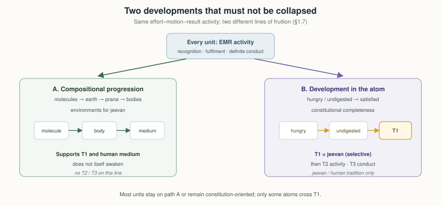
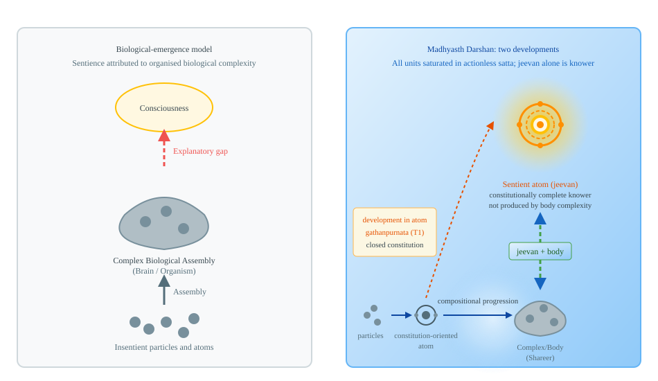
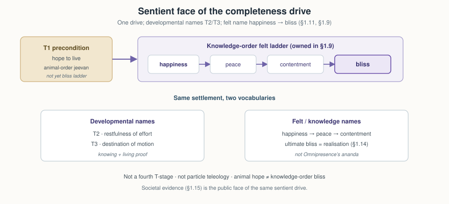
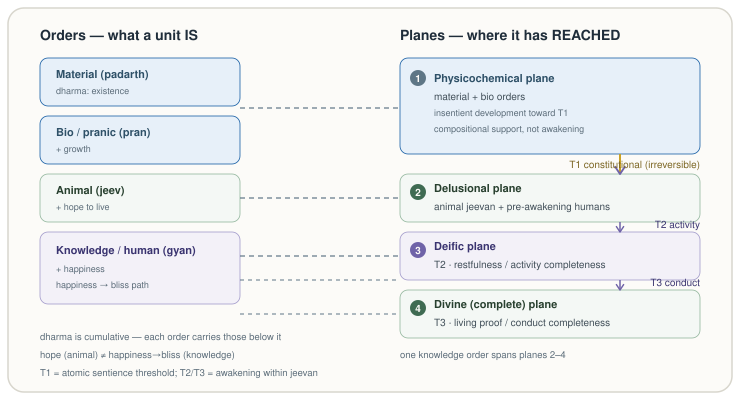
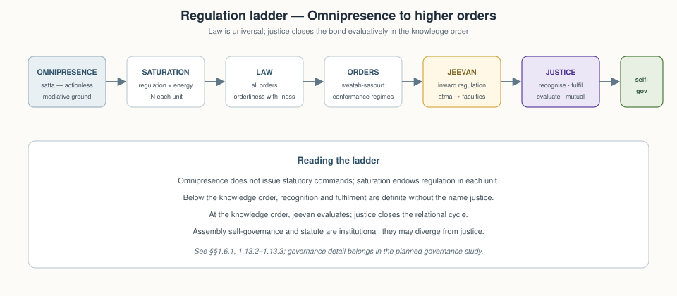
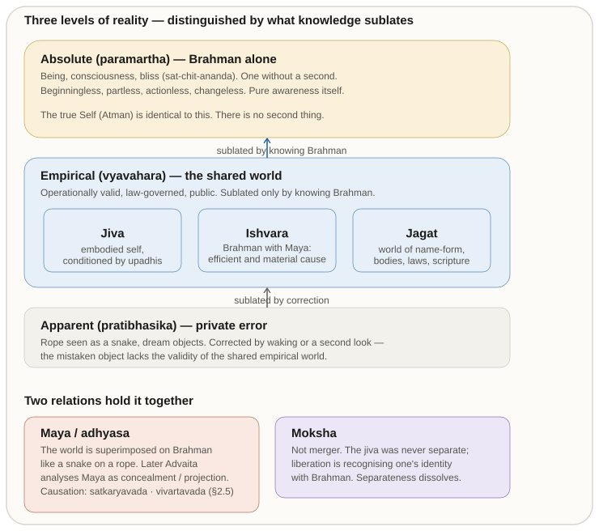
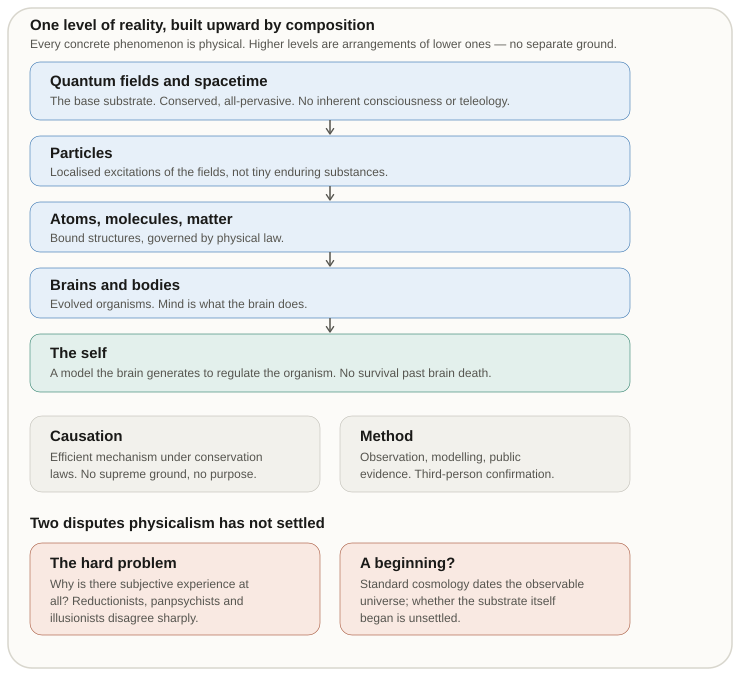
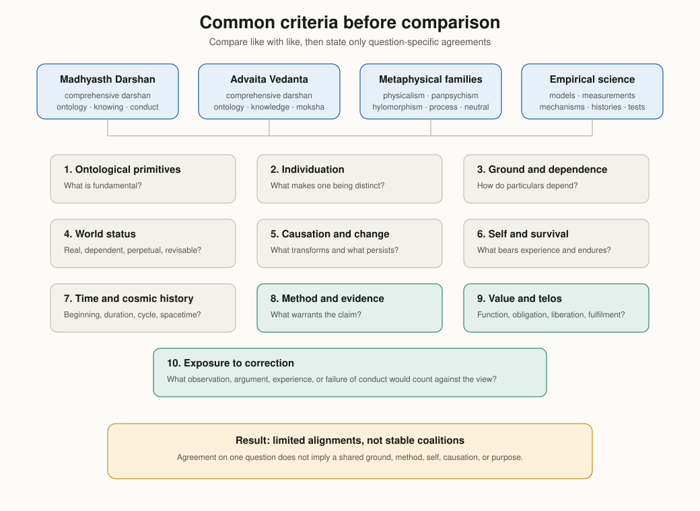

# The Ontology of Coexistence

**Author:** [AnalyticMadhyasthDarshan.org](https://github.com/raghavamohan/AnalyticMadhyasthDarshan) — a group of people studying Madhyasth Darshan philosophy. Source repository: [raghavamohan/AnalyticMadhyasthDarshan](https://github.com/raghavamohan/AnalyticMadhyasthDarshan).

**Edited on:** September 4, 2026, 5:31 AM IST
**Status:** Released

**The question:** What is Existence? What exists? Does what exists begin at some time? Does the individual self (*jeevan*) begin or end with the body? Is the world finally real?

This study examines those questions in Madhyasth Darshan (Co-existentialism), as presented by Shri A. Nagraj, and compares its answers with Advaita Vedanta and selected modern philosophical and scientific approaches to physical reality, consciousness, and selfhood. The core claim about time is stated in §1.14 — that *kaal* is duration of unit-activity and *satta* is timeless as ground; full treatment of time (*kaal*), *trikaalabadh*, and spacetime physics is in [*Nature of Time*](../Nature-Of-Time/Nature-Of-Time.pdf).

## Standpoint and scope

These studies are written from the standpoint of a scientist and technologist trained to graduate-level physics and mathematics and familiar with contemporary cosmology, quantum theory, conservation laws, and formal models. From that background, matter-first explanations are familiar: contemporary positions variously identify consciousness with brain processes, explain it through functional organisation, or treat it as emergent from physical activity. The natural sciences powerfully constrain any credible ontology through mechanism, prediction, and public evidence, but their success does not by itself establish metaphysical physicalism. The hard problem of consciousness, the status of the self, and the reality of value remain contested rather than settled in favour of matter-only reductionism.

The study reads Madhyasth Darshan's primary texts and reconstructs their ontological claims before comparing them in parallel with Advaita Vedanta, modern Western philosophy, physics, and the natural sciences. Its principal translated base is *Madhyasth Darshan — Co-existentialism* (MVD), *Samadhanatmak Bhautikvad* (*Resolution Centred Materialism*, SB), and *Jeevan Vidya: An Introduction* (JV). *Manav Karm Darshan* (KD) is used through the Hindi text and an identified working-English paraphrase where the Hindi has been checked; claims based on it are marked accordingly in the references. Physics and mathematics are therefore one leg of the comparison, not the sole framework into which the other traditions must be translated.

The aim is rigorous comparative understanding — testing definitions, internal consistency, explanatory reach, and fit with public knowledge — rather than persuasion or devotional endorsement. Different traditions admit different forms of warrant, but that does not place them beyond structured comparison. Logical grounding, first-person verification, evidence in conduct, and instrument-based scientific confirmation are kept distinct so that agreement at one level is not mistaken for agreement at every level. Physics, neuroscience, and comparative argument do not by themselves establish immortal *jeevan*, constitutional completeness, or continuity across bodily death; those remain explicit points for examination.

The study's scope is also limited by work developed elsewhere in this series. Full knowability is treated in [*The Epistemology of Coexistence*](../The-Epistemology-of-Coexistence/The-Epistemology-of-Coexistence.pdf) §7.1; time, *trikaalabadh*, and spacetime in [*Nature of Time*](../Nature-Of-Time/Nature-Of-Time.pdf); and institutional governance, *dharma-niti*, *rajya-niti*, and statutory order in the planned [*Governance Justice and Undivided Society*](../Governance-Justice-And-Undivided-Society/Governance-Justice-And-Undivided-Society.pdf), with [*How to Form Self-Sustaining Organizations*](../How-To-Form-Self-Sustaining-Organizations/How-To-Form-Self-Sustaining-Organizations.pdf) applying the assembly template socially. Editorial conventions for *satta*, *gyan*, and related terms are stated in the Editorial Notes. Clear and checkable prose is the present priority; a separate formal mathematical treatment may follow once definitions are stable across the series, but this study does not require it.

## 1. The Madhyasth Darshan Answer

Madhyasth Darshan holds that existence is coexistence: the eternal, inseparable presence of formless Omnipresence (*satta*) and countless formful units of nature. The units are insentient and sentient, bounded and active, while Omnipresence is all-pervasive, non-transforming, and without activity of its own. Neither is produced from the other. Units do not first exist independently and later enter coexistence; they are present only as nature saturated in Omnipresence.

This ontology connects what exists with how it participates. Every unit is a definite, bounded bearer whose form, properties, essential nature, and dharma become evident in mutuality; it exists as a whole with its environment, recognises and fulfils according to its order, and participates in orderliness. These four aspects are neither detachable attributes nor values assigned by an observer. Form is reflected in mutual facing, properties operate as relative effects, essential nature is recognised as their usefulness, and dharma is evidenced as the unit's inseparable innateness and fulfilment. Development occurs along two distinct but coordinated lines. Compositional progression builds atoms, molecules, cells, bodies, and environments. Development in the atom reaches constitutional completeness as *jeevan* and continues, through the human joint form, toward activity completeness and conduct completeness. The first line supplies bodies and conditions; the second supplies the sentient unit and its awakening. Keeping these lines distinct is necessary for understanding the four orders and the transition from insentient to sentient nature.

### 1.1 Coexistence: Omnipresence and units

Omnipresence is formless, all-pervasive, transparent, permeating, non-transforming, and immeasurable. The texts present transparence, permeability, and pervasiveness together as what makes it evident as one indivisible reality. Because the pervasive reality passes through every unit rather than merely enclosing it, no division of a unit can place any fragment outside it (§1.2). It is described in the English translations by names including Omnipotence, Uniform Energy, Space, Knowledge, Consciousness, Omnipresence, and Absolute Energy. These names indicate one pervasive reality from different standpoints. Knowledge or Consciousness in this usage does not mean a universal mind performing acts of cognition. Knowing, believing, and realising are activities of *jeevan*; Omnipresence remains actionless and without motion, wave, or pressure.

Nature is present as countless formful units within Omnipresence. Every unit is bounded from six directions and remains surrounded, submerged, and soaked in the pervasive reality. Units are distinct from one another by their boundaries, not by separation from Omnipresence. What appears as empty distance between units is the same pervasive reality in which both are present. Omnipresence has no absent place, including where no local unit is perceived.

At the root of physical, chemical, and *jeevan* activity is the atom, constituted by a nucleus and particles in orbits. An atom is the root unit. The word *unit* is also used at larger organisational scales, but not always in the same sense. A molecule, cell, body, planet, or other organised whole can be treated as a composite unit while its definite composition and conduct remain established. When that composition disintegrates, the composite form ends while its constituent units continue in other relations.

A body–*jeevan* joint form and a human assembly are coordinated wholes of still other kinds; neither is one atomic constitution. Distinguishing root units, composite units, joint forms, and assemblies keeps the perpetuity of what exists separate from the permanence of any compound, body, or institution. Mixtures and compounds are distinguished in §1.10.

Omnipresence is state-complete: it does not transform. Nature is state-dynamic: units remain active; material units and configurations combine and separate, developing atoms can attain constitutional completeness, and *jeevan* can awaken. Change therefore belongs to units and their configurations, not to the pervasive ground. What exists does not arise from non-being or pass into non-being; configurations change while coexistence remains perpetually present. Perpetuity applies to coexistence and the realities participating in transformation, not to the unchanging survival of every composite form (§1.14).

### 1.2 Saturation: the ground–unit bond

The texts name the inseparability of Omnipresence and nature *saturation* (*sampriktata*): every unit is soaked, submerged, and surrounded in the pervasive reality. Saturation is not a transfer of substance from a finite store or an action performed upon otherwise independent matter. It names the way every unit exists. Omnipresence is not an external efficient cause — a creator or outside controller producing particular changes. Activities and transformations occur in mutuality among units.

Saturation holds because the pervasive reality is permeating. However often a unit is divided, every fragment remains soaked, submerged, and surrounded; there is no division that yields a remainder standing outside the ground. Two consequences follow directly. A unit cannot be annihilated, since annihilation would require a fragment separated from what it is saturated in. And no unit is at any stage independent of the ground and later joined to it, which is why saturation names a condition rather than an event.

The three terms — soaked, submerged, and surrounded — are not three words for one relation. Each carries a distinct entailment. Being soaked is forcefulness. Being submerged is why every unit has the pervasive reality on all sides and is never devoid of the energy evident in its activity. Being surrounded is what makes a unit regulated, held at definite distance from other units by the formless reality standing between them. Read together on the unit side, saturation is evident as energy-fullness and forcefulness, and the primary texts state the resulting sequence as saturation, energy-fullness, forcefulness or magnetic-force endowment, recognition, and participation in orderliness. The relation between unithood (*ikaitva*) and energy-fullness is stated in the texts as a bare identity: a unit together with energy-fullness is activeness. Madhyasth Darshan presents this as an ontological entailment of saturated unithood, not as a temporal sequence or an explicitly described physical mechanism. Energy-fullness names the unit as never devoid of the energy evident in activity; forcefulness names it as the bearer of definite relative power; recognition is its definite responsiveness to another unit; and fulfilment is the resulting participation according to constitution and order.

Recognition below the human order does not mean reflective cognition. An atomic particle recognises another when it responds according to definite constitution, distance, force, and relation; its fulfilment is the resulting definite conduct. Heat accepted and redistributed by matter, particles maintaining definite distance in an atom, and atoms combining in definite ways are examples used to clarify recognition in the insentient orders. Knowing and believing are additional activities of sentient nature in the human joint form.

Activeness is expressed through the inseparable triad of effort, motion, and result. These are not three successive moments. Every physical and chemical activity bears all three together: effort as active tendency, motion as its state of change, and result as the condition attained. Force is recognised in state and power in motion. Relative energy becomes evident through mutuality; an isolated unit is not the model of activity in coexistence.

Regulation is what surroundedness establishes. Omnipresence does not issue commands, yet units surrounded by it remain regulated and conserved through their own mediative organisation. In an atom, the nucleus is the mediative activity by which generative and degenerative tendencies and relative powers remain regulated. Regulation becomes evident as law and definite conduct, developed further in §1.11.

Madhyasth Darshan also states that nature saturated in Omnipresence is knowledge: coexistence itself is the complete content available to be known. This means that existence is intelligible and studiable, not that each insentient particle knows or that Omnipresence is a personal knower. The knower is *jeevan*, and the complete object of knowledge is nature saturated in Omnipresence.

### 1.3 The unit and its four aspects in mutuality

Every unit has four inseparable aspects: form (*roop*), properties (*guna*), essential nature (*svabhav*), and *dharma*. They do not constitute a four-field inventory of predetermined observable values. Form is shape, volume, and density: the real framework by which a unit is bounded and individuated. In mutual facing it is reflected or imaged to another unit. Reflection is how form becomes present across a mutuality; it does not mean that the facing unit creates the form.

Properties are relative powers. The texts call the unit force or the property-endowed bearer (*guni*) and call power its property; bearer and property are inseparable. *Guna* becomes effective as the generative, degenerative, or mediative influence that arises when more than one unit comes together. Essential nature is the essentiality or usefulness of those effects in an order and context. It is revealed, communicated, and expressed according to state, motion, developmental plane, and order. *Dharma* is the inseparable innateness and fulfilment of the unit. Existence or indestructibility is common to the realities that participate in composition; it does not make each composite organisation permanent. Growth, hope to live, and happiness are cumulatively stated in the higher orders.

The texts distinguish the universal attribution of these aspects from their concrete differentiation. That every saturated unit has form, properties, essential nature, and *dharma* is an ontological statement about unithood in coexistence; it does not mean that saturation supplies a prewritten list of context-free outcomes. In the material order, atomic constitution and motion-path differentiate form and the capacities through which relative powers can operate. Atomic kind, state, and measure vary with nuclear and orbital particle constitution, and a developing atom changes in form and properties as its constitution changes. Structure therefore bears and constrains what the unit can express.

Structure is not a complete reduction of the four aspects. The actual *guna* is the definite effect that arises when units come together; *svabhav* names the essentiality or usefulness of that effect; and *dharma* names the unit's order-specific innateness and fulfilment. Definite composition can establish a new bounded unit and conduct, but the primary texts do not provide a quantitative derivation from a particular particle configuration to every higher-order *svabhav* or *dharma*. They give a progression from constitution to qualitative difference and from composition to new conduct, while the order-specific content of essential nature and *dharma* remains taught ontological content.

Relational expression does not make insentient conduct observer-relative or indefinite. Given the participating units, their constitutions, state, motion, distance, and environment, reflection, relative effect, recognition, and fulfilment are definite. Different mutualities can yield different definite effects without any unit mis-evaluating what occurs. Mis-evaluation becomes possible only in sentient living and becomes an explicit human problem when *jeevan* mistakes the body for the self (§§1.6.2, 1.7).

Each unit is a whole along with its environment. This does not erase its boundary: wholeness means that the unit's activity and conduct cannot be understood apart from the mutualities in which they occur. Each unit is orderliness with its own “ness” and participates in overall orderliness. Its “ness” is neither an empty relational node nor a context-free list of manifested values. It is the definite bearer, constitution, capacity, and order that remain identifiable while particular reflections, effects, and usefulness become evident in specific mutualities.

The natural state is the condition in which a unit's activity accords with its innateness and definite conduct. The excited state is activity displaced from that accord by pressure from a mutuality and therefore carries the possibility of decline. These words do not mean psychological calm and excitement. In physicochemical exchange, units give and take and then reinstate natural-state motion. *Development* here means movement toward fuller order-definite expression; *decline* means movement away from it. This must not be confused with the claim that every particle will become *jeevan*: units participate in development according to their constitution and order, while constitutional completeness is attained only by some developing atoms.

The peepal tree illustrates the four aspects without reducing them to a static list:

| Aspect | Peepal-tree example |
|---|---|
| Form (*roop*) | The particular tree is a bounded biological composition with a definite organisation of roots, trunk, branches, leaves, fruit, and seeds. Its form belongs to the tree; another unit encounters its reflection or image but does not create it. |
| Property (*guna*) | The composition bears relative powers that become effective in mutuality. A seed with conducive soil, water, and environment participates in a generative effect; the living composition maintains organised activity; after disintegration its constituents participate in degenerative effects. |
| Essential nature (*svabhav*) | The order-specific usefulness of those effects is expressed in the pranic order as vitalising or devitalising according to the affected body and conditions. Context determines which definite usefulness appears; it does not make the tree's constitution arbitrary. |
| *Dharma* | The pranic-order *dharma* is existence and growth. Seed-conformance carries the peepal composition method forward, but it is the mode of definite conduct through which growth continues, not an additional *dharma*. |

At the human order, definite bodily composition is not sufficient for humane conduct; knowing and believing must guide recognition, evaluation, and fulfilment.

### 1.4 Units in relationships

Nothing in nature exists in isolation. Complementarity and mutual recognition are eternally present in coexistence and become evident through relationships among units. At the physical and chemical level, complementarity is expressed as definite interaction and composition. In the biological order it is expressed through nourishment, growth, seed-conformance, and the composition method of cells. In the animal order, sentient selection and taste-recognition are expressed through the limited bodily medium under species-conformance. In the knowledge order, the fully developed human bodily medium makes knowing, believing, recognising, evaluating, and fulfilling available as one coherent possibility.

The primary texts distinguish relationship from contact. A relationship is a mutuality whose expectations are inherent in the sense of completeness; a contact is a mutuality whose expectations are voluntary. Parent and child exemplify a relationship whose values require recognition and fulfilment. Neighbours sharing a wall may have a contact whose terms they choose. Both occur in coexistence, but only the former carries the full relational expectation named in the human value account.

Value likewise has order-specific expression. Essentiality in every order and plane is value in the broad ontological sense: the usefulness through which a unit is complementary to others. For human living, MVD names five value families; because the final family contains two object values, the same list may be counted as six types when usefulness and art are separated. The primary texts distribute their explanations across discussions of production, relationship, *jeevan*, and humane conduct rather than supplying one exhaustive taxonomy in a single place.

| Value family | Principal content and field |
|---|---|
| Object values | Usefulness is the definite utility of a material object; art or aesthetic value adds meaningful convenience and beauty to usefulness. These are two values within one object-value family. |
| *Jeevan* values | Happiness, peace, contentment, and bliss name harmony within the sentient unit (§1.8). |
| Human values | The values through which humaneness is evidenced. The primary texts discuss this domain across separate passages rather than give one closed list; the closely related humane and higher-humane essential natures are fortitude, courage, generosity, kindness, grace, and compassion. |
| Established values | Trust, respect, affection, care, guidance, reverence, gratitude, glory, and love become evident when human relationships are recognised and fulfilled. |
| Civic (*shishta*) values | Right-use and purposeful-use of body, mind, and wealth make values evident in social participation. The MVD English translation uses *civic values* for *shishta-mulya*; *expression values* is an explanatory rendering, not a separate sixth family. |

These families are related but not interchangeable. Inner harmony, humane disposition, relationship-fulfilment, responsible social expression, and the usefulness of objects answer different evaluative questions.

Where each kind of value stands in existence is what keeps the account ontological. Object value is spread in units: usefulness belongs to the object and is recognised in mutuality. The named values of the other four families are borne by *jeevan* itself. The primary texts define them in the same place they define *jeevan*'s activities, setting each named value at one of the faculties of §1.7 and pairing what that faculty bears in state with the expression through which it is carried outward (MVD, pp. 328–348; AVD, pp. 91–94). A value in *jeevan* is accordingly an activity of a faculty, identified by what it does rather than by how it feels. Happiness, peace, contentment, and bliss are borne at *mun*, *vritti*, *chitta*, and *buddhi* (§1.8); the nine established values are borne three each at *chitta*, *vritti*, and *mun*, each paired with the civic value that expresses it; the humane essential natures are named at *vritti* and *mun*, some at positions of their own and some as the expression paired with another value. Family and faculty are two partitions of the same content — a value belongs to a family by the evaluative question it answers and to a faculty by what bears it — and neither is derived from the other (Editorial Notes).

Bearing a value and evidencing it remain distinct. Values are recognised and fulfilled in relationship, and where relationships are not recognised they do not flow (JV, p. 55). The faculty account states what a named value is and where it is borne; the evaluative account of §1.12 states how its fulfilment is judged. The full enumeration and its unresolved readings are set out in [*The Sixty-One Activity Pairs of Jeevan*](../The-Epistemology-of-Coexistence/Research-Note-Activity-Pair-Inventory.pdf), and the value families are developed in [*Axiology: Value Theory*](../Axiology-Value-Theory/Axiology-Value-Theory.pdf) §§1.1–1.3.

Recognition and fulfilment are definite below the knowledge order according to structural, seed, and species conformance. Animals do not fail to perform a human evaluation; their narrower expression follows from the bodily medium described in §1.7. Human evaluation can succeed or fail because freedom of action operates while knowing and believing may remain disconnected from recognition and fulfilment. Inherent provision still requires conducive conditions: a seed germinates in a suitable environment, and the human possibility of awakening requires an environment in which understanding can be studied, practised, and evidenced.

### 1.5 The four orders of nature

Nature is organised into four orders: material, bio or pranic, animal, and knowledge or human. Higher-order bodies contain and organise material and pranic compositions, thereby evidencing existence and growth. In the animal and knowledge orders, hope to live and happiness belong to the *jeevan*–body joint form: the body provides the expression medium, while the further *dharma* is attributed to *jeevan*. The higher orders therefore include the lower-order *dharmas* while adding a further *dharma* and a distinctive mode in which essential nature is expressed. The table names order-definite patterns, not scalar properties that appear identically in every context.

| Order | Principal manifestation | Order-specific expression of essential nature | Dharma, cumulatively stated |
|---|---|---|---|
| Material | Atoms, molecules, physical and chemical compositions | integration–disintegration | existence |
| Bio (pranic) | Biological cells, vegetation, bodily composition | vitalising–devitalising | existence and growth |
| Animal | Body–jeevan joint form under species-conformance | cruel–uncruel | existence, growth, and hope to live |
| Knowledge (human) | Human body–jeevan joint form with knowing and believing | fortitude, courage, generosity, kindness, grace, compassion | existence, growth, hope to live, and happiness |

Integration and disintegration name effects among material constituents. Vitalising and devitalising name whether a biological or chemical composition supports or obstructs bodily nourishment and protection in the relevant context. Cruelty is intrinsically relational because it means causing suffering to another; non-cruelty is its order-specific complement. Humane essential nature is evidenced through qualities fulfilled in behaviour and relationship. These are definite forms of participation, although the human can misrecognise or fail to fulfil them under delusion.

The material and bio orders are insentient. The animal and knowledge orders are joint expressions of insentient body and sentient *jeevan*. Hope to live is the animal-order dharma and is expressed through *mun* in *jeevan*. The animal body provides for hope-bound, species-conformant expression; the human body provides for imagination, freedom of action, knowing, believing, and the full possibility of awakening. The bodily-medium distinction is developed once in §1.7. Happiness is the human dharma because the human seeks not merely continued living but resolution and the continuity of happiness.

Two developmental lines therefore meet in the animal and human joint forms: compositional progression supplies the body, while development in the atom supplies constitutionally complete *jeevan*. Their stages and limits are set out in §1.6; biological complexity alone is not identified with sentience.

Existential progression names the definite order in which the orders become manifest under conducive conditions: material, pranic, animal, and knowledge. The way of existence names the conformance by which each order maintains definite conduct: result- or structure-conformance, seed-conformance, species-conformance, and sanskar-conformance. This fixed order does not imply that every instance advances to the next order. Biological compositions return to material constituents after disintegration, and most atoms remain engaged in physical and chemical constitution rather than attaining constitutional completeness.

### 1.6 The completeness drive and transitions (T1, T2, T3)

The primary texts state that nature saturated in state-complete Omnipresence is oriented toward development and awakening until realisation in Omnipresence. Development in its full sense includes constitutional completeness, activity completeness, conduct completeness, and their continuity. Awakening is resolution and authenticity. “Oriented” here names the direction inherent in the order of coexistence; it does not mean that every unit traverses all three stages.

Compositional progression and development in the atom must remain distinct. Compositions develop up to the human body and provide the environments in which sentient life is expressed. The atom alone reaches constitutional completeness. Once constitutionally complete, the atom is *jeevan*; activity and conduct completeness are further qualitative stages of *jeevan* expressed through the human joint form.

The triad of effort, motion, and result is mapped to three developmental goals. The result is oriented toward immortality of constitution; effort toward restfulness; motion toward its destination. Constitutional completeness makes the result non-decomposable as *jeevan*. Activity completeness settles the internal effort of seeking through realisation and resolution. Conduct completeness settles outward motion as humane conduct and participation in universal orderliness.

| Transition | Completeness | Principal goal | What is established |
|---|---|---|---|
| T1 | Constitutional completeness | Immortality of result | Constitutionally complete sentient atom, *jeevan* |
| T2 | Activity completeness | Restfulness of effort | Realisation and resolution in awakened *jeevan* |
| T3 | Conduct completeness | Destination of motion | Authentic conduct and living proof in tradition |

The table is an analytical consolidation of statements distributed across MVD, SB, and KD. It does not mean that effort, motion, and result can be separated or that the stages unfold mechanically. Each activity bears the triad; the named goal indicates what becomes complete at each transition. In plain terms, T1 stabilises the sentient bearer, T2 settles the knower's search through realisation, and T3 establishes the continuity of that understanding in conduct.

### 1.6.1 Constitutional completeness (T1)

Development in the atom culminates when an evolving constitution becomes satisfied. Constitution-oriented atoms are described as hungry when they can absorb particles and undigested or overfull when they carry particles they seek to expel. Through absorption and displacement, atoms return to natural-state motion or participate in further constitution. When the particles required for a particular developing constitution are integrated, that constitution becomes complete.

Constitutional completeness is an irreversible transition. Up to that point the two kinds of change are tied together: in matter, qualitative change does not occur without quantitative change in constitution, which is why atomic kind and capacity track particle number. Completeness separates them, and that separation is the criterion. The particle constitution is closed: qualitative activity continues, but particles no longer increase or decrease. The atom is described as liberated from molecular-bondage and weight-bondage and established in hope-bondage. These source terms mark a change of ontological status: it no longer participates as a weighable atom bound into molecular composition, while its sentient activity is organised around hope. They are not operational categories already identified in contemporary chemistry; the missing measurement bridge is kept explicit in §6.2.1. The atom is then *jeevan*, with inexhaustible force and power expressed as hope, thought, desire, resolve, and evidence. The texts present this as the transition of an insentient constitution-oriented atom into sentient status, not as the growth of a body or brain into *jeevan*.

T1 changes the mode of recognition. Insentient recognition is definite conduct in mutuality. In *jeevan*, recognition is joined to an internal circuit of five faculties and ten activities: *mun* expresses hope through selection and taste-recognition, while the further faculties provide thought, desire, resolve, enlightenment, authenticity, and realisation. All belong to the constitutionally complete unit. Their bodily evidence nevertheless depends on the medium through which *jeevan* operates. Animal bodies permit a narrower expression through hope to live and species-conformance; the fully developed human nervous system makes the complete circuit available for awakening.

### 1.6.2 Activity completeness (T2)

Activity completeness is restfulness of effort. The texts define restfulness as the absence of delusion. Delusion is not absence of activity: *jeevan* continues hoping, thinking, desiring, acting, and undergoing results while mistaking the body for the self. The unresolved effort is the continual search for happiness without understanding *jeevan*, coexistence, and humane conduct well enough to guide living.

In the seer–doer–enjoyer account, deluded human *jeevan* acts and undergoes results while the seer-status is not fully evidenced. Human awakening establishes that status: *jeevan* understands coexistence and itself as the knower, so doing and enjoying are guided by seeing. Activity completeness is attained when knowing, believing, recognising, and fulfilling become coherent through realisation. The structure of that knowing is explained through *jeevan*'s faculties in §1.7 and its felt harmony in §1.8.

### 1.6.3 Conduct completeness (T3)

Conduct completeness is the destination of motion. Understanding must be expressed through work, behaviour, and participation in orderliness. Projection without truthful understanding can reproduce delusion; reflection without projection remains unevidenced. At conduct completeness, the seer, doer, and enjoyer are evident together: understanding guides action, action fulfils relationships, and the result is mutual satisfaction rather than private gratification alone.

T3 is therefore not a second name for T2. T2 concerns the settlement of *jeevan*'s internal activity in realisation and resolution. T3 concerns the continuity of that resolution as authentic conduct and living proof in human tradition. The human goals and social dimensions through which it is evidenced are developed in §1.15.

### 1.7 Jeevan: structure and faculties

*Jeevan* is the constitutionally complete sentient atom. It is distinct from the physical body and is expressed through an appropriate body in the animal and human orders. In the human joint form, *jeevan* is the knower and the body is its medium. The body supplies sense organs, brain, and capacities for physical expression; *jeevan* supplies hope, thought, desire, resolve, enlightenment, authenticity, and realisation. These two contributions must not be collapsed: a bodily limitation restricts expression through that body, whereas delusion concerns how *jeevan* identifies, understands, and organises its own activity.

The primary texts describe five inseparable strengths or faculties in *jeevan*. Atma is the nucleus; buddhi, chitta, vritti, and mun are associated with the first through fourth orbits. Each has a power in projection and a corresponding activity in reflection.

| Strength / faculty | Projection | Reflection |
|---|---|---|
| Mun / hope | selection | taste-recognition |
| Vritti / thought | analysis | deliberation |
| Chitta / desire | visualisation | contemplation |
| Buddhi | resolve | enlightenment |
| Atma | authenticity | realisation |

These are the ten activities of *jeevan*. The texts say that every *jeevan* operates through all ten, while distinguishing their presence from their effective organisation and evidence in living. Projection is the outward evidencing direction: understanding is expressed through resolve, thought, selection, work, and behaviour. Reflection is the inward knowing direction: experience and study are accepted, compared, directly recognised, enlightened, and realised. The same faculties are described as force in state and power in motion; these are not additional faculties.

The ten are also enumerated in finer grain as named positions at each faculty, whose two members are again what the faculty bears in state and what carries it outward (MVD, pp. 328–348; AVD, pp. 91–94). The named values of §1.4 belong to that enumeration. It supplies content for the ten rather than a further set of faculties, and this study draws on it only for the placement recorded in §1.4 and §1.8.

Study proceeds inward by the reflection circuit. Truth in the form of coexistence is accepted in *mun*, qualitatively deliberated in *vritti*, directly recognised in *chitta*, and enlightened in *buddhi*. Buddhi's accordance with atma culminates in realisation. Projection then expresses realisation through authenticity, enlightenment, resolve, contemplation, deliberation, taste, and selection as conduct. Reflection is the ascent of understanding; projection is the descent of evidence.

In animal living, the body has a brain and sensory organisation but not the fully enriched nervous system of the human body. It therefore mediates hope-bound selection, taste-recognition, and species-conformant conduct without providing for the complete evidence of understanding. This is a limitation of bodily expression, not an animal's erroneous attempt at human evaluation.

The human body supplies the developed medium required for the full circuit, but bodily provision does not itself produce awakening. In deluded human living, *jeevan* identifies itself with the body and organises only four and a half activities effectively around bodily sensitivity: selection, taste, analysis, visualisation, and deliberation restricted to pleasant–unpleasant, healthy–unhealthy, and profit–loss. The source calls this restricted deliberation a *half* activity because it does not extend to the perspectives of justice, dharma, and truth; it is not a claim that vritti operates for half the time or that half a faculty is missing. The remaining activities are likewise present in *jeevan* but lack the content and coherent direction of understanding in conduct. The human recognises and fulfils sensory aims without joining them to complete knowing and believing.

The texts distinguish sensitivity (*sanvedansheelta*) from cognisance (*sangyansheelta*). Sensitivity is responsiveness through the body and senses; cognisance is *jeevan*'s understanding of relationship, value, and orderliness. Awakening does not eliminate sensitivity. It brings sensory recognition and fulfilment under the guidance of knowing and believing, so cognisance and sensitivity operate in balance rather than as rival capacities.

Awakening is staged by the direction from which the faculties are regulated. In the partially awakened condition, mun and vritti are driven by chitta. In the half-awakened condition, mun, vritti, and chitta are guided by buddhi, while resolve remains without self-realisation. In awakening, atma regulates and disciplines buddhi, chitta, vritti, and mun; knowing, believing, recognising, and fulfilling become one coherent activity. Study supplies the content of understanding, while practice evidences and stabilises that understanding in behaviour. Practice does not manufacture dormant faculties; projection, reflection, study, practice, and karma describe how the activities already present in *jeevan* become coherently effective and publicly evident.

### 1.7.1 Karma: desire, activity, and result

Effort–motion–result is the structure of *kriyā*, or activity, throughout nature. In the sentient unit it is expressed through projection and reflection. When the human intends and acts through the body, the same structure is studied as desire, karma, and result.

*Kriyā* is not thereby *karma*. KD states that activity together with aspiration is karma, and motion together with awareness is complete activity. *Complete activity* here translates KD's description of motion joined to awareness; it is not another name for T2 activity completeness. Every karma has a result. Five limbs are contained in karma: doer, cause, objective, result, and effect. Their distinction allows an action to be evaluated without confusing the actor, motive, intended aim, attained result, and wider consequence. The balance of desire, karma, and result is accomplishment of the desire.

Karma therefore names neither bare activity nor physicochemical *kriyā*. It is the human expression of activity under freedom of action, not an action attributed to insentient units. Deluded humans are independent while performing actions but dependent while undergoing their results. Awakened humans are described as independent in both because understanding precedes action and the attained result is evaluated and received within resolution. This does not mean that an awakened person chooses, cancels, or escapes causal consequences; it means that undergoing them does not create unresolved dependence or contradiction. Living proof requires understanding to become conduct; insight that does not regulate action has not completed the projection–reflection cycle.

### 1.8 Jeevan harmonies and experience

Happiness, peace, contentment, and bliss are *jeevan* values: names for harmony among its faculties. Happiness is harmony between mun and vritti; peace between vritti and chitta; contentment between chitta and buddhi; bliss between buddhi and atma. These are also described as four stages of happiness.

Each is at the same time one of the named activities of §1.7, borne by the outer faculty of its pair: happiness at *mun*, peace at *vritti*, contentment at *chitta*, and bliss at *buddhi* (MVD, pp. 328–346). The two descriptions do not compete. Peace is defined at *vritti* as the absence of resistance between desire and thought, which are the orientations of *chitta* and *vritti*, so naming the harmony of a pair and naming what the outer faculty bears give one account twice. A harmony is accordingly established in a faculty rather than delivered to it, and its failure is a failure of concurrence with the faculty below rather than a shortage passed down from above. Realisation in coexistence at *atma* is ultimate bliss (*paramanand*), whose effect reaches the remaining faculties (MVD, pp. 100–101); it is the ground of the four rather than a fifth value beside them.

The movement is not a sequence of temporary moods. It describes progressively complete coherence in the activity of *jeevan*. Curiosity in mun, enthusiasm in vritti, delight in chitta, elation and immersion in buddhi, and realisation in atma name the inward channel of energies toward awakening. Inward regulation is the discipline of the orbital faculties by mediative atma, followed by regulation of bodily activity through understanding.

The four *jeevan* values correspond to human goals in living:

| Jeevan value | Borne at | Faculty harmony | Human goal and field of evidence |
|---|---|---|---|
| Happiness | mun | mun–vritti | Resolution in the person |
| Peace | vritti | vritti–chitta | Resolution and prosperity in the family |
| Contentment | chitta | chitta–buddhi | Orderly living and fearlessness in society |
| Bliss | buddhi | buddhi–atma | Evidencing understanding and coexistence |

This is a claimed correspondence between inner harmony and widening fields of evidence, not a derivation in which a faculty pair mechanically produces a social institution. Resolution is first evident in the person, peace is tested in family prosperity, contentment in fearless social participation, and bliss in the communication and living of coexistence.

Awakening develops through repeated reflection and projection. By reflection, one understands; through projection, that understanding is made evident. KD describes evidence widening from one issue to further issues, each accomplished understanding becoming the basis for the next projection. Book knowledge alone is not the completion of this process. Study, practice, work, behaviour, result, and purpose must become coherent.

*Jeevan* does not cease when the body sleeps, and MD states that it does not cease when the body dies. Because its constitution is complete and no longer subject to particle increase or decrease, it continues after separation from a body. JV also describes its subsequent association with another body. These are claims of the primary texts grounded in the doctrine of constitutional completeness; their relation to public evidence is considered in §6.2.

### 1.9 Progressions and planes

The texts use four progress-terms for different aspects of the map. They should not be collapsed into one evolutionary sequence.

### 1.9.1 Four progressions

| Progression | Meaning |
|---|---|
| Existential progression (*niyati-kram*) | Definite order in which material, pranic, animal, and knowledge orders become manifest under appropriate conditions |
| Way of existence (*niyati-vidhi*) | Definite conformance by which each order maintains conduct |
| Development progression (*vikas-kram*) | Physicochemical development and composition, including constitution-oriented atoms, until constitutional completeness becomes possible |
| Awakening progression (*jagriti-kram*) | Qualitative development within constitutionally complete *jeevan* toward activity and conduct completeness |

Existential progression and the way of existence describe the order scale. Development progression and awakening progression distinguish the atomic and sentient path. In this study, the definite order of *niyati-kram* is presented as MD's ontological ordering of manifestation under conducive conditions. It does not by itself say that every instance advances, supply a deterministic historical timetable, or settle how necessary emergence relates to evolutionary contingency; that open comparison is stated in §6.2.3. At the animal-order junction, compositional progression supplies the body and development in the atom supplies constitutionally complete *jeevan*. In the knowledge order, the human body becomes the medium for the full awakening progression.

### 1.9.2 Four planes

Order identifies the kind of manifestation; plane identifies developmental standing. The four planes are physicochemical, delusional, deific, and divine or complete.

| Plane | Developmental standing |
|---|---|
| Physicochemical | Insentient constitution and composition before constitutional completeness |
| Delusional | Sentient *jeevan* without realisation; in humans, body taken as self |
| Deific | Activity completeness: realisation and resolution |
| Divine (complete) | Conduct completeness: living proof and its continuity |

Orders and planes are therefore not interchangeable. The crosswalk below shows how the main classifications meet without turning them into one sequence:

| Manifestation or human type | Developmental source | Plane and completeness | Characteristic expression |
|---|---|---|---|
| Material and pranic orders | Physicochemical composition | Physicochemical; before T1 | Structure- and seed-conformance |
| Animal joint form | Animal body from composition; *jeevan* from T1 | Constitutionally complete *jeevan* before awakening | Hope-bound, species-conformant expression; bodily limitation is not human body-identification |
| Animalistic-human and demonic-human | Human body with deluded *jeevan* | Delusional; T1 only | Body-identification and four-and-a-half activities organised around sensitivity |
| Humane or discerning human | Awakening progression becomes established | Movement from delusional toward deific; no fifth plane is added | Knowing and believing increasingly guide recognition and fulfilment |
| Deific-human | Awakening progression | Deific; T2 activity completeness | Realisation and resolution |
| Divine-human | Continuity of awakening | Divine; T3 conduct completeness | Authentic conduct and living proof in tradition |

The five human types classify modes of consciousness and conduct, not biological species or fixed social classes. The traditional plane name *delusional* covers sentient standing before realisation, but the specific error of taking the body as self applies to humans; an animal's narrower expression is a limitation of its bodily medium.

### 1.10 Composition and assemblies

There is a natural inclination toward coexistence throughout nature. Atomic particles assemble into atoms, atoms into molecules, and molecules into molecular forms. Compositional progression becomes evident in chemical substances, biological cells, vegetation, animal bodies, and the human body. Each level depends on definite composition method and conducive environment.

Composition does not by itself carry a unit beyond what composes it. Whatever a thing is constituted of, it remains of the order of that constituent, however vast the formation: objects made from soil remain soil, bodies built from pranic cells remain of the order of the pranic cell, and the Earth entire is of the order of the atoms, molecules, and cells composing it. Change of composition is therefore recognised as development or decline within an order, not as passage beyond it. This is why compositional progression supplies bodies and environments but never reaches constitutional completeness, and why development in the atom has to be kept distinct from it (§1.6).

Mixtures and compounds should be distinguished. In a mixture, components retain their respective conducts. In a compound, components combine in definite proportion and establish a new bounded unit with a new constitution, relational capacities, and order-specific conduct. Biological composition transmits its method through seed and lineage. Bodies in animal and human orders are species-conformant compositions built from pranic cells; their sentience belongs to the *jeevan* joined with the body, not to composition alone.

Human families and social assemblies are not compounds in the physicochemical sense. They exhibit a corresponding principle of continuity through relationship-fulfilment, but their order is achieved rather than chemically definite. Family, community, and society persist humanely when relationships are recognised, values fulfilled, evaluation completed, and mutual satisfaction achieved. Fear, force, or extraction may hold a group together temporarily but do not fulfil the MD definition of humane orderliness.

### 1.11 Regulation, law, and conformance

Regulation is inherent in nature saturated in Omnipresence. Omnipresence is mediative rather than directive: it is not a ruler issuing commands. The account operates at three levels. Omnipresence is the sustaining condition; the nucleus is the mediative organisation within an atom; and order-specific conformance is the definite conduct evident at larger scales. In atoms, the mediative nucleus regulates generative and degenerative activities and conserves relative powers.

Regulation becomes evident as law because every unit has provision for recognising and fulfilling according to definite constitution. The conformance modes are:

| Order | Conformance mode | Character |
|---|---|---|
| Material | Result- or structure-conformance | Definite |
| Bio (pranic) | Seed-conformance | Definite |
| Animal | Species-conformance | Definite in body and inherited conduct-pattern |
| Knowledge (human) | Sanskar-conformance | Achieved through knowing, believing, recognising, and fulfilling |

Animal conduct includes inherited species-patterns accepted from gestation and followed after birth. Human bodily composition also remains species-conformant, but human conduct is principally *jeevan*-based and sanskar-conformant. Education and tradition can therefore reproduce delusion or support awakening.

Law applies across all four orders as definite regulation. Justice is the human evaluative completion of relationship. Statutory or public law is an institutional codification and may or may not embody justice. Legality alone does not establish mutual satisfaction, while justice requires relationship, values, evaluation, and mutual fulfilment.

### 1.12 Evaluative perspectives and justice

Recognition and selection occur before the knowledge order. In animal expression, *jeevan* selects and recognises taste through hope-bound activity mediated by the animal body. The human distinction is explicit evaluation through six perspectives and the capacity to evaluate relationships, values, justice, dharma, and truth through knowing and believing, then to reorganise conduct accordingly. Error does not enter because the reflected actuality is indefinite; it enters when deluded *jeevan* evaluates from body-identification and treats sensory, bodily, or material criteria as exhaustive.

Human behaviour is expressed through six perspectives: pleasant–unpleasant, healthy–unhealthy, profit–loss, justice–injustice, dharma–adharma, and truth–untruth.

| Perspective | Principal domain | Place in humane evaluation |
|---|---|---|
| Pleasant–unpleasant | Sensation and instinct | Necessary but insufficient as organising standpoint |
| Healthy–unhealthy | Body | Necessary but insufficient as organising standpoint |
| Profit–loss | Material production and exchange | Necessary but insufficient as organising standpoint |
| Justice–injustice | Human relationship and behaviour | Humane regulation of conduct |
| Dharma–adharma | Thought and resolution | Humane regulation of thought |
| Truth–untruth | Existence as coexistence | Ground of realisation and knowledge |

The first three perspectives are not rejected in their proper domains. Food may be pleasant, bodily activity healthy, and production materially beneficial. Delusion occurs when these become the final refuge and overrule justice, resolution, and truth. Humane perspective subordinates sensory, bodily, and material aims to justice, dharma, and truth.

Unit dharma—the inseparable innateness of a unit—must be distinguished from the dharma–adharma perspective. The latter evaluates whether thought and policy support resolution and overall orderliness. Similarly, justice is both a perspective by which conduct is assessed and the name of a completed relational activity.

### 1.12.1 The dual role of justice

As a perspective, justice evaluates behaviour as just or unjust. As completed relational activity, justice is recognising relationships, fulfilling values, evaluating the fulfilment, and achieving mutual satisfaction. Trust, respect, affection, and other relationship values contribute to justice but are not individually identical with it.

The texts connect the evaluative domains in a widening chain: law becomes evident as justice; justice as dharma; dharma as truth; truth as abundance or coexistence; and realisation in coexistence as bliss. This is not a literal transformation or identity among the terms. It widens the field of evaluation: definite regulation is completed humanly as justice in behaviour, justice is grounded in resolved thought as dharma, dharma is assessed against truth, and truth is realised as coexistence. Evaluation therefore belongs within the ontology: it is the knowledge-order way in which coexistence is knowingly recognised and fulfilled.

### 1.13 Realisation in coexistence

The goal of development is stated as nature saturated in Omnipresence being realised in Omnipresence. Realisation is an activity of *jeevan*, not an act of Omnipresence and not the merger of a unit into a universal knower. Through realisation, *jeevan* knows existence as coexistence, knows itself as the knower, and expresses that understanding as authenticity.

KD distinguishes knowledge, knower, and known without dissolving them. *Jeevan* is the knower. The threefold content of knowledge comprises the holistic view of coexistence, knowledge of *jeevan*, and knowledge of humane conduct. Existence as coexistence is what is seen and known, while the human and *jeevan* goals become meaningful through awakened participation in undivided society and universal orderliness. Their coherence lies in accurate knowing and evidence, not in ontological identity.

Realisation is bliss because buddhi and atma are in harmony and the search arising from delusion has reached restfulness. Authenticity is its projection: understanding becomes evident through behaviour, work, and participation. Recognition and fulfilment in orderliness are therefore expressions of realisation, not substitutes for it.

In the seer–doer–enjoyer account, awakened *jeevan* is seer through understanding, doer through work and behaviour, and enjoyer through the result of mutual satisfaction. These are coordinated statuses of the human joint form, not separate selves. Realisation establishes the seer-status; conduct completeness evidences all three in continuity.

### 1.14 Time, causation, conservation, and the perpetual world

Time is the duration of activity. It is reckoned from recurrent activities and is not an independently acting container alongside Omnipresence and units. Omnipresence, being without transformation, is not temporal in the sense in which unit-activity is measured. Units and their configurations remain active and undergo change; time is recognised through the duration of those activities.

Omnipresence is called supreme cause in the sustaining sense: no activity exists apart from nature saturated in it. It is not an efficient agent that initiates particular transformations. Composition, decomposition, and development occur through unit-activity in mutuality; karma and humane conduct belong to the human joint form. This distinction prevents “ground” from being read as an external creator or intervening ruler.

Madhyasth Darshan makes two related but distinct claims. First, existence is perpetual. Omnipresence and the underlying *vastu* do not arise from non-being or pass into non-being; *roop*, composition, and association change while the realities participating in change remain. Thus the decomposition of a compound or body ends that composite organisation, not the existence of its constituents. “Brahma is truth, the world is perpetual” affirms both the pervasive ground and the final reality of the world without making every configuration permanent.

Second, *jeevan* is constitutionally complete. Its persistence is not inferred only from the general conservation of material quantity. It is grounded within MD in the specific claim that its particle constitution has closed, that it is free from molecular- and weight-bondage, and that it is no longer subject to particle increase and decrease. The body is a decomposable pranic composition; *jeevan* is the sentient atom that operates through it and continues when the joint form ends.

The two claims should therefore not be collapsed. General indestructibility explains why nothing existent becomes non-existent. Constitutional completeness supplies MD's additional reason for identifying *jeevan* as a persistent individual unit. Whether the latter can be operationally demonstrated by contemporary public methods remains an evidential question, not a conclusion of quantity conservation alone.

### 1.15 Ontology and societal fulfilment outcomes

Human awakening is evidenced through four goals: resolution, prosperity, fearlessness, and coexistence. Resolution is clarity about existence, *jeevan*, relationships, and conduct, without unresolved contradiction directing action. Prosperity is the family's assurance of producing more physical goods than its assessed needs and using them appropriately. Fearlessness is trust in human mutuality and society. Coexistence is complementary living among humans and with the rest of nature.

These goals correspond to the *jeevan* values of §1.8. Resolution is evidenced as happiness. Peace becomes evident with resolution and prosperity in family living. Contentment becomes evident through orderly participation in society. Bliss becomes evident in the course of living and communicating understanding.

At the social scale, awakened living develops from family to undivided society and universal orderliness. Five dimensions support its continuity:

| Social dimension | Function in humane orderliness |
|---|---|
| Education–sanskar | Makes right understanding and the disposition to live by it available across generations. |
| Justice–preservation | Recognises relationships, fulfils values, evaluates fulfilment, achieves mutual satisfaction, and protects humaneness. |
| Health–restraint | Maintains a bodily condition and disciplined living capable of supporting and evidencing awakening. |
| Production–work | Enables each family to apply labour and skill toward producing more than its assessed physical needs. |
| Exchange–storage | Organises exchange through recognition of labour value and maintains responsible reserves for continuity. |

These are not external institutions added to an otherwise private realisation. They are the public structures through which understanding is transmitted, relationships fulfilled, bodies supported, needs met, and social participation sustained.

Humane tradition means continuity across generations. An isolated instance of just conduct is valuable, but conduct completeness requires a tradition in which resolution, prosperity, fearlessness, trust, and coexistence remain available and reproducible through education, family, work, and orderliness.

### 1.16 Method, evidence, and what Madhyasth Darshan establishes

Madhyasth Darshan presents its method as study, experiment and practice, followed by realisation and evidence in conduct. These activities do not all warrant the same kind of claim:

| Mode of inquiry | What it tests or evidences | What it does not establish by itself |
|---|---|---|
| Logical exposition | Whether definitions and relations form a coherent account | That the premises are empirically true |
| Study and self-examination | Whether coexistence, *jeevan*, and the activities of knowing can be understood and recognised | A public physical identification of *jeevan* |
| Experiment and practice in work and behaviour | Whether the proposed understanding regulates action and produces repeatable relational consequences | A measurement of constitutional completeness |
| Realisation | MD's claimed first-person completion of knowing coexistence, *jeevan*, and humane conduct | Agreement from methods that do not accept realisation as warrant |
| Conduct-evidence | Whether values, mutual satisfaction, resolution, and participation become intersubjectively visible | That every ontological claim has thereby become a scientific measurement |

Instrument-based scientific confirmation remains a further comparison standard where a claim concerns publicly detectable physical structure. The current primary-text account supplies no accepted measurement procedure for constitutional completeness, the *jeevan*–body interface, or post-death reassociation (§6.2).

| Question | Madhyasth Darshan answer |
|---|---|
| What is existence? | The eternal coexistence of Omnipresence and units |
| What exists? | Formless Omnipresence and countless formful units of insentient and sentient nature |
| Does existence begin or end? | No; configurations transform within perpetual coexistence |
| What is the self? | *Jeevan*, the constitutionally complete sentient atom working through a body |
| Is the world real? | Yes; the world is perpetual and retains ontological weight |
| How is it known? | Through study, self-examination, practice, realisation, and evidence in conduct |
| What is fulfilment? | Resolution and authenticity expressed as humane conduct and participation in orderliness |

Within its own framework, the darshan presents an integrated ontology of coexistence, development, *jeevan*, awakening, relationship, and humane orderliness. Living proof (*pramanikta*) is its final practical evidence because understanding is complete in projection only when it regulates action and produces mutual fulfilment. This does not make every ontological claim a measurement already established by contemporary physics. It states the darshan's evidence standard and identifies where comparison with public scientific methods must be made carefully.

## 2. The Advaita Vedanta Answer

Advaita Vedanta holds that existence in the strictest, absolute sense is Brahman alone — one without a second (*ekamevaditiyam*). The world of names, forms, bodies, and relations is *mithya* — a dependent appearance operationally valid at the empirical level (*vyavahara*) but ultimately sublated at absolute reality (*paramartha*). The true Self (*Atman*) is neither born nor destroyed, because it is ultimately identical with this non-dual Brahman.

The account here is Shankara-centred classical Advaita. Its principal authorities are the Upanishads, the *Brahma Sutra Bhashya*, and the *Bhagavad Gita Bhashya*. Later systematic vocabulary and pedagogical works such as the *Vivekachudamani* and *Drig-Drishya-Viveka* are used where they clarify the tradition, but they do not by themselves determine claims disputed within post-Shankara Advaita.

### 2.1 Brahman and absolute existence

The Chandogya Upanishad states Advaita's foundational claim directly:

> **"In the beginning this was Existence alone, One only, without a second."**
> - CU 6.2.1

Shankara comments regarding *sat* as:

> **"mere Existence, a thing that is subtle, without distinction, all pervasive, one, taintless, partless, consciousness"**
> - CU 6.2.1, Shankara commentary

The text rejects existence arising from non-existence:

> **"By what logic can existence verily come out of non-existence? But surely, o good looking one, in the beginning all this was Existence, One only, without a second."**
> - CU 6.2.2

At *paramartha*, only this one partless reality exists absolutely. Classical Advaita names that absolute as *nirguna* Brahman — without attributes, actionless, and not an object among objects. *Saguna* Brahman is the same reality associated with Maya and spoken of as Ishvara: operative at *vyavahara*, not a second absolute beside the attribute-free ground (§2.6). *Paramatman* (the Supreme Self) is likewise not a second absolute beside Brahman. When superimposition is removed, the Ishvara–*jiva* distinction is resolved as a standpoint-dependent distinction rather than two independently existing beings being destroyed (VC, v. 244; §2.6).

How that one reality is characterised as Sat-Chit-Ananda and known as *turiya* follows in §§2.2–2.3; the tiered architecture through which the world appears relative to it is stated in §§2.4–2.5.

### 2.2 Brahman as Sat-Chit-Ananda

Advaita reads Brahman as *sat*, *chit*, and *ananda* — being, consciousness, and bliss — three names for one substantive, not three compounded realities. The Taittiriya Upanishad states the formula Advaita takes as canonical:

> **"Brahman is Truth, Knowledge, and Infinity."**
> - TU 2.1.1

Shankara treats each word as a separate predicate of that one Brahman — *satyam brahma*, *jnanam brahma*, *anantam brahma*. Truth (*satyam*) marks what does not change the nature ascertained as its own, and so marks Brahman off from mutable things. Knowledge (*jnanam*) is consciousness itself — Brahman's nature, not an agent that knows and thereby becomes limited. Infinity (*anantam*) is what is not bounded by time, space, or object — the fullness in which nothing else stands over against Brahman (TU 2.1.1, Shankara's commentary). The *anandamaya* passage (TU 2.5) cannot by itself identify Brahman with bliss, because the bliss sheath remains a covering to be discriminated from the Self. The stronger passage is TU 2.7: Brahman is *rasa*, the essence or fullness through whose attainment one becomes blissful. Advaita therefore uses *ananda* for limitless completeness rather than a passing affect. TU 2.5 explains why experiential pleasure is not the final referent; TU 2.7 supplies the positive identification of Brahman as the source and fullness of bliss.

### 2.3 Brahman as *turiya*

The *Mandukya Upanishad* (MU, vv. 3–7) analyses the Self in four quarters — the three commonly experienced states (*avastha-traya*) and a fourth that is their ground. The analysis is first-personal: it shows how temporal states appear and are witnessed from within the subject, not a map of cosmic developmental orders.

In waking (*jagrat*):

> **"The first quarter is Vaisvanara whose sphere (of action) is the waking state, whose consciousness relates to things external, who is possessed of seven limbs and nineteen mouths, and who enjoys gross things."**
> - MU, v. 3

In dream (*svapna*):

> **"Taijasa is the second quarter, whose sphere (of activity) is the dream state, whose consciousness is internal, who is possessed of seven limbs and nineteen mouths, and who enjoys subtle objects."**
> - MU, v. 4

In deep sleep (*sushupti*):

> **"That state is deep sleep where the sleeper does not desire any enjoyable thing and does not see any dream. The third quarter is Prajna who has deep sleep as his sphere, in whom everything becomes undifferentiated, who is a mass of mere consciousness, who abounds in bliss, who is surely an enjoyer of bliss, and who is the doorway to the experience (of the dream and waking states)."**
> - MU, v. 5

*Turiya* — the fourth — is not another state alongside these three, but the Self known by negating every state-characteristic:

> **"They consider the Fourth to be that which is not conscious of the internal world, nor conscious of the external world, nor conscious of both the worlds, nor a mass of consciousness, nor conscious, nor unconscious; which is unseen, beyond empirical dealings, beyond the grasp (of the organs of action), uninferable, unthinkable, indescribable; whose valid proof consists in the single belief in the Self; in which all phenomena cease; and which is unchanging, auspicious, and non-dual. That is the Self, and That is to be known."**
> - MU, v. 7

Seer-seen discrimination in the *Drig-Drishya-Viveka* and the Gita's field-knower teaching develop the same structural point (§2.7).

### 2.4 Three tiers of reality

Advaita's standard framework separates three levels of reality. Private apparent errors (*pratibhasika*) include a rope mistaken for a snake. Shared empirical reality (*vyavahara*) governs bodies, physical laws, ethics, and scripture. Absolute truth (*paramartha*) is Brahman alone. Discrimination (*viveka*) between the real and the unreal is defined as the firm conviction that Brahman alone is real and the universe unreal (VC, v. 20); at the deepest level the individual soul is itself, directly, the Supreme Brahman, and nothing else (VC, v. 216).

The *mithya* doctrine and this three-tier framework are related but distinct tools, and the study keeps them apart. *Mithya* names the world's dependent ontological status; the three tiers (*pratibhasika*, *vyavahara*, *paramartha*) name the levels at which that status is assessed. Both are needed to read Advaita's ontology.

| Level | What exists? | Status of world / error |
|---|---|---|
| Apparent (*pratibhasika*) | Rope-snake, dream objects, private errors | Sublated by waking or correction |
| Empirical (*vyavahara*) | Bodies, minds, Ishvara, causes, duties, scriptures, science | Shared, law-governed; operationally valid; sublated only by *brahma-jnana* |
| Absolute (*paramartha*) | Brahman alone | World is *mithya*, dependent appearance |

At *vyavahara*, the world is not unreal in the way a hallucination is; it is unreal relative to Brahman — like a dream relative to waking. The world is not sheer nothing, nor absolutely real; it is *mithya* — dependent appearance.

Later Advaita systematises this status as *anirvacaniya* — indescribable as either absolutely real or sheer nothing. Shankara himself uses "neither *sat* nor *asat*" language without that compound; *sad-asad-anirvacaniya* is a post-Shankara systematic term from the Vimuktatman and Vivarana school. The distinction allows ethics and science full empirical validity without granting the world independent absolute being (§2.10; §§5.3.2, 5.7, 6.3).

### 2.5 Maya, *adhyasa*, and causal doctrine

The multiplicity of the world rests on Brahman through superimposition (*adhyasa*) — like a snake seen on a rope. Later Advaita commonly analyses Maya through concealment (*avarana*) and projection (*vikshepa*), and distinguishes cosmic manifestation under Ishvara from individual misidentification under avidya. This is a useful pedagogical distinction, but not a single uncontested doctrine of Shankara: later schools disagree about whether Maya and avidya are identical or distinct and about the locus of avidya. The common commitment needed here is narrower. Name-form has no independent reality apart from Brahman, while the embodied *jiva* mistakes the body-mind complex for the Self.

Advaita accepts effect–cause non-difference without adopting Samkhya's real transformation of *prakriti*. The Chandogya's clay teaching states the pattern directly: through knowledge of one lump of clay, all things made of clay are known, since every transformation is a matter of speech and name while clay alone is real (CU 6.1.4). Shankara makes the causal point explicit at BS 2.1.14: an effect has no existence apart from its cause. The *Vivekachudamani* compresses the same teaching: modifications such as a clay jar are nothing but clay; likewise the universe has no being apart from Brahman (VC, v. 251).

At the empirical level, Brahman associated with Maya is taught as Ishvara, the intelligent and material cause of name-form. Yet Brahman does not undergo real modification: the world has no independent being apart from Brahman, while Brahman remains changeless. Later Advaita calls this *vivarta*, apparent rather than real transformation, in contrast with *parinama*. Creation is therefore neither production from nothing nor a real alteration of the absolute. Causal instruction belongs to *vyavahara* and is itself withdrawn at the highest non-dual standpoint.

The stock error of mistaking a rope for a snake illustrates Advaita's theory of error (*khyativada*): the snake is neither real (it vanishes on knowledge) nor utterly unreal (it was genuinely experienced), but a projection on a real substrate — the same structure Maya writ large applies to the world until Brahman is known.

### 2.6 Ishvara, jiva, and jagat at *vyavahara*

Because Advaita distinguishes empirical teaching from absolute non-duality, it uses categories structurally necessary to explain the experienced world even though no second reality remains at the absolute standpoint.

Brahman at *paramartha* is *nirguna* — pure, actionless awareness. Ishvara (*saguna* Brahman) is Brahman associated with Maya and taught as the intelligent and material cause of name-form manifestation, not a creator *ex nihilo*. Ishvara and *jiva* are not two absolutes alongside Brahman. Their distinction is valid within *vyavahara* and is resolved, rather than annihilated as two independently existing things, when non-dual identity is known (VC, v. 244).

Jivatman (*jiva*) is the individual embodied soul — the true Self (*Atman*) conditioned by *upadhis* (limiting adjuncts), appearing as separate until realisation. Classical Advaita accounts for apparent plurality of jivas without making each an ultimate second: reflection (*pratibimba*) and limitation (*avaccheda*) name two standard ways the one Self appears many under adjuncts; this study need not decide between later school elaborations. The empirical person is further stacked as three bodies — gross (*sthula*), subtle (*sukshma*), and causal (*karana*) — and as five sheaths (*pancha kosha*: food, vital, mental, intellect, and bliss). Those layers are real equipment at *vyavahara*; they are not discarded as hallucination, yet they do not survive as separate individuality at *paramartha*. Shared Upanishadic sheath vocabulary with Madhyasth Darshan must not be read as a one-to-one ontological match (§5.7.2).

Karma and *samsara* belong to this same empirical mechanism: the conditioned jiva continues across births through residual action and impression until knowledge dispels the illusion of separateness. Continuity of the empirical person is therefore not proof that a distinct self is finally real.

Jagat (*nama-roopa*) is the physical universe of names and forms — operationally valid at *vyavahara*, ultimately *mithya* at *paramartha*. Bodies, minds, causal order, scripture, and science belong to this shared tier until *brahma-jnana* sublates the apparent separateness of the world from Brahman.

### 2.7 Witness-consciousness and the Self

The *Drig-Drishya-Viveka* (DDV) offers a rigorous seer-seen (*drig-drishya*) discrimination: whatever can be observed — body, sensations, thoughts — is "seen" and therefore not the seer (DDV, vv. 1–5). What remains is *Sakshin*, witness-consciousness — irreducible to matter, and Advaita's primary first-person route for discriminating the Self from body and mind.

The Gita names this directly: the body is the field, and the one who knows it is the knower of the field; that same knower of the field in every field, it adds, is also the knowledge of the field itself (BG 13.1–13.2). In the *Mandukya* analysis (§2.3), *turiya* plays the same structural role: not another state among states, but the awareness in which states appear (MU, vv. 3–7).

At liberation, that witness is discovered as non-personal Brahman — one partless awareness without a second. The dispute over whether irreducible awareness is finally one impersonal Self or many distinct knowers is reserved for §§5.3.3 and 5.6.

### 2.8 Conservation, origination, and temporality

Brahman does not begin: it is beginningless, partless, actionless, non-dual — outside temporal becoming (VC, v. 393). The universe as name-form has origination at the empirical level, but its ultimate truth is Brahman. Advaita's classical cosmology treats *vyavahara* as beginningless: *srishti*, *sthiti*, and *laya* — manifestation, maintenance, and dissolution — cycle without a first moment, so the empirical world is not a fleeting illusion in the manner of a private error (*pratibhasika*), nor a single absolute beginning of existence.

Advaita does not devote a separate chapter to *kaal*, but its framework implies a sharp division. At *paramartha*, only Brahman is absolutely real; temporality belongs to the empirical order. At *vyavahara*, past, present, and future, birth and death, and causal succession are operationally valid — the world is law-governed and shared (§2.4) — yet finally sublated when Brahman alone is known.

The *Mandukya* analysis of waking, dream, and deep sleep (§2.3) is a first-person route into how temporal states appear and are witnessed; the witness (*turiya*) is not another state among them. Fuller comparison of Advaita's *trikaal* language with Madhyasth Darshan's account of *kaal* as duration of unit-activity is developed in [*Nature of Time*](../Nature-Of-Time/Nature-Of-Time.pdf).

### 2.9 Liberation and the knowledge path

Liberation (*moksha*) is not dissolution or merger of a real individual into Brahman. The jiva was never a separate entity; realisation is recognition of pre-existing identity with Brahman, in which the illusion of separate individuality is dispelled. The classical identity formula is *tat tvam asi* — "That thou art" (CU 6.8.7, with Śaṅkara's bhāṣya); BS 1.1.2 treats the same doctrine systematically. The *Vivekachudamani* compresses the point: at the ultimate truth there is neither death nor birth, neither a bound nor a struggling soul, neither a seeker after liberation nor a liberated one (VC, v. 574) — for the Supreme Brahman is, like the sky, pure, absolute, infinite, motionless, and changeless, without interior or exterior: the one Existence, without a second, and one's own Self (VC, v. 393).

That recognition can obtain while the body still lives (*jivanmukti*) or is completed with the fall of the body (*videhamukti*). *Jivanmukti* is what makes *loka-sangraha* coherent after realisation: the knower continues to act in the world without reinstating separate individuality as final (§2.10).

Method serves that ontological claim rather than replacing it. Advaita inherits the classical analysis of valid knowledge (*pramana*): for the supreme truth of non-duality, verbal testimony (*shabda*) — the revealed word of the Upanishads, processed through reasoning and meditation — is finally competent; perception and inference operate within the subject-object duality to be transcended. The path is classically threefold: hearing (*shravana*), reasoning (*manana*), and sustained meditation (*nididhyasana*), under a qualified teacher. Teaching itself often proceeds by provisional attribution and later withdrawal (*adhyaropa–apavada*): names and forms are first admitted for instruction, then negated until only the Self remains — the same logic as seer-seen discrimination in the DDV. Full epistemological comparison: [*The Epistemology of Coexistence*](../The-Epistemology-of-Coexistence/The-Epistemology-of-Coexistence.pdf) §2.

Shankara's *Vivekachudamani* insists on ethical discipline as prerequisite to knowledge (VC, vv. 17–19). Ethics at *vyavahara* is developed in §2.10.

### 2.10 Ethics, *loka-sangraha*, and what realisation evidences

Advaita's account of the world as *mithya* at *paramartha* does not make ethics dispensable where agency and obligation operate. Before knowledge, discipline, duty, non-attachment, and steadiness prepare the mind for inquiry. The Bhagavad Gita, in Shankara's commentary, also invokes *loka-sangraha* — holding the world together: action is undertaken without possessiveness or attachment to results, and the knower may continue to act for the welfare and guidance of others (BG 3.8, 3.20–3.25). After knowledge, such action does not reinstate ultimate agency or separate individuality; embodied life continues under the already-begun momentum of *prarabdha* until the body falls. *Jivanmukti* (§2.9) therefore joins non-agency at the highest standpoint with responsible conduct at *vyavahara*.

What Advaita provisions at the empirical order must be distinguished from what realisation discloses at *paramartha*. Ethics, scripture, causal law, and compassionate action are not all merely preparatory: some prepare for knowledge, while action without attachment and world-welfare articulate how knowledge is embodied. None of this gives the world independent absolute being; it shows instead why non-duality does not entail ethical indifference.

| Domain | Valid at *vyavahara* | Status at *paramartha* |
|---|---|---|
| Ethics and duty | Discipline prepares for knowledge; non-attached action and *loka-sangraha* express knowledge (VC, vv. 17–19; BG 3.8, 3.20–3.25) | No separate agent or obligation remains at *paramartha*; embodied conduct continues at *vyavahara* |
| World and nature | Law-governed, shared, beginningless cosmology | *Mithya* — dependent appearance |
| Individual self | Real as embodied jiva under *upadhi* | Identical with Brahman; separateness dispelled |
| Relationships and society | *Loka-sangraha*, ordained action for world-welfare | Not ultimately separate from Brahman |
| Time and change | Past, present, future, birth and death operationally valid | Sublated when timeless Self is known |

Realisation evidences identity with Brahman — the dispelled illusion of separate individuality. The enlightened still act for world-welfare at *vyavahara*; what changes at *paramartha* is ontological status, not the possibility of ethical living.

### 2.11 Method, evidence, and what Advaita establishes

Advaita Vedanta answers the study's framing questions as follows:

| Question | Advaita Vedanta answer | Section |
|---|---|---|
| What is existence? | Brahman alone — being, consciousness, bliss, one without a second | §§2.1–2.3 |
| What exists? | Brahman absolutely; *jiva*, Ishvara, and *jagat* real only at *vyavahara* | §§2.4, 2.6 |
| Does it begin? | Brahman does not begin; name-form cycles as *srishti–sthiti–laya* within beginningless *vyavahara* | §2.8 |
| Does the self begin? | *Jivatman* is *vyavahara*-level conditioning; the true Self was never born and never separate | §§2.7, 2.9 |
| Is the world real? | Operationally real at *vyavahara*; *mithya* — dependent appearance — at *paramartha* | §§2.4–2.5 |
| How do we know? | Scripture (*shabda*), reasoning, and contemplative discrimination — *shravana*, *manana*, *nididhyasana* | §2.9 |

Advaita establishes a rigorous non-dual ontology and a disciplined first-person method for discriminating seer from seen. Whether the world's robustness at *vyavahara* settles its status at the highest truth is the comparative question carried forward in §6.3.

## 3. Modern Philosophical Approaches

Contemporary Western philosophy contains no single ontology. Physicalism is influential in analytic philosophy of mind and is continuous with much scientific explanation, but it competes with dualism, panpsychism, neutral monism, hylomorphism, idealism, and process metaphysics. The decisive questions are not captured by a simple matter-versus-mind opposition: what counts as physical, whether experience is reducible or fundamental, what individuates a self, how particulars depend on a ground, and whether value belongs to reality or to human practice. SB frames one central dispute by observing that neither one-way emergence has been directly witnessed:

> **"In this course, metaphysical thought has held that matter arises from consciousness, whereas materialist thought has maintained that consciousness emerges from matter. Both ideologies have proposed numerous arguments, practices, and experiments in support of their claims. Yet, neither has matter been seen emerging from consciousness, nor consciousness emerging from matter. What is evident is that consciousness and matter are inseparably present."**
> - SB, p. 48

Madhyasth Darshan's own title — *Samadhanatmak Bhautikvad* (*Resolution Centred Materialism*) — reframes rather than abandons material reality. Against dialectical materialism, which treats conflict as historically generative, SB proposes an orderliness-centred account in which nature remains real, saturated in Omnipresence, and intelligible through resolution rather than perpetual opposition (SB, pp. 8, 44). That proposal must therefore be compared not only with reductive materialism but with several rival accounts of ground, matter, experience, individuality, and relation.

The figure below maps the principal physicalist family. The later subsections then place it beside dualist, panpsychist, hylomorphic, monist, pluralist, process, and neutral-ground alternatives. These positions disagree sufficiently that they cannot be combined into a single “modern” answer in §5.

### 3.1 Physicalist ontology: what exists

> **"I take physicalism to be the view that every real, concrete phenomenon in the universe is…physical."**
> - Strawson 2006, p. 2

Physicalism holds, at minimum, that concrete reality is wholly physical or wholly constituted by the physical. It does not commit every physicalist to the single claim that consciousness “emerges from matter.” Type-identity and reductive theories identify mental states with physical states; functionalism identifies them by causal or computational role; non-reductive physicalism allows relatively autonomous psychological descriptions while requiring every instance to be physically realised; emergentist versions assign higher-level properties to organised physical systems. These positions share dependence on the physical while disagreeing about reduction, explanation, and causal autonomy.

Physicalism, methodological naturalism, and scientific realism must be kept separate. Physicalism is a metaphysical thesis about what concrete reality is. Methodological naturalism is a rule of inquiry that seeks testable explanations without invoking non-natural interventions. Scientific realism is a philosophy of science according to which successful mature theories give at least approximate knowledge of a mind-independent world, including unobservable entities. Instrumentalism and constructive empiricism instead restrict commitment to empirical adequacy. Science can be practised under more than one of these philosophical interpretations.

Causal closure supplies a major argument for physicalism: if every physical event has a sufficient physical cause, a non-physical mind seems either causally idle, systematically overdetermining, or in need of a revised causal account (Kim 2005). Closure is not the definition of every physicalism, and non-physical causation cannot be dismissed merely by repeating energy conservation; the conclusion depends on how physical cause, sufficiency, exclusion, and interaction are specified. It nevertheless places a serious burden on Madhyasth Darshan's claim that *jeevan* works through a body: the account must explain what difference *jeevan* makes without treating it as a second source of measurable physical energy.

### 3.2 The hard problem and the first-person datum

> **"The really hard problem of consciousness is the problem of experience. When we think and perceive, there is a whir of information-processing, but there is also a subjective aspect."**
> - Chalmers 1995, p. 3

> **"It is widely agreed that experience arises from a physical basis, but we have no good explanation of why and how it so arises."**
> - Chalmers 1995, p. 3

> **"the fact that an organism has conscious experience at all means, basically, that there is something it is like to be that organism."**
> - Nagel 1974, p. 1

The hard problem is not whether brains correlate with experience — they do — but why any physical process should have an inside at all. Physicalists often treat the gap as philosophically non-decisive — a limit of current theory, not proof of extra-physical being. First-person discrimination of seer from seen is developed on Advaita's terms in §2.7; whether the gap gives positive support to Madhyasth Darshan's distinct *jeevan* is examined in §§6.2.1 and 6.4.

Property dualism does not split the difference within physicalism; it denies that all properties are physical. It holds that conscious properties are irreducible even when they depend lawfully on physical systems. Substance dualism goes further by positing a distinct mental bearer. Both preserve the first-person datum but inherit an interaction or dependence problem: they must explain why conscious properties arise where they do and how they participate in physical action. The explanatory gap therefore creates logical space for non-reductive ontology without selecting Madhyasth Darshan's constitutionally complete *jeevan* over dualist, panpsychist, emergentist, or neutral-monist alternatives.

### 3.3 Families of response: panpsychism, emergence, and illusionism

The hard problem generates several families that cross the boundary between physicalism and its rivals. Strawson's “real physicalism” argues that experience is itself physical and that the physical cannot be wholly non-experiential:

> **"Full recognition of the reality of experience, then, is the obligatory starting point for any remotely realistic version of physicalism."**
> - Strawson 2006, p. 2

> **"Experiential phenomena cannot be emergent from wholly non-experiential phenomena."**
> - Strawson 2006, p. 12

> **"Real physicalism, realistic physicalism, entails panpsychism."**
> - Strawson 2006, p. 12

Panpsychism is a family rather than one doctrine. Constitutive micropsychism treats macro-experience as constituted from experiential micro-realities; panprotopsychism places proto-experiential properties at the base; cosmopsychism begins with a cosmic subject and derives local subjects; Russellian monism treats physics as revealing relational structure while leaving the intrinsic nature of its bearers open (Chalmers 2016). Madhyasth Darshan fits none of these exactly. It neither distributes experience across material particles nor identifies Omnipresence with a cosmic subject; sentience belongs only to constitutionally complete *jeevan* (§1.6.1).

Constitutive panpsychism faces the combination problem: facts about many micro-subjects do not transparently entail one unified macro-subject. Cosmopsychism reverses the direction but must then explain decombination or the individuation of local subjects. Integrated information theory supplies a different structural proposal about the unity and boundaries of experience; it does not by itself solve the metaphysical subject-combination problem (§4.6). Madhyasth Darshan avoids micro-subject combination by identifying *jeevan* as one constitutionally complete unit, but must show how that unit and its claimed sentience can be independently identified (§6.2.1).

Emergentism offers a middle path: new properties appear at organisational thresholds — digestion from chemistry, life from biochemistry, mind from neural complexity. Weak emergence treats higher-level patterns as real but dependent on lower-level physics; strong emergence would add causally novel properties irreducible to microphysics. Constitutional completeness also marks a qualitative threshold, but the resemblance is formal rather than explanatory. Madhyasth Darshan places the transition in a particular atom whose constitution becomes closed and free from molecular and weight bondage; biological emergentism places sentience in organised living systems. The critical question is whether these different proposed thresholds can be operationally distinguished (§6.2.1).

At the opposite pole, illusionism re-describes the datum the hard problem presses:

> **"Another approach, which holds that phenomenal consciousness is an illusion and aims to explain why it seems to exist."**
> - Frankish 2016, p. 1

> **"illusionists deny the existence of phenomenal consciousness properly so-called, but do not deny the existence of a form of consciousness"**
> - Frankish 2016, p. 8

Illusionists retain access, self-report, discrimination, and functional control while denying phenomenal properties as ordinarily conceived. Eliminative materialism makes a different claim: some folk-psychological categories, especially belief and desire as commonsense theory describes them, may fail to refer and may be replaced by neuroscience (Churchland 1986). Dennett's functional and heterophenomenological approach belongs near illusionism but should not be treated as identical with Churchland's eliminativism. These views challenge Madhyasth Darshan at the level of datum itself: before experience supports a distinct sentient bearer, the content and reliability of introspection must be specified.

### 3.4 The self: personal identity and persistence

The philosophy of personal identity distinguishes the bearer of experience from the criteria by which a person persists. Physicalists usually hold that persons begin and end with some biological or psychologically organised physical system, but they disagree about which continuity matters. Animalism identifies the human person with the living human organism. Psychological-continuity theories privilege memory, intention, character, and connected consciousness. Constitution views distinguish the person from, while materially constituting the person through, the organism. Narrative and embodied-enactive accounts emphasise temporally extended self-interpretation, agency, and bodily engagement.

Locke's classical account ties personal identity to continuity of consciousness rather than sameness of substance. Parfit argues that what matters in survival may be psychological connectedness and continuity rather than a further, all-or-nothing fact of identity (Parfit 1984; SEP Personal Identity). Animalists object that psychological criteria can come apart from the persistence of the organism; narrative and constitution accounts object that a person is neither a bare organism nor a detachable stream of memories. None of these theories by itself establishes post-death survival, but their disagreements prevent “the self is a brain model” from standing as the single modern philosophical answer.

Substance and simple-subject views preserve a bearer not reducible to psychological continuity: Aquinas's rational soul is the form of the living body (§3.6.1), while Leibniz's monads are simple individual substances (§3.6.3). Self-model and predictive-processing accounts in cognitive science explain how bodily ownership, perspective, and continuity are represented without positing an immortal unit (§4.5). The comparison with *jeevan* must therefore distinguish at least three questions: what produces the experienced sense of self, what makes a person persist, and whether there is an enduring sentient bearer beyond the body.

### 3.5 Origination, conservation, and world realism

Western philosophy asks whether what exists had a beginning and whether particulars endure through change. Mainstream physicalism holds that local systems — organisms, stars, civilisations — begin and end, while fundamental physics may or may not require a cosmic beginning (§4.2). Conservation principles in physics treat certain quantities as preserved through transformation — a structural parallel later compared with *vastu* through *roop*-change (§1.14, §4.3), though the categories differ.

Scientific realism answers “is the world mind-independent?” affirmatively, while instrumentalism and constructive empiricism restrict commitment to what theories successfully predict or to their observable consequences. Metaphysical idealisms instead take mind, experience, or the conditions of experience as ontologically basic; they cannot be reduced to the claim that objects depend on being presently perceived. Ontological nihilism, mereological nihilism, and moral nihilism answer different questions and should not be combined. Only the first two bear directly on what entities exist; moral nihilism concerns value rather than world-existence.

Philosophy of time adds a further fork. Block-universe eternalism treats past, present, and future as equally real coordinates; presentism privileges the present. Relational theories deny time as an independent container — time is the order of change among things. Cosmological questions about a beginningless substrate are developed in §4.2; the philosophical point here is that Western ontology has no consensus on whether existence as a whole begins, even when particular configurations do. Activity-based accounts of duration are structurally closer to relational and process views than to block eternalism ([*Nature of Time*](../Nature-Of-Time/Nature-Of-Time.pdf) §3).

Ethics cannot be read directly from physicalism. Evolutionary theory may explain capacities for attachment, cooperation, punishment, and norm learning without deciding whether moral claims are true. Metaethical naturalists identify moral facts with natural facts; non-natural realists treat normativity as irreducible; constructivists ground norms in procedures of practical reason; contractualists appeal to justifiability to others; virtue theories organise ethics around human flourishing; existential approaches treat meaning as achieved through commitment. Adaptation is a biological outcome, not by itself an account of what a person ought to value or of life's ultimate purpose.

### 3.6 Alternative Western ontologies

The following ontologies are not historical curiosities appended to a physicalist consensus. Each remains a distinct answer to the relation between ground and particulars, the individuation and persistence of selves, causation, and teleology. Their comparisons with Madhyasth Darshan are structural rather than claims of identity.

### 3.6.1 Hylomorphism and soul-as-form

Aristotelian–Thomistic hylomorphism maps form (*forma*) onto matter (*materia*) so that a substance is the compound of both — not mere aggregation. Aquinas treats the rational soul as the form of the living body (*anima forma corporis*), giving a joint ontology of soul-and-body that partially parallels Madhyasth Darshan's *jeevan*–*shareer* joint form. The parallel does not extend to treating form, properties, essential nature, and *dharma* as an intrinsic substantial signature: Madhyasth Darshan retains a definite bearer while making property-effects and usefulness evident in mutuality (§1.3). *Gathanpurnata* resembles substantial completion insofar as it establishes a definite constitution whose sentient activities can be expressed through a suitable body. The divergences are sharp: Madhyasth Darshan's plural, immortal *jeevan* units, beginningless coexistence with *satta*, and saturation are not Aristotelian prime matter plus a single rational soul per body; yet the soul-as-form debate is a nearer cousin than process philosophy on individual persistence (SEP Form and Matter; Aquinas ST I, q. 75–76).

### 3.6.2 Spinoza: substance and modes

Spinoza's substance monism offers a closer analogue to *satta*-with-units than neutral monism. For Spinoza, one infinite substance (*Deus sive Natura*) has infinitely many modes — finite particulars expressing the one substance under different attributes (thought and extension). Madhyasth Darshan likewise keeps a pervasive ground and countless real units, but the contrast is decisive: Spinoza has one substance whose modes are not ontologically on a par with the whole; Madhyasth Darshan has co-eternal *satta* and *ikai*, each real in its own right, bound by saturation rather than modal expression of a single substance (Spinoza, *Ethics*, Part I, Props. 14–15; Part II, Def. 3). Spinoza's parallelism of thought and extension also differs from Madhyasth Darshan's tiered intelligibility: active *chaitanya* belongs only to *jeevan*, not to every mode of extension.

### 3.6.3 Leibniz: monads and harmony

Leibnizian monads offer a tighter analogue to plural immortal *jeevan* than Whitehead's occasions. Monads are simple, individual substances that express the universe from their perspectives, do not interact by efficient causation, and are coordinated through pre-established harmony. They do not naturally arise or perish, although their created existence still depends on God. That plurality, perspectival representation, and persistence align structurally with many distinct *jeevan* units. The contrast is decisive: monads are windowless and coordinated by divine harmony; *jeevan* works through bodies in definite *sambandh*, while orderliness is intrinsic to coexistence rather than imposed by a harmonising creator (Leibniz, *Monadology*, §§1–14, 78–81).

### 3.6.4 Process philosophy: occasions and becoming

Whitehead's process philosophy shares relational realism and refusal of nature bifurcation. His basic units are "actual entities" — "drops of experience, complex and interdependent" (Whitehead 1929, p. 28). The ultimate for Whitehead is creativity, the principle by which the many prior occasions become one new occasion; each occasion's concrescence — its growing-together from that inherited data — aims at intensity of experience before it perishes (Whitehead 1929). The key contrast remains persistence: Whitehead's occasions are momentary and "perpetually perish" subjectively, gaining "objective immortality" only as data for successors (Whitehead 1929, p. 44), whereas Madhyasth Darshan's *jeevan* is a persisting immortal individual. Process metaphysics also treats time as internal to becoming — a partial affinity with activity-based *kaal* (§3.5; [*Nature of Time*](../Nature-Of-Time/Nature-Of-Time.pdf) §3.3).

> **"Actual entities 'perpetually perish' subjectively, but are immortal objectively."**
> - Whitehead 1929, p. 44

### 3.6.5 Neutral monism: common ground

Neutral monism (Russell, Mach) resembles Omnipresence as a reality that is neither mind nor matter but common ground. Russell holds that mind and matter are "composed of a neutral-stuff which, in isolation, is neither mental nor material" (Russell 1921, Lecture I). Mach likewise denies any "rift between the psychical and the physical": "There is but one kind of elements, out of which this supposed inside and outside are formed" (Mach 1914, Ch. XIV). The contrast: neutral monism typically builds mind and matter out of the neutral stuff, whereas Madhyasth Darshan keeps Omnipresence non-transforming and lets units be real in their own right rather than constructed from the ground.

> **"Both mind and matter are composed of a neutral-stuff which, in isolation, is neither mental nor material."**
> - Russell 1921, Lecture I

> **"There is no rift between the psychical and the physical, no inside and outside… There is but one kind of elements, out of which this supposed inside and outside are formed."**
> - Mach 1914, Ch. XIV

The Western schemes above — hylomorphism, substance monism, monads, process occasions, neutral ground — chiefly dispute how ground relates to particulars and whether individual selves endure. Process philosophy treats occasions as perpetually perishing; physicalism (§§3.1–3.4) reads the self as embodied achievement rather than immortal substance. Those lines attack the permanence of the self while largely retaining the grammar of countable entities in relation — the same grammar §5.5 tabulates.

### 3.7 Method, evidence, and what philosophy establishes

Modern Western philosophy yields several rival answers rather than one typical ontology:

| Question | Physicalist family | Panpsychist / neutral-monist family | Hylomorphic / process alternatives |
|---|---|---|---|
| What is fundamental? | Physical entities, structures, events, or processes | Experience, proto-experience, or neutral intrinsic reality alongside physical structure | Form–matter substances, or relational occasions and creativity |
| What is consciousness? | Identical with, realised by, emergent from, or functionally modelled in physical systems | Fundamental or rooted in the intrinsic nature of the physical | Power of an organised living substance, or a feature of actual occasions |
| What is the self? | Organism, psychological continuity, constituted person, narrative or self-model | Unified subject whose derivation remains contested | Embodied substance, persisting soul-form, or temporally ordered process |
| Does the individual survive bodily death? | Generally no; criteria terminate with organism or psychological continuity | Not entailed merely by fundamental experience | Aquinas and Leibniz allow forms of persistence; Whitehead's occasions perish subjectively |
| What is the world's status? | Usually mind-independent under realism; interpretation varies | Real, with intrinsic nature not exhausted by physics | Real as substances, modes, monads, or processes |
| How is the view justified? | Argument plus continuity with public science | Argument from experience and limits of structural physics | Metaphysical analysis of substance, dependence, relation, and becoming |

The hard problem exposes an explanatory obligation for reductive accounts, but it does not establish which non-reductive alternative is true. Physicalism, dualism, panpsychism, hylomorphism, neutral monism, and process metaphysics distribute the burdens differently: reduction, interaction, combination, individuation, or persistence remains difficult in each. None establishes constitutionally complete *jeevan* or post-death continuity merely from the existence of experience.

Modern science constrains these ontologies through measurement and prediction without, by that success alone, choosing one complete metaphysics. Its findings must therefore be stated separately.

## 4. Modern Scientific Approaches

Modern science seeks publicly testable regularities through observation, instrumentation, mathematical modelling, controlled intervention, replication, and criticism. Its ordinary models do not invoke non-physical intervention, but that methodological practice is not identical with the metaphysical thesis that only the physical exists. Scientific results constrain ontologies; they do not by themselves settle whether scientific realism, instrumentalism, structural realism, physicalism, or a non-reductive metaphysics is finally correct.

SB likewise places experimentation within a wider demand for evidence:

> **"Humans inherently seek to live with evidence through experimentation, behaviour, and experience. They desire to achieve comprehensive resolution — across various aspects, perspectives, directions, dimensions, and contexts of time and place."**
> - SB, p. 44

Madhyasth Darshan accepts public investigation as indispensable for mechanisms, histories, and regularities while adding realisation and conduct as evidence of understanding. JV accordingly treats the human body as provisioned to evidence understanding, not merely as a locus of neural activity (JV, p. 59). The comparison must therefore distinguish what science measures from the metaphysical interpretations placed upon those measurements.

### 4.1 Scientific scope and ontological restraint

Physics models spacetime, fields, particles, interactions, and thermodynamic regularities. Biology models living organisation, inheritance, evolution, development, and ecological relation. Neuroscience and cognitive science study the neural and computational conditions associated with perception, action, self-representation, and reportable experience. None of these disciplines requires a complete inventory of everything that can exist before inquiry begins.

This restraint cuts in both directions. The success of physical models is evidence that physical structure and causal regularity cannot be ignored; it is not a proof that experience has been reductively explained. Conversely, the hard problem and the first-person datum do not establish an immortal *jeevan*. A responsible comparison asks what each model predicts, what it leaves open, and what additional claim would be required to move from empirical result to ontology.

### 4.2 Cosmology, spacetime, and cosmic history

The ΛCDM model reconstructs an observable universe developing from an early hot, dense state over roughly 13.8 billion years. Measurements of the cosmic microwave background, large-scale structure, expansion, and light-element abundance strongly support this history under the model. They do not establish creation from absolute non-being or prove that the hot early epoch was the first state of all existence (Planck Collaboration 2020).

General relativity treats spacetime geometry as dynamical: matter-energy and geometry constrain one another, while cosmological solutions describe expansion and, under classical extrapolation, singular boundaries. Quantum-cosmology proposals test whether those boundaries indicate a physical beginning or the breakdown of the classical model. Loop quantum cosmology models a bounce from a prior contracting phase (Ashtekar and Singh 2011); conformal cyclic cosmology proposes successive aeons (Penrose 2010); eternal inflation allows continuing inflation beyond an observable bubble (Guth 2007). These programs are mutually different and remain speculative. Their possibility shows only that current cosmology does not settle the metaphysical beginninglessness of existence.

Madhyasth Darshan treats *kaal* as duration of unit-activity, numerically reckoned by humans within existence (§1.14; SB, pp. 65, 251; MVD, pp. 34, 195), while *satta* is timeless because it is non-transforming. Relativity instead incorporates temporal relations within physical geometry. The comparison therefore concerns both ontology and level: measured spacetime is part of the physical model, whereas MD's *kaal* is an account of how duration belongs to activity. Fuller comparison appears in [*Nature of Time*](../Nature-Of-Time/Nature-Of-Time.pdf).

### 4.3 Quantum fields, particles, and conservation

Quantum field theory represents particles as quantised excitations of fields. Particle–antiparticle annihilation and pair creation are not transitions between being and absolute non-being: field states change while conserved quantities appropriate to the interaction are respected. Particle number itself need not be conserved, and fields are not “conserved entities.” Conservation applies to particular quantities through symmetries and dynamical conditions (Weinberg 1995).

This permits a limited structural comparison with Madhyasth Darshan's claim that *vastu* persists through changes of *roop* (§1.14), but the categories remain different. A QFT excitation is not an eternal bounded *ikai*, and a conservation law does not establish the perpetuity of every entity. In general relativity, global energy conservation is additionally subtle because a generic expanding spacetime lacks the global time-translation symmetry required for a simple conserved total energy (Carroll 2010).

Nor is *satta* a physical field. Dynamical fields carry energy-momentum, interact, and vary; *satta* is described as formless, actionless, and non-transforming (§1.2). A quantum vacuum is a physical state with determinate structure and observable consequences, not an equivalent of Omnipresence. Physical analogies can clarify contrasts but cannot supply the missing identity.

### 4.4 Thermodynamics, living organisation, and evolution

Thermodynamic entropy is a statistical quantity associated with the multiplicity of microscopic states compatible with a macroscopic description. The second law gives an overwhelmingly probable macroscopic direction for isolated or appropriately closed systems; “disorder” is only a rough metaphor. Local organisation can increase where energy and entropy flow through an open system, as in organisms and ecosystems, without violating the second law. MD's *vyavastha* concerns the inherent orderliness, participation, and appropriate conduct of units, so it is neither confirmed nor contradicted merely by thermodynamic entropy.

Autopoiesis describes living organisation as a self-producing network that continually regenerates the components and boundary through which the network exists (Maturana and Varela 1980, p. 78). It is a theory of living organisation, not by itself a criterion of consciousness. Its organisational closure resembles self-maintenance but not *gathanpurnata*: autopoiesis concerns metabolic networks, whereas Madhyasth Darshan identifies constitutional completeness with a particular sentient atom.

Evolutionary biology explains common descent and adaptation through heritable variation, selection, drift, recombination, developmental constraint, and ecological inheritance. It reconstructs branching lineages rather than a predetermined linear ascent. Origin-of-life research addresses the transition from non-living chemistry to self-maintaining and evolvable systems and should not be conflated with evolution after replication and heredity exist. Madhyasth Darshan's *niyati-kram* instead describes an ordered manifestation of material, pranic, animal, and knowledge orders (§1.5). Relating that ontological ordering to phylogeny, extinction, common descent, and multiple evolutionary lineages remains an open task (§6.2.3).

### 4.5 Mind, self-models, and the end of measurable function

Self-model theories explain minimal selfhood, bodily ownership, perspective, agency, and continuity through representations maintained by an embodied cognitive system (Metzinger 2003; Limanowski and Blankenburg 2013). Predictive-processing and active-inference frameworks model perception and action through hierarchical generative models, precision-weighted prediction errors, and policies that keep an organism within viable bounds (Friston 2010; Clark 2016). Prediction error, surprisal, and variational free energy are related formal quantities, not interchangeable names for one process.

These frameworks show how self-related experience may be organised without positing an immortal unit. They do not constitute the only scientific theory of personal identity, and a model of bodily self-representation does not by itself decide whether there is a further bearer of experience. Seth's “controlled hallucination” formulation emphasises that perceptual experience is an embodied, evidence-constrained construction, not that the world or self is an arbitrary fantasy (Seth 2021).

Brain death/death by neurologic criteria is the irreversible loss of the functions required by accepted neurological standards and is treated clinically and legally as death of the person (AAN/AAP/CNS/SCCM 2023). It is not an experiment independently proving that no non-physical subject survives. The scientifically warranted statement is narrower: accepted measurement has not established post-death continuity of an individual subject, and the capacities through which a person communicates and acts cease irreversibly when the relevant organismal and neural functions are lost.

### 4.6 Competing scientific theories of consciousness

Consciousness science has no settled explanatory theory. Global neuronal workspace theory associates conscious access with widespread availability produced by recurrent amplification and global broadcasting (Dehaene and Changeux 2011). Higher-order theories require an appropriate representation of a mental state as one's own (Lau and Rosenthal 2011). Recurrent-processing theory locates a sufficient condition in recurrent sensory processing without always requiring global broadcast (Lamme 2006). These theories primarily target access, report, metacognition, or perceptual awareness and make different neural predictions.

Integrated Information Theory 4.0 begins from proposed phenomenal properties — intrinsicality, information, integration, exclusion, and composition — and seeks their physical counterparts in a system's irreducible cause–effect structure (Albantakis et al. 2023). It is not adequately described as a single numerical Φ threshold that produces a self. Its exclusion principle and maximal complexes propose boundaries for experience, but the theory does not establish immortal individuality or solve the philosophical combination problem simply by quantifying integration.

The 2025 adversarial collaboration between IIT and global neuronal workspace theory tested preregistered predictions using fMRI, MEG, and intracranial recordings. The results challenged important predictions of both programs and did not select a settled winner (COGITATE Consortium 2025). The scientifically important contrast with Madhyasth Darshan is methodological: these programs expose system-level criteria to measurement, while the primary MD texts identify a constitutionally complete sentient atom without supplying a corresponding physical detection procedure (§6.2.1).

### 4.7 Ecology, cooperation, and the limits of biological function

Ecology treats organisms as participants in networks of energy flow, nutrient cycling, predation, competition, symbiosis, and niche construction. Cooperation can be stabilised through kin selection, reciprocity, partner choice, mutualism, multilevel selection, and cultural institutions (Nowak 2006). Such explanations show how cooperative dispositions and practices arise and persist; they do not establish that moral obligation is merely reproductive advantage.

Madhyasth Darshan makes a different claim. It treats complementarity, essentiality-as-value, and definite relationships as structures of coexistence, and it assigns value-recognition and fulfilment distinctively to the knowledge order (§1.4). At the human–nature relation it names utility (*upyogita*) and art (*kala*) — making natural abundance usable and enhancing that usefulness through skilled and aesthetic labour (MVD pp. 56–57, 324; JV p. 77). Biological function, ecological dependence, and coexistential value may overlap in cases, but they answer different questions.

Adaptation and survival are therefore not science's answer to life's ultimate purpose. They are explanatory outcomes within evolutionary models. Questions of flourishing, obligation, meaning, and final ends belong to philosophical and practical reasoning informed, but not settled, by biology.

### 4.8 Method, evidence, and what science establishes

| Question | Empirical scientific position | Metaphysical issue left open |
|---|---|---|
| What physical structures are observed? | Dynamical spacetime, quantum fields and excitations, organisms, brains, and ecological systems | Whether physical structure exhausts existence |
| Did existence begin? | ΛCDM describes an early hot dense epoch and subsequent observable history | Whether that epoch is an absolute beginning |
| What happens to the measurable person at death? | Integrated organismal and neural capacities irreversibly cease under accepted death criteria | Whether any non-physical bearer survives |
| What explains self-experience? | Competing models of embodiment, prediction, access, recurrence, integration, and metacognition | Whether those models explain phenomenal subjectivity completely |
| What explains cooperation? | Evolutionary, ecological, developmental, and cultural mechanisms | Whether value and obligation reduce to those mechanisms |
| How are claims tested? | Observation, instrumentation, modelling, intervention, replication, and peer criticism | Whether first-person or conduct evidence warrants additional ontology |

Science has established powerful mechanisms, quantitative constraints, and corrigible histories. It has not established immortal *jeevan*, constitutional completeness at *gathanpurnata*, or post-death continuity. Equally, its methodological success does not by itself prove metaphysical physicalism. The comparison in §5 must preserve both limits.

## 5. Comparison

Madhyasth Darshan, Advaita Vedanta, contemporary metaphysics, and modern science do not all offer the same kind of theory. The first two are comprehensive darshanas joining ontology, epistemology, liberation, and conduct. Contemporary philosophy contains rival metaphysical families. Science supplies empirically constrained models that admit more than one philosophical interpretation. Comparison is valid only when these differences of level are kept explicit.

The comparison therefore begins with common criteria rather than alliances. It asks what each view takes as fundamental, how it individuates beings, how particulars depend on a ground, what persists through change, what consciousness and selfhood are, how claims are justified, and whether value or purpose belongs to reality. Limited pairwise agreements emerge only after those axes are clear.

### 5.1 Criteria for comparison

Ten criteria organise the comparison:

1. ontological primitives; 2. one–many structure and individuation; 3. dependence between ground and particulars; 4. the world's status and persistence; 5. causation and transformation; 6. consciousness, selfhood, and survival; 7. time and cosmic history; 8. method and evidence; 9. value, ethics, and telos; and 10. exposure to empirical or experiential correction.

These axes reveal limited agreements without implying shared foundations. Madhyasth Darshan and Advaita both oppose reductive accounts of the first person, but panpsychism, dualism, and hylomorphism also do so. Madhyasth Darshan and scientific realism affirm a mind-independent world, but science does not establish MD's stronger claim that the world and all units are perpetual. Advaita and standard scientific accounts both decline to establish an eternal distinct individual self, but Advaita reaches that result through non-dual *shabda* and realisation, while science reports the dependence of measurable personal capacities on living organisation.

The resulting agreements are question-specific, not coalitions. No pair shares an entire ontology against the third.

Comparative clarity thus depends on naming both the question and the kind of answer being offered: metaphysical commitment, empirical model, contemplative disclosure, or criterion of conduct.

### 5.2 Cross-tradition summary

The first table compares metaphysical positions. “Physicalism” here means reductive, functional, and non-reductive positions united by physical dependence; panpsychist and neutral-monist views remain separate because they make different claims about the intrinsic nature of reality.

| Question | Madhyasth Darshan | Advaita Vedanta | Physicalist family | Panpsychist / neutral-monist family |
|---|---|---|---|---|
| What is fundamental? | Coexistence of Omnipresence and real units | Brahman alone at *paramartha* | Physical entities, structures, events, or processes | Experience, proto-experience, or neutral intrinsic nature with physical structure |
| What individuates a self? | One constitutionally complete *jeevan*, permanently distinct | Individuality belongs to conditioned *jiva*; true Self is non-dual Brahman | Organism, psychological continuity, constitution, narrative, or cognitive organisation | Unified subject; derivation from micro- or cosmic reality remains contested |
| Does the individual survive bodily death? | Yes; *jeevan* is immortal | Not as a separate individual; Atman was never born | Generally no on standard accounts | Not entailed by fundamental experience alone |
| What is the world's status? | Real and perpetual | Empirically valid but *mithya* at *paramartha* | Usually mind-independent under scientific realism | Real, with intrinsic nature not exhausted by structural physics |
| How does change occur? | Transforming units in actionless *satta* through *shram–gati–parinam* | Empirical effect–cause non-difference and *vivarta*; causal teaching withdrawn at *paramartha* | Dynamical dependence, mechanism, emergence, laws, and constraints | Constitution, combination, grounding, or neutral realisation |
| What is time? | Duration of unit-activity; *satta* timeless | Time valid at *vyavahara*, absent from non-dual Brahman | Eternalism, presentism, relational and process accounts compete | Varies by theory |

Their epistemic and axiological commitments complete the metaphysical comparison:

| Question | Madhyasth Darshan | Advaita Vedanta | Physicalist family | Panpsychist / neutral-monist family |
|---|---|---|---|---|
| How is the view known? | Study, experiment and practice, realisation, conduct-evidence | *Shabda*, reasoning, contemplative discrimination | Argument plus continuity with public science | Argument from experience and limits of structural explanation |
| Where does value enter? | Values and relationships are structurally real; humane conduct evidences awakening | Dharma and non-attached action at *vyavahara*; liberation through knowledge | Metaethical positions range from realism to constructivism; physicalism alone does not decide | Not fixed by the ontology of consciousness |

Empirical science supplies constraints rather than a fifth complete metaphysics:

| Question | Empirical scientific position | Metaphysical issue left open |
|---|---|---|
| What is fundamental? | Domain-specific models of spacetime, fields, matter, life, and cognition | Whether these models constitute a complete inventory of reality |
| What individuates a self? | Measurable organismal, neural, cognitive, and social continuities | Whether such continuities exhaust the bearer of experience |
| Does the individual survive bodily death? | No measured post-death continuity has been established | Whether any non-physical bearer survives |
| What is the world's status? | A publicly investigable physical and biological world | Whether scientific realism, structural realism, or instrumentalism best interprets inquiry |
| How does change occur? | Quantified dynamics, symmetries, probabilities, boundary conditions, and reconstructed histories | Whether these explanations exhaust causation and dependence |
| What is time? | Dynamical spacetime models and physical clocks | Whether time is fundamental, emergent, or only relational |
| How are claims known? | Observation, instrumentation, modelling, intervention, replication, and public criticism | Whether first-person or conduct evidence warrants further ontology |
| Where does value enter? | Capacities, functions, adaptations, wellbeing correlates, and consequences can be studied | Whether ultimate obligation or purpose follows from those findings |

### 5.3 Key contrasts

### 5.3.1 Ground and existence

Existence itself is answered differently at the root. Madhyasth Darshan holds eternally present coexistence (*saha-astitva*): formless Omnipresence (*satta*) and countless real units (*ikai*) held in saturation, neither made from the other (§1.2). Advaita holds Brahman alone — being, consciousness, and limitless fullness without a second — as absolutely real; the manifold world has no independent being at the highest truth (§2.4). Physicalism takes concrete physical reality as exhaustive, though its members disagree about reduction and emergence (§3.1). Panpsychism and Russellian or neutral monism question whether physics reveals the intrinsic nature of that reality (§3.3, §3.6.5). Hylomorphism, Spinoza, Leibniz, and Whitehead supply further schemes of form–matter substance, modes of one substance, plural monads, and relational occasions (§3.6). None reproduces MD's two-term coexistence of actionless *satta* and permanently distinct units.

### 5.3.2 World realism

Whether the world retains final ontological weight divides Madhyasth Darshan from Advaita. Madhyasth Darshan holds *jagat satat* — “Brahma is truth, the world is perpetual” (MVD, p. 13; §1.14). Advaita makes the empirical world robust for knowledge, duty, and liberation while denying it independent absolute being (§§2.4–2.5). Scientific realism agrees with MD only on mind-independence and investigability; it does not establish that the world or every unit is perpetual. Instrumentalism and constructive empiricism withhold even the realist inference from predictive success. The valid alignment is therefore MD with scientific realism against final world-subordination, not MD with science as such against Advaita.

### 5.3.3 Self, consciousness, and survival

Madhyasth Darshan holds many immortal, constitutionally complete *jeevan* units that work through bodies (§§1.6–1.7). Advaita holds that the true Self is Brahman and that separate *jivatman* belongs to conditioning at *vyavahara* (§2.6). Reductive and functional physicalisms identify selfhood with an organism, psychological organisation, or representational process; animalism, constitution, narrative, and enactive accounts supply different criteria of persistence (§3.4). Panpsychism makes experience fundamental but does not thereby secure an immortal personal subject, while hylomorphism and Leibniz preserve stronger individual bearers (§3.6). Scientific self-models explain bodily ownership, perspective, and regulation, and accepted death criteria mark the irreversible end of measurable personal function; neither result alone settles the metaphysical bearer question (§4.5).

### 5.3.4 Causation and beginninglessness

The positions diverge over whether effects have being apart from causes, whether a ground transforms, what individuates a persisting entity, and whether causal discourse is fundamental. Advaita teaches effect–cause non-difference and apparent transformation at *vyavahara* while withdrawing causal plurality at *paramartha*. Madhyasth Darshan separates non-transforming *mahakaran* from transforming units. Physical theories use dynamics, symmetries, constraints, probabilities, and boundary conditions rather than one universal doctrine of efficient causation. Emergentist, process, and hylomorphic accounts add distinct dependence relations. §5.4 compares these without treating conservation laws as metaphysical causes.

### 5.3.5 Method and what counts as evidence

The traditions use different but overlapping criteria for knowing. Madhyasth Darshan joins study through observation, examination, and survey (MVD pp. 88, 115), experiment and practice in behaviour and work (MVD p. 88; SB p. 44), and *anubhav* whose understanding becomes evident in humane conduct and tradition (MVD pp. 12, 88). Advaita treats Upanishadic *shabda* as uniquely competent for non-dual Brahman, with reasoning and contemplative discrimination removing contrary understanding (§2.9). Philosophy tests coherence, explanatory power, entailment, and fit with experience and science. Science tests operational predictions through observation, modelling, intervention, replication, and public criticism (§4.1).

| Inquiry | Principal method | Claimed reach | Exposed limitation |
|---|---|---|---|
| Madhyasth Darshan | Study → experiment and practice → realisation → conduct-evidence | Coexistence, *jeevan*, and humane order | Needs clearer intersubjective criteria for constitutionally complete *jeevan* |
| Advaita | *Shabda*, reasoning, contemplative discrimination | Non-dual identity and removal of superimposition | Its authority and sublation criterion are not shared by rival traditions |
| Contemporary philosophy | Conceptual argument, phenomenology, explanatory comparison, continuity with knowledge | Coherence and comparative plausibility of ontologies | Persistent disagreement and limited decisive tests |
| Modern science | Observation, instrumentation, modelling, intervention, replication | Public mechanisms, regularities, histories, and constraints | Does not alone decide a complete metaphysics or ultimate value |

No single tribunal settles every claim, but the views are not beyond comparison. Each can be tested for internal consistency, fidelity to its sources, phenomenological adequacy, fit with established public knowledge, clarity about what would count against it, and whether its practical evidence follows from its ontology. Fuller epistemology appears in [*The Epistemology of Coexistence*](../The-Epistemology-of-Coexistence/The-Epistemology-of-Coexistence.pdf) §1.6 and §5.3.

### 5.3.6 Ethics and life's purpose

Madhyasth Darshan makes value and relationship structural to coexistence and treats awakened humane conduct (*manaviya aacharan*) as evidence of understanding (§§1.4, 1.15). Advaita seeks *moksha* through knowledge of identity with Brahman; discipline prepares for knowledge, while non-attached action and *loka-sangraha* express knowledge without restoring ultimate agency (§2.10). Physicalism alone decides no ethics. Naturalist realism, non-natural realism, constructivism, contractualism, virtue ethics, and existential accounts remain open within broadly naturalistic philosophy (§3.5). Evolution and ecology explain capacities, functions, and consequences; adaptation and survival are not normative conclusions or ultimate purposes (§4.7). The comparison must therefore keep biological function, moral justification, liberation, and coexistential fulfilment distinct.

### 5.4 Causal doctrine: effect–cause non-difference, *Vivartavada*, and transformation

Causal doctrine exposes how differently the views understand dependence, transformation, persistence, and explanation (§5.3.4).

Advaita: the Chandogya clay teaching and Shankara's commentary on BS 2.1.14 establish effect–cause non-difference: the effect has no being apart from the cause. At *vyavahara*, Brahman associated with Maya is taught as both intelligent and material cause, while name-form appears without real alteration of Brahman. Later Advaita calls this *vivarta* in contrast with *parinama*. At *paramartha*, cause, effect, Ishvara, and world are not independent second realities, so causal teaching is ultimately withdrawn rather than promoted into a final mechanism.

Madhyasth Darshan: *Satta* is *mahakaran*, the non-transforming sustaining condition rather than an efficient maker (§1.14). Real units are active and transform through *shram–gati–parinam*; compositions form and decompose, while *vastu* persists through changes of *roop*. Development, constitutional completeness, awakening, order-specific cycles, and *sanskar*-mediated human continuity cannot be reduced to one linear chain. The resemblance to *parinamavada* is limited to real transformation at the level of units; MD rejects the thesis that one material cause transforms into the entire plurality.

Physical explanation and its metaphysical interpretation must be distinguished. Physics uses dynamical equations, symmetries, conserved quantities, probabilistic transitions, spacetime structure, constraints, and boundary conditions. These are not all instances of classical efficient causation, and conservation laws are not themselves causes. Biological explanation adds mechanism, development, function, selection, and historical dependence. A physicalist interpretation denies the need for a non-physical sustaining ground, while emergentist and process views disagree about whether higher-level causation or internal becoming is irreducible.

| Aspect | Advaita | Madhyasth Darshan | Physical explanation | Process / emergent alternatives |
|---|---|---|---|---|
| Ground–effect relation | Effect has no being apart from Brahman at *vyavahara* | Units coexist in *satta* but are not made from it | Models systems through physical structure and history; no transcendent ground appears in the model | Becoming or higher-level organisation may be irreducible |
| Does the ground transform? | Brahman does not; *vivarta* names apparent transformation | *Satta* does not; units really transform | Fields and spacetime can be dynamical; no universal static substrate is established | Whitehead's creativity is expressed through perishing occasions; strong emergence posits novel powers |
| What persists? | Brahman; name-form lacks independent being | Real units and *vastu* through *roop*-change | Theory-specific conserved quantities and causal/structural continuities | Organised substance, processual inheritance, or emergent pattern |
| Does causation remain ultimate? | No; causal plurality is withdrawn at *paramartha* | Real unit-activity remains within perpetual coexistence | Usually yes as physical dependence or dynamics, though its interpretation varies | Relation, form, process, or emergence may be more basic than efficient cause |
| Beginninglessness | Brahman beginningless; empirical cycles taught within *vyavahara* | Coexistence and units do not arise from *abhava* | Observable cosmic history is finite under ΛCDM; absolute beginning unsettled | Varies by system |

The comparison shows why conservation cannot be used as a direct scientific confirmation of either *vivarta* or MD's perpetual units. It supports transformation without creation from everyday nothing in specific models; the ontological interpretation remains additional.

### 5.5 Entity comparison

The tables below keep philosophical ontology separate from empirical description. Alternative metaphysics are grouped only where the cell names their differences; no shared “modern” entity is inferred from them. Abrahamic and Dvaita ontologies remain outside scope.

The categories divide into foundations — ground, self, and material embodiment — and connections — relation, change, and value. “Purpose” is not assigned to science, because scientific accounts of function and adaptation do not by themselves yield an ultimate end.

#### 5.5.1 Ground, self, and matter

| Category | Madhyasth Darshan | Advaita Vedanta | Physicalist family | Alternative metaphysics |
| :--- | :--- | :--- | :--- | :--- |
| Ground | *Satta*: pervasive, formless, actionless, non-transforming; real units are saturated in it (§1.2) | Brahman: sole non-dual absolute; world has no independent being at *paramartha* (§§2.1–2.2) | No ground beyond physical reality is required; what counts as “physical” remains theory-dependent (§3.1) | Spinoza: one substance and modes; Leibniz: plural monads under God; Whitehead: creativity and occasions; neutral monism: neutral constituents (§3.6) |
| Sentient bearer | *Jeevan*: one constitutionally complete immortal atom; many remain distinct (§§1.6–1.7) | True Self is Brahman; individual *jiva* is conditioned appearance (§§2.6–2.7) | Organism, constituted person, psychological continuity, functional organisation, or self-model (§3.4) | Rational soul-form, monad, experiential subject, cosmic subject, or processual occasion (§§3.3, 3.6) |
| Material embodiment | Real transforming *jada* units compose the body through which *jeevan* acts (§1.3) | Body and name-form are valid at *vyavahara* but lack independent absolute being (§§2.4, 2.6) | Physical constitution is necessary and usually exhaustive of concrete embodiment | Hylomorphic matter requires form; Spinozist extension is an attribute; Russellian views leave intrinsic nature open |

#### 5.5.2 Relationships, causation, and purpose

| Category | Madhyasth Darshan | Advaita Vedanta | Physicalist family | Alternative metaphysics |
| :--- | :--- | :--- | :--- | :--- |
| Relation and order | Definite bearers remain real, while reflection, relative effects, usefulness, value, relationship, and participation in *vyavastha* become evident in mutuality (§§1.3–1.4, 1.11) | Dharma, non-attached action, and *loka-sangraha* remain valid at *vyavahara* (§2.10) | Relations supervene on or are realised in physical organisation; moral status requires a further metaethics | Process views make relation constitutive; hylomorphism makes form organise matter; Spinoza and Leibniz order particulars differently |
| Change and causation | *Satta* sustains without acting; units transform through *shram–gati–parinam* (§5.4) | Effect–cause non-difference and *vivarta* at *vyavahara*; causation withdrawn at *paramartha* (§5.4) | Physical dependence, mechanisms, dynamics, constraints, and possible emergence | Formal causation, pre-established harmony, concrescence, or grounding |
| Value and fulfilment | *Jagriti* expressed as resolved humane conduct and mutually fulfilled relationships (§1.15) | *Moksha* through knowledge; discipline and non-attached action before and after knowledge (§§2.9–2.10) | Compatible with realism, naturalism, constructivism, contractualism, virtue, or existential meaning; no result follows from physicalism alone (§3.5) | Hylomorphic flourishing and Whiteheadian intensity are theory-specific; panpsychism alone supplies no ethics |

Madhyasth Darshan therefore occupies neither pole of a simple substance–relation opposition. Units are not empty nodes exhausted by their relational profiles: boundary, constitution, capacity, order, and *dharma* remain attributable to them. Yet manifested *guna*, the usefulness named by *svabhav*, and value cannot be read from an isolated bearer. Insentient mutuality remains definite; the possibility of mis-evaluation arises only with *jeevan* and, in human living, from delusion rather than from indeterminacy in the related objects.

#### 5.5.3 Empirical description and its ontological limits

| Category | Empirical scientific description | Question not settled by the description |
| :--- | :--- | :--- |
| Ground | Models spacetime, fields, states, and relations (§§4.1–4.3) | Whether these structures constitute one complete metaphysical ground |
| Sentient bearer | Identifies neural, bodily, behavioural, and informational correlates (§§4.5–4.6) | Whether an immortal bearer exists beyond measurable organisation |
| Material embodiment | Describes quantum fields, chemistry, cells, organisms, and nervous systems at different scales (§§4.3–4.5) | Whether physical description exhausts concrete embodiment |
| Relation and order | Describes ecological dependence, cooperation, causal networks, and social behaviour (§4.7) | Whether those patterns establish moral ontology |
| Change and causation | Uses equations, interventions, symmetries, probabilities, conserved quantities, and historical reconstruction (§§4.2–4.4) | Whether modelled dependence exhausts causation |
| Value and fulfilment | Studies biological function, adaptation, wellbeing correlates, and consequences (§4.7) | Whether any ultimate obligation or purpose follows |

### 5.6 The Sat-Chit-Ananda contrast, distributed

Advaita's Sat-Chit-Ananda and Madhyasth Darshan's coexistence can sound alike — both speak of being, consciousness, and fulfilment. The contrast is over what those words name and whether the world survives them, expanding the Cosmic Ground and Individual Self rows of §5.5.1 (see also §§5.3.1–5.3.3).

For Advaita, *sat*, *chit*, *ananda* are three names for one ultimate reality without a second; the world is finally *mithya*. For Madhyasth Darshan, the same vocabulary is distributed across coexistence, not compressed into one subject:

| Concept | Advaita Vedanta (Unified Non-Dualism) | Madhyasth Darshan (Distributed Coexistence) |
|---|---|---|
| Sat (Being) | Brahman alone is Sat; the world is a dependent appearance ultimately negated. | Beingness (*astitva*) is coexistence of formless Omnipresence and countless real units. |
| Chit (Consciousness) | Pure awareness, identical to the inner Self; the world of names/forms is inert. | Omnipresence is pervasive knowledge/condition-of-intelligibility (§1.2), but active sentience (*chaitanya*) belongs to the *jeevan* unit. |
| Ananda (Bliss) | Intrinsic nature of Brahman; sensory joy is a distorted reflection. | Harmony realised within awakened *jeevan* — bliss as buddhi–*atma* harmony and humane conduct — not Brahman's intrinsic *ananda* alone (§1.8). |

The *chit* row and the DDV route sharpen a further fork. Both traditions refuse to reduce the first person to an observed brain-state; both distinguish seer from seen. Advaita's *Sakshin* / *turiya*, once discriminated, is Brahman itself — impersonal, universal, and finally without a second knower. Madhyasth Darshan's knower is constitutionally complete *jeevan*: many distinct units, each capable of *gyan udghatan* when awakened (§1.7). The two therefore oppose reductive and purely functional accounts, but their agreement does not extend to panpsychism, dualism, hylomorphism, or other non-reductive alternatives. Their dispute is whether irreducible awareness is one non-dual Self or many permanently distinct knowers in coexistence.

Modern philosophy has no single parallel formula. Panpsychism makes experience fundamental, Russellian monism distinguishes physical structure from intrinsic nature, and process philosophy joins actuality with experience and becoming; none distributes being, sentience, and fulfilment in the precise Madhyasth Darshan pattern or identifies them as Advaita's one Brahman.

### 5.7 Advaita structural fork: analogues and unmappable categories

Advaita Vedanta and Madhyasth Darshan arise from different core commitments — non-dualism and co-existentialism — yet share portions of an Indian philosophical vocabulary. Four terms permit limited functional comparison; they are not close ontological equivalents. Several further categories required by Advaita have no Madhyasth counterpart. Advaita gives no independent absolute being to world or individual plurality, whereas Madhyasth Darshan affirms real distinct *jeevan* and perpetual coexistence.

The four analogue pairs, before the detail in §§5.7.1–5.7.4:

| Advaita category | Madhyasth Darshan analogue | Shared ground | Where they diverge |
|---|---|---|---|
| Brahman | *Satta* (Omnipresence) | Formless, all-pervasive, non-transforming, timeless, actionless | Brahman is the *sole* absolute reality (world *mithya*); *Satta* coexists with real nature (§5.7.1) |
| *Atman* / *Paramatman* | *Jeevan* (immortal sentient unit; *atma* as nucleus) | Both deny that the conscious principle is reducible to the gross body | One universal non-dual Self vs. many permanently distinct, active *jeevan* units (§5.7.2) |
| Conditioned *jiva* | Deluded or *bhramit jeevan* | Embodied selfhood involves ignorance and body-identification | Advaita denies final individuality; MD treats individuality as real and corrects its understanding (§5.7.3) |
| *Jagat* / name-form | Nature / units (*prakriti* / *ikai*) | The physical universe of change, bodies, name, and form | *Jagat* is ultimately *mithya* and sublated vs. *jagat* is *satat* — perpetual and eternally real (§5.7.4) |

Categories Advaita needs with no Madhyasth counterpart — Maya, *adhyasa*, *mithya*, Ishvara as Brahman associated with Maya, and liberation as non-dual knowledge — are treated separately in §5.7.5; forcing them into the table above would misstate an asymmetry as a parallel.

#### 5.7.1 Brahman and *Satta*

The shared ground is formless, all-pervasive, non-transforming, timeless, and actionless. The divergence is decisive: Advaita's Brahman is the *sole* absolute reality (*paramartha*), making the world dependent appearance (*mithya*); Madhyasth Darshan's *Satta* coexists with nature (*prakriti*), both real. Brahman is awareness itself (*chit*); *Satta* is actionless energy (*kriya-shunya urja*) — the condition of intelligibility — while active sentience (*chaitanya*) belongs exclusively to the *jeevan* unit (§1.2).

#### 5.7.2 *Atman*, *Paramatman*, and *Jeevan*

The limited commonality is negative: neither tradition identifies the conscious principle with the gross body. Advaita holds that the true Self (*Atman*) is non-dual Brahman and never an individual substance. Madhyasth Darshan holds that *jeevan* units are permanently distinct, multiple, active, and individually immortal. Within *jeevan*, *atma* names the nuclear faculty of realisation — not a counterpart of Advaita's universal Self. The analogy must therefore not begin from “the same immortal core”; the ontological bearer is precisely what differs.

Five-layer (*kosha*) language from the Upanishads is shared terminologically, not ontologically. Madhyasth Darshan carries two five-fold structures that do not match Advaita's sheaths one-to-one: five inseparable faculties within *jeevan* and developmental planes (animal and deluded humans at four koshas; awakened humans at five including *vigyanmaya*; MVD, pp. 49–50; §§1.7, 1.9). Advaita peels sheaths away to reveal the Self beneath (VC, vv. 210, 639); Madhyasth Darshan affirms layered human equipment to be harmonised in awakened living. Listing koshas among structural analogues would overstate the parallel.

#### 5.7.3 *Jiva* and deluded *Jeevan*

Both name the individual embodied self bound by ignorance and body-identification. In Advaita, the *jivatman–Paramatman* duality is maintained only at *vyavahara* through conditioning (*upadhis*); upon liberation the duality is seen to have been false — what remains is Brahman alone (CU 6.8.7; BS 1.1.2 with Śaṅkara's bhāṣya; VC, v. 244). For Madhyasth Darshan, individuality is ontologically real and eternal; realisation (*jagriti*) resolves delusion but preserves the active, distinct individuality of the *jeevan*.

#### 5.7.4 *Jagat*, name-form, and units

Both point to the physical universe of change, bodies, name, and form. In Advaita, the Jagat is ultimately *mithya* and sublated at the highest realisation. In Madhyasth Darshan, the world of units is *satat* (perpetual) and eternally real.

#### 5.7.5 Categories Advaita needs that Madhyasth Darshan rejects

Several central Advaita categories have no Madhyasth equivalent because co-existentialism explicitly rejects them.

Later Advaita commonly describes Maya through concealment (*avarana*) and projection (*vikshepa*), while Shankara's indispensable commitment is that name-form has no independent being and the *jiva* superimposes body-mind predicates on the Self (§2.5). Madhyasth Darshan has no cosmic power or substance of illusion. Ignorance (*agnyan* / *bhrama*) is a correctable absence or distortion of understanding, resolved through study, realisation, education, and conduct rather than through sublation of the world's reality.

In Advaita, world and individuality are understood through superimposition (*adhyasa*) and effect–cause non-difference (BS 2.1.14 with Śaṅkara's *bhāṣya*; §2.5). Madhyasth Darshan has no ontological superimposition. Units are saturated (*samprikt*) in *satta*: a real, non-reductive relation in which units are active while *satta* remains actionless (§1.2; SB, pp. 57, 62, 69). “Mutual” must not imply reciprocal action by *satta*. Nor should Advaita *adhyasa* be confused with Madhyasth Darshan's homonym in the animal order — species-traditional inertial impression from gestation (§1.5; SB, pp. 62–63).

Advaita's *mithya* describes the world's dependent status: neither independently absolute nor sheer non-being (CU 6.2.1–6.2.2 with Śaṅkara's *bhāṣya*; VC, v. 251; §§2.4–2.5). Madhyasth Darshan rejects this intermediate status. Existence and real units are not annihilated, while compositions and forms arise, transform, and decompose. “Perpetual” therefore applies to coexistence and the underlying reality of units, not to every configuration or body.

In Advaita, Ishvara is Brahman associated with Maya and taught at *vyavahara* as the intelligent and material cause of name-form, not a creator *ex nihilo* (§§2.5–2.6). Madhyasth Darshan rejects a cosmic governor or efficient creator who plans the world or dispenses its order. That is not rejection of a pervasive ground: MVD's ninth Reality set includes “God is omnipresent, deities are many” (proposition 5; §1.14), where *God* names actionless Omnipresence and no deity is elevated into the ultimate maker. Orderliness (*vyavastha*) is self-regulation (*swatah-saspurt*) in the coexisting orders (§1.11); *satta* remains *kriya-shunya*.

Advaita seeks *moksha*: recognition of the ever-established identity of Atman and Brahman, in which separate individuality is known never to have been absolute (*tat tvam asi*, CU 6.8.7; BS 1.1.2; VC, vv. 244, 574). Madhyasth Darshan holds that individual *jeevan* units remain eternally distinct; its goal is awakened coexistence (*jagriti*) expressed through fulfilled relationships with other humans and the natural orders.

While surface-level analogues exist, the core ontological commitments are ultimately irreconcilable. A true one-to-one mapping is impossible without distorting the foundational claims of either system.

The comparison therefore yields limited alignments rather than stable alliances. Madhyasth Darshan and Advaita reject reductive accounts of the knower but disagree over one and many; MD and scientific realism affirm mind-independent nature but differ over perpetuity and *satta*; Advaita and standard scientific accounts both decline to affirm an eternal separate person, but for fundamentally different reasons. Open problems and critical review follow in §6.

## 6. Critical Review

Comparison in §5 named the forks. This section asks what still holds under pressure: whether Madhyasth Darshan coheres on its own terms, which problems remain open inside it, and what Advaita and modern approaches gain and lose against that picture.

### 6.1 Internal coherence of the Madhyasth Darshan position

Judged on its own definitions — not as proof against rivals — the ontology hangs together. Coexistence, real units, and beginninglessness form one picture without separate doctrines for each question (§§5.2–5.3). "Brahma is truth, the world is perpetual" preserves the reality of nature, society, relationship, and ethical responsibility rather than sublating the world; consciousness, value, and selfhood are not treated as mere byproducts of body-chemistry.

If existence is coexistence, human fulfilment must be evidenced as coexistence in behaviour, not merely believed. "Nothing existent is annihilated" gives internal coherence to *vastu* persisting through *roop*-change and bodily death as configuration-shift — though post-death continuity of *this* *jeevan* is a further metaphysical commitment, not a theorem of quantity conservation alone (§1.14, §6.2.3).

These are strengths within the system's premises. They do not by themselves establish those premises against Advaita or competing modern ontologies (§§6.2–6.4).

### 6.2 Open problems for Madhyasth Darshan

Three pressures remain open. They concern public identification and comparison, not a need to replace the account given in the primary texts.

#### 6.2.1 Constitutional completeness and public identification

Madhyasth Darshan gives a definite account of the sentience threshold. An evolving-constitution atom remains under molecular and weight bondage; through contraction and expansion it becomes free from those bondages, its particle constitution closes, and it becomes the hope-bound sentient atom called *jeevan* (MVD, p. 91; SB, pp. 55, 59, 114). The primary texts locate sentience in constitutionally complete *jeevan*, not in biological complexity alone. Omnipresence remains actionless; the knower is *jeevan*. The darshan locates a qualitative transition within development in the atom and distinguishes it from the compositional progression that produces molecules, cells, and bodies (§§1.6–1.7).

The account is therefore clearer and more internally specific than a generic appeal to emergence. Its open problem is comparative and evidential: the texts do not provide a public procedure for identifying the proposed closed particle constitution, release from weight bondage, or hope-bondage in the terms used by contemporary physics and chemistry. A resemblance to thresholds in emergentism or integrated-information theories does not establish identity, because those theories locate their thresholds in organised systems rather than in a distinct constitutionally complete atom (§§3.3, 4.6). Further work should seek discriminating observations or state clearly that *gathanpurnata* is known through the darshan's study-and-realisation method rather than through an existing physical measurement.

#### 6.2.2 Persistence and the *jeevan*–body joint form

Quantity conservation alone does not establish personal survival: physics may conserve mass-energy or charge while an organised system loses its identity. The primary MD case for *jeevan*'s persistence, however, does not rest on conservation alone. It adds constitutional completeness: the constitution is closed, no longer undergoes further compositional change, and is free from molecular and weight bondage (MVD, p. 91; SB, pp. 55, 59, 114). JV's statement that *jeevan* continues after bodily death and can work through another body (JV, pp. 20, 54) presupposes this account. The claim should therefore be presented as a consequence of *gathanpurnata* within MD, not as an inference from a generic physical conservation law (§§1.8, 1.14).

The remaining question is whether this persisting unit and its reassociation can be independently evidenced. Madhyasth Darshan describes the human as a joint form: the body is a material instrument, *jeevan* is the sentient seer–doer–enjoyer, and the two operate together through the body's nervous and sensory organisation (MVD, pp. 115, 288–289; SB, pp. 91–92). The account distinguishes two sources of limitation. An animal body, or an impaired human nervous system, constrains what can be expressed through the bodily medium; it does not imply an incomplete *jeevan*. A normally developed human body supplies the provision for complete understanding, but body-identification and the resulting organisation around sensitivity leave only four and a half activities effectively evidenced until knowing and believing guide recognition and fulfilment (JV, pp. 73–74, 92–94).

Since *jeevan* is described as an atom rather than a Cartesian non-physical substance, the issue should not be prejudged as an injection of energy from outside nature. Yet the texts do not translate transmission between *jeevan* and the nervous system into measurements that distinguish *jeevan*-mediated activity from a brain-only account. The productive question is thus the missing operational bridge between the primary-text description and neuroscience, including how bodily impairment constrains expression and what observation could count for or against post-death continuity.

#### 6.2.3 Evidence standards and evolutionary scope

Madhyasth Darshan does not limit evidence to assertion or private conviction. Its method moves through study, self-examination, practice, realisation, and evidence in conduct; understanding is expected to become intersubjectively visible as resolution, justice, mutual fulfilment, and participation in orderliness (MVD, pp. 88, 115; SB, p. 44; §§1.13, 5.3.5). This is a substantial practical evidence standard. It is not, by itself, a physical detection procedure for constitutional completeness, a persisting atomic *jeevan*, or post-death reassociation. The paper should therefore keep logical grounding, first-person verification, conduct evidence, and instrument-based scientific confirmation distinct. Comparisons with physics are appropriately described as parallels or tensions unless a shared operational criterion has been established.

The apparent conflict between *niyati-kram* and evolutionary contingency also needs narrowing. MD's progression names an ordered relation among material, bio, animal, and knowledge orders, while evolutionary biology explains branching changes within living populations through variation, inheritance, selection, drift, development, and contingency (§§1.5, 4.4). These claims are not direct contradictories merely because one uses definite order language and the other uses contingency: they operate at different descriptive levels. The sharper questions are whether MD requires each transition to occur necessarily, how its compositional claims map onto biological descent, and what evidence would distinguish a necessary existential progression from a retrospective classification of the forms that happened to arise. Until that mapping is supplied, *niyati-kram* remains a distinctive commitment of the darshan rather than a result established by evolutionary science.

### 6.3 Advaita — strengths and limits

**Strengths.**

- Advaita answers non-being rigorously: existence cannot arise from non-existence (CU 6.2.2). It also offers disciplined first-person methods through DDV's seer-seen discrimination and MU's three-state analysis (§§2.1–2.7).
- Its ontology is parsimonious: one partless Brahman, without a second ground or plural immortal substances. Ethics, *loka-sangraha*, and beginningless *vyavahara* (§2.10) make the empirical world robust for living; that defence should not be dismissed in a sentence.

**Weaknesses.**

- Making the world *mithya* at *paramartha* makes it harder to ground the final ontological weight of relationships, nature, society, and conduct (§2.4; §§5.6–5.7). Liberation as *jiva-brahma-aikya* dispels separate individuality (§§2.6, 5.3.3), whereas Madhyasth Darshan requires distinct immortal *jeevan* for relational realism and post-death continuity (§§1.7–1.8).
- *Maya*, *adhyasa*, *mithya*, and Brahman as *chit* do not map onto saturation, *jagat satat*, and *gyan* as intelligibility-ground (§§5.6–5.7.5). Nagraj presses the origination tension directly:

> **"According to Vedanta knowledge, only Brahma is the truth, and this world is an illusion ('Brahma satya, jagat mithya'). However, jeeva and jagat are said to have originated from Brahma."**
> - MVD, *The Alternative*

> **"How can the jeeva and jagat, which originated from the Truth, Knowledge, and Infinite Brahma, be an illusion?"**
> - MVD, *The Alternative*

Advaita's reply — effect–cause non-difference, empirical causal teaching, and later *vivarta* (§§2.4–2.6, 5.4) — is coherent within its own standpoint structure. It does not assert that a second real world was temporally manufactured from Brahman and then became illusory; it asserts that name-form never had independent being apart from Brahman. Madhyasth Darshan denies that this sublation is the last word. Beginningless *vyavahara* does not settle final ontological status: *satat* names a world that retains full weight at the highest realisation (§5.7). Advaita achieves ontological parsimony and a disciplined account of liberation at the cost, from MD's standpoint, of subordinating world-plurality at the highest truth; MD preserves that plurality at the cost of the ontological complexity Advaita refuses.

### 6.4 Modern approaches — strengths and limits

**Strengths.**

- Scientific approaches are strongest where Madhyasth Darshan is least operational: public measurement, empirical correction, cognitive modelling, and precise mechanism. Self-model theory and predictive processing explain embodied selfhood and regulation without requiring an eternal *jeevan* (§4.5), while consciousness programs expose distinct predictions to comparative testing (§4.6).
- Contemporary philosophy adds conceptual pressure from several sides rather than one physicalist front. Causal exclusion, animalism, panpsychist combination, hylomorphic embodiment, and processual persistence each test a different MD commitment. Scientific realism aligns with MD on mind-independent nature, but only on that question (§5.3.2).

**Weaknesses.**

- The hard problem remains: correlation of brain and experience is not disputed, but why physical processing is accompanied by subjectivity remains open (§3.2), and rival consciousness programs lack consensus (§4.6). That is not proof of *jeevan*; it marks an explanatory burden for reductive accounts and a branching point among several non-reductive alternatives.
- Causal closure (§3.1), organismal and psychological persistence theories (§3.4), and the irreversible loss of measurable personal function at brain death (§4.5) are genuine pressures on immortal *jeevan* (§6.2.2). Public science would require operational criteria for constitutional completeness, reproducible markers distinguishing *jeevan*–body operation from a brain-only account, and independent evidence for post-death continuity. Until then, immortal *jeevan* remains unconfirmed by current public science.

Modern scientific and philosophical approaches therefore supply indispensable mechanisms and public tests without yet delivering a single settled ontology of consciousness or selfhood. Predictive models explain aspects of bodily regulation and self-experience but do not by themselves settle the ontological bearer; an explanatory gap is not an existence proof for *jeevan*, and a successful mechanism is not automatically a complete metaphysics.

## 7. Conclusion

Madhyasth Darshan's distinctive claim is coexistence: formless Omnipresence (*satta*) and countless real units (*ikai*), beginningless and neither made from the other, with the world retaining final weight.

> **"Brahma is truth, the world is perpetual."**
> - MVD, p. 13

Across the ten criteria developed in §5, Madhyasth Darshan retains a distinctive two-term ontology. Omnipresence and units are co-eternal; change belongs to units and their configurations; *jeevan* remains a distinct sentient unit; and relationships, values (*mulya*), and the natural world retain full ontological weight. Its units are real bearers rather than products of observation, while their reflected form, relative effects, usefulness, and fulfilment become evident through definite mutualities. Error is not inserted into insentient nature by this relationality. It arises in *jeevan* when the human bodily provision for understanding is organised under delusion rather than awakening. The account therefore differs from both world-subordinating non-dualism and matter-only reduction, while also resisting their assimilation into a single opposing camp. The comparisons yield limited, question-specific alignments — with scientific realism on mind-independent nature, with Advaita on resistance to reductive accounts of the knower, and with several modern alternatives on the insufficiency of a simple substance picture — but no stable alliance across all ten criteria. MD's further commitment is relational realism tied to conduct: understanding is fulfilled when coexistence becomes evident in humane living.

What remains open is not the comparison map but the bridge between Madhyasth Darshan's internally articulated account and other methods of inquiry: public identification of constitutional completeness (§6.2.1), independent evidence for *jeevan*'s persistence and joint operation with the body (§6.2.2), and a careful separation of conduct evidence from physical measurement together with a clearer mapping to evolutionary explanation (§6.2.3). Those are the points at which further work must press, not where this study claims settlement.

## Appendix: Quick Glossary

Key terms introduced in §§1–4 and used in the §5 comparison are collected here for quick reference. Each term is also defined where it first appears in the exposition.

### Terms in §1

| Term | Plain meaning |
|------|---------------|
| Coexistence (*saha-astitva*) | Reality as the pervasive ground (*satta*) and all units (*ikai*) inseparably present together — beginningless, without creation from nothing. |
| Satta (Omnipresence) | The formless, all-pervasive, non-transforming ground in which all units are saturated. See Editorial Notes on translation conventions. |
| Unit (*ikai*) | A countable, bounded entity in nature—insentient (*jada*) or sentient (*chaitanya*). The atom is the root unit; a molecule, cell, body, or planet may be treated as a composite unit while its definite composition and conduct persist. A body–*jeevan* joint form and a human assembly are coordinated wholes of other kinds (§§1.1, 1.10). Unithood (*ikaitva*) is the abstract form: being a bounded unit at all, which together with energy-fullness is activeness (§1.2). |
| Form (*roop*) | Shape, volume, and density: the real framework and boundary of a unit. Form is reflected or imaged in mutual facing; the reflection presents the form but does not create it (§1.3). |
| Property / property-endowed (*guna* / *guni*) | *Guni* is the force-bearing unit and *guna* its inseparable relative power, effective as generative, degenerative, or mediative influence when units come together (§1.3). |
| Essential nature (*svabhav*) | Essentiality or the usefulness of *guna*, expressed and recognised according to state, motion, plane, order, and the particular mutuality (§§1.3–1.5). |
| *Dharma* (unit innateness) | What is inseparable from an underlying unit and fulfilled through its order: existence, with growth, hope to live, and happiness cumulatively stated in higher orders. A composite form may disintegrate without its constituents becoming non-existent. Distinct from the human *dharma–adharma* evaluative perspective (§§1.3, 1.12, 1.14). |
| Mutual facing | The definite unit–unit condition in which form is reflected, relative effects operate, usefulness is recognised, and fulfilment becomes evident; not an observer's construction of the participating units (§1.3). |
| Saturation (*samprikt*) | The ever-present bond in which each unit is soaked, submerged, and surrounded in Omnipresence. MD treats recognition capability, activeness, and inherent regulation as ontological entailments of saturated unithood, not as stages in time or an explicitly described physical mechanism (§1.2). |
| Effort–motion–result (*shram–gati–parinam*) | The inseparable triad of unit-activity powered by saturation, identical to the unit's existence. In the sentient atom, result (*parinam*) seeks the goal of immortality (*amarta*) at constitutional completeness; effort (*shram*) seeks the goal of restfulness (*vishram*) at activity completeness; and motion (*gati*) seeks the goal of destination (*gantavya*) at conduct completeness (SB pp. 58, 71; MVD p. 104). |
| Immortality of result (*parinam ki amarta*) | The teleological goal of result (*parinam*) at constitutional completeness (T1 / *gathanpurnata*) — permanent stabilisation of the atom's physical structure (§1.6). |
| Restfulness of effort (*shram ka vishram*) | The teleological goal of effort (*shram*) at activity completeness (T2 / *kriyapurnata*) — internal cognitive seeking resolves into realisation and *samadhan*; not relational ease in §1.3 (§1.6). |
| Destination of motion (*gati ka gantavya*) | The teleological goal of motion (*gati*) at conduct completeness (T3 / *acharanpurnata*) — external behavioural participation aligned with universal orderliness (§1.6). |
| The four orders (*chaar avastha*) | Material, bio/pranic, animal, and knowledge/human — real developmental plateaus in nature. |
| Supreme cause (*mahakaran*) | *Satta* as the non-transforming sustaining condition of all unit-activity — not an efficient maker, planner, or material that becomes the units (§1.14; §5.4). |
| Substance and form (*vastu* / *roop*) | The underlying reality of a unit persists while its form or configuration changes; this is an ontological claim distinct from conservation of a measured physical quantity (§1.14; §§4.3, 5.4). |
| Relationship (*sambandh*) | Definite mutuality with expectations predetermined toward completeness (MVD p. 62). |
| Law (ontological) | Orderliness and regulation read from saturation — universal across all four orders; not statutory command. |
| Universal orderliness (*vyavastha*) | Participation of units and orders in definite, mutually fulfilling relations; in human life it becomes evident through resolved conduct, not merely physical regularity (§§1.4, 1.11, 1.15). |
| Perpetual world (*jagat satat*) | The claim that the world and coexistence remain real through transformation; it does not mean that every body or configuration is permanent (§1.14; §5.3.2). |
| *Jeevan* | The sentient self: a constitutionally complete, immortal unit — *atma* as nucleus, *buddhi*–*mun* as orbital structure — that works through the body (§1.7). |
| Bodily medium | The sensory and nervous organisation through which *jeevan* expresses its activities. Animal bodies constrain expression to hope-bound species-conformance; the fully enriched human nervous system provides for complete understanding (§§1.5, 1.7). |
| Delusion (*bhram*) | In human living, *jeevan*'s identification of itself with the body and the resulting organisation of evaluation around bodily sensitivity rather than known actuality (§§1.6.2, 1.7). |
| *Sanvedansheelta* / *sangyansheelta* | Sensitivity through the body and senses, and cognisance of relationship, value, and orderliness through *jeevan*. Awakened living balances them by regulating sensitivity through understanding (§1.7). |
| Constitutional completeness (*gathanpurnata*) | When a developed atom integrates its required particles and crosses irreversibly into sentient *jeevan* (Transition 1, T1). |
| Existential progression (*niyati-kram*) | Fixed macro sequence in nature: pranic order from material, animal from pranic, knowledge/human from animal — not contingent reordering of plateaus (§1.9). |
| Way of existence (*niyati-vidhi*) | Definiteness in the conduct of each of the four orders; paired with *niyati-kram* (order emergence ↔ order conduct; §1.11). |
| Development progression (*vikas-kram*) | Atomic-level movement through the physicochemical complex until an atom reaches constitutional completeness and sentient *jeevan* appears (§1.9). |
| Awakening progression (*jagriti-kram*) | Sentient-level movement within constitutionally complete *jeevan* toward fuller activity and conduct (§1.9). |
| *Jeevan* values (*sukh*, *shanti*, *santosh*, *anand*) | Four harmonies within *jeevan* — happiness, peace, contentment, bliss — each borne as a named activity by the outer faculty of its pair (§1.8). |
| Object-value family | The primary-text family containing usefulness and art or aesthetic value. MVD names five value families; separating these two object values yields six individual value types (§1.4). |
| Utility value (*upyogita*) | The definite usefulness of an object; JV treats this usefulness as constant rather than created by price (JV p. 123). |
| Art value (*kala*) | Meaningful aesthetic enhancement added to usefulness (MVD p. 306; JV pp. 137–138). |
| Human values | The value-domain through which humaneness is evidenced. The primary texts discuss it across separate passages; the closely related humane and higher-humane essential natures are fortitude, courage, generosity, kindness, grace, and compassion (§§1.4–1.5). |
| Established values | The nine relationship values—trust, respect, affection, care, guidance, reverence, gratitude, glory, and love—borne at *chitta*, *vritti*, and *mun* and flowing when relationships are recognised (JV pp. 108, 138; §1.4). |
| Civic values (*shishta-mulya*) | Right-use and purposeful-use of body, mind, and wealth in social participation. *Civic values* is the MVD English rendering; *expression values* is only an explanatory alternative, not a separate family (MVD pp. 305–306; §1.4). |
| *Gyan* (ground) | In analytical prose, intelligibility in *satta* — the saturated coexistence of ground and units (§1.2; Editorial Notes). Distinct from Realisation Knowledge (*anubhav jnan*), *gyan udghatan*, and the knowledge order name (*gyan-avastha*). |
| Evaluative domain | Conduct, thought, or realisation — the three humane perspectives discipline distinct domains (§1.12). |
| Sentient mode | How effort–motion–result maps once constitutional completeness is reached — distinct from insentient unit-activity (§1.6). |

Further terms — planes, justice, prosperity — are defined where they first appear in §1.

### Terms in §2

| Term | Plain meaning |
|------|---------------|
| Brahman | The sole absolute reality — being, consciousness, and limitless fullness or bliss (*sat-chit-ananda*), one without a second; *ananda* here is not a passing pleasurable state (§2.2). |
| Nirguna | Attribute-free Brahman at *paramartha* — actionless, not an object among objects. |
| Saguna | Brahman associated with Maya and spoken of as Ishvara — operative at *vyavahara*. |
| Atman and *jiva* | Atman is the non-dual Self, identical with Brahman; *jiva* or *jivatman* is that Self appearing as an embodied individual through limiting adjuncts at *vyavahara*. |
| Ishvara and *jagat* | Ishvara is Brahman associated with Maya, taught as the intelligent and material cause of name-form; *jagat* is that shared world of name-form, empirically valid but not independently absolute (§2.6). |
| Paramartha | Absolute level of truth; Brahman alone is absolutely real. |
| Vyavahara | Shared empirical order — bodies, law, ethics, scripture; robust but sublated at highest realisation. |
| Pratibhasika | Private apparent error (rope-snake, dream objects); sublated by correction. |
| Mithya | Dependent appearance — neither absolutely real nor sheer nothing; valid at *vyavahara*, sublated at *paramartha*. |
| Maya | Name for the empirical principle through which name-form is taught; later Advaita commonly analyses it as concealment (*avarana*) and projection (*vikshepa*). |
| Avidya | Ignorance and superimposition of body-mind predicates on the Self; its precise relation to Maya is disputed in later Advaita. |
| Adhyasa | Superimposition — attributing what belongs to one level to another (snake on rope). |
| Adhyaropa–apavada | Provisional attribution then withdrawal — teaching by admitting name-form and later negating it. |
| Effect–cause non-difference | The effect has no independent being apart from its cause (CU 6.1.4; BS 2.1.14). |
| Vivartavada | Later Advaita term for apparent rather than real transformation; Brahman remains changeless while name-form appears at *vyavahara*. |
| *Parinama* | Real transformation of a cause into its effect; used as the contrast against *vivarta*, not adopted as Advaita's account of Brahman's relation to the world (§§2.5, 5.4). |
| Upadhi | Limiting adjunct conditioning the Self (body, mind, sheaths). |
| Pratibimba / Avaccheda | Reflection and limitation — classical accounts of how one Self appears as many jivas under adjuncts. |
| Sthula / Sukshma / Karana | Gross, subtle, and causal bodies — the empirical person's three-body stack. |
| Pancha kosha | Five sheaths (food, vital, mental, intellect, bliss) conditioning the embodied self at *vyavahara*. |
| Srishti–sthiti–laya | Manifestation, maintenance, and dissolution — beginningless empirical cycles, not a single absolute beginning. |
| Turiya | The non-dual Self or awareness in which waking, dream, and deep sleep appear; called the "fourth," but not a fourth experiential state alongside the other three. |
| Sakshin | Witness — the seer that is never itself an object of perception. |
| Moksha | Liberation — recognition of pre-existing identity with Brahman, not merger of a real individual. |
| Jivanmukti / Videhamukti | Liberation while living, and liberation completed with the fall of the body. |
| Karma / Samsara | Empirical continuity of the conditioned person across births until knowledge dispels separateness. |
| *Shabda* and the knowledge path | Upanishadic testimony, understood through hearing (*shravana*), reasoning (*manana*), and sustained contemplation (*nididhyasana*), is Advaita's distinctive means for knowing non-dual Brahman (§2.9). |
| *Loka-sangraha* and *prarabdha* | *Loka-sangraha* is action for holding the world together and guiding others; *prarabdha* is already-begun karmic momentum under which embodied life continues after knowledge (§2.10). |

### Terms in §3

| Term | Plain meaning |
|------|---------------|
| Physicalism | The family of views that every concrete phenomenon is physical or wholly physically realised; reductive, functional, and non-reductive versions differ. Weak emergence can remain physicalist, while strong emergence may posit powers not admitted by standard physicalism. |
| Methodological naturalism | A rule of inquiry seeking publicly testable explanations without invoking non-natural interventions; it is not itself the metaphysical thesis that only the physical exists. |
| Causal closure | The thesis that every physical event has a sufficient physical cause; important in exclusion arguments but not the definition of every physicalism (Kim 2005). |
| Hard problem | Why and how physical processes give rise to subjective experience — the "something it is like" (Chalmers 1995; Nagel 1974). |
| Property and substance dualism | Property dualism treats conscious properties as irreducible even if dependent on physical systems; substance dualism posits a distinct mental bearer. Both face interaction or dependence questions. |
| Panpsychism | A family treating experience or proto-experience as fundamental, including micropsychism, panprotopsychism, and cosmopsychism. It can combine with Russellian monism but is not identical with it. |
| Russellian monism | The view that physics reveals relational or dispositional structure while leaving the intrinsic nature of its bearers open; that intrinsic basis may be construed experientially or proto-experientially, but need not be. |
| Combination / decombination problem | How many micro-subjects could constitute one macro-subject, or how local subjects derive from a cosmic subject. |
| Emergence | The appearance of higher-level properties from organised lower-level systems; weak emergence preserves physical dependence, while strong emergence claims irreducible causal powers. |
| Illusionism | Denies phenomenal properties as ordinarily conceived while explaining access, discrimination, self-report, and why experience seems to possess those properties (Frankish 2016). |
| Personal identity | What makes a person persist — the organism (animalism), psychological continuity, material constitution, narrative or embodied agency, or an enduring substance. |
| Scientific realism | The philosophical view that successful mature science gives approximate knowledge of a mind-independent world, including unobservables. |
| Instrumentalism / constructive empiricism | Interpretations that restrict commitment to predictive success or empirical adequacy rather than treating every successful theoretical entity as part of a final ontology. |
| Hylomorphism / process metaphysics | Hylomorphism understands concrete substances through matter organised by form; process metaphysics takes becoming and relation, rather than static substance alone, as ontologically basic. |
| Neutral monism | Mind and matter are composed of a common neutral stuff, neither mental nor material in isolation (Russell 1921; Mach 1914). |
| *Samadhanatmak bhautikvad* | Resolution Centred Materialism — MD's reframing of materialism: real matter saturated in Omnipresence, not consciousness-from-matter or matter-only reduction (SB). |

### Terms in §4

| Term | Plain meaning |
|------|---------------|
| Self-model | A representation of embodied organism, perspective, agency, and continuity maintained by a cognitive system — not by itself evidence of an immortal unit or a complete theory of personal identity (Metzinger 2003). |
| Predictive processing | A family of hierarchical generative-model accounts in which perception and learning depend on prediction, prediction error, and precision; it is related to but not identical with active inference. |
| Active inference | A framework connecting generative models to action and policy selection under variational free energy, including regulation that keeps an organism within viable bounds (Friston 2010; Clark 2016). |
| Integrated information | IIT 4.0's irreducible cause–effect structure, developed from proposed phenomenal properties; not merely a numerical self-threshold (Albantakis et al. 2023). |
| Competing consciousness theories | Global neuronal workspace theory emphasises global availability and broadcast; higher-order theories require representation of a mental state as one's own; recurrent-processing theory locates a key condition in recurrent sensory activity. None is presently a settled winner (§4.6). |
| Autopoiesis | Living organisation as a self-producing metabolic network; not by itself a theory of consciousness (Maturana and Varela 1980). |
| ΛCDM | Standard cosmological model describing an early hot dense epoch and subsequent observable history; not a proof of absolute creation. |
| Quantum field | Dynamical physical field whose quantised excitations can appear as particles; fields themselves are not “conserved entities” (Weinberg 1995). |
| Brain death / DNC | Brain death or death by neurologic criteria: accepted medical and legal determination of death through irreversible loss of specified neurological functions; not a separate proof about non-physical survival. |
| Entropy | Statistical quantity related to the multiplicity of microscopic states compatible with a macroscopic description; “disorder” is only a rough metaphor. |
| Natural selection | Differential persistence and reproduction of heritable variation, operating with drift, development, ecology, and other evolutionary processes. |

## Editorial Notes

### Translation and editorial conventions (*satta*)

The source texts' primary English term for the all-pervasive, formless reality (*satta*) is Omnipotence; *vyapak* ("all-pervasive") is rendered "Omnipresence" in the English translation. The English translation alternates Omnipotence and Omnipresence for the same *satta*; Hindi *satta* is the constant behind both. To avoid the theistic connotations of "Omnipotence," the study uses "Omnipresence" as its running English term in analytical prose. Block quotes preserve whichever word the translation prints. Where Hindi *shunya* appears, the translation renders it Space — void/emptiness (actionless, formless), not physical *akasha*.

### Relationship (*sambandh*) and contact (*sampark*)

The Rakesh Gupta English translation of MVD occasionally uses "association" for *sampark*. To maintain clarity across this series of studies and distinguish voluntary-expectation mutuality from general social organizations or voluntary groupings, *sampark* is systematically translated as "contact" (MVD, p. 61), while *sambandh* is translated as "relationship" (MVD, p. 62). Contact is a distinct, valid form of mutuality whose expectations are voluntary, contrasted with relationship (whose expectations are predetermined in the sense of completeness), and is not a lesser or defective status (KD, p. 20).

### Value families and faculty positions

The five families of §1.4 are named at MVD p. 305 and JV p. 43; the nine established values are named at JV p. 108 with the phrase "such as", so the set is presented by example rather than declared exhaustive. The same value names are separately defined in the appendix of *jeevan*'s activities, where each occupies a position at a faculty beside the term through which it is expressed (MVD, pp. 328–348; AVD, pp. 91–94). This study reads family and position as two partitions of one content rather than deriving either from the other, and it treats the appendix as fixing where a named value is borne, not as fixing how its fulfilment is evaluated. The pairing semantics vary across the appendix and are not uniform; that material is left to the inventory note cited in §1.4. Object value stands outside this placement, being spread in units rather than borne by a faculty.

### *Gyan* in analytical prose

In analytical prose, ***gyan*** names coexistence as the complete intelligible content — nature saturated in *satta* (§1.2) — not a mind that knows, and not a property of a reified bond between ground and units. *Satta* is actionless; projection (*paravartan*) and reflection (*pratyavartan*) name *jeevan*'s faculty activities (§1.7), and sentience is predicated of the constitutionally complete atom, never of the ground (§1.6.1). Where the texts use a distinct compound or order name, this study keeps it explicit: Realisation Knowledge (*anubhav jnan*) for orderliness evident in every unit (§1.1); *gyan udghatan* for knowledge unfolding through awakened *jeevan* (§1.7); knowledge order (*gyan-avastha*) for the fourth order of nature, named for human knowing, not for Omnipresence-as-knower (§1.5).

### Form, property, essential nature, and *dharma*

The running translations “properties” for *guna* and “essential nature” for *svabhav* can suggest self-contained predicates in contemporary analytical English. The source definitions are more relational. *Guna* is relative power and the effect produced when units come together; *svabhav* is the essentiality or usefulness of those effects. The bearer and its capacities remain real and inseparable, but the manifested effect and usefulness are indexed to an actual mutuality. *Dharma* is the unit's inseparable innateness and order-specific fulfilment, not another observed scalar. Form is a real boundary and configuration, while its reflection or image is how it is presented in mutual facing. Analytical prose therefore distinguishes bearer, capacity, relational manifestation, and sentient evaluation rather than treating the four terms as a static signature.

Insentient reflection and recognition remain definite according to constitution and conditions. “Evaluation” in the normative and epistemic sense belongs to human *jeevan*. Its possibility of error arises from *bhram*, especially the identification of *jeevan* with the body, not from any ambiguity in the underlying material mutuality. All ten activities remain inherent in *jeevan*; “four and a half activities” names their restricted effective organisation and evidence under body-centred living, while the body or nervous system determines what can be expressed through that particular joint form.

### Analytical vocabulary: sense, domain, mode

The source texts reuse words — *gyan*, *nyaya*, law — at more than one level of meaning. Conflating those levels is a common source of misreading. The default use of *gyan* is stated above; domain names conduct, thought, and realisation — and regulation, justice, and statute — in §1.12; mode or level marks a qualitative threshold (sentience, emergence) where the darshan requires it. Register is reserved for ordinary English (*registers as happiness*, *activity registers on another*) and for quoted source usage — not as a standalone analytical label. Where the study names the completeness drive's **termination condition** (development bound until realisation in *satta*) or an **epistemic gradient** (from being-in-knowledge toward knowing), those are analytical glosses on SB and MVD phrasing in §§1.2 and 1.6 — not separate doctrines.

### "Consciousness" in SB p. 48

The English translation lists several names for the pervasive reality (*Satta* / *Vyapak*): Uniform Energy, Space (*shunya*), Knowledge (*gyan*), Consciousness, Omnipresence, Eternity, God, and Absolute Energy. In SB p. 48, the parenthetical "(consciousness)" labels the all-pervasive reality, not a personal knowing mind. Sentience as the activity of a knower (*chaitanya*) is the status of *jeevan* (the sentient unit), not of Omnipresence (*satta*) itself. This distinction is essential; the comparative risk of collapsing *satta*-as-*gyan* into Advaita's *chit* is addressed in §§1.1–1.2 and 5.6–5.7.1.

### Naming tensions for *satta*

The source gives *satta* multiple English names. Several generate internal tensions if treated as interchangeable:

| Name | Tension |
|---|---|
| Knowledge / Consciousness | Implies cognition — yet *satta* is denied as knower (§1.2). |
| Space / *Shunya* | Void/emptiness vs. fullness of energy; *shunya* is rendered "Space" in the English translation, not physical *akasha*. |
| God | Personhood vs. actionless, non-willing *satta*. |
| Absolute Energy | Dynamism vs. *kriya-shunya* (actionless). |
| Uniform Energy, Eternity | Listed alongside the names above; no single English label captures all aspects. |

The source does not fully settle how these names cohere as one reality.

### Science, methodological naturalism, and physicalism

This study uses **science** for publicly corrigible inquiry through observation, instrumentation, modelling, intervention, and criticism. **Methodological naturalism** names the rule of seeking testable explanations without invoking non-natural interventions. **Physicalism** is the further metaphysical thesis that concrete reality is physical or wholly physically realised. Scientific realism, structural realism, instrumentalism, and constructive empiricism are competing interpretations of what successful science warrants; none is built into the word *science*. Accordingly, the §5 tables separate empirical scientific findings from physicalist and other metaphysical positions. Family labels such as physicalism, panpsychism, neutral monism, hylomorphism, and process metaphysics name internally diverse positions, not unanimous modern verdicts.

### Advaita: *mithya* and *sad-asad-anirvacaniya*

The *mithya* doctrine and Advaita's three-tier framework (*pratibhasika*, *vyavahara*, *paramartha*) are related but distinct tools; §2 keeps them apart. The compound *sad-asad-anirvacaniya* is a post-Shankara systematic term (Vimuktatman, Vivarana school); Shankara uses "neither sat nor asat" language without that compound.

### Advaita: Sat-Chit-Ananda textual grounding

The study does not use the *anandamaya* sheath passage by itself to identify Brahman with bliss. TU 2.1 supplies *satyam–jnanam–anantam*; TU 2.5 presents the bliss sheath, which remains an object of discrimination; and TU 2.7 identifies Brahman as *rasa*, the fullness through whose attainment one becomes blissful. In §§2.2 and 5.6, *ananda* therefore means limitless completeness or fullness, not a passing affect and not simply the sheath named *anandamaya*.

### Advaita source hierarchy and later terminology

The principal doctrinal basis is the Upanishads read with Shankara's authenticated commentaries, the *Brahma Sutra Bhashya*, and the *Bhagavad Gita Bhashya*. The *Vivekachudamani* (VC) is a pedagogical *prakriya* text traditionally attributed to Shankara, but modern scholarship treats that authorship as uncertain. The *Drig-Drishya-Viveka* (DDV), attributed variously to Shankara or Bharati Tirtha, is likewise used for pedagogical compression rather than to settle disputed historical claims. Later systematic formulations — including concealment and projection (*avarana–vikshepa*), *vivartavada* as a named doctrine, and the compound *sad-asad-anirvacaniya* — are identified as later where they occur. VC, DDV, and later vocabulary clarify classical Advaita but do not substitute for authenticated commentary on contested points.

## References

### Madhyasth Darshan and scope (§1)

- **Paribhasha** — Nagraj, A. [*Paribhasha Samhita*](https://www.madhyasth.org/browse-texts/browse-topics/definitions). Hindi, ed. 2008. English selection of definitions at madhyasth.org. Cited: Standpoint; §1.5 (*niyati-kram*, *niyati-vidhi*).
- **KD** — Nagraj, A. [*Manav Karm Darshan*](../References/Madhyasth-Darshan/KD-karm darshan v5.pdf). Hindi, v5. Working English: [*KD-Karm-Darshan-English*](../References/Madhyasth-Darshan/KD-Karm-Darshan-English/KD-Karm-Darshan-English.pdf) (not a published translation; paraphrase only in §1 unless Hindi-verified). Cited: §§1.1–1.2, 1.6–1.8, 1.13 (atom as root quantity; endowment chain; two developments; hungry/undigested/satisfied; three stages scoped to *jeevan*; seer–doer–enjoyer; projection–reflection; karma as activity with aspiration; five limbs; desire–karma–result balance; spiral of widening evidence).
- **AVD** — Nagraj, A. [*Adhyatmvad* (*Realisation Centred Spiritualism*)](https://analyticmadhyasthdarshan.org/References/Madhyasth-Darshan/AVD-Adhyatmvad.docx.pdf). English translation by Sanjeev Chopra — work in progress; cited for the tabulated enumeration only, with definitional content taken from MVD. Cited: §§1.4, 1.7 (the tabulated conducts of awakened *jeevan* and the assignment of each named activity to the state or the outward-expression column; pp. 91–94).
- **§1 (introduction).** Existence as coexistence of Omnipresence (*satta*) and units of nature, insentient (*jada*) and sentient (*chaitanya*): SB pp. 48–49; MVD pp. 11, 34. Continuous seeking of happiness; four stages of happiness: MVD p. 163. Societal telos (fearlessness, prosperity, trust, undivided society): MVD p. 160 ff.; JV p. 61; §§1.15–1.16 references below.
- **§1.1.** Two-pole structure: "What is evident is that consciousness and matter are inseparably present. Upon examining their fundamental nature, we learn that all of existence is essentially nature (matter) saturated in Omnipotence (consciousness). Here, 'seeing' is intended in the sense of understanding. Since nature saturated in Omnipotence is inseparably present, existence itself is eternally manifest in the form of coexistence." (SB, p. 48). Omnipresence as actionless energy (*kriya-shunya urja*), ground of energising, regulation, conservation: SB pp. 48–49. English names for *satta* (Omnipotence, Uniform Energy, Space / *shunya*, Knowledge / *gyan*, Consciousness, Absolute Energy): SB p. 48. Units bounded from six directions; form, property, essential nature, and *dharma* as inseparable aspects; Realisation Knowledge (*anubhav jnan*): SB p. 48; MVD pp. 11, 34. Atom as root of physical, chemical, and *jeevan* activity; nucleus and orbits as root quantity: KD 3.1; MVD pp. 42, 78, 149. Separation "never happens": SB p. 70; JV p. 18. No absent place: SB pp. 48, 62, 69. Inter-unit distance held in *satta* as Space: SB pp. 57, 59, 79. State-complete (*sthitipurn*) / state-dynamic (*sthitishil*): SB pp. 50, 68–69. Transparence, permeability, and pervasiveness as what evidences *satta* as one indivisible reality: "The Omnipotence eternally present as omnipresence is an indivisible entity, because its reality is apparent as transparence, permeability and omnipresence." (SB, p. 46); restated as omnipresent, eternal, ever-existent, transparent, and permeating: SB p. 160.
- **§1.2.** Saturated (*samprikt*) — soaked, submerged, surrounded: SB pp. 48–49. Permeability as the ground of saturation, and non-annihilation of units as its corollary: "Being soaked itself is forcefulness. It becomes clear that units are soaked because Omnipotence is permeating. No matter how many times we divide a unit, each fragment remains submerged, surrounded, and soaked. It also becomes clear that a unit cannot be annihilated." (SB, p. 57). The three aspects taken together, with permeativeness inferred from soakedness: SB p. 243. Surroundedness as what establishes regulation: "This very surroundedness itself clarifies the regulation of every unit, because every unit … remains regulated within a definite distance from one another, which itself is formless existence." (SB, p. 79). Endowment chain (soaked → energy → force / magnetic force → recognition → orderliness): SB pp. 57, 61–62; KD 3.1. Recognition endowment: "Nature is recognisable in the state-complete Omnipotence with its countless unitness. Consequently, a provision for one unit to recognise another got manifest in existence." (SB, p. 50); complementarity given in the bond: SB pp. 49–50, 53; bounded plurality provisions recognition: SB pp. 50, 57, 62; capacity (*kshamata*), ability (*yogyata*), receptivity (*patrata*): SB pp. 57, 62, 79; MVD p. 62; "transparent in mutuality": MVD p. 32. Activeness endowment (forcefulness as force-side name of the same bond): "Every unit in its atomic state is active as orderliness, because it has inherent energy due to being saturated in Omnipotence." (SB, p. 69); "Unit + Energy fullness = Activeness." (SB, p. 69) — the Hindi term is *ikaitva*, unit-ness, which the translation renders as bare "Unit"; "Thus, without basic impulsion, the energy remains unmanifest, and without the energy, there is no basic impulsion." (SB, p. 62); "Without absolute energy, there is no basic impulsion in matter, and without matter, absolute energy is not revealed. Nature is eternally present in absolute energy." (MVD, p. 40); activeness as testimony of permeativeness: MVD p. 32; JV p. 150; forcefulness and basic impulsion endowed: SB p. 57; activeness always with contact in mutuality: SB p. 62; effort–motion–result (*shram–gati–parinam*): "Since nature is eternally active within existence, every activity has inseparable effort, motion and result." (SB, p. 53); also SB pp. 58, 69; MVD p. 40. Regulation endowment: MVD p. 26; SB p. 57. Saturation itself as knowledge: "Saturated (samprikt): – Insentient and sentient nature is submerged, soaked and surrounded in Omnipotence. This itself is coexistence, coexistence itself is eternal, and this itself is knowledge. Law, regulation, balance, justice, dharma and ultimate truth are evident in coexistence only." (MVD, pp. 32–33). Completeness drive grounded in the endowments; conducive environments and naturalness: SB pp. 50–51.
- **§1.3.** Four aspects (form / *roop*, properties / *guna*, essential nature / *svabhav*, *dharma*): MVD pp. 11, 47, 50–51, 112. MVD p. 47 defines *guna* as relative powers and as the effect arising when more than one entity comes together, *svabhav* as essentiality and the usefulness of properties, and *dharma* as innateness. Bearer (*guni*) and property are inseparable; force is the property-endowed bearer and power is property: SB pp. 248–249. Form as shape, volume, and density and as the unit's boundary-framework: SB pp. 249–250. Structural differentiation is stated concretely: atomic kind, state, and measure vary with nuclear and orbital particle number (MVD p. 42); form and properties change as an atom develops (SB p. 55); the motion-path reveals constitution and shape (SB p. 71); and particle-number changes produce qualitative changes until constitutional completeness (SB p. 86). A definite-proportion compound exhibits new conduct rather than merely retaining its constituents' conducts: MVD p. 42. The radiance-and-image discussion treats form as reflected in mutual facing, properties as exerting influence, essential nature as recognised and exchanged as value, and *dharma* as evaluated in human mutuality: SB pp. 251–252. Essentiality revealed, communicated, and expressed according to state, motion, plane, and order: SB, Ch. 9. Atom as root quantity with the four aspects: KD 3.9–3.10. The texts do not supply a quantitative particle-configuration derivation of every higher-order *svabhav* or *dharma*; the paper therefore keeps that order-specific content at the level of taught ontology. Companion facts: "Each unit is a whole along with its environment." (SB, p. 13); "Each unit is orderliness with its ness and participates in overall orderliness." (SB, p. 13); "Each unit moves towards 'development' in its natural state and 'decline' in its excited state." (SB, p. 14). Unit + environment signifies continuity: SB p. 51; *ness* shown through essential nature in natural state: SB p. 54. Natural/excited state: SB pp. 14–15; reinstatement of natural motion (*svabhav gati*) after give and take: SB p. 59. Recognition and fulfilment within an atom: SB p. 123; endeavour with/against innateness: MVD p. 112. Peepal tree: JV p. 113. Harmony of the four aspects as essence of coexistence: MVD p. 21.
- **§1.4.** "Nothing is isolated – that is the principle." (JV, p. 43). Complementarity actualised as value in mutuality: SB p. 53. Relationship vs contact: "the mutuality where expectations are predetermined in the sense of completeness" vs "the mutuality where expectations are voluntary" (MVD, pp. 61–62). Essentiality as value: "Entire beingness implies the essentiality of units in every plane and order. Essentiality refers to value… It is values that are reciprocated and mutually recognised, as complementarity, mutual recognition, and impression occur only in mutuality." (SB, p. 50). MVD p. 305 names *jeevan*, human, established, civic (*shishta*), and usefulness-and-art value families; splitting the last pair gives six individual types. JV p. 43 repeats human, *jeevan*, established, civic, and usefulness values; JV pp. 137–138 distinguishes object values, the four *jeevan* values, and relationship values while noting that the classifications are distributed rather than given as one closed table. Humane and higher-humane essential natures: MVD pp. 50–60. Recognition and fulfilment: "Every entity of nature recognises another; that is why it fulfils. An atomic particle too recognises another, and as a result, these particles abide in orderliness." (JV, p. 69). Capacity, ability, receptivity developed through environment and interference: SB p. 61. Use, right-use, purposeful-use: MVD p. 27. Seed and naturalness: SB p. 54. Realisation in coexistence as fulfilment made evident: SB p. 51. The nine established values named by example with the phrase "such as": JV p. 108. Named values defined within the appendix of *jeevan*'s activities, each set at a faculty beside the term through which it is expressed: MVD pp. 328–348; the column assignment fixing which member is borne in state: AVD pp. 91–94. Values do not flow where relationships are not recognised: JV p. 55.
- **§1.5.** Four orders (*padarth*, *pran*, *jeev*, *gyan* avasthas); cumulative dharmas: SB p. 179; MVD p. 115. Order table (essential natures and dharmas — *sangathan–vighatan*/*astitva*; *sarak–marak*/*pushti*; cruel–uncruel/*jeene ki aasha*; six human values/*sukh*): SB p. 179; JV p. 44. SB Ch. 9 identifies vitalising–devitalising relative to bodily nourishment and protection, cruelty as suffering caused to another, and humane essential nature through its expression in awakening. Animal and knowledge orders have brains, while the nervous system is fully enriched only in the human body: MVD pp. 82, 92; JV p. 59. Existence stable, development definite: MVD p. 5. Existential progression (*niyati-kram*): MVD pp. 8, 13 (term named in *Paribhasha Samhita*, ed. 2008). Reversion of biological to material order: SB pp. 76–78. Way of existence (*niyati-vidhi*) and conformance modes: SB pp. 62–63 (animal-order *adhyasa* as gestational inheritance of conduct-pattern; homonym caution vs Advaita's *adhyasa*, §5.7.5). Statuses within matter and designed completeness stages: SB pp. 50–52, 78. Modes of manifestation per order; countlessness as practical uncountability: MVD p. 289; SB p. 49.
- **§1.6.** Span of the drive: "The nature saturated in the state-complete Omnipotence is oriented for development and awakening until realisation in Omnipotence. Development refers to constitutional completeness, activity completeness, and conduct completeness, along with their continuity. Awakening refers to resolution and authenticity." (SB, p. 51). Existential-truth bound (nature bound for development until realised in Omnipotence; applies to insentient and sentient): SB p. 91. Two developments that must not be collapsed (compositional progression vs development in the atom; three stages scoped to the constitutionally complete *jeevan* atom): KD 3.2–3.3. Happiness→bliss as knowledge-order / sentient face of the same drive (felt ladder in §1.8; terminus as realisation in §1.13): JV p. 138; MVD p. 101; SB p. 51. Two atomic paths and projection/reflection: SB p. 60. Triad joint structure: "Every physical-chemical activity is an inseparable presence of effort, motion and result. Each of these is a joint form of the other two." (SB, p. 58); sodium–chlorine illustration: SB p. 58. Internal unfolding chain: "Saturation in uniform energy itself is forcefulness, forcefulness itself is basic impulsion, basic impulsion itself is activity, activity itself is effort-motion-result, effort-motion-result itself is development and its continuity." (SB, p. 62). Force in state, power in motion: SB pp. 248–249. Teleological goals: "In the sentient atom: Conduct completeness is in the form of destination of motion. Activity completeness is in the form of restfulness of effort. Constitutional completeness (the jeevan atom) is in the form of immortality of result." (SB, p. 58); "The result is meant to attain the goal of immortality, the effort is meant to attain the goal of restfulness, motion is meant to attain the goal of destination. This goal itself becomes evident in the form of development progression and development." (SB, p. 71); "…at the core of effort, motion and result, the study of immortality of result, restfulness of effort, and final-destination of motion is necessary…" (MVD, p. 104). Hindi terms for the transitions: *gathanpurnata*, *kriyapurnata*, *acharanpurnata*; goals: *parinam ki amarta*, *shram ka vishram*, *gati ka gantavya*.
- **§1.6.1.** Sentience threshold at atomic level: SB pp. 52, 92. Integration through hungry/undigested (overfull) complementarity: MVD p. 8; SB pp. 58, 71; KD 3.3 (hungry, undigested, satisfied; inexhaustible force). Closed particle constitution: SB p. 55. Qualitative change tied to quantitative change in matter, and the separation of the two at completeness: SB p. 86. Crossing evidence: "An evolving-constitution atom is with molecular-bondage and weight-bondage. However, when the contraction and expansion activity increases in this atom, it instantly breaks free from its group and attains constitutional completeness, becoming a jeevan atom. The evidence of constitutional completeness is the jeevan atom's liberation from molecular-bondage and weight-bondage, and its having the hope-bondage." (MVD, p. 91); also SB p. 114. Immortality of result evident as sentient jeevan: SB p. 59. Recognition upgraded to inner circuit: "…the recognition of taste, which could not become manifest in insentient nature, first became manifest in sentient nature. In sentient nature, the strength of mun expresses itself in the form of hope-power. Its activities are selection and taste-recognition." (SB, pp. 80–81).
- **§1.6.2.** Restfulness of effort; realisation (*anubhav*) and absolute resolution (*samadhan*) on the deific plane: SB p. 51; §1.6 above. "Absence of delusion itself is restfulness" (*nirbhramta hi vishram*): MVD, Ch. 5. Epistemic stall — body mistaken for jeevan: SB p. 91. Seer–doer–enjoyer (*drashta–karta–bhokta*); delusion as doer and enjoyer without seer; projection–reflection as T2 path: KD 3.12, 3.18.
- **§1.6.3.** Destination of motion; authentic conduct and living proof (*pramanikta*) in universal orderliness (*vyavastha*), mutual satisfaction and justice: MVD p. 80. Perceiver status (*drishta pad*) evidenced in orderliness with *ness* and living proof: SB pp. 137–138, 159. Seer, doer, and enjoyer together in awakened tradition; projection as living proof: KD 3.12, 3.18.
- **§1.7.** Jeevan as constitutionally complete sentient atom; knower is jeevan, not body; knower as seer in seer–doer–enjoyer triad: MVD p. 115; SB pp. 91–92; KD 3.18. Five aspects in the jeevan-cloud: MVD p. 13. Orbital structure: "The nucleus of the sentient unit (a constitutionally complete atom) is referred to as atma. The particles in its first orbit are referred to as buddhi, those in the second orbit are referred to as chitta, those in the third orbit are referred to as vritti, and those in the fourth orbit are referred to as mun." (MVD, p. 78). Ten activities: JV pp. 73–74, 92–94. JV states both that every *jeevan* continuously operates through ten activities and that, in delusion, only four and a half are effective; awakening joins recognising and fulfilling to knowing and believing. The root of delusion is identifying *jeevan* with the body: JV pp. 93–94; SB pp. 91–92. Sensitivity (*sanvedansheelta*) and cognisance (*sangyansheelta*) are balanced rather than opposed; cognisance regulates sensory activity in awakening: SB p. 64; MVD pp. 274–275. The body as medium and *medhas* as receiver of *jeevan*'s signals: MVD pp. 82–83; the fully enriched nervous system only in the human body: MVD p. 92; JV p. 59. Projection–reflection (KD 3.12) and force/power as state–motion of the same faculties (KD 3.6) — not a second five-fold list. Sheaths (*annamaya*, *pranamaya*/*pran kosha*, *manomaya*, *anandamaya*, *vigyanmaya*): MVD pp. 49–50 (noted only to prevent conflation with faculties). Study circuit (reflection): "Affirmation of truth in the form of coexistence through the way of study is referred to as ratiocination in mun (in the form of acceptance), deliberation in vritti (by way of qualitative analysis), direct recognition in chitta, and enlightenment in buddhi." (MVD, p. 126); termination in *atma-bodh* and realisation: MVD pp. 286–287. Projection as evidencing cascade; knowledge unfolding (*gyan udghatan*): MVD pp. 99–100. "I" and "mine" on the delusional plane: MVD p. 78. Animal-order partial expression: MVD pp. 82, 278. Three statuses of buddhi: MVD pp. 278–279. The ten enumerated in finer grain as named positions at each faculty, each position pairing what is borne in state with what carries it outward: MVD pp. 328–348; AVD pp. 91–94.
- **§1.7.1.** *Kriyā* as activity throughout nature, distinguished from *karma* as activity together with aspiration; *karma* in the narrow sense as the doing (middle term of desire–karma–result); five limbs (doer, cause, objective, result, effect) as the structure of an intentional act for checking balance; balance of desire, karma, and result as accomplishment of the desire: working English of KD Ch. 1 (printed pp. 1–2) — attributed paraphrase; verify against Hindi page images before quotation. Enactment / living proof: §§1.6.3, 1.16. Deluded vs awakened freedom in performing and undergoing action: "Deluded humans are independent when performing actions, but dependent when experiencing the consequences of those actions. Awakened humans are independent both in performing actions and in experiencing their consequences." (MVD, p. 15); KD Ch. 1 parallel (working English).
- **§1.8.** Felt form of the happiness→bliss face of the completeness drive (§1.6). Jeevan values as harmonies: "Among the values, jeevan values are known by the names — happiness, peace, contentment and bliss, which are only names of the state of harmony within jeevan. Happiness is when there is harmony in mun and vritti, peace is when there is harmony in vritti and chitta, contentment is when there is harmony in chitta and buddhi, and bliss is when there is harmony in buddhi and atma." (JV, p. 138). Four stages of happiness: "Happiness, peace, contentment and bliss - these are four stages of happiness." (MVD, p. 163). Alignment with societal goals: JV p. 61 (§1.15). Placement of the four values as named activities borne at *mun*, *vritti*, *chitta*, and *buddhi*, with peace defined at *vritti* as absence of resistance between desire and thought: MVD pp. 328–346. Ultimate bliss (*paramanand*) at realised *atma*, and the effects of atma realised in truth on the remaining faculties: MVD pp. 100–101. Channelling of energies: "The mode of channelling jeevan's energies towards development (awakening) is through curiosity in mun, enthusiasm in vritti, delight in chitta, elation and immersion in buddhi, and finally, realisation in atma. For this, inward regulation of jeevan energies is essential." (MVD, p. 77). Projection–reflection spiral (understand / make understood; widening evidence "today… one issue, tomorrow… two"): working English of KD 3.12 — attributed paraphrase; verify against Hindi before quotation. Human- and *jeevan*-aspiration meaningful together when projection is consistent: KD 3.12 (working English). Inward regulation; mediative atma disciplines faculties and body: MVD p. 277; nucleus/atma same structural role at two scales: MVD pp. 26, 78. Persistence: "Jeevan continues to exist even after death as it does while driving a body." (JV, p. 20). Reassociation with another body is stated in JV, p. 54.
- **§1.9–1.9.1.** Four progressions — *niyati-kram*, *niyati-vidhi*, *vikas-kram*, *jagriti-kram*: MVD pp. 13–14 (first two named in *Paribhasha Samhita*). Pranic→animal junction — bodily basis from order chain, sentient unit from constitutional completeness: MVD pp. 8, 13, 91; SB pp. 76–77. Sentient-mode mapping of triad to goals: SB pp. 58, 71; projection/reflection toward resolution: SB pp. 60, 64–65, 69.
- **§1.9.2.** Plane (*pad*) as developmental standing; four planes; order–plane non-alignment: SB p. 52. Five human types (*pashu-manav*, *rakshas-manav*, discerning human, *dev-manav*, *divya-manav*): MVD p. 160. Human body as enabling medium with enriched nervous system and imagination: MVD p. 115; JV pp. 79, 93.
- **§1.10.** Inclination toward coexistence: "Everywhere, there exists a natural inclination towards coexistence. This inclination is what leads atomic particles to assemble into atoms, atoms to combine into molecules, and molecules to combine into molecular forms." (JV, p. 67). Persist-or-decline: SB p. 14. A composition does not exceed the order of its constituents: "Whatever a basic entity is constituted of, it remains equal to that basic entity." (SB, p. 260), with the soil example and "Change alone is recognised as development or decline" on the same page; the human body as of the order of the pranic cell: SB p. 262; restated for formations however vast: SB p. 264; the Earth entire as of the order of its constituent atoms, molecules, and cells: SB p. 265. Mixture (*mishran*) and compound (*yaugik*): MVD p. 42. Transmission of composition method (*rachna vidhi*) by constitution, seed, lineage, education-*sanskar*: JV pp. 48, 82; MVD pp. 92–93.
- **§1.11.** Self-regulating saturated units (*swatah-saspurt*); mediative (*madhyasth*) regulation: SB p. 57; MVD p. 26. "Regulation itself becomes clear in the form of law. Consequently, there is provision in every unit for recognising one another based on law. This itself is the meaning of regulation." (SB, p. 57). "Omnipotence is mediative, therefore the nature saturated in it is regulated and conserved. The nucleus within every atom is the mediative activity, whereby the atom's generative-degenerative activities and relative powers are regulated and conserved." (MVD, p. 26). Conformance modes per order (*niyati-vidhi*): §1.5 references; animal *adhyasa*: SB pp. 62–63. Justice as evaluative closure; statutory law (*dharma-niti*, *rajya-niti*) as separate codification: MVD p. 311 and the planned governance study.
- **§1.12.** Selection and taste-recognition in sentient nature: SB pp. 80–81; animal-order *jeevan* operates within hope-bound activity, while human evaluation is articulated through six perspectives. "All human behaviour is manifest in six perspectives: – (1) pleasant-unpleasant, (2) healthy-unhealthy, (3) profit-loss, (4) justice-injustice, (5) dharma-adharma, and (6) truth-untruth." (MVD, p. 67). "The behaviour of humans with inhumane perspective is in the refuge of pleasant-unpleasant, healthy-unhealthy, and profit-loss. The behaviour of humans with humane perspective is in the refuge of justice-injustice, dharma-adharma, and truth-untruth." (MVD, p. 67). Humane refuge reorganisation: MVD pp. 27, 67. Domain regulation: "The regulation of human behaviour takes place through justice, discipline in thoughts takes place through dharma, and realisation takes place only through truth." (MVD, p. 137). Graduated chain: "The law itself is justice, justice itself is dharma, dharma itself is truth, truth itself is abundance (coexistence), realisation of abundance itself is bliss, bliss itself is jeevan, and law is in jeevan." (MVD, p. 15); also MVD p. 162; KD *vikalp* / Ch. 1 parallel (working English). Hindi perspective terms: *priya–apriya*, *hita–ahita*, *labh–alabh*, *nyaya–anyaya*, *dharma–adharma*, *satya–asatya*.
- **§1.12.1.** "Recognising relationships, fulfilling values, evaluating, and achieving mutual satisfaction is justice." (MVD, p. 311).
- **§1.13.** "The goal of development is for nature, saturated in Omnipotence, to be realised in Omnipotence. Realisation itself is the form of awakening. It is only through awakening that there is the orderliness of recognition and fulfilment. Recognition and fulfilment themselves constitute authenticity; this is the expression of realisation." (SB, p. 81). Verity chain — "truth itself is abundance (coexistence), realisation of abundance itself is bliss, bliss itself is jeevan": MVD pp. 14–15. Bliss evidenced in living: JV p. 61. The threefold content of knowledge — holistic view of coexistence, knowledge of *jeevan*, and knowledge of humane conduct — is stated in SB p. 116 and MVD p. 126. KD distinguishes the roles: *jeevan* is knower and seer, existence-as-coexistence is the known and seen, and the threefold content is knowledge (KD 3.17–3.18). The roles become harmonised in awakening without erasing their distinctions.
- **§1.14.** Supreme cause (*mahakaran*) in the sustaining sense: MVD pp. 288–289; SB pp. 49, 62. Time (*kaal*) as duration of unit-activity; timeless ground: see *Nature of Time* study. Coexistence conservation; no arising from non-being (*abhava*); world perpetual (*jagat satat*): "Brahma is truth, the world is perpetual." (MVD, p. 13). Jeevan persistence: MVD p. 91; JV p. 20 (§§1.6.1, 1.8).
- **§1.15.** Four human goals — resolution (*samadhan*), prosperity (*samridhi*), fearlessness (*abhay*), coexistence (*saha-astitva*). Alignment with jeevan values (points to §1.8 table): "Resolution = Happiness. We realise happiness wherever we are resolved… Thereafter, we realise peace while evidencing resolution and prosperity in the family. We realise contentment by living orderly in society. We realise bliss in the course of evidencing our understanding." (JV, p. 61). Undivided society (*akhand samaj*), universal orderliness (*sarvabhaum vyavastha*); five dimensions and their functions — education-character (*shiksha-sanskar*), justice-preservation (*nyaya-suraksha*), health-restraint (*swasthya-sanyam*), production-work (*utpadan-karya*), exchange-storage (*vinimay-kosh*): MVD pp. 259–260; humane tradition (*manav parampara*).
- **§1.16.** Summary table draws on the references above; lived verification through humane conduct (*pramanikta*) as final proof derived from karma's enactment principle (§1.7.1): §§1.6.3, 1.7.1, 1.13 references.

### Advaita Vedanta (§2)

- **CU** — [*Chandogya Upanishad*](https://analyticmadhyasthdarshan.org/References/Advaita-Vedanta/CU-Chandogya-Upanishad-Gambhirananda.pdf). Cited: §§2.1–2.5, 2.9 (CU 6.2.1–6.2.2, Shankara commentary, 6.1.4, 6.8.7 with Śaṅkara's bhāṣya).
- **TU** — [*Taittiriya Upanishad*](https://analyticmadhyasthdarshan.org/References/Advaita-Vedanta/Eight-Upanishads-Vol1-KU-TU-Gambhirananda.pdf). Cited: §2.2 (TU 2.1.1, 2.5, 2.7).
- **MU** — [*Mandukya Upanishad*](https://analyticmadhyasthdarshan.org/References/Advaita-Vedanta/MU-Mandukya-Upanishad-Gambhirananda.pdf). Cited: §§2.3, 2.7 (MU, vv. 3–7).
- **BG** — [*Bhagavad Gita*](https://analyticmadhyasthdarshan.org/References/Advaita-Vedanta/BG-Bhagavad-Gita-Shankara-Gambhirananda.pdf), Shankara's commentary (Swami Gambhirananda). Cited: §§2.7, 2.10 (BG 13.1–13.2, 3.8, 3.20–3.25).
- **VC** — [*Vivekachudamani*](https://analyticmadhyasthdarshan.org/References/Advaita-Vedanta/VC-Vivekachudamani-Madhavananda.pdf) (attributed to Shankara). English translation by Swami Madhavananda. Cited: §§2.3–2.10 (vv. 217, 20, 216, 251, 244, 574, 393, 17–19).
- **DDV** — [*Drig-Drishya-Viveka*](https://analyticmadhyasthdarshan.org/References/Advaita-Vedanta/DDV-Drig-Drishya-Viveka-Nikhilananda.pdf) (attributed to Shankara or Bharati Tirtha). Cited: §§2.7, 2.9 (vv. 1–5).
- **BS** — [*Brahma Sutra Bhashya*](https://analyticmadhyasthdarshan.org/References/Advaita-Vedanta/BSB-Brahma-Sutra-Bhashya-Gambhirananda.pdf) (Shankara; Swami Gambhirananda). Cited: §§2.5, 2.9 (BS 2.1.14, 1.1.2).

- **§2.1.** Foundational claim: "In the beginning this was Existence alone, One only, without a second." (CU 6.2.1). Shankara's gloss on *sat*: "mere Existence, a thing that is subtle, without distinction, all pervasive, one, taintless, partless, consciousness" (CU 6.2.1, Shankara commentary). Rejection of origination from non-existence: "By what logic can existence verily come out of non-existence? But surely, o good looking one, in the beginning all this was Existence, One only, without a second." (CU 6.2.2). *Nirguna* / *saguna* named as the absolute vs Ishvara pair; *Paramatman* sublated together with Ishvara and jiva: VC, v. 244 (quoted under §2.6 below).
- **§2.2.** Sat-Chit-Ananda: "Brahman is Truth, Knowledge, and Infinity." (TU 2.1.1). Shankara on *satyam*: a thing is true when it does not change the nature ascertained as its own; *satyam brahma* distinguishes Brahman from mutable things (TU 2.1.1, Shankara's commentary). On *jnanam*: knowledge as consciousness, not Brahman as agent of knowing (TU 2.1.1, Shankara's commentary). On *anantam*: infinity as what is not delimited by time, space, or object (TU 2.1.1, Shankara's commentary). *Anandamaya* sheath transcended in the Self beyond coverings (TU 2.5); Brahman as *rasa*, through whose attainment one becomes blissful (TU 2.7).
- **§2.3.** *Avastha-traya* and *turiya*: "The first quarter is Vaisvanara whose sphere (of action) is the waking state, whose consciousness relates to things external, who is possessed of seven limbs and nineteen mouths, and who enjoys gross things." (MU, v. 3). "Taijasa is the second quarter, whose sphere (of activity) is the dream state, whose consciousness is internal, who is possessed of seven limbs and nineteen mouths, and who enjoys subtle objects." (MU, v. 4). "That state is deep sleep where the sleeper does not desire any enjoyable thing and does not see any dream. The third quarter is Prajna who has deep sleep as his sphere, in whom everything becomes undifferentiated, who is a mass of mere consciousness, who abounds in bliss, who is surely an enjoyer of bliss, and who is the doorway to the experience (of the dream and waking states)." (MU, v. 5). "They consider the Fourth to be that which is not conscious of the internal world, nor conscious of the external world, nor conscious of both the worlds, nor a mass of consciousness, nor conscious, nor unconscious; which is unseen, beyond empirical dealings, beyond the grasp (of the organs of action), uninferable, unthinkable, indescribable; whose valid proof consists in the single belief in the Self; in which all phenomena cease; and which is unchanging, auspicious, and non-dual. That is the Self, and That is to be known." (MU, v. 7). Parallel VC formulation: "That which clearly manifests Itself in the states of wakefulness, dream and profound sleep; which is inwardly perceived in the mind in various forms as an unbroken series of egoistic impressions; which witnesses the egoism, the Buddhi, etc., which are of diverse forms and modifications; and which makes Itself felt as the Existence-Knowledge-Bliss Absolute; know thou this Atman, thy own Self, within thy heart." (VC, v. 217).
- **§2.4.** Discrimination: "A firm conviction of the mind to the effect that Brahman is real and the universe unreal, is designated as discrimination (Viveka) between the Real and the unreal." (VC, v. 20). Identity of soul and Brahman: "The individual soul is itself and directly the Supreme Brahman, and nothing else." (VC, v. 216). *Anirvacaniya* as a post-Shankara systematic term (Vimuktatman, Vivarana school); Shankara's own usage is "neither *sat* nor *asat*" without that compound. Architecture figure placed after the three-tier table.
- **§2.5.** Later concealment/projection and cosmic/individual distinctions are presented as pedagogical systematisation rather than one uncontested Shankara doctrine. Clay teaching: "My dear, as by the knowledge of one lump of clay alone all things made of clay are known — for all transformation has speech as its basis, it being name, while clay alone is real — so, my dear, is this knowledge." (CU 6.1.4). Effect–cause non-difference: the effect has no existence apart from the cause (BS 2.1.14 with Shankara's *bhashya*). Compressed restatement: "All modifications of clay, such as the jar, which are always accepted by the mind as real, are (in reality) nothing but clay. Similarly, this entire universe which is produced from the real Brahman, is Brahman Itself and nothing but That." (VC, v. 251).
- **§2.6.** Ishvara/jiva superimposition: "These two are the superimpositions of Ishwara and the Jiva respectively, and when these are perfectly eliminated, there is neither Ishwara nor Jiva." (VC, v. 244). *Nirguna* / *saguna*; reflection (*pratibimba*) and limitation (*avaccheda*) as classical accounts of apparent plurality; three bodies and *pancha kosha* as *upadhi* stack; karma/*samsara* as empirical continuity — owned for comparison with §§5.3.3 and 5.7. Sheath vocabulary shares Upanishadic terms with §§1.7, 1.9 without one-to-one match (§5.7.2).
- **§2.7.** Seer-seen discrimination: DDV, vv. 1–5. Field and knower: "This body, O son of Kunti, is called the field; he who knows it is called the knower of the field." (BG 13.1); "Know also that I am the Knower of the field in all fields, and the knowledge of the field also am I." (BG 13.2). *Turiya*: MU, vv. 3–7 (cross-ref §2.3).
- **§2.8.** Beginninglessness of Brahman: VC, v. 393. *Srishti–sthiti–laya* as beginningless empirical cycles. Fuller *trikaal* / *kaal* comparison in *Nature of Time*.
- **§2.9.** *Tat tvam asi*: CU 6.8.7, with Śaṅkara's bhāṣya; BS 1.1.2. Ultimate truth: "There is neither death nor birth, neither a bound nor a struggling soul, neither a seeker after Liberation nor a liberated one – this is the ultimate truth." (VC, v. 574). Nature of Brahman: "The Supreme Brahman is, like the sky, pure, absolute, infinite, motionless and changeless, devoid of interior or exterior, the One Existence, without a second, and one's own Self." (VC, v. 393). *Jivanmukti* / *videhamukti*; *adhyaropa–apavada*; *pramana* and the threefold path (*shravana*, *manana*, *nididhyasana*): classical Advaita epistemology, developed further in [*The Epistemology of Coexistence*](../The-Epistemology-of-Coexistence/The-Epistemology-of-Coexistence.pdf) §2. Ethical discipline as prerequisite to knowledge: VC, vv. 17–19.
- **§2.10.** *Loka-sangraha*, ordained duty, action without attachment, and the conduct of the knower: BG 3.8, 3.20–3.25 with Shankara's commentary.
- **§2.11.** Summary table draws on the references above; no new sources cited.

### Modern Western philosophy (§3)

- **SB** — Nagraj, A. [*Samadhanatmak Bhautikvad* (*Resolution Centred Materialism*)](https://analyticmadhyasthdarshan.org/References/Madhyasth-Darshan/SB-Samadhanatmak-Bhautikvad.pdf). English translation by Rakesh Gupta. Cited: §3 (pp. 48, 8, 44).
- **Chalmers 1995** — Chalmers, D. ["Facing Up to the Problem of Consciousness."](../References/Science/Chalmers-1995-Facing-Up-to-the-Problem-of-Consciousness.pdf) *Journal of Consciousness Studies*, 2(3), 200–219. Also at https://consc.net/papers/facing.pdf. Cited: §3.2 (pp. 3).
- **Nagel 1974** — Nagel, T. ["What Is It Like to Be a Bat?"](../References/Science/Nagel-1974-What-Is-It-Like-to-Be-a-Bat.pdf) *The Philosophical Review*, 83(4), 435–450. Also at https://www.cs.ox.ac.uk/activities/ieg/e-library/sources/nagel_bat.pdf. Cited: §3.2 (p. 1).
- **Strawson 2006** — Strawson, G. ["Realistic Monism: Why Physicalism Entails Panpsychism."](../References/Science/Strawson-2006-Realistic-Monism-Panpsychism.pdf) *Journal of Consciousness Studies*, 13(10–11), 3–31. Also at https://consc.net/event/reef/strawsonmonism.pdf. Cited: §§3.1, 3.3 (pp. 2, 12).
- **Chalmers 2016** — Chalmers, D. ["Panpsychism and Panprotopsychism."](https://academic.oup.com/book/11114/chapter/159539099) In G. Brüntrup and L. Jaskolla, eds., *Panpsychism: Contemporary Perspectives*. Oxford University Press. Cited: §3.3.
- **Kim 2005** — Kim, J. [*Physicalism, or Something Near Enough*](https://press.princeton.edu/books/paperback/9780691117532/physicalism-or-something-near-enough). Princeton University Press. Cited: §3.1 (causal closure).
- **Frankish 2016** — Frankish, K. ["Illusionism as a Theory of Consciousness."](../References/Modern-Philosophy/Frankish-2016-Illusionism-Theory-Consciousness.pdf) *Journal of Consciousness Studies*, 23(11–12), 11–39. Cited: §3.3 (pp. 1, 8).
- **Dennett 1991** — Dennett, D. C. [*Consciousness Explained*](https://www.penguinrandomhouse.com/books/311069/consciousness-explained-by-daniel-c-dennett/). Little, Brown. Cited: §3.3 (functional and heterophenomenological account).
- **Churchland 1986** — Churchland, P. S. [*Neurophilosophy: Toward a Unified Science of the Mind-Brain*](https://mitpress.mit.edu/9780262530853/neurophilosophy/). MIT Press. Cited: §3.3 (eliminative materialism about folk psychology).
- **Parfit 1984** — Parfit, D. [*Reasons and Persons*](https://global.oup.com/academic/product/reasons-and-persons-9780198249085). Oxford University Press. Cited: §3.4 (psychological continuity and identity).
- **SEP Personal Identity** — Olson, E. ["Personal Identity."](https://plato.stanford.edu/entries/identity-personal/) *Stanford Encyclopedia of Philosophy*. Cited: §3.4.
- **Olson 1997** — Olson, E. T. [*The Human Animal: Personal Identity Without Psychology*](https://global.oup.com/academic/product/the-human-animal-9780195134230). Oxford University Press. Cited: §3.4 (animalism).
- **Baker 2000** — Baker, L. R. [*Persons and Bodies: A Constitution View*](https://www.cambridge.org/core/books/persons-and-bodies/4AE67903C84F0D11993A71D89703C9E9). Cambridge University Press. Cited: §3.4 (constitution view).
- **Schechtman 1996** — Schechtman, M. [*The Constitution of Selves*](https://www.cornellpress.cornell.edu/book/9780801484844/the-constitution-of-selves/). Cornell University Press. Cited: §3.4 (narrative identity).
- **van Fraassen 1980** — van Fraassen, B. C. [*The Scientific Image*](https://global.oup.com/academic/product/the-scientific-image-9780198244271). Oxford University Press. Cited: §§3.1, 3.5 (constructive empiricism).
- **SEP Form and Matter** — Robinson, H. ["Hylomorphism."](https://plato.stanford.edu/entries/form-matter/) *Stanford Encyclopedia of Philosophy*. Cited: §3.6.1.
- **Aquinas ST** — Aquinas, T. [*Summa Theologiae* I, qq. 75–76](https://www.newadvent.org/summa/1075.htm). Cited: §3.6.1 (*anima forma corporis*).
- **Spinoza Ethics** — Spinoza, B. [*Ethics*](https://www.gutenberg.org/ebooks/3800), trans. R. H. M. Elwes. Cited: §3.6.2 (Part I, Props. 14–15; Part II, Def. 3).
- **Leibniz Monadology** — Leibniz, G. W. [*Monadology*](https://www.gutenberg.org/ebooks/43758), trans. R. Latta. Cited: §3.6.3 (§§1–14, 78–81).
- **Whitehead 1929** — Whitehead, A. N. [*Process and Reality*](https://analyticmadhyasthdarshan.org/References/Modern-Philosophy/Whitehead-1929-Process-and-Reality.pdf) (1929 ed.). Cited: §3.6.4 (pp. 28, 44).
- **Russell 1921** — Russell, B. [*The Analysis of Mind*](https://analyticmadhyasthdarshan.org/References/Modern-Philosophy/Russell-1921-The-Analysis-of-Mind.pdf). Cited: §3.6.5 (Lecture I).
- **Mach 1914** — Mach, E. [*The Analysis of Sensations*](https://analyticmadhyasthdarshan.org/References/Modern-Philosophy/Mach-1914-The-Analysis-of-Sensations.pdf), trans. C. M. Williams and S. Waterlow. Cited: §3.6.5 (Ch. XIV).

### Physics and natural sciences (§4)

- **SB** — Nagraj, A. [*Samadhanatmak Bhautikvad* (*Resolution Centred Materialism*)](https://analyticmadhyasthdarshan.org/References/Madhyasth-Darshan/SB-Samadhanatmak-Bhautikvad.pdf). English translation by Rakesh Gupta. Cited: §§4, 4.2 (pp. 44, 65, 251).
- **JV** — Nagraj, A. [*Jeevan Vidya: An Introduction*](https://analyticmadhyasthdarshan.org/References/Madhyasth-Darshan/JV-Jeevan-Vidya-An-Introduction.pdf). English translation by Rakesh Gupta. Cited: §§4, 4.7 (pp. 59, 77).
- **MVD** — Nagraj, A. [*Madhyasth Darshan — Co-existentialism*](https://analyticmadhyasthdarshan.org/References/Madhyasth-Darshan/MVD-Madhyasth-Darshan-Coexistentialism.pdf). English translation by Rakesh Gupta. Cited: §§4.2, 4.7 (pp. 34, 195, 56–57, 324).
- **Planck Collaboration 2020** — Planck Collaboration. ["Planck 2018 results. VI. Cosmological parameters."](https://doi.org/10.1051/0004-6361/201833910) *Astronomy & Astrophysics*, 641, A6. Cited: §4.2.
- **Ashtekar and Singh 2011** — Ashtekar, A., and Singh, P. ["Loop Quantum Cosmology: A Status Report."](../References/Science/Ashtekar-Singh-2011-Loop-Quantum-Cosmology-Status-Report.pdf) arXiv:1108.0893. Cited: §4.2.
- **Penrose 2010** — Penrose, R. [*Cycles of Time: An Extraordinary New View of the Universe*](https://www.penguinrandomhouse.com/books/311068/cycles-of-time-by-roger-penrose/). Bodley Head. Cited: §4.2.
- **Guth 2007** — Guth, A. H. ["Eternal inflation and its implications."](../References/Science/Guth-2007-Eternal-Inflation.pdf) *Journal of Physics A: Mathematical and Theoretical*, 40(25), 6811. Cited: §4.2.
- **Weinberg 1995** — Weinberg, S. [*The Quantum Theory of Fields*, Vol. 1: *Foundations*](https://www.cambridge.org/core/books/quantum-theory-of-fields/7A7637CB756DAC56A978B5E4EBD9788F). Cambridge University Press. Cited: §4.3.
- **Carroll 2010** — Carroll, S. ["Energy Is Not Conserved."](https://www.preposterousuniverse.com/blog/2010/02/22/energy-is-not-conserved/) *Preposterous Universe* (blog), 2010. Cited: §4.3 (energy conservation in GR).
- **Maturana and Varela 1980** — Maturana, H. R., and Varela, F. J. [*Autopoiesis and Cognition*](https://archive.org/details/autopoiesisandco0000matu). Reidel. Cited: §4.4 (p. 78).
- **Metzinger 2003** — Metzinger, T. [*Being No One: The Self-Model Theory of Subjectivity*](https://mitpress.mit.edu/9780262632870/being-no-one/). MIT Press. Cited: §4.5.
- **Limanowski and Blankenburg 2013** — Limanowski, J., and Blankenburg, F. ["Minimal self-models and the free energy principle."](https://analyticmadhyasthdarshan.org/References/Modern-Philosophy/Limanowski-Blankenburg-2013-Minimal-Self-Models-Free-Energy-Principle.pdf) *Frontiers in Human Neuroscience*, 7. Cited: §4.5.
- **Friston 2010** — Friston, K. ["The free-energy principle: a unified brain theory?"](../References/Science/Friston-2010-Free-Energy-Principle.pdf) *Nature Reviews Neuroscience*, 11(2), 127–138. Cited: §4.5.
- **Clark 2016** — Clark, A. [*Surfing Uncertainty: Prediction, Action, and the Embodied Mind*](https://global.oup.com/academic/product/surfing-uncertainty-9780190217013). Oxford University Press. Cited: §4.5.
- **Seth 2021** — Seth, A. [*Being You: A New Science of Consciousness*](https://www.penguinrandomhouse.com/books/623057/being-you-by-anil-seth/). Faber & Faber. Cited: §4.5.
- **AAN/AAP/CNS/SCCM 2023** — Greer, D. M., et al. ["Pediatric and Adult Brain Death/Death by Neurologic Criteria Consensus Guideline."](https://doi.org/10.1212/WNL.0000000000207740) *Neurology*, 101(24), 1112–1132. Cited: §4.5.
- **Dehaene and Changeux 2011** — Dehaene, S., and Changeux, J.-P. ["Experimental and Theoretical Approaches to Conscious Processing."](https://doi.org/10.1016/j.neuron.2011.03.018) *Neuron*, 70(2), 200–227. Cited: §4.6.
- **Lau and Rosenthal 2011** — Lau, H., and Rosenthal, D. ["Empirical Support for Higher-Order Theories of Conscious Awareness."](https://doi.org/10.1016/j.tics.2011.05.009) *Trends in Cognitive Sciences*, 15(8), 365–373. Cited: §4.6.
- **Lamme 2006** — Lamme, V. A. F. ["Towards a True Neural Stance on Consciousness."](https://doi.org/10.1016/j.tics.2006.09.001) *Trends in Cognitive Sciences*, 10(11), 494–501. Cited: §4.6.
- **Albantakis et al. 2023** — Albantakis, L., et al. ["Integrated Information Theory (IIT) 4.0: Formulating the Properties of Phenomenal Existence in Physical Terms."](https://doi.org/10.1371/journal.pcbi.1011465) *PLOS Computational Biology*, 19(10), e1011465. Cited: §4.6.
- **COGITATE Consortium 2025** — COGITATE Consortium. ["Adversarial Testing of Global Neuronal Workspace and Integrated Information Theories of Consciousness."](https://doi.org/10.1038/s41586-025-08888-1) *Nature*, 642, 133–142. Cited: §4.6.
- **Nowak 2006** — Nowak, M. A. ["Five Rules for the Evolution of Cooperation."](https://doi.org/10.1126/science.1133755) *Science*, 314(5805), 1560–1563. Cited: §4.7.

### Comparison (§5)

- **VC** — [*Vivekachudamani*](https://analyticmadhyasthdarshan.org/References/Advaita-Vedanta/VC-Vivekachudamani-Madhavananda.pdf) (attributed to Shankara). English translation by Swami Madhavananda. Cited: §§5.3, 5.6–5.7 (vv. 574, 244, 251, 20, 210, 639).
- **CU** — [*Chandogya Upanishad*](https://analyticmadhyasthdarshan.org/References/Advaita-Vedanta/CU-Chandogya-Upanishad-Gambhirananda.pdf). Cited: §§5.4, 5.7 (6.1.4, 6.8.7, 6.2.1–6.2.2 with Śaṅkara's *bhāṣya*).
- **BS** — [*Brahma Sutra Bhashya*](https://analyticmadhyasthdarshan.org/References/Advaita-Vedanta/BSB-Brahma-Sutra-Bhashya-Gambhirananda.pdf) (Shankara; Swami Gambhirananda). Cited: §§5.4, 5.7.3, 5.7.5 (BS 1.1.2, 2.1.14 with Śaṅkara's *bhāṣya*).
- **MVD** — Nagraj, A. [*Madhyasth Darshan — Co-existentialism*](https://analyticmadhyasthdarshan.org/References/Madhyasth-Darshan/MVD-Madhyasth-Darshan-Coexistentialism.pdf). English translation by Rakesh Gupta. Cited: §§5.3.2, 5.3.5, 5.7 (pp. 13, 88, 115, 12, 49–50).
- **SB** — Nagraj, A. [*Samadhanatmak Bhautikvad* (*Resolution Centred Materialism*)](https://analyticmadhyasthdarshan.org/References/Madhyasth-Darshan/SB-Samadhanatmak-Bhautikvad.pdf). English translation by Rakesh Gupta. Also at https://www.youtube.com/playlist?list=PL69PCoz1OQW0dhshZ0Xv3KtZ7ajJOIpgv (bilingual Hindi and English). Cited: §§5.3.5, 5.7.5 (pp. 44, 57, 62, 69, 62–63).

### Critical review (§6)

- **SB** — Nagraj, A. [*Samadhanatmak Bhautikvad* (*Resolution Centred Materialism*)](https://analyticmadhyasthdarshan.org/References/Madhyasth-Darshan/SB-Samadhanatmak-Bhautikvad.pdf). English translation by Rakesh Gupta. Also at https://www.youtube.com/playlist?list=PL69PCoz1OQW0dhshZ0Xv3KtZ7ajJOIpgv (bilingual Hindi and English). Cited: §§6.2.1–6.2.3 (pp. 44, 55, 59, 91–92, 114).
- **MVD** — Nagraj, A. [*Madhyasth Darshan — Co-existentialism*](https://analyticmadhyasthdarshan.org/References/Madhyasth-Darshan/MVD-Madhyasth-Darshan-Coexistentialism.pdf). English translation by Rakesh Gupta. Cited: §§6.2.1–6.2.3, 6.3 (*The Alternative*; pp. 88, 91, 115, 288–289).
- **JV** — Nagraj, A. [*Jeevan Vidya: An Introduction*](https://analyticmadhyasthdarshan.org/References/Madhyasth-Darshan/JV-Jeevan-Vidya-An-Introduction.pdf). English translation by Rakesh Gupta. Cited: §6.2.2 (pp. 20, 54).
- **Strawson 2006** — Strawson, G. ["Realistic Monism: Why Physicalism Entails Panpsychism."](../References/Science/Strawson-2006-Realistic-Monism-Panpsychism.pdf) *Journal of Consciousness Studies*, 13(10–11), 3–31. Also at https://consc.net/event/reef/strawsonmonism.pdf. Cited: §6.4 (panpsychist physicalism as a non-reductive modern alternative).
- **CU** — [*Chandogya Upanishad*](https://analyticmadhyasthdarshan.org/References/Advaita-Vedanta/CU-Chandogya-Upanishad-Gambhirananda.pdf). Cited: §6.3 (CU 6.2.2).
- **DDV** — [*Drig-Drishya-Viveka*](https://analyticmadhyasthdarshan.org/References/Advaita-Vedanta/DDV-Drig-Drishya-Viveka-Nikhilananda.pdf) (attributed to Shankara or Bharati Tirtha). Cited: §6.3 (seer-seen discrimination).
- **MU** — [*Mandukya Upanishad*](https://analyticmadhyasthdarshan.org/References/Advaita-Vedanta/MU-Mandukya-Upanishad-Gambhirananda.pdf). Cited: §6.3 (three-state analysis).
- **VC** — [*Vivekachudamani*](https://analyticmadhyasthdarshan.org/References/Advaita-Vedanta/VC-Vivekachudamani-Madhavananda.pdf) (attributed to Shankara). English translation by Swami Madhavananda. Cited: §6.3 (v. 251).
- **Chalmers 1995** — Chalmers, D. ["Facing Up to the Problem of Consciousness."](../References/Science/Chalmers-1995-Facing-Up-to-the-Problem-of-Consciousness.pdf) *Journal of Consciousness Studies*, 2(3), 200–219. Also at https://consc.net/papers/facing.pdf. Cited: §6.4.
- **Nagel 1974** — Nagel, T. ["What Is It Like to Be a Bat?"](../References/Science/Nagel-1974-What-Is-It-Like-to-Be-a-Bat.pdf) *The Philosophical Review*, 83(4), 435–450. Also at https://www.cs.ox.ac.uk/activities/ieg/e-library/sources/nagel_bat.pdf. Cited: §6.4.

### Conclusion (§7)

- **MVD** — Nagraj, A. [*Madhyasth Darshan — Co-existentialism*](https://analyticmadhyasthdarshan.org/References/Madhyasth-Darshan/MVD-Madhyasth-Darshan-Coexistentialism.pdf). English translation by Rakesh Gupta. Cited: §7 (*Brahma is truth, the world is perpetual*, p. 13).
