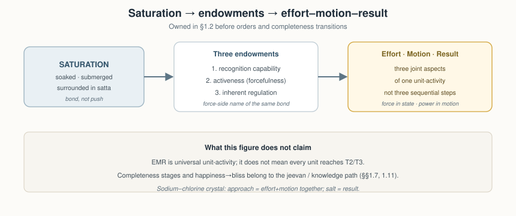

# The Ontology of Coexistence

**Author:** [AnalyticMadhyasthDarshan.org](https://github.com/raghavamohan/AnalyticMadhyasthDarshan) — a group of people studying Madhyasth Darshan philosophy. Source repository: [raghavamohan/AnalyticMadhyasthDarshan](https://github.com/raghavamohan/AnalyticMadhyasthDarshan).

**Edited on:** July 9, 2026, 3:40 PM IST
**Status:** Released

**The question:** What is Existence? What exists? Does what exists begin at some time? Does the individual self (*jeevan*) begin or end with the body? Is the world finally real?

This study examines those questions in Madhyasth Darshan (Co-existentialism), as presented by Shri A. Nagraj, and compares its answers with Advaita Vedanta and selected modern philosophical and scientific approaches to physical reality, consciousness, and selfhood. Full treatment of time (*kaal*), *trikaalabadh*, and spacetime physics is in [*Nature of Time*](../Nature-Of-Time/Nature-Of-Time.pdf); here only the core claim is stated — that *kaal* is duration of unit-activity and *satta* is timeless as ground (§1.6.4).

## Standpoint and scope

These studies are written from the standpoint of a scientist and technologist — trained to graduate-level physics and mathematics, at home with contemporary cosmology, quantum theory, conservation laws, and formal models. From that background the physicalist default is familiar: consciousness as something the brain does — an emergent property of configurations of particles. That picture is powerful on mechanism, prediction, and public evidence, yet the hard problem of consciousness, the status of the self, and the reality of value remain contested. This study does not treat those gaps as settled in favour of matter-only reductionism; they are what motivate the comparative inquiry.

Exposition follows the darshan's own order, not the physicalist starting point. Madhyasth Darshan's ontology is stated on its own terms first (§1), then Advaita Vedanta (§2) — the nearest non-physicalist rival sharing Indian vocabulary — then modern philosophy and science (§§3–4), with comparison and critical review in §§5–6. The aim is rigorous comparative understanding — testing definitions, internal consistency, and fit with public knowledge — not persuasion or devotional endorsement. The study does not claim that physics, neuroscience, or comparative argument alone establish immortal *jeevan*, constitutional completeness, or continuity across bodily death; where traditions use different criteria of knowing, the dispute is treated as partially incommensurable (§5.3.5), and open points are collected in §6.2.

Scope is bounded in three ways. **Textually**, the primary base is the three English translations by Rakesh Gupta (MVD, SB, JV); untranslated Hindi works such as *Manav Vyavahar Darshan* and *Avartansheel Arthshastra* may carry fuller treatments of relationship structure and cyclical economics, so coverage claims are scoped to the translated corpus unless noted (*niyati-kram* and *niyati-vidhi* are named in *Paribhasha Samhita*). **Topically**, several load-bearing claims are argued in companion studies: full knowability in [*Knowledge, Knower, and Known*](../Knowledge-Knower-And-Known/Knowledge-Knower-And-Known.pdf) §1.11; time, *trikaalabadh*, and spacetime in [*Nature of Time*](../Nature-Of-Time/Nature-Of-Time.pdf); post-death continuity in §§1.8, 6.2.3, and 6.4; institutional governance, *dharma-niti*, *rajya-niti*, and statutory order in the planned [*Governance Justice and Undivided Society*](../Governance-Justice-And-Undivided-Society/Governance-Justice-And-Undivided-Society.pdf) (with [How to Form Self-Sustaining Organizations](../How-To-Form-Self-Sustaining-Organizations/How-To-Form-Self-Sustaining-Organizations.pdf) applying the assembly template socially). **Editorially**, the default use of *gyan* and related conventions are stated in Editorial Notes; other terms are introduced at first use in §1. A separate formal mathematical treatment may follow once definitions are stable across the series.

## 1. The Madhyasth Darshan Answer

Madhyasth Darshan reads existence as coexistence: the ever-present togetherness of Omnipotence and countless units of nature, insentient and sentient, each saturated in that ground. Nothing stands apart from it. Units are real, bounded, and soaked in Omnipotence at every order, and all change unfolds through their activity within that bond.

This picture is not value-neutral. Complementarity and fulfilment are built into how units recognise and respond to one another in coexistence, and every unit is oriented toward development at its order. Constitutional, activity, and conduct completeness name the design-span of that drive — completed only on the *jeevan* / human path (§1.6), not what every particle instantiates. On that sentient path the same drive is *jeevan*'s orientation from happiness toward bliss — the knowledge-order face of completeness, not a separate ethic bolted on later. At the human scale it opens toward awakened living: an undivided society and universal orderliness in which fearlessness, prosperity, and trust are established as tradition. Section 1 develops this single arc: from the ground–unit bond, through the endowments and drive it confers, to the sentient self, awakening as happiness toward bliss, and its societal evidence.

### 1.1 Coexistence: Omnipotence and units

Existence has two inseparable aspects.

Omnipotence is formless, all-pervasive, non-transforming, and immeasurable. It is actionless energy: it performs no actions, yet it permeates existence as the ground through which every unit is energised, regulated, and conserved. The translation offers several English names for this one reality — Uniform Energy, Space, Knowledge, Consciousness, Absolute Energy — and no single word covers them all. Consciousness and Knowledge here do not mean a mind that knows; sentience as the activity of a knower belongs to jeevan, not to Omnipotence itself.

Units of nature are the formful, active, countable entities within nature. Each unit is bounded from six directions and is surrounded, submerged, and soaked in Omnipotence, carrying form, properties, essential nature, and dharma. That units-in-ground structure is the ontological given the darshan names Realisation Knowledge. At the root of physical, chemical, and *jeevan* activity stands the atom: nucleus and orbiting particles as the root quantity from which molecules, compositions, and the four orders are built. Orders are plateaus of atomic and compositional development, not non-atomic strata beside the atom.

Three structural features complete the picture. First, Omnipotence and units never existed as separate poles: the separation of a unit from the saturated whole never happens. Second, Omnipotence has no absent place, even where no local unit appears. Third, units are distinct from one another by boundaries within saturation, not by leaving the ground; the distance between units is itself held in formless existence — Omnipotence as Space between bounded wholes — and this is what provisions the conditions for mutual recognition. Omnipotence is state-complete: without motion, wave, or pressure. Nature saturated in it is state-dynamic: unit-activity, development, and awakening alone constitute change.

### 1.2 Saturation: the ground–unit bond

Coexistence is not the inert juxtaposition of a ground and its contents. Every formful unit is saturated — soaked, submerged, and surrounded — in Omnipotence. Saturation is the ever-present ontological bond between the formless ground and each formful unit, and Omnipotence does not act, transform, or get consumed in saturating anything.

One way to picture the bond — illustrative, not an identity — is a living cell in a nutrient medium, or a sponge fully soaked in water: the unit remains surrounded, permeated, and sustained through the medium, not drained from a finite store. Inherent energy resides in each unit as a consequence of coexistence with that field; it is not a force propagated from the ground as an efficient cause. Saturation binds ground and units in mutual dependence for manifestation: uniform energy and unit-activity always appear together, and neither pole creates the other's existence — only its manifestation.

Three ontological endowments follow from this bond in every unit. They unfold from one saturation chain the texts also state in force language: being soaked is energy-endowment; energy-endowment is force-endowment, reckoned as magnetic-force endowment; and it is by that force that particles recognise one another and enter orderliness. Forcefulness is not a fourth endowment beside the three below — it is the force-side name of the same bond that appears as activeness and as the capacity to recognise.

The first is recognition capability. Complementarity is not created by recognition; it is given in the bond, as saturated units stand in mutuality with reciprocity eternally established. Because countless bounded units stand together within the state-complete ground, existence itself provisions one unit to recognise another: Omnipotence is transparent in mutuality, and the Space it holds between units (§1.1) is the same provision seen from the side of distance. It does not push units as an external agent; through saturation it endows each unit with the capacity, ability, and receptivity to participate in relationships at its order.

The second endowment is activeness — the unit-side testimony of the ground's permeativeness, and the same endowment the texts name forcefulness when they speak of magnetic force in a soaked unit. Every unit in its atomic state is active as orderliness because saturation gives it inherent energy; basic impulsion is its inherent drive to be active, and the reciprocity is exact: without basic impulsion the energy remains unmanifest, and without the energy there is no basic impulsion. Omnipotence, actionless in itself, is called energy because unit-activity manifests through this impulsion. Activeness is never the activity of an isolated unit — every unit is active along with contact in its mutuality, and relative energy does not become apparent without mutuality.

That activeness appears as the inseparable triad of effort, motion, and result — the form in which all change is unit-activity in reciprocity. Omnipotence is state-complete: the ground does not change. A unit is not a passive substrate that merely possesses activity; its existence is this triadic activity. Effort, motion, and result are not three sequential steps but three joint aspects of one activity, each a joint form of the other two. In sodium and chlorine ions approaching one another, the approach is effort and motion together, and the stable salt crystal is result. In the insentient orders, state and motion are inseparable — force in state, power in motion. The same triad later powers the completeness transitions (§1.6); here it is simply what every unit's activity is.

The third endowment is inherent regulation. Regulation is the evidence of the ground's mediative character: saturation is where a unit gets regulatory order in it, alongside activeness and forcefulness, not from an outside push. Regulation manifests as law and orderliness (§1.11).

The texts go further than listing Knowledge as one name among several for the ground: saturated coexistence itself is knowledge. Insentient and sentient nature submerged, soaked, and surrounded in Omnipotence — this itself is coexistence, coexistence itself is eternal, and this itself is knowledge; law, regulation, balance, justice, dharma, and ultimate truth are evident in coexistence only.

Together, these three endowments — recognition, activeness (forcefulness), and regulation — orient each unit toward development at its order, activated by conducive environments and naturalness. The constitutionally complete atom alone reflects this saturation as active sentience, and it alone shows a drive toward bliss — the sentient face of the completeness drive whose stages and felt ladder are stated in §§1.6 and 1.8.

### 1.3 What every unit is

Every saturated unit carries the same four inseparable aspects regardless of order. These are not optional descriptors; they are what each unit is as a participant in coexistence. Quantity belongs with that signature: the atom — nucleus and orbiting particles — is the root quantity from which molecules, compositions, and the four orders are built (§1.1); the four aspects name how every such unit participates.

Form is shared across all orders: the shape, volume, and density by which a bounded unit is individuated. Properties name the effects units have on one another in mutuality, differentiated as generative, degenerative, and mediative — assisting creation, dissolution, and sustainment. Essential nature is how the usefulness of a unit's properties participates in its order. Dharma names what a unit cannot be separated from — its innateness and fulfilment; since existence is coexistence, indestructibility itself is the ultimate dharma.

Three companion facts frame every unit. Each unit is a whole along with its environment — a wholeness that signifies continuity. Each unit is orderliness with its "ness" and participates in overall orderliness — "ness" being what makes a unit the kind of unit it is, shown through its essential nature in its natural state. And each unit moves toward development in its natural state — fulfilment aligned with its innateness — and toward decline in its excited state.

Complementarity, given in coexistence and established through saturation's recognition capability, appears here as reciprocal exchange within the natural state: after give and take, both parties reinstate satisfaction, their natural motion. When all relationships are recognised and fulfilled, the unit is at ease in its natural state — no relational shortfall remains.

Participation means recognising and fulfilling, observable even in the physicochemical realm, where components within an atom recognise and fulfil one another. Endeavour aligned with a unit's innateness moves toward fulfilment; endeavour against it gives rise to problems. A peepal tree illustrates definite conduct: it maintains its conduct with all its fruits, seeds, and leaves exhibiting the peepal's properties, intrinsic nature, and dharma. Harmony among the four aspects is the essence of coexistence itself.

### 1.4 Units in relationships

Nothing in nature is isolated — that is the principle. Existence holds relations between units, and it is in those relations that complementarity is actualised as value in mutuality. Complementarity here is not merely give-and-take reciprocity in physicochemical exchange; it is the whole structure by which units reciprocate essentiality. Relationships are where complementarity is predetermined toward completeness, and the unit's main drive is to recognise and fulfil them.

A relationship is the mutuality where expectations are predetermined in the sense of completeness; an association is the mutuality where expectations are voluntary. Neighbours who share a wall have an association; parent and child stand in a relationship with expectations toward completeness.

Essentiality in every plane and order is value: it is values that are reciprocated and mutually recognised, since complementarity, mutual recognition, and impression occur only in mutuality. Impression names the describable event in which one unit's activity registers on another. At every order, object values of utility and art operate in production and exchange; at the knowledge order, further kinds — human, relationship, and expression values, and the internal *jeevan* values felt as happiness, peace, contentment, and bliss — presuppose the sentient unit whose structure and harmonies are stated in §§1.7–1.8. Those kinds are named here only as the relational load that order must carry.

Every entity of nature recognises another; that is why it fulfils. Even an atomic particle recognises another, and as a result these particles abide in orderliness. That recognition and fulfilment draw on capacity, ability, and receptivity — endowed through saturation and developed or activated through environment and interference. At the material, biological, and animal orders, fulfilment is definite: structural, seed, or species conformance. In the knowledge order the same relationships must be achieved through knowing, believing, recognising, and fulfilling (§1.7); where evaluation mis-reads relationships, complementarity remains incompletely expressed. At every order, fulfilment evidences use, right-use, and purposeful-use.

Higher statuses require inherent capacity and a conducive environment together. The texts illustrate with seed and naturalness: germination begins when a seed is placed in its naturalness; without naturalness, exuberance cannot happen in it. Saturation endows inherent capacity; naturalness and mutuality in the environment activate it — neither alone suffices.

### 1.5 The four orders of nature

Units of nature are organised into four stable orders — the material order, the bio (pranic) order, the animal order, and the knowledge (human) order. Each order is a stable plateau in development, not a human typology, and higher orders include the dharmas of lower orders cumulatively.

| Order | Essential nature | Dharma (cumulative) |
|---|---|---|
| Material | integration–disintegration | existence |
| Bio (pranic) | vitalising–devitalising | + growth |
| Animal | cruel–uncruel | + hope to live |
| Knowledge (human) | fortitude, courage, generosity, kindness, grace, compassion | + happiness |

The knowledge order is named for the medium in which the completeness drive's remaining span runs — through knowing, believing, recognising, and fulfilling — not because Omnipotence knows. Lower orders recognise and carry out in definite conformance; the human adds knowing and believing (§1.11). Animal-order dharma adds hope to live; knowledge-order dharma adds happiness — that is where the sentient completeness drive runs as happiness toward bliss through knowing (§1.6, §1.8). Hope is not bliss: animal-order *jeevan* carries hope without that knowledge-order ladder.

The cumulative dharmas mark where sentience enters. The material and bio orders are insentient: they integrate, disintegrate, vitalise, and grow, but have no hope to live. Hope to live is the animal order's addition, and hope is the defining activity of the sentient unit, expressed through mun in the constitutionally complete atom. *Jeevan* first appears at the animal order as the joint form of that atom with a body of the order; the material and pranic orders are pre-sentient development toward it. The knowledge order's six essential-nature qualities are developed as human values.

Existence is stable and development is definite — laws natural and inherent to being, not conventions imposed on unstable matter. That definiteness names two paired structures at the order scale. Existential progression is the fixed sequence in which order-level nature manifests on Earth: pranic from material, animal from pranic, knowledge from animal — chemical composition giving rise to biological cells, vegetation enriching, animal and human bodies and traditions established through that chain. The texts qualify without dissolving the chain: the biological order can revert to the material after manifesting its essentiality, so elevation from material into biological order is not irreversible development in the same sense as constitutional completeness at the atomic level. The way of existence is definiteness in each order's proper conduct — result-, seed-, species-, and sanskar-conformance. In the animal order, species-conformance carries through a species-traditional inertial impression transmitted from gestation — the inheritance of conduct-pattern. (The translation's word for this is a homonym of Advaita's term for superimposition and must not be confused with it; see §5.7.5.) Diversity in nature is diversity of statuses within matter; constitutional, activity, and conduct completeness name further designed stages of the drive's span, selective in who reaches them (§1.6).

Each order manifests through saturation in a different mode: material units are active because of being in Omnipotence; bio units pulsate; animal units carry the hope of living; knowledge-order units are hopeful and conscientious. "Countless" means practical uncountability — real particulars, indefinitely many from any finite standpoint.

### 1.6 The completeness drive and transitions (T1, T2, T3)

The three endowments of saturation (§1.2) ground a completeness drive in saturated nature. The texts state the drive's full design-span directly: nature saturated in the state-complete Omnipotence is oriented for development and awakening until realisation in Omnipotence. Development, in that full span, names constitutional completeness, activity completeness, and conduct completeness, along with their continuity; awakening names resolution and authenticity. That span is the architecture of the drive, not what every unit instantiates. Every unit participates through effort–motion–result (§1.2), recognition and fulfilment, and order-level definite conduct; only some evolving atoms cross to constitutional completeness; activity and conduct completeness belong to *jeevan* and to awakened human tradition, not to particles or composition-oriented atoms.

Because saturation itself is knowledge (§1.2), every unit is soaked in intelligibility from eternity — being-in-knowledge. Knowing and realisation of the ground, however, belong to the constitutionally complete atom (*jeevan*) at activity completeness (§1.6.2), not to material or pranic units, which show definite recognition and fulfilment without knowing and believing. After constitutional completeness, the same drive continues in *jeevan* as orientation from happiness toward bliss — peace and contentment intermediate — the knowledge-order face of activity- and conduct-completeness. Those developmental names remain T2 and T3; the felt ladder is owned in §1.8; the terminus is realisation as bliss (§1.13). Animal-order *jeevan* has hope but not that knowledge-order path (§1.5). Realisation in coexistence is therefore the drive's termination condition for the sentient path, not a knowing-event ascribed to every particle.

Two developments must not be collapsed. Development progression in compositions builds molecules, earth and planets, prana cells, vegetation, animal bodies, and the human body as conducive environments (§1.5 existential progression; §1.10) — support for *jeevan*, not awakening of the compositions themselves. Development in the atom is the separate line on which an evolving constitution becomes satisfied and constitutionally complete — *jeevan* (T1). Activity- and conduct-completeness are further stages of that *jeevan* atom, not of hungry or undigested particles. Awakening belongs to *jeevan* alone, in joint form with a body — the human body its medium (§1.9.2); the drive can stall only in the human's delusion of body as self (§1.7), and it completes as realisation of coexistence (§1.13), evidenced in humane tradition (§1.15).

Rather than an ethic added to matter, this drive is built into the basic design of existence. It runs through two atomic paths powered by the triad of effort, motion, and result (§1.2). In the evolving insentient atom, the triad drives exchange among hungry atoms (able to absorb particles) and undigested atoms (holding excess particles they seek to expel, often with radiative grandeur) toward the satisfied, constitutionally complete atom (T1). Particles and composition-oriented atoms do not proceed to activity or conduct completeness: they reinstate natural-state motion and definite conduct, or feed compositional progression. Only in that constitutionally complete *jeevan* atom does the triad work through projection and reflection toward activity completeness (T2) and conduct completeness (T3). Published English sometimes names the expulsion side "overfull"; the working KD translation's "undigested" marks the same unstable constitution.

Each triad term has a teleological goal, and the mapping is not the everyday sequence of effort then motion then result. On the insentient atomic path, result is meant to attain immortality of the closed constitution (T1). On the sentient path alone, effort is meant to attain restfulness (activity completeness, T2) and motion its destination (conduct completeness, T3) — settlement of inner cognitive effort, then settlement of outer behavioural motion. Particles do not inherit those sentient goals; the insentient path completes at T1 or remains in compositional support, and only the sentient path continues with T2 and T3 — and this goal itself becomes evident as development progression and development. Only at the knowledge order, in the human joint form, does that sentient settlement appear as conduct humans recognise directly — understanding that rests, work that arrives at right-use and universal orderliness, and durable contribution rather than passing exertion.

The three completeness transitions mark developmental milestones on these paths:

| Transition | Completeness | Plane shift | Triad term | Teleological goal | What becomes evident |
|---|---|---|---|---|---|
| T1 | Constitutional | Physicochemical → delusional | Result | Immortality of result | Sentient jeevan; hope to live |
| T2 | Activity | Delusional → deific | Effort | Restfulness of effort | Awakened humans; orderliness with "ness" |
| T3 | Conduct | Deific → divine (complete) | Motion | Destination of motion | Awakened humans with living proof |

These goals must not be conflated with natural-state ease in §1.3. Restfulness names the settlement of internal cognitive effort — *jeevan*'s seeking, visualising, and analysing resolving into direct realisation — not insentient complementarity reinstating natural motion. Destination names the settlement of external behavioural motion in work and social participation toward universal orderliness. Together they are the developmental names of settling the happiness→bliss face of the drive (§1.8).

### 1.6.1 Constitutional completeness (T1)

T1 is constitutional completeness: the irreversible sentience threshold at the atomic level — not neural complexity, molecular scale, or elevation along the order chain. An evolving insentient atom reaches it when required particles integrate through complementarity among hungry and undigested (overfull) atoms and environmental mutuality, until the constitution is satisfied. The teleological goal of result — immortality of result — is then evident as sentient *jeevan*. Most atoms remain constitution-oriented — under weight-bondage and molecular-bondage — and never cross; T1 is selective relative to the material inventory, not a fate of every particle.

In this state the particle constitution is closed: qualitative change continues without increase or decrease in particle count. Force and power in that closed constitution are inexhaustible — hope, thought, desire, resolve, and evidence may be expressed without diminution — which marks the satisfied atom against mere compositional complexity. The evidence of crossing is liberation from molecular-bondage and weight-bondage and the onset of hope-bondage as the sentient mode's defining bondage: when contraction and expansion activity increases in an evolving-constitution atom, it instantly breaks free from its group and attains constitutional completeness, becoming a jeevan atom. Hope-bondage is the precondition of the later happiness→bliss path, not its completion.

At constitutional completeness, the permeative knowledge latent in the ground is actualised as active sentience in a stable reflector configuration — sentience as latency realised within coexistence (§1.2).

T1 also upgrades the recognition endowment itself. Below the threshold, recognition in mutuality is definite (§1.4); at constitutional completeness it acquires an inner circuit — the strengths and powers of the five faculties (§1.7), beginning with hope in mun. The recognition of taste, which could not become manifest in insentient nature, first becomes manifest in sentient nature, where the strength of mun expresses itself as hope-power through selection and taste-recognition.

The drive thus continues across T1 in a new mode, not a new direction: what changes is how it is enacted. Hope-bondage now carries the orientation toward completeness, and definite recognition becomes recognition through an inner circuit — the condition for the knowing, believing, recognising, and fulfilling that the knowledge order will require (§1.11).

### 1.6.2 Activity completeness (T2)

T2 is activity completeness: restfulness of effort — internal cognitive effort settling into direct realisation and absolute resolution on the deific plane. The texts name that settlement precisely: absence of delusion itself is restfulness. T2 is not available to particles or to composition-oriented atoms; animal-order *jeevan* carries hope to live but remains un-awakened in the narrow circuit of §1.7 — T2 is knowledge-order awakening, where the drive can stall only epistemically, the body mistaken for *jeevan*. Restfulness is the developmental name of settling the happiness→bliss face of the drive in knowing; its felt form is owned in §1.8.

That stall is also a missing status in the seer–doer–enjoyer triad. Physico-chemical nature is already in the self-motivated doer-status through effort–motion–result; fruition gives an enjoyer-side of result. Awakened *jeevan* adds the seer-status — understanding as knower of coexistence. Delusion keeps doer and enjoyer without seer: activity and fruition continue while the body is taken for the self, so the reflection circuit of §1.7 does not complete toward *atma*. Restfulness of effort is the recovery of that seer-status: projection and reflection rejoin (§1.7), and knowing reconnects to believing, recognising, and fulfilling.

### 1.6.3 Conduct completeness (T3)

T3 is where external behavioural motion reaches its destination: authentic conduct and living proof in universal orderliness, yielding mutual satisfaction and justice. T3 is not a second name for the same internal settlement as T2. Destination is the developmental name of settling the same happiness→bliss face in living proof (§1.8, §1.15).

Where T2 settles the seer-status as realisation, T3 evidences seer, doer, and enjoyer together in tradition: understanding projects as work, behaviour, and orderliness, and fruition is mutual satisfaction rather than private enjoyment alone. Projection without that destination remains motion without arrival; reflection without projection remains understanding without living proof.

At the knowledge order, perceiver status — enlightenment and realisation within the truth of coexistence — is what awakened humans alone attain. Activity completeness (T2) and conduct completeness (T3) evidence it in orderliness with "ness" and living proof.

### 1.6.4 Time and causation

Origination and causation are distinct from the completeness transitions above. Units are co-eternally present; causation names what produces change when units transform. Omnipotence grounds all units through saturation as supreme cause in the sustaining sense — the ground of activity, not its trigger. The causal work of change is done by units themselves.

Time is the duration of unit-activity — inseparable from effort, motion, and result in active units (§1.2), not a separate cosmic container alongside the ground and its units. Omnipotence is timeless as non-transforming ground. Full treatment: [*Nature of Time*](../Nature-Of-Time/Nature-Of-Time.pdf).

### 1.7 Jeevan: structure and faculties

Jeevan — the sentient self that works through the body — is a constitutionally complete unit: a self-maintaining sentient atom whose particle constitution closed at T1, not a conventional aggregate of insentient parts. In the human joint form, the knower is always jeevan, not the physical body. That knower-status is the seer in the seer–doer–enjoyer triad of §1.6.2: *jeevan* alone, when awakened, evidences all three; the body is never the seer.

The texts list five inseparable aspects within jeevan — mun, vritti, chitta, buddhi, and atma — operating through the cycle of projection and reflection:

| Strength / power | Projection | Reflection |
|---|---|---|
| Mun / hope | selection | taste |
| Vritti / thought | analysis | deliberation |
| Chitta / desire | visualisation | contemplation |
| Buddhi | resolve | enlightenment |
| Atma | authenticity | realisation |

The five faculties are the atom's constitutional structure: atma is the nucleus; buddhi, chitta, vritti, and mun are the particles in the first through fourth orbits respectively. The table's ten entries are the ten coordinated activities of jeevan across nucleus and orbits. The columns are projection and reflection (KD 3.12) — how the effort–motion–result triad runs in the sentient atom toward T2 and T3. The same faculties appear in the texts as force in state and power in motion (KD 3.6); that is not a second five-fold list beside this table, but the state–motion reading of the same structure.

These five faculties are one of two five-fold structures in the texts and must not be conflated with the second — they do not align one-to-one. The faculties name the invariant parts and orbital structure of the jeevan atom itself: what a constitutionally complete sentient unit is at the atomic level. Alongside them, Madhyasth Darshan maps the developmental envelopes of the joint form (body plus jeevan) in sheath vocabulary — the food sheath, vital sheath, mental sheath, bliss sheath, and right-knowledge sheath. Animal-order jeevan and pre-awakening humans function across four sheaths; awakening adds the fifth — the sheath of right knowledge — so awakened humans function across five. Faculties track what jeevan is structurally; sheaths track where awakening has opened. A given faculty is not the same thing as a given sheath, and the two lists cannot be read as parallel columns.

The functional reading of the faculty table is directional. Reflection is the knowing direction — the ascent of understanding through the study circuit: affirmation of truth in the form of coexistence proceeds as acceptance in mun, qualitative analysis in vritti, direct recognition in chitta, and enlightenment in buddhi. That inward circuit terminates when buddhi's reflection toward atma yields self-realisation and realisation in coexistence simultaneously. Realisation is realisation in the ground itself — the unit directly realising the permeativeness and transparency of its own ground (§1.6.2).

Projection is the evidencing direction — the realisation-based cascade from realisation through enlightenment, resolve, and contemplation to taste and selection, evidenced as living proof in conduct (§1.6.3). Knowledge unfolding names that outward evidencing activity; it belongs to awakened jeevan, not to Omnipotence. Reflection: ascent of understanding; projection: descent of evidence.

On the delusional plane, atma is the "I" at the nucleus; the inseparable orbital set of buddhi, chitta, vritti, and mun is "mine"; awakening is these four coming into accordance with atma. Mistaking the body for the self is the root of that confusion.

Before the human joint form, the circuit runs at its narrowest. In the animal order, mun functions by species-conformance, keeping the body alive with the hope of living — mun regulated by the body, with vritti and chitta neglected; the texts call this un-awakened.

In the pre-awakening human the same inversion persists with wider reach: the circuit is driven from the body upward rather than from atma downward. Inspired by sensitivity, only four and a half of the ten activities are effective — selection and taste in mun, analysis in vritti, visualisation in chitta, and half of deliberation, which operates only from the perspectives of pleasant, healthy, and profitable (§1.12). Believing is thereby severed from knowing: the deluded human recognises and fulfils sensory desires without connecting these activities to knowing and believing, and awakening is precisely that reconnection. The reflection that should carry understanding inward toward atma does not complete, and the drive circulates as effort without rest (§1.6.2).

Awakening is accordingly staged by how far up the circuit discipline reaches. The texts mark three statuses of buddhi in the knowledge order: partially awakened, where mun and vritti are driven by chitta; half awakened, where mun, vritti, and chitta are driven by buddhi whose resolve is still devoid of self-realisation; and awakened, where desire, thought, and hope rest on resolve with self-realisation, and mun, vritti, chitta, and buddhi are regulated and disciplined by atma. These statuses give, in faculty terms, the ascent that the human-type ladder of §1.9.2 names typologically and that the plane shifts at T2 and T3 mark developmentally — without a forced one-to-one alignment between three statuses and five human types.

### 1.8 Jeevan harmonies and experience

The happiness→bliss face of the completeness drive named in §1.6 is felt here as harmony within the faculty structure of §1.7 — not a separate psychology beside the ontology. Happiness, peace, contentment, and bliss are the orbital faculties coming into accordance with atma.

Four jeevan values name states of harmony within jeevan: happiness is harmony between mun and vritti; peace between vritti and chitta; contentment between chitta and buddhi; bliss between buddhi and atma — a progression the texts also state as the effects on the lower faculties of atma realised in truth. The mode of channelling jeevan's energies toward awakening runs through curiosity in mun, enthusiasm in vritti, delight in chitta, elation and immersion in buddhi, and finally realisation in atma — for which inward regulation of jeevan's energies is essential.

Inward regulation is self-regulation within the sentient unit: mediative atma at the nucleus disciplines the orbital faculties and the body. The mediative nucleus at the atomic level and atma at the sentient centre are the same structural role at two scales — not mere analogy.

Jeevan does not sleep when the body sleeps; values and evaluation are jeevan's practical purpose. And because jeevan is a constitutionally complete atom, it persists across bodily birth and death, carrying its accumulated impressions and state of awakening — jeevan continues to exist after death exactly as it does while driving a body (§1.14).

### 1.9 Progressions and planes

Madhyasth Darshan maps change and development across two coordinates: progressions (how nature moves) and planes (where a unit stands).

### 1.9.1 Four progressions

The texts use four different words for "progress" at different levels; they index claims already stated, and must not be collapsed:

| Progression | Meaning | See |
|---|---|---|
| Existential progression | Fixed order in which the orders emerge on Earth: material → pranic → animal → knowledge | §1.5 |
| Way of existence | Definiteness in each order's proper conduct | §1.5 |
| Development progression | Physicochemical complex until an atom reaches constitutional completeness (*jeevan*) | §1.6 |
| Awakening progression | Within constitutionally complete *jeevan*, toward activity and conduct completeness | §1.6 |

The first two belong to the order scale; the third and fourth to the atomic / sentient path — the same two developments §1.6 insists must not be collapsed. The axes meet at the pranic-to-animal junction: existential progression delivers the bodily basis of the animal order; development progression delivers an atom at constitutional completeness. An animal is the joint presence of such a *jeevan* atom with a body of that order.

### 1.9.2 Four planes

Order names what a unit is; plane names how far its development has gone — where on the map it currently stands, not merely what kind of unit it is. The texts list four planes:

| Plane | Plain meaning |
|---|---|
| Physicochemical | Insentient development toward constitutional completeness |
| Delusional | Sentient jeevan or pre-awakening human — body mistaken for self |
| Deific | Awakening human — activity completeness (T2) |
| Divine (complete) | Conduct completeness (T3) — living proof of coexistence |

"Delusional" here names a developmental stage in the texts, not psychiatric illness.

Orders and planes are different axes, and they do not line up one-to-one:

| Order | Plane(s) it occupies | Status |
|---|---|---|
| Material | Physicochemical | Insentient |
| Bio (pranic) | Physicochemical | Insentient |
| Animal | Delusional | Sentient jeevan; body-identified |
| Knowledge (human) | Delusional → deific → divine | Sentient jeevan; awakening across planes |

Two orders thus map to one plane (physicochemical), while one order maps to three — the asymmetry the figure below renders, and the reason order and plane must not be used interchangeably.

Within these planes the texts distinguish five human types by degree of awakening — the servile human and the brutal human on the delusional plane, the discerning human in transition, the deity-human on the deific plane, and the fully awakened divine-human on the divine plane. Awakening to the knowledge order requires the human body as enabling medium — with fully enriched nervous system and imagination — not merely a vehicle any sentient plane could use.

### 1.10 Composition and assemblies

When complementary units fulfil their relationships, they compose into larger units. Everywhere there exists a natural inclination toward coexistence, and this inclination is what leads atomic particles to assemble into atoms, atoms to combine into molecules, and molecules into molecular forms.

Each successful composition opens relationships at a higher tier — particles to atoms, atoms to molecules, molecules to cells and bodies, and onward to human assemblies — while stability persists in the natural state and declines when fulfilment breaks down. Composition is not awakening: assemblies participate in compositional progression and may support development toward T1 (§1.6), but the developmental plateau is crossed only when an atom reaches constitutional completeness.

In a mixture, components maintain their respective conducts. In a compound, components combine in definite proportion and present a genuinely new unit with its own four-aspect signature. Assemblies persist while relationships are fulfilled in their natural state and decline when they are not. Transmission of composition method runs by constitution, seed, lineage, or education-sanskar according to order.

When assemblies are human compositions — family, community, and society — the same persist-or-decline rule applies, but recognition and fulfilment are achieved and evaluative rather than definite. Human assemblies, like molecules and bodies, are real compositions whose durability tracks relationship-fulfilment, not fear or extraction alone.

### 1.11 Regulation, law, and conformance

Inherent regulation is the third endowment of saturation. Saturated units are self-regulating: orderliness is inherent to nature, not dispensed by an external ruler, and Omnipotence does not descend as statutory command. This mediative role — the role that gives the darshan its name — is what regulates and conserves every unit: because Omnipotence is mediative, the nature saturated in it is held in order, and the nucleus within every atom is the mediative activity through which its generative and degenerative activities and relative powers are regulated and conserved.

Regulation becomes clear in the form of law: there is provision in every unit for recognising one another based on law, and that is the meaning of regulation. The same inherent orderliness in each unit, by which it participates in overall orderliness, is the law that, recognised and fulfilled at the knowledge order, scales into the universal orderliness of an undivided society.

Regulation manifests as law, expressed through order-specific conformance modes:

| Order | Conformance mode | Definite or achieved |
|---|---|---|
| Material | Result- / structural-conformance | Definite |
| Bio (pranic) | Seed-conformance | Definite |
| Animal | Species-conformance | Definite |
| Knowledge (human) | Sanskar-conformance | Achieved through knowing → believing → recognising → fulfilling |

In the animal order, species-conformance is transmitted through gestational inheritance of conduct patterns (§1.5).

Below the knowledge order, lawful recognition and fulfilment need no separate name for evaluation. Once jeevan must evaluate and can err, the texts name the evaluative closure of the relational cycle justice. Statutory and public law codifies assembly order separately; conduct may satisfy legality while violating justice. Institutional governance belongs in the planned *Governance Justice and Undivided Society* study.

| Domain | Scope | Ontological status |
|---|---|---|
| Regulation / law | All four orders | Inherent in saturated units; same law of orderliness with "ness" |
| Justice | Knowledge order | Complete relational activity: recognise, fulfil, evaluate, mutual satisfaction |
| Statutory / public law | Assemblies, society | Institutional codification; may diverge from justice |

### 1.12 Evaluative perspectives and justice

Only jeevan in the knowledge order evaluates and chooses, and it does not use a single lens. Jeevan's design includes six perspectives for knowing, believing, evaluation, and choice: pleasant–unpleasant, healthy–unhealthy, profit–loss, justice–injustice, dharma–adharma, and truth–untruth. The behaviour of humans with inhumane perspective takes refuge in the first three; the behaviour of humans with humane perspective takes refuge in the last three. In awakening, humane refuge reorganises under justice, dharma, and truth rather than the pleasant, the healthy, and the profitable.

| Perspective | Domain | Role in evaluation |
|---|---|---|
| Pleasant–unpleasant | Senses / instincts | Lower refuge; insufficient as main standpoint |
| Healthy–unhealthy | Body | Lower refuge; insufficient as main standpoint |
| Profit–loss | Material comfort | Lower refuge; insufficient as main standpoint |
| Justice–injustice | Behaviour | Humane refuge; regulates conduct |
| Dharma–adharma | Resolution | Humane refuge; disciplines thought |
| Truth–untruth | Existence | Humane refuge; grounds realisation in reality |

The lower triad is legitimate in its domain — food and instinct, bodily health, livelihood — but not sufficient as the organising refuge of a knowledge-order being. Awakening subordinates rather than abandons those domains: pleasant, healthy, and profitable outcomes stay meaningful when ordered under justice, dharma, and truth ([Ethics and Morals in Human Beings](../Ethics-And-Morals-In-Human-Beings/Ethics-And-Morals-In-Human-Beings.pdf) §3.2).

Unit dharma (§1.3) — the fourth aspect of every unit's signature — must not be confused with the dharma–adharma perspective: the latter is an evaluative lens on thought and resolution, not the innateness and fulfilment of a unit as such.

These perspectives regulate distinct domains: the regulation of human behaviour takes place through justice, discipline in thoughts takes place through dharma, and realisation takes place only through truth.

### 1.12.1 The dual role of justice

Justice has a dual role. As a perspective, it assesses behaviour as just or unjust. As an ontological term, justice names the full relational activity when the cycle closes: recognising relationships, fulfilling values, evaluating, and achieving mutual satisfaction. Justice is not trust, respect, or one moral value among values.

Dharma as an evaluative perspective disciplines thought toward resolution. Truth grounds assessment in realisation in existence rather than in liking, bodily expedience, or gain. Below the knowledge order, recognition and fulfilment are lawful and definite without bearing the name justice, because evaluation and the possibility of error are not yet in play.

### 1.13 Realisation in coexistence

The completeness drive (§1.6) terminates when relationships across nature are fulfilled and made evident in coexistence — not by Omnipotence becoming a knower, but by awakened jeevan enacting what was latent in saturation (§1.2). The goal of development is for nature, saturated in Omnipotence, to be realised in Omnipotence; realisation itself is the form of awakening; it is only through awakening that there is the orderliness of recognition and fulfilment; and recognition and fulfilment themselves constitute authenticity — the expression of realisation.

This realisation is bliss — the close of the happiness→bliss face of the drive named in §1.6. The texts run the chain directly: truth itself is abundance, that is, coexistence; realisation of abundance itself is bliss; bliss itself is jeevan. The drive's terminus is thus at once realisation of coexistence, bliss, and knowledge. The buddhi–atma harmony that §1.8 names bliss is its felt form at the nucleus; its evidence in living is the bliss realised in the course of evidencing understanding (§1.15).

At realisation, knowledge, knowable, and knower are uniform in coexistence — not as merger into a universal knower, but as coordinated roles in one bond: projection of realisation in existence is authenticity — knowledge, wisdom, and science in projection; jeevan full of realisation in existence is the knower in reflection; and existence — nature saturated in Omnipotence — is what is to be known. The knower at that uniformity remains jeevan — an active, distinct sentient unit — not absorption into a partless universal consciousness (§5.6; §6.2.4). In the seer–doer–enjoyer vocabulary of §1.6.2, that same uniformity is seer-status recovered: understanding as seer, work and behaviour as doer, and mutual satisfaction in coexistence as enjoyer — three statuses in one awakened joint form, not three separate selves.

### 1.14 Conservation and the perpetual world

Madhyasth Darshan advances two distinct conservation claims.

Coexistence conservation: what exists does not arise from non-being and cannot be annihilated. Plurality is perpetual; only configurations and associations change. The world is perpetual — the texts affirm both that the ground is truth and that the world is perpetual, against any doctrine on which the world is finally unreal.

Jeevan persistence: because jeevan is constitutionally complete and immune to decomposition, it persists across bodily birth and death.

Coexistence is co-eternal: Omnipotence remains state-complete, while units remain state-dynamic, moving toward designed completeness within their saturated bond.

### 1.15 Ontology and societal fulfilment outcomes

At the human scale, the completeness drive manifests as societal outcomes — the public face of the same sentient happiness→bliss drive (§1.6, §1.8). When the cognitive and behavioural cycle of justice completes, it evidences four human goals: resolution — intellectual clarity and relational closure without residue; prosperity — producing more physical goods than needed and utilising them properly, rather than hoarding; fearlessness — trust in the present and in society, rather than collectivity based on mutual threat; and coexistence — complementary living with other humans and with nature.

These goals align directly with the internal jeevan values of §1.8. We realise happiness wherever we are resolved; peace while evidencing resolution and prosperity in the family; contentment by living orderly in society; and bliss in the course of evidencing our understanding. Unlike animals, whose collectivity arises primarily from fear, human sociality is built on resolution and trust.

At the macro scale, these goals compose upward from the family to undivided society and universal orderliness. This is the expression of human dharma — the purpose of the knowledge order. Universal orderliness is actualised across five dimensions: education-character, justice-preservation, health-restraint, production-work, and exchange-storage. Sustained across generations, this is the humane tradition — the continuity in which fearlessness, prosperity, and trust are evident not as episodes but as tradition, and in which the drive's societal evidence goes on.

### 1.16 Method, evidence, and what Madhyasth Darshan establishes

Madhyasth Darshan answers the study's framing questions as follows:

| Question | Madhyasth Darshan answer | Section |
|---|---|---|
| What is existence? | The eternal coexistence of Omnipotence and units | §1.1 |
| What exists? | Omnipotence and countable units | §§1.1, 1.5 |
| Does it begin? | No; only temporary configurations do | §1.14 |
| Does the self begin? | Jeevan is constitutionally immortal and does not end with the body | §§1.6, 1.7, 1.8 |
| Is the world real? | Yes, the world is perpetual | §1.14 |
| How do we know? | Through staged study, experiment, and conduct-evidence | §§1.7, 1.12, 1.13 |

The darshan establishes a logical ontology of coexistence, saturation, and conservation. Lived verification through humane conduct — living proof — serves as the final proof of realisation.

## 2. The Advaita Vedanta Answer

Advaita Vedanta holds that existence in the strictest, absolute sense is Brahman alone — one without a second (*ekamevaditiyam*). The world of names, forms, bodies, and relations is *mithya* — a dependent appearance operationally valid at the empirical level (*vyavahara*) but ultimately sublated at absolute reality (*paramartha*). The true Self (*Atman*) is neither born nor destroyed, because it is ultimately identical with this non-dual Brahman.

Section 2 states that ontology on Advaita's own terms: Brahman as absolute existence, then the three-tier architecture and Maya through which multiplicity appears, then the empirical triad of Ishvara, *jiva*, and *jagat*, witness-consciousness, temporality, liberation, and what ethics retains at *vyavahara*. The figure after §2.4 summarises the architecture; §2.11 collects Advaita's answers to the study's framing questions. Advaita terms appear in the Appendix under Terms in §2; exact wording of cited verses is preserved in References, Section 2. Comparative forks with Madhyasth Darshan and modern approaches belong in §§5–6.

### 2.1 Brahman and absolute existence

The Chandogya Upanishad states Advaita's foundational claim directly:

> **"In the beginning this was Existence alone, One only, without a second."**
> - CU 6.2.1

Shankara comments regarding *sat* as:

> **"mere Existence, a thing that is subtle, without distinction, all pervasive, one, taintless, partless, consciousness"**
> - CU 6.2.1, Shankara commentary

The text rejects existence arising from non-existence:

> **"By what logic can existence verily come out of non-existence? But surely, o good looking one, in the beginning all this was Existence, One only, without a second."**
> - CU 6.2.2

At *paramartha*, only this one partless reality exists absolutely. Classical Advaita names that absolute as *nirguna* Brahman — without attributes, actionless, and not an object among objects. *Saguna* Brahman is the same reality associated with Maya and spoken of as Ishvara: operative at *vyavahara*, not a second absolute beside the attribute-free ground (§2.6). *Paramatman* (the Supreme Self) is likewise not a second absolute beside Brahman — it is Brahman named from the empirical or devotional standpoint, sublated together with Ishvara and jiva when superimposition is perfectly eliminated (VC, v. 244; §2.6).

How that one reality is characterised as Sat-Chit-Ananda and known as *turiya* follows in §§2.2–2.3; the tiered architecture through which the world appears relative to it is stated in §§2.4–2.5.

### 2.2 Brahman as Sat-Chit-Ananda

Advaita reads Brahman as *sat*, *chit*, and *ananda* — being, consciousness, and bliss — three names for one substantive, not three compounded realities. The Taittiriya Upanishad states the formula Advaita takes as canonical:

> **"Brahman is Truth, Knowledge, and Infinity."**
> - TU 2.1.1

Shankara treats each word as a separate predicate of that one Brahman — *satyam brahma*, *jnanam brahma*, *anantam brahma*. Truth (*satyam*) marks what does not change the nature ascertained as its own, and so marks Brahman off from mutable things. Knowledge (*jnanam*) is consciousness itself — Brahman's nature, not an agent that knows and thereby becomes limited. Infinity (*anantam*) is what is not bounded by time, space, or object — the fullness in which nothing else stands over against Brahman (TU 2.1.1, Shankara's commentary). The *anandamaya* passage (TU 2.5) completes the third name in the seeker's direction: bliss as sheath is transcended in the Self beyond coverings, not taken as a fleeting affect (TU 2.5, Shankara's commentary).

### 2.3 Brahman as *turiya*

The *Mandukya Upanishad* (MU, vv. 3–7) analyses the Self in four quarters — the three commonly experienced states (*avastha-traya*) and a fourth that is their ground. The analysis is first-personal: it shows how temporal states appear and are witnessed from within the subject, not a map of cosmic developmental orders.

In waking (*jagrat*):

> **"The first quarter is Vaisvanara whose sphere (of action) is the waking state, whose consciousness relates to things external, who is possessed of seven limbs and nineteen mouths, and who enjoys gross things."**
> - MU, v. 3

In dream (*svapna*):

> **"Taijasa is the second quarter, whose sphere (of activity) is the dream state, whose consciousness is internal, who is possessed of seven limbs and nineteen mouths, and who enjoys subtle objects."**
> - MU, v. 4

In deep sleep (*sushupti*):

> **"That state is deep sleep where the sleeper does not desire any enjoyable thing and does not see any dream. The third quarter is Prajna who has deep sleep as his sphere, in whom everything becomes undifferentiated, who is a mass of mere consciousness, who abounds in bliss, who is surely an enjoyer of bliss, and who is the doorway to the experience (of the dream and waking states)."**
> - MU, v. 5

*Turiya* — the fourth — is not another state alongside these three, but the Self known by negating every state-characteristic:

> **"They consider the Fourth to be that which is not conscious of the internal world, nor conscious of the external world, nor conscious of both the worlds, nor a mass of consciousness, nor conscious, nor unconscious; which is unseen, beyond empirical dealings, beyond the grasp (of the organs of action), uninferable, unthinkable, indescribable; whose valid proof consists in the single belief in the Self; in which all phenomena cease; and which is unchanging, auspicious, and non-dual. That is the Self, and That is to be known."**
> - MU, v. 7

Seer-seen discrimination in the *Drig-Drishya-Viveka* and the Gita's field-knower teaching develop the same structural point (§2.7).

### 2.4 Three tiers of reality

Advaita's standard framework separates three levels of reality. Private apparent errors (*pratibhasika*) include a rope mistaken for a snake. Shared empirical reality (*vyavahara*) governs bodies, physical laws, ethics, and scripture. Absolute truth (*paramartha*) is Brahman alone. Discrimination (*viveka*) between the real and the unreal is defined as the firm conviction that Brahman alone is real and the universe unreal (VC, v. 20); at the deepest level the individual soul is itself, directly, the Supreme Brahman, and nothing else (VC, v. 216).

The *mithya* doctrine and this three-tier framework are related but distinct tools, and the study keeps them apart. *Mithya* names the world's dependent ontological status; the three tiers (*pratibhasika*, *vyavahara*, *paramartha*) name the levels at which that status is assessed. Both are needed to read Advaita's ontology.

| Level | What exists? | Status of world / error |
|---|---|---|
| Apparent (*pratibhasika*) | Rope-snake, dream objects, private errors | Sublated by waking or correction |
| Empirical (*vyavahara*) | Bodies, minds, Ishvara, causes, duties, scriptures, science | Shared, law-governed; operationally valid; sublated only by *brahma-jnana* |
| Absolute (*paramartha*) | Brahman alone | World is *mithya*, dependent appearance |

At *vyavahara*, the world is not unreal in the way a hallucination is; it is unreal relative to Brahman — like a dream relative to waking. The world is not sheer nothing, nor absolutely real; it is *mithya* — dependent appearance.

Later Advaita systematises this status as *anirvacaniya* — indescribable as either absolutely real or sheer nothing. Shankara himself uses "neither *sat* nor *asat*" language without that compound; *sad-asad-anirvacaniya* is a post-Shankara systematic term from the Vimuktatman and Vivarana school. That status is what later comparison must keep in view when ethics and science are assessed at *vyavahara* without treating the world as finally absolute (§2.10; §§5.3.2, 5.7, 6.3).

### 2.5 Maya, *adhyasa*, and causal doctrine

The multiplicity of the world rests on Brahman through superimposition (*adhyasa*) — like a snake seen on a rope. Cosmic Maya conceals Brahman's true nature (*avarana*) and projects the diversity of name-form (*vikshepa*). Avidya is the individual counterpart: not the cosmic power itself, but the jiva's own superimposition of body and mind on the Self. VC vv. 243–244 distinguish the two — Maya as Ishvara's superimposition, Avidya as the jiva's.

Advaita inherits *satkaryavada* from its Samkhya background: the effect pre-exists in the cause. The Chandogya's clay teaching states the pattern directly: through knowledge of one lump of clay, all things made of clay are known, since every transformation is a matter of speech and name while clay alone is real (CU 6.1.4). The *Vivekachudamani* compresses the same point: modifications of clay, such as the jar, are always accepted by the mind as real, yet in reality are nothing but clay; likewise this entire universe, produced from the real Brahman, is Brahman itself and nothing but that (VC, v. 251).

At the empirical level, creation is *vivartavada* — apparent transformation of name-form on changeless Brahman. Brahman does not change; multiplicity is projected through Maya. The effect is not a real transformation of the cause. Creation is therefore not production from nothing; it is manifestation of names and forms on the basis of Brahman. Comparative causal doctrine across traditions is tabulated in §5.4.

The stock error of mistaking a rope for a snake illustrates Advaita's theory of error (*khyativada*): the snake is neither real (it vanishes on knowledge) nor utterly unreal (it was genuinely experienced), but a projection on a real substrate — the same structure Maya writ large applies to the world until Brahman is known.

### 2.6 Ishvara, jiva, and jagat at *vyavahara*

Because Advaita uses a three-tier framework, it posits several categories structurally necessary to explain the empirical world, even if they are ultimately sublated at the absolute level.

Brahman at *paramartha* is *nirguna* — pure, actionless awareness. Ishvara (*saguna* Brahman) is Brahman associated with *Maya*, functioning as operative cause of name-form manifestation — not a creator *ex nihilo*. Ishvara is a *vyavahara*-level category, sublated at *paramartha*: Ishvara and jiva are themselves superimpositions — cosmic and individual respectively — and when these are perfectly eliminated, neither Ishvara nor jiva remains (VC, v. 244).

Jivatman (*jiva*) is the individual embodied soul — the true Self (*Atman*) conditioned by *upadhis* (limiting adjuncts), appearing as separate until realisation. Classical Advaita accounts for apparent plurality of jivas without making each an ultimate second: reflection (*pratibimba*) and limitation (*avaccheda*) name two standard ways the one Self appears many under adjuncts; this study need not decide between later school elaborations. The empirical person is further stacked as three bodies — gross (*sthula*), subtle (*sukshma*), and causal (*karana*) — and as five sheaths (*pancha kosha*: food, vital, mental, intellect, and bliss). Those layers are real equipment at *vyavahara*; they are not discarded as hallucination, yet they do not survive as separate individuality at *paramartha*. Shared Upanishadic sheath vocabulary with Madhyasth Darshan must not be read as a one-to-one ontological match (§5.7.2).

Karma and *samsara* belong to this same empirical mechanism: the conditioned jiva continues across births through residual action and impression until knowledge dispels the illusion of separateness. Continuity of the empirical person is therefore not proof that a distinct self is finally real.

Jagat (*nama-roopa*) is the physical universe of names and forms — operationally valid at *vyavahara*, ultimately *mithya* at *paramartha*. Bodies, minds, causal order, scripture, and science belong to this shared tier until *brahma-jnana* sublates the apparent separateness of the world from Brahman.

### 2.7 Witness-consciousness and the Self

The *Drig-Drishya-Viveka* (DDV) offers a rigorous seer-seen (*drig-drishya*) discrimination: whatever can be observed — body, sensations, thoughts — is "seen" and therefore not the seer (DDV, vv. 1–5). What remains is *Sakshin*, witness-consciousness — irreducible to matter, and Advaita's primary first-person route for discriminating the Self from body and mind.

The Gita names this directly: the body is the field, and the one who knows it is the knower of the field; that same knower of the field in every field, it adds, is also the knowledge of the field itself (BG 13.1–13.2). In the *Mandukya* analysis (§2.3), *turiya* plays the same structural role: not another state among states, but the awareness in which states appear (MU, vv. 3–7).

At liberation, that witness is discovered as non-personal Brahman — one partless awareness without a second. The dispute over whether irreducible awareness is finally one impersonal Self or many distinct knowers is reserved for §§5.3.3 and 5.6.

### 2.8 Conservation, origination, and temporality

Brahman does not begin: it is beginningless, partless, actionless, non-dual — outside temporal becoming (VC, v. 393). The universe as name-form has origination at the empirical level, but its ultimate truth is Brahman. Advaita's classical cosmology treats *vyavahara* as beginningless: *srishti*, *sthiti*, and *laya* — manifestation, maintenance, and dissolution — cycle without a first moment, so the empirical world is not a fleeting illusion in the manner of a private error (*pratibhasika*), nor a single absolute beginning of existence.

Advaita does not devote a separate chapter to *kaal*, but its framework implies a sharp division. At *paramartha*, only Brahman is absolutely real; temporality belongs to the empirical order. At *vyavahara*, past, present, and future, birth and death, and causal succession are operationally valid — the world is law-governed and shared (§2.4) — yet finally sublated when Brahman alone is known.

The *Mandukya* analysis of waking, dream, and deep sleep (§2.3) is a first-person route into how temporal states appear and are witnessed; the witness (*turiya*) is not another state among them. Fuller comparison of Advaita's *trikaal* language with Madhyasth Darshan's account of *kaal* as duration of unit-activity is developed in [*Nature of Time*](../Nature-Of-Time/Nature-Of-Time.pdf).

### 2.9 Liberation and the knowledge path

Liberation (*moksha*) is not dissolution or merger of a real individual into Brahman. The jiva was never a separate entity; realisation is recognition of pre-existing identity with Brahman, in which the illusion of separate individuality is dispelled. The classical identity formula is *tat tvam asi* — "That thou art" (CU 6.8.7, with Śaṅkara's bhāṣya); BS 1.1.2 treats the same doctrine systematically. The *Vivekachudamani* compresses the point: at the ultimate truth there is neither death nor birth, neither a bound nor a struggling soul, neither a seeker after liberation nor a liberated one (VC, v. 574) — for the Supreme Brahman is, like the sky, pure, absolute, infinite, motionless, and changeless, without interior or exterior: the one Existence, without a second, and one's own Self (VC, v. 393).

That recognition can obtain while the body still lives (*jivanmukti*) or is completed with the fall of the body (*videhamukti*). *Jivanmukti* is what makes *loka-sangraha* coherent after realisation: the knower continues to act in the world without reinstating separate individuality as final (§2.10).

Method serves that ontological claim rather than replacing it. Advaita inherits the classical analysis of valid knowledge (*pramana*): for the supreme truth of non-duality, verbal testimony (*shabda*) — the revealed word of the Upanishads, processed through reasoning and meditation — is finally competent; perception and inference operate within the subject-object duality to be transcended. The path is classically threefold: hearing (*shravana*), reasoning (*manana*), and sustained meditation (*nididhyasana*), under a qualified teacher. Teaching itself often proceeds by provisional attribution and later withdrawal (*adhyaropa–apavada*): names and forms are first admitted for instruction, then negated until only the Self remains — the same logic as seer-seen discrimination in the DDV. Full epistemological comparison: [*Knowledge, Knower, and Known*](../Knowledge-Knower-And-Known/Knowledge-Knower-And-Known.pdf) §2.

Shankara's *Vivekachudamani* insists on ethical discipline as prerequisite to knowledge (VC, vv. 17–19). Ethics at *vyavahara* is developed in §2.10.

### 2.10 Ethics, *loka-sangraha*, and what realisation evidences

Advaita's charge that the world is *mithya* at *paramartha* does not make ethics untenable at the level where life is actually lived. At *vyavahara*, ethics and compassion remain fully valid; realisation of non-duality deepens rather than weakens them. The Bhagavad Gita, in Shankara's commentary, grounds social responsibility in *loka-sangraha* — holding the world together — and ordained duty: perform your bounden duty, for action is superior to inaction (BG 3.8; Shankara's commentary reads this as *niyatam kuru karma* — even the enlightened continue to act for the welfare of the world). *Jivanmukti* (§2.9) is the ontological condition of that continued action.

What Advaita provisions at the empirical order must be distinguished from what realisation evidences at *paramartha*. Ethics, scripture, causal law, and compassionate action prepare the mind for *brahma-jnana*; they are binding where humans actually live. None of this settles whether the world retains final ontological weight at the highest truth — that dispute is carried in §§5.3.2, 5.7, and 6.3.

| Domain | Valid at *vyavahara* | Status at *paramartha* |
|---|---|---|
| Ethics and duty | Binding; deepens with realisation (VC, vv. 17–19; BG 3.8) | Sublated as means; non-dual identity remains |
| World and nature | Law-governed, shared, beginningless cosmology | *Mithya* — dependent appearance |
| Individual self | Real as embodied jiva under *upadhi* | Identical with Brahman; separateness dispelled |
| Relationships and society | *Loka-sangraha*, ordained action for world-welfare | Not ultimately separate from Brahman |
| Time and change | Past, present, future, birth and death operationally valid | Sublated when timeless Self is known |

Realisation evidences identity with Brahman — the dispelled illusion of separate individuality. The enlightened still act for world-welfare at *vyavahara*; what changes at *paramartha* is ontological status, not the possibility of ethical living.

### 2.11 Method, evidence, and what Advaita establishes

Advaita Vedanta answers the study's framing questions as follows:

| Question | Advaita Vedanta answer | Section |
|---|---|---|
| What is existence? | Brahman alone — being, consciousness, bliss, one without a second | §§2.1–2.3 |
| What exists? | Brahman absolutely; *jiva*, Ishvara, and *jagat* real only at *vyavahara* | §§2.4, 2.6 |
| Does it begin? | Brahman does not begin; name-form cycles as *srishti–sthiti–laya* within beginningless *vyavahara* | §2.8 |
| Does the self begin? | *Jivatman* is *vyavahara*-level conditioning; the true Self was never born and never separate | §§2.7, 2.9 |
| Is the world real? | Operationally real at *vyavahara*; *mithya* — dependent appearance — at *paramartha* | §§2.4–2.5 |
| How do we know? | Scripture (*shabda*), reasoning, and contemplative discrimination — *shravana*, *manana*, *nididhyasana* | §2.9 |

Advaita establishes a rigorous non-dual ontology and a disciplined first-person method for discriminating seer from seen. Whether the world's robustness at *vyavahara* settles its status at the highest truth is the comparative question carried forward in §6.3.

## 3. Modern Philosophical Approaches

Modern Western philosophy takes physical nature as baseline and disputes how mind, self, value, and the world's final status fit within it. The dominant materialist line holds that consciousness emerges from matter; metaphysical idealism has held the reverse. SB records that neither one-way emergence has been observed — what is evident is coexistence:

> **"In this course, metaphysical thought has held that matter arises from consciousness, whereas materialist thought has maintained that consciousness emerges from matter. Both ideologies have proposed numerous arguments, practices, and experiments in support of their claims. Yet, neither has matter been seen emerging from consciousness, nor consciousness emerging from matter. What is evident is that consciousness and matter are inseparably present."**
> - SB, p. 48

Madhyasth Darshan's own title — *Samadhanatmak Bhautikvad* (*Resolution Centred Materialism*) — reframes rather than abandons materialism. Against dialectical materialism, which treats struggle as the engine of history and science, SB proposes an orderliness-centred materialism in which nature remains real, saturated in Omnipresence, and oriented toward resolution rather than perpetual conflict (SB, pp. 8, 44). The Western debates below are the philosophical context that framing answers.

Section 3 states the modern philosophical baseline on its own terms: physicalist ontology and the hard problem, then self, world realism, and partial Western analogues to ground-and-units coexistence. Method and evidential stakes close the account. The figure below summarises the physicalist architecture; time and cosmology are developed in [*Nature of Time*](../Nature-Of-Time/Nature-Of-Time.pdf) and §4. Comparative forks with Madhyasth Darshan belong in §§5–6.

### 3.1 Physicalist ontology: what exists

> **"I take physicalism to be the view that every real, concrete phenomenon in the universe is…physical."**
> - Strawson 2006, p. 2

On this view, what exists are physical things, events, fields, organisms, brains, and processes. Minds and selves are not separate substances but functions, organisations, models, or processes of physical systems. Reductive physicalism holds that mental descriptions reduce without remainder to physical descriptions; non-reductive physicalism allows autonomous mental or functional levels while insisting that every concrete instance is still physical.

Methodological naturalism extends the picture into inquiry: the methods of the natural sciences — observation, experiment, modelling, public replication — are the standard for settling factual claims about the world. Scientific realism treats the physical world as mind-independent and law-governed: electrons, fields, and brains are not mere useful fictions but the furniture reality is made of, even when descriptions revise with theory change. Constructivist and instrumentalist variants soften that claim; they remain minority positions within mainstream analytic philosophy.

Physicalism also asserts causal closure: every physical event has a sufficient physical cause, so no non-physical entity injects energy or intention into the nervous system (Kim 2005). That closure sets the bar for any claim that a non-physical partner works through the body: if the brain is a closed physical system, such a partner is either epiphenomenal or a violation of conservation. How that bar bears on immortal *jeevan* is examined in §§5.3.3 and 6.4.

### 3.2 The hard problem and the first-person datum

> **"The really hard problem of consciousness is the problem of experience. When we think and perceive, there is a whir of information-processing, but there is also a subjective aspect."**
> - Chalmers 1995, p. 3

> **"It is widely agreed that experience arises from a physical basis, but we have no good explanation of why and how it so arises."**
> - Chalmers 1995, p. 3

> **"the fact that an organism has conscious experience at all means, basically, that there is something it is like to be that organism."**
> - Nagel 1974, p. 1

The hard problem is not whether brains correlate with experience — they do — but why any physical process should have an inside at all. Physicalists often treat the gap as philosophically non-decisive — a limit of current theory, not proof of extra-physical being. First-person discrimination of seer from seen is developed on Advaita's terms in §2.7; whether the gap supports coexistential latency is examined in §§6.2.1 and 6.4.

Some philosophers split the difference through property dualism: experience may be an irreducible property of certain physical systems while the laws governing matter remain intact. That fork preserves law-governed physics but adds a primitive experiential aspect Chalmers-style accounts find unavoidable. Whether active sentience belongs to every complex physical system, or only to constitutionally complete units, is a comparative question for §§5.3.3 and 5.6.

### 3.3 Physicalist responses: panpsychism, emergentism, illusionism

Physicalists who take the hard problem seriously divide into several families. Panpsychist physicalism (Strawson 2006) insists that experience cannot emerge from wholly non-experiential matter:

> **"Full recognition of the reality of experience, then, is the obligatory starting point for any remotely realistic version of physicalism."**
> - Strawson 2006, p. 2

> **"Experiential phenomena cannot be emergent from wholly non-experiential phenomena."**
> - Strawson 2006, p. 12

> **"Real physicalism, realistic physicalism, entails panpsychism."**
> - Strawson 2006, p. 12

Panpsychism refuses experience-from-dead-matter while remaining inside a physicalist frame. Strawson's anti-emergence principle is the pressure later comparison brings to constitutional completeness: if experience cannot emerge from the wholly non-experiential, sentience at a threshold must be actualised from something already present, not produced from nothing (§6.2.1). Scope still divides the views: panpsychism typically distributes experientiality widely; Madhyasth Darshan restricts active sentience to constitutionally complete atoms (§1.6.1).

Panpsychism's combination problem follows. If micro-experientiality is primitive, how do micro-subjects combine into a unified macro-subject? Strawson and other panpsychists leave this wound open; integrated information theory addresses it through structural integration, often at the cost of pan-experiential commitments (§4.2). Whether one constitutionally complete atom already is the sentient unit — rather than an assembly of micro-minds — is examined in §6.2.1.

Emergentism offers a middle path: new properties appear at organisational thresholds — digestion from chemistry, life from biochemistry, mind from neural complexity. Weak emergence treats higher-level patterns as real but dependent on lower-level physics; strong emergence would add causally novel properties irreducible to microphysics. Threshold grammar — a structural condition producing a qualitative level — is shared by emergentism, integrated information theory, and constitutional completeness (§6.2.1). The dispute is whether the threshold creates experience from dead matter or actualises an ever-present ground.

At the opposite pole, illusionism (Frankish 2016) and eliminative materialism (Dennett 1991; Churchland 1986) preserve physicalism by denying or re-describing the datum the hard problem presses:

> **"Another approach, which holds that phenomenal consciousness is an illusion and aims to explain why it seems to exist."**
> - Frankish 2016, p. 1

> **"illusionists deny the existence of phenomenal consciousness properly so-called, but do not deny the existence of a form of consciousness"**
> - Frankish 2016, p. 8

Illusionists retain access-consciousness, self-report, and functional control while treating "what it is like" as a misdescription of introspective models. Eliminativists go further: folk-psychological categories such as belief and desire may fail to refer, to be replaced by neuroscience. These views show how far naturalism will go to preserve a physicalist ontology — and why predictive-processing accounts (§4.1) offer a more sophisticated functionalist reply than bare elimination. Whether experience, valuation, and realisation are activities of a distinct sentient unit is reserved for §§5.3.3 and 6.4.

### 3.4 The self: personal identity and persistence

Physicalism's answer to "does the individual self begin or end with the body?" is typically yes, in some version. The self is a biological and cognitive achievement — developing through embodiment, memory, and social recognition — and ceasing when brain function ends. Personal identity theory asks what, if anything, makes a person the same individual over time.

Locke's classical account ties identity to psychological continuity — memory and connectedness of consciousness — rather than to sameness of material particles. Parfit's later work argues that what matters in survival is psychological connectedness and continuity, not a further fact of identity: there is no deep entity beyond the stream of mental states that must persist (Parfit 1984; SEP Personal Identity). On reductionist readings, post-death survival of a distinct individual has no fact of the matter beyond causal and psychological links — which bodily death breaks.

Substance views — rational soul as form of the body (§3.6.1), simple monads (§3.6.3) — preserve an enduring individual bearer. Against physicalism, the dispute is not only metaphysical but causal: if the physical domain is closed, a non-physical enduring self is either epiphenomenal or a violation of closure. Self-model, predictive-processing, and integrated-information accounts in cognitive science (§§4.1–4.2) explain the sense of self without positing an immortal unit. Whether regulation and representation settle what works through the brain is examined in §§6.2.1 and 6.4.

### 3.5 Origination, conservation, and world realism

Western philosophy asks whether what exists had a beginning and whether particulars endure through change. Mainstream physicalism holds that local systems — organisms, stars, civilisations — begin and end, while fundamental physics may or may not require a cosmic beginning (§4.3). Conservation principles in physics treat certain quantities as preserved through transformation — a structural parallel later compared with *vastu* through *roop*-change (§1.14, §4.4), though the categories differ.

Scientific realism answers "is the world finally real?" with yes for the physical universe: tables, fields, and brains are real mind-independent items suitable for public study. Idealism (Berkeley and successors) makes reality depend on perception or mind; nihilism denies that anything ultimately exists or matters. Both are outliers in contemporary analytic ontology but sharpen the stakes for any claim that the world is perpetual and co-eternally real with its ground (§1.14; §5.3.2).

Philosophy of time adds a further fork. Block-universe eternalism treats past, present, and future as equally real coordinates; presentism privileges the present. Relational theories deny time as an independent container — time is the order of change among things. Activity-based accounts of duration are structurally closer to relational and process views than to block eternalism ([*Nature of Time*](../Nature-Of-Time/Nature-Of-Time.pdf) §3). Cosmological questions about a beginningless substrate are developed in §4.3; the philosophical point here is that Western ontology has no consensus on whether existence as a whole begins, even when particular configurations do.

On ethics and life's purpose, typical physicalist answers are naturalized rather than grounded in immortal units or a non-dual absolute. Evolutionary ethics, social-contract and consequentialist theories, and accounts of flourishing treat value as arising from biology, psychology, and social practice; purpose, where acknowledged, is adaptation, well-being, or human-constructed meaning. That telos is operationalized further in evolutionary and ecological science (§4.6) and compared in §5.3.6.

### 3.6 Alternative Western ontologies

Physicalism (§§3.1–3.5) is the dominant modern baseline. Before the twentieth-century focus on mind and brain, Western metaphysics also developed several ground-plus-particulars schemes that map partially onto coexistence. They are ordered here from form-matter compounds through monism and pluralism to neutral ground — not as a historical timeline, and not as rivals that replace the physicalist baseline, but as a ladder of analogues for §5.5.

### 3.6.1 Hylomorphism and soul-as-form

Aristotelian–Thomistic hylomorphism maps form (*forma*) onto matter (*materia*) so that a substance is the compound of both — not mere aggregation. Aquinas treats the rational soul as the form of the living body (*anima forma corporis*), giving a joint ontology of soul-and-body that parallels Madhyasth Darshan's *jeevan*–*shareer* joint form and the four-aspect unit signature (form, properties, essential nature, *dharma*) as what a unit is (§1.3). *Gathanpurnata* resembles substantial completion: a definite constitution at which a unit's essential nature is fully actualised. The divergences are sharp: Madhyasth Darshan's plural, immortal *jeevan* units, beginningless coexistence with *satta*, and saturation are not Aristotelian prime matter plus a single rational soul per body; yet the soul-as-form debate is a nearer cousin than process philosophy on individual persistence (SEP Form and Matter; Aquinas ST I, q. 75–76).

### 3.6.2 Spinoza: substance and modes

Spinoza's substance monism offers a closer analogue to *satta*-with-units than neutral monism. For Spinoza, one infinite substance (*Deus sive Natura*) has infinitely many modes — finite particulars expressing the one substance under different attributes (thought and extension). Madhyasth Darshan likewise keeps a pervasive ground and countless real units, but the contrast is decisive: Spinoza has one substance whose modes are not ontologically on a par with the whole; Madhyasth Darshan has co-eternal *satta* and *ikai*, each real in its own right, bound by saturation rather than modal expression of a single substance (Spinoza, *Ethics*, Part I, Props. 14–15; Part II, Def. 3). Spinoza's parallelism of thought and extension also differs from Madhyasth Darshan's tiered intelligibility: active *chaitanya* belongs only to *jeevan*, not to every mode of extension.

### 3.6.3 Leibniz: monads and harmony

Leibnizian monads offer a tighter analogue to plural immortal *jeevan* than Whitehead's occasions. Monads are simple, individual substances that mirror the whole from their perspective, do not interact by efficient causation but harmonize, and do not naturally perish. That plurality-with-harmony and individual immortality align structurally with many distinct *jeevan*-clouds saturated in Omnipresence (MVD, p. 13). The contrast: monads are windowless and perception-based; *jeevan* works through bodies in definite *sambandh* and fulfils relationships in nature's orders (Leibniz, *Monadology*, §§1–14, 78–81).

### 3.6.4 Process philosophy: occasions and becoming

Whitehead's process philosophy shares relational realism and refusal of nature bifurcation. His basic units are "actual entities" — "drops of experience, complex and interdependent" (Whitehead 1929, p. 28). The ultimate for Whitehead is creativity, the principle by which the many prior occasions become one new occasion; each occasion's concrescence — its growing-together from that inherited data — aims at intensity of experience before it perishes (Whitehead 1929). The key contrast remains persistence: Whitehead's occasions are momentary and "perpetually perish" subjectively, gaining "objective immortality" only as data for successors (Whitehead 1929, p. 44), whereas Madhyasth Darshan's *jeevan* is a persisting immortal individual. Process metaphysics also treats time as internal to becoming — a partial affinity with activity-based *kaal* (§3.5; [*Nature of Time*](../Nature-Of-Time/Nature-Of-Time.pdf) §3.3).

> **"Actual entities 'perpetually perish' subjectively, but are immortal objectively."**
> - Whitehead 1929, p. 44

### 3.6.5 Neutral monism: common ground

Neutral monism (Russell, Mach) resembles Omnipresence as a reality that is neither mind nor matter but common ground. Russell holds that mind and matter are "composed of a neutral-stuff which, in isolation, is neither mental nor material" (Russell 1921, Lecture I). Mach likewise denies any "rift between the psychical and the physical": "There is but one kind of elements, out of which this supposed inside and outside are formed" (Mach 1914, Ch. XIV). The contrast: neutral monism typically builds mind and matter out of the neutral stuff, whereas Madhyasth Darshan keeps Omnipresence non-transforming and lets units be real in their own right rather than constructed from the ground.

> **"Both mind and matter are composed of a neutral-stuff which, in isolation, is neither mental nor material."**
> - Russell 1921, Lecture I

> **"There is no rift between the psychical and the physical, no inside and outside… There is but one kind of elements, out of which this supposed inside and outside are formed."**
> - Mach 1914, Ch. XIV

The Western schemes above — hylomorphism, substance monism, monads, process occasions, neutral ground — chiefly dispute how ground relates to particulars and whether individual selves endure. Process philosophy treats occasions as perpetually perishing; physicalism (§§3.1–3.4) reads the self as embodied achievement rather than immortal substance. Those lines attack the permanence of the self while largely retaining the grammar of countable entities in relation — the same grammar §5.5 tabulates.

Madhyamaka Buddhism is not part of this Western gallery, yet it bears on the saturation bond later. Nagarjuna's critique of *svabhava* asks whether what exists only through mutual dependence can exist from its own side at all — challenging the coherence of mutual dependence itself, not only personal immortality. That pressure is developed in §6.2.2 and explains why §5.5 omits Buddhism from the entity snapshot rather than adding a fifth column.

### 3.7 Method, evidence, and what philosophy establishes

Modern Western philosophy does not speak with one voice, but a typical physicalist constellation answers the study's framing questions as follows:

| Question | Typical Western philosophical answer |
|---|---|
| What is existence? | Concrete physical reality — fields, spacetime, organisms — studied empirically; some add experience as fundamental (panpsychism) or neutral ground (neutral monism). |
| What exists? | Physical entities and their organisations; minds as processes; disputed whether experience is reducible, fundamental, or illusory. |
| Does what exists begin? | Particular systems begin and end; whether fundamentals had a first moment is unsettled (§3.5, §4.3). |
| Does the individual self begin? | The self develops with body and brain; psychological continuity does not survive bodily death on standard physicalist accounts (§3.4). |
| Is the world finally real? | Yes, for scientific realism — the physical world is mind-independent; idealism and world-as-illusion are minority views. |
| Method of knowing | Observation, argument, public evidence; first-person datum acknowledged but not treated as existence-proof for immortal units. |

What philosophy has established is a high evidential bar and a persistent exposed point: the hard problem shows that reductive matter-only accounts leave experience unexplained. What it has not established is immortal *jeevan*, constitutional completeness, or post-death continuity — an explanatory gap is not an existence proof (§6.4). Predictive processing and self-model theories (§4.1) deepen the physicalist reply without settling the ontological dispute (§6.4).

Mainstream science inherits this physicalist baseline and adds measurement, formal models, and institutional replication — the subject of §4.

## 4. Modern Scientific Approaches

Mainstream science inherits the physicalist baseline of §3 and adds measurement, formal models, and institutional replication. Where philosophy disputes mind, self, and world-realness in argument, science operationalises those disputes through instruments, datasets, and peer review. SB records that humans seek to live with evidence through experimentation, behaviour, and experience — not through argument alone:

> **"Humans inherently seek to live with evidence through experimentation, behaviour, and experience. They desire to achieve comprehensive resolution — across various aspects, perspectives, directions, dimensions, and contexts of time and place."**
> - SB, p. 44

Madhyasth Darshan treats public science as one leg of that evidence-seeking — strong on mechanism, prediction, and correction. It adds realisation and conduct as further evidence of understanding — the epistemic frame developed in [Knowledge, Knower, and Known](../Knowledge-Knower-And-Known/Knowledge-Knower-And-Known.pdf). JV notes that the human body is provisioned to evidence understanding, not merely to house brain activity (JV, p. 59).

Section 4 states how science operationalises the physicalist baseline: mind and self in neuroscience, consciousness-science rivals, cosmology, fields and conservation, spacetime and entropy, then evolution and ecology. Method and what science establishes close the section. Time physics is in [*Nature of Time*](../Nature-Of-Time/Nature-Of-Time.pdf); limits of science are critiqued in §6.4.

### 4.1 Mind, self, and predictive processing

Self-model theories in cognitive science (Metzinger 2003) operationalize the physicalist account of personal identity in §3.4: the self is not an immortal unit but a predictive model the brain generates to regulate the organism.

> **"minimal selfhood emerges as the result"**
> - Limanowski and Blankenburg 2013, p. 1

> **"these accounts propose to 'understand the elusive sense of minimal self in terms of having internal models that successfully predict or match the sensory consequences of our own movement, our intentions in action, and our sensory input'."**
> - Limanowski and Blankenburg 2013, p. 3

The most developed recent form is predictive processing and active inference: the brain as a hierarchically deep generative model that minimizes prediction error (surprise) by updating beliefs and guiding action (Friston 2010; Clark 2016). On this view, valuation, aspiration, the sense of being a continuous self, and the felt reality of the world are not dismissed as mere illusion; they are functionally real control structures — layered expectations that keep the organism viable. Seth (2021) extends the picture: conscious selfhood is the brain's "best guess" about its own embodiment, a controlled hallucination tuned by interoceptive and sensorimotor evidence.

Science's operational criterion for when that regulative process ends is brain death — irreversible loss of whole-brain function. On that standard, the person ceases when neural integration fails; there is no post-death survival of the self for medicine to measure. Predictive models explain how a body self-regulates; whether the regulator is only neural tissue or a distinct sentient unit working through the brain is examined in §§5.3.3, 6.2.1, and 6.4.

### 4.2 Consciousness science: IIT, autopoiesis, and rival programs

Integrated Information Theory (IIT) proposes that consciousness corresponds to integrated information (Φ) in a system, with a quantitative threshold producing a qualitative difference — "an experience is a maximally irreducible conceptual structure" (Tononi 2012). IIT is a useful physicalist mirror of threshold grammar: like constitutional completeness, it ties consciousness to a structural condition. The contrasts for later comparison are decisive: IIT is pan-experiential at the fundamental level in many formulations, operational and measurement-oriented, and silent on immortal individual units or coexistential ground (§§1.2, 6.2.1).

Autopoiesis (Maturana and Varela) treats living organisation as a self-producing network that maintains its boundary and identity through continuous metabolism — "a machine organised as a network of processes of production of components" that "continuously regenerate and realize the network that produces them" (Maturana and Varela 1980, p. 78). That organisational closure parallels self-maintaining constitutional completeness and bio-order cyclicality at the level of living systems, but it describes biological organisation, not saturation of units in an actionless ground or latency of sentience at a completeness threshold.

Contemporary consciousness science has no settled account. Competing programs — integrated information, global neuronal workspace, higher-order theory, recurrent processing, and others — offer different structural criteria for when experience is present. Adversarial tests have partly supported and partly challenged leading theories without producing consensus. For this study, the point is structural: science shares threshold grammar with constitutional completeness but offers no third-person metric for latency in the ground or for an immortal sentient unit (§6.2.1).

### 4.3 Cosmology and cosmic beginnings

The ΛCDM standard model treats the observable universe as expanding from a hot dense state roughly 13.8 billion years ago — a cosmic beginning for the universe we can observe. That model is extraordinarily successful on large-scale structure, nucleosynthesis, and the cosmic microwave background. It does not by itself answer whether existence as a whole began, or only this cosmic epoch.

Several non-singular research programs explore a beginningless physical substrate from which local universes or phases arise. Loop quantum cosmology replaces the initial singularity with a "bounce" from a prior contracting phase (Ashtekar and Singh 2011). Penrose's conformal cyclic cosmology posits successive aeons, each with its own big bang (Penrose 2010). Eternal inflation treats our observable patch as one bubble in a potentially infinite multiverse (Guth 2007). These are competing speculative programs, not consensus — the most this comparison claims is conceptual resonance with Madhyasth Darshan's claim that nature (*prakriti*) is perpetual (*satat*), not proof that *jagat satat* is established by cosmology (§1.14, §6.2.4).

### 4.4 Quantum fields, particles, and conservation

Particle–antiparticle annihilation and pair creation are not passages into or out of absolute non-being. In quantum field theory, particles are localized excitations of conserved, all-pervasive fields, and annihilation transforms one excitation (matter) into another (radiation) under strict conservation laws (Weinberg 1995). This is broadly consonant with Madhyasth Darshan's claim that fundamental reality (*vastu*) is conserved while configurations (*roop*) transform (§1.14) — though the alignment must be handled with care.

What persists in QFT are field configurations and conserved quantities; a "particle" is a localized excitation, not a tiny enduring substance. Madhyasth Darshan's *vastu* names an underlying reality that survives every *roop*-change in countable units with *dharma* saturated in Omnipresence. The parallel is structural, not identity of category: fields are mathematical-physical entities governed by equations, not bounded *ikai* in coexistence.

Comparing *satta* to a physical field is misleading for the same reason. A dynamical field carries energy-momentum, exerts force, and propagates waves — nothing like the actionless (*kriya-shunya*), non-transforming *satta* (§1.2). The nearest physical analogue — non-dynamical background geometry or the quantum vacuum ground state — captures only that units depend on a uniform ground; it drops the darshan's second half: uniform energy stays unmanifest without unit activity (§1.2). Energy conservation itself is subtle in General Relativity: it is tied, via Noether's theorem, to time-symmetry that need not hold globally in an expanding spacetime (Carroll 2010).

### 4.5 Spacetime, entropy, and order

Modern physics treats spacetime as a dynamical entity — it can expand, curve, and in some models exhibit local beginnings. Madhyasth Darshan treats *kaal* as the duration of unit-activity, numerically reckoned by humans within existence (§1.6.4; SB, pp. 65, 251; MVD, pp. 34, 195) — not an independent cosmic container. Omnipresence is timeless as non-transforming ground. The contrast is over whether temporality belongs to the ground of reality or only to transforming units, and over whether spacetime is fundamental physics or derivative of measurement conventions on activity. Relational and process philosophies of time (§3.6.4; §3.5) share some structural affinity with activity-based *kaal*; block-universe eternalism does not. Comparative detail: [*Nature-Of-Time*](../Nature-Of-Time/Nature-Of-Time.pdf).

Thermodynamic entropy describes a statistical arrow toward disorder in closed systems. Madhyasth Darshan asserts inherent orderliness (*vyavastha*) at every order, with development toward greater organisation when units are in their natural state. These are not straightforward opposites — biological and ecological systems can increase local order at the cost of entropy elsewhere — but they use different notions of "order." The second law neither supports nor refutes coexistence orderliness.

### 4.6 Evolution, ecology, and cooperation

Natural selection is mainstream biology's mechanism for adaptation: heritable variation plus differential reproduction produces organisms fitted to their environments. On this picture, bodies, brains, and behavioural strategies — including cooperation — are products of evolutionary history, not eternal units with ontologically fixed *dharma*.

Madhyasth Darshan's *niyati-kram* asserts a fixed, guaranteed order of emergence — material to pranic to animal to knowledge on Earth (§1.5) — whereas evolutionary biology explains adaptation through contingent variation and selection. The tension is structural: the same four orders can be read as MD's definite plateaus or as science's historically produced taxonomies and lineages; this study does not resolve that dispute (§6.2.4).

Ecology treats organisms as nodes in interdependent networks: energy flows, nutrient cycles, symbiosis, and competition. Cooperation among conspecifics and across species is widely studied as an evolved strategy — kin selection, reciprocity, mutualism — not as ontologically real *mulya* (*value*) fulfilled in definite *sambandh* (§1.4). Madhyasth Darshan does not deny biological interdependence; it denies that ecological cooperation replaces inherent value-recognition and fulfilment at the knowledge order. At the human–nature relation, MD names utility (*upyogita*) and art (*kala*) — making natural abundance usable and enhancing that usefulness through aesthetic labour (MVD pp. 56–57, 324; JV p. 77) — not a generic claim that value is "structurally real" without category. Science explains how cooperative behaviour arises; MD claims complementarity, essentiality-as-value, and utility–art on nature are already structurally real in coexistence (§1.4).

Against all of these, Madhyasth Darshan makes stronger metaphysical claims: coexistence is eternal, units are not annihilated, and *jeevan* is immortal. That eternalism is consistent with conservation principles and beginningless cosmological models; individual immortality and constitutional completeness are distinct commitments examined in §6.2.

### 4.7 Method, evidence, and what science establishes

Modern science does not speak with one voice across every specialty, but a typical physical-science constellation answers the study's framing questions as follows:

| Question | Typical scientific answer |
|---|---|
| What is existence? | Dynamical spacetime, quantum fields, and their excitations — studied through observation, experiment, and mathematical models. |
| What exists? | Matter, energy, fields, organisms, brains; minds as functional/processual features of neural systems. |
| Does what exists begin? | The observable universe ~13.8 Ga on ΛCDM; whether any substrate is beginningless is unsettled (§4.3). |
| Does the individual self begin? | Self develops with brain and body; brain death ends the person operationally; no measured post-death continuity (§4.1). |
| Is the world finally real? | Yes — the physical world is mind-independent and law-governed, publicly testable. |
| Method of knowing | Observation, instrumentation, modelling, replication, peer review; third-person confirmation. |

What science has established is precise mechanism, prediction, and correction across domains from particle physics to neuroscience. What it has not established — on Madhyasth Darshan's reading — is immortal *jeevan*, constitutional completeness at *gathanpurnata*, or post-death continuity of a sentient unit. An explanatory gap in the hard problem (§3.2) is not an existence proof for *jeevan*; predictive accuracy alone does not settle whether the regulator is only neural or a distinct unit working through the brain (§6.4, §5.3.5). The comparative synthesis begins in §5.

## 5. Comparison

Sections §§1–4 stated Madhyasth Darshan, Advaita Vedanta, and modern philosophical and scientific approaches on their own terms. This section synthesizes them across three fault lines: whether existence is exhausted by matter and mechanism; whether the world retains final ontological weight; and whether an immortal individual self is established. Time is treated separately in [*Nature of Time*](../Nature-Of-Time/Nature-Of-Time.pdf). Madhyamaka's critique of mutual dependence — previewed in §3.6 — belongs in §6.2.2 rather than in the entity tables below.

§5.1 names the pairwise alliances first. The summary table and prose contrasts then deepen those forks; causal doctrine, entity structure, and the Advaita structural comparison follow.

### 5.1 Where the alliances fall

No single tradition wins every dispute. Three pairwise patterns clarify what each view shares with and denies to the others:

**Madhyasth Darshan and Advaita against physicalism.** Both refuse to treat existence as merely physicochemical matter. Consciousness, value, and the self are not exhaustively explained as brain-generated epiphenomena. Against reductive materialism, both hold that something more than bare mechanism is required — though they disagree sharply on what that "more" is. Advaita's *Sakshin* / *turiya* route and Madhyasth Darshan's constitutionally complete *jeevan* both reject the predictive self-model picture in which the self is only a hierarchical brain construct (§4.1); Madhyasth Darshan adds latency in *satta* as *gyan* actualised at constitutional completeness (§§1.2, 1.6.1), not experience generated from dead matter.

**Madhyasth Darshan and science against Advaita.** Both treat the world as real and worth studying. Matter, bodies, relationships, and ecological order are not finally *mithya* or preparatory illusion. Against *paramartha* sublation of the world — final world-subordination, not a denial of ethics at *vyavahara* — both insist that nature and society have final weight, though science does not affirm Omnipresence or immortal *jeevan*. Quantum field conservation and public cosmology treat physical nature as law-governed and investigable (§4.4); Madhyasth Darshan's *jagat satat* agrees that the world is perpetual and real at the highest truth, against Advaita's *paramartha* sublation of name-form (§2.5).

**Advaita and science against Madhyasth Darshan.** Both set a high bar for claims that exceed public evidence. Advaita holds that separate individuality was never ultimately real (VC, v. 574); science treats the self as a biological process that ceases at brain death (§4.1). Against Madhyasth Darshan's eternal distinct sentient units, both deny — on different grounds — that an immortal individual self is established.

Each pair agrees on something the third denies. Comparative clarity depends on naming which question is at stake: matter-only reduction, world-reality, or individual immortality.

### 5.2 Cross-tradition summary

The table below aggregates modern physicalist approaches — the philosophical baseline of §3 and the scientific operationalizations of §4 — in one column for the study's framing questions. Philosophy and science are split into separate columns only in §5.5, where their entity types diverge (hylomorphism versus quantum fields, witness versus predictive self-model). Section pointers sit beside each question; §5.3 develops the contrasts in prose.

| Question | Madhyasth Darshan | Advaita Vedanta | Modern physicalist approaches |
|---|---|---|---|
| What is existence? *(§§5.3.1, 5.5.1, 5.6)* | Eternally present coexistence: Omnipresence plus all units held in it. | Brahman / Existence alone, one without a second. | Concrete physical reality, studied empirically. |
| What exists? *(§§5.3.1–5.3.2, 5.5.1)* | Omnipresence and real units, sentient and insentient. | Brahman alone (absolutely); world *mithya* at *paramartha*. | Usually the physical; experience disputed. |
| Does it begin? *(§§5.3.4, 5.4)* | No — what exists does not come from non-existence; bodies and configurations do. | Brahman does not begin; name-form at *vyavahara*. | Particular systems begin and end; cosmology unsettled. |
| Does the individual self begin? *(§§5.3.3, 5.5.1, 5.6)* | *Jeevan* does not begin at birth or die with the body. | *Jiva* is ultimately Brahman; separate individuality dispelled at realisation (VC, vv. 244, 574). | Self develops as biological/cognitive process. |
| What is time? *([Nature of Time](../Nature-Of-Time/Nature-Of-Time.pdf))* | Duration of unit-activity; human numerical reckoning within existence; *satta* timeless as ground (§1.6.4). | Brahman beyond temporal becoming; time valid at *vyavahara*, sublated at *paramartha*. | Spacetime as dynamical physical structure; philosophy of time contested. |
| Is the world finally real? *(§§5.3.2, 5.7)* | Yes. "Brahma is truth, the world is perpetual." | Empirically valid but ultimately *mithya*. | Yes, as physical reality. |
| Method of knowing *(§5.3.5)* | Study → experiment and practice → realisation with evidence in conduct. | Scripture, reasoning, contemplative discrimination. | Observation, modelling, public evidence. |
| Ethical consequence *(§§5.3.6, 5.5.2)* | Humane conduct evidences understanding of coexistence. | Ethics prepares the mind for liberation. | Ethics via naturalism, social/normative theory. |

### 5.3 Key contrasts

### 5.3.1 Ground and existence

Existence itself is answered differently at the root. Madhyasth Darshan holds eternally present coexistence (*saha-astitva*): formless Omnipresence (*satta*) and countless real units (*ikai*) held in saturation, neither made from the other (§1.2). Advaita Vedanta holds Brahman alone — being, consciousness, bliss, one without a second — as absolutely real; the manifold world is dependent appearance at the highest truth (§2.4). Modern physicalist approaches take concrete physical reality as baseline: fields, organisms, brains, and processes, studied empirically without positing an actionless omnipresent ground (§3.1). Western ground-plus-particulars schemes — hylomorphism, Spinoza's substance and modes, Leibniz's monads, process creativity, neutral monism (§3.6) — supply partial analogues to coexistence; none names saturation or constitutional *jeevan*. The Advaita–Madhyasth fork on ground is deepened in §§5.6–5.7; the entity snapshot is in §5.5.1.

### 5.3.2 World realism

Whether the world retains final ontological weight divides Madhyasth Darshan from Advaita, while partially aligning it with scientific realism. Madhyasth Darshan holds *jagat satat* — the world is perpetual and real at every level of realisation: "Brahma is truth, the world is perpetual" (MVD, p. 13; §1.14). Advaita's three-tier scheme (*paramartha*, *vyavahara*, *pratibhasika*) makes the empirical world robust for ethics and daily life yet *mithya* — neither absolutely real nor sheer nothing — at *paramartha* (§§2.4–2.5). Modern scientific realism treats the physical world as mind-independent and law-governed (§3.1); that is not the same as Omnipresence, but it allies with Madhyasth Darshan against final world-subordination. Advaita's reply — beginningless *vyavahara*, *loka-sangraha*, preparatory ethics (§2.10) — does not settle whether the world survives sublation; §5.7 treats *mithya* as the unmappable category.

### 5.3.3 Self, consciousness, and survival

On selfhood, Madhyasth Darshan and Advaita stand together against reductive physicalism, and apart from each other on individuality. Madhyasth Darshan holds many immortal, constitutionally complete *jeevan* units — real sentient atoms that work through the body, actualised from latency in *satta* at *gathanpurnata* (§§1.6–1.7). Advaita holds the true Self is Brahman; separate *jivatman* is *vyavahara* superimposition dispelled at liberation (VC, vv. 244, 574; §2.6). Modern approaches treat the self as a brain-generated process: predictive self-models, integrated-information thresholds, or evolved cognitive agents, with brain death as the operational end of the person (§4.1). Physicalist rivals — strong emergence, panpsychism, illusionism (§§3.2–3.3) — dispute how experience arises but not, in the mainstream, post-death survival of a distinct unit. How consciousness is distributed across ground and knower — expanding the Cosmic Ground and Individual Self rows of §5.5.1 — is tabulated in §5.6.

### 5.3.4 Causation and beginninglessness

On beginninglessness, the three traditions diverge over whether anything arises from non-existence and whether the cause itself transforms. The full doctrinal comparison — *satkaryavada* / *vivartavada*, *mahakaran* with *shram–gati–parinam*, and efficient causation under conservation — is owned in §5.4; §5.5.2 cross-references that table rather than repeating it.

### 5.3.5 Method and what counts as evidence

The three systems do not merely give different answers; they use different criteria for knowing. Madhyasth Darshan treats knowing as a staged path: (1) study — logical comparison through observation, examination, and survey (MVD pp. 88, 115); (2) experiment and practice — behaviour and work as trial (MVD p. 88; SB p. 44); (3) realisation with evidence — *anubhav* closing the MVD p. 12 chain so understanding becomes evident in humane living and tradition. Deep fixity in conduct follows realisation-based study rather than argument alone (MVD p. 88; Ch. 17). Advaita reserves ultimate competence for scripture processed through reasoning and contemplative discrimination — DDV, *shravana–manana–nididhyasana* (§2.9). Modern science trusts observation, modelling, replication, and public measurement (§4).

| Tradition | Method | Adequate for |
|---|---|---|
| Madhyasth Darshan | Study → experiment and practice → realisation with evidence in conduct | Coexistence as lived evidence; conduct as proof of understanding |
| Advaita | Scripture, reasoning, contemplative discrimination (DDV, VC) | Self as Brahman; sublation of *mithya* |
| Physicalism | Observation, modelling, public evidence | Mechanism, prediction, third-person confirmation |

To that extent the traditions are partially incommensurable — no single neutral tribunal settles them. Comparative work can still test internal consistency, fit with public knowledge, and responsible distinction of posits from bare assertion. Full epistemology and the standards of realisation as proof: [*Knowledge, Knower, and Known*](../Knowledge-Knower-And-Known/Knowledge-Knower-And-Known.pdf) §§1.6–1.8.

### 5.3.6 Ethics and life's purpose

Telos follows ontology. Madhyasth Darshan seeks awakened coexistence (*jagriti*): realisation of coexistence expressed as resolved humane conduct (*manaviya aacharan*) in society, with ontologically real values (*mulya*) and relationships (*sambandh*) (§§1.4, 1.15). Advaita seeks liberation (*moksha*): recognition of identity with Brahman, in which the illusion of separate self is dispelled; ethics at *vyavahara* purifies the mind for that end (§2.10). Modern physicalist approaches explain ethics through evolution, psychology, social contract, or naturalized normativity; life's purpose, where acknowledged, is adaptation, flourishing, or human-constructed meaning (§§3.5, 4.6). Madhyasth Darshan ties fulfilment to conduct-evidence, Advaita to sublation, and science to mechanism and survival — three different standards for whether a life is well-lived, revisited in the Relationships and Purpose rows of §5.5.2.

### 5.4 Causal doctrine: *Satkaryavada*, *Vivartavada*, and Madhyasth Darshan

Causal doctrine is the deepest structural difference on the beginninglessness axis (§5.2, "Does it begin?"; §5.3.4).

Advaita (Sankhya inheritance): *Satkaryavada* — the effect pre-exists in the cause (clay-pot, VC v. 251). At the empirical level, creation is *vivartavada*: apparent transformation of name-form on changeless Brahman — the effect is not a real transformation of the cause. Brahman does not change; multiplicity is projected through *Maya*.

Madhyasth Darshan: Denies single-material-cause reduction and linear efficient-cause chains. *Satta* is *mahakaran* (supreme sustaining cause), not efficient cause (§1.6.4). Units change through the single activity triad *shram–gati–parinam*, read toward completeness in sentient nature through projection, reflection, and *samadhan*, with circular activity, order-specific cyclicality, and *sanskar*-mediated human cycles. Conservation of *vastu* through *roop*-change resembles *parinamavada* at the unit level, but the full picture is not reducible to "*parinamavada*-like" alone.

Modern physicalism: Strict efficient causation — mechanism, fields, conservation laws. Origination of particular systems is compatible with a beginningless substrate (§4.3); no teleology or supreme ground.

| Aspect | Advaita | Madhyasth Darshan | Modern physicalism |
|---|---|---|---|
| Effect in cause? | Yes (*satkaryavada*) | Units eternal; change is transformation within coexistence | Conservation laws; particles as field excitations |
| Cause transforms? | No (Brahman changeless; *vivarta*) | *Satta* non-transforming; units transform | Fields/spacetime dynamical |
| Origination vs change | Name-form originates at *vyavahara*; Brahman does not begin | No origination from *abhava*; development and awakening | Local systems begin/end; substrate unsettled |

This is the full doctrinal comparison. §5.5.2's Primary Causation row cross-references it rather than repeating it.

### 5.5 Entity comparison

The tables below expand the framing answers of §5.2 into primary entities, now with Contemporary Philosophy and Modern Science in separate columns where those traditions diverge in entity type. Abrahamic and Dvaita ontologies are outside scope.

Buddhist traditions, especially Madhyamaka, are omitted methodologically, not because they are irrelevant. Madhyamaka denies intrinsic *svabhava* and *anatta* denies an enduring self; it challenges whether the table's enduring-entity grammar applies at all rather than answering it in parallel columns. Anatta and Nagarjuna's critique belong in §6.2.2 — the proper venue for the gravest philosophical threat to immortal distinct *jeevan*.

The six entities split into two groups: what each tradition takes as foundational (ground, self, matter), and how each tradition connects those foundations to the living world (relationships, causation, purpose). Each cell states the core commitment; fuller treatment of any position is in the section cited.

#### 5.5.1 Ground, self, and matter

| Entity Category | Madhyasth Darshan (Co-existentialism) | Advaita Vedanta (Non-Dualism) | Contemporary Philosophy | Modern Science |
| :--- | :--- | :--- | :--- | :--- |
| Cosmic Ground | Omnipresence (*Satta*): pervasive, formless, actionless energy (*kriya-shunya*); units draw inherent energy and regulation through saturation (*samprikt*) — uniform energy becomes activity only through units (§1.2). | Brahman: the sole non-dual absolute reality (*Sat-Chit-Ananda*); the world is *mithya* (dependent appearance) at *paramartha* (§2.2). | No single ground; closest analogues are Spinoza's one substance, Leibniz's monad field, and process "creativity" (§§3.6.2–3.6.4). | Spacetime and quantum fields: dynamic physical substrate, no inherent consciousness or teleology (§4.4). |
| Individual Self / Sentience | *Jeevan*: constitutionally complete, immortal atom (*gathanpurna parmanu*); many distinct, eternal units exist (§1.6.1). | *Jivatman* / *Atman*: individuality is a *vyavahara* superimposition (VC, v. 244); the true Self is identical to Brahman. | Self as form of the living body (hylomorphism), immortal monad (Leibniz), evolved self-model (physicalism), or Φ-threshold system (IIT) (§§3.6.1, 3.6.3, 3.4). | Predictive self-model / cognitive agent: brain-generated hierarchical model; no survival post-death (§4.1). |
| Material Reality / Body | *Jada* units / *shareer*: real, perpetual, transforming matter; composes the body, *jeevan*'s vehicle (§1.3). | *Nama-roopa* / *mithya*: form and name, robust at *vyavahara*, sublated at *paramartha* (§2.4). | Primary concrete reality (physicalism), or the outer aspect of experiential units (panpsychism). | Matter and energy: excitations of quantum fields, governed by conservation laws (§4.4). |

#### 5.5.2 Relationships, causation, and purpose

| Entity Category | Madhyasth Darshan (Co-existentialism) | Advaita Vedanta (Non-Dualism) | Contemporary Philosophy | Modern Science |
| :--- | :--- | :--- | :--- | :--- |
| Relationships & Moral Order | Coexistence / complementarity: ontologically real values (*mulya*) and orderliness (*vyavastha*) through the regulation ladder (§1.11). | Ethics at *vyavahara*: valid to purify the mind; *loka-sangraha* (BG); sublated at *paramartha* (§2.10). | Relationality constitutes the self (process), or relations are evolutionary survival strategies (physicalism). | Ecology and cooperation: interdependent biological networks; cooperation as an evolved behavioural strategy (§4.6). |
| Primary Causation | *Satta* as sustaining, not efficient, cause; units transform through the *shram–gati–parinam* triad — full doctrine comparison in §5.4. | *Vivartavada*: apparent transformation on changeless Brahman, on a *satkaryavada* background — §5.4. | Efficient causation (physicalism) or "concrescence" (process) — §5.4. | Mathematical laws, conservation, entropy — §5.4. |
| Ultimate Purpose / Realisation | Awakening (*jagriti*): realisation of coexistence expressed as resolved humane conduct (*manaviya aacharan*) (§1.15). | Liberation (*moksha*): recognition of identity with Brahman; illusion of separate self dispelled (VC, v. 574). | Flourishing / adaptation (physicalism), or intensity of experience in each occasion (process). | Survival and adaptation: natural selection, active inference / free-energy minimisation (Friston 2010; §4.1). |

### 5.6 The Sat-Chit-Ananda contrast, distributed

Advaita's Sat-Chit-Ananda and Madhyasth Darshan's coexistence can sound alike — both speak of being, consciousness, and fulfilment. The contrast is over what those words name and whether the world survives them, expanding the Cosmic Ground and Individual Self rows of §5.5.1 (see also §§5.3.1–5.3.3).

For Advaita, *sat*, *chit*, *ananda* are three names for one ultimate reality without a second; the world is finally *mithya*. For Madhyasth Darshan, the same vocabulary is distributed across coexistence, not compressed into one subject:

| Concept | Advaita Vedanta (Unified Non-Dualism) | Madhyasth Darshan (Distributed Coexistence) |
|---|---|---|
| Sat (Being) | Brahman alone is Sat; the world is a dependent appearance ultimately negated. | Beingness (*astitva*) is coexistence of formless Omnipresence and countless real units. |
| Chit (Consciousness) | Pure awareness, identical to the inner Self; the world of names/forms is inert. | Omnipresence is pervasive knowledge/condition-of-intelligibility (§1.2), but active sentience (*chaitanya*) belongs to the *jeevan* unit. |
| Ananda (Bliss) | Intrinsic nature of Brahman; sensory joy is a distorted reflection. | Harmony realised within awakened *jeevan* — bliss as buddhi–*atma* harmony and humane conduct — not Brahman's intrinsic *ananda* alone (§1.8). |

The *chit* row and the DDV route sharpen a further fork. Both traditions refuse to reduce the first person to observed brain-states; both distinguish seer from seen. Advaita's *Sakshin* / *turiya*, once discriminated, is Brahman itself — impersonal, universal, and finally without a second knower. Madhyasth Darshan's knower is constitutionally complete *jeevan*: many distinct units, each capable of *gyan udghatan* when awakened (§1.7). Against physicalism the two stand together; against each other the dispute is whether irreducible awareness is one or many, impersonal ground or immortal persons-in-coexistence.

Modern philosophy has no parallel formula: it may treat experience as physical, fundamental, or illusory, but it does not name existence as Sat-Chit-Ananda or as coexistence.

### 5.7 Advaita structural fork: analogues and unmappable categories

Advaita Vedanta and Madhyasth Darshan arise from different core commitments — non-dualism versus co-existentialism — yet share Upanishadic vocabulary. Four Advaita entities find close analogues in Madhyasth Darshan; several further categories Advaita requires have no Madhyasth counterpart. Surface parallels should not obscure the fork: Advaita is world-subordinating non-dualism; Madhyasth Darshan is relational realism affirming eternal distinct *jeevan* and perpetual *jagat*.

The four analogue pairs, before the detail in §§5.7.1–5.7.4:

| Advaita category | Madhyasth Darshan analogue | Shared ground | Where they diverge |
|---|---|---|---|
| Brahman | *Satta* (Omnipresence) | Formless, all-pervasive, non-transforming, timeless, actionless | Brahman is the *sole* absolute reality (world *mithya*); *Satta* coexists with real nature (§5.7.1) |
| *Atman* / *Paramatman* | *Jeevan* (immortal sentient unit; *atma* as nucleus) | Immortal, non-material core of the self | One universal Self vs. many permanently distinct, active *jeevan* units (§5.7.2) |
| *Jiva* / deluded *jeevan* | *Jiva* / *bhramit jeevan* | Individual embodied self, bound by ignorance, seeking liberation or resolution | Duality is finally false and dissolves at realisation vs. individuality is ontologically real and persists through it (§5.7.3) |
| *Jagat* / name-form | Nature / units (*prakriti* / *ikai*) | The physical universe of change, bodies, name, and form | *Jagat* is ultimately *mithya* and sublated vs. *jagat* is *satat* — perpetual and eternally real (§5.7.4) |

Categories Advaita needs with no Madhyasth counterpart — *Maya*, *adhyasa*, *mithya*, personal Ishvara, *kaivalya* — are treated separately in §5.7.5; forcing them into the table above would misstate an asymmetry as a parallel.

#### 5.7.1 Brahman and *Satta*

The shared ground is formless, all-pervasive, non-transforming, timeless, and actionless. The divergence is decisive: Advaita's Brahman is the *sole* absolute reality (*paramartha*), making the world dependent appearance (*mithya*); Madhyasth Darshan's *Satta* coexists with nature (*prakriti*), both real. Brahman is awareness itself (*chit*); *Satta* is actionless energy (*kriya-shunya urja*) — the condition of intelligibility — while active sentience (*chaitanya*) belongs exclusively to the *jeevan* unit (§1.2).

#### 5.7.2 *Atman*, *Paramatman*, and *Jeevan*

Both traditions point to an immortal, non-material core of the self. Advaita holds that the true Self (*Atman*) is exactly identical to the single, universal Supreme Self (*Paramatman*). Madhyasth Darshan denies a single universal self; *jeevan* units are permanently distinct, multiple, and active. Within *jeevan*, *atma* names the nuclear faculty of realisation — not a second name for Advaita's universal Self.

Five-layer (*kosha*) language from the Upanishads is shared terminologically, not ontologically. Madhyasth Darshan carries two five-fold structures that do not match Advaita's sheaths one-to-one: five inseparable faculties within *jeevan* and developmental planes (animal and deluded humans at four koshas; awakened humans at five including *vigyanmaya*; MVD, pp. 49–50; §§1.7, 1.9). Advaita peels sheaths away to reveal the Self beneath (VC, vv. 210, 639); Madhyasth Darshan affirms layered human equipment to be harmonised in awakened living. Listing koshas among structural analogues would overstate the parallel.

#### 5.7.3 *Jiva* and deluded *Jeevan*

Both name the individual embodied self bound by ignorance and body-identification. In Advaita, the *jivatman–Paramatman* duality is maintained only at *vyavahara* through conditioning (*upadhis*); upon liberation the duality is seen to have been false — what remains is Brahman alone (CU 6.8.7; BS 1.1.2 with Śaṅkara's bhāṣya; VC, v. 244). For Madhyasth Darshan, individuality is ontologically real and eternal; realisation (*jagriti*) resolves delusion but preserves the active, distinct individuality of the *jeevan*.

#### 5.7.4 *Jagat*, name-form, and units

Both point to the physical universe of change, bodies, name, and form. In Advaita, the Jagat is ultimately *mithya* and sublated at the highest realisation. In Madhyasth Darshan, the world of units is *satat* (perpetual) and eternally real.

#### 5.7.5 Categories Advaita needs that Madhyasth Darshan rejects

Several central Advaita categories have no Madhyasth equivalent because co-existentialism explicitly rejects them.

Advaita's Maya is the cosmic power that conceals Brahman (*avarana*) and projects the illusion of the world (*vikshepa*). Madhyasth Darshan has no cosmic power or substance of illusion. Ignorance (*agnyan* / *bhrama*) is the temporary cognitive absence of understanding — lack of awakening — resolved through study and education, not a force projecting unreality.

In Advaita, the world is superimposed (*adhyasa*) on Brahman like a snake on a rope (BS 2.1.14 with Śaṅkara's bhāṣya; VC, v. 20). Madhyasth Darshan has no ontological superimposition. The relationship between units and *Satta* is saturation (*samprikt*) — real, mutual, non-reductive co-location (§1.2; SB, pp. 57, 62, 69) — not projection or false attribution. Do not confuse this with Madhyasth Darshan's homonym *adhyasa* in the animal order — species-traditional inertial-impression from gestation (§1.5; SB, pp. 62–63) — which names conduct-pattern inheritance.

Advaita's mithya (*sad-asad-anirvacaniya* — neither absolutely real nor sheer nothing) describes the world's dependent appearance (CU 6.2.1–6.2.2 with Śaṅkara's bhāṣya; VC, v. 251; §§2.4–2.5). Madhyasth Darshan rejects any intermediate ontological status: everything that exists is real, perpetual, and indestructible.

In Advaita, Ishvara is Brahman associated with *Maya* — operative cause of name-form manifestation, sublated at *paramartha* (VC, v. 244), not a personal creator *ex nihilo*. Madhyasth Darshan rejects Ishvara in this sense — a cosmic governor who plans, acts as efficient cause, or dispenses grace. That is not rejection of transcendence altogether: MVD's ninth Reality set includes "God is omnipresent, deities are many" (proposition 5; §1.14) — *God* names actionless Omnipresence (*satta*), while deities are many denies elevating personal deities to ultimate status. Orderliness (*vyavastha*) is self-regulation (*swatah-saspurt*) inherent in the co-existing orders (§1.11); *Satta* remains actionless (*kriya-shunya*).

Advaita seeks kaivalya — recognition of pre-existing identity with Brahman (*jiva-brahma-aikya*), in which the illusion of separate individuality is dispelled (*tat tvam asi*, CU 6.8.7; BS 1.1.2; VC, vv. 244, 574). Madhyasth Darshan holds that individual *jeevan* units remain eternally distinct; the ultimate goal is awakened coexistence (*jagriti*) — active *jeevan* in harmonious relationships (*sambandh*) with other humans and the ecological orders.

While surface-level analogues exist, the core ontological commitments are ultimately irreconcilable. A true one-to-one mapping is impossible without distorting the foundational claims of either system.

The alliances of §5.1 therefore stand: the traditions share pairwise agreements and deny one another on matter-only reduction, final world-weight, and immortal individuality. Open problems for Madhyasth Darshan, and critical review of Advaita and modern approaches, follow in §6.

## 6. Critical Review

Comparison in §5 named the forks. This section asks what still holds under pressure: whether Madhyasth Darshan coheres on its own terms, which problems remain open inside it, and what Advaita and modern approaches gain and lose against that picture.

### 6.1 Internal coherence of the Madhyasth Darshan position

Judged on its own definitions — not as proof against rivals — the ontology hangs together. Coexistence, real units, and beginninglessness form one picture without separate doctrines for each question (§§5.2–5.3). "Brahma is truth, the world is perpetual" preserves the reality of nature, society, relationship, and ethical responsibility rather than sublating the world; consciousness, value, and selfhood are not treated as mere byproducts of body-chemistry.

If existence is coexistence, human fulfilment must be evidenced as coexistence in behaviour, not merely believed. "Nothing existent is annihilated" gives internal coherence to *vastu* persisting through *roop*-change and bodily death as configuration-shift — though post-death continuity of *this* *jeevan* is a further metaphysical commitment, not a theorem of quantity conservation alone (§1.14, §6.2.3).

These are strengths within the system's premises. They do not by themselves establish those premises against Advaita or physicalism (§§6.2–6.4).

### 6.2 Open problems for Madhyasth Darshan

Four pressures remain open. They are stated here as problems, not as defeats.

#### 6.2.1 Emergence of sentience and latency

Madhyasth Darshan holds that an insentient atom reaches constitutional completeness and becomes sentient *jeevan* (SB, pp. 55, 59): particle count fixes while further change is qualitative, not a new experiential ingredient from non-experience. That threshold can sound like the strong emergence the darshan otherwise rejects via Strawson's anti-emergence principle (§3.3). Its resolution is latency: ever-present *gyan* in *satta* reaches active sentience (*chaitanya*) at completeness, actualised rather than created from nothing (§§1.2, 1.6–1.7).

This relocates the hard problem rather than discharging it. Two questions stay open: *selection* — why a stable configuration channels *gyan* into active *chaitanya* rather than orderliness alone — and *grounding* — what makes *satta* as *gyan* the experiential ground at all. Selectivity is tied to constitutional stability (SB, pp. 55, 59; §1.7), not to IIT's integration or compositional size; a skeptical reader can accept saturation and still ask why particle-count stability is the sentience-relevant threshold. Latency shares panpsychism's grounding commitment while differing in distribution — not every particle is a subject — and so answers Strawson's combination problem by scope without discharging the posit. The model is a metaphysical framework, not a physical mechanism; it supplies no third-person public evidence (§6.4).

#### 6.2.2 Mutual dependence and the Nagarjuna challenge

Saturation is mutual dependence for manifestation (§1.2; SB, p. 62; MVD, p. 40). Nagarjuna's *svabhava* critique asks whether what exists only through mutual dependence can exist from its own side at all — among the gravest threats to coexistential realism.

The texts' implicit reply is co-eternal inseparability: *satta* and units are never separated (SB, pp. 57, 70; JV, p. 18); dependence is for revelation, not ontological absence of either pole (MVD, p. 40). Madhyasth Darshan's *svabhav* names order-specific essential nature in mutuality, not Buddhist *svabhava* (Appendix); *anatta* attacks immortal *jeevan* on a separate flank (§5.5). That clarifies the claim against misreadings — isolated substances entering relation, or bare flux with no final units — but it does not refute Nagarjuna. The primary text asserts indestructible units (SB, p. 57) — an eternalist (*sasvatavada*) ontology Madhyamaka's middle way rejects — and answers the *svabhava* critique by asserting a rival position, not by defeating it on its own terms. Until dependence-for-manifestation and co-eternal co-presence are shown to be principled rather than verbal, the challenge remains open.

#### 6.2.3 Conservation, immortality, and *jeevan*–body interaction

The most empirically exposed inference is JV p. 20's move from "nothing is annihilated" to post-death survival and re-association of *jeevan*. Physics conserves mass-energy and charge, not specific configurations or functional identities; quantity conservation alone does not guarantee immortality of a structured unit unless *gathanpurnata* is already assumed (§1.14). Madhyasth Darshan's reply is that at constitutional completeness the atom is liberated from molecular- and weight-bondage (MVD, p. 91; SB, p. 114), so *jeevan* is not modelled as an ordinary molecular bound state. The sharper test is whether weight-bondage exit is coherent with mass, energy, and gravitational coupling in public science. *Jeevan*'s "indivisibility" is functional continuity of a self-maintaining constitution (§1.7), not a claim that it has no parts.

If *jeevan* drives the body, physicalist readers face an interaction problem. Either the influence is measurable in principle, or "drives" names a non-mechanical role the texts have not fully specified in modern vocabulary. The texts describe humans as a joint form — body as medium, *atma* within a causal hierarchy (MVD, pp. 13, 115, 288–289) — closer to transmission of state and order than to a Cartesian substance injecting kinetic energy. That reading does not by itself answer Kim-style causal closure (Kim 2005). Whether *jeevan*'s driving violates physical closure or names hierarchical unit-causation within coexistence remains open in the primary sources; fuller treatment belongs in *Philosophy-Of-Mind-And-Jeevan*.

#### 6.2.4 Evidence standard and evolutionary contingency

Constitutional completeness is not presently measurable in physics or chemistry. An explanatory gap in the hard problem is not an existence proof for *jeevan* (§3.2, §6.2.1). Comparisons with physics should read as *consonant with*, *parallel to*, or *in tension with* — not "supported by" unless the evidence warrants it; conceptual resonance with beginningless cosmology is not proof that nature is perpetual (*satat*) (§4.3). Claims about individual immortality remain metaphysical assertions beyond what current science validates. Comparative work must also not collapse *gyan* as *satta* into Advaita's *chit* (Editorial Notes).

*Niyati-kram* (§1.5) treats order emergence as definite and guaranteed; evolutionary biology explains diversity through contingent variation and selection (§4.6). What would count as evidence for guaranteed order progression over oriented-but-contingent development remains unsettled. Until that tension is resolved or scoped, the fixed-order claim is a distinctive MD commitment, not a theorem of comparative argument alone.

### 6.3 Advaita — strengths and limits

**Strengths.** Advaita answers non-being rigorously (existence cannot arise from non-existence, CU 6.2.2) and offers a disciplined first-person method — DDV's seer-seen discrimination and MU's three-state analysis (§§2.1–2.7). Its ontology is parsimonious: one partless Brahman, without a second ground, without plural immortal substances. Ethics, *loka-sangraha*, and beginningless *vyavahara* (§2.10) make the empirical world robust for living; that defence should not be dismissed in a sentence.

**Weaknesses.** Making the world *mithya* at *paramartha* makes it harder to ground the final ontological weight of relationships, nature, society, and conduct (§2.4; §§5.6–5.7). Liberation as *jiva-brahma-aikya* dispels separate individuality (§§2.6, 5.3.3), whereas Madhyasth Darshan requires distinct immortal *jeevan* for relational realism and post-death continuity (§§1.7–1.8). *Maya*, *adhyasa*, *mithya*, and Brahman as *chit* do not map onto saturation, *jagat satat*, and *gyan* as intelligibility-ground (§§5.6–5.7.5). Nagraj presses the origination tension directly:

> **"According to Vedanta knowledge, only Brahma is the truth, and this world is an illusion ('Brahma satya, jagat mithya'). However, jeeva and jagat are said to have originated from Brahma."**
> - MVD, *The Alternative*

> **"How can the jeeva and jagat, which originated from the Truth, Knowledge, and Infinite Brahma, be an illusion?"**
> - MVD, *The Alternative*

Advaita's reply — three-tier reality and *vivartavada* (VC, v. 251; §§2.4–2.5) — is coherent within Advaita; Madhyasth Darshan denies that sublation is the last word. Beginningless *vyavahara* does not settle final ontological status: *satat* names a world that retains full weight at the highest realisation (§5.7). Plurality buys that realism at a cost of ontological complexity Advaita refuses; Advaita's cost is world-subordination at the highest truth. Neither system is free of trade-offs.

### 6.4 Modern approaches — strengths and limits

**Strengths.** Modern approaches are strongest where Madhyasth Darshan is weakest: public evidence, empirical correction, cognitive modelling, and precise mechanism. Self-model theory and predictive processing explain embodied selfhood and regulation without an eternal *jeevan* (§4.1); illusionism shows how far naturalism will go to preserve a physicalist frame. Scientific realism's mind-independent world allies with Madhyasth Darshan against final world-subordination (§5.1, §5.3.2). Predictive processing deserves the same seriousness as Advaita's *loka-sangraha* defence: it meets MD partway on embodiment and circular causation, and is a harder opponent than bare eliminativism.

**Weaknesses.** The hard problem remains: correlation of brain and experience is not disputed, but why any physical process should have an inside at all is open (§3.2); rival consciousness programs lack consensus or a third-person metric for latency in *satta* (§4.2, §6.2.1). That is not proof of *jeevan* — it marks where matter-only ontology still owes an account of experience. Against immortal *jeevan*, causal closure (§3.1) and brain death as personal end (§4.1) are genuine pressures (§6.2.3). Public science would require operational criteria for constitutional completeness, reproducible markers distinguishing *jeevan*-mediated from brain-only activity, and independent evidence for post-death continuity; until then, immortal *jeevan* remains a metaphysical assertion. Predictive models explain how a body self-regulates; they do not settle whether the regulator is only neural tissue or a distinct unit working through the brain (§5.3.5, §6.2.1). Modern philosophy is not unified — Chalmers, Nagel, and Strawson show experience resists reduction — and has not proved that the self is only the brain. What it has established is a high evidential bar: an explanatory gap is not an existence proof for *jeevan*.

## 7. Conclusion

Madhyasth Darshan's distinctive claim is coexistence: formless Omnipresence (*satta*) and countless real units (*ikai*), beginningless and neither made from the other, with the world retaining final weight.

> **"Brahma is truth, the world is perpetual."**
> - MVD, p. 13

The three fault lines of §5.1 still organise the comparison. Against physicalism, Madhyasth Darshan refuses matter-only reduction while keeping the world fully real for study and responsibility. Against Advaita, it refuses final world-subordination: perpetual *jagat*, distinct immortal *jeevan*, and ontologically real relationships and values (*mulya*) retain weight at the highest truth. Against both, it holds relational realism tied to conduct — understanding fulfilled when coexistence is evident in humane living.

What remains open is not the map of alliances but the pressures inside Madhyasth Darshan: latency's selection and grounding (§6.2.1), Nagarjuna's challenge to mutual dependence (§6.2.2), and the conservation-to-immortality and interaction problems with public physics (§6.2.3). Those are the points at which further work must press, not where this study claims settlement.

## Appendix: Quick Glossary

Key terms from §§1–4 are collected here for quick reference. Each term is also defined where it first appears in the exposition.

### Terms in §1

| Term | Plain meaning |
|------|---------------|
| Coexistence (*saha-astitva*) | Reality as the pervasive ground (*satta*) and all units (*ikai*) inseparably present together — beginningless, without creation from nothing. |
| Satta (Omnipresence) | The formless, all-pervasive, non-transforming ground in which all units are saturated. See Editorial Notes on translation conventions. |
| Unit (*ikai*) | A countable, bounded entity in nature — insentient (*jada*) or sentient (*chaitanya*). |
| Saturation (*samprikt*) | The ever-present bond in which each unit is soaked, submerged, and surrounded in Omnipresence; from saturated bounded plurality three endowments follow in every unit — recognition capability for complementarity, activeness, and inherent regulation (§1.2). |
| Effort–motion–result (*shram–gati–parinam*) | The inseparable triad of unit-activity powered by saturation, identical to the unit's existence. In the sentient atom, result (*parinam*) seeks the goal of immortality (*amarta*) at constitutional completeness; effort (*shram*) seeks the goal of restfulness (*vishram*) at activity completeness; and motion (*gati*) seeks the goal of destination (*gantavya*) at conduct completeness (SB pp. 58, 71; MVD p. 104). |
| Immortality of result (*parinam ki amarta*) | The teleological goal of result (*parinam*) at constitutional completeness (T1 / *gathanpurnata*) — permanent stabilisation of the atom's physical structure (§1.6). |
| Restfulness of effort (*shram ka vishram*) | The teleological goal of effort (*shram*) at activity completeness (T2 / *kriyapurnata*) — internal cognitive seeking resolves into realisation and *samadhan*; not relational ease in §1.3 (§1.6). |
| Destination of motion (*gati ka gantavya*) | The teleological goal of motion (*gati*) at conduct completeness (T3 / *acharanpurnata*) — external behavioural participation aligned with universal orderliness (§1.6). |
| The four orders (*chaar avastha*) | Material, bio/pranic, animal, and knowledge/human — real developmental plateaus in nature. |
| Relationship (*sambandh*) | Definite mutuality with expectations predetermined toward completeness (MVD p. 62). |
| Law (ontological) | Orderliness and regulation read from saturation — universal across all four orders; not statutory command. |
| *Jeevan* | The sentient self: a constitutionally complete, immortal unit — *atma* as nucleus, *buddhi*–*mun* as orbital structure — that works through the body (§1.7). |
| Constitutional completeness (*gathanpurnata*) | When a developed atom integrates its required particles and crosses irreversibly into sentient *jeevan* (Transition 1, T1). |
| Existential progression (*niyati-kram*) | Fixed macro sequence in nature: pranic order from material, animal from pranic, knowledge/human from animal — not contingent reordering of plateaus (§1.9). |
| Way of existence (*niyati-vidhi*) | Definiteness in the conduct of each of the four orders; paired with *niyati-kram* (order emergence ↔ order conduct; §1.11). |
| Development progression (*vikas-kram*) | Atomic-level movement through the physicochemical complex until an atom reaches constitutional completeness and sentient *jeevan* appears (§1.9). |
| Awakening progression (*jagriti-kram*) | Sentient-level movement within constitutionally complete *jeevan* toward fuller activity and conduct (§1.9). |
| *Jeevan* values (*sukh*, *shanti*, *santosh*, *anand*) | Four felt harmonies within *jeevan* — happiness, peace, contentment, bliss — organised through faculty pairs (§1.8). |
| Utility value (*upyogita*) | Usefulness of natural abundance made available through labour; definite and constant across time (JV p. 123). |
| Art value (*kala*) | Aesthetic enhancement of utility — beautification along with usefulness (MVD p. 324). |
| Human values | Values of humane living grasped through coexistence understanding and humane conduct (JV pp. 44, 139); one of six value kinds (§1.4). |
| Established values | Relationship values — care, trust, affection, and the like — that flow when relationships are recognised (JV pp. 108, 138; §1.4). |
| Expression values | Right-use of body, mind, and wealth in the social order; *civic values* in Gupta's English (MVD p. 306; §1.4). |
| *Gyan* (ground) | In analytical prose, intelligibility in *satta* — the saturated coexistence of ground and units (§1.2; Editorial Notes). Distinct from Realisation Knowledge (*anubhav jnan*), *gyan udghatan*, and the knowledge order name (*gyan-avastha*). |
| Evaluative domain | Conduct, thought, or realisation — the three humane perspectives discipline distinct domains (§1.12). |
| Sentient mode | How effort–motion–result maps once constitutional completeness is reached — distinct from insentient unit-activity (§1.6). |

Further terms — planes, justice, prosperity — are defined where they first appear in §1.

### Terms in §2

| Term | Plain meaning |
|------|---------------|
| Brahman | The sole absolute reality — being, consciousness, bliss (*sat-chit-ananda*), one without a second. |
| Nirguna | Attribute-free Brahman at *paramartha* — actionless, not an object among objects. |
| Saguna | Brahman associated with Maya and spoken of as Ishvara — operative at *vyavahara*. |
| Paramartha | Absolute level of truth; Brahman alone is absolutely real. |
| Vyavahara | Shared empirical order — bodies, law, ethics, scripture; robust but sublated at highest realisation. |
| Pratibhasika | Private apparent error (rope-snake, dream objects); sublated by correction. |
| Mithya | Dependent appearance — neither absolutely real nor sheer nothing; valid at *vyavahara*, sublated at *paramartha*. |
| Maya | Cosmic power of concealment (*avarana*) and projection (*vikshepa*); Ishvara's superimposition on Brahman. |
| Avidya | Individual ignorance — the jiva's superimposition of body-mind on the Self. |
| Adhyasa | Superimposition — attributing what belongs to one level to another (snake on rope). |
| Adhyaropa–apavada | Provisional attribution then withdrawal — teaching by admitting name-form and later negating it. |
| Satkaryavada | The effect pre-exists in the cause (clay already in the pot). |
| Vivartavada | Apparent transformation — Brahman does not change; name-form is projected. |
| Upadhi | Limiting adjunct conditioning the Self (body, mind, sheaths). |
| Pratibimba / Avaccheda | Reflection and limitation — classical accounts of how one Self appears as many jivas under adjuncts. |
| Sthula / Sukshma / Karana | Gross, subtle, and causal bodies — the empirical person's three-body stack. |
| Pancha kosha | Five sheaths (food, vital, mental, intellect, bliss) conditioning the embodied self at *vyavahara*. |
| Srishti–sthiti–laya | Manifestation, maintenance, and dissolution — beginningless empirical cycles, not a single absolute beginning. |
| Turiya | The "fourth" — witness-consciousness beyond waking, dream, and deep sleep. |
| Sakshin | Witness — the seer that is never itself an object of perception. |
| Moksha | Liberation — recognition of pre-existing identity with Brahman, not merger of a real individual. |
| Jivanmukti / Videhamukti | Liberation while living, and liberation completed with the fall of the body. |
| Karma / Samsara | Empirical continuity of the conditioned person across births until knowledge dispels separateness. |

### Terms in §3

| Term | Plain meaning |
|------|---------------|
| Physicalism | The view that every real, concrete phenomenon is physical — minds and selves are processes or organisations of physical systems. |
| Causal closure | Every physical event has a sufficient physical cause; no non-physical entity injects energy or intention into the physical order (Kim 2005). |
| Hard problem | Why and how physical processes give rise to subjective experience — the "something it is like" (Chalmers 1995; Nagel 1974). |
| Panpsychism | Experience is fundamental or ubiquitous in nature; wholly non-experiential matter cannot produce experience (Strawson 2006). |
| Combination problem | If micro-experientiality is primitive, how do micro-subjects combine into one unified macro-subject? |
| Illusionism | Phenomenal consciousness as usually conceived is a misdescription; only access-consciousness and functional states exist (Frankish 2016). |
| Personal identity | What makes a person the same individual over time — psychological continuity (Locke), reductionism (Parfit), or substance (soul, monad). |
| Scientific realism | The physical world exists mind-independently and is the proper object of public inquiry. |
| Neutral monism | Mind and matter are composed of a common neutral stuff, neither mental nor material in isolation (Russell 1921; Mach 1914). |
| *Samadhanatmak bhautikvad* | Resolution Centred Materialism — MD's reframing of materialism: real matter saturated in Omnipresence, not consciousness-from-matter or matter-only reduction (SB). |

### Terms in §4

| Term | Plain meaning |
|------|---------------|
| Self-model | The brain's internal representation of the organism as a unified subject — not an immortal unit but a regulative construct (Metzinger 2003). |
| Predictive processing / active inference | The brain as a hierarchical generative model minimizing prediction error; selfhood as functionally real control structure (Friston 2010; Clark 2016). |
| Integrated information (Φ) | IIT's measure of how much a system's cause–effect structure is irreducible; consciousness tied to a structural threshold (Tononi 2012). |
| Autopoiesis | Living organisation as a self-producing network maintaining its boundary through metabolism (Maturana and Varela 1980). |
| ΛCDM | Standard cosmological model: cold dark matter plus dark energy; hot big bang ~13.8 billion years ago. |
| Quantum field | In QFT, what persists are fields; particles are localized excitations, not tiny enduring substances (Weinberg 1995). |
| Brain death | Operational criterion for end of personhood in medicine — irreversible loss of whole-brain function. |
| Entropy | Thermodynamic tendency toward disorder in closed systems; distinct from MD's orderliness (*vyavastha*) at every order. |
| Natural selection | Differential reproduction of heritable traits; mainstream mechanism for biological adaptation and cooperation. |

## Editorial Notes

### Translation and editorial conventions (*satta*)

The source texts' primary English term for the all-pervasive, formless reality (*satta*) is Omnipotence; *vyapak* ("all-pervasive") is rendered "Omnipresence" in the English translation. The English translation alternates Omnipotence and Omnipresence for the same *satta*; Hindi *satta* is the constant behind both. To avoid the theistic connotations of "Omnipotence," the study uses "Omnipresence" as its running English term in analytical prose. Block quotes preserve whichever word the translation prints. Where Hindi *shunya* appears, the translation renders it Space — void/emptiness (actionless, formless), not physical *akasha*.

### *Gyan* in analytical prose

In analytical prose, ***gyan*** names intelligibility in *satta* — the saturated coexistence of ground and units (§1.2) — not a mind that knows, and not a property of a reified bond between them. For the ground's presence in units this study uses evidence language ("evident as," "testimony of") rather than agentive verbs: *satta* is actionless, projection (*paravartan*) and reflection (*pratyavartan*) name *jeevan*'s faculty activities (§1.7), and reflection of *satta* as *chaitanya* is predicated of the atom, never of the ground (§1.6.1). Where the texts use a distinct compound or order name, this study keeps it explicit: Realisation Knowledge (*anubhav jnan*) for orderliness in every unit (§1.1); *gyan udghatan* for knowledge unfolding through awakened *jeevan* (§1.7); knowledge order (*gyan-avastha*) for the fourth order of nature, named for the medium of human knowing, not for Omnipresence-as-knower (§1.5).

### Analytical vocabulary: sense, domain, mode

The source texts reuse words — *gyan*, *nyaya*, law — at more than one level of meaning. Conflating those levels is a common source of misreading. The default use of *gyan* is stated above; domain names conduct, thought, and realisation — and regulation, justice, and statute — in §1.12; mode or level marks a qualitative threshold (sentience, emergence) where the darshan requires it. Register is reserved for ordinary English (*registers as happiness*, *activity registers on another*) and for quoted source usage — not as a standalone analytical label. Where the study names the completeness drive's **termination condition** (development bound until realisation in *satta*) or an **epistemic gradient** (from being-in-knowledge toward knowing), those are analytical glosses on SB and MVD phrasing in §§1.2 and 1.6 — not separate doctrines.

### "Consciousness" in SB p. 48

The English translation lists several names for the pervasive reality (*Satta* / *Vyapak*): Uniform Energy, Space (*shunya*), Knowledge (*gyan*), Consciousness, Omnipresence, Eternity, God, and Absolute Energy. In SB p. 48, the parenthetical "(consciousness)" labels the all-pervasive reality, not a personal knowing mind. Sentience as the activity of a knower (*chaitanya*) is the status of *jeevan* (the sentient unit), not of Omnipresence (*satta*) itself. This distinction is essential; the comparative risk of collapsing *satta*-as-*gyan* into Advaita's *chit* is addressed in §1.2 and §6.2.4.

### Naming tensions for *satta*

The source gives *satta* multiple English names. Several generate internal tensions if treated as interchangeable:

| Name | Tension |
|---|---|
| Knowledge / Consciousness | Implies cognition — yet *satta* is denied as knower (§1.2). |
| Space / *Shunya* | Void/emptiness vs. fullness of energy; *shunya* is rendered "Space" in the English translation, not physical *akasha*. |
| God | Personhood vs. actionless, non-willing *satta*. |
| Absolute Energy | Dynamism vs. *kriya-shunya* (actionless). |
| Uniform Energy, Eternity | Listed alongside the names above; no single English label captures all aspects. |

The source does not fully settle how these names cohere as one reality.

### Madhyasth Darshan *svabhav* and Buddhist *svabhava*

Anglophone readers trained on Madhyamaka will hear Madhyasth Darshan's essential nature (*svabhav*) and hear Buddhist intrinsic existence (*svabhava*) — the same English stem, different technical terms. That homonym does real damage: "inherent energy," "essential nature," and "indestructible unit" can sound like precisely the intrinsic status Nagarjuna targets (§6.2.2).

In Madhyasth Darshan, *svabhav* names order-specific essential nature — how a unit's properties participate in mutuality and maintain balance among the four orders (§1.3). In Madhyamaka, *svabhava* names existence from its own side, incompatible with dependent origination. Read the essential-nature table in §1.3 with that distinction in mind; the Madhyamaka engagement belongs in §6.2.2, not in a casual identification of the two terms.

### Advaita: *mithya* and *sad-asad-anirvacaniya*

The *mithya* doctrine and Advaita's three-tier framework (*pratibhasika*, *vyavahara*, *paramartha*) are related but distinct tools; §2 keeps them apart. The compound *sad-asad-anirvacaniya* is a post-Shankara systematic term (Vimuktatman, Vivarana school); Shankara uses "neither sat nor asat" language without that compound.

### Advaita: *Vivekachudamani* as source

This study cites the *Vivekachudamani* (VC) heavily for accessible verse formulations of discrimination, ethics, and liberation. VC is a devotional *prakriya* (method) text traditionally attributed to Shankara; modern scholarship treats that authorship as uncertain. The Upanishads, *Mandukya*, and DDV supply the exegetical core; VC supplies pedagogical compression. Claims tied to VC should be read as standard Advaita teaching in that genre, not as a substitute for Brahma Sutra commentary on disputed points.

## References

### Section 1

- **Paribhasha** — Nagraj, A. [*Paribhasha Samhita*](https://www.madhyasth.org/browse-texts/browse-topics/definitions). Hindi, ed. 2008. English selection of definitions at madhyasth.org. Cited: Standpoint; §1.5 (*niyati-kram*, *niyati-vidhi*).
- **KD** — Nagraj, A. [*Manav Karm Darshan*](../References/Madhyasth-Darshan/KD-karm darshan v5.pdf). Hindi, v5. Working English: [*KD-Karm-Darshan-English*](../References/Madhyasth-Darshan/KD-Karm-Darshan-English/KD-Karm-Darshan-English.pdf) (not a published translation). Cited: §§1.1–1.2, 1.6–1.7, 1.13 (atom as root quantity; endowment chain; two developments; hungry/undigested/satisfied; three stages scoped to *jeevan*; seer–doer–enjoyer; projection–reflection).
- **§1 (introduction).** Existence as coexistence of Omnipotence (*satta*) and units of nature, insentient (*jada*) and sentient (*chaitanya*): SB pp. 48–49; MVD pp. 11, 34. Societal telos (fearlessness, prosperity, trust, undivided society): MVD p. 160 ff.; JV p. 61; §§1.15–1.16 references below.
- **§1.1.** Two-pole structure: "What is evident is that consciousness and matter are inseparably present. Upon examining their fundamental nature, we learn that all of existence is essentially nature (matter) saturated in Omnipotence (consciousness). Here, 'seeing' is intended in the sense of understanding. Since nature saturated in Omnipotence is inseparably present, existence itself is eternally manifest in the form of coexistence." (SB, p. 48). Omnipotence as actionless energy (*kriya-shunya urja*), ground of energising, regulation, conservation: SB pp. 48–49. English names for *satta* (Uniform Energy, Space / *shunya*, Knowledge / *gyan*, Consciousness, Absolute Energy): SB p. 48. Units bounded from six directions; four-aspect signature; Realisation Knowledge (*anubhav jnan*): SB p. 48; MVD pp. 11, 34. Atom as root of physical, chemical, and *jeevan* activity; nucleus and orbits as root quantity: KD 3.1; MVD pp. 42, 78, 149. Separation "never happens": SB p. 70; JV p. 18. No absent place: SB pp. 48, 62, 69. Inter-unit distance held in *satta* as Space: SB pp. 57, 59, 79. State-complete (*sthitipurn*) / state-dynamic (*sthitishil*): SB pp. 50, 68–69.
- **§1.2.** Saturated (*samprikt*) — soaked, submerged, surrounded: SB pp. 48–49. Endowment chain (soaked → energy → force / magnetic force → recognition → orderliness): SB pp. 57, 61–62; KD 3.1. Recognition endowment: "Nature is recognisable in the state-complete Omnipotence with its countless unitness. Consequently, a provision for one unit to recognise another got manifest in existence." (SB, p. 50); complementarity given in the bond: SB pp. 49–50, 53; bounded plurality provisions recognition: SB pp. 50, 57, 62; capacity (*kshamata*), ability (*yogyata*), receptivity (*patrata*): SB pp. 57, 62, 79; MVD p. 62; "transparent in mutuality": MVD p. 32. Activeness endowment (forcefulness as force-side name of the same bond): "Every unit in its atomic state is active as orderliness, because it has inherent energy due to being saturated in Omnipotence." (SB, p. 69); "Unit + Energy fullness = Activeness." (SB, p. 69); "Thus, without basic impulsion, the energy remains unmanifest, and without the energy, there is no basic impulsion." (SB, p. 62); "Without absolute energy, there is no basic impulsion in matter, and without matter, absolute energy is not revealed. Nature is eternally present in absolute energy." (MVD, p. 40); activeness as testimony of permeativeness: MVD p. 32; JV p. 150; forcefulness and basic impulsion endowed: SB p. 57; activeness always with contact in mutuality: SB p. 62; effort–motion–result (*shram–gati–parinam*): "Since nature is eternally active within existence, every activity has inseparable effort, motion and result." (SB, p. 53); also SB pp. 58, 69; MVD p. 40. Regulation endowment: MVD p. 26; SB p. 57. Saturation itself as knowledge: "Saturated (samprikt): – Insentient and sentient nature is submerged, soaked and surrounded in Omnipotence. This itself is coexistence, coexistence itself is eternal, and this itself is knowledge. Law, regulation, balance, justice, dharma and ultimate truth are evident in coexistence only." (MVD, pp. 32–33). Completeness drive grounded in the endowments; conducive environments and naturalness: SB pp. 50–51.
- **§1.3.** Four aspects (form / *roop*, properties / *gun*, essential nature / *svabhav*, *dharma*): MVD pp. 50–51, 112; dharma as innateness and fulfilment: SB p. 50. Atom as root quantity with the four aspects: KD 3.9–3.10. Companion facts: "Each unit is a whole along with its environment." (SB, p. 13); "Each unit is orderliness with its ness and participates in overall orderliness." (SB, p. 13); "Each unit moves towards 'development' in its natural state and 'decline' in its excited state." (SB, p. 14). Unit + environment signifies continuity: SB p. 51; *ness* shown through essential nature in natural state: SB p. 54. Natural/excited state: SB pp. 14–15; reinstatement of natural motion (*svabhav gati*) after give and take: SB p. 59. Recognition and fulfilment within an atom: SB p. 123; endeavour with/against innateness: MVD p. 112. Peepal tree: JV p. 113. Harmony of the four aspects as essence of coexistence: MVD p. 21.
- **§1.4.** "Nothing is isolated – that is the principle." (JV, p. 43). Complementarity actualised as value in mutuality: SB p. 53. Relationship vs association: "the mutuality where expectations are predetermined in the sense of completeness" vs "the mutuality where expectations are voluntary" (MVD, pp. 61–62). Essentiality as value: "Entire beingness implies the essentiality of units in every plane and order. Essentiality refers to value… It is values that are reciprocated and mutually recognised, as complementarity, mutual recognition, and impression occur only in mutuality." (SB, p. 50). Object values — utility (*upyogita*), art (*kala*): MVD p. 306; JV pp. 123, 138. Recognition and fulfilment: "Every entity of nature recognises another; that is why it fulfils. An atomic particle too recognises another, and as a result, these particles abide in orderliness." (JV, p. 69). Capacity, ability, receptivity developed through environment and interference: SB p. 61. Use, right-use, purposeful-use: MVD p. 27. Seed and naturalness: SB p. 54. Realisation in coexistence as fulfilment made evident: SB p. 51.
- **§1.5.** Four orders (*padarth*, *pran*, *jeev*, *gyan* avasthas); cumulative dharmas: SB p. 179; MVD p. 115. Order table (essential natures and dharmas — *sangathan–vighatan*/*astitva*; *sarak–marak*/*pushti*; cruel–uncruel/*jeene ki aasha*; six human values/*sukh*): SB p. 179; JV p. 44. Existence stable, development definite: MVD p. 5. Existential progression (*niyati-kram*): MVD pp. 8, 13 (term named in *Paribhasha Samhita*, ed. 2008). Reversion of biological to material order: SB pp. 76–78. Way of existence (*niyati-vidhi*) and conformance modes: SB pp. 62–63 (animal-order *adhyasa* as gestational inheritance of conduct-pattern; homonym caution vs Advaita's *adhyasa*, §5.7.5). Statuses within matter and designed completeness stages: SB pp. 50–52, 78. Modes of manifestation per order; countlessness as practical uncountability: MVD p. 289; SB p. 49.
- **§1.6.** Span of the drive: "The nature saturated in the state-complete Omnipotence is oriented for development and awakening until realisation in Omnipotence. Development refers to constitutional completeness, activity completeness, and conduct completeness, along with their continuity. Awakening refers to resolution and authenticity." (SB, p. 51). Existential-truth bound (nature bound for development until realised in Omnipotence; applies to insentient and sentient): SB p. 91. Two developments that must not be collapsed (compositional progression vs development in the atom; three stages scoped to the constitutionally complete *jeevan* atom): KD 3.2–3.3. Happiness→bliss as knowledge-order / sentient face of the same drive (felt ladder in §1.8; terminus as realisation in §1.13): JV p. 138; MVD p. 101; SB p. 51. Two atomic paths and projection/reflection: SB p. 60. Triad joint structure: "Every physical-chemical activity is an inseparable presence of effort, motion and result. Each of these is a joint form of the other two." (SB, p. 58); sodium–chlorine illustration: SB p. 58. Internal unfolding chain: "Saturation in uniform energy itself is forcefulness, forcefulness itself is basic impulsion, basic impulsion itself is activity, activity itself is effort-motion-result, effort-motion-result itself is development and its continuity." (SB, p. 62). Force in state, power in motion: SB pp. 248–249. Teleological goals: "In the sentient atom: Conduct completeness is in the form of destination of motion. Activity completeness is in the form of restfulness of effort. Constitutional completeness (the jeevan atom) is in the form of immortality of result." (SB, p. 58); "The result is meant to attain the goal of immortality, the effort is meant to attain the goal of restfulness, motion is meant to attain the goal of destination. This goal itself becomes evident in the form of development progression and development." (SB, p. 71); "…at the core of effort, motion and result, the study of immortality of result, restfulness of effort, and final-destination of motion is necessary…" (MVD, p. 104). Hindi terms for the transitions: *gathanpurnata*, *kriyapurnata*, *acharanpurnata*; goals: *parinam ki amarta*, *shram ka vishram*, *gati ka gantavya*.
- **§1.6.1.** Sentience threshold at atomic level: SB pp. 52, 92. Integration through hungry/undigested (overfull) complementarity: MVD p. 8; SB pp. 58, 71; KD 3.3 (hungry, undigested, satisfied; inexhaustible force). Closed particle constitution: SB p. 55. Crossing evidence: "An evolving-constitution atom is with molecular-bondage and weight-bondage. However, when the contraction and expansion activity increases in this atom, it instantly breaks free from its group and attains constitutional completeness, becoming a jeevan atom. The evidence of constitutional completeness is the jeevan atom's liberation from molecular-bondage and weight-bondage, and its having the hope-bondage." (MVD, p. 91); also SB p. 114. Immortality of result evident as sentient jeevan: SB p. 59. Recognition upgraded to inner circuit: "…the recognition of taste, which could not become manifest in insentient nature, first became manifest in sentient nature. In sentient nature, the strength of mun expresses itself in the form of hope-power. Its activities are selection and taste-recognition." (SB, pp. 80–81).
- **§1.6.2.** Restfulness of effort; realisation (*anubhav*) and absolute resolution (*samadhan*) on the deific plane: SB p. 51; §1.6 above. "Absence of delusion itself is restfulness" (*nirbhramta hi vishram*): MVD, Ch. 5. Epistemic stall — body mistaken for jeevan: SB p. 91. Seer–doer–enjoyer (*drashta–karta–bhokta*); delusion as doer and enjoyer without seer; projection–reflection as T2 path: KD 3.12, 3.18.
- **§1.6.3.** Destination of motion; authentic conduct and living proof (*pramanikta*) in universal orderliness (*vyavastha*), mutual satisfaction and justice: MVD p. 80. Perceiver status (*drishta pad*) evidenced in orderliness with *ness* and living proof: SB pp. 137–138, 159. Seer, doer, and enjoyer together in awakened tradition; projection as living proof: KD 3.12, 3.18.
- **§1.6.4.** Supreme cause (*mahakaran*) in the sustaining sense: MVD pp. 288–289; SB pp. 49, 62. Time (*kaal*) as duration of unit-activity; timeless ground: see *Nature of Time* study.
- **§1.7.** Jeevan as constitutionally complete sentient atom; knower is jeevan, not body; knower as seer in seer–doer–enjoyer triad: MVD p. 115; SB pp. 91–92; KD 3.18. Five aspects in the jeevan-cloud: MVD p. 13. Orbital structure: "The nucleus of the sentient unit (a constitutionally complete atom) is referred to as atma. The particles in its first orbit are referred to as buddhi, those in the second orbit are referred to as chitta, those in the third orbit are referred to as vritti, and those in the fourth orbit are referred to as mun." (MVD, p. 78). Ten activities: JV p. 92. Projection–reflection (KD 3.12) and force/power as state–motion of the same faculties (KD 3.6) — not a second five-fold list. Sheaths (*annamaya*, *pranamaya*/*pran kosha*, *manomaya*, *anandamaya*, *vigyanmaya*): MVD pp. 49–50. Study circuit (reflection): "Affirmation of truth in the form of coexistence through the way of study is referred to as ratiocination in mun (in the form of acceptance), deliberation in vritti (by way of qualitative analysis), direct recognition in chitta, and enlightenment in buddhi." (MVD, p. 126); termination in *atma-bodh* and realisation: MVD pp. 286–287. Projection as evidencing cascade; knowledge unfolding (*gyan udghatan*): MVD pp. 99–100. "I" and "mine" on the delusional plane: MVD p. 78; body-as-self as root confusion: SB pp. 91–92. Animal-order narrow circuit: MVD p. 278. Four-and-a-half of ten activities; deliberation from pleasant/healthy/profitable only; believing severed from knowing: JV pp. 73–74. Three statuses of buddhi: MVD pp. 278–279.
- **§1.8.** Felt form of the happiness→bliss face of the completeness drive (§1.6). Jeevan values as harmonies: "Among the values, jeevan values are known by the names — happiness, peace, contentment and bliss, which are only names of the state of harmony within jeevan. Happiness is when there is harmony in mun and vritti, peace is when there is harmony in vritti and chitta, contentment is when there is harmony in chitta and buddhi, and bliss is when there is harmony in buddhi and atma." (JV, p. 138). Effects of atma realised in truth on lower faculties: MVD p. 101. Channelling of energies: "The mode of channelling jeevan's energies towards development (awakening) is through curiosity in mun, enthusiasm in vritti, delight in chitta, elation and immersion in buddhi, and finally, realisation in atma. For this, inward regulation of jeevan energies is essential." (MVD, p. 77). Inward regulation; mediative atma disciplines faculties and body: MVD p. 277; nucleus/atma same structural role at two scales: MVD pp. 26, 78. Persistence: "Jeevan continues to exist even after death as it does while driving a body." (JV, p. 20).
- **§1.9–1.9.1.** Four progressions — *niyati-kram*, *niyati-vidhi*, *vikas-kram*, *jagriti-kram*: MVD pp. 13–14 (first two named in *Paribhasha Samhita*). Pranic→animal junction — bodily basis from order chain, sentient unit from constitutional completeness: MVD pp. 8, 13, 91; SB pp. 76–77. Sentient-mode mapping of triad to goals: SB pp. 58, 71; projection/reflection toward resolution: SB pp. 60, 64–65, 69.
- **§1.9.2.** Plane (*pad*) as developmental standing; four planes; order–plane non-alignment: SB p. 52. Five human types (*pashu-manav*, *rakshas-manav*, discerning human, *dev-manav*, *divya-manav*): MVD p. 160. Human body as enabling medium with enriched nervous system and imagination: MVD p. 115; JV pp. 79, 93.
- **§1.10.** Inclination toward coexistence: "Everywhere, there exists a natural inclination towards coexistence. This inclination is what leads atomic particles to assemble into atoms, atoms to combine into molecules, and molecules to combine into molecular forms." (JV, p. 67). Persist-or-decline: SB p. 14. Mixture (*mishran*) and compound (*yaugik*): MVD p. 42. Transmission of composition method (*rachna vidhi*) by constitution, seed, lineage, education-*sanskar*: JV pp. 48, 82; MVD pp. 92–93.
- **§1.11.** Self-regulating saturated units (*swatah-saspurt*); mediative (*madhyasth*) regulation: SB p. 57; MVD p. 26. "Regulation itself becomes clear in the form of law. Consequently, there is provision in every unit for recognising one another based on law. This itself is the meaning of regulation." (SB, p. 57). "Omnipotence is mediative, therefore the nature saturated in it is regulated and conserved. The nucleus within every atom is the mediative activity, whereby the atom's generative-degenerative activities and relative powers are regulated and conserved." (MVD, p. 26). Conformance modes per order (*niyati-vidhi*): §1.5 references; animal *adhyasa*: SB pp. 62–63. Justice as evaluative closure; statutory law (*dharma-niti*, *rajya-niti*) as separate codification: MVD p. 311 and the planned governance study.
- **§1.12.** Only knowledge-order jeevan evaluates and chooses: JV p. 70. "All human behaviour is manifest in six perspectives: – (1) pleasant-unpleasant, (2) healthy-unhealthy, (3) profit-loss, (4) justice-injustice, (5) dharma-adharma, and (6) truth-untruth." (MVD, p. 67). "The behaviour of humans with inhumane perspective is in the refuge of pleasant-unpleasant, healthy-unhealthy, and profit-loss. The behaviour of humans with humane perspective is in the refuge of justice-injustice, dharma-adharma, and truth-untruth." (MVD, p. 67). Humane refuge reorganisation: MVD pp. 27, 67. Domain regulation: "The regulation of human behaviour takes place through justice, discipline in thoughts takes place through dharma, and realisation takes place only through truth." (MVD, p. 137). Hindi perspective terms: *priya–apriya*, *hita–ahita*, *labh–alabh*, *nyaya–anyaya*, *dharma–adharma*, *satya–asatya*.
- **§1.12.1.** "Recognising relationships, fulfilling values, evaluating, and achieving mutual satisfaction is justice." (MVD, p. 311).
- **§1.13.** "The goal of development is for nature, saturated in Omnipotence, to be realised in Omnipotence. Realisation itself is the form of awakening. It is only through awakening that there is the orderliness of recognition and fulfilment. Recognition and fulfilment themselves constitute authenticity; this is the expression of realisation." (SB, p. 81). Verity chain — "truth itself is abundance (coexistence), realisation of abundance itself is bliss, bliss itself is jeevan": MVD pp. 14–15. Bliss evidenced in living: JV p. 61. Uniformity of knowledge, knowable, knower: "Projection of realisation in existence = authenticity = knowledge, wisdom, science (in projection). Jeevan full of realisation in existence = knower (in reflection). Existence = to be known = nature saturated in Omnipotence. In the state of realisation in existence, uniformity in knowledge, knowable & knower has been observed to be in the form of coexistence." (AVD, p. 217). Knower remains jeevan, not partless *chit*; seer–doer–enjoyer recovered in awakened joint form: §§5.6, 6.2.4; KD 3.18.
- **§1.14.** Coexistence conservation; no arising from non-being (*abhava*); world perpetual (*jagat satat*): "Brahma is truth, the world is perpetual." (MVD, p. 13). Jeevan persistence: MVD p. 91; JV p. 20 (§§1.6.1, 1.8).
- **§1.15.** Four human goals — resolution (*samadhan*), prosperity (*samridhi*), fearlessness (*abhay*), coexistence (*saha-astitva*). Alignment with jeevan values: "Resolution = Happiness. We realise happiness wherever we are resolved… Thereafter, we realise peace while evidencing resolution and prosperity in the family. We realise contentment by living orderly in society. We realise bliss in the course of evidencing our understanding." (JV, p. 61). Undivided society (*akhand samaj*), universal orderliness (*sarvabhaum vyavastha*); five dimensions — education-character (*shiksha-sanskar*), justice-preservation (*nyaya-suraksha*), health-restraint (*swasthya-sanyam*), production-work (*utpadan-karya*), exchange-storage (*vinimay-kosh*); humane tradition (*manav parampara*).
- **§1.16.** Summary table draws on the references above; lived verification through humane conduct (*pramanikta*) as final proof: §§1.6.3, 1.13 references.

### Section 2

Verse and section numbers follow standard numbering and apply to any faithful edition (e.g. Swami Gambhirananda's or Swami Madhavananda's translations, Advaita Ashrama). Exact wording of every verse and passage paraphrased in §2's body is preserved below, organised by subsection.

- **CU** — [*Chandogya Upanishad*](../References/Advaita-Vedanta/CU-Chandogya-Upanishad-Gambhirananda.pdf). Cited: §§2.1–2.5, 2.9 (CU 6.2.1–6.2.2, Shankara commentary, 6.1.4, 6.8.7 with Śaṅkara's bhāṣya).
- **TU** — [*Taittiriya Upanishad*](../References/Advaita-Vedanta/Eight-Upanishads-Vol1-KU-TU-Gambhirananda.pdf). Cited: §2.2 (TU 2.1.1, 2.5).
- **MU** — [*Mandukya Upanishad*](../References/Advaita-Vedanta/MU-Mandukya-Upanishad-Gambhirananda.pdf). Cited: §§2.3, 2.7 (MU, vv. 3–7).
- **BG** — [*Bhagavad Gita*](../References/Advaita-Vedanta/BG-Bhagavad-Gita-Shankara-Gambhirananda.pdf), Shankara's commentary (Swami Gambhirananda). Cited: §§2.7, 2.10 (BG 13.1–13.2, 3.8).
- **VC** — [*Vivekachudamani*](../References/Advaita-Vedanta/VC-Vivekachudamani-Madhavananda.pdf) (attributed to Shankara). English translation by Swami Madhavananda. Cited: §§2.3–2.10 (vv. 217, 20, 216, 251, 244, 574, 393, 17–19).
- **DDV** — [*Drig-Drishya-Viveka*](../References/Advaita-Vedanta/DDV-Drig-Drishya-Viveka-Nikhilananda.pdf) (attributed to Shankara or Bharati Tirtha). Cited: §§2.7, 2.9 (vv. 1–5).
- **BS** — [*Brahma Sutra Bhashya*](../References/Advaita-Vedanta/BSB-Brahma-Sutra-Bhashya-Gambhirananda.pdf) (Shankara; Swami Gambhirananda). Cited: §2.9 (BS 1.1.2).

- **§2.1.** Foundational claim: "In the beginning this was Existence alone, One only, without a second." (CU 6.2.1). Shankara's gloss on *sat*: "mere Existence, a thing that is subtle, without distinction, all pervasive, one, taintless, partless, consciousness" (CU 6.2.1, Shankara commentary). Rejection of origination from non-existence: "By what logic can existence verily come out of non-existence? But surely, o good looking one, in the beginning all this was Existence, One only, without a second." (CU 6.2.2). *Nirguna* / *saguna* named as the absolute vs Ishvara pair; *Paramatman* sublated together with Ishvara and jiva: VC, v. 244 (quoted under §2.6 below).
- **§2.2.** Sat-Chit-Ananda: "Brahman is Truth, Knowledge, and Infinity." (TU 2.1.1). Shankara on *satyam*: a thing is true when it does not change the nature ascertained as its own; *satyam brahma* distinguishes Brahman from mutable things (TU 2.1.1, Shankara's commentary). On *jnanam*: knowledge as consciousness, not Brahman as agent of knowing (TU 2.1.1, Shankara's commentary). On *anantam*: infinity as what is not delimited by time, space, or object (TU 2.1.1, Shankara's commentary). *Anandamaya* sheath transcended in the Self beyond coverings (TU 2.5, Shankara's commentary).
- **§2.3.** *Avastha-traya* and *turiya*: "The first quarter is Vaisvanara whose sphere (of action) is the waking state, whose consciousness relates to things external, who is possessed of seven limbs and nineteen mouths, and who enjoys gross things." (MU, v. 3). "Taijasa is the second quarter, whose sphere (of activity) is the dream state, whose consciousness is internal, who is possessed of seven limbs and nineteen mouths, and who enjoys subtle objects." (MU, v. 4). "That state is deep sleep where the sleeper does not desire any enjoyable thing and does not see any dream. The third quarter is Prajna who has deep sleep as his sphere, in whom everything becomes undifferentiated, who is a mass of mere consciousness, who abounds in bliss, who is surely an enjoyer of bliss, and who is the doorway to the experience (of the dream and waking states)." (MU, v. 5). "They consider the Fourth to be that which is not conscious of the internal world, nor conscious of the external world, nor conscious of both the worlds, nor a mass of consciousness, nor conscious, nor unconscious; which is unseen, beyond empirical dealings, beyond the grasp (of the organs of action), uninferable, unthinkable, indescribable; whose valid proof consists in the single belief in the Self; in which all phenomena cease; and which is unchanging, auspicious, and non-dual. That is the Self, and That is to be known." (MU, v. 7). Parallel VC formulation: "That which clearly manifests Itself in the states of wakefulness, dream and profound sleep; which is inwardly perceived in the mind in various forms as an unbroken series of egoistic impressions; which witnesses the egoism, the Buddhi, etc., which are of diverse forms and modifications; and which makes Itself felt as the Existence-Knowledge-Bliss Absolute; know thou this Atman, thy own Self, within thy heart." (VC, v. 217).
- **§2.4.** Discrimination: "A firm conviction of the mind to the effect that Brahman is real and the universe unreal, is designated as discrimination (Viveka) between the Real and the unreal." (VC, v. 20). Identity of soul and Brahman: "The individual soul is itself and directly the Supreme Brahman, and nothing else." (VC, v. 216). *Anirvacaniya* as a post-Shankara systematic term (Vimuktatman, Vivarana school); Shankara's own usage is "neither *sat* nor *asat*" without that compound. Architecture figure placed after the three-tier table.
- **§2.5.** Maya/Avidya distinction: VC, vv. 243–244. Clay teaching: "My dear, as by the knowledge of one lump of clay alone all things made of clay are known — for all transformation has speech as its basis, it being name, while clay alone is real — so, my dear, is this knowledge." (CU 6.1.4). Compressed restatement: "All modifications of clay, such as the jar, which are always accepted by the mind as real, are (in reality) nothing but clay. Similarly, this entire universe which is produced from the real Brahman, is Brahman Itself and nothing but That." (VC, v. 251).
- **§2.6.** Ishvara/jiva superimposition: "These two are the superimpositions of Ishwara and the Jiva respectively, and when these are perfectly eliminated, there is neither Ishwara nor Jiva." (VC, v. 244). *Nirguna* / *saguna*; reflection (*pratibimba*) and limitation (*avaccheda*) as classical accounts of apparent plurality; three bodies and *pancha kosha* as *upadhi* stack; karma/*samsara* as empirical continuity — owned for comparison with §§5.3.3 and 5.7. Sheath vocabulary shares Upanishadic terms with §§1.7, 1.9 without one-to-one match (§5.7.2).
- **§2.7.** Seer-seen discrimination: DDV, vv. 1–5. Field and knower: "This body, O son of Kunti, is called the field; he who knows it is called the knower of the field." (BG 13.1); "Know also that I am the Knower of the field in all fields, and the knowledge of the field also am I." (BG 13.2). *Turiya*: MU, vv. 3–7 (cross-ref §2.3).
- **§2.8.** Beginninglessness of Brahman: VC, v. 393. *Srishti–sthiti–laya* as beginningless empirical cycles. Fuller *trikaal* / *kaal* comparison in *Nature of Time*.
- **§2.9.** *Tat tvam asi*: CU 6.8.7, with Śaṅkara's bhāṣya; BS 1.1.2. Ultimate truth: "There is neither death nor birth, neither a bound nor a struggling soul, neither a seeker after Liberation nor a liberated one – this is the ultimate truth." (VC, v. 574). Nature of Brahman: "The Supreme Brahman is, like the sky, pure, absolute, infinite, motionless and changeless, devoid of interior or exterior, the One Existence, without a second, and one's own Self." (VC, v. 393). *Jivanmukti* / *videhamukti*; *adhyaropa–apavada*; *pramana* and the threefold path (*shravana*, *manana*, *nididhyasana*): classical Advaita epistemology, developed further in [*Knowledge, Knower, and Known*](../Knowledge-Knower-And-Known/Knowledge-Knower-And-Known.pdf) §2. Ethical discipline as prerequisite to knowledge: VC, vv. 17–19.
- **§2.10.** *Loka-sangraha* and ordained duty: "Perform your bounden duty, for action is superior to inaction." (BG, 3.8; Shankara's commentary: *niyatam kuru karma*; the enlightened still act for the welfare of the world).
- **§2.11.** Summary table draws on the references above; no new sources cited.

### Section 3

- **SB** — Nagraj, A. [*Samadhanatmak Bhautikvad* (*Resolution Centred Materialism*)](../References/Madhyasth-Darshan/SB-Samadhanatmak-Bhautikvad.pdf). English translation by Rakesh Gupta. Also at https://www.youtube.com/playlist?list=PL69PCoz1OQW0dhshZ0Xv3KtZ7ajJOIpgv (bilingual Hindi and English). Cited: §§3, 3.5 (pp. 48, 8, 44).
- **DDV** — [*Drig-Drishya-Viveka*](../References/Advaita-Vedanta/DDV-Drig-Drishya-Viveka-Nikhilananda.pdf) (attributed to Shankara or Bharati Tirtha). Cited: §3.2 (vv. 1–5).
- **Chalmers 1995** — Chalmers, D. ["Facing Up to the Problem of Consciousness."](../References/Science/Chalmers-1995-Facing-Up-to-the-Problem-of-Consciousness.pdf) *Journal of Consciousness Studies*, 2(3), 200–219. Also at https://consc.net/papers/facing.pdf. Cited: §3.2 (pp. 3).
- **Nagel 1974** — Nagel, T. ["What Is It Like to Be a Bat?"](../References/Science/Nagel-1974-What-Is-It-Like-to-Be-a-Bat.pdf) *The Philosophical Review*, 83(4), 435–450. Also at https://www.cs.ox.ac.uk/activities/ieg/e-library/sources/nagel_bat.pdf. Cited: §3.2 (p. 1).
- **Strawson 2006** — Strawson, G. ["Realistic Monism: Why Physicalism Entails Panpsychism."](../References/Science/Strawson-2006-Realistic-Monism-Panpsychism.pdf) *Journal of Consciousness Studies*, 13(10–11), 3–31. Also at https://consc.net/event/reef/strawsonmonism.pdf. Cited: §§3.1, 3.3 (pp. 2, 12).
- **Kim 2005** — Kim, J. [*Physicalism, or Something Near Enough*](https://press.princeton.edu/books/paperback/9780691117532/physicalism-or-something-near-enough). Princeton University Press. Cited: §3.1 (causal closure).
- **Frankish 2016** — Frankish, K. ["Illusionism as a Theory of Consciousness."](../References/Modern-Philosophy/Frankish-2016-Illusionism-Theory-Consciousness.pdf) *Journal of Consciousness Studies*, 23(11–12), 11–39. Cited: §3.3 (pp. 1, 8).
- **Dennett 1991** — Dennett, D. C. [*Consciousness Explained*](https://www.penguinrandomhouse.com/books/311069/consciousness-explained-by-daniel-c-dennett/). Little, Brown. Cited: §3.3 (eliminative materialism).
- **Churchland 1986** — Churchland, P. S. [*Neurophilosophy: Toward a Unified Science of the Mind-Brain*](https://mitpress.mit.edu/9780262530853/neurophilosophy/). MIT Press. Cited: §3.3 (eliminative materialism).
- **Parfit 1984** — Parfit, D. [*Reasons and Persons*](https://global.oup.com/academic/product/reasons-and-persons-9780198249085). Oxford University Press. Cited: §3.4 (psychological continuity and identity).
- **SEP Personal Identity** — Olson, E. ["Personal Identity."](https://plato.stanford.edu/entries/identity-personal/) *Stanford Encyclopedia of Philosophy*. Cited: §3.4.
- **SEP Form and Matter** — Robinson, H. ["Hylomorphism."](https://plato.stanford.edu/entries/form-matter/) *Stanford Encyclopedia of Philosophy*. Cited: §3.6.1.
- **Aquinas ST** — Aquinas, T. [*Summa Theologiae* I, qq. 75–76](https://www.newadvent.org/summa/1075.htm). Cited: §3.6.1 (*anima forma corporis*).
- **Spinoza Ethics** — Spinoza, B. [*Ethics*](https://www.gutenberg.org/ebooks/3800), trans. R. H. M. Elwes. Cited: §3.6.2 (Part I, Props. 14–15; Part II, Def. 3).
- **Leibniz Monadology** — Leibniz, G. W. [*Monadology*](https://www.gutenberg.org/ebooks/43758), trans. R. Latta. Cited: §3.6.3 (§§1–14, 78–81).
- **MVD** — Nagraj, A. [*Madhyasth Darshan — Co-existentialism*](../References/Madhyasth-Darshan/MVD-Madhyasth-Darshan-Coexistentialism.pdf). English translation by Rakesh Gupta. Cited: §3.6.3 (p. 13).
- **Whitehead 1929** — Whitehead, A. N. [*Process and Reality*](../References/Modern-Philosophy/Whitehead-1929-Process-and-Reality.pdf) (1929 ed.). Cited: §3.6.4 (pp. 28, 44).
- **Russell 1921** — Russell, B. [*The Analysis of Mind*](../References/Modern-Philosophy/Russell-1921-The-Analysis-of-Mind.pdf). Cited: §3.6.5 (Lecture I).
- **Mach 1914** — Mach, E. [*The Analysis of Sensations*](../References/Modern-Philosophy/Mach-1914-The-Analysis-of-Sensations.pdf), trans. C. M. Williams and S. Waterlow. Cited: §3.6.5 (Ch. XIV).
- **Nagarjuna** — Nagarjuna. [*Mulamadhyamakakarika* (*Fundamental Verses on the Middle Way*)](https://plato.stanford.edu/entries/nagarjuna/). Translated by Jay L. Garfield. Cited: §3.6 (critique of *svabhava*).

### Section 4

- **SB** — Nagraj, A. [*Samadhanatmak Bhautikvad* (*Resolution Centred Materialism*)](../References/Madhyasth-Darshan/SB-Samadhanatmak-Bhautikvad.pdf). English translation by Rakesh Gupta. Also at https://www.youtube.com/playlist?list=PL69PCoz1OQW0dhshZ0Xv3KtZ7ajJOIpgv (bilingual Hindi and English). Cited: §§4, 4.5–4.6 (pp. 44, 65, 251).
- **JV** — Nagraj, A. [*Jeevan Vidya: An Introduction*](../References/Madhyasth-Darshan/JV-Jeevan-Vidya-An-Introduction.pdf). English translation by Rakesh Gupta. Cited: §§4, 4.6 (pp. 59, 77).
- **MVD** — Nagraj, A. [*Madhyasth Darshan — Co-existentialism*](../References/Madhyasth-Darshan/MVD-Madhyasth-Darshan-Coexistentialism.pdf). English translation by Rakesh Gupta. Cited: §§4.5–4.6 (pp. 34, 195, 56–57, 324).
- **Metzinger 2003** — Metzinger, T. [*Being No One: The Self-Model Theory of Subjectivity*](https://mitpress.mit.edu/9780262632870/being-no-one/). MIT Press. Cited: §4.1.
- **Limanowski and Blankenburg 2013** — Limanowski, J., and Blankenburg, F. ["Minimal self-models and the free energy principle."](../References/Modern-Philosophy/Limanowski-Blankenburg-2013-Minimal-Self-Models-Free-Energy-Principle.pdf) *Frontiers in Human Neuroscience*, 7. Cited: §4.1 (pp. 1, 3).
- **Friston 2010** — Friston, K. ["The free-energy principle: a unified brain theory?"](../References/Science/Friston-2010-Free-Energy-Principle.pdf) *Nature Reviews Neuroscience*, 11(2), 127–138. Cited: §4.1.
- **Clark 2016** — Clark, A. [*Surfing Uncertainty: Prediction, Action, and the Embodied Mind*](https://global.oup.com/academic/product/surfing-uncertainty-9780190217013). Oxford University Press. Cited: §4.1.
- **Seth 2021** — Seth, A. [*Being You: A New Science of Consciousness*](https://www.penguinrandomhouse.com/books/623057/being-you-by-anil-seth/). Faber & Faber. Cited: §4.1 (controlled hallucination model of selfhood).
- **Tononi 2012** — Tononi, G. ["Integrated Information Theory of Consciousness: an updated account."](https://arxiv.org/abs/1210.4919) *Archives* (2012). Cited: §4.2.
- **Maturana and Varela 1980** — Maturana, H. R., and Varela, F. J. [*Autopoiesis and Cognition*](https://archive.org/details/autopoiesisandco0000matu). Reidel. Cited: §4.2 (p. 78).
- **Ashtekar and Singh 2011** — Ashtekar, A., and Singh, P. ["Loop Quantum Cosmology: A Status Report."](../References/Science/Ashtekar-Singh-2011-Loop-Quantum-Cosmology-Status-Report.pdf) arXiv:1108.0893. Cited: §4.3.
- **Penrose 2010** — Penrose, R. [*Cycles of Time: An Extraordinary New View of the Universe*](https://www.penguinrandomhouse.com/books/311068/cycles-of-time-by-roger-penrose/). Bodley Head. Cited: §4.3.
- **Guth 2007** — Guth, A. H. ["Eternal inflation and its implications."](../References/Science/Guth-2007-Eternal-Inflation.pdf) *Journal of Physics A: Mathematical and Theoretical*, 40(25), 6811. Cited: §4.3.
- **Weinberg 1995** — Weinberg, S. [*The Quantum Theory of Fields*, Vol. 1: *Foundations*](https://www.cambridge.org/core/books/quantum-theory-of-fields/7A7637CB756DAC56A978B5E4EBD9788F). Cambridge University Press. Cited: §4.4.
- **Carroll 2010** — Carroll, S. ["Energy Is Not Conserved."](../References/Science/Carroll-2010-Energy-Is-Not-Conserved.html) *Preposterous Universe* (blog), 2010. Cited: §4.4 (energy conservation in GR).

### Section 5

- **VC** — [*Vivekachudamani*](../References/Advaita-Vedanta/VC-Vivekachudamani-Madhavananda.pdf) (attributed to Shankara). English translation by Swami Madhavananda. Cited: §§5.1–5.7 (vv. 574, 244, 251, 20, 210, 639).
- **CU** — [*Chandogya Upanishad*](../References/Advaita-Vedanta/CU-Chandogya-Upanishad-Gambhirananda.pdf). Cited: §§5.5, 5.7 (6.8.7; 6.2.1–6.2.2 with Śaṅkara's bhāṣya).
- **BS** — [*Brahma Sutra Bhashya*](../References/Advaita-Vedanta/BSB-Brahma-Sutra-Bhashya-Gambhirananda.pdf) (Shankara; Swami Gambhirananda). Cited: §§5.7.3, 5.7.5 (BS 1.1.2, 2.1.14 with Śaṅkara's bhāṣya).
- **MVD** — Nagraj, A. [*Madhyasth Darshan — Co-existentialism*](../References/Madhyasth-Darshan/MVD-Madhyasth-Darshan-Coexistentialism.pdf). English translation by Rakesh Gupta. Cited: §§5.3.2, 5.3.5, 5.7 (pp. 13, 88, 115, 12, 49–50).
- **SB** — Nagraj, A. [*Samadhanatmak Bhautikvad* (*Resolution Centred Materialism*)](../References/Madhyasth-Darshan/SB-Samadhanatmak-Bhautikvad.pdf). English translation by Rakesh Gupta. Also at https://www.youtube.com/playlist?list=PL69PCoz1OQW0dhshZ0Xv3KtZ7ajJOIpgv (bilingual Hindi and English). Cited: §§5.3.5, 5.7.5 (pp. 44, 57, 62, 69, 62–63).
- **Friston 2010** — Friston, K. ["The free-energy principle: a unified brain theory?"](../References/Science/Friston-2010-Free-Energy-Principle.pdf) *Nature Reviews Neuroscience*, 11(2), 127–138. Cited: §5.5 (entity table, ultimate purpose row).
- **Anatta** — Stanford Encyclopedia of Philosophy. [*Anatta* (*No Self*)](https://plato.stanford.edu/entries/anatta/). Cited: §5.5 (methodological omission from entity snapshot).
- **Nagarjuna** — Nagarjuna. [*Mulamadhyamakakarika* (*Fundamental Verses on the Middle Way*)](https://plato.stanford.edu/entries/nagarjuna/). Translated by Jay L. Garfield. Cited: §5.5 (critique of *svabhava*).

### Section 6

- **SB** — Nagraj, A. [*Samadhanatmak Bhautikvad* (*Resolution Centred Materialism*)](../References/Madhyasth-Darshan/SB-Samadhanatmak-Bhautikvad.pdf). English translation by Rakesh Gupta. Also at https://www.youtube.com/playlist?list=PL69PCoz1OQW0dhshZ0Xv3KtZ7ajJOIpgv (bilingual Hindi and English). Cited: §§6.2.1–6.2.3 (pp. 55, 59, 57, 69, 62, 70, 114).
- **MVD** — Nagraj, A. [*Madhyasth Darshan — Co-existentialism*](../References/Madhyasth-Darshan/MVD-Madhyasth-Darshan-Coexistentialism.pdf). English translation by Rakesh Gupta. Cited: §§6.2.1–6.2.3, 6.3 (*The Alternative*; pp. 40, 13, 91, 288–289, 115).
- **JV** — Nagraj, A. [*Jeevan Vidya: An Introduction*](../References/Madhyasth-Darshan/JV-Jeevan-Vidya-An-Introduction.pdf). English translation by Rakesh Gupta. Cited: §§6.2.2–6.2.3 (pp. 18, 20).
- **Strawson 2006** — Strawson, G. ["Realistic Monism: Why Physicalism Entails Panpsychism."](../References/Science/Strawson-2006-Realistic-Monism-Panpsychism.pdf) *Journal of Consciousness Studies*, 13(10–11), 3–31. Also at https://consc.net/event/reef/strawsonmonism.pdf. Cited: §§6.2.1, 6.4 (anti-emergence principle, combination problem, panpsychist physicalism).
- **Kim 2005** — Kim, J. [*Physicalism, or Something Near Enough*](https://press.princeton.edu/books/paperback/9780691117532/physicalism-or-something-near-enough). Princeton University Press. Cited: §6.2.3 (Kim-style causal closure).
- **Nagarjuna** — Nagarjuna. [*Mulamadhyamakakarika* (*Fundamental Verses on the Middle Way*)](https://plato.stanford.edu/entries/nagarjuna/). Translated by Jay L. Garfield. Cited: §6.2.2 (*svabhava* critique).
- **Anatta** — Stanford Encyclopedia of Philosophy. [*Anatta* (*No Self*)](https://plato.stanford.edu/entries/anatta/). Cited: §6.2.2.
- **CU** — [*Chandogya Upanishad*](../References/Advaita-Vedanta/CU-Chandogya-Upanishad-Gambhirananda.pdf). Cited: §6.3 (CU 6.2.2).
- **DDV** — [*Drig-Drishya-Viveka*](../References/Advaita-Vedanta/DDV-Drig-Drishya-Viveka-Nikhilananda.pdf) (attributed to Shankara or Bharati Tirtha). Cited: §6.3 (seer-seen discrimination).
- **MU** — [*Mandukya Upanishad*](../References/Advaita-Vedanta/MU-Mandukya-Upanishad-Gambhirananda.pdf). Cited: §6.3 (three-state analysis).
- **VC** — [*Vivekachudamani*](../References/Advaita-Vedanta/VC-Vivekachudamani-Madhavananda.pdf) (attributed to Shankara). English translation by Swami Madhavananda. Cited: §6.3 (v. 251).
- **Chalmers 1995** — Chalmers, D. ["Facing Up to the Problem of Consciousness."](../References/Science/Chalmers-1995-Facing-Up-to-the-Problem-of-Consciousness.pdf) *Journal of Consciousness Studies*, 2(3), 200–219. Also at https://consc.net/papers/facing.pdf. Cited: §6.4.
- **Nagel 1974** — Nagel, T. ["What Is It Like to Be a Bat?"](../References/Science/Nagel-1974-What-Is-It-Like-to-Be-a-Bat.pdf) *The Philosophical Review*, 83(4), 435–450. Also at https://www.cs.ox.ac.uk/activities/ieg/e-library/sources/nagel_bat.pdf. Cited: §6.4.

### Section 7

- **MVD** — Nagraj, A. [*Madhyasth Darshan — Co-existentialism*](../References/Madhyasth-Darshan/MVD-Madhyasth-Darshan-Coexistentialism.pdf). English translation by Rakesh Gupta. Cited: §7 (*Brahma is truth, the world is perpetual*, p. 13).
