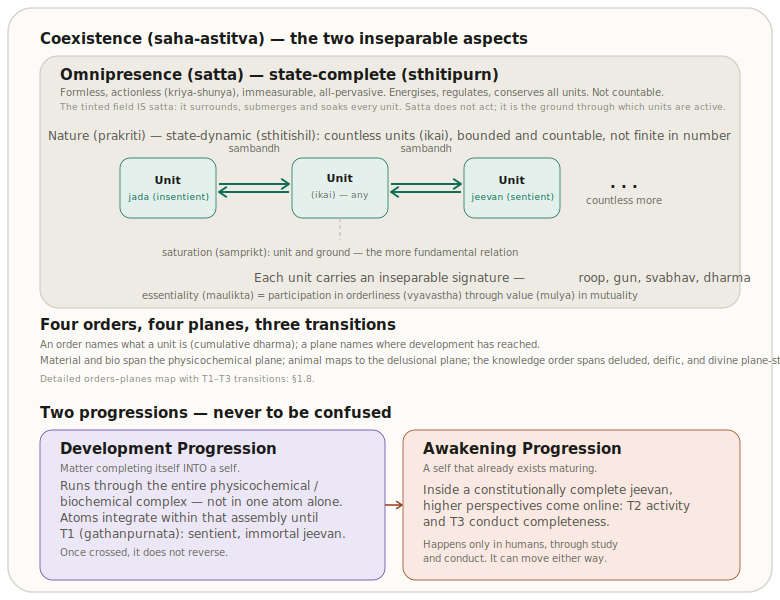
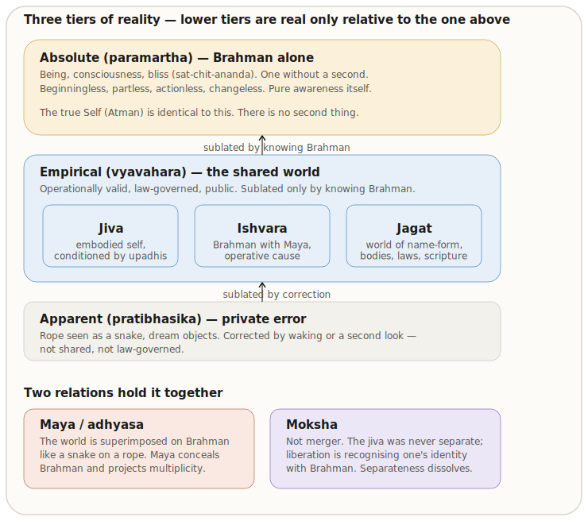
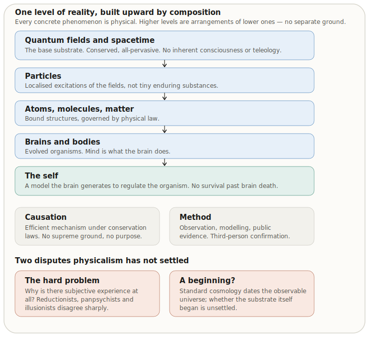

# What Is Existence?

**Author:** [AnalyticMadhyasthDarshan.org](https://github.com/raghavamohan/AnalyticMadhyasthDarshan) — a group of people studying Madhyasth Darshan philosophy. Source repository: [raghavamohan/AnalyticMadhyasthDarshan](https://github.com/raghavamohan/AnalyticMadhyasthDarshan).

**Edited on:** June 22, 2026, 4:21 PM IST

**Status:** Draft

**The question:** What is Existence? What exists? Does the thing that exists begin at some time?

This study examines these questions in **Madhyasth Darshan** (Co-existentialism), as presented by **Shri A. Nagraj**, and compares its answers with **Advaita Vedanta** and selected **modern philosophical and scientific approaches** to physical reality, consciousness, and selfhood.

## Standpoint and scope

These studies are written from the standpoint of a **scientist and technologist** — someone trained to graduate-level **physics and mathematics**, at home with contemporary cosmology, quantum theory, conservation laws, and the logic of formal models.

From that background, a familiar picture of nature is hard to avoid: **consciousness appears as something the brain does** — an epiphenomenon, functional outcome, or emergent property of particular configurations of very large numbers of physical particles. Modern physics and cognitive science are powerful on mechanism, prediction, and public evidence; yet the hard problem of consciousness, the status of the self, and the reality of value remain fiercely contested. The standpoint taken here does not treat those gaps as settled in favour of matter-only reductionism.

The work begins where that scientific picture leaves open questions — and asks whether Madhyasth Darshan offers a coherent alternative worth examining seriously. This paper reads the primary texts carefully, states what follows from the darshan itself, and compares it in parallel with what we know from **physics and the natural sciences**, **Advaita Vedanta**, and **modern Western philosophy** (especially philosophy of mind). Physics and mathematics are **one leg** of that comparison, not the only one. The aim is rigorous comparative understanding — testing definitions, internal consistency, and fit with public knowledge — not persuasion or devotional endorsement.

These topical studies state the philosophy in clear, checkable prose first. A separate formal mathematical treatment may follow once the definitions and relations are stable across the studies; this paper does not assume or require that treatment.

## Quick Glossary

| Term | Plain meaning |
|------|---------------|
| **Existence (*astitva*)** | In Madhyasth Darshan: beingness (*hona*) and indestructibility (*anashita*), always present as coexistence (*saha-astitva*). |
| **Coexistence (*saha-astitva*)** | Reality as the pervasive ground (*satta*) and all units (*ikai*) inseparably present together. |
| **Time (*kaal*)** | In Madhyasth Darshan: the duration of unit-activity (*kriya*), not an independent cosmic container; numerical reckoning of duration is a human convention within existence (§1.6). Full treatment: *Nature-Of-Time*. |
| **Satta (Omnipresence)** | The all-pervasive, formless, non-transforming ground in which all units (*ikai*) are saturated (*samprikt*). Translation and naming conventions: Editorial Notes. |
| **Saturation-Reflector Model** | Sentience is not generated from dead matter; the ever-present *gyan* of *satta* is expressed as active sentience (*chaitanya*) only when a constitutionally complete atom (*gathanpurna parmanu*) acts as a stable "reflector." Full argument: §6.6. |
| **Unit (*ikai*)** | A countable, bounded entity in nature, whether insentient (*jada*) or sentient (*chaitanya*). |
| ***Jeevan* (Sentient Self)** | The sentient self: a real, immortal, constitutionally complete unit (*gathanpurna parmanu*) that works through the body (*shareer*). |
| **Constitutional Completeness (*gathanpurnata*)** | The first completeness stage: when a composite atom integrates the required number of nucleus and orbiting particles to become functionally indivisible, immortal, and sentient (*jeevan*). Threshold of Development Progression, not the final telos of existence (§1.8). |
| **Activity Completeness (*kriyapurnata*)** | Restfulness of effort in the sentient atom; the knowledge-order stage of completeness (SB p. 58; MVD pp. 13–14, 27). |
| **Conduct Completeness (*vyavaharpurnata*)** | Destination of motion / authenticity of conduct in the sentient atom (SB p. 58; MVD pp. 13–14, 27). |
| **Six Perspectives (*shaad-drishti*)** | Six evaluative *drishti* provisioned in *jeevan*'s design: lower *priya*/*hita*/*labh* and humane *nyaya*/*dharma*/*satya* (MVD pp. 58, 60, 66–67; §1.9). Full ethics treatment: [Ethics-And-Morals-In-Human-Beings](../Ethics-And-Morals-In-Human-Beings/Ethics-And-Morals-In-Human-Beings.pdf). |
| ***Sapëkshata* (Relativity)** | In the knowledge order: relativity arising from *drishti*, *drishya*, and *darshan* — not unreality, and not a property of underlying coexistence. Full treatment: [Knowledge, Knower, and Known](../Knowledge-Knower-And-Known/Knowledge-Knower-And-Known.pdf) §1.4.1. |
| **Awakening Progression (*jagriti-kram*)** | Activation of higher provisioned *drishti* toward activity and conduct completeness in the knowledge order; distinct from Development Progression (*vikas-kram*) in the atom (MVD pp. 13–14, 27, 87; §1.8, §1.9). |
| ***Jada*** / ***Chaitanya*** | Insentient and sentient nature (*prakriti*). |
| **The Four Orders (*chaar avastha*)** | The real, stable developmental plateaus of nature in Madhyasth Darshan: Material (*padarth*), Pranic/Bio (*pran*), Animal (*jeev*), and Knowledge/Human (*gyan*). |
| **Saturation (*samprikt*)** | Ontological relationship between Omnipresence and every unit (soaked, submerged, surrounded): inherent energy and regulation **in** the unit through saturation; permeative *gyan* grounds orderliness in all units, active sentience at the constitutional-reflector threshold (§1.3, §6.6); not physical extraction or depletion of *satta*. |
| **Relationship (*sambandh*)** | Definite mutuality between units where expectations are predetermined in the sense of completeness (MVD, p. 61); contrast **association** (*sampark*), where expectations are voluntary. |
| **Recognition and fulfilment (*pahchanna* / *nirvaha karna*)** | Ontological activities in which a unit identifies its relationships and conducts itself so that value (*mulya*) flows in mutuality — universal across orders, explicit through evaluation in the knowledge order (§1.4). |
| **Capacity (*kshamata*)** | Order-specific scope for participating in relationships and bearing what coexistence provisionally makes available (MVD, p. 62; §1.4). |
| **Ability (*yogyata*)** | Competence to convert capacity into actual effort, conduct, or bonding (MVD, pp. 62, 79; §1.4). |
| **Receptivity (*patrata*)** | Readiness for a relationship's expectations and values to register and flow; in humans, extent of receptivity is qualification (*arhta*) (MVD, pp. 62, 142; §1.4, §1.9). |
| ***Atman*** / ***Brahman*** | Advaita: the Self and the one ultimate reality, finally identical (§2). |
| ***Mithya*** | Advaita: dependent appearance of the empirical world (§2.3). |
| **Sat-Chit-Ananda** | Advaita: being, consciousness, bliss as three names of Brahman (§2.2; contrast §5.3). |
| **Physicalism** | Modern view: every real concrete phenomenon is physical (§3.1). |
| **Panpsychism** | Experientiality belongs, at least primitively, to fundamental reality (§3.3). |
| **Strong / weak emergence** | Strong emergence: a higher-level property that is not deducible from, and adds something to, its lower-level base. Weak emergence: a higher-level pattern fully fixed by its base. Relevant to §6.2 and §3.3. |
| **Essentiality (*maulikta*)** | How a unit's signature matters in mutuality — participation-as-value in relationships, measured by contribution to orderliness among the four orders (SB p. 50; MVD p. 125; §1.4). |
| **Unit signature** | Inseparable four-tuple of form, properties, essential nature, and *dharma* carried by every saturated unit (MVD pp. 50–51; §1.2). |
| **Four planes** | Physicochemical, delusional, deific, and divine (complete) planes — developmental stages spanning orders, mapped to three completeness transitions (SB pp. 51–52, 92; §1.8). |
| **Generative / degenerative / mediative** | Property triad: effects that assist creation, dissolution, and sustainment in mutuality (MVD pp. 50–51; §1.2). |

## 1. The Madhyasth Darshan Answer

Madhyasth Darshan defines **existence** (*astitva*) as the ever-present **coexistence** (*saha-astitva*) of formless **Omnipresence** (*satta*) and **Nature** (*prakriti*) — beingness (*hona*) and indestructibility (*anashita*), beginningless and without creation from nothing. *Satta*, also called **Knowledge** (*gyan*) as the intelligibility-ground of reality, is all-pervasive, non-transforming, and state-complete (*sthitipurn*); nature saturated in it is state-dynamic (*sthitishil*), consisting of countless bounded **units** (*ikai*), each surrounded, submerged, and soaked in Omnipresence through **saturation** (*samprikt*). Saturation is mutual dependence for manifestation: inherent energy and regulation are provisioned **in** the unit through that relationship, not transferred from a separate store, while *satta* manifests as activity only through unit-activity — not as the trigger of particular change, but as the sustaining ground.

Units are **insentient** (*jada*) or **sentient** (*chaitanya*). Every unit carries inseparable form, properties, essential nature (*svabhav*), and *dharma*, and stands in definite **relationships** (*sambandh*) with other units — mutuality whose expectations are predetermined toward completeness. Through these signatures, units recognise and fulfil relationships, exchanging value (*mulya*) and participating in overall orderliness (*vyavastha*). Activity is always effort–motion–result (*shram–gati–parinam*), oriented by a completeness drive provisioned in coexistence. Complementary units compose into larger assemblies — particles into atoms, atoms into molecules and planetary bodies, cells into organisms, humans into families and societies — yet composition is not development: the real developmental plateaus are the **four ontological orders** — material (*padarth*), bio (*pran*), animal (*jeev*), and knowledge/human (*gyan*) — each with cumulative *dharma* and order-specific essential nature.

In the material and bio orders, conduct is definite through structural and seed conformity; in the animal order, a constitutionally complete sentient self (*jeevan*) works through the biological body under species-conformance. Sentience is not generated from dead matter: when an insentient atom reaches **constitutional completeness** (*gathanpurnata*), the ever-present *gyan* of *satta* is expressed as active sentience through that stable reflector, producing immortal *jeevan* — an irreversible threshold. Humans are the joint form of *jeevan* and body (*shareer*), provisioned to evidence understanding through **awakening progression** — activity completeness and conduct completeness — using six evaluative perspectives toward humane conduct and realisation. What progresses is never *satta* itself but unit-activity within saturation through development and awakening, until relationships are fulfilled and coexistence is realised in conduct, while underlying reality is conserved through transformation alone.

**What is existence?** The ever-present coexistence of the formless ground and all real units. **What exists?** That whole — Omnipresence, insentient and sentient units, bound in definite relationships. **Does it begin?** No. Coexistence is beginningless; only particular bodies and arrangements begin and end (§1.10).

MVD compresses this ontology in *Brahma satya hai, jagat satat hai* — Brahma is truth, the world is perpetual — developed in §1.11. Cross-tradition contrasts with rival views appear in §5. What follows states the picture in the darshan's own terms.

The sections below follow coexistence from the ground inward: what units are, how they bind to Omnipresence and to one another, how they compose into assemblies, how they change (including time), the four orders, planes and the emergence of *jeevan*, *jeevan*'s structure and awakening, and the beginningless conservation of what exists. Cross-tradition answers to the paper's three questions are summarized in §5.2.

### 1.1 The Coexistential Structure: Space (*Satta*) and Nature (*Prakriti*)

The primary texts develop this coexistential panorama in detail. SB gives the most compressed formulation:

> **"What is evident is that consciousness and matter are inseparably present. Upon examining their fundamental nature, we learn that all of existence is essentially nature (matter) saturated in Omnipotence (consciousness). Here, 'seeing' is intended in the sense of understanding. Since nature saturated in Omnipotence is inseparably present, existence itself is eternally manifest in the form of coexistence."**
> - SB, p. 48

From this passage, *satta* and units are **co-eternally present** — matter and Omnipresence arise together, neither from the other, neither ontologically prior nor posterior. Saturation is the ever-present relation in which formless Omnipresence and formful units have always been inseparably together. What changes is the activity, development, and awakening of units within coexistence (§§1.6–1.9).

Realisation Knowledge (*anubhav jnan*) expresses this inseparable presentness:

> **"Sentient and insentient nature saturated in Omnipotence. The countless sentient and insentient units are saturated in Omnipotence (Omnipresence)."**
> - MVD, p. 11

> **"All units saturated in the Omnipresence (permeative and transparent) have form, properties, essential nature & dharma, and have inherent orderliness & participate in overall orderliness."**
> - MVD, p. 11

Existence thus has two inseparable aspects:

1. **Omnipresence (*Satta* / *Vyapak*):** The formless, all-pervasive, non-transforming, immeasurable reality. It is described as actionless energy (*kriya-shunya urja*): it performs no actions, yet its permeative presence is the ground through which units are energized, regulated, and conserved in saturation.

    > **"Omnipotence is not confined within any dimension of length or breadth, nor can any measure be established for it; therefore, Omnipotence is all-pervasive."**
    > - SB, p. 49

2. **Units of Nature (*Ikai*):** The formful, active, countable, bounded entities — each with determinate reality, surrounded, submerged, and soaked in Omnipresence.

    > **"Nature, saturated in Omnipotence, exists as countless units. Each unit, being saturated in Omnipotence, remains surrounded, submerged, and soaked in it."**
    > - SB, p. 48

Nature (*prakriti*) names the saturated whole of formful existence; **units** (*ikai*) are the countable, bounded entities within it — each bounded from six directions yet inseparably present in coexistence (MVD, pp. 11, 34).

SB names this distinction explicitly: Omnipotence is *sthitipurn* (**state-complete**) — eternally present without motion, wave, or pressure — while nature saturated in it is *sthitishil* (**state-dynamic**): the countless units whose activity, development, and awakening constitute all change in existence (SB, pp. 50, 68–69). There is no place or time without formless existence; therefore Brahman does not progress. What progresses is unit-activity within saturation — completeness within saturation (§§1.8–1.9) — until **realisation in Omnipresence**: not a new state of *satta*, but nature's relationships fulfilled and evident in coexistence.

Naming these two aspects opens the question of their ontological relationship. What does it mean, in concrete terms, for a unit to be "saturated" in Omnipresence (*satta*)? **Saturation is that relationship** — pervasive co-location in which inherent energy and regulation belong to the saturated unit, developed in §1.3.

### 1.2 Every Unit's Four Inseparable Aspects

Every unit saturated in Omnipresence carries the same four inseparable aspects introduced in §1.1 and named here — form, properties, essential nature, and *dharma* — regardless of order. MVD states that all four orders have differentiating features related to these four (MVD, pp. 50–51). They are not optional descriptors added by a knower; they are what each unit **is** as a participant in coexistence.

**Form** (*roop*) is shared across all four orders. MVD defines it through shape, volume, and density — the physical attributes by which a bounded unit is individuated (MVD, pp. 50, 112).

**Properties** (*gun*) name the effects units have on one another in mutuality. In every order, properties are differentiated as **generative**, **degenerative**, and **mediative** — assisting creation, dissolution, and sustainment respectively (MVD, pp. 50–51). The relative powers that produce an effect when more than one entity come together are designated as properties; they are shared structural features of nature, not human classifications.

**Essential nature** (*svabhav*) is how the usefulness of a unit's properties participates in its order — the specific way a unit maintains balance among the four orders (MVD, pp. 50–51, 112). It differs by order; the cumulative pattern is summarised below.

**Dharma** names what a unit cannot be separated from — its innateness and fulfilment (SB, p. 50). Since existence is coexistence, indestructibility itself is the ultimate *dharma*; each order also carries a specific, cumulative *dharma* layered on the orders below it (MVD, p. 51).

| Order | Essential nature (*svabhav*) | *Dharma* (cumulative) |
|---|---|---|
| Material (*padarth*) | integration–disintegration (*sangathan–vighatan*) | existence (*astitva*) |
| Bio (*pran*) | vitalising–devitalising (*sarak–marak*) | + growth (*pushti*) |
| Animal (*jeev*) | cruel–uncruel | + hope to live (*jeene ki aasha*) |
| Knowledge / human (*gyan*) | fortitude, courage, generosity, kindness, grace, compassion | + happiness (*sukh*) |

These four aspects are not a static catalog; they are how each unit **participates in mutuality** and thereby creates orderliness. SB opens its answer to duality-centred materialism with three companion facts:

> **"Each unit is a whole along with its environment."**
> - SB, p. 13

> **"Each unit is orderliness with its ness and participates in overall orderliness."**
> - SB, p. 13

> **"Each unit moves towards 'development' in its natural state and 'decline' in its excited state."**
> - SB, p. 14

Wholeness is not aggregation alone: SB states **unit + environment = the unit as a whole**, which signifies its continuity (SB, p. 51; §1.8). ***Ness*** names unit-kind (*tv*): the spontaneity in expression of being itself is *ness*, made evident through essential nature under naturalness (SB, p. 54). Essential nature (*svabhav*) is determined by the usefulness of a unit's properties to the unit (MVD, p. 112): every unit is oriented toward creation, sustainment, or dissolution, and thereby toward development or decline. In each order the same signature executes differently — integration–disintegration in the material order, vitalising–devitalising in the bio order, cruel–uncruel in the animal order, fortitude and compassion in the knowledge order — as the table above summarises.

*Dharma* is what a unit cannot be separated from — the innateness of an entity (MVD, p. 112; SB, p. 50). Since existence is coexistence, indestructibility itself is the ultimate *dharma*; each higher order carries the *dharma*s below it cumulatively (MVD, pp. 50–51). Those cumulative *dharma*s are what **orderliness** (*vyavastha*) expresses at each tier — activity completeness in the knowledge order appears as orderliness with *ness* (SB, pp. 51–52; §1.4).

SB names the contrast between **natural state** — motion toward development — and **excited state** — motion toward decline; natural and excited states appear only in a unit's mutuality (SB, pp. 14–15). Assembly persistence under natural versus excited conditions is developed in §1.5.

MVD p. 11 names the same four-aspect structure for every saturated unit (quoted in §1.1). Participation is not order imposed from outside: SB states that every unit of every order is seen participating in the overall orderliness, and that **participation means recognising and fulfilling** — a principle observable even in the physicochemical realm, where components within an atom recognise and fulfil one another, creating inherent orderliness in the atom (SB, p. 123). MVD ties *svabhav* to mutuality directly: the usage of every property is solely for creation, sustainment, or dissolution; therefore the essential nature of every unit presents as creation-oriented, sustainment-oriented, or dissolution-oriented activity toward development or decline (MVD, p. 112). Endeavour aligned with this innateness is exuberance and leads to resolution; endeavour against it is retrogression and gives rise to problems (MVD, p. 112).

The signature therefore **is** the unit's share in mutual order — not a label pasted onto inert stuff. JV illustrates this with definite conduct: a peepal tree maintains its definite conduct with all its fruits, seeds, and leaves exhibiting peepal's properties, intrinsic nature, and *dharma*; the plant and animal worlds each exhibit their respective definite conducts — this is inherent orderliness (JV, p. 113). How that participation registers as essentiality and value in relationships is developed in §1.4; here the point is structural: form, properties, essential nature, and *dharma* are the inseparable terms in which each unit abides in orderliness and participates in the whole.

Harmony among form, properties, essential nature, and *dharma* is what MVD calls the essence of coexistence itself (MVD, p. 21). A compound assembly inherits a new signature at each tier (§1.5); the four-aspect template therefore iterates with every genuine new unit.

How that activity is causally formed — and how *satta* relates to change without being the efficient cause — is §1.6.

### 1.3 Saturation: The Ground–Unit Bond

The source describes units as *samprikt* — soaked, submerged, surrounded — in Omnipresence. Madhyasth Darshan treats saturation as an **ontological relationship**: pervasive co-location — the ever-present bond between formless Omnipresence and formful units, and the first layer of relational structure in coexistence. It is not a physical drawing, extraction, or depletion of energy from *satta*; Omnipresence does not act, transform, or be consumed in saturating a unit.

Through this relationship, every unit has **inherent energy** and regulatory order **in** it — energy fullness is of the saturated unit because of saturation, not a separate quantity transferred from a store. SB states this plainly:

> **"Every unit in its atomic state is active as orderliness, because it has inherent energy due to being saturated in Omnipotence."**
> - SB, p. 69

> **"Unit + Energy fullness = Activeness."**
> - SB, p. 69

The relation is **mutual dependence for manifestation**, not one-way supply. In coexistence, uniform energy at the ground and unit-activity manifest together: without unit activity — the source's term is **basic impulsion** — the energy remains unmanifest; without saturation, there is no basic impulsion (SB, p. 62). *Satta* remains formless, motionless, and free from pressure, while the whole of nature saturated in it is present with motion and pressure (SB, p. 49). Regulation, activeness, and forcefulness in a unit are **read from** its being surrounded, submerged, and soaked in Omnipresence (SB, p. 57) — not injected as efficient cause. Saturation is therefore mutual dependence for manifestation: Omnipresence as ground and every unit of nature as participant — co-eternally present, each real in its own right, with *satta* as supreme cause in the sustaining sense rather than as the trigger of particular change (§1.6).

**Tiered intelligibility.** All units saturated in permeative, transparent Omnipresence (MVD, p. 11) participate in inherent orderliness — the intelligibility-ground of *gyan* as *satta*, not an act of cognition by Omnipresence (§1.9). Insentient units exhibit radiance and projection (SB, p. 69); at constitutional completeness (*gathanpurnata*), the stable atom-configuration acts as a reflector through which ever-present *gyan* manifests as active sentience (*chaitanya*) — the Saturation-Reflector Model (§6.6). That ontological register is distinct from the projection–reflection cycle (*paravartan* / *pratyavartan*) in *jeevan* (§§1.6, 1.9).

Omnipresence is called energy and credited with energizing, regulating, and conserving nature, yet is also called actionless (*kriya-shunya*) and non-transforming. The texts resolve this by distributing the terms: *satta* is actionless in itself, but its energy is manifest as the activity of units through basic impulsion — latent, uniform energy at the root of activity, never acting on its own, yet inseparable from the activity through which alone it is revealed.

SB presents mutual dependence as a continuous identity-chain, a characteristic Madhyasth Darshan reasoning pattern (A = B = C = ...):

> **"Saturation in uniform energy itself is forcefulness, forcefulness itself is basic impulsion, basic impulsion itself is activity, activity itself is effort-motion-result, effort-motion-result itself is development and its continuity."**
> - SB, p. 62

Each link is an identity ("itself is"), not an external push. *Satta*'s uniform energy becomes forcefulness only through the unit, becomes activity only through basic impulsion, becomes development only through effort–motion–result (*shram–gati–parinam*) — the triad developed in §1.6.

### 1.4 Relationships, Recognition, and Value in Mutuality

Saturation names the ontological relation between Omnipresence and every unit. Existence also contains a second layer of **ontological relations between units** (*sambandh*). Nothing in nature is isolated — "nothing is isolated – that is the principle" (JV, p. 43). Each unit stands in definite relationships with other units. MVD defines a **relationship** as "the mutuality where expectations are predetermined in the sense of completeness" (MVD, p. 61), and contrasts it with **association** (*sampark*), "the mutuality where expectations are voluntary" (MVD, p. 61). Both are real; the structural template of coexistence runs through predetermined relationships whose expectations are fixed by order and signature, not chosen ad hoc.

Because existence is coexistence, SB states that entire beingness exhibits "complementarity, mutual recognition, and impression in their mutuality, manifesting in the form of reciprocity" (SB, p. 50). **Essentiality** (*maulikta*) in every plane and order is **value** (*mulya*):

> **"Entire beingness implies the essentiality of units in every plane and order. Essentiality refers to value… It is values that are reciprocated and mutually recognised, as complementarity, mutual recognition, and impression occur only in mutuality."**
> - SB, p. 50

MVD states the same chain in another register: sentiment is essentiality — the meaning of a unit's essential nature and *dharma* in its order or plane — and essentiality is value, responsibility and participation, outcome, and evaluation (MVD, p. 125). Essentiality is therefore how a unit's signature (§1.2) **matters in mutuality**: the degree to which it participates in maintaining orderliness and harmony among the four orders, not a moral invention layered onto a value-free nature. MVD p. 11 already names this participation as inherent in every unit saturated in Omnipresence; SB p. 50 adds that essentiality is regulated and protected because it is eternally present.

Values are the content exchanged when relationships are recognised and fulfilled. Complementarity (*poorakata*) and orderliness (*vyavastha*) are the structural forms this mutuality takes (SB, p. 49).

Every unit **recognises** its relationships and **fulfils** them through **capacity** (*kshamata*), **ability** (*yogyata*), and **receptivity** (*patrata*) at the level of its order (§1.4). JV states this universally:

> **"Every entity of nature recognises another; that is why it fulfils. An atomic particle too recognises another, and as a result, these particles abide in orderliness. They cohabit and function with one another, thus manifesting coexistence. Similarly, starting from molecules to planets, the entities of nature recognise one another and fulfil accordingly."**
> - JV, p. 69

Recognition and fulfilment are therefore ontological activities, not optional moral add-ons. In the material order they appear as structural conformity; in the biological order as seed conformity; in the animal order as species conformity; in the knowledge order they pass through knowing, believing, evaluation, and choice (JV, p. 48; MVD, p. 77). The same cycle becomes explicit in humans as knowing → believing → recognizing → fulfilling ([Knowledge, Knower, and Known](../Knowledge-Knower-And-Known/Knowledge-Knower-And-Known.pdf) §1.5).

The **completeness drive** (SB, p. 51) is the orientation of unit-activity toward fulfilling these relationships at ever higher stages — constitutional, activity, and conduct completeness — until realisation in Omnipresence. Units do not maximise an abstract quantity; they move toward terminal satisfaction through recognising and fulfilling the relationships provisioned in coexistence. Constitutional completeness itself is "the process… disciplined and bounded by the law of recognising and fulfilling among multiple parts" (MVD, p. 77) — constitution is relational before it is sentient.

MVD names the three **intellectual means** (*bauddhik sadhan*) through which that fulfilment operates: capacity, ability, and receptivity (MVD, p. 62). Where content is available but humane perspective is lacking, MVD names **grace** (*krupa*) as the endeavour of instilling receptivity (MVD, p. 61). The triad is not a psychological mood but the order-specific mechanism by which relationship-recognition becomes explicit conduct — definite in the first three orders, achieved through awakening in humans (§1.4).

Three levels of recognition–fulfilment should be kept apart within this single ontological thread. **Structural** recognition–fulfilment — complementarity and mutual recognition eternally established (SB, p. 49) — belongs to every order. **Constitutional** recognition–fulfilment defines *gathan* among multiple parts (MVD, p. 77). **Evaluative** perspective in the knowledge order uses six provisioned *drishti* (§1.9). Humane conduct and ethics are not a separate domain glued onto ontology; they are how relationship-recognition and value-fulfilment appear once *jeevan* evaluates and chooses.

In the first three orders, units do not choose conduct the way deluded humans do. Insentient units lack the thought aspect; their field of activity is limited to length, width, and height (MVD, p. 77). JV states that structural conformity regulates the material order, seed conformity the biological order, and species conformity the animal order — and that every unit of nature except humans exhibits definite conduct (JV, pp. 48, 113). MVD contrasts animal-order *jeevan*, dependent both while performing actions and while experiencing consequences (MVD, p. 69), with humans, for whom knowing and believing — evaluation — are activities of the knowledge order alone (JV, p. 70).

Madhyasth Darshan treats relationship-fulfilment as modulated by three factors named together as **intellectual means** (*bauddhik sadhan*):

> **Intellectual means (*bauddhik sadhan*):** The intellectual means are in the form of capacity, ability and receptivity.
> - MVD, p. 62

**Capacity** (*kshamata*) names what a unit can bear or perform at its order — the provisioned scope for participating in a relationship. **Ability** (*yogyata*) names what it can convert into actual activity. **Receptivity** (*patrata*) names whether the relationship's expectations and values can register and flow. Together the three form a single mechanism: capacity sets the scope, ability converts that scope into effort (*shram*), and receptivity determines whether the relationship's values actually register and fulfilment (*nirvaha*) can complete. **Fulfilment** is defined as evidencing use, right-use, and purposeful-use together with resolution and prosperity, or proving mutually complementary (MVD, p. 62) — which requires all three factors, not receptivity alone. **Means** (*sadhan*) combines the necessary resources with receptivity for the seeker (MVD, p. 62). In the knowledge order, the extent of receptivity constitutes qualification (*arhta*); how qualification and the triad unfold into perspective and worldview is developed in §1.9.

The triad is not confined to the knowledge order. MVD states that **ascending** (*agreshan*) is the balance and receptivity gained while converting capacity and ability into effort, while **frustration** (*kshobh*) is the shortcoming in that conversion — "incompleteness of receptivity" (MVD, p. 79). Particles in the outermost orbits of insentient atoms are active through effort, engaged in compounding activities that advance toward the biological order (MVD, p. 79). At the atomic tier, development-progression operates "in the form of hungry and overfull atoms" (MVD, p. 8): an atom deficient in particles bonds with one bearing excess because needs and surpluses are complementary. Even atomic bonding is relationship-recognition converting capacity and ability into effort at the level receptivity allows.

In the knowledge order, "the movement towards awakening or decline depends solely on this capacity, ability, and receptivity" (MVD, p. 134). In lower orders the three operate definitely; in humans they must be achieved while relationships pass through evaluation and choice (§1.9). When complementary units fulfil their relationships, they compose into larger units — §1.5.

### 1.5 Composition and Assemblies

When complementary units fulfil their relationships, they **compose** into larger units. JV states the engine:

> **"Everywhere, there exists a natural inclination towards coexistence. This inclination is what leads atomic particles to assemble into atoms, atoms to combine into molecules, and molecules to combine into molecular forms."**
> - JV, p. 67

MVD distinguishes two modes of composition (MVD, p. 42). In a **mixture** (*mishran*), components all maintain their respective conducts — aggregation without a new joint conduct. In a **compound** (*yaugik*), components combine in definite proportion, discard their own conducts, and present another kind of conduct — a genuinely new unit with its own form, properties, essential nature, and *dharma*. Only compound composition creates a new tier of the hierarchy.

SB insists that **composition is not development**. A composition never exceeds its constituents in essential "-ness" (*tv*): the largest iron structure is neither more nor less than ironness; species nature in the material, biological, and animal orders remains definite through result-, seed-, or species-conformance (SB, pp. 75–76). Assemblies aggregate or compound; they may resemble growth, but the developmental plateau is crossed only when an **atom** reaches constitutional completeness (§1.8). Humans alone can deviate from humanness while claiming superiority — which is why knowledge-order progress requires awakening through evaluation, not mere enlargement of composition (§1.9).

Because the output of composition is itself a unit, the same relational template iterates. In the **material line**, particles compose into atoms, atoms into molecules, molecules into molecular structures — "this Earth and every other planet are compositions of atoms and molecules" (MVD, p. 8). In the **biological line**, "The coexistence of one cell (*pran kosha*) with another cell leads to multicellular forms, resulting in the formation of definite organisms" (JV, p. 82). In the **animal line**, bodies are composed of biological cells and lineage carries species-conformance across generations (MVD, p. 79; JV, p. 48). In the **knowledge line**, "More than one human coming together or becoming organised is referred to as a family, community, or undivided society" (MVD, p. 55) — extending toward universal orderliness. Each tier is both a completed assembly and a participant in the next.

An assembly **persists** while its internal and external relationships are fulfilled within conducive conditions — its natural state — and **declines or decomposes** when they are not — its excited state (SB, p. 14). Every persisting assembly transmits its method of composition (*rachna vidhi*) across generations of its members: by constitution in the material order, by seed in the biological order, by lineage and species in the animal order, and by education-*sanskar* in the knowledge order (JV, pp. 48, 82; MVD, pp. 92–93). In the first three orders, composition, persistence, and transmission operate definitely; in the knowledge order they must pass through understanding, evaluation, and choice — which is why human assembly above the individual is the only tier that can fail and the only one still incomplete (JV, p. 47). Formal articulation across all orders: [The Coexistence Template](../The-Coexistence-Template/The-Coexistence-Template.pdf). How composed units change — and how time belongs to that activity — is §1.6.

### 1.6 Change Within Coexistence: Causation, Motion, and Time

Madhyasth Darshan distinguishes **origination** (units co-eternally present in coexistence, §1.1) from **causation** (what produces change when units transform). Unit-activity runs toward completeness (§§1.8–1.9); this section states **how** that activity — already structured as the single principle effort–motion–result (*shram–gati–parinam*) — is causally formed.

Change within coexistence is worked by units themselves. Omnipresence grounds and conserves all units through saturation (§1.3) as **supreme cause** (*mahakaran*) in the sustaining sense — the ground of activity, not its trigger. MVD presents a four-level causal hierarchy before naming *satta* as *mahakaran*:

**Gross (*sthool*) → Subtle (*sukshm*) → Causal (*atma* in *jeevan*) → Supreme cause (*vyapak* / *satta*)**

1. **Gross (*sthool*):** bodies or objects constituted of many atoms.
2. **Subtle (*sukshm*):** atoms themselves.
3. **Causal (*karan*):** *atma* (within *jeevan*).
4. **Supreme cause (*mahakaran*):** Omnipresence (*vyapak*).

> **"An object or body constituted of many atoms is referred to as 'gross'. Atoms are referred to as 'subtle'. Atma is referred to as 'causal'. [Omnipresence] is referred to as 'supreme cause'."**
> - MVD, p. 288

*Satta* is the supreme cause in the sense of the sustaining ground — not the trigger of any particular transformation (MVD, p. 289; SB, pp. 49, 62). The causal work of change is done by units themselves.

MVD also summarises three ontological *dharma*s at this level (p. 288): the insentient is mortal (*maran-dharma*), the sentient is immortal, and Omnipresence is eternal. Mortality here does not mean annihilation — coexistence conserves *vastu* through transformation (§1.10) — but marks that insentient units lack *jeevan*'s constitutional immortality.

Among the **Fundamental Concepts** on MVD p. 11, Realisation Knowledge (*anubhav jnan*) and the Principle **Effort–Motion–Result** (*shram–gati–parinam*) appear as the third and fourth entries. All activity in nature — insentient and sentient — carries this single irreducible triad, formulated as:

> **"Every physical-chemical activity is an inseparable presence of effort, motion and result. Each of these is a joint form of the other two."**
> - SB, p. 58

Effort, motion, and result are not three sequential steps but three inseparable aspects of the same activity, each implying the other two. Because nature is eternally active, every interaction carries this triad. Two structural patterns follow in the insentient orders — both expressions of **inter-unit relationships** (§1.4):

- **State and motion are inseparable**: there is force in state, power in motion (SB, pp. 248–249).
- **Give–take complementarity**: after reciprocal exchange, both parties attain satisfaction or **natural motion** (*svabhav gati*) — cyclical restoration to natural state, not one-way extraction (SB, pp. 52–53; §1.2).

Change in the insentient orders is therefore always circular and conserved, never one-way or annihilating.

In the sentient atom, the **same** triad continues:

> **"Effort, motion, and result continue to occur within evolving-constitution atoms. Even upon attaining immortality, there is no lack of effort in the activity of 'jeevan'."**
> - MVD, p. 78

What differs is not a second triad but how the three legs are read toward completeness. In the sentient atom (SB, p. 58):

- *parinam* (result) → constitutional completeness — immortality of result;
- *shram* (effort) → activity completeness — restfulness of effort;
- *gati* (motion) → conduct completeness — destination of motion.

SB p. 71 states this teleology for every developing atom: result oriented toward immortality, effort toward restfulness, motion toward destination. After *gathanpurnata*, the constitutionally complete atom undergoes **qualitative change without quantitative change** in particle count (SB, p. 55) — not physicochemical transformation in the material sense, but the triad remains.

Sentient nature adds **projection and reflection** (*paravartan* and *pratyavartan*). An insentient unit is **radiance and projection** — the bounded body of matter expressing outward without the reflective cycle (SB, p. 69). In sentient nature, both projection and reflection take place (SB, p. 60). In the knowledge order, harmony of reflection and projection is **resolution** (*samadhan*) — recognising and fulfilling in balance (SB, pp. 60, 64–65). How the five faculties of *jeevan* carry this cycle in definite registers is developed in §1.9.

Order-specific mutual activity under the same triad differs: image and effect in material nature; evaluation of essential nature in the animal order; exchange of values and evaluation of *dharma* as evaluation of resolution in humans (SB, pp. 248–249).

**Time** (*kaal*) in Madhyasth Darshan is the **duration of unit-activity** — inseparable from the motion and effort–motion–result cycles of active units, not a freestanding cosmic container alongside *satta* and *ikai*. Where there is no transforming activity in formless, actionless Omnipresence, there is no *kaal* in this sense. Comparative treatment of *trikaalabadh*, numerical reckoning, past–present–future structure, and spacetime physics belongs in [*Nature-Of-Time*](../Nature-Of-Time/Nature-Of-Time.pdf).

Circular causation is how completeness-directed activity appears across orders: not maximisation, but definite movement through the single triad and its sentient unfolding — projection, reflection, and *samadhan* where *jeevan* is active. Change within coexistence runs through this highly ordered, realist structure of nature — not an amorphous mass. That structure also implies **conservation**: units transform configuration (*roopantaran*) but underlying *vastu* is never annihilated from absolute non-existence (*abhava*). The full conservation argument is §1.10.

### 1.7 The Four Ontological Orders

Nature (*prakriti*) exists as countless physical (*jada*) and sentient (*chaitanya*) units — organised, bounded, and active within Omnipresence.

> **"Existence is not just physicochemical matter, but all physical, chemical and jeevan entities are inseparably present in Omnipresence."**
> - MVD, p. 5

This is why the human being is understood as a joint form of a physical body (*shareer*) and a sentient self (*jeevan*):

> **"Brahma (Omnipotence) is omnipresent, and jeevan-clouds are many."**
> - MVD, p. 13

> **"The grandeur of humans as a joint form of jeevan and body."**
> - MVD, p. 13

Nature is organized into four real, objective **Ontological Orders** (*chaar avastha*) — material (*padarth*), pranic/bio (*pran*), animal (*jeev*), and knowledge/human (*gyan*). Each is a stable plateau in development; its form, properties, essential nature, and cumulative *dharma* are tabulated in §1.2. Higher orders **include** the *dharma*s of lower orders cumulatively (SB, p. 179; MVD, p. 115). In the knowledge order, existence and growth are evident in the human body; *sanskar* and happiness must become meaningful in *jeevan* (SB, p. 179).

The four orders are cumulative in *dharma* but not equally stable as compositions. SB notes that the biological order appears more developed than the material yet is **less stable and less diverse** — it can revert to the material order after manifesting its essentiality — whereas irreversible atomic development crosses only at constitutional completeness (SB, pp. 76–78). The emergence of biological and animal orders on Earth serves the **knowledge order**: non-human nature is provisioned as the ladder toward humans who can realise coexistence in behaviour through awakening (SB, p. 77).

These are **objective categories in nature**, not human typologies: material atoms, living cells, animal organisms, and knowledge-order humans each occupy a real plateau whose layered *dharma* is fixed by the order itself. In the animal order, *jeevan* is influenced by **inertial-impression** (*adhyasa*) — species-traditional activity patterns accepted from gestation and emulated after birth — whereas humans in the knowledge order recognize through *sanskar*-conformity (SB, pp. 62–63; JV, p. 48). This *adhyasa* names species-traditional conduct, not Advaita's ontological superimposition of the world on Brahman (§5.6). Each order also cyclically manifests through saturation in *satta*, but in a different mode (MVD, p. 289):

| Order | Cyclical manifestation through saturation |
|---|---|
| Material (*padarth*) | Units are **active** because of being in Omnipresence |
| Bio (*pran*) | Units have **pulsation** because of being in it |
| Animal (*jeev*) | Units have the **hope of living** because of being in it |
| Knowledge / Human (*gyan*) | Units are **hopeful and conscientious** because of being in it |

Cyclicality is real at every order, but not by one identical mechanism — the general circular structures of §1.6 run through all orders; the table names what distinguishes each order.

For readers approaching from neuroscience, Bhattacharya maps how *jeevan* relates to brain and order (material and biological entities without brain; brain-endowed organisms sometimes without *jeevan*; *jeevan*'s activity mediated through the brain in the knowledge order) — **Bhattacharya**, *The Relationship of Jeevan and Brain*; see also [Why-Humans-Are-Not-Just-Material](../Why-Humans-Are-Not-Just-Material/Why-Humans-Are-Not-Just-Material.pdf).

These four orders are where development without creation from nothing becomes concrete (§1.8). Each order is a real, stable plateau that the next presupposes, so the upward movement from matter to human is development within coexistence, not the appearance of new substance.

SB p. 49 pairs two infinities in characteristic Madhyasth Darshan parallelism: *satta* is immeasurable by pervasion; *prakriti* is countless by count:

> **"Omnipotence is not confined within any dimension of length or breadth, nor can any measure be established for it; therefore, Omnipotence is all-pervasive. All the units that exist in the form of nature cannot be counted; therefore, they are countless. In this way, existence itself is omnipresent and countless."**
> - SB, p. 49

### 1.8 Planes and the Emergence of *Jeevan*

Development within saturation is oriented toward completeness. SB states that nature saturated in state-complete Omnipresence is oriented for development and awakening until realization in Omnipresence, and that each unit embedded in the complete is active and developing solely for completeness — where development refers to constitutional completeness, activity completeness, and conduct completeness, along with their continuity (SB, pp. 45, 51–52).

Madhyasth Darshan names three completeness stages — constitutional (*gathanpurnata*), activity (*kriyapurnata*), and conduct (*vyavaharpurnata*). In the sentient atom, constitutional completeness is immortality of result; activity completeness is restfulness of effort; conduct completeness is destination of motion (SB, p. 58). Constitutional completeness marks the *jeevan* threshold and animal-order hope of living; activity and conduct completeness are milestones within constitutionally complete *jeevan* in the knowledge order (§1.9).

Progress never isolates a unit from its field. SB states the continuity of law within every unit as **unit + environment = the unit as a whole**, which itself signifies its continuity (SB, p. 51). Regulation and magnificence appear because each unit is always unit-and-environment together; the completeness drive runs through mutual relationships provisioned in coexistence (§1.4), not through solitary self-transformation.

Two paths carry this drive and must not be collapsed. **Development Progression** (*vikas-kram*) runs within the atom: an insentient *parmanu* integrates particles until it reaches constitutional completeness and becomes *jeevan* (SB, pp. 58, 80; MVD, p. 76) — traced below. **Awakening Progression** (*jagriti-kram*) runs in the *jeevan* already constitutionally complete: in humans the milestones are activity completeness and conduct completeness expressed as resolution (*samadhan*) and authenticity (*pramanikta*) (MVD, pp. 13–14, 27; SB, p. 51), developed in §1.9.

SB presents the orientation of the whole as an identity-chain: existence itself is development, development itself is progression, progression itself is orderliness, and orderliness itself is destiny (SB, p. 56). **Destiny** (*niyati*) here is not fatalism imposed from outside: it is the definite orientation of every unit toward completeness already provisioned in coexistence. Orderliness (*vyavastha*) is what mutuality is when units recognise and fulfil (§1.4).

Alongside the four **orders** (§1.7) — objective plateaus fixed by the kind of unit — SB names four **planes** (*pad*): developmental stages in nature's progression toward completeness (SB, p. 52). An order names what a unit **is**; a plane names where development has reached in the history of nature saturated in Omnipresence. Some planes span more than one order; in the knowledge order, plane membership tracks **human state** (deluded, awakened, evidenced) rather than a new insentient plateau.

SB lists the four planes as the physicochemical plane, delusional plane, deific plane, and liberation from planes — also called the divine or complete plane (SB, p. 52). In oral exposition these are sometimes called the Pranic, delusion, deific, and divine planes; the Pranic label maps to SB's **physicochemical plane**, which comprises the material and biological orders.

The first completeness stage is also the first **plane transition** (SB, pp. 51–52):

| Transition | Completeness stage | From → to | What becomes evident |
|---|---|---|---|
| **T1** | Constitutional (*gathanpurnata*) | Physicochemical → delusional | Sentient *jeevan*; animal order and deluded knowledge-order humans; hope to live |

T1 is **irreversible** at the atomic level: the insentient atom develops into sentient status and does not revert to insentience for any reason (SB, p. 92). That threshold exits the physicochemical plane — the first stage of development in nature's progression toward completeness. T2 and T3 — activity and conduct completeness as transitions to the deific and divine planes — are awakening milestones within constitutionally complete *jeevan* in the knowledge order (§1.9).

SB notes that all stages observed in the progression of emergence — physicochemical, delusional, deific, and divine planes — are marked by the activity of both insentient and sentient nature (SB, p. 92).

Madhyasth Darshan gives a developmental account of how an insentient atom (*parmanu*) — always a **composite** of nucleus and orbiting particles, not an elementary particle of physics (MVD, p. 42) — reaches *gathanpurnata*, the first completeness stage in Development Progression. When the required number of particles for its constitution are all integrated, the atom becomes constitutionally complete: satisfaction within, by, and for that constitution — the immortality of the result, and the attainment of sentient status (SB, p. 59). All types of atoms, including constitutionally complete ones, are eternally present through the natural law of coexistence in existence (SB, p. 59).

In this state of completeness, there is neither an increase nor a decrease in the number of particles in the atom; due to this stability, the constitutionally complete atom possesses inexhaustible power and force and undergoes qualitative change without any quantitative change (SB, p. 55). Constitutional completeness is achieved through particle incorporation and expulsion between atoms, not only monotonic addition (SB, pp. 58, 71). Qualitative change without quantitative change in the sentient atom "persists from delusion till awakening" — the transition marks a stable sentient threshold, not a claim that every downstream conduct state is irreversible.

MVD states that the fundamental unit is the insentient atom, which through development attains sentience as evidence of constitutional completeness; upon achieving it, its endeavour is toward activity completeness (MVD, p. 76). A constitutionally complete atom does not revert to insentience in constitution (SB, pp. 55, 59, 92). Constitutional completeness is therefore the ontological threshold at which an atom becomes *jeevan* — sentient, immortal in constitution, and oriented toward further completeness through activity and conduct. The structure of *jeevan*, its provisioned perspectives, and awakening progression are §1.9.

### 1.9 *Jeevan*: Structure, Perspectives, and Awakening

As the constitutionally complete unit introduced in §1.8, *jeevan* is the sentient self that works through the body (*shareer*) in the animal and knowledge orders (§1.7). In plane terms, animal-order *jeevan* and deluded knowledge-order humans occupy the delusional plane; awakening progression moves a human through the deific plane toward conduct completeness and evidence in the divine plane.

### 1.9.1 Structure and the projection–reflection cycle

MVD lists five inseparable aspects — *mun*, *vritti*, *chitta*, *buddhi*, and *atma* — within the *jeevan*-cloud (MVD, p. 13). MVD holds that *atma*, *buddhi*, *chitta*, *vritti*, and *mun* are indivisible in a *jeevan*-cloud; energies channel toward development and awakening through them — curiosity, enthusiasm, delight, immersion, and finally realization (MVD, p. 77). The five faculties belong to the same *jeevan*-cloud (MVD, p. 83); every sentient unit is endowed with perspective (MVD, p. 84). They operate through the projection and reflection cycle (*paravartan* and *pratyavartan*) introduced in §1.6:

| Strength / power | Projection (*paravartan*) | Reflection (*pratyavartan*) |
|---|---|---|
| *Mun* / hope | selection | taste (*asvad*) |
| *Vritti* / thought | analysis | deliberation |
| *Chitta* / desire | visualisation | contemplation |
| *Buddhi* | resolve (*sankalp*) | enlightenment (*bodh*) |
| *Atma* | authenticity (*pramanikta*) | realisation (*anubhav*) |

In delusion, hope follows sensation upward from the body; in awakening, realisation in coexistence at *atma* regulates *buddhi*, *chitta*, *vritti*, and *mun* through the same projection–reflection cycle (MVD, Ch. 17, pp. 274–277). When lower faculties do not take refuge in the one above, the texts call this *bauddhik rahasya* (intellectual mystery) — not an ontological opacity in coexistence, but misalignment within *jeevan* (MVD, Ch. 17, p. 279). Why development and decline can look equally mysterious uses the same structure: the means are shared; only the direction of the cycle differs (MVD, Ch. 17, pp. 295–296). For the full-knowability thesis, see [Knowledge, Knower, and Known](../Knowledge-Knower-And-Known/Knowledge-Knower-And-Known.pdf) §1.11; the practice path belongs in the planned study *Spiritual-Practice-And-Realization*.

The texts also call *jeevan* indivisible and immortal. Madhyasth Darshan reads "indivisibility" as functional: the constitution is self-maintaining and does not spontaneously lose completeness. "Immortal" means the sentient unit does not lose constitutional completeness — not that it has no parts in a mereological sense.

> **"Jeevan continues to exist even after death as it does while driving a body."**
> - JV, p. 20

Identity across time is continuity of constitution: the same constitutionally complete configuration persists across bodily death and re-association. Death is an event of the body (*shareer*), not of *jeevan* (MVD, p. 13; JV, p. 20).

During life, not only after death, *jeevan* must be distinguished from the body it drives. Mistaking the body for the self is the root of delusion in the knowledge order (SB, pp. 91–92). The body sleeps, eats, and ages; those cycles fulfil insentient composition. *Jeevan* does not sleep when the body sleeps — its activity continues as projection and reflection toward resolution (§1.6). Values and evaluation are *jeevan*'s practical purpose; bodily sustenance alone is not *jeevan*'s fulfilment. The body is **medium and instrument**, not the sentient self — which is why the delusional plane (§1.8) marks body-identification and awakening marks *jeevan* organising conduct through higher *drishti*.

### 1.9.2 Plane transitions T2 and T3

Activity and conduct completeness mark the second and third plane transitions within constitutionally complete *jeevan* in the knowledge order (SB, pp. 51–52):

| Transition | Completeness stage | From → to | What becomes evident |
|---|---|---|---|
| **T2** | Activity (*kriyapurnata*) | Delusional → deific | Awakened humans; orderliness with *ness* |
| **T3** | Conduct (*vyavaharpurnata*) | Deific → divine (complete) | Awakened humans with evidence (*pramanikta*); highest benevolence |

MVD distinguishes **delusional** and **awakened** knowledge-order humans by kosha exposition: the animal order and delusional knowledge order share four koshas; awakened humans express all five, including *vigyanmaya* (MVD, pp. 49–50). Deluded humans remain in the delusional plane; awakening moves a human into the deific plane; conduct completeness with authentic evidence moves toward the divine plane. Plane membership for **humans** can change with study and realization, even though the sentience threshold itself does not lapse (SB, p. 55).

### 1.9.3 Six perspectives and Awakening Progression

In the knowledge order, *jeevan*'s design includes more than bodily drive. Madhyasth Darshan holds that six evaluative **perspectives** (*drishti*) are **provisioned in *jeevan*'s constitution** — provisioned in coexistence like the definite structure of development and awakening (MVD, pp. 5, 14–15, 87; JV, p. 59). It is an existential fact, not a cultural overlay. Unawakened humans **operate** through the lower three (*priya*, *hita*, *labh* — pleasant/unpleasant, healthy/unhealthy, profit/loss) and the four inhumane propensities (eating, sleeping, defending, mating — MVD, p. 58). Humane perspectives (*nyaya*, *dharma*, *satya*) are **present in the design** but become the organizing **refuge** only as **Awakening Progression** advances.

Awakening Progression is explicit in the knowledge order: awakening in deluded humans itself is activity completeness and conduct completeness (MVD, p. 27). Units of the knowledge order have the capacity of understanding — about insentient and sentient nature saturated in Omnipotence — and it is natural for humans to have behaviour with other humans, be responsible for glory towards those who are more awakened, and to practise, study and contemplate for their further awakening (MVD, p. 27). JV states that human bodies are **provisioned to evidence understanding** — a feature absent in animal bodies — so that *jeevan* can manifest awakening through the union of sentient self and body (JV, p. 59).

The six *drishti* form a fixed catalog with domain mapping. MVD classifies the lower three as *amanveeya drishti* (inhumane perspectives): pleasant-unpleasant, healthy-unhealthy, and profit-loss only (MVD, p. 58). The humane tier (*manveeya drishti*) is justice-injustice, dharma-adharma, and truth-untruth (MVD, p. 60). MVD maps each perspective to what it evaluates — instincts, body, material goods, behaviour, resolution, and realisation in existence respectively (MVD, p. 66). Deluded life defaults to the lower refuge; humane refuge is **necessary** even when not yet lived (MVD, pp. 67).

MVD distinguishes this six-perspective catalog from a further tier: **higher-humane societal orderliness** (*atimanveeya samajik vyavastha*) — orderliness and individual endeavour that provide adequate means for cultivating higher-humane nature, propensity, and perspective (MVD, p. 60). At that tier, higher-humane *drishti* is "only Truth" — coexistence as ultimate truth (MVD, p. 61) — not a seventh evaluative perspective alongside *priya*–*satya*, but a societal and pedagogical frame for awakening beyond the six.

How higher *drishti* **come online** uses capacity, ability, and receptivity — the universal mechanism defined in §1.4 — at the knowledge-order level. What is provisioned and inherent in coexistence (MVD, pp. 5, 14–15) is not invented by units; it unfolds through study, environment, and means (*sadhan*), as the triad grows (MVD, pp. 27, 62, 142). Capacity, ability, and receptivity for worldview arise from the interconnected process of environment, study, and prior *sanskar* (MVD, p. 134). Receptivity's extent constitutes qualification (*arhta*); qualification yields perspective (*drishti*); perspective yields worldview (*darshan*) (MVD, p. 142). The suitable capacity, ability, and receptivity for realisation of pre-existing coexistence is "the right of every human being"; attaining them is "the pinnacle of their awakening" (MVD, p. 302).

> **"Study refers to the activity, process, and endeavour performed with remembrance, in the witness of the seat of knowledge (*atma*) and under the light of realisation. The extent of one's receptivity constitutes one's qualification; the manner of conduct arising from this qualification is referred to as perspective; and the reflection attained through this perspective is referred to as worldview."**
> - MVD, p. 142

When content is available but humane *drishti* is lacking, MVD names the remedial endeavour **grace** (*krupa*) — instilling the receptivity that was provisioned but not yet active (MVD, p. 61). In *jeevan* already *gathanpurna* (§1.8), Awakening Progression orients activity and conduct completeness through the triad (§1.4). Provisioned *drishti* are the evaluative registers through which that orientation becomes lived perspective — lower registers active first, higher registers activating through awakening (*drishti*, *patrata*, refuge [*aashray*]).

Awakening is not binary. MVD describes tiers of development on the knowledge order — from those aligned with injustice heading toward decline, through partial and half-developed stages, to those who have realised the truth and embody thought and behaviour aligned with justice and dharma (MVD, p. 160). Subordination, not erasure, governs the relation of lower to higher *drishti*. Heart's fulfilment leads to health gain; sensory satisfaction does not necessarily lead to heart's satisfaction (MVD, p. 66). Pleasure, health, and profit are not denied — they are insufficient as the organizing refuge ([Ethics-And-Morals-In-Human-Beings](../Ethics-And-Morals-In-Human-Beings/Ethics-And-Morals-In-Human-Beings.pdf) §3.2). The knowledge-order unit **contains** material, bio, and animal activities; evolution is reorganization under higher perspective, not abandonment of body and goods (MVD, p. 52, cited in comparative studies).

In the human order, activity is additionally *sanskar*-mediated. *Sanskar* — **acceptances towards completeness**, and **knowledge, wisdom and science which gets carried forward towards resolution for evidencing** (MVD, p. 90) — and the reflection–projection cycle can lead either toward awakening or toward decline (MVD, pp. 289–291). Awakening, *sanskar*, environment, study, and humaneness form an explicit circular dependency (MVD, p. 290). Insentient units do not unfold knowledge (*gyan udghatan*); only *jeevan* does, through thoughts (MVD, p. 289; [Knowledge, Knower, and Known](../Knowledge-Knower-And-Known/Knowledge-Knower-And-Known.pdf)).

Activation is not automatic. Completeness drive meets **means** — environment, study, and contemplation (MVD, p. 27) — and the *darshan-drishya-drishti* structure developed in [Knowledge, Knower, and Known](../Knowledge-Knower-And-Known/Knowledge-Knower-And-Known.pdf) §1.4 and §1.9 (sensitivity vs comprehension). In that structure, *sapëkshata* (relativity) arises from the distinctions among perspective, scene, and worldview — from how *jeevan* views and understands — not from the underlying reality of coexistence (§1.1, §1.10). Madhyasth Darshan does not treat relativity as unreality: units, relationships, and the perpetual world remain ontologically real; what varies with perspective is evaluative seeing and the understanding a *jeevan* has yet to evidence in conduct. Einstein's frame-dependent physics is a separate comparative topic (§4.3; [*Nature-Of-Time*](../Nature-Of-Time/Nature-Of-Time.pdf)). Behavioural and social expression of the six perspectives belongs in [Human Behavior and Society](../Human-Behavior-And-Society/Human-Behavior-And-Society.pdf); this section states the ontological design of *jeevan* in the knowledge order.

### 1.9.4 Omnipresence as *Gyan*; *Jeevan* as knower

The source calls Omnipresence **Knowledge** (*gyan*): intelligibility and orderliness as ground — reality such that it can be known, is orderly, transparent, and lawful — rather than an act of cognition (MVD, p. 35; also named in §1.1). MVD p. 35 states that knowledge itself is the omnipresent Omnipotence, referred to as Space.

The knowing act (*chaitanya*) belongs only to *jeevan*. MVD p. 289 states explicitly that **the unfolding of knowledge** (*gyan udghatan*) occurs **only** through the sentient aspect (*jeevan*) or thoughts — not through insentient units and not through Omnipresence acting as a knower. MVD p. 115 adds a narrower formulation: knowledge is inherent everywhere, but **its unfolding happens by awakened humans** — a sleeping, deluded *jeevan* cannot unfold it. The same passage describes a sensory/cognitive pathway: vibrational motion on the brain from the cognitive organs leads to the unfolding of knowledge. *Gyan* as a name of *satta* is the intelligibility-ground; *gyan udghatan* is an activity exclusive to awakened *jeevan*.

*Jeevan* participates in a structure of development and awakening that is **definite** and provisioned in coexistence — existence is stable, development and awakening are definite, and all the laws are natural and inherent to being and abiding (MVD, p. 5). In the Verity chain, orderliness (*vyavastha*) **is** development and awakening (MVD, p. 15). MVD also provides for the study of development progression and awakening progression as distinct provisions in coexistence (MVD, p. 87; JV, p. 59). Units manifest what is provisioned and inherent through growing capacity, ability, and receptivity, study, and environment (MVD, pp. 27, 134, 142) — not by creating the frame from nothing.

For epistemic structure (*gyan-vivek-vigyan*, realization, and evidence), including why "mystery" names incomplete understanding rather than an irreducible limit of existence, see [Knowledge, Knower, and Known](../Knowledge-Knower-And-Known/Knowledge-Knower-And-Known.pdf) §1.11 (MVD, Ch. 17, pp. 273, 301). The Saturation-Reflector Model — how *satta*'s *gyan* becomes active sentience through a constitutionally complete atom — is developed in §6.6. Whether existence itself begins is §1.10.

### 1.10 Does Existence Begin? The Conservation of Reality

Existence is **beginless**: what exists has always existed, though its form, configuration, and states are in constant flux.

> **"That which exists continues to be, and that which was not, does not come into existence. Therefore, existence will remain as it is till eternity."**
> - SB, p. 49

> **"Nothing arrives at birth nor does anything depart with death. All that is, exists forever."**
> - JV, p. 20

The texts infer *jeevan*'s post-death survival from the conservation principle: nothing existent is annihilated, and *jeevan* is an immortal sentient unit whose constitutional completeness does not lapse at bodily death (§1.9).

This ontology distinguishes absolute annihilation (*vinasha*) from physical transformation (*roopantaran*). An entity changes configuration, but its underlying substance (*vastu*) is never destroyed:

> **"A piece of charcoal continues to exist in other forms even after burning it."**
> - JV, p. 20

> **"At the fundamental level, a 'reality' never gets annihilated."**
> - JV, p. 20

The result is a conservation-based ontology:

1. Existence (*astitva*) as coexistence (*saha-astitva*) is beginningless and endless.
2. Omnipresence (*satta*) does not begin, change, or end.
3. Units (*ikai*) do not arise from non-being (*abhava*) and do not vanish into it.
4. Particular bodies (*shareer*), configurations, relations, and states do begin and end.
5. Development (*vikas*) and awakening (*jagriti*) are real processes within beginningless coexistence.

§1.11 states the positive ontology in MVD's nine Reality propositions; §5 compares this conservation-based picture with rival views.

### 1.11 The Perpetual World: *Brahma Satya Hai, Jagat Satat Hai*

MVD presents nine co-implicated **Reality** propositions (pp. 12–13). One of them compresses the ontology:

> **"Brahma is truth, the world is perpetual."**
> - MVD, p. 13

The full set gives systematic context — the slogan is not isolated:

1. Brahma is truth, the world is perpetual.
2. Brahma (Omnipotence) is omnipresent, and *jeevan*-clouds are many.
3. *Atma*, *buddhi*, *chitta*, *vritti*, and *mun* are indivisible in a *jeevan*-cloud.
4. The grandeur of humans as a joint form of *jeevan* and body.
5. God is omnipresent, deities are many.
6. Human kind is one, vocations are many.
7. Earth is one (undivided nation), States are many.
8. Human dharma is one, resolutions are many.
9. *Jeevan* is immortal; birth and death are occurrences.

Nagraj's autobiographical account describes the Vedanta formula *Brahma satya, jagat mithya* as part of his intellectual background; Madhyasth Darshan's *jagat satat* (perpetual world) stands in **structural contrast** with that background within the nine Reality propositions (§5.6).

Madhyasth Darshan holds that Brahma is real, the world is real, and their inseparable presentness is coexistence (*saha-astitva*).

Coexistence as an **organic whole** does not dissolve plurality into the ground. Brahman (*satta*) remains state-complete — Knowledge and Omnipresence (§§1.1, 1.9) — while countless units remain state-dynamic, each saturated (§1.3), each with its four-aspect signature (§1.2), each progressing as unit-and-environment toward completeness (§§1.8–1.9). The whole is mutual complementarity, recognition, and value reciprocity across orders (§1.4); give–take restoration and definite destiny as orderliness (§1.6). **Realisation in Omnipresence** — the terminus of both progressions — is coexistence evident in fulfilment: *jagat satat* names a perpetual structured world, not a world sublated at the highest truth (§5.6). SB concludes that manifesting this coexistence is the natural foundation of resolution-centred inquiry across material, behavioural, and realisation-centred life (SB, p. 66); social and pedagogical expression belongs in the companion studies on behaviour and ethics.

## 2. The Advaita Vedanta Answer

Advaita Vedanta provides a contrasting framework to Madhyasth Darshan: it asserts that existence in the strictest, absolute sense is Brahman alone, one without a second. In this view, the world of names, forms, bodies, and relations is *mithya*—a dependent appearance that is operationally valid at the empirical level (*vyavahara*) but ultimately sublated at the level of absolute reality (*paramartha*). The true Self (*Atman*) is neither born nor destroyed, because it is ultimately identical with this non-dual Brahman.

Advaita's standard framework is three-tiered, separating private apparent errors (*pratibhasika*, such as a rope mistaken for a snake) from shared empirical reality (*vyavahara*, which governs bodies, physical laws, ethics, and scripture) and the absolute truth of Brahman (*paramartha*).

### 2.1 Existence Alone, One Without a Second

> **"In the beginning this was Existence alone, One only, without a second."**
> - CU 6.2.1

Shankara glosses *sat* as:

> **"mere Existence, a thing that is subtle, without distinction, all pervasive, one, taintless, partless, consciousness"**
> - CU 6.2.1, Shankara commentary

The text rejects existence arising from non-existence:

> **"By what logic can existence verily come out of non-existence? But surely, o good looking one, in the beginning all this was Existence, One only, without a second."**
> - CU 6.2.2

### 2.2 Sat-Chit-Ananda: Being, Consciousness, Bliss

A second classical formulation names existence not only as *sat* — bare being — but as **Sat-Chit-Ananda**: being-consciousness-bliss. These are not three realities added together; Brahman is one partless reality whose nature is expressed in three inseparable names.

> **"Brahman is Truth, Knowledge, and Infinity."**
> - TU 2.1.1

Shankara's tradition reads *satyam* as being/reality, *jnanam* as consciousness, and *anantam* as the infinite. The *anandamaya* passage (TU 2.5) leads the seeker beyond even bliss-as-sheath to the Self beyond all coverings. Shankara states the mature formula in the *Vivekachudamani*:

> **"By that alone he comes to know his own Self as Existence-Knowledge-Bliss Absolute and becomes happy."**
> - VC, v. 152

The same triad recurs at v. 217, one of the most comprehensive Self-descriptions in the *Vivekachudamani*:

> **"That which clearly manifests Itself in the states of wakefulness, dream and profound sleep; which is inwardly perceived in the mind in various forms as an unbroken series of egoistic impressions; which witnesses the egoism, the Buddhi, etc., which are of diverse forms and modifications; and which makes Itself felt as the Existence-Knowledge-Bliss Absolute; know thou this Atman, thy own Self, within thy heart."**
> - VC, v. 217

The Mandukya Upanishad (MU, vv. 3–7) grounds this analysis in the three states (*avastha-traya*): waking, dream, and deep sleep — with **turiya**, the witness beyond all states, as ultimately real. In this scheme:

1. ***Sat*** — Brahman is existence; to exist absolutely is to be Brahman.
2. ***Chit*** — consciousness is the very nature of reality and Self, not a function of brain or mind.
3. ***Ananda*** — bliss is the intrinsic fullness of the Self, free from lack and dependence on objects.

So for Advaita the answer to "what is existence?" is concentrated: existence is the one reality that is being, consciousness, and bliss without a second.

### 2.3 What Exists in Advaita?

Strict answer: Brahman alone exists absolutely. The world is not sheer nothing, nor absolutely real; it is *mithya*.

> **"A firm conviction of the mind to the effect that Brahman is real and the universe unreal, is designated as discrimination (Viveka) between the Real and the unreal."**
> - VC, v. 20

> **"The individual soul is itself and directly the Supreme Brahman, and nothing else."**
> - VC, v. 216

The clay-pot analogy (a *satkaryavada* illustration; see §5):

> **"All modifications of clay, such as the jar, which are always accepted by the mind as real, are (in reality) nothing but clay. Similarly, this entire universe which is produced from the real Brahman, is Brahman Itself and nothing but That."**
> - VC, v. 251

| Level | What exists? | Status of world / error |
|---|---|---|
| Apparent (*pratibhasika*) | Rope-snake, dream objects, private errors | Sublated by waking or correction |
| Empirical (*vyavahara*) | Bodies, minds, Ishvara, causes, duties, scriptures, science | Shared, law-governed; operationally valid; sublated only by *brahma-jnana* |
| Absolute (*paramartha*) | Brahman alone | World is *mithya*, dependent appearance |

At *vyavahara*, the world is not unreal in the way a hallucination is; it is unreal **relative to Brahman** — like a dream relative to waking. This distinction matters for comparing Advaita's ethics and science with Madhyasth Darshan's perpetual world (§6.3).

### 2.4 The Structural Entities of Advaita

Because Advaita utilizes a three-tier framework of reality, it posits several "entities" that are structurally necessary to explain the empirical world, even if they are ultimately sublated at the absolute level. These are the specific concepts compared against Madhyasth Darshan in §5:

1. **Brahman / Paramatman:** The sole absolute reality (*paramartha*). It is pure, actionless awareness.
2. **Maya:** The cosmic ontological power — Brahman viewed through *Maya* as Ishvara. It conceals Brahman's true nature (*avarana*) and projects the multiplicity of the world (*vikshepa*). VC vv. 243–244 distinguish **Maya** (cosmic, Ishvara's superimposition) from **Avidya** (individual, jiva's superimposition).
3. **Avidya:** Individual ignorance — the jiva's superimposition of body-mind on the Self. Distinct from cosmic *Maya* (VC, vv. 243–244).
4. **Ishvara (Saguna Brahman):** Brahman associated with *Maya*, functioning as operative cause of name-form manifestation (*vivartavada*) — not a creator *ex nihilo*. Ishvara is a *vyavahara*-level category:

> **"These two are the superimpositions of Ishwara and the Jiva respectively, and when these are perfectly eliminated, there is neither Ishwara nor Jiva."**
> - VC, v. 244

5. **Jivatman (Jiva):** The individual embodied soul — the true Self (*Atman*) conditioned by *upadhis* (e.g. *Pancha Kosha*), appearing as separate until realization.
6. **Jagat (Nama-Roopa):** The physical universe of names and forms. Operationally valid at *vyavahara*; ultimately *mithya* at *paramartha*.

The *Drig-Drishya-Viveka* (DDV) offers a rigorous seer-seen (*drig-drishya*) discrimination: whatever can be observed — body, sensations, thoughts — is "seen" and therefore not the seer (DDV, vv. 1–5). What remains is *Sakshin*, witness-consciousness — irreducible to matter and closer to Advaita's first-person route against physicalism than devotional VC passages alone (see §3.2, §6.3).

### 2.5 Does What Exists Begin?

Brahman does not begin: it is beginningless, partless, actionless, non-dual. The universe as name-form has origination at the empirical level, but its ultimate truth is Brahman. Creation is therefore not production from nothing; it is manifestation of names and forms on the basis of Brahman (*vivartavada* — apparent transformation, contrasted with Madhyasth Darshan's circular causality in §5.1).

Liberation (*moksha*) is not dissolution or merger of a real individual into Brahman. The jiva was never a separate entity; realization is **recognition of pre-existing identity** with Brahman, in which the illusion of separate individuality is dispelled:

> **"There is neither death nor birth, neither a bound nor a struggling soul, neither a seeker after Liberation nor a liberated one – this is the ultimate truth."**
> - VC, v. 574

> **"The Supreme Brahman is, like the sky, pure, absolute, infinite, motionless and changeless, devoid of interior or exterior, the One Existence, without a second, and one's own Self."**
> - VC, v. 393

### 2.6 Time and temporality

Advaita does not devote a separate chapter to *kaal*, but its framework implies a sharp division. **Brahman** is beginningless, changeless, motionless — outside temporal becoming (VC, v. 393). At ***paramartha***, only Brahman is absolutely real; temporality belongs to the empirical order. At ***vyavahara***, past, present, and future, birth and death, and causal succession are operationally valid — the world is law-governed and shared (§2.3) — yet finally sublated when Brahman alone is known.

The *Mandukya* analysis of waking, dream, and deep sleep (§2.2) is a first-person route into how temporal **states** appear and are witnessed; the witness (*turiya*) is not another state among them. Madhyasth Darshan accepts the reality of cyclical development and unit-activity across orders (§1.3–1.4) and refuses to sublate the world at the highest realization; its account of *kaal* as duration of activity (§1.6) is therefore closer to a **realist** temporal ontology at every order, while still denying that time is a substance independent of activity. Comparison with Advaita's *trikaal* language and with Madhyasth Darshan's *trikaalabadh* coexistence claim (SB, p. 48) is developed in [*Nature-Of-Time*](../Nature-Of-Time/Nature-Of-Time.pdf) (§2.2, §4).

## 3. Modern Philosophical Approaches

If Advaita Vedanta represents a radical anti-materialism that subordinates the physical world to pure consciousness, modern Western philosophy of mind represents the opposite starting point. It takes the physical world as its baseline and struggles to locate subjective experience within it. The resulting debates on consciousness impose a severe explanatory burden of proof on any entity—such as *jeevan*—that claims to transcend physical mechanics, showing that the definition of what exists remains fiercely contested.

### 3.1 Standard Physicalism: Concrete Reality Is Physical

> **"I take physicalism to be the view that every real, concrete phenomenon in the universe is…physical."**
> - Strawson 2006, p. 2

On this view, what exists are physical things, events, fields, organisms, brains, and processes. Minds and selves are functions, organizations, models, or processes of physical systems.

### 3.2 The Hard Problem: Experience Resists Reduction

> **"The really hard problem of consciousness is the problem of experience. When we think and perceive, there is a whir of information-processing, but there is also a subjective aspect."**
> - Chalmers 1995, p. 3

> **"It is widely agreed that experience arises from a physical basis, but we have no good explanation of why and how it so arises."**
> - Chalmers 1995, p. 3

> **"the fact that an organism has conscious experience at all means, basically, that there is something it is like to be that organism."**
> - Nagel 1974, p. 1

For Madhyasth Darshan this is evidence that body-only ontology is incomplete. Advaita's DDV offers a complementary first-person route: the seer cannot be the seen (DDV, vv. 1–5), so consciousness resists reduction to observed brain-states — though Advaita and Madhyasth Darshan draw different ontological conclusions from that datum. The physicalist reply — that an explanatory gap is not proof of *jeevan* — is the central disagreement, and the paper should grant that an explanatory gap is, indeed, not by itself an existence proof (see §6.2, §6.4).

### 3.3 Panpsychist Physicalism: Experience as Fundamental

> **"Full recognition of the reality of experience, then, is the obligatory starting point for any remotely realistic version of physicalism."**
> - Strawson 2006, p. 2

> **"Experiential phenomena cannot be emergent from wholly non-experiential phenomena."**
> - Strawson 2006, p. 12

> **"Real physicalism, realistic physicalism, entails panpsychism."**
> - Strawson 2006, p. 12

This is closer to Madhyasth Darshan than reductive physicalism, since both refuse experience-from-dead-matter. But the agreement cuts both ways. Strawson's anti-emergence principle presses on the *gathanpurnata* account: if experience cannot emerge from the wholly non-experiential, then either the pre-complete atom is not wholly non-experiential (latency reply, §6.6), or the threshold account is a form of the emergence Strawson rejects (§6.2). Madhyasth Darshan also differs from Strawson in scope: it does not say every particle is a subject; sentience is the status of constitutionally complete atoms only. The two views share an enemy (dead-matter reductionism) but not a metaphysic.

### 3.4 Alternative Ontologies: Process & Neutral Monism

Process philosophy and neutral monism are closer Western analogues than the mainstream philosophy-of-mind sources above.

**Whitehead's process philosophy** is arguably the closest analogue: plurality is real, relations are ontologically fundamental, and reality is perpetual becoming rather than static substance. His basic units are "actual entities" — "drops of experience, complex and interdependent" (Whitehead 1929, p. 28) — which resemble units-in-relation, and his refusal to bifurcate nature parallels the refusal of both world-negation and matter-only reductionism. The key contrast: Whitehead's occasions are momentary and "perpetually perish" subjectively, gaining "objective immortality" only as data for successors (Whitehead 1929, p. 44), whereas Madhyasth Darshan's *jeevan* is a persisting immortal individual — so the two agree on relational realism but disagree sharply on individual persistence.

> **"Actual entities 'perpetually perish' subjectively, but are immortal objectively."**
> - Whitehead 1929, p. 44

**Neutral monism** (Russell, Mach) resembles the account of Omnipresence as a reality that is neither mind nor matter but the common ground of both. Russell holds that mind and matter are "composed of a neutral-stuff which, in isolation, is neither mental nor material" (Russell 1921, Lecture I). Mach likewise denies any "rift between the psychical and the physical": "There is but one kind of elements, out of which this supposed inside and outside are formed" (Mach 1914, Ch. XIV). The contrast: neutral monism typically builds mind and matter out of the neutral stuff, whereas Madhyasth Darshan keeps Omnipresence non-transforming and lets units be real in their own right rather than constructed from the ground.

> **"Both mind and matter are composed of a neutral-stuff which, in isolation, is neither mental nor material."**
> - Russell 1921, Lecture I

> **"There is no rift between the psychical and the physical, no inside and outside… There is but one kind of elements, out of which this supposed inside and outside are formed."**
> - Mach 1914, Ch. XIV

### 3.5 Illusionism: Phenomenal Consciousness as Misdescription

> **"Another approach, which holds that phenomenal consciousness is an illusion and aims to explain why it seems to exist."**
> - Frankish 2016, p. 1

> **"illusionists deny the existence of phenomenal consciousness properly so-called, but do not deny the existence of a form of consciousness"**
> - Frankish 2016, p. 8

Madhyasth Darshan regards this as another reductionism: it treats experience, valuation, aspiration, and realization as activities of *jeevan*, not brain-model illusions. Illusionism matters because it shows how far naturalism will go to preserve a physicalist ontology.

## 4. Modern Scientific Approaches

While modern science does not put forward a single metaphysical dogma, its default working ontology aligns with §3.1 physicalism unless the hard problem forces a revision (§3.2–3.3). It seeks to explain the self as an emergent product of evolutionary and neurobiological processes, and the universe as a dynamic physical system. Although cosmology and quantum field theory occasionally offer structural resonance with the beginningless, conserved nature of units in Madhyasth Darshan, science generally resists any posits of eternal, non-physical sentience.

### 4.1 Cognitive Science & Neuroscience: The Brain as Generator of Self

Self-model theories in cognitive science (pioneered philosophically by Metzinger 2003) build upon the physicalist premise. They argue that the self is not an immortal unit, but a predictive model generated by the brain to regulate the organism:

> **"minimal selfhood emerges as the result"**
> - Limanowski and Blankenburg 2013, p. 1

> **"these accounts propose to 'understand the elusive sense of minimal self in terms of having internal models that successfully predict or match the sensory consequences of our own movement, our intentions in action, and our sensory input'."**
> - Limanowski and Blankenburg 2013, p. 3

This is nearly the opposite of the *jeevan* ontology. For Madhyasth Darshan the self is a real sentient unit using the body; for self-model theory the self is a model generated by embodied prediction. One interpretive fork for constitutional completeness — sentience as achievement of a self-maintaining form rather than addition of a new ingredient — moves uncomfortably close to "self as self-maintaining structure"; that fork and its tension with self-model theory are examined in §6.2.

### 4.2 Physical Cosmology: Does the Physical Universe Begin?

The standard cosmological model suggests the observable universe had a beginning ~13.8 billion years ago. Several non-singular research programs (loop quantum cosmology's "bounce," Penrose's conformal cyclic cosmology, eternal inflation) are comfortable with a beginningless physical substrate even when local configurations begin and end. These are competing speculative programs, not consensus — the most this paper claims is **conceptual resonance** with Madhyasth Darshan's claim that nature (*prakriti*) is perpetual (*satat*), not proof of it (Ashtekar and Singh 2011; Penrose 2010; Guth 2007).

### 4.3 Physics & Conservation Laws

**The "nothing is annihilated" principle and modern physics — handle with care.** Particle–antiparticle annihilation and pair creation are not passages into or out of absolute non-being: in quantum field theory (see standard treatments, e.g., Weinberg 1995), particles are localized excitations of conserved, all-pervasive fields, and annihilation transforms one excitation (matter) into another (radiation) under strict conservation laws. This is broadly consonant with the claim that fundamental reality (*vastu*) is conserved while configurations (*roop*) transform. But the alignment should not be overstated: fields are not "substances that persist" in quite the sense *vastu* intends, and energy conservation itself is subtle in General Relativity (it is tied, via Noether's theorem, to time-symmetry that need not hold globally in an expanding spacetime; see Carroll 2010). The right verb is "is consonant with," not "is supported by."

**Fields vs. *vastu*.** In quantum field theory, what persists are field configurations and conserved quantities; a "particle" is a localized excitation, not a tiny enduring substance. Madhyasth Darshan's *vastu* names an underlying reality that survives every *roop*-change. The parallel is structural (configuration changes, something is conserved), not identity of category: fields are mathematical-physical entities governed by equations, not countable units with *dharma* saturated in Omnipresence.

***Satta* and physical fields (misleading analogies).** A dynamical field carries energy-momentum, exerts force, and propagates waves — nothing like the actionless (*kriya-shunya*), non-transforming *satta* (§1.3). Comparing *satta* to a physical field is therefore misleading. The nearest physical analogue — non-dynamical background geometry or the quantum vacuum ground state — captures only that units depend on a uniform ground; it drops the darshan's second half: uniform energy stays unmanifest without unit activity (§1.3). The parallel is illustrative, not identity.

**Time (*kaal*) vs. spacetime.** Modern physics treats spacetime as a dynamical entity — it can expand, curve, and in some models begin locally. Madhyasth Darshan treats *kaal* as the **duration of unit-activity**, numerically reckoned by humans within existence (§1.6; SB, pp. 65, 251; MVD, pp. 34, 195) — not an independent cosmic container. Omnipresence is timeless as non-transforming ground. The contrast is over whether temporality belongs to the ground of reality or only to transforming units, and over whether spacetime is fundamental physics or derivative of measurement conventions on activity. Relational and process philosophies of time (§3.4) share some structural affinity with activity-based *kaal*; block-universe eternalism does not. Comparative detail: [*Nature-Of-Time*](Nature-Of-Time.md).

**Entropy vs. orderliness (*vyavastha*).** Thermodynamics describes a statistical arrow toward disorder in closed systems. Madhyasth Darshan asserts inherent orderliness at every order, with development toward greater organization when units are in their natural state. These are not straightforward opposites — biological and ecological systems can increase local order at the cost of entropy elsewhere — but they use different notions of "order," and the paper should not treat the second law as evidence for or against coexistence.

Against all of these, Madhyasth Darshan makes a stronger claim: coexistence is eternal, units are not annihilated, and *jeevan* is immortal. This eternalism is consistent with conservation principles and beginningless cosmological models, but its claims about individual immortality and constitutional completeness remain distinct metaphysical assertions not validated by current science.

## 5. Comparison

The sections below compare entities and causal doctrines across traditions; §6 evaluates each position.

### 5.0 Entity categories compared

§5.4 tabulates entities; what follows groups them by tradition.

**Modern philosophy (§3):**

1. **Cosmic Ground:** Neutral stuff (neutral monism) or creativity/becoming (process philosophy).
2. **Individual Self:** Self-model (physicalism) or experiential monads (panpsychism).
3. **Material Reality:** Physical matter and energy; or the outer aspect of experiential units (panpsychism).
4. **Causation:** Efficient mechanism (physicalism) or creative concrescence (process).

**Modern science (§4):**

1. **Cosmic Ground:** Dynamic spacetime and quantum fields — no inherent consciousness or teleology.
2. **Individual Self:** Brain-generated cognitive agent; no post-death survival.
3. **Material Reality:** Localized field excitations; conserved under physical law.
4. **Causation & Order:** Physical causation, entropy, evolved ecological cooperation.

### 5.1 Causal doctrine: *Satkaryavada*, *Vivartavada*, and Madhyasth Darshan

Causal doctrine is the deepest structural difference between the three systems — it determines how each answers "does what exists begin?"

**Advaita (Sankhya inheritance):** *Satkaryavada* — the effect pre-exists in the cause (clay-pot, VC v. 251). At the empirical level, creation is *vivartavada*: apparent transformation of name-form on changeless Brahman — the effect is not a real transformation of the cause. Brahman does not change; multiplicity is projected through *Maya*.

**Madhyasth Darshan:** Denies single-material-cause reduction and linear efficient-cause chains. *Satta* is *mahakaran* (supreme sustaining cause), not efficient cause (§1.3). Units change through the single activity triad *shram–gati–parinam*, read toward completeness in sentient nature through projection, reflection, and *samadhan*, with circular activity, order-specific cyclicality, and *sanskar*-mediated human cycles. Conservation of *vastu* through *roop*-change resembles *parinamavada* at the unit level, but the full picture is not reducible to "*parinamavada*-like" alone.

**Modern physicalism:** Strict efficient causation — mechanism, fields, conservation laws. Origination of particular systems is compatible with a beginningless substrate (§4.2); no teleology or supreme ground.

| Aspect | Advaita | Madhyasth Darshan | Modern physicalism |
|---|---|---|---|
| Effect in cause? | Yes (*satkaryavada*) | Units eternal; change is transformation within coexistence | Conservation laws; particles as field excitations |
| Cause transforms? | No (Brahman changeless; *vivarta*) | *Satta* non-transforming; units transform | Fields/spacetime dynamical |
| Origination vs change | Name-form originates at *vyavahara*; Brahman does not begin | No origination from *abhava*; development and awakening | Local systems begin/end; substrate unsettled |

### 5.2 At-a-glance comparative summary

This table compares the three traditions on the paper's main ontological questions and related themes. Causal doctrine in detail: §5.1.

| Question | Madhyasth Darshan | Advaita Vedanta | Modern physicalist approaches |
|---|---|---|---|
| What is existence? | Eternally present coexistence: Omnipresence plus all units held in it. | Brahman / Existence alone, one without a second. | Concrete physical reality, studied empirically. |
| What exists? | Omnipresence and real units, sentient and insentient. | Brahman alone (absolutely); world *mithya* at *paramartha*. | Usually the physical; experience disputed. |
| Does it begin? | No — what exists does not come from non-existence; bodies and configurations do. | Brahman does not begin; name-form at *vyavahara*. | Particular systems begin and end; cosmology unsettled. |
| Does the individual self begin? | *Jeevan* does not begin at birth or die with the body. | *Jiva* is ultimately Brahman; separate individuality dispelled at realization (VC, vv. 244, 574). | Self develops as biological/cognitive process. |
| What is time? | Duration of unit-activity; human numerical reckoning within existence; *satta* timeless as ground (§1.6). | Brahman beyond temporal becoming; time valid at *vyavahara*, sublated at *paramartha*. | Spacetime as dynamical physical structure; philosophy of time contested. |
| Is the world finally real? | Yes. "Brahma is truth, the world is perpetual." | Empirically valid but ultimately *mithya*. | Yes, as physical reality. |
| Method of knowing | Study, realization, behavior, experiment. | Scripture, reasoning, contemplative discrimination. | Observation, modelling, public evidence. |
| Ethical consequence | Humane conduct evidences understanding of coexistence. | Ethics prepares the mind for liberation. | Ethics via naturalism, social/normative theory. |

### 5.3 The Sat-Chit-Ananda contrast, distributed

Advaita's Sat-Chit-Ananda and Madhyasth Darshan's coexistence can sound alike — both speak of being, consciousness, and fulfilment. The contrast is over what those words name and whether the world survives them.

For Advaita, *sat*, *chit*, *ananda* are three names for one ultimate reality without a second; the world is finally *mithya*. For Madhyasth Darshan, the same vocabulary is distributed across coexistence, not compressed into one subject:

| Concept | Advaita Vedanta (Unified Non-Dualism) | Madhyasth Darshan (Distributed Coexistence) |
|---|---|---|
| **Sat (Being)** | Brahman alone is Sat; the world is a dependent appearance ultimately negated. | Beingness (*astitva*) is coexistence of formless Omnipresence and countless real units. |
| **Chit (Consciousness)** | Pure awareness, identical to the inner Self; the world of names/forms is inert. | Omnipresence is pervasive knowledge/condition-of-intelligibility (§1.9), but active sentience (*chaitanya*) belongs to the *jeevan* unit. |
| **Ananda (Bliss)** | Intrinsic nature of Brahman; sensory joy is a distorted reflection. | Harmony realized within the awakened *jeevan*, expressed as humane conduct. |

Modern philosophy has no parallel formula: it may treat experience as physical, fundamental, or illusory, but it does not name existence as Sat-Chit-Ananda or as coexistence.

### 5.4 Entity comparison

The table compares primary entities across the four traditions this paper develops in the body. Abrahamic, Buddhist, and Dvaita ontologies are outside scope; they are not included here.

| Entity Category / Attribute | Madhyasth Darshan (Co-existentialism) | Advaita Vedanta (Non-Dualism) | Contemporary Philosophy (Process, Physicalist, Panpsychist) | Modern Science (Physics, CogSci, Cosmology) |
| :--- | :--- | :--- | :--- | :--- |
| **Cosmic Ground** | **Omnipresence (*Satta / Space*)**: Pervasive, formless, actionless energy (*kriya-shunya*). Inherent energy and regulation in units through saturation (*samprikt*); uniform energy manifests as activity only through units (§1.3). | **Brahman**: The single, non-dual absolute reality (*Sat-Chit-Ananda*). The world is *mithya* (dependent appearance) at *paramartha*. | **Creativity / God** (Process): Dynamic process. **Neutral Stuff** (Neutral Monism): Common element. | **Spacetime & Quantum Fields**: Dynamic, physical substrate. No inherent consciousness or teleology. |
| **Individual Self / Sentience** | **Jeevan**: A constitutionally complete, immortal atom (*gathanpurna parmanu*). Many distinct, eternal *jeevan* exist. | **Jivatman / Atman**: Individuality (*jivatman*) is a *vyavahara* superimposition (VC, v. 244). The true Self (*Atman*) is identical to Brahman. | **Self-Model** (Physicalist): Evolved cognitive model. **Experiential Monads** (Panpsychism): Fundamental experience. | **Cognitive Agent / Organism**: Brain-generated process. Mind is what the brain *does*. No survival post-death. |
| **Material Reality / Body** | **Jada Units / Shareer**: Real, perpetual, transforming matter. Composes the body, which acts as the vehicle for *jeevan*. | **Nama-Roopa / Mithya**: Form and name; robust at *vyavahara*; sublated at *paramartha*. | **Physical Matter**: The primary concrete reality (Physicalism); or the outer aspect of experiential units (Panpsychism). | **Matter & Energy**: Consolidated excitations of quantum fields. Governed by conservation laws. Perpetual in base fields. |
| **Relationships & Moral Order** | **Coexistence / Complementarity**: Inherent, ontologically real values (*mulya*) and orderliness (*vyavastha*). | **Ethics at *vyavahara***: Valid to purify the mind; *loka-sangraha* (BG); sublated at *paramartha*. | **Social / Internal Relations**: Relationality constitutes the self (Process); or evolutionary strategies for survival (Physicalism). | **Ecology & Cooperation**: Interdependent biological networks. Cooperation is an evolved behavioral strategy. |
| **Primary Causation** | **Circular mutual causality (§§1.3–1.6)**: *Satta* as *mahakaran*; single *shram–gati–parinam* triad with sentient unfolding; circular activity; *sanskar*-mediated human cycles. | **Vivartavada**: Apparent transformation on changeless Brahman (*satkaryavada* background). | **Efficient / Creative Causation**: Physical mechanisms (Physicalism); or "concrescence" (Process). | **Physical Causation**: Mathematical laws, conservation, entropy. |
| **Ultimate Purpose / Realization** | **Awakening (*Jagriti*)**: Realization of coexistence, leading to resolved humane conduct (*manaviya aacharan*) in society. | **Liberation (*Moksha*)**: Recognition of identity with Brahman; illusion of separate self dispelled (VC, v. 574). | **Flourishing / Adaptation**: Cognitive adaptability (Physicalism); aesthetic intensity of experience (Process). | **Survival & Adaptation**: Natural selection, entropy minimization (Friston 2010), homeostasis. |

### 5.5 Is It Possible to Map Madhyasth Darshan to Advaita?

§5.5–5.6 develop the Advaita mapping in detail.

While the two systems arise from different core commitments (Advaita: non-dualism; Madhyasth Darshan: co-existentialism), several key entities in Advaita find close analogues or functional equivalents in Madhyasth Darshan:

1. **Brahman corresponds to *Satta* (Omnipresence / Space)**
    * **Mapping:** Both are formless, all-pervasive, non-transforming, timeless, and actionless. Both serve as the ontological ground of everything.
    * **Divergence:** Advaita's Brahman is the *sole* absolute reality (*paramartha*), making the world an appearance (*mithya*). Madhyasth Darshan's *Satta* coexists with nature (*prakriti*); both are real. Brahman is awareness itself (*chit*), whereas *Satta* is actionless energy (*kriya-shunya urja*)—the condition of intelligibility—while active sentience (*chaitanya*) belongs exclusively to the *jeevan* unit (§1.9).

2. **Paramatman / Atman corresponds to *Atma* (in *Jeevan*) / *Jeevan***
    * **Mapping:** Both point to the true, immortal, non-material reality of the self. Within the five-fold structure of *jeevan*, the *Atma* represents the innermost core of realization.
    * **Divergence:** Advaita holds that the true Self (*Atman*) is exactly identical to the single, universal Supreme Self (*Paramatman*). Madhyasth Darshan denies a single universal self; it holds that *jeevan* units are permanently distinct, multiple, and active.

3. **Jivatman (Jiva) corresponds to Deluded *Jeevan* (*Bhramit Jeevan*)**
    * **Mapping:** Both represent the individual embodied self experiencing the world, bound by ignorance (body-identification), and seeking liberation or resolution.
    * **Divergence:** In Advaita, the *jivatman–Paramatman* duality is maintained only at *vyavahara* due to conditioning (*upadhis*); upon liberation, the duality is seen to have been false — what remains is Brahman alone (VC, v. 244). For Madhyasth Darshan, individuality is ontologically real and eternal; realization (*jagriti*) resolves delusion but preserves the active, distinct individuality of the *jeevan*.

4. **Jagat / Nama-Roopa corresponds to Nature / Units (*Prakriti / Ikai*)**
    * **Mapping:** Both point to the physical universe of change, bodies, name, and form.
    * **Divergence:** In Advaita, the Jagat is ultimately *mithya* (dependent appearance) and sublated at the highest realization. In Madhyasth Darshan, the world of units is *satat* (perpetual) and eternally real.

5. **Pancha Kosha (Five Sheaths) corresponds to Five Functional Layers**
    * **Mapping:** Both map human structure through five layers: *annamaya* (food/body), *pranamaya* (vitality), *manomaya* (mind), *vijnanamaya* (wisdom/intellect), and *anandamaya* (bliss/realization).
    * **Divergence:** In Advaita, the sheaths are eliminated through reasoning on Shruti passages (VC, vv. 210, 639), revealing the Self beneath — not primarily through *neti-neti* (which belongs to the Brihadaranyaka Upanishad). In Madhyasth Darshan, they are the **real functional equipment** of the human being (comprising body and *jeevan*) that are affirmed and harmonized in awakened living.

### 5.6 Unmappable Entities

Certain central entities and categories in Advaita Vedanta cannot be mapped to Madhyasth Darshan because they represent concepts that co-existentialism explicitly rejects:

1. **Maya (as an Ontological Power of Projection/Concealment)**
    * Advaita's *Maya* is the cosmic power that conceals Brahman (*avarana*) and projects the illusion of the world (*vikshepa*). Madhyasth Darshan has no equivalent cosmic power or substance of illusion. Ignorance (*agnyan* / *bhrama*) is not a force or substance but merely the temporary cognitive absence of understanding (lack of awakening), which is resolved through study and education.

2. **Adhyasa (Superimposition)**
    * In Advaita, the world is superimposed (*adhyasa*) on Brahman like a snake on a rope. Madhyasth Darshan has no concept of ontological superimposition. The relationship between units and *Satta* is **saturation (*samprikt*)**—a real, mutual, non-reductive co-location: inherent energy and regulation in units through saturation; uniform energy at the ground and unit-activity manifest together (§1.3; SB, pp. 57, 62, 69)—not a projection or false attribution.

3. **Mithya (Ontological Status of Dependent Appearance)**
    * Advaita introduces *mithya* (strictly *sad-asad-anirvacaniya* — neither absolutely real nor sheer nothing) to describe the world. Madhyasth Darshan rejects any intermediate ontological status: everything that exists is real, perpetual, and indestructible. 

4. **Ishvara (Saguna Brahman / Governor)**
    * In Advaita, Ishvara is Brahman associated with *Maya* — operative cause of name-form manifestation, a *vyavahara*-level category sublated at *paramartha* (VC, v. 244), not a personal creator *ex nihilo*. Madhyasth Darshan rejects a personal creator deity who plans, acts, or dispenses grace. Orderliness (*vyavastha*) is self-regulation (*swatah-saspurt*) inherent in the natural laws of the co-existing orders, and *Satta* is entirely actionless (*kriya-shunya*).

5. **Kaivalya / Recognition of identity (as Ultimate Liberation)**
    * Advaita seeks **recognition of pre-existing identity with Brahman**, in which the illusion of separate individuality is dispelled (*jiva-brahma-aikya* — unity/identity, not merger; VC, vv. 244, 574). Madhyasth Darshan holds that individual *jeevan* units remain eternally distinct; the ultimate goal is **awakened coexistence (*jagriti*)**, where *jeevan* units remain active in harmonious relationships (*sambandh*) with other humans and the ecological orders.

The mapping attempt reveals fundamental difficulties. While surface-level analogues exist, the core ontological commitments are ultimately irreconcilable. Advaita is a world-subordinating non-dualism that views individuality and the universe as dependent appearances (*mithya*) to be transcended. In stark contrast, Madhyasth Darshan is a relational realism that affirms the eternal distinctness of sentient units and the perpetual reality of the world. Because of these profound differences, a true one-to-one mapping is impossible without distorting the foundational claims of either system.

### 5.7 Where the alliances fall

No single tradition wins every dispute. Three pairwise patterns clarify what each view shares with and denies to the others:

**Madhyasth Darshan and Advaita against physicalism.** Both refuse to treat existence as merely physicochemical matter. Consciousness, value, and the self are not exhaustively explained as brain-generated epiphenomena. Against reductive materialism, both hold that something more than bare mechanism is required — though they disagree sharply on what that "more" is.

**Madhyasth Darshan and science against Advaita.** Both treat the world as real and worth studying. Matter, bodies, relationships, and ecological order are not finally *mithya* or preparatory illusion. Against world-negating non-dualism, both insist that nature and society have final weight — though science does not affirm Omnipresence or immortal *jeevan*.

**Advaita and science against Madhyasth Darshan.** Both set a high bar for claims that exceed public evidence. Advaita holds that separate individuality was never ultimately real (VC, v. 574); science treats the self as a biological process that ceases at brain death. Against Madhyasth Darshan's eternal distinct sentient units, both deny — on different grounds — that an immortal individual self is established.

Each pair agrees on something the third denies. Comparative clarity depends on naming which question is at stake: matter-only reduction, world-reality, or individual immortality.

## 6. Critical Review

### 6.1 Internal coherence of the Madhyasth Darshan position

Judged on its own definitions — not as proof against rivals — the ontology hangs together in several ways:

1. **It answers the three questions directly.** Existence is beingness and indestructibility as coexistence; what exists is Omnipresence and all units; what exists does not begin from non-being.
2. **It avoids world-negation.** "Brahma is truth, the world is perpetual" preserves the reality of nature, society, relationship, and ethical responsibility.
3. **It avoids simple material reductionism.** It refuses to treat consciousness, value, and selfhood as mere byproducts of body-chemistry.
4. **It links ontology and conduct.** If existence is coexistence, human fulfilment must be evidenced as coexistence in behavior, not merely believed.
5. **It is conservation-based.** "Nothing existent is annihilated" gives internal coherence to its account of body, *jeevan*, death, transformation, and development.

These are strengths **within** the system's premises. They do not by themselves establish those premises against Advaita or physicalism (see §6.2–§6.6).

### 6.2 Open problems for Madhyasth Darshan

#### Internal coherence

1. **The emergence of sentience (§1.8).** Madhyasth Darshan holds that an insentient atom, through development, reaches constitutional completeness and becomes sentient *jeevan* (SB, pp. 55, 59). That account appears to require a quantitative threshold producing a qualitative change of kind — strong emergence. Yet the paper borrows Strawson's anti-emergence principle against physicalism (§3.3). Three interpretive replies are available: (a) **latency** — sentience is eternally present through coexistence and actualized at completeness, not created from nothing (SB, p. 59); (b) **threshold-as-form** — what changes is achievement of a stable self-maintaining constitution, closer to weak emergence but uncomfortably near self-model theory (§4.1); (c) **bite-the-bullet** — accept strong emergence and qualify the Strawson borrowing. The latency reply is committed in §6.6; the physical mechanism of the Saturation-Reflector Model remains unspecified.

2. **Mutual dependence and the Nagarjuna challenge (§1.3).** Madhyasth Darshan holds that inherent energy in units and manifestation of uniform energy as activity are inseparable through saturation — mutual dependence for manifestation, not one-way physical supply (§1.3). Nagarjuna's critique of *svabhava* (intrinsic existence) asks whether such mutual dependence makes neither independently real — precisely the challenge Madhyasth Darshan must answer if coexistence is not to collapse into dependent co-arising without enduring units. The texts' answer, implicit in the eternity of both *satta* and *ikai*, is that coexistence is beginningless: neither pole is ontologically posterior to the other. That reply needs explicit defense against Madhyamaka-style reduction.

3. **Satta–Ikai relation and circular causality.** §1.3–1.6 state mutual dependence and the single *shram–gati–parinam* triad with its sentient unfolding in prose; what remains is formalization — not discovery of whether the texts assert them.

4. **Mereology, identity, and conservation inference (§§1.5, 1.8, 1.9, 1.10).** The *gathanpurna parmanu* at issue is **not** an elementary particle in the sense of modern physics. MVD treats every atom as a **composite**: its kind, state, and measure are fixed by the number of particles in its nucleus (*madhyansh*) and its orbiting dependent particles (MVD, p. 42); constitutional completeness (*gathanpurnata*) is reached when the required number of such particles is integrated into a stable compound configuration (SB, pp. 55, 59; §1.8). Madhyasth Darshan reads *jeevan*'s "indivisibility" as **functional** — a self-maintaining constitution that does not spontaneously lose completeness — not as the claim that *jeevan* has no parts (§1.9). Identity is continuity of that constitution across death and re-association (§1.9). What remains unsettled is whether functional indivisibility and constitution-identity over a gap of embodiment need fuller explicit criteria. JV p. 20 infers post-death survival from conservation. From the standpoint of modern science, this inference may commit a category error by conflating **conservation of quantity** with **conservation of structure (or entity)**: physics conserves mass-energy and charge, but not specific configurations or functional identities. Thermodynamic conservation alone does not guarantee the immortality of a structured unit like *jeevan* unless *gathanpurnata* is already assumed as a separate metaphysical axiom. The relevant friction with particle physics is therefore **narrower and more interesting** than "Nagraj posits an indestructible elementary particle that QFT forbids": it is whether a **particular composite configuration** — once constitutionally complete — is immune to decay or decomposition, when composite bound states in physics are not absolutely indestructible.

5. ***Jeevan*–body interaction.** If *jeevan* drives the body, the mechanism from intention to neural and muscular activity is unspecified.

6. **Provisioned structure vs deluded default (§1.9).** §1.9 states provisioned *drishti*, inherent orderliness (MVD, pp. 5, 14–15), and the gap between necessary humane refuge and deluded lower refuge (MVD, p. 67). What remains is fuller treatment at the intersection of ontology and conduct — especially how subordination of *priya*–*hita*–*labh* under *nyaya*–*dharma*–*satya* becomes lived reorganization rather than abandonment ([Ethics-And-Morals-In-Human-Beings](../Ethics-And-Morals-In-Human-Beings/Ethics-And-Morals-In-Human-Beings.pdf) §3.2).

#### Evidence and science

7. **Constitutional completeness is not operational.** Central to the ontology but not presently measurable in physics or chemistry.

8. **Evidence standard vs. science.** Realization and behavior are cited; science requires public testability. What would count as evidence for *jeevan* beyond the hard-problem explanatory gap? §6.4 addresses this.

#### Comparative (deferred)

9. **"Knowledge but not knower" (§1.9).** Madhyasth Darshan calls Omnipresence *gyan* while denying it the activity of knowing; active *gyan udghatan* belongs only to awakened *jeevan* (§1.9). Comparative work must not collapse Omnipresence-as-*gyan* into Advaita's *chit* (Brahman as awareness itself) — a misreading the English translation's "Consciousness" label encourages (Editorial Notes). The full epistemic account belongs in [Knowledge, Knower, and Known](Knowledge-Knower-And-Known.md).

10. **The nature of time (§1.6).** This paper states Madhyasth Darshan's core claim — *kaal* as duration of activity, not independent substance; timeless *satta*; numerical reckoning within existence. Past/present/future structure, JVD on "activity eternally present," and comparison with Advaita *trikaal* language, McTaggart, eternalism/presentism, and spacetime physics are developed in [*Nature-Of-Time*](../Nature-Of-Time/Nature-Of-Time.pdf); residual open problems remain in that study's §6.

### 6.3 Strengths and Limits of Advaita

Advaita has a powerful answer to non-being (existence cannot arise from non-existence, CU 6.2.2) and a rigorous first-person method — DDV's seer-seen discrimination and MU's three-state analysis (§2.2, §2.4). Its limit, from the Madhyasth perspective, is that making the world *mithya* at *paramartha* makes it harder to ground the **final** ontological weight of relationships, nature, society, and conduct — even though *vyavahara* is robust, shared, and law-governed (§2.3).

Advaita's fair reply is substantial and should not be dismissed in a sentence. At *vyavahara*, ethics and compassion remain fully valid; realization of non-duality deepens rather than weakens them. Shankara's *Vivekachudamani* insists on ethical discipline as prerequisite to knowledge (VC, vv. 17–19). The Bhagavad Gita, in Shankara's commentary, grounds social responsibility in *loka-sangraha* — holding the world together — and ordained duty (*niyatam kuru karma*, BG 3.8): the enlightened still act for the welfare of the world. Advaita can therefore reply to the charge that *mithya* makes ethics untenable: ethics is binding at the level where life is actually lived.

The Madhyasth counter-reply is narrower but precise: an ontology that makes the world *mithya* at *paramartha* cannot give the world the **same final weight** coexistence gives it — relationships and nature are ultimately sublated, not perpetual. This is a genuine disagreement about final ontological status, not a defeat of Advaita on its own terms. The three-tier framework (§2.3) shows Advaita's *mithya* is not sheer unreality like a hallucination (*pratibhasika*); the dispute is over whether *vyavahara*'s robustness suffices for Madhyasth Darshan's standard of final world-realness.

### 6.4 Strengths and Limits of Modern Approaches

Modern approaches are strongest where Madhyasth Darshan is weakest: public evidence, empirical correction, cognitive modelling, precise mechanism. Self-model theory explains many features of embodied selfhood without an eternal *jeevan*; illusionism shows how a naturalist can reinterpret even the apparent obviousness of experience.

But modern philosophy is not unified. Chalmers and Nagel show experience resists reduction; Strawson shows some physicalists move toward panpsychism. It is inaccurate to say "modern philosophy has proved the self is only the brain." What modern philosophy **has** established is a high evidential bar: an explanatory gap is not an existence proof for *jeevan*.

**What would count as evidence?** Public science would require at minimum: (a) operational criteria for constitutional completeness independent of the philosophy; (b) reproducible markers distinguishing *jeevan*-mediated from brain-only activity; (c) independent evidence for post-death continuity of a sentient unit. Until then, Madhyasth Darshan's claims about immortal *jeevan* remain metaphysical assertions compatible with conservation principles but not validated by current science — while the hard problem shows physicalism's own exposed point (§3.2).

### 6.5 Epistemology: partially incommensurable criteria

The three systems do not merely give different answers; they use different criteria for what counts as knowing:

| Tradition | Method | Adequate for |
|---|---|---|
| Madhyasth Darshan | Study, realization, behavior, experiment | Coexistence as lived evidence; conduct as proof of understanding |
| Advaita | Scripture, reasoning, contemplative discrimination (DDV, VC) | Self as Brahman; sublation of *mithya* |
| Physicalism | Observation, modelling, public evidence | Mechanism, prediction, third-person confirmation |

To that extent they are **partially incommensurable** — no single neutral tribunal settles them. What this paper attempts is narrower: test each for internal consistency, fit with public knowledge, and responsible distinction of posits from bare assertion. The epistemic standards of realization as proof are examined in [Knowledge, Knower, and Known](Knowledge-Knower-And-Known.md).

### 6.6 Committed interpretation: latency and the Saturation-Reflector Model

If Madhyasth Darshan is to borrow Strawson's anti-emergence principle against physicalism, it owes an explicit reply to the emergence tension (§6.2 item 1). Building on §1.3's account of saturation as inherent-energy provision rather than physical transfer, this paper commits to the **latency reply** as the only internally consistent option, refined through the **Saturation-Reflector Model** (constitutional completeness stated in §1.8; canonical exposition here):

1. **Textual basis.** SB p. 59: all atom types, including constitutionally complete ones, are "eternally present through the natural law of coexistence." Sentience is not created at completeness; it is actualized.
2. **Quantitative-stability support.** SB p. 55: at completeness, particle count is fixed; change is qualitative without quantitative addition — not the arrival of a new experiential ingredient from non-experience.
3. **Where potential resides.** Rather than locating latency in an abstract "law of coexistence," the Saturation-Reflector Model holds that the potential for sentience is eternally present in the all-pervasive ground of *satta* (which is defined as *gyan*, the ground of all knowledge/consciousness). Insentient (*gathan-shil*) atoms lack the stable configuration required to express/reflect this ground. Once an atom achieves constitutional completeness (*gathanpurnata*), its stable configuration acts as a "reflector," allowing the ever-present *gyan* of *satta* to manifest as active sentience (*chaitanya*). This resolves the Strawson anti-emergence challenge by showing that experience is never generated from dead matter, but is mediated by structured matter from an ever-present conscious ground.
4. **What remains open.** This model is still a metaphysical framework, not a detailed physical mechanism. It keeps the system consistent with Strawson but does not answer physicalism's demand for third-person public evidence (§6.4), nor does it reconcile the claimed constitutional immunity of the composite *gathanpurna parmanu* with modern particle physics — where composite bound states decay rather than elementary particles being indestructible (§6.2 item 4).

Formalizing latency within the law of coexistence — and defending it against Nagarjuna's *svabhava* critique (§6.2) — is the most promising route for later rigorous work.

## 7. Conclusion

Madhyasth Darshan answers the paper's three questions through a single ontological picture. **Existence** (*astitva*) is eternally present **coexistence** (*saha-astitva*): formless Omnipresence (*satta*) and countless sentient and insentient **units** (*ikai*) inseparably present together — neither made from the other, neither finally cancelled. **What exists** is that whole: the all-pervasive, actionless ground in which every unit is saturated (*samprikt*), carrying inherent energy and regulation through that relationship, together with the units themselves in their real form, properties, *dharma*, and **definite relationships** with one another. Saturation is the ontological relation between ground and units — not physical extraction from *satta*; *sambandh*, complementarity, and value-fulfilment are the ontological relations among units; complementary units compose into tiered assemblies from particles through societies (§1.5). **What exists does not begin** from non-existence (*abhava*): coexistence is beginningless; *satta* does not transform; units are not annihilated, though bodies, configurations, and associations do begin and end. Time (*kaal*) is the duration of unit-activity, not an independent cosmic container (§1.6).

Within this frame, **causation** is circular and order-specific, not creation from nothing. Omnipresence is *mahakaran* — the sustaining ground — not the efficient cause of particular change; the work of transformation belongs to units. All nature moves through effort–motion–result (*shram–gati–parinam*); in sentient *jeevan* the same triad is read toward constitutional, activity, and conduct completeness through projection, reflection, and *samadhan* (§1.6). Sentience is the status of a constitutionally complete atom (*gathanpurna parmanu*), eternally present in coexistence and actualised at completeness rather than produced from dead matter (§§1.6–1.8, §6.6). Every unit is active and developing **solely for completeness** (§§1.8–1.9): recognising and fulfilling the relationships provisioned in coexistence through **capacity, ability, and receptivity** (*kshamata*, *yogyata*, *patrata*) at the level of its order (§1.4) — Development Progression in the atom reaching *gathanpurnata*; Awakening Progression in *jeevan* activating provisioned *drishti* toward activity and conduct completeness (§1.9). Nature develops through real plateaus — material, bio, animal, and knowledge orders — each with its own *dharma*. In the human order, **awakening** (*jagriti*) is completeness-driven relationship-recognition and value-fulfilment becoming explicit through *sanskar*, study, environment, and realization — until knowledge unfolds through the active *jeevan* and becomes evident as resolved humane conduct (*manaviya aacharan*) in relationship with other humans and the ecological orders.

> **"Brahma is truth, the world is perpetual."**
> - MVD, p. 13

That formulation marks what is distinctive in comparative terms. Against **physicalism**, Madhyasth Darshan refuses matter-only reduction: consciousness, value, selfhood, and ethical relation are not exhaustively explained as brain-generated epiphenomena, yet the world of units remains fully real for study and responsibility — not a second-class appearance. Against **Advaita**, it refuses world-negation at the highest level: the perpetual world (*jagat satat*), distinct immortal *jeevan* units, and ontologically real relationships and values (*mulya*) retain final weight; coexistence is not compressed into a single subject whose empirical multiplicity is finally *mithya*. Against both, it holds a **relational realism**: Brahma is real, the world is real, and their inseparable presentness is coexistence — with ontology tied to conduct, so that understanding is fulfilled when coexistence becomes clear in one's own seeing and evident in humane living, responsible work, and experiment. The pairwise patterns in §5.7 show where each tradition agrees and diverges on these stakes; the critical review in §6 examines what remains open within and against that position.

## Editorial Notes

### Translation and editorial conventions (*satta*)

The source texts' primary English term for the all-pervasive, formless reality (*satta*) is **Omnipotence**; *vyapak* ("all-pervasive") is rendered "Omnipresence" in the English translation. The English translation alternates **Omnipotence** and **Omnipresence** for the same *satta*; Hindi *satta* is the constant behind both. To avoid the theistic connotations of "Omnipotence," this paper uses **"Omnipresence"** as its running English term in analytical prose. Block quotes preserve whichever word the translation prints. Where Hindi *shunya* appears, the translation renders it **Space** — void/emptiness (actionless, formless), not physical *akasha*.

### "Consciousness" in SB p. 48

The English translation lists several names for the pervasive reality (*Satta* / *Vyapak*): Uniform Energy, Space (*akasha*), Knowledge (*gyan*), Consciousness, Omnipresence, Eternity, God, and Absolute Energy. In SB p. 48, the parenthetical "(consciousness)" labels the all-pervasive reality, not a personal knowing mind. Sentience as the activity of a knower (*chaitanya*) is the status of *jeevan* (the sentient unit), not of Omnipresence (*satta*) itself. This distinction is essential; the comparative risk of collapsing *satta*-as-*gyan* into Advaita's *chit* is addressed in §6.2 item 9.

### Naming tensions for *satta*

The source gives *satta* multiple English names. Several generate internal tensions if treated as interchangeable:

| Name | Tension |
|---|---|
| **Knowledge / Consciousness** | Implies cognition — yet *satta* is denied as knower (§1.9). |
| **Space / *Shunya*** | Void/emptiness vs. fullness of energy; *shunya* is rendered "Space" in the English translation, not physical *akasha*. |
| **God** | Personhood vs. actionless, non-willing *satta*. |
| **Absolute Energy** | Dynamism vs. *kriya-shunya* (actionless). |
| **Uniform Energy, Eternity** | Listed alongside the names above; no single English label captures all aspects. |

The source does not fully settle how these names cohere as one reality.

### Advaita: *mithya* and *sad-asad-anirvacaniya*

The *mithya* doctrine and Advaita's three-tier framework (*pratibhasika*, *vyavahara*, *paramartha*) are related but distinct tools; §2 keeps them apart. The compound *sad-asad-anirvacaniya* is a post-Shankara systematic term (Vimuktatman, Vivarana school); Shankara uses "neither sat nor asat" language without that compound.

## References

### Madhyasth Darshan (primary sources)

- **MVD** — Nagraj, A. [*Madhyasth Darshan — Co-existentialism*](../References/Madhyasth-Darshan/MVD-Madhyasth-Darshan-Coexistentialism.pdf). English translation by Rakesh Gupta. Cited: Realisation Knowledge and Effort–Motion–Result principle (p. 11); Omnipresence/Space (pp. 11, 13, 35); nine Reality propositions (pp. 12–13); definite development and awakening, laws inherent to being (p. 5); hungry/overfull atoms and planetary composition (p. 8); Verity chain, orderliness as development and awakening (pp. 14–15); Development and Awakening Progression (pp. 13–14, 27, 87); "Brahma is truth, the world is perpetual" (p. 13); gist of coexistence (p. 5); *vyapak* at all places and times (p. 34); time (*kaal*) as duration of activity (pp. 34, 196, 338); measurement of time through mathematics (p. 195); *jeevan*-cloud and faculties (pp. 83–84); six *drishti*, inhumane propensities, and higher-humane societal orderliness (pp. 58, 60–61, 66–67); relationship vs association, grace, *sadhan*, and *kshamata*–*yogyata*–*patrata* (pp. 61–62); mixture vs compound composition (p. 42); insentient vs sentient definition and constitution as recognition–fulfilment (p. 77); ascending/frustration and order-specific orbit activity (p. 79); action-dependence of animals (p. 69); family/community assembly (p. 55); seed and *rachna vidhi* (pp. 92–93); *patrata*–*drishti*–*darshan* and capacity–ability–receptivity for worldview (pp. 134, 142, 302); moral development tiers (p. 160); knowledge unfolding by awakened humans (p. 115); *sanskar* definition (p. 90); unit signature, *svabhav*, and innateness (*dharma*) in mutuality (p. 112); four-level causal hierarchy and mortal/immortal/eternal *dharma*s (p. 288); order-specific cyclical manifestation and knowledge unfolding through *jeevan*/thoughts (p. 289); reflection–projection cycle (pp. 290–291); effort–motion–result in *jeevan* (p. 78).
- **SB** — Nagraj, A. [*Samadhanatmak Bhautikvad* (*Resolution Centred Materialism*)](../References/Madhyasth-Darshan/SB-Samadhanatmak-Bhautikvad.pdf). English translation by Rakesh Gupta. Also at https://www.youtube.com/playlist?list=PL69PCoz1OQW0dhshZ0Xv3KtZ7ajJOIpgv (bilingual Hindi and English). Cited: unit wholeness with environment and orderliness with *ness* (p. 13); natural and excited state, development and decline (pp. 14–15); existence as nature saturated in Omnipotence (p. 48); timeless truth across three times (p. 48); Omnipotence all-pervasive and countless units (p. 49); complementarity from coexistence (p. 49); essentiality as value, reciprocity in mutuality (p. 50); *ness* and exuberance under naturalness (p. 54); give–take reciprocity and *svabhav gati* (pp. 52–53); participation as recognising and fulfilling (p. 123); regulation, activeness, forcefulness from saturation in Omnipotence (p. 57); effort–motion–result triad and sentient completeness mapping (pp. 58, 71); projection and reflection; *samadhan* (pp. 60, 64–65); three completeness types and developing solely for completeness (pp. 45, 51–52, 58, 80); constitutional completeness and quantitative stability (pp. 55, 59); identity-chain and basic impulsion (p. 62); inertial-impression (*adhyasa*) and *sanskar*-conformity (pp. 62–63); natural and excited state, assembly persistence (p. 14); layered order *dharma*s (p. 179); unit energy from saturation (p. 69); time measured by duration of activity (p. 65); humanly devised numerical reckoning of time (p. 251); state–motion inseparability and order-specific mutual activity (pp. 248–249).
- **JV** — Nagraj, A. [*Jeevan Vidya: An Introduction*](../References/Madhyasth-Darshan/JV-Jeevan-Vidya-An-Introduction.pdf). English translation by Rakesh Gupta. Cited: birth, death, conservation, and *jeevan* post-death continuity (p. 20); nothing isolated (p. 43); order conformity and definite conduct (pp. 48, 113); universal recognition–fulfilment (p. 69); atomic assembly and coexistence inclination (p. 67); cells to organisms (p. 82); incomplete knowledge order (p. 47); human body provisioned to evidence understanding (p. 59); knowing and believing (p. 70).

### Madhyasth Darshan (secondary exposition)

- **Bhattacharya** — Bhattacharya, S. [*The Relationship of Jeevan and Brain*](../References/Comparative-Philosophy/Bhattacharya-Jeevan-And-Brain-Relationship.pdf). Cited: brain versus *jeevan* and finer order map (§1.6).

### Advaita Vedanta (primary texts)

Verse and section numbers follow standard numbering and apply to any faithful edition (e.g. Swami Gambhirananda's or Swami Madhavananda's translations, Advaita Ashrama).

- **TU** — [*Taittiriya Upanishad*](../References/Advaita-Vedanta/Eight-Upanishads-Vol1-KU-TU-Gambhirananda.pdf). Cited: Brahman as Truth, Knowledge, and Infinity (2.1.1); *anandamaya* passage (2.5).
- **CU** — [*Chandogya Upanishad*](../References/Advaita-Vedanta/CU-Chandogya-Upanishad-Gambhirananda.pdf). Cited: Existence alone, one without a second (6.2.1–6.2.2), with Shankara's commentary.
- **MU** — [*Mandukya Upanishad*](../References/Advaita-Vedanta/MU-Mandukya-Upanishad-Gambhirananda.pdf). Cited: three states of consciousness (*avastha-traya*), vv. 3–7 (§2.2).
- **BG** — [*Bhagavad Gita*](../References/Advaita-Vedanta/BG-Bhagavad-Gita-Shankara-Gambhirananda.pdf), Shankara's commentary (Swami Gambhirananda). Cited: *loka-sangraha* and ordained duty (3.8) (§6.3).
- **VC** — [*Vivekachudamani*](../References/Advaita-Vedanta/VC-Vivekachudamani-Madhavananda.pdf) (attributed to Shankara). English translation by Swami Madhavananda. Cited: Sat-Chit-Ananda (vv. 152, 217); ethical prerequisites (vv. 17–19); Brahman real / universe unreal (v. 20); *jiva* as Brahman (v. 216); Ishvara/Jiva superimpositions (v. 244); clay-jar analogy (v. 251); liberation without seeker/liberated (v. 574); changeless Self (v. 393); Pancha Kosha method (vv. 210, 639).
- **DDV** — [*Drig-Drishya-Viveka*](../References/Advaita-Vedanta/DDV-Drig-Drishya-Viveka-Nikhilananda.pdf) (attributed to Shankara or Bharati Tirtha). Cited: seer/seen discrimination (vv. 1–5) (§2.4, §3.2, §6.3).

### Other Indian philosophies (external only)

- **Ishvarakrishna** — Ishvarakrishna. [*Samkhyakarika*](https://archive.org/details/SamkhyaKarikaWithCommentaryOfGaudapada). Translated by Swami Virupakshananda. Cited: Prakriti and *parinamavada* (§5.1).
- **Nagarjuna** — Nagarjuna. [*Mulamadhyamakakarika* (*Fundamental Verses on the Middle Way*)](https://plato.stanford.edu/entries/nagarjuna/). Translated by Jay L. Garfield. Cited: *svabhava* critique and mutual dependence challenge (§6.2).

### Modern philosophy and cognitive science

- **Chalmers 1995** — Chalmers, D. ["Facing Up to the Problem of Consciousness."](../References/Science/Chalmers-1995-Facing-Up-to-the-Problem-of-Consciousness.pdf) *Journal of Consciousness Studies*, 2(3), 200–219. Also at https://consc.net/papers/facing.pdf. Cited: the hard problem (§3.2).
- **Nagel 1974** — Nagel, T. ["What Is It Like to Be a Bat?"](../References/Science/Nagel-1974-What-Is-It-Like-to-Be-a-Bat.pdf) *The Philosophical Review*, 83(4), 435–450. Also at https://www.cs.ox.ac.uk/activities/ieg/e-library/sources/nagel_bat.pdf. Cited: the "something it is like" criterion (§3.2).
- **Strawson 2006** — Strawson, G. ["Realistic Monism: Why Physicalism Entails Panpsychism."](../References/Science/Strawson-2006-Realistic-Monism-Panpsychism.pdf) *Journal of Consciousness Studies*, 13(10–11), 3–31. Also at https://consc.net/event/reef/strawsonmonism.pdf. Cited: definition of physicalism (§3.1); reality of experience and anti-emergence (§3.3).
- **Frankish 2016** — Frankish, K. ["Illusionism as a Theory of Consciousness."](../References/Modern-Philosophy/Frankish-2016-Illusionism-Theory-Consciousness.pdf) *Journal of Consciousness Studies*, 23(11–12), 11–39. Cited: illusionism (§3.5).
- **Limanowski and Blankenburg 2013** — Limanowski, J., and Blankenburg, F. ["Minimal self-models and the free energy principle."](../References/Modern-Philosophy/Limanowski-Blankenburg-2013-Minimal-Self-Models-Free-Energy-Principle.pdf) *Frontiers in Human Neuroscience*, 7. Cited: minimal selfhood as embodied self-modeling (§4.1).
- **Metzinger 2003** — Metzinger, T. [*Being No One: The Self-Model Theory of Subjectivity*](https://mitpress.mit.edu/9780262632870/being-no-one/). MIT Press. Cited: self-model theory (§4.1).
- **Whitehead 1929** — Whitehead, A. N. [*Process and Reality*](../References/Modern-Philosophy/Whitehead-1929-Process-and-Reality.pdf) (1929 ed.). Cited: actual entities as drops of experience (p. 28); perpetual perishing and objective immortality (p. 44) (§3.4).
- **Russell 1921** — Russell, B. [*The Analysis of Mind*](../References/Modern-Philosophy/Russell-1921-The-Analysis-of-Mind.pdf). Cited: neutral monism and neutral-stuff (Lecture I) (§3.4).
- **Mach 1914** — Mach, E. [*The Analysis of Sensations*](../References/Modern-Philosophy/Mach-1914-The-Analysis-of-Sensations.pdf), trans. C. M. Williams and S. Waterlow. Cited: unity of physical and psychical; elements as common ground (Ch. XIV) (§3.4).

### Cosmology and physics

- **Ashtekar and Singh 2011** — Ashtekar, A., and Singh, P. ["Loop Quantum Cosmology: A Status Report."](../References/Science/Ashtekar-Singh-2011-Loop-Quantum-Cosmology-Status-Report.pdf) arXiv:1108.0893. Cited: beginningless-substrate research programs (§4.2).
- **Penrose 2010** — Penrose, R. [*Cycles of Time: An Extraordinary New View of the Universe*](https://www.penguinrandomhouse.com/books/311068/cycles-of-time-by-roger-penrose/). Bodley Head. Cited: Conformal Cyclic Cosmology (§4.2).
- **Guth 2007** — Guth, A. H. ["Eternal inflation and its implications."](../References/Science/Guth-2007-Eternal-Inflation.pdf) *Journal of Physics A: Mathematical and Theoretical*, 40(25), 6811. Cited: eternal inflation (§4.2).
- **Carroll 2010** — Carroll, S. ["Energy Is Not Conserved."](../References/Science/Carroll-2010-Energy-Is-Not-Conserved.html) *Preposterous Universe* (blog), 2010. Cited: energy conservation in General Relativity (§4.3).
- **Friston 2010** — Friston, K. ["The free-energy principle: a unified brain theory?"](../References/Science/Friston-2010-Free-Energy-Principle.pdf) *Nature Reviews Neuroscience*, 11(2), 127–138. Cited: Free Energy Principle (§5.4).
- **Weinberg 1995** — Weinberg, S. [*The Quantum Theory of Fields*, Vol. 1: *Foundations*](https://www.cambridge.org/core/books/quantum-theory-of-fields/7A7637CB756DAC56A978B5E4EBD9788F). Cambridge University Press. Cited: quantum field theory and particle excitations (§4.3).